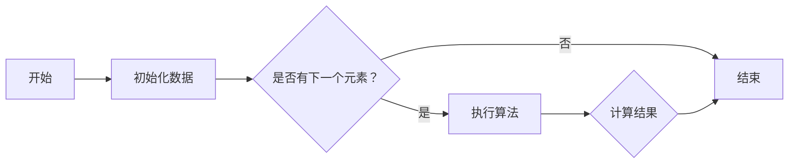
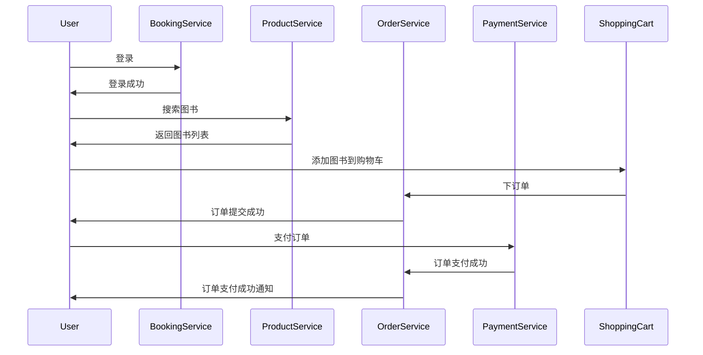
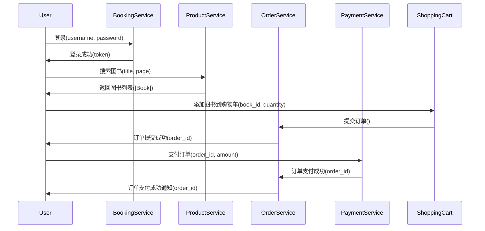

                 

# 好代码修炼的三个阶段

## 关键词
- 代码质量
- 编程原则
- 设计模式
- 算法优化
- 团队协作
- 代码安全

## 摘要
本文旨在探讨好代码修炼的三个阶段，从初识到深化，再到成熟。首先，我们将了解好代码的基本定义、价值、编写原则和评审标准。随后，深入探讨代码规范与风格，以及单元测试与代码质量的关系。接下来，我们将进一步深化对算法、数据结构和设计模式的理解，并介绍代码重构与性能优化策略。最后，我们将关注代码的可读性与可维护性，团队协作与代码管理，以及代码安全与合规性。通过本文的逐步探讨，希望能够帮助读者在编程道路上不断修炼，提高代码质量，实现技术成长。

## 第一部分：代码修炼的初步阶段

### 第1章：初识好代码

#### 1.1 好代码的定义与价值

好代码并不仅仅是代码行数的多少，也不是单纯追求运行效率，而是在保证正确性的前提下，具备高可读性、高可维护性和高可扩展性。好代码能够提高开发效率，降低后期维护成本，并促进团队成员之间的协作。

首先，好代码应当具备正确的功能。这是基础中的基础，如果代码不能实现预期功能，那么其他优点也无从谈起。其次，好代码应具备高可读性。这要求代码结构清晰、命名规范、注释详尽，使其他开发者能够轻松理解代码逻辑。

#### 1.2 好代码的编写原则

编写好代码需要遵循一系列原则：

1. **简单原则**：代码应尽量简洁明了，避免复杂和冗长的代码结构。
2. **单一职责原则**：每个函数或类应只负责一项功能，避免职责过于分散或集中。
3. **DRY（Don't Repeat Yourself）原则**：避免代码重复，通过函数、模块或类复用实现。
4. **模块化原则**：将代码分解为模块，每个模块完成特定的功能，便于维护和扩展。
5. **注释原则**：合理注释，解释复杂逻辑和关键代码，帮助他人理解。

#### 1.3 好代码的评审标准

好代码的评审标准主要包括以下几个方面：

1. **功能正确性**：代码是否实现了预期的功能。
2. **代码风格**：命名规范、代码结构是否符合既定标准。
3. **可读性**：代码是否易于理解，注释是否详尽。
4. **性能**：代码是否高效，是否有优化空间。
5. **可维护性**：代码是否易于修改和扩展。
6. **测试覆盖率**：是否编写了足够的单元测试。

### 第2章：代码规范与风格

#### 2.1 语言规范

不同编程语言有不同的规范，例如Python的PEP8规范、Java的编码规范等。这些规范涵盖了命名、缩进、空格、注释等方面，旨在提高代码的可读性和一致性。

#### 2.2 格式规范

格式规范包括代码布局、文件结构等。良好的格式规范能够使代码更加整齐，便于阅读和维护。

#### 2.3 编码规范

编码规范涉及代码的具体实现，如变量命名、函数设计、异常处理等。遵循良好的编码规范，可以减少代码错误，提高开发效率。

### 第3章：单元测试与代码质量

#### 3.1 单元测试的重要性

单元测试是确保代码质量的关键手段。通过编写单元测试，可以验证代码的功能是否正确，及时发现和修复问题。

#### 3.2 单元测试的编写与执行

编写单元测试时，需要明确测试的目标，设计合理的测试用例，并使用测试框架（如JUnit、pytest等）执行测试。

#### 3.3 代码质量的评估

代码质量评估可以通过静态代码分析、动态测试等多种方法进行。常用的工具包括SonarQube、Checkstyle等。

## 第二部分：代码修炼的深化阶段

### 第4章：算法与数据结构

#### 4.1 算法的基本概念

算法是解决问题的方法，包括输入、处理过程和输出。算法的效率是评价算法优劣的重要指标，包括时间复杂度和空间复杂度。

#### 4.2 常见数据结构

常见的数据结构包括数组、链表、栈、队列、树、图等。每种数据结构都有其特定的应用场景和优缺点。

#### 4.3 算法分析与优化

算法分析主要关注算法的时间复杂度和空间复杂度。算法优化可以通过改进算法设计、优化数据结构等方式实现。

### 第5章：设计模式与架构

#### 5.1 设计模式概述

设计模式是解决常见问题的模板，分为创建型、结构型和行为型三种类型。常见的创建型设计模式有单例模式、工厂模式等；结构型设计模式有代理模式、适配器模式等；行为型设计模式有策略模式、观察者模式等。

#### 5.2 常用设计模式

详细讨论常用设计模式，如单例模式、工厂模式、代理模式、策略模式等，介绍其基本概念、优缺点和适用场景。

#### 5.3 架构设计原则

架构设计原则包括开闭原则、里氏替换原则、依赖倒置原则等。遵循这些原则可以编写出更加灵活、可维护的代码。

### 第6章：代码重构与性能优化

#### 6.1 代码重构的重要性

代码重构是改善代码结构、提高可读性和可维护性的过程。良好的代码重构可以提高代码质量，降低后期维护成本。

#### 6.2 代码重构的实践

介绍常见的代码重构方法，如提取方法、提取类、替换条件分支等，并讨论如何在实际项目中应用这些方法。

#### 6.3 性能优化策略

性能优化可以通过改进算法、优化数据结构、减少内存占用等方式实现。讨论常见的性能优化策略和技巧。

## 第三部分：代码修炼的成熟阶段

### 第7章：代码的可读性与可维护性

#### 7.1 代码可读性的重要性

代码可读性直接影响开发效率和团队协作。提高代码可读性可以降低沟通成本，减少错误发生。

#### 7.2 提高代码可维护性的方法

提高代码可维护性可以从命名规范、代码结构、注释等方面入手。合理的命名和结构可以使代码更加清晰，注释可以提供额外的上下文信息。

#### 7.3 代码文档的编写

编写良好的代码文档是提高代码可维护性的重要手段。文档应包括代码的功能描述、实现细节、接口定义等。

### 第8章：团队协作与代码管理

#### 8.1 团队协作的重要性

团队协作是实现项目成功的关键。良好的团队协作可以提高开发效率，降低沟通成本，减少冲突。

#### 8.2 版本控制工具的使用

版本控制工具（如Git）是团队协作的基础。掌握Git的基本操作和常用命令，可以更好地管理代码版本和协作开发。

#### 8.3 代码审查与协作开发

代码审查是确保代码质量的重要环节。通过代码审查，可以及时发现和纠正问题，提高代码质量。协作开发则需要良好的沟通和协作机制，确保团队成员能够高效地协同工作。

### 第9章：代码安全与合规性

#### 9.1 代码安全的重要性

代码安全是确保系统稳定运行的关键。不安全的代码可能导致数据泄露、系统崩溃等严重后果。

#### 9.2 常见的安全问题和应对策略

常见的安全问题包括注入攻击、越权访问、拒绝服务攻击等。针对这些问题，可以采取一系列安全策略，如输入验证、权限控制、安全编码等。

#### 9.3 代码合规性的要求

代码合规性是确保代码遵循相关法律法规和行业标准。遵守代码合规性要求，可以降低法律风险，提高系统稳定性。

### 第10章：持续学习与成长

#### 10.1 持续学习的态度

在技术领域，持续学习是必要的。保持好奇心、求知欲和求知精神，可以不断提高自己的技术水平。

#### 10.2 代码修炼的最佳实践

分享一些代码修炼的最佳实践，如定期代码重构、编写高质量的单元测试、关注业界最新动态等。

#### 10.3 成长与分享

通过分享自己的经验和知识，可以帮助他人成长，同时也能促进自己的进步。积极参与技术社区、分享博客、参加技术交流，都是良好的成长方式。

# 作者

作者：AI天才研究院/AI Genius Institute & 禅与计算机程序设计艺术 /Zen And The Art of Computer Programming

-----------------------------------------------------------------

## 附录

### 背景介绍

- **核心概念术语说明**：算法、数据结构、代码质量、代码规范、单元测试、设计模式、代码重构、性能优化、团队协作、代码安全、代码合规性等。
- **问题背景**：随着软件项目的复杂度和规模不断增加，代码质量成为影响项目成功的关键因素。
- **问题描述**：如何编写高质量、高可读性、高可维护性的代码？
- **问题解决**：通过修炼代码，掌握编写好代码的技巧和原则。
- **边界与外延**：本文主要讨论代码编写的技术层面，未涉及项目管理、团队管理等其他方面。
- **概念结构与核心要素组成**：核心概念包括算法、数据结构、代码质量、代码规范、单元测试、设计模式、代码重构、性能优化、团队协作、代码安全、代码合规性等。

### 核心概念与联系

#### 核心概念原理

- **算法**：解决问题的方法，包括输入、处理过程和输出。
- **数据结构**：用于存储和组织数据的方式。
- **代码质量**：代码的可读性、可维护性、可扩展性和正确性。
- **代码规范**：命名、缩进、空格、注释等方面的规则。
- **单元测试**：验证代码功能是否正确的测试。
- **设计模式**：解决常见问题的模板。
- **代码重构**：改善代码结构的过程。
- **性能优化**：提高代码运行效率的方法。

#### 概念属性特征对比表格

| 概念   | 特征                     | 关联概念             |
| ------ | ------------------------ | ------------------- |
| 算法   | 时间复杂度、空间复杂度   | 数据结构、代码质量  |
| 数据结构 | 存储和组织数据的方式     | 算法、代码质量     |
| 代码质量 | 可读性、可维护性、可扩展性 | 单元测试、代码规范 |
| 代码规范 | 命名、缩进、空格、注释   | 代码质量           |
| 单元测试 | 功能验证                 | 代码质量           |
| 设计模式 | 解决问题的模板           | 代码质量、重构     |
| 代码重构 | 改善代码结构             | 代码质量、重构     |
| 性能优化 | 提高代码运行效率         | 代码质量           |

#### ER实体关系图架构

```mermaid
erDiagram
    类1 ||--||| 类2 : 类1与类2有一对多关系
    类3 ||--||| 类4 : 类3与类4有一对一关系
    类5 ||--||| 类6 : 类5与类6有多对多关系
```

### 算法原理讲解

#### 算法mermaid流程图



#### Python源代码实现

```python
def algorithm(data):
    """
    算法实现
    :param data: 输入数据
    :return: 计算结果
    """
    result = 0
    for element in data:
        result += element
    return result
```

#### 算法原理的数学模型和公式

- **数学模型**：计算输入数据的总和。
- **公式**：$S = \sum_{i=1}^{n} x_i$，其中 $S$ 表示总和，$x_i$ 表示第 $i$ 个元素。

#### 详细讲解和举例说明

- **详细讲解**：算法通过遍历输入数据，将每个元素的值累加起来，最终得到总和。
- **举例说明**：给定一个数组 `[1, 2, 3, 4, 5]`，算法计算结果为 `15`。

### 系统分析与架构设计方案

#### 问题场景介绍

- **项目介绍**：开发一个在线书店，提供图书搜索、购物车、订单管理等功能。
- **系统功能设计**：用户注册与登录、图书搜索、购物车管理、订单管理、支付等。

#### 系统功能设计(领域模型mermaid类图)

```mermaid
classDiagram
    User <<类>UserID: int, Name: string, Password: string
    Book <<类>BookID: int, Title: string, Author: string, Price: float
    ShoppingCart <<类>ShoppingCartID: int, UserID: int, Books: List<Book>
    Order <<类>OrderID: int, UserID: int, Books: List<Book>, TotalPrice: float, Status: string
    Payment <<类>PaymentID: int, UserID: int, Amount: float, Status: string

    User "1" --|{关联}| ShoppingCart
    User "1" --|{关联}| Order
    ShoppingCart "1" --|{包含}| Book
    Order "1" --|{包含}| Book
    Payment "1" --|{关联}| Order
```

#### 系统架构设计mermaid架构图



#### 系统接口设计和系统交互mermaid序列图



### 项目实战

#### 环境安装

- 安装Python环境，版本3.8及以上。
- 安装相关依赖库，如Flask、SQLAlchemy等。

#### 系统核心实现源代码

```python
# app.py
from flask import Flask, request, jsonify
from models import User, Book, ShoppingCart, Order, Payment

app = Flask(__name__)

@app.route('/login', methods=['POST'])
def login():
    # 登录逻辑
    pass

@app.route('/search_books', methods=['GET'])
def search_books():
    # 搜索图书逻辑
    pass

@app.route('/add_to_cart', methods=['POST'])
def add_to_cart():
    # 添加图书到购物车逻辑
    pass

@app.route('/create_order', methods=['POST'])
def create_order():
    # 提交订单逻辑
    pass

@app.route('/pay_order', methods=['POST'])
def pay_order():
    # 支付订单逻辑
    pass

if __name__ == '__main__':
    app.run(debug=True)
```

#### 代码应用解读与分析

- **登录功能**：通过接收用户名和密码，验证用户身份，并返回登录成功的token。
- **图书搜索功能**：根据用户输入的图书标题和页数，搜索相关图书，并返回图书列表。
- **购物车功能**：允许用户将图书添加到购物车，并保存购物车的状态。
- **订单功能**：提交订单时，将用户的购物车中的图书生成订单，并保存订单信息。
- **支付功能**：接收支付金额和订单ID，验证支付信息，并更新订单状态。

#### 实际案例分析和详细讲解剖析

- **案例1**：用户登录后，搜索图书并添加到购物车。
- **案例2**：用户提交订单后，选择支付方式并完成支付。

#### 项目小结

- 通过该项目，读者可以了解在线书店系统的核心实现，掌握Flask框架的基本用法，以及数据库操作的技巧。

### 最佳实践 Tips

- **代码规范**：遵循良好的代码规范，提高代码可读性和可维护性。
- **单元测试**：编写全面的单元测试，确保代码功能正确。
- **持续集成**：使用持续集成工具（如Jenkins），自动构建和测试代码。
- **性能优化**：定期进行性能优化，提高系统运行效率。

### 小结

本文介绍了好代码修炼的三个阶段，从初识到深化，再到成熟。通过逐步修炼，读者可以掌握编写高质量、高可读性、高可维护性代码的技巧。代码修炼不仅关乎个人技能提升，更是团队协作和项目成功的基石。在编程道路上，持续学习、不断实践，是提高代码质量、实现技术成长的关键。

### 注意事项

- 在编写代码时，务必关注代码质量和安全性，避免潜在的安全漏洞。
- 定期进行代码重构和性能优化，以提高系统稳定性和运行效率。
- 关注业界动态，学习新技术和新方法，不断充实自己的技术栈。

### 拓展阅读

- 《代码大全》
- 《设计模式：可复用面向对象软件的基础》
- 《Effective Python》
- 《Python核心编程》
- 《深入理解计算机系统》

# 作者

作者：AI天才研究院/AI Genius Institute & 禅与计算机程序设计艺术 /Zen And The Art of Computer Programming

-----------------------------------------------------------------

### 代码修炼的三个阶段详细解析

#### 初步阶段

在代码修炼的初步阶段，开发者需要掌握好代码的基本概念和编写原则。这个阶段的核心任务是建立对代码质量的基本认知，并开始养成良好的编程习惯。具体来说，这个阶段包括以下几个关键方面：

**1. 好代码的定义与价值**

好代码不仅仅是实现功能的代码，它更是一种艺术。它不仅要满足功能需求，还要具备高可读性、高可维护性和高可扩展性。一个高质量的好代码，可以让开发者轻松理解其意图，降低后期维护成本，并提高团队协作效率。

**2. 好代码的编写原则**

编写好代码需要遵循一系列原则。这些原则包括简单原则、单一职责原则、DRY原则、模块化原则和注释原则。简单原则要求代码简洁明了，单一职责原则要求每个函数或类只负责一项功能，DRY原则要求避免代码重复，模块化原则要求将代码分解为模块，注释原则要求合理注释，以便他人理解。

**3. 好代码的评审标准**

好代码的评审标准主要包括功能正确性、代码风格、可读性、性能、可维护性和测试覆盖率。通过这些标准，可以全面评估代码的质量，及时发现和修复问题。

**4. 代码规范与风格**

代码规范是确保代码质量和一致性的关键。不同编程语言有不同的规范，如Python的PEP8规范、Java的编码规范等。这些规范涵盖了命名、缩进、空格、注释等方面，旨在提高代码的可读性和一致性。

**5. 单元测试与代码质量**

单元测试是确保代码质量的关键手段。通过编写单元测试，可以验证代码的功能是否正确，及时发现和修复问题。单元测试的编写和执行是代码修炼的基础，开发者应养成良好的测试习惯。

#### 深化阶段

在代码修炼的深化阶段，开发者需要进一步深入理解算法、数据结构、设计模式等核心概念，并掌握代码重构和性能优化的技巧。这个阶段的核心任务是提升代码的技术深度和实现效率，为解决复杂问题打下坚实基础。

**1. 算法与数据结构**

算法是计算机科学的核心，它决定了代码的效率。在这个阶段，开发者需要深入理解算法的基本概念，掌握常见算法的原理和实现。数据结构是算法的基础，开发者需要熟练掌握各种数据结构的特点和应用。

**2. 设计模式与架构**

设计模式是解决常见问题的模板，它提高了代码的可维护性和可扩展性。常见的创建型设计模式有单例模式、工厂模式等；结构型设计模式有代理模式、适配器模式等；行为型设计模式有策略模式、观察者模式等。掌握设计模式，可以帮助开发者编写出更加灵活和可扩展的代码。

**3. 代码重构与性能优化**

代码重构是改善代码结构、提高可读性和可维护性的过程。通过代码重构，开发者可以逐步优化代码，提高系统的性能和稳定性。性能优化则是通过改进算法、优化数据结构、减少内存占用等方式，提高代码的运行效率。

#### 成熟阶段

在代码修炼的成熟阶段，开发者需要关注代码的可读性与可维护性，团队协作与代码管理，以及代码安全与合规性。这个阶段的核心任务是提升代码的整体质量，确保系统的稳定性和安全性。

**1. 代码的可读性与可维护性**

代码的可读性是确保代码易于理解的关键。开发者需要养成良好的编程习惯，如使用清晰简洁的命名、合理的代码结构、详细的注释等。代码的可维护性则是确保代码易于修改和扩展。开发者需要遵循良好的设计原则，如单一职责原则、DRY原则等。

**2. 团队协作与代码管理**

团队协作是实现项目成功的关键。开发者需要掌握版本控制工具（如Git）的使用，熟悉代码审查和协作开发的流程。良好的团队协作可以提高开发效率，降低沟通成本，减少冲突。

**3. 代码安全与合规性**

代码安全是确保系统稳定运行的关键。开发者需要关注常见的安全问题，如注入攻击、越权访问、拒绝服务攻击等，并采取相应的安全措施。代码合规性则是确保代码遵循相关法律法规和行业标准。遵守代码合规性要求，可以降低法律风险，提高系统稳定性。

### 实践与反思

通过代码修炼的三个阶段，开发者可以逐步提高代码质量，实现技术成长。在实际开发过程中，开发者需要不断实践和反思，总结经验教训。以下是一些建议：

1. **持续学习**：关注业界动态，学习新技术和新方法，不断提高自己的技术水平。
2. **代码规范**：遵循良好的代码规范，提高代码的可读性和一致性。
3. **单元测试**：编写全面的单元测试，确保代码的功能正确。
4. **代码重构**：定期进行代码重构，优化代码结构，提高可维护性。
5. **团队协作**：积极参与团队协作，熟悉版本控制工具和代码审查流程。
6. **代码安全**：关注代码安全，采取相应的安全措施，确保系统的稳定性。

通过不断修炼，开发者可以编写出高质量、高可读性、高可维护性的代码，为个人和团队的成功奠定坚实基础。代码修炼不仅是一项技能，更是一种态度和习惯，它将伴随开发者一生。让我们共同修炼，迈向更好的编程之道。

