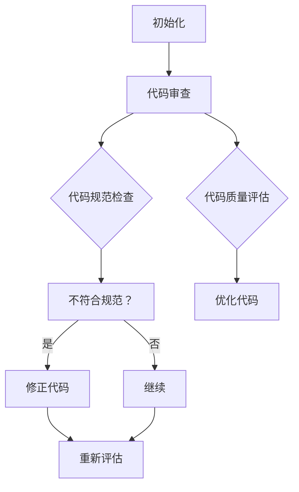
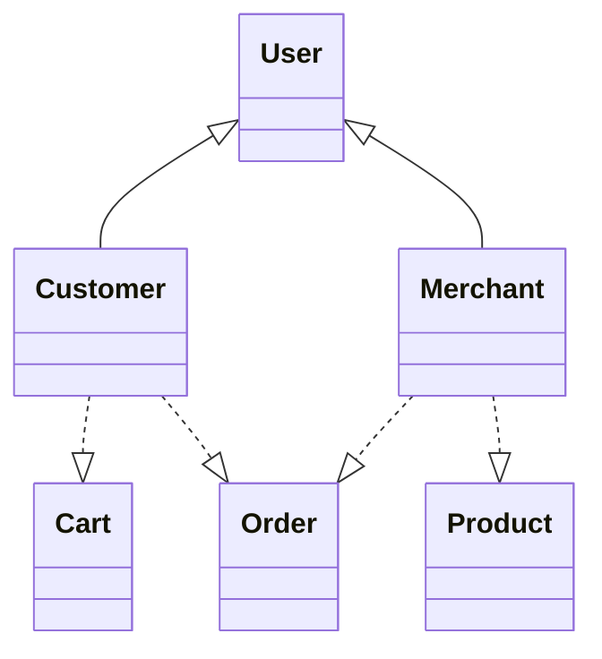
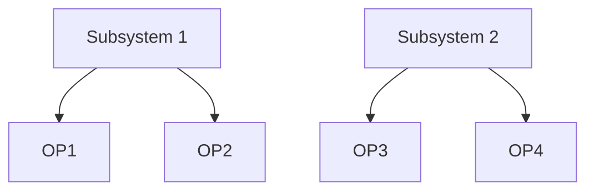
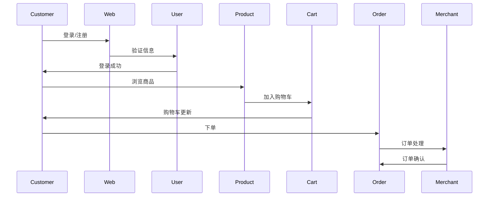
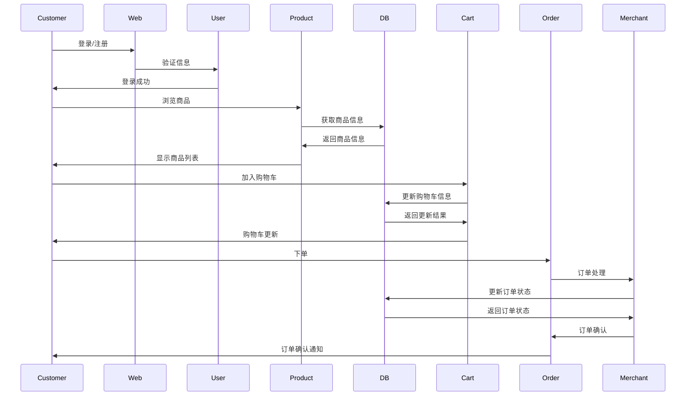

                 

# 好代码先过自己这关

关键词：好代码、代码质量、编程习惯、自动化工具、代码规范

摘要：
本文旨在探讨如何编写高质量代码，强调编写好代码的重要性以及实现这一目标的关键步骤。通过分析代码质量的核心要素，介绍了一套系统化的方法，包括代码规范、自动化工具和良好的编程习惯，帮助开发者提升代码质量，确保代码的可读性、可维护性和可扩展性。

## 引言背景

### 问题背景
在信息技术飞速发展的今天，软件工程面临着前所未有的挑战和机遇。随着云计算、大数据、物联网、人工智能等技术的不断进步，软件开发的方式和理念也在不断演进。传统的软件1.0时代，软件开发注重的是功能的完备和代码的效率。然而，随着软件系统的复杂性和规模日益增加，仅仅依靠传统的开发方式已经无法满足现代软件工程的需求。

### 问题描述
软件开发过程中，代码质量直接影响到软件系统的稳定性、可维护性和开发效率。在软件1.0时代，代码质量往往依赖于开发者的个人经验和编程技巧，导致代码质量参差不齐，甚至存在安全隐患。为了解决这一问题，软件工程领域提出了“好代码”的概念，强调代码的可读性、可维护性和可扩展性。

### 问题解决
为了提升代码质量，我们需要从多个方面入手。首先，需要建立起一套完善的代码规范，确保开发者在编写代码时遵循统一的标准。其次，需要引入自动化工具来检测和修复代码中的问题。此外，还需要开发人员具备良好的编程习惯和技能。

### 边界与外延
“好代码”不仅仅是指代码的语法正确，还包括代码的可读性、可维护性、可扩展性、性能和安全性等方面。同时，好代码也不仅仅适用于软件开发，还可以应用于其他需要代码编写的领域，如网站开发、移动应用开发等。

### 概念结构与核心要素组成
好代码的核心要素包括：代码规范、自动化工具、编程习惯和技能。其中，代码规范是基础，自动化工具是辅助，编程习惯和技能是关键。

## 核心概念与联系

### 好代码的定义与特点
好代码指的是具备高质量、高可读性、高可维护性和高可扩展性的代码。具体包括以下几个方面：

1. **可读性**：代码应易于理解和阅读，避免冗长和复杂的逻辑。
2. **可维护性**：代码应易于修改和维护，方便后续的开发工作。
3. **可扩展性**：代码应具备良好的扩展性，能够方便地增加新功能或修改现有功能。
4. **性能**：代码应具有良好的性能，确保软件系统的响应速度和效率。
5. **安全性**：代码应具备一定的安全性，避免潜在的安全漏洞。

### 好代码与传统代码的区别
传统代码可能存在以下问题：

1. **代码冗长**：代码过于冗长，难以维护和理解。
2. **逻辑复杂**：代码逻辑过于复杂，难以跟踪和理解。
3. **缺乏注释**：代码缺乏必要的注释，难以理解代码的功能和目的。
4. **不遵循规范**：代码没有遵循统一的代码规范，难以协同工作。

### 好代码的核心要素对比表格

| 核心要素 | 传统代码 | 好代码 |
| --- | --- | --- |
| **可读性** | 代码冗长，逻辑复杂 | 代码简洁，逻辑清晰 |
| **可维护性** | 难以修改和维护 | 易于修改和维护 |
| **可扩展性** | 缺乏扩展性 | 具有良好的扩展性 |
| **性能** | 性能不佳 | 性能良好 |
| **安全性** | 存在安全漏洞 | 安全性高 |

### ER实体关系图架构

```mermaid
erDiagram
    Developer ||--|> Code : writes
    Code ||--|> Bug : contains
    Code ||--|> Test : passed
    Code ||--|> Performance : optimized
    Code ||--|> Security : ensured
```

## 算法原理讲解

### 算法简介
在“好代码先过自己这关”中，我们将介绍一系列提升代码质量的算法和工具。这些算法和工具旨在帮助开发者编写出高质量、高可读性、高可维护性的代码。

### 算法流程图



### 算法详细解释

#### 1. 初始化
初始化阶段主要是设置代码审查的参数和基础环境。

#### 2. 代码审查
代码审查是整个流程的起点，开发者需要对代码进行初步的检查和评估，确保代码遵循了基本的编码规范。

#### 3. 代码规范检查
此阶段会检查代码是否遵循了规定的编码规范，如命名规则、代码结构、注释等。

#### 4. 代码质量评估
评估代码的可读性、可维护性、可扩展性、性能和安全性等方面的质量。

#### 5. 优化代码
根据代码质量评估的结果，对代码进行优化，提升其性能和安全性。

#### 6. 修正代码
如果代码不符合规范，需要开发者进行修正，确保代码的质量。

#### 7. 重新评估
修正后的代码需要重新进行质量评估，确保问题得到解决。

#### 8. 继续流程
如果代码符合规范且质量良好，可以继续进行后续的开发工作。

### 数学模型和公式
在代码质量评估中，我们可以使用一些数学模型和公式来量化代码的质量。

#### 可读性指标
$$\text{Readability} = \frac{\text{Comments}}{\text{Total Lines}}$$

#### 可维护性指标
$$\text{Maintainability} = \frac{\text{Lines of Code}}{\text{Number of Errors}}$$

#### 可扩展性指标
$$\text{Extensibility} = \frac{\text{New Features}}{\text{Total Features}}$$

### Python 源代码示例
下面是一个简单的 Python 示例，用于评估代码的质量。

```python
def code_quality评估(code):
    comments = code.count('#')
    total_lines = len(code.splitlines())
    readability = comments / total_lines
    
    lines_of_code = code.count('def') + code.count('class') + code.count('if')
    errors = count_errors_in_code(code)
    maintainability = lines_of_code / errors
    
    new_features = count_new_features_in_code(code)
    total_features = count_total_features_in_code(code)
    extensibility = new_features / total_features
    
    return readability, maintainability, extensibility
```

## 系统分析与架构设计方案

### 问题场景介绍
假设我们正在开发一个在线购物系统，该系统需要处理用户注册、商品浏览、购物车管理和订单处理等功能。

### 项目介绍
项目名称：在线购物系统
开发语言：Python
框架：Django
数据库：PostgreSQL

### 系统功能设计 (领域模型类图)



### 系统架构设计 (架构图)



### 系统接口设计 (接口图)



### 系统交互 (序列图)



## 项目实战

### 环境安装
在开始项目实战之前，需要安装 Python、Django 和 PostgreSQL。以下是具体的安装步骤：

1. 安装 Python 3.8 或更高版本。
2. 安装 Django：`pip install django`
3. 安装 PostgreSQL：`pip install psycopg2`

### 系统核心实现源代码
以下是系统核心实现的一部分源代码。

```python
# models.py
from django.db import models

class User(models.Model):
    username = models.CharField(max_length=150)
    password = models.CharField(max_length=150)

class Customer(models.Model):
    user = models.OneToOneField(User, on_delete=models.CASCADE)
    address = models.CharField(max_length=150)

class Merchant(models.Model):
    user = models.OneToOneField(User, on_delete=models.CASCADE)
    name = models.CharField(max_length=150)

class Product(models.Model):
    merchant = models.ForeignKey(Merchant, on_delete=models.CASCADE)
    name = models.CharField(max_length=150)
    price = models.DecimalField(max_digits=6, decimal_places=2)

class Cart(models.Model):
    customer = models.OneToOneField(Customer, on_delete=models.CASCADE)
    products = models.ManyToManyField(Product)

class Order(models.Model):
    customer = models.ForeignKey(Customer, on_delete=models.CASCADE)
    merchant = models.ForeignKey(Merchant, on_delete=models.CASCADE)
    total_price = models.DecimalField(max_digits=6, decimal_places=2)
    status = models.CharField(max_length=150)
```

### 代码应用解读与分析
以上代码定义了在线购物系统中的核心模型，包括用户、客户、商家、产品、购物车和订单。这些模型通过外键关系相互关联，实现了系统的主要功能。

### 实际案例分析和详细讲解剖析
假设一个客户在浏览商品后，将某个商品添加到购物车，然后下单购买。

1. 客户浏览商品，获取商品信息。
2. 客户将商品添加到购物车。
3. 客户下单，系统计算订单总价。
4. 商家接收订单，更新订单状态。
5. 客户收到订单确认通知。

通过以上步骤，系统实现了商品浏览、购物车管理和订单处理等功能。

### 项目小结
通过本项目的实战，我们了解了如何使用 Django 框架和 PostgreSQL 数据库构建一个在线购物系统。项目实战部分展示了系统的核心实现，并通过实际案例分析了系统的运行过程。在项目实践中，我们强调了代码质量的重要性，并通过代码规范、自动化工具和良好的编程习惯来确保代码的质量。

## 最佳实践 tips

1. **代码规范**：始终遵循统一的代码规范，确保代码的可读性和一致性。
2. **注释**：为代码添加必要的注释，解释复杂逻辑和关键部分。
3. **自动化工具**：使用自动化工具进行代码审查和测试，提高代码质量。
4. **持续集成**：使用持续集成工具，自动化构建和测试代码，确保代码质量。
5. **代码重构**：定期进行代码重构，优化代码结构，提高可维护性。

## 小结与注意事项

本文通过分析代码质量的核心要素，介绍了一套系统化的方法，帮助开发者编写高质量代码。在项目实战中，我们看到了如何将理论应用于实践。编写好代码不仅能够提高开发效率，还能够降低维护成本，是软件开发中不可或缺的一环。

注意事项：

1. 在编写代码时，务必遵循良好的编程习惯。
2. 定期进行代码审查和测试，及时发现和修复问题。
3. 避免过度优化，确保代码的可读性和可维护性。

## 拓展阅读

1. 《代码大全》（Code Complete） - 史蒂夫·迈克康奈尔（Steve McConnell）
2. 《编写可读代码的艺术》（Beautiful Code） - 阿尔伯特·林（Albert L. Lin）
3. 《持续集成：实践指南》（Continuous Integration: Effective Software Project Management） - 菲利普·史蒂文斯（Philippe A. thervent）

## 作者

作者：AI天才研究院/AI Genius Institute & 禅与计算机程序设计艺术 /Zen And The Art of Computer Programming

