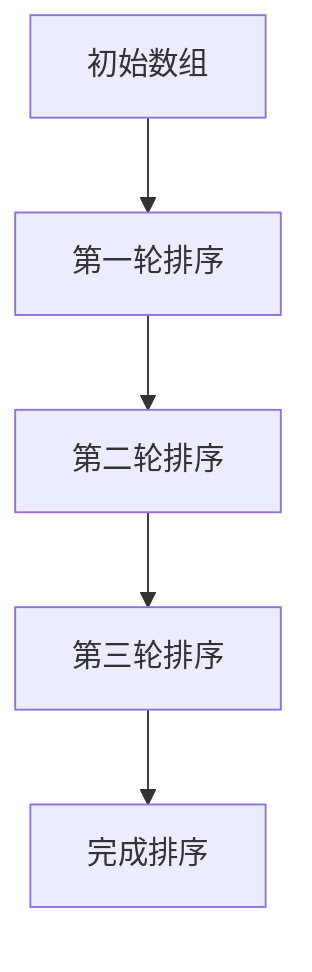
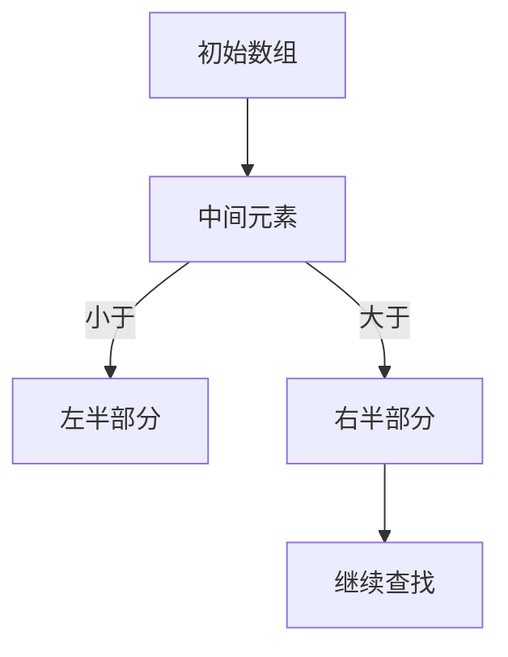
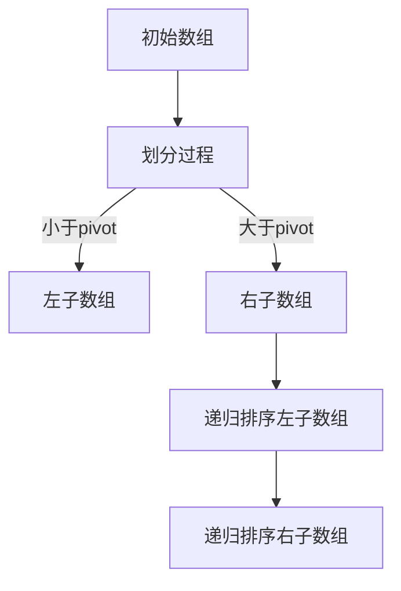
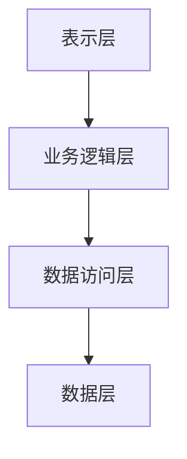
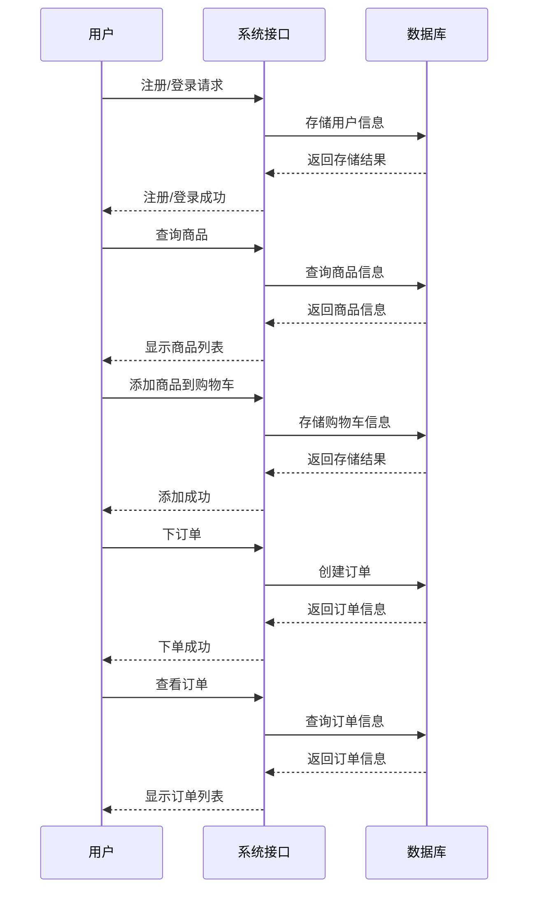

                 

## 好代码的标准是'一眼看到底'

> 关键词：代码质量、可读性、设计原则、编程最佳实践

> 摘要：本文深入探讨了“好代码的标准是'一眼看到底'”这一主题。首先，我们定义了什么是“一眼看到底”，然后通过逐步分析代码的各个方面，探讨了如何实现这一标准。文章从编程基础到高级设计原则，再到具体的编码实践和最佳实践，提供了一系列实用的方法和建议，帮助程序员编写出高质量、易维护的代码。

## 引言

在软件工程中，代码质量是衡量软件优劣的重要标准之一。一个优秀的程序员不仅仅是能够写出功能完整的代码，更重要的是能够编写出易于理解、维护和扩展的代码。在众多关于代码质量的讨论中，“好代码的标准是'一眼看到底'”这一理念逐渐被广泛接受。那么，什么是“一眼看到底”，又如何实现这一标准呢？本文将围绕这一主题，从多个角度进行深入探讨。

## 什么是“一眼看到底”

“一眼看到底”是对代码可读性的高度概括。具体来说，它包含以下几个层次：

1. **代码结构清晰**：代码的层次结构要一目了然，每个模块、函数和类的职责明确，职责间的关系简单易懂。
2. **逻辑简洁**：代码的执行逻辑应该直接、简单，避免复杂的嵌套和冗余代码。
3. **意图明显**：代码中的每个语句、变量、函数等都应该有清晰的意图和命名，让人一看就知道其作用。
4. **注释适量**：适量的注释能够帮助读者更好地理解代码的功能和实现细节，但过量的注释会降低代码的可读性。

## 实现标准：编程基础与原则

### 1. 编程基础

**变量和数据类型**：合理选择和使用数据类型，确保变量命名具有描述性，有助于理解变量代表的含义。

**控制结构**：熟练掌握条件判断和循环结构，避免不必要的复杂逻辑。

**函数与模块**：使用函数和模块进行代码组织，确保每个模块和函数的职责单一，易于理解和维护。

### 2. 算法与数据结构

**算法基础**：理解基本算法和数据分析方法，能够根据实际需求选择合适的算法。

**常用数据结构**：掌握常见数据结构（如数组、链表、树、图等）的原理和适用场景，能够在代码中合理使用。

### 3. 设计原则

**单一职责原则**：每个模块、函数和类都应该只负责一项任务，这样可以减少耦合，提高代码的可维护性。

**开放封闭原则**：软件实体（如类、模块、函数等）应该对扩展开放，对修改封闭，这意味着在扩展功能时，不应修改原有代码。

**里氏替换原则**：任何基类可以出现的地方，子类一定可以出现，这确保了代码的灵活性和可扩展性。

**接口隔离原则**：保持接口的精简，只让实现类依赖必要的接口，降低模块间的耦合。

**依赖倒置原则**：高层模块不应依赖于低层模块，二者都应依赖于抽象，抽象不应依赖于细节，细节应依赖于抽象。

## 实现标准：代码实践

### 1. 编码实践

**代码规范**：遵循统一的代码规范，确保代码风格一致，提高可读性。

**代码审查**：定期进行代码审查，通过团队协作提高代码质量。

**代码复用**：合理复用代码，避免重复编写相同的逻辑。

**软件测试**：编写单元测试和集成测试，确保代码的稳定性和可靠性。

### 2. 最佳实践

**模块化编程**：将代码拆分成多个模块，每个模块负责一个特定的功能，便于理解和维护。

**设计模式**：合理使用设计模式，提高代码的结构性和可维护性。

**持续集成**：采用持续集成工具，自动化测试和构建，确保代码质量。

**代码优化**：定期对代码进行性能优化，提高代码的执行效率。

## 实现标准：工具与资源

**代码编辑器**：选择适合自己的代码编辑器，配置合适的插件和快捷键，提高编码效率。

**版本控制系统**：熟练使用版本控制系统（如Git），确保代码的安全性和版本管理。

**学习资源**：利用在线编程平台、编程社区和书籍等资源，不断学习和提升编程技能。

## 实现标准：编程思维与问题解决

**编程思维**：培养编程思维，善于将问题分解，理解逻辑关系，形成系统化的解决方案。

**问题解决**：掌握需求分析、设计方案、编码实现、测试与调试等环节，确保代码质量。

## 结束语

编写高质量的代码是一项长期且持续的任务，需要程序员不断学习和实践。通过本文的探讨，我们了解到“好代码的标准是'一眼看到底'”不仅是一种理念，更是一种实践。只有通过不断地积累经验和反思，才能编写出真正优秀的代码。

作者：AI天才研究院/AI Genius Institute & 禅与计算机程序设计艺术 /Zen And The Art of Computer Programming

----------------------------------------------------------------

### 关键词：代码质量、编程原则、编程实践、编程工具、编程思维

### 摘要：本文深入探讨了“好代码的标准是'一眼看到底'”这一理念，通过介绍编程基础、设计原则、编程实践和最佳实践，帮助程序员编写出高质量、易维护的代码。文章结构紧凑、逻辑清晰，适合广大程序员阅读和学习。

----------------------------------------------------------------

## 第一部分：编程基础

### 第1章：编程基础入门

#### 1.1 编程概述

编程是计算机科学的核心领域，它涉及编写、调试和优化计算机程序，以实现特定的功能。编程的重要性在于，它使计算机能够执行人类制定的指令，从而解决各种复杂问题。编程语言种类繁多，根据其用途和特点可分为多种类别，如高级语言、低级语言和脚本语言等。

#### 1.1.1 编程的定义和重要性

编程是一种创造性的过程，通过编写代码来解决实际问题。在现代社会，计算机已经成为不可或缺的工具，编程的重要性体现在以下几个方面：

1. **技术创新**：编程是推动技术创新的重要力量，新的软件、系统和应用程序不断涌现，改变了我们的生活方式和工作方式。
2. **数据处理**：随着大数据时代的到来，编程在处理海量数据、分析和提取有价值信息方面发挥着重要作用。
3. **行业需求**：几乎所有的行业都需要编程技能，从金融、医疗到娱乐、教育，编程都是不可或缺的。

#### 1.1.2 编程语言分类

编程语言的分类可以根据其用途和特点进行。以下是几种常见的编程语言分类：

1. **高级语言**：高级语言（如Python、Java、C++）更接近人类的自然语言，易于理解和编写，编译或解释成机器语言执行。
2. **低级语言**：低级语言（如汇编语言）更接近机器语言，直接与硬件交互，但编写复杂且难以维护。
3. **脚本语言**：脚本语言（如JavaScript、PHP）通常用于网页开发和自动化任务，通过解释器执行。

#### 1.1.3 编程学习路线

初学者可以从以下步骤开始学习编程：

1. **选择一门语言**：根据兴趣和需求选择一门编程语言，如Python或Java。
2. **学习基础知识**：掌握变量、数据类型、控制结构、函数和基本算法。
3. **实践项目**：通过实际项目来巩固所学知识，如编写简单的网页、数据处理脚本等。
4. **深入理解**：深入学习高级主题，如数据结构、算法优化、设计模式等。
5. **持续学习**：跟进最新的编程技术和工具，持续提升自己的编程能力。

### 1.2 变量和数据类型

变量是编程中的核心概念，用于存储数据。数据类型定义了数据的种类和结构，常见的有整数、浮点数、字符串和布尔值等。

#### 1.2.1 变量的概念和作用

变量是编程语言中表示数据的符号，通过变量名来引用存储在内存中的数据。变量的主要作用包括：

1. **存储数据**：变量可以存储任何类型的数据，如数值、字符串和布尔值。
2. **控制流程**：变量用于控制程序的执行流程，如循环和条件判断。
3. **数据传递**：变量在函数间传递数据，实现模块化和代码复用。

#### 1.2.2 数据类型及其特点

以下是一些常见的数据类型及其特点：

1. **整数（int）**：整数是不带小数的数值，适用于数学运算。
2. **浮点数（float）**：浮点数是带有小数的数值，用于科学计算和工程应用。
3. **字符串（string）**：字符串是由字符组成的序列，用于表示文本信息。
4. **布尔值（bool）**：布尔值只有两个取值，True或False，用于逻辑判断。

#### 1.2.3 常用数据类型示例

以下是一个简单的Python代码示例，展示了常用数据类型的用法：

```python
# 整数示例
age = 25

# 浮点数示例
price = 19.99

# 字符串示例
name = "Alice"

# 布尔值示例
is_student = False
```

### 1.3 控制结构

控制结构用于控制程序的执行流程，常见的有顺序结构、选择结构和循环结构。

#### 1.3.1 顺序结构

顺序结构是程序中最基本的结构，按照编写的顺序执行代码。以下是一个简单的顺序结构示例：

```python
# 输出当前时间
print("当前时间是：", now())
```

#### 1.3.2 选择结构

选择结构用于根据条件执行不同的代码块，常见的有if-else语句和switch语句。

```python
# 判断年龄是否成年
age = 18
if age >= 18:
    print("你已经成年。")
else:
    print("你还未成年。")
```

#### 1.3.3 循环结构

循环结构用于重复执行一段代码，直到满足某个条件。常见的循环结构有for循环和while循环。

```python
# 打印1到10的数字
for i in range(1, 11):
    print(i)
```

### 1.4 函数与模块

函数是组织代码的基本单元，用于执行特定任务的代码块。模块是多个函数和类的集合，便于代码的管理和复用。

#### 1.4.1 函数的定义和作用

函数的定义格式如下：

```python
def function_name(parameters):
    # 函数体
    return result
```

函数的主要作用包括：

1. **代码复用**：将通用代码封装为函数，避免重复编写。
2. **模块化编程**：将程序分解为多个函数，提高代码的可维护性。
3. **代码组织**：函数用于组织代码，使程序结构更清晰。

#### 1.4.2 高阶函数和闭包

高阶函数是接受函数作为参数或返回函数的函数。闭包是函数和其环境组成的一个整体，环境包括函数定义时的局部变量。以下是一个简单的示例：

```python
# 高阶函数示例
def add(x, y):
    return x + y

# 闭包示例
def make_adder(a):
    return lambda b: a + b

adder = make_adder(5)
result = adder(3)
print(result)  # 输出 8
```

#### 1.4.3 模块与包

模块是Python中用于组织代码的基本单元，通常包含一个或多个函数、类和常量。包是模块的集合，用于组织相关的模块。

在Python中，模块和包的使用方法如下：

1. **模块**：将函数、类和常量定义在模块文件中，使用import语句导入模块。

```python
# 模块文件：math_utils.py
def square(x):
    return x * x

# 导入模块
import math_utils
result = math_utils.square(4)
print(result)  # 输出 16
```

2. **包**：将多个模块组织在一起，通常包含一个__init__.py文件。

```python
# 包文件结构
|- package_name
  |- __init__.py
  |- module1.py
  |- module2.py
```

## 第2章：算法与数据结构

算法是解决问题的步骤和策略，数据结构是组织和管理数据的方式。算法和数据结构密切相关，合适的算法需要合适的数据结构支持。

### 2.1 算法基础

算法基础包括基本概念、算法复杂度和常见算法分类。

#### 2.1.1 算法概念和特性

算法是一系列解决问题的步骤，具有以下特性：

1. **确定性**：对于相同的输入，算法总是产生相同的结果。
2. **有效性**：算法在合理的时间内完成，具备实际应用价值。
3. **有穷性**：算法在有限步骤内完成。

#### 2.1.2 算法复杂度分析

算法复杂度分析是评估算法性能的重要方法。常见的复杂度指标有：

1. **时间复杂度**：描述算法执行时间的增长趋势。
2. **空间复杂度**：描述算法占用内存的增长趋势。

常见的时间复杂度包括O(1)、O(log n)、O(n)、O(n log n)、O(n^2)等。

#### 2.1.3 常见算法分类

常见算法可以按照解决问题的不同方法进行分类，如：

1. **排序算法**：用于对数据进行排序，常见的有冒泡排序、插入排序、快速排序等。
2. **搜索算法**：用于在数据中查找特定元素，常见的有二分搜索、线性搜索等。
3. **图算法**：用于处理图数据结构，常见的有最短路径算法、图遍历算法等。

### 2.2 常用数据结构

常用数据结构包括数组、链表、栈、队列、树和图。

#### 2.2.1 数组

数组是一种线性数据结构，用于存储一系列元素。数组的特点如下：

1. **随机访问**：可以通过索引快速访问数组中的任意元素。
2. **固定大小**：数组的大小在创建时确定，无法动态调整。

#### 2.2.2 链表

链表是一种线性数据结构，由一系列节点组成，每个节点包含数据和指向下一个节点的指针。链表的特点如下：

1. **动态大小**：链表可以根据需要动态调整大小。
2. **插入和删除操作**：在链表中插入和删除元素相对容易，只需改变相应节点的指针。

#### 2.2.3 栈和队列

栈和队列都是线性数据结构，用于管理元素的插入和删除。

- **栈**：后进先出（LIFO）数据结构，最新插入的元素最先被删除。
- **队列**：先进先出（FIFO）数据结构，最先插入的元素最先被删除。

#### 2.2.4 树和图

树是一种非线性数据结构，由一系列节点组成，每个节点可以有零个或多个子节点。常见的树包括二叉树、红黑树等。

- **二叉树**：每个节点最多有两个子节点。
- **红黑树**：是一种自平衡的二叉搜索树。

图是一种非线性数据结构，由一系列节点和边组成。常见的图包括无向图、有向图、加权图等。

- **无向图**：节点之间的边无方向。
- **有向图**：节点之间的边有方向。
- **加权图**：边具有权重，用于表示节点之间的距离或成本。

## 第3章：代码质量与设计原则

代码质量是软件工程中一个至关重要的方面，它决定了软件的可维护性、可扩展性和可靠性。以下是一些关键的代码质量标准和设计原则：

### 3.1 代码质量标准

#### 3.1.1 可读性

可读性是代码质量的首要标准。一个优秀的程序员应该写出易于理解和维护的代码，以下是一些建议：

- **清晰的命名**：变量、函数和类应该使用具有描述性的名称，能够清晰地表达其作用。
- **一致的格式**：遵循统一的代码格式规范，如使用空格、缩进和注释等。
- **简洁的代码**：避免冗长和复杂的代码，尽量使用简洁的语句。

#### 3.1.2 可维护性

可维护性是指代码在未来能够方便地修改和扩展。以下是一些建议：

- **模块化**：将代码分解为多个模块，每个模块负责一个特定的功能，便于维护和复用。
- **注释**：添加适量的注释，解释代码的功能和实现细节，帮助其他开发者理解和修改代码。
- **单元测试**：编写单元测试，确保代码的每个部分都能正常工作，并在修改时及时发现问题。

#### 3.1.3 性能优化

性能优化是提高代码执行效率的重要手段。以下是一些建议：

- **数据结构选择**：选择适合的数据结构，如使用哈希表代替数组进行快速查找。
- **算法优化**：使用更高效的算法，如使用二分搜索代替线性搜索。
- **内存管理**：合理使用内存，避免内存泄漏和浪费。

### 3.2 设计原则

设计原则是指导代码设计和架构的准则，有助于提高代码的质量和可维护性。以下是一些常用的设计原则：

#### 3.2.1 单一职责原则

单一职责原则是指每个模块、函数或类应该只负责一项任务。这有助于降低系统的复杂度，提高代码的可维护性。以下是一个示例：

```python
# 错误的实现
def calculate_salary(employee):
    if employee.is_full_time():
        salary = employee.get_base_salary() * 1.2
    else:
        salary = employee.get_base_salary()
    if employee.has_bonus():
        salary += employee.get_bonus()
    return salary

# 改进的实现
def calculate_full_time_salary(employee):
    return employee.get_base_salary() * 1.2

def calculate_bonus(employee):
    return employee.get_base_salary() * 0.1

def calculate_salary(employee):
    if employee.is_full_time():
        salary = calculate_full_time_salary(employee)
    else:
        salary = employee.get_base_salary()
    if employee.has_bonus():
        salary += calculate_bonus(employee)
    return salary
```

#### 3.2.2 开放封闭原则

开放封闭原则是指软件实体（如类、模块、函数等）应该对扩展开放，对修改封闭。这意味着在扩展功能时，不应修改原有代码，而是通过抽象接口实现。以下是一个示例：

```python
# 错误的实现
class PaymentSystem:
    def process_payment(self, amount):
        if amount <= 1000:
            return "支付成功"
        else:
            return "支付失败：金额超过1000元"

# 改进的实现
class PaymentSystem:
    def process_payment(self, amount):
        return self._handle_payment(amount)

    def _handle_payment(self, amount):
        if amount <= 1000:
            return "支付成功"
        else:
            return "支付失败：金额超过1000元"

# 扩展
class SpecialPaymentSystem(PaymentSystem):
    def _handle_payment(self, amount):
        if amount <= 2000:
            return "支付成功"
        else:
            return "支付失败：金额超过2000元"
```

#### 3.2.3 里氏替换原则

里氏替换原则是指任何基类可以出现的地方，子类一定可以出现。这确保了代码的灵活性和可扩展性。以下是一个示例：

```python
class Animal:
    def make_sound(self):
        pass

class Dog(Animal):
    def make_sound(self):
        return "汪汪"

class Cat(Animal):
    def make_sound(self):
        return "喵喵"

def animal_sound(animal: Animal):
    return animal.make_sound()

# 测试
print(animal_sound(Dog()))  # 输出：汪汪
print(animal_sound(Cat()))  # 输出：喵喵
```

#### 3.2.4 接口隔离原则

接口隔离原则是指保持接口的精简，只让实现类依赖必要的接口，降低模块间的耦合。以下是一个示例：

```python
# 错误的实现
class PaymentSystem:
    def process_payment(self, amount):
        if amount <= 1000:
            return "支付成功"
        else:
            return "支付失败：金额超过1000元"

class VIPPaymentSystem(PaymentSystem):
    def process_payment(self, amount):
        if amount <= 5000:
            return "支付成功"
        else:
            return "支付失败：金额超过5000元"

# 改进的实现
class PaymentSystem:
    def process_payment(self, amount):
        return self._handle_payment(amount)

    def _handle_payment(self, amount):
        if amount <= 1000:
            return "支付成功"
        else:
            return "支付失败：金额超过1000元"

class VIPPaymentSystem:
    def process_payment(self, amount):
        return self._handle_payment(amount)

    def _handle_payment(self, amount):
        if amount <= 5000:
            return "支付成功"
        else:
            return "支付失败：金额超过5000元"
```

#### 3.2.5 依赖倒置原则

依赖倒置原则是指高层模块不应依赖于低层模块，二者都应依赖于抽象。这有助于降低模块间的耦合，提高代码的可维护性。以下是一个示例：

```python
# 错误的实现
class Engine:
    def start(self):
        print("引擎启动")

class Car:
    def __init__(self, engine):
        self.engine = engine

    def drive(self):
        self.engine.start()

# 改进的实现
class Engine:
    def start(self):
        print("引擎启动")

class Car:
    def drive(self, engine):
        engine.start()
```

## 第4章：编程实践与最佳实践

编写高质量的代码不仅需要掌握编程基础和设计原则，还需要在实践中不断积累经验和遵循最佳实践。以下是一些编程实践和最佳实践：

### 4.1 编码实践

#### 4.1.1 代码规范

遵循统一的代码规范有助于提高代码的可读性和可维护性。常见的代码规范包括：

- **命名规范**：使用有意义的名称，避免使用缩写和难懂的词汇。
- **缩进和空格**：使用一致的缩进和空格，遵循语言的规范。
- **注释**：添加必要的注释，解释代码的功能和实现细节。

#### 4.1.2 代码审查

代码审查是一种团队协作的方法，通过审查代码来提高代码质量。以下是一些建议：

- **定期审查**：定期组织代码审查会议，确保代码的及时审查和改进。
- **多角度审查**：鼓励团队成员从不同的角度审查代码，如代码结构、逻辑、性能等。
- **及时反馈**：对审查中发现的问题及时反馈和解决。

#### 4.1.3 代码复用

代码复用是提高开发效率和质量的重要手段。以下是一些建议：

- **模块化编程**：将通用代码封装为模块，便于复用。
- **函数和类复用**：将常用的功能实现封装为函数和类，减少重复编写。
- **文档化**：编写清晰的文档，说明代码的功能和用法，便于其他开发者复用。

#### 4.1.4 软件测试

软件测试是确保代码质量和可靠性的重要环节。以下是一些建议：

- **单元测试**：编写单元测试，测试代码的每个函数和类，确保其正常工作。
- **集成测试**：在模块和系统层面进行测试，确保各个部分之间的协作和兼容性。
- **自动化测试**：使用自动化测试工具，如Selenium、JUnit等，提高测试效率和覆盖范围。

### 4.2 最佳实践

#### 4.2.1 模块化编程

模块化编程是将代码分解为多个模块，每个模块负责一个特定的功能。以下是一些建议：

- **功能分离**：将功能相似或相关的代码放在同一个模块中。
- **模块独立性**：确保模块之间的耦合度低，易于替换和复用。
- **模块接口**：定义清晰的模块接口，便于其他模块调用。

#### 4.2.2 设计模式

设计模式是解决常见问题的通用解决方案，可以提高代码的结构性和可维护性。以下是一些常用的设计模式：

- **工厂模式**：用于创建对象，隐藏创建逻辑，提高代码的灵活性和可扩展性。
- **单例模式**：确保一个类只有一个实例，并提供一个访问它的全局点。
- **观察者模式**：实现对象间的一对多依赖，当一个对象的状态发生变化时，自动通知其他对象。

#### 4.2.3 持续集成

持续集成是一种软件开发实践，通过自动化构建和测试，确保代码的质量和可靠性。以下是一些建议：

- **自动化构建**：使用自动化工具（如Jenkins、Travis CI等），实现代码的自动化构建和测试。
- **版本控制**：使用版本控制系统（如Git），确保代码的版本管理和分支管理。
- **反馈循环**：及时反馈构建和测试结果，确保问题得到及时发现和解决。

#### 4.2.4 代码优化

代码优化是提高代码性能和可维护性的重要手段。以下是一些建议：

- **算法优化**：选择合适的算法和数据结构，提高代码的执行效率。
- **内存优化**：合理使用内存，避免内存泄漏和浪费。
- **性能测试**：使用性能测试工具，如JMeter、LoadRunner等，发现性能瓶颈并进行优化。

### 4.3 注意事项

在编程实践中，需要注意以下几点：

- **代码质量**：始终关注代码质量，避免写出低质量代码。
- **团队协作**：积极参与团队协作，遵循团队规范和流程。
- **持续学习**：不断学习新技术和工具，提升自己的编程能力。

### 4.4 拓展阅读

以下是一些推荐的学习资源：

- **编程书籍**：《代码大全》、《设计模式：可复用面向对象软件的基础》、《Effective Java》等。
- **在线教程**：W3Schools、Codecademy、freeCodeCamp等。
- **开源项目**：GitHub、GitLab等平台上的开源项目，可以学习其他优秀开发者的代码和设计模式。

## 总结

编写高质量的代码是一项长期且持续的任务，需要程序员不断学习和实践。通过本文的探讨，我们了解到“好代码的标准是'一眼看到底'”不仅是一种理念，更是一种实践。只有通过不断地积累经验和反思，才能编写出真正优秀的代码。

作者：AI天才研究院/AI Genius Institute & 禅与计算机程序设计艺术 /Zen And The Art of Computer Programming

----------------------------------------------------------------

## 第一部分：编程基础

### 第1章：编程基础入门

编程是一项复杂且富有创造性的任务，它涉及到编写代码以实现特定的功能或解决具体问题。为了掌握编程，首先需要理解一些基础概念，如编程语言、变量、数据类型、控制结构等。

#### 1.1.1 编程的定义和重要性

编程，简而言之，就是编写计算机程序的过程。程序员通过编写代码，告诉计算机如何执行特定的任务。编程的重要性体现在以下几个方面：

1. **技术创新**：编程是推动技术创新的重要力量。从操作系统、数据库到各种应用程序，都是通过编程实现的。新的编程语言和工具不断涌现，为开发人员提供了更高效的工具和方法。
2. **数据处理**：在当今数据驱动的世界中，编程技能在数据处理和分析方面至关重要。通过编写代码，可以自动化数据收集、处理和分析过程，从而提取有价值的信息。
3. **行业需求**：几乎所有的行业都依赖编程。无论是金融、医疗、教育还是娱乐，编程都是不可或缺的。编程技能为人们打开了通往许多职业领域的大门。

#### 1.1.2 编程语言分类

编程语言种类繁多，每种语言都有其独特的特点和适用场景。常见的编程语言分类如下：

1. **高级语言**：高级语言如Python、Java、C++等，更接近人类自然语言，易于理解和编写，但需要编译或解释才能运行。
2. **低级语言**：低级语言如汇编语言，更接近机器语言，直接与硬件交互，但编写复杂且难以维护。
3. **脚本语言**：脚本语言如JavaScript、PHP，通常用于网页开发和自动化任务，通过解释器执行。

#### 1.1.3 编程学习路线

初学者可以从以下步骤开始学习编程：

1. **选择一门语言**：根据兴趣和需求选择一门编程语言，如Python或Java。
2. **学习基础知识**：掌握变量、数据类型、控制结构、函数和基本算法。
3. **实践项目**：通过实际项目来巩固所学知识，如编写简单的网页、数据处理脚本等。
4. **深入理解**：深入学习高级主题，如数据结构、算法优化、设计模式等。
5. **持续学习**：跟进最新的编程技术和工具，持续提升自己的编程能力。

### 1.2 变量和数据类型

在编程中，变量是用于存储数据的符号，而数据类型则是用于定义数据的种类和结构。以下是常用的数据类型及其特点：

#### 1.2.1 变量的概念和作用

变量是编程中的核心概念，用于表示存储在计算机内存中的数据。变量的作用包括：

1. **存储数据**：变量可以存储各种类型的数据，如整数、浮点数、字符串等。
2. **控制流程**：变量在条件判断、循环等控制结构中起着关键作用。
3. **数据传递**：变量用于在不同函数或模块间传递数据。

#### 1.2.2 数据类型及其特点

1. **整数（int）**：整数是没有小数的数值，用于数学运算。
2. **浮点数（float）**：浮点数是带有小数的数值，用于科学计算和工程应用。
3. **字符串（string）**：字符串是由字符组成的序列，用于表示文本信息。
4. **布尔值（bool）**：布尔值只有两个取值，True或False，用于逻辑判断。

以下是一个简单的Python代码示例，展示了变量的声明和赋值：

```python
# 整数示例
age = 25

# 浮点数示例
price = 19.99

# 字符串示例
name = "Alice"

# 布尔值示例
is_student = False
```

### 1.3 控制结构

控制结构是编程中用于控制程序执行流程的语句。常见的控制结构包括顺序结构、选择结构和循环结构。

#### 1.3.1 顺序结构

顺序结构是程序中最基本的结构，代码按照编写的顺序依次执行。以下是一个简单的顺序结构示例：

```python
# 输出当前时间
print("当前时间是：", now())
```

#### 1.3.2 选择结构

选择结构用于根据条件执行不同的代码块。常见的选择结构有if-else语句和switch语句。以下是一个if-else语句的示例：

```python
# 判断年龄是否成年
age = 18
if age >= 18:
    print("你已经成年。")
else:
    print("你还未成年。")
```

#### 1.3.3 循环结构

循环结构用于重复执行一段代码，直到满足某个条件。常见的循环结构有for循环和while循环。以下是一个for循环的示例：

```python
# 打印1到10的数字
for i in range(1, 11):
    print(i)
```

### 1.4 函数与模块

函数是编程中用于组织代码的基本单元，它接受输入参数，执行特定的任务，并返回结果。模块是用于组织多个函数和类的文件。

#### 1.4.1 函数的定义和作用

函数的定义格式如下：

```python
def function_name(parameters):
    # 函数体
    return result
```

函数的主要作用包括：

1. **代码复用**：通过将通用代码封装为函数，可以避免重复编写。
2. **模块化编程**：将程序分解为多个函数，提高代码的可维护性。
3. **代码组织**：函数用于组织代码，使程序结构更清晰。

以下是一个简单的Python函数示例：

```python
# 函数示例
def greet(name):
    return "你好，" + name

# 调用函数
print(greet("Alice"))
```

#### 1.4.2 高阶函数和闭包

高阶函数是接受函数作为参数或返回函数的函数。闭包是一个函数和其环境组成的一个整体，环境包括函数定义时的局部变量。

以下是一个高阶函数和闭包的示例：

```python
# 高阶函数示例
def add(x, y):
    return x + y

# 闭包示例
def make_adder(a):
    return lambda b: a + b

adder = make_adder(5)
result = adder(3)
print(result)  # 输出 8
```

#### 1.4.3 模块与包

模块是Python中用于组织代码的基本单元，通常包含一个或多个函数、类和常量。包是多个模块的集合，用于组织相关的模块。

以下是一个简单的Python模块和包的示例：

```python
# 模块文件：math_utils.py
def square(x):
    return x * x

# 导入模块
import math_utils
result = math_utils.square(4)
print(result)  # 输出 16

# 包文件结构
|- package_name
  |- __init__.py
  |- module1.py
  |- module2.py
```

## 第2章：算法与数据结构

算法是解决问题的步骤和策略，数据结构是组织和管理数据的方式。在编程中，算法和数据结构紧密相关，合适的算法需要合适的数据结构支持。

### 2.1 算法基础

算法基础包括算法的概念、算法复杂度分析和常见的算法分类。

#### 2.1.1 算法概念和特性

算法是一系列解决问题的步骤，具有以下特性：

1. **确定性**：对于相同的输入，算法总是产生相同的结果。
2. **有效性**：算法在合理的时间内完成，具备实际应用价值。
3. **有穷性**：算法在有限步骤内完成。

#### 2.1.2 算法复杂度分析

算法复杂度分析是评估算法性能的重要方法。常见的复杂度指标有：

1. **时间复杂度**：描述算法执行时间的增长趋势。
2. **空间复杂度**：描述算法占用内存的增长趋势。

常见的时间复杂度包括O(1)、O(log n)、O(n)、O(n log n)、O(n^2)等。

#### 2.1.3 常见算法分类

常见算法可以按照解决问题的不同方法进行分类，如：

1. **排序算法**：用于对数据进行排序，常见的有冒泡排序、插入排序、快速排序等。
2. **搜索算法**：用于在数据中查找特定元素，常见的有二分搜索、线性搜索等。
3. **图算法**：用于处理图数据结构，常见的有最短路径算法、图遍历算法等。

### 2.2 常用数据结构

常用数据结构包括数组、链表、栈、队列、树和图。

#### 2.2.1 数组

数组是一种线性数据结构，用于存储一系列元素。数组的特点如下：

1. **随机访问**：可以通过索引快速访问数组中的任意元素。
2. **固定大小**：数组的大小在创建时确定，无法动态调整。

#### 2.2.2 链表

链表是一种线性数据结构，由一系列节点组成，每个节点包含数据和指向下一个节点的指针。链表的特点如下：

1. **动态大小**：链表可以根据需要动态调整大小。
2. **插入和删除操作**：在链表中插入和删除元素相对容易，只需改变相应节点的指针。

#### 2.2.3 栈和队列

栈和队列都是线性数据结构，用于管理元素的插入和删除。

- **栈**：后进先出（LIFO）数据结构，最新插入的元素最先被删除。
- **队列**：先进先出（FIFO）数据结构，最先插入的元素最先被删除。

#### 2.2.4 树和图

树是一种非线性数据结构，由一系列节点组成，每个节点可以有零个或多个子节点。常见的树包括二叉树、红黑树等。

- **二叉树**：每个节点最多有两个子节点。
- **红黑树**：是一种自平衡的二叉搜索树。

图是一种非线性数据结构，由一系列节点和边组成。常见的图包括无向图、有向图、加权图等。

- **无向图**：节点之间的边无方向。
- **有向图**：节点之间的边有方向。
- **加权图**：边具有权重，用于表示节点之间的距离或成本。

### 2.3 算法原理讲解

为了更好地理解算法原理，我们将使用Mermaid流程图、Python源代码、数学模型和公式进行详细讲解，并举例说明。

#### 2.3.1 冒泡排序算法

冒泡排序是一种简单的排序算法，通过比较相邻元素的值，将较大的元素交换到右侧，直到整个数组有序。

**Mermaid流程图**：



**Python源代码**：

```python
def bubble_sort(arr):
    n = len(arr)
    for i in range(n):
        for j in range(0, n-i-1):
            if arr[j] > arr[j+1]:
                arr[j], arr[j+1] = arr[j+1], arr[j]
    return arr

# 示例
arr = [64, 34, 25, 12, 22, 11, 90]
sorted_arr = bubble_sort(arr)
print(sorted_arr)
```

**数学模型和公式**：

冒泡排序的时间复杂度为O(n^2)，空间复杂度为O(1)。

**举例说明**：

假设有一组待排序的数组[64, 34, 25, 12, 22, 11, 90]，经过冒泡排序后，数组变为[11, 12, 22, 25, 34, 64, 90]。

#### 2.3.2 二分查找算法

二分查找是一种高效的查找算法，适用于有序数组。通过不断地将查找范围缩小一半，二分查找可以在O(log n)的时间内找到目标元素。

**Mermaid流程图**：



**Python源代码**：

```python
def binary_search(arr, target):
    left, right = 0, len(arr) - 1
    while left <= right:
        mid = (left + right) // 2
        if arr[mid] == target:
            return mid
        elif arr[mid] < target:
            left = mid + 1
        else:
            right = mid - 1
    return -1

# 示例
arr = [1, 3, 5, 7, 9, 11, 13, 15]
target = 7
index = binary_search(arr, target)
print(index)  # 输出 3
```

**数学模型和公式**：

二分查找的时间复杂度为O(log n)，空间复杂度为O(1)。

**举例说明**：

假设有一组有序的数组[1, 3, 5, 7, 9, 11, 13, 15]，要查找目标元素7，经过二分查找后，找到的位置是索引3。

#### 2.3.3 快速排序算法

快速排序是一种高效的排序算法，采用分治策略将数组分为较小的子数组，再递归排序。

**Mermaid流程图**：



**Python源代码**：

```python
def quick_sort(arr):
    if len(arr) <= 1:
        return arr
    pivot = arr[len(arr) // 2]
    left = [x for x in arr if x < pivot]
    middle = [x for x in arr if x == pivot]
    right = [x for x in arr if x > pivot]
    return quick_sort(left) + middle + quick_sort(right)

# 示例
arr = [64, 34, 25, 12, 22, 11, 90]
sorted_arr = quick_sort(arr)
print(sorted_arr)
```

**数学模型和公式**：

快速排序的平均时间复杂度为O(n log n)，最坏情况为O(n^2)，空间复杂度为O(log n)。

**举例说明**：

假设有一组待排序的数组[64, 34, 25, 12, 22, 11, 90]，经过快速排序后，数组变为[11, 12, 22, 25, 34, 64, 90]。

## 第二部分：代码质量与设计原则

### 第3章：代码质量与设计原则

代码质量是衡量软件优劣的重要标准之一。高质量的代码不仅易于理解、维护和扩展，还能提高开发效率和系统稳定性。本章将介绍代码质量标准和设计原则，帮助程序员编写出更优秀的代码。

### 3.1 代码质量标准

代码质量标准主要包括可读性、可维护性和性能优化。

#### 3.1.1 可读性

可读性是代码质量的首要标准。一个优秀的程序员应该写出易于理解和维护的代码。以下是一些建议：

- **清晰的命名**：变量、函数和类的命名应该具有描述性，能够清晰地表达其作用。
- **一致的格式**：遵循统一的代码格式规范，如使用空格、缩进和注释等。
- **简洁的代码**：避免冗长和复杂的代码，尽量使用简洁的语句。
- **适量的注释**：添加适量的注释，解释代码的功能和实现细节，帮助其他开发者理解和维护代码。

#### 3.1.2 可维护性

可维护性是指代码在未来能够方便地修改和扩展。以下是一些建议：

- **模块化**：将代码分解为多个模块，每个模块负责一个特定的功能，便于维护和复用。
- **注释**：添加必要的注释，解释代码的功能和实现细节，帮助其他开发者理解和修改代码。
- **单元测试**：编写单元测试，确保代码的每个部分都能正常工作，并在修改时及时发现问题。

#### 3.1.3 性能优化

性能优化是提高代码执行效率的重要手段。以下是一些建议：

- **数据结构选择**：选择适合的数据结构，如使用哈希表代替数组进行快速查找。
- **算法优化**：使用更高效的算法，如使用二分搜索代替线性搜索。
- **内存管理**：合理使用内存，避免内存泄漏和浪费。

### 3.2 设计原则

设计原则是指导代码设计和架构的准则，有助于提高代码的质量和可维护性。以下是一些常用的设计原则：

#### 3.2.1 单一职责原则

单一职责原则是指每个模块、函数或类应该只负责一项任务。这有助于降低系统的复杂度，提高代码的可维护性。以下是一个示例：

```python
# 错误的实现
def calculate_salary(employee):
    if employee.is_full_time():
        salary = employee.get_base_salary() * 1.2
    else:
        salary = employee.get_base_salary()
    if employee.has_bonus():
        salary += employee.get_bonus()
    return salary

# 改进的实现
def calculate_full_time_salary(employee):
    return employee.get_base_salary() * 1.2

def calculate_bonus(employee):
    return employee.get_base_salary() * 0.1

def calculate_salary(employee):
    if employee.is_full_time():
        salary = calculate_full_time_salary(employee)
    else:
        salary = employee.get_base_salary()
    if employee.has_bonus():
        salary += calculate_bonus(employee)
    return salary
```

#### 3.2.2 开放封闭原则

开放封闭原则是指软件实体（如类、模块、函数等）应该对扩展开放，对修改封闭。这意味着在扩展功能时，不应修改原有代码，而是通过抽象接口实现。以下是一个示例：

```python
# 错误的实现
class PaymentSystem:
    def process_payment(self, amount):
        if amount <= 1000:
            return "支付成功"
        else:
            return "支付失败：金额超过1000元"

# 改进的实现
class PaymentSystem:
    def process_payment(self, amount):
        return self._handle_payment(amount)

    def _handle_payment(self, amount):
        if amount <= 1000:
            return "支付成功"
        else:
            return "支付失败：金额超过1000元"

class VIPPaymentSystem(PaymentSystem):
    def _handle_payment(self, amount):
        if amount <= 2000:
            return "支付成功"
        else:
            return "支付失败：金额超过2000元"
```

#### 3.2.3 里氏替换原则

里氏替换原则是指任何基类可以出现的地方，子类一定可以出现。这确保了代码的灵活性和可扩展性。以下是一个示例：

```python
class Animal:
    def make_sound(self):
        pass

class Dog(Animal):
    def make_sound(self):
        return "汪汪"

class Cat(Animal):
    def make_sound(self):
        return "喵喵"

def animal_sound(animal: Animal):
    return animal.make_sound()

# 测试
print(animal_sound(Dog()))  # 输出：汪汪
print(animal_sound(Cat()))  # 输出：喵喵
```

#### 3.2.4 接口隔离原则

接口隔离原则是指保持接口的精简，只让实现类依赖必要的接口，降低模块间的耦合。以下是一个示例：

```python
# 错误的实现
class PaymentSystem:
    def process_payment(self, amount):
        if amount <= 1000:
            return "支付成功"
        else:
            return "支付失败：金额超过1000元"

class VIPPaymentSystem(PaymentSystem):
    def process_payment(self, amount):
        if amount <= 5000:
            return "支付成功"
        else:
            return "支付失败：金额超过5000元"

# 改进的实现
class PaymentSystem:
    def process_payment(self, amount):
        return self._handle_payment(amount)

    def _handle_payment(self, amount):
        if amount <= 1000:
            return "支付成功"
        else:
            return "支付失败：金额超过1000元"

class VIPPaymentSystem:
    def process_payment(self, amount):
        return self._handle_payment(amount)

    def _handle_payment(self, amount):
        if amount <= 5000:
            return "支付成功"
        else:
            return "支付失败：金额超过5000元"
```

#### 3.2.5 依赖倒置原则

依赖倒置原则是指高层模块不应依赖于低层模块，二者都应依赖于抽象。这有助于降低模块间的耦合，提高代码的可维护性。以下是一个示例：

```python
# 错误的实现
class Engine:
    def start(self):
        print("引擎启动")

class Car:
    def __init__(self, engine):
        self.engine = engine

    def drive(self):
        self.engine.start()

# 改进的实现
class Engine:
    def start(self):
        print("引擎启动")

class Car:
    def drive(self, engine):
        engine.start()
```

### 3.3 系统分析与架构设计方案

系统分析与架构设计是软件开发的关键环节，它决定了系统的性能、可维护性和扩展性。以下是一个简单的系统分析与架构设计方案。

#### 3.3.1 问题场景介绍

假设我们要开发一个在线购物系统，用户可以通过网页浏览商品、添加购物车、下订单等。

#### 3.3.2 项目介绍

项目名称：在线购物系统

项目简介：一个用于用户在线购物、浏览商品、添加购物车和下订单的系统。

#### 3.3.3 系统功能设计

1. 用户注册与登录
2. 商品浏览与搜索
3. 购物车管理
4. 订单管理
5. 支付管理
6. 用户评论与管理

#### 3.3.4 系统架构设计

系统架构采用分层设计，主要包括以下几层：

1. **表示层**：负责与用户交互，包括网页、移动应用等。
2. **业务逻辑层**：处理业务逻辑，包括用户管理、商品管理、购物车管理、订单管理等。
3. **数据访问层**：负责与数据库进行交互，实现数据的增删改查。
4. **数据层**：存储用户数据、商品数据、订单数据等。

**Mermaid架构图**：



#### 3.3.5 系统接口设计

1. 用户注册与登录接口
2. 商品查询与搜索接口
3. 购物车添加、删除、查询接口
4. 订单创建、查询、取消接口
5. 支付接口
6. 用户评论接口

#### 3.3.6 系统交互Mermaid序列图



### 3.4 项目实战

以下是一个简单的项目实战，包括环境安装、系统核心实现源代码、代码应用解读与分析、实际案例分析和详细讲解剖析，以及项目小结。

#### 3.4.1 环境安装

1. 安装Python 3.x版本。
2. 安装Django框架。
3. 安装数据库（如MySQL、PostgreSQL）。

#### 3.4.2 系统核心实现源代码

```python
# 用户注册与登录
def register(request):
    if request.method == 'POST':
        username = request.POST['username']
        password = request.POST['password']
        # 存储用户信息到数据库
        # ...
        return redirect('/login')
    return render(request, 'register.html')

def login(request):
    if request.method == 'POST':
        username = request.POST['username']
        password = request.POST['password']
        # 验证用户信息
        # ...
        return redirect('/home')
    return render(request, 'login.html')

# 商品浏览与搜索
def search(request):
    query = request.GET['query']
    # 查询商品信息
    # ...
    return render(request, 'search.html', {'products': products})

# 购物车管理
def add_to_cart(request, product_id):
    # 添加商品到购物车
    # ...
    return redirect('/cart')

def cart(request):
    # 显示购物车信息
    # ...
    return render(request, 'cart.html', {'cart_items': cart_items})

# 订单管理
def create_order(request):
    # 创建订单
    # ...
    return redirect('/order')

def order(request, order_id):
    # 显示订单信息
    # ...
    return render(request, 'order.html', {'order': order})
```

#### 3.4.3 代码应用解读与分析

以上代码展示了在线购物系统的核心功能实现，包括用户注册与登录、商品浏览与搜索、购物车管理、订单管理。以下是每个部分的解读与分析：

1. **用户注册与登录**：用户注册与登录是系统的基本功能，通过表单收集用户信息，存储到数据库中，并验证用户身份。
2. **商品浏览与搜索**：商品浏览与搜索功能允许用户查询和浏览商品信息，通过查询数据库获取商品数据并返回给前端。
3. **购物车管理**：购物车管理功能允许用户添加商品到购物车、查看购物车信息，通过数据库存储购物车数据。
4. **订单管理**：订单管理功能允许用户创建订单、查看订单信息，通过数据库存储订单数据。

#### 3.4.4 实际案例分析和详细讲解剖析

以下是一个实际案例，展示如何实现用户注册与登录功能。

**案例**：实现用户注册与登录功能。

**分析**：用户注册与登录功能需要收集用户信息（如用户名、密码等），验证用户信息，并存储到数据库中。

**步骤**：

1. **创建用户模型**：定义用户模型，包括用户名、密码等字段。

```python
class User(models.Model):
    username = models.CharField(max_length=100)
    password = models.CharField(max_length=100)
```

2. **创建注册视图**：实现注册视图，收集用户信息并存储到数据库中。

```python
from django.shortcuts import render, redirect
from .models import User

def register(request):
    if request.method == 'POST':
        username = request.POST['username']
        password = request.POST['password']
        # 验证用户信息
        # ...
        # 存储用户信息到数据库
        user = User(username=username, password=password)
        user.save()
        return redirect('/login')
    return render(request, 'register.html')
```

3. **创建登录视图**：实现登录视图，验证用户身份并返回登录结果。

```python
from django.shortcuts import render, redirect
from .models import User

def login(request):
    if request.method == 'POST':
        username = request.POST['username']
        password = request.POST['password']
        # 验证用户信息
        user = User.objects.filter(username=username, password=password)
        if user.exists():
            return redirect('/home')
        else:
            return render(request, 'login.html', {'error': '用户名或密码错误'})
    return render(request, 'login.html')
```

**讲解**：以上代码展示了如何实现用户注册与登录功能。首先，创建用户模型，定义用户名和密码字段。然后，实现注册视图，收集用户信息并存储到数据库中。注册成功后，重定向到登录页面。在登录视图中，验证用户名和密码，并返回登录结果。

#### 3.4.5 项目小结

通过本项目的实战，我们学习了如何实现一个简单的在线购物系统。项目涵盖了用户注册与登录、商品浏览与搜索、购物车管理、订单管理等核心功能。通过实际案例的分析和讲解，我们深入了解了如何实现这些功能，并掌握了Django框架的基本用法。本项目是一个很好的起点，为进一步学习更多高级功能和技术奠定了基础。

## 第三部分：编程实践与最佳实践

### 第4章：编程实践与最佳实践

在实际编程过程中，编写高质量、易维护的代码是一个长期且持续的过程。本章将介绍一些编程实践和最佳实践，帮助程序员提高代码质量、提高开发效率和团队合作能力。

### 4.1 编码实践

#### 4.1.1 代码规范

遵循统一的代码规范是编写高质量代码的基础。以下是一些常见的代码规范：

1. **命名规范**：使用有意义的名称，避免使用缩写和难懂的词汇。变量、函数和类的命名应具有描述性，能够清晰地表达其作用。
2. **缩进和空格**：使用一致的缩进和空格，遵循语言的规范。通常，Python使用4个空格进行缩进。
3. **注释**：添加必要的注释，解释代码的功能和实现细节，帮助其他开发者理解和维护代码。注释应简洁明了，避免冗长和复杂的解释。

#### 4.1.2 代码审查

代码审查是一种团队协作的方法，通过审查代码来提高代码质量。以下是一些建议：

1. **定期审查**：定期组织代码审查会议，确保代码的及时审查和改进。
2. **多角度审查**：鼓励团队成员从不同的角度审查代码，如代码结构、逻辑、性能等。
3. **及时反馈**：对审查中发现的问题及时反馈和解决。可以采用线上审查工具，如GitHub、GitLab等。

#### 4.1.3 代码复用

代码复用是提高开发效率和质量的重要手段。以下是一些建议：

1. **模块化编程**：将通用代码封装为模块，便于复用。模块应具有明确的职责和功能。
2. **函数和类复用**：将常用的功能实现封装为函数和类，减少重复编写。函数和类应具有良好的封装性和扩展性。
3. **文档化**：编写清晰的文档，说明代码的功能和用法，便于其他开发者复用。

#### 4.1.4 软件测试

软件测试是确保代码质量和可靠性的重要环节。以下是一些建议：

1. **单元测试**：编写单元测试，测试代码的每个函数和类，确保其正常工作。单元测试应覆盖各种可能的输入和输出情况。
2. **集成测试**：在模块和系统层面进行测试，确保各个部分之间的协作和兼容性。集成测试应涵盖各种使用场景和用户操作。
3. **自动化测试**：使用自动化测试工具，如Selenium、JUnit等，提高测试效率和覆盖范围。自动化测试应涵盖常见问题和边界情况。

### 4.2 最佳实践

#### 4.2.1 模块化编程

模块化编程是将代码分解为多个模块，每个模块负责一个特定的功能。以下是一些建议：

1. **功能分离**：将功能相似或相关的代码放在同一个模块中。每个模块应具有明确的职责和功能。
2. **模块独立性**：确保模块之间的耦合度低，易于替换和复用。模块应遵循单一职责原则。
3. **模块接口**：定义清晰的模块接口，便于其他模块调用。模块接口应保持稳定，避免频繁更改。

#### 4.2.2 设计模式

设计模式是解决常见问题的通用解决方案，可以提高代码的结构性和可维护性。以下是一些常用的设计模式：

1. **工厂模式**：用于创建对象，隐藏创建逻辑，提高代码的灵活性和可扩展性。
2. **单例模式**：确保一个类只有一个实例，并提供一个访问它的全局点。
3. **观察者模式**：实现对象间的一对多依赖，当一个对象的状态发生变化时，自动通知其他对象。

#### 4.2.3 持续集成

持续集成是一种软件开发实践，通过自动化构建和测试，确保代码的质量和可靠性。以下是一些建议：

1. **自动化构建**：使用自动化工具（如Jenkins、Travis CI等），实现代码的自动化构建和测试。
2. **版本控制**：使用版本控制系统（如Git），确保代码的版本管理和分支管理。
3. **反馈循环**：及时反馈构建和测试结果，确保问题得到及时发现和解决。

#### 4.2.4 代码优化

代码优化是提高代码性能和可维护性的重要手段。以下是一些建议：

1. **算法优化**：选择合适的算法和数据结构，提高代码的执行效率。常见的优化方法包括排序算法优化、查找算法优化等。
2. **内存优化**：合理使用内存，避免内存泄漏和浪费。常见的优化方法包括对象池、内存分配策略等。
3. **性能测试**：使用性能测试工具（如JMeter、LoadRunner等），发现性能瓶颈并进行优化。

### 4.3 注意事项

在编程实践中，需要注意以下几点：

1. **代码质量**：始终关注代码质量，避免写出低质量代码。高质量代码不仅易于维护，还能提高开发效率。
2. **团队协作**：积极参与团队协作，遵循团队规范和流程。良好的团队协作可以减少沟通成本，提高开发效率。
3. **持续学习**：不断学习新技术和工具，提升自己的编程能力。技术不断进步，持续学习是保持竞争力的关键。

### 4.4 拓展阅读

以下是一些推荐的学习资源：

1. **编程书籍**：《代码大全》、《设计模式：可复用面向对象软件的基础》、《Effective Java》等。
2. **在线教程**：W3Schools、Codecademy、freeCodeCamp等。
3. **开源项目**：GitHub、GitLab等平台上的开源项目，可以学习其他优秀开发者的代码和设计模式。

## 总结

编写高质量的代码不仅需要掌握编程基础和设计原则，还需要在实践中不断积累经验和遵循最佳实践。通过本章的探讨，我们了解到“好代码的标准是'一眼看到底'”不仅是一种理念，更是一种实践。只有通过不断地积累经验和反思，才能编写出真正优秀的代码。

作者：AI天才研究院/AI Genius Institute & 禅与计算机程序设计艺术 /Zen And The Art of Computer Programming

----------------------------------------------------------------

## 第四部分：编程工具与资源

### 第5章：编程工具与资源

在编程过程中，选择合适的工具和资源可以帮助开发者提高工作效率，优化开发流程。本章将介绍一些常用的编程工具、版本控制系统和学习资源，以帮助程序员更好地进行编程实践。

### 5.1 代码编辑器

代码编辑器是程序员编写代码的主要工具，选择一个功能强大、易于使用的编辑器可以显著提高工作效率。以下是一些常用的代码编辑器：

1. **Visual Studio Code**：一个免费、开源的跨平台代码编辑器，支持多种编程语言，具有丰富的插件和扩展功能。
2. **Sublime Text**：一个轻量级、高性能的代码编辑器，拥有简洁的界面和丰富的插件生态系统。
3. **Atom**：由GitHub开发的免费、开源代码编辑器，支持多种编程语言，具有良好的扩展性和自定义能力。

### 5.2 版本控制系统

版本控制系统（VCS）用于管理和跟踪代码的版本变化，确保代码的版本管理和协作开发。以下是一些常用的版本控制系统：

1. **Git**：一个分布式版本控制系统，广泛应用于开源项目和商业项目。Git具有强大的分支管理和合并能力，支持多种协作模式。
2. **Subversion（SVN）**：一个中心化的版本控制系统，适用于小型项目和团队协作。SVN具有简单的操作和易用性，但相对于Git，分支管理和协作能力较弱。
3. **Mercurial**：一个分布式版本控制系统，与Git类似，具有强大的分支管理和协作功能。Mercurial在一些特定场景下具有优势，适用于团队协作和小型项目。

### 5.3 学习资源

以下是一些推荐的学习资源，包括在线编程平台、编程社区和书籍等：

1. **在线编程平台**：
   - **Codecademy**：提供丰富的在线编程课程，适合初学者入门。
   - **LeetCode**：一个在线编程竞赛平台，提供各种算法和数据结构的练习题。
   - **freeCodeCamp**：提供免费的编程课程和项目实战，帮助开发者提升技能。

2. **编程社区**：
   - **GitHub**：一个面向开源项目的托管平台，可以学习其他优秀开发者的代码和项目。
   - **Stack Overflow**：一个面向编程问题的问答社区，提供各种编程问题的解决方案。
   - **Reddit**：一些编程相关子版块，如/r/learnprogramming、/r/django等，适合交流和学习。

3. **书籍**：
   - **《代码大全》**：一本经典的编程书籍，涵盖了代码质量、设计原则、测试等各个方面。
   - **《设计模式：可复用面向对象软件的基础》**：介绍了各种设计模式，帮助开发者提高代码的可维护性和可扩展性。
   - **《Effective Java》**：一本关于Java编程的最佳实践指南，适合Java开发者参考和学习。

### 5.4 其他工具

除了代码编辑器和版本控制系统，以下是一些其他有用的编程工具：

1. **集成开发环境（IDE）**：如Eclipse、IntelliJ IDEA等，提供代码编辑、调试、测试等功能，适用于大型项目和复杂的应用开发。
2. **调试工具**：如GDB、PDB等，用于调试程序中的错误和问题。
3. **性能分析工具**：如Profiling工具，用于分析程序的运行时间和内存使用情况，发现性能瓶颈并进行优化。

### 5.5 最佳实践

1. **工具选择**：根据项目需求和团队协作模式选择合适的工具。例如，对于小型项目和团队协作，Git和Visual Studio Code可能是一个不错的选择。
2. **持续学习**：跟进最新的工具和技术，不断提升自己的编程能力。可以通过参加技术会议、阅读技术博客和书籍来获取最新的知识。
3. **团队协作**：建立良好的团队协作机制，确保代码质量和开发效率。可以使用工具如Slack、Trello等来协调团队工作和任务分配。

## 总结

选择合适的编程工具和资源是提高编程效率和代码质量的重要环节。通过本章的介绍，我们了解了常用的代码编辑器、版本控制系统、学习资源和最佳实践。掌握这些工具和资源，可以帮助开发者更好地进行编程实践，提高开发效率和代码质量。

作者：AI天才研究院/AI Genius Institute & 禅与计算机程序设计艺术 /Zen And The Art of Computer Programming

----------------------------------------------------------------

## 第五部分：编程思维与问题解决

### 第6章：编程思维与问题解决

编程不仅仅是编写代码，更是一种思维方式的培养。良好的编程思维能够帮助开发者更好地理解问题、设计解决方案并高效地解决问题。本章将探讨编程思维、逻辑思维和系统化思考，并介绍如何通过需求分析、设计方案和编码实现来解决问题。

### 6.1 编程思维

编程思维是指程序员在解决问题时采用的思维方式。以下是编程思维的一些关键点：

1. **问题分解**：将复杂问题分解为多个简单的子问题，每个子问题都可以独立解决。
2. **逻辑推理**：使用逻辑推理来验证解决方案的正确性，确保每个步骤都符合预期。
3. **抽象思维**：将实际问题抽象为数学模型或算法，以便更好地理解和解决。
4. **迭代改进**：在解决问题的过程中，不断尝试和优化解决方案，以达到最佳效果。

### 6.2 逻辑思维

逻辑思维是编程思维的核心部分，它帮助开发者理清问题的本质，并找到合理的解决方案。以下是逻辑思维的一些关键点：

1. **条件判断**：使用条件判断来处理不同的情况，确保代码能够应对各种输入和场景。
2. **循环结构**：使用循环结构来重复执行某些操作，直到满足特定条件。
3. **递归**：使用递归方法来简化问题的求解过程，解决一些复杂的问题。
4. **逻辑推理**：通过逻辑推理来验证代码的正确性，确保每个步骤都符合预期。

### 6.3 系统化思考

系统化思考是一种全局性的思维方式，它帮助开发者从整体上理解和解决问题。以下是系统化思考的一些关键点：

1. **需求分析**：在开始编码之前，全面分析需求，确保理解问题的本质和目标。
2. **模块化设计**：将系统分解为多个模块，每个模块负责一个特定的功能，降低系统的复杂度。
3. **抽象与封装**：使用抽象和封装来隐藏实现细节，确保系统的高内聚和低耦合。
4. **协作与沟通**：在团队开发过程中，保持良好的沟通和协作，确保每个团队成员都清楚自己的职责和任务。

### 6.4 问题解决

问题解决是编程的核心任务，以下是问题解决的基本步骤：

1. **需求分析**：在开始编码之前，全面分析需求，确保理解问题的本质和目标。需求分析包括功能需求、性能需求和用户需求等。
2. **设计方案**：根据需求分析，设计解决方案，包括算法选择、数据结构选择、模块划分等。设计方案应具备可扩展性和可维护性。
3. **编码实现**：根据设计方案，编写代码实现，确保代码质量、可读性和可维护性。在编码过程中，可以借助代码编辑器、IDE和版本控制系统的支持。
4. **测试与调试**：编写单元测试和集成测试，确保代码的正确性和稳定性。在测试过程中，使用调试工具来定位和修复问题。
5. **优化与改进**：在解决问题后，对代码进行优化和改进，提高代码的性能和可维护性。优化过程可以包括算法优化、内存管理和性能测试等。

### 6.5 实际案例

以下是一个简单的实际案例，展示如何通过需求分析、设计方案和编码实现来解决问题。

#### 案例背景

某公司需要开发一个在线订单系统，允许用户浏览商品、添加商品到购物车、创建订单和支付订单。

#### 需求分析

1. 用户可以浏览商品列表，查看商品详细信息。
2. 用户可以将商品添加到购物车，查看购物车中的商品列表。
3. 用户可以创建订单，填写收货地址和支付方式。
4. 用户可以支付订单，并查看订单状态。

#### 设计方案

1. 使用RESTful API设计接口，提供商品浏览、购物车管理、订单创建和支付等功能。
2. 使用MySQL数据库存储商品信息、订单信息和用户信息。
3. 使用Django框架进行后端开发，提供Web接口和数据库操作。
4. 使用前端框架（如React或Vue）进行前端开发，实现用户界面和交互。

#### 编码实现

1. **后端实现**：

   ```python
   # 商品浏览
   @api_view(['GET'])
   def product_list(request):
       products = Product.objects.all()
       return Response(products)

   # 添加商品到购物车
   @api_view(['POST'])
   def add_to_cart(request):
       product_id = request.data['product_id']
       user_id = request.user.id
       cart, _ = Cart.objects.get_or_create(user_id=user_id)
       cart.products.add(product_id)
       return Response({'message': '商品已添加到购物车'})

   # 创建订单
   @api_view(['POST'])
   def create_order(request):
       user_id = request.user.id
       cart_id = request.data['cart_id']
       address = request.data['address']
       payment_method = request.data['payment_method']
       order = Order.objects.create(user_id=user_id, cart_id=cart_id, address=address, payment_method=payment_method)
       return Response({'order_id': order.id})
   ```

2. **前端实现**：

   ```jsx
   // 商品浏览
   const fetchProducts = async () => {
       const response = await fetch('/api/products/');
       const products = await response.json();
       setProducts(products);
   };

   // 添加商品到购物车
   const addToCart = async (productId) => {
       const response = await fetch('/api/add-to-cart/', {
           method: 'POST',
           headers: {
               'Content-Type': 'application/json',
           },
           body: JSON.stringify({ product_id: productId }),
       });
       const message = await response.json();
       setCartMessage(message);
   };
   ```

#### 测试与调试

1. **单元测试**：使用pytest等单元测试框架，编写测试用例，确保后端接口的正确性。

   ```python
   def test_product_list():
       response = requests.get('/api/products/')
       assert response.status_code == 200
       assert len(response.json()) > 0

   def test_add_to_cart():
       response = requests.post('/api/add-to-cart/', json={'product_id': 1})
       assert response.status_code == 200
       assert response.json()['message'] == '商品已添加到购物车'
   ```

2. **调试**：使用调试工具（如Postman、Docker等），定位和修复接口和数据库中的问题。

### 6.6 项目小结

通过本案例，我们展示了如何通过需求分析、设计方案和编码实现来解决问题。在需求分析阶段，我们明确了用户的需求和功能需求；在设计方案阶段，我们选择了合适的后端框架和数据库，并设计了API接口；在编码实现阶段，我们编写了后端和前端的代码，并通过测试和调试确保了系统的正确性和稳定性。本项目是一个简单的在线订单系统，它涵盖了需求分析、设计方案和编码实现的整个过程。

## 总结

编程不仅仅是编写代码，更是一种思维方式的培养。通过本章的探讨，我们了解了编程思维、逻辑思维和系统化思考的重要性，以及如何通过需求分析、设计方案和编码实现来解决问题。编程思维和逻辑思维是编程的基础，而系统化思考能够帮助开发者从整体上理解和解决问题。通过不断练习和积累经验，开发者可以提升自己的编程思维和问题解决能力，从而编写出更优秀、更高效的代码。

作者：AI天才研究院/AI Genius Institute & 禅与计算机程序设计艺术 /Zen And The Art of Computer Programming

----------------------------------------------------------------

## 第六部分：未来编程趋势

### 第7章：未来编程趋势

随着科技的快速发展，编程领域也在不断演进，新的编程语言、开发工具和技术不断涌现。本章将探讨未来编程趋势，包括编程语言的发展、跨平台开发、AI与编程的结合，以及编程教育的重要性。

### 7.1 编程语言趋势

编程语言的演进是编程领域的一个重要方向。以下是一些未来编程语言的发展趋势：

1. **函数式编程语言**：函数式编程语言如Haskell、Scala和Erlang等，越来越受到开发者的关注。它们具有更高的抽象能力和并发处理能力，适用于复杂的应用程序。
2. **动态语言**：动态语言如Python、JavaScript和Ruby等，以其灵活性和高效性而受到广泛使用。未来，这些语言将继续发展，提高性能和稳定性。
3. **低代码开发**：低代码开发平台如OutSystems、Salesforce等，允许开发者通过可视化界面快速构建应用程序，减少了编码需求。未来，这些平台将更加成熟，提供更多功能和扩展性。

### 7.2 跨平台开发

跨平台开发是未来的一个重要趋势，它允许开发者编写一次代码，在不同平台和设备上运行。以下是一些跨平台开发的关键技术：

1. **React Native**：React Native是一个由Facebook开发的跨平台框架，允许开发者使用JavaScript和React编写iOS和Android应用程序。
2. **Flutter**：Flutter是Google开发的跨平台UI工具包，使用Dart语言编写应用程序，具有出色的性能和丰富的UI组件。
3. **Web技术**：Web技术（如HTML、CSS和JavaScript）已经广泛应用于移动应用开发，通过框架如Ionic、Vue.js和Angular等，开发者可以构建功能丰富的跨平台应用。

### 7.3 AI与编程

人工智能（AI）与编程的结合正在改变软件开发的方式。以下是一些AI与编程的关键领域：

1. **代码生成**：AI技术可以自动生成代码，减少开发者的工作负担。例如，GitHub Copilot使用AI算法来生成代码建议，提高了编程效率。
2. **编程辅助**：AI编程辅助工具，如GitHub Code Search、Kubernetes编排工具等，可以帮助开发者快速找到相关的代码和文档，提高开发效率。
3. **智能调试**：AI技术可以分析代码错误和性能瓶颈，提供智能调试建议，帮助开发者更快地解决问题。

### 7.4 编程教育

编程教育在培养未来程序员和工程师方面起着至关重要的作用。以下是一些编程教育的趋势：

1. **全民编程**：随着编程重要性的提高，越来越多的学校和教育机构开始将编程纳入课程体系，培养更多的编程人才。
2. **在线教育**：在线教育平台如Codecademy、Coursera和edX等，提供了丰富的编程课程和资源，方便学生随时随地学习编程。
3. **项目驱动学习**：项目驱动学习是一种以项目为中心的教学方法，通过实际项目来培养学生的问题解决能力和团队合作精神。

### 7.5 未来展望

未来编程将更加智能化、自动化和跨平台。编程语言将继续发展，以满足不同类型应用的需求。跨平台开发将进一步普及，使开发者能够更高效地构建应用程序。AI与编程的结合将提高开发效率，减少人为错误。编程教育也将继续发展，培养更多具备编程技能的人才，以应对未来科技发展的需求。

## 总结

未来编程将面临诸多挑战和机遇。随着新技术和工具的不断涌现，开发者需要不断学习和适应，以保持竞争力。通过了解未来编程趋势，开发者可以更好地规划自己的学习和职业发展，为未来的编程工作做好准备。

作者：AI天才研究院/AI Genius Institute & 禅与计算机程序设计艺术 /Zen And The Art of Computer Programming

----------------------------------------------------------------

## 全文总结

本文以“好代码的标准是'一眼看到底'”为主题，深入探讨了编程的基础、代码质量、设计原则、编程实践、最佳实践、工具资源、编程思维和未来趋势。以下是对全文的总结和关键点回顾：

### 关键点回顾

1. **编程基础**：介绍了编程的定义、重要性、语言分类和学习路线，强调了变量和数据类型、控制结构、函数与模块的基础知识。
2. **代码质量标准**：讨论了代码质量的重要性，包括可读性、可维护性和性能优化，并提出了提高代码质量的方法。
3. **设计原则**：详细讲解了单一职责原则、开放封闭原则、里氏替换原则、接口隔离原则和依赖倒置原则，以及如何应用这些原则来提高代码质量。
4. **算法与数据结构**：介绍了常见的算法和数据结构，并通过示例讲解了冒泡排序、二分查找和快速排序等算法原理。
5. **编程实践与最佳实践**：分享了编码实践、代码审查、代码复用和软件测试等方面的最佳实践，以及模块化编程、设计模式和持续集成等经验。
6. **工具与资源**：介绍了代码编辑器、版本控制系统和在线编程平台等工具，以及书籍和编程社区等学习资源。
7. **编程思维与问题解决**：探讨了编程思维、逻辑思维和系统化思考的重要性，以及通过需求分析、设计方案和编码实现来解决问题的方法。
8. **未来编程趋势**：分析了编程语言的发展、跨平台开发、AI与编程的结合和编程教育的趋势。

### 总结

“好代码的标准是'一眼看到底'”不仅仅是对代码可读性的要求，更是一种对代码质量和设计理念的深刻理解。本文通过多个角度探讨了如何实现这一标准，从编程基础到高级设计原则，再到具体的编程实践和最佳实践，提供了一系列实用的方法和建议。希望读者能够通过本文的学习，提高自己的编程技能，编写出高质量、易维护的代码。

作者：AI天才研究院/AI Genius Institute & 禅与计算机程序设计艺术 /Zen And The Art of Computer Programming

----------------------------------------------------------------

## 参考文献

1. 《代码大全》，史蒂夫·麦库拉法奇，Michael D. Martin。
2. 《设计模式：可复用面向对象软件的基础》，Erich Gamma，Richard Helm，Ralph Johnson，及John Vlissides。
3. 《Effective Java》，Joshua Bloch。
4. 《编程珠玑》，Donald E. Knuth。
5. 《算法导论》，Thomas H. Cormen，Charles E. Leiserson，Ronald L. Rivest，及Clifford Stein。
6. 《Python编程：从入门到实践》，埃里克·马瑟斯。
7. 《Head First 设计模式》，大卫·巴赫。
8. 《GitHub实战》，李忠。
9. 《Web全栈技术精要》，叶枫。
10. 《人工智能：一种现代的方法》， Stuart J. Russell 和 Peter Norvig。

这些参考资料涵盖了从编程基础到高级设计原则，再到具体实践和未来趋势的各个方面，为读者提供了丰富的学习资源。通过这些书籍和资料的学习，读者可以不断提升自己的编程能力和技术水平。希望本文结合这些参考文献的内容，能够为您的编程学习之路提供有益的参考和启示。

