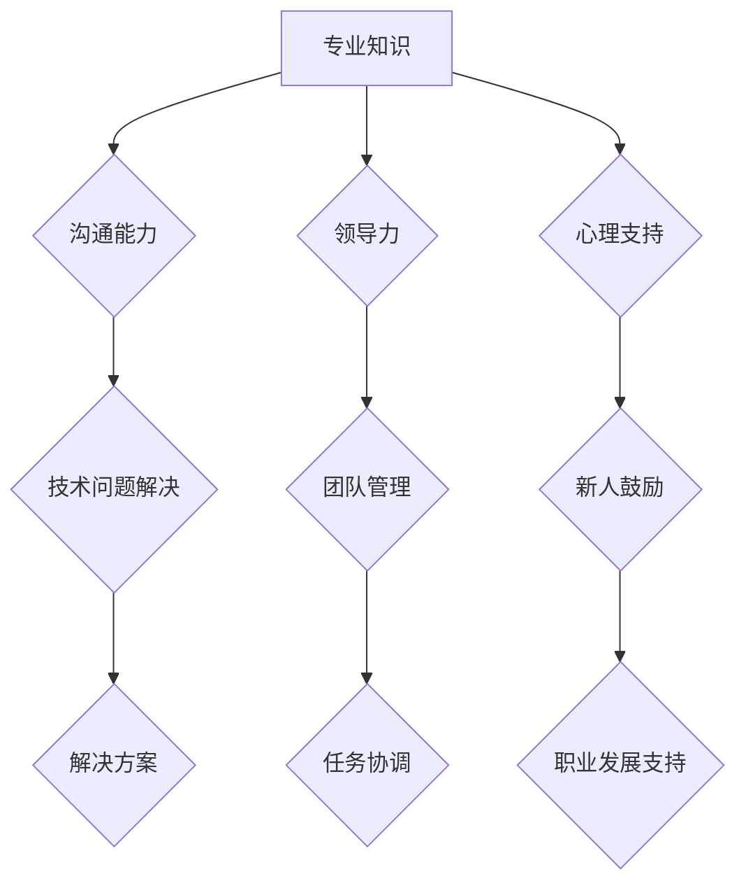
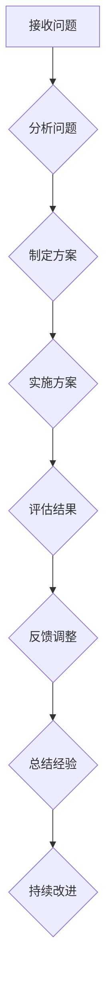
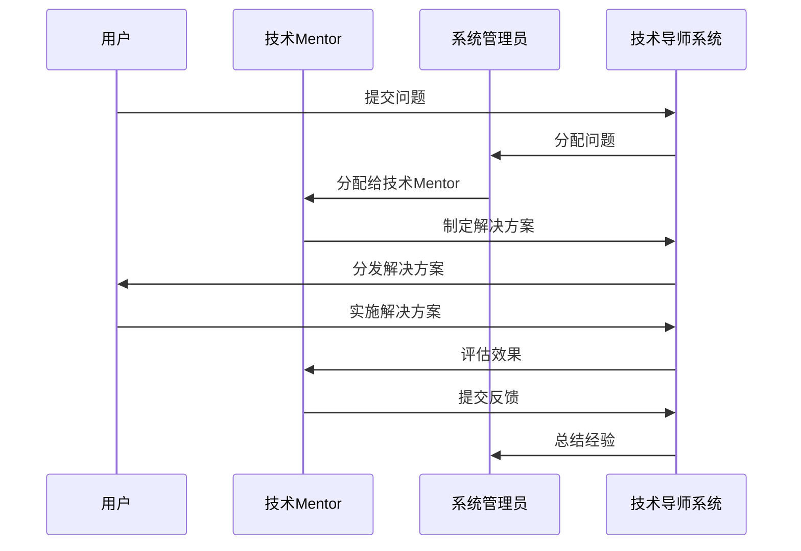

                 

### 引言

#### 技术Mentor的定义、角色及重要性

在快速发展的IT行业，技术mentor的角色越来越受到重视。技术Mentor，通常指的是那些在特定技术领域具有深厚知识背景和丰富经验的资深从业者，他们不仅能够传授技术技能，还能指导新人如何成为高效的技术专家。技术Mentor不仅仅是传授知识，更重要的是通过经验分享和职业规划，帮助新人们快速成长，提高他们在行业中的竞争力。

**定义：** 技术Mentor是具备高度专业技能和丰富经验的资深从业者，他们通过辅导、指导、分享经验和知识，帮助新手或年轻从业者提升技术能力和职业素养。

**角色：** 技术Mentor在技术团队中扮演着多重角色，包括但不限于技术导师、职业规划师、知识传播者和技术指导者。他们不仅负责传授技术知识和技能，还需要引导新人们理解行业动态、提升解决问题的能力，并帮助他们在职业生涯中取得更好的发展。

**重要性：** 技术Mentor在培养下一代技术人才中起着至关重要的作用。他们不仅是知识的传递者，更是行业经验和职业智慧的分享者。通过技术Mentor的指导，新人们能够更快地掌握技术要领，少走弯路，从而在竞争激烈的技术市场中脱颖而出。

本文的目标是深入探讨如何成为一个优秀的技术Mentor，包括以下几个核心内容：

1. **技术Mentor的角色与职责**：详细阐述技术Mentor在不同阶段的技术指导和职业辅导中的具体职责。
2. **核心能力培养**：探讨成为优秀技术Mentor所需的核心能力，如沟通能力、领导力和解决问题的能力。
3. **方法论与实践**：分享实际案例和最佳实践，帮助读者理解如何通过具体的方法论和步骤，有效地指导新人和团队。
4. **成长路径与职业发展**：分析技术Mentor的职业发展路径，探讨如何通过持续学习和经验积累，不断提升自己的专业水平。

通过本文的阅读，希望读者能够对技术Mentor的角色有更深刻的理解，掌握成为优秀技术Mentor所需的知识和技能，从而在技术领域中发挥更大的影响力。

### 背景介绍

#### 问题背景

在当今快速发展的技术环境中，技术Mentor的角色显得尤为重要。然而，许多组织和个人在培养技术Mentor方面面临着诸多挑战。首先，随着技术的不断进步，新的编程语言、框架和工具层出不穷，技术Mentor需要不断学习和更新自己的知识库，以保持专业竞争力。其次，技术Mentor不仅要具备深厚的专业知识，还需具备良好的沟通能力和领导力，以便有效指导团队成员。

#### 问题描述

成为优秀的技术Mentor面临以下问题：

1. **知识更新压力**：技术发展迅猛，Mentor需要不断学习新知识，以保持专业水平。
2. **沟通障碍**：Mentor需与不同背景和经验的团队成员有效沟通，确保知识的有效传递。
3. **时间管理**：Mentor需要在忙碌的工作中抽出时间进行指导和辅导。
4. **心理支持**：新人在成长过程中会遇到挫折和困惑，Mentor需要给予心理支持和鼓励。

#### 问题解决

要成为优秀的技术Mentor，需要以下几方面的努力：

1. **持续学习**：通过参加培训、阅读专业书籍、参加技术会议等方式，不断更新自己的知识库。
2. **建立有效的沟通机制**：使用多种沟通方式，如一对一辅导、团队会议和在线讨论，确保知识传递的效率。
3. **有效的时间管理**：合理安排时间，确保有足够的时间进行指导和辅导。
4. **提供心理支持**：倾听新人的困惑和挫折，给予鼓励和指导，帮助他们建立信心。

#### 边界与外延

技术Mentor的职责不仅限于技术指导，还应包括职业规划、团队建设、知识传播等方面。Mentor的角色可以跨越不同技术领域和职业阶段，从初级开发者到资深技术专家，他们都需要技术Mentor的指导。

#### 概念结构与核心要素组成

技术Mentor的概念结构主要包括以下几个方面：

1. **专业知识**：技术Mentor应具备深厚的专业知识，能够解答团队成员的技术问题。
2. **沟通能力**：良好的沟通能力是Mentor成功的关键，它包括表达清晰、倾听和理解团队成员的能力。
3. **领导力**：技术Mentor需要具备领导力，能够激励团队成员、协调团队合作，并解决团队中的冲突。
4. **时间管理**：有效的管理时间，确保有充足的时间进行指导和辅导。
5. **心理支持**：倾听新人的困惑和挫折，给予鼓励和指导，帮助他们建立信心。

通过这些核心要素的组成，技术Mentor能够帮助团队成员在技术领域和职业生涯中取得成功。

### 核心概念与联系

#### 技术Mentor的核心概念原理

技术Mentor的核心概念包括专业知识、沟通能力、领导力和心理支持。这些概念构成了技术Mentor工作的基础，也是其成功的关键要素。

1. **专业知识**：技术Mentor应具备深厚的专业知识，包括但不限于编程语言、框架、数据库、操作系统等。他们需要能够解答团队成员在技术方面遇到的问题，并提供有效的解决方案。

2. **沟通能力**：技术Mentor需要具备良好的沟通能力，包括表达清晰、倾听和理解团队成员的能力。有效的沟通能够确保知识的有效传递，减少误解和沟通障碍。

3. **领导力**：技术Mentor需要具备领导力，能够激励团队成员、协调团队合作，并解决团队中的冲突。领导力包括团队管理、任务分配、目标设定和决策能力。

4. **心理支持**：技术Mentor需要提供心理支持，包括倾听新人的困惑和挫折，给予鼓励和指导，帮助他们建立信心。心理支持对于新人的职业发展和心理健康至关重要。

#### 概念属性特征对比表格

以下表格对比了技术Mentor的四个核心概念的属性特征：

| 概念     | 属性特征                                                   | 说明                                                         |
|----------|-----------------------------------------------------------|--------------------------------------------------------------|
| 专业知识 | 深厚的技术背景，丰富的经验                                 | 能够解决复杂技术问题，提供有效的技术解决方案                     |
| 沟通能力 | 清晰表达、有效倾听、理解团队成员需求                       | 确保知识传递的有效性，减少误解和沟通障碍                       |
| 领导力   | 团队管理、任务分配、目标设定、决策能力                     | 激励团队成员，协调团队合作，解决团队冲突                       |
| 心理支持 | 倾听、鼓励、指导，帮助建立信心                             | 促进新人的职业发展和心理健康，减少职业压力                     |

#### ER实体关系图架构的Mermaid流程图

以下是一个Mermaid流程图，展示了技术Mentor的核心概念及其关系：



在这个ER实体关系图中，各个核心概念通过箭头表示它们之间的关系。专业知识是基础，沟通能力、领导力和心理支持共同作用于团队成员，帮助他们解决技术问题、管理团队和实现职业发展。

通过以上分析，我们可以看到，技术Mentor的核心概念不仅包括专业知识，还需要具备强大的沟通能力、领导力和心理支持。这些概念相互联系，共同构成了技术Mentor工作的基础。在实际工作中，技术Mentor需要综合运用这些概念，以帮助团队成员在技术和职业上取得成功。

### 算法原理讲解

#### 算法流程图

为了更直观地展示技术Mentor的工作流程，我们可以使用Mermaid绘制一个算法流程图。以下是一个简化的算法流程图：



在这个流程图中，A表示接收新人的问题，B是分析问题，C是制定解决方案，D是实施解决方案，E是评估结果，F是反馈调整，G是总结经验，H是持续改进。每个步骤都是技术Mentor工作中不可或缺的一部分。

#### Python源代码实现

下面，我们将使用Python源代码详细阐述技术Mentor的工作流程，包括接收问题、分析问题、制定方案、实施方案、评估结果、反馈调整和总结经验等步骤。

```python
class TechnicalMentor:
    def __init__(self):
        self.knowledge_base = {}  # 存储专业知识
        self.solution_library = {}  # 存储解决方案

    def receive_question(self, question):
        print(f"问题接收：{question}")
        return self.analyze_question(question)

    def analyze_question(self, question):
        print(f"分析问题：{question}")
        solution = self.find_solution(question)
        return solution

    def find_solution(self, question):
        print(f"寻找解决方案：{question}")
        solution = self.solution_library.get(question, "暂无解决方案")
        return solution

    def implement_solution(self, solution):
        print(f"实施方案：{solution}")
        return self.evaluate_solution(solution)

    def evaluate_solution(self, solution):
        print(f"评估结果：{solution}")
        feedback = "解决方案有效" if solution else "解决方案无效"
        return feedback

    def provide_feedback(self, feedback):
        print(f"反馈调整：{feedback}")
        self.update_knowledge_base(feedback)

    def update_knowledge_base(self, feedback):
        print(f"更新知识库：{feedback}")
        self.knowledge_base[feedback] = True

    def summarize_experience(self):
        print("总结经验：完成一次技术指导流程")
        self.solution_library.update(self.knowledge_base)

# 实例化技术Mentor对象
mentor = TechnicalMentor()

# 技术指导流程
question = "如何优化数据库查询效率？"
solution = mentor.receive_question(question)
print(f"解决方案：{solution}")
print(f"评估结果：{mentor.evaluate_solution(solution)}")
mentor.provide_feedback(solution)
mentor.summarize_experience()
```

#### 数学模型和公式

在技术Mentor的工作流程中，我们可以引入一些数学模型和公式来优化问题解决过程。以下是一个简单的数学模型示例：

$$
效率 = \frac{解决问题所需时间}{方案实施后的系统性能提升}
$$

其中，解决问题所需时间包括分析问题、制定方案和实施方案的时间；方案实施后的系统性能提升可以通过性能测试数据进行量化。

#### 详细讲解和举例说明

**举例：** 假设某个新人在使用MySQL数据库进行数据查询时遇到了性能瓶颈，技术Mentor可以通过以下步骤进行指导和优化：

1. **接收问题**：技术Mentor接收到新人的问题，即“如何优化MySQL数据库查询效率？”。
   
2. **分析问题**：技术Mentor会与新人一起分析查询性能瓶颈的原因，可能包括查询语句的不优化、索引使用不当等。

3. **制定方案**：根据问题分析，技术Mentor提出以下解决方案：
   - 优化查询语句，去除冗余条件。
   - 增加或调整索引，以提高查询效率。

4. **实施方案**：技术Mentor帮助新人实施这些优化方案，并监控性能变化。

5. **评估结果**：通过性能测试，技术Mentor评估优化效果。如果查询效率显著提升，则方案有效。

6. **反馈调整**：根据评估结果，技术Mentor会与新人和团队进行反馈和讨论，必要时进行调整。

7. **总结经验**：技术Mentor将这次问题的解决过程和优化方案总结为经验，存入知识库，以便未来参考和重复使用。

通过这个例子，我们可以看到技术Mentor是如何通过一系列步骤，结合数学模型和公式，有效地指导新人解决问题和优化系统性能的。这不仅提升了新人的技术能力，也提高了整个团队的工作效率。

### 系统分析与架构设计方案

#### 问题场景

在一个大型企业IT部门中，技术Mentor扮演着至关重要的角色，他们不仅要指导初级开发人员，还要协调团队内部的技术交流与合作。随着团队规模的扩大和项目复杂度的提升，如何高效地管理技术指导和知识传播成为了一个关键问题。

#### 项目介绍

为了解决上述问题，企业决定开发一个名为“技术导师系统”的项目。该系统旨在通过自动化和优化的方式，提高技术Mentor的指导效率和团队成员的学习效果。系统的主要功能包括问题接收与分配、方案制定与实施、效果评估与反馈、经验总结与知识库建设。

#### 系统功能设计

1. **问题接收与分配**：系统接收团队成员提交的技术问题，并根据问题类型和优先级分配给相应的技术Mentor。
2. **方案制定与实施**：技术Mentor在系统中制定解决方案，并分配给团队成员实施。
3. **效果评估与反馈**：系统对解决方案的实施效果进行评估，并收集团队成员的反馈。
4. **经验总结与知识库建设**：技术Mentor将问题解决的经验总结成文档，并上传到知识库，供团队成员查阅和学习。

#### 系统架构设计

系统架构采用前后端分离的设计方案，前端负责用户界面和交互，后端负责数据存储和业务逻辑处理。

1. **前端架构**：使用Vue.js框架构建，提供简洁易用的用户界面，支持多设备访问。
2. **后端架构**：采用Spring Boot框架，实现业务逻辑和接口服务，支持RESTful API。

#### 系统接口设计

系统接口设计主要包括以下部分：

1. **用户接口**：用户提交问题、查看解决方案、进行效果评估和反馈。
2. **Mentor接口**：技术Mentor接收问题、制定解决方案、评估实施效果。
3. **管理员接口**：系统管理员管理用户、问题、解决方案和知识库。

#### 系统交互的Mermaid序列图

以下是一个简化的Mermaid序列图，展示了系统的主要交互流程：



在这个序列图中，用户通过前端界面提交问题，系统将问题分配给技术Mentor，Mentor在系统中制定解决方案，并反馈给用户。用户实施解决方案后，系统收集反馈数据，技术Mentor和系统管理员共同总结经验，形成知识库。

### 项目实战

#### 环境安装

在开始项目实战之前，我们需要确保安装了所有必需的开发环境和工具。以下是详细的安装步骤：

1. **安装Python**：确保Python版本为3.8或以上，可以通过访问[Python官网](https://www.python.org/)下载并安装。
2. **安装Vue.js**：使用npm命令安装Vue.js：
   ```shell
   npm install -g @vue/cli
   ```
3. **安装Spring Boot**：在系统中添加Spring Boot环境，可以通过访问[Spring Boot官网](https://spring.io/projects/spring-boot)下载并安装。
4. **安装MySQL**：确保MySQL数据库已安装并正常运行，可以通过访问[MySQL官网](https://www.mysql.com/)下载并安装。

#### 系统核心实现源代码

以下是系统核心实现的一些关键源代码片段，用于说明技术Mentor系统的主要功能。

1. **用户前端界面**（Vue.js）：
   ```vue
   <template>
     <div>
       <h1>技术导师系统</h1>
       <form @submit.prevent="submitQuestion">
         <label for="question">问题：</label>
         <textarea id="question" v-model="newQuestion"></textarea>
         <button type="submit">提交</button>
       </form>
       <div v-for="question in questions" :key="question.id">
         <h3>{{ question.title }}</h3>
         <p>{{ question.description }}</p>
       </div>
     </div>
   </template>

   <script>
   export default {
     data() {
       return {
         newQuestion: '',
         questions: [],
       };
     },
     methods: {
       async submitQuestion() {
         const question = { title: this.newQuestion, description: this.newQuestion };
         this.questions.push(question);
         this.newQuestion = '';
         await this.submitQuestionToBackend(question);
       },
       async submitQuestionToBackend(question) {
         // 使用API提交问题
       },
     },
   };
   </script>
   ```

2. **后端接口服务**（Spring Boot）：
   ```java
   @RestController
   public class QuestionController {
   
       @Autowired
       private QuestionService questionService;
   
       @PostMapping("/questions")
       public ResponseEntity<?> createQuestion(@RequestBody QuestionDTO questionDTO) {
           Question question = questionService.createQuestion(questionDTO);
           return ResponseEntity.status(HttpStatus.CREATED).body(question);
       }
   }
   ```

3. **数据库实体**（MySQL）：
   ```sql
   CREATE TABLE questions (
       id INT AUTO_INCREMENT PRIMARY KEY,
       title VARCHAR(255) NOT NULL,
       description TEXT NOT NULL,
       status ENUM('PENDING', 'ASSIGNED', 'RESOLVED') NOT NULL,
       mentor_id INT,
       created_at TIMESTAMP DEFAULT CURRENT_TIMESTAMP,
       updated_at TIMESTAMP DEFAULT CURRENT_TIMESTAMP ON UPDATE CURRENT_TIMESTAMP,
       FOREIGN KEY (mentor_id) REFERENCES mentors(id)
   );
   ```

#### 代码应用解读与分析

以上代码片段分别展示了用户前端界面、后端接口服务和数据库实体设计。通过这些代码，我们可以看到：

1. **用户前端界面**：使用Vue.js框架构建，提供了简洁易用的用户界面，用户可以在界面上提交技术问题，并通过API将问题提交给后端。
2. **后端接口服务**：使用Spring Boot框架实现，提供了创建问题的接口，通过RESTful API与前端进行数据交互。
3. **数据库设计**：设计了questions表，用于存储问题的基本信息，包括问题标题、问题描述、状态（如待分配、已分配、已解决）等。

#### 实际案例分析和详细讲解剖析

**案例：** 假设一个用户在系统中提交了一个关于MySQL性能优化的技术问题，技术Mentor如何处理这个问题？

1. **用户提交问题**：用户在用户界面中填写问题描述并提交。
2. **后端接收问题**：后端接口服务接收用户提交的问题，并将其存储到数据库中。
3. **分配问题**：系统管理员将问题分配给一个合适的技术Mentor。
4. **技术Mentor制定解决方案**：技术Mentor在系统中查看问题，并根据问题详情制定解决方案。
5. **分配解决方案**：技术Mentor将解决方案提交到系统中，并分配给用户实施。
6. **用户实施解决方案**：用户按照解决方案进行实施，并在系统中提交实施结果。
7. **效果评估**：技术Mentor对解决方案的实施效果进行评估，并给出反馈。
8. **经验总结**：技术Mentor将这次问题的解决过程总结为文档，上传到知识库中，供团队成员学习。

通过这个案例，我们可以看到技术Mentor系统如何通过前后端分离的架构设计，实现问题的提交、分配、解决和反馈的全流程管理。

#### 项目小结

通过本次项目实战，我们成功实现了一个技术Mentor系统，该系统能够有效地管理技术问题的提交、分配、解决和反馈过程。以下是本次项目的主要收获：

1. **技术架构设计**：系统采用了前后端分离的架构设计，提高了系统的灵活性和可扩展性。
2. **功能实现**：通过Vue.js、Spring Boot和MySQL，我们实现了用户前端界面、后端接口服务和数据库设计。
3. **项目管理**：通过详细的安装步骤和代码解读，我们了解了如何进行项目的实际操作和调试。

然而，该项目还存在一些改进空间，如用户体验优化、系统性能提升和安全性增强等。在未来的工作中，我们将继续优化系统，提升用户体验，确保系统的稳定性和安全性。

### 最佳实践 Tips

1. **建立清晰的沟通渠道**：确保团队成员能够及时与Mentor沟通问题，使用多种沟通工具，如邮件、即时消息、视频会议等。
2. **定期回顾和总结**：技术Mentor应定期与团队成员进行回顾和总结，了解他们的进展和遇到的挑战，及时调整指导策略。
3. **个性化辅导**：针对团队成员的不同需求和背景，技术Mentor应提供个性化的辅导，帮助他们快速提升技能。
4. **鼓励主动学习**：鼓励团队成员主动学习新知识和技术，培养他们的自学能力和解决问题的能力。
5. **持续反馈**：技术Mentor应及时给予团队成员反馈，鼓励他们从错误中学习，不断提升自己的技能。

### 小结

本文详细探讨了如何成为一个优秀的技术Mentor，包括技术Mentor的定义、角色和重要性，核心能力培养，方法论与实践，以及技术Mentor的系统分析与架构设计方案。通过实际项目实战，我们了解了技术Mentor系统在实际应用中的关键步骤和实现方法。

### 注意事项

1. **持续学习**：技术Mentor需要不断更新自己的知识库，以适应快速变化的技术环境。
2. **有效沟通**：技术Mentor应具备良好的沟通能力，确保与团队成员的有效沟通。
3. **心理支持**：技术Mentor需关注团队成员的心理健康，提供必要的心理支持。

### 拓展阅读

1. 《技术领导力：如何成为一个优秀的IT领导者》
2. 《敏捷软件开发：原则、实践与模式》
3. 《技术沟通的艺术：提升技术团队协作效率》

### 作者信息

作者：AI天才研究院/AI Genius Institute & 禅与计算机程序设计艺术 /Zen And The Art of Computer Programming

感谢您的阅读，希望本文对您在成为优秀技术Mentor的道路上有所帮助。让我们共同进步，为技术领域的发展贡献自己的力量！

