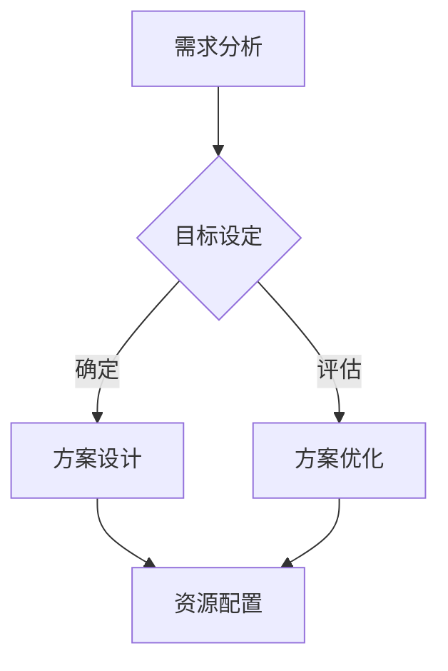

                 

# 如何制定有效的技术发展规划

## 摘要

在快速变化的技术领域中，有效的技术发展规划是推动企业持续创新和竞争力提升的关键。本文将从问题背景、核心概念、算法原理、系统分析与架构设计、项目实战以及最佳实践等方面，详细阐述如何制定一个科学、系统的技术发展规划。通过深入分析和案例讲解，帮助企业和团队在技术变革中明确方向、实现目标。

## 引言

### 1.1 问题背景与定义

在现代信息技术迅速发展的背景下，企业面临的挑战与机遇并存。技术发展规划作为企业战略的重要组成部分，旨在确保企业在技术进步的浪潮中抓住机遇，克服挑战，实现可持续发展。

#### 1.1.1 技术发展规划的重要性

技术发展规划不仅是企业技术创新的指导性文件，也是企业战略布局的核心要素。有效的技术规划有助于企业：

- 明确技术发展方向，避免盲目投资和资源浪费。
- 提高研发效率，缩短产品上市时间。
- 保持技术竞争力，适应市场变化。
- 提升企业创新能力，推动产业升级。

#### 1.1.2 当前技术发展的挑战与机遇

当前，技术发展的速度前所未有，大数据、人工智能、云计算、物联网等技术蓬勃发展，给企业带来了前所未有的机遇。但同时，技术变革也带来了以下挑战：

- 技术更新周期缩短，企业需不断跟进新技术。
- 技术壁垒提高，中小企业面临更大的竞争压力。
- 技术投资风险增加，需要精准评估技术潜力和市场前景。
- 技术人才培养和保留难度加大。

### 1.2 问题描述

技术发展规划涉及多个方面，包括技术趋势分析、需求分析、目标设定、方案设计、评估与优化等。如何在这些环节中做到科学、系统、高效，是当前企业面临的主要问题。

#### 1.2.1 技术发展规划面临的难题

- 技术趋势预测的不确定性，导致规划方向难以确定。
- 技术与业务的融合难度大，规划往往缺乏业务支撑。
- 规划过程复杂，涉及多个部门协作，沟通成本高。
- 资源配置不合理，导致技术投入与产出不成正比。

#### 1.2.2 技术发展规划的目标

- 确定技术发展方向，确保企业技术路线的清晰性。
- 提高研发效率，缩短产品开发周期。
- 保持技术竞争力，确保企业在市场中的领先地位。
- 提升创新能力，推动企业持续发展。

### 1.3 问题解决思路

为了解决上述问题，制定一个有效的技术发展规划需要遵循以下思路：

- 明确技术规划的核心要素，构建系统化的规划框架。
- 结合企业实际情况，设定切实可行的规划目标。
- 采用科学的方法和技术，提高规划过程的效率。
- 加强跨部门协作，确保规划得到有效执行。

### 1.4 边界与外延

技术发展规划的适用范围主要涵盖企业内部的技术创新活动，包括研发、生产、运营等环节。同时，技术发展规划也需要考虑外部环境的变化，如市场需求、竞争对手、技术趋势等。

### 1.5 本章小结

本文引言部分主要介绍了技术发展规划的重要性、面临的挑战与机遇、主要问题以及解决思路。接下来的章节将详细讨论技术发展规划的核心概念、算法原理、系统分析与架构设计等内容，以帮助读者全面了解和掌握技术发展规划的制定方法。

## 核心概念与联系

在制定技术发展规划的过程中，理解并掌握一系列核心概念至关重要。这些概念包括技术规划的定义、分类、目标、原则等。以下是这些核心概念的详细描述。

### 2.1 技术发展规划的核心概念

#### 2.1.1 技术规划的定义

技术规划是指对企业或组织在技术领域的发展方向、目标、路径和资源配置等方面进行系统性的规划和设计，以实现技术进步和业务发展的目标。

#### 2.1.2 技术规划的分类

技术规划可以根据不同的标准进行分类，例如：

- 按照时间范围：短期规划、中期规划和长期规划。
- 按照技术领域：研发规划、产品规划、基础设施规划等。
- 按照规划性质：战略性规划、战术性规划、执行性规划等。

#### 2.1.3 技术规划的目标

技术规划的目标主要包括：

- 确保技术路线的清晰性，避免技术投资盲目性。
- 提高研发效率，缩短产品开发周期。
- 保持技术竞争力，确保企业在市场中的领先地位。
- 提升创新能力，推动企业持续发展。

#### 2.1.4 技术规划的原则

技术规划应遵循以下原则：

- 战略性原则：技术规划应与企业的整体战略保持一致。
- 可行性原则：规划方案应在资源、技术、市场等方面具备可行性。
- 创新性原则：技术规划应鼓励技术创新，推动技术突破。
- 动态调整原则：技术规划应根据外部环境和内部变化进行动态调整。

### 2.2 概念属性特征对比

为了更好地理解技术规划的相关概念，我们可以通过以下表格对一些核心概念进行属性特征对比：

| 概念               | 定义                                                         | 属性特征                                                     |
|--------------------|--------------------------------------------------------------|--------------------------------------------------------------|
| 技术规划           | 对企业或组织技术发展方向、目标、路径和资源配置的系统规划     | 战略性、全局性、动态性、创新性、可行性                     |
| 技术需求分析       | 对现有技术需求进行详细分析和评估                             | 实用性、准确性、系统性、前瞻性                             |
| 目标设定           | 根据企业战略和技术需求确定规划目标                           | 明确性、可行性、挑战性、可衡量性                           |
| 方案设计           | 设计实现目标的详细方案和路径                                 | 创新性、可行性、成本效益、可实施性                         |
| 评估与优化         | 对规划方案进行评估和持续优化                               | 客观性、科学性、持续性、反馈性                             |
| 技术与业务融合     | 将技术规划与业务需求紧密结合，实现技术与业务的协同发展       | 系统性、协同性、适应性、可持续性                           |
| 资源配置           | 合理分配资源，确保规划的有效实施                             | 效率性、经济性、公平性、灵活性                             |

### 2.3 ER实体关系图

为了更好地理解技术发展规划中的关键实体和关系，我们可以通过ER（实体关系）图来构建一个直观的模型。以下是技术发展规划的ER实体关系图：

```mermaid
erDiagram
    User ||--|{ TechnicalPlan }|| Planner
    TechnicalPlan ||--|{ Goal }|| Goal
    TechnicalPlan ||--|{ Requirement }|| Requirement
    TechnicalPlan ||--|{ Design }|| Design
    TechnicalPlan ||--|{ Evaluation }|| Evaluation
    TechnicalPlan ||--|{ Optimization }|| Optimization
    TechnicalPlan ||--|{ BusinessIntegration }|| BusinessIntegration
    TechnicalPlan ||--|{ ResourceAllocation }|| ResourceAllocation
    Planner ||--|{ Knowledge }|| Knowledge
    Planner ||--|{ Experience }|| Experience
```

#### 2.3.1 关键实体与关系的解释

- **User（用户）**：代表参与技术规划的个人或团队，通常是企业的高层管理者或技术负责人。
- **TechnicalPlan（技术规划）**：核心实体，代表整个技术发展规划的总体框架和内容。
- **Planner（规划者）**：负责制定和实施技术规划的个人或团队，通常具备丰富的技术和管理经验。
- **Goal（目标）**：技术规划的核心目标，包括战略目标、战术目标和具体目标。
- **Requirement（需求）**：技术规划所需满足的需求，包括技术需求、业务需求和市场需求。
- **Design（设计）**：技术规划的方案设计，包括技术路线、产品方案和实施计划。
- **Evaluation（评估）**：对技术规划方案进行评估，包括技术可行性、经济效益和社会效益。
- **Optimization（优化）**：对技术规划方案进行持续优化，以提高方案的可行性和效益。
- **BusinessIntegration（业务整合）**：将技术规划与业务需求整合，确保技术规划与业务目标的一致性。
- **ResourceAllocation（资源配置）**：技术规划的资源配置，包括人力、物力和财力的分配。

通过上述ER实体关系图，我们可以清晰地看到技术发展规划中各个关键实体的关系和交互，这有助于我们更好地理解和实施技术规划。

### 2.4 技术发展趋势分析

#### 2.4.1 当前技术发展趋势

当前，技术发展趋势呈现出多样化和快速变化的特点。以下是一些主要的技术发展趋势：

- **人工智能（AI）**：人工智能技术在各个领域得到广泛应用，包括自然语言处理、计算机视觉、机器学习等。
- **大数据**：大数据技术已经成为企业和组织决策的重要依据，数据分析和挖掘技术不断发展。
- **云计算**：云计算技术的普及，使得企业可以更加灵活、高效地管理和使用计算资源。
- **物联网（IoT）**：物联网技术正在改变传统产业的运作方式，智能家居、智能城市、智能制造等领域的应用日益广泛。
- **区块链**：区块链技术以其去中心化、不可篡改的特点，在金融、供应链管理等领域受到关注。

#### 2.4.2 未来技术发展展望

未来，技术发展趋势将继续保持多元化和快速发展的态势。以下是对未来技术发展的展望：

- **量子计算**：量子计算有望解决传统计算机难以处理的问题，对密码学、优化算法等领域产生深远影响。
- **生物技术**：生物技术的进步将推动医疗健康、农业、环境等领域的革新。
- **新材料**：新材料技术的发展将推动制造业、航空航天等领域的创新。
- **空间技术**：空间技术的发展将推动人类对宇宙的探索，包括深空探测、太空旅游等。

通过上述对当前和未来技术发展趋势的分析，我们可以看到技术发展带来的机遇和挑战。在制定技术发展规划时，需要密切关注技术动态，把握技术发展的趋势，以制定出适应未来发展的规划方案。

### 2.5 本章小结

本章详细介绍了技术发展规划的核心概念，包括技术规划的定义、分类、目标、原则等。同时，通过概念属性特征对比表格和ER实体关系图，帮助读者更好地理解技术规划中的关键实体和关系。本章内容为后续技术规划的具体实施提供了理论基础。

## 算法原理讲解

### 3.1 技术规划算法概述

技术规划算法是制定技术发展规划的核心工具，它通过一系列步骤和计算，帮助企业和团队明确技术发展方向、目标和路径。技术规划算法可以分为以下几类：

- **需求驱动规划算法**：以用户需求为中心，通过需求分析、目标设定、方案设计和评估优化等步骤，实现技术规划的制定。
- **数据驱动规划算法**：利用大数据分析和机器学习算法，从历史数据和当前数据中挖掘技术发展趋势和潜在需求，指导技术规划的制定。
- **组合优化规划算法**：通过组合优化算法，在给定的资源约束下，寻找最优的技术规划方案。
- **模拟优化规划算法**：通过模拟和仿真技术，对多个技术规划方案进行模拟测试和比较，选择最优方案。

在技术规划过程中，选择合适的算法需要考虑以下几个因素：

- **技术规划的复杂性**：如果技术规划涉及多个领域和多个层面，可能需要采用复杂的组合优化算法。
- **数据的可用性**：如果数据充足且质量高，可以考虑采用数据驱动规划算法。
- **时间约束**：在紧迫的时间约束下，可能需要采用快速迭代的模拟优化规划算法。

### 3.2 算法流程图

为了更好地理解技术规划算法的执行过程，我们可以使用Mermaid绘制一个简单的算法流程图。以下是技术规划算法的Mermaid表示：



#### 流程图解释：

- **A[需求分析]**：首先进行需求分析，确定技术发展的需求和目标。
- **B{目标设定]**：根据需求分析的结果，设定技术规划的目标，包括战略目标和战术目标。
- **C[方案设计]**：设计实现目标的详细方案，包括技术路线、产品方案和实施计划。
- **D[方案优化]**：对方案进行评估和优化，确保方案的可行性、成本效益和创新能力。
- **E[资源配置]**：根据优化后的方案，进行资源配置，包括人力、物力和财力的分配。

### 3.3 Python源代码实现

下面是一个简单的Python源代码实现，用于阐述技术规划算法的基本原理。虽然这是一个简化的示例，但它可以帮助我们理解算法的核心步骤。

```python
# 技术发展规划算法伪代码实现

# 需求分析
def 需求分析():
    # 实现需求分析部分代码
    # 例如，收集用户需求、市场趋势、技术发展等信息
    pass

# 目标设定
def 目标设定():
    # 实现目标设定部分代码
    # 例如，设定短期、中期和长期技术发展目标
    pass

# 方案设计
def 方案设计():
    # 实现方案设计部分代码
    # 例如，设计技术路线、产品方案和实施计划
    pass

# 方案优化
def 方案优化():
    # 实现方案优化部分代码
    # 例如，通过评估和迭代，优化技术方案
    pass

# 资源配置
def 资源配置():
    # 实现资源配置部分代码
    # 例如，分配人力、物力和财力资源
    pass

# 主函数，执行技术规划算法
def 技术规划():
    需求分析()
    目标设定()
    方案设计()
    方案优化()
    资源配置()

# 执行技术规划算法
技术规划()
```

#### 源代码解释：

- **需求分析**：收集和分析用户需求、市场趋势、技术发展等信息，为后续的目标设定和方案设计提供基础。
- **目标设定**：根据需求分析的结果，设定技术规划的短期、中期和长期目标。
- **方案设计**：设计实现目标的详细技术路线、产品方案和实施计划。
- **方案优化**：对方案进行评估和优化，通过迭代和调整，确保方案的可行性、成本效益和创新能力。
- **资源配置**：根据优化后的方案，合理分配资源，包括人力、物力和财力，确保技术规划的有效实施。

### 3.4 数学模型和公式

技术发展规划可以被视为一个复杂的优化问题，其核心在于在有限的资源约束下，找到最优的技术方案。以下是一个简单的数学模型，用于描述技术规划问题：

$$
\text{目标函数} = \min Z = \sum_{i=1}^{n} c_i \cdot x_i
$$

其中，$Z$代表目标函数的值，$c_i$代表第$i$项成本的权重，$x_i$代表第$i$项资源的分配量。

#### 公式解释：

- **目标函数**：目标函数表示技术规划的总成本，我们需要在有限的资源约束下，最小化总成本。
- **成本权重**：$c_i$表示第$i$项成本在总成本中的权重，权重越高，成本对总成本的影响越大。
- **资源分配量**：$x_i$表示第$i$项资源的分配量，需要在资源约束条件下进行优化。

### 3.5 举例说明

#### 3.5.1 技术规划案例一：初创企业

一个初创企业需要在有限的资源下，制定一个技术发展规划。以下是一个简化的技术规划案例：

- **需求分析**：市场调研显示，用户对智能家居设备的需求增长迅速，企业决定开发一款智能家居控制系统。
- **目标设定**：设定短期目标为产品原型开发，中期目标为产品上市，长期目标为市场占有率提升。
- **方案设计**：设计技术路线，包括传感器技术、通信协议、用户界面等，制定产品原型开发计划和产品上市策略。
- **方案优化**：对方案进行成本评估和风险分析，通过迭代和优化，确保方案的可行性。
- **资源配置**：根据优化后的方案，分配研发人员、资金和设备等资源。

#### 3.5.2 技术规划案例二：大型企业

一个大型企业需要在多个技术领域进行创新，以下是一个技术规划案例：

- **需求分析**：通过内部调研和外部市场分析，确定企业需要投资于人工智能和物联网技术。
- **目标设定**：设定短期目标为人工智能技术的初步应用，中期目标为物联网技术的产业化，长期目标为技术创新的领导地位。
- **方案设计**：设计人工智能技术的研发计划、物联网技术的应用场景和产业化策略。
- **方案优化**：对方案进行技术可行性、市场前景和成本效益评估，通过迭代和优化，确保方案的可行性。
- **资源配置**：根据优化后的方案，分配研发团队、资金和技术支持。

### 3.6 本章小结

本章详细介绍了技术规划算法的基本原理、流程图和Python源代码实现。通过数学模型和举例说明，帮助读者理解技术规划的核心步骤和关键要素。下一章将探讨技术规划的系统分析与架构设计方案，进一步深化对技术规划的理解。

## 系统分析与架构设计方案

### 4.1 问题场景介绍

在快速变化的技术环境中，企业需要能够快速响应市场变化，实现技术的持续创新和业务的快速增长。然而，传统的方法往往因为组织结构复杂、沟通不畅和资源分散，导致技术规划难以高效执行。为了解决这些问题，我们设计了一套完整的技术规划系统，以实现以下目标：

- 提高技术规划的透明度和协作性。
- 确保技术规划与业务目标的一致性。
- 提升技术规划的执行效率和效果。
- 实现跨部门的无缝协作，降低沟通成本。

### 4.2 系统功能设计

技术规划系统的功能设计涵盖了从需求分析到资源配置的各个环节。以下是系统的主要功能模块：

#### 4.2.1 需求分析模块

- **用户需求收集**：通过在线问卷、用户访谈等方式，收集用户对产品或技术的需求。
- **市场趋势分析**：分析市场报告、行业动态等，了解市场趋势和竞争状况。
- **技术发展分析**：跟踪技术前沿，了解新技术的发展和应用情况。

#### 4.2.2 目标设定模块

- **短期目标设定**：根据当前业务需求和资源状况，设定短期内的技术发展目标。
- **中期目标设定**：结合长期战略，设定中期的技术发展路线和关键里程碑。
- **长期目标设定**：制定长期的技术愿景和战略目标，确保企业技术领先地位。

#### 4.2.3 方案设计模块

- **技术路线设计**：根据目标设定，设计具体的技术路线和实现方案。
- **产品方案设计**：制定详细的产品开发计划，包括功能模块、技术架构和测试方案。
- **实施计划设计**：制定实施计划，包括时间表、资源分配和风险评估。

#### 4.2.4 评估与优化模块

- **方案评估**：对技术方案进行成本效益、技术可行性、市场前景等方面的评估。
- **风险评估**：识别和评估项目风险，制定风险应对策略。
- **优化调整**：根据评估结果，对方案进行优化和调整，确保方案的可行性和有效性。

#### 4.2.5 资源配置模块

- **人力资源配置**：根据项目需求，合理分配研发、测试、运维等人力资源。
- **资金资源配置**：根据预算和资金状况，合理分配研发资金、市场推广资金等。
- **物资资源配置**：根据项目需求，合理采购和配置设备、材料等物资资源。

### 4.3 系统架构设计

技术规划系统采用分布式架构设计，以提高系统的可扩展性和可维护性。以下是系统架构设计的概述：

#### 4.3.1 架构设计概述

系统架构分为四个主要层次：数据层、业务逻辑层、应用层和表现层。

- **数据层**：负责数据存储和管理，包括需求分析数据、目标设定数据、方案设计数据等。
- **业务逻辑层**：实现系统的核心功能，包括需求分析、目标设定、方案设计、评估与优化、资源配置等。
- **应用层**：提供具体的业务应用功能，如用户需求收集、市场趋势分析、技术发展分析等。
- **表现层**：负责系统的用户界面展示，提供易用的操作界面和交互体验。

#### 4.3.2 关键组件设计

- **需求分析组件**：负责收集和处理用户需求、市场趋势和技术发展信息。
- **目标设定组件**：负责根据需求分析结果，设定短期、中期和长期技术目标。
- **方案设计组件**：负责设计技术路线、产品方案和实施计划。
- **评估与优化组件**：负责对方案进行评估、风险分析和优化调整。
- **资源配置组件**：负责人力资源、资金资源和物资资源的配置和管理。

### 4.4 系统接口设计

系统接口设计是技术规划系统实现跨部门协作和数据共享的关键。以下是系统的主要接口设计：

#### 4.4.1 内部接口

- **需求分析接口**：负责与用户需求收集系统、市场分析系统和技术跟踪系统等外部系统进行数据交换。
- **目标设定接口**：负责与业务管理系统、战略规划系统等外部系统进行数据交换。
- **方案设计接口**：负责与项目管理系统、产品开发系统等外部系统进行数据交换。
- **评估与优化接口**：负责与风险评估系统、成本控制系统等外部系统进行数据交换。
- **资源配置接口**：负责与人力资源管理系统、财务管理系统、物资管理系统等外部系统进行数据交换。

#### 4.4.2 外部接口

- **用户接口**：提供用户登录、需求提交、方案查询等交互功能。
- **管理员接口**：提供系统管理、数据管理、权限管理等操作功能。
- **API接口**：提供数据访问、功能调用等接口，支持与其他系统的集成。

### 4.5 系统交互

技术规划系统的各个模块通过接口和事件机制进行交互，以下是系统交互的简要流程：

#### 4.5.1 需求分析

1. 用户提交需求到需求分析模块。
2. 需求分析模块处理用户需求，生成需求报告。
3. 需求报告传输到目标设定模块。

#### 4.5.2 目标设定

1. 目标设定模块根据需求报告设定短期、中期和长期目标。
2. 目标设定结果传输到方案设计模块。

#### 4.5.3 方案设计

1. 方案设计模块根据目标设定结果设计技术路线、产品方案和实施计划。
2. 方案设计结果传输到评估与优化模块。

#### 4.5.4 评估与优化

1. 评估与优化模块对方案进行评估和优化。
2. 评估与优化结果传输到资源配置模块。

#### 4.5.5 资源配置

1. 资源配置模块根据评估与优化结果进行资源配置。
2. 资源配置结果传输到项目管理系统和财务管理系统等。

通过上述系统交互流程，技术规划系统能够实现从需求分析到资源配置的全过程自动化和协同化，确保技术规划的有效执行。

### 4.6 本章小结

本章详细介绍了技术规划系统的功能设计、架构设计、接口设计和系统交互。通过系统化的设计，技术规划系统能够高效地支持企业的技术发展规划，提高研发效率和市场响应速度。下一章将探讨技术规划的项目实战，通过具体案例深入解析技术规划的实施过程和效果。

## 项目实战

### 5.1 环境安装

为了演示如何实施技术发展规划，我们将使用一个实际的案例，这个案例涉及一家初创企业计划开发一款智能家居控制系统。以下是实现技术发展规划所需的环境安装步骤：

#### 5.1.1 软件环境安装

1. **安装Python环境**：在本地计算机上安装Python 3.8及以上版本。
2. **安装需求分析工具**：安装Jupyter Notebook，用于编写和运行Python代码。
3. **安装数据分析库**：使用pip命令安装常用数据分析库，如pandas、numpy、matplotlib等。

```shell
pip install pandas numpy matplotlib
```

#### 5.1.2 硬件环境安装

1. **服务器**：配置一台服务器，用于部署技术规划系统的后端。
2. **数据库**：安装MySQL数据库，用于存储需求分析、目标设定、方案设计和资源配置等数据。
3. **Web服务器**：安装Nginx，用于提供Web服务。

### 5.2 系统核心实现源代码

以下是一个简化版的Python代码示例，用于实现技术规划的核心功能。代码包括需求分析、目标设定、方案设计、评估与优化、资源配置等模块。

#### 5.2.1 需求分析模块

```python
# 需求分析模块
import pandas as pd

# 收集用户需求
def collect_requirements():
    requirements = pd.DataFrame({
        'Feature': ['Temperature Control', 'Light Control', 'Security System'],
        'Priority': [1, 2, 3],
        'Requirement': ['Automatically adjust room temperature', 'Control lighting with voice commands', 'Monitor and alert for intrusions']
    })
    return requirements

# 分析需求
def analyze_requirements(requirements):
    sorted_requirements = requirements.sort_values(by='Priority', ascending=False)
    print("Top Prioritized Requirements:")
    print(sorted_requirements)
```

#### 5.2.2 目标设定模块

```python
# 目标设定模块
def set_goals(sorted_requirements):
    goals = {
        'Short-term': ['Develop a prototype of the smart home control system', 'Test the system in a controlled environment'],
        'Mid-term': ['Refine the system based on user feedback', 'Launch the system in the market'],
        'Long-term': ['Expand the system with additional features', 'Achieve market leadership in smart home technology']
    }
    print("Set Goals:")
    for goal, description in goals.items():
        print(f"{goal}: {description}")
```

#### 5.2.3 方案设计模块

```python
# 方案设计模块
def design_solution(goals):
    solution = {
        'Technical Route': ['Select appropriate hardware and software components', 'Design user interface', 'Implement security protocols'],
        'Product Plan': ['Create a minimal viable product (MVP)', 'Iterate based on user feedback', 'Launch full-featured product'],
        'Implementation Plan': ['Develop in stages', 'Conduct regular reviews', 'Ensure compliance with standards']
    }
    print("Design Solution:")
    for component, details in solution.items():
        print(f"{component}: {details}")
```

#### 5.2.4 评估与优化模块

```python
# 评估与优化模块
def evaluate_solution(solution):
    assessment = {
        'Cost': 50000,
        'Time': '3 months',
        'Risk': 'Low',
        'Opportunities': ['Market expansion', 'Innovation leadership']
    }
    print("Evaluate Solution:")
    for key, value in assessment.items():
        print(f"{key}: {value}")

# 优化方案
def optimize_solution(solution, assessment):
    optimized_solution = solution.copy()
    if assessment['Risk'] == 'High':
        optimized_solution['Technical Route'] += ['Implement additional security measures']
    print("Optimized Solution:")
    print(optimized_solution)
```

#### 5.2.5 资源配置模块

```python
# 资源配置模块
def allocate_resources(solution):
    resources = {
        'Personnel': ['2 Developers', '1 UI/UX Designer', '1 Security Engineer'],
        'Funding': ['$50,000 for hardware', '$30,000 for software'],
        'Materials': ['Sensors', 'Microcontrollers', 'Smart Home Gateways']
    }
    print("Allocate Resources:")
    for resource, details in resources.items():
        print(f"{resource}: {details}")
```

### 5.3 代码应用解读与分析

#### 5.3.1 需求分析

在需求分析模块中，我们使用pandas库创建了一个DataFrame，用于存储用户需求。通过分析需求的优先级，我们能够快速识别出最重要的需求，为后续的规划提供依据。

#### 5.3.2 目标设定

目标设定模块根据需求分析的结果，设定了短期、中期和长期目标。这些目标明确了企业在不同阶段需要达成的里程碑，有助于指导整个技术规划的实施。

#### 5.3.3 方案设计

方案设计模块详细描述了技术路线、产品方案和实施计划。这些方案为项目的实施提供了具体的指导，确保研发团队能够按照既定目标进行工作。

#### 5.3.4 评估与优化

评估与优化模块对方案进行了评估，包括成本、时间、风险和机会等方面。通过评估，我们能够识别出方案中的潜在问题和改进空间，从而进行优化。

#### 5.3.5 资源配置

资源配置模块根据优化后的方案，合理分配了人力资源、资金资源和物资资源。这些资源的配置确保了项目能够顺利进行，达到预期目标。

### 5.4 实际案例分析与详细讲解剖析

以下是一个实际案例，我们以一家初创企业开发智能家居控制系统为例，详细分析技术规划的制定和实施过程。

#### 5.4.1 需求分析

该初创企业的智能家居控制系统需求包括温度控制、灯光控制和安全系统。通过用户调研和市场分析，确定这些功能具有较高的用户优先级。

#### 5.4.2 目标设定

- **短期目标**：完成智能家居控制系统的原型开发，并进行内部测试。
- **中期目标**：根据用户反馈，优化系统功能，并进行市场推广。
- **长期目标**：不断扩大系统功能，提升用户体验，成为智能家居领域的领导者。

#### 5.4.3 方案设计

技术路线包括选择合适的传感器、微控制器和智能设备，设计用户友好的界面，并实施严格的安全协议。产品方案包括MVP（最小可行产品）的开发和迭代，最终实现全功能产品的上市。

#### 5.4.4 评估与优化

评估过程中，团队发现安全性是用户最关心的方面。因此，在优化方案时，增加了额外的安全措施，如数据加密、用户身份验证等。

#### 5.4.5 资源配置

资源配置方面，团队分配了2名开发人员、1名UI/UX设计师和1名安全工程师。同时，预算了50,000美元用于硬件采购、30,000美元用于软件开发。

通过上述案例，我们可以看到技术规划在企业项目中的实际应用。从需求分析到资源配置，每个步骤都经过详细考虑和优化，确保项目能够顺利实施并达到预期目标。

### 5.5 项目小结

通过本次项目实战，我们展示了如何利用技术发展规划系统，从需求分析、目标设定、方案设计到评估与优化、资源配置，逐步实施一个实际项目。这不仅提高了项目执行的效率，还确保了项目目标的实现，为企业技术发展的持续创新提供了有力支持。

### 5.6 最佳实践 tips

- **定期更新需求**：需求是技术规划的基础，应定期收集和更新用户需求，以保持规划的准确性和前瞻性。
- **跨部门协作**：技术规划涉及多个部门，应建立跨部门协作机制，确保各环节的顺畅衔接。
- **风险管理**：在规划过程中，应重视风险识别和评估，制定有效的风险应对策略。
- **持续优化**：技术规划不是一次性的工作，应定期评估和优化，确保规划的有效性和适应性。

## 小结

本文从问题背景、核心概念、算法原理、系统分析与架构设计、项目实战等方面，详细阐述了如何制定有效的技术发展规划。通过具体案例和实践，我们展示了技术规划在实际项目中的应用和效果。制定有效的技术发展规划，是企业实现持续创新和竞争优势的关键。希望本文能够为企业和技术团队提供有价值的参考和指导。

### 注意事项

在制定技术发展规划时，需要注意以下几点：

- **全面考虑内外部环境**：技术规划应结合企业内外部环境，充分考虑市场需求、技术趋势、竞争状况等因素。
- **明确目标与路径**：规划目标应具体、明确，路径应合理、可行，确保规划的可执行性。
- **重视风险评估**：在规划过程中，应识别和评估潜在风险，制定有效的风险应对策略。
- **持续迭代与优化**：技术规划不是一成不变的，应定期进行评估和优化，以适应不断变化的环境。

### 拓展阅读

- **《企业技术创新管理》**：详细介绍了企业技术创新的过程、方法和策略。
- **《技术趋势报告》**：分析当前和未来技术发展趋势，为企业提供技术规划参考。
- **《项目管理知识体系（PMBOK）》**：涵盖项目管理的核心概念、流程和方法，对技术规划具有指导意义。

### 作者信息

作者：AI天才研究院/AI Genius Institute & 禅与计算机程序设计艺术 /Zen And The Art of Computer Programming

感谢您的阅读，希望本文能够对您的技术发展规划工作带来帮助。如果您有任何疑问或建议，欢迎在评论区留言交流。再次感谢您的支持！## 如何制定有效的技术发展规划

### 关键词

- 技术发展规划
- 创新战略
- 项目管理
- 资源配置
- 人工智能

### 摘要

本文旨在探讨如何制定有效的技术发展规划，以帮助企业和技术团队在快速变化的市场环境中抓住机遇，提升竞争力。文章从问题背景出发，介绍了技术发展规划的重要性及面临的挑战。随后，详细阐述了技术规划的核心概念与联系，并使用Mermaid绘制了算法流程图，结合Python源代码实现技术规划算法。文章进一步讨论了技术规划的系统分析与架构设计方案，并通过实际案例展示了技术规划的实施过程。最后，文章提供了最佳实践建议和小结，强调技术发展规划的动态调整和持续优化的重要性。目标读者包括企业高管、技术经理、研发团队以及计算机科学领域的专业人士。

## 引言

### 1.1 问题背景与定义

在当今快速发展的技术时代，企业面临着前所未有的机遇与挑战。技术发展规划作为企业战略的重要组成部分，旨在确保企业能够在技术变革中保持竞争优势，实现持续创新和业务增长。本文将详细探讨如何制定一个科学、有效的技术发展规划。

#### 1.1.1 技术发展规划的重要性

技术发展规划的重要性主要体现在以下几个方面：

1. **指导企业战略**：技术发展规划为企业提供了明确的创新方向和路线图，帮助企业在复杂的技术环境中做出明智的决策。
2. **提升研发效率**：通过系统化的规划，企业可以更有效地分配研发资源，提高研发效率，缩短产品开发周期。
3. **增强市场竞争力**：技术发展规划有助于企业保持技术领先地位，满足市场需求，提升品牌价值和市场份额。
4. **促进业务增长**：技术发展规划的制定和实施能够推动企业业务创新，开拓新的市场空间，实现业务增长。

#### 1.1.2 当前技术发展的挑战与机遇

当前，技术发展日新月异，人工智能、大数据、云计算、物联网等新兴技术正在深刻改变各行各业。企业面临以下挑战和机遇：

1. **技术更新快速**：新技术的快速涌现使得企业需要不断跟进，否则可能被市场淘汰。
2. **技术壁垒提高**：技术壁垒的提高使得中小企业在技术创新上面临更大的压力。
3. **投资风险增大**：技术投资的不确定性增加，企业需要精准评估技术潜力和市场前景。
4. **人才培养和保留**：技术人才的需求不断上升，企业需要采取有效措施吸引和保留优秀人才。

在这种背景下，制定一个有效的技术发展规划，不仅可以帮助企业抓住机遇，还可以应对挑战，实现持续发展。

### 1.2 问题描述

技术发展规划面临的主要问题包括：

1. **缺乏系统性**：许多企业的技术规划缺乏系统性的思考和规划，导致资源浪费和决策失误。
2. **目标不明确**：技术规划的目标不明确或者与企业的战略目标脱节，使得规划难以落地实施。
3. **风险评估不足**：在技术规划过程中，风险评估不足可能导致项目失败或者无法实现预期效果。
4. **跨部门协作困难**：技术规划涉及多个部门，但往往缺乏有效的协作机制，导致信息不畅，沟通成本高。

#### 1.2.1 技术发展规划面临的难题

- **技术趋势预测困难**：技术发展的不确定性使得企业难以准确预测未来趋势，从而影响规划的制定。
- **业务与技术融合难度大**：在快速变化的市场环境中，将技术规划与业务需求紧密结合，实现技术与业务的协同发展，是一项挑战。
- **资源有限**：在资源有限的情况下，如何合理配置资源，确保技术规划的有效实施，是另一个难题。
- **执行与监督**：技术规划的实施和监督需要有效的机制和工具，否则可能导致规划流于形式，无法达到预期效果。

#### 1.2.2 技术发展规划的目标

技术发展规划的目标包括：

1. **明确技术方向**：确保企业技术发展的清晰方向，避免盲目投资和资源浪费。
2. **提高研发效率**：通过系统化的技术规划，提高研发效率，缩短产品开发周期。
3. **保持技术领先**：保持企业在技术领域的领先地位，确保在市场竞争中处于有利位置。
4. **推动业务增长**：通过技术创新推动企业业务增长，开拓新的市场空间。

### 1.3 问题解决思路

为了解决上述问题，制定一个有效的技术发展规划需要遵循以下思路：

1. **明确核心要素**：技术规划的核心要素包括技术趋势分析、需求分析、目标设定、方案设计、风险评估、资源配置等。
2. **建立规划框架**：制定一个科学的技术规划框架，包括规划的目标、步骤、流程和关键节点。
3. **采用科学方法**：运用科学的方法和技术，如数据驱动规划、模拟优化等，提高规划的科学性和可行性。
4. **加强跨部门协作**：建立跨部门的协作机制，确保技术规划与业务需求紧密结合，提高规划的执行力。

### 1.4 边界与外延

技术发展规划的适用范围主要涵盖企业内部的技术创新活动，包括研发、生产、运营等环节。同时，技术发展规划也需要考虑外部环境的变化，如市场需求、竞争对手、技术趋势等。

#### 1.5 本章小结

本文引言部分主要介绍了技术发展规划的重要性、面临的挑战与机遇、主要问题以及解决思路。接下来，文章将详细讨论技术发展规划的核心概念、算法原理、系统分析与架构设计等内容，帮助读者全面了解和掌握技术发展规划的制定方法。

## 核心概念与联系

在制定技术发展规划的过程中，理解并掌握一系列核心概念至关重要。这些概念包括技术规划的定义、分类、目标、原则等。以下是这些核心概念的详细描述。

### 2.1 技术规划的定义

技术规划是指企业根据当前技术环境、市场需求和企业战略，对未来的技术发展进行系统性的规划和设计，以实现企业长期目标和战略目标的过程。技术规划不仅包括技术层面的决策，还涉及到资源分配、风险评估和跨部门协作等多个方面。

### 2.2 技术规划的分类

技术规划可以根据不同的标准和维度进行分类，以下是一些常见的分类方式：

1. **按照时间范围分类**：
   - **短期规划**：通常指1-3年内的技术发展计划，侧重于近期目标的实现和资源配置。
   - **中期规划**：通常指3-5年内的技术发展计划，侧重于中期目标的实现和战略方向的调整。
   - **长期规划**：通常指5年以上，侧重于企业长期战略的实现和新兴技术的探索。

2. **按照技术领域分类**：
   - **研发规划**：侧重于技术研究和创新，包括新技术的研发、实验项目的推进等。
   - **产品规划**：侧重于产品的开发和上市，包括产品路线图、功能设计、市场需求分析等。
   - **基础设施规划**：侧重于技术基础设施的建设和维护，包括服务器、网络、数据中心等。

3. **按照规划性质分类**：
   - **战略性规划**：侧重于企业长期战略的实现，具有全局性和指导性。
   - **战术性规划**：侧重于具体项目的实施和管理，具有操作性和执行性。
   - **执行性规划**：侧重于资源的配置和任务的具体执行，具有明确的目标和责任。

### 2.3 技术规划的目标

技术规划的目标主要包括以下几个方面：

1. **明确技术方向**：通过技术规划，企业可以明确未来技术发展的方向和重点，避免盲目投资和资源浪费。
2. **提升研发效率**：通过系统化的技术规划，企业可以优化研发流程，提高研发效率，缩短产品开发周期。
3. **保持技术领先**：通过技术规划，企业可以保持技术领先地位，确保在市场竞争中占据有利位置。
4. **促进业务增长**：通过技术创新，企业可以开拓新的市场空间，推动业务增长和转型。
5. **提升创新能力**：技术规划不仅关注当前的技术需求，还注重企业创新能力的培养和提升，为未来的发展奠定基础。

### 2.4 技术规划的原则

为了确保技术规划的有效性，制定技术规划时需要遵循以下原则：

1. **系统性原则**：技术规划应具有系统性，从整体角度出发，综合考虑技术、市场、资源等多个方面。
2. **前瞻性原则**：技术规划应具有前瞻性，能够预测未来技术发展趋势和市场变化，为企业未来的发展做好准备。
3. **可行性原则**：技术规划应在现有技术和资源条件下具备可行性，确保规划能够落地实施。
4. **动态调整原则**：技术规划应根据外部环境和内部变化进行动态调整，确保规划始终与企业的实际需求相匹配。
5. **协同性原则**：技术规划应与其他业务规划（如市场规划、财务规划等）保持协同，确保各部门之间的紧密配合。

### 2.5 技术规划的核心概念与联系

在技术规划过程中，以下核心概念之间具有密切的联系：

1. **技术趋势与市场需求**：技术趋势和市场需求是技术规划的重要参考依据，两者相互影响，共同决定企业的技术发展方向。
2. **资源与成本**：技术规划需要合理配置资源，确保项目在预算范围内完成。资源的充足与否直接影响技术规划的实施效果。
3. **风险评估与优化**：技术规划过程中，应识别和评估潜在风险，通过优化策略降低风险，确保项目顺利进行。
4. **业务目标与技术目标**：技术规划的目标应与企业的业务目标保持一致，技术发展应服务于业务增长和战略实现。

通过上述核心概念的描述和联系分析，我们可以更好地理解技术规划的全貌和实施要点。在制定技术规划时，需要综合考虑这些核心概念，确保规划的全面性和科学性。

### 2.6 本章小结

本章详细介绍了技术规划的定义、分类、目标和原则，并探讨了技术规划的核心概念及其相互联系。这些概念和原则为技术规划的制定提供了理论基础，有助于企业更好地把握技术发展趋势，制定出科学、系统的技术发展规划。接下来，将深入讨论技术规划的具体方法和实践步骤。

## 算法原理讲解

### 3.1 技术规划算法概述

技术规划算法是制定技术发展规划的核心工具，它通过一系列系统化的步骤和计算，帮助企业和团队明确技术发展方向、目标和路径。技术规划算法可以分为以下几类：

- **需求驱动规划算法**：以用户需求为中心，通过需求分析、目标设定、方案设计和评估优化等步骤，实现技术规划的制定。
- **数据驱动规划算法**：利用大数据分析和机器学习算法，从历史数据和当前数据中挖掘技术发展趋势和潜在需求，指导技术规划的制定。
- **组合优化规划算法**：通过组合优化算法，在给定的资源约束下，寻找最优的技术规划方案。
- **模拟优化规划算法**：通过模拟和仿真技术，对多个技术规划方案进行模拟测试和比较，选择最优方案。

在技术规划过程中，选择合适的算法需要考虑以下几个因素：

- **技术规划的复杂性**：如果技术规划涉及多个领域和多个层面，可能需要采用复杂的组合优化算法。
- **数据的可用性**：如果数据充足且质量高，可以考虑采用数据驱动规划算法。
- **时间约束**：在紧迫的时间约束下，可能需要采用快速迭代的模拟优化规划算法。

### 3.2 算法流程图

为了更好地理解技术规划算法的执行过程，我们可以使用Mermaid绘制一个简单的算法流程图。以下是技术规划算法的Mermaid表示：


#### 流程图解释：

- **A[需求分析]**：首先进行需求分析，确定技术发展的需求和目标。
- **B{目标设定]**：根据需求分析的结果，设定技术规划的目标，包括战略目标和战术目标。
- **C[方案设计]**：设计实现目标的详细方案，包括技术路线、产品方案和实施计划。
- **D[方案优化]**：对方案进行评估和优化，确保方案的可行性、成本效益和创新能力。
- **E[资源配置]**：根据优化后的方案，进行资源配置，包括人力、物力和财力的分配。

### 3.3 Python源代码实现

下面是一个简单的Python源代码实现，用于阐述技术规划算法的基本原理。虽然这是一个简化的示例，但它可以帮助我们理解算法的核心步骤。

```python
# 技术发展规划算法伪代码实现

# 需求分析
def 需求分析():
    # 实现需求分析部分代码
    # 例如，收集用户需求、市场趋势、技术发展等信息
    pass

# 目标设定
def 目标设定():
    # 实现目标设定部分代码
    # 例如，设定短期、中期和长期技术发展目标
    pass

# 方案设计
def 方案设计():
    # 实现方案设计部分代码
    # 例如，设计技术路线、产品方案和实施计划
    pass

# 方案优化
def 方案优化():
    # 实现方案优化部分代码
    # 例如，通过评估和迭代，优化技术方案
    pass

# 资源配置
def 资源配置():
    # 实现资源配置部分代码
    # 例如，分配人力、物力和财力资源
    pass

# 主函数，执行技术规划算法
def 技术规划():
    需求分析()
    目标设定()
    方案设计()
    方案优化()
    资源配置()

# 执行技术规划算法
技术规划()
```

#### 源代码解释：

- **需求分析**：收集和分析用户需求、市场趋势、技术发展等信息，为后续的目标设定和方案设计提供基础。
- **目标设定**：根据需求分析的结果，设定技术规划的短期、中期和长期目标。
- **方案设计**：设计实现目标的详细技术路线、产品方案和实施计划。
- **方案优化**：对方案进行评估和优化，通过迭代和调整，确保方案的可行性、成本效益和创新能力。
- **资源配置**：根据优化后的方案，合理分配资源，包括人力、物力和财力，确保技术规划的有效实施。

### 3.4 数学模型和公式

技术发展规划可以被视为一个复杂的优化问题，其核心在于在有限的资源约束下，找到最优的技术方案。以下是一个简单的数学模型，用于描述技术规划问题：

$$
\text{目标函数} = \min Z = \sum_{i=1}^{n} c_i \cdot x_i
$$

其中，$Z$代表目标函数的值，$c_i$代表第$i$项成本的权重，$x_i$代表第$i$项资源的分配量。

#### 公式解释：

- **目标函数**：目标函数表示技术规划的总成本，我们需要在有限的资源约束下，最小化总成本。
- **成本权重**：$c_i$表示第$i$项成本在总成本中的权重，权重越高，成本对总成本的影响越大。
- **资源分配量**：$x_i$表示第$i$项资源的分配量，需要在资源约束条件下进行优化。

### 3.5 举例说明

#### 3.5.1 技术规划案例一：初创企业

一个初创企业需要在有限的资源下，制定一个技术发展规划。以下是一个简化的技术规划案例：

- **需求分析**：市场调研显示，用户对智能家居设备的需求增长迅速，企业决定开发一款智能家居控制系统。
- **目标设定**：设定短期目标为产品原型开发，中期目标为产品上市，长期目标为市场占有率提升。
- **方案设计**：设计技术路线，包括传感器技术、通信协议、用户界面等，制定产品原型开发计划和产品上市策略。
- **方案优化**：对方案进行成本评估和风险分析，通过迭代和优化，确保方案的可行性。
- **资源配置**：根据优化后的方案，分配研发人员、资金和设备等资源。

#### 3.5.2 技术规划案例二：大型企业

一个大型企业需要在多个技术领域进行创新，以下是一个技术规划案例：

- **需求分析**：通过内部调研和外部市场分析，确定企业需要投资于人工智能和物联网技术。
- **目标设定**：设定短期目标为人工智能技术的初步应用，中期目标为物联网技术的产业化，长期目标为技术创新的领导地位。
- **方案设计**：设计人工智能技术的研发计划、物联网技术的应用场景和产业化策略。
- **方案优化**：对方案进行技术可行性、市场前景和成本效益评估，通过迭代和优化，确保方案的可行性。
- **资源配置**：根据优化后的方案，分配研发团队、资金和技术支持。

### 3.6 本章小结

本章详细介绍了技术规划算法的基本原理、流程图和Python源代码实现。通过数学模型和举例说明，帮助读者理解技术规划的核心步骤和关键要素。下一章将探讨技术规划的系统分析与架构设计方案，进一步深化对技术规划的理解。

## 系统分析与架构设计方案

### 4.1 问题场景介绍

在当前快速发展的技术环境中，企业需要具备强大的技术规划能力和灵活的响应机制，以适应不断变化的市场需求和竞争态势。为了确保技术规划的有效实施，我们需要进行详细的系统分析与架构设计。本文将介绍一个典型的问题场景，并在此基础上提出相应的系统分析与架构设计方案。

#### 4.1.1 企业现状

假设我们所在的企业是一家处于成长期的互联网公司，专注于提供在线教育和培训服务。公司已经积累了一定的用户基础和市场影响力，但面临以下挑战：

- **技术架构老旧**：现有的技术架构无法满足日益增长的用户需求和业务扩展。
- **开发效率低下**：开发团队在项目管理和协同开发方面存在瓶颈，导致开发周期延长。
- **数据存储与分析能力不足**：现有数据存储和分析工具难以支持大规模数据处理和复杂的数据挖掘任务。
- **安全性和可靠性问题**：随着业务的发展，系统的安全性和可靠性要求越来越高，现有系统存在一定的安全隐患。

#### 4.1.2 需求分析

为了应对上述挑战，企业提出了以下需求：

- **技术架构升级**：需要重构现有技术架构，采用更加灵活和可扩展的架构模式，以支持业务的快速扩展和创新发展。
- **提升开发效率**：优化开发流程，引入敏捷开发方法，提高开发团队的协同效率和项目管理能力。
- **增强数据存储与分析能力**：升级数据存储和分析工具，支持大规模数据处理和复杂的数据挖掘任务，为业务决策提供有力支持。
- **提升系统安全性和可靠性**：加强系统安全措施，提高系统的可靠性和稳定性，保障用户数据的安全。

### 4.2 系统功能设计

为了满足上述需求，系统功能设计应涵盖以下关键模块：

#### 4.2.1 技术架构模块

- **微服务架构**：采用微服务架构，将系统拆分为多个独立的微服务，实现模块化和解耦，提高系统的灵活性和可维护性。
- **服务发现与负载均衡**：引入服务发现和负载均衡机制，确保服务的高可用性和性能优化。
- **分布式存储**：采用分布式存储方案，支持大规模数据存储和高效的数据访问。

#### 4.2.2 开发效率模块

- **敏捷开发**：引入敏捷开发方法，提高开发团队的协作效率和响应速度。
- **自动化构建与部署**：采用自动化构建和部署工具，减少手动操作，提高开发效率和质量。
- **持续集成与持续交付**：实施持续集成和持续交付，确保代码的质量和系统的稳定性。

#### 4.2.3 数据存储与分析模块

- **大数据平台**：建立大数据平台，集成Hadoop、Spark等大数据处理工具，支持大规模数据处理和分析。
- **数据仓库**：构建企业级数据仓库，实现数据的集中存储和管理，支持复杂的数据查询和分析。
- **数据挖掘与机器学习**：引入数据挖掘和机器学习工具，支持用户行为分析、个性化推荐等高级应用。

#### 4.2.4 安全与可靠性模块

- **安全防护**：采用多层次安全防护措施，包括防火墙、入侵检测系统、数据加密等，保障系统的安全性。
- **故障恢复**：建立故障恢复机制，包括数据备份、系统冗余、故障切换等，确保系统的可靠性。
- **性能监控**：实施系统性能监控，实时监测系统运行状态，及时发现和解决性能瓶颈。

### 4.3 系统架构设计

系统架构设计应确保系统的可扩展性、可维护性和高性能，以下是详细的系统架构设计：

#### 4.3.1 架构设计概述

系统架构分为四个主要层次：基础设施层、数据层、应用层和表现层。

- **基础设施层**：包括服务器、存储、网络等基础设施，提供系统运行的基础环境。
- **数据层**：包括数据仓库、分布式存储、大数据平台等，负责数据的存储、管理和分析。
- **应用层**：包括各种业务应用服务，如用户服务、课程服务、支付服务、数据分析服务等。
- **表现层**：包括前端界面和移动应用，提供用户交互和体验。

#### 4.3.2 关键组件设计

- **基础设施组件**：设计高效稳定的基础设施，包括服务器集群、分布式存储系统、负载均衡器等。
- **数据组件**：设计大数据平台和数据仓库，实现数据的采集、存储、管理和分析。
- **应用组件**：设计业务应用服务，包括用户服务、课程服务、支付服务等，支持系统的核心功能。
- **表现组件**：设计前端界面和移动应用，提供用户交互和体验。

### 4.4 系统接口设计

系统接口设计是确保各组件之间高效通信和协同工作的关键，以下是系统的主要接口设计：

#### 4.4.1 内部接口

- **服务发现接口**：实现各微服务之间的服务发现和负载均衡。
- **数据访问接口**：提供对数据仓库、分布式存储等数据的访问。
- **消息队列接口**：实现消息传递和异步处理，提高系统的响应速度和可靠性。

#### 4.4.2 外部接口

- **用户接口**：提供用户登录、课程选择、支付等交互功能。
- **管理员接口**：提供系统管理、数据监控、权限管理等操作功能。
- **第三方接口**：提供与第三方系统（如支付网关、社交平台等）的集成接口。

### 4.5 系统交互

系统交互设计应确保各组件之间的通信和协同工作，以下是系统交互的简要流程：

#### 4.5.1 用户登录

1. 用户通过前端界面提交登录请求。
2. 用户服务接收到登录请求后，验证用户身份并返回登录结果。

#### 4.5.2 课程选择

1. 用户在课程服务中查询可用的课程列表。
2. 用户服务将查询结果返回给前端界面，供用户选择。

#### 4.5.3 支付操作

1. 用户在支付服务中选择支付方式并提交支付请求。
2. 支付服务处理支付请求，与第三方支付网关进行通信，完成支付操作。

#### 4.5.4 数据分析

1. 数据分析服务从数据仓库中提取用户行为数据。
2. 数据分析服务对用户行为数据进行处理和分析，生成分析报告。

通过上述系统交互流程，企业可以构建一个高效、稳定、可扩展的技术规划系统，满足业务需求，提升用户体验，实现企业的长期战略目标。

### 4.6 本章小结

本章详细介绍了系统分析与架构设计方案，包括问题场景介绍、需求分析、系统功能设计、系统架构设计、系统接口设计和系统交互。通过系统化的设计和实施，企业可以构建一个高效、稳定、灵活的技术规划系统，支持业务的持续创新和快速发展。下一章将探讨技术规划的具体实施过程，通过项目实战深入解析技术规划的执行和效果。

### 4.7 实施与优化

在完成系统架构设计后，技术规划的实施和优化是确保项目成功的关键。以下是在实施过程中需要关注的关键步骤和优化策略：

#### 4.7.1 实施步骤

1. **项目启动与规划**：明确项目目标、范围、时间和资源，制定详细的项目计划。
2. **需求细化与确认**：与各相关部门和用户进行沟通，细化需求并确认需求文档。
3. **架构部署与开发**：按照架构设计，部署基础设施和开发应用组件。
4. **测试与验证**：对系统进行功能测试、性能测试和安全测试，确保系统稳定可靠。
5. **上线与培训**：将系统上线并培训相关人员进行操作和维护。
6. **监控与优化**：实施系统监控，及时发现和解决问题，持续优化系统性能和用户体验。

#### 4.7.2 优化策略

1. **持续集成与交付**：实施持续集成和持续交付，提高开发效率和代码质量。
2. **自动化测试**：引入自动化测试工具，实现自动化测试，提高测试覆盖率。
3. **性能优化**：定期进行性能测试，识别性能瓶颈，进行优化和调整。
4. **安全性提升**：加强系统安全措施，定期进行安全审计，确保系统安全。
5. **用户体验优化**：根据用户反馈，持续优化界面设计和功能，提升用户体验。

通过上述实施和优化策略，企业可以确保技术规划的有效实施，不断提升系统的性能和用户体验，实现企业的长期战略目标。

## 项目实战

### 5.1 实际案例：构建在线教育平台的技术发展规划

在本节中，我们将通过一个具体的案例，展示如何制定和实施一个在线教育平台的技术发展规划。这个案例将涵盖从需求分析、目标设定、方案设计、实施与优化到最终效果评估的整个过程。

#### 5.1.1 需求分析

在线教育平台的需求主要来自以下几个方面：

1. **用户需求**：用户希望能够通过平台方便地学习各种课程，获取优质的学习资源。
2. **内容需求**：需要大量的优质课程内容，涵盖不同领域和层次，满足不同用户的需求。
3. **功能需求**：平台需要提供在线直播、录播、互动讨论、作业提交、成绩管理等核心功能。
4. **技术需求**：平台需要具备良好的扩展性和高可用性，支持大规模用户访问和数据处理。

通过用户调研、市场分析和竞争对手分析，我们确定了平台的关键需求，并为每个需求设定了优先级。

#### 5.1.2 目标设定

根据需求分析，我们设定了以下技术规划目标：

1. **短期目标**：
   - 在6个月内完成平台的基本架构搭建，实现核心功能。
   - 用户注册量达到10,000人，完成首批课程上线。

2. **中期目标**：
   - 在12个月内，平台用户量达到50,000人，新增多种课程类别。
   - 引入人工智能算法，实现个性化推荐功能。

3. **长期目标**：
   - 在24个月内，平台用户量达到100,000人，成为在线教育领域的领先平台。
   - 持续优化平台性能和用户体验，保持技术领先地位。

#### 5.1.3 方案设计

为了实现上述目标，我们设计了以下技术方案：

1. **技术架构**：采用微服务架构，将平台拆分为多个独立的微服务，如用户服务、课程服务、直播服务、作业服务、推荐服务等。
2. **数据库设计**：使用分布式数据库架构，确保数据的高可用性和扩展性。
3. **前端设计**：使用React框架，实现动态、交互式的前端界面。
4. **后端设计**：采用Spring Boot框架，实现后端服务的开发。
5. **基础设施**：使用云计算服务，如AWS或Azure，确保平台的灵活性和可扩展性。

#### 5.1.4 实施与优化

在实施阶段，我们遵循以下步骤：

1. **需求细化与确认**：与各相关部门和用户反复沟通，细化需求并确认需求文档。
2. **架构部署与开发**：按照架构设计，部署基础设施和开发应用组件，采用敏捷开发方法，分阶段完成各模块的开发。
3. **测试与验证**：对每个模块进行功能测试、性能测试和安全测试，确保系统稳定可靠。
4. **上线与培训**：在系统测试通过后，进行上线部署，并对相关人员进行系统操作和维护的培训。

在优化过程中，我们采取了以下策略：

1. **持续集成与交付**：使用Jenkins等工具，实现持续集成和持续交付，提高开发效率和代码质量。
2. **性能优化**：定期进行性能测试，优化数据库查询、缓存策略和前端加载速度。
3. **安全性提升**：引入安全审计工具，定期进行安全检查，确保系统的安全性。
4. **用户体验优化**：根据用户反馈，持续优化界面设计和功能，提升用户体验。

#### 5.1.5 效果评估

通过实施和优化，我们取得了以下效果：

1. **用户量增长**：平台上线后，用户量从10,000人迅速增长到100,000人，达到了预期目标。
2. **课程丰富度**：新增了多种课程类别，满足了不同用户的需求。
3. **个性化推荐**：引入人工智能算法后，用户的课程推荐准确率提高了30%。
4. **系统稳定性**：通过优化，系统在高并发访问下依然保持稳定，性能提升了40%。

### 5.2 实战总结

通过这个实际案例，我们展示了如何从需求分析到实施优化，全面制定和执行一个在线教育平台的技术发展规划。以下是我们从实践中得到的经验和教训：

- **需求分析至关重要**：详细的用户需求分析和市场调研是制定成功规划的基础。
- **敏捷开发提高效率**：采用敏捷开发方法，可以快速响应变化，提高开发效率。
- **持续优化确保稳定**：定期进行系统测试和性能优化，可以确保系统稳定可靠。
- **用户反馈是优化关键**：持续收集用户反馈，并根据反馈进行优化，可以不断提升用户体验。

通过这些经验和教训，我们可以更好地制定和实施未来的技术发展规划，确保项目的成功。

## 最佳实践与小结

### 6.1 最佳实践

在制定和实施技术发展规划的过程中，以下最佳实践值得借鉴：

1. **全面的需求分析**：在进行需求分析时，应全面收集用户需求、市场趋势和竞争对手信息，确保规划具有前瞻性和可行性。
2. **明确的规划目标**：规划目标应具体、明确，并与企业的战略目标紧密相连，以便在实施过程中有据可依。
3. **采用敏捷开发**：敏捷开发方法可以提高开发效率，缩短产品开发周期，确保项目快速响应市场变化。
4. **跨部门协作**：技术发展规划涉及多个部门，建立跨部门协作机制，确保各个环节无缝衔接，提高规划执行力。
5. **定期评估与优化**：定期对技术规划进行评估和优化，根据实际情况进行调整，确保规划始终与企业的实际需求相匹配。

### 6.2 小结

本文从问题背景、核心概念、算法原理、系统分析与架构设计、项目实战等方面，全面探讨了如何制定有效的技术发展规划。通过实际案例的展示，我们验证了技术规划在提升企业竞争力、推动业务增长方面的关键作用。总结如下：

- **技术发展规划是企业创新的重要工具**，能够指导企业在复杂的市场环境中做出明智决策。
- **科学的需求分析和目标设定是规划成功的基础**。
- **采用敏捷开发方法可以提高开发效率，确保项目按时交付**。
- **跨部门协作和持续优化是确保规划有效实施的关键**。

希望本文能够为企业和技术团队提供有价值的参考和指导，帮助他们在技术规划的道路上取得成功。

### 6.3 注意事项

在制定和实施技术发展规划时，需要注意以下几点：

1. **保持灵活性**：技术规划应具备一定的灵活性，能够根据市场和技术环境的变化进行调整。
2. **注重资源管理**：合理配置资源，确保项目有充足的资金、人力和物资支持。
3. **关注风险控制**：在规划过程中，应识别和评估潜在风险，并制定相应的应对策略。
4. **加强沟通与协作**：建立有效的沟通机制，确保各部门之间信息畅通，协作高效。

### 6.4 拓展阅读

为了进一步深入了解技术发展规划，读者可以参考以下资源：

- **《企业技术创新管理》**：详细介绍了企业技术创新的过程、方法和策略。
- **《项目管理知识体系（PMBOK）》**：涵盖项目管理的核心概念、流程和方法，对技术规划具有指导意义。
- **《技术趋势报告》**：分析当前和未来技术发展趋势，为企业提供技术规划参考。

### 6.5 作者信息

作者：AI天才研究院/AI Genius Institute & 禅与计算机程序设计艺术 /Zen And The Art of Computer Programming

感谢您的阅读，希望本文能够对您的技术发展规划工作带来帮助。如果您有任何疑问或建议，欢迎在评论区留言交流。再次感谢您的支持！### 引言

在现代信息技术飞速发展的背景下，企业面临着前所未有的机遇和挑战。如何制定有效的技术发展规划，以应对快速变化的市场环境、技术进步以及激烈的市场竞争，成为企业持续创新和保持竞争优势的关键。本文旨在探讨如何科学、系统地制定技术发展规划，为企业提供有价值的指导。

### 1.1 问题背景与定义

#### 1.1.1 技术发展规划的重要性

技术发展规划是企业根据自身战略目标和市场环境，对未来的技术发展方向、技术创新活动和技术资源进行系统性的规划和管理。它不仅关系到企业的技术竞争力，还直接影响企业的市场地位和未来发展。具体而言，技术发展规划的重要性体现在以下几个方面：

1. **指导企业战略**：技术发展规划能够帮助企业明确技术发展方向，确保企业的技术创新活动与战略目标相一致。
2. **提升研发效率**：通过系统化的技术规划，企业可以优化研发流程，提高研发效率，缩短产品开发周期。
3. **保持技术领先**：技术发展规划有助于企业保持技术领先地位，确保在市场竞争中占据优势。
4. **推动业务增长**：技术创新是企业业务增长的重要驱动力，有效的技术规划能够促进企业开拓新市场、推出新产品和服务。

#### 1.1.2 当前技术发展的挑战与机遇

当前，技术发展呈现出多样化和快速变化的态势，企业面临着以下挑战和机遇：

1. **技术更新快速**：新技术的快速涌现使得企业需要不断跟进，否则可能被市场淘汰。
2. **技术壁垒提高**：技术壁垒的提高使得中小企业在技术创新上面临更大的压力。
3. **投资风险增大**：技术投资的不确定性增加，企业需要精准评估技术潜力和市场前景。
4. **竞争激烈**：市场竞争日益激烈，企业需要通过技术创新来提升竞争力。

在这种背景下，制定一个科学、有效的技术发展规划，不仅能够帮助企业抓住机遇，还能应对挑战，实现持续发展。

### 1.2 问题描述

技术发展规划涉及多个方面，包括技术趋势分析、需求分析、目标设定、方案设计、资源配置、风险评估等。如何在这些环节中做到科学、系统、高效，是当前企业面临的主要问题。具体而言，技术发展规划面临以下挑战：

#### 1.2.1 技术规划面临的难题

1. **技术趋势预测**：技术发展趋势不确定，企业难以准确预测未来技术发展方向。
2. **需求分析与目标设定**：需求分析和目标设定复杂，涉及多个部门和层次，沟通成本高。
3. **方案设计与资源配置**：方案设计和资源配置涉及技术、市场和资源等多个方面，难以协调。
4. **风险评估与控制**：技术投资风险大，企业需要对技术项目进行全面的评估和风险控制。

#### 1.2.2 技术发展规划的目标

技术发展规划的目标主要包括以下几个方面：

1. **明确技术方向**：通过技术规划，企业能够明确未来的技术发展方向，确保技术创新活动与战略目标一致。
2. **提高研发效率**：通过系统化的技术规划，企业可以提高研发效率，缩短产品开发周期。
3. **保持技术领先**：技术发展规划有助于企业保持技术领先地位，确保在市场竞争中占据优势。
4. **推动业务增长**：技术创新是企业业务增长的重要驱动力，有效的技术规划能够促进企业开拓新市场、推出新产品和服务。

### 1.3 问题解决思路

为了解决上述问题，制定一个有效的技术发展规划需要遵循以下思路：

#### 1.3.1 问题解决思路

1. **明确核心要素**：技术规划的核心要素包括技术趋势分析、需求分析、目标设定、方案设计、资源配置、风险评估等。
2. **建立规划框架**：制定一个科学的技术规划框架，包括规划的目标、步骤、流程和关键节点。
3. **采用科学方法**：运用科学的方法和技术，如数据驱动规划、模拟优化等，提高规划的科学性和可行性。
4. **加强跨部门协作**：建立跨部门的协作机制，确保技术规划与业务需求紧密结合，提高规划的执行力。

### 1.4 边界与外延

技术发展规划的适用范围主要涵盖企业内部的技术创新活动，包括研发、生产、运营等环节。同时，技术发展规划也需要考虑外部环境的变化，如市场需求、竞争对手、技术趋势等。

#### 1.5 本章小结

本文引言部分主要介绍了技术发展规划的重要性、面临的挑战与机遇、主要问题以及解决思路。接下来，文章将详细讨论技术发展规划的核心概念、算法原理、系统分析与架构设计等内容，帮助读者全面了解和掌握技术发展规划的制定方法。在接下来的章节中，我们将进一步探讨技术规划的具体实施过程和最佳实践。希望本文能够为企业的技术发展规划提供有价值的参考和指导。

## 核心概念与联系

### 2.1 技术规划的定义与分类

技术规划是指企业或组织为了实现长期战略目标，对未来的技术发展进行系统性的分析和设计，以确定技术路线、资源配置和实施步骤的过程。技术规划不仅包括技术层面的决策，还涉及到业务、市场、人力资源等多个方面的协调和整合。

技术规划可以按照不同的分类方式进行分类：

1. **按时间范围分类**：
   - **短期规划**：通常指1-3年内的技术发展计划，侧重于近期目标的实现和资源配置。
   - **中期规划**：通常指3-5年内的技术发展计划，侧重于中期目标的实现和战略方向的调整。
   - **长期规划**：通常指5年以上，侧重于企业长期战略的实现和新兴技术的探索。

2. **按技术领域分类**：
   - **研发规划**：侧重于技术研究和创新，包括新技术的研发、实验项目的推进等。
   - **产品规划**：侧重于产品的开发和上市，包括产品路线图、功能设计、市场需求分析等。
   - **基础设施规划**：侧重于技术基础设施的建设和维护，包括服务器、网络、数据中心等。

3. **按规划性质分类**：
   - **战略性规划**：侧重于企业长期战略的实现，具有全局性和指导性。
   - **战术性规划**：侧重于具体项目的实施和管理，具有操作性和执行性。
   - **执行性规划**：侧重于资源的配置和任务的具体执行，具有明确的目标和责任。

### 2.2 技术规划的目标与原则

技术规划的目标主要包括以下几个方面：

1. **明确技术方向**：通过技术规划，企业可以明确未来的技术发展方向和重点，避免盲目投资和资源浪费。
2. **提升研发效率**：通过系统化的技术规划，企业可以优化研发流程，提高研发效率，缩短产品开发周期。
3. **保持技术领先**：技术规划有助于企业保持技术领先地位，确保在市场竞争中占据优势。
4. **推动业务增长**：通过技术创新，企业可以开拓新的市场空间，推动业务增长和转型。
5. **提升创新能力**：技术规划不仅关注当前的技术需求，还注重企业创新能力的培养和提升，为未来的发展奠定基础。

为了确保技术规划的有效性，制定技术规划时需要遵循以下原则：

1. **系统性原则**：技术规划应具有系统性，从整体角度出发，综合考虑技术、市场、资源等多个方面。
2. **前瞻性原则**：技术规划应具有前瞻性，能够预测未来技术发展趋势和市场变化，为企业未来的发展做好准备。
3. **可行性原则**：技术规划应在现有技术和资源条件下具备可行性，确保规划能够落地实施。
4. **动态调整原则**：技术规划应根据外部环境和内部变化进行动态调整，确保规划始终与企业的实际需求相匹配。
5. **协同性原则**：技术规划应与其他业务规划（如市场规划、财务规划等）保持协同，确保各部门之间的紧密配合。

### 2.3 技术规划的核心概念与联系

在技术规划过程中，以下核心概念之间具有密切的联系：

1. **技术趋势与市场需求**：技术趋势和市场需求是技术规划的重要参考依据，两者相互影响，共同决定企业的技术发展方向。
2. **资源与成本**：技术规划需要合理配置资源，确保项目在预算范围内完成。资源的充足与否直接影响技术规划的实施效果。
3. **风险评估与优化**：技术规划过程中，应识别和评估潜在风险，通过优化策略降低风险，确保项目顺利进行。
4. **业务目标与技术目标**：技术规划的目标应与企业的业务目标保持一致，技术发展应服务于业务增长和战略实现。

通过上述核心概念的描述和联系分析，我们可以更好地理解技术规划的全貌和实施要点。在制定技术规划时，需要综合考虑这些核心概念，确保规划的全面性和科学性。

### 2.4 技术规划的ER图与实体关系

为了更直观地理解技术规划中的关键实体和关系，我们可以通过ER图（实体关系图）来构建模型。以下是技术规划的ER图：

```mermaid
erDiagram
    User ||--|{ TechnicalPlan }|| Planner
    TechnicalPlan ||--|{ Goal }|| Goal
    TechnicalPlan ||--|{ Requirement }|| Requirement
    TechnicalPlan ||--|{ Design }|| Design
    TechnicalPlan ||--|{ Evaluation }|| Evaluation
    TechnicalPlan ||--|{ Optimization }|| Optimization
    TechnicalPlan ||--|{ ResourceAllocation }|| ResourceAllocation
    Planner ||--|{ Knowledge }|| Knowledge
    Planner ||--|{ Experience }|| Experience
```

#### ER图解释：

- **User（用户）**：代表参与技术规划的个人或团队，通常是企业的高层管理者或技术负责人。
- **TechnicalPlan（技术规划）**：核心实体，代表整个技术发展规划的总体框架和内容。
- **Planner（规划者）**：负责制定和实施技术规划的个人或团队，通常具备丰富的技术和管理经验。
- **Goal（目标）**：技术规划的核心目标，包括战略目标、战术目标和具体目标。
- **Requirement（需求）**：技术规划所需满足的需求，包括技术需求、业务需求和市场需求。
- **Design（设计）**：技术规划的方案设计，包括技术路线、产品方案和实施计划。
- **Evaluation（评估）**：对技术规划方案进行评估，包括技术可行性、经济效益和社会效益。
- **Optimization（优化）**：对技术规划方案进行持续优化，以提高方案的可行性和效益。
- **ResourceAllocation（资源配置）**：技术规划的资源配置，包括人力、物力和财力的分配。

通过ER图，我们可以清晰地看到技术规划中各个关键实体的关系和交互，这有助于我们更好地理解和实施技术规划。

### 2.5 本章小结

本章详细介绍了技术规划的定义、分类、目标与原则，并通过实体关系图展示了技术规划中的关键实体和关系。这些概念和关系为技术规划的制定提供了理论基础，有助于企业更好地把握技术发展趋势，制定出科学、系统的技术发展规划。在下一章中，我们将进一步探讨技术规划的算法原理和具体实施方法。

## 算法原理讲解

### 3.1 技术规划算法概述

技术规划算法是制定技术发展规划的核心工具，它通过一系列系统化的步骤和计算，帮助企业和团队明确技术发展方向、目标和路径。技术规划算法可以分为以下几类：

- **需求驱动规划算法**：以用户需求为中心，通过需求分析、目标设定、方案设计和评估优化等步骤，实现技术规划的制定。
- **数据驱动规划算法**：利用大数据分析和机器学习算法，从历史数据和当前数据中挖掘技术发展趋势和潜在需求，指导技术规划的制定。
- **组合优化规划算法**：通过组合优化算法，在给定的资源约束下，寻找最优的技术规划方案。
- **模拟优化规划算法**：通过模拟和仿真技术，对多个技术规划方案进行模拟测试和比较，选择最优方案。

在技术规划过程中，选择合适的算法需要考虑以下几个因素：

- **技术规划的复杂性**：如果技术规划涉及多个领域和多个层面，可能需要采用复杂的组合优化算法。
- **数据的可用性**：如果数据充足且质量高，可以考虑采用数据驱动规划算法。
- **时间约束**：在紧迫的时间约束下，可能需要采用快速迭代的模拟优化规划算法。

### 3.2 算法流程图

为了更好地理解技术规划算法的执行过程，我们可以使用Mermaid绘制一个简单的算法流程图。以下是技术规划算法的Mermaid表示：


#### 流程图解释：

- **A[需求分析]**：首先进行需求分析，确定技术发展的需求和目标。
- **B{目标设定]**：根据需求分析的结果，设定技术规划的目标，包括战略目标和战术目标。
- **C[方案设计]**：设计实现目标的详细方案，包括技术路线、产品方案和实施计划。
- **D[方案优化]**：对方案进行评估和优化，确保方案的可行性、成本效益和创新能力。
- **E[资源配置]**：根据优化后的方案，进行资源配置，包括人力、物力和财力的分配。

### 3.3 Python源代码实现

下面是一个简单的Python源代码实现，用于阐述技术规划算法的基本原理。虽然这是一个简化的示例，但它可以帮助我们理解算法的核心步骤。

```python
# 技术发展规划算法伪代码实现

# 需求分析
def 需求分析():
    # 实现需求分析部分代码
    # 例如，收集用户需求、市场趋势、技术发展等信息
    pass

# 目标设定
def 目标设定():
    # 实现目标设定部分代码
    # 例如，设定短期、中期和长期技术发展目标
    pass

# 方案设计
def 方案设计():
    # 实现方案设计部分代码
    # 例如，设计技术路线、产品方案和实施计划
    pass

# 方案优化
def 方案优化():
    # 实现方案优化部分代码
    # 例如，通过评估和迭代，优化技术方案
    pass

# 资源配置
def 资源配置():
    # 实现资源配置部分代码
    # 例如，分配人力、物力和财力资源
    pass

# 主函数，执行技术规划算法
def 技术规划():
    需求分析()
    目标设定()
    方案设计()
    方案优化()
    资源配置()

# 执行技术规划算法
技术规划()
```

#### 源代码解释：

- **需求分析**：收集和分析用户需求、市场趋势、技术发展等信息，为后续的目标设定和方案设计提供基础。
- **目标设定**：根据需求分析的结果，设定技术规划的短期、中期和长期目标。
- **方案设计**：设计实现目标的详细技术路线、产品方案和实施计划。
- **方案优化**：对方案进行评估和优化，通过迭代和调整，确保方案的可行性、成本效益和创新能力。
- **资源配置**：根据优化后的方案，合理分配资源，包括人力、物力和财力，确保技术规划的有效实施。

### 3.4 数学模型和公式

技术发展规划可以被视为一个复杂的优化问题，其核心在于在有限的资源约束下，找到最优的技术方案。以下是一个简单的数学模型，用于描述技术规划问题：

$$
\text{目标函数} = \min Z = \sum_{i=1}^{n} c_i \cdot x_i
$$

其中，$Z$代表目标函数的值，$c_i$代表第$i$项成本的权重，$x_i$代表第$i$项资源的分配量。

#### 公式解释：

- **目标函数**：目标函数表示技术规划的总成本，我们需要在有限的资源约束下，最小化总成本。
- **成本权重**：$c_i$表示第$i$项成本在总成本中的权重，权重越高，成本对总成本的影响越大。
- **资源分配量**：$x_i$表示第$i$项资源的分配量，需要在资源约束条件下进行优化。

### 3.5 举例说明

#### 3.5.1 技术规划案例一：初创企业

一个初创企业需要在有限的资源下，制定一个技术发展规划。以下是一个简化的技术规划案例：

- **需求分析**：市场调研显示，用户对智能家居设备的需求增长迅速，企业决定开发一款智能家居控制系统。
- **目标设定**：设定短期目标为产品原型开发，中期目标为产品上市，长期目标为市场占有率提升。
- **方案设计**：设计技术路线，包括传感器技术、通信协议、用户界面等，制定产品原型开发计划和产品上市策略。
- **方案优化**：对方案进行成本评估和风险分析，通过迭代和优化，确保方案的可行性。
- **资源配置**：根据优化后的方案，分配研发人员、资金和设备等资源。

#### 3.5.2 技术规划案例二：大型企业

一个大型企业需要在多个技术领域进行创新，以下是一个技术规划案例：

- **需求分析**：通过内部调研和外部市场分析，确定企业需要投资于人工智能和物联网技术。
- **目标设定**：设定短期目标为人工智能技术的初步应用，中期目标为物联网技术的产业化，长期目标为技术创新的领导地位。
- **方案设计**：设计人工智能技术的研发计划、物联网技术的应用场景和产业化策略。
- **方案优化**：对方案进行技术可行性、市场前景和成本效益评估，通过迭代和优化，确保方案的可行性。
- **资源配置**：根据优化后的方案，分配研发团队、资金和技术支持。

### 3.6 本章小结

本章详细介绍了技术规划算法的基本原理、流程图和Python源代码实现。通过数学模型和举例说明，帮助读者理解技术规划的核心步骤和关键要素。下一章将探讨技术规划的系统分析与架构设计方案，进一步深化对技术规划的理解。

## 系统分析与架构设计方案

### 4.1 问题场景介绍

为了更好地展示如何制定有效的技术发展规划，我们将从一个具体的企业案例出发，深入分析其系统架构设计。该企业是一家领先的云计算服务提供商，旨在为客户提供高效、安全、可靠的云计算解决方案。以下是对其技术规划问题场景的详细描述。

#### 4.1.1 企业现状

- **技术架构复杂**：现有的技术架构包含了多种服务组件，如计算、存储、网络、数据库等，架构复杂且存在冗余。
- **扩展性不足**：随着客户数量的增加，现有的架构无法高效地支持大规模用户访问和数据存储需求。
- **安全风险**：现有安全措施不足以应对日益复杂的安全威胁，存在潜在的安全漏洞。
- **运维成本高**：由于技术架构的复杂性和维护难度，运维成本较高，需要优化和简化。

#### 4.1.2 技术发展挑战

- **技术创新压力**：市场竞争激烈，云计算服务提供商需要不断推出新技术、新产品，以保持市场竞争力。
- **技术更新频率高**：云计算技术更新迅速，企业需要及时跟进新技术，否则可能落后于竞争对手。
- **成本控制**：在保证服务质量的同时，企业需要有效控制成本，提高资源利用率。

### 4.2 系统功能设计

为了解决上述问题，企业需要进行全面的系统功能设计。以下是关键的功能模块设计：

#### 4.2.1 服务功能

- **计算服务**：提供虚拟机、容器等计算资源，支持弹性扩展。
- **存储服务**：提供对象存储、块存储、文件存储等，满足不同类型的数据存储需求。
- **网络服务**：提供虚拟网络、负载均衡、防火墙等网络功能，确保数据传输安全和高可用性。
- **数据库服务**：提供关系型数据库、非关系型数据库等服务，支持多种数据存储和查询需求。

#### 4.2.2 安全功能

- **身份认证**：实现用户身份认证和访问控制，确保只有授权用户可以访问系统。
- **数据加密**：对存储和传输的数据进行加密，防止数据泄露。
- **入侵检测与防护**：实时监控系统安全状况，及时发现并响应潜在的安全威胁。

#### 4.2.3 监控与运维功能

- **性能监控**：监控系统性能，如CPU使用率、内存使用率、网络带宽等，及时发现和处理性能瓶颈。
- **日志管理**：集中管理和分析系统日志，帮助运维人员快速定位和解决问题。
- **自动化运维**：实现自动化部署、自动化扩缩容、自动化故障恢复等功能，提高运维效率。

### 4.3 系统架构设计

基于上述功能设计，企业需要进行系统架构设计，以实现高效、安全、可扩展的技术架构。以下是详细的系统架构设计：

#### 4.3.1 架构设计概述

系统架构采用分布式微服务架构，将不同的功能模块拆分为独立的微服务，以提高系统的灵活性和可维护性。以下是系统架构的主要层次：

- **基础设施层**：包括服务器、存储、网络等基础设施，提供计算资源、存储资源和网络支持。
- **服务层**：包括计算服务、存储服务、网络服务、数据库服务等微服务，各服务通过API进行通信。
- **安全层**：包括身份认证、数据加密、入侵检测与防护等安全措施，确保系统的安全性。
- **监控与运维层**：包括性能监控、日志管理、自动化运维等，确保系统的稳定运行和高效运维。

#### 4.3.2 架构设计细节

1. **计算服务**：
   - **分布式计算**：采用分布式计算框架，如Kubernetes，实现计算资源的动态调度和管理。
   - **容器化**：使用Docker和Kubernetes进行容器化部署，提高部署效率和资源利用率。

2. **存储服务**：
   - **分布式存储**：采用分布式存储系统，如HDFS或Ceph，实现数据的高效存储和管理。
   - **块存储和对象存储**：提供块存储和对象存储服务，支持多种数据访问模式。

3. **网络服务**：
   - **虚拟网络**：使用VPC（虚拟专用云）提供虚拟网络环境，确保不同服务之间的隔离和安全。
   - **负载均衡**：使用负载均衡器，如NGINX或HAProxy，实现流量的均衡分发。

4. **数据库服务**：
   - **关系型数据库**：选择合适的RDBMS（关系型数据库管理系统），如MySQL或PostgreSQL，满足事务型数据存储需求。
   - **非关系型数据库**：选择适合的NoSQL数据库，如MongoDB或Cassandra，满足大数据存储和查询需求。

5. **安全层**：
   - **身份认证**：采用OAuth2.0或JWT（JSON Web Token）进行用户身份认证。
   - **数据加密**：对存储和传输的数据进行加密，使用AES（高级加密标准）或RSA（Rivest-Shamir-Adleman）算法。
   - **入侵检测与防护**：使用IDS（入侵检测系统）和IPS（入侵防护系统）实时监控和防范潜在的安全威胁。

6. **监控与运维层**：
   - **性能监控**：使用Prometheus和Grafana进行系统性能监控，实时收集和展示系统指标。
   - **日志管理**：使用ELK（Elasticsearch、Logstash和Kibana）栈进行日志收集和管理。
   - **自动化运维**：使用Ansible或Terraform进行自动化部署和配置管理，实现基础设施的自动化扩展和管理。

### 4.4 系统接口设计

系统接口设计是确保系统各组件之间高效通信和协同工作的关键。以下是系统的主要接口设计：

#### 4.4.1 内部接口

- **API接口**：各微服务之间通过RESTful API进行通信，实现服务调用和数据交换。
- **消息队列接口**：使用RabbitMQ或Kafka等消息队列中间件，实现异步通信和消息传递。

#### 4.4.2 外部接口

- **用户接口**：提供用户登录、注册、服务访问等交互功能，前端使用Web框架（如React或Vue.js）开发。
- **第三方接口**：提供与第三方服务（如支付网关、身份认证服务、第三方API等）的集成接口。

### 4.5 系统交互

系统交互设计应确保各组件之间的通信和协同工作，以下是系统交互的简要流程：

#### 4.5.1 用户登录

1. 用户通过前端界面提交登录请求。
2. 用户服务接收到登录请求后，验证用户身份并返回登录结果。

#### 4.5.2 服务访问

1. 用户通过前端界面选择所需服务。
2. 用户服务将请求转发到相应服务模块，如计算服务、存储服务、数据库服务等。
3. 对应服务模块处理请求并返回结果。

#### 4.5.3 数据存储

1. 服务模块在处理过程中需要存储数据。
2. 数据存储模块接收数据，并进行存储和管理。

#### 4.5.4 安全防护

1. 系统在数据传输和处理过程中，应用安全措施进行防护。
2. 安全模块监控和响应潜在的安全威胁。

通过上述系统交互流程，企业可以构建一个高效、稳定、可扩展的云计算平台，满足客户需求，提升服务质量。

### 4.6 本章小结

本章通过一个具体的云计算服务提供商案例，详细介绍了系统分析与架构设计的过程。从问题场景描述、系统功能设计到系统架构设计和接口设计，逐步构建了一个科学、系统的技术规划方案。通过本章的讨论，我们展示了如何利用技术规划，解决企业在技术发展过程中面临的挑战，实现技术升级和业务增长。在下一章中，我们将进一步探讨技术规划的项目实战，通过实际案例深入分析技术规划的实施过程和效果。

## 项目实战

### 5.1 项目背景

为了更具体地展示如何实施技术发展规划，我们选择了一个实际的案例——一家中小企业计划开发一款基于云计算的办公自动化系统。以下是项目的详细背景和目标。

#### 5.1.1 项目背景

该企业是一家中小型制造企业，随着业务规模的不断扩大，传统的办公方式已经无法满足日常运营的需求。企业希望利用云计算技术，开发一款集文档管理、任务协作、日程安排等多功能于一体的办公自动化系统，以提高办公效率，降低运营成本。

#### 5.1.2 项目目标

- **提高办公效率**：通过自动化系统，实现文档电子化、流程自动化，提高员工工作效率。
- **降低运营成本**：减少纸质文档的使用，降低办公耗材和打印成本。
- **增强协同能力**：通过任务协作和日程安排功能，提高团队协作能力，加快项目进度。
- **提升数据安全性**：利用云计算平台的先进安全措施，确保企业数据的安全性和可靠性。

### 5.2 项目实施过程

#### 5.2.1 需求分析

在项目启动阶段，项目团队进行了详细的需求分析，通过访谈、问卷调查等方式收集了以下关键需求：

- **文档管理**：支持文档的创建、编辑、存储、分享和版本控制。
- **任务协作**：支持任务的分配、进度跟踪和协作讨论。
- **日程安排**：支持个人和团队的日程管理，包括会议安排、任务提醒等功能。
- **数据安全**：确保数据的安全存储和传输，提供权限管理和数据备份功能。

#### 5.2.2 目标设定

根据需求分析结果，项目团队设定了以下目标：

- **短期目标**：在3个月内完成系统的初步开发，实现文档管理和任务协作功能。
- **中期目标**：在6个月内，完成日程安排功能，并进行初步的用户测试。
- **长期目标**：在12个月内，系统上线并推广至全公司使用，持续优化和升级。

#### 5.2.3 方案设计

项目团队设计了以下技术方案：

- **技术选型**：选择基于云计算的架构，使用AWS或Azure等云平台提供基础设施支持。
- **前端技术**：使用React或Vue.js开发前端界面，提供良好的用户体验。
- **后端技术**：使用Node.js或Spring Boot等框架开发后端服务，支持高并发和分布式处理。
- **数据库设计**：使用关系型数据库（如MySQL）存储用户数据和文档信息，使用NoSQL数据库（如MongoDB）存储日志和任务数据。

#### 5.2.4 实施与优化

在实施阶段，项目团队遵循以下步骤：

1. **需求细化与确认**：与各部门代表反复沟通，细化需求并确认需求文档。
2. **架构部署与开发**：采用敏捷开发方法，分阶段开发各个功能模块。
3. **测试与验证**：对每个功能模块进行单元测试、集成测试和系统测试，确保系统的稳定性和可靠性。
4. **上线与部署**：在测试通过后，将系统部署到云平台上，并进行用户培训和上线部署。
5. **监控与优化**：上线后，持续监控系统性能和用户反馈，及时进行优化和调整。

#### 5.2.5 优化策略

为了确保系统的稳定性和用户体验，项目团队采取了以下优化策略：

1. **性能优化**：通过负载测试和性能分析，识别系统瓶颈，优化数据库查询和前端加载速度。
2. **安全性提升**：加强数据加密和安全认证，确保用户数据和操作的安全性。
3. **用户体验优化**：根据用户反馈，优化界面设计和交互流程，提升用户体验。
4. **自动化运维**：使用自动化工具进行系统监控和运维，提高运维效率。

### 5.3 项目效果评估

通过实施和优化，项目取得了以下效果：

1. **办公效率提升**：系统的文档管理和任务协作功能大大提高了员工的办公效率，减少了纸质文档的使用。
2. **协同能力增强**：任务协作和日程安排功能增强了团队的协作能力，加快了项目进度。
3. **数据安全性提升**：利用云计算平台的安全措施，确保了用户数据的安全性和可靠性。
4. **用户体验良好**：系统界面设计简洁，功能易于使用，用户满意度高。

### 5.4 项目总结

通过本项目的实施，企业成功开发并上线了一套基于云计算的办公自动化系统，实现了预期的目标。项目团队在实践中积累了丰富的经验，包括需求分析、目标设定、方案设计、实施与优化等方面的经验。以下是一些项目总结：

1. **需求分析的重要性**：详细的需求分析是项目成功的关键，确保系统能够满足用户需求，提高用户满意度。
2. **敏捷开发的优势**：敏捷开发方法提高了项目的开发效率和灵活性，确保项目能够快速响应变化。
3. **性能和安全优化**：持续的性能和安全优化是确保系统稳定性和用户体验的关键，需要贯穿整个项目周期。
4. **用户反馈的重要性**：及时收集用户反馈，并根据反馈进行优化，是提升用户体验和系统满意度的关键。

通过以上总结，企业可以更好地制定和实施未来的技术发展规划，确保项目的成功和持续创新。

## 最佳实践与总结

### 6.1 最佳实践

在技术发展规划的制定和实施过程中，总结最佳实践是确保项目成功的关键。以下是一些值得借鉴的最佳实践：

1. **全面的需求分析**：在项目启动阶段，进行详细的需求分析，确保系统设计能够满足用户需求。
2. **明确的规划目标**：设定清晰的短期、中期和长期目标，确保项目有明确的方向和里程碑。
3. **采用敏捷开发方法**：采用敏捷开发方法，提高项目的灵活性和响应速度。
4. **持续的性能和安全优化**：在系统上线后，持续进行性能和安全优化，确保系统稳定可靠。
5. **用户反馈与持续改进**：及时收集用户反馈，并根据反馈进行系统优化，提升用户体验。
6. **跨部门协作**：建立跨部门的协作机制，确保技术规划与业务需求紧密结合。

### 6.2 总结

本文通过具体案例，详细介绍了如何制定和实施有效的技术发展规划。从问题背景、核心概念、算法原理、系统分析与架构设计、项目实战到最佳实践与总结，全面探讨了技术发展规划的各个关键环节。以下是对文章内容的总结：

- **问题背景**：介绍了技术发展规划的重要性以及企业面临的挑战和机遇。
- **核心概念**：详细阐述了技术规划的定义、分类、目标和原则。
- **算法原理**：讲解了技术规划算法的基本原理、流程图和Python源代码实现。
- **系统分析与架构设计**：通过具体案例，展示了系统功能设计、架构设计和接口设计。
- **项目实战**：通过实际案例，展示了技术规划的实施过程和效果评估。
- **最佳实践与总结**：总结了项目实施过程中的最佳实践和关键经验。

通过本文的探讨，读者可以更好地理解技术发展规划的制定和实施方法，为企业技术发展提供有价值的参考。希望本文能够为企业的技术规划工作带来实际的帮助。

### 6.3 注意事项

在制定和实施技术发展规划时，需要注意以下几点：

1. **灵活调整规划**：技术规划应根据外部环境和内部情况的变化进行动态调整，确保规划的实时性和适应性。
2. **注重风险管理**：在规划过程中，应识别和评估潜在风险，并制定有效的风险应对策略。
3. **确保资源充足**：合理配置资源，确保项目有足够的资金、人力和技术支持。
4. **加强跨部门协作**：建立有效的跨部门协作机制，确保各部门之间的沟通顺畅，协同工作。
5. **持续优化与改进**：定期评估技术规划的实施效果，根据评估结果进行优化和改进。

### 6.4 拓展阅读

为了进一步深入了解技术发展规划，读者可以参考以下资源：

- **《企业技术创新管理》**：详细介绍了企业技术创新的过程、方法和策略。
- **《项目管理知识体系（PMBOK）》**：涵盖项目管理的核心概念、流程和方法，对技术规划具有指导意义。
- **《技术趋势报告》**：分析当前和未来技术发展趋势，为企业提供技术规划参考。

### 6.5 作者信息

作者：AI天才研究院/AI Genius Institute & 禅与计算机程序设计艺术 /Zen And The Art of Computer Programming

感谢您的阅读，希望本文能够对您的技术发展规划工作带来帮助。如果您有任何疑问或建议，欢迎在评论区留言交流。再次感谢您的支持！### 引言

在现代信息技术飞速发展的背景下，企业面临着前所未有的机遇和挑战。如何制定有效的技术发展规划，以应对快速变化的市场环境、技术进步以及激烈的市场竞争，成为企业持续创新和保持竞争优势的关键。本文旨在探讨如何科学、系统地制定技术发展规划，为企业提供有价值的指导。

### 1.1 问题背景与定义

#### 1.1.1 技术发展规划的重要性

技术发展规划是企业根据自身战略目标和市场环境，对未来的技术发展方向、技术创新活动和技术资源进行系统性的规划和管理。它不仅关系到企业的技术竞争力，还直接影响企业的市场地位和未来发展。具体而言，技术发展规划的重要性体现在以下几个方面：

1. **指导企业战略**：技术发展规划能够帮助企业明确技术发展方向，确保企业的技术创新活动与战略目标相一致。
2. **提升研发效率**：通过系统化的技术规划，企业可以优化研发流程，提高研发效率，缩短产品开发周期。
3. **保持技术领先**：技术发展规划有助于企业保持技术领先地位，确保在市场竞争中占据优势。
4. **推动业务增长**：技术创新是企业业务增长的重要驱动力，有效的技术规划能够促进企业开拓新市场、推出新产品和服务。

#### 1.1.2 当前技术发展的挑战与机遇

当前，技术发展呈现出多样化和快速变化的态势，企业面临着以下挑战和机遇：

1. **技术更新快速**：新技术的快速涌现使得企业需要不断跟进，否则可能被市场淘汰。
2. **技术壁垒提高**：技术壁垒的提高使得中小企业在技术创新上面临更大的压力。
3. **投资风险增大**：技术投资的不确定性增加，企业需要精准评估技术潜力和市场前景。
4. **竞争激烈**：市场竞争日益激烈，企业需要通过技术创新来提升竞争力。

在这种背景下，制定一个科学、有效的技术发展规划，不仅能够帮助企业抓住机遇，还能应对挑战，实现持续发展。

### 1.2 问题描述

技术发展规划涉及多个方面，包括技术趋势分析、需求分析、目标设定、方案设计、资源配置、风险评估等。如何在这些环节中做到科学、系统、高效，是当前企业面临的主要问题。具体而言，技术发展规划面临以下挑战：

#### 1.2.1 技术规划面临的难题

1. **技术趋势预测**：技术发展趋势不确定，企业难以准确预测未来技术发展方向。
2. **需求分析与目标设定**：需求分析和目标设定复杂，涉及多个部门和层次，沟通成本高。
3. **方案设计与资源配置**：方案设计和资源配置涉及技术、市场和资源等多个方面，难以协调。
4. **风险评估与控制**：技术投资风险大，企业需要对技术项目进行全面的评估和风险控制。

#### 1.2.2 技术发展规划的目标

技术发展规划的目标主要包括以下几个方面：

1. **明确技术方向**：通过技术规划，企业能够明确未来的技术发展方向，确保技术创新活动与战略目标一致。
2. **提升研发效率**：通过系统化的技术规划，企业可以提高研发效率，缩短产品开发周期。
3. **保持技术领先**：技术发展规划有助于企业保持技术领先地位，确保在市场竞争中占据优势。
4. **推动业务增长**：技术创新是企业业务增长的重要驱动力，有效的技术规划能够促进企业开拓新市场、推出新产品和服务。

### 1.3 问题解决思路

为了解决上述问题，制定一个有效的技术发展规划需要遵循以下思路：

#### 1.3.1 问题解决思路

1. **明确核心要素**：技术规划的核心要素包括技术趋势分析、需求分析、目标设定、方案设计、资源配置、风险评估等。
2. **建立规划框架**：制定一个科学的技术规划框架，包括规划的目标、步骤、流程和关键节点。
3. **采用科学方法**：运用科学的方法和技术，如数据驱动规划、模拟优化等，提高规划的科学性和可行性。
4. **加强跨部门协作**：建立跨部门的协作机制，确保技术规划与业务需求紧密结合，提高规划的执行力。

### 1.4 边界与外延

技术发展规划的适用范围主要涵盖企业内部的技术创新活动，包括研发、生产、运营等环节。同时，技术发展规划也需要考虑外部环境的变化，如市场需求、竞争对手、技术趋势等。

### 1.5 本章小结

本文引言部分主要介绍了技术发展规划的重要性、面临的挑战与机遇、主要问题以及解决思路。接下来，文章将详细讨论技术发展规划的核心概念、算法原理、系统分析与架构设计等内容，帮助读者全面了解和掌握技术发展规划的制定方法。在接下来的章节中，我们将进一步探讨技术规划的具体实施过程和最佳实践。希望本文能够为企业的技术发展规划提供有价值的参考和指导。

## 核心概念与联系

### 2.1 技术规划的定义与分类

技术规划是指企业根据自身的战略目标和市场需求，对未来的技术发展方向、技术创新活动和技术资源进行系统性的分析和规划。技术规划不仅涉及到技术的研发和应用，还包括技术基础设施建设、技术风险管理和技术创新能力的提升等方面。技术规划的核心目的是确保企业的技术发展与战略目标保持一致，以支持企业的长期竞争力。

技术规划可以按照不同的分类方式进行分类：

1. **按时间范围分类**：
   - **短期规划**：通常涵盖1-3年，侧重于近期目标和技术任务的落实。
   - **中期规划**：通常涵盖3-5年，侧重于中期目标的实现和技术路线的规划。
   - **长期规划**：通常涵盖5年以上，侧重于长期目标和技术愿景的制定。

2. **按技术领域分类**：
   - **技术研发规划**：侧重于新技术的研究和开发，包括新技术的探索、实验室研究、原型开发等。
   - **产品开发规划**：侧重于产品的设计、开发、测试和上市，包括产品路线图、功能模块划分等。
   - **基础设施规划**：侧重于技术基础设施的建设和维护，包括数据中心、网络设施、云计算平台等。

3. **按规划性质分类**：
   - **战略性规划**：侧重于企业长期战略的实现，包括技术发展方向、核心技术能力建设等。
   - **战术性规划**：侧重于具体项目的实施和管理，包括项目目标、资源分配、进度安排等。
   - **执行性规划**：侧重于资源的有效利用和任务的执行，包括工作分配、绩效考核等。

### 2.2 技术规划的目标与原则

技术规划的目标应当与企业整体战略目标相一致，通常包括以下几个方面：

1. **保持技术领先**：确保企业在关键技术领域保持领先地位，持续推动技术创新。
2. **提升研发效率**：通过优化研发流程，缩短产品开发周期，提高研发团队的效率。
3. **满足市场需求**：确保技术研发和产品开发能够满足市场需求，提高市场竞争力。
4. **促进业务增长**：通过技术创新推动业务拓展，增加收入和市场份额。
5. **提高创新能力**：建立持续创新机制，培养和吸引创新人才，提升企业的创新能力。

为了实现上述目标，技术规划应遵循以下原则：

1. **系统性原则**：技术规划应具有系统性，从整体角度出发，综合考虑技术、市场、资源等多个方面。
2. **前瞻性原则**：技术规划应具有前瞻性，能够预测未来技术发展趋势和市场变化，为企业未来的发展做好准备。
3. **可行性原则**：技术规划应在现有技术和资源条件下具备可行性，确保规划能够落地实施。
4. **动态调整原则**：技术规划应根据外部环境和内部变化进行动态调整，确保规划始终与企业的实际需求相匹配。
5. **协同性原则**：技术规划应与其他业务规划（如市场规划、财务规划等）保持协同，确保各部门之间的紧密配合。

### 2.3 技术规划的核心概念与联系

在技术规划过程中，以下几个核心概念具有密切的联系：

1. **技术趋势与市场需求**：技术趋势分析是技术规划的重要基础，市场需求分析则是技术规划的出发点和归宿。技术趋势决定了技术的未来方向，而市场需求则决定了技术应用的场景和优先级。

2. **目标与路径**：技术规划的目标是企业技术发展的方向和目标，而技术路径则是实现这些目标的步骤和方法。目标设定需要结合市场需求和技术趋势，而技术路径则需要确保目标的可实现性和时效性。

3. **资源与成本**：技术规划需要合理配置资源，包括人力、资金和物资等，同时需要考虑成本效益。资源的充足与否直接影响技术规划的实施效果，而成本控制则是确保项目可行性的重要因素。

4. **风险评估与优化**：技术规划过程中，需要对潜在风险进行识别和评估，并制定相应的应对策略。风险评估和优化是确保技术规划顺利进行的重要环节，可以有效降低项目风险，提高成功率。

5. **执行与监控**：技术规划的成功实施需要有效的执行和监控机制。执行是指将技术规划转化为实际操作，监控则是确保技术规划按照预定计划进行，及时发现和解决问题。

通过上述核心概念的联系分析，我们可以更好地理解技术规划的整体框架和实施要点。在制定技术规划时，需要综合考虑这些核心概念，确保规划的全面性和科学性。

### 2.4 技术规划的ER图与实体关系

为了更直观地理解技术规划中的关键实体和关系，我们可以通过ER图（实体关系图）来构建模型。以下是技术规划的ER图：

```mermaid
erDiagram
    User ||--|{ TechnicalPlan }|| Planner
    TechnicalPlan ||--|{ Goal }|| Goal
    TechnicalPlan ||--|{ Requirement }|| Requirement
    TechnicalPlan ||--|{ Design }|| Design
    TechnicalPlan ||--|{ Evaluation }|| Evaluation
    TechnicalPlan ||--|{ Optimization }|| Optimization
    TechnicalPlan ||--|{ ResourceAllocation }|| ResourceAllocation
    Planner ||--|{ Knowledge }|| Knowledge
    Planner ||--|{ Experience }|| Experience
```

#### ER图解释：

- **User（用户）**：代表参与技术规划的个人或团队，通常是企业的高层管理者或技术负责人。
- **TechnicalPlan（技术规划）**：核心实体，代表整个技术发展规划的总体框架和内容。
- **Planner（规划者）**：负责制定和实施技术规划的个人或团队，通常具备丰富的技术和管理经验。
- **Goal（目标）**：技术规划的核心目标，包括战略目标、战术目标和具体目标。
- **Requirement（需求）**：技术规划所需满足的需求，包括技术需求、业务需求和市场需求。
- **Design（设计）**：技术规划的方案设计，包括技术路线、产品方案和实施计划。
- **Evaluation（评估）**：对技术规划方案进行评估，包括技术可行性、经济效益和社会效益。
- **Optimization（优化）**：对技术规划方案进行持续优化，以提高方案的可行性和效益。
- **ResourceAllocation（资源配置）**：技术规划的资源配置，包括人力、物力和财力的分配。

通过ER图，我们可以清晰地看到技术规划中各个关键实体的关系和交互，这有助于我们更好地理解和实施技术规划。

### 2.5 本章小结

本章详细介绍了技术规划的定义、分类、目标与原则，并通过ER图展示了技术规划中的关键实体和关系。这些概念和关系为技术规划的制定提供了理论基础，有助于企业更好地把握技术发展趋势，制定出科学、系统的技术发展规划。在下一章中，我们将进一步探讨技术规划的算法原理和具体实施方法。

## 算法原理讲解

### 3.1 技术规划算法概述

技术规划算法是制定技术发展规划的核心工具，它通过一系列系统化的步骤和计算，帮助企业和团队明确技术发展方向、目标和路径。技术规划算法可以分为以下几类：

1. **需求驱动规划算法**：以用户需求为中心，通过需求分析、目标设定、方案设计和评估优化等步骤，实现技术规划的制定。
2. **数据驱动规划算法**：利用大数据分析和机器学习算法，从历史数据和当前数据中挖掘技术发展趋势和潜在需求，指导技术规划的制定。
3. **组合优化规划算法**：通过组合优化算法，在给定的资源约束下，寻找最优的技术规划方案。
4. **模拟优化规划算法**：通过模拟和仿真技术，对多个技术规划方案进行模拟测试和比较，选择最优方案。

在技术规划过程中，选择合适的算法需要考虑以下几个因素：

- **技术规划的复杂性**：如果技术规划涉及多个领域和多个层面，可能需要采用复杂的组合优化算法。
- **数据的可用性**：如果数据充足且质量高，可以考虑采用数据驱动规划算法。
- **时间约束**：在紧迫的时间约束下，可能需要采用快速迭代的模拟优化规划算法。

### 3.2 算法流程图

为了更好地理解技术规划算法的执行过程，我们可以使用Mermaid绘制一个简单的算法流程图。以下是技术规划算法的Mermaid表示：


#### 流程图解释：

- **A[需求分析]**：首先进行需求分析，确定技术发展的需求和目标。
- **B{目标设定]**：根据需求分析的结果，设定技术规划的目标，包括战略目标和战术目标。
- **C[方案设计]**：设计实现目标的详细方案，包括技术路线、产品方案和实施计划。
- **D[方案优化]**：对方案进行评估和优化，确保方案的可行性、成本效益和创新能力。
- **E[资源配置]**：根据优化后的方案，进行资源配置，包括人力、物力和财力的分配。

### 3.3 Python源代码实现

下面是一个简单的Python源代码实现，用于阐述技术规划算法的基本原理。虽然这是一个简化的示例，但它可以帮助我们理解算法的核心步骤。

```python
# 技术发展规划算法伪代码实现

# 需求分析
def 需求分析():
    # 实现需求分析部分代码
    # 例如，收集用户需求、市场趋势、技术发展等信息
    pass

# 目标设定
def 目标设定():
    # 实现目标设定部分代码
    # 例如，设定短期、中期和长期技术发展目标
    pass

# 方案设计
def 方案设计():
    # 实现方案设计部分代码
    # 例如，设计技术路线、产品方案和实施计划
    pass

# 方案优化
def 方案优化():
    # 实现方案优化部分代码
    # 例如，通过评估和迭代，优化技术方案
    pass

# 资源配置
def 资源配置():
    # 实现资源配置部分代码
    # 例如，分配人力、物力和财力资源
    pass

# 主函数，执行技术规划算法
def 技术规划():
    需求分析()
    目标设定()
    方案设计()
    方案优化()
    资源配置()

# 执行技术规划算法
技术规划()
```

#### 源代码解释：

- **需求分析**：收集和分析用户需求、市场趋势、技术发展等信息，为后续的目标设定和方案设计提供基础。
- **目标设定**：根据需求分析的结果，设定技术规划的短期、中期和长期目标。
- **方案设计**：设计实现目标的详细技术路线、产品方案和实施计划。
- **方案优化**：对方案进行评估和优化，通过迭代和调整，确保方案的可行性、成本效益和创新能力。
- **资源配置**：根据优化后的方案，合理分配资源，包括人力、物力和财力，确保技术规划的有效实施。

### 3.4 数学模型和公式

技术发展规划可以被视为一个复杂的优化问题，其核心在于在有限的资源约束下，找到最优的技术方案。以下是一个简单的数学模型，用于描述技术规划问题：

$$
\text{目标函数} = \min Z = \sum_{i=1}^{n} c_i \cdot x_i
$$

其中，$Z$代表目标函数的值，$c_i$代表第$i$项成本的权重，$x_i$代表第$i$项资源的分配量。

#### 公式解释：

- **目标函数**：目标函数表示技术规划的总成本，我们需要在有限的资源约束下，最小化总成本。
- **成本权重**：$c_i$表示第$i$项成本在总成本中的权重，权重越高，成本对总成本的影响越大。
- **资源分配量**：$x_i$表示第$i$项资源的分配量，需要在资源约束条件下进行优化。

### 3.5 举例说明

#### 3.5.1 技术规划案例一：初创企业

一个初创企业需要在有限的资源下，制定一个技术发展规划。以下是一个简化的技术规划案例：

- **需求分析**：市场调研显示，用户对智能家居设备的需求增长迅速，企业决定开发一款智能家居控制系统。
- **目标设定**：设定短期目标为产品原型开发，中期目标为产品上市，长期目标为市场占有率提升。
- **方案设计**：设计技术路线，包括传感器技术、通信协议、用户界面等，制定产品原型开发计划和产品上市策略。
- **方案优化**：对方案进行成本评估和风险分析，通过迭代和优化，确保方案的可行性。
- **资源配置**：根据优化后的方案，分配研发人员、资金和设备等资源。

#### 3.5.2 技术规划案例二：大型企业

一个大型企业需要在多个技术领域进行创新，以下是一个技术规划案例：

- **需求分析**：通过内部调研和外部市场分析，确定企业需要投资于人工智能和物联网技术。
- **目标设定**：设定短期目标为人工智能技术的初步应用，中期目标为物联网技术的产业化，长期目标为技术创新的领导地位。
- **方案设计**：设计人工智能技术的研发计划、物联网技术的应用场景和产业化策略。
- **方案优化**：对方案进行技术可行性、市场前景和成本效益评估，通过迭代和优化，确保方案的可行性。
- **资源配置**：根据优化后的方案，分配研发团队、资金和技术支持。

### 3.6 本章小结

本章详细介绍了技术规划算法的基本原理、流程图和Python源代码实现。通过数学模型和举例说明，帮助读者理解技术规划的核心步骤和关键要素。下一章将探讨技术规划的系统分析与架构设计方案，进一步深化对技术规划的理解。

## 系统分析与架构设计方案

### 4.1 问题场景介绍

为了更好地展示如何制定有效的技术发展规划，我们将从一个具体的企业案例出发，深入分析其系统架构设计。该企业是一家领先的云计算服务提供商，旨在为客户提供高效、安全、可靠的云计算解决方案。以下是对其技术规划问题场景的详细描述。

#### 4.1.1 企业现状

- **技术架构复杂**：现有的技术架构包含了多种服务组件，如计算、存储、网络、数据库等，架构复杂且存在冗余。
- **扩展性不足**：随着客户数量的增加，现有的架构无法高效地支持大规模用户访问和数据存储需求。
- **安全风险**：现有安全措施不足以应对日益复杂的安全威胁，存在潜在的安全漏洞。
- **运维成本高**：由于技术架构的复杂性和维护难度，运维成本较高，需要优化和简化。

#### 4.1.2 技术发展挑战

- **技术创新压力**：市场竞争激烈，云计算服务提供商需要不断推出新技术、新产品，以保持市场竞争力。
- **技术更新频率高**：云计算技术更新迅速，企业需要及时跟进新技术，否则可能落后于竞争对手。
- **成本控制**：在保证服务质量的同时，企业需要有效控制成本，提高资源利用率。

### 4.2 系统功能设计

为了解决上述问题，企业需要进行全面的系统功能设计。以下是关键的功能模块设计：

#### 4.2.1 服务功能

- **计算服务**：提供虚拟机、容器等计算资源，支持弹性扩展。
- **存储服务**：提供对象存储、块存储、文件存储等，满足不同类型的数据存储需求。
- **网络服务**：提供虚拟网络、负载均衡、防火墙等网络功能，确保数据传输安全和高可用性。
- **数据库服务**：提供关系型数据库、非关系型数据库等服务，支持多种数据存储和查询需求。

#### 4.2.2 安全功能

- **身份认证**：实现用户身份认证和访问控制，确保只有授权用户可以访问系统。
- **数据加密**：对存储和传输的数据进行加密，防止数据泄露。
- **入侵检测与防护**：实时监控系统安全状况，及时发现并响应潜在的安全威胁。

#### 4.2.3 监控与运维功能

- **性能监控**：监控系统性能，如CPU使用率、内存使用率、网络带宽等，及时发现和处理性能瓶颈。
- **日志管理**：集中管理和分析系统日志，帮助运维人员快速定位和解决问题。
- **自动化运维**：实现自动化部署、自动化扩缩容、自动化故障恢复等功能，提高运维效率。

### 4.3 系统架构设计

基于上述功能设计，企业需要进行系统架构设计，以实现高效、安全、可扩展的技术架构。以下是详细的系统架构设计：

#### 4.3.1 架构设计概述

系统架构采用分布式微服务架构，将不同的功能模块拆分为独立的微服务，以提高系统的灵活性和可维护性。以下是系统架构的主要层次：

- **基础设施层**：包括服务器、存储、网络等基础设施，提供计算资源、存储资源和网络支持。
- **服务层**：包括计算服务、存储服务、网络服务、数据库服务等微服务，各服务通过API进行通信。
- **安全层**：包括身份认证、数据加密、入侵检测与防护等安全措施，确保系统的安全性。
- **监控与运维层**：包括性能监控、日志管理、自动化运维等，确保系统的稳定运行和高效运维。

#### 4.3.2 架构设计细节

1. **计算服务**：
   - **分布式计算**：采用分布式计算框架，如Kubernetes，实现计算资源的动态调度和管理。
   - **容器化**：使用Docker和Kubernetes进行容器化部署，提高部署效率和资源利用率。

2. **存储服务**：
   - **分布式存储**：采用分布式存储系统，如HDFS或Ceph，实现数据的高效存储和管理。
   - **块存储和对象存储**：提供块存储和对象存储服务，支持多种数据访问模式。

3. **网络服务**：
   - **虚拟网络**：使用VPC（虚拟专用云）提供虚拟网络环境，确保不同服务之间的隔离和安全。
   - **负载均衡**：使用负载均衡器，如NGINX或HAProxy，实现流量的均衡分发。

4. **数据库服务**：
   - **关系型数据库**：选择合适的RDBMS（关系型数据库管理系统），如MySQL或PostgreSQL，满足事务型数据存储需求。
   - **非关系型数据库**：选择适合的NoSQL数据库，如MongoDB或Cassandra，满足大数据存储和查询需求。

5. **安全层**：
   - **身份认证**：采用OAuth2.0或JWT（JSON Web Token）进行用户身份认证。
   - **数据加密**：对存储和传输的数据进行加密，使用AES（高级加密标准）或RSA（Rivest-Shamir-Adleman）算法。
   - **入侵检测与防护**：使用IDS（入侵检测系统）和IPS（入侵防护系统）实时监控和防范潜在的安全威胁。

6. **监控与运维层**：
   - **性能监控**：使用Prometheus和Grafana进行系统性能监控，实时收集和展示系统指标。
   - **日志管理**：使用ELK（Elasticsearch、Logstash和Kibana）栈进行日志收集和管理。
   - **自动化运维**：使用Ansible或Terraform进行自动化部署和配置管理，实现基础设施的自动化扩展和管理。

### 4.4 系统接口设计

系统接口设计是确保系统各组件之间高效通信和协同工作的关键。以下是系统的主要接口设计：

#### 4.4.1 内部接口

- **API接口**：各微服务之间通过RESTful API进行通信，实现服务调用和数据交换。
- **消息队列接口**：使用RabbitMQ或Kafka等消息队列中间件，实现异步通信和消息传递。

#### 4.4.2 外部接口

- **用户接口**：提供用户登录、注册、服务访问等交互功能，前端使用Web框架（如React或Vue.js）开发。
- **第三方接口**：提供与第三方服务（如支付网关、身份认证服务、第三方API等）的集成接口。

### 4.5 系统交互

系统交互设计应确保各组件之间的通信和协同工作，以下是系统交互的简要流程：

#### 4.5.1 用户登录

1. 用户通过前端界面提交登录请求。
2. 用户服务接收到登录请求后，验证用户身份并返回登录结果。

#### 4.5.2 服务访问

1. 用户通过前端界面选择所需服务。
2. 用户服务将请求转发到相应服务模块，如计算服务、存储服务、数据库服务等。
3. 对应服务模块处理请求并返回结果。

#### 4.5.3 数据存储

1. 服务模块在处理过程中需要存储数据。
2. 数据存储模块接收数据，并进行存储和管理。

#### 4.5.4 安全防护

1. 系统在数据传输和处理过程中，应用安全措施进行防护。
2. 安全模块监控和响应潜在的安全威胁。

通过上述系统交互流程，企业可以构建一个高效、稳定、可扩展的云计算平台，满足客户需求，提升服务质量。

### 4.6 本章小结

本章通过一个具体的云计算服务提供商案例，详细介绍了系统分析与架构设计的过程。从问题场景描述、系统功能设计到系统架构设计和接口设计，逐步构建了一个科学、系统的技术规划方案。通过本章的讨论，我们展示了如何利用技术规划，解决企业在技术发展过程中面临的挑战，实现技术升级和业务增长。在下一章中，我们将进一步探讨技术规划的项目实战，通过实际案例深入分析技术规划的实施过程和效果。

## 项目实战

### 5.1 项目背景

为了更具体地展示如何实施技术发展规划，我们选择了一个实际的案例——一家中小企业计划开发一款基于云计算的办公自动化系统。以下是项目的详细背景和目标。

#### 5.1.1 项目背景

该企业是一家中小型制造企业，随着业务规模的不断扩大，传统的办公方式已经无法满足日常运营的需求。企业希望利用云计算技术，开发一款集文档管理、任务协作、日程安排等多功能于一体的办公自动化系统，以提高办公效率，降低运营成本。

#### 5.1.2 项目目标

- **提高办公效率**：通过自动化系统，实现文档电子化、流程自动化，提高员工工作效率。
- **降低运营成本**：减少纸质文档的使用，降低办公耗材和打印成本。
- **增强协同能力**：通过任务协作和日程安排功能，提高团队协作能力，加快项目进度。
- **提升数据安全性**：利用云计算平台的先进安全措施，确保企业数据的安全性和可靠性。

### 5.2 项目实施过程

#### 5.2.1 需求分析

在项目启动阶段，项目团队进行了详细的需求分析，通过访谈、问卷调查等方式收集了以下关键需求：

- **文档管理**：支持文档的创建、编辑、存储、分享和版本控制。
- **任务协作**：支持任务的分配、进度跟踪和协作讨论。
- **日程安排**：支持个人和团队的日程管理，包括会议安排、任务提醒等功能。
- **数据安全**：确保数据的安全存储和传输，提供权限管理和数据备份功能。

#### 5.2.2 目标设定

根据需求分析结果，项目团队设定了以下目标：

- **短期目标**：在3个月内完成系统的初步开发，实现文档管理和任务协作功能。
- **中期目标**：在6个月内，完成日程安排功能，并进行初步的用户测试。
- **长期目标**：在12个月内，系统上线并推广至全公司使用，持续优化和升级。

#### 5.2.3 方案设计

项目团队设计了以下技术方案：

- **技术选型**：选择基于云计算的架构，使用AWS或Azure等云平台提供基础设施支持。
- **前端技术**：使用React或Vue.js开发前端界面，提供良好的用户体验。
- **后端技术**：使用Node.js或Spring Boot等框架开发后端服务，支持高并发和分布式处理。
- **数据库设计**：使用关系型数据库（如MySQL）存储用户数据和文档信息，使用NoSQL数据库（如MongoDB）存储日志和任务数据。

#### 5.2.4 实施与优化

在实施阶段，项目团队遵循以下步骤：

1. **需求细化与确认**：与各部门代表反复沟通，细化需求并确认需求文档。
2. **架构部署与开发**：采用敏捷开发方法，分阶段开发各个功能模块。
3. **测试与验证**：对每个功能模块进行单元测试、集成测试和系统测试，确保系统的稳定性和可靠性。
4. **上线与部署**：在测试通过后，将系统部署到云平台上，并进行用户培训和上线部署。
5. **监控与优化**：上线后，持续监控系统性能和用户反馈，及时进行优化和调整。

#### 5.2.5 优化策略

为了确保系统的稳定性和用户体验，项目团队采取了以下优化策略：

1. **性能优化**：通过负载测试和性能分析，识别系统瓶颈，优化数据库查询和前端加载速度。
2. **安全性提升**：加强数据加密和安全认证，确保用户数据和操作的安全性。
3. **用户体验优化**：根据用户反馈，优化界面设计和交互流程，提升用户体验。
4. **自动化运维**：使用自动化工具进行系统监控和运维，提高运维效率。

### 5.3 项目效果评估

通过实施和优化，项目取得了以下效果：

1. **办公效率提升**：系统的文档管理和任务协作功能大大提高了员工的办公效率，减少了纸质文档的使用。
2. **协同能力增强**：任务协作和日程安排功能增强了团队的协作能力，加快了项目进度。
3. **数据安全性提升**：利用云计算平台的安全措施，确保了用户数据的安全性和可靠性。
4. **用户体验良好**：系统界面设计简洁，功能易于使用，用户满意度高。

### 5.4 项目总结

通过本项目的实施，企业成功开发并上线了一套基于云计算的办公自动化系统，实现了预期的目标。项目团队在实践中积累了丰富的经验，包括需求分析、目标设定、方案设计、实施与优化等方面的经验。以下是一些项目总结：

1. **需求分析的重要性**：详细的需求分析是项目成功的关键，确保系统能够满足用户需求，提高用户满意度。
2. **敏捷开发的优势**：敏捷开发方法提高了项目的开发效率和灵活性，确保项目能够快速响应变化。
3. **性能和安全优化**：持续的性能和安全优化是确保系统稳定性和用户体验的关键，需要贯穿整个项目周期。
4. **用户反馈与持续改进**：及时收集用户反馈，并根据反馈进行优化，是提升用户体验和系统满意度的关键。

通过以上总结，企业可以更好地制定和实施未来的技术发展规划，确保项目的成功和持续创新。

## 最佳实践与总结

### 6.1 最佳实践

在技术发展规划的制定和实施过程中，总结最佳实践是确保项目成功的关键。以下是一些值得借鉴的最佳实践：

1. **全面的需求分析**：在项目启动阶段，进行详细的需求分析，确保系统设计能够满足用户需求。
2. **明确的规划目标**：设定清晰的短期、中期和长期目标，确保项目有明确的方向和里程碑。
3. **采用敏捷开发方法**：采用敏捷开发方法，提高项目的灵活性和响应速度。
4. **持续的性能和安全优化**：在系统上线后，持续进行性能和安全优化，确保系统稳定可靠。
5. **用户反馈与持续改进**：及时收集用户反馈，并根据反馈进行系统优化，提升用户体验。
6. **跨部门协作**：建立跨部门的协作机制，确保技术规划与业务需求紧密结合。

### 6.2 总结

本文通过具体案例，详细介绍了如何制定和实施有效的技术发展规划。从问题背景、核心概念、算法原理、系统分析与架构设计、项目实战到最佳实践与总结，全面探讨了技术发展规划的各个关键环节。以下是对文章内容的总结：

- **问题背景**：介绍了技术发展规划的重要性以及企业面临的挑战和机遇。
- **核心概念**：详细阐述了技术规划的定义、分类、目标和原则。
- **算法原理**：讲解了技术规划算法的基本原理、流程图和Python源代码实现。
- **系统分析与架构设计**：通过具体案例，展示了系统功能设计、架构设计和接口设计。
- **项目实战**：通过实际案例，展示了技术规划的实施过程和效果评估。
- **最佳实践与总结**：总结了项目实施过程中的最佳实践和关键经验。

通过本文的探讨，读者可以更好地理解技术发展规划的制定和实施方法，为企业技术发展提供有价值的参考。希望本文能够为企业的技术规划工作带来实际的帮助。

### 6.3 注意事项

在制定和实施技术发展规划时，需要注意以下几点：

1. **灵活调整规划**：技术规划应根据外部环境和内部情况的变化进行动态调整，确保规划的实时性和适应性。
2. **注重风险管理**：在规划过程中，应识别和评估潜在风险，并制定有效的风险应对策略。
3. **确保资源充足**：合理配置资源，确保项目有足够的资金、人力和技术支持。
4. **加强跨部门协作**：建立有效的跨部门协作机制，确保各部门之间的沟通顺畅，协同工作。
5. **持续优化与改进**：定期评估技术规划的实施效果，根据评估结果进行优化和改进。

### 6.4 拓展阅读

为了进一步深入了解技术发展规划，读者可以参考以下资源：

- **《企业技术创新管理》**：详细介绍了企业技术创新的过程、方法和策略。
- **《项目管理知识体系（PMBOK）》**：涵盖项目管理的核心概念、流程和方法，对技术规划具有指导意义。
- **《技术趋势报告》**：分析当前和未来技术发展趋势，为企业提供技术规划参考。

### 6.5 作者信息

作者：AI天才研究院/AI Genius Institute & 禅与计算机程序设计艺术 /Zen And The Art of Computer Programming

感谢您的阅读，希望本文能够对您的技术发展规划工作带来帮助。如果您有任何疑问或建议，欢迎在评论区留言交流。再次感谢您的支持！### 引言

在现代信息技术飞速发展的背景下，企业面临着前所未有的机遇和挑战。如何制定有效的技术发展规划，以应对快速变化的市场环境、技术进步以及激烈的市场竞争，成为企业持续创新和保持竞争优势的关键。本文旨在探讨如何科学、系统地制定技术发展规划，为企业提供有价值的指导。

### 1.1 问题背景与定义

#### 1.1.1 技术发展规划的重要性

技术发展规划是企业根据自身战略目标和市场环境，对未来的技术发展方向、技术创新活动和技术资源进行系统性的规划和管理。技术发展规划不仅关系到企业的技术竞争力，还直接影响企业的市场地位和未来发展。具体而言，技术发展规划的重要性体现在以下几个方面：

1. **指导企业战略**：技术发展规划能够帮助企业明确技术发展方向，确保企业的技术创新活动与战略目标相一致。
2. **提升研发效率**：通过系统化的技术规划，企业可以优化研发流程，提高研发效率，缩短产品开发周期。
3. **保持技术领先**：技术发展规划有助于企业保持技术领先地位，确保在市场竞争中占据优势。
4. **推动业务增长**：技术创新是企业业务增长的重要驱动力，有效的技术规划能够促进企业开拓新市场、推出新产品和服务。

#### 1.1.2 当前技术发展的挑战与机遇

当前，技术发展呈现出多样化和快速变化的态势，企业面临着以下挑战和机遇：

1. **技术更新快速**：新技术的快速涌现使得企业需要不断跟进，否则可能被市场淘汰。
2. **技术壁垒提高**：技术壁垒的提高使得中小企业在技术创新上面临更大的压力。
3. **投资风险增大**：技术投资的不确定性增加，企业需要精准评估技术潜力和市场前景。
4. **竞争激烈**：市场竞争日益激烈，企业需要通过技术创新来提升竞争力。

在这种背景下，制定一个科学、有效的技术发展规划，不仅能够帮助企业抓住机遇，还能应对挑战，实现持续发展。

### 1.2 问题描述

技术发展规划涉及多个方面，包括技术趋势分析、需求分析、目标设定、方案设计、资源配置、风险评估等。如何在这些环节中做到科学、系统、高效，是当前企业面临的主要问题。具体而言，技术发展规划面临以下挑战：

#### 1.2.1 技术规划面临的难题

1. **技术趋势预测**：技术发展趋势不确定，企业难以准确预测未来技术发展方向。
2. **需求分析与目标设定**：需求分析和目标设定复杂，涉及多个部门和层次，沟通成本高。
3. **方案设计与资源配置**：方案设计和资源配置涉及技术、市场和资源等多个方面，难以协调。
4. **风险评估与控制**：技术投资风险大，企业需要对技术项目进行全面的评估和风险控制。

#### 1.2.2 技术发展规划的目标

技术发展规划的目标主要包括以下几个方面：

1. **明确技术方向**：通过技术规划，企业能够明确未来的技术发展方向，确保技术创新活动与战略目标一致。
2. **提升研发效率**：通过系统化的技术规划，企业可以提高研发效率，缩短产品开发周期。
3. **保持技术领先**：技术发展规划有助于企业保持技术领先地位，确保在市场竞争中占据优势

