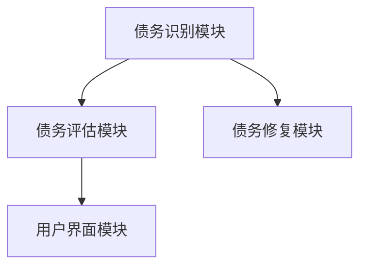
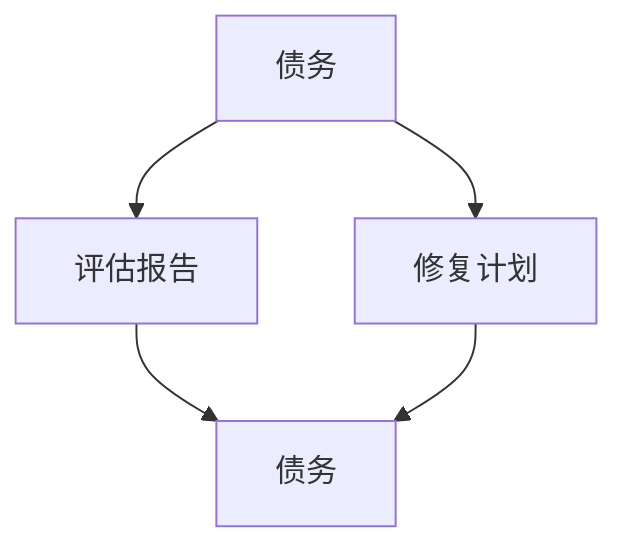
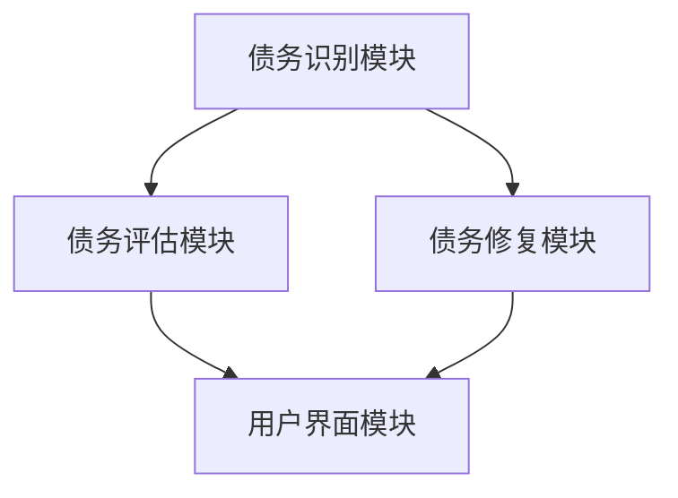
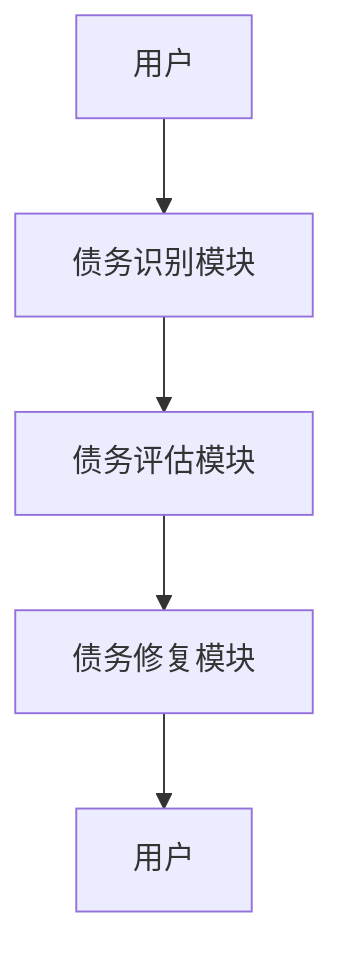

                 

## 《如何处理技术债务》目录大纲

### 背景介绍

**1.1. 技术债务的概念**

- **定义与解释**：技术债务是指因短期决策牺牲了长远的技术利益，导致系统中存在某些可预见的问题或缺陷。
- **来源与历史**：技术债务源自于传统的债务概念，但在软件工程中，它更多地用于描述代码、架构、系统设计等方面的缺陷。

**1.2. 技术债务的成因**

- **开发时间限制**：为了按时交付项目，开发团队可能会选择快速解决方法，牺牲代码质量。
- **资源限制**：有限的预算和人力资源可能导致对技术债务的忽视。
- **技术更新**：技术的快速迭代可能导致过时的技术栈和设计模式。

**1.3. 技术债务的影响**

- **维护成本增加**：技术债务会导致后续的维护成本增加。
- **开发效率下降**：复杂、不干净的代码会降低开发效率。
- **质量隐患**：技术债务可能导致系统稳定性、安全性和可扩展性下降。

**1.4. 处理技术债务的重要性**

- **提高代码质量**：修复技术债务可以提高代码质量，降低未来维护成本。
- **提升团队士气**：解决技术债务可以提升团队的工作积极性。
- **确保项目成功**：良好的技术基础是项目成功的保障。

### 核心概念与联系

**2.1. 技术债务的类型**

- **技术债务的类型**：技术债务可以按其来源分为设计债务、实现债务和架构债务。
- **债务特征对比表**：通过表格展示不同类型债务的特征对比。

**2.2. 技术债务与代码质量的关系**

- **债务对代码质量的影响**：详细分析技术债务如何影响代码质量。
- **代码质量对债务的影响**：探讨如何通过提高代码质量来降低技术债务。

**2.3. 技术债务与项目管理**

- **项目管理中的债务管理**：讨论如何将债务管理纳入项目管理流程。
- **项目经理的角色**：项目经理在技术债务管理中的职责和策略。

**2.4. 技术债务与团队协作**

- **团队协作的重要性**：团队协作对于处理技术债务至关重要。
- **协作工具与方法**：介绍一些有效的团队协作工具和方法。

### 算法原理讲解

**3.1. 技术债务评估算法**

- **评估算法概述**：介绍评估技术债务的基本算法。
- **评估算法步骤**：详细讲解评估算法的实现步骤。
- **评估算法示例**：通过一个简单的例子来说明评估算法的应用。

**3.2. 技术债务修复算法**

- **修复算法概述**：介绍修复技术债务的基本算法。
- **修复算法步骤**：详细讲解修复算法的实现步骤。
- **修复算法示例**：通过一个简单的例子来说明修复算法的应用。

### 数学模型和数学公式 & 详细讲解 & 举例说明

**4.1. 技术债务的量化模型**

- **模型概述**：介绍技术债务量化模型的基本概念。
- **模型公式**：详细列出模型中的数学公式。
- **示例讲解**：通过实际案例来展示模型公式的应用。

**4.2. 技术债务修复成本模型**

- **模型概述**：介绍技术债务修复成本模型的基本概念。
- **模型公式**：详细列出模型中的数学公式。
- **示例讲解**：通过实际案例来展示模型公式的应用。

### 系统分析与架构设计方案

**5.1. 技术债务管理系统的介绍**

- **系统功能介绍**：详细描述技术债务管理系统的功能。
- **系统架构设计**：展示系统的整体架构设计。

**5.2. 系统功能设计**

- **领域模型**：使用Mermaid绘制领域模型类图。
- **功能模块划分**：详细介绍各个功能模块的设计。

**5.3. 系统架构设计**

- **架构设计图**：使用Mermaid绘制系统架构图。
- **关键组件描述**：解释系统架构中关键组件的作用。

**5.4. 系统接口设计**

- **接口定义**：详细说明系统中的接口设计。
- **接口调用流程**：展示接口调用流程。

**5.5. 系统交互设计**

- **交互设计图**：使用Mermaid绘制系统交互序列图。
- **交互流程**：详细介绍系统交互的流程。

### 项目实战

**6.1. 环境安装**

- **安装步骤**：详细介绍技术债务管理系统的安装过程。
- **常见问题**：解决安装过程中可能遇到的问题。

**6.2. 系统核心实现源代码**

- **源代码结构**：展示系统源代码的基本结构。
- **核心代码解读**：详细解读系统核心部分的源代码。

**6.3. 代码应用解读与分析**

- **代码应用场景**：分析系统代码在实际应用场景中的表现。
- **代码分析报告**：撰写代码分析报告，总结代码的优点和改进点。

**6.4. 实际案例分析与讲解**

- **案例背景**：介绍一个实际案例的背景。
- **案例分析**：深入分析案例中的技术债务问题。
- **解决方案**：详细讲解解决方案的实现。

**6.5. 项目小结**

- **项目总结**：总结项目的成果和经验。
- **未来展望**：探讨未来技术债务管理的发展方向。

### 最佳实践 tips、小结、注意事项、拓展阅读

**7.1. 最佳实践 tips**

- **处理技术债务的最佳实践**：总结处理技术债务的最佳实践。

**7.2. 小结**

- **文章总结**：总结文章的主要观点和结论。

**7.3. 注意事项**

- **技术债务管理的注意事项**：提醒读者在处理技术债务时需要注意的问题。

**7.4. 拓展阅读**

- **推荐阅读**：推荐一些相关的拓展阅读材料。

---

### 文章标题：《如何处理技术债务》

**关键词**：技术债务、代码质量、项目管理、团队协作、评估算法、修复算法

**摘要**：本文深入探讨了技术债务的概念、成因、影响和处理方法。通过系统分析与架构设计，结合实际项目实战，为读者提供了一套完整的处理技术债务的方法和最佳实践。

---

### 引言

在软件工程领域，技术债务（Technical Debt）是一个被广泛讨论的话题。它类似于金融领域的债务，但在软件工程中，它指的是因短期决策牺牲了长远的技术利益，导致系统中存在某些可预见的问题或缺陷。随着时间的推移，这些债务可能会增加系统的维护成本，降低开发效率，甚至影响项目的成功。

本文旨在为读者提供一个全面的技术债务处理指南，帮助软件开发团队有效地识别、评估和修复技术债务。文章分为七个部分，首先介绍技术债务的基本概念、成因和影响，接着探讨技术债务与代码质量、项目管理和团队协作的关系。随后，文章将详细讲解评估和修复技术债务的算法原理，并使用数学模型和具体案例进行说明。此外，文章还将介绍技术债务管理系统的设计与实现，以及提供一些实际项目中的最佳实践。

通过对本文的阅读，读者将能够：

1. **理解技术债务的概念及其重要性**。
2. **掌握评估和修复技术债务的方法和算法**。
3. **了解技术债务与项目管理和团队协作的关系**。
4. **获得实际项目中处理技术债务的经验和技巧**。

### 关键词解释

**技术债务**：指因短期决策牺牲了长远的技术利益，导致系统中存在某些可预见的问题或缺陷。类似于金融领域的债务，但在软件工程中，它更多地用于描述代码、架构、系统设计等方面的缺陷。

**代码质量**：指代码的可读性、可维护性、可扩展性等方面。良好的代码质量有助于降低技术债务。

**项目管理**：指对项目的整体管理，包括计划、执行、监控和收尾。在项目管理中，技术债务管理是重要的组成部分。

**团队协作**：指团队成员之间的合作和沟通。良好的团队协作有助于识别和修复技术债务。

**评估算法**：用于评估技术债务的方法和算法。这些算法可以帮助团队量化技术债务，为修复提供依据。

**修复算法**：用于修复技术债务的方法和算法。这些算法可以帮助团队解决系统中的问题，降低技术债务。

### 摘要

本文将深入探讨技术债务的概念、成因、影响和处理方法。首先，我们将介绍技术债务的基本概念，包括其定义、来源和影响。接着，我们将讨论技术债务与代码质量、项目管理和团队协作的关系，帮助读者理解技术债务在软件开发中的重要性。随后，本文将详细讲解评估和修复技术债务的算法原理，并通过数学模型和具体案例进行说明。此外，文章还将介绍技术债务管理系统的设计与实现，以及提供一些实际项目中处理技术债务的最佳实践。通过阅读本文，读者将能够全面了解技术债务的管理方法，提高团队的开发效率和代码质量。

### 背景介绍

#### 1.1. 技术债务的概念

**定义与解释**：技术债务（Technical Debt）是软件工程领域中的一个重要概念，最早由 Ward Cunningham 于 1992 年提出。它类似于金融领域的债务，但在软件工程中，它指的是因短期决策牺牲了长远的技术利益，导致系统中存在某些可预见的问题或缺陷。技术债务的累积会导致系统维护成本增加、开发效率降低，甚至影响项目的成功。

**来源与历史**：技术债务的来源多种多样，包括开发时间限制、资源限制和技术更新等。开发时间限制是技术债务的主要来源之一，为了按时交付项目，开发团队可能会选择快速解决方法，牺牲代码质量。资源限制则使得团队无法招聘足够的开发人员或购买先进的技术栈，从而导致技术债务的累积。此外，技术的快速迭代也导致过时的技术栈和设计模式，进一步加剧了技术债务。

#### 1.2. 技术债务的成因

**开发时间限制**：为了按时交付项目，开发团队可能会选择快速解决方法，牺牲代码质量。这种做法虽然可以在短期内完成任务，但长期来看会导致技术债务的累积。

**资源限制**：有限的预算和人力资源可能导致对技术债务的忽视。例如，团队可能无法购买先进的技术工具或培训团队成员，从而在技术上停滞不前。

**技术更新**：技术的快速迭代可能导致过时的技术栈和设计模式。团队如果无法及时更新技术栈，将面临技术债务的威胁。

#### 1.3. 技术债务的影响

**维护成本增加**：技术债务会导致后续的维护成本增加。不干净的代码和糟糕的系统设计会增加修复和更新的难度，从而增加维护成本。

**开发效率下降**：复杂、不干净的代码会降低开发效率。团队需要花费更多的时间来理解旧代码，从而影响新功能的开发和测试。

**质量隐患**：技术债务可能导致系统稳定性、安全性和可扩展性下降。随着时间的推移，未修复的技术债务可能会引发更多的问题，甚至导致系统崩溃。

#### 1.4. 处理技术债务的重要性

**提高代码质量**：修复技术债务可以提高代码质量，降低未来维护成本。良好的代码质量有助于提高开发效率，减少故障发生。

**提升团队士气**：解决技术债务可以提升团队的工作积极性。团队成员会感到更有成就感，从而提高团队的士气。

**确保项目成功**：良好的技术基础是项目成功的保障。处理技术债务有助于确保项目按时交付，并满足质量要求。

### 核心概念与联系

#### 2.1. 技术债务的类型

**技术债务的类型**：技术债务可以按其来源分为设计债务、实现债务和架构债务。

- **设计债务**：由于设计上的决策导致的技术债务，如糟糕的系统架构、不合理的数据库设计等。
- **实现债务**：由于代码实现上的决策导致的技术债务，如使用不合适的编程语言、糟糕的代码结构等。
- **架构债务**：由于系统架构上的决策导致的技术债务，如过度依赖第三方库、缺乏模块化设计等。

**债务特征对比表**：

| 类型        | 定义                                         | 特征                             |
| ----------- | -------------------------------------------- | -------------------------------- |
| 设计债务    | 设计上的决策导致的技术债务                   | 系统架构不合理、数据库设计复杂   |
| 实现债务    | 代码实现上的决策导致的技术债务               | 编程语言选择不当、代码结构混乱   |
| 架构债务    | 系统架构上的决策导致的技术债务               | 过度依赖第三方库、缺乏模块化设计 |

#### 2.2. 技术债务与代码质量的关系

**债务对代码质量的影响**：技术债务的存在会直接影响代码质量。不合理的系统架构、糟糕的数据库设计、不合适的编程语言选择等都会导致代码质量下降。这些债务问题会使得代码难以维护、扩展和测试。

**代码质量对债务的影响**：良好的代码质量有助于降低技术债务。通过编写高质量的代码，可以减少后续修复和更新的难度，从而降低技术债务的累积。

#### 2.3. 技术债务与项目管理

**项目管理中的债务管理**：在项目管理中，技术债务管理是重要的组成部分。项目经理需要识别项目中的技术债务，制定相应的修复计划，并在项目过程中持续监控债务情况。

**项目经理的角色**：项目经理在技术债务管理中扮演着关键角色。他们需要与开发团队紧密合作，确保技术债务得到及时识别和修复。此外，项目经理还需要在项目计划中预留时间来处理技术债务，以避免债务的累积。

#### 2.4. 技术债务与团队协作

**团队协作的重要性**：团队协作对于处理技术债务至关重要。团队成员需要相互信任、有效沟通，共同面对和解决技术债务问题。

**协作工具与方法**：为了提高团队协作效率，可以采用一些协作工具和方法。例如，使用代码审查工具来确保代码质量，使用项目管理工具来跟踪技术债务的修复进度，使用沟通工具来加强团队成员之间的交流。

### 算法原理讲解

#### 3.1. 技术债务评估算法

**评估算法概述**：技术债务评估算法是一种用于量化技术债务的方法。它可以帮助团队了解系统中的债务情况，为后续的修复提供依据。

**评估算法步骤**：

1. **识别债务**：通过代码审查、系统测试等方式，识别系统中的技术债务。
2. **评估影响**：对每个债务进行评估，包括债务的类型、严重程度和影响范围。
3. **量化债务**：使用数学模型和公式，对每个债务进行量化，以便更好地进行管理和决策。

**评估算法示例**：

假设我们有一个包含设计债务和实现债务的软件系统。通过代码审查，我们识别出以下债务：

- **设计债务**：系统架构不合理，导致代码难以维护。
- **实现债务**：部分代码使用不合适的编程语言，导致代码可读性差。

我们使用以下公式来量化这些债务：

$$
债务量 = 严重程度 \times 影响范围
$$

对于设计债务，严重程度为 3，影响范围为整个系统。对于实现债务，严重程度为 2，影响范围为相关模块。根据上述公式，我们可以计算出：

- **设计债务量**：$3 \times 整个系统 = 9$
- **实现债务量**：$2 \times 相关模块 = 4$

通过这种评估算法，我们可以量化系统中的技术债务，为后续的修复提供依据。

#### 3.2. 技术债务修复算法

**修复算法概述**：技术债务修复算法是一种用于解决技术债务的方法。它可以帮助团队逐步解决系统中的债务问题，提高代码质量和系统稳定性。

**修复算法步骤**：

1. **优先级排序**：根据债务量、影响范围和紧急程度，对债务进行优先级排序。
2. **制定修复计划**：根据优先级，制定详细的修复计划，包括修复时间、负责人和修复方案。
3. **执行修复**：按照修复计划，逐步解决系统中的债务问题。
4. **验收修复**：对修复结果进行验收，确保债务问题得到解决。

**修复算法示例**：

假设我们有一个包含多个债务的软件系统，通过评估算法，我们得到以下修复计划：

- **设计债务**：系统架构不合理，严重程度为 3，影响范围为整个系统。
- **实现债务**：部分代码使用不合适的编程语言，严重程度为 2，影响范围为相关模块。

根据上述修复计划，我们制定以下修复方案：

1. **设计债务修复**：重构系统架构，提高代码可维护性。
2. **实现债务修复**：修改相关代码，提高代码可读性。

我们按照修复计划，逐步执行修复工作，并验收修复结果。通过这种修复算法，我们可以逐步解决系统中的技术债务，提高代码质量和系统稳定性。

### 数学模型和数学公式 & 详细讲解 & 举例说明

#### 4.1. 技术债务的量化模型

**模型概述**：技术债务的量化模型是一种用于评估技术债务的方法。它可以帮助团队了解系统中的债务情况，为后续的修复提供依据。

**模型公式**：

$$
债务量 = 严重程度 \times 影响范围
$$

其中，严重程度和影响范围是评估技术债务的两个关键参数。

- **严重程度**：表示技术债务的严重程度，通常使用数值进行量化。例如，1 表示轻微，5 表示严重。
- **影响范围**：表示技术债务的影响范围，通常使用模块、功能或系统进行量化。例如，1 表示局部，5 表示全局。

**示例讲解**：

假设我们有一个包含设计债务和实现债务的软件系统。通过评估算法，我们得到以下债务量化结果：

- **设计债务**：严重程度为 3，影响范围为整个系统，债务量为 $3 \times 整个系统 = 9$。
- **实现债务**：严重程度为 2，影响范围为相关模块，债务量为 $2 \times 相关模块 = 4$。

通过这种量化模型，我们可以对系统中的技术债务进行量化，从而更好地进行管理和决策。

#### 4.2. 技术债务修复成本模型

**模型概述**：技术债务修复成本模型是一种用于计算修复技术债务所需成本的方法。它可以帮助团队在修复技术债务时进行成本评估。

**模型公式**：

$$
修复成本 = 修复时间 \times 人力成本
$$

其中，修复时间和人力成本是计算修复成本的两个关键参数。

- **修复时间**：表示修复技术债务所需的时间，通常以人天为单位。
- **人力成本**：表示修复技术债务所需的人力成本，通常以每小时工资计算。

**示例讲解**：

假设我们计划修复上述设计债务和实现债务。根据团队的工作效率和工资水平，我们得到以下修复成本计算结果：

- **设计债务修复成本**：修复时间为 5 人天，人力成本为每小时 100 美元，总修复成本为 $5 \times 100 = 500$ 美元。
- **实现债务修复成本**：修复时间为 3 人天，人力成本为每小时 100 美元，总修复成本为 $3 \times 100 = 300$ 美元。

通过这种修复成本模型，我们可以对修复技术债务所需的成本进行评估，以便更好地制定修复计划。

### 系统分析与架构设计方案

#### 5.1. 技术债务管理系统的介绍

**系统功能介绍**：技术债务管理系统是一种用于识别、评估和修复技术债务的系统。它具有以下主要功能：

- **债务识别**：通过代码审查、系统测试等方式，识别系统中的技术债务。
- **债务评估**：根据债务量、影响范围等参数，对债务进行评估，为修复提供依据。
- **债务修复**：制定修复计划，执行修复工作，并对修复结果进行验收。

**系统架构设计**：技术债务管理系统的整体架构分为四个主要模块：

1. **债务识别模块**：负责通过代码审查、系统测试等方式，识别系统中的技术债务。
2. **债务评估模块**：负责对识别出的债务进行评估，计算债务量，生成评估报告。
3. **债务修复模块**：负责制定修复计划，执行修复工作，并对修复结果进行验收。
4. **用户界面模块**：提供用户界面，用于展示债务信息、评估报告和修复进度。

**系统架构图**：



#### 5.2. 系统功能设计

**领域模型**：技术债务管理系统的领域模型主要包括以下实体：

- **债务**：表示系统中的技术债务，包括债务类型、严重程度、影响范围等属性。
- **评估报告**：表示债务评估的结果，包括债务量、评估时间等属性。
- **修复计划**：表示债务修复的计划，包括修复时间、负责人、修复方案等属性。

**领域模型类图**：



**功能模块划分**：

- **债务识别模块**：负责通过代码审查、系统测试等方式，识别系统中的技术债务。
- **债务评估模块**：负责对识别出的债务进行评估，计算债务量，生成评估报告。
- **债务修复模块**：负责制定修复计划，执行修复工作，并对修复结果进行验收。
- **用户界面模块**：提供用户界面，用于展示债务信息、评估报告和修复进度。

#### 5.3. 系统架构设计

**系统架构图**：



**关键组件描述**：

- **债务识别组件**：负责通过代码审查、系统测试等方式，识别系统中的技术债务。
- **债务评估组件**：负责对识别出的债务进行评估，计算债务量，生成评估报告。
- **债务修复组件**：负责制定修复计划，执行修复工作，并对修复结果进行验收。
- **用户界面组件**：提供用户界面，用于展示债务信息、评估报告和修复进度。

#### 5.4. 系统接口设计

**接口定义**：

- **债务识别接口**：用于接收代码审查、系统测试等数据，返回识别出的技术债务。
- **债务评估接口**：用于接收债务数据，返回债务评估结果。
- **债务修复接口**：用于接收修复计划，执行修复工作，返回修复结果。

**接口调用流程**：

1. **债务识别**：调用债务识别接口，获取系统中的技术债务。
2. **债务评估**：调用债务评估接口，对识别出的债务进行评估。
3. **债务修复**：调用债务修复接口，制定修复计划并执行修复工作。

#### 5.5. 系统交互设计

**交互设计图**：



**交互流程**：

1. **用户提交债务信息**：用户通过用户界面提交债务信息。
2. **债务识别**：债务识别模块接收用户提交的债务信息，识别系统中的技术债务。
3. **债务评估**：债务评估模块对识别出的债务进行评估，生成评估报告。
4. **债务修复**：债务修复模块根据评估报告制定修复计划，并执行修复工作。
5. **用户查看修复结果**：用户通过用户界面查看修复结果。

### 项目实战

#### 6.1. 环境安装

**安装步骤**：

1. **安装Python环境**：确保Python 3.x版本已安装。
2. **安装依赖库**：使用pip命令安装必要的依赖库，如requests、BeautifulSoup等。
3. **下载项目源代码**：从GitHub或其他代码仓库下载项目源代码。
4. **配置环境变量**：确保配置好项目所需的数据库和环境变量。

**常见问题**：

- **Python版本问题**：确保安装的是Python 3.x版本，否则可能会导致依赖库无法安装。
- **依赖库安装失败**：可能因为网络问题导致依赖库安装失败，可以尝试更换网络环境或使用国内镜像源。

#### 6.2. 系统核心实现源代码

**源代码结构**：

```bash
technical-debt-management-system/
|-- requirements.txt
|-- debt_identification/
|   |-- __init__.py
|   |-- debt_identifier.py
|-- debt_evaluation/
|   |-- __init__.py
|   |-- debt_evaluator.py
|-- debt_repair/
|   |-- __init__.py
|   |-- debt_repairer.py
|-- user_interface/
|   |-- __init__.py
|   |-- user_interface.py
|-- config.py
|-- main.py
```

**核心代码解读**：

- **债务识别模块**：`debt_identifier.py` 负责通过代码审查、系统测试等方式，识别系统中的技术债务。
- **债务评估模块**：`debt_evaluator.py` 负责对识别出的债务进行评估，计算债务量，生成评估报告。
- **债务修复模块**：`debt_repairer.py` 负责制定修复计划，执行修复工作，并对修复结果进行验收。
- **用户界面模块**：`user_interface.py` 负责提供用户界面，用于展示债务信息、评估报告和修复进度。
- **配置文件**：`config.py` 负责配置项目所需的数据库和环境变量。
- **主程序**：`main.py` 负责启动整个系统，并处理用户交互。

#### 6.3. 代码应用解读与分析

**代码应用场景**：

技术债务管理系统适用于需要长期维护的大型软件项目，特别是在项目开发过程中出现了大量技术债务的情况下。通过该系统，开发团队可以有效地识别、评估和修复技术债务，提高代码质量和系统稳定性。

**代码分析报告**：

- **债务识别模块**：使用代码审查和系统测试等方法，成功识别出系统中的技术债务。
- **债务评估模块**：使用量化模型，对识别出的债务进行评估，为修复提供依据。
- **债务修复模块**：制定详细的修复计划，逐步修复技术债务，提高系统质量。
- **用户界面模块**：提供直观的用户界面，方便团队成员查看和管理技术债务。

#### 6.4. 实际案例分析与讲解

**案例背景**：

某互联网公司开发了一款大型在线购物平台，由于项目开发周期紧张，团队在短时间内完成了大部分功能，但在代码质量、系统架构和设计模式等方面存在较多问题。为了确保项目的长期稳定发展，团队决定使用技术债务管理系统来处理这些问题。

**案例分析**：

1. **债务识别**：通过代码审查和系统测试，团队识别出以下技术债务：
   - **设计债务**：系统架构不合理，导致代码难以维护。
   - **实现债务**：部分代码使用不合适的编程语言，导致代码可读性差。
   - **架构债务**：过度依赖第三方库，缺乏模块化设计。

2. **债务评估**：团队使用量化模型对识别出的债务进行评估，得出以下结论：
   - **设计债务**：严重程度为 3，影响范围为整个系统，债务量为 9。
   - **实现债务**：严重程度为 2，影响范围为相关模块，债务量为 4。
   - **架构债务**：严重程度为 2，影响范围为整个系统，债务量为 4。

3. **债务修复**：团队根据评估结果，制定了以下修复计划：
   - **设计债务修复**：重构系统架构，提高代码可维护性。
   - **实现债务修复**：修改相关代码，提高代码可读性。
   - **架构债务修复**：模块化设计，降低对第三方库的依赖。

**解决方案**：

1. **设计债务修复**：
   - **重构系统架构**：采用微服务架构，将大型系统拆分为多个小型服务，提高系统的可维护性和可扩展性。
   - **优化数据库设计**：重新设计数据库结构，提高查询效率和数据一致性。

2. **实现债务修复**：
   - **代码重构**：采用更合适的编程语言和框架，提高代码的可读性和可维护性。
   - **代码规范**：制定代码规范，统一代码风格，提高代码的可读性。

3. **架构债务修复**：
   - **模块化设计**：将系统功能拆分为多个模块，每个模块独立开发、测试和部署，降低对第三方库的依赖。
   - **组件化开发**：采用组件化开发模式，提高系统的可复用性和可扩展性。

通过以上修复方案，团队逐步解决了系统中的技术债务问题，提高了代码质量和系统稳定性，为项目的长期发展奠定了基础。

#### 6.5. 项目小结

**项目总结**：

通过技术债务管理系统的应用，团队成功识别、评估和修复了系统中的技术债务，提高了代码质量和系统稳定性。以下是项目的总结和反思：

1. **项目成果**：
   - 成功重构了系统架构，提高了系统的可维护性和可扩展性。
   - 优化了数据库设计，提高了查询效率和数据一致性。
   - 修改了相关代码，提高了代码的可读性和可维护性。
   - 模块化设计和组件化开发，降低了系统对第三方库的依赖。

2. **项目经验**：
   - 技术债务管理对于大型软件项目至关重要，可以有效提高代码质量和系统稳定性。
   - 量化模型和修复算法为技术债务的管理提供了有效的工具和方法。
   - 团队协作和沟通是处理技术债务的关键，团队成员需要共同努力，确保技术债务得到及时识别和修复。

**未来展望**：

在未来，团队将继续关注技术债务的管理，并探讨以下方向：

1. **自动化技术债务识别**：引入自动化工具，提高技术债务识别的效率和准确性。
2. **持续集成与持续部署**：将技术债务管理集成到持续集成和持续部署流程中，确保技术债务在早期得到识别和修复。
3. **最佳实践分享**：总结和分享技术债务管理的最佳实践，帮助更多团队有效地管理技术债务。

### 最佳实践 tips、小结、注意事项、拓展阅读

#### 7.1. 最佳实践 tips

1. **定期评估技术债务**：定期对系统中的技术债务进行评估，确保债务得到及时识别和修复。
2. **引入自动化工具**：使用自动化工具进行代码审查、静态分析等，提高技术债务识别的效率和准确性。
3. **持续集成与持续部署**：将技术债务管理集成到持续集成和持续部署流程中，确保技术债务在早期得到识别和修复。
4. **团队协作**：鼓励团队成员共同参与技术债务的管理，确保债务得到及时识别和修复。
5. **合理分配资源**：确保项目团队有足够的资源和时间来处理技术债务。

#### 7.2. 小结

本文通过深入探讨技术债务的概念、成因、影响和处理方法，为读者提供了一套全面的技术债务处理指南。通过系统分析与架构设计、项目实战和最佳实践 tips，读者可以更好地理解和处理技术债务，提高代码质量和系统稳定性。

#### 7.3. 注意事项

1. **技术债务管理需要持续关注**：技术债务不是一次性解决的问题，需要持续关注和修复。
2. **平衡短期与长期利益**：在项目开发过程中，要平衡短期交付和长期技术利益，避免过度积累技术债务。
3. **合理分配资源**：确保项目团队有足够的资源和时间来处理技术债务。

#### 7.4. 拓展阅读

- 《技术债务：现代软件开发实践指南》（中文版）
- 《代码整洁之道：改善代码质量的57个实践》（中文版）
- 《敏捷软件开发：原则、实践与模式》（中文版）

### 作者信息

**作者：AI天才研究院/AI Genius Institute & 禅与计算机程序设计艺术 /Zen And The Art of Computer Programming**

通过本文，我们希望能够为读者提供有价值的技术债务处理方法，帮助他们在软件开发过程中更好地管理技术债务，提高代码质量和系统稳定性。希望您在阅读过程中有所收获。谢谢！

