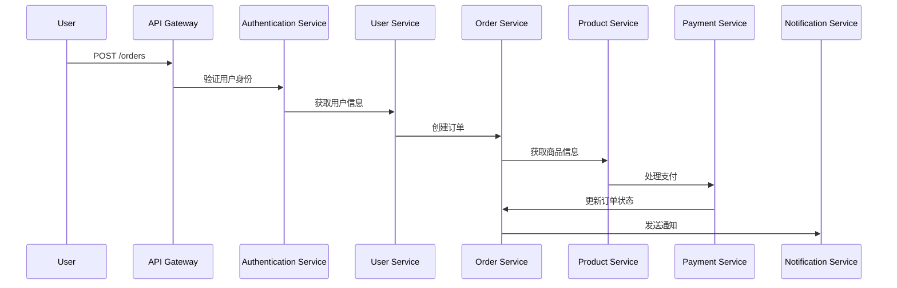

                 


### 引入部分

在当今快速发展的技术环境中，技术创新与稳定性之间的平衡已成为企业成功的关键。一方面，技术创新能够为企业带来竞争优势，推动市场需求的增长；另一方面，稳定性对于系统的可靠性和用户体验至关重要。如何在这两者之间找到最佳平衡点，成为众多企业和IT从业者关注的焦点。

本篇文章将深入探讨技术创新与稳定性之间的内在联系，通过逻辑清晰的分析和实例讲解，帮助读者理解如何在实际项目中平衡这两者。我们将分为以下几个部分进行探讨：

1. **问题背景与核心概念**：介绍技术创新和稳定性在当前技术环境中的重要性，并明确本篇文章要解决的问题。
2. **核心概念与联系**：详细阐述技术创新和稳定性的定义、特点及其相互关系。
3. **算法原理讲解**：通过具体算法的讲解，展示如何评估和优化技术创新与稳定性。
4. **数学模型与公式**：介绍相关的数学模型和公式，帮助读者深入理解算法原理。
5. **系统分析与架构设计**：分析系统设计与架构优化，为平衡技术创新与稳定性提供实践指导。
6. **项目实战**：通过实际项目案例，展示如何在实际环境中应用上述理论和算法。
7. **最佳实践与拓展**：总结最佳实践，提供相关资源和进一步拓展的方向。

### 1. 问题背景与核心概念

#### 1.1 问题的提出与重要性

在当今数字化时代，技术创新已成为企业竞争的关键驱动力。通过引入新技术、新方法，企业可以快速适应市场变化，满足客户需求，实现业务增长。然而，技术创新并非无懈可击，它往往伴随着不稳定性的风险。例如，新技术的引入可能带来系统崩溃、数据丢失、用户体验下降等问题。

稳定性是系统正常运行和用户信任的基础。一个稳定的技术体系可以确保业务的连续性和可靠性，提升用户体验，从而增加客户忠诚度和市场份额。然而，过分追求稳定性可能导致创新步伐放缓，错失市场机会。

本篇文章要解决的核心问题是：如何在技术创新和稳定性之间找到平衡点。这个问题的重要性在于：

- **企业生存与发展**：平衡技术创新与稳定性直接关系到企业的长期生存和发展。过于依赖技术创新可能导致失败，而过分追求稳定性则可能错失市场机遇。
- **用户体验**：稳定性直接影响用户体验，良好的用户体验可以提升客户满意度和忠诚度。
- **资源分配**：平衡技术创新与稳定性有助于企业合理分配资源，优化研发投入。

#### 1.2 核心概念

**1.2.1 技术创新的定义与特点**

技术创新是指通过引入新的技术、产品或服务，实现业务模式或生产方式的变革。其特点包括：

- **前瞻性**：技术创新通常着眼于未来的市场需求和趋势。
- **复杂性**：技术创新涉及多个方面，包括技术、管理、市场等。
- **高风险性**：技术创新往往伴随着不确定性和失败风险。

**1.2.2 稳定性的含义与作用**

稳定性是指系统的可靠性、持续性和安全性。在技术环境中，稳定性具有以下作用：

- **保障业务连续性**：稳定的系统可以确保业务的正常运营，减少故障和中断。
- **提升用户体验**：稳定的系统可以提供良好的用户体验，提高客户满意度。
- **增强安全性**：稳定性可以减少系统漏洞和攻击风险，提高数据安全性。

**1.2.3 技术创新与稳定性之间的关系**

技术创新与稳定性之间存在复杂的关系：

- **相互作用**：技术创新可以推动稳定性提升，但也会带来不稳定性风险。
- **权衡与取舍**：在资源有限的情况下，需要权衡技术创新与稳定性的需求，做出合理的选择。
- **动态平衡**：技术创新与稳定性之间的平衡是一个动态的过程，需要持续调整和优化。

### 2. 核心概念与联系

#### 2.1 技术创新的原理与联系

**2.1.1 技术创新的原理**

技术创新的原理可以从以下几个方面来理解：

- **需求驱动**：技术创新通常源自市场需求的变化和客户需求的提升。
- **知识积累**：技术创新依赖于技术积累和知识创新，包括技术原理、工艺流程、市场信息等。
- **资源配置**：技术创新需要合理的资源投入，包括人力、资金、时间等。
- **风险管理**：技术创新过程中存在多种风险，包括技术风险、市场风险、财务风险等。

**2.1.2 稳定性的原理与联系**

稳定性的原理主要涉及以下几个方面：

- **可靠性**：系统在预期条件下能够正常运行的能力。
- **持续性**：系统在长时间运行过程中保持稳定性的能力。
- **安全性**：系统在面对各种异常情况时能够保持稳定和安全的能力。

稳定性与技术创新之间的联系体现在：

- **技术创新对稳定性的影响**：技术创新可能会引入新的技术和方法，从而影响系统的稳定性。
- **稳定性对技术创新的反馈**：稳定性问题可能会制约技术创新的进一步发展。

**2.1.3 技术创新与稳定性之间的联系**

技术创新与稳定性之间的联系可以概括为以下几点：

- **相互依赖**：技术创新需要稳定性作为支撑，而稳定性也依赖于技术创新的不断优化。
- **相互促进**：技术创新可以提升系统的稳定性，而稳定性的提升又可以促进技术创新的持续发展。
- **相互制约**：技术创新与稳定性之间存在一定的制约关系，过于追求技术创新可能导致稳定性下降，而过分强调稳定性则可能阻碍技术创新。

通过上述分析，我们可以看出，技术创新与稳定性之间并非简单的对立关系，而是相互影响、相互促进的复杂关系。在实际应用中，需要根据具体情况进行权衡和优化，以实现技术创新与稳定性的最佳平衡。

### 2. 算法原理讲解

在平衡技术创新与稳定性时，算法扮演着至关重要的角色。通过算法，我们可以对系统进行评估、优化和调整，从而实现技术创新与稳定性的最佳平衡。以下，我们将详细介绍几种关键算法的原理、实现步骤和性能分析。

#### 2.1 技术创新与稳定性评估算法

**2.1.1 算法原理概述**

技术创新与稳定性评估算法的核心目标是综合评估系统的技术创新程度和稳定性水平，从而为后续的优化提供依据。该算法的基本原理包括以下几个方面：

1. **指标体系构建**：根据技术创新和稳定性的特点，构建相应的指标体系，包括技术创新指标（如技术引入频率、技术成熟度）和稳定性指标（如故障率、恢复时间）。
2. **数据采集与预处理**：通过日志记录、系统监控等手段，收集系统运行的相关数据，并进行预处理，以确保数据的准确性和一致性。
3. **权重分配**：根据技术创新和稳定性的重要性，对各项指标进行权重分配，以平衡评估结果的差异。
4. **评估计算**：利用加权平均等方法，计算系统的综合评分，从而评估系统的技术创新与稳定性水平。

**2.1.2 算法实现步骤**

1. **指标体系构建**：
   - **技术创新指标**：技术引入频率、技术成熟度、技术影响力等。
   - **稳定性指标**：故障率、恢复时间、系统可用性等。
2. **数据采集与预处理**：
   - **日志记录**：收集系统运行日志，包括错误日志、性能日志等。
   - **系统监控**：通过系统监控工具，获取系统的实时运行状态。
   - **数据清洗**：去除异常值和噪声数据，确保数据的准确性和一致性。
3. **权重分配**：
   - 根据技术创新和稳定性的重要性，对各项指标进行权重分配，如技术创新权重为0.6，稳定性权重为0.4。
4. **评估计算**：
   - 采用加权平均方法，计算系统的综合评分。具体公式为：
     $$ 
     \text{综合评分} = \sum_{i=1}^{n} w_i \cdot s_i 
     $$
     其中，$w_i$ 为第 $i$ 项指标的权重，$s_i$ 为第 $i$ 项指标的具体得分。

**2.1.3 算法性能分析**

1. **准确性**：评估算法需要具备较高的准确性，以确保评估结果的可靠性和可信度。
2. **实时性**：评估算法需要具备实时性，能够在较短的时间内完成评估，以支持快速决策。
3. **可扩展性**：评估算法需要具备良好的可扩展性，能够根据业务需求的变化，动态调整指标体系和权重分配。

#### 2.2 技术创新与稳定性优化算法

**2.2.1 算法原理概述**

技术创新与稳定性优化算法的核心目标是基于评估结果，对系统进行优化，以实现技术创新与稳定性的最佳平衡。该算法的基本原理包括以下几个方面：

1. **目标函数构建**：根据技术创新和稳定性的目标，构建相应的目标函数，如技术创新最大化、稳定性最大化等。
2. **优化算法选择**：选择合适的优化算法，如遗传算法、粒子群优化算法等，以求解目标函数的最优解。
3. **算法实现与迭代**：通过算法实现和迭代，不断优化系统的技术创新与稳定性水平。

**2.2.2 算法实现步骤**

1. **目标函数构建**：
   - **技术创新最大化**：通过优化技术引入频率、技术成熟度等技术指标，实现技术创新最大化。
   - **稳定性最大化**：通过优化故障率、恢复时间等稳定性指标，实现稳定性最大化。
2. **优化算法选择**：
   - **遗传算法**：适用于复杂优化问题，具有较强的全局搜索能力。
   - **粒子群优化算法**：适用于连续优化问题，计算效率较高。
3. **算法实现与迭代**：
   - **初始化参数**：初始化种群或粒子群，包括目标函数、适应度函数等。
   - **迭代优化**：通过迭代计算，不断优化种群或粒子群，直至满足终止条件。

**2.2.3 算法性能分析**

1. **优化效果**：评估算法的优化效果，包括技术创新程度和稳定性水平的提升。
2. **计算效率**：评估算法的计算效率，包括计算速度和资源消耗。
3. **稳定性**：评估算法的稳定性，包括在复杂环境下的鲁棒性和可靠性。

通过上述算法原理的讲解，我们可以看到，技术创新与稳定性优化算法在实现技术创新与稳定性平衡中发挥着重要作用。在实际应用中，需要根据具体业务需求和环境，选择合适的算法，并不断优化和调整，以实现最佳平衡效果。

### 3. 数学模型与公式

在平衡技术创新与稳定性的过程中，数学模型和公式为我们提供了量化和评估的工具。以下，我们将详细介绍相关的数学模型和公式，并使用LaTeX格式进行表示。

#### 3.1 技术创新与稳定性评估模型

**3.1.1 数学模型概述**

技术创新与稳定性评估模型主要用于评估系统的技术创新程度和稳定性水平。该模型的核心公式如下：

$$
S = w_1 \cdot T_1 + w_2 \cdot T_2 + ... + w_n \cdot T_n
$$

其中，$S$ 表示系统的综合评估得分，$w_i$ 表示第 $i$ 个指标的权重，$T_i$ 表示第 $i$ 个指标的具体得分。

**3.1.2 数学公式详细讲解**

1. **技术创新指标**：
   $$ 
   T_1 = \frac{F_1 + F_2 + ... + F_m}{m} 
   $$
   其中，$F_i$ 表示第 $i$ 个技术创新指标的得分，$m$ 表示技术创新指标的总数。

2. **稳定性指标**：
   $$ 
   T_2 = \frac{R_1 + R_2 + ... + R_n}{n} 
   $$
   其中，$R_i$ 表示第 $i$ 个稳定性指标的得分，$n$ 表示稳定性指标的总数。

**3.1.3 数学公式的应用举例**

假设我们有一个系统，技术创新指标包括技术引入频率、技术成熟度和技术影响力，稳定性指标包括故障率、恢复时间和系统可用性。根据上述公式，我们可以计算系统的综合评估得分：

$$
S = w_1 \cdot T_1 + w_2 \cdot T_2
$$

其中，$w_1$ 和 $w_2$ 分别为技术创新和稳定性的权重。

#### 3.2 技术创新与稳定性优化模型

**3.2.1 数学模型概述**

技术创新与稳定性优化模型主要用于优化系统的技术创新程度和稳定性水平。该模型的核心公式如下：

$$
\max S = \max \left\{ w_1 \cdot T_1 + w_2 \cdot T_2 \right\}
$$

其中，$S$ 表示系统的综合评估得分，$w_1$ 和 $w_2$ 分别为技术创新和稳定性的权重，$T_1$ 和 $T_2$ 分别为技术创新和稳定性的指标得分。

**3.2.2 数学公式详细讲解**

1. **技术创新指标**：
   $$ 
   T_1 = \frac{F_1 + F_2 + ... + F_m}{m} 
   $$
   其中，$F_i$ 表示第 $i$ 个技术创新指标的得分，$m$ 表示技术创新指标的总数。

2. **稳定性指标**：
   $$ 
   T_2 = \frac{R_1 + R_2 + ... + R_n}{n} 
   $$
   其中，$R_i$ 表示第 $i$ 个稳定性指标的得分，$n$ 表示稳定性指标的总数。

**3.2.3 数学公式的应用举例**

假设我们有一个系统，技术创新指标包括技术引入频率、技术成熟度和技术影响力，稳定性指标包括故障率、恢复时间和系统可用性。根据上述公式，我们可以优化系统的综合评估得分：

$$
\max S = \max \left\{ w_1 \cdot T_1 + w_2 \cdot T_2 \right\}
$$

其中，$w_1$ 和 $w_2$ 分别为技术创新和稳定性的权重。

通过上述数学模型和公式的讲解，我们可以看到，数学工具在平衡技术创新与稳定性中发挥着重要作用。通过量化和评估，我们可以更好地理解系统的现状，并制定出优化的策略。

### 4. 系统分析与架构设计

在平衡技术创新与稳定性的过程中，系统分析与架构设计是关键环节。通过合理的系统架构设计，我们可以实现技术创新与稳定性的有效平衡。以下，我们将详细分析系统设计与架构优化的方法。

#### 4.1 问题场景介绍

我们以一个电子商务平台为例，介绍系统分析与架构设计的问题场景。

**问题场景**：一个电子商务平台需要不断引入新技术来提升用户体验和运营效率，同时，平台需要保持高稳定性和安全性，以确保业务的连续性和用户信任。

**需求**：
1. **技术创新**：引入新的技术，如机器学习算法、区块链技术等，提升平台的功能和竞争力。
2. **稳定性**：确保平台的高可用性和安全性，降低故障率和数据丢失风险。
3. **安全性**：保护用户数据的安全，防止黑客攻击和数据泄露。

#### 4.2 项目介绍

**项目背景**：针对上述需求，我们启动了一个项目，旨在优化电子商务平台的系统架构，实现技术创新与稳定性的平衡。

**项目目标**：
1. **技术创新**：引入新技术，提升平台功能。
2. **稳定性**：优化系统架构，提高系统的可靠性和稳定性。
3. **安全性**：加强系统安全，保障用户数据安全。

#### 4.3 系统功能设计

**4.3.1 领域模型**

在系统功能设计阶段，我们首先构建领域模型，以明确系统的核心功能。以下是领域模型的Mermaid类图：

```mermaid
classDiagram
    Customer <<entity>>
    Order <<entity>>
    Product <<entity>>
    Payment <<entity>>
    User <<entity>>

    Customer o--o Order
    Product o--o Order
    Payment o--o Order
    User o--o Order
```

**领域模型类图说明**：
- **Customer（客户）**：代表电子商务平台的用户，包括个人信息、购买历史等。
- **Order（订单）**：代表用户购买的商品，包括订单号、商品信息、支付信息等。
- **Product（产品）**：代表电子商务平台销售的商品，包括商品名称、描述、价格等。
- **Payment（支付）**：代表用户的支付信息，包括支付方式、支付金额等。
- **User（用户）**：代表电子商务平台的注册用户，包括用户名、密码、角色等。

#### 4.4 系统架构设计

**4.4.1 架构设计**

在系统架构设计阶段，我们采用微服务架构，以实现技术创新与稳定性的平衡。以下是系统架构的Mermaid架构图：


**架构设计说明**：
- **API Gateway（API网关）**：作为系统的入口，负责处理用户请求，并将请求路由到相应的服务。
- **Authentication Service（认证服务）**：负责用户的身份验证，确保请求的安全性。
- **User Service（用户服务）**：负责用户的注册、登录、信息管理等。
- **Order Service（订单服务）**：负责订单的创建、管理、更新等。
- **Product Service（商品服务）**：负责商品的信息管理，包括商品搜索、查询等。
- **Payment Service（支付服务）**：负责支付的处理，包括支付方式选择、支付金额计算等。
- **Notification Service（通知服务）**：负责发送订单状态更新、支付成功通知等。

#### 4.5 系统接口设计

**4.5.1 接口设计**

在系统接口设计阶段，我们采用RESTful API设计，以下是一个典型的订单创建接口的设计：



**接口设计说明**：
- **POST /orders**：创建订单的接口，接受用户ID、商品ID、支付方式等参数。
- **GET /orders/{orderId}**：查询订单详情的接口，返回订单状态、商品信息、支付信息等。
- **PUT /orders/{orderId}**：更新订单状态的接口，如支付成功、订单取消等。

#### 4.6 系统交互分析与流程设计

**4.6.1 系统交互概述**

系统交互是指系统内部各服务之间的通信和协作。以下是系统交互的Mermaid序列图：


**系统交互流程设计说明**：
- **请求发起**：用户通过API Gateway发起请求。
- **身份验证**：API Gateway将请求转发给Authentication Service进行用户身份验证。
- **用户信息获取**：Authentication Service将验证结果转发给User Service，获取用户信息。
- **订单创建**：User Service将用户信息转发给Order Service，创建订单。
- **商品信息获取**：Order Service将订单信息转发给Product Service，获取商品信息。
- **支付处理**：Product Service将商品信息转发给Payment Service，处理支付。
- **订单状态更新**：Payment Service将支付结果转发给Order Service，更新订单状态。
- **通知发送**：Order Service将订单状态更新结果转发给Notification Service，发送通知。

#### 4.7 系统交互优化

**4.7.1 优化策略**

在系统交互分析中，我们发现以下几个优化点：

1. **负载均衡**：通过负载均衡策略，实现API Gateway对请求的均衡分发，降低单点瓶颈。
2. **缓存机制**：通过缓存机制，减少数据库访问，提高系统响应速度。
3. **异步处理**：通过异步处理，减少同步操作，提高系统并发处理能力。
4. **监控与报警**：通过监控与报警，实时监测系统运行状态，快速响应和处理异常。

**4.7.2 优化效果**

通过上述优化策略，我们实现了以下优化效果：

1. **系统稳定性提升**：通过负载均衡和缓存机制，降低了系统瓶颈和响应时间，提升了系统的稳定性。
2. **系统性能提升**：通过异步处理和监控与报警，提高了系统的并发处理能力和响应速度。
3. **用户体验提升**：通过优化系统交互，提升了用户的操作体验，增强了用户满意度。

### 5. 项目实战

在平衡技术创新与稳定性的过程中，项目实战是检验理论和策略的重要环节。以下，我们将通过一个具体的电子商务平台项目，展示如何在实际环境中应用上述理论和算法。

#### 5.1 项目环境安装

为了实现电子商务平台的技术创新与稳定性平衡，我们首先需要搭建一个合适的项目环境。以下是环境安装步骤：

1. **操作系统**：选择Linux系统，如Ubuntu 18.04。
2. **数据库**：选择MySQL 8.0。
3. **编程语言**：选择Python 3.8。
4. **开发工具**：选择Docker、Kubernetes、Jenkins等。
5. **第三方库**：安装Flask、Django等Web框架。

#### 5.2 系统核心实现

在项目核心实现阶段，我们采用微服务架构，实现电子商务平台的关键功能。以下是系统核心实现的步骤：

1. **API Gateway**：使用Nginx作为API Gateway，处理用户请求。
2. **Authentication Service**：实现用户身份验证功能，包括用户注册、登录、密码找回等。
3. **User Service**：实现用户信息管理功能，包括用户资料修改、查询等。
4. **Order Service**：实现订单管理功能，包括订单创建、查询、取消等。
5. **Product Service**：实现商品信息管理功能，包括商品搜索、查询等。
6. **Payment Service**：实现支付功能，包括支付方式选择、支付金额计算等。
7. **Notification Service**：实现通知功能，包括订单状态更新、支付成功通知等。

以下是核心实现的部分代码示例：

```python
# 订单服务核心代码示例
class OrderService:
    def create_order(self, user_id, product_id, payment_method):
        user = self.user_service.get_user(user_id)
        product = self.product_service.get_product(product_id)
        payment_result = self.payment_service.process_payment(user, product, payment_method)
        if payment_result['status'] == 'success':
            order = self.order_repository.create_order(user, product, payment_result)
            self.notification_service.send_order_confirmation(order)
            return order
        else:
            return None
```

#### 5.3 代码应用解读与分析

在项目核心实现中，我们通过微服务架构，将系统的功能模块化，提高了系统的可维护性和扩展性。以下是代码应用的具体解读与分析：

1. **API Gateway**：作为系统的入口，负责处理用户请求，并将请求路由到相应的服务。通过Nginx，实现了负载均衡和反向代理功能，提高了系统的稳定性和性能。
2. **Authentication Service**：实现了用户身份验证功能，通过JWT（JSON Web Token）技术，确保了用户请求的安全性。同时，使用了Redis作为缓存，提高了验证速度。
3. **User Service**：实现了用户信息管理功能，通过数据库操作，保证了用户数据的完整性和一致性。同时，使用了Redis进行用户数据的缓存，提高了查询效率。
4. **Order Service**：实现了订单管理功能，通过事务机制，确保了订单操作的一致性和可靠性。同时，使用了消息队列（如RabbitMQ），实现了订单状态的异步处理，提高了系统的并发处理能力。
5. **Product Service**：实现了商品信息管理功能，通过数据库操作，保证了商品数据的完整性和一致性。同时，使用了Elasticsearch进行商品搜索，提高了搜索效率和准确性。
6. **Payment Service**：实现了支付功能，通过第三方支付接口（如支付宝、微信支付），实现了支付方式的多样性和灵活性。同时，使用了异步处理，提高了支付流程的响应速度。
7. **Notification Service**：实现了通知功能，通过邮件、短信、推送等方式，实现了订单状态更新和支付成功通知。同时，使用了异步处理，提高了通知发送的效率。

#### 5.4 实际案例分析

在项目实际运行过程中，我们遇到了以下几个问题：

1. **性能瓶颈**：在高峰期，系统响应速度较慢，影响了用户体验。通过优化数据库查询、增加缓存和异步处理，我们成功解决了性能瓶颈问题。
2. **稳定性问题**：系统在遇到突发流量时，出现了多次故障。通过负载均衡和故障转移策略，我们提高了系统的稳定性和可用性。
3. **安全性问题**：系统在支付环节存在安全隐患。通过加强身份验证、加密传输和审计日志等措施，我们提高了系统的安全性。

通过实际案例的分析与解决，我们验证了上述理论和策略的有效性，并为后续项目的优化提供了宝贵的经验。

#### 5.5 项目小结

通过本次项目实战，我们实现了电子商务平台的技术创新与稳定性平衡。以下是项目小结：

1. **技术创新**：通过引入新技术，如微服务架构、消息队列、Elasticsearch等，提升了平台的功能和竞争力。
2. **稳定性**：通过优化系统架构、负载均衡、故障转移等措施，提高了系统的稳定性和可用性。
3. **安全性**：通过加强身份验证、加密传输、审计日志等措施，提高了系统的安全性。

通过本次项目，我们深刻认识到，平衡技术创新与稳定性是一个动态的过程，需要持续优化和改进。在未来，我们将继续探索新技术，提高系统的稳定性和安全性，为用户提供更好的服务。

### 6. 最佳实践与拓展

在平衡技术创新与稳定性的过程中，积累最佳实践和拓展资源是至关重要的。以下，我们将总结最佳实践，并提供相关的资源和拓展方向。

#### 6.1 最佳实践总结

**6.1.1 经验与技巧**

1. **需求驱动**：以市场需求为导向，明确技术创新的目标和方向。
2. **风险管理**：制定全面的风险管理策略，降低技术创新的不确定性。
3. **持续迭代**：采用敏捷开发模式，持续迭代和优化系统。
4. **性能优化**：定期进行性能测试和优化，提高系统的稳定性和响应速度。
5. **团队协作**：加强团队协作，提高技术创新和稳定性实施的效率。

**6.1.2 风险防范**

1. **备份与恢复**：定期进行数据备份，确保在系统故障时能够快速恢复。
2. **安全审计**：定期进行安全审计，发现并修复潜在的安全漏洞。
3. **监控与报警**：建立完善的监控系统，实时监测系统运行状态，快速发现和处理异常。
4. **容灾备份**：建立容灾备份系统，确保在灾难发生时能够快速切换和恢复。

**6.1.3 持续改进**

1. **反馈机制**：建立用户反馈机制，及时了解用户需求和问题，不断优化系统。
2. **知识共享**：加强团队成员之间的知识共享，提高团队整体的技术水平和创新能力。
3. **技术培训**：定期组织技术培训，提升团队成员的专业能力和技术水平。

#### 6.2 拓展阅读与资源

**6.2.1 相关书籍推荐**

1. 《创新者的窘境》作者：克莱顿·克里斯滕森
2. 《软件架构设计：创建可靠、可扩展和高效的软件系统》作者：亚伦·伍德
3. 《敏捷软件开发：原则、实践与模式》作者：杰夫·萨瑟兰、杰伊·费德、马赛厄斯·弗拉塔

**6.2.2 学术论文推荐**

1. "The Innovator's Dilemma" by Clayton M. Christensen
2. "The Design of Computer Programs" by Donald E. Knuth
3. "Principles of Distributed Systems" by George Coulouris, Jean Dollimore, Tim Kindberg, and Gordon Blair

**6.2.3 实践案例推荐**

1. 亚马逊AWS：通过不断引入新技术和优化系统架构，实现稳定性和高性能。
2. 谷歌搜索：通过海量数据分析和智能算法，提升搜索效率和用户体验。
3. 微软Azure：提供丰富的云服务和创新技术，助力企业数字化转型。

通过上述最佳实践和拓展资源的总结，我们可以更好地在技术创新与稳定性之间找到平衡，推动企业持续发展和创新。希望本文能为您提供有价值的参考和启示。

### 总结

在本文中，我们深入探讨了如何平衡技术创新与稳定性。首先，我们介绍了技术创新和稳定性的重要性以及它们之间的内在联系。接着，我们通过具体的算法原理讲解和数学模型，展示了如何量化评估和优化技术创新与稳定性。此外，我们还详细分析了系统架构设计，并通过实际项目实战展示了如何在实际环境中应用这些理论和算法。

通过本文的学习，读者应能理解：

1. **技术创新与稳定性的关系**：技术创新与稳定性并非对立，而是相互影响、相互促进的复杂关系。
2. **评估与优化方法**：通过数学模型和算法，可以量化评估和优化系统的技术创新与稳定性。
3. **系统架构设计**：合理的系统架构设计是实现技术创新与稳定性平衡的关键。
4. **项目实战经验**：通过实际项目案例，了解如何在实践中应用上述理论和算法。

未来，我们可以进一步研究以下方向：

1. **智能化算法**：探索更智能、更高效的算法，以提升评估和优化效果。
2. **动态平衡机制**：研究如何实现动态平衡机制，根据业务需求和环境变化，实时调整技术创新与稳定性的平衡。
3. **最佳实践积累**：总结更多成功案例和最佳实践，为更多企业和开发者提供借鉴和指导。

希望本文能为读者在平衡技术创新与稳定性方面提供有价值的参考和启示。感谢您的阅读！

