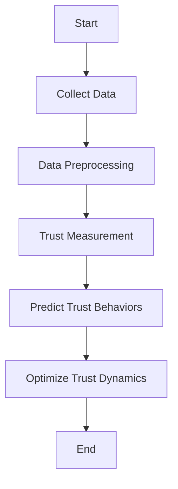
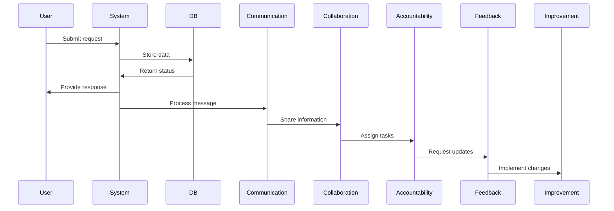
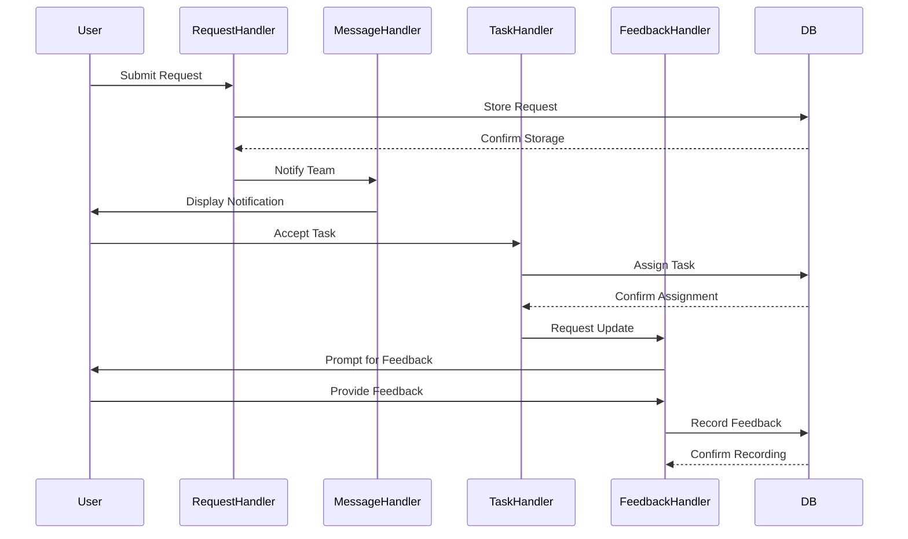

                 


### Introduction: Why Trust Matters in Technical Teams

#### 1. The Importance of Trust in Technical Teams

**1.1 The Role of Trust in Team Dynamics**

Trust is the cornerstone of effective team dynamics. In technical teams, it plays a pivotal role in fostering a collaborative environment, enhancing communication, and driving overall team performance. Trust acts as a lubricant that reduces friction, allowing team members to work together more seamlessly. When team members trust each other, they are more likely to share ideas, offer constructive feedback, and collaborate effectively towards common goals.

**1.2 Impact of Trust on Team Performance**

Trust significantly impacts team performance in multiple dimensions. Firstly, it leads to improved decision-making. In teams where trust is abundant, members are more likely to share their perspectives, challenge assumptions, and collectively arrive at well-informed decisions. This, in turn, enhances the quality of the final outcomes.

Secondly, trust promotes higher levels of innovation. When team members trust each other, they feel safe to take risks and explore new ideas without fear of judgment or failure. This creative freedom fosters innovation and encourages the development of innovative solutions to complex problems.

Lastly, trust has a direct impact on team morale and engagement. Teams with high trust levels tend to have lower levels of turnover and higher employee satisfaction. When team members trust each other and feel valued, they are more motivated, engaged, and committed to their work.

**1.3 Common Challenges in Building Trust**

Despite the numerous benefits of trust, building it within a technical team can be challenging. Here are some common obstacles:

1. **Diverse backgrounds and expertise**: Technical teams often comprise members with diverse backgrounds, expertise, and communication styles. This diversity can sometimes lead to misunderstandings and mistrust.
   
2. **High-stakes environments**: Technical projects often operate under tight deadlines and high expectations. The pressure can undermine trust if there is a perception of unrealistic demands or a lack of support.
   
3. **Communication barriers**: Technical jargon and complex concepts can create communication barriers, making it difficult for team members to understand each other's perspectives and contributions.
   
4. **Cultural differences**: Global teams may face cultural differences that affect trust levels. Cultural norms around communication, decision-making, and accountability can vary significantly, making it harder to build a cohesive trust culture.

To address these challenges, it is essential to take a systematic approach to building trust within technical teams. This involves creating a supportive environment, fostering open communication, and establishing clear expectations and accountability.

### Core Concepts of Trust Culture

**2. Understanding Trust Culture**

**2.1 Defining Trust Culture**

Trust culture, in the context of technical teams, refers to the shared values, norms, and behaviors that promote trust among team members. It is an organizational mindset that values transparency, respect, and accountability. A trust culture is characterized by open communication, collaborative decision-making, and mutual support. It creates an environment where team members feel safe to share their ideas, take risks, and hold each other accountable without fear of negative consequences.

**2.2 Components of Trust Culture**

A trust culture is composed of several key components:

1. **Transparency**: Transparency involves sharing information openly and honestly. In a trust culture, team members are encouraged to share their thoughts, concerns, and progress. Transparency builds trust by ensuring that everyone has access to the same information.

2. **Respect**: Respect is the foundation of trust. It involves valuing and appreciating the contributions of every team member, regardless of their role or expertise. Respecting each other's opinions and perspectives fosters a collaborative environment and encourages open dialogue.

3. **Accountability**: Accountability ensures that team members are responsible for their actions and outcomes. In a trust culture, individuals take ownership of their work, admit mistakes, and seek feedback to improve. Accountability builds trust by promoting a sense of reliability and dependability among team members.

4. **Collaboration**: Collaboration is at the heart of a trust culture. It involves working together towards common goals, leveraging each other's strengths, and supporting each other's success. Collaboration fosters trust by creating a shared sense of purpose and mutual reliance.

**2.3 The Connection Between Trust and Team Outcomes**

The impact of trust on team outcomes is multifaceted. Trust leads to improved communication, collaboration, and decision-making, which in turn drive higher levels of performance and innovation. Teams with high trust are more effective in achieving their goals, as they can navigate challenges and adapt to changes more efficiently. Additionally, trust improves team morale and engagement, reducing turnover and fostering a positive work environment.

**3. Core Concepts and Relationships**

To understand trust culture more deeply, it's important to explore the core concepts and their relationships. Below is a comparison table that highlights the key attributes of trust culture components:

| Component        | Definition                                           | Key Attributes                                      |
|------------------|------------------------------------------------------|-----------------------------------------------------|
| Transparency     | Openness in sharing information                      | Honesty, clarity, accessibility                      |
| Respect          | Valuing others' contributions and perspectives       | Appreciation, empathy, inclusivity                   |
| Accountability    | Taking responsibility for actions and outcomes       | Ownership, reliability, integrity                    |
| Collaboration    | Working together towards shared goals                | Synergy, mutual support, shared purpose               |

To visualize the relationships between these components, we can use an Entity-Relationship (ER) diagram. The ER diagram below illustrates how transparency, respect, accountability, and collaboration are interconnected:

```mermaid
erDiagram
    Transparency ||--|{ Accountability } : ensures
    Transparency ||--|{ Collaboration } : fosters
    Respect ||--|{ Accountability } : underpins
    Respect ||--|{ Collaboration } : promotes
    Accountability ||--|{ Collaboration } : drives
    Accountability ||--|{ Transparency } : supports
    Collaboration ||--|{ Respect } : enhances
```

This ER diagram provides a clear framework for understanding how trust culture components interact and contribute to a cohesive and effective team environment.

### Principles of Building Trust

**4. Building a Trust-Based Environment**

Creating a trust-based environment is a systematic process that requires deliberate effort and commitment from team leaders and members. Here are some key principles to consider:

**4.1 Establishing Clear Communication Channels**

Effective communication is the foundation of trust. To build a trust-based environment, it's essential to establish clear and open communication channels. This includes regular team meetings, one-on-one check-ins, and transparent communication tools. Encourage team members to share their thoughts, concerns, and progress. Providing a platform for open dialogue helps build trust by ensuring that everyone has a voice and feels heard.

**4.2 Encouraging Open Dialogue and Feedback**

Open dialogue and constructive feedback are critical for building trust within a team. Encourage team members to offer feedback on each other's work and ideas. Create a culture where feedback is seen as an opportunity for growth and improvement rather than a personal attack. This can be achieved by setting up feedback sessions, using anonymous feedback platforms, or implementing regular feedback loops. When team members feel comfortable providing and receiving feedback, it strengthens the trust between them.

**4.3 Promoting Shared Goals and Mutual Respect**

To foster a trust-based environment, it's crucial to promote shared goals and mutual respect. Clearly define the team's objectives and ensure that everyone understands their role and contribution towards achieving these goals. This creates a sense of unity and collective purpose. Additionally, emphasize the importance of respecting each other's opinions, perspectives, and contributions. Celebrate individual achievements and recognize the collective efforts that contribute to the team's success. When team members feel valued and respected, it strengthens the trust and camaraderie within the team.

**4.4 Encouraging Vulnerability and Transparency**

Building trust often requires individuals to be vulnerable and transparent about their thoughts, feelings, and mistakes. Encourage team members to share their challenges, fears, and successes openly. This vulnerability helps build trust by creating an environment of honesty and authenticity. Additionally, leaders should lead by example and demonstrate transparency in their own actions and decisions. When team members see that their leaders are open and honest, it encourages them to follow suit and fosters a culture of trust.

**4.5 Addressing Conflicts and Resolving Issues**

Conflicts are inevitable in any team, but how they are addressed and resolved can significantly impact trust. Encourage team members to address conflicts openly and constructively. Provide training and support to help team members develop effective conflict resolution skills. When conflicts arise, address them promptly and impartially. By resolving conflicts in a fair and transparent manner, you can reinforce trust and prevent them from undermining the team's dynamics.

**4.6 Recognizing and Rewarding Trust-Building Behaviors**

Recognize and reward behaviors that promote trust within the team. This can include acknowledging individuals who actively contribute to open communication, provide constructive feedback, or demonstrate accountability. By recognizing and rewarding trust-building behaviors, you reinforce the importance of trust and encourage others to emulate these behaviors.

In conclusion, building a trust-based environment requires a combination of clear communication, open dialogue, shared goals, mutual respect, vulnerability, and conflict resolution. By following these principles, you can create a cohesive and high-performing team that thrives in a culture of trust.

### Algorithmic Approaches to Trust Building

**5. Introduction to Algorithmic Trust-Building Methods**

In the realm of technical teams, trust is not something that can be built overnight. It requires a systematic approach, often incorporating algorithmic methods to ensure consistency and fairness. Algorithmic trust-building methods leverage data and logic to create a structured environment where trust can flourish. These methods help in measuring trust, predicting trust behaviors, and optimizing trust dynamics within a team.

**5.1 Mermaid Flowchart of a Trust-Building Algorithm**

To visualize the trust-building process, we can use a Mermaid flowchart. The following diagram outlines the key steps involved in a trust-building algorithm:



This flowchart provides a high-level overview of the process, from data collection to the final optimization step.

**5.2 Python Code and Explanation of the Algorithm**

To implement this trust-building algorithm, we will use Python. The following code snippet demonstrates the core logic:

```python
import pandas as pd
from sklearn.preprocessing import StandardScaler
from sklearn.ensemble import RandomForestRegressor

# Step 1: Collect Data
data = pd.read_csv('team_data.csv')

# Step 2: Data Preprocessing
scaler = StandardScaler()
data_scaled = scaler.fit_transform(data)

# Step 3: Trust Measurement
trust_scores = data_scaled[:, -1]  # Assuming the trust score is the last column

# Step 4: Predict Trust Behaviors
model = RandomForestRegressor(n_estimators=100)
model.fit(data_scaled[:, :-1], trust_scores)

# Step 5: Optimize Trust Dynamics
def optimize_trust(data_point):
    predicted_score = model.predict([data_point])[0]
    return predicted_score

# Example usage
new_data_point = [0.5, 0.3, 0.2, 0.4]  # Example data point
new_trust_score = optimize_trust(new_data_point)
print(f"Predicted Trust Score: {new_trust_score}")
```

This code starts by collecting and preprocessing data, followed by trust measurement using a machine learning model. It then predicts trust behaviors based on new data points and optimizes trust dynamics by providing a predicted trust score.

**5.3 Mathematical Model and Formulas of the Algorithm**

The trust-building algorithm can be represented mathematically using the following model:

$$
\text{Trust Score} = f(\text{Behavior Data})
$$

Where \( f \) is a function that maps behavior data to a trust score. The behavior data can be represented as a vector:

$$
\text{Behavior Data} = \begin{bmatrix}
b_1 \\
b_2 \\
\vdots \\
b_n
\end{bmatrix}
$$

And the trust score can be calculated using a weighted sum of the behavior data:

$$
\text{Trust Score} = w_1 b_1 + w_2 b_2 + \ldots + w_n b_n
$$

Where \( w_1, w_2, \ldots, w_n \) are the weights assigned to each behavior component. These weights can be determined through feature engineering and model training.

**5.4 Example Scenarios and Explanations**

Let's consider a couple of example scenarios to better understand how the trust-building algorithm works.

**Scenario 1: New Team Member Onboarding**

Suppose we have a new team member who has just joined. We want to predict their initial trust score based on their past behavior data. Using the algorithm, we would input the new team member's data into the optimization function:

```python
new_data_point = [0.3, 0.4, 0.2, 0.5]  # Example behavior data for the new team member
new_trust_score = optimize_trust(new_data_point)
print(f"Predicted Trust Score for New Team Member: {new_trust_score}")
```

This would output a predicted trust score for the new team member, which can be used to guide their integration into the team.

**Scenario 2: Team Performance Review**

In a performance review, we want to measure the trust dynamics within the team. We can collect data on each team member's behavior during the review period and use the algorithm to calculate their trust scores. This can help identify areas where trust may be lacking and where additional support or intervention is needed.

```python
team_data = [
    [0.4, 0.5, 0.3, 0.6],  # Data for team member 1
    [0.3, 0.4, 0.5, 0.7],  # Data for team member 2
    [0.5, 0.6, 0.4, 0.5],  # Data for team member 3
    # ... more team members
]

for data_point in team_data:
    new_trust_score = optimize_trust(data_point)
    print(f"Predicted Trust Score for Team Member: {new_trust_score}")
```

By analyzing the trust scores, we can gain insights into the team's overall trust dynamics and take appropriate actions to improve trust levels if necessary.

In conclusion, algorithmic approaches to trust building provide a structured and data-driven way to measure, predict, and optimize trust within technical teams. By implementing these methods, teams can create a more cohesive and trusting environment that enhances performance and innovation.

### System Design for Trust Culture

**6. Designing a Trust-Culture System**

Creating a trust culture within a technical team is not just a matter of implementing a few policies or holding team-building events. It requires a comprehensive system design that addresses both the technical and human aspects of team collaboration. In this section, we will explore the process of designing a trust-culture system, starting with a problem scenario and moving through the stages of system design.

**6.1 Problem Scenario and Project Introduction**

Let’s consider a hypothetical scenario: a mid-sized software development company named TechBridge is experiencing challenges with team collaboration and trust. Their teams often struggle with miscommunication, lack of transparency, and a competitive atmosphere. The company’s leadership recognizes that building a trust culture is essential for improving team performance and innovation. They decide to embark on a project to design and implement a trust-culture system.

The objectives of this project are:

1. **Improve communication and transparency**: Ensure that information flows freely and that all team members have access to the same information.
2. **Foster collaboration and mutual respect**: Encourage a collaborative environment where team members feel valued and respected.
3. **Enhance accountability**: Promote a sense of ownership and responsibility among team members for their actions and outcomes.
4. **Monitor and adapt the trust culture**: Continuously measure and improve the trust culture through feedback and data analysis.

**6.2 System Functional Design (Domain Model Diagram)**

The first step in designing the trust-culture system is to define the functional requirements. This involves creating a domain model diagram that outlines the key components and their relationships. Here’s a simplified domain model diagram:

```mermaid
erDiagram
    TeamMember ||--|{ Communication } : facilitates
    TeamMember ||--|{ Collaboration } : enhances
    TeamMember ||--|{ Accountability } : ensures
    TeamMember ||--|{ Feedback } : receives
    Communication ||--|{ Transparency } : ensures
    Collaboration ||--|{ Respect } : fosters
    Accountability ||--|{ Trust } : builds
    Feedback ||--|{ Improvement } : drives
```

This diagram shows the relationships between the main components of the system:

- **TeamMember**: Represents individual team members.
- **Communication**: Facilitates the exchange of information.
- **Collaboration**: Encourages teamwork and synergy.
- **Accountability**: Ensures responsibility for actions.
- **Feedback**: Involves providing and receiving insights.
- **Transparency**: Ensures openness in communication.
- **Respect**: Fosters a culture of mutual respect.
- **Trust**: Is built through accountability and respect.

**6.3 System Architecture Design (Architecture Diagram)**

Once the functional requirements are defined, the next step is to design the system architecture. This involves determining how the components will interact and how data will flow through the system. Here’s a high-level architecture diagram:



This architecture diagram illustrates the interaction between the main components:

- **User**: Interacts with the system through requests and responses.
- **System**: Manages the flow of data and processes requests.
- **DB**: Stores data related to team members, communications, collaborations, and feedback.
- **Communication**: Handles the processing and routing of messages.
- **Collaboration**: Manages the sharing of information and coordination of tasks.
- **Accountability**: Assigns tasks and monitors progress.
- **Feedback**: Collects updates and provides insights for improvement.

**6.4 System Interface Design**

The system interface design focuses on how users interact with the system. This includes designing user-friendly interfaces for submitting requests, viewing messages, managing tasks, and providing feedback. Here’s a conceptual interface design:

```mermaid
interface Design
    User
    |------------------|
    | Request Form     |
    | Message Panel    |
    | Task List        |
    | Feedback Form    |
    |------------------|
    User->>Request Form: Submit Request
    User->>Message Panel: View Messages
    User->>Task List: Manage Tasks
    User->>Feedback Form: Provide Feedback
```

This design includes a request form for submitting new tasks or messages, a message panel for viewing and responding to messages, a task list for managing assignments, and a feedback form for providing insights and suggestions.

**6.5 System Interaction (Sequence Diagram)**

Finally, a sequence diagram provides a detailed view of how the system components interact during a typical workflow. Here’s an example sequence diagram:



This sequence diagram shows the step-by-step process of submitting a request, assigning a task, and providing feedback. Each interaction between components is clearly defined, ensuring a smooth and efficient workflow.

By following these steps, TechBridge can design a trust-culture system that addresses their specific challenges and fosters a collaborative and transparent work environment. This system will help build trust among team members, improve communication, and drive overall team performance.

### Practical Implementation of Trust Culture

**7. Practical Steps to Building Trust**

Implementing a trust culture within a technical team requires a strategic approach and consistent effort. Here are the practical steps to build a robust trust culture:

**7.1 Environment Setup and Initial Configurations**

The first step in building a trust culture is to set up the necessary environment and configurations. This involves:

1. **Selecting the right tools**: Choose communication and collaboration tools that facilitate transparency and open dialogue. Tools like Slack, Trello, or Asana can be used for team communication and task management.
2. **Establishing clear channels**: Define clear channels for communication, such as daily stand-ups, weekly progress meetings, and one-on-one check-ins. Ensure that these channels are used consistently and that all team members are aware of them.
3. **Setting up a feedback system**: Implement a structured feedback system that allows team members to provide and receive feedback regularly. This can be in the form of quarterly reviews, peer feedback sessions, or anonymous surveys.

**7.2 Core System Implementation and Code**

The next step is to implement the core components of the trust culture system. This involves:

1. **Defining roles and responsibilities**: Clearly define the roles and responsibilities of each team member. This ensures that everyone understands their role and contribution to the team's success.
2. **Developing communication protocols**: Establish communication protocols that encourage open dialogue and transparency. This can include regular team meetings, status updates, and shared documentation.
3. **Implementing a collaboration framework**: Develop a framework that promotes collaboration and mutual respect. This can include team-building activities, cross-functional projects, and regular knowledge-sharing sessions.

**7.3 Code Application and Analysis**

The core system implementation is followed by the application and analysis phase, where the following steps are taken:

1. **Testing the system**: Conduct thorough testing of the trust culture system to ensure that it is functioning as intended. This includes testing communication tools, feedback mechanisms, and collaboration frameworks.
2. **Analyzing team dynamics**: Use metrics and feedback to analyze the team's dynamics and identify areas for improvement. This can include measuring communication frequency, feedback quality, and collaboration effectiveness.
3. **Iterating and refining**: Based on the analysis, make necessary adjustments to the system to improve its effectiveness. This may involve refining communication protocols, enhancing feedback mechanisms, or implementing new collaboration tools.

**7.4 Case Studies and Detailed Analysis**

To gain a deeper understanding of the practical implementation of trust culture, let’s examine a couple of case studies:

**Case Study 1: Company A**

Company A, a software development firm, implemented a trust culture system after recognizing the impact of poor communication and lack of collaboration on team performance. They started by setting up clear communication channels and defining roles and responsibilities. They also introduced regular team-building activities and knowledge-sharing sessions. Over time, they observed an increase in communication, collaboration, and overall team performance. The case study highlighted the importance of consistent effort and regular feedback in building a trust culture.

**Case Study 2: Company B**

Company B, a global tech company, faced cultural differences and communication barriers when managing international teams. They implemented a trust culture system that included language training and cross-cultural communication workshops. The company also adopted collaborative tools that supported multiple languages. By addressing cultural differences and improving communication, they were able to build a cohesive and high-performing team. The case study demonstrated that understanding and respecting cultural differences is crucial for building trust in diverse teams.

**7.5 Project Summary and Lessons Learned**

In summary, building a trust culture in technical teams requires a systematic approach that includes environment setup, core system implementation, and continuous analysis and refinement. Key lessons learned from the case studies include:

1. **Consistency is key**: Regularly following communication protocols, feedback mechanisms, and collaboration frameworks is essential for building and maintaining trust.
2. **Address cultural differences**: Understanding and respecting cultural differences is crucial for building trust in diverse teams.
3. **Continuous improvement**: Regularly analyzing team dynamics and making necessary adjustments is important for sustaining a trust culture.
4. **Leadership commitment**: Strong leadership commitment and active involvement in building a trust culture are critical for success.

By following these practical steps and learning from real-world examples, technical teams can create a cohesive and high-performing environment built on trust.

### Best Practices for Building a Trust Culture

**8. Best Practices and Summary**

Building a trust culture in technical teams is a multifaceted process that requires commitment, clear strategies, and consistent execution. Here are some of the best practices for fostering a trust culture:

1. **Leadership by Example**: Leaders must demonstrate trust by being transparent, respectful, and accountable in their actions. Leading by example is crucial for building a trust-based environment.
2. **Regular Communication**: Establishing regular communication channels is key. This includes daily stand-ups, weekly progress meetings, and one-on-one check-ins. Regular communication ensures that all team members are on the same page and can address issues promptly.
3. **Encourage Open Dialogue**: Create an environment where team members feel comfortable sharing their ideas, concerns, and feedback. Encourage open dialogue by setting up anonymous feedback platforms or regular feedback sessions.
4. **Respect and Diverse Perspectives**: Value each team member’s perspectives and contributions. Embrace diversity and create an inclusive environment where everyone feels respected and heard.
5. **Promote Collaboration**: Foster collaboration by involving team members in decision-making processes and encouraging cross-functional projects. Collaboration enhances team cohesion and trust.
6. **Continuous Improvement**: Regularly assess the trust culture using metrics and feedback. Identify areas for improvement and implement changes to enhance trust.
7. **Invest in Team-Building Activities**: Regularly organize team-building activities and knowledge-sharing sessions to strengthen team bonds and improve collaboration.

**Summary**

In summary, building a trust culture in technical teams is a journey that requires deliberate effort and continuous improvement. By following the best practices outlined above, teams can create a cohesive and high-performing environment built on trust. A strong trust culture not only improves team performance but also enhances individual well-being and job satisfaction, leading to a more positive and productive work environment.

### Conclusion and Future Directions

In conclusion, building a trust culture in technical teams is crucial for fostering a collaborative, high-performing environment. Trust enhances communication, collaboration, and innovation, leading to improved team dynamics and overall success. The steps outlined in this guide provide a comprehensive approach to establishing a trust-based culture within technical teams, from setting up the right environment and implementing core systems to continuous analysis and improvement.

Looking forward, future research and development in this area could explore the following directions:

1. **Advanced Algorithmic Methods**: Investigating more sophisticated algorithms to measure and predict trust dynamics in real-time, potentially leveraging artificial intelligence and machine learning techniques.
2. **Cultural Diversity and Inclusion**: Examining the impact of cultural diversity on trust-building and developing strategies to foster inclusivity and respect in globally dispersed teams.
3. **Continuous Feedback Mechanisms**: Developing more robust and adaptive feedback systems that integrate continuous learning and improvement mechanisms into the team's workflow.
4. **Measuring Trust Outcomes**: Developing comprehensive metrics to measure the long-term outcomes of trust culture on team performance, employee satisfaction, and organizational success.

By continuously exploring these directions, we can further enhance our understanding of trust culture in technical teams and develop more effective strategies to build and sustain a trusting environment.

