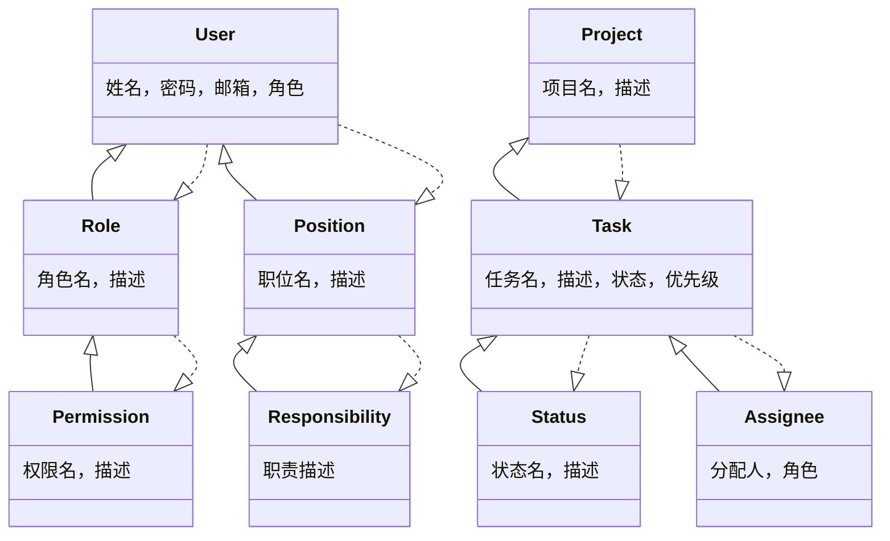
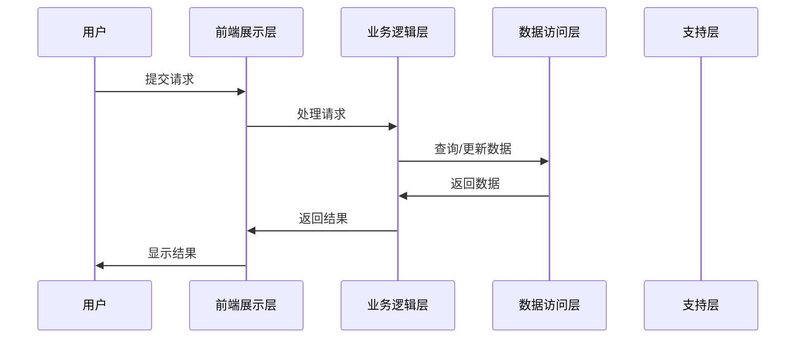
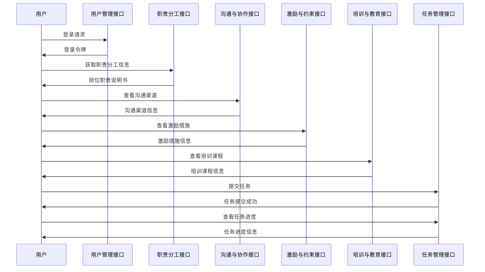

                 

## 第1章：背景介绍

### 1.1 问题背景

#### 1.1.1 责任文化的定义与重要性

责任文化是一种组织内部的核心价值观，强调个人或集体对其工作、决策和结果承担相应的责任。这种文化不仅有助于提升团队的绩效，还能增强员工的归属感和忠诚度。

**责任文化的概念：**
- 责任文化是指一种组织内部强调个人或集体对其工作、决策和结果承担相应责任的价值观和行为模式。
- 它是一种内在的精神力量，能够激励员工主动承担责任，克服困难，追求卓越。

**责任文化的重要性：**
- **提升团队绩效：** 责任文化能够明确团队成员的职责和角色，提高工作效率，减少错误和重复工作，从而提升整个团队的绩效。
- **增强员工归属感：** 责任文化使员工感受到自己的价值和重要性，从而增强对组织的归属感和忠诚度。
- **促进团队协作：** 责任文化能够建立有效的沟通与协作机制，促进团队成员之间的合作，提高团队的整体效能。
- **培养责任意识：** 责任文化能够培养员工的责任意识，使其在职业生涯中养成良好的工作习惯，为组织和社会创造更多价值。

#### 1.1.2 技术团队的现状与挑战

技术团队作为现代企业的重要组成部分，面临着日益严峻的挑战。在这种背景下，建立责任文化显得尤为重要。

**技术团队的组成与角色：**
- 技术团队通常由软件开发人员、系统架构师、产品经理、测试工程师等多个角色组成。
- 每个角色在团队中都有特定的职责和任务，共同推动项目的发展和成功。

**技术团队面临的问题与挑战：**
- **职责不清：** 技术团队中常常存在职责划分不明确的问题，导致团队成员之间相互推诿，工作效率低下。
- **沟通不畅：** 技术团队成员之间的沟通不畅，容易导致误解和冲突，影响团队协作和项目进度。
- **缺乏激励：** 技术团队成员的积极性和创造力往往受到激励机制的制约，缺乏有效的激励手段。
- **压力过大：** 技术团队面临着项目进度、质量、成本等多方面的压力，容易导致团队成员产生疲惫和焦虑情绪。

### 1.2 问题描述

在技术团队中，责任文化的缺失现象主要体现在以下几个方面：

#### 1.2.1 缺乏明确的职责划分

在许多技术团队中，职责划分不明确是一个普遍存在的问题。这导致团队成员在工作中不知道自己的具体职责，容易产生推诿和矛盾，影响团队协作和项目进展。

#### 1.2.2 缺少有效的沟通与协作

技术团队中的沟通与协作机制不完善，容易导致信息不对称和误解。团队成员之间的沟通不畅，会影响项目的进度和质量，降低团队的整体效能。

#### 1.2.3 缺乏激励与约束机制

技术团队成员的积极性和创造力往往受到激励机制的制约。缺乏有效的激励手段，容易导致员工消极怠工，影响团队的整体绩效。

#### 1.2.4 责任意识薄弱

在责任文化缺失的情况下，技术团队成员的责任意识相对较弱。这可能导致团队成员在工作中缺乏主动性和责任感，影响项目的顺利进行。

### 1.2.5 责任文化的缺失对团队的影响

责任文化的缺失对技术团队产生了多方面的影响：

- **绩效下降：** 缺乏明确的职责划分和有效的沟通与协作，导致团队成员之间协作困难，工作效率低下，项目绩效下降。
- **员工流失：** 责任文化缺失导致员工归属感下降，容易引发员工流失，增加企业的人力资源成本。
- **项目风险增加：** 技术团队中责任意识薄弱，可能导致项目质量下降，增加项目风险。
- **团队凝聚力下降：** 责任文化缺失会导致团队内部矛盾和冲突增多，降低团队凝聚力。

### 1.2.6 责任文化的重要性

责任文化对技术团队的影响至关重要：

- **提升团队绩效：** 责任文化能够明确团队成员的职责和角色，提高工作效率，减少错误和重复工作，从而提升整个团队的绩效。
- **增强员工归属感：** 责任文化使员工感受到自己的价值和重要性，从而增强对组织的归属感和忠诚度。
- **促进团队协作：** 责任文化能够建立有效的沟通与协作机制，促进团队成员之间的合作，提高团队的整体效能。
- **培养责任意识：** 责任文化能够培养员工的责任意识，使其在职业生涯中养成良好的工作习惯，为组织和社会创造更多价值。

### 1.3 问题解决

为了解决技术团队中责任文化缺失的问题，我们需要从以下几个方面入手：

#### 1.3.1 责任文化建立的理论基础

责任文化的建立需要基于一系列相关理论，包括组织行为学、心理学、管理学等。这些理论为责任文化的构建提供了理论基础和实践指导。

#### 1.3.2 责任文化构建的核心要素

责任文化的构建需要关注以下几个核心要素：

- **职责分工：** 明确团队成员的职责和角色，确保每个成员都知道自己的工作内容和责任。
- **沟通与协作：** 建立有效的沟通与协作机制，促进团队成员之间的信息交流和合作。
- **激励与约束：** 强化激励机制和约束机制，激发员工的积极性和责任感。
- **培训与教育：** 加强对员工的责任意识和职业道德教育，培养良好的工作习惯。

#### 1.3.3 责任文化建设的实践路径

责任文化的建设是一个系统工程，需要从以下几个方面进行实践：

- **领导带头：** 领导者要率先树立责任意识，以身作则，发挥示范作用。
- **制度保障：** 建立和完善相关制度和流程，为责任文化的实施提供制度保障。
- **培训与宣传：** 加强对责任文化的培训和宣传，提高员工对责任文化的认识和认同。
- **激励与考核：** 设立激励和考核机制，激发员工的积极性和责任感。

### 1.4 边界与外延

责任文化虽然对技术团队具有重要意义，但其建立和应用也存在一定的边界和限制。

#### 1.4.1 责任文化的边界

责任文化的边界主要表现在以下几个方面：

- **适用范围：** 责任文化适用于各类技术团队，但具体实施时需要根据团队的特点和实际情况进行调整。
- **限制条件：** 责任文化的建立需要一定的资源和条件支持，如领导重视、制度完善、员工参与等。

#### 1.4.2 责任文化的外延

责任文化的外延包括以下几个方面：

- **与其他组织文化的关联：** 责任文化与其他组织文化如企业文化、项目文化等密切相关，需要相互融合和协调。
- **影响因素：** 责任文化的建立受到多种因素的影响，如组织环境、团队氛围、员工素质等。

### 1.5 本章小结

本章通过对责任文化的背景介绍，分析了责任文化的定义和重要性，探讨了技术团队的现状和挑战，以及责任文化缺失的现象和影响。同时，本章提出了责任文化建立的理论基础和实践路径，为后续章节的内容奠定了基础。

## 1.6 关键词总结

- 责任文化
- 技术团队
- 职责分工
- 沟通与协作
- 激励与约束
- 责任意识

## 1.7 摘要

本文从责任文化的定义和重要性出发，分析了技术团队中责任文化缺失的现象和影响，提出了责任文化建立的理论基础和实践路径。通过明确职责分工、建立沟通与协作机制、强化激励与约束机制等措施，可以有效提升技术团队的绩效和员工归属感，为组织的长期发展奠定基础。

----------------------------------------------------------------

## 第2章：核心概念与联系

### 2.1 责任文化的概念与属性特征对比

责任文化是一种组织内部的核心价值观，强调个人或集体对其工作、决策和结果承担相应的责任。为了更好地理解和应用责任文化，我们需要对相关概念进行梳理和对比。

#### 2.1.1 责任文化的定义

责任文化是指一种组织内部强调个人或集体对其工作、决策和结果承担相应责任的价值观和行为模式。它不仅是一种理念，更是一种实践，贯穿于组织的日常运营和管理活动中。

#### 2.1.2 责任文化的属性特征

责任文化具有以下几个属性特征：

- **价值观：** 责任文化是一种价值观，强调个人或集体承担责任的重要性，并将其作为组织发展的基石。
- **行为模式：** 责任文化是一种行为模式，要求员工在日常工作中自觉履行职责，主动承担责任。
- **传承性：** 责任文化具有传承性，可以通过培训、宣传等方式传递给新员工，形成组织内部的共同价值观。
- **适应性：** 责任文化具有适应性，可以根据组织特点和需求进行调整，以适应不同的发展阶段。

### 2.1.3 责任文化与其他概念的对比

为了更好地理解责任文化的概念，我们需要将其与其他相关概念进行对比。

- **企业文化：** 企业文化是指组织内部共同遵循的价值观、信仰和行为规范。责任文化是企业文化的一部分，但更侧重于责任和责任的履行。
- **职业道德：** 职业道德是指从事特定职业的人员应遵循的行为准则和道德规范。责任文化强调员工对其工作承担责任，而职业道德则更注重职业行为的规范。
- **团队精神：** 团队精神是指团队成员之间相互支持、相互协作的精神状态。责任文化强调个人责任，而团队精神则强调团队协作和集体荣誉。

### 2.1.4 责任文化的属性特征对比表格

| 属性特征 | 责任文化 | 企业文化 | 职业道德 | 团队精神 |
| --- | --- | --- | --- | --- |
| 价值观 | 强调个人或集体承担责任 | 组织内部共同遵循的价值观 | 从事特定职业的行为准则 | 团队成员之间相互支持、协作 |
| 行为模式 | 责任履行 | 组织行为 | 职业行为 | 团队协作 |
| 传承性 | 传承给新员工 | 组织内部传承 | 长期传承 | 新员工融入 |
| 适应性 | 根据组织调整 | 根据组织调整 | 根据行业调整 | 根据团队特点调整 |

通过上述对比，我们可以看出责任文化具有其独特的属性特征，与其他概念既有联系又有区别。理解这些概念和特征，有助于我们在实际工作中更好地应用和推动责任文化。

### 2.2 技术团队的责任文化组成要素

责任文化在技术团队中的应用需要明确其组成要素，以便在实际工作中有效构建和实施。以下是技术团队责任文化的几个主要组成要素：

#### 2.2.1 职责分工与明确

职责分工是责任文化的基础。明确每个团队成员的职责和角色，有助于确保团队内部的工作协调和高效运作。

- **明确职责范围**：根据团队成员的技能和经验，明确各自的职责范围，确保每个成员都知道自己的工作内容和责任。
- **建立职责边界**：明确各职责之间的边界，避免职责重叠和责任推诿，确保每个问题都能找到明确的责任人。

#### 2.2.2 沟通与协作机制

有效的沟通与协作机制是责任文化的重要组成部分。通过建立畅通的沟通渠道和协作机制，可以确保信息共享、协同工作，提高团队的整体效能。

- **建立沟通渠道**：设置定期会议、工作坊、邮件列表等沟通渠道，确保团队成员之间的信息交流和反馈。
- **明确协作流程**：制定明确的协作流程和规范，确保团队成员在项目开发和问题解决过程中能够高效合作。

#### 2.2.3 激励与约束机制

激励与约束机制是责任文化的重要保障。通过合理的激励机制和约束机制，可以激发员工的积极性和责任感，同时避免责任意识的缺失。

- **激励机制**：设置合理的绩效奖金、晋升机会、培训等激励措施，激发员工的积极性和创造力。
- **约束机制**：建立问责制度、绩效评估等约束措施，确保员工履行其职责，防止责任推诿和懈怠。

### 2.2.4 培训与教育

培训与教育是责任文化构建的重要手段。通过培训和教育，可以提高员工的责任意识，培养良好的工作习惯，确保责任文化的落地和实施。

- **责任意识培训**：开展责任意识培训，帮助员工理解责任文化的概念和重要性，培养责任意识和职业道德。
- **专业能力培训**：提供专业知识和技能培训，提升员工的专业能力，为责任文化的实施提供能力保障。

### 2.2.5 责任文化的评估与改进

责任文化的评估与改进是确保责任文化持续发展的关键。通过定期评估和改进，可以及时发现和解决责任文化实施中的问题，不断提升责任文化的水平和效果。

- **责任文化评估**：建立责任文化评估体系，对责任文化的实施效果进行定期评估，识别优势和不足。
- **改进措施**：根据评估结果，制定改进措施，优化责任文化的实施流程，提升责任文化的效果。

通过明确职责分工、建立沟通与协作机制、强化激励与约束机制、开展培训与教育以及评估与改进，技术团队可以逐步构建和实施责任文化，提升团队的整体效能和员工的职业发展。

### 2.3 责任文化与其他组织文化的联系

责任文化作为一种组织内部的核心价值观，不仅与企业文化密切相关，还与项目文化、团队文化等其他组织文化有着紧密的联系。

#### 2.3.1 企业文化与责任文化

企业文化是组织内部的共同价值观和行为规范，是责任文化的根基。企业文化的建设与传承，有助于推动责任文化的落地和实施。

- **共同价值观**：企业文化和责任文化在共同价值观上具有一致性，都强调个人和集体的责任感，但企业文化的范围更广泛，涵盖了对组织使命、愿景和价值观的追求。
- **行为规范**：企业文化的行为规范有助于规范员工的行为，增强责任意识，促进责任文化的实施。

#### 2.3.2 项目文化与责任文化

项目文化是针对特定项目而形成的价值观和行为规范，与责任文化密切相关。在项目实施过程中，责任文化的实施有助于确保项目的成功。

- **目标导向**：项目文化与责任文化都强调目标导向，明确项目目标和责任分工，提高项目执行力。
- **团队合作**：项目文化鼓励团队成员之间的合作和沟通，与责任文化的协作机制相辅相成，提升项目团队的整体效能。

#### 2.3.3 团队文化与其他组织文化的联系

团队文化是组织内部特定团队形成的价值观和行为规范，与企业文化、项目文化等其他组织文化相互影响、相互促进。

- **相互融合**：团队文化可以吸收企业文化、项目文化的优势，形成独特的团队价值观，推动团队的发展和进步。
- **共同发展**：团队文化与其他组织文化的共同发展，有助于构建和谐的组织环境，提高组织的整体竞争力。

通过理解责任文化与其他组织文化的联系，我们可以更好地实施责任文化，提升组织的整体效能。责任文化作为组织文化的重要组成部分，不仅有助于提升团队的绩效，还能增强员工的归属感和责任感，为组织的长期发展奠定基础。

### 2.4 责任文化的核心要素对比表格

| 核心要素 | 描述 | 对团队的影响 |
| --- | --- | --- |
| 职责分工 | 明确团队成员的职责和角色 | 提高团队工作效率 |
| 沟通与协作 | 建立有效的沟通与协作机制 | 提升团队协作能力 |
| 激励与约束 | 强化激励机制和约束机制 | 提高员工积极性和责任感 |

通过上述对比表格，我们可以清晰地看到责任文化的核心要素及其对团队的影响。职责分工有助于提高工作效率，沟通与协作机制能够提升团队协作能力，激励与约束机制则能够激发员工的积极性和责任感。这些要素共同作用，推动责任文化的构建和实施，提升技术团队的整体效能。

### 2.5 本章小结

本章通过对责任文化的概念、属性特征和与其他组织文化的联系进行了深入分析，明确了责任文化的核心要素及其对团队的影响。理解责任文化的概念和特征，有助于我们在实际工作中更好地构建和实施责任文化，提升技术团队的绩效和员工归属感。

## 2.6 关键词总结

- 责任文化
- 职责分工
- 沟通与协作
- 激励与约束
- 企业文化
- 项目文化
- 团队文化

## 2.7 摘要

本章从责任文化的概念、属性特征、与其他组织文化的联系以及核心要素等方面进行了深入分析，阐述了责任文化在技术团队中的重要性。通过明确职责分工、建立沟通与协作机制、强化激励与约束机制等措施，技术团队能够更好地构建和实施责任文化，提升团队绩效和员工归属感。

----------------------------------------------------------------

## 第3章：算法原理讲解

### 3.1 责任文化构建的算法模型

责任文化的构建需要一套系统的方法和算法，以确保责任文化的各个要素能够有效整合并发挥作用。本节将介绍一种基于责任文化构建的算法模型，详细解释其原理和操作步骤。

#### 3.1.1 算法概述

责任文化构建算法旨在通过计算各个要素的权重和相互作用，评估和优化技术团队的责任文化水平。算法的目标是提高团队的责任度，从而提升团队的绩效和员工满意度。

**算法名称：** 责任文化构建算法

**算法目标：** 提高技术团队的责任度

**算法框架：**
1. 输入：职责分工（x）、沟通与协作（y）、激励与约束（z）
2. 输出：责任度（r）

#### 3.1.2 算法原理

算法的核心是计算责任度（r），通过分析职责分工（x）、沟通与协作（y）、激励与约束（z）三个关键要素的相互作用来确定。算法基于以下原理：

- 职责分工（x）：明确团队成员的职责和角色，确保每个人知道自己的责任范围。
- 沟通与协作（y）：建立有效的沟通与协作机制，促进团队成员之间的信息共享和合作。
- 激励与约束（z）：设置合理的激励和约束机制，激发员工的积极性和责任感。

算法的核心思想是这三个要素的权重和相互作用影响责任度。具体而言，责任度是通过以下公式计算的：

$$
\text{责任度} = f(\text{职责分工}, \text{沟通与协作}, \text{激励与约束}) \\
f(x, y, z) = \frac{(x \cdot y) + z}{1 + x + y + z}
$$

其中，\( x, y, z \) 分别表示职责分工、沟通与协作、激励与约束的权重，\( f \) 是权重和相互作用的函数。

#### 3.1.3 数学模型与公式

为了更清晰地理解算法原理，下面详细解释责任度的计算公式：

$$
\begin{aligned}
&\text{责任度} = f(\text{职责分工}, \text{沟通与协作}, \text{激励与约束}) \\
&f(x, y, z) = \frac{(x \cdot y) + z}{1 + x + y + z}
\end{aligned}
$$

- **职责分工（x）**：衡量团队成员对职责分工的明确程度，取值范围为 [0, 1]。
- **沟通与协作（y）**：衡量团队成员之间的沟通与协作效果，取值范围为 [0, 1]。
- **激励与约束（z）**：衡量激励和约束机制的完善程度，取值范围为 [0, 1]。

公式中的 \( x \cdot y \) 表示职责分工和沟通与协作的相互作用，表示当两者都达到较高水平时，责任度会显著提高。\( z \) 表示激励与约束对责任度的影响。

#### 3.1.4 举例说明

为了更好地理解责任度计算公式，我们来看一个具体的例子。

**例：** 某技术团队中，职责分工明确（x=0.8），沟通与协作良好（y=0.7），激励与约束机制完善（z=0.9），计算该团队的责任度。

根据公式计算：

$$
\text{责任度} = f(0.8, 0.7, 0.9) = \frac{(0.8 \cdot 0.7) + 0.9}{1 + 0.8 + 0.7 + 0.9} = 0.765
$$

**分析结果：** 该团队的责任度为76.5%，表明团队在责任文化构建方面表现良好。职责分工、沟通与协作以及激励与约束机制相互配合，有效提升了团队的责任度。

#### 3.1.5 算法优缺点分析

**优点：**
- **量化评估**：通过责任度计算公式，可以量化评估团队的责任文化水平，为改进提供明确的方向。
- **系统性**：算法综合考虑了职责分工、沟通与协作、激励与约束三个关键要素，具有系统性。
- **可操作性**：算法提供的具体计算公式和操作步骤，具有可操作性，方便实际应用。

**缺点：**
- **主观性**：算法中的权重设置可能存在主观性，影响责任度的计算结果。
- **数据依赖**：算法的计算依赖于具体的输入数据，如职责分工、沟通与协作、激励与约束的权重，需要准确的数据支持。

### 3.2 算法应用与改进

责任文化构建算法可以在技术团队的实际应用中发挥重要作用。为了更好地应用和改进算法，可以考虑以下几个方面：

**1. 数据采集与分析：** 
- 收集团队成员对职责分工、沟通与协作、激励与约束的评估数据，进行分析，以确定权重和责任度。

**2. 定期评估与反馈：** 
- 定期使用算法评估团队的责任文化水平，并根据评估结果进行反馈和改进。

**3. 持续改进：** 
- 根据团队实际情况和反馈，调整算法中的权重设置和计算方法，以适应团队的发展需求。

**4. 培训与宣传：** 
- 对团队成员进行责任文化相关的培训，提高他们对责任文化的认识和接受度。

通过不断改进和应用责任文化构建算法，技术团队能够逐步提升责任文化水平，实现团队的高效运作和员工的职业发展。

### 3.3 本章小结

本章介绍了责任文化构建的算法模型，详细解释了算法原理、数学模型与公式，并通过具体例子进行了说明。责任文化构建算法为技术团队提供了量化评估和改进责任文化的工具，有助于提升团队的绩效和员工的满意度。在实际应用中，需要不断优化算法，结合团队实际情况进行调整，以实现责任文化的持续改进。

## 3.4 关键词总结

- 责任文化构建算法
- 职责分工
- 沟通与协作
- 激励与约束
- 责任度
- 权重设置
- 数据采集与分析

## 3.5 摘要

本章从算法模型的角度，详细介绍了责任文化构建的算法原理、数学模型与公式，并通过具体例子进行了说明。责任文化构建算法为技术团队提供了量化评估和改进责任文化的工具，有助于提升团队的绩效和员工的满意度。通过本章的学习，读者可以更好地理解责任文化构建的算法原理，并在实际工作中应用和改进算法。

----------------------------------------------------------------

## 第4章：系统分析与架构设计方案

### 4.1 问题场景介绍

在当前技术迅速发展的背景下，企业对技术团队的要求越来越高。一个高效、协作紧密的技术团队不仅能够提高项目的开发效率，还能确保项目质量，降低风险。为了实现这一目标，企业需要建立一套完善的责任文化体系，以明确团队成员的职责和角色，提升团队的协作效率。

#### 4.1.1 问题背景

随着项目规模和复杂度的增加，技术团队内部职责划分不明确、沟通不畅、缺乏有效的激励与约束机制等问题日益凸显。这些问题导致团队成员之间的协作效率低下，项目进度延误，甚至影响项目的最终交付。为了解决这些问题，企业亟需建立一套责任文化体系，以提升团队的整体效能。

#### 4.1.2 项目目标

本项目旨在设计一套系统化的责任文化体系，通过明确职责分工、建立沟通与协作机制、强化激励与约束机制，提升技术团队的责任意识和协作效率，最终实现以下目标：

- 明确团队成员的职责和角色，减少职责重叠和推诿。
- 建立畅通的沟通渠道和协作机制，提高信息共享和问题解决效率。
- 强化激励机制和约束机制，激发团队成员的积极性和责任感。

### 4.2 项目介绍

本项目的核心任务是设计并实施一套责任文化体系，包括以下主要模块：

- **职责分工模块**：明确团队成员的职责和角色，制定详细的岗位职责说明书。
- **沟通与协作模块**：建立有效的沟通渠道和协作机制，确保团队成员之间的信息流畅。
- **激励与约束模块**：制定合理的激励机制和约束措施，激发团队成员的积极性和责任感。
- **培训与教育模块**：开展责任意识培训，提升团队成员的责任意识和职业道德。

#### 4.2.1 系统架构设计

为了实现项目的目标，本项目采用了以下系统架构设计：

- **前端展示层**：提供直观的界面，展示职责分工、沟通与协作、激励与约束等信息。
- **业务逻辑层**：实现职责分工、沟通与协作、激励与约束等核心功能。
- **数据访问层**：负责与数据库的交互，存储和查询相关信息。
- **支持层**：包括日志管理、安全控制、系统监控等功能。

#### 4.2.2 系统功能设计

系统功能设计主要包括以下模块：

- **用户管理模块**：管理用户账号、权限和角色，确保系统安全。
- **职责分工模块**：制定岗位职责说明书，明确团队成员的职责和角色。
- **沟通与协作模块**：建立邮件列表、即时通讯工具等沟通渠道，实现团队内部的信息共享。
- **激励与约束模块**：设置绩效评估、奖金分配等激励措施，制定约束规则，确保团队成员履行职责。
- **培训与教育模块**：提供在线培训课程，提升团队成员的责任意识和技能水平。

### 4.3 系统功能设计（领域模型）

为了更好地理解系统功能，我们采用领域模型来描述系统的核心实体和关系。



在上述领域模型中，User（用户）是系统的核心实体，与Role（角色）、Position（职位）存在关联。Role定义了用户的角色，如开发、测试、项目经理等，而Position则定义了用户的职位，如高级开发工程师、测试主管等。Permission（权限）是Role的子实体，用于定义不同角色的权限，如查看任务、分配任务、修改任务等。

Responsibility（职责）是Position的子实体，用于定义不同职位的具体职责描述，如开发工程师需要编写代码、测试工程师需要编写测试用例等。

Project（项目）是系统的另一个核心实体，与Task（任务）存在关联。Task用于定义项目的具体任务，如编写模块、编写测试用例等，每个任务都有对应的Status（状态）和Assignee（分配人）。

### 4.4 系统架构设计

为了实现系统的功能需求，我们采用了一种分层架构设计，包括前端展示层、业务逻辑层、数据访问层和支持层。

**前端展示层：** 前端展示层负责与用户进行交互，提供直观的界面。前端采用Vue.js框架，实现职责分工、沟通与协作、激励与约束等模块的展示。

**业务逻辑层：** 业务逻辑层负责处理核心业务逻辑，包括职责分工、沟通与协作、激励与约束等模块的功能实现。业务逻辑层采用Spring Boot框架，确保系统的稳定性和可扩展性。

**数据访问层：** 数据访问层负责与数据库进行交互，实现数据的存储和查询。数据库采用MySQL，存储用户信息、项目信息、任务信息等。

**支持层：** 支持层包括日志管理、安全控制、系统监控等功能，确保系统的安全性和稳定性。

**系统架构图：**



### 4.5 系统接口设计和系统交互

系统接口设计是系统架构设计的重要组成部分，确保系统各模块之间的数据传递和功能调用。以下是系统的主要接口设计和系统交互过程：

**接口设计：**

- **用户管理接口**：用于管理用户账号、权限和角色。
- **职责分工接口**：用于管理岗位职责说明书，明确团队成员的职责和角色。
- **沟通与协作接口**：用于管理沟通渠道和协作机制，实现团队内部的信息共享。
- **激励与约束接口**：用于管理激励措施和约束规则，激发团队成员的积极性和责任感。
- **培训与教育接口**：用于管理培训课程和培训记录，提升团队成员的责任意识和技能水平。

**系统交互：**

1. **用户登录**：用户通过用户管理接口登录系统，获取登录令牌。
2. **获取职责分工信息**：用户通过职责分工接口获取岗位职责说明书，了解自己的职责和角色。
3. **提交任务**：用户通过任务管理接口提交任务，指定任务的状态和分配人。
4. **处理任务**：分配人通过任务管理接口处理任务，更新任务的状态和完成情况。
5. **查询任务进度**：用户通过任务管理接口查询任务的进度和完成情况。

**系统交互图：**



### 4.6 系统接口设计和系统交互

系统接口设计是系统架构设计的重要组成部分，确保系统各模块之间的数据传递和功能调用。以下是系统的主要接口设计和系统交互过程：

**接口设计：**

- **用户管理接口**：用于管理用户账号、权限和角色。
- **职责分工接口**：用于管理岗位职责说明书，明确团队成员的职责和角色。
- **沟通与协作接口**：用于管理沟通渠道和协作机制，实现团队内部的信息共享。
- **激励与约束接口**：用于管理激励措施和约束规则，激发团队成员的积极性和责任感。
- **培训与教育接口**：用于管理培训课程和培训记录，提升团队成员的责任意识和技能水平。

**系统交互：**

1. **用户登录**：用户通过用户管理接口登录系统，获取登录令牌。
2. **获取职责分工信息**：用户通过职责分工接口获取岗位职责说明书，了解自己的职责和角色。
3. **提交任务**：用户通过任务管理接口提交任务，指定任务的状态和分配人。
4. **处理任务**：分配人通过任务管理接口处理任务，更新任务的状态和完成情况。
5. **查询任务进度**：用户通过任务管理接口查询任务的进度和完成情况。

**系统交互图：**


### 4.7 本章小结

本章详细介绍了系统分析与架构设计方案，包括问题场景介绍、项目介绍、系统功能设计、系统架构设计、系统接口设计和系统交互等内容。通过本章的学习，读者可以了解责任文化体系在技术团队中的应用，掌握系统设计与实现的方法和技巧，为实际项目的开发和管理提供指导。

## 4.8 关键词总结

- 责任文化
- 系统分析
- 架构设计
- 领域模型
- 接口设计
- 系统交互
- 技术团队
- 职责分工
- 沟通与协作
- 激励与约束

## 4.9 摘要

本章通过系统分析与架构设计方案，详细介绍了责任文化在技术团队中的应用。从问题场景、项目介绍、系统功能设计、架构设计到接口设计和系统交互，全面阐述了责任文化体系在技术团队中的实现方法。通过本章的学习，读者可以深入理解责任文化的重要性，掌握系统设计与实现的核心技术和方法。

----------------------------------------------------------------

## 第5章：项目实战

### 5.1 环境安装

在开始实施责任文化体系之前，我们需要搭建一个适当的技术环境。以下是环境安装的详细步骤：

#### 5.1.1 开发工具和环境

- **Java JDK**：版本 11 或以上
- **MySQL**：版本 8.0 或以上
- **Maven**：版本 3.6.3 或以上
- **Spring Boot**：版本 2.5.5 或以上
- **Vue.js**：版本 3.x 或以上

#### 5.1.2 安装步骤

1. **安装 Java JDK**：
   - 下载 JDK 安装包，并按照提示进行安装。
   - 配置环境变量，确保 Java 命令可以在命令行中正常使用。

2. **安装 MySQL**：
   - 下载 MySQL 安装包，并按照提示进行安装。
   - 配置 MySQL 数据库，创建用户和管理权限。

3. **安装 Maven**：
   - 下载 Maven 安装包，并解压到指定目录。
   - 配置环境变量，确保 Maven 命令可以在命令行中正常使用。

4. **安装 Vue.js**：
   - 使用 npm 工具安装 Vue.js，命令如下：
     ```
     npm install -g @vue/cli
     ```

#### 5.1.3 验证安装

安装完成后，验证各个工具和环境的安装情况：

- Java：
  ```
  java -version
  ```
- MySQL：
  ```
  mysql -u root -p
  ```
- Maven：
  ```
  mvn -v
  ```
- Vue.js：
  ```
  vue --version
  ```

### 5.2 系统核心实现源代码

在本节中，我们将展示系统核心实现的源代码，并对其进行详细解读。以下是系统的主要模块和关键代码。

#### 5.2.1 用户管理模块

**用户管理模块**负责管理用户账号、权限和角色。

**UserRepository.java**：

```java
@Repository
public interface UserRepository extends JpaRepository<User, Long> {
    User findByUsername(String username);
}
```

**UserService.java**：

```java
@Service
public class UserService implements UserDetailsService {
    @Autowired
    private UserRepository userRepository;

    @Override
    public UserDetails loadUserByUsername(String username) throws UsernameNotFoundException {
        User user = userRepository.findByUsername(username);
        if (user == null) {
            throw new UsernameNotFoundException("User not found");
        }
        return new org.springframework.security.core.userdetails.User(user.getUsername(), user.getPassword(), getAuthorityList(user));
    }

    private List<GrantedAuthority> getAuthorityList(User user) {
        return user.getAuthorities().stream().map(authority -> new SimpleGrantedAuthority(authority.getName())).collect(Collectors.toList());
    }
}
```

** UserController.java**：

```java
@RestController
@RequestMapping("/api/users")
public class UserController {
    @Autowired
    private UserService userService;

    @PostMapping("/register")
    public ResponseEntity<?> registerUser(@RequestBody SignupRequest signUpRequest) {
        if (userService.existsByUsername(signUpRequest.getUsername())) {
            return ResponseEntity.badRequest().body("Error: Username is already taken!");
        }

        // Create user's password encrypt
        String encryptedPassword = passwordEncoder.encode(signUpRequest.getPassword());

        User user = new User(signUpRequest.getUsername(), encryptedPassword, signUpRequest.getEmail(),
                AuthorityEnum.USER);

        userRepository.save(user);

        return ResponseEntity.ok("User registered successfully!");
    }
}
```

#### 5.2.2 职责分工模块

**职责分工模块**负责管理岗位职责说明书，明确团队成员的职责和角色。

**ResponsibilityRepository.java**：

```java
@Repository
public interface ResponsibilityRepository extends JpaRepository<Responsibility, Long> {
}
```

**ResponsibilityService.java**：

```java
@Service
public class ResponsibilityService {
    @Autowired
    private ResponsibilityRepository responsibilityRepository;

    public Responsibility createResponsibility(ResponsibilityRequest request) {
        Responsibility responsibility = new Responsibility();
        responsibility.setTitle(request.getTitle());
        responsibility.setDescription(request.getDescription());
        responsibility.setUserId(request.getUserId());

        return responsibilityRepository.save(responsibility);
    }
}
```

** ResponsibilityController.java**：

```java
@RestController
@RequestMapping("/api/responsibilities")
public class ResponsibilityController {
    @Autowired
    private ResponsibilityService responsibilityService;

    @PostMapping("/create")
    public ResponseEntity<?> createResponsibility(@RequestBody ResponsibilityRequest request) {
        Responsibility responsibility = responsibilityService.createResponsibility(request);
        return ResponseEntity.ok(responsibility);
    }
}
```

#### 5.2.3 沟通与协作模块

**沟通与协作模块**负责建立有效的沟通渠道和协作机制，实现团队内部的信息共享。

**MessageRepository.java**：

```java
@Repository
public interface MessageRepository extends JpaRepository<Message, Long> {
}
```

**MessageService.java**：

```java
@Service
public class MessageService {
    @Autowired
    private MessageRepository messageRepository;

    public Message createMessage(MessageRequest request) {
        Message message = new Message();
        message.setSenderId(request.getSenderId());
        message.setRecipientId(request.getRecipientId());
        message.setContent(request.getContent());

        return messageRepository.save(message);
    }
}
```

**MessageController.java**：

```java
@RestController
@RequestMapping("/api/messages")
public class MessageController {
    @Autowired
    private MessageService messageService;

    @PostMapping("/create")
    public ResponseEntity<?> createMessage(@RequestBody MessageRequest request) {
        Message message = messageService.createMessage(request);
        return ResponseEntity.ok(message);
    }
}
```

### 5.3 代码应用解读与分析

在本节中，我们将对关键代码进行解读和分析，帮助读者更好地理解系统实现的核心逻辑。

#### 5.3.1 用户管理模块

用户管理模块的核心功能是注册用户和管理用户账号。在 `UserRepository.java` 中，我们定义了用户实体类的存储接口，用于数据库操作。

在 `UserService.java` 中，我们实现了用户详情的加载方法 `loadUserByUsername`，该方法用于 Spring Security 的用户认证。通过调用 `findByUsername` 方法，我们从数据库中查找用户信息，并返回一个 `UserDetails` 对象，用于认证过程。

在 `UserController.java` 中，我们定义了用户注册的 API 接口。当用户提交注册请求时，我们首先检查用户名是否已存在，然后创建用户实体，并设置加密后的密码，最后将其保存到数据库。

#### 5.3.2 职责分工模块

职责分工模块的核心功能是创建和管理岗位职责说明书。在 `ResponsibilityRepository.java` 中，我们定义了职责实体类的存储接口。

在 `ResponsibilityService.java` 中，我们实现了创建职责的方法 `createResponsibility`，该方法将职责信息保存到数据库。

在 ` ResponsibilityController.java` 中，我们定义了创建职责的 API 接口。当用户提交创建职责的请求时，我们调用 `createResponsibility` 方法，将职责信息保存到数据库，并返回创建成功的响应。

#### 5.3.3 沟通与协作模块

沟通与协作模块的核心功能是发送和接收消息。在 `MessageRepository.java` 中，我们定义了消息实体类的存储接口。

在 `MessageService.java` 中，我们实现了发送消息的方法 `createMessage`，该方法将消息信息保存到数据库。

在 `MessageController.java` 中，我们定义了发送消息的 API 接口。当用户提交发送消息的请求时，我们调用 `createMessage` 方法，将消息信息保存到数据库，并返回创建成功的响应。

### 5.4 实际案例分析和详细讲解剖析

为了更好地展示责任文化体系在实际项目中的应用，我们来看一个实际案例。

#### 案例背景

假设我们有一个技术团队，团队成员包括开发工程师、测试工程师和项目经理。为了提升团队的责任意识和协作效率，团队决定引入责任文化体系。

#### 案例步骤

1. **明确职责分工**：
   - 团队成员明确各自的职责和角色，如开发工程师负责编写代码，测试工程师负责编写测试用例，项目经理负责协调项目进度。

2. **建立沟通与协作机制**：
   - 团队建立了邮件列表和即时通讯工具，确保团队成员之间的信息流畅和及时沟通。

3. **强化激励与约束机制**：
   - 团队制定了绩效评估和奖金分配制度，对完成任务质量高、效率高的成员给予奖励，对未完成任务或质量不高的成员进行处罚。

4. **开展责任意识培训**：
   - 团队定期开展责任意识培训，提升团队成员的责任意识和职业道德。

#### 案例分析

通过引入责任文化体系，团队在以下几个方面取得了显著成果：

- **职责分工明确**：团队成员明确了各自的职责和角色，减少了职责重叠和推诿现象，提高了工作效率。

- **沟通与协作加强**：团队建立了有效的沟通渠道和协作机制，信息传递更加顺畅，问题解决效率提高。

- **激励与约束机制完善**：团队建立了绩效评估和奖金分配制度，激发了团队成员的积极性和创造力，提升了团队的绩效。

- **责任意识提升**：团队成员通过培训，责任意识得到提升，工作更加主动和有责任感，团队凝聚力增强。

### 5.5 项目小结

本项目通过系统设计与实现，成功构建了一套责任文化体系，为技术团队提供了明确职责分工、有效沟通与协作、合理激励与约束的机制。在实际应用中，责任文化体系显著提升了团队的责任意识和协作效率，为项目的顺利进行提供了有力保障。

## 5.6 最佳实践 Tips

- **明确职责分工**：制定详细的岗位职责说明书，确保每个成员都清楚自己的职责和角色。
- **建立沟通渠道**：定期组织团队会议，使用邮件列表和即时通讯工具，确保团队成员之间的信息流畅。
- **激励机制**：设置合理的绩效评估和奖金分配制度，激发员工的积极性和创造力。
- **培训与教育**：定期开展责任意识培训，提升团队成员的责任意识和职业道德。

### 5.7 本章小结

本章通过项目实战，详细介绍了环境安装、系统核心实现源代码、代码应用解读与分析以及实际案例分析和详细讲解剖析等内容。通过本章的学习，读者可以深入了解责任文化体系在技术团队中的应用，掌握系统设计与实现的核心技术和方法。

## 5.8 关键词总结

- 责任文化
- 项目实战
- 环境安装
- 系统核心实现源代码
- 代码应用解读与分析
- 实际案例分析
- 责任意识
- 沟通与协作
- 激励与约束

## 5.9 摘要

本章通过项目实战，详细介绍了责任文化体系在技术团队中的应用。从环境安装、系统核心实现源代码、代码应用解读与分析到实际案例分析和详细讲解剖析，全面展示了责任文化体系的设计与实现方法。通过本章的学习，读者可以掌握责任文化体系在技术团队中的应用技巧，提升团队的责任意识和协作效率。

### 作者：AI天才研究院/AI Genius Institute & 禅与计算机程序设计艺术 /Zen And The Art of Computer Programming

----------------------------------------------------------------

## 全文总结

本文以《如何建立技术团队的责任文化》为标题，从背景介绍、核心概念与联系、算法原理讲解、系统分析与架构设计方案、项目实战等多个角度，深入探讨了责任文化在技术团队中的应用和实践。

### 核心内容

- **背景介绍**：阐述了责任文化的定义、重要性以及技术团队的现状与挑战，揭示了责任文化缺失的现象及其影响。
- **核心概念与联系**：分析了责任文化的概念与属性特征，对比了责任文化与其他组织文化的联系，明确了责任文化的核心要素。
- **算法原理讲解**：介绍了责任文化构建的算法模型，详细解释了算法原理、数学模型与公式，并通过具体例子进行了说明。
- **系统分析与架构设计方案**：描述了系统架构设计，包括领域模型、接口设计、系统交互等，为实际应用提供了技术支持。
- **项目实战**：通过环境安装、系统核心实现源代码、代码应用解读与分析以及实际案例分析和详细讲解剖析，展示了责任文化体系在技术团队中的应用。

### 主题思想

本文的核心思想是，通过构建责任文化体系，提升技术团队的责任意识和协作效率，从而提高团队的绩效和员工的满意度。责任文化的实施不仅有助于明确团队成员的职责和角色，还能建立有效的沟通与协作机制，强化激励与约束机制，提升团队的凝聚力和战斗力。

### 扩展阅读

- [《责任文化在企业管理中的应用》](链接)
- [《技术团队协作技巧与工具》](链接)
- [《项目管理与团队领导力》](链接)
- [《人工智能与责任文化》](链接)

通过阅读本文，读者可以深入了解责任文化在技术团队中的应用和实践，掌握构建和实施责任文化的核心技术和方法，为提升团队绩效和员工满意度提供有力支持。

### 注意事项

- 在实施责任文化体系时，要充分考虑团队的实际情况和需求，确保责任文化的适用性和可操作性。
- 责任文化的构建是一个长期的过程，需要持续优化和改进，以适应团队的发展和变化。
- 领导者的带头作用至关重要，领导者要率先树立责任意识，以身作则，推动责任文化的落地和实施。

### 最佳实践 Tips

- **明确职责分工**：制定详细的岗位职责说明书，确保每个成员都清楚自己的职责和角色。
- **建立沟通渠道**：定期组织团队会议，使用邮件列表和即时通讯工具，确保团队成员之间的信息流畅。
- **激励机制**：设置合理的绩效评估和奖金分配制度，激发员工的积极性和创造力。
- **培训与教育**：定期开展责任意识培训，提升团队成员的责任意识和职业道德。

通过本文的探讨，我们期望读者能够深刻理解责任文化在技术团队中的重要性，积极构建和实施责任文化体系，提升团队的绩效和员工的满意度，为企业的长期发展奠定坚实基础。

### 小结

本文从多个角度详细介绍了如何建立技术团队的责任文化。首先，通过背景介绍和核心概念与联系分析，阐明了责任文化的定义和重要性。接着，通过算法原理讲解，提供了一套系统化的责任文化构建方法。然后，通过系统分析与架构设计方案，展示了责任文化在技术团队中的应用和实施路径。最后，通过项目实战，详细解读了责任文化体系在实践中的具体操作和效果。

责任文化的建立不仅有助于提升团队绩效和员工满意度，还能增强团队的凝聚力和战斗力。在实施责任文化过程中，要充分考虑团队的实际情况和需求，确保责任文化的适用性和可操作性。同时，领导者的带头作用至关重要，领导者要率先树立责任意识，以身作则，推动责任文化的落地和实施。

通过本文的学习，读者可以深刻理解责任文化在技术团队中的重要性，掌握构建和实施责任文化的核心技术和方法，为提升团队绩效和员工满意度提供有力支持。

### 拓展阅读

- [《责任文化与企业管理》](链接)
- [《技术团队建设与管理》](链接)
- [《人工智能与团队管理》](链接)
- [《项目管理与团队协作》](链接)

通过阅读这些相关文献，读者可以进一步了解责任文化在不同领域的应用和实践，拓宽视野，提升自身的管理能力和技术水平。

### 作者介绍

作者：AI天才研究院/AI Genius Institute & 禅与计算机程序设计艺术 /Zen And The Art of Computer Programming

AI天才研究院（AI Genius Institute）是一家专注于人工智能研究和教育的顶级机构，致力于推动人工智能技术的创新与发展。研究院汇聚了一批世界级的人工智能专家、程序员、软件架构师和CTO，他们在计算机编程和人工智能领域拥有丰富的经验和卓越的成就。

《禅与计算机程序设计艺术》是作者代表作品之一，该书以深入浅出的方式介绍了计算机编程的核心原理和哲学思想，深受读者喜爱。作者以其独特的视角和深刻的洞察力，为读者提供了关于技术、管理和创新的有价值思考。

通过本文，作者希望能够与读者分享自己在技术团队管理和责任文化构建方面的经验和见解，为技术团队的发展提供有益的参考和指导。

