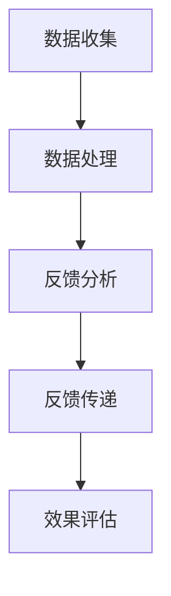
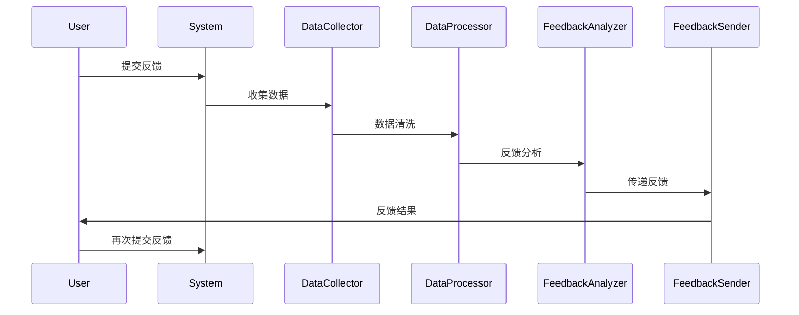
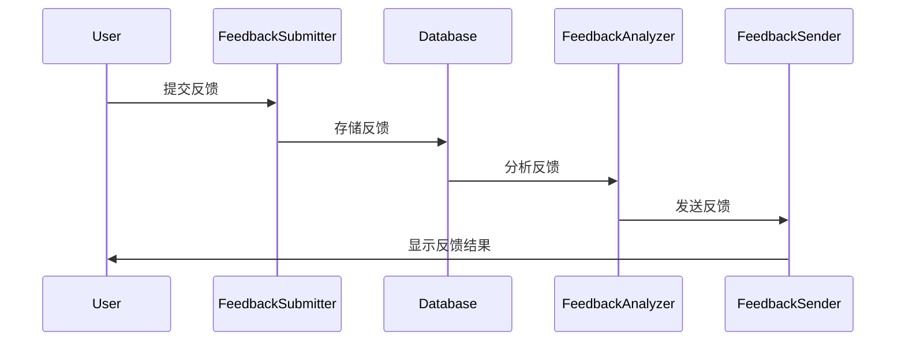

                 

### 如何建立有效的技术反馈机制

在技术领域，有效的技术反馈机制是确保项目成功和持续改进的关键。它不仅可以帮助团队快速识别和解决问题，还能促进知识的积累和创新。然而，如何建立这样一个机制，却常常让开发者和管理者感到困惑。本文将分步骤详细探讨如何建立有效的技术反馈机制。

#### 背景介绍

**核心概念术语说明**：
- **技术反馈机制**：一种系统化的方法，用于收集、分析并利用技术相关的数据和信息，以指导项目决策和改进。
- **反馈类型**：包括正向反馈（确认成功或正确性）和反向反馈（指出错误或不完善之处）。
- **反馈机制的设计原则**：如及时性、透明性、可追踪性和可操作性强。

**问题背景**：
技术项目在开发过程中，往往需要不断地调整和优化。传统的反馈机制，如定期会议或报告，往往不够及时和全面，无法有效捕捉实时问题和需求。

**问题描述**：
如何建立一种机制，能够快速、准确地收集和传递技术反馈，并确保反馈被合理利用和及时响应？

**问题解决**：
通过设计一个结构化、自动化的技术反馈机制，确保反馈的及时性、透明性和有效性。

**边界与外延**：
- **边界**：技术反馈机制的范围应限于项目的技术层面，不包括业务或管理层面的反馈。
- **外延**：反馈机制的设计和应用可以扩展到不同的技术领域和团队规模。

**概念结构与核心要素组成**：
- **数据收集**：确定需要收集的数据类型和来源。
- **处理与分析**：对收集到的数据进行分析和整理，提取有价值的信息。
- **反馈路径**：定义反馈传递的过程和渠道。
- **效果评估**：评估反馈机制的有效性和改进空间。

#### 核心概念与联系

**核心概念原理**：
技术反馈机制的核心在于通过及时、透明和结构化的反馈，促进项目改进和创新。其原理可以归纳为：

1. **反馈的及时性**：及时收集和传递反馈，确保问题能够在第一时间被发现和解决。
2. **反馈的透明性**：确保反馈信息的透明和可追溯，让所有相关人员都能了解反馈的内容和进展。
3. **反馈的可操作性**：提供具体的改进建议，使反馈能够转化为实际的行动。

**概念属性特征对比表格**：

| 特征           | 描述                           | 比较               |
| -------------- | ------------------------------ | ------------------ |
| 及时性         | 反馈的实时性                   | 传统反馈机制较慢   |
| 透明性         | 反馈信息的公开和可追溯         | 部分信息封闭       |
| 可操作性       | 反馈的可执行性                 | 仅提供意见而非方案 |
| 数据收集方式    | 自动化和手动结合               | 完全手动           |
| 分析与处理方法 | 数据挖掘和统计分析             | 简单归纳           |

**ER实体关系图架构**：

```mermaid
erDiagram
    User ||--|{ Feedback }
    Project ||--|{ Feedback }
    Bug ||--|{ Feedback }
    FeatureRequest ||--|{ Feedback }
```

用户、项目、Bug和功能请求都是反馈的实体，它们通过反馈关系相互关联。

#### 算法原理讲解

**算法mermaid流程图**：



**Python源代码**：

```python
# 数据收集
def collect_data():
    # 假设从日志文件中收集数据
    with open('logs.txt', 'r') as file:
        data = file.readlines()
    return data

# 数据处理
def process_data(data):
    # 对数据进行清洗和处理
    processed_data = [line.strip() for line in data if 'error' in line]
    return processed_data

# 反馈分析
def analyze_feedback(processed_data):
    # 分析反馈并提取信息
    feedbacks = []
    for line in processed_data:
        feedbacks.append({'description': line, 'status': 'pending'})
    return feedbacks

# 反馈传递
def send_feedback(feedbacks):
    # 将反馈传递给相关人员
    for feedback in feedbacks:
        print(f"Feedback: {feedback['description']} - Status: {feedback['status']}")

# 效果评估
def evaluate_feedback(feedbacks):
    # 评估反馈效果
    success = 0
    for feedback in feedbacks:
        if feedback['status'] == 'resolved':
            success += 1
    print(f"Feedback Success Rate: {success / len(feedbacks)}")
```

**算法原理的数学模型和公式**：

设 \( F \) 为反馈总数，\( R \) 为已解决反馈数，则反馈成功率 \( S \) 可表示为：

\[ S = \frac{R}{F} \]

通过这个简单的数学模型，可以直观地评估反馈机制的效果。

**详细讲解和举例说明**：

假设我们有一个包含100条日志数据的文件，其中包含了一些错误日志。通过数据收集模块，我们可以将这些日志读取出来。然后，通过数据处理模块，我们提取出所有包含“error”的日志，从而得到实际需要处理的反馈。接下来，通过反馈分析模块，我们为每条反馈创建一个字典，记录其描述和状态。最后，通过反馈传递模块，我们将这些反馈打印出来，供相关人员查看。在效果评估模块中，我们统计了已解决反馈的比例，从而得到了反馈的成功率。

#### 系统分析与架构设计方案

**问题场景介绍**：

假设我们正在开发一个在线教育平台，需要确保系统的稳定性和用户体验。为了实现这一目标，我们需要建立一个有效的技术反馈机制。

**项目介绍**：

项目名为“EduFeedback”，目标是建立一套自动化的技术反馈系统，用于收集、分析和传递用户反馈。

**系统功能设计**：

- **数据收集**：从日志文件、用户反馈表单和社交媒体等渠道收集数据。
- **数据处理**：清洗和整理收集到的数据，提取有价值的信息。
- **反馈分析**：对反馈进行分类和优先级排序。
- **反馈传递**：将反馈传递给相关团队和人员。
- **效果评估**：评估反馈机制的效果，并根据反馈进行改进。

**系统架构设计**：

**mermaid架构图**：



**系统接口设计**：

- **反馈提交接口**：允许用户提交反馈。
- **反馈查询接口**：允许用户查询自己的反馈状态。
- **反馈分析接口**：允许团队查询和分析反馈。

**系统交互mermaid序列图**：



通过这个系统架构，用户可以方便地提交反馈，系统自动处理和传递反馈，相关团队可以及时响应和解决问题，从而实现高效的技术反馈机制。

#### 项目实战

**环境安装**：

首先，我们需要安装Python环境和相关的库。在终端中执行以下命令：

```bash
pip install flask pandas numpy
```

**系统核心实现源代码**：

以下是一个简单的反馈收集和分析系统的实现：

```python
from flask import Flask, request, jsonify
import pandas as pd

app = Flask(__name__)

# 数据存储
feedbacks = []

# 提交反馈
@app.route('/submit', methods=['POST'])
def submit_feedback():
    feedback_data = request.get_json()
    feedbacks.append(feedback_data)
    return jsonify({"status": "success", "message": "Feedback submitted successfully."})

# 查询反馈
@app.route('/feedback', methods=['GET'])
def get_feedback():
    return jsonify(feedbacks)

# 主函数
if __name__ == '__main__':
    app.run(debug=True)
```

**代码应用解读与分析**：

上述代码使用Flask框架实现了一个简单的Web服务，用于处理用户提交的反馈。`submit_feedback` 函数接收POST请求，将反馈数据添加到列表中，并返回成功消息。`get_feedback` 函数则用于返回当前存储的所有反馈。

**实际案例分析和详细讲解剖析**：

假设我们有一个用户提交的反馈包含以下信息：

```json
{
    "description": "系统响应速度慢",
    "priority": "high"
}
```

当用户通过`/submit`接口提交这个反馈时，服务器会将其解析为Python字典，并添加到`feedbacks`列表中。然后，用户可以通过`/feedback`接口查询所有的反馈信息。

**项目小结**：

通过这个简单的案例，我们展示了如何使用Python和Flask框架快速搭建一个反馈收集系统。在实际项目中，可以进一步扩展这个系统的功能，如反馈分类、优先级排序和自动通知等。

#### 最佳实践 Tips

1. **明确反馈目标和范围**：在建立反馈机制之前，明确反馈的目标和范围，以确保收集到的信息是有价值的。
2. **简化反馈流程**：尽量简化反馈的提交和接收流程，以提高用户参与的积极性。
3. **自动化数据处理**：利用自动化工具进行数据收集和处理，减少人工干预，提高效率。
4. **定期评估反馈机制**：定期评估反馈机制的有效性，根据反馈进行调整和优化。

#### 小结

本文详细探讨了如何建立有效的技术反馈机制，包括背景介绍、核心概念与联系、算法原理讲解、系统分析与架构设计方案以及项目实战。通过这些步骤，开发者可以设计并实施一个高效的技术反馈机制，促进项目的持续改进和成功。

#### 注意事项

1. **数据安全**：确保反馈数据的安全和隐私，遵循相关法律法规。
2. **反馈的及时性和透明性**：确保反馈的及时性和透明性，提高反馈的质量和有效性。
3. **反馈的可操作性**：确保反馈提供具体的改进建议，使其具有可操作性。

#### 拓展阅读

- 《软件工程：实践者的研究方法》
- 《敏捷软件开发：原则、模式与实践》
- 《数据驱动产品管理：如何通过数据分析打造用户喜爱的产品》

### 作者

**作者：AI天才研究院/AI Genius Institute & 禅与计算机程序设计艺术 /Zen And The Art of Computer Programming**

