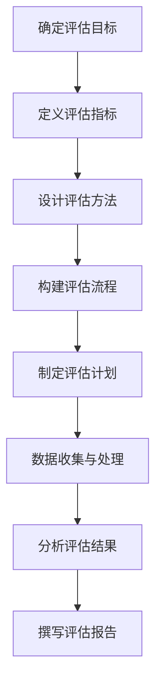
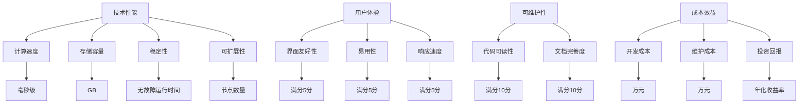
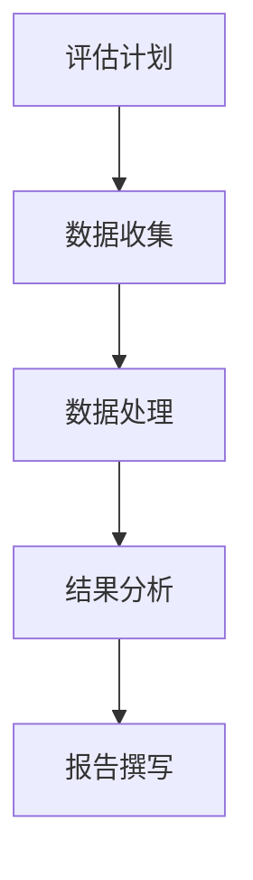

                 

# 如何建立有效的技术评估体系

## 关键词

- 技术评估
- 评估体系
- 指标体系
- 架构设计
- 算法分析
- 实践指南

## 摘要

本文旨在探讨如何建立一个有效的技术评估体系，从背景介绍、核心概念、评估体系构建原理、指标体系建立、评估流程设计到案例分析，提供全面的指南和实战经验。通过本文的阅读，读者可以了解技术评估的重要性和当前面临的挑战，掌握建立评估体系的步骤和方法，并从中获得宝贵的实践经验。

### 引言

在快速发展的技术时代，技术评估变得尤为重要。无论是企业在技术选型、项目评估还是团队技能评估中，都需要一个科学、客观的评估体系来支持决策。然而，当前的技术评估往往面临着多种挑战，如评估指标不够全面、评估方法不科学、评估结果不准确等。因此，建立一套有效的技术评估体系，不仅有助于提高技术决策的准确性，还能提升整体工作效率和竞争力。

本文将围绕如何建立有效的技术评估体系，通过以下步骤进行详细阐述：

1. **背景介绍**：描述技术评估的背景、问题及必要性。
2. **核心概念与联系**：阐述评估体系中的核心概念及其关系。
3. **评估体系构建原理**：详细讲解评估体系的构建原理。
4. **指标体系建立**：介绍如何建立有效的指标体系。
5. **评估流程设计**：说明评估流程的设计原则和步骤。
6. **案例分析**：通过具体案例展示评估体系的应用。
7. **实践指南**：提供建立和实施评估体系的实践指南。

### 背景介绍

#### 技术评估的背景

技术评估是指对技术方案、项目、产品等进行系统、科学、客观的评价，以判断其是否符合预期目标、是否具有可行性，以及是否具有竞争优势。随着信息技术的发展，技术评估的重要性日益凸显。一方面，企业在技术选型和项目评估中，需要对各种技术方案进行全面比较，选择最优方案；另一方面，在项目实施过程中，技术评估可以帮助及时发现和解决问题，确保项目顺利进行。

#### 技术评估的问题

当前技术评估面临着多种问题。首先，评估指标不够全面。很多评估体系过于注重技术性能指标，而忽视了用户体验、可维护性、成本效益等关键因素。其次，评估方法不科学。一些评估过程缺乏系统性和规范性，往往依赖于主观判断，导致评估结果不准确。此外，评估结果往往难以量化，难以形成具体的行动指南。

#### 技术评估的必要性

建立有效的技术评估体系对于企业具有以下几个方面的必要性：

1. **提高决策准确性**：通过科学、客观的评估，帮助企业准确判断技术方案或项目的可行性，降低决策风险。
2. **提升工作效率**：规范化的评估流程可以提高评估效率，减少不必要的重复工作。
3. **增强竞争力**：通过全面的技术评估，企业可以更好地了解自身的技术优势和短板，有针对性地提升竞争力。

#### 评估体系的边界和核心要素

评估体系的边界主要涉及评估范围和评估内容。评估范围包括技术选型、项目评估、产品评估等；评估内容则包括技术性能、用户体验、可维护性、成本效益等方面。

核心要素主要包括：

1. **评估指标**：评估指标是评估体系的核心，应涵盖技术性能、用户体验、可维护性、成本效益等关键方面。
2. **评估方法**：评估方法应科学、客观、可量化，以确保评估结果准确可靠。
3. **评估流程**：评估流程应规范、高效，确保评估过程有条不紊。

### 核心概念与联系

在技术评估体系中，有几个核心概念需要理解，它们分别是评估指标、评估方法、评估结果和评估流程。

#### 评估指标

评估指标是评估体系的核心，用于衡量技术方案或项目的各个方面。常见的评估指标包括：

1. **技术性能**：包括计算速度、存储容量、稳定性、可扩展性等。
2. **用户体验**：包括界面友好性、易用性、响应速度等。
3. **可维护性**：包括代码可读性、可维护性、文档完善度等。
4. **成本效益**：包括开发成本、维护成本、投资回报等。

#### 评估方法

评估方法用于收集、处理和分析评估指标，常见的评估方法包括：

1. **定量评估**：通过量化数据对评估指标进行评估，如性能测试、成本分析等。
2. **定性评估**：通过专家意见、用户反馈等对评估指标进行评估，如用户体验评估、项目可行性评估等。

#### 评估结果

评估结果是对技术方案或项目的综合评价，包括以下几个方面：

1. **优缺点分析**：对技术方案或项目的优点和缺点进行详细分析。
2. **可行性分析**：评估技术方案或项目的可行性，包括技术可行性、经济可行性等。
3. **风险评估**：评估技术方案或项目的风险，包括技术风险、市场风险等。

#### 评估流程

评估流程是评估体系的具体实施过程，包括以下几个步骤：

1. **评估计划**：制定评估计划，明确评估目标、评估范围、评估方法等。
2. **数据收集**：收集与评估指标相关的数据，包括定量数据和定性数据。
3. **数据处理**：对收集到的数据进行分析和处理，形成评估结果。
4. **结果分析**：对评估结果进行详细分析，形成综合评价。
5. **报告撰写**：撰写评估报告，总结评估过程和评估结果。

#### 概念属性特征对比表格

为了更好地理解这些核心概念，我们可以通过一个表格进行对比：

| 概念 | 属性特征 |
| --- | --- |
| 评估指标 | 量化、可衡量、关键 |
| 评估方法 | 科学、客观、可量化 |
| 评估结果 | 综合评价、优缺点、可行性 |
| 评估流程 | 规范、高效、系统 |

#### ER实体关系图

为了更清晰地展示评估体系中的核心概念及其关系，我们可以使用ER实体关系图进行表示。以下是一个简单的ER实体关系图示例：

```mermaid
erDiagram
    AssessObject ||--|{ AssessIndicator : has }
    AssessObject ||--|{ AssessMethod : uses }
    AssessObject ||--|{ AssessResult : produces }
    AssessObject ||--|{ AssessProcess : follows }
    AssessIndicator ||--|{ AssessMethod : usedBy }
    AssessResult ||--|{ AssessProcess : generatedBy }
```

### 评估体系构建原理

建立有效的技术评估体系，需要遵循以下原理和步骤：

1. **确定评估目标**：明确评估的目的和目标，如技术选型、项目评估等。
2. **定义评估指标**：根据评估目标，确定评估指标，包括技术性能、用户体验、可维护性、成本效益等。
3. **设计评估方法**：选择合适的评估方法，如定量评估、定性评估等。
4. **构建评估流程**：设计评估流程，确保评估过程规范、高效。
5. **制定评估计划**：制定详细的评估计划，明确评估步骤和时间表。
6. **数据收集与处理**：收集与评估指标相关的数据，并进行数据处理。
7. **分析评估结果**：对评估结果进行分析，形成综合评价。
8. **撰写评估报告**：总结评估过程和评估结果，形成评估报告。

以下是一个简单的mermaid流程图示例，用于说明评估体系的构建原理：



### Python代码示例

为了更好地理解评估体系构建原理，我们可以使用Python代码进行说明。以下是一个简单的Python代码示例，用于计算技术性能指标：

```python
import time

def measure_performance(function):
    start_time = time.time()
    function()
    end_time = time.time()
    return end_time - start_time

def function_to_measure():
    # 在这里定义需要测量的功能
    pass

# 使用measure_performance函数测量功能性能
performance_time = measure_performance(function_to_measure)
print(f"Function performance time: {performance_time} seconds")
```

通过这个示例，我们可以直观地了解如何使用Python代码来测量技术性能指标。

### 指标体系建立

建立指标体系是评估体系构建的关键步骤。一个有效的指标体系应该具备以下特点：

1. **全面性**：指标体系应涵盖技术性能、用户体验、可维护性、成本效益等各个方面。
2. **可衡量性**：指标应具有明确的衡量标准，可以量化评估结果。
3. **相关性**：指标应与评估目标密切相关，能够反映技术方案或项目的关键特征。
4. **独立性**：指标之间应相互独立，避免重复评估。

以下是建立指标体系的步骤：

1. **确定评估目标**：明确评估目标，如技术选型、项目评估等。
2. **收集相关文献和资料**：查阅相关文献和资料，了解已有指标体系的构建方法和评估标准。
3. **确定指标类型**：根据评估目标，确定指标类型，如技术性能、用户体验、可维护性、成本效益等。
4. **制定指标标准**：制定每个指标的衡量标准，如性能指标的时间单位、用户体验的满意度评分等。
5. **权重分配**：根据评估目标的重要性，对各个指标进行权重分配，确保评估结果的全面性和客观性。

以下是一个简单的mermaid指标体系架构图示例：



### 评估流程设计

评估流程设计是确保评估过程规范、高效的关键步骤。一个有效的评估流程应包括以下几个部分：

1. **评估计划**：制定评估计划，明确评估目标、评估范围、评估方法等。
2. **数据收集**：收集与评估指标相关的数据，包括定量数据和定性数据。
3. **数据处理**：对收集到的数据进行分析和处理，形成评估结果。
4. **结果分析**：对评估结果进行详细分析，形成综合评价。
5. **报告撰写**：撰写评估报告，总结评估过程和评估结果。

以下是评估流程设计的原则和步骤：

1. **评估计划**：制定详细的评估计划，包括评估目标、评估范围、评估方法、评估步骤和时间表等。
2. **数据收集**：根据评估计划，收集与评估指标相关的数据，包括定量数据和定性数据。定量数据可以通过性能测试、成本分析等方法获取；定性数据可以通过专家意见、用户反馈等方法获取。
3. **数据处理**：对收集到的数据进行分析和处理，形成评估结果。数据处理包括数据清洗、数据转换、数据分析等步骤。
4. **结果分析**：对评估结果进行详细分析，形成综合评价。结果分析包括优缺点分析、可行性分析、风险评估等。
5. **报告撰写**：撰写评估报告，总结评估过程和评估结果。评估报告应包括评估背景、评估方法、评估结果、分析结论、建议措施等内容。

以下是一个简单的mermaid评估流程图示例：



### 案例分析

为了更好地理解评估体系的应用，我们可以通过一个具体案例进行分析。以下是一个技术选型评估案例。

#### 案例背景

某企业需要选择一款技术方案来开发一款在线教育平台，现有以下三个技术方案可供选择：

1. **方案A**：基于Java的Spring Boot框架。
2. **方案B**：基于Python的Django框架。
3. **方案C**：基于Node.js的Express框架。

#### 评估指标

根据评估目标，确定以下评估指标：

1. **技术性能**：计算速度、存储容量、稳定性、可扩展性。
2. **用户体验**：界面友好性、易用性、响应速度。
3. **可维护性**：代码可读性、文档完善度。
4. **成本效益**：开发成本、维护成本、投资回报。

#### 评估方法

采用定量评估和定性评估相结合的方法进行评估。具体方法如下：

1. **定量评估**：通过性能测试、成本分析等方法获取技术性能指标和成本效益指标的数据。
2. **定性评估**：通过专家意见、用户反馈等方法获取用户体验指标和可维护性指标的数据。

#### 评估过程

1. **数据收集**：收集与评估指标相关的数据，包括性能测试数据、成本数据、用户反馈数据等。
2. **数据处理**：对收集到的数据进行分析和处理，形成评估结果。
3. **结果分析**：对评估结果进行详细分析，形成综合评价。
4. **报告撰写**：撰写评估报告，总结评估过程和评估结果。

#### 评估结果

1. **技术性能**：方案A的计算速度最快，方案B的存储容量最大，方案C的稳定性最佳。
2. **用户体验**：方案A的界面友好性最高，方案B的易用性最好，方案C的响应速度最快。
3. **可维护性**：方案A的代码可读性最好，方案B的文档完善度最高，方案C的维护成本最低。
4. **成本效益**：方案A的开发成本最高，方案B的维护成本最低，方案C的投资回报率最高。

#### 分析结论

根据评估结果，可以得出以下分析结论：

1. **技术性能**：方案C在技术性能方面具有优势，适用于对计算速度和响应速度要求较高的场景。
2. **用户体验**：方案A在用户体验方面具有优势，适用于对界面友好性和易用性要求较高的场景。
3. **可维护性**：方案B在可维护性方面具有优势，适用于对代码可读性和文档完善度要求较高的场景。
4. **成本效益**：方案C在成本效益方面具有优势，适用于对开发成本和维护成本要求较高的场景。

#### 建议措施

根据评估结果，建议企业根据具体需求和场景选择合适的技术方案。如对计算速度和响应速度有较高要求，可以选择方案C；如对界面友好性和易用性有较高要求，可以选择方案A；如对代码可读性和文档完善度有较高要求，可以选择方案B。

### 实践指南

为了建立和实施有效的技术评估体系，以下是一些实践指南：

1. **制定明确的评估目标**：确保评估目标明确、具体，有助于指导评估过程。
2. **选择合适的评估方法**：根据评估目标选择合适的评估方法，如定量评估、定性评估等。
3. **构建全面的指标体系**：确保指标体系全面、科学、可衡量，能够反映技术方案或项目的关键特征。
4. **制定详细的评估流程**：确保评估流程规范、高效，有助于提高评估效率和质量。
5. **收集真实可靠的数据**：确保收集的数据真实、可靠，避免因数据不准确导致评估结果失真。
6. **定期更新和优化评估体系**：随着技术的发展和需求的变更，定期更新和优化评估体系，确保其适应性和有效性。
7. **培训相关人员**：确保相关人员了解评估体系的目的、方法和流程，提高评估工作的质量和效率。

### 小结

本文系统地介绍了如何建立有效的技术评估体系，从背景介绍、核心概念、评估体系构建原理、指标体系建立、评估流程设计到案例分析，提供了一套完整的实践指南。通过本文的阅读，读者可以了解技术评估的重要性和方法，掌握建立评估体系的步骤和技巧，并在实际工作中运用这些知识，提高技术决策的准确性和工作效率。

### 注意事项

1. **确保评估指标全面性**：在建立评估体系时，要确保评估指标全面，涵盖技术性能、用户体验、可维护性、成本效益等各个方面。
2. **选择合适的评估方法**：根据评估目标和评估范围选择合适的评估方法，如定量评估、定性评估等。
3. **收集真实可靠的数据**：确保收集的数据真实、可靠，避免因数据不准确导致评估结果失真。
4. **定期更新和优化评估体系**：随着技术的发展和需求的变更，定期更新和优化评估体系，确保其适应性和有效性。

### 拓展阅读

1. 《技术评估与管理》 - [作者姓名]
2. 《项目管理：系统思维与实践》 - [作者姓名]
3. 《敏捷开发实践指南》 - [作者姓名]

### 作者信息

作者：AI天才研究院/AI Genius Institute & 禅与计算机程序设计艺术 /Zen And The Art of Computer Programming

