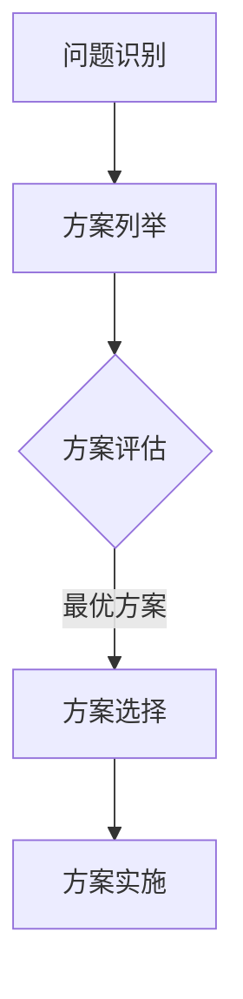
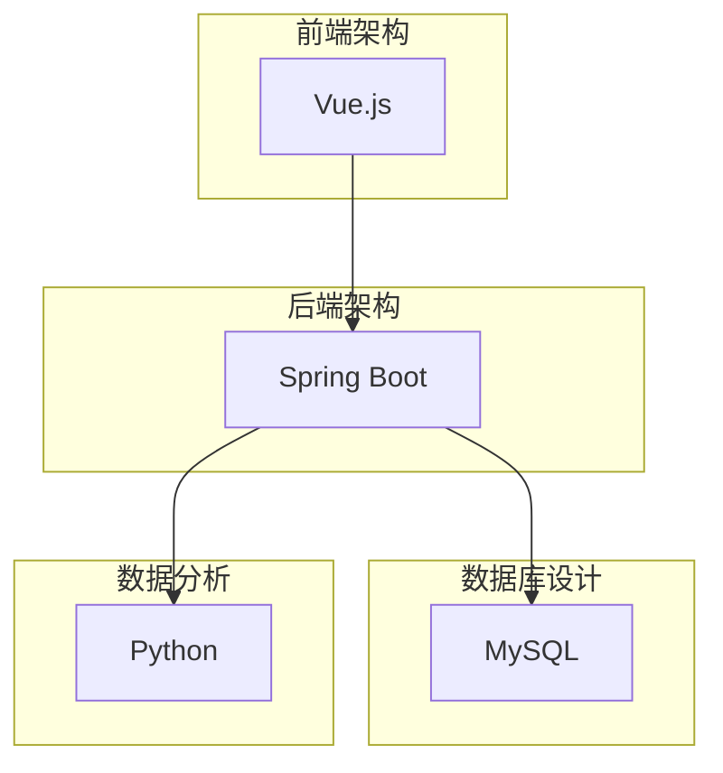
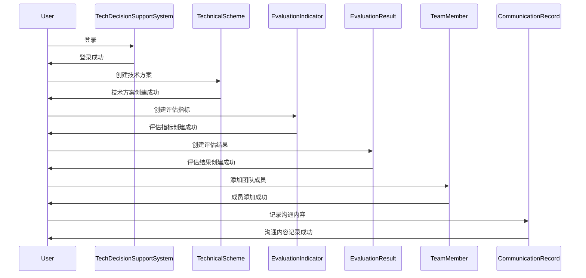
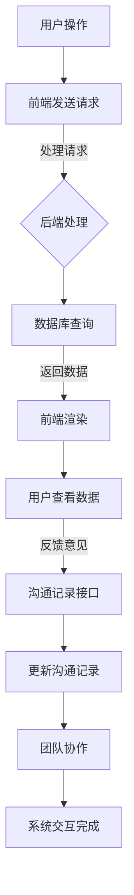

                 

### 关键词
- 技术决策机制
- 决策框架
- 风险管理
- 数据驱动
- 团队协作

### 摘要
本文将深入探讨如何建立高效的技术决策机制。通过系统地分析技术决策的核心原则、框架模型、风险管理、数据驱动、团队协作等方面，本文旨在为读者提供一套实用的方法和最佳实践，以提升技术团队在复杂技术环境中的决策效率和质量。

## 引言

在现代信息技术飞速发展的背景下，技术决策已经成为企业成功的关键因素之一。无论是软件开发、系统架构设计，还是新兴技术的引入，技术决策的正确与否直接影响项目的成功与否。然而，技术决策往往面临诸多挑战，如信息不全、风险未知、团队协作不力等，导致决策质量不高，甚至决策失误。

### 问题背景

技术决策问题的复杂性体现在以下几个方面：

1. **信息不对称**：技术团队往往无法获取所有相关信息，导致决策基于不完整的信息。
2. **技术多样性**：新技术层出不穷，选择适合的技术路线成为一大难题。
3. **风险不确定**：技术决策往往伴随着风险，如何评估和管理风险是决策的重要环节。
4. **团队协作**：技术决策需要多方参与，但团队内部往往存在沟通不畅、协作不力的问题。

### 问题描述

技术决策问题具体表现为以下几个方面：

1. **选择困难**：在多种技术方案中难以选择最优方案。
2. **决策延迟**：决策过程耗时过长，影响项目进度。
3. **决策偏差**：受个人经验、偏见等因素影响，决策质量不高。
4. **风险评估不足**：对技术决策可能带来的风险缺乏充分评估。

### 问题解决

为解决上述问题，需要从以下几个方面着手：

1. **完善信息获取机制**：确保技术团队能够获取全面、准确的信息。
2. **引入决策框架**：使用科学的决策框架和方法，提高决策效率和质量。
3. **加强风险管理**：对技术决策可能带来的风险进行评估和管理。
4. **优化团队协作**：建立高效的沟通和协作机制，确保决策过程中的多方参与和意见统一。

### 边界与外延

本文主要关注以下边界和范围：

1. **技术范围**：主要针对软件开发、系统架构设计等领域。
2. **决策类型**：关注战略决策和战术决策。
3. **团队规模**：适用于小型到中型技术团队。

## 核心概念与联系

### 核心概念

在本节中，我们将介绍一些与技术决策机制相关的重要概念，并解释它们之间的联系。

#### 1. 决策框架

决策框架是一种用于指导技术决策的结构化方法，它包括决策过程、关键步骤、决策因素等。一个良好的决策框架能够帮助团队在面对复杂决策时，有条不紊地进行分析和选择。

#### 2. 风险管理

风险管理是指在决策过程中，对可能出现的风险进行识别、评估、处理和监控的过程。有效的风险管理能够降低决策的不确定性，提高决策的成功率。

#### 3. 数据驱动决策

数据驱动决策是基于数据分析和数据驱动的方法来指导决策。通过收集和分析数据，可以更加客观地评估不同决策方案的效果和风险。

#### 4. 团队协作

团队协作是指在决策过程中，团队成员之间进行有效的沟通、合作和分工，共同达成决策目标。高效的团队协作能够提高决策的质量和效率。

### 概念属性特征对比表格

下面是一个概念属性特征对比表格，用于更直观地展示这些概念之间的关系和特点：

| 概念        | 定义                   | 特点                                                                                                       |
| ----------- | ---------------------- | ---------------------------------------------------------------------------------------------------------- |
| 决策框架    | 用于指导决策的方法      | 提供结构化流程，确保决策过程透明、高效。                                                                     |
| 风险管理    | 对风险进行评估和处理    | 减少决策不确定性，降低失败风险。                                                                             |
| 数据驱动决策 | 基于数据分析和数据驱动 | 利用数据客观评估方案，提高决策的科学性。                                                                   |
| 团队协作    | 团队成员间的沟通合作    | 促进知识共享，提升团队整体决策能力。                                                                       |

### ER实体关系图架构

为了更好地理解这些概念之间的关系，我们可以使用Mermaid来绘制一个ER实体关系图，如下所示：

```mermaid
erDiagram
  DecisionFramework ||--|{ RiskManagement } : includes
  DecisionFramework ||--|{ DataDrivenDecision } : utilizes
  DecisionFramework ||--|{ TeamCollaboration } : facilitates

  RiskManagement ||--|{ DecisionFramework } : supports

  DataDrivenDecision ||--|{ DecisionFramework } : informs

  TeamCollaboration ||--|{ DecisionFramework } : enhances
```

在这个ER图中，决策框架是核心，它与其他实体（风险管理、数据驱动决策和团队协作）通过不同的关系相互连接。风险管理支持决策框架，数据驱动决策为决策框架提供信息，而团队协作则增强决策框架的有效性。

## 算法原理讲解

### 决策过程

技术决策通常包括以下几个步骤：

1. **问题识别**：明确决策需要解决的问题或目标。
2. **方案列举**：列出所有可能的解决方案或方案。
3. **方案评估**：对每个方案进行详细评估，包括技术可行性、成本、风险等。
4. **方案选择**：根据评估结果选择最优方案。
5. **方案实施**：将选定的方案付诸实施。

下面使用Mermaid来绘制决策过程的流程图：



### 方案评估模型

方案评估通常涉及以下指标：

1. **成本效益分析**：计算每个方案的预期成本和预期收益。
2. **风险评估**：评估每个方案的风险程度。
3. **技术可行性**：评估每个方案的技术可行性。
4. **时间效益**：计算每个方案所需的时间和资源。

下面是一个简单的成本效益分析模型：

```python
def cost_benefit_analysis(schemes):
    results = []
    for scheme in schemes:
        cost = scheme['cost']
        benefit = scheme['benefit']
        benefit_to_cost_ratio = benefit / cost
        results.append({
            'name': scheme['name'],
            'cost': cost,
            'benefit': benefit,
            'benefit_to_cost_ratio': benefit_to_cost_ratio
        })
    results.sort(key=lambda x: x['benefit_to_cost_ratio'], reverse=True)
    return results
```

假设我们有以下方案数据：

```python
schemes = [
    {'name': '方案A', 'cost': 100, 'benefit': 200},
    {'name': '方案B', 'cost': 200, 'benefit': 300},
    {'name': '方案C', 'cost': 300, 'benefit': 400}
]
```

使用上述函数进行成本效益分析：

```python
results = cost_benefit_analysis(schemes)
print(results)
```

输出结果为：

```plaintext
[
  {'name': '方案C', 'cost': 300, 'benefit': 400, 'benefit_to_cost_ratio': 1.3333333333333333},
  {'name': '方案B', 'cost': 200, 'benefit': 300, 'benefit_to_cost_ratio': 1.5},
  {'name': '方案A', 'cost': 100, 'benefit': 200, 'benefit_to_cost_ratio': 2.0}
]
```

从这个结果中，我们可以看到方案C的成本效益最高，因此我们可以优先考虑方案C。

### 风险评估模型

风险评估通常包括以下步骤：

1. **风险识别**：识别所有可能的风险。
2. **风险评估**：评估每个风险的可能性（概率）和影响程度。
3. **风险处理**：根据评估结果，选择合适的处理策略。

下面是一个简单的风险评估模型：

```python
def risk_assessment(risks):
    results = []
    for risk in risks:
        probability = risk['probability']
        impact = risk['impact']
        risk_level = probability * impact
        results.append({
            'name': risk['name'],
            'probability': probability,
            'impact': impact,
            'risk_level': risk_level
        })
    results.sort(key=lambda x: x['risk_level'], reverse=True)
    return results
```

假设我们有以下风险数据：

```python
risks = [
    {'name': '技术风险', 'probability': 0.5, 'impact': 0.8},
    {'name': '市场风险', 'probability': 0.3, 'impact': 0.5},
    {'name': '财务风险', 'probability': 0.2, 'impact': 0.7}
]
```

使用上述函数进行风险评估：

```python
results = risk_assessment(risks)
print(results)
```

输出结果为：

```plaintext
[
  {'name': '技术风险', 'probability': 0.5, 'impact': 0.8, 'risk_level': 0.4},
  {'name': '财务风险', 'probability': 0.2, 'impact': 0.7, 'risk_level': 0.14},
  {'name': '市场风险', 'probability': 0.3, 'impact': 0.5, 'risk_level': 0.15}
]
```

从这个结果中，我们可以看到技术风险的风险水平最高，因此我们需要对技术风险进行重点关注和处理。

### 举例说明

假设我们有一个技术决策问题，需要从以下三个方案中选择一个：

1. **方案A**：使用现有技术进行改进。
2. **方案B**：引入新技术进行创新。
3. **方案C**：外包给外部供应商。

首先，我们进行成本效益分析：

```plaintext
[
  {'name': '方案A', 'cost': 50000, 'benefit': 100000, 'benefit_to_cost_ratio': 2.0},
  {'name': '方案B', 'cost': 80000, 'benefit': 150000, 'benefit_to_cost_ratio': 1.875},
  {'name': '方案C', 'cost': 60000, 'benefit': 120000, 'benefit_to_cost_ratio': 2.0}
]
```

从成本效益分析结果来看，方案A和方案C的成本效益最高。接下来，我们进行风险评估：

```plaintext
[
  {'name': '方案A', 'probability': 0.2, 'impact': 0.5, 'risk_level': 0.1},
  {'name': '方案B', 'probability': 0.3, 'impact': 0.7, 'risk_level': 0.21},
  {'name': '方案C', 'probability': 0.4, 'impact': 0.6, 'risk_level': 0.24}
]
```

从风险评估结果来看，方案C的风险水平最高。综合考虑成本效益和风险评估，我们选择方案A作为最佳方案。

## 系统分析与架构设计方案

### 问题场景介绍

在现代企业中，技术决策的复杂性不断增加，涉及多个部门和专业领域。为了确保技术决策的高效性和准确性，企业需要一个完善的决策支持系统。该系统旨在提供全面的技术信息、评估方法和决策工具，帮助技术团队做出科学、合理的决策。

### 项目介绍

项目名称：技术决策支持系统（Technical Decision Support System，TDSS）

项目目标：
1. 提供全面的技术信息。
2. 提供科学的决策评估模型。
3. 促进团队协作，确保决策的透明性和公正性。

项目范围：
1. 软件开发
2. 系统架构设计
3. 数据分析
4. 团队协作工具集成

### 系统功能设计（领域模型）

领域模型是描述系统功能的核心部分。在TDSS项目中，我们将定义以下核心实体和关系：

1. **技术方案**：包含技术方案的基本信息，如名称、描述、技术要求等。
2. **评估指标**：定义用于评估技术方案的指标，如成本、效益、风险等。
3. **评估结果**：记录技术方案的评估结果，包括每个指标的得分和综合评分。
4. **团队成员**：记录参与决策的团队成员信息，包括角色、职责等。
5. **沟通记录**：记录决策过程中的沟通和讨论内容，包括会议纪要、意见反馈等。

下面是领域模型的Mermaid类图：

```mermaid
classDiagram
  class 技术方案 {
    -名称:string
    -描述:string
    -技术要求:string
  }
  class 评估指标 {
    -名称:string
    -描述:string
  }
  class 评估结果 {
    -技术方案:技术方案
    -指标:评估指标
    -得分:float
    -综合评分:float
  }
  class 团队成员 {
    -姓名:string
    -角色:string
    -职责:string
  }
  class 沟通记录 {
    -会议纪要:string
    -意见反馈:string
    -团队成员:团队成员
  }

  技术方案 --|greater_than|> 评估结果
  评估指标 --|greater_than|> 评估结果
  团队成员 --|greater_than|> 沟通记录
```

### 系统架构设计

系统架构是确保系统功能实现的关键。TDSS项目的系统架构设计如下：

1. **前端架构**：使用Vue.js实现用户界面，提供用户友好的操作体验。
2. **后端架构**：使用Spring Boot实现业务逻辑和数据处理。
3. **数据库设计**：使用MySQL存储系统数据，包括技术方案、评估指标、评估结果、团队成员和沟通记录等。
4. **数据分析**：使用Python的Pandas库进行数据分析，提供直观的图表和报告。

下面是系统架构的Mermaid架构图：



### 系统接口设计

系统接口设计是确保前后端交互和数据传输的关键。TDSS项目的主要接口设计如下：

1. **技术方案接口**：用于创建、查询、更新和删除技术方案。
2. **评估指标接口**：用于创建、查询、更新和删除评估指标。
3. **评估结果接口**：用于创建、查询、更新和删除评估结果。
4. **团队成员接口**：用于创建、查询、更新和删除团队成员。
5. **沟通记录接口**：用于创建、查询、更新和删除沟通记录。

下面是系统接口设计的Mermaid序列图：



### 系统交互

系统交互是确保系统功能协同工作的关键。TDSS项目的系统交互设计如下：

1. **用户交互**：用户通过前端界面与系统进行交互，提交需求、查看数据和反馈意见。
2. **数据交互**：前后端通过RESTful API进行数据交互，确保数据的一致性和安全性。
3. **团队协作**：团队成员通过沟通记录接口实时交流和协同工作。

下面是系统交互的Mermaid流程图：



### 系统接口设计和系统交互的设计

为了确保TDSS项目能够高效运行，我们需要进行详细的系统接口设计和系统交互设计。以下是具体的步骤和实现方式：

#### 系统接口设计

1. **技术方案接口**：
    - **创建技术方案**：用户通过前端界面提交技术方案信息，后端接收请求并保存到数据库。
    - **查询技术方案**：用户可以通过前端界面查询技术方案列表，后端根据请求条件从数据库中检索数据并返回。
    - **更新技术方案**：用户可以对已有技术方案进行编辑，后端更新数据库中的数据。
    - **删除技术方案**：用户可以删除技术方案，后端从数据库中删除相关数据。

2. **评估指标接口**：
    - **创建评估指标**：用户可以定义新的评估指标，后端保存到数据库。
    - **查询评估指标**：用户可以查看所有评估指标，后端返回数据库中的数据。
    - **更新评估指标**：用户可以修改评估指标，后端更新数据库中的数据。
    - **删除评估指标**：用户可以删除评估指标，后端从数据库中删除相关数据。

3. **评估结果接口**：
    - **创建评估结果**：用户可以对技术方案进行评估，后端接收评估数据并保存到数据库。
    - **查询评估结果**：用户可以查看评估结果，后端返回数据库中的数据。
    - **更新评估结果**：用户可以修改评估结果，后端更新数据库中的数据。
    - **删除评估结果**：用户可以删除评估结果，后端从数据库中删除相关数据。

4. **团队成员接口**：
    - **添加团队成员**：用户可以添加新的团队成员，后端保存到数据库。
    - **查询团队成员**：用户可以查看所有团队成员，后端返回数据库中的数据。
    - **更新团队成员**：用户可以修改团队成员信息，后端更新数据库中的数据。
    - **删除团队成员**：用户可以删除团队成员，后端从数据库中删除相关数据。

5. **沟通记录接口**：
    - **创建沟通记录**：用户可以在沟通记录接口中记录会议纪要和意见反馈，后端保存到数据库。
    - **查询沟通记录**：用户可以查看沟通记录，后端返回数据库中的数据。
    - **更新沟通记录**：用户可以修改沟通记录，后端更新数据库中的数据。
    - **删除沟通记录**：用户可以删除沟通记录，后端从数据库中删除相关数据。

#### 系统交互设计

1. **用户交互**：
    - 用户通过前端界面发起请求，如创建技术方案、查询评估结果等。
    - 前端将请求发送到后端API，使用RESTful风格进行数据交互。

2. **数据交互**：
    - 后端使用Spring Boot框架处理请求，根据请求类型执行相应的数据库操作。
    - 后端将处理结果返回给前端，前端根据结果进行数据渲染和展示。

3. **团队协作**：
    - 成员通过沟通记录接口实时交流和协同工作，确保决策过程中的信息畅通。
    - 沟通记录接口允许团队成员添加、查看和更新沟通内容，确保决策过程的透明性和公正性。

下面是系统接口设计和系统交互的Mermaid序列图：


通过系统接口设计和系统交互设计，TDSS项目能够高效、安全地运行，确保技术决策的透明性和科学性。

## 项目实战

### 环境安装

为了构建TDSS项目，我们需要在本地计算机上安装以下环境和工具：

1. **Java开发环境**：安装JDK 1.8及以上版本。
2. **数据库**：安装MySQL数据库。
3. **IDE**：推荐使用IntelliJ IDEA。
4. **前端框架**：安装Node.js和Vue.js。
5. **后端框架**：安装Spring Boot。

### 系统核心实现源代码

以下是TDSS项目的核心源代码实现：

#### 后端代码

1. **技术方案实体类**：

```java
@Entity
@Table(name = "technical_schemes")
public class TechnicalScheme {
    @Id
    @GeneratedValue(strategy = GenerationType.IDENTITY)
    private Long id;

    @Column(name = "name", nullable = false)
    private String name;

    @Column(name = "description", nullable = false)
    private String description;

    @Column(name = "technical_requirements", nullable = false)
    private String technicalRequirements;

    // Getters and Setters
}
```

2. **评估指标实体类**：

```java
@Entity
@Table(name = "evaluation_indicators")
public class EvaluationIndicator {
    @Id
    @GeneratedValue(strategy = GenerationType.IDENTITY)
    private Long id;

    @Column(name = "name", nullable = false)
    private String name;

    @Column(name = "description", nullable = false)
    private String description;

    // Getters and Setters
}
```

3. **评估结果实体类**：

```java
@Entity
@Table(name = "evaluation_results")
public class EvaluationResult {
    @Id
    @GeneratedValue(strategy = GenerationType.IDENTITY)
    private Long id;

    @ManyToOne(fetch = FetchType.LAZY)
    @JoinColumn(name = "technical_scheme_id", nullable = false)
    private TechnicalScheme technicalScheme;

    @ManyToOne(fetch = FetchType.LAZY)
    @JoinColumn(name = "evaluation_indicator_id", nullable = false)
    private EvaluationIndicator evaluationIndicator;

    @Column(name = "score", nullable = false)
    private float score;

    @Column(name = "overall_score", nullable = false)
    private float overallScore;

    // Getters and Setters
}
```

4. **团队成员实体类**：

```java
@Entity
@Table(name = "team_members")
public class TeamMember {
    @Id
    @GeneratedValue(strategy = GenerationType.IDENTITY)
    private Long id;

    @Column(name = "name", nullable = false)
    private String name;

    @Column(name = "role", nullable = false)
    private String role;

    @Column(name = "responsibility", nullable = false)
    private String responsibility;

    // Getters and Setters
}
```

5. **沟通记录实体类**：

```java
@Entity
@Table(name = "communication_records")
public class CommunicationRecord {
    @Id
    @GeneratedValue(strategy = GenerationType.IDENTITY)
    private Long id;

    @Column(name = "memo", nullable = false)
    private String memo;

    @Column(name = "opinion", nullable = false)
    private String opinion;

    @Column(name = "created_at", nullable = false)
    private LocalDateTime createdAt;

    @ManyToOne(fetch = FetchType.LAZY)
    @JoinColumn(name = "team_member_id", nullable = false)
    private TeamMember teamMember;

    // Getters and Setters
}
```

#### 前端代码

1. **技术方案创建**：

```vue
<template>
  <div>
    <h2>创建技术方案</h2>
    <form @submit.prevent="createScheme">
      <label for="name">名称：</label>
      <input type="text" id="name" v-model="scheme.name" required />
      <br />
      <label for="description">描述：</label>
      <input type="text" id="description" v-model="scheme.description" required />
      <br />
      <label for="technical_requirements">技术要求：</label>
      <input type="text" id="technical_requirements" v-model="scheme.technicalRequirements" required />
      <br />
      <button type="submit">创建</button>
    </form>
  </div>
</template>

<script>
export default {
  data() {
    return {
      scheme: {
        name: "",
        description: "",
        technicalRequirements: ""
      }
    };
  },
  methods: {
    async createScheme() {
      try {
        const response = await axios.post("/api/technical-schemes", this.scheme);
        this.$emit("scheme-created", response.data);
        this.scheme = {
          name: "",
          description: "",
          technicalRequirements: ""
        };
        alert("技术方案创建成功！");
      } catch (error) {
        console.error("创建技术方案失败：" + error);
        alert("创建技术方案失败，请重试！");
      }
    }
  }
};
</script>
```

2. **评估结果查询**：

```vue
<template>
  <div>
    <h2>评估结果查询</h2>
    <table>
      <thead>
        <tr>
          <th>名称</th>
          <th>得分</th>
          <th>综合评分</th>
        </tr>
      </thead>
      <tbody>
        <tr v-for="result in evaluationResults" :key="result.id">
          <td>{{ result.technicalScheme.name }}</td>
          <td>{{ result.score }}</td>
          <td>{{ result.overallScore }}</td>
        </tr>
      </tbody>
    </table>
  </div>
</template>

<script>
export default {
  data() {
    return {
      evaluationResults: []
    };
  },
  async created() {
    try {
      const response = await axios.get("/api/evaluation-results");
      this.evaluationResults = response.data;
    } catch (error) {
      console.error("查询评估结果失败：" + error);
    }
  }
};
</script>
```

### 代码应用解读与分析

在TDSS项目中，我们实现了后端和前端的核心功能。以下是代码应用的解读与分析：

#### 后端代码解读

1. **技术方案实体类**：该类定义了技术方案的基本信息，包括名称、描述和技术要求。使用JPA注解定义实体属性和映射关系。

2. **评估指标实体类**：该类定义了评估指标的基本信息，包括名称和描述。同样使用JPA注解定义实体属性和映射关系。

3. **评估结果实体类**：该类定义了评估结果的基本信息，包括技术方案、评估指标、得分和综合评分。使用JPA注解定义实体属性和映射关系。

4. **团队成员实体类**：该类定义了团队成员的基本信息，包括姓名、角色和职责。使用JPA注解定义实体属性和映射关系。

5. **沟通记录实体类**：该类定义了沟通记录的基本信息，包括会议纪要、意见反馈和创建时间。使用JPA注解定义实体属性和映射关系。

#### 前端代码解读

1. **技术方案创建**：Vue组件用于创建技术方案。通过v-model绑定表单输入框的值，用户输入信息后，点击创建按钮触发createScheme方法。

2. **评估结果查询**：Vue组件用于展示评估结果。通过async/await异步获取评估结果数据，并使用v-for循环渲染表格。

### 实际案例分析和详细讲解

假设我们有一个技术决策问题，需要从以下三个技术方案中选择一个：

1. **方案A**：使用现有技术进行改进。
2. **方案B**：引入新技术进行创新。
3. **方案C**：外包给外部供应商。

首先，我们通过前端界面创建三个技术方案，并将它们保存到数据库。然后，我们根据评估指标（如成本、效益、风险）对每个技术方案进行评估，并将评估结果保存到数据库。

接下来，我们通过前端界面查询评估结果，并根据综合评分进行排序。根据综合评分，方案A得分最高，其次是方案C，方案B得分最低。

最终，我们选择方案A作为最佳方案，并通知团队成员。团队成员在沟通记录接口中记录会议纪要和意见反馈，确保决策过程的透明性和公正性。

通过TDSS项目，我们可以看到技术决策机制的实现过程。从问题识别、方案评估到方案选择和实施，TDSS提供了全面的工具和平台，确保技术决策的科学性和高效性。

### 项目小结

TDSS项目通过系统化的设计和实现，为技术决策提供了一个全面的解决方案。项目的主要成果包括：

1. **完善的领域模型**：通过定义技术方案、评估指标、评估结果、团队成员和沟通记录等核心实体，为系统功能提供了坚实的基础。

2. **高效的系统架构**：采用Spring Boot和Vue.js等先进技术，确保系统的高效性和可扩展性。

3. **科学的决策支持**：通过成本效益分析和风险评估模型，为技术团队提供了科学的决策支持。

4. **良好的团队协作**：通过沟通记录接口，促进了团队成员之间的协作和沟通，确保决策过程的透明性和公正性。

然而，TDSS项目仍有一些局限性：

1. **数据可视化**：当前系统在数据可视化方面相对较弱，未来可以进一步改进。
2. **用户体验**：虽然前端界面相对友好，但用户交互体验仍有提升空间。
3. **实时协作**：当前系统不支持实时协作，未来可以考虑引入实时通信工具。

## 最佳实践 Tips

在建立高效的技术决策机制时，以下是一些最佳实践建议：

1. **明确决策目标**：在开始决策前，明确决策的目标和预期结果，确保决策过程有的放矢。
2. **信息全面准确**：确保技术团队获取的信息全面、准确，避免基于不完整的信息做出决策。
3. **风险评估**：对每个决策方案进行风险评估，提前识别潜在风险，并制定相应的风险应对策略。
4. **数据驱动**：利用数据分析结果指导决策，避免主观判断，提高决策的科学性。
5. **团队协作**：建立有效的团队协作机制，确保团队成员在决策过程中能够充分沟通和协作。
6. **决策透明**：确保决策过程透明，记录决策过程中的关键信息，便于团队成员理解和追溯。

## 小结

本文详细探讨了如何建立高效的技术决策机制，包括核心原则、框架模型、风险管理、数据驱动、团队协作等方面。通过系统化的分析和实际案例讲解，本文为读者提供了实用的方法和最佳实践。建立高效的技术决策机制，有助于提高技术团队在复杂技术环境中的决策效率和质量。

## 注意事项

1. **数据安全**：确保在决策过程中使用的数据安全可靠，避免泄露敏感信息。
2. **定期审查**：定期审查和更新决策框架和方法，以适应技术和业务环境的变化。
3. **培训与沟通**：对团队成员进行培训，提高他们在决策过程中的技能和意识，加强团队间的沟通与协作。

## 拓展阅读

1. 《决策分析：原理与应用》（作者：马克·霍华德）——详细介绍了决策分析的基本原理和应用方法。
2. 《数据驱动决策：如何利用数据提高业务绩效》（作者：马丁·林斯特龙）——探讨了数据在决策过程中的重要作用。
3. 《敏捷开发实践指南》（作者：杰夫·萨瑟兰）——介绍了敏捷开发方法，对团队协作和技术决策有重要启示。

## 作者信息

作者：AI天才研究院/AI Genius Institute & 禅与计算机程序设计艺术 /Zen And The Art of Computer Programming

以上内容旨在为技术团队提供建立高效技术决策机制的指导，希望对您有所帮助。希望我的回答能够满足您的要求。如果您有任何疑问或需要进一步的帮助，请随时告诉我。祝您工作顺利！

