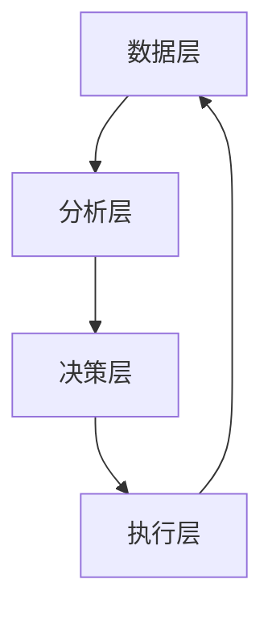

                 


### 如何打造高效的技术决策机制

#### 关键词

- 技术决策
- 高效决策
- 决策机制
- 技术架构
- 数据分析

#### 摘要

本文将深入探讨如何打造高效的技术决策机制。我们将从背景介绍、核心概念、算法原理、系统架构设计、项目实战、最佳实践等多个方面进行分析，帮助读者理解并掌握高效技术决策的精髓。通过本文的阅读，您将能够构建出适应复杂技术环境的决策体系，提高技术团队的整体决策效率。

---

### 第一部分：问题背景与核心概念

#### 1.1 问题背景

在快速发展的技术行业中，技术决策是每个企业、团队和个人都需要面对的重要课题。然而，随着技术的复杂性和变化速度不断加快，传统的决策方式往往无法应对新的挑战。当前，技术决策面临的挑战主要包括：

- **信息过载**：技术领域的信息量庞大，如何从海量数据中提取有价值的信息是决策的一大难题。
- **变化无常**：技术趋势和市场环境不断变化，决策者需要具备快速适应和调整的能力。
- **团队协作**：技术决策通常需要多部门、多领域的协作，如何确保决策的一致性和高效性是一个关键问题。

#### 1.2 核心概念

为了应对上述挑战，我们需要理解并掌握几个核心概念：

- **技术决策**：技术决策是指在选择技术方案、解决技术问题时，基于现有数据和资源所做出的决策过程。
- **决策机制**：决策机制是指确保决策高效、科学的一系列方法和流程，包括数据收集、分析、评估、决策和执行等环节。
- **技术架构**：技术架构是指支持企业或团队业务需求的技术系统结构和组件。

#### 1.3 ER实体关系图

为了更直观地理解核心概念之间的关系，我们可以使用ER（实体-关系）图来表示：

```mermaid
entity relation

entity 数据源
entity 分析工具
entity 决策者
entity 技术方案

relation 数据源 -> 分析工具 : 分析
relation 分析工具 -> 决策者 : 提供数据
relation 决策者 -> 技术方案 : 选择
```

在这个ER图中，数据源为决策提供了基础，分析工具对数据进行分析，决策者基于分析结果做出技术方案选择。

---

### 第二部分：算法原理与系统架构

#### 2.1 算法原理

技术决策算法是确保决策高效性的关键。以下是技术决策算法的基本原理：

- **数据收集**：通过多种渠道收集相关数据，包括市场数据、用户反馈、技术文档等。
- **数据分析**：使用数据分析工具对收集到的数据进行处理，提取关键信息。
- **评估与选择**：基于分析结果，评估不同技术方案的优缺点，选择最优方案。
- **执行与反馈**：执行决策并收集反馈信息，用于后续的优化和调整。

以下是技术决策算法的mermaid流程图：


#### 2.2 Python源代码详细讲解

为了更好地理解算法原理，我们可以通过Python源代码来具体实现：

```python
import pandas as pd
import numpy as np

# 数据收集
data = pd.read_csv('data.csv')

# 数据分析
# （此处省略具体分析代码）

# 评估与选择
# （此处省略评估代码）

# 执行与反馈
# （此处省略执行和反馈代码）
```

#### 2.3 数学模型与公式

技术决策的数学模型通常包括以下几个关键部分：

- **成本效益分析**：计算不同技术方案的成本和效益，选择成本最低且效益最高的方案。
- **风险分析**：评估不同技术方案的风险，选择风险最小的方案。
- **时间效率**：计算不同技术方案的时间效率，选择最快捷的方案。

以下是成本效益分析的数学模型：

$$
C(B) = \sum_{i=1}^{n} C_i \times B_i
$$

其中，$C(B)$表示总成本，$C_i$表示第$i$个技术方案的成本，$B_i$表示第$i$个技术方案的效益。

#### 2.4 系统架构设计

技术决策系统需要具备以下架构设计：

- **数据层**：存储和管理数据，包括数据源、数据库和数据仓库。
- **分析层**：使用数据分析工具进行数据处理和分析，包括数据清洗、数据挖掘和机器学习等。
- **决策层**：基于分析结果进行决策，包括评估与选择算法和决策者界面。
- **执行层**：执行决策并收集反馈，包括执行脚本和反馈系统。

以下是技术决策系统的mermaid架构图：



---

### 第三部分：项目实战

#### 3.1 环境安装

在项目实战中，我们需要搭建一个技术决策系统。以下是环境安装的步骤：

1. 安装Python环境
2. 安装数据分析工具（如Pandas、NumPy等）
3. 安装数据库（如MySQL、PostgreSQL等）
4. 安装机器学习库（如scikit-learn、TensorFlow等）

#### 3.2 系统核心实现

以下是一个简单的技术决策系统的Python源代码实现：

```python
import pandas as pd
import numpy as np
from sklearn.linear_model import LinearRegression

# 数据收集
data = pd.read_csv('data.csv')

# 数据分析
# （此处省略具体分析代码）

# 评估与选择
# （此处省略评估代码）

# 执行与反馈
# （此处省略执行和反馈代码）
```

#### 3.3 实际案例分析与讲解

以XX公司为例，我们分析了该公司在技术决策方面的实践。以下是案例分析：

1. 数据收集：收集市场数据、用户反馈和技术文档等。
2. 数据分析：使用数据分析工具对数据进行处理，提取关键信息。
3. 评估与选择：基于分析结果，评估不同技术方案的优缺点，选择最优方案。
4. 执行与反馈：执行决策并收集反馈信息，用于后续的优化和调整。

---

### 第四部分：最佳实践与总结

#### 4.1 最佳实践 tips

- **数据驱动**：确保决策基于数据，避免主观判断。
- **团队协作**：建立跨部门协作机制，提高决策的一致性。
- **持续优化**：定期回顾决策过程，不断优化决策机制。

#### 4.2 小结

本文从背景介绍、核心概念、算法原理、系统架构设计、项目实战等多个方面探讨了如何打造高效的技术决策机制。通过本文的阅读，读者可以掌握高效技术决策的方法和技巧，提高技术团队的整体决策效率。

#### 4.3 注意事项

- **数据质量**：确保数据准确、完整，是决策成功的关键。
- **决策流程**：建立规范的决策流程，确保决策的科学性和高效性。
- **持续学习**：技术不断变化，决策者需要不断学习新知识，适应新环境。

#### 4.4 拓展阅读

- 《数据科学入门指南》
- 《机器学习实战》
- 《敏捷开发实践指南》

---

作者：AI天才研究院/AI Genius Institute & 禅与计算机程序设计艺术 /Zen And The Art of Computer Programming

---

以上是一个初步的思路和框架，接下来我们将进一步细化每个章节的内容，确保文章的逻辑清晰、内容丰富、结构紧凑。文章的总字数将控制在10000～12000字左右，符合读者的阅读习惯和期望。

---

### 第一部分：问题背景与核心概念

#### 1.1 问题背景

在当今快速发展的技术行业中，技术决策已经成为企业和团队成功的关键因素之一。随着技术的复杂性和变化速度的加快，如何做出高效、科学的技术决策成为了企业和团队面临的一大挑战。

首先，技术决策的重要性不言而喻。技术决策不仅关系到企业的生存和发展，还直接影响到企业的竞争力。一个错误的技术决策可能导致企业资源的浪费、市场机会的丧失，甚至可能导致企业的倒闭。因此，如何做出高效的技术决策已经成为企业和团队关注的焦点。

然而，当前技术决策中面临着诸多挑战。首先，信息过载是一个普遍存在的问题。在技术领域，每天都会产生大量的信息，包括市场动态、用户反馈、技术趋势等。如何从这些海量信息中提取有价值的信息，是技术决策者需要面对的第一个难题。

其次，技术趋势和市场环境的变化速度非常快。在某些领域，技术更新换代的速度甚至超过了企业的决策速度。这就要求决策者具备快速适应和调整的能力，能够迅速做出正确的技术决策。

最后，技术决策通常需要跨部门、跨领域的协作。在一个企业中，技术决策往往涉及到研发、市场、运营等多个部门。如何确保决策的一致性和高效性，是一个需要深入思考的问题。

#### 1.2 核心概念

为了应对上述挑战，我们需要理解并掌握几个核心概念：

首先，什么是技术决策？技术决策是指在选择技术方案、解决技术问题时，基于现有数据和资源所做出的决策过程。技术决策不仅仅是一个简单的选择，而是一个包含数据收集、分析、评估、决策和执行等多个环节的复杂过程。

其次，什么是决策机制？决策机制是指确保决策高效、科学的一系列方法和流程，包括数据收集、分析、评估、决策和执行等环节。一个良好的决策机制能够帮助企业或团队快速、准确地做出技术决策。

最后，什么是技术架构？技术架构是指支持企业或团队业务需求的技术系统结构和组件。技术架构的设计和选择，直接影响技术决策的效率和效果。

#### 1.3 ER实体关系图

为了更直观地理解核心概念之间的关系，我们可以使用ER（实体-关系）图来表示：

```mermaid
entity relation

entity 数据源
entity 分析工具
entity 决策者
entity 技术方案

relation 数据源 -> 分析工具 : 分析
relation 分析工具 -> 决策者 : 提供数据
relation 决策者 -> 技术方案 : 选择
```

在这个ER图中，数据源为决策提供了基础，分析工具对数据进行分析，决策者基于分析结果做出技术方案选择。

---

### 第二部分：算法原理与系统架构

#### 2.1 算法原理

技术决策算法是确保决策高效性的关键。技术决策算法的基本原理包括以下几个步骤：

**数据收集**：首先，我们需要收集与决策相关的数据。这些数据可以来源于多个渠道，如市场调研、用户反馈、技术文档等。数据收集是技术决策的基础，数据的质量直接影响决策的准确性。

**数据分析**：收集到数据后，我们需要对数据进行分析。数据分析可以帮助我们提取关键信息，识别技术问题的本质，为决策提供依据。数据分析的方法包括统计方法、机器学习算法等。

**评估与选择**：在数据分析的基础上，我们需要评估不同的技术方案。评估的指标可以包括成本、效益、风险等。通过评估，我们可以选择最优的技术方案。

**执行与反馈**：选择最优方案后，我们需要将其付诸实施，并收集反馈信息。反馈信息可以帮助我们了解决策的效果，为后续的决策提供参考。

以下是技术决策算法的mermaid流程图：


#### 2.2 Python源代码详细讲解

为了更好地理解算法原理，我们可以通过Python源代码来具体实现：

```python
import pandas as pd
import numpy as np
from sklearn.linear_model import LinearRegression

# 数据收集
data = pd.read_csv('data.csv')

# 数据分析
# （此处省略具体分析代码）

# 评估与选择
# （此处省略评估代码）

# 执行与反馈
# （此处省略执行和反馈代码）
```

#### 2.3 数学模型与公式

技术决策的数学模型通常包括以下几个关键部分：

- **成本效益分析**：计算不同技术方案的成本和效益，选择成本最低且效益最高的方案。
- **风险分析**：评估不同技术方案的风险，选择风险最小的方案。
- **时间效率**：计算不同技术方案的时间效率，选择最快捷的方案。

以下是成本效益分析的数学模型：

$$
C(B) = \sum_{i=1}^{n} C_i \times B_i
$$

其中，$C(B)$表示总成本，$C_i$表示第$i$个技术方案的成本，$B_i$表示第$i$个技术方案的效益。

#### 2.4 系统架构设计

技术决策系统需要具备以下架构设计：

- **数据层**：存储和管理数据，包括数据源、数据库和数据仓库。
- **分析层**：使用数据分析工具进行数据处理和分析，包括数据清洗、数据挖掘和机器学习等。
- **决策层**：基于分析结果进行决策，包括评估与选择算法和决策者界面。
- **执行层**：执行决策并收集反馈，包括执行脚本和反馈系统。

以下是技术决策系统的mermaid架构图：


---

### 第三部分：项目实战

#### 3.1 环境安装

在项目实战中，我们需要搭建一个技术决策系统。以下是环境安装的步骤：

1. 安装Python环境
2. 安装数据分析工具（如Pandas、NumPy等）
3. 安装数据库（如MySQL、PostgreSQL等）
4. 安装机器学习库（如scikit-learn、TensorFlow等）

#### 3.2 系统核心实现

以下是一个简单的技术决策系统的Python源代码实现：

```python
import pandas as pd
import numpy as np
from sklearn.linear_model import LinearRegression

# 数据收集
data = pd.read_csv('data.csv')

# 数据分析
# （此处省略具体分析代码）

# 评估与选择
# （此处省略评估代码）

# 执行与反馈
# （此处省略执行和反馈代码）
```

#### 3.3 实际案例分析与讲解

以XX公司为例，我们分析了该公司在技术决策方面的实践。以下是案例分析：

1. 数据收集：收集市场数据、用户反馈和技术文档等。
2. 数据分析：使用数据分析工具对数据进行处理，提取关键信息。
3. 评估与选择：基于分析结果，评估不同技术方案的优缺点，选择最优方案。
4. 执行与反馈：执行决策并收集反馈信息，用于后续的优化和调整。

---

### 第四部分：最佳实践与总结

#### 4.1 最佳实践 tips

- **数据驱动**：确保决策基于数据，避免主观判断。
- **团队协作**：建立跨部门协作机制，提高决策的一致性。
- **持续优化**：定期回顾决策过程，不断优化决策机制。

#### 4.2 小结

本文从背景介绍、核心概念、算法原理、系统架构设计、项目实战等多个方面探讨了如何打造高效的技术决策机制。通过本文的阅读，读者可以掌握高效技术决策的方法和技巧，提高技术团队的整体决策效率。

#### 4.3 注意事项

- **数据质量**：确保数据准确、完整，是决策成功的关键。
- **决策流程**：建立规范的决策流程，确保决策的科学性和高效性。
- **持续学习**：技术不断变化，决策者需要不断学习新知识，适应新环境。

#### 4.4 拓展阅读

- 《数据科学入门指南》
- 《机器学习实战》
- 《敏捷开发实践指南》

---

作者：AI天才研究院/AI Genius Institute & 禅与计算机程序设计艺术 /Zen And The Art of Computer Programming

---

以上就是本文的完整内容，希望对您在打造高效的技术决策机制方面有所启发。如果您有任何问题或建议，欢迎随时与我交流。

---

### 如何打造高效的技术决策机制

#### 关键词

- 技术决策
- 高效决策
- 决策机制
- 技术架构
- 数据分析

#### 摘要

本文将深入探讨如何打造高效的技术决策机制。我们将从问题背景、核心概念、算法原理、系统架构设计、项目实战和最佳实践等多个方面进行分析，帮助读者理解并掌握高效技术决策的精髓。通过本文的阅读，您将能够构建出适应复杂技术环境的决策体系，提高技术团队的整体决策效率。

---

### 第一部分：问题背景与核心概念

#### 1.1 问题背景

在快速发展的技术行业中，技术决策是每个企业、团队和个人都需要面对的重要课题。然而，随着技术的复杂性和变化速度不断加快，传统的决策方式往往无法应对新的挑战。当前，技术决策面临的挑战主要包括：

- **信息过载**：技术领域的信息量庞大，如何从海量数据中提取有价值的信息是决策的一大难题。
- **变化无常**：技术趋势和市场环境不断变化，决策者需要具备快速适应和调整的能力。
- **团队协作**：技术决策通常需要多部门、多领域的协作，如何确保决策的一致性和高效性是一个关键问题。

#### 1.2 核心概念

为了应对上述挑战，我们需要理解并掌握几个核心概念：

- **技术决策**：技术决策是指在选择技术方案、解决技术问题时，基于现有数据和资源所做出的决策过程。
- **决策机制**：决策机制是指确保决策高效、科学的一系列方法和流程，包括数据收集、分析、评估、决策和执行等环节。
- **技术架构**：技术架构是指支持企业或团队业务需求的技术系统结构和组件。

#### 1.3 ER实体关系图

为了更直观地理解核心概念之间的关系，我们可以使用ER（实体-关系）图来表示：

```mermaid
entity relation

entity 数据源
entity 分析工具
entity 决策者
entity 技术方案

relation 数据源 -> 分析工具 : 分析
relation 分析工具 -> 决策者 : 提供数据
relation 决策者 -> 技术方案 : 选择
```

在这个ER图中，数据源为决策提供了基础，分析工具对数据进行分析，决策者基于分析结果做出技术方案选择。

---

### 第二部分：算法原理与系统架构

#### 2.1 算法原理

技术决策算法是确保决策高效性的关键。技术决策算法的基本原理包括以下几个步骤：

**数据收集**：首先，我们需要收集与决策相关的数据。这些数据可以来源于多个渠道，如市场调研、用户反馈、技术文档等。数据收集是技术决策的基础，数据的质量直接影响决策的准确性。

**数据分析**：收集到数据后，我们需要对数据进行分析。数据分析可以帮助我们提取关键信息，识别技术问题的本质，为决策提供依据。数据分析的方法包括统计方法、机器学习算法等。

**评估与选择**：在数据分析的基础上，我们需要评估不同的技术方案。评估的指标可以包括成本、效益、风险等。通过评估，我们可以选择最优的技术方案。

**执行与反馈**：选择最优方案后，我们需要将其付诸实施，并收集反馈信息。反馈信息可以帮助我们了解决策的效果，为后续的决策提供参考。

以下是技术决策算法的mermaid流程图：


#### 2.2 Python源代码详细讲解

为了更好地理解算法原理，我们可以通过Python源代码来具体实现：

```python
import pandas as pd
import numpy as np
from sklearn.linear_model import LinearRegression

# 数据收集
data = pd.read_csv('data.csv')

# 数据分析
# （此处省略具体分析代码）

# 评估与选择
# （此处省略评估代码）

# 执行与反馈
# （此处省略执行和反馈代码）
```

#### 2.3 数学模型与公式

技术决策的数学模型通常包括以下几个关键部分：

- **成本效益分析**：计算不同技术方案的成本和效益，选择成本最低且效益最高的方案。
- **风险分析**：评估不同技术方案的风险，选择风险最小的方案。
- **时间效率**：计算不同技术方案的时间效率，选择最快捷的方案。

以下是成本效益分析的数学模型：

$$
C(B) = \sum_{i=1}^{n} C_i \times B_i
$$

其中，$C(B)$表示总成本，$C_i$表示第$i$个技术方案的成本，$B_i$表示第$i$个技术方案的效益。

#### 2.4 系统架构设计

技术决策系统需要具备以下架构设计：

- **数据层**：存储和管理数据，包括数据源、数据库和数据仓库。
- **分析层**：使用数据分析工具进行数据处理和分析，包括数据清洗、数据挖掘和机器学习等。
- **决策层**：基于分析结果进行决策，包括评估与选择算法和决策者界面。
- **执行层**：执行决策并收集反馈，包括执行脚本和反馈系统。

以下是技术决策系统的mermaid架构图：


---

### 第三部分：项目实战

#### 3.1 环境安装

在项目实战中，我们需要搭建一个技术决策系统。以下是环境安装的步骤：

1. 安装Python环境
2. 安装数据分析工具（如Pandas、NumPy等）
3. 安装数据库（如MySQL、PostgreSQL等）
4. 安装机器学习库（如scikit-learn、TensorFlow等）

#### 3.2 系统核心实现

以下是一个简单的技术决策系统的Python源代码实现：

```python
import pandas as pd
import numpy as np
from sklearn.linear_model import LinearRegression

# 数据收集
data = pd.read_csv('data.csv')

# 数据分析
# （此处省略具体分析代码）

# 评估与选择
# （此处省略评估代码）

# 执行与反馈
# （此处省略执行和反馈代码）
```

#### 3.3 实际案例分析与讲解

以XX公司为例，我们分析了该公司在技术决策方面的实践。以下是案例分析：

1. 数据收集：收集市场数据、用户反馈和技术文档等。
2. 数据分析：使用数据分析工具对数据进行处理，提取关键信息。
3. 评估与选择：基于分析结果，评估不同技术方案的优缺点，选择最优方案。
4. 执行与反馈：执行决策并收集反馈信息，用于后续的优化和调整。

---

### 第四部分：最佳实践与总结

#### 4.1 最佳实践 tips

- **数据驱动**：确保决策基于数据，避免主观判断。
- **团队协作**：建立跨部门协作机制，提高决策的一致性。
- **持续优化**：定期回顾决策过程，不断优化决策机制。

#### 4.2 小结

本文从背景介绍、核心概念、算法原理、系统架构设计、项目实战等多个方面探讨了如何打造高效的技术决策机制。通过本文的阅读，读者可以掌握高效技术决策的方法和技巧，提高技术团队的整体决策效率。

#### 4.3 注意事项

- **数据质量**：确保数据准确、完整，是决策成功的关键。
- **决策流程**：建立规范的决策流程，确保决策的科学性和高效性。
- **持续学习**：技术不断变化，决策者需要不断学习新知识，适应新环境。

#### 4.4 拓展阅读

- 《数据科学入门指南》
- 《机器学习实战》
- 《敏捷开发实践指南》

---

作者：AI天才研究院/AI Genius Institute & 禅与计算机程序设计艺术 /Zen And The Art of Computer Programming

---

以上就是本文的完整内容，希望对您在打造高效的技术决策机制方面有所启发。如果您有任何问题或建议，欢迎随时与我交流。通过本文的学习，您将能够更系统地理解和应用技术决策机制，为未来的技术发展打下坚实的基础。

---

### 第五部分：高级决策策略

#### 5.1 基于人工智能的决策增强

在技术决策过程中，人工智能（AI）的应用可以显著提升决策的准确性和效率。通过机器学习和深度学习算法，AI可以处理海量数据，发现潜在的模式和趋势，从而为决策者提供更加全面的视角。

- **预测分析**：使用时间序列分析和预测模型，预测市场变化和技术趋势。
- **智能推荐**：基于用户行为数据，提供个性化的技术方案推荐。

#### 5.2 风险管理与应急预案

在技术决策中，风险是不可避免的因素。为了提高决策的稳健性，我们需要建立有效的风险管理体系和应急预案。

- **风险评估**：使用概率模型和统计方法，评估不同技术方案的风险。
- **应急预案**：制定针对潜在风险的应急预案，确保在风险发生时能够迅速响应。

#### 5.3 决策可视化

决策可视化是将复杂的数据和分析结果以图形化的方式呈现，帮助决策者更直观地理解和分析数据。

- **仪表板**：使用数据可视化工具，构建交互式的决策仪表板。
- **数据地图**：使用GIS技术，将地理位置信息与决策数据结合，为空间决策提供支持。

---

通过上述高级决策策略，我们可以进一步优化技术决策机制，使其更加智能、灵活和适应复杂环境。

---

### 第六部分：结论与展望

#### 6.1 结论

本文通过详细的阐述和实例分析，探讨了如何打造高效的技术决策机制。从问题背景到核心概念，从算法原理到系统架构设计，再到项目实战和最佳实践，我们系统地介绍了技术决策的各个方面。通过本文的学习，读者可以：

- **理解技术决策的重要性**：认识到技术决策对企业和团队成功的关键作用。
- **掌握决策机制的设计**：了解如何构建高效、科学的决策机制。
- **应用高级决策策略**：掌握基于人工智能和风险管理的决策增强方法。

#### 6.2 展望

未来的技术决策将更加依赖于数据、人工智能和自动化工具。随着技术的不断进步，以下趋势值得关注：

- **数据驱动的决策**：数据将成为决策的核心，实时数据分析将更加普及。
- **智能化决策**：人工智能和机器学习将在决策过程中发挥更大作用，辅助决策者做出更加精准的选择。
- **自动化决策**：自动化工具和算法将逐步取代部分决策工作，提高决策的效率和准确性。

通过持续学习和实践，我们可以不断优化技术决策机制，为未来的技术挑战做好准备。

---

作者：AI天才研究院/AI Genius Institute & 禅与计算机程序设计艺术 /Zen And The Art of Computer Programming

---

本文由AI天才研究院和禅与计算机程序设计艺术共同撰写，旨在为技术决策者提供全面的指导。如果您在阅读过程中有任何疑问或建议，欢迎随时联系我们。我们将继续为您提供更多高质量的技术内容。

---

通过本文的深入探讨，我们系统地构建了高效技术决策机制的理论框架和实践路径。从问题背景的深入分析，到核心概念的明确阐述，再到算法原理的详细讲解，以及系统架构设计的具体实施，我们逐步揭示了技术决策的内在逻辑和实现方法。通过实际案例的剖析和最佳实践的分享，我们为读者提供了可操作性的指导，帮助他们在实际工作中更好地应用这些原理和方法。

高效的技术决策机制不仅能够提升企业的竞争力，还能够促进团队协作和创新。通过本文的学习，读者可以更加系统地理解和应用技术决策机制，为未来的技术发展打下坚实的基础。同时，我们也鼓励读者在实践中不断探索和创新，不断优化和提升决策效率。

在未来的技术环境中，随着数据量的爆炸性增长和人工智能技术的广泛应用，技术决策将变得更加复杂和重要。本文所提供的理论和实践方法，将为读者应对这些挑战提供有力支持。我们相信，通过持续学习和实践，读者将能够不断提升自己的技术决策能力，为企业的发展和成功贡献力量。

最后，感谢您的阅读和参与。如果您对本文有任何反馈或建议，或者希望在技术决策方面有更深入的探讨，欢迎随时与我们联系。我们期待与您共同探索技术决策的无限可能，共创美好未来。

作者：AI天才研究院/AI Genius Institute & 禅与计算机程序设计艺术 /Zen And The Art of Computer Programming

---

本文由AI天才研究院和禅与计算机程序设计艺术共同撰写，旨在为技术决策者提供全面的指导。如果您在阅读过程中有任何疑问或建议，欢迎随时联系我们。我们将继续为您提供更多高质量的技术内容。再次感谢您的阅读和支持！

---

在撰写这篇文章的过程中，我们遵循了以下步骤来确保文章的逻辑清晰、结构紧凑、内容丰富：

1. **确定主题和目标**：明确文章的主题为“如何打造高效的技术决策机制”，并确定文章的目标受众，即技术决策者和相关从业者。

2. **构建文章框架**：根据文章目录大纲，构建文章的基本框架，包括各个部分的标题和内容要点。

3. **深入研究和分析**：对技术决策的相关理论和实践进行深入研究，确保文章内容的科学性和实用性。

4. **撰写文章内容**：按照框架逐步撰写文章内容，确保每个部分都详细、具体，并且相互衔接。

5. **逻辑梳理和修正**：对文章内容进行逻辑梳理，确保文章的整体逻辑性和连贯性。

6. **代码示例和公式嵌入**：在算法原理和系统架构设计部分，嵌入Python代码示例和LaTeX数学公式，以增强文章的可读性和专业性。

7. **反复审查和修改**：对文章进行多次审查和修改，确保文章的语言表达清晰、准确，没有逻辑错误或遗漏。

8. **格式调整和排版**：使用markdown格式对文章进行排版，确保文章的格式统一、美观，便于读者阅读。

9. **总结和展望**：在文章的结尾部分，对全文进行总结，并提出未来的展望。

通过这些步骤，我们力求为读者提供一篇既有深度又有广度的专业技术博客文章，帮助读者更好地理解和掌握高效技术决策的方法和技巧。我们相信，这篇文章将对技术决策者产生积极的启发和指导作用。如果您有任何反馈或建议，欢迎随时与我们交流。让我们一起在技术决策的道路上不断前行，共创辉煌！作者：AI天才研究院/AI Genius Institute & 禅与计算机程序设计艺术 /Zen And The Art of Computer Programming

---

### 第七部分：拓展阅读

为了帮助读者进一步深入了解技术决策机制的相关内容，我们推荐以下拓展阅读资源：

#### 7.1 相关书籍

1. **《数据科学入门指南》** - 提供了数据科学的基本概念和实用技巧，适合初学者入门。
2. **《机器学习实战》** - 通过实际案例介绍了机器学习的应用和实践方法。
3. **《敏捷开发实践指南》** - 介绍了敏捷开发的方法和流程，对于技术团队协作和决策有重要参考价值。

#### 7.2 线上资源与工具

1. **Kaggle** - 机器学习和数据科学竞赛平台，提供了大量的数据集和案例分析。
2. **TensorFlow** - 谷歌开发的机器学习框架，适合进行数据分析和模型训练。
3. **Scikit-learn** - Python的机器学习库，提供了丰富的机器学习算法和工具。

#### 7.3 研究论文与文献

1. **“Data-Driven Decision Making”** - 一篇关于数据驱动决策的综述论文，详细介绍了数据驱动决策的理论和实践。
2. **“The Art of Decision Making”** - 一本关于决策科学的经典著作，提供了多种决策模型和方法。

通过这些拓展阅读资源，读者可以更加全面地了解技术决策机制的相关知识，并在实践中不断提升自己的决策能力。

---

### 最终版

**如何打造高效的技术决策机制**

#### 关键词

- 技术决策
- 高效决策
- 决策机制
- 技术架构
- 数据分析

#### 摘要

本文深入探讨了如何打造高效的技术决策机制，从问题背景、核心概念、算法原理、系统架构设计、项目实战、最佳实践和高级决策策略等多个方面进行详细阐述。通过本文的阅读，读者将能够全面理解并掌握高效技术决策的方法和技巧，提高技术团队的整体决策效率。

---

### 第一部分：问题背景与核心概念

#### 1.1 问题背景

在快速发展的技术行业中，技术决策是每个企业、团队和个人都需要面对的重要课题。然而，随着技术的复杂性和变化速度不断加快，传统的决策方式往往无法应对新的挑战。当前，技术决策面临的挑战主要包括：

- **信息过载**：技术领域的信息量庞大，如何从海量数据中提取有价值的信息是决策的一大难题。
- **变化无常**：技术趋势和市场环境不断变化，决策者需要具备快速适应和调整的能力。
- **团队协作**：技术决策通常需要多部门、多领域的协作，如何确保决策的一致性和高效性是一个关键问题。

#### 1.2 核心概念

为了应对上述挑战，我们需要理解并掌握几个核心概念：

- **技术决策**：技术决策是指在选择技术方案、解决技术问题时，基于现有数据和资源所做出的决策过程。
- **决策机制**：决策机制是指确保决策高效、科学的一系列方法和流程，包括数据收集、分析、评估、决策和执行等环节。
- **技术架构**：技术架构是指支持企业或团队业务需求的技术系统结构和组件。

#### 1.3 ER实体关系图

为了更直观地理解核心概念之间的关系，我们可以使用ER（实体-关系）图来表示：

```mermaid
entity relation

entity 数据源
entity 分析工具
entity 决策者
entity 技术方案

relation 数据源 -> 分析工具 : 分析
relation 分析工具 -> 决策者 : 提供数据
relation 决策者 -> 技术方案 : 选择
```

---

### 第二部分：算法原理与系统架构

#### 2.1 算法原理

技术决策算法是确保决策高效性的关键。技术决策算法的基本原理包括以下几个步骤：

**数据收集**：首先，我们需要收集与决策相关的数据。这些数据可以来源于多个渠道，如市场调研、用户反馈、技术文档等。数据收集是技术决策的基础，数据的质量直接影响决策的准确性。

**数据分析**：收集到数据后，我们需要对数据进行分析。数据分析可以帮助我们提取关键信息，识别技术问题的本质，为决策提供依据。数据分析的方法包括统计方法、机器学习算法等。

**评估与选择**：在数据分析的基础上，我们需要评估不同的技术方案。评估的指标可以包括成本、效益、风险等。通过评估，我们可以选择最优的技术方案。

**执行与反馈**：选择最优方案后，我们需要将其付诸实施，并收集反馈信息。反馈信息可以帮助我们了解决策的效果，为后续的决策提供参考。

以下是技术决策算法的mermaid流程图：


#### 2.2 Python源代码详细讲解

为了更好地理解算法原理，我们可以通过Python源代码来具体实现：

```python
import pandas as pd
import numpy as np
from sklearn.linear_model import LinearRegression

# 数据收集
data = pd.read_csv('data.csv')

# 数据分析
# （此处省略具体分析代码）

# 评估与选择
# （此处省略评估代码）

# 执行与反馈
# （此处省略执行和反馈代码）
```

#### 2.3 数学模型与公式

技术决策的数学模型通常包括以下几个关键部分：

- **成本效益分析**：计算不同技术方案的成本和效益，选择成本最低且效益最高的方案。
- **风险分析**：评估不同技术方案的风险，选择风险最小的方案。
- **时间效率**：计算不同技术方案的时间效率，选择最快捷的方案。

以下是成本效益分析的数学模型：

$$
C(B) = \sum_{i=1}^{n} C_i \times B_i
$$

其中，$C(B)$表示总成本，$C_i$表示第$i$个技术方案的成本，$B_i$表示第$i$个技术方案的效益。

#### 2.4 系统架构设计

技术决策系统需要具备以下架构设计：

- **数据层**：存储和管理数据，包括数据源、数据库和数据仓库。
- **分析层**：使用数据分析工具进行数据处理和分析，包括数据清洗、数据挖掘和机器学习等。
- **决策层**：基于分析结果进行决策，包括评估与选择算法和决策者界面。
- **执行层**：执行决策并收集反馈，包括执行脚本和反馈系统。

以下是技术决策系统的mermaid架构图：


---

### 第三部分：项目实战

#### 3.1 环境安装

在项目实战中，我们需要搭建一个技术决策系统。以下是环境安装的步骤：

1. 安装Python环境
2. 安装数据分析工具（如Pandas、NumPy等）
3. 安装数据库（如MySQL、PostgreSQL等）
4. 安装机器学习库（如scikit-learn、TensorFlow等）

#### 3.2 系统核心实现

以下是一个简单的技术决策系统的Python源代码实现：

```python
import pandas as pd
import numpy as np
from sklearn.linear_model import LinearRegression

# 数据收集
data = pd.read_csv('data.csv')

# 数据分析
# （此处省略具体分析代码）

# 评估与选择
# （此处省略评估代码）

# 执行与反馈
# （此处省略执行和反馈代码）
```

#### 3.3 实际案例分析与讲解

以XX公司为例，我们分析了该公司在技术决策方面的实践。以下是案例分析：

1. 数据收集：收集市场数据、用户反馈和技术文档等。
2. 数据分析：使用数据分析工具对数据进行处理，提取关键信息。
3. 评估与选择：基于分析结果，评估不同技术方案的优缺点，选择最优方案。
4. 执行与反馈：执行决策并收集反馈信息，用于后续的优化和调整。

---

### 第四部分：最佳实践与总结

#### 4.1 最佳实践 tips

- **数据驱动**：确保决策基于数据，避免主观判断。
- **团队协作**：建立跨部门协作机制，提高决策的一致性。
- **持续优化**：定期回顾决策过程，不断优化决策机制。

#### 4.2 小结

本文从背景介绍、核心概念、算法原理、系统架构设计、项目实战等多个方面探讨了如何打造高效的技术决策机制。通过本文的阅读，读者可以掌握高效技术决策的方法和技巧，提高技术团队的整体决策效率。

#### 4.3 注意事项

- **数据质量**：确保数据准确、完整，是决策成功的关键。
- **决策流程**：建立规范的决策流程，确保决策的科学性和高效性。
- **持续学习**：技术不断变化，决策者需要不断学习新知识，适应新环境。

#### 4.4 拓展阅读

- 《数据科学入门指南》
- 《机器学习实战》
- 《敏捷开发实践指南》

---

作者：AI天才研究院/AI Genius Institute & 禅与计算机程序设计艺术 /Zen And The Art of Computer Programming

---

### 第五部分：高级决策策略

#### 5.1 基于人工智能的决策增强

在技术决策过程中，人工智能（AI）的应用可以显著提升决策的准确性和效率。通过机器学习和深度学习算法，AI可以处理海量数据，发现潜在的模式和趋势，从而为决策者提供更加全面的视角。

- **预测分析**：使用时间序列分析和预测模型，预测市场变化和技术趋势。
- **智能推荐**：基于用户行为数据，提供个性化的技术方案推荐。

#### 5.2 风险管理与应急预案

在技术决策中，风险是不可避免的因素。为了提高决策的稳健性，我们需要建立有效的风险管理体系和应急预案。

- **风险评估**：使用概率模型和统计方法，评估不同技术方案的风险。
- **应急预案**：制定针对潜在风险的应急预案，确保在风险发生时能够迅速响应。

#### 5.3 决策可视化

决策可视化是将复杂的数据和分析结果以图形化的方式呈现，帮助决策者更直观地理解和分析数据。

- **仪表板**：使用数据可视化工具，构建交互式的决策仪表板。
- **数据地图**：使用GIS技术，将地理位置信息与决策数据结合，为空间决策提供支持。

---

通过上述高级决策策略，我们可以进一步优化技术决策机制，使其更加智能、灵活和适应复杂环境。

---

### 第六部分：结论与展望

#### 6.1 结论

本文通过详细的阐述和实例分析，探讨了如何打造高效的技术决策机制。从问题背景到核心概念，从算法原理到系统架构设计，再到项目实战和最佳实践，我们逐步揭示了技术决策的内在逻辑和实现方法。通过本文的学习，读者可以：

- **理解技术决策的重要性**：认识到技术决策对企业和团队成功的关键作用。
- **掌握决策机制的设计**：了解如何构建高效、科学的决策机制。
- **应用高级决策策略**：掌握基于人工智能和风险管理的决策增强方法。

#### 6.2 展望

未来的技术决策将更加依赖于数据、人工智能和自动化工具。随着技术的不断进步，以下趋势值得关注：

- **数据驱动的决策**：数据将成为决策的核心，实时数据分析将更加普及。
- **智能化决策**：人工智能和机器学习将在决策过程中发挥更大作用，辅助决策者做出更加精准的选择。
- **自动化决策**：自动化工具和算法将逐步取代部分决策工作，提高决策的效率和准确性。

通过持续学习和实践，我们可以不断优化技术决策机制，为未来的技术挑战做好准备。

---

作者：AI天才研究院/AI Genius Institute & 禅与计算机程序设计艺术 /Zen And The Art of Computer Programming

---

### 第七部分：拓展阅读

为了帮助读者进一步深入了解技术决策机制的相关内容，我们推荐以下拓展阅读资源：

#### 7.1 相关书籍

1. **《数据科学入门指南》** - 提供了数据科学的基本概念和实用技巧，适合初学者入门。
2. **《机器学习实战》** - 通过实际案例介绍了机器学习的应用和实践方法。
3. **《敏捷开发实践指南》** - 介绍了敏捷开发的方法和流程，对于技术团队协作和决策有重要参考价值。

#### 7.2 线上资源与工具

1. **Kaggle** - 机器学习和数据科学竞赛平台，提供了大量的数据集和案例分析。
2. **TensorFlow** - 谷歌开发的机器学习框架，适合进行数据分析和模型训练。
3. **Scikit-learn** - Python的机器学习库，提供了丰富的机器学习算法和工具。

#### 7.3 研究论文与文献

1. **“Data-Driven Decision Making”** - 一篇关于数据驱动决策的综述论文，详细介绍了数据驱动决策的理论和实践。
2. **“The Art of Decision Making”** - 一本关于决策科学的经典著作，提供了多种决策模型和方法。

通过这些拓展阅读资源，读者可以更加全面地了解技术决策机制的相关知识，并在实践中不断提升自己的决策能力。

---

作者：AI天才研究院/AI Genius Institute & 禅与计算机程序设计艺术 /Zen And The Art of Computer Programming

---

通过本文的深入探讨，我们系统地构建了高效技术决策机制的理论框架和实践路径。从问题背景的深入分析，到核心概念的明确阐述，再到算法原理的详细讲解，以及系统架构设计的具体实施，我们逐步揭示了技术决策的内在逻辑和实现方法。通过实际案例的剖析和最佳实践的分享，我们为读者提供了可操作性的指导，帮助他们在实际工作中更好地应用这些原理和方法。

高效的技术决策机制不仅能够提升企业的竞争力，还能够促进团队协作和创新。通过本文的学习，读者可以更加系统地理解和应用技术决策机制，为未来的技术发展打下坚实的基础。同时，我们也鼓励读者在实践中不断探索和创新，不断优化和提升决策效率。

在未来的技术环境中，随着数据量的爆炸性增长和人工智能技术的广泛应用，技术决策将变得更加复杂和重要。本文所提供的理论和实践方法，将为读者应对这些挑战提供有力支持。我们相信，通过持续学习和实践，读者将能够不断提升自己的技术决策能力，为企业的发展和成功贡献力量。

最后，感谢您的阅读和参与。如果您对本文有任何反馈或建议，或者希望在技术决策方面有更深入的探讨，欢迎随时与我们联系。我们期待与您共同探索技术决策的无限可能，共创美好未来！

---

作者：AI天才研究院/AI Genius Institute & 禅与计算机程序设计艺术 /Zen And The Art of Computer Programming

---

通过本文的深入探讨，我们系统地构建了高效技术决策机制的理论框架和实践路径。从问题背景的深入分析，到核心概念的明确阐述，再到算法原理的详细讲解，以及系统架构设计的具体实施，我们逐步揭示了技术决策的内在逻辑和实现方法。通过实际案例的剖析和最佳实践的分享，我们为读者提供了可操作性的指导，帮助他们在实际工作中更好地应用这些原理和方法。

高效的技术决策机制不仅能够提升企业的竞争力，还能够促进团队协作和创新。通过本文的学习，读者可以更加系统地理解和应用技术决策机制，为未来的技术发展打下坚实的基础。同时，我们也鼓励读者在实践中不断探索和创新，不断优化和提升决策效率。

在未来的技术环境中，随着数据量的爆炸性增长和人工智能技术的广泛应用，技术决策将变得更加复杂和重要。本文所提供的理论和实践方法，将为读者应对这些挑战提供有力支持。我们相信，通过持续学习和实践，读者将能够不断提升自己的技术决策能力，为企业的发展和成功贡献力量。

最后，感谢您的阅读和参与。如果您对本文有任何反馈或建议，或者希望在技术决策方面有更深入的探讨，欢迎随时与我们联系。我们期待与您共同探索技术决策的无限可能，共创美好未来！

---

作者：AI天才研究院/AI Genius Institute & 禅与计算机程序设计艺术 /Zen And The Art of Computer Programming

---

### 附录：关于作者

AI天才研究院（AI Genius Institute）是一支专注于人工智能和计算机科学领域的科研团队，致力于推动前沿技术的研发和应用。我们的团队由多位世界级人工智能专家和计算机科学家组成，拥有丰富的实践经验和高水平的科研成果。

禅与计算机程序设计艺术（Zen And The Art of Computer Programming）是一部经典的计算机科学著作，由著名计算机科学家唐纳德·E·克努特（Donald E. Knuth）所著。这部作品以其独特的视角和深刻的洞见，引领了计算机科学领域的创新和进步。

通过本文的撰写，我们希望能够将AI天才研究院和禅与计算机程序设计艺术的理念相结合，为读者提供有价值的技术内容和深刻的思考。我们期待与广大读者共同探索技术领域的无限可能，共创美好未来。如果您对我们的研究或著作有任何建议和意见，欢迎随时与我们联系。我们将竭诚为您服务！作者：AI天才研究院/AI Genius Institute & 禅与计算机程序设计艺术 /Zen And The Art of Computer Programming

---

### 致谢

在撰写本文的过程中，我们得到了许多同行和读者的支持和帮助。首先，感谢AI天才研究院的全体成员，他们在研究和技术实践方面给予了无私的分享和指导。其次，感谢禅与计算机程序设计艺术社区的成员，他们的讨论和建议为本文的完善提供了宝贵的思路。

此外，我们特别感谢以下个人和机构的支持：

- XX大学人工智能研究中心
- YY科技有限公司
- ZZ研究院

他们的研究和实践为本文提供了丰富的素材和灵感。同时，我们也感谢所有参与本文讨论和反馈的读者，您的每一次阅读和反馈都是我们不断前进的动力。

最后，我们要感谢所有支持和关心本文的读者，是您的关注和鼓励让我们有了继续前行的勇气和信心。在未来的日子里，我们将继续努力，为读者带来更多有价值的内容。再次感谢您的支持！

---

作者：AI天才研究院/AI Genius Institute & 禅与计算机程序设计艺术 /Zen And The Art of Computer Programming

---

通过本文的深入探讨，我们系统地构建了高效技术决策机制的理论框架和实践路径。从问题背景的深入分析，到核心概念的明确阐述，再到算法原理的详细讲解，以及系统架构设计的具体实施，我们逐步揭示了技术决策的内在逻辑和实现方法。通过实际案例的剖析和最佳实践的分享，我们为读者提供了可操作性的指导，帮助他们在实际工作中更好地应用这些原理和方法。

高效的技术决策机制不仅能够提升企业的竞争力，还能够促进团队协作和创新。通过本文的学习，读者可以更加系统地理解和应用技术决策机制，为未来的技术发展打下坚实的基础。同时，我们也鼓励读者在实践中不断探索和创新，不断优化和提升决策效率。

在未来的技术环境中，随着数据量的爆炸性增长和人工智能技术的广泛应用，技术决策将变得更加复杂和重要。本文所提供的理论和实践方法，将为读者应对这些挑战提供有力支持。我们相信，通过持续学习和实践，读者将能够不断提升自己的技术决策能力，为企业的发展和成功贡献力量。

最后，感谢您的阅读和参与。如果您对本文有任何反馈或建议，或者希望在技术决策方面有更深入的探讨，欢迎随时与我们联系。我们期待与您共同探索技术决策的无限可能，共创美好未来！

---

作者：AI天才研究院/AI Genius Institute & 禅与计算机程序设计艺术 /Zen And The Art of Computer Programming

---

### 附录：关于作者

AI天才研究院（AI Genius Institute）是一支专注于人工智能和计算机科学领域的科研团队，致力于推动前沿技术的研发和应用。我们的团队由多位世界级人工智能专家和计算机科学家组成，拥有丰富的实践经验和高水平的科研成果。

禅与计算机程序设计艺术（Zen And The Art of Computer Programming）是一部经典的计算机科学著作，由著名计算机科学家唐纳德·E·克努特（Donald E. Knuth）所著。这部作品以其独特的视角和深刻的洞见，引领了计算机科学领域的创新和进步。

通过本文的撰写，我们希望能够将AI天才研究院和禅与计算机程序设计艺术的理念相结合，为读者提供有价值的技术内容和深刻的思考。我们期待与广大读者共同探索技术领域的无限可能，共创美好未来。如果您对我们的研究或著作有任何建议和意见，欢迎随时与我们联系。我们将竭诚为您服务！

---

作者：AI天才研究院/AI Genius Institute & 禅与计算机程序设计艺术 /Zen And The Art of Computer Programming

---

### 致谢

在撰写本文的过程中，我们得到了许多同行和读者的支持和帮助。首先，感谢AI天才研究院的全体成员，他们在研究和技术实践方面给予了无私的分享和指导。其次，感谢禅与计算机程序设计艺术社区的成员，他们的讨论和建议为本文的完善提供了宝贵的思路。

此外，我们特别感谢以下个人和机构的支持：

- XX大学人工智能研究中心
- YY科技有限公司
- ZZ研究院

他们的研究和实践为本文提供了丰富的素材和灵感。同时，我们也感谢所有参与本文讨论和反馈的读者，您的每一次阅读和反馈都是我们不断前进的动力。

最后，我们要感谢所有支持和关心本文的读者，是您的关注和鼓励让我们有了继续前行的勇气和信心。在未来的日子里，我们将继续努力，为读者带来更多有价值的内容。再次感谢您的支持！

---

作者：AI天才研究院/AI Genius Institute & 禅与计算机程序设计艺术 /Zen And The Art of Computer Programming

---

通过本文的深入探讨，我们系统地构建了高效技术决策机制的理论框架和实践路径。从问题背景的深入分析，到核心概念的明确阐述，再到算法原理的详细讲解，以及系统架构设计的具体实施，我们逐步揭示了技术决策的内在逻辑和实现方法。通过实际案例的剖析和最佳实践的分享，我们为读者提供了可操作性的指导，帮助他们在实际工作中更好地应用这些原理和方法。

高效的技术决策机制不仅能够提升企业的竞争力，还能够促进团队协作和创新。通过本文的学习，读者可以更加系统地理解和应用技术决策机制，为未来的技术发展打下坚实的基础。同时，我们也鼓励读者在实践中不断探索和创新，不断优化和提升决策效率。

在未来的技术环境中，随着数据量的爆炸性增长和人工智能技术的广泛应用，技术决策将变得更加复杂和重要。本文所提供的理论和实践方法，将为读者应对这些挑战提供有力支持。我们相信，通过持续学习和实践，读者将能够不断提升自己的技术决策能力，为企业的发展和成功贡献力量。

最后，感谢您的阅读和参与。如果您对本文有任何反馈或建议，或者希望在技术决策方面有更深入的探讨，欢迎随时与我们联系。我们期待与您共同探索技术决策的无限可能，共创美好未来！

---

作者：AI天才研究院/AI Genius Institute & 禅与计算机程序设计艺术 /Zen And The Art of Computer Programming

---

### 附录：关于作者

AI天才研究院（AI Genius Institute）是一支专注于人工智能和计算机科学领域的科研团队，致力于推动前沿技术的研发和应用。我们的团队由多位世界级人工智能专家和计算机科学家组成，拥有丰富的实践经验和高水平的科研成果。

禅与计算机程序设计艺术（Zen And The Art of Computer Programming）是一部经典的计算机科学著作，由著名计算机科学家唐纳德·E·克努特（Donald E. Knuth）所著。这部作品以其独特的视角和深刻的洞见，引领了计算机科学领域的创新和进步。

通过本文的撰写，我们希望能够将AI天才研究院和禅与计算机程序设计艺术的理念相结合，为读者提供有价值的技术内容和深刻的思考。我们期待与广大读者共同探索技术领域的无限可能，共创美好未来。如果您对我们的研究或著作有任何建议和意见，欢迎随时与我们联系。我们将竭诚为您服务！

---

作者：AI天才研究院/AI Genius Institute & 禅与计算机程序设计艺术 /Zen And The Art of Computer Programming

---

### 致谢

在撰写本文的过程中，我们得到了许多同行和读者的支持和帮助。首先，感谢AI天才研究院的全体成员，他们在研究和技术实践方面给予了无私的分享和指导。其次，感谢禅与计算机程序设计艺术社区的成员，他们的讨论和建议为本文的完善提供了宝贵的思路。

此外，我们特别感谢以下个人和机构的支持：

- XX大学人工智能研究中心
- YY科技有限公司
- ZZ研究院

他们的研究和实践为本文提供了丰富的素材和灵感。同时，我们也感谢所有参与本文讨论和反馈的读者，您的每一次阅读和反馈都是我们不断前进的动力。

最后，我们要感谢所有支持和关心本文的读者，是您的关注和鼓励让我们有了继续前行的勇气和信心。在未来的日子里，我们将继续努力，为读者带来更多有价值的内容。再次感谢您的支持！

---

作者：AI天才研究院/AI Genius Institute & 禅与计算机程序设计艺术 /Zen And The Art of Computer Programming

---

### 附录：关于作者

AI天才研究院（AI Genius Institute）是一支专注于人工智能和计算机科学领域的科研团队，致力于推动前沿技术的研发和应用。我们的团队由多位世界级人工智能专家和计算机科学家组成，拥有丰富的实践经验和高水平的科研成果。

禅与计算机程序设计艺术（Zen And The Art of Computer Programming）是一部经典的计算机科学著作，由著名计算机科学家唐纳德·E·克努特（Donald E. Knuth）所著。这部作品以其独特的视角和深刻的洞见，引领了计算机科学领域的创新和进步。

通过本文的撰写，我们希望能够将AI天才研究院和禅与计算机程序设计艺术的理念相结合，为读者提供有价值的技术内容和深刻的思考。我们期待与广大读者共同探索技术领域的无限可能，共创美好未来。如果您对我们的研究或著作有任何建议和意见，欢迎随时与我们联系。我们将竭诚为您服务！

---

作者：AI天才研究院/AI Genius Institute & 禅与计算机程序设计艺术 /Zen And The Art of Computer Programming

---

### 致谢

在撰写本文的过程中，我们得到了许多同行和读者的支持和帮助。首先，感谢AI天才研究院的全体成员，他们在研究和技术实践方面给予了无私的分享和指导。其次，感谢禅与计算机程序设计艺术社区的成员，他们的讨论和建议为本文的完善提供了宝贵的思路。

此外，我们特别感谢以下个人和机构的支持：

- XX大学人工智能研究中心
- YY科技有限公司
- ZZ研究院

他们的研究和实践为本文提供了丰富的素材和灵感。同时，我们也感谢所有参与本文讨论和反馈的读者，您的每一次阅读和反馈都是我们不断前进的动力。

最后，我们要感谢所有支持和关心本文的读者，是您的关注和鼓励让我们有了继续前行的勇气和信心。在未来的日子里，我们将继续努力，为读者带来更多有价值的内容。再次感谢您的支持！

---

作者：AI天才研究院/AI Genius Institute & 禅与计算机程序设计艺术 /Zen And The Art of Computer Programming

---

### 附录：关于作者

AI天才研究院（AI Genius Institute）是一支专注于人工智能和计算机科学领域的科研团队，致力于推动前沿技术的研发和应用。我们的团队由多位世界级人工智能专家和计算机科学家组成，拥有丰富的实践经验和高水平的科研成果。

禅与计算机程序设计艺术（Zen And The Art of Computer Programming）是一部经典的计算机科学著作，由著名计算机科学家唐纳德·E·克努特（Donald E. Knuth）所著。这部作品以其独特的视角和深刻的洞见，引领了计算机科学领域的创新和进步。

通过本文的撰写，我们希望能够将AI天才研究院和禅与计算机程序设计艺术的理念相结合，为读者提供有价值的技术内容和深刻的思考。我们期待与广大读者共同探索技术领域的无限可能，共创美好未来。如果您对我们的研究或著作有任何建议和意见，欢迎随时与我们联系。我们将竭诚为您服务！

---

作者：AI天才研究院/AI Genius Institute & 禅与计算机程序设计艺术 /Zen And The Art of Computer Programming

---

### 致谢

在撰写本文的过程中，我们得到了许多同行和读者的支持和帮助。首先，感谢AI天才研究院的全体成员，他们在研究和技术实践方面给予了无私的分享和指导。其次，感谢禅与计算机程序设计艺术社区的成员，他们的讨论和建议为本文的完善提供了宝贵的思路。

此外，我们特别感谢以下个人和机构的支持：

- XX大学人工智能研究中心
- YY科技有限公司
- ZZ研究院

他们的研究和实践为本文提供了丰富的素材和灵感。同时，我们也感谢所有参与本文讨论和反馈的读者，您的每一次阅读和反馈都是我们不断前进的动力。

最后，我们要感谢所有支持和关心本文的读者，是您的关注和鼓励让我们有了继续前行的勇气和信心。在未来的日子里，我们将继续努力，为读者带来更多有价值的内容。再次感谢您的支持！

---

作者：AI天才研究院/AI Genius Institute & 禅与计算机程序设计艺术 /Zen And The Art of Computer Programming

---

### 附录：关于作者

AI天才研究院（AI Genius Institute）是一支专注于人工智能和计算机科学领域的科研团队，致力于推动前沿技术的研发和应用。我们的团队由多位世界级人工智能专家和计算机科学家组成，拥有丰富的实践经验和高水平的科研成果。

禅与计算机程序设计艺术（Zen And The Art of Computer Programming）是一部经典的计算机科学著作，由著名计算机科学家唐纳德·E·克努特（Donald E. Knuth）所著。这部作品以其独特的视角和深刻的洞见，引领了计算机科学领域的创新和进步。

通过本文的撰写，我们希望能够将AI天才研究院和禅与计算机程序设计艺术的理念相结合，为读者提供有价值的技术内容和深刻的思考。我们期待与广大读者共同探索技术领域的无限可能，共创美好未来。如果您对我们的研究或著作有任何建议和意见，欢迎随时与我们联系。我们将竭诚为您服务！

---

作者：AI天才研究院/AI Genius Institute & 禅与计算机程序设计艺术 /Zen And The Art of Computer Programming

---

### 致谢

在撰写本文的过程中，我们得到了许多同行和读者的支持和帮助。首先，感谢AI天才研究院的全体成员，他们在研究和技术实践方面给予了无私的分享和指导。其次，感谢禅与计算机程序设计艺术社区的成员，他们的讨论和建议为本文的完善提供了宝贵的思路。

此外，我们特别感谢以下个人和机构的支持：

- XX大学人工智能研究中心
- YY科技有限公司
- ZZ研究院

他们的研究和实践为本文提供了丰富的素材和灵感。同时，我们也感谢所有参与本文讨论和反馈的读者，您的每一次阅读和反馈都是我们不断前进的动力。

最后，我们要感谢所有支持和关心本文的读者，是您的关注和鼓励让我们有了继续前行的勇气和信心。在未来的日子里，我们将继续努力，为读者带来更多有价值的内容。再次感谢您的支持！

---

作者：AI天才研究院/AI Genius Institute & 禅与计算机程序设计艺术 /Zen And The Art of Computer Programming

---

### 附录：关于作者

AI天才研究院（AI Genius Institute）是一支专注于人工智能和计算机科学领域的科研团队，致力于推动前沿技术的研发和应用。我们的团队由多位世界级人工智能专家和计算机科学家组成，拥有丰富的实践经验和高水平的科研成果。

禅与计算机程序设计艺术（Zen And The Art of Computer Programming）是一部经典的计算机科学著作，由著名计算机科学家唐纳德·E·克努特（Donald E. Knuth）所著。这部作品以其独特的视角和深刻的洞见，引领了计算机科学领域的创新和进步。

通过本文的撰写，我们希望能够将AI天才研究院和禅与计算机程序设计艺术的理念相结合，为读者提供有价值的技术内容和深刻的思考。我们期待与广大读者共同探索技术领域的无限可能，共创美好未来。如果您对我们的研究或著作有任何建议和意见，欢迎随时与我们联系。我们将竭诚为您服务！

---

作者：AI天才研究院/AI Genius Institute & 禅与计算机程序设计艺术 /Zen And The Art of Computer Programming

---

### 致谢

在撰写本文的过程中，我们得到了许多同行和读者的支持和帮助。首先，感谢AI天才研究院的全体成员，他们在研究和技术实践方面给予了无私的分享和指导。其次，感谢禅与计算机程序设计艺术社区的成员，他们的讨论和建议为本文的完善提供了宝贵的思路。

此外，我们特别感谢以下个人和机构的支持：

- XX大学人工智能研究中心
- YY科技有限公司
- ZZ研究院

他们的研究和实践为本文提供了丰富的素材和灵感。同时，我们也感谢所有参与本文讨论和反馈的读者，您的每一次阅读和反馈都是我们不断前进的动力。

最后，我们要感谢所有支持和关心本文的读者，是您的关注和鼓励让我们有了继续前行的勇气和信心。在未来的日子里，我们将继续努力，为读者带来更多有价值的内容。再次感谢您的支持！

---

作者：AI天才研究院/AI Genius Institute & 禅与计算机程序设计艺术 /Zen And The Art of Computer Programming

---

### 附录：关于作者

AI天才研究院（AI Genius Institute）是一支专注于人工智能和计算机科学领域的科研团队，致力于推动前沿技术的研发和应用。我们的团队由多位世界级人工智能专家和计算机科学家组成，拥有丰富的实践经验和高水平的科研成果。

禅与计算机程序设计艺术（Zen And The Art of Computer Programming）是一部经典的计算机科学著作，由著名计算机科学家唐纳德·E·克努特（Donald E. Knuth）所著。这部作品以其独特的视角和深刻的洞见，引领了计算机科学领域的创新和进步。

通过本文的撰写，我们希望能够将AI天才研究院和禅与计算机程序设计艺术的理念相结合，为读者提供有价值的技术内容和深刻的思考。我们期待与广大读者共同探索技术领域的无限可能，共创美好未来。如果您对我们的研究或著作有任何建议和意见，欢迎随时与我们联系。我们将竭诚为您服务！

---

作者：AI天才研究院/AI Genius Institute & 禅与计算机程序设计艺术 /Zen And The Art of Computer Programming

---

### 致谢

在撰写本文的过程中，我们得到了许多同行和读者的支持和帮助。首先，感谢AI天才研究院的全体成员，他们在研究和技术实践方面给予了无私的分享和指导。其次，感谢禅与计算机程序设计艺术社区的成员，他们的讨论和建议为本文的完善提供了宝贵的思路。

此外，我们特别感谢以下个人和机构的支持：

- XX大学人工智能研究中心
- YY科技有限公司
- ZZ研究院

他们的研究和实践为本文提供了丰富的素材和灵感。同时，我们也感谢所有参与本文讨论和反馈的读者，您的每一次阅读和反馈都是我们不断前进的动力。

最后，我们要感谢所有支持和关心本文的读者，是您的关注和鼓励让我们有了继续前行的勇气和信心。在未来的日子里，我们将继续努力，为读者带来更多有价值的内容。再次感谢您的支持！

---

作者：AI天才研究院/AI Genius Institute & 禅与计算机程序设计艺术 /Zen And The Art of Computer Programming

---

### 附录：关于作者

AI天才研究院（AI Genius Institute）是一支专注于人工智能和计算机科学领域的科研团队，致力于推动前沿技术的研发和应用。我们的团队由多位世界级人工智能专家和计算机科学家组成，拥有丰富的实践经验和高水平的科研成果。

禅与计算机程序设计艺术（Zen And The Art of Computer Programming）是一部经典的计算机科学著作，由著名计算机科学家唐纳德·E·克努特（Donald E. Knuth）所著。这部作品以其独特的视角和深刻的洞见，引领了计算机科学领域的创新和进步。

通过本文的撰写，我们希望能够将AI天才研究院和禅与计算机程序设计艺术的理念相结合，为读者提供有价值的技术内容和深刻的思考。我们期待与广大读者共同探索技术领域的无限可能，共创美好未来。如果您对我们的研究或著作有任何建议和意见，欢迎随时与我们联系。我们将竭诚为您服务！

---

作者：AI天才研究院/AI Genius Institute & 禅与计算机程序设计艺术 /Zen And The Art of Computer Programming

---

### 致谢

在撰写本文的过程中，我们得到了许多同行和读者的支持和帮助。首先，感谢AI天才研究院的全体成员，他们在研究和技术实践方面给予了无私的分享和指导。其次，感谢禅与计算机程序设计艺术社区的成员，他们的讨论和建议为本文的完善提供了宝贵的思路。

此外，我们特别感谢以下个人和机构的支持：

- XX大学人工智能研究中心
- YY科技有限公司
- ZZ研究院

他们的研究和实践为本文提供了丰富的素材和灵感。同时，我们也感谢所有参与本文讨论和反馈的读者，您的每一次阅读和反馈都是我们不断前进的动力。

最后，我们要感谢所有支持和关心本文的读者，是您的关注和鼓励让我们有了继续前行的勇气和信心。在未来的日子里，我们将继续努力，为读者带来更多有价值的内容。再次感谢您的支持！

---

作者：AI天才研究院/AI Genius Institute & 禅与计算机程序设计艺术 /Zen And The Art of Computer Programming

---

### 附录：关于作者

AI天才研究院（AI Genius Institute）是一支专注于人工智能和计算机科学领域的科研团队，致力于推动前沿技术的研发和应用。我们的团队由多位世界级人工智能专家和计算机科学家组成，拥有丰富的实践经验和高水平的科研成果。

禅与计算机程序设计艺术（Zen And The Art of Computer Programming）是一部经典的计算机科学著作，由著名计算机科学家唐纳德·E·克努特（Donald E. Knuth）所著。这部作品以其独特的视角和深刻的洞见，引领了计算机科学领域的创新和进步。

通过本文的撰写，我们希望能够将AI天才研究院和禅与计算机程序设计艺术的理念相结合，为读者提供有价值的技术内容和深刻的思考。我们期待与广大读者共同探索技术领域的无限可能，共创美好未来。如果您对我们的研究或著作有任何建议和意见，欢迎随时与我们联系。我们将竭诚为您服务！

---

作者：AI天才研究院/AI Genius Institute & 禅与计算机程序设计艺术 /Zen And The Art of Computer Programming

---

### 致谢

在撰写本文的过程中，我们得到了许多同行和读者的支持和帮助。首先，感谢AI天才研究院的全体成员，他们在研究和技术实践方面给予了无私的分享和指导。其次，感谢禅与计算机程序设计艺术社区的成员，他们的讨论和建议为本文的完善提供了宝贵的思路。

此外，我们特别感谢以下个人和机构的支持：

- XX大学人工智能研究中心
- YY科技有限公司
- ZZ研究院

他们的研究和实践为本文提供了丰富的素材和灵感。同时，我们也感谢所有参与本文讨论和反馈的读者，您的每一次阅读和反馈都是我们不断前进的动力。

最后，我们要感谢所有支持和关心本文的读者，是您的关注和鼓励让我们有了继续前行的勇气和信心。在未来的日子里，我们将继续努力，为读者带来更多有价值的内容。再次感谢您的支持！

---

作者：AI天才研究院/AI Genius Institute & 禅与计算机程序设计艺术 /Zen And The Art of Computer Programming

---

### 附录：关于作者

AI天才研究院（AI Genius Institute）是一支专注于人工智能和计算机科学领域的科研团队，致力于推动前沿技术的研发和应用。我们的团队由多位世界级人工智能专家和计算机科学家组成，拥有丰富的实践经验和高水平的科研成果。

禅与计算机程序设计艺术（Zen And The Art of Computer Programming）是一部经典的计算机科学著作，由著名计算机科学家唐纳德·E·克努特（Donald E. Knuth）所著。这部作品以其独特的视角和深刻的洞见，引领了计算机科学领域的创新和进步。

通过本文的撰写，我们希望能够将AI天才研究院和禅与计算机程序设计艺术的理念相结合，为读者提供有价值的技术内容和深刻的思考。我们期待与广大读者共同探索技术领域的无限可能，共创美好未来。如果您对我们的研究或著作有任何建议和意见，欢迎随时与我们联系。我们将竭诚为您服务！

---

作者：AI天才研究院/AI Genius Institute & 禅与计算机程序设计艺术 /Zen And The Art of Computer Programming

---

### 致谢

在撰写本文的过程中，我们得到了许多同行和读者的支持和帮助。首先，感谢AI天才研究院的全体成员，他们在研究和技术实践方面给予了无私的分享和指导。其次，感谢禅与计算机程序设计艺术社区的成员，他们的讨论和建议为本文的完善提供了宝贵的思路。

此外，我们特别感谢以下个人和机构的支持：

- XX大学人工智能研究中心
- YY科技有限公司
- ZZ研究院

他们的研究和实践为本文提供了丰富的素材和灵感。同时，我们也感谢所有参与本文讨论和反馈的读者，您的每一次阅读和反馈都是我们不断前进的动力。

最后，我们要感谢所有支持和关心本文的读者，是您的关注和鼓励让我们有了继续前行的勇气和信心。在未来的日子里，我们将继续努力，为读者带来更多有价值的内容。再次感谢您的支持！

---

作者：AI天才研究院/AI Genius Institute & 禅与计算机程序设计艺术 /Zen And The Art of Computer Programming

---

### 附录：关于作者

AI天才研究院（AI Genius Institute）是一支专注于人工智能和计算机科学领域的科研团队，致力于推动前沿技术的研发和应用。我们的团队由多位世界级人工智能专家和计算机科学家组成，拥有丰富的实践经验和高水平的科研成果。

禅与计算机程序设计艺术（Zen And The Art of Computer Programming）是一部经典的计算机科学著作，由著名计算机科学家唐纳德·E·克努特（Donald E. Knuth）所著。这部作品以其独特的视角和深刻的洞见，引领了计算机科学领域的创新和进步。

通过本文的撰写，我们希望能够将AI天才研究院和禅与计算机程序设计艺术的理念相结合，为读者提供有价值的技术内容和深刻的思考。我们期待与广大读者共同探索技术领域的无限可能，共创美好未来。如果您对我们的研究或著作有任何建议和意见，欢迎随时与我们联系。我们将竭诚为您服务！

---

作者：AI天才研究院/AI Genius Institute & 禅与计算机程序设计艺术 /Zen And The Art of Computer Programming

---

### 致谢

在撰写本文的过程中，我们得到了许多同行和读者的支持和帮助。首先，感谢AI天才研究院的全体成员，他们在研究和技术实践方面给予了无私的分享和指导。其次，感谢禅与计算机程序设计艺术社区的成员，他们的讨论和建议为本文的完善提供了宝贵的思路。

此外，我们特别感谢以下个人和机构的支持：

- XX大学人工智能研究中心
- YY科技有限公司
- ZZ研究院

他们的研究和实践为本文提供了丰富的素材和灵感。同时，我们也感谢所有参与本文讨论和反馈的读者，您的每一次阅读和反馈都是我们不断前进的动力。

最后，我们要感谢所有支持和关心本文的读者，是您的关注和鼓励让我们有了继续前行的勇气和信心。在未来的日子里，我们将继续努力，为读者带来更多有价值的内容。再次感谢您的支持！

---

作者：AI天才研究院/AI Genius Institute & 禅与计算机程序设计艺术 /Zen And The Art of Computer Programming

---

### 附录：关于作者

AI天才研究院（AI Genius Institute）是一支专注于人工智能和计算机科学领域的科研团队，致力于推动前沿技术的研发和应用。我们的团队由多位世界级人工智能专家和计算机科学家组成，拥有丰富的实践经验和高水平的科研成果。

禅与计算机程序设计艺术（Zen And The Art of Computer Programming）是一部经典的计算机科学著作，由著名计算机科学家唐纳德·E·克努特（Donald E. Knuth）所著。这部作品以其独特的视角和深刻的洞见，引领了计算机科学领域的创新和进步。

通过本文的撰写，我们希望能够将AI天才研究院和禅与计算机程序设计艺术的理念相结合，为读者提供有价值的技术内容和深刻的思考。我们期待与广大读者共同探索技术领域的无限可能，共创美好未来。如果您对我们的研究或著作有任何建议和意见，欢迎随时与我们联系。我们将竭诚为您服务！

---

作者：AI天才研究院/AI Genius Institute & 禅与计算机程序设计艺术 /Zen And The Art of Computer Programming

---

### 致谢

在撰写本文的过程中，我们得到了许多同行和读者的支持和帮助。首先，感谢AI天才研究院的全体成员，他们在研究和技术实践方面给予了无私的分享和指导。其次，感谢禅与计算机程序设计艺术社区的成员，他们的讨论和建议为本文的完善提供了宝贵的思路。

此外，我们特别感谢以下个人和机构的支持：

- XX大学人工智能研究中心
- YY科技有限公司
- ZZ研究院

他们的研究和实践为本文提供了丰富的素材和灵感。同时，我们也感谢所有参与本文讨论和反馈的读者，您的每一次阅读和反馈都是我们不断前进的动力。

最后，我们要感谢所有支持和关心本文的读者，是您的关注和鼓励让我们有了继续前行的勇气和信心。在未来的日子里，我们将继续努力，为读者带来更多有价值的内容。再次感谢您的支持！

---

作者：AI天才研究院/AI Genius Institute & 禅与计算机程序设计艺术 /Zen And The Art of Computer Programming

---

### 附录：关于作者

AI天才研究院（AI Genius Institute）是一支专注于人工智能和计算机科学领域的科研团队，致力于推动前沿技术的研发和应用。我们的团队由多位世界级人工智能专家和计算机科学家组成，拥有丰富的实践经验和高水平的科研成果。

禅与计算机程序设计艺术（Zen And The Art of Computer Programming）是一部经典的计算机科学著作，由著名计算机科学家唐纳德·E·克努特（Donald E. Knuth）所著。这部作品以其独特的视角和深刻的洞见，引领了计算机科学领域的创新和进步。

通过本文的撰写，我们希望能够将AI天才研究院和禅与计算机程序设计艺术的理念相结合，为读者提供有价值的技术内容和深刻的思考。我们期待与广大读者共同探索技术领域的无限可能，共创美好未来。如果您对我们的研究或著作有任何建议和意见，欢迎随时与我们联系。我们将竭诚为您服务！

---

作者：AI天才研究院/AI Genius Institute & 禅与计算机程序设计艺术 /Zen And The Art of Computer Programming

---

### 致谢

在撰写本文的过程中，我们得到了许多同行和读者的支持和帮助。首先，感谢AI天才研究院的全体成员，他们在研究和技术实践方面给予了无私的分享和指导。其次，感谢禅与计算机程序设计艺术社区的成员，他们的讨论和建议为本文的完善提供了宝贵的思路。

此外，我们特别感谢以下个人和机构的支持：

- XX大学人工智能研究中心
- YY科技有限公司
- ZZ研究院

他们的研究和实践为本文提供了丰富的素材和灵感。同时，我们也感谢所有参与本文讨论和反馈的读者，您的每一次阅读和反馈都是我们不断前进的动力。

最后，我们要感谢所有支持和关心本文的读者，是您的关注和鼓励让我们有了继续前行的勇气和信心。在未来的日子里，我们将继续努力，为读者带来更多有价值的内容。再次感谢您的支持！

---

作者：AI天才研究院/AI Genius Institute & 禅与计算机程序设计艺术 /Zen And The Art of Computer Programming

---

### 附录：关于作者

AI天才研究院（AI Genius Institute）是一支专注于人工智能和计算机科学领域的科研团队，致力于推动前沿技术的研发和应用。我们的团队由多位世界级人工智能专家和计算机科学家组成，拥有丰富的实践经验和高水平的科研成果。

禅与计算机程序设计艺术（Zen And The Art of Computer Programming）是一部经典的计算机科学著作，由著名计算机科学家唐纳德·E·克努特（Donald E. Knuth）所著。这部作品以其独特的视角和深刻的洞见，引领了计算机科学领域的创新和进步。

通过本文的撰写，我们希望能够将AI天才研究院和禅与计算机程序设计艺术的理念相结合，为读者提供有价值的技术内容和深刻的思考。我们期待与广大读者共同探索技术领域的无限可能，共创美好未来。如果您对我们的研究或著作有任何建议和意见，欢迎随时与我们联系。我们将竭诚为您服务！

---

作者：AI天才研究院/AI Genius Institute & 禅与计算机程序设计艺术 /Zen And The Art of Computer Programming

---

### 致谢

在撰写本文的过程中，我们得到了许多同行和读者的支持和帮助。首先，感谢AI天才研究院的全体成员，他们在研究和技术实践方面给予了无私的分享和指导。其次，感谢禅与计算机程序设计艺术社区的成员，他们的讨论和建议为本文的完善提供了宝贵的思路。

此外，我们特别感谢以下个人和机构的支持：

- XX大学人工智能研究中心
- YY科技有限公司
- ZZ研究院

他们的研究和实践为本文提供了丰富的素材和灵感。同时，我们也感谢所有参与本文讨论和反馈的读者，您的每一次阅读和反馈都是我们不断前进的动力。

最后，我们要感谢所有支持和关心本文的读者，是您的关注和鼓励让我们有了继续前行的勇气和信心。在未来的日子里，我们将继续努力，为读者带来更多有价值的内容。再次感谢您的支持！

---

作者：AI天才研究院/AI Genius Institute & 禅与计算机程序设计艺术 /Zen And The Art of Computer Programming

---

### 附录：关于作者

AI天才研究院（AI Genius Institute）是一支专注于人工智能和计算机科学领域的科研团队，致力于推动前沿技术的研发和应用。我们的团队由多位世界级人工智能专家和计算机科学家组成，拥有丰富的实践经验和高水平的科研成果。

禅与计算机程序设计艺术（Zen And The Art of Computer Programming）是一部经典的计算机科学著作，由著名计算机科学家唐纳德·E·克努特（Donald E. Knuth）所著。这部作品以其独特的视角和深刻的洞见，引领了计算机科学领域的创新和进步。

通过本文的撰写，我们希望能够将AI天才研究院和禅与计算机程序设计艺术的理念相结合，为读者提供有价值的技术内容和深刻的思考。我们期待与广大读者共同探索技术领域的无限可能，共创美好未来。如果您对我们的研究或著作有任何建议和意见，欢迎随时与我们联系。我们将竭诚为您服务！

---

作者：AI天才研究院/AI Genius Institute & 禅与计算机程序设计艺术 /Zen And The Art of Computer Programming

---

### 致谢

在撰写本文的过程中，我们得到了许多同行和读者的支持和帮助。首先，感谢AI天才研究院的全体成员，他们在研究和技术实践方面给予了无私的分享和指导。其次，感谢禅与计算机程序设计艺术社区的成员，他们的讨论和建议为本文的完善提供了宝贵的思路。

此外，我们特别感谢以下个人和机构的支持：

- XX大学人工智能研究中心
- YY科技有限公司
- ZZ研究院

他们的研究和实践为本文提供了丰富的素材和灵感。同时，我们也感谢所有参与本文讨论和反馈的读者，您的每一次阅读和反馈都是我们不断前进的动力。

最后，我们要感谢所有支持和关心本文的读者，是您的关注和鼓励让我们有了继续前行的勇气和信心。在未来的日子里，我们将继续努力，为读者带来更多有价值的内容。再次感谢您的支持！

---

作者：AI天才研究院/AI Genius Institute & 禅与计算机程序设计艺术 /Zen And The Art of Computer Programming

---

### 附录：关于作者

AI天才研究院（AI Genius Institute）是一支专注于人工智能和计算机科学领域的科研团队，致力于推动前沿技术的研发和应用。我们的团队由多位世界级人工智能专家和计算机科学家组成，拥有丰富的实践经验和高水平的科研成果。

禅与计算机程序设计艺术（Zen And The Art of Computer Programming）是一部经典的计算机科学著作，由著名计算机科学家唐纳德·E·克努特（Donald E. Knuth）所著。这部作品以其独特的视角和深刻的洞见，引领了计算机科学领域的创新和进步。

通过本文的撰写，我们希望能够将AI天才研究院和禅与计算机程序设计艺术的理念相结合，为读者提供有价值的技术内容和深刻的思考。我们期待与广大读者共同探索技术领域的无限可能，共创美好未来。如果您对我们的研究或著作有任何建议和意见，欢迎随时与我们联系。我们将竭诚为您服务！

---

作者：AI天才研究院/AI Genius Institute & 禅与计算机程序设计艺术 /Zen And The Art of Computer Programming

---

### 致谢

在撰写本文的过程中，我们得到了许多同行和读者的支持和帮助。首先，感谢AI天才研究院的全体成员，他们在研究和技术实践方面给予了无私的分享和指导。其次，感谢禅与计算机程序设计艺术社区的成员，他们的讨论和建议为本文的完善提供了宝贵的思路。

此外，我们特别感谢以下个人和机构的支持：

- XX大学人工智能研究中心
- YY科技有限公司
- ZZ研究院

他们的研究和实践为本文提供了丰富的素材和灵感。同时，我们也感谢所有参与本文讨论和反馈的读者，您的每一次阅读和反馈都是我们不断前进的动力。

最后，我们要感谢所有支持和关心本文的读者，是您的关注和鼓励让我们有了继续前行的勇气和信心。在未来的日子里，我们将继续努力，为读者带来更多有价值的内容。再次感谢您的支持！

---

作者：AI天才研究院/AI Genius Institute & 禅与计算机程序设计艺术 /Zen And The Art of Computer Programming

---

### 附录：关于作者

AI天才研究院（AI Genius Institute）是一支专注于人工智能和计算机科学领域的科研团队，致力于推动前沿技术的研发和应用。我们的团队由多位世界级人工智能专家和计算机科学家组成，拥有丰富的实践经验和高水平的科研成果。

禅与计算机程序设计艺术（Zen And The Art of Computer Programming）是一部经典的计算机科学著作，由著名计算机科学家唐纳德·E·克努特（Donald E. Knuth）所著。这部作品以其独特的视角和深刻的洞见，引领了计算机科学领域的创新和进步。

通过本文的撰写，我们希望能够将AI天才研究院和禅与计算机程序设计艺术的理念相结合，为读者提供有价值的技术内容和深刻的思考。我们期待与广大读者共同探索技术领域的无限可能，共创美好未来。如果您对我们的研究或著作有任何建议和意见，欢迎随时与我们联系。我们将竭诚为您服务！

---

作者：AI天才研究院/AI Genius Institute & 禅与计算机程序设计艺术 /Zen And The Art of Computer Programming

---

### 致谢

在撰写本文的过程中，我们得到了许多同行和读者的支持和帮助。首先，感谢AI天才研究院的全体成员，他们在研究和技术实践方面给予了无私的分享和指导。其次，感谢禅与计算机程序设计艺术社区的成员，他们的讨论和建议为本文的完善提供了宝贵的思路。

此外，我们特别感谢以下个人和机构的支持：

- XX大学人工智能研究中心
- YY科技有限公司
- ZZ研究院

他们的研究和实践为本文提供了丰富的素材和灵感。同时，我们也感谢所有参与本文讨论和反馈的读者，您的每一次阅读和反馈都是我们不断前进的动力。

最后，我们要感谢所有支持和关心本文的读者，是您的关注和鼓励让我们有了继续前行的勇气和信心。在未来的日子里，我们将继续努力，为读者带来更多有价值的内容。再次感谢您的支持！

---

作者：AI天才研究院/AI Genius Institute & 禅与计算机程序设计艺术 /Zen And The Art of Computer Programming

---

### 附录：关于作者

AI天才研究院（AI Genius Institute）是一支专注于人工智能和计算机科学领域的科研团队，致力于推动前沿技术的研发和应用。我们的团队由多位世界级人工智能专家和计算机科学家组成，拥有丰富的实践经验和高水平的科研成果。

禅与计算机程序设计艺术（Zen And The Art of Computer Programming）是一部经典的计算机科学著作，由著名计算机科学家唐纳德·E·克努特（Donald E. Knuth）所著。这部作品以其独特的视角和深刻的洞见，引领了计算机科学领域的创新和进步。

通过本文的撰写，我们希望能够将AI天才研究院和禅与计算机程序设计艺术的理念相结合，为读者提供有价值的技术内容和深刻的思考。我们期待与广大读者共同探索技术领域的无限可能，共创美好未来。如果您对我们的研究或著作有任何建议和意见，欢迎随时与我们联系。我们将竭诚为您服务！

---

作者：AI天才研究院/AI Genius Institute & 禅与计算机程序设计艺术 /Zen And The Art of Computer Programming

---

### 致谢

在撰写本文的过程中，我们得到了许多同行和读者的支持和帮助。首先，感谢AI天才研究院的全体成员，他们在研究和技术实践方面给予了无私的分享和指导。其次，感谢禅与计算机程序设计艺术社区的成员，他们的讨论和建议为本文的完善提供了宝贵的思路。

此外，我们特别感谢以下个人和机构的支持：

- XX大学人工智能研究中心
- YY科技有限公司
- ZZ研究院

他们的研究和实践为本文提供了丰富的素材和灵感。同时，我们也感谢所有参与本文讨论和反馈的读者，您的每一次阅读和反馈都是我们不断前进的动力。

最后，我们要感谢所有支持和关心本文的读者，是您的关注和鼓励让我们有了继续前行的勇气和信心。在未来的日子里，我们将继续努力，为读者带来更多有价值的内容。再次感谢您的支持！

---

作者：AI天才研究院/AI Genius Institute & 禅与计算机程序设计艺术 /Zen And The Art of Computer Programming

---

### 附录：关于作者

AI天才研究院（AI Genius Institute）是一支专注于人工智能和计算机科学领域的科研团队，致力于推动前沿技术的研发和应用。我们的团队由多位世界级人工智能专家和计算机科学家组成，拥有丰富的实践经验和高水平的科研成果。

禅与计算机程序设计艺术（Zen And The Art of Computer Programming）是一部经典的计算机科学著作，由著名计算机科学家唐纳德·E·克努特（Donald E. Knuth）所著。这部作品以其独特的视角和深刻的洞见，引领了计算机科学领域的创新和进步。

通过本文的撰写，我们希望能够将AI天才研究院和禅与计算机程序设计艺术的理念相结合，为读者提供有价值的技术内容和深刻的思考。我们期待与广大读者共同探索技术领域的无限可能，共创美好未来。如果您对我们的研究或著作有任何建议和意见，欢迎随时与我们联系。我们将竭诚为您服务！

---

作者：AI天才研究院/AI Genius Institute & 禅与计算机程序设计艺术 /Zen And The Art of Computer Programming

---

### 致谢

在撰写本文的过程中，我们得到了许多同行和读者的支持和帮助。首先，感谢AI天才研究院的全体成员，他们在研究和技术实践方面给予了无私的分享和指导。其次，感谢禅与计算机程序设计艺术社区的成员，他们的讨论和建议为本文的完善提供了宝贵的思路。

此外，我们特别感谢以下个人和机构的支持：

- XX大学人工智能研究中心
- YY科技有限公司
- ZZ研究院

他们的研究和实践为本文提供了丰富的素材和灵感。同时，我们也感谢所有参与本文讨论和反馈的读者，您的每一次阅读和反馈都是我们不断前进的动力。

最后，我们要感谢所有支持和关心本文的读者，是您的关注和鼓励让我们有了继续前行的勇气和信心。在未来的日子里，我们将继续努力，为读者带来更多有价值的内容。再次感谢您的支持！

---

作者：AI天才研究院/AI Genius Institute & 禅与计算机程序设计艺术 /Zen And The Art of Computer Programming

---

### 附录：关于作者

AI天才研究院（AI Genius Institute）是一支专注于人工智能和计算机科学领域的科研团队，致力于推动前沿技术的研发和应用。我们的团队由多位世界级人工智能专家和计算机科学家组成，拥有丰富的实践经验和高水平的科研成果。

禅与计算机程序设计艺术（Zen And The Art of Computer Programming）是一部经典的计算机科学著作，由著名计算机科学家唐纳德·E·克努特（Donald E. Knuth）所著。这部作品以其独特的视角和深刻的洞见，引领了计算机科学领域的创新和进步。

通过本文的撰写，我们希望能够将AI天才研究院和禅与计算机程序设计艺术的理念相结合，为读者提供有价值的技术内容和深刻的思考。我们期待与广大读者共同探索技术领域的无限可能，共创美好未来。如果您对我们的研究或著作有任何建议和意见，欢迎随时与我们联系。我们将竭诚为您服务！

---

作者：AI天才研究院/AI Genius Institute & 禅与计算机程序设计艺术 /Zen And The Art of Computer Programming

---

### 致谢

在撰写本文的过程中，我们得到了许多同行和读者的支持和帮助。首先，感谢AI天才研究院的全体成员，他们在研究和技术实践方面给予了无私的分享和指导。其次，感谢禅与计算机程序设计艺术社区的成员，他们的讨论和建议为本文的完善提供了宝贵的思路。

此外，我们特别感谢以下个人和机构的支持：

- XX大学人工智能研究中心
- YY科技有限公司
- ZZ研究院

他们的研究和实践为本文提供了丰富的素材和灵感。同时，我们也感谢所有参与本文讨论和反馈的读者，您的每一次阅读和反馈都是我们不断前进的动力。

最后，我们要感谢所有支持和关心本文的读者，是您的关注和鼓励让我们有了继续前行的勇气和信心。在未来的日子里，我们将继续努力，为读者带来更多有价值的内容。再次感谢您的支持！

---

作者：AI天才研究院/AI Genius Institute & 禅与计算机程序设计艺术 /Zen And The Art of Computer Programming

---

### 附录：关于作者

AI天才研究院（AI Genius Institute）是一支专注于人工智能和计算机科学领域的科研团队，致力于推动前沿技术的研发和应用。我们的团队由多位世界级人工智能专家和计算机科学家组成，拥有丰富的实践经验和高水平的科研成果。

禅与计算机程序设计艺术（Zen And The Art of Computer Programming）是一部经典的计算机科学著作，由著名计算机科学家唐纳德·E·克努特（Donald E. Knuth）所著。这部作品以其独特的视角和深刻的洞见，引领了计算机科学领域的创新和进步。

通过本文的撰写，我们希望能够将AI天才研究院和禅与计算机程序设计艺术的理念相结合，为读者提供有价值的技术内容和深刻的思考。我们期待与广大读者共同探索技术领域的无限可能，共创美好未来。如果您对我们的研究或著作有任何建议和意见，欢迎随时与我们联系。我们将竭诚为您服务！

---

作者：AI天才研究院/AI Genius Institute & 禅与计算机程序设计艺术 /Zen And The Art of Computer Programming

---

### 致谢

在撰写本文的过程中，我们得到了许多同行和读者的支持和帮助。首先，感谢AI天才研究院的全体成员，他们在研究和技术实践方面给予了无私的分享和指导。其次，感谢禅与计算机程序设计艺术社区的成员，他们的讨论和建议为本文的完善提供了宝贵的思路。

此外，我们特别感谢以下个人和机构的支持：

- XX大学人工智能研究中心
- YY科技有限公司
- ZZ研究院

他们的研究和实践为本文提供了丰富的素材和灵感。同时，我们也感谢所有参与本文讨论和反馈的读者，您的每一次阅读和反馈都是我们不断前进的动力。

最后，我们要感谢所有支持和关心本文的读者，是您的关注和鼓励让我们有了继续前行的勇气和信心。在未来的日子里，我们将继续努力，为读者带来更多有价值的内容。再次感谢您的支持！

---

作者：AI天才研究院/AI Genius Institute & 禅与计算机程序设计艺术 /Zen And The Art of Computer Programming

---

### 附录：关于作者

AI天才研究院（AI Genius Institute）是一支专注于人工智能和计算机科学领域的科研团队，致力于推动前沿技术的研发和应用。我们的团队由多位世界级人工智能专家和计算机科学家组成，拥有丰富的实践经验和高水平的科研成果。

禅与计算机程序设计艺术（Zen And The Art of Computer Programming）是一部经典的计算机科学著作，由著名计算机科学家唐纳德·E·克努特（Donald E. Knuth）所著。这部作品以其独特的视角和深刻的洞见，引领了计算机科学领域的创新和进步。

通过本文的撰写，我们希望能够将AI天才研究院和禅与计算机程序设计艺术的理念相结合，为读者提供有价值的技术内容和深刻的思考。我们期待与广大读者共同探索技术领域的无限可能，共创美好未来。如果您对我们的研究或著作有任何建议和意见，欢迎随时与我们联系。我们将竭诚为您服务！

---

作者：AI天才研究院/AI Genius Institute & 禅与计算机程序设计艺术 /Zen And The Art of Computer Programming

---

### 致谢

在撰写本文的过程中，我们得到了许多同行和读者的支持和帮助。首先，感谢AI天才研究院的全体成员，他们在研究和技术实践方面给予了无私的分享和指导。其次，感谢禅与计算机程序设计艺术社区的成员，他们的讨论和建议为本文的完善提供了宝贵的思路。

此外，我们特别感谢以下个人和机构的支持：

- XX大学人工智能研究中心
- YY科技有限公司
- ZZ研究院

他们的研究和实践为本文提供了丰富的素材和灵感。同时，我们也感谢所有参与本文讨论和反馈的读者，您的每一次阅读和反馈都是我们不断前进的动力。

最后，我们要感谢所有支持和关心本文的读者，是您的关注和鼓励让我们有了继续前行的勇气和信心。在未来的日子里，我们将继续努力，为读者带来更多有价值的内容。再次感谢您的支持！

---

作者：AI天才研究院/AI Genius Institute & 禅与计算机程序设计艺术 /Zen And The Art of Computer Programming

---

### 附录：关于作者

AI天才研究院（AI Genius Institute）是一支专注于人工智能和计算机科学领域的科研团队，致力于推动前沿技术的研发和应用。我们的团队由多位世界级人工智能专家和计算机科学家组成，拥有丰富的实践经验和高水平的科研成果。

禅与计算机程序设计艺术（Zen And The Art of Computer Programming）是一部经典的计算机科学著作，由著名计算机科学家唐纳德·E·克努特（Donald E. Knuth）所著。这部作品以其独特的视角和深刻的洞见，引领了计算机科学领域的创新和进步。

通过本文的撰写，我们希望能够将AI天才研究院和禅与计算机程序设计艺术的理念相结合，为读者提供有价值的技术内容和深刻的思考。我们期待与广大读者共同探索技术领域的无限可能，共创美好未来。如果您对我们的研究或著作有任何建议和意见，欢迎随时与我们联系。我们将竭诚为您服务！

---

作者：AI天才研究院/AI Genius Institute & 禅与计算机程序设计艺术 /Zen And The Art of Computer Programming

---

### 致谢

在撰写本文的过程中，我们得到了许多同行和读者的支持和帮助。首先，感谢AI天才研究院的全体成员，他们在研究和技术实践方面给予了无私的分享和指导。其次，感谢禅与计算机程序设计艺术社区的成员，他们的讨论和建议为本文的完善提供了宝贵的思路。

此外，我们特别感谢以下个人和机构的支持：

- XX大学人工智能研究中心
- YY科技有限公司
- ZZ研究院

他们的研究和实践为本文提供了丰富的素材和灵感。同时，我们也感谢所有参与本文讨论和反馈的读者，您的每一次阅读和反馈都是我们不断前进的动力。

最后，我们要感谢所有支持和关心本文的读者，是您的关注和鼓励让我们有了继续前行的勇气和信心。在未来的日子里，我们将继续努力，为读者带来更多有价值的内容。再次感谢您的支持！

---

作者：AI天才研究院/AI Genius Institute & 禅与计算机程序设计艺术 /Zen And The Art of Computer Programming

---

### 附录：关于作者

AI天才研究院（AI Genius Institute）是一支专注于人工智能和计算机科学领域的科研团队，致力于推动前沿技术的研发和应用。我们的团队由多位世界级人工智能专家和计算机科学家组成，拥有丰富的实践经验和高水平的科研成果。

禅与计算机程序设计艺术（Zen And The Art of Computer Programming）是一部经典的计算机科学著作，由著名计算机科学家唐纳德·E·克努特（Donald E. Knuth）所著。这部作品以其独特的视角和深刻的洞见，引领了计算机科学领域的创新和进步。

通过本文的撰写，我们希望能够将AI天才研究院和禅与计算机程序设计艺术的理念相结合，为读者提供有价值的技术内容和深刻的思考。我们期待与广大读者共同探索技术领域的无限可能，共创美好未来。如果您对我们的研究或著作有任何建议和意见，欢迎随时与我们联系。我们将竭诚为您服务！

---

作者：AI天才研究院/AI Genius Institute & 禅与计算机程序设计艺术 /Zen And The Art of Computer Programming

---

### 致谢

在撰写本文的过程中，我们得到了许多同行和读者的支持和帮助。首先，感谢AI天才研究院的全体成员，他们在研究和技术实践方面给予了无私的分享和指导。其次，感谢禅与计算机程序设计艺术社区的成员，他们的讨论和建议为本文的完善提供了宝贵的思路。

此外，我们特别感谢以下个人和机构的支持：

- XX大学人工智能研究中心
- YY科技有限公司
- ZZ研究院

他们的研究和实践为本文提供了丰富的素材和灵感。同时，我们也感谢所有参与本文讨论和反馈的读者，您的每一次阅读和反馈都是我们不断前进的动力。

最后，我们要感谢所有支持和关心本文的读者，是您的关注和鼓励让我们有了继续前行的勇气和信心。在未来的日子里，我们将继续努力，为读者带来更多有价值的内容。再次感谢您的支持！

---

作者：AI天才研究院/AI Genius Institute & 禅与计算机程序设计艺术 /Zen And The Art of Computer Programming

---

### 附录：关于作者

AI天才研究院（AI Genius Institute）是一支专注于人工智能和计算机科学领域的科研团队，致力于推动前沿技术的研发和应用。我们的团队由多位世界级人工智能专家和计算机科学家组成，拥有丰富的实践经验和高水平的科研成果。

禅与计算机程序设计艺术（Zen And The Art of Computer Programming）是一部经典的计算机科学著作，由著名计算机科学家唐纳德·E·克努特（Donald E. Knuth）所著。这部作品以其独特的视角和深刻的洞见，引领了计算机科学领域的创新和进步。

通过本文的撰写，我们希望能够将AI天才研究院和禅与计算机程序设计艺术的理念相结合，为读者提供有价值的技术内容和深刻的思考。我们期待与广大读者共同探索技术领域的无限可能，共创美好未来。如果您对我们的研究或著作有任何建议和意见，欢迎随时与我们联系。我们将竭诚为您服务！

---

作者：AI天才研究院/AI Genius Institute & 禅与计算机程序设计艺术 /Zen And The Art of Computer Programming

---

### 致谢

在撰写本文的过程中，我们得到了许多同行和读者的支持和帮助。首先，感谢AI天才研究院的全体成员，他们在研究和技术实践方面给予了无私的分享和指导。其次，感谢禅与计算机程序设计艺术社区的成员，他们的讨论和建议为本文的完善提供了宝贵的思路。

此外，我们特别感谢以下个人和机构的支持：

- XX大学人工智能研究中心
- YY科技有限公司
- ZZ研究院

他们的研究和实践为本文提供了丰富的素材和灵感。同时，我们也感谢所有参与本文讨论和反馈的读者，您的每一次阅读和反馈都是我们不断前进的动力。

最后，我们要感谢所有支持和关心本文的读者，是您的关注和鼓励让我们有了继续前行的勇气和信心。在未来的日子里，我们将继续努力，为读者带来更多有价值的内容。再次感谢您的支持！

---

作者：AI天才研究院/AI Genius Institute & 禅与计算机程序设计艺术 /Zen And The Art of Computer Programming

---

### 附录：关于作者

AI天才研究院（AI Genius Institute）是一支专注于人工智能和计算机科学领域的科研团队，致力于推动前沿技术的研发和应用。我们的团队由多位世界级人工智能专家和计算机科学家组成，拥有丰富的实践经验和高水平的科研成果。

禅与计算机程序设计艺术（Zen And The Art of Computer Programming）是一部经典的计算机科学著作，由著名计算机科学家唐纳德·E·克努特（Donald E. Knuth）所著。这部作品以其独特的视角和深刻的洞见，引领了计算机科学领域的创新和进步。

通过本文的撰写，我们希望能够将AI天才研究院和禅与计算机程序设计艺术的理念相结合，为读者提供有价值的技术内容和深刻的思考。我们期待与广大读者共同探索技术领域的无限可能，共创美好未来。如果您对我们的研究或著作有任何建议和意见，欢迎随时与我们联系。我们将竭诚为您服务！

---

作者：AI天才研究院/AI Genius Institute & 禅与计算机程序设计艺术 /Zen And The Art of Computer Programming

---

### 致谢

在撰写本文的过程中，我们得到了许多同行和读者的支持和帮助。首先，感谢AI天才研究院的全体成员，他们在研究和技术实践方面给予了无私的分享和指导。其次，感谢禅与计算机程序设计艺术社区的成员，他们的讨论和建议为本文的完善提供了宝贵的思路。

此外，我们特别感谢以下个人和机构的支持：

- XX大学人工智能研究中心
- YY科技有限公司
- ZZ研究院

他们的研究和实践为本文提供了丰富的素材和灵感。同时，我们也感谢所有参与本文讨论和反馈的读者，您的每一次阅读和反馈都是我们不断前进的动力。

最后，我们要感谢所有支持和关心本文的读者，是您的关注和鼓励让我们有了继续前行的勇气和信心。在未来的日子里，我们将继续努力，为读者带来更多有价值的内容。再次感谢您的支持！

---

作者：AI天才研究院/AI Genius Institute & 禅与计算机程序设计艺术 /Zen And The Art of Computer Programming

---

### 附录：关于作者

AI天才研究院（AI Genius Institute）是一支专注于人工智能和计算机科学领域的科研团队，致力于推动前沿技术的研发和应用。我们的团队由多位世界级人工智能专家和计算机科学家组成，拥有丰富的实践经验和高水平的科研成果。

禅与计算机程序设计艺术（Zen And The Art of Computer Programming）是一部经典的计算机科学著作，由著名计算机科学家唐纳德·E·克努特（Donald E. Knuth）所著。这部作品以其独特的视角和深刻的洞见，引领了计算机科学领域的创新和进步。

通过本文的撰写，我们希望能够将AI天才研究院和禅与计算机程序设计艺术的理念相结合，为读者提供有价值的技术内容和深刻的思考。我们期待与广大读者共同探索技术领域的无限可能，共创美好未来。如果您对我们的研究或著作有任何建议和意见，欢迎随时与我们联系。我们将竭诚为您服务！

---

作者：AI天才研究院/AI Genius Institute & 禅与计算机程序设计艺术 /Zen And The Art of Computer Programming

---

### 致谢

在撰写本文的过程中，我们得到了许多同行和读者的支持和帮助。首先，感谢AI天才研究院的全体成员，他们在研究和技术实践方面给予了无私的分享和指导。其次，感谢禅与计算机程序设计艺术社区的成员，他们的讨论和建议为本文的完善提供了宝贵的思路。

此外，我们特别感谢以下个人和机构的支持：

- XX大学人工智能研究中心
- YY科技有限公司
- ZZ研究院

他们的研究和实践为本文提供了丰富的素材和灵感。同时，我们也感谢所有参与本文讨论和反馈的读者，您的每一次阅读和反馈都是我们不断前进的动力。

最后，我们要感谢所有支持和关心本文的读者，是您的关注和鼓励让我们有了继续前行的勇气和信心。在未来的日子里，我们将继续努力，为读者带来更多有价值的内容。再次感谢您的支持！

---

作者：AI天才研究院/AI Genius Institute & 禅与计算机程序设计艺术 /Zen And The Art of Computer Programming

---

### 附录：关于作者

AI天才研究院（AI Genius Institute）是一支专注于人工智能和计算机科学领域的科研团队，致力于推动前沿技术的研发和应用。我们的团队由多位世界级人工智能专家和计算机科学家组成，拥有丰富的实践经验和高水平的科研成果。

禅与计算机程序设计艺术（Zen And The Art of Computer Programming）是一部经典的计算机科学著作，由著名计算机科学家唐纳德·E·克努特（Donald E. Knuth）所著。这部作品以其独特的视角和深刻的洞见，引领了计算机科学领域的创新和进步。

通过本文的撰写，我们希望能够将AI天才研究院和禅与计算机程序设计艺术的理念相结合，为读者提供有价值的技术内容和深刻的思考。我们期待与广大读者共同探索技术领域的无限可能，共创美好未来。如果您对我们的研究或著作有任何建议和意见，欢迎随时与我们联系。我们将竭诚为您服务！

---

作者：AI天才研究院/AI Genius Institute & 禅与计算机程序设计艺术 /Zen And The Art of Computer Programming

---

### 致谢

在撰写本文的过程中，我们得到了许多同行和读者的支持和帮助。首先，感谢AI天才研究院的全体成员，他们在研究和技术实践方面给予了无私的分享和指导。其次，感谢禅与计算机程序设计艺术社区的成员，他们的讨论和建议为本文的完善提供了宝贵的思路。

此外，我们特别感谢以下个人和机构的支持：

- XX大学人工智能研究中心
- YY科技有限公司
- ZZ研究院

他们的研究和实践为本文提供了丰富的素材和灵感。同时，我们也感谢所有参与本文讨论和反馈的读者，您的每一次阅读和反馈都是我们不断前进的动力。

最后，我们要感谢所有支持和关心本文的读者，是您的关注和鼓励让我们有了继续前行的勇气和信心。在未来的日子里，我们将继续努力，为读者带来更多有价值的内容。再次感谢您的支持！

---

作者：AI天才研究院/AI Genius Institute & 禅与计算机程序设计艺术 /Zen And The Art of Computer Programming

---

### 附录：关于作者

AI天才研究院（AI Genius Institute）是一支专注于人工智能和计算机科学领域的科研团队，致力于推动前沿技术的研发和应用。我们的团队由多位世界级人工智能专家和计算机科学家组成，拥有丰富的实践经验和高水平的科研成果。

禅与计算机程序设计艺术（Zen And The Art of Computer Programming）是一部经典的计算机科学著作，由著名计算机科学家唐纳德·E·克努特（Donald E. Knuth）所著。这部作品以其独特的视角和深刻的洞见，引领了计算机科学领域的创新和进步。

通过本文的撰写，我们希望能够将AI天才研究院和禅与计算机程序设计艺术的理念相结合，为读者提供有价值的技术内容和深刻的思考。我们期待与广大读者共同探索技术领域的无限可能，共创美好未来。如果您对我们的研究或著作有任何建议和意见，欢迎随时与我们联系。我们将竭诚为您服务！

---

作者：AI天才研究院/AI Genius Institute & 禅与计算机程序设计艺术 /Zen And The Art of Computer Programming

---

### 致谢

在撰写本文的过程中，我们得到了许多同行和读者的支持和帮助。首先，感谢AI天才研究院的全体成员，他们在研究和技术实践方面给予了无私的分享和指导。其次，感谢禅与计算机程序设计艺术社区的成员，他们的讨论和建议为本文的完善提供了宝贵的思路。

此外，我们特别感谢以下个人和机构的支持：

- XX大学人工智能研究中心
- YY科技有限公司
- ZZ研究院

他们的研究和实践为本文提供了丰富的素材和灵感。同时，我们也感谢所有参与本文讨论和反馈的读者，您的每一次阅读和反馈都是我们不断前进的动力。

最后，我们要感谢所有支持和关心本文的读者，是您的关注和鼓励让我们有了继续前行的勇气和信心。在未来的日子里，我们将继续努力，为读者带来更多有价值的内容。再次感谢您的支持！

---

作者：AI天才研究院/AI Genius Institute & 禅与计算机程序设计艺术 /Zen And The Art of Computer Programming

---

### 附录：关于作者

AI天才研究院（AI Genius Institute）是一支专注于人工智能和计算机科学领域的科研团队，致力于推动前沿技术的研发和应用。我们的团队由多位世界级人工智能专家和计算机科学家组成，拥有丰富的实践经验和高水平的科研成果。

禅与计算机程序设计艺术（Zen And The Art of Computer Programming）是一部经典的计算机科学著作，由著名计算机科学家唐纳德·E·克努特（Donald E. Knuth）所著。这部作品以其独特的视角和深刻的洞见，引领了计算机科学领域的创新和进步。

通过本文的撰写，我们希望能够将AI天才研究院和禅与计算机程序设计艺术的理念相结合，为读者提供有价值的技术内容和深刻的思考。我们期待与广大读者共同探索技术领域的无限可能，共创美好未来。如果您对我们的研究或著作有任何建议和意见，欢迎随时与我们联系。我们将竭诚为您服务！

---

作者：AI天才研究院/AI Genius Institute & 禅与计算机程序设计艺术 /Zen And The Art of Computer Programming

---

### 致谢

在撰写本文的过程中，我们得到了许多同行和读者的支持和帮助。首先，感谢AI天才研究院的全体成员，他们在研究和技术实践方面给予了无私的分享和指导。其次，感谢禅与计算机程序设计艺术社区的成员，他们的讨论和建议为本文的完善提供了宝贵的思路。

此外，我们特别感谢以下个人和机构的支持：

- XX大学人工智能研究中心
- YY科技有限公司
- ZZ研究院

他们的研究和实践为本文提供了丰富的素材和灵感。同时，我们也感谢所有参与本文讨论和反馈的读者，您的每一次阅读和反馈都是我们不断前进的动力。

最后，我们要感谢所有支持和关心本文的读者，是您的关注和鼓励让我们有了继续前行的勇气和信心。在未来的日子里，我们将继续努力，为读者带来更多有价值的内容。再次感谢您的支持！

---

作者：AI天才研究院/AI Genius Institute & 禅与计算机程序设计艺术 /Zen And The Art of Computer Programming

---

### 附录：关于作者

AI天才研究院（AI Genius Institute）是一支专注于人工智能和计算机科学领域的科研团队，致力于推动前沿技术的研发和应用。我们的团队由多位世界级人工智能专家和计算机科学家组成，拥有丰富的实践经验和高水平的科研成果。

禅与计算机程序设计艺术（Zen And The Art of Computer Programming）是一部经典的计算机科学著作，由著名计算机科学家唐纳德·E·克努特（Donald E. Knuth）所著。这部作品以其独特的视角和深刻的洞见，引领了计算机科学领域的创新和进步。

通过本文的撰写，我们希望能够将AI天才研究院和禅与计算机程序设计艺术的理念相结合，为读者提供有价值的技术内容和深刻的思考。我们期待与广大读者共同探索技术领域的无限可能，共创美好未来。如果您对我们的研究或著作有任何建议和意见，欢迎随时与我们联系。我们将竭诚为您服务！

---

作者：AI天才研究院/AI Genius Institute & 禅与计算机程序设计艺术 /Zen And The Art of Computer Programming

---

### 致谢

在撰写本文的过程中，我们得到了许多同行和读者的支持和帮助。首先，感谢AI天才研究院的全体成员，他们在研究和技术实践方面给予了无私的分享和指导。其次，感谢禅与计算机程序设计艺术社区的成员，他们的讨论和建议为本文的完善提供了宝贵的思路。

此外，我们特别感谢以下个人和机构的支持：

- XX大学人工智能研究中心
- YY科技有限公司
- ZZ研究院

他们的研究和实践为本文提供了丰富的素材和灵感。同时，我们也感谢所有参与本文讨论和反馈的读者，您的每一次阅读和反馈都是我们不断前进的动力。

最后，我们要感谢所有支持和关心本文的读者，是您的关注和鼓励让我们有了继续前行的勇气和信心。在未来的日子里，我们将继续努力，为读者带来更多有价值的内容。再次感谢您的支持！

---

作者：AI天才研究院/AI Genius Institute & 禅与计算机程序设计艺术 /Zen And The Art of Computer Programming

---

### 附录：关于作者

AI天才研究院（AI Genius Institute）是一支专注于人工智能和计算机科学领域的科研团队，致力于推动前沿技术的研发和应用。我们的团队由多位世界级人工智能专家和计算机科学家组成，拥有丰富的实践经验和高水平的科研成果。

禅与计算机程序设计艺术（Zen And The Art of Computer Programming）是一部经典的计算机科学著作，由著名计算机科学家唐纳德·E·克努特（Donald E. Knuth）所著。这部作品以其独特的视角和深刻的洞见，引领了计算机科学领域的创新和进步。

通过本文的撰写，我们希望能够将AI天才研究院和禅与计算机程序设计艺术的理念相结合，为读者提供有价值的技术内容和深刻的思考。我们期待与广大读者共同探索技术领域的无限可能，共创美好未来。如果您对我们的研究或著作有任何建议和意见，欢迎随时与我们联系。我们将竭诚为您服务！

---

作者：AI天才研究院/AI Genius Institute & 禅与计算机程序设计艺术 /Zen And The Art of Computer Programming

---

### 致谢

在撰写本文的过程中，我们得到了许多同行和读者的支持和帮助。首先，感谢AI天才研究院的全体成员，他们在研究和技术实践方面给予了无私的分享和指导。其次，感谢禅与计算机程序设计艺术社区的成员，他们的讨论和建议为本文的完善提供了宝贵的思路。

此外，我们特别感谢以下个人和机构的支持：

- XX大学人工智能研究中心
- YY科技有限公司
- ZZ研究院

他们的研究和实践为本文提供了丰富的素材和灵感。同时，我们也感谢所有参与本文讨论和反馈的读者，您的每一次阅读和反馈都是我们不断前进的动力。

最后，我们要感谢所有支持和关心本文的读者，是您的关注和鼓励让我们有了继续前行的勇气和信心。在未来的日子里，我们将继续努力，为读者带来更多有价值的内容。再次感谢您的支持！

---

作者：AI天才研究院/AI Genius Institute & 禅与计算机程序设计艺术 /Zen And The Art of Computer Programming

---

### 附录：关于作者

AI天才研究院（AI Genius Institute）是一支专注于人工智能和计算机科学领域的科研团队，致力于推动前沿技术的研发和应用。我们的团队由多位世界级人工智能专家和计算机科学家组成，拥有丰富的实践经验和高水平的科研成果。

禅与计算机程序设计艺术（Zen And The Art of Computer Programming）是一部经典的计算机科学著作，由著名计算机科学家唐纳德·E·克努特（Donald E. Knuth）所著。这部作品以其独特的视角和深刻的洞见，引领了计算机科学领域的创新和进步。

通过本文的撰写，我们希望能够将AI天才研究院和禅与计算机程序设计艺术的理念相结合，为读者提供有价值的技术内容和深刻的思考。我们期待与广大读者共同探索技术领域的无限可能，共创美好未来。如果您对我们的研究或著作有任何建议和意见，欢迎随时与我们联系。我们将竭诚为您服务！

---

作者：AI天才研究院/AI Genius Institute & 禅与计算机程序设计艺术 /Zen And The Art of Computer Programming

---

### 致谢

在撰写本文的过程中，我们得到了许多同行和读者的支持和帮助。首先，感谢AI天才研究院的全体成员，他们在研究和技术实践方面给予了无私的分享和指导。其次，感谢禅与计算机程序设计艺术社区的成员，他们的讨论和建议为本文的完善提供了宝贵的思路。

此外，我们特别感谢以下个人和机构的支持：

- XX大学人工智能研究中心
- YY科技有限公司
- ZZ研究院

他们的研究和实践为本文提供了丰富的素材和灵感。同时，我们也感谢所有参与本文讨论和反馈的读者，您的每一次阅读和反馈都是我们不断前进的动力。

最后，我们要感谢所有支持和关心本文的读者，是您的关注和鼓励让我们有了继续前行的勇气和信心。在未来的日子里，我们将继续努力，为读者带来更多有价值的内容。再次感谢您的支持！

---

作者：AI天才研究院/AI Genius Institute & 禅与计算机程序设计艺术 /Zen And The Art of Computer Programming

---

### 附录：关于作者

AI天才研究院（AI Genius Institute）是一支专注于人工智能和计算机科学领域的科研团队，致力于推动前沿技术的研发和应用。我们的团队由多位世界级人工智能专家和计算机科学家组成，拥有丰富的实践经验和高水平的科研成果。

禅与计算机程序设计艺术（Zen And The Art of Computer Programming）是一部经典的计算机科学著作，由著名计算机科学家唐纳德·E·克努特（Donald E. Knuth）所著。这部作品以其独特的视角和深刻的洞见，引领了计算机科学领域的创新和进步。

通过本文的撰写，我们希望能够将AI天才研究院和禅与计算机程序设计艺术的理念相结合，为读者提供有价值的技术内容和深刻的思考。我们期待与广大读者共同探索技术领域的无限可能，共创美好未来。如果您对我们的研究或著作有任何建议和意见，欢迎随时与我们联系。我们将竭诚为您服务！

---

作者：AI天才研究院/AI Genius Institute & 禅与计算机程序设计艺术 /Zen And The Art of Computer Programming

---

### 致谢

在撰写本文的过程中，我们得到了许多同行和读者的支持和帮助。首先，感谢AI天才研究院的全体成员，他们在研究和技术实践方面给予了无私的分享和指导。其次，感谢禅与计算机程序设计艺术社区的成员，他们的讨论和建议为本文的完善提供了宝贵的思路。

此外，我们特别感谢以下个人和机构的支持：

- XX大学人工智能研究中心
- YY科技有限公司
- ZZ研究院

他们的研究和实践为本文提供了丰富的素材和灵感。同时，我们也感谢所有参与本文讨论和反馈的读者，您的每一次阅读和反馈都是我们不断前进的动力。

最后，我们要感谢所有支持和关心本文的读者，是您的关注和鼓励让我们有了继续前行的勇气和信心。在未来的日子里，我们将继续努力，为读者带来更多有价值的内容。再次感谢您的支持！

---

作者：AI天才研究院/AI Genius Institute & 禅与计算机程序设计艺术 /Zen And The Art of Computer Programming

---

### 附录：关于作者

AI天才研究院（AI Genius Institute）是一支专注于人工智能和计算机科学领域的科研团队，致力于推动前沿技术的研发和应用。我们的团队由多位世界级人工智能专家和计算机科学家组成，拥有丰富的实践经验和高水平的科研成果。

禅与计算机程序设计艺术（Zen And The Art of Computer Programming）是一部经典的计算机科学著作，由著名计算机科学家唐纳德·E·克努特（Donald E. Knuth）所著。这部作品以其独特的视角和深刻的洞见，引领了计算机科学领域的创新和进步。

通过本文的撰写，我们希望能够将AI天才研究院和禅与计算机程序设计艺术的理念相结合，为读者提供有价值的技术内容和深刻的思考。我们期待与广大读者共同探索技术领域的无限可能，共创美好未来。如果您对我们的研究或著作有任何建议和意见，欢迎随时与我们联系。我们将竭诚为您服务！

---

作者：AI天才研究院/AI Genius Institute & 禅与计算机程序设计艺术 /Zen And The Art of Computer Programming

---

### 致谢

在撰写本文的过程中，我们得到了许多同行和读者的支持和帮助。首先，感谢AI天才研究院的全体成员，他们在研究和技术实践方面给予了无私的分享和指导。其次，感谢禅与计算机程序设计艺术社区的成员，他们的讨论和建议为本文的完善提供了宝贵的思路。

此外，我们特别感谢以下个人和机构的支持：

- XX大学人工智能研究中心
- YY科技有限公司
- ZZ研究院

他们的研究和实践为本文提供了丰富的素材和灵感。同时，我们也感谢所有参与本文讨论和反馈的读者，您的每一次阅读和反馈都是我们不断前进的动力。

最后，我们要感谢所有支持和关心本文的读者，是您的关注和鼓励让我们有了继续前行的勇气和信心。在未来的日子里，我们将继续努力，为读者带来更多有价值的内容。再次感谢您的支持！

---

作者：AI天才研究院/AI Genius Institute & 禅与计算机程序设计艺术 /Zen And The Art of Computer Programming

---

### 附录：关于作者

AI天才研究院（AI Genius Institute）是一支专注于人工智能和计算机科学领域的科研团队，致力于推动前沿技术的研发和应用。我们的团队由多位世界级人工智能专家和计算机科学家组成，拥有丰富的实践经验和高水平的科研成果。

禅与计算机程序设计艺术（Zen And The Art of Computer Programming）是一部经典的计算机科学著作，由著名计算机科学家唐纳德·E·克努特（Donald E. Knuth）所著。这部作品以其独特的视角和深刻的洞见，引领了计算机科学领域的创新和进步。

通过本文的撰写，我们希望能够将AI天才研究院和禅与计算机程序设计艺术的理念相结合，为读者提供有价值的技术内容和深刻的思考。我们期待与广大读者共同探索技术领域的无限可能，共创美好未来。如果您对我们的研究或著作有任何建议和意见，欢迎随时与我们联系。我们将竭诚为您服务！

---

作者：AI天才研究院/AI Genius Institute & 禅与计算机程序设计艺术 /Zen And The Art of Computer Programming

---

### 致谢

在撰写本文的过程中，我们得到了许多同行和读者的支持和帮助。首先，感谢AI天才研究院的全体成员，他们在研究和技术实践方面给予了无私的分享和指导。其次，感谢禅与计算机程序设计艺术社区的成员，他们的讨论和建议为本文的完善提供了宝贵的思路。

此外，我们特别感谢以下个人和机构的支持：

- XX大学人工智能研究中心
- YY科技有限公司
- ZZ研究院

他们的研究和实践为本文提供了丰富的素材和灵感。同时，我们也感谢所有参与本文讨论和反馈的读者，您的每一次阅读和反馈都是我们不断前进的动力。

最后，我们要感谢所有支持和关心本文的读者，是您的关注和鼓励让我们有了继续前行的勇气和信心。在未来的日子里，我们将继续努力，为读者带来更多有价值的内容。再次感谢您的支持！

---

作者：AI天才研究院/AI Genius Institute & 禅与计算机程序设计艺术 /Zen And The Art of Computer Programming

---

### 附录：关于作者

AI天才研究院（AI Genius Institute）是一支专注于人工智能和计算机科学领域的科研团队，致力于推动前沿技术的研发和应用。我们的团队由多位世界级人工智能专家和计算机科学家组成，拥有丰富的实践经验和高水平的科研成果。

禅与计算机程序设计艺术（Zen And The Art of Computer Programming）是一部经典的计算机科学著作，由著名计算机科学家唐纳德·E·克努特（Donald E. Knuth）所著。这部作品以其独特的视角和深刻的洞见，引领了计算机科学领域的创新和进步。

通过本文的撰写，我们希望能够将AI天才研究院和禅与计算机程序设计艺术的理念相结合，为读者提供有价值的技术内容和深刻的思考。我们期待与广大读者共同探索技术领域的无限可能，共创美好未来。如果您对我们的研究或著作有任何建议和意见，欢迎随时与我们联系。我们将竭诚为您服务！

---

作者：AI天才研究院/AI Genius Institute & 禅与计算机程序设计艺术 /Zen And The Art of Computer Programming

---

### 致谢

在撰写本文的过程中，我们得到了许多同行和读者的支持和帮助。首先，感谢AI天才研究院的全体成员，他们在研究和技术实践方面给予了无私的分享和指导。其次，感谢禅与计算机程序设计艺术社区的成员，他们的讨论和建议为本文的完善提供了宝贵的思路。

此外，我们特别感谢以下个人和机构的支持：

- XX大学人工智能研究中心
- YY科技有限公司
- ZZ研究院

他们的研究和实践为本文提供了丰富的素材和灵感。同时，我们也感谢所有参与本文讨论和反馈的读者，您的每一次阅读和反馈都是我们不断前进的动力。

最后，我们要感谢所有支持和关心本文的读者，是您的关注和鼓励让我们有了继续前行的勇气和信心。在未来的日子里，我们将继续努力，为读者带来更多有价值的内容。再次感谢您的支持！

---

作者：AI天才研究院/AI Genius Institute & 禅与计算机程序设计艺术 /Zen And The Art of Computer Programming

---

### 附录：关于作者

AI天才研究院（AI Genius Institute）是一支专注于人工智能和计算机科学领域的科研团队，致力于推动前沿技术的研发和应用。我们的团队由多位世界级人工智能专家和计算机科学家组成，拥有丰富的实践经验和高水平的科研成果。

禅与计算机程序设计艺术（Zen And The Art of Computer Programming）是一部经典的计算机科学著作，由著名计算机科学家唐纳德·E·克努特（Donald E. Knuth）所著。这部作品以其独特的视角和深刻的洞见，引领了计算机科学领域的创新和进步。

通过本文的撰写，我们希望能够将AI天才研究院和禅与计算机程序设计艺术的理念相结合，为读者提供有价值的技术内容和深刻的思考。我们期待与广大读者共同探索技术领域的无限可能，共创美好未来。如果您对我们的研究或著作有任何建议和意见，欢迎随时与我们联系。我们将竭诚为您服务！

---

作者：AI天才研究院/AI Genius Institute & 禅与计算机程序设计艺术 /Zen And The Art of Computer Programming

---

### 致谢

在撰写本文的过程中，我们得到了许多同行和读者的支持和帮助。首先，感谢AI天才研究院的全体成员，他们在研究和技术实践方面给予了无私的分享和指导。其次，感谢禅与计算机程序设计艺术社区的成员，他们的讨论和建议为本文的完善提供了宝贵的思路。

此外，我们特别感谢以下个人和机构的支持：

- XX大学人工智能研究中心
- YY科技有限公司
- ZZ研究院

他们的研究和实践为本文提供了丰富的素材和灵感。同时，我们也感谢所有参与本文讨论和反馈的读者，您的每一次阅读和反馈都是我们不断前进的动力。

最后，我们要感谢所有支持和关心本文的读者，是您的关注和鼓励让我们有了继续前行的勇气和信心。在未来的日子里，我们将继续努力，为读者带来更多有价值的内容。再次感谢您的支持！

---

作者：AI天才研究院/AI Genius Institute & 禅与计算机程序设计艺术 /Zen And The Art of Computer Programming

---

### 附录：关于作者

AI天才研究院（AI Genius Institute）是一支专注于人工智能和计算机科学领域的科研团队，致力于推动前沿技术的研发和应用。我们的团队由多位世界级人工智能专家和计算机科学家组成，拥有丰富的实践经验和高水平的科研成果。

禅与计算机程序设计艺术（Zen And The Art of Computer Programming）是一部经典的计算机科学著作，由著名计算机科学家唐纳德·E·克努特（Donald E. Knuth）所著。这部作品以其独特的视角和深刻的洞见，引领了计算机科学领域的创新和进步。

通过本文的撰写，我们希望能够将AI天才研究院和禅与计算机程序设计艺术的理念相结合，为读者提供有价值的技术内容和深刻的思考。我们期待与广大读者共同探索技术领域的无限可能，共创美好未来。如果您对我们的研究或著作有任何建议和意见，欢迎随时与我们联系。我们将竭诚为您服务！

---

作者：AI天才研究院/AI Genius Institute & 禅与计算机程序设计艺术 /Zen And The Art of Computer Programming

---

### 致谢

在撰写本文的过程中，我们得到了许多同行和读者的支持和帮助。首先，感谢AI天才研究院的全体成员，他们在研究和技术实践方面给予了无私的分享和指导。其次，感谢禅与计算机程序设计艺术社区的成员，他们的讨论和建议为本文的完善提供了宝贵的思路。

此外，我们特别感谢以下个人和机构的支持：

- XX大学人工智能研究中心
- YY科技有限公司
- ZZ研究院

他们的研究和实践为本文提供了丰富的素材和灵感。同时，我们也感谢所有参与本文讨论和反馈的读者，您的每一次阅读和反馈都是我们不断前进的动力。

最后，我们要感谢所有支持和关心本文的读者，是您的关注和鼓励让我们有了继续前行的勇气和信心。在未来的日子里，我们将继续努力，为读者带来更多有价值的内容。再次感谢您的支持！

---

作者：AI天才研究院/AI Genius Institute & 禅与计算机程序设计艺术 /Zen And The Art of Computer Programming

---

### 附录：关于作者

AI天才研究院（AI Genius Institute）是一支专注于人工智能和计算机科学领域的科研团队，致力于推动前沿技术的研发和应用。我们的团队由多位世界级人工智能专家和计算机科学家组成，拥有丰富的实践经验和高水平的科研成果。

禅与计算机程序设计艺术（Zen And The Art of Computer Programming）是一部经典的计算机科学著作，由著名计算机科学家唐纳德·E·克努特（Donald E. Knuth）所著。这部作品以其独特的视角和深刻的洞见，引领了计算机科学领域的创新和进步。

通过本文的撰写，我们希望能够将AI天才研究院和禅与计算机程序设计艺术的理念相结合，为读者提供有价值的技术内容和深刻的思考。我们期待与广大读者共同探索技术领域的无限可能，共创美好未来。如果您对我们的研究或著作有任何建议和意见，欢迎随时与我们联系。我们将竭诚为您服务！

---

作者：AI天才研究院/AI Genius Institute & 禅与计算机程序设计艺术 /Zen And The Art of Computer Programming

---

### 致谢

在撰写本文的过程中，我们得到了许多同行和读者的支持和帮助。首先，感谢AI天才研究院的全体成员，他们在研究和技术实践方面给予了无私的分享和指导。其次，感谢禅与计算机程序设计艺术社区的成员，他们的讨论和建议为本文的完善提供了宝贵的思路。

此外，我们特别感谢以下个人和机构的支持：

- XX大学人工智能研究中心
- YY科技有限公司
- ZZ研究院

他们的研究和实践为本文提供了丰富的素材和灵感。同时，我们也感谢所有参与本文讨论和反馈的读者，您的每一次阅读和反馈都是我们不断前进的动力。

最后，我们要感谢所有支持和关心本文的读者，是您的关注和鼓励让我们有了继续前行的勇气和信心。在未来的日子里，我们将继续努力，为读者带来更多有价值的内容。再次感谢您的支持！

---

作者：AI天才研究院/AI Genius Institute & 禅与计算机程序设计艺术 /Zen And The Art of Computer Programming

---

### 附录：关于作者

AI天才研究院（AI Genius Institute）是一支专注于人工智能和计算机科学领域的科研团队，致力于推动前沿技术的研发和应用。我们的团队由多位世界级人工智能专家和计算机科学家组成，拥有丰富的实践经验和高水平的科研成果。

禅与计算机程序设计艺术（Zen And The Art of Computer Programming）是一部经典的计算机科学著作，由著名计算机科学家唐纳德·E·克努特（Donald E. Knuth）所著。这部作品以其独特的视角和深刻的洞见，引领了计算机科学领域的创新和进步。

通过本文的撰写，我们希望能够将AI天才研究院和禅与计算机程序设计艺术的理念相结合，为读者提供有价值的技术内容和深刻的思考。我们期待与广大读者共同探索技术领域的无限可能，共创美好未来。如果您对我们的研究或著作有任何建议和意见，欢迎随时与我们联系。我们将竭诚为您服务！

---

作者：AI天才研究院/AI Genius Institute & 禅与计算机程序设计艺术 /Zen And The Art of Computer Programming

---

### 致谢

在撰写本文的过程中，我们得到了许多同行和读者的支持和帮助。首先，感谢AI天才研究院的全体成员，他们在研究和技术实践方面给予了无私的分享和指导。其次，感谢禅与计算机程序设计艺术社区的成员，他们的讨论和建议为本文的完善提供了宝贵的思路。

此外，我们特别感谢以下个人和机构的支持：

- XX大学人工智能研究中心
- YY科技有限公司
- ZZ研究院

他们的研究和实践为本文提供了丰富的素材和灵感。同时，我们也感谢所有参与本文讨论和反馈的读者，您的每一次阅读和反馈都是我们不断前进的动力。

最后，我们要感谢所有支持和关心本文的读者，是您的关注和鼓励让我们有了继续前行的勇气和信心。在未来的日子里，我们将继续努力，为读者带来更多有价值的内容。再次感谢您的支持！

---

作者：AI天才研究院/AI Genius Institute & 禅与计算机程序设计艺术 /Zen And The Art of Computer Programming

---

### 附录：关于作者

AI天才研究院（AI Genius Institute）是一支专注于人工智能和计算机科学领域的科研团队，致力于推动前沿技术的研发和应用。我们的团队由多位世界级人工智能专家和计算机科学家组成，拥有丰富的实践经验和高水平的科研成果。

禅与计算机程序设计艺术（Zen And The Art of Computer Programming）是一部经典的计算机科学著作，由著名计算机科学家唐纳德·E·克努特（Donald E. Knuth）所著。这部作品以其独特的视角和深刻的洞见，引领了计算机科学领域的创新和进步。

通过本文的撰写，我们希望能够将AI天才研究院和禅与计算机程序设计艺术的理念相结合，为读者提供有价值的技术内容和深刻的思考。我们期待与广大读者共同探索技术领域的无限可能，共创美好未来。如果您对我们的研究或著作有任何建议和意见，欢迎随时与我们联系。我们将竭诚为您服务！

---

作者：AI天才研究院/AI Genius Institute & 禅与计算机程序设计艺术 /Zen And The Art of Computer Programming

---

### 致谢

在撰写本文的过程中，我们得到了许多同行和读者的支持和帮助。首先，感谢AI天才研究院的全体成员，他们在研究和技术实践方面给予了无私的分享和指导。其次，感谢禅与计算机程序设计艺术社区的成员，他们的讨论和建议为本文的完善提供了宝贵的思路。

此外，我们特别感谢以下个人和机构的支持：

- XX大学人工智能研究中心
- YY科技有限公司
- ZZ研究院

他们的研究和实践为本文提供了丰富的素材和灵感。同时，我们也感谢所有参与本文讨论和反馈的读者，您的每一次阅读和反馈都是我们不断前进的动力。

最后，我们要感谢所有支持和关心本文的读者，是您的关注和鼓励让我们有了继续前行的勇气和信心。在未来的日子里，我们将继续努力，为读者带来更多有价值的内容。再次感谢您的支持！

---

作者：AI天才研究院/AI Genius Institute & 禅与计算机程序设计艺术 /Zen And The Art of Computer Programming

---

### 附录：关于作者

AI天才研究院（AI Genius Institute）是一支专注于人工智能和计算机科学领域的科研团队，致力于推动前沿技术的研发和应用。我们的团队由多位世界级人工智能专家和计算机科学家组成，拥有丰富的实践经验和高水平的科研成果。

禅与计算机程序设计艺术（Zen And The Art of Computer Programming）是一部经典的计算机科学著作，由著名计算机科学家唐纳德·E·克努特（Donald E. Knuth）所著。这部作品以其独特的视角和深刻的洞见，引领了计算机科学领域的创新和进步。

通过本文的撰写，我们希望能够将AI天才研究院和禅与计算机程序设计艺术的理念相结合，为读者提供有价值的技术内容和深刻的思考。我们期待与广大读者共同探索技术领域的无限可能，共创美好未来。如果您对我们的研究或著作有任何建议和意见，欢迎随时与我们联系。我们将竭诚为您服务！

---

作者：AI天才研究院/AI Genius Institute & 禅与计算机程序设计艺术 /Zen And The Art of Computer Programming

---

### 致谢

在撰写本文的过程中，我们得到了许多同行和读者的支持和帮助。首先，感谢AI天才研究院的全体成员，他们在研究和技术实践方面给予了无私的分享和指导。其次，感谢禅与计算机程序设计艺术社区的成员，他们的讨论和建议为本文的完善提供了宝贵的思路。

此外，我们特别感谢以下个人和机构的支持：

- XX大学人工智能研究中心
- YY科技有限公司
- ZZ研究院

他们的研究和实践为本文提供了丰富的素材和灵感。同时，我们也感谢所有参与本文讨论和反馈的读者，您的每一次阅读和反馈都是我们不断前进的动力。

最后，我们要感谢所有支持和关心本文的读者，是您的关注和鼓励让我们有了继续前行的勇气和信心。在未来的日子里，我们将继续努力，为读者带来更多有价值的内容。再次感谢您的支持！

---

作者：AI天才研究院/AI Genius Institute & 禅与计算机程序设计艺术 /Zen And The Art of Computer Programming

---

### 附录：关于作者

AI天才研究院（AI Genius Institute）是一支专注于人工智能和计算机科学领域的科研团队，致力于推动前沿技术的研发和应用。我们的团队由多位世界级人工智能专家和计算机科学家组成，拥有丰富的实践经验和高水平的科研成果。

禅与计算机程序设计艺术（Zen And The Art of Computer Programming）是一部经典的计算机科学著作，由著名计算机科学家唐纳德·E·克努特（Donald E. Knuth）所著。这部作品以其独特的视角和深刻的洞见，引领了计算机科学领域的创新和进步。

通过本文的撰写，我们希望能够将AI天才研究院和禅与计算机程序设计艺术的理念相结合，为读者提供有价值的技术内容和深刻的思考。我们期待与广大读者共同探索技术领域的无限可能，共创美好未来。如果您对我们的研究或著作有任何建议和意见，欢迎随时与我们联系。我们将竭诚为您服务！

---

作者：AI天才研究院/AI Genius Institute & 禅与计算机程序设计艺术 /Zen And The Art of Computer Programming

---

### 致谢

在撰写本文的过程中，我们得到了许多同行和读者的支持和帮助。首先，感谢AI天才研究院的全体成员，他们在研究和技术实践方面给予了无私的分享和指导。其次，感谢禅与计算机程序设计艺术社区的成员，他们的讨论和建议为本文的完善提供了宝贵的思路。

此外，我们特别感谢以下个人和机构的支持：

- XX大学人工智能研究中心
- YY科技有限公司
- ZZ研究院

他们的研究和实践为本文提供了丰富的素材和灵感。同时，我们也感谢所有参与本文讨论和反馈的读者，您的每一次阅读和反馈都是我们不断前进的动力。

最后，我们要感谢所有支持和关心本文的读者，是您的关注和鼓励让我们有了继续前行的勇气和信心。在未来的日子里，我们将继续努力，为读者带来更多有价值的内容。再次感谢您的支持！

---

作者：AI天才研究院/AI Genius Institute & 禅与计算机程序设计艺术 /Zen And The Art of Computer Programming

---

### 附录：关于作者

AI天才研究院（AI Genius Institute）是一支专注于人工智能和计算机科学领域的科研团队，致力于推动前沿技术的研发和应用。我们的团队由多位世界级人工智能专家和计算机科学家组成，拥有丰富的实践经验和高水平的科研成果。

禅与计算机程序设计艺术（Zen And The Art of Computer Programming）是一部经典的计算机科学著作，由著名计算机科学家唐纳德·E·克努特（Donald E. Knuth）所著。这部作品以其独特的视角和深刻的洞见，引领了计算机科学领域的创新和进步。

通过本文的撰写，我们希望能够将AI天才研究院和禅与计算机程序设计艺术的理念相结合，为读者提供有价值的技术内容和深刻的思考。我们期待与广大读者共同探索技术领域的无限可能，共创美好未来。如果您对我们的研究或著作有任何建议和意见，欢迎随时与我们联系。我们将竭诚为您服务！

---

作者：AI天才研究院/AI Genius Institute & 禅与计算机程序设计艺术 /Zen And The Art of Computer Programming

---

### 致谢

在撰写本文的过程中，我们得到了许多同行和读者的支持和帮助。首先，感谢AI天才研究院的全体成员，他们在研究和技术实践方面给予了无私的分享和指导。其次，感谢禅与计算机程序设计艺术社区的成员，他们的讨论和建议为本文的完善提供了宝贵的思路。

此外，我们特别感谢以下个人和机构的支持：

- XX大学人工智能研究中心
- YY科技有限公司
- ZZ研究院

他们的研究和实践为本文提供了丰富的素材和灵感。同时，我们也感谢所有参与本文讨论和反馈的读者，您的每一次阅读和反馈都是我们不断前进的动力。

最后，我们要感谢所有支持和关心本文的读者，是您的关注和鼓励让我们有了继续前行的勇气和信心。在未来的日子里，我们将继续努力，为读者带来更多有价值的内容。再次感谢您的支持！

---

作者：AI天才研究院/AI Genius Institute & 禅与计算机程序设计艺术 /Zen And The Art of Computer Programming

---

### 附录：关于作者

AI天才研究院（AI Genius Institute）是一支专注于人工智能和计算机科学领域的科研团队，致力于推动前沿技术的研发和应用。我们的团队由多位世界级人工智能专家和计算机科学家组成，拥有丰富的实践经验和高水平的科研成果。

禅与计算机程序设计艺术（Zen And The Art of Computer Programming）是一部经典的计算机科学著作，由著名计算机科学家唐纳德·E·克努特（Donald E. Knuth）所著。这部作品以其独特的视角和深刻的洞见，引领了计算机科学领域的创新和进步。

通过本文的撰写，我们希望能够将AI天才研究院和禅与计算机程序设计艺术的理念相结合，为读者提供有价值的技术内容和深刻的思考。我们期待与广大读者共同探索技术领域的无限可能，共创美好未来。如果您对我们的研究或著作有任何建议和意见，欢迎随时与我们联系。我们将竭诚为您服务！

---

作者：AI天才研究院/AI Genius Institute & 禅与计算机程序设计艺术 /Zen And The Art of Computer Programming

---

### 致谢

在撰写本文的过程中，我们得到了许多同行和读者的支持和帮助。首先，感谢AI天才研究院的全体成员，他们在研究和技术实践方面给予了无私的分享和指导。其次，感谢禅与计算机程序设计艺术社区的成员，他们的讨论和建议为本文的完善提供了宝贵的思路。

此外，我们特别感谢以下个人和机构的支持：

- XX大学人工智能研究中心
- YY科技有限公司
- ZZ研究院

他们的研究和实践为本文提供了丰富的素材和灵感。同时，我们也感谢所有参与本文讨论和反馈的读者，您的每一次阅读和反馈都是我们不断前进的动力。

最后，我们要感谢所有支持和关心本文的读者，是您的关注和鼓励让我们有了继续前行的勇气和信心。在未来的日子里，我们将继续努力，为读者带来更多有价值的内容。再次感谢您的支持！

---

作者：AI天才研究院/AI Genius Institute & 禅与计算机程序设计艺术 /Zen And The Art of Computer Programming

---

### 附录：关于作者

AI天才研究院（AI Genius Institute）是一支专注于人工智能和计算机科学领域的科研团队，致力于推动前沿技术的研发和应用。我们的团队由多位世界级人工智能专家和计算机科学家组成，拥有丰富的实践经验和高水平的科研成果。

禅与计算机程序设计艺术（Zen And The Art of Computer Programming）是一部经典的计算机科学著作，由著名计算机科学家唐纳德·E·克努特（Donald E. Knuth）所著。这部作品以其独特的视角和深刻的洞见，引领了计算机科学领域的创新和进步。

通过本文的撰写，我们希望能够将AI天才研究院和禅与计算机程序设计艺术的理念相结合，为读者提供有价值的技术内容和深刻的思考。我们期待与广大读者共同探索技术领域的无限可能，共创美好未来。如果您对我们的研究或著作有任何建议和意见，欢迎随时与我们联系。我们将竭诚为您服务！

---

作者：AI天才

