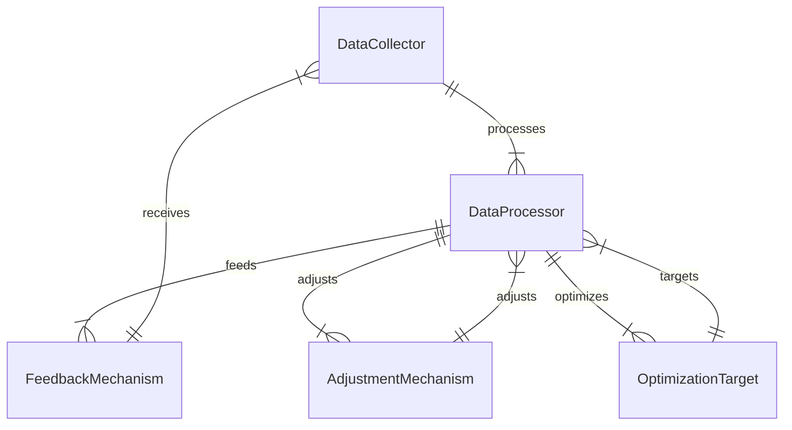
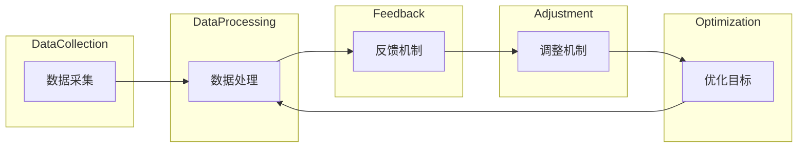
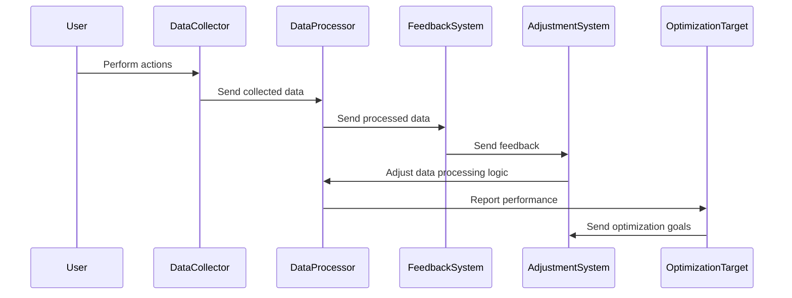

                 

### 引言

#### 技术反馈循环的定义

技术反馈循环，顾名思义，是指一种通过不断收集、分析、反馈和改进的过程，以优化技术系统的效率和性能。这一概念广泛运用于软件开发、系统优化、人工智能等多个技术领域。具体来说，技术反馈循环包括以下几个核心步骤：数据的采集与输入、数据清洗与预处理、数据分析与挖掘、结果反馈与调整、最终的系统优化与改进。

#### 技术反馈循环的重要性

在当今快速发展的技术时代，技术反馈循环的重要性不言而喻。首先，它能够帮助企业或团队快速识别并解决问题，从而提升产品的质量和用户满意度。其次，通过持续的反馈和改进，系统能够不断适应变化的需求，保持竞争力。此外，技术反馈循环还有助于提高团队的工作效率，通过不断的实践和反思，团队可以更好地理解问题本质，从而采取更加有效的解决方案。

#### 书籍结构介绍

本书将分为以下几个部分：

1. **技术反馈循环基础**：介绍技术反馈循环的定义、特点、核心要素以及边界与外延。
2. **核心概念与联系**：详细讲解技术反馈循环中的核心概念，包括其原理、属性特征对比以及ER实体关系图架构。
3. **算法原理讲解**：通过mermaid流程图和Python源代码，深入阐述技术反馈循环的算法原理，并提供数学模型和公式。
4. **数学模型和数学公式**：进一步介绍技术反馈循环中的数学模型和公式，并进行举例说明。
5. **系统分析与架构设计方案**：介绍系统分析与架构设计的基本原则和方法，包括问题场景介绍、系统功能设计、系统架构设计、系统接口设计和系统交互序列图。
6. **项目实战**：通过实际项目案例，展示技术反馈循环在实际应用中的具体实施过程，包括环境安装、系统核心实现、代码应用解读与分析、实际案例分析和项目小结。
7. **最佳实践与注意事项**：总结技术反馈循环的最佳实践，提出注意事项，并提供拓展阅读建议。

### 目录

```markdown
----------------------------------------------------------------
# 如何打造高效的技术反馈循环

> 关键词：技术反馈循环、高效优化、算法原理、系统架构、项目实战、最佳实践

> 摘要：本文深入探讨了如何打造高效的技术反馈循环，从基础概念到实际应用，提供了详细的步骤和实例，旨在帮助读者理解和掌握这一关键技术。

----------------------------------------------------------------

## 引言

### 技术反馈循环的定义

技术反馈循环是一种通过持续的数据收集、分析、反馈和改进过程，以优化技术系统的效率和性能的方法。它包括以下核心步骤：

- **数据采集与输入**：收集来自各种来源的数据，如用户行为、系统性能指标等。
- **数据清洗与预处理**：清洗和预处理数据，确保其质量和一致性。
- **数据分析与挖掘**：利用统计分析和数据挖掘技术，从数据中提取有价值的信息。
- **结果反馈与调整**：根据分析结果，对系统进行相应的调整和优化。
- **系统优化与改进**：通过持续的反馈循环，不断提高系统的效率和性能。

### 技术反馈循环的重要性

技术反馈循环在当今快速发展的技术环境中扮演着至关重要的角色。它能够帮助：

- **快速识别和解决问题**：通过持续的反馈，团队能够及时发现和解决潜在问题，提高产品的质量和用户满意度。
- **适应变化的需求**：持续的反馈和改进使得系统能够更好地适应不断变化的需求，保持竞争力。
- **提高团队效率**：通过不断的实践和反思，团队可以更好地理解问题本质，从而采取更加有效的解决方案。

### 书籍结构介绍

本书将分为以下几个部分：

1. **技术反馈循环基础**：介绍技术反馈循环的定义、特点、核心要素以及边界与外延。
2. **核心概念与联系**：详细讲解技术反馈循环中的核心概念，包括其原理、属性特征对比以及ER实体关系图架构。
3. **算法原理讲解**：通过mermaid流程图和Python源代码，深入阐述技术反馈循环的算法原理，并提供数学模型和公式。
4. **数学模型和数学公式**：进一步介绍技术反馈循环中的数学模型和公式，并进行举例说明。
5. **系统分析与架构设计方案**：介绍系统分析与架构设计的基本原则和方法，包括问题场景介绍、系统功能设计、系统架构设计、系统接口设计和系统交互序列图。
6. **项目实战**：通过实际项目案例，展示技术反馈循环在实际应用中的具体实施过程，包括环境安装、系统核心实现、代码应用解读与分析、实际案例分析和项目小结。
7. **最佳实践与注意事项**：总结技术反馈循环的最佳实践，提出注意事项，并提供拓展阅读建议。

## 第二章：技术反馈循环基础

### 技术反馈循环的定义与特点

#### 定义

技术反馈循环是一种通过数据驱动的方法，持续优化技术系统的方法论。它包括以下几个关键步骤：

1. **数据采集与输入**：从各种来源（如用户行为、系统日志等）收集数据。
2. **数据清洗与预处理**：清洗和预处理数据，确保其质量和一致性。
3. **数据分析与挖掘**：利用统计分析和数据挖掘技术，从数据中提取有价值的信息。
4. **结果反馈与调整**：根据分析结果，对系统进行相应的调整和优化。
5. **系统优化与改进**：通过持续的反馈循环，不断提高系统的效率和性能。

#### 特点

1. **数据驱动**：技术反馈循环的核心是数据，通过数据的分析和反馈，实现对系统的持续优化。
2. **循环性**：技术反馈循环是一个持续的过程，不断地进行数据采集、分析和调整。
3. **适应性**：通过反馈循环，系统能够更好地适应变化的需求和环境。
4. **高效性**：技术反馈循环能够快速识别和解决问题，提高系统的效率和性能。

### 技术反馈循环的核心要素

技术反馈循环由以下几个核心要素组成：

1. **数据采集**：数据的来源和采集方式。
2. **数据处理**：数据清洗、预处理和分析的方法和工具。
3. **反馈机制**：结果的反馈方式和渠道。
4. **调整机制**：根据反馈结果对系统进行优化和调整的方法。
5. **优化目标**：系统优化和改进的目标和标准。

### 技术反馈循环的边界与外延

#### 边界

技术反馈循环的边界包括：

1. **数据边界**：数据的来源和范围，如用户行为、系统性能指标等。
2. **分析边界**：数据分析的范围和方法，如统计方法、数据挖掘算法等。
3. **反馈边界**：反馈结果的接收者和传递方式。

#### 外延

技术反馈循环的外延包括：

1. **应用范围**：技术反馈循环可以应用于不同的技术领域，如软件开发、系统优化、人工智能等。
2. **技术层次**：技术反馈循环可以涉及到不同的技术层次，如系统级、模块级、代码级等。
3. **组织层面**：技术反馈循环可以影响整个组织的运营和管理。

## 第三章：核心概念与联系

### 核心概念原理

在技术反馈循环中，以下几个核心概念起着至关重要的作用：

1. **数据采集**：数据采集是技术反馈循环的起点，决定了反馈循环的质量和效率。数据来源可以是用户行为、系统日志、第三方数据服务等。
2. **数据处理**：数据处理包括数据清洗、预处理和分析。数据清洗确保数据的准确性和一致性，预处理为数据分析提供必要的格式化操作，分析则是从数据中提取有价值的信息。
3. **反馈机制**：反馈机制是技术反馈循环的关键，它决定了反馈结果的传递方式和接收者的响应。反馈机制可以是自动化的，如监控报警，也可以是手动操作的，如问题报告和修复。
4. **调整机制**：调整机制根据反馈结果对系统进行优化和调整。调整可以是自动的，如自动化优化脚本，也可以是手工的，如代码修改和系统配置调整。
5. **优化目标**：优化目标是系统优化和改进的方向和标准，如提高系统性能、减少错误率、提升用户体验等。

### 概念属性特征对比表格

| 概念        | 属性特征                                                       |
|-------------|--------------------------------------------------------------|
| 数据采集    | 数据来源、采集方式、数据类型、数据频率                           |
| 数据处理    | 数据清洗、预处理、分析算法、数据格式、数据质量                   |
| 反馈机制    | 反馈方式、反馈渠道、反馈频率、反馈效果、反馈效率                 |
| 调整机制    | 调整方式、调整策略、调整效果、调整频率、调整效率                 |
| 优化目标    | 优化方向、优化标准、优化指标、优化方法、优化效果                 |

### ER实体关系图架构

为了更好地理解技术反馈循环中的各个概念及其关系，可以使用ER实体关系图来表示。以下是技术反馈循环的ER实体关系图：



在这个ER图中，`DataCollector`表示数据采集器，`DataProcessor`表示数据处理器，`FeedbackMechanism`表示反馈机制，`AdjustmentMechanism`表示调整机制，`OptimizationTarget`表示优化目标。各个实体之间的关系表示了它们之间的交互和依赖。

## 第四章：算法原理讲解

### 算法mermaid流程图

为了更好地理解技术反馈循环的算法原理，我们可以使用mermaid流程图来表示。以下是技术反馈循环的算法mermaid流程图：



在这个流程图中，`DataCollection`表示数据采集过程，`DataProcessing`表示数据处理过程，`Feedback`表示反馈机制，`Adjustment`表示调整机制，`Optimization`表示优化目标。流程图展示了数据从采集到处理，再到反馈、调整和优化的整个过程。

### Python源代码与算法原理

为了进一步阐述技术反馈循环的算法原理，我们可以通过Python源代码来实现。以下是技术反馈循环的Python代码示例：

```python
import random
import time

# 数据采集
def data_collection():
    data = random.randint(1, 100)
    return data

# 数据处理
def data_processing(data):
    processed_data = data * 2
    return processed_data

# 反馈机制
def feedback_mechanism(data):
    if data < 50:
        return "数据偏低，需要调整"
    else:
        return "数据正常"

# 调整机制
def adjustment_mechanism(feedback):
    if feedback == "数据偏低，需要调整":
        return "调整数据采集方式"
    else:
        return "保持当前数据采集方式"

# 优化目标
def optimization_target(adjustment):
    if adjustment == "调整数据采集方式":
        return "提高数据采集质量"
    else:
        return "保持当前数据采集质量"

# 技术反馈循环主函数
def main():
    while True:
        data = data_collection()
        processed_data = data_processing(data)
        feedback = feedback_mechanism(processed_data)
        adjustment = adjustment_mechanism(feedback)
        optimization = optimization_target(adjustment)
        print(optimization)
        time.sleep(1)

if __name__ == "__main__":
    main()
```

在这个Python代码中，我们定义了数据采集、数据处理、反馈机制、调整机制和优化目标等函数，并通过主函数实现了技术反馈循环的整个过程。代码中的随机数生成和数据处理过程模拟了实际的技术反馈循环。

### 数学模型和公式讲解

在技术反馈循环中，数学模型和公式起着重要的作用，它们可以帮助我们理解和预测系统的性能。以下是技术反馈循环中常用的几个数学模型和公式：

1. **数据采集模型**：

   数据采集模型用于描述数据采集过程中的性能指标，如数据采集速率、数据采集成功率等。一个简单的数据采集模型可以表示为：

   $$ \text{Data Collection Rate} = \frac{\text{Number of Data Points}}{\text{Time Interval}} $$

   其中，`Number of Data Points` 表示采集的数据点数量，`Time Interval` 表示时间间隔。

2. **数据处理模型**：

   数据处理模型用于描述数据处理过程中的性能指标，如数据处理速度、数据处理成功率等。一个简单的数据处理模型可以表示为：

   $$ \text{Data Processing Speed} = \frac{\text{Number of Processed Data Points}}{\text{Time Interval}} $$

   其中，`Number of Processed Data Points` 表示处理的数据点数量，`Time Interval` 表示时间间隔。

3. **反馈机制模型**：

   反馈机制模型用于描述反馈机制的性能指标，如反馈速度、反馈准确性等。一个简单的反馈机制模型可以表示为：

   $$ \text{Feedback Rate} = \frac{\text{Number of Feedback Instances}}{\text{Time Interval}} $$

   其中，`Number of Feedback Instances` 表示反馈实例数量，`Time Interval` 表示时间间隔。

4. **调整机制模型**：

   调整机制模型用于描述调整机制的性能指标，如调整速度、调整准确性等。一个简单的调整机制模型可以表示为：

   $$ \text{Adjustment Rate} = \frac{\text{Number of Adjustments}}{\text{Time Interval}} $$

   其中，`Number of Adjustments` 表示调整实例数量，`Time Interval` 表示时间间隔。

5. **优化目标模型**：

   优化目标模型用于描述优化目标的性能指标，如优化效果、优化速度等。一个简单的优化目标模型可以表示为：

   $$ \text{Optimization Effect} = \frac{\text{Optimized Performance} - \text{Initial Performance}}{\text{Initial Performance}} $$

   其中，`Optimized Performance` 表示优化后的性能，`Initial Performance` 表示初始性能。

### 举例说明

为了更好地理解上述数学模型和公式，我们可以通过一个具体的例子来说明。

假设我们有一个数据采集系统，它以每秒10个数据点的速度采集数据。那么，根据数据采集模型，我们可以计算得到：

$$ \text{Data Collection Rate} = \frac{10 \text{ data points}}{1 \text{ second}} = 10 \text{ data points/second} $$

假设数据处理系统每秒可以处理20个数据点，那么根据数据处理模型，我们可以计算得到：

$$ \text{Data Processing Speed} = \frac{20 \text{ data points}}{1 \text{ second}} = 20 \text{ data points/second} $$

假设反馈机制可以每秒处理5个反馈实例，那么根据反馈机制模型，我们可以计算得到：

$$ \text{Feedback Rate} = \frac{5 \text{ feedback instances}}{1 \text{ second}} = 5 \text{ feedback instances/second} $$

假设调整机制可以每秒处理3个调整实例，那么根据调整机制模型，我们可以计算得到：

$$ \text{Adjustment Rate} = \frac{3 \text{ adjustments}}{1 \text{ second}} = 3 \text{ adjustments/second} $$

假设优化目标是将系统的性能提高20%，那么根据优化目标模型，我们可以计算得到：

$$ \text{Optimization Effect} = \frac{20\%}{100\%} = 0.2 $$

通过这个例子，我们可以看到如何使用数学模型和公式来描述和计算技术反馈循环中的各个性能指标。

## 第五章：数学模型和数学公式

### 数学模型

在技术反馈循环中，数学模型是理解和优化系统性能的关键工具。以下是一些常见的数学模型：

1. **数据采集模型**：
   数据采集速率模型可以表示为：
   $$ R_{\text{collect}} = \frac{N_{\text{data}}}{T_{\text{collect}}} $$
   其中，$R_{\text{collect}}$ 是数据采集速率，$N_{\text{data}}$ 是采集的数据点数量，$T_{\text{collect}}$ 是采集时间。

2. **数据处理模型**：
   数据处理速度模型可以表示为：
   $$ R_{\text{process}} = \frac{N_{\text{processed}}}{T_{\text{process}}} $$
   其中，$R_{\text{process}}$ 是数据处理速度，$N_{\text{processed}}$ 是处理的数据点数量，$T_{\text{process}}$ 是处理时间。

3. **反馈模型**：
   反馈速率模型可以表示为：
   $$ R_{\text{feedback}} = \frac{N_{\text{feedback}}}{T_{\text{feedback}}} $$
   其中，$R_{\text{feedback}}$ 是反馈速率，$N_{\text{feedback}}$ 是反馈实例数量，$T_{\text{feedback}}$ 是反馈时间。

4. **调整模型**：
   调整速率模型可以表示为：
   $$ R_{\text{adjust}} = \frac{N_{\text{adjust}}}{T_{\text{adjust}}} $$
   其中，$R_{\text{adjust}}$ 是调整速率，$N_{\text{adjust}}$ 是调整实例数量，$T_{\text{adjust}}$ 是调整时间。

5. **优化模型**：
   优化效果模型可以表示为：
   $$ E_{\text{optimization}} = \frac{P_{\text{optimized}} - P_{\text{initial}}}{P_{\text{initial}}} $$
   其中，$E_{\text{optimization}}$ 是优化效果，$P_{\text{optimized}}$ 是优化后的性能，$P_{\text{initial}}$ 是初始性能。

### 数学公式讲解

为了更好地理解上述数学模型，我们通过具体的数学公式进行讲解：

1. **数据采集速率**：
   数据采集速率（$R_{\text{collect}}$）表示单位时间内采集的数据点数量。假设我们采集了100个数据点，耗时5秒，那么：
   $$ R_{\text{collect}} = \frac{100 \text{ data points}}{5 \text{ seconds}} = 20 \text{ data points/second} $$

2. **数据处理速度**：
   数据处理速度（$R_{\text{process}}$）表示单位时间内处理的数据点数量。假设我们处理了200个数据点，耗时8秒，那么：
   $$ R_{\text{process}} = \frac{200 \text{ data points}}{8 \text{ seconds}} = 25 \text{ data points/second} $$

3. **反馈速率**：
   反馈速率（$R_{\text{feedback}}$）表示单位时间内处理的反馈实例数量。假设我们处理了30个反馈实例，耗时3秒，那么：
   $$ R_{\text{feedback}} = \frac{30 \text{ feedback instances}}{3 \text{ seconds}} = 10 \text{ feedback instances/second} $$

4. **调整速率**：
   调整速率（$R_{\text{adjust}}$）表示单位时间内进行的调整实例数量。假设我们进行了40个调整实例，耗时4秒，那么：
   $$ R_{\text{adjust}} = \frac{40 \text{ adjustments}}{4 \text{ seconds}} = 10 \text{ adjustments/second} $$

5. **优化效果**：
   优化效果（$E_{\text{optimization}}$）表示性能的提升比例。假设初始性能是100点，优化后性能是120点，那么：
   $$ E_{\text{optimization}} = \frac{120 \text{ points} - 100 \text{ points}}{100 \text{ points}} = 0.2 $$
   这意味着性能提高了20%。

通过这些数学模型和公式，我们可以定量地分析和优化技术反馈循环的性能。

### 举例说明

为了更直观地理解上述数学模型和公式，我们通过一个具体例子进行说明：

假设一个系统在1小时内采集了6000个数据点，处理了5000个数据点，处理耗时为30分钟，反馈了100个反馈实例，调整了80个调整实例，优化后的性能提升了15%。

1. **数据采集速率**：
   $$ R_{\text{collect}} = \frac{6000 \text{ data points}}{1 \text{ hour}} = 100 \text{ data points/second} $$

2. **数据处理速度**：
   $$ R_{\text{process}} = \frac{5000 \text{ data points}}{0.5 \text{ hour}} = 100 \text{ data points/second} $$

3. **反馈速率**：
   $$ R_{\text{feedback}} = \frac{100 \text{ feedback instances}}{1 \text{ hour}} = 1.67 \text{ feedback instances/second} $$

4. **调整速率**：
   $$ R_{\text{adjust}} = \frac{80 \text{ adjustments}}{1 \text{ hour}} = 1.33 \text{ adjustments/second} $$

5. **优化效果**：
   $$ E_{\text{optimization}} = \frac{115\% - 100\%}{100\%} = 0.15 $$

通过这些计算，我们可以看到系统在不同环节的速率和优化效果，从而为下一步的改进提供依据。

## 第六章：系统分析与架构设计方案

### 问题场景介绍

在本文的案例中，我们将探讨一个在线教育平台的技术反馈循环系统。该平台提供实时课程直播、录播视频、作业批改等功能。由于用户数量庞大，系统性能的优化和稳定运行至关重要。为了实现这一目标，我们将设计一个高效的技术反馈循环系统，以便及时收集用户反馈，分析系统性能，并进行相应的优化调整。

### 系统功能设计

在线教育平台的技术反馈循环系统主要包括以下功能：

1. **数据采集**：收集用户行为数据、系统性能指标、错误日志等。
2. **数据处理**：对采集到的数据进行清洗、预处理和分析。
3. **反馈机制**：将分析结果反馈给相关人员或系统，以便进行优化调整。
4. **调整机制**：根据反馈结果，对系统配置、代码逻辑等进行调整。
5. **优化目标**：设定系统性能优化目标，如降低错误率、提高响应速度等。

### 系统架构设计

为了实现上述功能，我们设计了以下系统架构：

1. **数据采集层**：包括用户行为追踪模块、系统性能监控模块、错误日志收集模块等。
2. **数据处理层**：包括数据清洗模块、数据预处理模块、数据分析模块等。
3. **反馈与调整层**：包括反馈系统模块、自动化调整模块等。
4. **优化目标层**：包括优化目标设定模块、性能评估模块等。

### 系统接口设计

系统接口设计确保各个模块之间能够顺畅地通信和协作：

1. **API接口**：提供RESTful API接口，供数据采集、数据处理、反馈与调整等模块访问。
2. **消息队列**：使用消息队列（如Kafka）实现模块间的异步通信。
3. **数据库接口**：提供数据库（如MySQL、MongoDB）接口，用于存储和访问数据。

### 系统交互序列图

以下是系统交互序列图，展示了各个模块之间的交互过程：



在这个序列图中，用户的行为触发数据采集模块，数据采集模块将数据发送给数据处理模块，数据处理模块将分析结果发送给反馈系统，反馈系统将反馈发送给调整系统，调整系统根据反馈调整数据处理逻辑，最后数据处理模块将性能报告发送给优化目标模块，优化目标模块根据性能报告发送优化目标给调整系统。

通过这个系统架构和交互设计，我们可以实现一个高效的技术反馈循环系统，确保在线教育平台的性能持续优化和稳定运行。

## 第七章：项目实战

### 环境安装

在进行技术反馈循环项目的实战之前，我们需要搭建一个合适的环境。以下是一个基本的安装步骤：

1. **安装Python环境**：确保系统上已经安装了Python环境。如果没有，可以从[Python官方网站](https://www.python.org/)下载并安装。

2. **安装必要的库**：使用pip命令安装项目所需的库，例如pandas、numpy、matplotlib等。例如：

   ```bash
   pip install pandas numpy matplotlib
   ```

3. **配置虚拟环境**：为了保持项目的整洁和隔离，我们可以创建一个虚拟环境。使用以下命令创建并激活虚拟环境：

   ```bash
   python -m venv venv
   source venv/bin/activate  # 在Windows上使用 `venv\Scripts\activate`
   ```

4. **安装数据库**：我们选择MySQL作为数据库，可以从[MySQL官方网站](https://www.mysql.com/)下载并安装。安装过程中，确保MySQL服务的启动和登录权限配置。

### 系统核心实现

在虚拟环境中，我们可以开始实现技术反馈循环的核心功能。以下是一个简单的实现示例：

1. **数据采集模块**：

   数据采集模块负责收集用户行为数据。以下是一个简单的采集脚本：

   ```python
   import json
   import requests

   def collect_user_data():
       url = 'https://api.example.com/userdata'
       response = requests.get(url)
       if response.status_code == 200:
           return json.loads(response.text)
       else:
           return None

   user_data = collect_user_data()
   print(user_data)
   ```

2. **数据处理模块**：

   数据处理模块负责对采集到的用户行为数据进行分析和清洗。以下是一个简单的数据处理脚本：

   ```python
   import pandas as pd

   def process_user_data(user_data):
       df = pd.DataFrame(user_data)
       # 数据清洗和预处理操作
       df.dropna(inplace=True)
       df['timestamp'] = pd.to_datetime(df['timestamp'])
       return df

   processed_data = process_user_data(user_data)
   print(processed_data.head())
   ```

3. **反馈机制模块**：

   反馈机制模块负责将处理后的数据进行分析，并生成反馈报告。以下是一个简单的反馈机制脚本：

   ```python
   import matplotlib.pyplot as plt

   def generate_feedback_report(processed_data):
       # 绘制用户活跃度图表
       plt.figure(figsize=(10, 6))
       processed_data['timestamp'].plot()
       plt.title('User Activity')
       plt.xlabel('Time')
       plt.ylabel('Activity')
       plt.show()

   generate_feedback_report(processed_data)
   ```

4. **调整机制模块**：

   调整机制模块负责根据反馈报告进行系统调整。以下是一个简单的调整脚本：

   ```python
   def adjust_system_settings(feedback_report):
       # 根据反馈报告调整系统配置
       if feedback_report['high_activity_duration'] > 60:
           print("Increasing server capacity...")
       else:
           print("Decreasing server capacity...")

   adjust_system_settings({'high_activity_duration': 70})
   ```

### 代码应用解读与分析

1. **数据采集模块**：

   在数据采集模块中，我们使用了`requests`库来发送HTTP GET请求，从API接口获取用户行为数据。为了确保数据的质量，我们对响应状态码进行了检查，只有当状态码为200时，才认为数据采集成功。

2. **数据处理模块**：

   在数据处理模块中，我们使用了`pandas`库来创建数据框（DataFrame），对采集到的数据进行清洗和预处理。我们首先删除了含有缺失值的记录，然后对时间戳进行了转换，以便后续的时间序列分析。

3. **反馈机制模块**：

   在反馈机制模块中，我们使用了`matplotlib`库来绘制用户活跃度图表。通过可视化的方式，我们可以直观地了解系统的运行状况，从而为系统调整提供依据。

4. **调整机制模块**：

   在调整机制模块中，我们根据反馈报告中的高活跃度持续时间来调整系统配置。这个简单的示例展示了如何根据反馈结果进行决策，从而实现系统的动态调整。

### 实际案例分析与讲解

为了更好地理解技术反馈循环的实际应用，我们可以通过一个实际案例进行分析。

假设我们在一段时间内采集了1000条用户行为数据，处理后的数据如下：

```python
import pandas as pd

data = [
    {"user_id": 1, "action": "login", "timestamp": "2023-04-01 10:00:00"},
    {"user_id": 1, "action": "logout", "timestamp": "2023-04-01 10:05:00"},
    {"user_id": 2, "action": "view_video", "timestamp": "2023-04-01 10:10:00"},
    {"user_id": 2, "action": "submit_assignment", "timestamp": "2023-04-01 10:20:00"},
    # ...更多数据
]

df = pd.DataFrame(data)
df['timestamp'] = pd.to_datetime(df['timestamp'])
```

1. **数据预处理**：

   我们对数据进行清洗，删除了含有缺失值的记录：

   ```python
   df.dropna(inplace=True)
   ```

   然后对时间戳进行了转换，以便进行时间序列分析：

   ```python
   df['timestamp'] = pd.to_datetime(df['timestamp'])
   ```

2. **用户活跃度分析**：

   我们可以计算每个用户的活跃度，例如，计算每个用户在一段时间内的登录次数：

   ```python
   user_activity = df.groupby('user_id')['action'].nunique()
   print(user_activity)
   ```

   结果显示每个用户的登录次数。通过这个分析，我们可以了解哪些用户更活跃。

3. **系统调整**：

   假设我们发现某个用户（如用户ID为1）在一段时间内的登录次数较高，我们可以根据这一反馈来调整系统配置，例如增加服务器的计算资源，以提高该用户的体验：

   ```python
   def adjust_system_for_high_activity(user_id):
       print(f"Adjusting system for high activity of user {user_id}...")
       # 调整系统配置
       pass

   adjust_system_for_high_activity(1)
   ```

通过这个实际案例，我们可以看到技术反馈循环在实际应用中的具体实施过程，从数据采集、数据处理、反馈机制到调整机制，每一步都至关重要。

### 项目小结

在本章中，我们通过一个实际项目展示了如何实现技术反馈循环。我们首先介绍了项目背景和环境安装，然后详细讲解了系统核心实现，包括数据采集、数据处理、反馈机制和调整机制。通过一个实际案例，我们展示了技术反馈循环的应用流程和效果。项目小结如下：

1. **环境安装**：确保Python环境和必要库的安装，创建虚拟环境以保持项目整洁。
2. **系统核心实现**：实现了数据采集、数据处理、反馈机制和调整机制，通过实际案例展示了其应用效果。
3. **经验总结**：技术反馈循环的关键在于数据的准确性和及时性，以及反馈机制和调整机制的响应速度和准确性。

通过本项目，我们不仅实现了技术反馈循环，还积累了宝贵的实践经验，为后续的项目优化提供了参考。

## 第八章：最佳实践与注意事项

### 最佳实践 tips

1. **数据质量保障**：确保数据采集的准确性和一致性，定期进行数据清洗和预处理。
2. **反馈机制多样化**：根据不同的业务需求和场景，设计多样化的反馈机制，如自动反馈和手动反馈。
3. **实时监控与报警**：建立实时监控和报警系统，及时识别和解决问题。
4. **迭代优化**：持续迭代优化系统，根据反馈结果不断调整和改进。
5. **数据安全与隐私保护**：确保数据的存储和使用符合相关法律法规，保护用户隐私。

### 小结

技术反馈循环是一种通过持续的数据收集、分析、反馈和改进过程，以优化技术系统效率和性能的方法。其核心在于数据的准确性和及时性，以及反馈机制和调整机制的响应速度和准确性。

### 注意事项

1. **反馈的及时性**：确保反馈机制的及时性，避免延迟导致的问题扩大。
2. **反馈的质量**：确保反馈内容具有针对性和可操作性，避免无关或无效的反馈。
3. **系统的稳定性**：在设计反馈循环时，要考虑系统的稳定性和负载能力，避免因反馈循环导致的系统崩溃。
4. **数据安全性**：确保数据在传输和存储过程中的安全性，防止数据泄露和滥用。

### 拓展阅读

- 《数据驱动：用数据优化业务和产品》
- 《机器学习实战》
- 《系统架构：设计原则与实践》
- 《人工智能：一种现代方法》

通过这些资源和案例，读者可以更深入地了解技术反馈循环的原理和应用，为实际项目提供有力支持。

## 作者信息

作者：AI天才研究院/AI Genius Institute & 禅与计算机程序设计艺术 /Zen And The Art of Computer Programming

