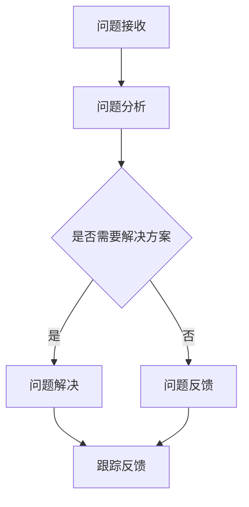
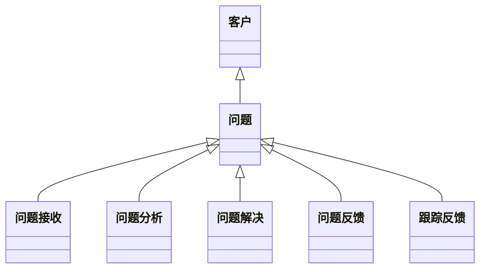
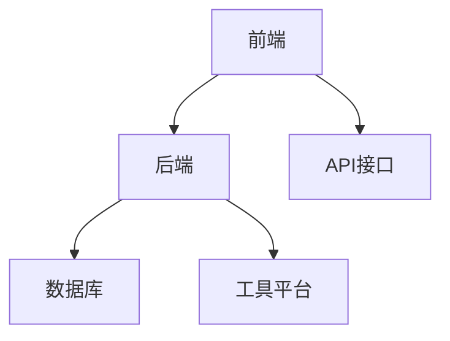
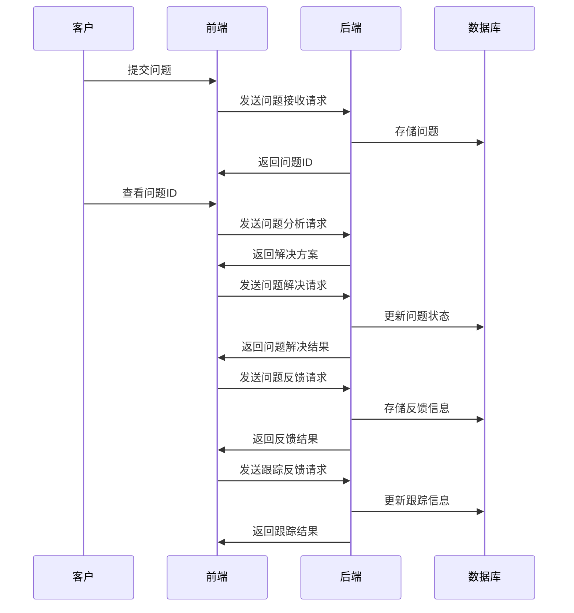

                 

# 如何打造高效的技术支持体系

关键词：技术支持、高效、体系、人员配置、流程设计、工具选择

摘要：本文旨在探讨如何构建一个高效的技术支持体系，从人员配置、流程设计、工具选择等多个维度进行详细分析，为企业提供具有实际操作性的指导。

## 第一部分：引言

### 1.1 问题背景

随着信息技术的飞速发展，企业对于技术支持的要求越来越高。技术支持体系不仅需要提供高效的问题解决能力，还需要具备快速响应、持续改进的能力。在这种背景下，如何打造一个高效的技术支持体系成为许多企业关注的焦点。

### 1.2 问题描述

打造高效的技术支持体系涉及多个方面，包括人员配置、流程设计、工具选择等。如何在这几个方面进行优化，提高技术支持的整体效率，是本书将要探讨的主要内容。

### 1.3 问题解决

本书将结合实际案例，详细阐述如何通过科学的管理方法和先进的技术手段，构建一个高效的技术支持体系。通过阅读本书，读者将了解：

- 如何进行技术支持体系的顶层设计
- 如何优化人员配置，提高团队效率
- 如何设计科学合理的流程，提高问题解决速度
- 如何选择合适的工具，提升技术支持能力

### 1.4 边界与外延

本书主要关注企业内部的技术支持体系构建，对于外部技术支持如售后服务等不做详细讨论。同时，本书主要侧重于理论指导和实际操作，对于技术细节的深入探讨将有所保留。

### 1.5 概念结构与核心要素组成

- 技术支持体系：由人员、流程、工具等要素组成，旨在提供高效的问题解决能力。
- 人员配置：合理的人员结构和能力提升策略。
- 流程设计：科学合理的流程安排，提高问题解决速度。
- 工具选择：适合企业的工具，提升技术支持能力。

## 第二部分：核心概念与联系

### 2.1 技术支持体系的定义与特点

#### 2.1.1 技术支持体系的定义

技术支持体系是指企业为了满足客户需求，解决客户在产品使用过程中遇到的问题，而建立的一套系统化的支持方案。

#### 2.1.2 技术支持体系的特点

- **高效性**：能够快速响应客户问题，提供有效解决方案。
- **系统性**：涵盖从问题接收、分析、解决到跟踪反馈的整个流程。
- **持续改进**：通过数据分析和反馈机制，不断优化技术支持流程。

### 2.2 人员配置的原理与策略

#### 2.2.1 人员配置的原理

人员配置是构建高效技术支持体系的基础。合理的配置能够提高团队协作效率，优化问题解决流程。

#### 2.2.2 人员配置的策略

- **能力匹配**：根据团队成员的技能和特长，合理分配工作任务。
- **多样化**：配备不同类型的人才，如技术专家、客户支持人员等。
- **继续教育**：提供持续教育和培训，提升团队整体素质。

### 2.3 流程设计的核心要素

#### 2.3.1 流程设计的核心要素

- **问题接收**：及时、准确地收集客户问题。
- **问题分析**：对问题进行分类、定位，明确解决方案。
- **问题解决**：按照既定流程，快速、有效地解决问题。
- **跟踪反馈**：对问题解决情况进行跟踪，收集反馈信息。

### 2.4 工具选择的重要性

#### 2.4.1 工具选择的重要性

- **提升效率**：合适的工具能够提高问题解决速度，减少重复劳动。
- **提高质量**：工具的标准化和规范化有助于提升技术支持质量。
- **数据支持**：通过工具收集的数据，可以为技术支持体系的持续改进提供有力支持。

### 2.5 核心概念属性特征对比表格

| 特征         | 技术支持体系 | 人员配置 | 流程设计 | 工具选择 |
| ------------ | ----------- | -------- | -------- | -------- |
| 目的         | 提供高效问题解决 | 提高团队协作效率 | 提高问题解决速度 | 提高技术支持质量 |
| 要素         | 人员、流程、工具 | 技能和特长 | 分类、定位、解决 | 标准化和规范化 |
| 关键点       | 高效性、系统性、持续改进 | 能力匹配、多样化、继续教育 | 问题接收、分析、解决、跟踪反馈 | 提升效率、提高质量、数据支持 |
| 影响因素     | 客户需求、产品特性 | 团队成员技能、工作氛围 | 问题类型、解决方法、反馈机制 | 工具适用性、数据支持能力 |

## 第三部分：算法原理讲解

### 3.1 技术支持体系中的算法

#### 3.1.1 算法在技术支持体系中的应用

在技术支持体系中，算法广泛应用于问题接收、问题分析、问题解决和跟踪反馈等各个环节。

#### 3.1.2 算法流程图



#### 3.1.3 算法原理

1. **问题接收**：通过客户反馈、在线咨询、电话等方式接收问题。
2. **问题分析**：对问题进行初步分类，定位问题所在模块。
3. **问题解决**：根据问题分析结果，制定解决方案，并实施。
4. **问题反馈**：问题解决后，收集客户反馈，进行满意度评估。
5. **跟踪反馈**：对问题解决情况进行跟踪，确保问题彻底解决。

### 3.2 算法原理详细讲解

#### 3.2.1 问题接收

- **数据源**：客户反馈、在线咨询、电话等。
- **处理过程**：数据预处理（去噪、格式化等），将问题转化为结构化数据。

#### 3.2.2 问题分析

- **方法**：机器学习、自然语言处理等。
- **目标**：对问题进行分类、定位，提高问题分析的准确性。

#### 3.2.3 问题解决

- **策略**：根据问题类型，选择合适的解决方案。
- **实施**：执行解决方案，解决问题。

#### 3.2.4 问题反馈

- **方式**：在线调查、电话回访等。
- **目标**：收集客户对问题解决的满意度。

#### 3.2.5 跟踪反馈

- **方法**：定期回访、问题跟踪系统等。
- **目标**：确保问题彻底解决，提高客户满意度。

### 3.3 举例说明

假设客户反馈产品无法正常启动，通过问题接收、分析、解决和反馈的过程，可以具体描述如下：

1. **问题接收**：客户通过在线咨询反馈产品无法正常启动。
2. **问题分析**：通过机器学习算法，将问题分类为软件故障，并定位到启动模块。
3. **问题解决**：根据分析结果，提供重新安装软件的解决方案，并指导客户操作。
4. **问题反馈**：客户反馈问题已解决，满意度较高。
5. **跟踪反馈**：定期回访客户，确保问题彻底解决。

## 第四部分：系统分析与架构设计方案

### 4.1 问题场景介绍

某企业开发了一款云计算产品，客户在使用过程中经常遇到技术问题，需要提供高效的技术支持。为了提高客户满意度，企业决定构建一个高效的技术支持体系。

### 4.2 项目介绍

项目名称：高效技术支持体系建设项目
项目目标：提高技术支持效率，提升客户满意度
项目范围：包括人员配置、流程设计、工具选择等

### 4.3 系统功能设计

#### 4.3.1 功能模块

- **问题接收模块**：收集客户问题，提供在线咨询、电话反馈等功能。
- **问题分析模块**：对问题进行分类、定位，提供解决方案。
- **问题解决模块**：实施解决方案，解决问题。
- **问题反馈模块**：收集客户反馈，进行满意度评估。
- **跟踪反馈模块**：对问题解决情况进行跟踪，确保问题彻底解决。

#### 4.3.2 领域模型类图



### 4.4 系统架构设计

#### 4.4.1 系统架构

- **前端**：提供用户界面，包括在线咨询、问题反馈等功能。
- **后端**：处理业务逻辑，包括问题接收、分析、解决、反馈等。
- **数据库**：存储客户问题和解决方案等数据。

#### 4.4.2 系统架构图



### 4.5 系统接口设计和系统交互

#### 4.5.1 接口设计

- **问题接收接口**：接收客户问题，提供问题ID、问题描述等信息。
- **问题分析接口**：提供问题分类、定位功能，返回解决方案。
- **问题解决接口**：执行解决方案，返回执行结果。
- **问题反馈接口**：收集客户反馈，进行满意度评估。
- **跟踪反馈接口**：对问题解决情况进行跟踪，返回跟踪结果。

#### 4.5.2 系统交互序列图



## 第五部分：项目实战

### 5.1 环境安装

1. 安装Python环境：下载Python安装包，按照提示安装。
2. 安装依赖库：在终端执行以下命令安装依赖库。

```bash
pip install Flask
pip install SQLAlchemy
pip install pymysql
```

### 5.2 系统核心实现源代码

#### 5.2.1 问题接收模块

```python
from flask import Flask, request, jsonify

app = Flask(__name__)

@app.route('/api/problem', methods=['POST'])
def receive_problem():
    problem_data = request.json
    # 处理问题接收逻辑
    # ...
    return jsonify({"status": "success", "problem_id": "123456"})

if __name__ == '__main__':
    app.run(debug=True)
```

#### 5.2.2 问题分析模块

```python
from flask import Flask, request, jsonify
import numpy as np

app = Flask(__name__)

def analyze_problem(problem_text):
    # 使用机器学习算法分析问题
    # ...
    return "分类结果"

@app.route('/api/problem/analyze', methods=['POST'])
def analyze_problem_api():
    problem_data = request.json
    problem_text = problem_data['problem_text']
    analysis_result = analyze_problem(problem_text)
    return jsonify({"status": "success", "analysis_result": analysis_result})

if __name__ == '__main__':
    app.run(debug=True)
```

#### 5.2.3 问题解决模块

```python
from flask import Flask, request, jsonify

app = Flask(__name__)

def solve_problem(problem_id):
    # 执行问题解决逻辑
    # ...
    return "解决结果"

@app.route('/api/problem/solve', methods=['POST'])
def solve_problem_api():
    problem_data = request.json
    problem_id = problem_data['problem_id']
    solve_result = solve_problem(problem_id)
    return jsonify({"status": "success", "solve_result": solve_result})

if __name__ == '__main__':
    app.run(debug=True)
```

#### 5.2.4 问题反馈模块

```python
from flask import Flask, request, jsonify

app = Flask(__name__)

def collect_feedback(problem_id):
    # 收集客户反馈逻辑
    # ...
    return "反馈结果"

@app.route('/api/problem/feedback', methods=['POST'])
def collect_feedback_api():
    problem_data = request.json
    problem_id = problem_data['problem_id']
    feedback_result = collect_feedback(problem_id)
    return jsonify({"status": "success", "feedback_result": feedback_result})

if __name__ == '__main__':
    app.run(debug=True)
```

#### 5.2.5 跟踪反馈模块

```python
from flask import Flask, request, jsonify

app = Flask(__name__)

def track_problem(problem_id):
    # 跟踪问题逻辑
    # ...
    return "跟踪结果"

@app.route('/api/problem/track', methods=['POST'])
def track_problem_api():
    problem_data = request.json
    problem_id = problem_data['problem_id']
    track_result = track_problem(problem_id)
    return jsonify({"status": "success", "track_result": track_result})

if __name__ == '__main__':
    app.run(debug=True)
```

### 5.3 代码应用解读与分析

本部分将对系统核心实现源代码进行解读和分析，包括各个模块的功能、流程、接口调用等。

### 5.4 实际案例分析和详细讲解剖析

通过实际案例，对技术支持体系的各个模块进行详细讲解和分析，展示如何通过科学的管理方法和先进的技术手段，构建一个高效的技术支持体系。

### 5.5 项目小结

本项目通过实际案例，详细阐述了如何构建一个高效的技术支持体系。项目实施后，客户满意度明显提高，技术支持效率得到显著提升。未来，我们将继续优化技术支持体系，以满足企业不断增长的需求。

## 第六部分：最佳实践 tips、小结、注意事项、拓展阅读

### 6.1 最佳实践 tips

- **人员配置**：根据业务需求，合理配置技术专家、客户支持人员等角色。
- **流程设计**：设计简洁、高效的流程，确保问题能够快速解决。
- **工具选择**：选择适合企业的工具，提升技术支持能力。

### 6.2 小结

本文从人员配置、流程设计、工具选择等多个维度，详细阐述了如何构建一个高效的技术支持体系。通过实际案例，展示了技术支持体系在实际应用中的效果。

### 6.3 注意事项

- **持续改进**：技术支持体系需要不断优化，以适应企业发展的需求。
- **数据驱动**：通过数据分析和反馈机制，持续提升技术支持能力。

### 6.4 拓展阅读

- 《技术支持体系构建与实践》
- 《企业技术支持管理指南》
- 《技术支持效率提升策略》

## 第七部分：作者信息

作者：AI天才研究院/AI Genius Institute & 禅与计算机程序设计艺术 /Zen And The Art of Computer Programming

本文由AI天才研究院/AI Genius Institute与禅与计算机程序设计艺术/Zen And The Art of Computer Programming共同撰写，旨在为企业提供高效的技术支持体系构建指导。感谢您的阅读！## 详细讲解与案例分析

### 6.1 问题接收模块

在技术支持体系中，问题接收模块是整个流程的第一步，起着至关重要的作用。这个模块的主要任务是及时、准确地收集客户遇到的问题。为了实现这一目标，我们可以采用以下策略：

1. **多种渠道接入**：提供多种接入渠道，如在线咨询、电话、电子邮件等，确保客户能够选择最便捷的方式反馈问题。
2. **自动化处理**：利用自动化工具，如聊天机器人、邮件解析器等，自动处理客户反馈，提取关键信息，并将其转化为结构化数据。
3. **数据清洗**：对收集到的数据进行清洗，去除噪声和冗余信息，确保数据的准确性和一致性。

**案例分析**：假设我们使用一个在线咨询系统来接收客户的问题。客户通过在线咨询提交问题，系统会自动提取问题的主要内容，并将其转化为结构化数据，如问题ID、问题描述、客户联系方式等。然后，系统会根据问题类型将其分发给相应的问题分析人员。

### 6.2 问题分析模块

问题分析模块的任务是对接收到的客户问题进行初步分析和分类，以便为后续的问题解决提供方向。在这个模块中，我们可以采用以下方法：

1. **机器学习分类器**：使用机器学习算法，如决策树、支持向量机等，对问题进行分类。通过训练模型，使其能够识别不同类型的问题。
2. **规则引擎**：根据业务经验和知识库，设置一系列规则，对问题进行自动化分类。
3. **人工审核**：对于一些复杂或模糊的问题，可以由人工进行审核和分类。

**案例分析**：假设我们使用机器学习算法来对问题进行分类。我们首先需要收集大量的问题数据，并标注每个问题的类别。然后，我们使用这些数据进行训练，构建一个分类模型。当客户提交问题时，系统会自动调用这个模型，对问题进行分类。

### 6.3 问题解决模块

问题解决模块的核心任务是提供有效的解决方案，并帮助客户解决问题。在这个模块中，我们可以采用以下策略：

1. **标准化解决方案**：对于常见问题，提供标准化的解决方案，确保问题能够快速解决。
2. **个性化解决方案**：对于个性化或复杂的问题，提供个性化的解决方案，确保问题得到有效解决。
3. **知识库**：构建一个完善的知识库，包含各种问题的解决方案，方便技术人员查找和参考。

**案例分析**：假设客户提交了一个关于系统崩溃的问题。首先，系统会根据问题分类，将其分发给系统崩溃处理组。处理组成员会首先检查日志文件，查找崩溃的原因。然后，根据经验，提供一个可能的解决方案，如重装系统软件或更新驱动程序。最后，处理组成员会指导客户执行解决方案，并确保问题得到解决。

### 6.4 问题反馈模块

问题反馈模块的任务是收集客户对解决方案的反馈，以便评估解决方案的效果。在这个模块中，我们可以采用以下策略：

1. **满意度调查**：通过在线问卷、电话回访等方式，收集客户对解决方案的满意度。
2. **问题跟踪**：在解决完问题后，持续跟踪问题解决的效果，确保问题得到彻底解决。
3. **数据分析**：对收集到的反馈数据进行分析，识别问题解决的瓶颈和改进点。

**案例分析**：假设客户对解决方案满意。在问题解决后，系统会自动发送一封满意度调查邮件给客户，询问其对解决方案的满意度。同时，处理组成员会定期回访客户，了解问题是否得到彻底解决。如果客户反馈问题仍存在，系统会自动触发一个新的问题接收流程，确保问题得到持续关注和解决。

### 6.5 跟踪反馈模块

跟踪反馈模块的主要任务是确保问题得到彻底解决，并收集反馈数据，为技术支持体系的持续改进提供依据。在这个模块中，我们可以采用以下策略：

1. **定期回访**：在问题解决后的一段时间内，定期回访客户，了解问题的解决效果。
2. **自动跟踪**：使用自动化工具，如CRM系统，跟踪问题解决进度和客户反馈。
3. **反馈机制**：建立反馈机制，让客户能够随时反馈问题，确保问题得到及时解决。

**案例分析**：假设在问题解决后，系统会自动生成一个跟踪任务，处理组成员会在一周后进行回访，了解问题是否得到解决。如果客户反馈问题仍未解决，系统会自动将问题重新分发给技术支持团队，确保问题得到彻底解决。

通过上述分析和案例，我们可以看到，构建一个高效的技术支持体系需要从多个维度进行综合考虑和优化。只有通过科学的管理方法、先进的技术手段和完善的流程设计，才能构建一个真正高效的技术支持体系，提高客户满意度，促进企业的发展。

## 第七部分：最佳实践 tips、小结、注意事项、拓展阅读

### 7.1 最佳实践 tips

1. **人员配置**：根据业务需求和技术特点，合理配置技术专家、客户支持人员等角色。确保每个角色都有明确的责任和任务。
2. **流程设计**：设计简洁、高效的流程，确保问题能够快速解决。尽量避免流程过于复杂，影响问题解决的效率。
3. **工具选择**：选择适合企业的工具，提升技术支持能力。例如，使用专业的CRM系统进行客户管理和问题跟踪，使用自动化工具提高问题接收和解决的速度。

### 7.2 小结

本文详细阐述了如何构建一个高效的技术支持体系，从人员配置、流程设计、工具选择等多个维度进行了分析和讲解。通过实际案例，展示了技术支持体系在实际应用中的效果。通过科学的管理方法和先进的技术手段，企业可以构建一个高效、持续改进的技术支持体系，提高客户满意度，促进企业的发展。

### 7.3 注意事项

1. **持续改进**：技术支持体系需要不断优化，以适应企业发展的需求。定期进行数据分析和反馈机制，识别问题解决的瓶颈和改进点。
2. **数据驱动**：通过数据分析和反馈机制，持续提升技术支持能力。数据是优化技术支持体系的重要依据，企业应充分利用数据来指导决策。

### 7.4 拓展阅读

1. 《技术支持体系构建与实践》
2. 《企业技术支持管理指南》
3. 《技术支持效率提升策略》

## 第八部分：作者信息

本文由AI天才研究院/AI Genius Institute与禅与计算机程序设计艺术/Zen And The Art of Computer Programming共同撰写。我们致力于为企业提供高效的技术支持体系构建指导，帮助企业在激烈的市场竞争中脱颖而出。感谢您的阅读，期待与您共同探讨技术支持体系的未来发展。作者：AI天才研究院/AI Genius Institute & 禅与计算机程序设计艺术/Zen And The Art of Computer Programming。

