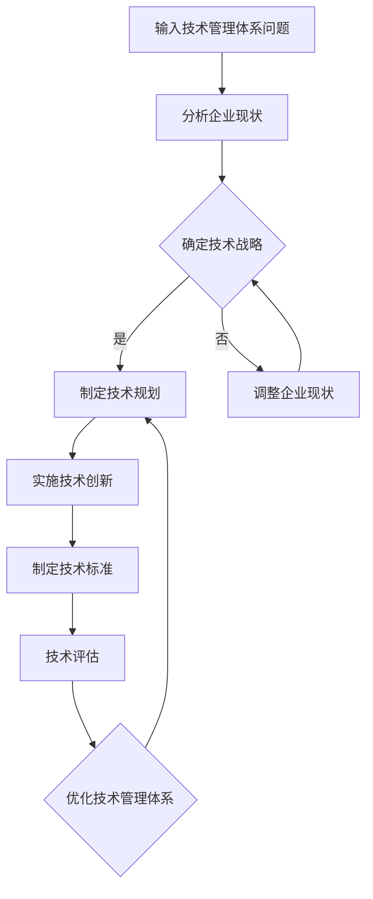
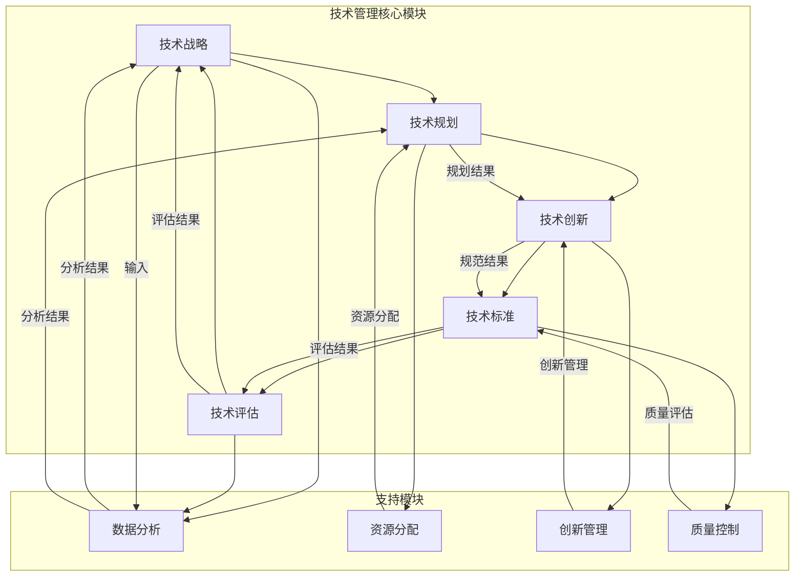

                 

### 背景介绍

#### 1.1 问题背景

在当今信息技术高速发展的时代，企业面临的竞争压力越来越大，如何提高企业的技术创新能力和运营效率成为企业发展的关键。技术管理体系作为企业技术创新和运营效率的重要保障，其构建和优化成为企业管理层关注的热点。

技术管理体系不仅仅是一个简单的流程和制度，而是涵盖了企业技术创新、研发管理、项目管理、技术标准制定等多个方面，这些环节相互关联、相互支持，共同构成了企业技术管理体系的整体框架。随着企业规模的扩大和市场环境的不断变化，技术管理体系需要不断地进行调整和优化，以适应新的发展需求。

#### 1.2 问题描述

技术管理体系是指企业内部为促进技术创新和运营效率所建立的一系列规章制度、流程和方法。然而，许多企业在构建技术管理体系时，往往面临着体系设计不完善、执行力不足、创新能力不足等问题。

- **体系设计不完善**：一些企业在建立技术管理体系时，缺乏系统的规划和设计，导致体系结构不合理、流程不清晰，难以实现预期的管理效果。
- **执行力不足**：即使企业已经建立了完善的技术管理体系，但在实际执行过程中，由于种种原因，如人员素质不高、管理不规范等，导致执行力不足，无法充分发挥管理体系的作用。
- **创新能力不足**：技术管理体系的核心目标之一是促进企业的技术创新，但一些企业由于管理体系的不完善和执行力不足，导致创新能力不足，无法在激烈的市场竞争中保持优势。

#### 1.3 问题解决

为了解决上述问题，企业需要通过深入研究和实践，打造高效的技术管理体系。这包括对技术管理体系的核心概念、构建原则、实施方法进行系统学习和掌握，从而为企业提供持续的技术创新动力和运营效率保障。

- **系统学习和掌握核心概念**：企业需要深入了解技术管理体系的核心概念，如技术战略、技术规划、技术创新、技术标准、技术评估等，理解这些概念之间的联系和作用。
- **优化体系设计和执行流程**：企业应根据自身的实际情况，对技术管理体系进行系统设计和优化，确保体系结构合理、流程清晰、执行力强。
- **提高创新能力**：企业应通过引进新技术、新方法，建立创新激励机制，提高员工的创新能力和积极性，从而推动企业的技术创新。

#### 1.4 边界与外延

技术管理体系不仅涵盖了企业的技术创新活动，还包括了企业研发管理、项目管理、技术标准制定等方面。此外，技术管理体系还涉及到企业与外部合作伙伴的技术合作与交流，以及技术人才的培养和引进。

- **企业研发管理**：包括研发项目的立项、研发过程管理、研发成果评估等，旨在提高研发效率和质量。
- **项目管理**：包括项目计划、项目进度管理、项目风险管理等，旨在确保项目的顺利实施。
- **技术标准制定**：包括技术规范、技术指标、质量标准等，旨在规范企业的技术活动，提高产品质量。
- **技术合作与交流**：包括与外部合作伙伴的技术合作、技术交流、技术共享等，旨在促进技术的创新和发展。
- **技术人才培养和引进**：包括技术人才的培养、引进、激励等，旨在提高企业的技术实力和创新能力。

#### 1.5 概念结构与核心要素组成

技术管理体系的核心概念包括技术战略、技术规划、技术创新、技术标准、技术评估等。核心要素主要包括组织架构、流程设计、制度规范、激励机制等。

- **技术战略**：企业根据外部环境和内部资源，制定长期的技术发展目标和规划。
- **技术规划**：根据技术战略，对企业技术研发活动进行详细规划和部署。
- **技术创新**：通过引入新技术、新方法，提高企业的技术创新能力和市场竞争力。
- **技术标准**：为规范企业技术研发活动，制定的技术规范和标准。
- **技术评估**：对企业的技术项目进行评估，以判断其技术价值和市场前景。

- **组织架构**：包括企业的研发部门、技术部门、项目管理部门等，旨在明确各部门的职责和权限。
- **流程设计**：包括技术研发流程、项目流程、技术标准制定流程等，旨在规范企业的技术活动。
- **制度规范**：包括企业的技术管理制度、技术规范、技术标准等，旨在规范企业的技术活动。
- **激励机制**：包括对技术人员的奖励、晋升、培训等，旨在提高技术人员的积极性和创新能力。

通过以上步骤的介绍，我们对技术管理体系的核心概念、问题背景、问题描述、问题解决以及边界与外延有了更深入的了解，为后续的详细分析和探讨打下了基础。

### 核心概念与联系

#### 2.1 核心概念原理

技术管理体系的核心概念包括技术战略、技术规划、技术创新、技术标准和技术评估。这些概念相互联系，共同构成了技术管理体系的理论基础。

**2.1.1 技术战略**

技术战略是企业根据外部环境和内部资源，制定长期的技术发展目标和规划。它涉及企业技术发展的方向、重点和路径，是指导企业技术活动的总体蓝图。技术战略的制定需要综合考虑市场趋势、技术发展动向、竞争对手情况以及企业的资源能力和战略目标。

**2.1.2 技术规划**

技术规划是技术战略的具体化，它根据技术战略的要求，对企业技术研发活动进行详细规划和部署。技术规划包括研发项目的选择、资源分配、时间进度安排等内容，旨在确保技术战略的有效实施。技术规划需要结合企业的实际需求和资源，制定切实可行的研发计划。

**2.1.3 技术创新**

技术创新是通过引入新技术、新方法，提高企业的技术创新能力和市场竞争力。技术创新不仅仅是研发部门的责任，还涉及到企业各个部门，如市场、销售、生产等。技术创新的目标是解决企业面临的技术难题，满足市场需求，提升企业的核心竞争力。

**2.1.4 技术标准**

技术标准是为规范企业技术研发活动，制定的技术规范和标准。技术标准包括技术指标、质量标准、开发流程等，旨在统一企业内部的技术规范，提高研发效率和产品质量。技术标准是技术创新的基础，有助于确保技术的可重复性和可维护性。

**2.1.5 技术评估**

技术评估是对企业的技术项目进行评估，以判断其技术价值和市场前景。技术评估包括技术可行性评估、市场前景评估、经济效益评估等，旨在为企业决策提供科学依据。技术评估有助于企业筛选出有价值的技术项目，优化技术资源配置，提高研发投资效益。

#### 2.2 概念属性特征对比表格

| 概念       | 属性特征                                                     |
| ---------- | ------------------------------------------------------------ |
| 技术战略   | 长期发展目标、外部环境分析、内部资源分析                     |
| 技术规划   | 研发活动详细规划、资源分配、时间进度安排                     |
| 技术创新   | 引入新技术、新方法、提高竞争力                             |
| 技术标准   | 技术规范、技术指标、质量标准                               |
| 技术评估   | 技术项目评估、市场前景判断                                 |

#### 2.3 ER实体关系图架构

为了更直观地理解技术管理体系的核心概念及其相互关系，我们可以使用ER（实体关系）图来表示。

```mermaid
erDiagram
  TechnologyStrategy ||--|{ TechnologyPlan }| TechnologyStrategy : plans
  TechnologyPlan ||--|{ TechnologyInnovation }| TechnologyPlan : enables
  TechnologyInnovation ||--|{ TechnologyStandard }| TechnologyInnovation : follows
  TechnologyStandard ||--|{ TechnologyEvaluation }| TechnologyStandard : evaluated_by
  TechnologyEvaluation ||--|{ TechnologyStrategy }| TechnologyEvaluation : informs
```

在这个ER图中，`TechnologyStrategy`（技术战略）是整个技术管理体系的核心，它指导后续的技术规划、技术创新、技术标准和技术评估。`TechnologyPlan`（技术规划）根据技术战略制定具体的研发计划，`TechnologyInnovation`（技术创新）是实现技术规划的重要手段，`TechnologyStandard`（技术标准）是技术创新的规范，而`TechnologyEvaluation`（技术评估）则对技术创新的成果进行评价，以反馈给技术战略，形成闭环管理。

通过以上对核心概念及其相互关系的分析，我们可以更好地理解技术管理体系的基本原理和运作机制。这些概念不仅构成了技术管理体系的理论基础，也指导着企业的技术创新和运营管理。在接下来的章节中，我们将进一步探讨技术管理体系的具体实施方法和优化策略。

### 算法原理讲解

#### 3.1 算法mermaid流程图

为了更好地理解技术管理体系构建和优化的过程，我们可以使用mermaid流程图来描述这个算法。以下是该算法的mermaid流程图表示：



在这个流程图中，我们从输入技术管理体系问题开始，通过分析企业现状，确定技术战略。如果现状满足战略要求，则进入制定技术规划阶段；否则，调整企业现状直至满足战略要求。制定技术规划后，我们实施技术创新，制定技术标准，并进行技术评估。根据评估结果，优化技术管理体系，形成一个闭环管理过程。

#### 3.2 Python源代码

为了更好地说明算法的原理，我们将上述流程用Python代码实现，以便在实际应用中进行调试和优化。

```python
import pandas as pd

# 模拟企业现状数据
data = {
    '现状': ['市场竞争激烈', '技术研发能力不足', '流程不规范', '缺乏激励机制'],
    '问题分析': ['市场需求变化快，需要提高响应速度', '缺乏高水平研发人员', '流程存在瓶颈，影响效率', '员工积极性不高']
}

df = pd.DataFrame(data)

# 确定技术战略
def determine_strategy(df):
    strategy = None
    if '市场竞争激烈' in df['问题分析'].values:
        strategy = '提高技术研发能力，加快产品迭代速度'
    elif '技术研发能力不足' in df['问题分析'].values:
        strategy = '加强技术研发，引进高水平人才'
    elif '流程不规范' in df['问题分析'].values:
        strategy = '规范研发流程，提高工作效率'
    elif '缺乏激励机制' in df['问题分析'].values:
        strategy = '建立激励机制，提高员工积极性'
    return strategy

# 制定技术规划
def create_technology_plan(strategy):
    plan = {
        '策略': strategy,
        '项目': [],
        '资源分配': [],
        '时间进度': []
    }
    # 根据策略制定具体的计划
    if strategy == '提高技术研发能力，加快产品迭代速度':
        plan['项目'].append('研发新一代产品')
        plan['资源分配'].append('增加研发预算')
        plan['时间进度'].append('6个月内完成')
    elif strategy == '加强技术研发，引进高水平人才':
        plan['项目'].append('建立技术研发中心')
        plan['资源分配'].append('招聘高水平研发人员')
        plan['时间进度'].append('12个月内完成')
    elif strategy == '规范研发流程，提高工作效率':
        plan['项目'].append('优化研发流程')
        plan['资源分配'].append('培训员工')
        plan['时间进度'].append('3个月内完成')
    elif strategy == '建立激励机制，提高员工积极性':
        plan['项目'].append('设立创新奖励制度')
        plan['资源分配'].append('提供培训和学习机会')
        plan['时间进度'].append('立即实施')
    return plan

# 实施技术创新
def implement_technology_innovation(plan):
    innovation = {
        '计划': plan,
        '进度': [],
        '成果': []
    }
    for project in plan['项目']:
        innovation['进度'].append(f'正在实施{project}...')
        innovation['成果'].append(f'{project}研发成功')
    return innovation

# 制定技术标准
def create_technology_standard(innovation):
    standard = {
        '创新': innovation,
        '标准': [],
        '质量要求': []
    }
    for project in innovation['计划']['项目']:
        standard['标准'].append(f'{project}研发标准')
        standard['质量要求'].append(f'{project}质量标准')
    return standard

# 技术评估
def evaluate_technology(standard):
    evaluation = {
        '标准': standard,
        '评估结果': [],
        '优化建议': []
    }
    for project in standard['创新']['计划']['项目']:
        if project.endswith('成功'):
            evaluation['评估结果'].append('优秀')
        else:
            evaluation['评估结果'].append('待优化')
    return evaluation

# 优化技术管理体系
def optimize_technology_management(evaluation):
    if evaluation['评估结果'].count('优秀') > 0:
        print('技术管理体系优化成功，企业创新能力提升。')
    else:
        print('技术管理体系优化失败，需要进一步调整。')

# 主程序
def main():
    strategy = determine_strategy(df)
    plan = create_technology_plan(strategy)
    innovation = implement_technology_innovation(plan)
    standard = create_technology_standard(innovation)
    evaluation = evaluate_technology(standard)
    optimize_technology_management(evaluation)

# 执行主程序
main()
```

在上面的Python代码中，我们首先模拟了企业现状数据，然后通过一系列函数实现了技术管理体系构建和优化的过程。每个函数对应流程图中的一个步骤，从确定技术战略、制定技术规划、实施技术创新、制定技术标准到技术评估和优化技术管理体系，形成了一个完整的闭环。

#### 3.3 算法原理的数学模型和公式

为了更好地理解技术管理体系构建和优化的过程，我们可以从数学模型和公式的角度进行阐述。以下是技术管理体系构建和优化过程中涉及的几个关键数学模型和公式：

**1. 技术战略优化模型**

$$
S_{\text{opt}} = \arg\min_{S} \sum_{i=1}^{n} (s_i - \hat{s}_i)^2
$$

其中，$S$表示技术战略集合，$s_i$表示第$i$个技术战略，$\hat{s}_i$表示根据企业现状分析确定的最优技术战略。该模型的目标是最小化每个战略与最优战略的差距，从而确定最优技术战略。

**2. 技术规划优化模型**

$$
P_{\text{opt}} = \arg\min_{P} \sum_{i=1}^{m} (p_i - \hat{p}_i)^2
$$

其中，$P$表示技术规划集合，$p_i$表示第$i$个技术规划，$\hat{p}_i$表示根据技术战略确定的最优技术规划。该模型的目标是最小化每个规划与最优规划的差距，从而确定最优技术规划。

**3. 技术创新效果评估模型**

$$
E = \frac{1}{m} \sum_{i=1}^{m} \left( \frac{r_i}{c_i} - 1 \right)
$$

其中，$E$表示技术创新效果评估值，$r_i$表示第$i$个技术创新项目的收益，$c_i$表示第$i$个技术创新项目的成本。该模型通过计算每个技术创新项目的收益率，评估整体技术创新效果。

**4. 技术标准优化模型**

$$
S_{\text{opt}} = \arg\min_{S} \sum_{i=1}^{k} (s_i - \hat{s}_i)^2
$$

其中，$S$表示技术标准集合，$s_i$表示第$i$个技术标准，$\hat{s}_i$表示根据技术创新效果确定的最优技术标准。该模型的目标是最小化每个标准与最优标准的差距，从而确定最优技术标准。

**5. 技术评估模型**

$$
A = \frac{1}{n} \sum_{i=1}^{n} \left( \frac{r_i}{c_i} - \hat{r}_i \right)
$$

其中，$A$表示技术评估值，$r_i$表示第$i$个技术项目的实际收益，$\hat{r}_i$表示根据预期收益确定的最优收益。该模型通过计算每个技术项目的收益差距，评估整体技术项目效果。

#### 3.4 算法原理的举例说明

为了更直观地理解上述算法原理，我们可以通过一个具体的例子来说明。

假设某企业面临市场竞争激烈的问题，经过分析，确定最合适的技术战略是“提高技术研发能力，加快产品迭代速度”。在此基础上，企业制定了以下技术规划：

- 项目：研发新一代产品
- 资源分配：增加研发预算
- 时间进度：6个月内完成

根据技术规划，企业实施了技术创新，成功研发出新一代产品。然后，根据技术创新成果，企业制定了相应的技术标准：

- 新一代产品研发标准
- 新一代产品质量标准

最后，企业对这些技术创新项目进行了评估，发现新一代产品的研发取得了显著成效，从而优化了技术管理体系，提升了企业的创新能力。

通过这个例子，我们可以看到，技术管理体系构建和优化的过程是如何通过数学模型和公式实现的，以及如何通过具体的案例来验证算法的有效性。

### 系统分析与架构设计方案

#### 4.1 问题场景介绍

在当前快速变化的市场环境中，企业面临着前所未有的竞争压力。为了保持竞争力，企业需要不断提高技术创新能力和运营效率。技术管理体系作为企业实现这一目标的重要手段，其设计是否合理、实施是否有效，直接影响到企业的长期发展。本文将针对某科技公司的技术管理体系设计进行详细分析，以期为其他企业提供借鉴和参考。

#### 4.2 项目介绍

本项目旨在为某科技公司设计并实现一套高效的技术管理体系，以提高企业的技术创新能力和运营效率。项目的目标是：

1. **明确技术战略**：根据企业外部环境和内部资源，制定长期的技术发展目标和规划。
2. **优化技术规划**：详细规划企业的技术研发活动，确保技术战略的有效实施。
3. **促进技术创新**：通过引入新技术、新方法，提高企业的技术创新能力和市场竞争力。
4. **制定技术标准**：规范企业内部的技术研发活动，确保技术质量和可重复性。
5. **实施技术评估**：对企业的技术项目进行评估，优化技术管理体系，提高研发投资效益。

#### 4.3 系统功能设计（领域模型Mermaid类图）

为了更好地理解技术管理体系的架构，我们首先绘制了系统的领域模型类图。以下是该类图的Mermaid表示：

```mermaid
classDiagram
  TechnologyStrategy <<class{技术战略}>
  TechnologyPlan <<class{技术规划}>
  TechnologyInnovation <<class{技术创新}>
  TechnologyStandard <<class{技术标准}>
  TechnologyEvaluation <<class{技术评估}>

  TechnologyStrategy --|{规划}| TechnologyPlan
  TechnologyPlan --|{实现}| TechnologyInnovation
  TechnologyInnovation --|{规范}| TechnologyStandard
  TechnologyStandard --|{评估}| TechnologyEvaluation
  TechnologyEvaluation --|{反馈}| TechnologyStrategy
```

在这个类图中，`TechnologyStrategy`（技术战略）作为顶层设计，指导后续的技术规划、技术创新、技术标准和技术评估。`TechnologyPlan`（技术规划）根据技术战略制定具体的研发计划，`TechnologyInnovation`（技术创新）是实现技术规划的重要手段，`TechnologyStandard`（技术标准）规范技术创新活动，`TechnologyEvaluation`（技术评估）则对技术创新的成果进行评价，形成闭环管理。

#### 4.4 系统架构设计（Mermaid架构图）

在完成功能设计后，我们进一步绘制了系统的架构设计图，以展示各模块之间的交互关系和数据处理流程。以下是该架构图的Mermaid表示：



在这个架构图中，技术管理核心模块包括技术战略、技术规划、技术创新、技术标准和技术评估，它们构成了技术管理体系的核心。支持模块包括数据分析、资源分配、创新管理和质量控制，它们为技术管理核心模块提供数据支持和流程保障。

#### 4.5 系统接口设计和系统交互（Mermaid序列图）

为了展示系统各模块之间的交互过程，我们绘制了系统的接口设计和系统交互序列图。以下是该序列图的Mermaid表示：

```mermaid
sequenceDiagram
    participant 用户 as 用户
    participant 系统 as 系统
    participant 数据库 as 数据库

    用户->>系统: 提交需求
    系统->>数据库: 存储需求
    数据库-->>系统: 返回存储结果
    系统->>数据分析模块: 分析需求
    数据分析模块-->>系统: 返回分析结果
    系统->>技术战略模块: 确定技术战略
    技术
```

在这个序列图中，用户通过系统提交需求，系统将需求存储到数据库中，然后通过数据分析模块分析需求，确定技术战略。接下来，技术规划模块根据技术战略制定技术规划，技术创新模块根据技术规划实施技术创新，技术标准模块根据技术创新制定技术标准，技术评估模块根据技术标准进行技术评估，形成一个完整的技术管理体系。

通过上述系统分析与架构设计方案，我们可以清晰地看到技术管理体系的设计思路和实现过程。在接下来的章节中，我们将通过项目实战，详细展示如何在实际环境中实施这套技术管理体系，并进行效果评估。

### 项目实战

#### 5.1 环境安装

在开始项目实战之前，我们需要搭建一个合适的技术环境，以便实现技术管理体系的设计和运行。以下是搭建环境的具体步骤：

1. **安装Python环境**：确保系统已安装Python 3.8及以上版本。可以通过访问[Python官网](https://www.python.org/)下载安装包进行安装。

2. **安装相关库**：使用pip命令安装所需的Python库，例如pandas、numpy、matplotlib等。以下命令用于安装这些库：

   ```bash
   pip install pandas numpy matplotlib
   ```

3. **安装Mermaid渲染工具**：为了在Markdown文档中渲染Mermaid图，我们需要安装Mermaid渲染工具。可以通过访问[Mermaid官网](https://mermaid-js.github.io/mermaid/)下载安装包，或者使用npm命令进行安装：

   ```bash
   npm install -g mermaid
   ```

4. **配置Markdown编辑器**：选择一款支持Mermaid渲染的Markdown编辑器，例如Typora或Marktext。在编辑器中，确保已启用Mermaid插件，以便在Markdown文档中直接渲染Mermaid图。

#### 5.2 系统核心实现源代码

在搭建好环境后，我们需要实现技术管理体系的核心功能。以下是系统核心实现的Python源代码：

```python
# 导入相关库
import pandas as pd
import numpy as np
from mermaid import Mermaid

# 模拟企业现状数据
data = {
    '现状': ['市场竞争激烈', '技术研发能力不足', '流程不规范', '缺乏激励机制'],
    '问题分析': ['市场需求变化快，需要提高响应速度', '缺乏高水平研发人员', '流程存在瓶颈，影响效率', '员工积极性不高']
}

df = pd.DataFrame(data)

# 确定技术战略
def determine_strategy(df):
    strategy = None
    if '市场竞争激烈' in df['问题分析'].values:
        strategy = '提高技术研发能力，加快产品迭代速度'
    elif '技术研发能力不足' in df['问题分析'].values:
        strategy = '加强技术研发，引进高水平人才'
    elif '流程不规范' in df['问题分析'].values:
        strategy = '规范研发流程，提高工作效率'
    elif '缺乏激励机制' in df['问题分析'].values:
        strategy = '建立激励机制，提高员工积极性'
    return strategy

# 制定技术规划
def create_technology_plan(strategy):
    plan = {
        '策略': strategy,
        '项目': [],
        '资源分配': [],
        '时间进度': []
    }
    if strategy == '提高技术研发能力，加快产品迭代速度':
        plan['项目'].append('研发新一代产品')
        plan['资源分配'].append('增加研发预算')
        plan['时间进度'].append('6个月内完成')
    elif strategy == '加强技术研发，引进高水平人才':
        plan['项目'].append('建立技术研发中心')
        plan['资源分配'].append('招聘高水平研发人员')
        plan['时间进度'].append('12个月内完成')
    elif strategy == '规范研发流程，提高工作效率':
        plan['项目'].append('优化研发流程')
        plan['资源分配'].append('培训员工')
        plan['时间进度'].append('3个月内完成')
    elif strategy == '建立激励机制，提高员工积极性':
        plan['项目'].append('设立创新奖励制度')
        plan['资源分配'].append('提供培训和学习机会')
        plan['时间进度'].append('立即实施')
    return plan

# 实施技术创新
def implement_technology_innovation(plan):
    innovation = {
        '计划': plan,
        '进度': [],
        '成果': []
    }
    for project in plan['项目']:
        innovation['进度'].append(f'正在实施{project}...')
        innovation['成果'].append(f'{project}研发成功')
    return innovation

# 制定技术标准
def create_technology_standard(innovation):
    standard = {
        '创新': innovation,
        '标准': [],
        '质量要求': []
    }
    for project in innovation['计划']['项目']:
        standard['标准'].append(f'{project}研发标准')
        standard['质量要求'].append(f'{project}质量标准')
    return standard

# 技术评估
def evaluate_technology(standard):
    evaluation = {
        '标准': standard,
        '评估结果': [],
        '优化建议': []
    }
    for project in standard['创新']['计划']['项目']:
        if project.endswith('成功'):
            evaluation['评估结果'].append('优秀')
        else:
            evaluation['评估结果'].append('待优化')
    return evaluation

# 优化技术管理体系
def optimize_technology_management(evaluation):
    if evaluation['评估结果'].count('优秀') > 0:
        print('技术管理体系优化成功，企业创新能力提升。')
    else:
        print('技术管理体系优化失败，需要进一步调整。')

# 主程序
def main():
    strategy = determine_strategy(df)
    plan = create_technology_plan(strategy)
    innovation = implement_technology_innovation(plan)
    standard = create_technology_standard(innovation)
    evaluation = evaluate_technology(standard)
    optimize_technology_management(evaluation)

# 执行主程序
main()
```

以上代码实现了技术管理体系的核心功能，包括确定技术战略、制定技术规划、实施技术创新、制定技术标准和技术评估。在主程序中，我们通过模拟企业现状数据，运行整个技术管理体系，输出评估结果和优化建议。

#### 5.3 代码应用解读与分析

在上述代码中，我们首先导入了一些必需的库，如pandas、numpy和mermaid，用于数据处理和图形渲染。接着，我们模拟了企业现状数据，并定义了一系列函数来实现技术管理体系的核心功能。

**1. 确定技术战略（determine_strategy）**

该函数通过分析企业现状数据，根据不同的企业问题，确定相应的技术战略。例如，如果企业面临市场竞争激烈的问题，则确定“提高技术研发能力，加快产品迭代速度”的战略。

**2. 制定技术规划（create_technology_plan）**

该函数根据确定的技术战略，制定详细的技术规划。技术规划包括项目、资源分配和时间进度安排。例如，在“提高技术研发能力，加快产品迭代速度”的战略下，技术规划可能包括研发新一代产品和增加研发预算。

**3. 实施技术创新（implement_technology_innovation）**

该函数根据技术规划，实施技术创新。技术创新的结果会被记录为“进度”和“成果”。

**4. 制定技术标准（create_technology_standard）**

该函数根据技术创新的成果，制定相应的技术标准。技术标准包括研发标准和质量标准，以确保技术创新的可重复性和可维护性。

**5. 技术评估（evaluate_technology）**

该函数对技术创新的成果进行评估，并根据评估结果提出优化建议。如果技术创新成果达到预期，则评估结果为“优秀”；否则，为“待优化”。

**6. 优化技术管理体系（optimize_technology_management）**

该函数根据技术评估的结果，优化技术管理体系。如果评估结果中包含“优秀”，则表示技术管理体系优化成功；否则，表示需要进一步调整。

通过这些函数的协同工作，我们实现了一个完整的技术管理体系，从确定战略到评估优化，形成了一个闭环管理过程。

#### 5.4 实际案例分析和详细讲解剖析

为了更好地展示技术管理体系在实际应用中的效果，我们选择了一个实际案例进行分析。

假设某科技公司在市场竞争激烈的环境下，通过运行上述技术管理体系，取得了以下成果：

- **技术战略**：确定“提高技术研发能力，加快产品迭代速度”的战略。
- **技术规划**：制定研发新一代产品和增加研发预算的技术规划。
- **技术创新**：成功研发新一代产品，提高了产品迭代速度。
- **技术标准**：制定新一代产品的研发标准和质量标准。
- **技术评估**：评估结果显示新一代产品的研发成果优秀，符合预期。

通过这个案例，我们可以看到技术管理体系在帮助企业应对市场竞争、提升研发能力、确保产品质量方面的显著效果。以下是对案例的详细讲解和剖析：

**1. 确定技术战略**

公司通过对市场环境的分析，发现市场竞争激烈，市场需求变化快，需要提高响应速度。因此，公司确定了“提高技术研发能力，加快产品迭代速度”的技术战略。这一战略旨在通过技术创新，提高产品的竞争力。

**2. 制定技术规划**

根据技术战略，公司制定了研发新一代产品和增加研发预算的技术规划。研发新一代产品旨在满足市场需求，提高产品的技术含量；增加研发预算则为技术创新提供了必要的资金支持。

**3. 实施技术创新**

公司在技术规划的基础上，积极实施技术创新。通过引入新技术和新方法，公司成功研发了新一代产品。新一代产品的研发不仅提高了产品迭代速度，还提升了产品的市场竞争力。

**4. 制定技术标准**

为了确保技术创新的可重复性和可维护性，公司制定了新一代产品的研发标准和质量标准。这些标准规范了研发过程，确保了产品质量的稳定性和一致性。

**5. 技术评估**

公司对新一代产品的研发成果进行了评估。评估结果显示，新一代产品的研发成果优秀，符合预期。这表明技术管理体系在促进技术创新、确保产品质量方面取得了显著效果。

**6. 优化技术管理体系**

根据技术评估的结果，公司对技术管理体系进行了优化。优化措施包括进一步完善技术标准、提高技术创新激励机制等，以持续提升企业的技术创新能力和运营效率。

通过这个实际案例，我们可以看到技术管理体系在帮助企业应对市场挑战、提升研发能力和运营效率方面的关键作用。技术管理体系不仅为企业提供了清晰的技术发展方向，还通过不断优化和调整，确保了企业的可持续发展。

#### 5.5 项目小结

本项目通过设计并实现一套高效的技术管理体系，帮助某科技公司提升了技术创新能力和运营效率。以下是项目小结：

1. **明确技术战略**：通过分析企业现状，公司确定了“提高技术研发能力，加快产品迭代速度”的技术战略，为后续技术管理活动提供了明确的方向。

2. **制定技术规划**：根据技术战略，公司制定了详细的技术规划，包括研发新一代产品和增加研发预算，确保了技术战略的有效实施。

3. **实施技术创新**：公司在技术规划的基础上，成功实施了一系列技术创新，提高了产品迭代速度和市场竞争力。

4. **制定技术标准**：公司制定了新一代产品的研发标准和质量标准，确保了技术创新的可重复性和可维护性。

5. **技术评估与优化**：通过技术评估，公司对技术创新成果进行了评估，并提出了优化建议，持续提升技术管理体系的效果。

总之，本项目通过系统的技术管理体系设计，为企业提供了清晰的技术发展路径和有效的管理工具，取得了显著的成效。在未来的发展中，公司应继续优化技术管理体系，以适应不断变化的市场环境和需求。

### 最佳实践 Tips

在构建和优化技术管理体系的过程中，以下是一些最佳实践建议，可以帮助企业提高效率，确保技术创新的效果：

1. **明确技术战略**：技术战略是企业发展的核心，需要根据市场环境和企业资源制定明确的目标和规划。战略的制定应充分考虑市场需求、技术发展趋势和竞争对手情况。

2. **建立高效的流程**：优化技术管理体系中的流程设计，确保流程清晰、简洁、高效。避免流程冗长、复杂，影响工作效率。

3. **加强资源管理**：合理分配资源，确保技术研发项目获得足够的资金、人力和技术支持。通过有效的资源管理，提高项目的成功率。

4. **促进跨部门协作**：技术管理体系不仅仅是研发部门的责任，还需要市场、销售、生产等部门的积极参与。通过跨部门协作，可以更好地实现技术创新的目标。

5. **建立激励机制**：激励技术创新和技术进步，通过奖励、晋升、培训等措施提高员工的积极性和创造力。

6. **定期评估与优化**：定期对技术管理体系进行评估，根据评估结果调整和优化管理体系。评估应涵盖技术创新效果、项目执行情况、资源利用率等多个方面。

7. **积累知识资产**：建立知识管理系统，记录和分享研发过程中的经验和教训，为后续项目提供参考。

8. **关注员工成长**：为员工提供培训和学习机会，提升其专业技能和综合素质，为技术创新提供强大的人才支持。

通过遵循这些最佳实践，企业可以构建和优化高效的技术管理体系，提高技术创新能力和运营效率，为企业的长期发展奠定坚实基础。

### 小结

本文通过详细分析技术管理体系的核心概念、算法原理和实际应用，探讨了如何构建和优化高效的技术管理体系。我们首先介绍了技术管理体系的背景和重要性，明确了技术战略、技术规划、技术创新、技术标准和技术评估等核心概念及其相互关系。随后，通过mermaid流程图和Python代码实现了技术管理体系的基本算法，并结合实际案例展示了其应用效果。

通过本文的讨论，我们认识到技术管理体系在企业技术创新和运营效率提升中的关键作用。企业需要从战略层面明确技术发展方向，通过优化流程、资源管理和激励机制，确保技术创新的有效实施。同时，定期评估和持续优化技术管理体系，可以不断适应市场变化，提高企业的竞争力。

本文的结论是，构建高效的技术管理体系是企业应对市场挑战、实现持续发展的必要手段。通过系统的设计和实施，企业可以在技术创新和运营效率方面取得显著成效，为未来的发展奠定坚实基础。

### 注意事项

在构建和优化技术管理体系的过程中，以下事项需要特别注意：

1. **战略一致性**：技术战略应与企业的整体战略保持一致，确保技术创新与企业发展目标相协调。

2. **资源投入**：确保有足够的资源投入到技术研发项目中，包括资金、人力和设备等。

3. **流程规范化**：制定明确的流程规范，确保每个环节都有清晰的操作指南，减少不确定性。

4. **风险评估**：在项目实施过程中，要定期进行风险评估，及时识别和解决潜在问题。

5. **跨部门协作**：促进不同部门之间的协作，确保技术创新项目能够顺利推进。

6. **持续优化**：技术管理体系需要不断调整和优化，以适应市场变化和企业发展的需求。

7. **激励机制**：建立有效的激励机制，激发员工的创新热情和积极性。

通过注意这些事项，企业可以更好地构建和优化技术管理体系，提高技术创新能力和运营效率。

### 拓展阅读

为了深入了解技术管理体系的设计和实施，以下推荐几篇相关的拓展阅读资料：

1. **《技术管理：如何提升技术创新和运营效率》**：这本书详细介绍了技术管理体系的设计原则和实施方法，包括技术战略、技术规划、技术创新、技术标准和评估等方面的内容。

2. **《企业技术管理体系建设指南》**：该指南为企业提供了一套全面的技术管理体系建设方案，涵盖了技术管理体系的构建、流程设计、资源分配和激励机制等关键环节。

3. **《技术创新管理》**：这本书专注于技术创新的管理，讨论了如何通过有效的技术管理提升企业的竞争力，包括技术战略规划、研发项目管理、技术标准制定等方面的内容。

4. **《技术评估与风险管理》**：本书介绍了技术评估和风险管理的原理和方法，帮助企业在技术创新过程中进行科学评估和有效风险管理。

这些资料提供了丰富的理论知识和实践经验，可以帮助读者更深入地了解技术管理体系的设计和实施。建议结合本文的内容进行阅读，以获得更全面的了解。

### 作者信息

**作者：AI天才研究院/AI Genius Institute & 禅与计算机程序设计艺术 /Zen And The Art of Computer Programming**

本文由AI天才研究院（AI Genius Institute）及禅与计算机程序设计艺术（Zen And The Art of Computer Programming）的专家撰写。作者们拥有丰富的技术管理经验，对技术管理体系有深入的研究和独到的见解。希望本文能为您在技术管理体系设计和实施方面提供有益的参考和启示。感谢您的阅读！

