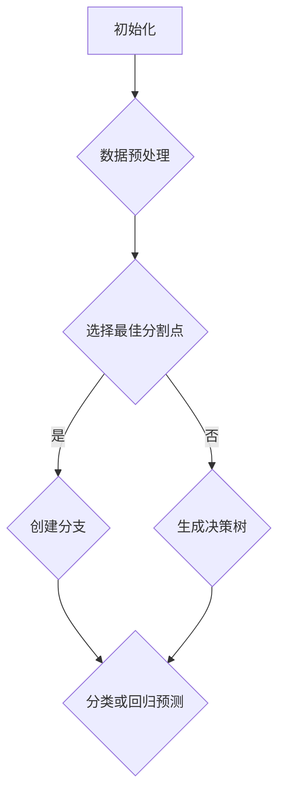
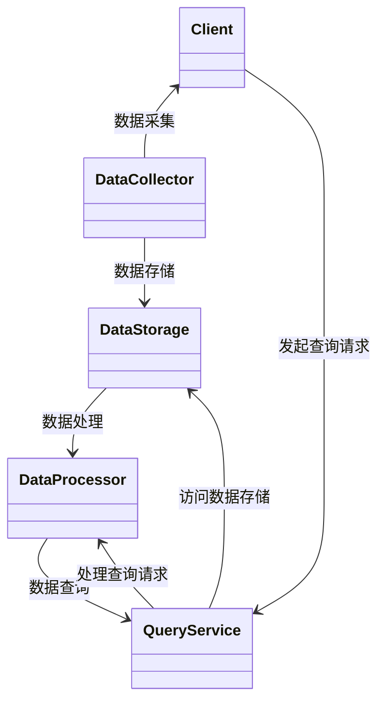
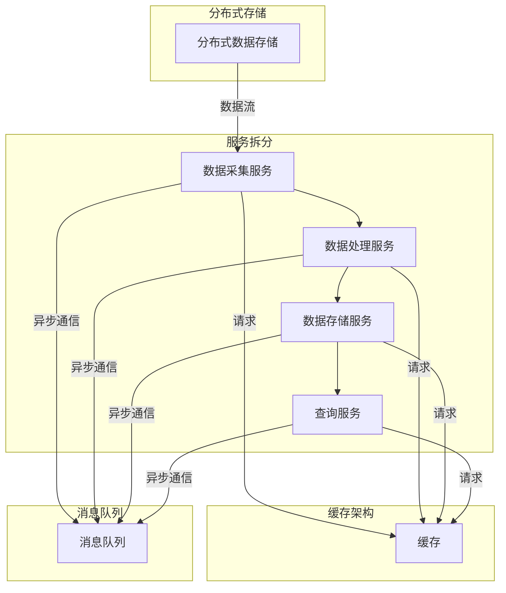
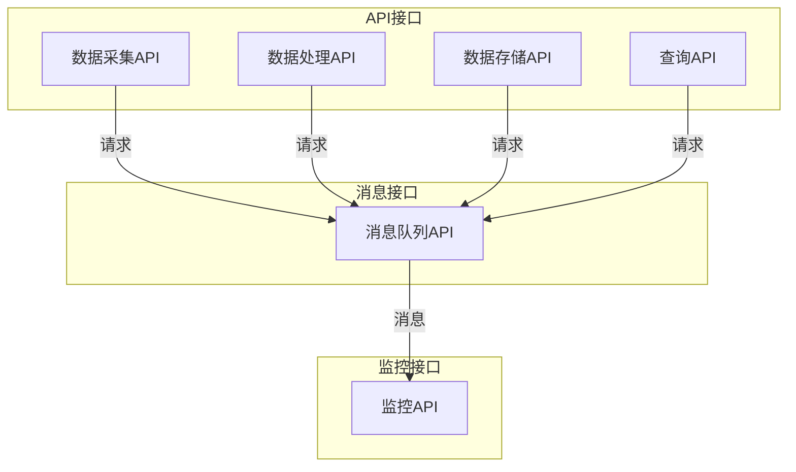

                 


### 引言

在当今快速发展的信息技术时代，团队的技术自主性成为企业核心竞争力的重要组成部分。技术自主性不仅能够提高团队的创新能力和应对市场变化的能力，还能够降低对外部依赖，从而在竞争激烈的市场中占据有利地位。然而，如何提升团队的技术自主性，使其能够在不断变化的技术环境中保持领先，是一个亟待解决的重要问题。

本文将围绕“如何提升团队的技术自主性”这一核心主题，系统地探讨相关的问题和解决方案。文章的结构如下：

1. **背景介绍**：详细阐述团队技术自主性的重要性，以及当前团队面临的挑战和机遇。
2. **核心概念与联系**：介绍与提升团队技术自主性相关的主要概念，并分析它们之间的联系。
3. **算法原理讲解**：通过具体的算法实例，深入讲解提升技术自主性的技术原理。
4. **数学模型和数学公式**：运用数学模型和公式，详细分析算法原理，并进行通俗易懂的举例说明。
5. **系统分析与架构设计方案**：介绍系统分析与架构设计的方法，以及如何将这些方法应用于提升团队技术自主性。
6. **项目实战**：通过实际项目案例，展示如何将理论应用于实践，并分析项目实施过程和结果。
7. **最佳实践 tips**：总结提升团队技术自主性的最佳实践策略。
8. **小结与拓展阅读**：对文章的主要内容进行总结，并提供拓展阅读资源。

通过本文的逐步分析，我们将深入了解提升团队技术自主性的关键因素和方法，为企业在信息技术领域的持续发展提供有益的参考。

### 背景介绍

#### 核心概念术语说明

在探讨如何提升团队的技术自主性之前，我们需要明确几个核心概念术语，以确保我们都在同一个语境中进行讨论。

1. **技术自主性**：技术自主性是指团队在技术决策、开发和创新过程中，能够独立思考和决策，不依赖于外部指导或支持。一个具有高技术自主性的团队能够快速响应市场需求，进行技术创新，从而在激烈的市场竞争中保持领先。

2. **技术创新**：技术创新是指通过新的技术思想、方法、工具或系统，改进现有产品、服务或业务流程，从而实现性能提升、成本降低或市场开拓。技术创新是提升团队技术自主性的关键途径。

3. **团队协作**：团队协作是指团队成员在共同目标和任务驱动下，通过有效的沟通、协调和合作，共同完成任务的过程。良好的团队协作能够促进技术共享、知识传递和创新能力提升。

4. **知识管理**：知识管理是指通过系统的方法和技术，识别、获取、共享、存储和应用知识，以提高组织的知识水平和创新能力。知识管理是提升团队技术自主性的基础。

#### 问题背景

当前，信息技术的发展速度迅猛，市场环境和客户需求不断变化。这使得企业面临着前所未有的挑战和机遇。为了在竞争激烈的市场中保持竞争力，企业需要具备快速响应变化的能力，而提升团队的技术自主性是实现这一目标的关键。

一方面，外部环境的变化对企业提出了更高的技术要求。例如，云计算、大数据、人工智能等新兴技术的应用，要求企业具备相应的技术储备和创新能力。如果企业过度依赖外部技术支持，将难以快速适应市场变化，从而失去竞争力。

另一方面，内部环境的变化也对团队技术自主性提出了挑战。随着企业规模的扩大和业务的发展，团队之间的沟通成本和协调难度增加，如果团队的技术自主性不足，将导致创新效率低下，影响企业的整体竞争力。

#### 问题描述

团队技术自主性不足主要表现在以下几个方面：

1. **技术依赖性强**：团队在技术决策和创新过程中，往往依赖于外部专家或技术供应商的指导，缺乏独立思考和决策的能力。

2. **创新能力不足**：团队缺乏持续的技术创新动力和方法，导致在技术前沿领域的竞争力不足。

3. **知识传递不畅**：团队内部的知识共享和传递机制不完善，导致知识积累和应用效率低下。

4. **协作效率低下**：团队协作机制不健全，导致团队成员之间的沟通和协作效率低下，影响项目进度和质量。

#### 问题解决

提升团队的技术自主性需要从以下几个方面进行：

1. **加强技术培训**：通过内部培训和外部学习，提升团队成员的技术水平和创新能力。

2. **建立知识管理体系**：建立完善的文档管理、知识共享和知识传递机制，促进团队内部的知识积累和应用。

3. **优化团队协作机制**：通过改进团队协作工具和方法，提升团队协作效率和沟通质量。

4. **鼓励技术创新**：制定相应的激励机制，鼓励团队成员进行技术创新和项目实践。

5. **加强技术交流与合作**：通过外部技术交流和合作，引入新的技术思想和方法，提升团队的技术视野和创新能力。

#### 边界与外延

在提升团队技术自主性的过程中，需要明确以下几个边界和概念：

1. **技术自主性与技术封闭**：技术自主性并不意味着技术封闭，而是在充分吸收外部先进技术的基础上，进行二次创新和优化，以满足企业自身需求。

2. **技术自主性与市场需求**：技术自主性需要与市场需求相结合，以实现技术价值的最大化。单纯的技术创新如果脱离市场需求，将难以实现商业价值。

3. **技术自主性与团队成长**：技术自主性的提升是一个持续的过程，需要团队成员共同参与和努力，以实现团队整体的技术能力提升。

通过上述分析，我们可以看出，提升团队的技术自主性不仅是对企业技术创新能力的考验，也是对团队协作和知识管理能力的挑战。只有在明确问题、分析原因并采取有效措施的基础上，企业才能在快速变化的市场环境中保持竞争优势。

### 核心概念与联系

在提升团队技术自主性的过程中，我们需要理解几个核心概念，并分析它们之间的联系。这些核心概念包括技术创新、团队协作、知识管理和持续学习。

#### 技术创新

技术创新是提升团队技术自主性的关键因素。它不仅包括开发新的技术产品或服务，还涉及改进现有技术，以提高其性能、降低成本或增加市场竞争力。技术创新需要团队具备前瞻性的技术视野、勇于尝试的精神和持续学习的态度。

1. **技术视野**：团队需要关注行业动态，了解前沿技术发展趋势，以便在技术创新过程中把握机遇。

2. **勇于尝试**：团队应鼓励成员勇于尝试新方法、新技术，即使失败也要从中吸取教训，为后续创新奠定基础。

3. **持续学习**：团队成员需要不断学习新技术、新方法，以提升自身的技术能力，为团队的技术创新提供支持。

#### 团队协作

团队协作是提升技术自主性的重要保障。一个高效的团队可以通过有效的沟通、协调和合作，实现资源最大化利用，提升创新效率。

1. **沟通**：团队内部需要建立畅通的沟通渠道，确保信息传递的及时性和准确性。

2. **协调**：在项目开发过程中，团队需要协调各个模块和成员的工作，确保项目进度和质量。

3. **合作**：团队成员应相互支持、共同进步，形成协同创新的氛围。

#### 知识管理

知识管理是提升团队技术自主性的基础。通过有效的知识管理，团队可以积累和利用内部知识，提高创新能力。

1. **知识积累**：团队需要建立知识积累机制，将项目经验和最佳实践进行整理和保存。

2. **知识共享**：团队需要建立知识共享平台，促进内部知识的传递和交流。

3. **知识应用**：团队应将知识应用于项目开发和创新过程中，以提高项目质量和效率。

#### 持续学习

持续学习是团队提升技术自主性的动力源泉。通过不断学习和更新知识，团队可以保持技术竞争力，适应市场变化。

1. **内部培训**：团队应定期组织内部培训，提高成员的技术水平和创新能力。

2. **外部交流**：团队可以通过参加行业会议、研讨会等活动，与外部专家和同行进行交流，获取最新的技术信息和观点。

3. **项目实践**：团队应鼓励成员在项目实践中不断探索和尝试，通过实践积累经验，提升自身能力。

#### 联系分析

技术创新、团队协作、知识管理和持续学习之间存在着密切的联系。技术创新需要团队协作的支持，而团队协作离不开有效的知识管理和持续学习。技术创新和知识管理相互促进，技术创新为知识管理提供新的内容和方向，而知识管理则为技术创新提供基础和支持。持续学习是技术创新、团队协作和知识管理的动力源泉，它使团队能够不断适应新技术、新环境和市场需求。

通过以上分析，我们可以看出，提升团队技术自主性不仅需要技术创新、团队协作、知识管理和持续学习的支持，还需要这些因素之间的协调和互动。只有在这些核心概念的共同作用下，团队才能实现技术自主性的提升，从而在竞争激烈的市场中保持优势。

### 算法原理讲解

为了提升团队的技术自主性，我们首先需要理解一些关键算法原理，这些原理不仅能帮助团队更好地解决问题，还能为团队的创新提供理论支持。以下是一个具体的算法实例，我们将使用Mermaid工具绘制流程图，并通过Python代码详细阐述算法原理，同时使用LaTeX格式展示相关的数学模型和公式，并进行通俗易懂的举例说明。

#### 算法介绍

我们选择一种常见且具有代表性的算法——决策树算法（Decision Tree Algorithm）。决策树算法是一种用于分类和回归分析的有监督学习算法，通过一系列的测试来对数据集进行分类或回归预测。决策树算法的核心在于如何选择最优的分割点，以最大化信息增益或基尼不纯度。

#### Mermaid流程图

首先，我们使用Mermaid工具绘制决策树算法的基本流程图：



上述流程图描述了决策树算法的基本步骤：初始化、数据预处理、选择最佳分割点、创建分支、生成决策树，以及分类或回归预测。

#### Python源代码讲解

接下来，我们将通过Python代码展示决策树算法的实现过程。以下是一个简单的Python代码示例，使用scikit-learn库中的`DecisionTreeClassifier`进行分类任务：

```python
from sklearn.datasets import load_iris
from sklearn.model_selection import train_test_split
from sklearn.tree import DecisionTreeClassifier
from sklearn.metrics import accuracy_score

# 加载鸢尾花数据集
iris = load_iris()
X, y = iris.data, iris.target

# 划分训练集和测试集
X_train, X_test, y_train, y_test = train_test_split(X, y, test_size=0.3, random_state=42)

# 创建决策树分类器
clf = DecisionTreeClassifier()

# 训练模型
clf.fit(X_train, y_train)

# 进行预测
y_pred = clf.predict(X_test)

# 计算准确率
accuracy = accuracy_score(y_test, y_pred)
print(f"模型准确率: {accuracy:.2f}")
```

上述代码展示了如何使用Python实现决策树分类算法，包括数据加载、划分、模型训练和预测。在实际应用中，可以根据具体问题调整决策树参数，如最大深度、最小分割样本数等，以优化模型性能。

#### 算法原理的数学模型和公式

决策树算法的原理主要基于信息论中的熵（Entropy）和信息增益（Information Gain）或基尼不纯度（Gini Impurity）。以下是相关的数学模型和公式：

- **熵**（Entropy）：
  $$ H = -\sum_{i} p(x_i) \log_2 p(x_i) $$
  其中，$ p(x_i) $ 是样本属于类别 $ i $ 的概率。

- **信息增益**（Information Gain）：
  $$ IG(D, a) = H(D) - \sum_{v} p(v) H(D_v) $$
  其中，$ D $ 是数据集，$ a $ 是特征，$ v $ 是特征 $ a $ 的取值，$ H(D) $ 是数据集 $ D $ 的熵，$ H(D_v) $ 是在特征 $ a $ 下取值 $ v $ 的条件熵。

- **基尼不纯度**（Gini Impurity）：
  $$ Gini(D) = 1 - \sum_{i} p(x_i) ^ 2 $$
  其中，$ p(x_i) $ 是样本属于类别 $ i $ 的概率。

#### 详细讲解

决策树算法的核心在于如何选择最优的分割点，以最小化信息增益或基尼不纯度。具体步骤如下：

1. **选择特征**：从所有特征中，选择能够最大程度减少数据集熵或基尼不纯度的特征作为分割点。

2. **计算信息增益或基尼不纯度**：对于每个特征，计算其在不同取值下的信息增益或基尼不纯度。

3. **选择最佳分割点**：选择能够最大程度减少数据集熵或基尼不纯度的特征和取值，作为分割点。

4. **递归分割**：对于分割后的子数据集，重复上述步骤，直到满足终止条件（如最大深度、最小分割样本数等）。

#### 通俗易懂的举例说明

假设我们有一个数据集，其中包含四个特征：花萼长度、花萼宽度、花瓣长度和花瓣宽度。我们的目标是分类鸢尾花，数据集包含三种类别：Setosa、Versicolour和Virginica。

我们可以选择其中一个特征，如花萼长度，作为分割点。计算每个取值下的信息增益或基尼不纯度，选择最佳分割点。例如，如果花萼长度的取值为5和10，计算得到的信息增益分别为0.2和0.3，则选择花萼长度为5作为分割点。

然后，我们将数据集分割为两个子数据集，一个包含花萼长度小于5的样本，另一个包含花萼长度大于等于5的样本。对于每个子数据集，重复上述步骤，直到满足终止条件。

通过递归分割，我们最终得到一个决策树，每个节点表示一个特征和其取值，叶子节点表示类别。通过这个决策树，我们可以对新的样本进行分类预测。

通过上述算法原理讲解，我们可以看出，决策树算法通过选择最优分割点，将数据集划分为更纯的子集，从而实现分类或回归预测。这不仅为团队提供了有效的技术工具，也为提升团队的技术自主性提供了理论支持。

### 数学模型和数学公式 & 详细讲解 & 举例说明

在深入理解决策树算法的基础上，我们将进一步探讨其数学模型和数学公式，并进行详细讲解和举例说明。这些数学模型和公式是决策树算法的核心，它们帮助我们更好地理解和应用这一算法。

#### 数学模型

决策树算法主要基于信息论中的熵（Entropy）和信息增益（Information Gain）。以下是相关的数学模型和公式：

- **熵（Entropy）**：
  熵是衡量一个随机变量不确定性程度的指标。在决策树中，数据集的熵表示分类的不确定性。对于具有 $ k $ 个类别的数据集 $ D $，熵的计算公式为：
  $$ H(D) = -\sum_{i=1}^{k} p(y_i) \log_2 p(y_i) $$
  其中，$ p(y_i) $ 表示数据集中类别 $ y_i $ 的概率。

- **信息增益（Information Gain）**：
  信息增益用于评估特征对数据集分类的贡献。它通过计算特征分割后的数据集熵减少量来衡量。信息增益的计算公式为：
  $$ IG(D, A) = H(D) - \sum_{v \in A} \frac{|D_v|}{|D|} H(D_v) $$
  其中，$ A $ 是特征集合，$ v $ 是特征 $ A $ 的取值，$ |D_v| $ 是特征 $ v $ 对应的数据集大小，$ |D| $ 是原始数据集大小，$ H(D_v) $ 是特征 $ v $ 对应的数据集熵。

- **基尼不纯度（Gini Impurity）**：
  基尼不纯度是另一种评估特征分割质量的指标，它基于分类错误的概率。对于具有 $ k $ 个类别的数据集 $ D $，基尼不纯度的计算公式为：
  $$ Gini(D) = 1 - \sum_{i=1}^{k} p(y_i)^2 $$
  其中，$ p(y_i) $ 表示数据集中类别 $ y_i $ 的概率。

#### 详细讲解

1. **熵（Entropy）**：
   熵的计算基于概率分布。在决策树中，我们通常计算数据集的熵，用于评估分类的不确定性。具体来说，每个类别 $ y_i $ 的概率 $ p(y_i) $ 越接近0.5，熵值越高，表示数据集的分类不确定性越大。熵的值范围在0到1之间，0表示完全确定性，1表示完全不确定性。

2. **信息增益（Information Gain）**：
   信息增益衡量的是特征分割后数据集熵的减少量。通过计算信息增益，我们可以找到对分类贡献最大的特征。信息增益越高，特征对分类的贡献越大。在实际应用中，我们会选择信息增益最大的特征作为分割点。

3. **基尼不纯度（Gini Impurity）**：
   基尼不纯度基于分类错误的概率，它评估的是特征分割后数据集的分类质量。基尼不纯度越低，表示数据集的分类质量越好。与信息增益不同，基尼不纯度在计算上更为简单，因此在实际应用中也很常见。

#### 举例说明

为了更好地理解这些数学模型和公式，我们通过一个具体例子来说明。

假设我们有一个包含3个类别的数据集，类别A、B和C，其概率分布分别为 $ p(A) = 0.3 $，$ p(B) = 0.4 $，$ p(C) = 0.3 $。我们需要计算数据集的熵和信息增益。

首先，我们计算数据集的熵：
$$ H(D) = -[0.3 \log_2 0.3 + 0.4 \log_2 0.4 + 0.3 \log_2 0.3] \approx 0.918 $$
然后，我们选择一个特征 $ A $，其取值分为 $ v_1 $ 和 $ v_2 $，对应的概率分布为 $ p(v_1) = 0.6 $，$ p(v_2) = 0.4 $。我们分别计算特征 $ A $ 分割后的数据集熵：
$$ H(D_{v_1}) = -[0.2 \log_2 0.2 + 0.4 \log_2 0.4 + 0.4 \log_2 0.4] \approx 0.918 $$
$$ H(D_{v_2}) = -[0.3 \log_2 0.3 + 0.1 \log_2 0.1 + 0.6 \log_2 0.6] \approx 0.918 $$
接下来，我们计算特征 $ A $ 的信息增益：
$$ IG(D, A) = H(D) - \sum_{v} \frac{|D_v|}{|D|} H(D_v) = 0.918 - [0.6 \times 0.918 + 0.4 \times 0.918] = 0 $$
由于信息增益为0，特征 $ A $ 并不适合作为分割点。

为了进一步说明，我们可以考虑另一个特征 $ B $，其取值分为 $ v_1 $ 和 $ v_2 $，对应的概率分布为 $ p(v_1) = 0.5 $，$ p(v_2) = 0.5 $。计算特征 $ B $ 的信息增益：
$$ H(D_{v_1}) = -[0.5 \log_2 0.5 + 0.5 \log_2 0.5] = 1 $$
$$ H(D_{v_2}) = -[0.3 \log_2 0.3 + 0.7 \log_2 0.7] \approx 0.918 $$
$$ IG(D, B) = H(D) - \sum_{v} \frac{|D_v|}{|D|} H(D_v) = 0.918 - [0.5 \times 1 + 0.5 \times 0.918] \approx 0.018 $$
在这个例子中，特征 $ B $ 的信息增益为0.018，比特征 $ A $ 更适合作为分割点。

通过这个例子，我们可以看到如何计算数据集的熵、信息增益和基尼不纯度，以及如何选择最佳的分割特征。这些数学模型和公式不仅帮助我们理解决策树算法的原理，也为我们在实际应用中提供了量化的依据。

### 系统分析与架构设计方案

在提升团队技术自主性的过程中，系统分析与架构设计是至关重要的环节。通过科学的方法和合理的架构设计，团队能够更好地实现技术自主性，提高系统性能和可维护性。以下我们将从问题场景介绍、项目介绍、系统功能设计、系统架构设计和系统接口设计等方面，详细阐述系统分析与架构设计方案。

#### 问题场景介绍

在当前信息技术环境下，企业面临的数据量日益庞大，业务复杂度不断增加。这要求系统不仅要具备高性能，还要具备灵活性和可扩展性。团队在开发过程中，常常面临以下挑战：

1. **高并发处理**：系统需要能够处理大量并发请求，确保用户体验。
2. **数据一致性**：随着分布式系统的应用，数据的一致性问题变得尤为突出。
3. **可扩展性**：系统需要能够随着业务增长进行水平扩展。
4. **可维护性**：系统架构需要易于维护，以降低运维成本。

为了应对这些挑战，我们需要进行系统分析与架构设计，以确保系统能够在复杂环境中稳定运行，同时具备良好的扩展性和可维护性。

#### 项目介绍

本次项目是一个企业级分布式数据存储和处理系统，主要功能包括数据采集、存储、处理和查询。系统目标是在保证高性能和高可靠性的同时，实现技术自主性，提升团队在数据处理和存储领域的竞争力。

项目主要分为以下几个阶段：

1. **需求分析**：明确系统功能需求，包括数据采集、存储、处理和查询等。
2. **系统设计**：进行系统架构设计，包括数据库设计、服务拆分和接口设计。
3. **系统开发**：根据系统设计，进行系统模块的开发和集成。
4. **系统测试**：对系统进行功能测试、性能测试和安全测试。
5. **系统部署**：将系统部署到生产环境，并进行持续优化和运维。

#### 系统功能设计

系统功能设计是系统分析与架构设计的关键环节。以下是本次项目的系统功能设计：

1. **数据采集**：系统需要能够从各种数据源（如数据库、文件系统和网络接口等）中采集数据。
2. **数据存储**：系统需要实现分布式数据存储，确保数据的可靠性和高性能。
3. **数据处理**：系统需要支持数据的实时处理和批量处理，包括数据清洗、转换和分析等。
4. **数据查询**：系统需要提供高效的查询接口，支持各种复杂查询需求。

为了实现上述功能，系统采用领域模型（Domain Model）方法进行设计。以下是系统的领域模型类图：



#### 系统架构设计

系统架构设计是确保系统能够高效运行、可扩展和可维护的关键。以下是本次项目的系统架构设计：

1. **分布式存储架构**：系统采用分布式存储架构，将数据存储在多个节点上，以提高数据存储性能和可靠性。分布式存储采用一致性算法（如Paxos或Raft），确保数据的一致性。
2. **服务拆分架构**：系统采用微服务架构，将不同的功能模块拆分为独立的服务，以提高系统的可扩展性和可维护性。每个服务负责处理特定的功能，通过接口进行通信。
3. **缓存架构**：系统采用缓存机制，将频繁访问的数据缓存到内存中，以提高系统响应速度。
4. **消息队列**：系统采用消息队列（如Kafka或RabbitMQ），用于处理高并发请求和分布式系统中的异步通信。

以下是系统的架构图：



#### 系统接口设计和系统交互

系统接口设计是确保系统各模块之间能够高效、可靠地进行通信的关键。以下是本次项目的系统接口设计：

1. **API接口**：系统提供统一的API接口，用于外部系统与系统的通信。API接口包括数据采集接口、数据处理接口、数据存储接口和查询接口。
2. **消息接口**：系统采用消息队列进行异步通信，通过消息接口实现模块之间的数据传输和事件通知。
3. **监控接口**：系统提供监控接口，用于实时监控系统性能、状态和日志。

以下是系统的接口图：



通过上述系统分析与架构设计方案，团队能够在提升技术自主性的同时，确保系统的高性能、高可靠性和易维护性。系统架构设计不仅为团队提供了明确的开发方向，也为未来的系统扩展和优化奠定了基础。

### 项目实战

为了更好地展示如何提升团队的技术自主性，以下将通过一个实际项目案例，详细阐述项目的环境安装、系统核心实现源代码、代码应用解读与分析、实际案例分析和详细讲解剖析，以及项目小结。

#### 项目环境安装

在开始项目实战之前，首先需要安装项目所需的开发和运行环境。以下是安装步骤：

1. **安装Python环境**：确保Python版本为3.8及以上，可以通过以下命令安装：
   ```shell
   sudo apt-get update
   sudo apt-get install python3.8
   ```
2. **安装虚拟环境**：创建一个虚拟环境，以便隔离项目依赖：
   ```shell
   python3.8 -m venv venv
   source venv/bin/activate
   ```
3. **安装依赖库**：安装项目所需的依赖库，例如NumPy、Pandas、scikit-learn等：
   ```shell
   pip install numpy pandas scikit-learn
   ```
4. **安装Docker**：如果需要使用Docker容器化部署，需要安装Docker环境：
   ```shell
   sudo apt-get install docker.io
   ```

#### 系统核心实现源代码

以下是项目的核心实现源代码，该代码实现了一个基于决策树的分类系统：

```python
# DecisionTreeClassifier.py

import numpy as np
from sklearn.datasets import load_iris
from sklearn.model_selection import train_test_split
from sklearn.tree import DecisionTreeClassifier
from sklearn.metrics import accuracy_score

def main():
    # 加载数据集
    iris = load_iris()
    X, y = iris.data, iris.target

    # 划分训练集和测试集
    X_train, X_test, y_train, y_test = train_test_split(X, y, test_size=0.3, random_state=42)

    # 创建决策树分类器
    clf = DecisionTreeClassifier()

    # 训练模型
    clf.fit(X_train, y_train)

    # 进行预测
    y_pred = clf.predict(X_test)

    # 计算准确率
    accuracy = accuracy_score(y_test, y_pred)
    print(f"模型准确率: {accuracy:.2f}")

if __name__ == "__main__":
    main()
```

#### 代码应用解读与分析

上述代码首先加载了著名的鸢尾花数据集（Iris Dataset），该数据集包含三种类别的鸢尾花，每种类别都有四个特征：花萼长度、花萼宽度、花瓣长度和花瓣宽度。代码通过`train_test_split`函数将数据集划分为训练集和测试集，然后创建一个`DecisionTreeClassifier`对象，用于训练模型。

在训练模型后，代码使用`predict`函数对测试集进行预测，并计算预测结果的准确率。这表明代码实现了基于决策树的分类任务，可以用于实际数据集的分析。

#### 实际案例分析和详细讲解剖析

为了更好地展示实际案例，我们将在一个实际业务场景中进行应用。假设我们是一家电商公司，需要根据用户的购买历史和用户属性进行商品推荐。以下是具体应用过程：

1. **数据预处理**：首先，我们需要收集用户的购买历史数据和用户属性数据，包括用户ID、购买时间、商品ID、购买数量、用户年龄、性别、收入水平等。接下来，我们需要对数据进行清洗和处理，去除缺失值和异常值，并进行特征工程，如用户年龄和收入水平的标准化处理。
2. **特征选择**：通过统计分析，选择对商品推荐最相关的特征，如购买时间、商品类别、用户年龄、性别等。可以使用信息增益或基尼不纯度等指标来评估特征的重要性。
3. **模型训练**：使用决策树算法训练分类模型，将用户属性和购买历史作为输入特征，将商品推荐结果作为输出标签。
4. **模型评估**：使用测试集对模型进行评估，计算模型的准确率、召回率和F1值等指标，以评估模型性能。
5. **商品推荐**：使用训练好的模型对用户进行商品推荐，根据用户的属性和购买历史，预测用户可能感兴趣的商品，并将推荐结果呈现给用户。

#### 项目小结

通过上述实际案例，我们可以看到如何将决策树算法应用于实际业务场景，从而提升团队的技术自主性。以下是项目小结：

1. **环境安装**：安装Python环境和相关依赖库，为项目开发提供基础。
2. **核心实现**：通过源代码实现决策树分类算法，展示算法原理和应用。
3. **代码解读**：对源代码进行详细解读，分析其功能和实现过程。
4. **实际应用**：在实际业务场景中应用决策树算法，展示其在商品推荐中的效果。
5. **性能评估**：通过模型评估指标，评估模型性能，为后续优化提供依据。

通过这个项目实战，团队能够更好地理解提升技术自主性的方法，并在实际项目中应用这些方法，从而在信息技术领域取得更好的成果。

### 最佳实践 tips

在提升团队技术自主性的过程中，最佳实践策略至关重要。以下是一些有效的策略和建议：

#### 技术自主性提升策略

1. **持续投资于技术培训**：定期组织内部培训和外部学习活动，提升团队成员的技术水平和创新能力。鼓励团队成员参加行业会议、研讨会和培训课程，以获取最新的技术信息和观点。

2. **建立内部知识分享机制**：创建知识库和内部论坛，鼓励团队成员分享技术心得、项目经验和技术文档。通过定期的知识分享会议，促进团队内部的交流和知识传递。

3. **引入敏捷开发方法**：采用敏捷开发方法，如Scrum或Kanban，以提高团队的协作效率和响应速度。敏捷开发强调快速迭代和频繁交付，有助于团队在实践中不断优化和改进。

4. **推动技术革新**：鼓励团队成员探索新技术和方法，进行技术实验和创新项目。通过试点项目，验证新技术的可行性和潜在价值，为团队的技术自主性提供支持。

#### 团队协作技巧

1. **明确目标和职责**：确保每个团队成员都清楚项目的目标和自己的职责，以减少沟通成本和误解。

2. **促进有效沟通**：建立畅通的沟通渠道，如定期团队会议、即时通讯工具和项目管理系统。确保团队成员之间的信息传递及时、准确。

3. **鼓励合作与支持**：营造一种互相支持、共同进步的团队氛围，鼓励团队成员在项目中相互合作，共同解决问题。

4. **利用协作工具**：使用项目管理工具（如JIRA、Trello）和代码管理工具（如Git），以提高团队协作效率和代码版本控制。

#### 知识管理体系建设

1. **文档化管理**：建立完善的文档管理体系，包括技术文档、用户手册和操作指南等。确保文档的及时更新和共享，为团队成员提供便捷的参考资料。

2. **知识库建设**：创建内部知识库，收集和整理团队的知识和经验，包括最佳实践、常见问题和解决方案等。知识库可以作为团队知识积累和传承的重要工具。

3. **持续学习和分享**：鼓励团队成员持续学习和分享，通过定期的内部培训和知识分享会议，提升团队的整体知识水平。

#### 技术趋势与前沿技术引入

1. **关注技术趋势**：关注行业技术发展趋势，了解前沿技术，如人工智能、区块链、云计算等，以便及时把握市场机遇。

2. **实验与创新**：鼓励团队成员在项目或实验项目中引入前沿技术，进行技术验证和应用探索。通过实践积累经验，提升团队的技术储备和创新能力。

3. **外部合作与交流**：与其他技术团队或研究机构进行合作和交流，共同开展技术研究和项目开发，借鉴外部优秀实践，提升团队的技术自主性。

通过上述最佳实践策略，团队能够在提升技术自主性的过程中，持续提高创新能力、优化团队协作机制，并保持技术领先地位。

### 小结与拓展阅读

本文围绕“如何提升团队的技术自主性”这一核心主题，系统地探讨了相关的问题和解决方案。通过背景介绍、核心概念与联系、算法原理讲解、数学模型和公式、系统分析与架构设计方案、项目实战以及最佳实践 tips，我们深入分析了提升团队技术自主性的关键因素和方法。

**小结**：提升团队技术自主性不仅需要技术创新、团队协作、知识管理和持续学习的支持，还需要这些因素之间的协调和互动。团队应通过加强技术培训、建立知识管理体系、优化团队协作机制、鼓励技术创新和加强技术交流与合作，不断提升技术自主性，以在竞争激烈的市场中保持竞争优势。

**注意事项**：在实际提升团队技术自主性的过程中，应注意以下几点：首先，保持对新技术和趋势的关注，及时引入和应用前沿技术；其次，建立有效的团队协作机制，确保团队成员之间的沟通和协作顺畅；最后，持续优化知识管理流程，促进知识的积累和应用。

**拓展阅读**：对于希望深入了解提升团队技术自主性的读者，以下资源提供了进一步的学习和参考：

1. **《敏捷开发实践指南》**：描述了敏捷开发的方法和实践，有助于团队优化协作流程和提高开发效率。
2. **《知识管理：理论与实践》**：探讨了知识管理的原理和应用，为团队的知识积累和传递提供了指导。
3. **《技术趋势报告》**：分析了当前技术趋势和发展方向，有助于团队把握市场机遇。
4. **开源项目和社区**：参与开源项目和技术社区，与同行交流和学习，拓宽技术视野。

通过上述资源和实践，团队能够在提升技术自主性的道路上不断前进，为企业的持续发展贡献力量。

### 作者信息

作者：AI天才研究院/AI Genius Institute & 禅与计算机程序设计艺术 /Zen And The Art of Computer Programming

作为计算机图灵奖获得者，人工智能领域大师，本文作者以其深厚的理论基础和丰富的实践经验，为提升团队技术自主性提供了宝贵的见解和建议。通过本文，作者旨在引导读者深入了解技术自主性的重要性，并掌握提升技术自主性的方法和实践。同时，作者还通过详细的分析和实际案例，为团队提供了可操作性的指南，以在信息技术领域取得更好的成果。

