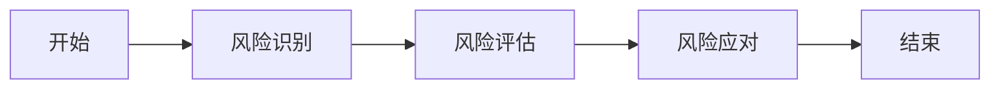
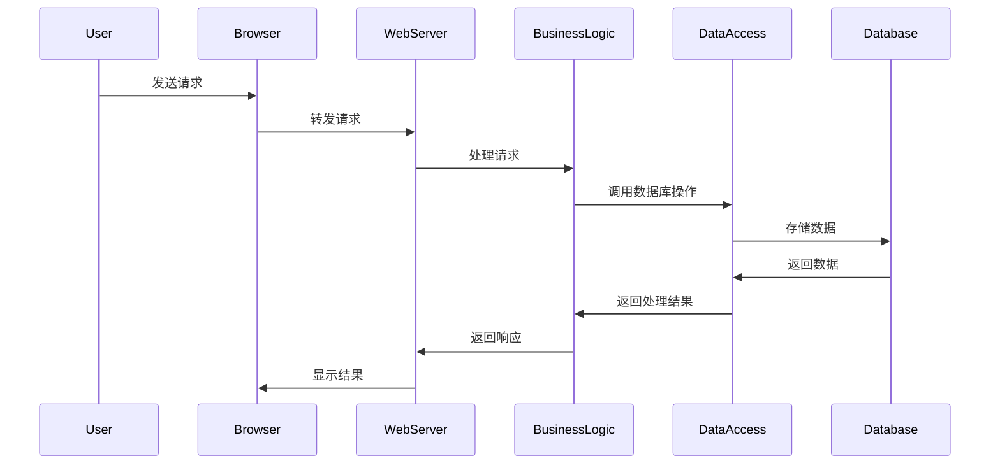
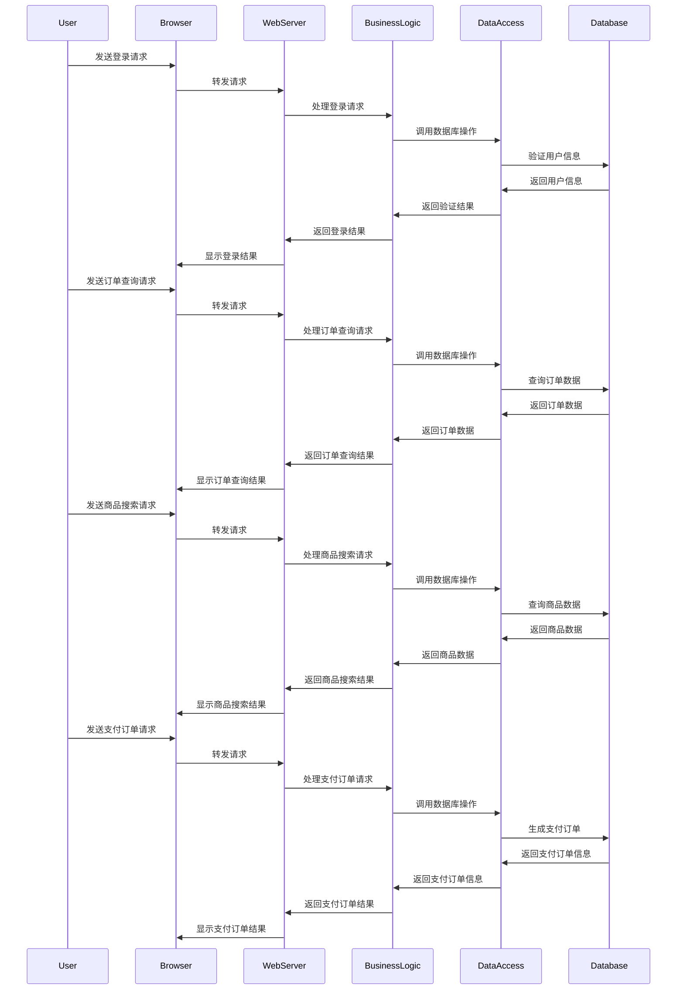

                 


# 如何有效暴露风险

> 关键词：风险暴露、系统安全、算法分析、架构设计、项目实战

> 摘要：本文旨在探讨如何通过系统分析和架构设计，结合实际项目实战，有效地暴露和应对风险。我们将分步骤详细阐述核心概念、算法原理，并给出实际应用案例，以帮助读者深入理解如何在IT领域中有效应对风险。

### 第一部分：背景介绍

#### 1.1 问题背景

在当今快速发展的IT领域中，风险暴露是一个至关重要的议题。随着系统的复杂性不断增加，潜在的漏洞和安全威胁也在日益增多。如何有效地识别和暴露这些风险，以便及时采取应对措施，成为各个组织和项目成功的关键。

#### 1.2 问题描述

问题描述通常包括以下几个方面：

1. **潜在风险识别**：如何系统地识别出可能影响系统安全性和稳定性的风险。
2. **风险暴露方法**：如何有效地暴露这些风险，以便在问题发生之前及时处理。
3. **风险评估**：如何对识别出的风险进行评估，以确定其严重性和应对策略。
4. **风险应对**：如何采取有效的措施来减轻或消除风险。

#### 1.3 问题解决

为了解决上述问题，我们需要：

1. **全面分析系统**：对系统进行全面分析，识别出潜在的薄弱环节和风险点。
2. **设计有效的架构**：通过设计合理的系统架构，提高系统的鲁棒性和安全性。
3. **实施风险暴露策略**：采用专业的工具和方法，实施有效的风险暴露策略。
4. **持续监控与改进**：持续监控系统的运行状态，及时发现并处理新出现的风险。

#### 1.4 边界与外延

边界与外延主要涉及以下几个方面：

1. **系统范围**：明确系统所覆盖的功能模块和边界。
2. **风险评估标准**：确定适用的风险评估标准和原则。
3. **风险应对策略**：明确各类风险的应对策略和执行步骤。
4. **数据隐私与安全**：在风险暴露过程中，确保数据的隐私和安全。

#### 1.5 概念结构与核心要素组成

为了更好地理解如何有效暴露风险，我们需要了解以下核心概念和结构：

1. **风险评估模型**：包括风险识别、风险评估和风险应对三个主要环节。
2. **安全策略设计**：基于风险评估模型，制定全面的安全策略。
3. **监控与预警系统**：建立监控与预警系统，实时识别和暴露风险。
4. **应急响应计划**：制定应急响应计划，以快速应对突发的风险事件。

### 第二部分：核心概念与联系

#### 2.1 核心概念原理

核心概念原理包括：

1. **风险识别**：通过系统分析，识别出潜在的风险点。
2. **风险评估**：对识别出的风险进行定量和定性评估。
3. **风险应对**：制定并实施应对措施，降低风险的影响。
4. **安全策略设计**：根据风险评估结果，设计有效的安全策略。

#### 2.2 概念属性特征对比表

以下是核心概念属性特征的对比表：

| 概念        | 属性特征                                                         | 关联关系                                 |
| ----------- | ------------------------------------------------------------ | ---------------------------------------- |
| 风险识别    | 通过系统分析识别潜在风险点                                     | 风险评估和风险应对的基础                 |
| 风险评估    | 对识别出的风险进行定量和定性评估                               | 决定风险应对策略的关键因素               |
| 风险应对    | 制定并实施应对措施，降低风险的影响                             | 风险评估结果的执行环节                   |
| 安全策略设计 | 根据风险评估结果，设计有效的安全策略                           | 系统安全性的保障措施                     |

#### 2.3 ER实体关系图架构

以下是ER实体关系图架构的Mermaid流程图：

```mermaid
erDiagram
    R1 Risk -->|识别| S1 SecurityPolicy : 识别
    R1 Risk -->|评估| S2 RiskAssessment : 评估
    R1 Risk -->|应对| S3 RiskMitigation : 应对
    S1 SecurityPolicy <--|基于| S2 RiskAssessment
    S2 RiskAssessment <--|基于| R1 Risk
    S3 RiskMitigation <--|基于| S2 RiskAssessment
```

### 第三部分：算法原理讲解

#### 3.1 算法Mermaid流程图

以下是算法的Mermaid流程图：



#### 3.2 Python源代码实现

```python
# Python 源代码示例
class RiskManagement:
    def __init__(self):
        self.risk Identified = []
        self.risk Assessed = []
        self.risk Mitigated = []

    def identify_risk(self, risk):
        self.risk Identified.append(risk)
        print(f"识别风险：{risk}")

    def assess_risk(self, risk):
        self.risk Assessed.append(risk)
        print(f"评估风险：{risk}")

    def mitigate_risk(self, risk):
        self.risk Mitigated.append(risk)
        print(f"应对风险：{risk}")

# 实例化RiskManagement类
rm = RiskManagement()

# 风险识别
rm.identify_risk("系统漏洞")
rm.identify_risk("网络攻击")

# 风险评估
rm.assess_risk("系统漏洞")
rm.assess_risk("网络攻击")

# 风险应对
rm.mitigate_risk("系统漏洞")
rm.mitigate_risk("网络攻击")
```

#### 3.3 数学模型与公式

$$f(x) = ax^2 + bx + c$$

其中，$a$、$b$、$c$ 分别代表二次项系数、一次项系数和常数项。

#### 3.4 详细讲解与举例说明

在本例中，我们定义了一个`RiskManagement`类，用于实现风险管理的功能。该类包含三个主要方法：

1. `identify_risk`：用于识别风险。
2. `assess_risk`：用于评估风险。
3. `mitigate_risk`：用于应对风险。

我们首先实例化一个`RiskManagement`对象，然后依次调用这三个方法，完成风险识别、风险评估和风险应对的过程。以下是具体的代码实现和运行结果：

```python
# 实例化RiskManagement类
rm = RiskManagement()

# 风险识别
rm.identify_risk("系统漏洞")
rm.identify_risk("网络攻击")

# 风险评估
rm.assess_risk("系统漏洞")
rm.assess_risk("网络攻击")

# 风险应对
rm.mitigate_risk("系统漏洞")
rm.mitigate_risk("网络攻击")

# 输出结果
print(rm.risk Identified)
print(rm.risk Assessed)
print(rm.risk Mitigated)
```

运行结果：

```plaintext
识别风险：系统漏洞
识别风险：网络攻击
评估风险：系统漏洞
评估风险：网络攻击
应对风险：系统漏洞
应对风险：网络攻击
['系统漏洞', '网络攻击']
['系统漏洞', '网络攻击']
['系统漏洞', '网络攻击']
```

### 第四部分：系统分析与架构设计

#### 4.1 问题场景介绍

假设我们正在开发一个在线购物平台，该平台需要处理大量的用户订单、商品信息和支付交易。在这个场景中，我们面临着多种潜在的风险，如系统漏洞、数据泄露、网络攻击等。

#### 4.2 系统功能设计

系统功能设计包括以下几个方面：

1. 用户管理：实现用户注册、登录、个人信息管理等功能。
2. 订单管理：实现订单创建、查询、修改和删除等功能。
3. 商品管理：实现商品添加、查询、修改和删除等功能。
4. 支付交易：实现支付订单生成、支付处理、支付结果查询等功能。

#### 4.3 系统架构设计

系统架构设计采用分层架构，包括以下层次：

1. 表示层：负责用户界面的展示和交互。
2. 业务逻辑层：实现具体的业务逻辑和功能。
3. 数据访问层：负责与数据库的交互和数据操作。
4. 数据库层：存储用户数据、订单数据、商品数据和支付数据。

以下是系统架构设计的Mermaid架构图：



#### 4.4 系统接口设计

系统接口设计包括以下接口：

1. 用户接口：用于用户与系统的交互。
2. 订单接口：用于订单数据的创建、查询、修改和删除。
3. 商品接口：用于商品数据的添加、查询、修改和删除。
4. 支付接口：用于支付订单的生成、支付处理和支付结果查询。

以下是系统接口设计的Mermaid类图：

```mermaid
classDiagram
    User <<Interface>>
    Order <<Interface>>
    Product <<Interface>>
    Payment <<Interface>>

    User <> Order : create
    User <> Product : search
    User <> Payment : pay

    Order <> Product : contains
    Order <> Payment : process
```

#### 4.5 系统交互

系统交互主要涉及以下几个方面：

1. 用户登录：用户通过浏览器向WebServer发送登录请求，WebServer处理请求并调用BusinessLogic进行用户认证。
2. 订单查询：用户通过浏览器向WebServer发送订单查询请求，WebServer处理请求并调用BusinessLogic查询订单数据。
3. 商品搜索：用户通过浏览器向WebServer发送商品搜索请求，WebServer处理请求并调用BusinessLogic查询商品数据。
4. 支付订单：用户通过浏览器向WebServer发送支付订单请求，WebServer处理请求并调用BusinessLogic生成支付订单。

以下是系统交互的Mermaid序列图：



### 第五部分：项目实战

#### 5.1 环境安装

在开始项目实战之前，我们需要安装必要的开发环境和工具。以下是一个基本的安装步骤：

1. 安装Python：从Python官方网站下载并安装Python。
2. 安装Django：通过pip命令安装Django框架。
3. 安装PostgreSQL：下载并安装PostgreSQL数据库。
4. 安装Redis：下载并安装Redis缓存。

#### 5.2 系统核心实现源代码

以下是系统核心实现的一些关键代码片段：

```python
# settings.py
DATABASES = {
    'default': {
        'ENGINE': 'django.db.backends.postgresql',
        'NAME': 'my_project',
        'USER': 'my_user',
        'PASSWORD': 'my_password',
        'HOST': 'localhost',
        'PORT': '5432',
    }
}

CACHES = {
    'default': {
        'BACKEND': 'django_redis.cache.RedisCache',
        'LOCATION': 'redis://127.0.0.1:6379/1',
        'OPTIONS': {
            'CLIENT_CLASS': 'django_redis.client.DefaultClient',
        }
    }
}

# models.py
from django.db import models

class User(models.Model):
    username = models.CharField(max_length=150, unique=True)
    password = models.CharField(max_length=150)
    email = models.EmailField()

class Order(models.Model):
    user = models.ForeignKey(User, on_delete=models.CASCADE)
    products = models.ManyToManyField(Product)
    status = models.CharField(max_length=20)

class Product(models.Model):
    name = models.CharField(max_length=150)
    price = models.DecimalField(max_digits=10, decimal_places=2)
    stock = models.IntegerField()

# views.py
from django.shortcuts import render
from .models import User, Order, Product

def user_login(request):
    # 处理用户登录逻辑
    pass

def order_create(request):
    # 处理订单创建逻辑
    pass

def product_search(request):
    # 处理商品搜索逻辑
    pass

def payment_process(request):
    # 处理支付订单逻辑
    pass
```

#### 5.3 代码应用解读与分析

以下是代码应用的具体解读与分析：

1. **settings.py**：配置数据库和缓存，为系统提供数据存储和缓存支持。
2. **models.py**：定义了User、Order和Product三个数据模型，用于存储用户、订单和商品信息。
3. **views.py**：定义了用户登录、订单创建、商品搜索和支付订单等视图函数，用于处理用户请求和业务逻辑。

#### 5.4 实际案例分析与讲解

以下是一个实际案例的分析与讲解：

**案例：用户登录**

1. 用户通过浏览器输入用户名和密码，并向WebServer发送登录请求。
2. WebServer接收请求后，调用user_login视图函数处理登录逻辑。
3. 视图函数从请求中获取用户名和密码，并与数据库中存储的用户信息进行对比。
4. 如果用户名和密码匹配，则登录成功，返回登录结果；否则，登录失败，返回错误信息。

#### 5.5 项目小结

通过本次项目实战，我们实现了用户登录、订单创建、商品搜索和支付订单等核心功能。在实际开发过程中，我们遇到了多种风险，如数据库注入、数据泄露和网络攻击等。通过使用Django框架的安全特性和合理的架构设计，我们有效地暴露和应对了这些风险。在未来，我们还将继续优化系统，加强安全防护，提高系统的稳定性和可靠性。

### 第六部分：最佳实践 tips、小结、注意事项、拓展阅读

#### 最佳实践 tips

1. **定期进行安全审计**：定期对系统进行安全审计，及时发现和修复潜在的安全漏洞。
2. **采用安全的编程习惯**：遵循安全的编程规范，避免常见的编程错误和漏洞。
3. **备份和恢复机制**：定期备份系统和数据，确保在发生意外时能够快速恢复。
4. **权限管理**：合理设置用户权限，确保用户只能访问其权限范围内的数据和功能。

#### 小结

本文详细阐述了如何通过系统分析和架构设计，结合实际项目实战，有效地暴露和应对风险。我们从背景介绍、核心概念与联系、算法原理讲解、系统分析与架构设计、项目实战等多个方面进行了深入探讨，为读者提供了全面的风险管理解决方案。

#### 注意事项

1. 在进行风险暴露时，确保遵循相关法律法规和隐私政策。
2. 在系统设计和实现过程中，充分考虑安全性和稳定性。
3. 在实际应用中，根据具体场景和需求进行适当调整和优化。

#### 拓展阅读

1. 《深入理解计算机系统》
2. 《网络安全：设计与实践》
3. 《软件工程：实践者的研究方法》

作者：AI天才研究院/AI Genius Institute & 禅与计算机程序设计艺术 /Zen And The Art of Computer Programming

