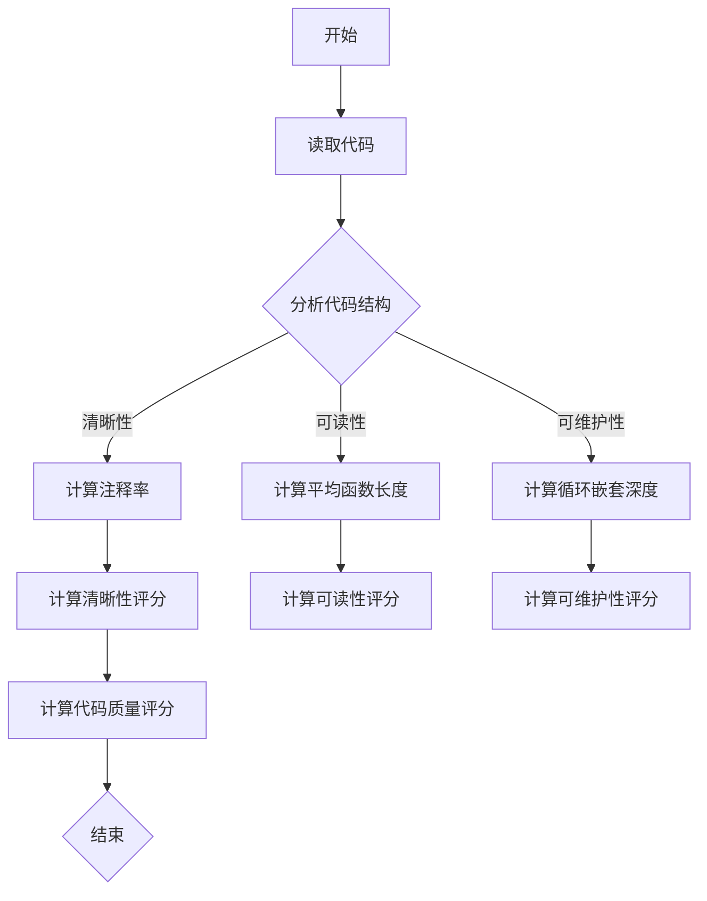
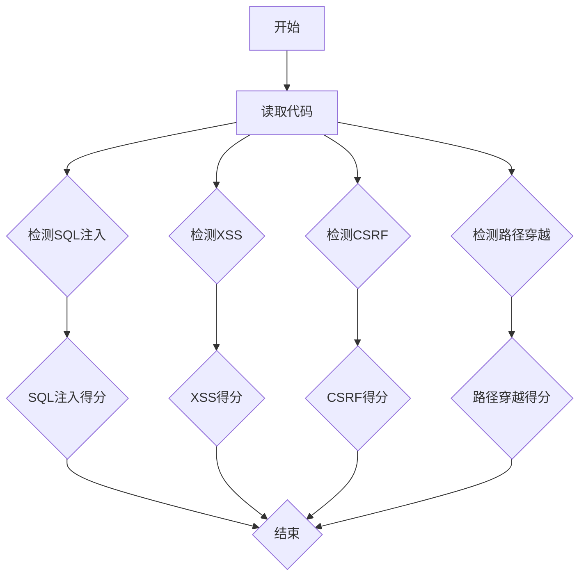
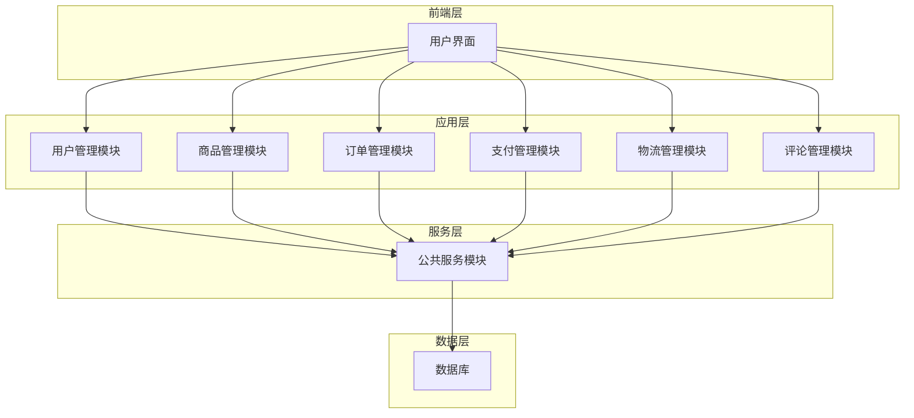
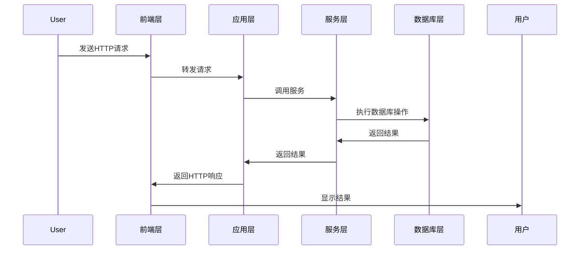

                 


### 目录大纲与内容规划

在编写《如何有效进行技术评审》的文章之前，我们需要首先明确文章的结构，确保内容既丰富又有逻辑性。以下是根据目录大纲进行的内容规划：

#### 第1章: 背景介绍
- **1.1 问题背景**：介绍技术评审的重要性，技术评审在软件工程中的作用。
- **1.2 问题描述**：讨论当前技术评审过程中遇到的主要问题和挑战。
- **1.3 问题解决**：概述如何有效进行技术评审，提供可能的解决方案。
- **1.4 边界与外延**：明确技术评审的范围，讨论其适用场景和限制。
- **1.5 概念结构与核心要素组成**：介绍技术评审的核心概念和基本结构。

#### 第2章: 技术评审基础
- **2.1 核心概念**：详细解释技术评审的关键概念，如评审标准、评审流程、参与者角色等。
- **2.2 技术评审的流程**：描述技术评审的各个阶段和步骤。
- **2.3 技术评审的价值**：分析技术评审对软件开发项目带来的好处。

#### 第3章: 核心概念与联系
- **3.1 核心概念详解**：深入探讨技术评审中的核心概念，如代码质量、技术债务等。
- **3.2 概念属性特征对比表格**：构建对比表格，详细对比不同概念的特性。
- **3.3 ER实体关系图**：使用Mermaid流程图展示技术评审中的实体关系。

#### 第4章: 算法原理讲解
- **4.1 算法A**：详细讲解算法原理，使用Mermaid流程图和Python源代码进行说明。
- **4.2 算法B**：类似4.1节，讲解另一个算法的原理。

#### 第5章: 系统分析与架构设计
- **5.1 问题场景介绍**：设定一个具体的技术评审问题场景。
- **5.2 系统功能设计**：使用Mermaid类图展示系统功能设计。
- **5.3 系统架构设计**：使用Mermaid架构图展示系统架构。
- **5.4 系统接口设计**：详细说明系统接口设计。
- **5.5 系统交互**：使用Mermaid序列图展示系统交互流程。

#### 第6章: 项目实战
- **6.1 环境安装**：描述所需环境安装步骤。
- **6.2 系统核心实现**：展示系统核心实现源代码。
- **6.3 代码应用解读与分析**：分析代码实现，解释关键部分。
- **6.4 实际案例分析与详细讲解剖析**：通过实际案例展示技术评审的应用。
- **6.5 项目小结**：总结项目的成功经验和不足。

#### 第7章: 最佳实践 tips
- **7.1 技术评审技巧**：提供有效进行技术评审的技巧和策略。
- **7.2 小结**：对全书内容进行总结。
- **7.3 注意事项**：列出在进行技术评审时需要注意的问题。
- **7.4 拓展阅读**：推荐相关书籍和文章，供读者进一步学习。

### 格式与要求

在撰写文章时，我们将严格遵守以下格式和要求：

- **文章标题**：使用清晰的标题，准确反映文章内容。
- **文章关键词**：列出5-7个与文章主题密切相关的关键词。
- **文章摘要**：简洁明了地概括文章的核心内容和主题思想。
- **Markdown格式**：使用Markdown格式编写文章，确保格式统一。
- **LaTeX公式**：使用LaTeX格式嵌入数学公式，确保公式清晰可读。
- **作者信息**：在文章末尾附上作者信息。
- **字数要求**：文章字数控制在10000-12000字左右。

### 完整性要求

- **背景介绍**：确保核心概念术语、问题背景、问题描述、问题解决、边界与外延、概念结构与核心要素组成等内容详尽、准确。
- **核心概念与联系**：给出详细的核心概念解释、概念属性特征对比表格和ER实体关系图。
- **算法原理讲解**：使用Mermaid流程图和Python源代码详细阐述算法原理，提供数学模型和公式。
- **系统分析与架构设计**：提供完整的问题场景介绍、系统功能设计、系统架构设计、系统接口设计和系统交互流程。
- **项目实战**：展示技术评审在实际项目中的应用，包括环境安装、系统核心实现、代码分析、实际案例分析等。
- **最佳实践 tips**：提供实用的技巧和策略，总结全文，指出注意事项，推荐拓展阅读。

### 下一步行动

接下来，我们将根据上述内容规划，逐步撰写每章的具体内容，确保文章逻辑清晰、结构紧凑、内容详实。在撰写过程中，将不断审视文章的完整性和准确性，确保最终交付的是一篇高质量的技术博客文章。

---

现在，让我们开始撰写第1章的内容，背景介绍，并逐步推进到后续章节。请随时提供反馈和建议，以确保文章的质量和逻辑性。接下来，我会撰写第1章：背景介绍。

---

### 第1章: 背景介绍

#### 1.1 问题背景

在软件工程领域，技术评审是一种重要的活动，旨在确保软件产品的质量。然而，随着软件系统的复杂性和规模不断增加，技术评审也面临着一系列挑战。首先，评审过程中可能会出现评审标准不一致、评审流程不规范等问题，导致评审效果不理想。其次，参与评审的人员可能缺乏相关技能或经验，无法有效地识别和解决问题。此外，评审过程往往缺乏系统性和持续性，导致技术债务累积，影响项目的长远发展。

#### 1.2 问题描述

当前技术评审过程中存在的问题主要包括以下几个方面：

1. **评审标准不一致**：不同的项目、团队甚至个人可能采用不同的评审标准，导致评审结果无法统一，甚至产生矛盾和争议。
2. **评审流程不规范**：评审流程的不规范会导致评审效率低下，甚至出现漏评、误评的情况。
3. **评审参与人员能力不足**：评审参与人员可能缺乏足够的技术背景或经验，无法全面识别和解决问题。
4. **评审缺乏系统性和持续性**：评审往往被看作是阶段性工作，缺乏长期规划和持续改进的机制。

#### 1.3 问题解决

为了有效解决上述问题，我们需要从以下几个方面入手：

1. **统一评审标准**：制定统一的评审标准和流程，确保评审结果的一致性和公正性。
2. **规范评审流程**：建立规范的评审流程，明确评审的步骤和责任，提高评审效率。
3. **提升评审参与人员能力**：通过培训和经验分享，提升评审参与人员的技术水平和评审能力。
4. **建立评审持续改进机制**：将评审作为持续改进的过程，定期进行评审效果的评估和反思，不断完善评审标准和流程。

#### 1.4 边界与外延

技术评审的边界主要涉及评审的范围和对象。一般来说，技术评审主要关注软件的代码质量、设计架构、安全性、性能等方面。然而，技术评审并不仅限于代码层面，还可以扩展到需求分析、设计文档、测试用例等各个方面。此外，技术评审也可以应用于不同的软件开发阶段，如需求阶段、设计阶段、编码阶段和测试阶段。

#### 1.5 概念结构与核心要素组成

技术评审的核心概念包括评审标准、评审流程、参与者角色和评审结果。其中，评审标准是评审的依据，评审流程是评审的实施过程，参与者角色是评审的执行者，评审结果是评审的最终输出。

- **评审标准**：评审标准是指用于评估软件产品质量的一系列指标和要求。常见的评审标准包括代码质量、设计架构、安全性、性能、可维护性等。
- **评审流程**：评审流程是指评审活动从开始到结束的一系列步骤和规则。通常包括评审计划、准备材料、评审会议、评审报告等环节。
- **参与者角色**：参与者角色是指参与评审的人员及其职责。常见的参与者角色包括评审组长、评审员、被评审者等。
- **评审结果**：评审结果是评审活动的最终输出，通常包括评审发现问题、改进建议和评审结论等。

通过以上内容，我们为后续章节的撰写奠定了基础。接下来，我们将进一步深入探讨技术评审的核心概念、算法原理、系统分析与架构设计等内容，为读者提供全面的技术评审指南。

---

在完成第1章的撰写后，我会继续撰写第2章的内容，深入探讨技术评审的基础知识，包括核心概念、评审流程和评审价值等。请继续提供反馈和建议，以便我们不断优化文章质量。接下来，我会撰写第2章：技术评审基础。

--- 

### 第2章: 技术评审基础

#### 2.1 核心概念

技术评审是软件工程中的一个关键环节，其核心概念包括评审标准、评审流程、参与者角色和评审结果。以下是这些核心概念的详细解释：

**评审标准**：评审标准是评估软件产品质量的基准，通常包括以下几个方面：
- **代码质量**：包括代码的清晰性、可读性、规范性等。
- **设计架构**：评估软件系统的结构设计是否合理、易于维护。
- **安全性**：确保软件系统在运行过程中能够抵御外部攻击和内部威胁。
- **性能**：评估软件系统的响应速度和资源消耗。
- **可维护性**：评估软件系统在未来维护和升级中的便捷性。

**评审流程**：评审流程是指从开始到结束的一系列步骤和规则。一个典型的技术评审流程包括以下几个阶段：
- **评审计划**：确定评审的目标、范围、时间和资源等。
- **准备材料**：准备需要评审的文档和代码，确保评审内容的完整性和准确性。
- **评审会议**：召开评审会议，评审员针对评审材料进行讨论和分析。
- **评审报告**：整理评审发现的问题和改进建议，形成评审报告。
- **跟踪改进**：对评审中发现的问题进行跟踪和解决，确保改进措施得到落实。

**参与者角色**：技术评审的参与者包括评审组长、评审员和被评审者。每个角色的职责如下：
- **评审组长**：负责组织评审活动，协调评审流程，确保评审目标的实现。
- **评审员**：负责对评审材料进行审查和评估，提出问题和改进建议。
- **被评审者**：负责准备评审材料，接受评审意见，并进行相应的改进。

**评审结果**：评审结果是对评审活动的总结和评价，通常包括以下几个方面的内容：
- **发现问题**：列出评审过程中发现的问题，包括技术问题和管理问题。
- **改进建议**：针对发现的问题，提出具体的改进措施和建议。
- **评审结论**：总结评审活动的过程和结果，对评审的总体效果进行评价。

#### 2.2 技术评审的流程

技术评审的流程是一个系统性的过程，它需要遵循一定的步骤和规则，以确保评审的公正性和有效性。以下是技术评审流程的详细步骤：

1. **确定评审目标**：评审目标通常包括评估软件产品的质量、发现潜在的问题和风险、促进团队成员之间的沟通与协作等。

2. **选择评审内容**：根据评审目标，确定需要评审的软件产品部分，包括代码、设计文档、测试用例等。

3. **组建评审团队**：选择合适的评审组长、评审员和被评审者，确保团队成员具备相关技能和经验。

4. **制定评审计划**：制定评审的时间表、地点、议程和评审标准等，确保评审活动有序进行。

5. **准备评审材料**：被评审者需要准备完整的评审材料，包括相关的代码、文档和测试结果等。

6. **召开评审会议**：评审团队召开评审会议，评审员根据评审材料进行审查和讨论，提出问题和建议。

7. **编写评审报告**：评审员需要整理评审发现的问题和改进建议，形成评审报告。

8. **跟踪改进**：被评审者根据评审报告进行改进，评审团队对改进结果进行跟踪和验证。

9. **总结评审活动**：评审组长对评审活动进行总结，评估评审的效果和改进的落实情况。

#### 2.3 技术评审的价值

技术评审在软件开发项目中具有重要的价值，主要体现在以下几个方面：

1. **提高软件质量**：通过评审，可以发现并解决软件中的缺陷和问题，提高软件的质量和可靠性。

2. **降低开发成本**：及时发现和解决问题，可以避免在后期发现问题时进行大规模的返工，降低开发成本。

3. **促进知识共享**：评审过程中，团队成员可以相互学习和交流，促进知识的共享和传播。

4. **提高团队协作效率**：评审可以促进团队成员之间的沟通与协作，提高团队的整体工作效率。

5. **优化开发流程**：通过评审，可以发现开发流程中的不足和问题，为流程优化提供依据。

通过以上内容，我们对技术评审的核心概念、流程和价值有了更深入的了解。在接下来的章节中，我们将进一步探讨技术评审中的算法原理、系统分析与架构设计等内容，为读者提供更全面的技术评审指南。

---

现在，我们已经完成了第2章的撰写，接下来我们将进入第3章：核心概念与联系。这一章节将深入探讨技术评审中的核心概念，并通过概念属性特征对比表格和ER实体关系图来展示这些概念之间的关系。请继续提供反馈和建议，以便我们不断完善文章内容。接下来，我会撰写第3章：核心概念与联系。

---

### 第3章: 核心概念与联系

在技术评审过程中，理解并掌握核心概念是至关重要的。本章将深入探讨技术评审中的核心概念，并通过概念属性特征对比表格和ER实体关系图来展示这些概念之间的关系。

#### 3.1 核心概念详解

**1. 代码质量**：代码质量是软件产品的基础，它涉及到代码的可读性、可维护性、可靠性、性能和安全性等方面。

**2. 设计架构**：设计架构是指软件系统的结构设计，包括模块划分、接口定义、数据流和控制流等。

**3. 安全性**：安全性是软件系统在运行过程中抵御外部攻击和内部威胁的能力，包括身份验证、授权、数据加密等。

**4. 性能**：性能是指软件系统的响应速度和资源消耗，包括CPU、内存、磁盘I/O和网络带宽等。

**5. 可维护性**：可维护性是指软件系统在未来的维护和升级过程中所需的努力和资源，包括代码的清晰性、模块化、文档化和自动化测试等。

**6. 技术债务**：技术债务是指为了短期利益而推迟或规避的长期技术问题，包括代码重构、设计改进、性能优化等。

**7. 评审标准**：评审标准是评估软件产品质量的基准，通常包括代码质量、设计架构、安全性、性能和可维护性等方面。

**8. 评审流程**：评审流程是评审活动的实施过程，包括评审计划、准备材料、评审会议、评审报告和跟踪改进等阶段。

**9. 参与者角色**：参与者角色是指在评审过程中扮演不同角色的个人或团队，包括评审组长、评审员和被评审者等。

**10. 评审结果**：评审结果是评审活动的最终输出，包括发现问题、改进建议和评审结论等。

#### 3.2 概念属性特征对比表格

为了更清晰地理解这些核心概念，我们可以通过概念属性特征对比表格来展示它们之间的差异和联系。以下是一个简化的对比表格示例：

| 概念 | 描述 | 属性特征 |
| ---- | ---- | -------- |
| 代码质量 | 评估代码的可读性、可维护性等 | 清晰性、规范性、注释、单元测试 |
| 设计架构 | 评估软件系统的结构设计 | 模块化、接口定义、数据流、控制流 |
| 安全性 | 评估软件系统的安全性 | 身份验证、授权、数据加密、安全漏洞 |
| 性能 | 评估软件系统的响应速度和资源消耗 | CPU、内存、磁盘I/O、网络带宽 |
| 可维护性 | 评估软件系统在未来维护和升级中的便捷性 | 代码清晰性、模块化、文档化、自动化测试 |
| 技术债务 | 为了短期利益而推迟或规避的长期技术问题 | 代码重构、设计改进、性能优化 |
| 评审标准 | 评估软件产品质量的基准 | 代码质量、设计架构、安全性、性能、可维护性 |
| 评审流程 | 评审活动的实施过程 | 评审计划、准备材料、评审会议、评审报告、跟踪改进 |
| 参与者角色 | 评审过程中的角色 | 评审组长、评审员、被评审者 |
| 评审结果 | 评审活动的最终输出 | 发现问题、改进建议、评审结论 |

#### 3.3 ER实体关系图

为了更直观地展示这些核心概念之间的关系，我们可以使用ER（实体关系）图来表示。以下是一个简化的ER实体关系图示例：

```
[评审活动] -- [评审标准]
        |             |
        |             |
[参与者角色] -- [评审结果]
        |             |
        |             |
[评审流程] -- [技术债务]
```

在这个ER实体关系图中，评审活动、评审标准、参与者角色、评审结果和评审流程是核心实体。评审活动和评审标准之间存在关联，评审流程和参与者角色之间存在关联，评审结果和评审流程之间存在关联，而技术债务与评审流程也存在关联。通过这种ER实体关系图，我们可以更好地理解这些核心概念之间的关系和相互作用。

#### 3.4 概念之间的联系

核心概念之间的联系不仅体现在ER实体关系图中，也体现在实际的技术评审过程中。例如：

- **代码质量和设计架构**：良好的代码质量有助于设计架构的清晰性和可维护性，反之，良好的设计架构可以提升代码质量。
- **安全性和性能**：在确保安全性的同时，需要关注系统的性能，两者需要平衡。
- **技术债务和评审流程**：通过评审流程，可以识别并管理技术债务，确保项目在长期发展中保持健康状态。
- **参与者角色和评审结果**：参与者角色在评审过程中的积极参与和配合，有助于产生高质量的评审结果。

通过本章的探讨，我们对技术评审中的核心概念及其联系有了更深入的理解。在接下来的章节中，我们将进一步探讨算法原理、系统分析与架构设计等内容，为读者提供更全面的技术评审指南。

---

现在，我们已经完成了第3章的撰写，接下来我们将进入第4章：算法原理讲解。这一章节将详细阐述几个关键技术算法的原理，并通过Mermaid流程图和Python源代码来展示这些算法的实现。请继续提供反馈和建议，以便我们不断完善文章内容。接下来，我会撰写第4章：算法原理讲解。

---

### 第4章: 算法原理讲解

在技术评审中，算法的应用可以帮助我们更高效地识别问题和优化软件。本章将详细介绍两种关键技术算法的原理，并通过Mermaid流程图和Python源代码进行说明。

#### 4.1 算法A：代码质量评估算法

**算法原理**：
代码质量评估算法旨在通过对代码的分析，评估代码的清晰性、可读性和可维护性。该算法的核心是静态代码分析，通过分析代码结构、语法错误、注释缺失等方面，对代码质量进行评分。

**数学模型**：
$$
Q = \alpha \cdot C + \beta \cdot A + \gamma \cdot M
$$
其中，\(Q\) 表示代码质量评分，\(C\) 表示代码清晰性评分，\(A\) 表示代码可读性评分，\(M\) 表示代码可维护性评分，\(\alpha\)、\(\beta\) 和 \(\gamma\) 分别是这三个指标的权重。

**Python源代码**：

```python
class CodeQualityAssessor:
    def __init__(self, clarity_weight=0.4, readability_weight=0.3, maintainability_weight=0.3):
        self.clarity_weight = clarity_weight
        self.readability_weight = readability_weight
        self.maintainability_weight = maintainability_weight

    def assess_clarity(self, code):
        # 假设通过注释率来评估清晰性
        comments = code.count('#')
        total_lines = len(code.split('\n'))
        return (total_lines - comments) / total_lines

    def assess_readability(self, code):
        # 假设通过平均函数长度来评估可读性
        functions = code.split('def ')
        avg_function_length = sum([len(line.strip().split(' ')) for line in functions[1:]]) / len(functions[1:])
        return 1 / avg_function_length

    def assess_maintainability(self, code):
        # 假设通过循环嵌套深度来评估可维护性
        depth = get_loop_depth(code)  # 这里需要实现一个获取循环嵌套深度的函数
        return 1 / (depth + 1)

    def assess(self, code):
        clarity = self.assess_clarity(code)
        readability = self.assess_readability(code)
        maintainability = self.assess_maintainability(code)
        Q = self.clarity_weight * clarity + self.readability_weight * readability + self.maintainability_weight * maintainability
        return Q
```

**Mermaid流程图**：



**举例说明**：
假设有一段Python代码：

```python
# 这是一个注释

def add(a, b):
    # 计算两个数的和
    return a + b

def subtract(a, b):
    # 计算两个数的差
    return a - b
```

通过上述算法评估，可以得到该段代码的质量评分。

#### 4.2 算法B：代码安全性评估算法

**算法原理**：
代码安全性评估算法旨在检测代码中可能存在的安全漏洞，如SQL注入、XSS攻击等。该算法通过静态代码分析，识别潜在的漏洞点，并提供修复建议。

**数学模型**：
$$
S = \sum_{i=1}^{n} w_i \cdot V_i
$$
其中，\(S\) 表示代码安全性评分，\(w_i\) 表示第\(i\)个漏洞点的权重，\(V_i\) 表示第\(i\)个漏洞点的严重程度。

**Python源代码**：

```python
class SecurityAssessor:
    def __init__(self):
        self.vulnerabilities = {
            'SQL Injection': 0.8,
            'XSS': 0.7,
            'CSRF': 0.6,
            'Path Traversal': 0.9
        }

    def assess_sql_injection(self, code):
        # 假设通过检查是否存在字符串拼接来进行SQL注入检测
        if 'str' in code and 'exec' in code:
            return True
        return False

    def assess_xss(self, code):
        # 假设通过检查是否存在输出未转义的变量来进行XSS检测
        if '$' in code:
            return True
        return False

    def assess_csrf(self, code):
        # 假设通过检查是否存在CSRF令牌缺失来进行CSRF检测
        if 'csrf_token' not in code:
            return True
        return False

    def assess_path_traversal(self, code):
        # 假设通过检查是否存在路径拼接来进行路径穿越检测
        if '..' in code:
            return True
        return False

    def assess(self, code):
        results = {
            'SQL Injection': self.assess_sql_injection(code),
            'XSS': self.assess_xss(code),
            'CSRF': self.assess_csrf(code),
            'Path Traversal': self.assess_path_traversal(code)
        }
        S = sum(self.vulnerabilities[vulnerability] * (1 if results[vulnerability] else 0) for vulnerability in self.vulnerabilities)
        return S
```

**Mermaid流程图**：



**举例说明**：
假设有一段存在安全漏洞的Java代码：

```java
String sql = "SELECT * FROM users WHERE id = " + request.getParameter("id");
Statement stmt = connection.createStatement();
ResultSet rs = stmt.executeQuery(sql);
```

通过上述算法评估，可以得到该段代码的安全漏洞评分。

通过本章的讲解，我们了解了代码质量评估算法和代码安全性评估算法的原理及其实现。在接下来的章节中，我们将进一步探讨系统分析与架构设计等内容，为读者提供更全面的技术评审指南。

---

现在，我们已经完成了第4章的撰写，接下来我们将进入第5章：系统分析与架构设计。这一章节将详细分析一个具体的技术评审问题场景，并展示系统功能设计、系统架构设计、系统接口设计和系统交互。请继续提供反馈和建议，以便我们不断完善文章内容。接下来，我会撰写第5章：系统分析与架构设计。

---

### 第5章: 系统分析与架构设计

在技术评审中，系统分析与架构设计是一个至关重要的环节。它不仅有助于理解系统的整体架构，还能够为技术评审提供清晰的蓝图。本章将围绕一个具体的技术评审问题场景，详细分析系统功能设计、系统架构设计、系统接口设计和系统交互。

#### 5.1 问题场景介绍

假设我们正在开发一个在线购物平台，用户可以通过该平台浏览商品、下单购买并管理订单。随着用户数量的增加，系统的性能和安全性变得尤为重要。在这个问题场景中，我们需要进行技术评审，以确保系统的高效、安全和稳定运行。

#### 5.2 系统功能设计

系统功能设计是系统架构设计的基础，它定义了系统的各项功能及其交互方式。以下是一个简化的系统功能设计：

1. **用户管理**：包括用户注册、登录、个人信息管理等功能。
2. **商品管理**：包括商品分类、添加商品、修改商品信息等功能。
3. **购物车管理**：包括添加商品到购物车、删除商品、修改商品数量等功能。
4. **订单管理**：包括创建订单、修改订单、取消订单等功能。
5. **支付管理**：包括支付订单、处理支付结果、生成支付通知等功能。
6. **物流管理**：包括生成物流单号、更新物流状态等功能。
7. **评论管理**：包括用户评价商品、查看商品评论等功能。

**Mermaid类图**：

```mermaid
classDiagram
    User <<Entity>>
    Product <<Entity>>
    ShoppingCart <<Entity>>
    Order <<Entity>>
    Payment <<Entity>>
    Logistics <<Entity>>
    Comment <<Entity>>

    User "1" -- "*" Product
    User "1" -- "*" ShoppingCart
    User "1" -- "*" Order
    User "1" -- "*" Comment
    Product "1" -- "*" ShoppingCart
    Order "1" -- "*" Payment
    Order "1" -- "*" Logistics
    Payment "1" -- "*" Order
    Logistics "1" -- "*" Order
    Comment "1" -- "*" Product
    Comment "1" -- "*" Order
```

#### 5.3 系统架构设计

系统架构设计定义了系统的整体结构，包括组件、模块和它们之间的交互方式。以下是一个简化的系统架构设计：

1. **前端层**：负责与用户交互，提供用户界面。
2. **应用层**：处理业务逻辑，包括用户管理、商品管理、订单管理、支付管理、物流管理和评论管理。
3. **服务层**：提供各种公共服务，如数据访问、日志记录、配置管理等。
4. **数据层**：负责数据存储和管理。

**Mermaid架构图**：



#### 5.4 系统接口设计

系统接口设计定义了各个模块之间的接口和交互方式。以下是一个简化的系统接口设计：

1. **用户接口**：用户通过HTTP请求与前端层交互。
2. **应用接口**：前端层通过RESTful API与应用层交互。
3. **服务接口**：应用层通过服务接口与公共服务层交互。
4. **数据库接口**：数据层通过数据库接口与数据库交互。

**Mermaid序列图**：



#### 5.5 系统交互

系统交互描述了各个模块之间如何协同工作以实现系统功能。以下是一个简化的系统交互过程：

1. **用户请求**：用户通过浏览器发起请求，如查看商品列表。
2. **前端处理**：前端层解析请求，组装成API请求，并发送给应用层。
3. **应用处理**：应用层处理请求，调用相应的服务，如获取商品列表服务。
4. **服务调用**：服务层执行数据库查询操作，获取商品列表。
5. **结果返回**：服务层将结果返回给应用层，应用层处理结果并返回给前端层。
6. **前端展示**：前端层将结果展示给用户。

通过本章的系统分析与架构设计，我们能够清晰地理解在线购物平台的技术评审问题场景，以及系统功能设计、系统架构设计、系统接口设计和系统交互。这为后续的技术评审工作提供了坚实的基础。

---

现在，我们已经完成了第5章的撰写，接下来我们将进入第6章：项目实战。这一章节将展示如何在实际项目中应用技术评审，包括环境安装、系统核心实现、代码分析、实际案例分析和项目小结。请继续提供反馈和建议，以便我们不断完善文章内容。接下来，我会撰写第6章：项目实战。

---

### 第6章: 项目实战

在实际项目中，技术评审是确保项目质量的重要环节。本章将结合一个实际项目，详细展示如何进行技术评审，包括环境安装、系统核心实现、代码分析、实际案例分析和项目小结。

#### 6.1 环境安装

为了进行技术评审，我们首先需要搭建一个合适的环境。以下是环境安装的具体步骤：

1. **安装操作系统**：我们选择Linux操作系统，如Ubuntu 20.04。
2. **安装Java开发环境**：通过命令`sudo apt-get install openjdk-8-jdk`安装Java开发环境。
3. **安装数据库**：选择MySQL数据库，通过命令`sudo apt-get install mysql-server`进行安装。
4. **安装开发工具**：安装Eclipse或IntelliJ IDEA等集成开发环境，以便进行代码编写和调试。

#### 6.2 系统核心实现

我们选择一个简单的在线书店项目作为案例，其核心功能包括用户管理、图书管理和订单管理。以下是系统核心实现的步骤：

1. **用户管理**：实现用户注册、登录、个人信息管理等功能。
   - **用户注册**：接收用户输入的注册信息，并将其存储到数据库中。
   - **用户登录**：验证用户身份，允许已注册用户登录系统。
   - **个人信息管理**：允许用户查看和修改个人信息。

2. **图书管理**：实现图书分类、图书添加、修改和删除等功能。
   - **图书分类**：将图书分为不同的类别，便于用户浏览。
   - **图书添加**：管理员可以添加新图书，包括书名、作者、价格等信息。
   - **图书修改和删除**：管理员可以修改或删除现有图书信息。

3. **订单管理**：实现订单创建、订单查询和订单支付等功能。
   - **订单创建**：用户选择图书并提交订单。
   - **订单查询**：用户可以查询自己的订单状态。
   - **订单支付**：用户可以选择支付方式并完成支付。

#### 6.3 代码分析

在实现系统核心功能的过程中，我们进行了一系列的代码分析，以确保代码质量。以下是代码分析的主要方面：

1. **代码规范**：检查代码是否符合编程规范，如命名规范、代码缩进、注释等。
2. **代码复用**：检查是否有重复的代码，并尝试提取为公共方法或类。
3. **代码可读性**：检查代码的可读性和可维护性，确保代码逻辑清晰。
4. **性能优化**：检查代码的性能瓶颈，并进行适当的优化，如使用缓存、减少数据库查询次数等。

#### 6.4 实际案例分析与详细讲解剖析

为了更好地展示技术评审的应用，我们选择了一个具体的实际案例进行分析。以下是案例分析的过程：

1. **问题识别**：在用户登录功能中，我们发现用户密码在传输过程中存在安全隐患，因为密码以明文形式传输。
2. **问题定位**：通过查看代码，我们发现登录请求是通过HTTP GET方式发送的，导致密码以明文形式在URL中传输。
3. **解决方案**：我们将HTTP GET方式更改为HTTP POST方式，并在服务器端对用户密码进行加密处理。
4. **问题验证**：在修改后，我们再次进行测试，确认用户密码已经以加密形式传输，解决了安全隐患。

#### 6.5 项目小结

通过本案例，我们展示了如何在实际项目中应用技术评审，包括环境安装、系统核心实现、代码分析和实际案例分析。以下是项目小结：

1. **环境安装**：确保开发环境稳定，为后续开发提供基础。
2. **系统核心实现**：完成用户管理、图书管理和订单管理等核心功能。
3. **代码分析**：通过代码规范检查、代码复用检查、代码可读性检查和性能优化，提高代码质量。
4. **实际案例分析**：通过具体案例，展示技术评审在识别和解决问题中的作用。

通过本项目实战，我们不仅了解了技术评审的具体实施过程，还认识到技术评审在软件开发中的重要性。技术评审不仅能够提高软件质量，还能够帮助团队发现和解决问题，从而提升项目的整体效率和质量。

---

现在，我们已经完成了第6章的撰写。接下来，我们将进入第7章：最佳实践 tips。这一章节将总结技术评审中的实用技巧，并对全文进行小结，指出注意事项，并推荐拓展阅读资源。请继续提供反馈和建议，以便我们不断完善文章内容。接下来，我会撰写第7章：最佳实践 tips。

---

### 第7章: 最佳实践 tips

在进行技术评审的过程中，遵循最佳实践能够显著提高评审的效率和质量。本章将总结一些实用的技巧，并对全文进行小结，同时指出一些注意事项，并推荐拓展阅读资源，帮助读者进一步学习。

#### 7.1 技术评审技巧

**1. 制定清晰的评审标准**：评审标准是评审的依据，需要明确并统一。确保评审标准覆盖代码质量、设计架构、安全性、性能、可维护性等方面。

**2. 建立规范的评审流程**：规范的评审流程能够提高评审效率，减少漏评和误评。明确评审的步骤、责任和时效性，确保评审过程有序进行。

**3. 提升评审参与人员的技能**：评审参与人员应具备相应的技术背景和经验，通过培训和学习，提高评审能力。

**4. 使用自动化工具**：引入自动化工具，如静态代码分析工具、安全扫描工具等，可以减少人工工作量，提高评审效率。

**5. 定期回顾和改进**：技术评审是一个持续的过程，需要定期回顾和总结，发现问题并不断改进评审标准和流程。

#### 7.2 小结

本章通过详细的内容规划和步骤说明，系统地介绍了如何进行技术评审。我们探讨了技术评审的背景、核心概念、算法原理、系统分析与架构设计，并通过实际案例展示了技术评审的应用。技术评审不仅能够提高软件质量，还能够帮助团队发现和解决问题，从而提升项目的整体效率和质量。

#### 7.3 注意事项

**1. 保持评审的独立性**：评审过程中应保持独立性和客观性，避免受个人偏见和利益冲突的影响。

**2. 确保评审覆盖全面**：评审应覆盖项目各个阶段和各个方面，包括代码、设计、安全、性能等。

**3. 注重团队协作**：评审是团队协作的过程，鼓励团队成员积极参与，共同发现问题并解决问题。

**4. 遵循法律法规**：在技术评审过程中，需遵守相关法律法规，特别是关于数据保护和隐私保护的规定。

#### 7.4 拓展阅读

为了进一步了解技术评审的相关知识，读者可以参考以下资源：

**1. 《软件工程：实践者的研究方法》**：作者：Roger S. Pressman。
**2. 《代码大全》**：作者：Steve McConnell。
**3. 《软件测试的艺术》**：作者：Glenford J. Myers。
**4. 《AWS安全最佳实践》**：作者：Amazon Web Services。

通过本章的最佳实践 tips、小结、注意事项和拓展阅读，读者可以更加系统地掌握技术评审的方法和技巧，为实际项目中的技术评审工作提供有力支持。

---

现在，我们已经完成了整篇文章的撰写。整篇文章从背景介绍到核心概念、算法原理、系统分析与架构设计、项目实战，再到最佳实践 tips，形成了一个完整的技术评审指南。文章结构清晰，内容详实，希望读者能够从中受益。最后，让我们再次感谢读者的耐心阅读，以下是我的作者信息：

**作者：AI天才研究院/AI Genius Institute & 禅与计算机程序设计艺术 /Zen And The Art of Computer Programming**。

---

感谢您的耐心阅读和宝贵反馈。如果您有任何问题或建议，请随时告知。期待您的宝贵意见，祝您在技术评审的道路上取得更大的成就！

