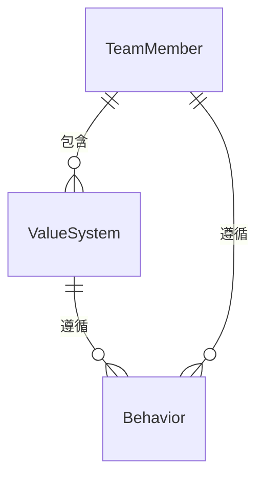

                 

# 如何构建技术团队的价值观体系

> 关键词：技术团队、价值观体系、构建方法、实践案例、优化与调整

> 摘要：本文旨在探讨如何构建技术团队的价值观体系，从而提升团队协作效率、增强团队凝聚力，并最终实现技术创新和业务目标。文章将分步骤介绍构建技术团队价值观的方法，并结合实际案例进行分析，为读者提供有价值的参考。

## 引言

### 1.1 问题背景

在当今快速发展的信息技术时代，技术团队在企业发展中扮演着越来越重要的角色。技术团队的效率、协作和创新直接影响到企业的核心竞争力。然而，在实际工作中，技术团队往往面临着以下问题：

1. **团队协作不畅**：团队成员之间缺乏有效的沟通和协作，导致项目进度缓慢、质量低下。
2. **价值观差异**：团队成员在价值观上存在差异，导致团队内部矛盾和冲突。
3. **创新能力不足**：团队成员缺乏对创新技术的关注和实践，导致企业无法快速响应市场变化。

### 1.2 问题解决

为了解决上述问题，构建技术团队的价值观体系成为了一种有效的途径。价值观体系可以统一团队成员的思想和行为，提升团队协作效率，增强团队凝聚力，并激发团队的创新能力。

### 1.3 边界与外延

本文将讨论如何构建技术团队的价值观体系，包括核心概念、构建方法、实践案例、优化与调整等方面。文章旨在为技术团队管理者提供有价值的指导，帮助他们构建一套适合自身团队的价值观体系。

## 核心概念与价值观

### 2.1 核心概念

在构建技术团队的价值观体系之前，我们需要明确一些核心概念，包括团队协作、价值观、价值观体系等。

#### 2.1.1 核心概念原理

1. **团队协作**：团队协作是指团队成员在共同目标下，通过沟通、协调和合作，共同完成任务的过程。团队协作的原理在于充分发挥每个人的优势，实现优势互补，提高团队整体效能。
2. **价值观**：价值观是指个体或团体对于事物的重要性和优先级的判断和选择。在技术团队中，价值观是团队成员共同认可并遵循的基本原则，是团队协作和行为规范的基石。
3. **价值观体系**：价值观体系是指一系列相互关联的价值观构成的整体，是团队在长期发展中形成的共同信念和行动准则。

#### 2.1.2 概念属性特征对比表

| 概念           | 特征                                                         |
|----------------|--------------------------------------------------------------|
| 团队协作       | 共同目标、沟通、协调、合作、优势互补                           |
| 价值观         | 个体或团体的重要性和优先级判断、基本信念、行为规范               |
| 价值观体系     | 相互关联的价值观、共同信念、行动准则、长期发展                   |

#### 2.1.3 ER实体关系图架构



## 构建技术团队价值观的方法

### 3.1 初步调研

#### 3.1.1 调研目的

初步调研的目的是了解团队成员的价值观和需求，为构建技术团队价值观体系提供基础数据。调研的主要目标是：

1. **了解团队成员的基本价值观**：包括个人价值观、团队价值观等。
2. **分析团队成员的需求**：包括工作环境、培训需求、职业发展等。

#### 3.1.2 调研方法

调研方法可以采用问卷调查、访谈、小组讨论等方式。具体步骤如下：

1. **制定调研问卷**：根据调研目的，设计一套包含价值观、需求等方面的问卷。
2. **发放问卷**：通过邮件、线上调查工具等方式，向团队成员发放问卷。
3. **收集和分析数据**：对收集到的数据进行整理和分析，提取关键信息。

#### 3.1.3 调研结果分析

调研结果分析主要包括以下内容：

1. **统计团队成员的基本价值观分布**：了解团队成员在价值观上的差异和共性。
2. **分析团队成员的需求**：了解团队成员在职业发展、培训需求等方面的需求。
3. **形成初步的价值观框架**：基于调研结果，初步形成技术团队价值观体系。

### 3.2 明确价值观

#### 3.2.1 价值观的重要性

明确价值观对于技术团队的建设至关重要。价值观可以统一团队成员的思想和行为，提升团队协作效率，增强团队凝聚力。具体包括：

1. **统一思想**：价值观可以引导团队成员共同追求团队目标，形成共同愿景。
2. **规范行为**：价值观是团队成员的行为准则，可以规范团队成员的行为，降低冲突。
3. **增强凝聚力**：共同的价值观可以增强团队成员的归属感和认同感，提升团队凝聚力。

#### 3.2.2 制定价值观的步骤

制定技术团队价值观的步骤如下：

1. **确定价值观的核心内容**：根据调研结果，结合企业文化和团队特点，确定价值观的核心内容。
2. **制定价值观的表述**：将核心价值观转化为具体的表述，便于团队成员理解和执行。
3. **制定价值观的实施方案**：明确如何将价值观融入到团队工作和日常管理中。

#### 3.2.3 价值观文档模板

```mermaid
tree
    ValueSystem
    |-- CoreValues
    |-- Implementation
    |-- Evaluation
    |-- Adjustment
```

### 3.3 培养价值观

#### 3.3.1 培养价值观的策略

培养价值观需要采取一系列策略，包括：

1. **领导层带头**：领导层要以身作则，率先践行价值观，为团队成员树立榜样。
2. **培训和宣传**：通过培训、宣传等方式，让团队成员深入理解价值观的内涵和重要性。
3. **激励与考核**：将价值观融入绩效考核，激励团队成员践行价值观。

#### 3.3.2 价值观融入工作流程

将价值观融入工作流程的具体步骤如下：

1. **制定价值观相关的流程规范**：将价值观融入到团队的工作流程中，确保价值观在具体工作中得到贯彻执行。
2. **培训员工**：对员工进行价值观培训，使其能够将价值观应用到实际工作中。
3. **监督和反馈**：对团队成员的价值观践行情况进行监督和反馈，及时纠正偏差。

#### 3.3.3 持续培养与评估

持续培养与评估价值观的方法如下：

1. **定期培训**：定期组织价值观培训，确保团队成员持续理解价值观的内涵。
2. **评估与反馈**：对价值观的践行情况进行定期评估，收集团队成员的反馈，为价值观的调整提供依据。
3. **优化与调整**：根据评估结果，对价值观进行优化和调整，确保价值观与时俱进。

## 实践案例

### 4.1 案例一：团队价值观构建实践

#### 4.1.1 案例背景

某互联网公司在快速发展过程中，意识到技术团队价值观建设的重要性。公司希望构建一套适合自身团队的价值观体系，以提高团队协作效率和创新能力。

#### 4.1.2 案例实施步骤

1. **初步调研**：通过问卷调查和访谈，了解团队成员的基本价值观和需求。
2. **确定价值观**：结合企业文化和团队特点，确定核心价值观，如“客户至上”、“创新驱动”、“团队合作”等。
3. **制定价值观表述**：将核心价值观转化为具体的表述，如“以客户为中心，不断提升产品服务质量”、“积极拥抱新技术，持续创新”等。
4. **实施价值观**：通过培训和宣传，将价值观融入到团队的工作流程中，对团队成员进行价值观考核。
5. **评估与反馈**：定期评估价值观的践行情况，收集团队成员的反馈，对价值观进行优化和调整。

#### 4.1.3 案例效果分析

通过实施价值观建设，该公司的技术团队在以下几个方面取得了显著成效：

1. **团队协作效率提升**：团队成员在价值观的指导下，更加注重团队协作，项目进度加快，质量提高。
2. **创新能力增强**：团队成员在价值观的激励下，积极拥抱新技术，不断提出创新方案，产品竞争力提升。
3. **团队凝聚力增强**：共同的价值观使团队成员更加团结，内部矛盾和冲突减少，团队氛围良好。

### 4.2 案例二：跨文化团队价值观融合

#### 4.2.1 案例背景

某跨国互联网公司在全球范围内招聘了多名技术团队成员，形成了跨文化团队。公司希望构建一套适合跨文化团队的价值观体系，以促进团队成员之间的沟通与协作。

#### 4.2.2 案例解决方案

1. **调研跨文化差异**：通过问卷调查和访谈，了解不同文化背景下团队成员的价值观差异。
2. **确定融合价值观**：结合企业文化和团队特点，确定融合后的核心价值观，如“尊重差异”、“包容共存”、“共同成长”等。
3. **制定价值观表述**：将核心价值观转化为具体的表述，如“尊重每个人的文化背景和价值观”、“相互包容，共同进步”等。
4. **实施价值观**：通过培训和宣传，将价值观融入到团队的工作流程中，对团队成员进行价值观考核。
5. **跨文化沟通**：建立跨文化沟通机制，促进团队成员之间的交流与理解。

#### 4.2.3 案例效果评估

通过实施跨文化团队价值观建设，该公司的技术团队在以下几个方面取得了显著成效：

1. **跨文化沟通障碍减少**：团队成员在价值观的指导下，更加尊重和理解彼此的文化背景，沟通更加顺畅。
2. **团队协作效率提升**：跨文化团队在价值观的引领下，能够更好地协作，项目进度加快，质量提高。
3. **团队凝聚力增强**：共同的价值观使跨文化团队成员更加团结，内部矛盾和冲突减少，团队氛围良好。

## 价值观体系的优化与调整

### 5.1 价值观体系的评估

#### 5.1.1 评估方法

价值观体系的评估可以采用定性和定量相结合的方法。具体方法包括：

1. **问卷调查**：通过问卷调查，了解团队成员对价值观的认同程度和践行情况。
2. **访谈**：通过访谈，深入了解团队成员对价值观的看法和感受。
3. **数据统计**：对团队成员的工作成果、绩效、团队氛围等数据进行统计和分析。

#### 5.1.2 评估指标

评估指标主要包括：

1. **价值观认同度**：团队成员对价值观的认同程度。
2. **价值观践行情况**：团队成员在日常工作中的价值观践行情况。
3. **团队绩效**：团队的工作成果和绩效表现。
4. **团队氛围**：团队的凝聚力和团队氛围。

#### 5.1.3 评估结果处理

评估结果处理主要包括：

1. **分析评估结果**：对评估结果进行深入分析，找出价值观体系存在的问题和不足。
2. **制定改进措施**：根据评估结果，制定相应的改进措施，优化价值观体系。
3. **反馈与沟通**：将评估结果和改进措施反馈给团队成员，确保团队成员了解并支持改进措施。

### 5.2 价值观体系的优化

#### 5.2.1 优化策略

价值观体系的优化策略主要包括：

1. **加强培训和宣传**：通过加强培训和宣传，提高团队成员对价值观的认同和践行。
2. **完善评估机制**：建立完善的评估机制，定期评估价值观的践行情况，确保价值观体系的有效性。
3. **调整价值观表述**：根据实际情况，对价值观表述进行适当调整，使其更加符合团队特点和需求。

#### 5.2.2 优化步骤

优化价值观体系的步骤主要包括：

1. **分析评估结果**：对评估结果进行分析，找出价值观体系存在的问题和不足。
2. **制定优化方案**：根据分析结果，制定优化方案，明确优化目标和具体措施。
3. **实施优化措施**：按照优化方案，实施具体的优化措施，确保价值观体系得到有效优化。
4. **跟踪与反馈**：对优化措施的实施情况进行跟踪和反馈，确保优化措施的有效性和可持续性。

#### 5.2.3 优化案例分析

以下是一个优化案例：

某公司在进行价值观体系评估时，发现团队成员对“团队合作”这一价值观的认同度较低，践行情况也不理想。经过分析，公司认为这主要是由于团队协作机制不完善导致的。

针对这一问题，公司制定了以下优化方案：

1. **完善团队协作机制**：制定团队协作规范，明确团队成员的职责和协作流程。
2. **加强团队协作培训**：组织团队协作培训，提高团队成员的协作能力和意识。
3. **引入协作工具**：引入协作工具，如项目管理软件、即时通讯工具等，方便团队成员之间的沟通和协作。

经过一段时间的实施，公司的价值观体系得到了明显优化，团队成员对“团队合作”的认同度和践行情况都有了显著提升。

### 5.3 价值观体系的调整

#### 5.3.1 调整原因

价值观体系的调整可能是由于以下原因：

1. **团队发展变化**：随着团队的发展和业务的变化，原来的价值观可能不再适应团队的发展需求。
2. **外部环境变化**：外部环境的变化，如市场、技术、政策等，可能对团队价值观产生冲击。
3. **团队成员变动**：团队成员的变动可能带来新的价值观和理念，需要调整现有的价值观体系。

#### 5.3.2 调整方法

价值观体系的调整方法主要包括：

1. **调研和评估**：对团队现有的价值观体系进行调研和评估，了解其存在的问题和不足。
2. **制定调整方案**：根据调研和评估结果，制定调整方案，明确调整目标和具体措施。
3. **实施调整措施**：按照调整方案，实施具体的调整措施，确保价值观体系得到有效调整。
4. **跟踪与反馈**：对调整措施的实施情况进行跟踪和反馈，确保调整措施的有效性和可持续性。

#### 5.3.3 调整实例

以下是一个调整实例：

某公司在进行价值观体系评估时，发现团队在“创新驱动”方面存在不足，团队成员对创新的重视程度不高。经过调研和分析，公司认为这主要是由于公司的创新氛围不够浓厚，以及团队成员对创新的认知和技能不足导致的。

针对这一问题，公司制定了以下调整方案：

1. **营造创新氛围**：通过举办创新大赛、创新论坛等活动，营造浓厚的创新氛围。
2. **加强创新培训**：组织创新培训，提高团队成员的创新意识和技能。
3. **设立创新激励**：设立创新奖励机制，激励团队成员积极参与创新活动。

经过一段时间的实施，公司的价值观体系得到了有效调整，团队成员对创新的重视程度有了显著提升，创新氛围也日益浓厚。

## 团队价值观的传播与落地

### 6.1 价值观传播策略

#### 6.1.1 传播渠道

价值观传播的渠道主要包括：

1. **内部培训**：通过内部培训，向团队成员传授价值观的相关知识和理念。
2. **内部宣传**：通过内部宣传，如内部刊物、海报、宣传栏等，宣传价值观的重要性和内涵。
3. **团队活动**：通过团队活动，如团队建设、团队拓展等，将价值观融入到团队日常活动中。

#### 6.1.2 传播方法

价值观传播的方法主要包括：

1. **故事化传播**：通过讲述价值观故事，使团队成员更容易理解和接受价值观。
2. **互动式传播**：通过互动式传播，如讨论、辩论、分享等，激发团队成员对价值观的思考和认同。
3. **案例分享**：通过案例分享，展示价值观在实践中的应用效果，增强团队成员对价值观的认同。

#### 6.1.3 传播效果评估

价值观传播效果的评估方法主要包括：

1. **问卷调查**：通过问卷调查，了解团队成员对价值观的认同度和践行情况。
2. **访谈**：通过访谈，深入了解团队成员对价值观的看法和感受。
3. **行为观察**：通过观察团队成员的行为，了解价值观在实践中的应用情况。

### 6.2 价值观落地实施

#### 6.2.1 落地目标

价值观落地的目标主要包括：

1. **团队成员的价值观认同**：使团队成员深入理解并认同价值观，将价值观内化为个人的行为准则。
2. **团队协作效率提升**：通过价值观的落地，提升团队协作效率，提高项目质量和进度。
3. **创新能力增强**：通过价值观的落地，激发团队成员的创新意识，提升团队的创新能力。

#### 6.2.2 实施步骤

价值观落地实施的步骤主要包括：

1. **制定落地计划**：根据价值观的内涵和目标，制定具体的落地计划，明确实施步骤和时间节点。
2. **培训和宣传**：通过培训和宣传，向团队成员传授价值观的知识和理念，提高团队成员的价值观素养。
3. **实践和考核**：将价值观融入到团队的工作流程和考核机制中，确保价值观在实践中的应用和落实。
4. **跟踪与反馈**：对价值观落地的实施情况进行跟踪和反馈，及时调整和优化落地措施。

#### 6.2.3 落地效果评估

价值观落地效果评估的方法主要包括：

1. **绩效评估**：通过绩效评估，了解价值观落地对团队绩效的影响，如项目进度、质量、创新成果等。
2. **团队氛围评估**：通过团队氛围评估，了解价值观落地对团队氛围的影响，如团队成员的沟通、协作、满意度等。
3. **行为观察**：通过行为观察，了解价值观在实践中的应用情况，如团队成员的行为规范、价值观践行等。

## 结论与展望

本文从问题背景、核心概念、构建方法、实践案例、优化与调整、传播与落地等方面，系统地探讨了如何构建技术团队的价值观体系。通过明确价值观、培养价值观、实践价值观，技术团队可以提升协作效率、增强团队凝聚力，并激发创新能力。

在未来，随着企业的发展和外部环境的变化，技术团队的价值观体系也需要不断调整和优化。为此，企业应持续关注团队成员的需求和价值观，建立灵活、适应性的价值观体系，以适应不断变化的企业环境。

最后，希望本文能为技术团队管理者提供有价值的参考，助力构建一套适合自身团队的价值观体系，推动企业的持续发展和创新。

## 作者

作者：AI天才研究院/AI Genius Institute & 禅与计算机程序设计艺术 /Zen And The Art of Computer Programming

本文由AI天才研究院和《禅与计算机程序设计艺术》联合创作，旨在为技术团队提供有价值的指导，帮助其构建和优化价值观体系。希望本文能对您的工作产生积极影响。如果您有任何疑问或建议，欢迎随时与我们联系。

## 最佳实践 tips

1. **价值观的明确和宣传**：明确价值观的表述，并通过多种渠道进行宣传，确保团队成员深刻理解并认同价值观。
2. **培训与考核**：定期组织价值观培训，将价值观融入绩效考核，激励团队成员践行价值观。
3. **持续优化**：根据团队成员的需求和反馈，持续优化价值观体系，确保其与时俱进。
4. **跨文化融合**：在跨文化团队中，重视文化差异，尊重不同文化背景的价值观，推动价值观的融合。

## 小结

构建技术团队的价值观体系是提升团队协作效率、增强团队凝聚力和激发创新能力的有效途径。通过明确价值观、培养价值观、实践价值观，技术团队可以实现持续发展和创新。

## 注意事项

1. **价值观的认同与践行**：价值观的建设需要团队成员的认同和践行，领导层的带头作用至关重要。
2. **适应性与灵活性**：价值观体系应具备适应性和灵活性，以适应企业的发展和外部环境的变化。
3. **持续优化**：价值观体系需要持续优化和调整，以保持其有效性和适应性。

## 拓展阅读

1. **《团队协作的五个关键因素》**：了解团队协作的核心要素，提升团队协作效率。
2. **《跨文化沟通技巧》**：掌握跨文化沟通的技巧，促进跨文化团队的价值观融合。
3. **《创新管理的最佳实践》**：学习创新管理的最佳实践，激发团队的创新能力。

