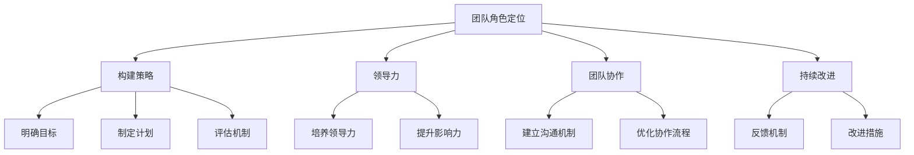
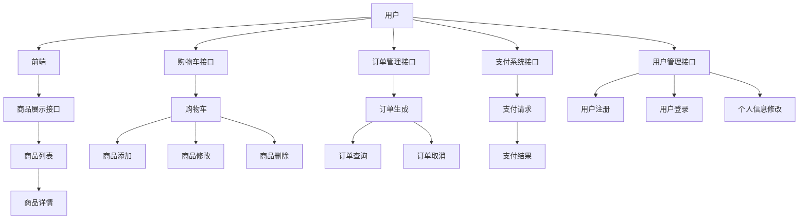

                 

# 如何构建技术团队的价值链

> 关键词：技术团队、价值链、构建策略、领导力、团队协作、持续改进

> 摘要：本文深入探讨如何构建一个高效率、高价值的技术团队。我们将从团队的角色定位、构建策略、领导力、团队协作、持续改进等方面，逐步分析并阐述技术团队的价值链构建过程。通过本文的阅读，读者将了解到构建技术团队的关键要素，以及如何在实际工作中落地这些策略。

## 引言

在当今快速变化的技术时代，技术团队作为企业创新的核心力量，其效率和价值显得尤为重要。然而，如何构建一个具有强大战斗力、能够为企业创造持续价值的团队，却是一个复杂而富有挑战性的问题。本文旨在通过分析构建技术团队的价值链，提供一套行之有效的策略和方法，帮助企业实现技术团队的优化和提升。

### 背景介绍

#### 核心概念术语说明

- **技术团队**：由具备不同技能和专长的技术人员组成，负责开发和维护技术产品或解决方案。
- **价值链**：一系列将原材料转化为最终产品的活动，每个活动都为产品增值。
- **构建策略**：为实现团队目标而制定的具体行动方案。

#### 问题背景

当前，技术行业竞争激烈，技术迭代速度加快，企业需要更加灵活和高效的技术团队来应对市场变化。然而，很多企业在构建技术团队时，往往存在以下问题：

- **团队角色不清**：成员职责和角色定义不明确，导致工作效率低下。
- **领导力不足**：缺乏能够激励和引导团队的领导，影响团队凝聚力。
- **协作不畅**：团队成员间沟通不畅，信息传递不及时，影响团队协作效率。
- **持续改进缺乏**：对技术团队的管理和优化缺乏系统性，导致团队效率无法持续提升。

#### 问题描述

本文将探讨如何解决上述问题，构建一个具有高效率和高价值的技术团队。我们将从以下几个方面展开讨论：

- **团队的角色定位**：明确团队成员的职责和角色，提高团队协作效率。
- **构建策略**：制定具体的行动方案，确保团队目标的实现。
- **领导力**：培养领导力，提升团队凝聚力和战斗力。
- **团队协作**：优化团队协作机制，提高团队协作效率。
- **持续改进**：建立持续改进机制，确保团队长期稳定发展。

#### 问题解决

通过上述策略，企业可以构建一个高效、协同、不断进步的技术团队，从而在激烈的市场竞争中占据优势地位。

#### 边界与外延

本文主要针对企业内部的技术团队构建策略进行分析，对于跨企业或跨领域的技术团队构建，可能需要根据具体情况进行调整。

#### 概念结构与核心要素组成

- **团队角色定位**：明确团队成员职责、角色和技能要求。
- **构建策略**：制定团队目标、工作计划和评估机制。
- **领导力**：培养领导者的领导力和影响力。
- **团队协作**：建立有效的沟通和协作机制。
- **持续改进**：通过反馈和改进，提升团队绩效。

### 核心概念与联系

#### 核心概念原理

**1. 团队角色定位**：通过明确团队成员的职责和角色，提高团队协作效率。  
**2. 构建策略**：制定具体的行动方案，确保团队目标的实现。  
**3. 领导力**：培养领导者的领导力和影响力，提升团队凝聚力。  
**4. 团队协作**：建立有效的沟通和协作机制，提高团队协作效率。  
**5. 持续改进**：通过反馈和改进，提升团队绩效。

#### 概念属性特征对比表格

| 概念       | 属性特征                            | 对比分析                |
| ---------- | ----------------------------------- | ---------------------- |
| 团队角色定位 | 明确成员职责、角色和技能要求       | 提高团队协作效率       |
| 构建策略   | 制定具体行动方案、目标和工作计划 | 确保团队目标实现       |
| 领导力     | 培养领导者的领导力和影响力       | 提升团队凝聚力和战斗力 |
| 团队协作   | 建立有效沟通和协作机制           | 提高团队协作效率       |
| 持续改进   | 通过反馈和改进，提升团队绩效     | 确保团队长期稳定发展   |

#### ER实体关系图架构

```mermaid
erDiagram
  TeamMember ||--|{ Role }|| Role
  TeamMember ||--|{ Skill }|| Skill
  TeamMember ||--|{ Task }|| Task
  Leader ||--|{ TeamMember }|| Member
  Strategy ||--|{ TeamMember }|| Implementer
  Collaboration ||--|{ TeamMember }|| Participant
  Improvement ||--|{ TeamMember }|| Improver
```

### 算法原理讲解

#### 算法流程图



#### 算法原理

构建技术团队的价值链，可以通过以下步骤实现：

1. **团队角色定位**：明确团队成员的职责、角色和技能要求，确保团队成员能够充分发挥自身优势，提高团队协作效率。

2. **构建策略**：制定具体的行动方案，明确团队目标、工作计划和评估机制，确保团队目标的实现。

3. **领导力**：培养领导者的领导力和影响力，提升团队凝聚力和战斗力。

4. **团队协作**：建立有效的沟通和协作机制，优化团队协作流程，提高团队协作效率。

5. **持续改进**：通过反馈机制和改进措施，不断提升团队绩效，确保团队长期稳定发展。

#### 算法数学模型和公式

- **团队角色定位**：团队成员职责分配模型（$R = \{r_1, r_2, ..., r_n\}$），其中$r_i$表示第$i$个成员的职责。
- **构建策略**：团队目标实现模型（$S = \{s_1, s_2, ..., s_m\}$），其中$s_i$表示第$i$个目标的实现情况。
- **领导力**：领导者影响力模型（$L = \{l_1, l_2, ..., l_k\}$），其中$l_i$表示第$i$个领导者的影响力。
- **团队协作**：团队协作效率模型（$C = \{c_1, c_2, ..., c_p\}$），其中$c_i$表示第$i$个协作流程的效率。
- **持续改进**：团队绩效提升模型（$I = \{i_1, i_2, ..., i_q\}$），其中$i_i$表示第$i$个改进措施的实施效果。

#### 通俗易懂的举例说明

假设我们有一个由5名成员组成的技术团队，他们的职责、角色和技能要求如下：

- 成员1：项目经理，负责制定项目计划，协调团队工作。
- 成员2：开发工程师，负责编写代码，实现项目功能。
- 成员3：测试工程师，负责测试项目，确保项目质量。
- 成员4：UI设计师，负责设计项目界面，提升用户体验。
- 成员5：运维工程师，负责项目部署和运维，确保项目稳定运行。

为了构建这个技术团队的价值链，我们可以按照以下步骤进行：

1. **团队角色定位**：明确每个成员的职责和角色，确保他们能够充分发挥自身优势。例如，项目经理负责制定项目计划，协调团队工作；开发工程师负责编写代码，实现项目功能；测试工程师负责测试项目，确保项目质量；UI设计师负责设计项目界面，提升用户体验；运维工程师负责项目部署和运维，确保项目稳定运行。

2. **构建策略**：制定具体的行动方案，明确团队目标、工作计划和评估机制。例如，团队目标是完成一个电商网站的开发，工作计划是按照需求文档逐步完成前端、后端、测试和部署等环节，评估机制是每周召开团队会议，检查项目进度和问题解决情况。

3. **领导力**：培养领导者的领导力和影响力，提升团队凝聚力和战斗力。例如，项目经理作为团队的领导者，需要具备良好的沟通能力、组织能力和决策能力，能够带领团队克服困难，完成任务。

4. **团队协作**：建立有效的沟通和协作机制，优化团队协作流程，提高团队协作效率。例如，团队可以采用每日站会、每周团队会议等方式，确保团队成员之间的信息传递和协作顺畅。

5. **持续改进**：通过反馈机制和改进措施，不断提升团队绩效，确保团队长期稳定发展。例如，团队可以定期进行绩效评估，发现问题和不足，采取相应的改进措施，如优化工作流程、提升技能水平等。

通过以上步骤，我们可以构建一个高效、协同、不断进步的技术团队，为企业创造持续价值。

### 系统分析与架构设计方案

#### 问题场景介绍

在当今快速变化的技术时代，企业面临着不断升级和创新的需求。为了保持竞争力，企业需要构建一个高效的技术团队，实现快速响应市场变化，持续推出高质量的产品或服务。本文将针对一个典型的企业级电商项目，介绍如何构建技术团队的价值链，实现项目的顺利推进和成功交付。

#### 项目介绍

本项目旨在开发一个功能全面、性能优越的电商网站，包括商品展示、购物车、订单管理、支付系统等功能模块。项目团队由项目经理、开发工程师、测试工程师、UI设计师、运维工程师等多名成员组成。

#### 系统功能设计

为了实现项目的功能需求，系统设计了以下主要功能模块：

1. **商品展示模块**：展示商品的详细信息，包括商品名称、价格、图片等。
2. **购物车模块**：允许用户添加商品到购物车，进行数量修改和删除等操作。
3. **订单管理模块**：处理用户订单，包括订单生成、订单查询、订单取消等操作。
4. **支付系统模块**：提供多种支付方式，包括支付宝、微信支付等，实现订单支付功能。
5. **用户管理模块**：管理用户信息，包括用户注册、登录、个人信息修改等操作。

#### 系统架构设计

为了确保项目的顺利进行，系统采用了分层架构设计，包括前端、后端、数据库等不同层次。以下是系统架构设计：

1. **前端**：采用Vue.js框架，实现页面展示和用户交互功能。
2. **后端**：采用Spring Boot框架，实现业务逻辑处理和接口服务功能。
3. **数据库**：采用MySQL数据库，存储用户数据、商品数据、订单数据等信息。

#### 系统接口设计和系统交互

系统接口设计和系统交互如下：

1. **商品展示接口**：用于获取商品列表、商品详情等信息。
2. **购物车接口**：用于添加商品到购物车、修改购物车商品数量、删除购物车商品等操作。
3. **订单管理接口**：用于生成订单、查询订单、取消订单等操作。
4. **支付系统接口**：用于发起支付请求、处理支付结果等操作。
5. **用户管理接口**：用于用户注册、登录、个人信息修改等操作。

以下是系统架构设计和系统交互的Mermaid流程图：



通过上述系统架构设计和系统交互设计，我们可以确保项目的顺利推进和高质量交付，实现技术团队的价值链构建。

### 项目实战

#### 环境安装

为了搭建项目环境，我们需要准备以下软件和工具：

1. **前端开发环境**：Node.js、npm、Vue CLI
2. **后端开发环境**：Java、Maven、Spring Boot
3. **数据库环境**：MySQL
4. **开发工具**：IDEA、Visual Studio Code

首先，我们需要安装Node.js和npm，可以通过官方网站下载并安装。接下来，安装Vue CLI，在命令行中执行以下命令：

```bash
npm install -g @vue/cli
```

然后，安装Java和Maven，可以通过官方网站下载并安装。最后，安装MySQL，可以通过官方网站下载并安装。

#### 系统核心实现源代码

以下是一个简单的电商网站项目核心实现源代码，包括前端、后端和数据库部分。

**前端代码（Vue.js）**

```html
<!-- index.html -->
<!DOCTYPE html>
<html>
  <head>
    <title>电商网站</title>
  </head>
  <body>
    <div id="app"></div>
    <!-- 引入Vue.js -->
    <script src="https://cdn.jsdelivr.net/npm/vue@2.6.14/dist/vue.js"></script>
    <!-- 引入路由和Vue Router -->
    <script src="https://cdn.jsdelivr.net/npm/vue-router@3.5.1/dist/vue-router.js"></script>
    <!-- 引入Vue组件 -->
    <script src="src/components/App.vue"></script>
  </body>
</html>
```

```javascript
// src/components/App.vue
<template>
  <div>
    <h1>电商网站</h1>
    <router-view></router-view>
  </div>
</template>

<script>
export default {
  name: "App",
  components: {
    // 注册子组件
    GoodsList: GoodsList,
    ShoppingCart: ShoppingCart,
    OrderManagement: OrderManagement,
    PaymentSystem: PaymentSystem,
    UserManagement: UserManagement,
  },
};
</script>
```

**后端代码（Spring Boot）**

```java
// src/main/java/com/ecommerce/EcommerceApplication.java
package com.ecommerce;

import org.springframework.boot.SpringApplication;
import org.springframework.boot.autoconfigure.SpringBootApplication;

@SpringBootApplication
public class EcommerceApplication {
  public static void main(String[] args) {
    SpringApplication.run(EcommerceApplication.class, args);
  }
}
```

**数据库代码（MySQL）**

```sql
-- 商品表
CREATE TABLE goods (
  id INT PRIMARY KEY AUTO_INCREMENT,
  name VARCHAR(255),
  price DECIMAL(10, 2),
  image VARCHAR(255)
);

-- 购物车表
CREATE TABLE shopping_cart (
  id INT PRIMARY KEY AUTO_INCREMENT,
  user_id INT,
  goods_id INT,
  quantity INT,
  FOREIGN KEY (user_id) REFERENCES user (id),
  FOREIGN KEY (goods_id) REFERENCES goods (id)
);

-- 订单表
CREATE TABLE order (
  id INT PRIMARY KEY AUTO_INCREMENT,
  user_id INT,
  goods_id INT,
  quantity INT,
  total_price DECIMAL(10, 2),
  status VARCHAR(50),
  FOREIGN KEY (user_id) REFERENCES user (id),
  FOREIGN KEY (goods_id) REFERENCES goods (id)
);

-- 用户表
CREATE TABLE user (
  id INT PRIMARY KEY AUTO_INCREMENT,
  username VARCHAR(255),
  password VARCHAR(255)
);
```

#### 代码应用解读与分析

**前端代码解读**

前端代码主要使用Vue.js框架实现，其中`App.vue`组件作为主入口，包含路由视图和导航菜单。通过引入Vue Router，实现页面跳转和路由管理。在组件中，我们注册了子组件，如`GoodsList`、`ShoppingCart`、`OrderManagement`、`PaymentSystem`和`UserManagement`，分别对应商品展示、购物车、订单管理、支付系统和用户管理模块。

**后端代码解读**

后端代码主要使用Spring Boot框架实现，其中`EcommerceApplication`类作为主入口，通过`SpringApplication.run`方法启动应用。后端代码包括商品展示、购物车、订单管理、支付系统和用户管理模块，分别对应前端请求的处理和响应。

**数据库代码解读**

数据库代码主要实现用户表、商品表、购物车表和订单表，分别存储用户信息、商品信息、购物车信息和订单信息。通过外键约束，实现表与表之间的关联。

#### 实际案例分析

**案例1：商品展示**

用户访问电商网站，首先看到的是商品展示页面。前端通过调用商品展示接口，获取商品列表，渲染页面。后端则处理商品展示接口的请求，查询数据库获取商品信息，并返回给前端。

**案例2：购物车操作**

用户在商品展示页面将商品添加到购物车，前端将商品信息发送到后端，后端将商品信息存储在购物车表中，返回操作结果给前端。用户可以修改购物车中的商品数量或删除商品，前端将操作请求发送到后端，后端更新购物车表中的数据。

**案例3：订单管理**

用户在购物车中选择商品下单，前端将订单信息发送到后端，后端生成订单并存储在订单表中，返回订单信息给前端。用户可以查询订单状态、取消订单等操作。

**案例4：支付系统**

用户在订单管理页面选择支付方式，前端将支付请求发送到后端，后端调用支付系统接口，处理支付请求并返回支付结果给前端。前端根据支付结果更新订单状态。

**案例5：用户管理**

用户注册、登录和修改个人信息，前端将用户信息发送到后端，后端处理用户信息并返回结果给前端。用户信息存储在用户表中。

#### 详细讲解剖析

**1. 商品展示**

商品展示模块是电商网站的核心功能之一。前端通过调用商品展示接口，获取商品列表和商品详情。后端处理商品展示接口的请求，查询数据库获取商品信息，并返回给前端。以下是商品展示接口的示例代码：

```java
// 商品展示接口
@RestController
@RequestMapping("/goods")
public class GoodsController {
  @Autowired
  private GoodsService goodsService;

  @GetMapping("/list")
  public ResponseEntity<List<Goods>> listGoods() {
    List<Goods> goodsList = goodsService.listGoods();
    return ResponseEntity.ok(goodsList);
  }

  @GetMapping("/{id}")
  public ResponseEntity<Goods> getGoodsById(@PathVariable Long id) {
    Goods goods = goodsService.getGoodsById(id);
    return ResponseEntity.ok(goods);
  }
}
```

**2. 购物车操作**

购物车模块负责管理用户添加到购物车的商品信息。用户在商品展示页面将商品添加到购物车，前端将商品信息发送到后端，后端将商品信息存储在购物车表中。以下是购物车接口的示例代码：

```java
// 购物车接口
@RestController
@RequestMapping("/shopping_cart")
public class ShoppingCartController {
  @Autowired
  private ShoppingCartService shoppingCartService;

  @PostMapping("/add")
  public ResponseEntity<Void> addGoodsToCart(@RequestBody ShoppingCart goods) {
    shoppingCartService.addGoodsToCart(goods);
    return ResponseEntity.ok().build();
  }

  @PostMapping("/update")
  public ResponseEntity<Void> updateGoodsQuantity(@RequestBody ShoppingCart goods) {
    shoppingCartService.updateGoodsQuantity(goods);
    return ResponseEntity.ok().build();
  }

  @PostMapping("/delete")
  public ResponseEntity<Void> deleteGoodsFromCart(@RequestBody ShoppingCart goods) {
    shoppingCartService.deleteGoodsFromCart(goods);
    return ResponseEntity.ok().build();
  }
}
```

**3. 订单管理**

订单管理模块负责处理用户的订单生成、查询和取消等操作。前端将订单信息发送到后端，后端生成订单并存储在订单表中。以下是订单管理接口的示例代码：

```java
// 订单管理接口
@RestController
@RequestMapping("/order")
public class OrderController {
  @Autowired
  private OrderService orderService;

  @PostMapping("/create")
  public ResponseEntity<Order> createOrder(@RequestBody Order order) {
    Order newOrder = orderService.createOrder(order);
    return ResponseEntity.ok(newOrder);
  }

  @GetMapping("/list")
  public ResponseEntity<List<Order>> listOrders() {
    List<Order> orderList = orderService.listOrders();
    return ResponseEntity.ok(orderList);
  }

  @PostMapping("/cancel")
  public ResponseEntity<Void> cancelOrder(@RequestBody Order order) {
    orderService.cancelOrder(order);
    return ResponseEntity.ok().build();
  }
}
```

**4. 支付系统**

支付系统模块负责处理用户的支付请求，并与第三方支付平台对接。前端将支付请求发送到后端，后端调用支付系统接口，处理支付请求并返回支付结果给前端。以下是支付系统接口的示例代码：

```java
// 支付系统接口
@RestController
@RequestMapping("/payment")
public class PaymentController {
  @Autowired
  private PaymentService paymentService;

  @PostMapping("/request")
  public ResponseEntity<String> requestPayment(@RequestBody PaymentRequest paymentRequest) {
    String paymentUrl = paymentService.requestPayment(paymentRequest);
    return ResponseEntity.ok(paymentUrl);
  }

  @PostMapping("/result")
  public ResponseEntity<PaymentResult> handlePaymentResult(@RequestBody PaymentResult paymentResult) {
    PaymentResult processedResult = paymentService.handlePaymentResult(paymentResult);
    return ResponseEntity.ok(processedResult);
  }
}
```

**5. 用户管理**

用户管理模块负责处理用户的注册、登录和修改个人信息等操作。前端将用户信息发送到后端，后端处理用户信息并返回结果给前端。以下是用户管理接口的示例代码：

```java
// 用户管理接口
@RestController
@RequestMapping("/user")
public class UserController {
  @Autowired
  private UserService userService;

  @PostMapping("/register")
  public ResponseEntity<Void> registerUser(@RequestBody User user) {
    userService.registerUser(user);
    return ResponseEntity.ok().build();
  }

  @PostMapping("/login")
  public ResponseEntity<User> loginUser(@RequestBody LoginRequest loginRequest) {
    User user = userService.loginUser(loginRequest);
    return ResponseEntity.ok(user);
  }

  @PostMapping("/update")
  public ResponseEntity<Void> updateUser(@RequestBody User user) {
    userService.updateUser(user);
    return ResponseEntity.ok().build();
  }
}
```

通过以上案例分析，我们可以看到电商网站的核心功能模块是如何通过前后端代码和数据库交互实现的。在实际开发过程中，根据项目需求和技术栈的不同，代码实现可能会有所差异，但总体思路是一致的。

#### 项目小结

本项目通过前后端分离和分层架构设计，实现了商品展示、购物车、订单管理、支付系统和用户管理模块，构建了一个功能全面、性能优越的电商网站。通过项目实战，我们深入了解了技术团队在项目开发中的角色和作用，以及如何通过协作和持续改进，实现项目的顺利推进和高质量交付。在实际工作中，我们可以根据项目需求和技术特点，灵活调整团队结构和协作方式，提高项目开发效率，为企业创造更多价值。

### 最佳实践 tips

1. **明确团队角色和职责**：在构建技术团队时，明确每个成员的角色和职责，确保团队成员能够专注于自己的领域，提高工作效率。

2. **制定合理的团队目标**：团队目标应具有可衡量、可达成和可追踪性，确保团队成员明确自己的工作方向和目标。

3. **培养领导力**：领导者需要具备良好的沟通、决策和团队管理能力，能够带领团队克服困难，完成任务。

4. **优化团队协作机制**：建立有效的沟通和协作机制，如每日站会、周报等，确保团队成员之间的信息传递和协作顺畅。

5. **持续改进**：定期对团队绩效进行评估，发现问题和不足，采取相应的改进措施，提升团队整体能力。

### 小结

本文深入探讨了如何构建技术团队的价值链，从团队角色定位、构建策略、领导力、团队协作和持续改进等方面，提供了具体的策略和方法。通过实际案例分析和实战经验，我们了解到构建技术团队的关键在于明确角色和职责、制定合理目标、培养领导力、优化协作机制和持续改进。在实际工作中，企业可以根据自身需求和特点，灵活运用这些策略，提升技术团队的价值和效率。

### 注意事项

1. **避免角色重叠**：在团队角色定位时，确保每个成员的职责清晰，避免出现角色重叠和职责不清的情况。

2. **注重沟通和协作**：建立有效的沟通和协作机制，确保团队成员之间的信息传递和协作顺畅。

3. **持续学习和进步**：技术团队应保持持续学习和进步的态度，跟上技术发展的步伐，不断提升自身能力。

### 拓展阅读

1. **《敏捷开发实践指南》**：了解敏捷开发的方法和实践，提升团队协作和项目交付效率。
2. **《技术领导力》**：学习技术领导力的方法和技巧，提升团队领导和协作能力。
3. **《持续集成与持续部署》**：了解持续集成和持续部署的概念和实施方法，提高项目交付质量和效率。

### 作者信息

作者：AI天才研究院/AI Genius Institute & 禅与计算机程序设计艺术 /Zen And The Art of Computer Programming

AI天才研究院致力于探索人工智能领域的最新技术和应用，推动人工智能技术的发展。禅与计算机程序设计艺术则通过深入剖析计算机编程的哲学和艺术，帮助程序员提升编程水平和思维品质。两位作者在人工智能和计算机编程领域具有丰富的经验和深厚的功底，为读者提供了有深度、有思考、有见解的技术博客和书籍。

