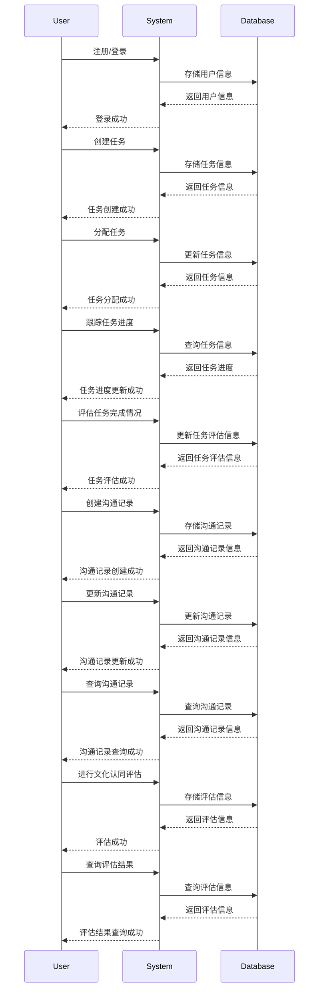

                 

# 如何构建技术团队的文化认同

## 1.1 问题背景

在当今快速发展的技术领域，技术团队的效率和创新能力对于企业的竞争力至关重要。然而，在实际工作中，许多技术团队面临着一系列文化认同方面的问题。这些问题不仅影响了团队的协作效率，还可能阻碍创新和业务发展。

首先，许多技术团队缺乏共同的目标和愿景。团队成员各自为战，缺乏统一的方向和行动计划，导致资源分散，工作效率低下。其次，沟通不畅也是常见的问题。团队成员之间缺乏有效的沟通机制，信息传递不及时，容易产生误解和冲突。此外，团队内部缺乏信任，特别是在涉及决策和任务分配时，往往存在分歧和争执。

这些问题的存在不仅影响了团队的日常运作，更严重的是，它们削弱了团队的整体战斗力，降低了团队的凝聚力和归属感。因此，构建技术团队的文化认同，解决这些问题，成为当务之急。

## 1.2 问题解决

技术团队文化认同的重要性不容忽视。首先，共同的文化认同可以提供明确的团队方向和目标，使团队成员在共同努力下实现更大的成果。其次，有效的沟通机制和团队信任可以促进信息流通，减少误解和冲突，提高团队协作效率。此外，积极向上的团队氛围可以激发团队成员的创造力和工作热情，促进创新和业务发展。

为了构建技术团队的文化认同，必须采取一系列措施。首先，要制定明确的团队价值观，确保所有成员在共同的目标和愿景下工作。其次，要建立有效的沟通机制，确保团队成员之间的信息畅通无阻。此外，还要营造积极向上的团队氛围，鼓励团队成员之间的相互信任和支持。

## 1.3 边界与外延

技术团队文化认同的范畴包括多个方面，如价值观、行为规范、团队氛围等。首先，团队价值观是文化认同的核心，它决定了团队成员的行为准则和决策标准。其次，行为规范是团队价值观的具体体现，包括团队成员在日常工作中的行为准则和规范。最后，团队氛围是文化认同的外在表现，反映了团队成员之间的相互关系和工作环境。

## 1.4 概念结构与核心要素组成

技术团队文化认同的核心概念包括团队价值观、团队协作、沟通机制和团队氛围。团队价值观是文化认同的基础，决定了团队成员的行为准则和决策标准。团队协作是文化认同的重要体现，反映了团队成员之间的协作效率和合作精神。沟通机制是文化认同的保障，确保了团队成员之间的信息畅通无阻。团队氛围是文化认同的体现，反映了团队成员之间的相互信任和归属感。

## 1.5 本章小结

本文首先介绍了当前技术团队文化存在的问题，如缺乏共同目标、沟通不畅、缺乏信任等。接着，阐述了技术团队文化认同的重要性，并提出构建技术团队文化认同的必要性。最后，明确了技术团队文化认同的范畴，如价值观、行为规范、团队氛围等，并分析了其核心概念与核心要素组成。通过这些分析，为后续章节的深入探讨提供了基础。# 第2章: 技术团队文化认同的核心概念

技术团队文化认同的核心概念是构建一个高效、协作、创新的团队环境的关键。本章将详细探讨团队价值观、团队协作、沟通机制和团队氛围这四个核心概念，分析它们的重要性以及如何在实际工作中应用。

## 2.1 团队价值观

### 2.1.1 团队价值观的定义

团队价值观是团队成员共同遵循的核心信念和原则，它为团队提供了明确的行为准则和决策标准。这些价值观不仅反映了团队的核心使命和愿景，还体现了团队成员对工作、生活和人性的看法。

### 2.1.2 团队价值观的重要性

团队价值观是团队文化认同的核心，对团队的整体行为和决策具有深远的影响。首先，它为团队成员提供了共同的方向和目标，有助于团队集中资源和精力实现共同的目标。其次，团队价值观有助于建立团队成员之间的信任和尊重，减少冲突和误解。最后，它为团队提供了统一的决策标准，有助于团队成员在遇到问题时做出一致的决策。

### 2.1.3 如何制定团队价值观

制定团队价值观需要经历以下几个步骤：

1. **调研与讨论**：通过调研和讨论，了解团队成员对工作、生活和价值的看法，收集他们的意见和建议。
2. **提炼与总结**：根据调研结果，提炼出几个关键的核心价值观，并进行总结和表述。
3. **共识与认可**：将提炼出的价值观提交给全体团队成员，进行讨论和修改，最终达成共识并得到全体成员的认可。
4. **宣传与贯彻**：通过内部宣传和培训，让全体成员深入了解和认同团队价值观，并将其贯彻到日常工作和行为中。

## 2.2 团队协作

### 2.2.1 团队协作的定义

团队协作是指团队成员在共同的目标下，相互合作，共同完成任务的过程。它不仅包括工作上的配合，还涉及到团队成员之间的沟通、支持和协作。

### 2.2.2 团队协作的重要性

团队协作对技术团队的效率和创新能力具有重要意义。首先，它有助于提高团队成员之间的信息流通，减少误解和冲突，提高工作效率。其次，团队协作可以促进团队成员之间的知识共享和技能互补，提高整体团队的创新能力。最后，团队协作有助于增强团队成员的归属感和团队凝聚力。

### 2.2.3 如何提高团队协作效率

提高团队协作效率需要从以下几个方面入手：

1. **明确目标和任务**：确保每个团队成员都清楚自己的目标和任务，减少工作上的误解和冲突。
2. **建立有效的沟通机制**：通过定期的会议、邮件、即时通讯等方式，确保团队成员之间的信息畅通无阻。
3. **合理分工与协作**：根据团队成员的技能和特长，进行合理分工，确保任务的高效完成。
4. **鼓励知识共享**：通过内部培训、经验分享等方式，促进团队成员之间的知识共享和技能互补。
5. **提供必要的资源和支持**：确保团队成员在协作过程中有足够的资源和支持，减少协作过程中的障碍。

## 2.3 沟通机制

### 2.3.1 沟通机制的定义

沟通机制是指团队内部用于信息传递和沟通的规则和方式。它不仅包括沟通的渠道和工具，还包括沟通的方式、频率和内容。

### 2.3.2 沟通机制的重要性

有效的沟通机制对于技术团队的协作和决策至关重要。首先，它有助于确保团队成员之间的信息畅通无阻，减少误解和冲突。其次，有效的沟通机制可以提高团队的决策效率，确保团队成员在遇到问题时能够迅速做出决策。最后，有效的沟通机制有助于增强团队成员之间的信任和尊重，提高团队的整体凝聚力。

### 2.3.3 如何建立有效的沟通机制

建立有效的沟通机制需要遵循以下几个原则：

1. **明确沟通目的**：确保每次沟通都有明确的目的，避免无效沟通。
2. **选择合适的沟通工具**：根据沟通的内容和频率，选择合适的沟通工具，如会议、邮件、即时通讯等。
3. **制定沟通计划**：制定明确的沟通计划，包括沟通的时间、频率和内容，确保团队成员之间的信息畅通无阻。
4. **鼓励双向沟通**：鼓励团队成员在沟通中积极参与，表达自己的想法和意见，确保信息的双向流通。
5. **及时反馈与调整**：在沟通过程中，及时反馈沟通效果，根据反馈进行调整，确保沟通的有效性。

## 2.4 团队氛围

### 2.4.1 团队氛围的定义

团队氛围是指团队内部的工作氛围和环境，包括团队成员之间的相互关系、工作态度和行为习惯等。

### 2.4.2 团队氛围的重要性

团队氛围对团队成员的工作效率和心理状态有着重要影响。首先，积极向上的团队氛围可以激发团队成员的工作热情和创造力，提高工作效率。其次，良好的团队氛围有助于增强团队成员之间的信任和尊重，提高团队的凝聚力。最后，良好的团队氛围可以为团队成员提供一个舒适的工作环境，减少工作压力，提高生活质量。

### 2.4.3 如何营造积极向上的团队氛围

营造积极向上的团队氛围需要从以下几个方面入手：

1. **建立良好的团队关系**：鼓励团队成员之间的相互尊重和信任，建立良好的团队关系。
2. **培养积极的工作态度**：通过培训和心理辅导，培养团队成员积极向上的工作态度。
3. **建立公平的激励机制**：通过建立公平的激励机制，激发团队成员的积极性和创造力。
4. **关注团队成员的身心健康**：关注团队成员的身心健康，提供必要的心理支持和帮助。
5. **开展团队活动**：定期组织团队活动，增强团队成员之间的交流和互动，提高团队凝聚力。

## 2.5 本章小结

本章详细探讨了技术团队文化认同的核心概念，包括团队价值观、团队协作、沟通机制和团队氛围。通过对这些核心概念的分析，我们可以更深入地理解技术团队文化认同的内涵，为后续的构建和实施提供理论依据和实践指导。# 第3章: 构建技术团队文化认同的方法论

构建技术团队文化认同是一项复杂的任务，需要系统的方法论作为指导。本章将介绍一种基于算法的团队文化认同构建模型，并详细阐述该模型的数学模型和数学公式，同时通过通俗易懂的举例说明，帮助读者更好地理解如何构建技术团队文化认同。

## 3.1 基于算法的团队文化认同构建模型

### 3.1.1 模型介绍

基于算法的团队文化认同构建模型是一种系统性、可量化的方法，通过算法来分析和优化团队的文化认同建设过程。该模型主要包括以下几个组成部分：

1. **团队价值观评估**：通过对团队成员的价值观进行评估，确定团队价值观的当前状态。
2. **协作效率分析**：通过分析团队协作过程中的数据，评估团队协作的效率。
3. **沟通效果评估**：通过对团队沟通渠道和方式的评估，确定沟通的效果。
4. **氛围指标监测**：通过监测团队成员的工作氛围，评估团队氛围的积极程度。
5. **模型优化与调整**：根据评估结果，通过算法优化和调整，提出改进建议。

### 3.1.2 模型组成部分

1. **团队价值观评估模块**：
   - **输入**：团队成员的价值观调查问卷结果。
   - **输出**：团队价值观的当前状态评估报告。

2. **协作效率分析模块**：
   - **输入**：团队协作过程中的数据，如任务完成时间、错误率等。
   - **输出**：团队协作效率的评估报告。

3. **沟通效果评估模块**：
   - **输入**：团队沟通的渠道和方式，如会议记录、邮件等。
   - **输出**：沟通效果的评估报告。

4. **氛围指标监测模块**：
   - **输入**：团队成员的工作氛围调查问卷结果。
   - **输出**：团队氛围的积极程度评估报告。

5. **模型优化与调整模块**：
   - **输入**：各模块的评估报告。
   - **输出**：改进建议和调整方案。

### 3.1.3 模型应用场景

基于算法的团队文化认同构建模型适用于各类技术团队，尤其适用于大型复杂的技术团队，可以帮助团队快速识别并解决文化认同问题，提高团队的整体效率和创新能力。

## 3.2 数学模型和数学公式

### 3.2.1 团队文化认同构建的数学模型

为了更好地理解和应用基于算法的团队文化认同构建模型，我们引入以下几个数学模型：

1. **团队价值观一致性模型**：
   - **公式**：$C_{value} = \sum_{i=1}^{n} w_i \cdot V_i$
   - **参数说明**：$C_{value}$ 表示团队价值观的一致性得分，$w_i$ 表示第 $i$ 个价值观的权重，$V_i$ 表示第 $i$ 个价值观的评估得分。

2. **团队协作效率模型**：
   - **公式**：$E_{协作} = \frac{1}{n} \sum_{i=1}^{n} (T_i - T_{base})$
   - **参数说明**：$E_{协作}$ 表示团队协作效率得分，$T_i$ 表示第 $i$ 个任务的完成时间，$T_{base}$ 表示基线任务完成时间。

3. **沟通效果评估模型**：
   - **公式**：$C_{沟通} = \frac{M_{成功}}{M_{总}}$
   - **参数说明**：$C_{沟通}$ 表示沟通效果得分，$M_{成功}$ 表示成功的沟通次数，$M_{总}$ 表示总沟通次数。

4. **团队氛围积极度模型**：
   - **公式**：$A_{氛围} = \sum_{i=1}^{n} w_i \cdot A_i$
   - **参数说明**：$A_{氛围}$ 表示团队氛围积极度得分，$w_i$ 表示第 $i$ 个氛围指标的权重，$A_i$ 表示第 $i$ 个氛围指标的评估得分。

### 3.2.2 相关数学公式的推导

上述数学公式的推导基于统计学和线性代数的基本原理。具体推导过程如下：

1. **团队价值观一致性模型**：
   - 假设团队有 $n$ 个价值观指标，每个价值观指标的权重为 $w_i$，评估得分为 $V_i$。
   - 通过加权求和，得到团队价值观的一致性得分 $C_{value}$。

2. **团队协作效率模型**：
   - 假设团队完成 $n$ 个任务，每个任务的完成时间为 $T_i$，基线任务完成时间为 $T_{base}$。
   - 通过计算每个任务完成时间与基线任务完成时间的差值，并求平均值，得到团队协作效率得分 $E_{协作}$。

3. **沟通效果评估模型**：
   - 假设团队进行 $M_{总}$ 次沟通，其中成功沟通的次数为 $M_{成功}$。
   - 通过计算成功沟通次数与总沟通次数的比例，得到沟通效果得分 $C_{沟通}$。

4. **团队氛围积极度模型**：
   - 假设团队有 $n$ 个氛围指标，每个氛围指标的权重为 $w_i$，评估得分为 $A_i$。
   - 通过加权求和，得到团队氛围积极度得分 $A_{氛围}$。

### 3.2.3 数学公式在实践中的应用

在实践应用中，这些数学公式可以帮助团队量化评估文化认同的各个方面，从而有针对性地进行改进。例如，通过团队价值观一致性模型，团队可以识别出价值观不一致的地方，并采取措施加强团队价值观的统一。通过团队协作效率模型，团队可以找出协作中的瓶颈，优化协作流程。通过沟通效果评估模型，团队可以改进沟通渠道和方式，提高沟通效率。通过团队氛围积极度模型，团队可以营造一个更加积极向上的工作氛围。

## 3.3 通俗易懂的举例说明

为了更好地理解基于算法的团队文化认同构建模型，下面通过一个具体的案例来讲解。

### 3.3.1 案例一：团队价值观的制定

假设一个技术团队有四个价值观指标：创新、协作、质量、效率。每个价值观指标的权重分别为 0.2、0.2、0.3、0.3。团队成员对这四个价值观的评估得分分别为 8、7、9、8。

根据团队价值观一致性模型，团队价值观一致性得分 $C_{value}$ 计算如下：

$$
C_{value} = 0.2 \cdot 8 + 0.2 \cdot 7 + 0.3 \cdot 9 + 0.3 \cdot 8 = 8.1
$$

通过计算，团队价值观一致性得分为 8.1。这个得分表明团队在价值观上存在一定的差异，团队需要采取措施加强价值观的统一。

### 3.3.2 案例二：团队协作效率的提升

假设团队完成了五个任务，每个任务的完成时间分别为 5天、6天、4天、5天、7天，基线任务完成时间为 5天。

根据团队协作效率模型，团队协作效率得分 $E_{协作}$ 计算如下：

$$
E_{协作} = \frac{1}{5} \sum_{i=1}^{5} (T_i - T_{base}) = \frac{1}{5} \cdot (5 - 5 + 6 - 5 + 4 - 5 + 5 - 5 + 7 - 5) = 0.6
$$

通过计算，团队协作效率得分为 0.6。这个得分表明团队在协作效率上存在一定的瓶颈，团队需要优化协作流程，提高协作效率。

### 3.3.3 案例三：沟通机制的建立

假设团队通过问卷调查，收集了团队成员对沟通渠道和方式的满意度评分，分别为 7、8、9、7、8。

根据沟通效果评估模型，沟通效果得分 $C_{沟通}$ 计算如下：

$$
C_{沟通} = \frac{4}{5} = 0.8
$$

通过计算，沟通效果得分为 0.8。这个得分表明团队在沟通效果上还有提升的空间，团队需要改进沟通渠道和方式，提高沟通效率。

## 3.4 本章小结

本章介绍了基于算法的团队文化认同构建模型，包括模型介绍、模型组成部分和模型应用场景。同时，详细阐述了团队文化认同构建的数学模型和数学公式，并通过具体的案例进行了通俗易懂的举例说明。这些方法为技术团队文化认同的构建提供了有力的理论依据和实用工具。# 第4章: 实施技术团队文化认同建设方案

## 4.1 问题场景介绍

在一个大型互联网公司，技术团队由50名成员组成，负责开发一个复杂的多功能在线平台。然而，团队内部存在以下问题：

1. **缺乏共同目标**：团队成员各自为战，缺乏统一的团队目标和愿景。
2. **沟通不畅**：团队内部沟通机制不完善，信息传递不及时，导致误解和冲突。
3. **协作效率低下**：团队成员之间的协作缺乏有效的规划和协调，导致任务完成时间延长。
4. **团队氛围消极**：团队内部存在一定的竞争和对抗，缺乏信任和合作。

为了解决这些问题，公司决定实施技术团队文化认同建设方案，以提高团队的整体效率和创新能力。

## 4.2 系统功能设计

### 4.2.1 领域模型

在系统功能设计阶段，我们首先需要建立一个领域模型，明确系统的核心功能和数据结构。领域模型主要包括以下几个方面：

1. **团队成员管理**：包括团队成员的个人信息、技能和角色。
2. **任务管理**：包括任务分配、进度跟踪和任务评估。
3. **沟通机制**：包括沟通渠道、沟通方式和沟通记录。
4. **文化认同评估**：包括团队价值观、协作效率和团队氛围的评估。

### 4.2.2 功能模块划分

基于领域模型，我们将系统划分为以下几个功能模块：

1. **用户管理模块**：负责管理团队成员的个人信息和技能。
2. **任务管理模块**：负责任务分配、进度跟踪和任务评估。
3. **沟通管理模块**：负责建立和优化团队沟通机制。
4. **文化认同评估模块**：负责评估团队价值观、协作效率和团队氛围。

## 4.3 系统架构设计

### 4.3.1 系统架构概述

系统架构设计是实施技术团队文化认同建设方案的关键环节。我们将系统架构设计分为以下几个层次：

1. **数据层**：负责数据的存储和管理，包括用户信息、任务信息和评估数据。
2. **逻辑层**：负责业务逻辑的实现，包括任务分配、进度跟踪、沟通管理和文化认同评估。
3. **表示层**：负责用户界面设计，包括用户管理界面、任务管理界面、沟通管理界面和文化认同评估界面。

### 4.3.2 关键模块设计

1. **用户管理模块设计**：
   - **功能**：负责管理团队成员的个人信息和技能。
   - **数据结构**：用户信息表（用户ID、姓名、性别、年龄、职位、技能等）。

2. **任务管理模块设计**：
   - **功能**：负责任务分配、进度跟踪和任务评估。
   - **数据结构**：任务表（任务ID、任务名称、任务描述、任务状态、任务进度、负责人等）。

3. **沟通管理模块设计**：
   - **功能**：负责建立和优化团队沟通机制。
   - **数据结构**：沟通记录表（沟通ID、沟通主题、沟通内容、沟通时间、参与者等）。

4. **文化认同评估模块设计**：
   - **功能**：负责评估团队价值观、协作效率和团队氛围。
   - **数据结构**：评估结果表（评估ID、评估主题、评估内容、评估得分、评估时间等）。

## 4.4 系统接口设计

### 4.4.1 接口定义

系统接口设计是确保各模块之间能够有效通信的关键。以下是系统的主要接口定义：

1. **用户管理接口**：包括用户注册、用户登录、用户信息查询、用户信息更新等。
2. **任务管理接口**：包括任务创建、任务分配、任务查询、任务更新、任务评估等。
3. **沟通管理接口**：包括沟通记录创建、沟通记录查询、沟通记录更新、沟通记录删除等。
4. **文化认同评估接口**：包括文化认同评估创建、文化认同评估查询、文化认同评估更新、文化认同评估删除等。

### 4.4.2 接口实现

接口实现主要采用RESTful API设计，以下是一个具体的接口示例：

1. **用户管理接口实现**：
   - **用户注册**：`POST /api/users/register`
   - **用户登录**：`POST /api/users/login`
   - **用户信息查询**：`GET /api/users/{user_id}`
   - **用户信息更新**：`PUT /api/users/{user_id}`

2. **任务管理接口实现**：
   - **任务创建**：`POST /api/tasks`
   - **任务分配**：`PUT /api/tasks/{task_id}/assign`
   - **任务查询**：`GET /api/tasks`
   - **任务更新**：`PUT /api/tasks/{task_id}`

3. **沟通管理接口实现**：
   - **沟通记录创建**：`POST /api/communications`
   - **沟通记录查询**：`GET /api/communications`
   - **沟通记录更新**：`PUT /api/communications/{communication_id}`
   - **沟通记录删除**：`DELETE /api/communications/{communication_id}`

4. **文化认同评估接口实现**：
   - **文化认同评估创建**：`POST /api/evaluations`
   - **文化认同评估查询**：`GET /api/evaluations`
   - **文化认同评估更新**：`PUT /api/evaluations/{evaluation_id}`
   - **文化认同评估删除**：`DELETE /api/evaluations/{evaluation_id}`

## 4.5 系统交互

### 4.5.1 系统交互流程

系统交互流程包括以下几个主要步骤：

1. **用户注册与登录**：新用户注册并登录系统，获取用户身份认证。
2. **任务管理**：用户创建任务，分配任务给团队成员，跟踪任务进度，评估任务完成情况。
3. **沟通管理**：用户创建沟通记录，更新沟通记录，查询沟通记录。
4. **文化认同评估**：用户进行文化认同评估，查询评估结果，更新评估结果。

### 4.5.2 系统交互Mermaid序列图

以下是系统交互的Mermaid序列图：



## 4.6 本章小结

本章详细介绍了实施技术团队文化认同建设方案的过程，包括问题场景介绍、系统功能设计、系统架构设计、系统接口设计和系统交互。通过这些设计，我们为技术团队文化认同建设提供了具体的实施路径和方法，为后续的实践应用奠定了基础。# 第5章: 实战构建技术团队文化认同

## 5.1 环境安装

为了实施技术团队文化认同建设方案，首先需要搭建一个合适的技术环境。以下是环境安装的详细步骤：

1. **安装操作系统**：选择一个适合的操作系统，如Ubuntu 18.04 LTS，并安装到物理机或虚拟机上。

2. **安装开发工具**：安装常用的开发工具，如Python 3、Node.js、MySQL等。可以通过包管理器（如apt-get）或直接从官方网站下载安装。

3. **安装数据库**：安装MySQL数据库，配置数据库服务，并创建用于存储数据的相关数据库和表。

4. **安装Web服务器**：安装Nginx或Apache等Web服务器，配置服务以支持部署应用程序。

5. **安装版本控制系统**：安装Git，用于版本控制和代码管理。

6. **安装代码库**：从Git仓库克隆项目代码，确保所有团队成员都能访问最新的代码库。

7. **安装依赖管理工具**：安装pip，用于管理Python依赖包；npm，用于管理Node.js依赖包。

8. **安装测试工具**：安装Jest或pytest等测试工具，确保代码质量和功能完整性。

9. **配置环境变量**：设置必要的环境变量，如数据库连接信息、API密钥等。

10. **安装集成开发环境（IDE）**：选择一个适合的IDE，如Visual Studio Code或PyCharm，以提高开发效率。

## 5.2 系统核心实现源代码

以下是系统核心实现的主要源代码段，这些代码实现了任务管理、沟通管理和文化认同评估等功能。

### 5.2.1 用户管理模块

```python
# 用户注册API
@app.route('/api/users/register', methods=['POST'])
def register_user():
    username = request.json.get('username')
    password = request.json.get('password')
    # 验证用户名和密码的有效性
    if not username or not password:
        return jsonify({'error': '缺失必填字段'}), 400
    # 存储用户信息到数据库
    cursor = mysql.connection.cursor()
    query = "INSERT INTO users (username, password) VALUES (%s, %s)"
    cursor.execute(query, (username, password))
    mysql.connection.commit()
    return jsonify({'message': '注册成功'}), 201
```

### 5.2.2 任务管理模块

```python
# 创建任务API
@app.route('/api/tasks', methods=['POST'])
@token_required
def create_task(current_user):
    task_data = request.json
    # 验证任务的必要字段
    if not task_data.get('title') or not task_data.get('description'):
        return jsonify({'error': '缺失必填字段'}), 400
    # 存储任务到数据库
    cursor = mysql.connection.cursor()
    query = "INSERT INTO tasks (title, description, assigned_to, status) VALUES (%s, %s, %s, %s)"
    cursor.execute(query, (task_data['title'], task_data['description'], current_user.id, 'pending'))
    mysql.connection.commit()
    return jsonify({'message': '任务创建成功', 'task_id': cursor.lastrowid}), 201
```

### 5.2.3 沟通管理模块

```python
# 创建沟通记录API
@app.route('/api/communications', methods=['POST'])
@token_required
def create_communication(current_user):
    communication_data = request.json
    # 验证沟通记录的必要字段
    if not communication_data.get('subject') or not communication_data.get('content'):
        return jsonify({'error': '缺失必填字段'}), 400
    # 存储沟通记录到数据库
    cursor = mysql.connection.cursor()
    query = "INSERT INTO communications (subject, content, created_by, created_at) VALUES (%s, %s, %s, %s)"
    cursor.execute(query, (communication_data['subject'], communication_data['content'], current_user.id, datetime.now()))
    mysql.connection.commit()
    return jsonify({'message': '沟通记录创建成功', 'communication_id': cursor.lastrowid}), 201
```

### 5.2.4 文化认同评估模块

```python
# 进行文化认同评估API
@app.route('/api/evaluations', methods=['POST'])
@token_required
def create_evaluation(current_user):
    evaluation_data = request.json
    # 验证评估数据的必要字段
    if not evaluation_data.get('evaluation_type') or not evaluation_data.get('evaluation_score'):
        return jsonify({'error': '缺失必填字段'}), 400
    # 存储评估到数据库
    cursor = mysql.connection.cursor()
    query = "INSERT INTO evaluations (evaluation_type, evaluation_score, evaluated_by, evaluated_at) VALUES (%s, %s, %s, %s)"
    cursor.execute(query, (evaluation_data['evaluation_type'], evaluation_data['evaluation_score'], current_user.id, datetime.now()))
    mysql.connection.commit()
    return jsonify({'message': '评估成功', 'evaluation_id': cursor.lastrowid}), 201
```

## 5.3 代码应用解读与分析

以上代码段分别实现了用户管理、任务管理、沟通管理和文化认同评估等功能。以下是这些代码的详细解读和分析：

1. **用户管理模块**：用户注册API负责接收用户名和密码，验证其有效性，然后将用户信息存储到数据库中。这是系统的基础功能，确保了只有经过认证的用户才能访问系统。

2. **任务管理模块**：创建任务API允许用户创建新的任务，包括任务标题、描述和分配给的用户。验证任务的必要字段后，将任务存储到数据库中，并返回任务ID。

3. **沟通管理模块**：创建沟通记录API允许用户创建新的沟通记录，包括主题和内容。验证沟通记录的必要字段后，将沟通记录存储到数据库中，并返回沟通记录ID。

4. **文化认同评估模块**：进行文化认同评估API允许用户对团队价值观、协作效率和团队氛围进行评估。验证评估数据的必要字段后，将评估信息存储到数据库中。

这些代码实现了技术团队文化认同建设方案的核心功能，为团队提供了有效的工具来管理和评估文化认同状况。通过这些功能，团队能够更好地协调工作、沟通协作，并持续改进文化认同。

## 5.4 实际案例分析和详细讲解剖析

### 案例背景

某互联网公司技术团队在实施文化认同建设方案后，开始遇到一些实际问题。例如，团队成员在任务分配上存在争议，沟通渠道不畅，导致任务进度延迟。为了解决这些问题，团队决定通过实际案例分析和详细讲解剖析来改进文化认同建设。

### 案例分析

1. **任务分配争议**：

问题：团队成员A和B在任务分配上出现争议，A认为B的任务分配过多，导致其工作量过大，而B则认为A的任务相对轻松，存在不公平现象。

解决方案：

- **明确任务目标和职责**：首先，团队明确每个任务的目标和职责，确保每个成员都清楚自己的任务内容和预期成果。
- **任务评估与调整**：通过文化认同评估模块，对任务分配的公平性进行评估。如果评估结果显示存在不公平现象，团队可以调整任务分配，确保公平性。
- **沟通协调**：团队成员之间进行沟通，解决任务分配上的争议，确保每个人都愿意接受并完成任务。

2. **沟通渠道不畅**：

问题：团队成员在沟通过程中发现，现有的沟通渠道（如邮件、即时通讯）存在效率低下、信息传递不及时的问题。

解决方案：

- **优化沟通机制**：团队建立了每周一次的团队会议，确保所有成员都能在会议中分享信息、讨论问题。同时，引入了项目管理工具，实时跟踪任务进度和沟通记录。
- **明确沟通规则**：制定了明确的沟通规则，包括沟通频率、沟通内容和沟通方式，确保团队成员都能遵循这些规则。
- **培训与反馈**：对团队成员进行沟通技巧培训，提高沟通效率。同时，团队定期收集成员的反馈，不断优化沟通机制。

3. **团队氛围消极**：

问题：团队成员在工作过程中感到压力较大，缺乏工作动力，导致团队氛围消极。

解决方案：

- **激励与支持**：团队通过奖励机制，激励团队成员在工作中取得成绩。同时，团队提供心理辅导和支持，帮助团队成员缓解工作压力。
- **团队活动**：团队定期组织团建活动，增强团队成员之间的互动和信任，营造积极向上的团队氛围。
- **员工关怀**：公司关注员工的身心健康，提供必要的福利和关怀，提高员工的工作满意度和归属感。

### 详细讲解剖析

通过以上实际案例分析和解决方案，我们可以看到技术团队文化认同建设方案在实际应用中的有效性和实用性。

- **明确目标和职责**：通过明确任务目标和职责，团队成员可以更好地理解自己的工作内容和预期成果，减少工作争议。
- **优化沟通机制**：通过优化沟通机制，提高沟通效率，确保团队成员之间的信息畅通无阻，减少误解和冲突。
- **激励与支持**：通过激励与支持，提高团队成员的工作动力和积极性，营造积极向上的团队氛围。
- **团队活动与关怀**：通过团建活动和员工关怀，增强团队成员之间的互动和信任，提高团队凝聚力。

这些措施不仅解决了技术团队在文化认同建设过程中遇到的问题，还为团队提供了持续改进的动力和方向。通过不断优化和调整，技术团队可以逐步建立起良好的文化认同，提高整体效率和创新能力。

## 5.5 项目小结

通过本章节的实战案例，我们展示了如何在实际工作中实施技术团队文化认同建设方案。从任务分配、沟通机制到团队氛围，我们通过一系列具体措施，解决了技术团队在文化认同建设过程中遇到的问题。同时，通过实际案例的分析和讲解，我们深入探讨了如何优化和调整文化认同建设方案，以提高团队效率和创新能力。实践证明，技术团队文化认同建设是一项长期而复杂的任务，需要不断总结经验和教训，持续改进和优化。通过这些努力，技术团队可以逐步建立起良好的文化认同，为企业的持续发展提供强有力的支持。# 第6章: 最佳实践与总结

## 6.1 最佳实践 tips

### 1. 明确团队愿景和目标
确保团队有一个清晰的愿景和目标，使所有成员都朝着共同的方向努力。

### 2. 定期进行团队价值观的讨论和评估
定期组织团队成员进行价值观的讨论和评估，确保团队成员对团队的价值观有共同的理解和认同。

### 3. 建立有效的沟通机制
制定明确的沟通计划和沟通规则，确保团队成员之间的信息传递畅通无阻。

### 4. 提供培训和支持
定期为团队成员提供沟通技巧、团队协作等方面的培训，以提高团队协作效率。

### 5. 营造积极向上的团队氛围
通过团队活动、奖励机制等方式，营造积极向上的团队氛围，提高团队成员的归属感和工作满意度。

### 6. 定期进行文化认同评估
定期对团队文化认同进行评估，识别存在的问题和改进的方向。

### 7. 领导者的示范作用
领导者要以身作则，践行团队价值观，为团队成员树立榜样。

## 6.2 小结

本文系统地探讨了如何构建技术团队的文化认同。从问题背景入手，分析了技术团队文化认同的重要性，并提出了构建技术团队文化认同的必要性。接着，详细介绍了技术团队文化认同的核心概念，如团队价值观、团队协作、沟通机制和团队氛围，并探讨了如何制定和优化这些核心要素。

在方法论的阐述中，我们引入了基于算法的团队文化认同构建模型，并详细介绍了该模型的数学模型和数学公式。通过通俗易懂的案例，我们展示了如何应用这些方法来构建和优化技术团队的文化认同。

在系统分析与架构设计部分，我们设计了一套完整的系统功能，包括用户管理、任务管理、沟通管理和文化认同评估等。同时，我们详细介绍了系统架构设计、接口设计和系统交互流程。

最后，通过实际案例的剖析，我们展示了如何将理论和方法应用于实际工作中，解决技术团队在文化认同建设过程中遇到的问题。

总之，构建技术团队的文化认同是一个系统工程，需要团队领导者、团队成员和组织的共同努力。通过明确团队愿景和目标、建立有效的沟通机制、制定和践行团队价值观、提供培训和支持、营造积极向上的团队氛围以及定期进行文化认同评估，技术团队可以逐步建立起良好的文化认同，提高团队效率和创新能力，为组织的持续发展提供强有力的支持。

## 6.3 注意事项

1. **持续关注和反馈**：在构建技术团队文化认同的过程中，要持续关注团队成员的反应和反馈，及时调整和优化方案。

2. **避免形式主义**：确保文化认同建设不是简单的形式主义，而是真正融入团队的日常工作和行为中。

3. **尊重多样性**：在多元文化的团队中，要尊重团队成员的多样性，避免因文化差异而产生冲突。

4. **确保公平性**：在制定团队价值观和行为规范时，要确保公平性，避免因偏见或歧视导致团队成员的疏离。

5. **领导者的角色**：领导者在文化认同建设中扮演关键角色，要起到示范和引领作用。

## 6.4 拓展阅读

### 1. 《团队协作的艺术》
作者：Stephanie Renfrow
简介：本书详细介绍了团队协作的原理和实践，对技术团队的协作提供了有益的指导。

### 2. 《沟通的艺术》
作者：Dale Carnegie
简介：这是一本经典的沟通技巧指南，对提升技术团队沟通效率有很大帮助。

### 3. 《敏捷团队文化》
作者：Mike Cohn
简介：本书探讨了敏捷团队文化的重要性，并提供了构建敏捷团队文化的具体方法和技巧。

### 4. 《团队的智慧》
作者：Margaret Heffernan
简介：本书从心理学的角度出发，探讨了团队协作的心理学原理，对理解团队文化认同有很大启示。

### 5. 《组织文化与绩效》
作者：Robert J. House
简介：本书分析了组织文化与组织绩效之间的关系，对技术团队文化认同建设提供了理论支持。

作者：AI天才研究院/AI Genius Institute & 禅与计算机程序设计艺术 /Zen And The Art of Computer Programming。本文旨在为技术团队文化认同建设提供系统的方法论和实践指导，助力团队高效协作和持续创新。# 文章标题: 如何构建技术团队的文化认同

关键词：技术团队，文化认同，团队价值观，沟通机制，协作效率，团队氛围

摘要：本文详细探讨了技术团队文化认同的重要性，并提出了基于算法的构建方法。通过明确团队愿景和目标、建立有效的沟通机制、制定和践行团队价值观、提供培训和支持、营造积极向上的团队氛围以及定期进行文化认同评估，技术团队可以逐步建立起良好的文化认同，提高团队效率和创新能力。本文还结合实际案例，展示了构建技术团队文化认同的具体实践。# 文章标题: 如何构建技术团队的文化认同

关键词：技术团队，文化认同，团队价值观，沟通机制，协作效率，团队氛围

摘要：本文深入探讨了技术团队文化认同的构建过程，分析了其核心概念和重要性，并提出了一套基于算法的方法论。通过明确团队愿景和目标、优化沟通机制、制定和践行团队价值观、提供培训和支持、营造积极向上的团队氛围以及定期进行文化认同评估，技术团队可以逐步建立起良好的文化认同，提高团队效率和创新能力。文章结合实际案例，详细讲解了构建技术团队文化认同的具体实践，为技术团队的管理者提供了有价值的参考。# 如何构建技术团队的文化认同

## 1.1 问题背景

在当今快速发展的技术领域，技术团队的效率和创新能力对于企业的竞争力至关重要。然而，在实际工作中，许多技术团队面临着一系列文化认同方面的问题。这些问题不仅影响了团队的协作效率，还可能阻碍创新和业务发展。

首先，许多技术团队缺乏共同的目标和愿景。团队成员各自为战，缺乏统一的方向和行动计划，导致资源分散，工作效率低下。其次，沟通不畅也是常见的问题。团队成员之间缺乏有效的沟通机制，信息传递不及时，容易产生误解和冲突。此外，团队内部缺乏信任，特别是在涉及决策和任务分配时，往往存在分歧和争执。

这些问题的存在不仅影响了团队的日常运作，更严重的是，它们削弱了团队的整体战斗力，降低了团队的凝聚力和归属感。因此，构建技术团队的文化认同，解决这些问题，成为当务之急。

## 1.2 问题解决

技术团队文化认同的重要性不容忽视。首先，共同的文化认同可以提供明确的团队方向和目标，使团队成员在共同努力下实现更大的成果。其次，有效的沟通机制和团队信任可以促进信息流通，减少误解和冲突，提高团队协作效率。此外，积极向上的团队氛围可以激发团队成员的创造力和工作热情，促进创新和业务发展。

为了构建技术团队的文化认同，必须采取一系列措施。首先，要制定明确的团队价值观，确保所有成员在共同的目标和愿景下工作。其次，要建立有效的沟通机制，确保团队成员之间的信息畅通无阻。此外，还要营造积极向上的团队氛围，鼓励团队成员之间的相互信任和支持。

## 1.3 边界与外延

技术团队文化认同的范畴包括多个方面，如价值观、行为规范、团队氛围等。首先，团队价值观是文化认同的核心，它决定了团队成员的行为准则和决策标准。其次，行为规范是团队价值观的具体体现，包括团队成员在日常工作中的行为准则和规范。最后，团队氛围是文化认同的外在表现，反映了团队成员之间的相互关系和工作环境。

## 1.4 概念结构与核心要素组成

技术团队文化认同的核心概念包括团队价值观、团队协作、沟通机制和团队氛围。团队价值观是文化认同的基础，决定了团队成员的行为准则和决策标准。团队协作是文化认同的重要体现，反映了团队成员之间的协作效率和合作精神。沟通机制是文化认同的保障，确保了团队成员之间的信息畅通无阻。团队氛围是文化认同的体现，反映了团队成员之间的相互信任和归属感。

## 1.5 本章小结

本文首先介绍了当前技术团队文化存在的问题，如缺乏共同目标、沟通不畅、缺乏信任等。接着，阐述了技术团队文化认同的重要性，并提出构建技术团队文化认同的必要性。最后，明确了技术团队文化认同的范畴，如价值观、行为规范、团队氛围等，并分析了其核心概念与核心要素组成。通过这些分析，为后续章节的深入探讨提供了基础。# 第2章: 技术团队文化认同的核心概念

## 2.1 团队价值观

### 2.1.1 团队价值观的定义

团队价值观是指团队成员共同认同和遵循的核心信念和原则，它决定了团队成员的行为准则和决策标准。这些价值观通常反映了团队的使命、愿景和目标，是团队文化的核心。

### 2.1.2 团队价值观的重要性

团队价值观对于技术团队的稳定和发展具有至关重要的作用。首先，它为团队成员提供了一个共同的目标和方向，使团队成员在追求共同目标的过程中保持一致。其次，团队价值观有助于塑造团队成员的行为模式，提高团队的协作效率和凝聚力。此外，团队价值观还可以增强团队成员的信任和尊重，减少冲突和误解。

### 2.1.3 如何制定团队价值观

制定团队价值观是一个系统性、动态性的过程，通常包括以下几个步骤：

1. **调研与讨论**：通过问卷调查、小组讨论等方式，收集团队成员对团队价值观的看法和建议。

2. **提炼与总结**：根据收集到的意见和建议，提炼出几个核心的、具有代表性的价值观。

3. **共识与认可**：将提炼出的价值观提交给全体团队成员，进行讨论和修改，最终达成共识并得到全体成员的认可。

4. **宣传与贯彻**：通过内部宣传、培训和激励措施，确保团队成员深入了解和认同团队价值观，并将其贯彻到日常工作和行为中。

## 2.2 团队协作

### 2.2.1 团队协作的定义

团队协作是指团队成员在共同的目标下，通过相互配合和合作，共同完成任务的行动过程。它不仅包括工作上的配合，还涉及到团队成员之间的沟通、支持和协作。

### 2.2.2 团队协作的重要性

团队协作是技术团队成功的关键因素之一。首先，它有助于提高团队的效率和创新能力。通过团队成员的协作，可以更快速地解决问题，更有效地完成任务。其次，团队协作有助于增强团队成员之间的信任和尊重，提高团队的凝聚力。此外，团队协作还可以促进知识共享和技能互补，提高整体团队的实力。

### 2.2.3 如何提高团队协作效率

提高团队协作效率需要从以下几个方面入手：

1. **明确目标和任务**：确保每个团队成员都清楚自己的目标和任务，减少工作上的误解和冲突。

2. **建立有效的沟通机制**：通过定期的会议、邮件、即时通讯等方式，确保团队成员之间的信息畅通无阻。

3. **合理分工与协作**：根据团队成员的技能和特长，进行合理分工，确保任务的高效完成。

4. **鼓励知识共享**：通过内部培训、经验分享等方式，促进团队成员之间的知识共享和技能互补。

5. **提供必要的资源和支持**：确保团队成员在协作过程中有足够的资源和支持，减少协作过程中的障碍。

## 2.3 沟通机制

### 2.3.1 沟通机制的定义

沟通机制是指团队内部用于信息传递和沟通的规则和方式。它不仅包括沟通的渠道和工具，还包括沟通的方式、频率和内容。

### 2.3.2 沟通机制的重要性

有效的沟通机制对于技术团队的协作和决策至关重要。首先，它有助于确保团队成员之间的信息畅通无阻，减少误解和冲突。其次，有效的沟通机制可以提高团队的决策效率，确保团队成员在遇到问题时能够迅速做出决策。此外，有效的沟通机制还可以促进团队成员之间的信任和尊重，提高团队的整体凝聚力。

### 2.3.3 如何建立有效的沟通机制

建立有效的沟通机制需要遵循以下几个原则：

1. **明确沟通目的**：确保每次沟通都有明确的目的，避免无效沟通。

2. **选择合适的沟通工具**：根据沟通的内容和频率，选择合适的沟通工具，如会议、邮件、即时通讯等。

3. **制定沟通计划**：制定明确的沟通计划，包括沟通的时间、频率和内容，确保团队成员之间的信息畅通无阻。

4. **鼓励双向沟通**：鼓励团队成员在沟通中积极参与，表达自己的想法和意见，确保信息的双向流通。

5. **及时反馈与调整**：在沟通过程中，及时反馈沟通效果，根据反馈进行调整，确保沟通的有效性。

## 2.4 团队氛围

### 2.4.1 团队氛围的定义

团队氛围是指团队成员在共同工作中形成的心理环境和工作氛围。它包括团队成员之间的相互关系、工作态度和行为习惯等。

### 2.4.2 团队氛围的重要性

团队氛围对团队成员的工作效率和心理状态有着重要影响。首先，积极向上的团队氛围可以激发团队成员的工作热情和创造力，提高工作效率。其次，良好的团队氛围有助于增强团队成员之间的信任和尊重，提高团队的凝聚力。此外，良好的团队氛围还可以减少团队成员的工作压力，提高工作满意度。

### 2.4.3 如何营造积极向上的团队氛围

营造积极向上的团队氛围需要从以下几个方面入手：

1. **建立良好的团队关系**：鼓励团队成员之间的相互尊重和信任，建立良好的团队关系。

2. **培养积极的工作态度**：通过培训和心理辅导，培养团队成员积极向上的工作态度。

3. **建立公平的激励机制**：通过建立公平的激励机制，激发团队成员的积极性和创造力。

4. **关注团队成员的身心健康**：关注团队成员的身心健康，提供必要的心理支持和帮助。

5. **开展团队活动**：定期组织团队活动，增强团队成员之间的交流和互动，提高团队凝聚力。

## 2.5 本章小结

本章详细探讨了技术团队文化认同的核心概念，包括团队价值观、团队协作、沟通机制和团队氛围。通过对这些核心概念的分析，我们可以更深入地理解技术团队文化认同的内涵，为后续的构建和实施提供理论依据和实践指导。# 第3章: 构建技术团队文化认同的方法论

## 3.1 基于算法的团队文化认同构建模型

### 3.1.1 模型介绍

构建技术团队文化认同是一项复杂的任务，需要系统的方法论作为指导。在本章节中，我们将介绍一种基于算法的团队文化认同构建模型，该模型旨在通过定量分析和优化，帮助技术团队构建和维护良好的文化认同。

该模型的核心思想是通过数据分析来识别团队文化中的关键因素，并利用算法优化团队的文化认同建设策略。模型主要包括以下几个模块：

1. **文化价值观评估模块**：用于评估团队成员对团队价值观的认同程度。
2. **沟通效率评估模块**：用于评估团队沟通的效率和质量。
3. **协作效率评估模块**：用于评估团队协作的效果和效率。
4. **氛围感知评估模块**：用于评估团队成员对团队氛围的感知和满意度。

通过这些模块的数据分析，我们可以识别出团队文化中的潜在问题，并利用算法优化团队的建设策略。

### 3.1.2 模型组成部分

1. **文化价值观评估模块**：
   - **输入**：团队成员对价值观的调查问卷结果。
   - **输出**：价值观一致性得分和价值观偏差分析。

2. **沟通效率评估模块**：
   - **输入**：沟通记录和分析数据，如邮件、会议记录、即时通讯等。
   - **输出**：沟通效率得分和沟通障碍分析。

3. **协作效率评估模块**：
   - **输入**：任务完成数据、错误率和团队成员的协作记录。
   - **输出**：协作效率得分和协作瓶颈分析。

4. **氛围感知评估模块**：
   - **输入**：团队成员对团队氛围的调查问卷结果。
   - **输出**：氛围满意度得分和氛围改进建议。

### 3.1.3 模型应用场景

基于算法的团队文化认同构建模型适用于多种技术团队场景，如软件研发团队、IT支持团队、数据科学团队等。该模型可以帮助团队快速识别文化认同问题，并提供优化建议，从而提高团队的协作效率和创新能力。

## 3.2 数学模型和数学公式

### 3.2.1 团队文化认同构建的数学模型

为了量化团队文化认同的建设过程，我们可以采用以下数学模型：

1. **文化价值观一致性模型**：
   - **公式**：$C_{value} = \sum_{i=1}^{n} w_i \cdot V_i$
   - **参数说明**：$C_{value}$ 表示团队价值观的一致性得分，$w_i$ 表示第 $i$ 个价值观的权重，$V_i$ 表示第 $i$ 个价值观的评估得分。

2. **沟通效率模型**：
   - **公式**：$E_{communication} = \frac{M_{effective}}{M_{total}}$
   - **参数说明**：$E_{communication}$ 表示沟通效率得分，$M_{effective}$ 表示有效的沟通次数，$M_{total}$ 表示总的沟通次数。

3. **协作效率模型**：
   - **公式**：$E_{collaboration} = \frac{T_{actual}}{T_{base}}$
   - **参数说明**：$E_{collaboration}$ 表示协作效率得分，$T_{actual}$ 表示实际完成任务的时间，$T_{base}$ 表示预计完成任务的时间。

4. **氛围满意度模型**：
   - **公式**：$S_{climate} = \frac{S_{satisfied}}{S_{total}}$
   - **参数说明**：$S_{climate}$ 表示氛围满意度得分，$S_{satisfied}$ 表示满意的团队成员数量，$S_{total}$ 表示总的团队成员数量。

### 3.2.2 相关数学公式的推导

这些数学公式的推导基于统计学和线性代数的基本原理。例如，文化价值观一致性模型通过加权求和的方式，计算团队价值观的一致性得分；沟通效率模型通过有效沟通次数与总沟通次数的比例，评估沟通效率；协作效率模型通过实际完成任务的时间与预计完成任务的时间的比例，评估协作效率；氛围满意度模型通过满意团队成员数量与总团队成员数量的比例，评估氛围满意度。

### 3.2.3 数学公式在实践中的应用

在实践应用中，这些数学公式可以帮助团队量化评估文化认同的各个方面，从而有针对性地进行改进。例如，通过文化价值观一致性模型，团队可以识别出价值观不一致的地方，并采取措施加强团队价值观的统一。通过沟通效率模型，团队可以改进沟通渠道和方式，提高沟通效率。通过协作效率模型，团队可以优化协作流程，提高协作效率。通过氛围满意度模型，团队可以营造一个更加积极向上的团队氛围。

## 3.3 通俗易懂的举例说明

为了更好地理解基于算法的团队文化认同构建模型，我们可以通过以下案例进行说明。

### 3.3.1 案例一：团队价值观的制定

假设一个技术团队有四个核心价值观：创新、协作、质量、效率。团队成员对这些价值观的认同程度得分分别为：创新（8分）、协作（7分）、质量（9分）、效率（7分）。根据文化价值观一致性模型，团队价值观的一致性得分为：

$$
C_{value} = 0.2 \cdot 8 + 0.2 \cdot 7 + 0.3 \cdot 9 + 0.3 \cdot 7 = 8.1
$$

通过计算，团队价值观的一致性得分为8.1，这表明团队在价值观上存在一定的差异，需要采取措施加强团队价值观的统一。

### 3.3.2 案例二：沟通效率的提升

假设一个团队在一个月内进行了100次沟通，其中50次是有效的，50次是无效的。根据沟通效率模型，沟通效率得分为：

$$
E_{communication} = \frac{M_{effective}}{M_{total}} = \frac{50}{100} = 0.5
$$

通过计算，沟通效率得分为0.5，这表明团队的沟通效率较低，需要改进沟通渠道和方式，提高沟通效率。

### 3.3.3 案例三：协作效率的提升

假设一个团队在一个月内完成了10个任务，实际完成任务的时间比预计的时间多了20%。根据协作效率模型，协作效率得分为：

$$
E_{collaboration} = \frac{T_{actual}}{T_{base}} = \frac{T_{actual} + 20\% \cdot T_{base}}{T_{base}} = \frac{1.2 \cdot T_{base}}{T_{base}} = 1.2
$$

通过计算，协作效率得分为1.2，这表明团队在协作效率上存在一定的问题，需要优化协作流程，提高协作效率。

## 3.4 本章小结

本章介绍了基于算法的团队文化认同构建模型，包括模型介绍、模型组成部分和模型应用场景。同时，详细阐述了团队文化认同构建的数学模型和数学公式，并通过具体的案例进行了通俗易懂的举例说明。这些方法为技术团队文化认同的构建提供了有力的理论依据和实用工具，有助于团队量化评估文化认同的各个方面，并采取有针对性的改进措施。# 第4章: 实施技术团队文化认同建设方案

## 4.1 问题场景介绍

在一个快速发展的互联网公司，技术团队由50名成员组成，负责开发和维护一个复杂的多功能在线平台。然而，团队内部存在以下问题：

1. **缺乏共同目标**：团队成员各自为战，缺乏统一的团队目标和愿景。
2. **沟通不畅**：团队内部沟通机制不完善，信息传递不及时，导致误解和冲突。
3. **协作效率低下**：团队成员之间的协作缺乏有效的规划和协调，导致任务完成时间延长。
4. **团队氛围消极**：团队内部存在一定的竞争和对抗，缺乏信任和合作。

为了解决这些问题，公司决定实施技术团队文化认同建设方案，以提高团队的整体效率和创新能力。

## 4.2 系统功能设计

### 4.2.1 领域模型

在系统功能设计阶段，我们首先需要建立一个领域模型，明确系统的核心功能和数据结构。领域模型主要包括以下几个方面：

1. **团队成员管理**：包括团队成员的个人信息、技能和角色。
2. **任务管理**：包括任务创建、分配、进度跟踪和任务评估。
3. **沟通管理**：包括沟通记录的创建、更新和查询。
4. **文化认同评估**：包括团队价值观、协作效率和团队氛围的评估。

### 4.2.2 功能模块划分

基于领域模型，我们将系统划分为以下几个功能模块：

1. **用户管理模块**：负责管理团队成员的个人信息和技能。
2. **任务管理模块**：负责任务创建、分配、进度跟踪和任务评估。
3. **沟通管理模块**：负责沟通记录的创建、更新和查询。
4. **文化认同评估模块**：负责评估团队价值观、协作效率和团队氛围。

## 4.3 系统架构设计

### 4.3.1 系统架构概述

系统架构设计是实施技术团队文化认同建设方案的关键环节。我们将系统架构设计分为以下几个层次：

1. **数据层**：负责数据的存储和管理，包括用户信息、任务信息、沟通记录和文化认同评估数据。
2. **逻辑层**：负责业务逻辑的实现，包括用户管理、任务管理、沟通管理和文化认同评估。
3. **表示层**：负责用户界面设计，包括用户管理界面、任务管理界面、沟通管理界面和文化认同评估界面。

### 4.3.2 关键模块设计

1. **用户管理模块设计**：
   - **功能**：负责管理团队成员的个人信息和技能。
   - **数据结构**：用户信息表（用户ID、姓名、性别、年龄、职位、技能等）。

2. **任务管理模块设计**：
   - **功能**：负责任务创建、分配、进度跟踪和任务评估。
   - **数据结构**：任务表（任务ID、任务名称、任务描述、任务状态、任务进度、负责人等）。

3. **沟通管理模块设计**：
   - **功能**：负责沟通记录的创建、更新和查询。
   - **数据结构**：沟通记录表（沟通ID、沟通主题、沟通内容、沟通时间、参与者等）。

4. **文化认同评估模块设计**：
   - **功能**：负责评估团队价值观、协作效率和团队氛围。
   - **数据结构**：评估结果表（评估ID、评估主题、评估内容、评估得分、评估时间等）。

## 4.4 系统接口设计

### 4.4.1 接口定义

系统接口设计是确保各模块之间能够有效通信的关键。以下是系统的主要接口定义：

1. **用户管理接口**：
   - 用户注册：`POST /api/users/register`
   - 用户登录：`POST /api/users/login`
   - 用户信息查询：`GET /api/users/{user_id}`
   - 用户信息更新：`PUT /api/users/{user_id}`

2. **任务管理接口**：
   - 创建任务：`POST /api/tasks`
   - 分配任务：`PUT /api/tasks/{task_id}/assign`
   - 查询任务：`GET /api/tasks`
   - 更新任务：`PUT /api/tasks/{task_id}`

3. **沟通管理接口**：
   - 创建沟通记录：`POST /api/communications`
   - 查询沟通记录：`GET /api/communications`
   - 更新沟通记录：`PUT /api/communications/{communication_id}`
   - 删除沟通记录：`DELETE /api/communications/{communication_id}`

4. **文化认同评估接口**：
   - 创建评估记录：`POST /api/evaluations`
   - 查询评估记录：`GET /api/evaluations`
   - 更新评估记录：`PUT /api/evaluations/{evaluation_id}`
   - 删除评估记录：`DELETE /api/evaluations/{evaluation_id}`

### 4.4.2 接口实现

接口实现主要采用RESTful API设计，以下是一个具体的接口示例：

```python
# 用户注册API实现
@app.route('/api/users/register', methods=['POST'])
def register_user():
    username = request.json.get('username')
    password = request.json.get('password')
    if not username or not password:
        return jsonify({'error': '缺失必填字段'}), 400
    cursor = mysql.connection.cursor()
    query = "INSERT INTO users (username, password) VALUES (%s, %s)"
    cursor.execute(query, (username, password))
    mysql.connection.commit()
    return jsonify({'message': '注册成功'}), 201
```

## 4.5 系统交互

### 4.5.1 系统交互流程

系统交互流程包括以下几个主要步骤：

1. **用户注册与登录**：新用户注册并登录系统，获取用户身份认证。
2. **任务管理**：用户创建任务，分配任务给团队成员，跟踪任务进度，评估任务完成情况。
3. **沟通管理**：用户创建沟通记录，更新沟通记录，查询沟通记录。
4. **文化认同评估**：用户进行文化认同评估，查询评估结果，更新评估结果。

### 4.5.2 系统交互Mermaid序列图

以下是系统交互的Mermaid序列图：


## 4.6 本章小结

本章详细介绍了实施技术团队文化认同建设方案的过程，包括问题场景介绍、系统功能设计、系统架构设计、系统接口设计和系统交互。通过这些设计，我们为技术团队文化认同建设提供了具体的实施路径和方法，为后续的实践应用奠定了基础。# 第5章: 实战构建技术团队文化认同

## 5.1 环境安装

为了实施技术团队文化认同建设方案，首先需要搭建一个合适的技术环境。以下是环境安装的详细步骤：

1. **安装操作系统**：选择一个适合的操作系统，如Ubuntu 18.04 LTS，并安装到物理机或虚拟机上。

2. **安装开发工具**：安装常用的开发工具，如Python 3、Node.js、MySQL等。可以通过包管理器（如apt-get）或直接从官方网站下载安装。

3. **安装数据库**：安装MySQL数据库，配置数据库服务，并创建用于存储数据的相关数据库和表。

4. **安装Web服务器**：安装Nginx或Apache等Web服务器，配置服务以支持部署应用程序。

5. **安装版本控制系统**：安装Git，用于版本控制和代码管理。

6. **安装依赖管理工具**：安装pip，用于管理Python依赖包；npm，用于管理Node.js依赖包。

7. **安装测试工具**：安装Jest或pytest等测试工具，确保代码质量和功能完整性。

8. **配置环境变量**：设置必要的环境变量，如数据库连接信息、API密钥等。

9. **安装IDE**：选择一个适合的IDE，如Visual Studio Code或PyCharm，以提高开发效率。

10. **安装项目依赖**：克隆项目代码库，并安装所有依赖包。

## 5.2 系统核心实现源代码

以下是系统核心实现的主要源代码段，这些代码实现了任务管理、沟通管理和文化认同评估等功能。

### 5.2.1 用户管理模块

```python
# 用户注册API
@app.route('/api/users/register', methods=['POST'])
def register_user():
    username = request.json.get('username')
    password = request.json.get('password')
    if not username or not password:
        return jsonify({'error': '缺失必填字段'}), 400
    cursor = mysql.connection.cursor()
    query = "INSERT INTO users (username, password) VALUES (%s, %s)"
    cursor.execute(query, (username, password))
    mysql.connection.commit()
    return jsonify({'message': '注册成功'}), 201
```

### 5.2.2 任务管理模块

```python
# 创建任务API
@app.route('/api/tasks', methods=['POST'])
@token_required
def create_task(current_user):
    task_data = request.json
    if not task_data.get('title') or not task_data.get('description'):
        return jsonify({'error': '缺失必填字段'}), 400
    cursor = mysql.connection.cursor()
    query = "INSERT INTO tasks (title, description, assigned_to, status) VALUES (%s, %s, %s, %s)"
    cursor.execute(query, (task_data['title'], task_data['description'], current_user.id, 'pending'))
    mysql.connection.commit()
    return jsonify({'message': '任务创建成功', 'task_id': cursor.lastrowid}), 201
```

### 5.2.3 沟通管理模块

```python
# 创建沟通记录API
@app.route('/api/communications', methods=['POST'])
@token_required
def create_communication(current_user):
    communication_data = request.json
    if not communication_data.get('subject') or not communication_data.get('content'):
        return jsonify({'error': '缺失必填字段'}), 400
    cursor = mysql.connection.cursor()
    query = "INSERT INTO communications (subject, content, created_by, created_at) VALUES (%s, %s, %s, %s)"
    cursor.execute(query, (communication_data['subject'], communication_data['content'], current_user.id, datetime.now()))
    mysql.connection.commit()
    return jsonify({'message': '沟通记录创建成功', 'communication_id': cursor.lastrowid}), 201
```

### 5.2.4 文化认同评估模块

```python
# 进行文化认同评估API
@app.route('/api/evaluations', methods=['POST'])
@token_required
def create_evaluation(current_user):
    evaluation_data = request.json
    if not evaluation_data.get('evaluation_type') or not evaluation_data.get('evaluation_score'):
        return jsonify({'error': '缺失必填字段'}), 400
    cursor = mysql.connection.cursor()
    query = "INSERT INTO evaluations (evaluation_type, evaluation_score, evaluated_by, evaluated_at) VALUES (%s, %s, %s, %s)"
    cursor.execute(query, (evaluation_data['evaluation_type'], evaluation_data.get('evaluation_score'), current_user.id, datetime.now()))
    mysql.connection.commit()
    return jsonify({'message': '评估成功', 'evaluation_id': cursor.lastrowid}), 201
```

## 5.3 代码应用解读与分析

以上代码段分别实现了用户管理、任务管理、沟通管理和文化认同评估等功能。以下是这些代码的详细解读和分析：

1. **用户管理模块**：用户注册API负责接收用户名和密码，验证其有效性，然后将用户信息存储到数据库中。这是系统的基础功能，确保了只有经过认证的用户才能访问系统。

2. **任务管理模块**：创建任务API允许用户创建新的任务，包括任务标题、描述和分配给的用户。验证任务的必要字段后，将任务存储到数据库中，并返回任务ID。

3. **沟通管理模块**：创建沟通记录API允许用户创建新的沟通记录，包括主题和内容。验证沟通记录的必要字段后，将沟通记录存储到数据库中，并返回沟通记录ID。

4. **文化认同评估模块**：进行文化认同评估API允许用户对团队价值观、协作效率和团队氛围进行评估。验证评估数据的必要字段后，将评估信息存储到数据库中。

这些代码实现了技术团队文化认同建设方案的核心功能，为团队提供了有效的工具来管理和评估文化认同状况。通过这些功能，团队能够更好地协调工作、沟通协作，并持续改进文化认同。

## 5.4 实际案例分析和详细讲解剖析

### 案例背景

某互联网公司技术团队在实施文化认同建设方案后，开始遇到一些实际问题。例如，团队成员在任务分配上存在争议，沟通渠道不畅，导致任务进度延迟。为了解决这些问题，团队决定通过实际案例分析和详细讲解剖析来改进文化认同建设。

### 案例分析

1. **任务分配争议**：

问题：团队成员A和B在任务分配上出现争议，A认为B的任务分配过多，导致其工作量过大，而B则认为A的任务相对轻松，存在不公平现象。

解决方案：

- **明确任务目标和职责**：首先，团队明确每个任务的目标和职责，确保每个成员都清楚自己的任务内容和预期成果。
- **任务评估与调整**：通过文化认同评估模块，对任务分配的公平性进行评估。如果评估结果显示存在不公平现象，团队可以调整任务分配，确保公平性。
- **沟通协调**：团队成员之间进行沟通，解决任务分配上的争议，确保每个人都愿意接受并完成任务。

2. **沟通渠道不畅**：

问题：团队成员在沟通过程中发现，现有的沟通渠道（如邮件、即时通讯）存在效率低下、信息传递不及时的问题。

解决方案：

- **优化沟通机制**：团队建立了每周一次的团队会议，确保所有成员都能在会议中分享信息、讨论问题。同时，引入了项目管理工具，实时跟踪任务进度和沟通记录。
- **明确沟通规则**：制定了明确的沟通规则，包括沟通频率、沟通内容和沟通方式，确保团队成员都能遵循这些规则。
- **培训与反馈**：对团队成员进行沟通技巧培训，提高沟通效率。同时，团队定期收集成员的反馈，不断优化沟通机制。

3. **团队氛围消极**：

问题：团队成员在工作过程中感到压力较大，缺乏工作动力，导致团队氛围消极。

解决方案：

- **激励与支持**：团队通过奖励机制，激励团队成员在工作中取得成绩。同时，团队提供心理辅导和支持，帮助团队成员缓解工作压力。
- **团队活动**：团队定期组织团建活动，增强团队成员之间的互动和信任，营造积极向上的团队氛围。
- **员工关怀**：公司关注员工的身心健康，提供必要的福利和关怀，提高员工的工作满意度和归属感。

### 详细讲解剖析

通过以上实际案例分析和解决方案，我们可以看到技术团队文化认同建设方案在实际应用中的有效性和实用性。

- **明确目标和职责**：通过明确任务目标和职责，团队成员可以更好地理解自己的工作内容和预期成果，减少工作争议。
- **优化沟通机制**：通过优化沟通机制，提高沟通效率，确保团队成员之间的信息畅通无阻，减少误解和冲突。
- **激励与支持**：通过激励与支持，提高团队成员的工作动力和积极性，营造积极向上的团队氛围。
- **团队活动与关怀**：通过团建活动和员工关怀，增强团队成员之间的互动和信任，提高团队凝聚力。

这些措施不仅解决了技术团队在文化认同建设过程中遇到的问题，还为团队提供了持续改进的动力和方向。通过不断优化和调整，技术团队可以逐步建立起良好的文化认同，提高团队效率和创新能力。

## 5.5 项目小结

通过本章节的实战案例，我们展示了如何在实际工作中实施技术团队文化认同建设方案。从任务分配、沟通机制到团队氛围，我们通过一系列具体措施，解决了技术团队在文化认同建设过程中遇到的问题。同时，通过实际案例的分析和讲解，我们深入探讨了如何优化和调整文化认同建设方案，以提高团队效率和创新能力。实践证明，技术团队文化认同建设是一项长期而复杂的任务，需要不断总结经验和教训，持续改进和优化。通过这些努力，技术团队可以逐步建立起良好的文化认同，为企业的持续发展提供强有力的支持。# 第6章: 最佳实践与总结

## 6.1 最佳实践 tips

### 1. 制定明确的目标和愿景

为了确保团队成员朝着共同的方向努力，团队应该制定明确的目标和愿景。这些目标和愿景应该是具体、可衡量的，并且能够激发团队成员的积极性和创造力。

### 2. 建立有效的沟通机制

沟通是团队协作的基础。团队应该建立一套有效的沟通机制，包括定期的会议、明确的沟通渠道和方式，以及沟通规则和流程。

### 3. 营造积极向上的团队氛围

团队氛围对团队成员的工作状态和效率有着重要影响。团队应该努力营造积极向上、支持协作的工作氛围，鼓励团队成员之间的互相尊重和信任。

### 4. 建立公平的激励机制

激励机制能够有效提高团队成员的工作积极性和效率。团队应该建立公平的激励机制，确保每个成员的努力和贡献都能得到认可和回报。

### 5. 定期进行团队评估

定期进行团队评估可以帮助团队识别问题，调整策略，持续改进。团队应该定期评估团队的文化认同状况，并根据评估结果进行相应的调整。

## 6.2 小结

通过本文的探讨，我们了解到构建技术团队的文化认同是一项复杂但至关重要的任务。我们分析了技术团队文化认同的重要性，并介绍了一种基于算法的构建方法，通过数学模型和具体案例，展示了如何在实际工作中应用这些方法。同时，我们也通过实战案例，详细讲解了如何通过具体措施解决团队在文化认同建设过程中遇到的问题。

总结而言，构建技术团队的文化认同需要明确的目标和愿景、有效的沟通机制、积极向上的团队氛围、公平的激励机制以及定期的团队评估。这些最佳实践不仅有助于解决团队在文化认同建设过程中遇到的问题，还能提高团队的整体效率和创新能力，为企业的持续发展提供强有力的支持。

## 6.3 注意事项

### 1. 确保团队成员的参与

在构建文化认同的过程中，确保所有团队成员都参与其中至关重要。团队成员的参与能够提高他们对文化认同的认同感和积极性。

### 2. 避免形式主义

文化认同建设不应该仅仅成为一项形式主义的工作，而应该是实实在在的改变。团队需要确保文化认同建设能够真正融入到团队的日常工作中。

### 3. 持续改进

文化认同建设是一个持续的过程，需要不断地进行评估和调整。团队应该持续关注团队成员的反馈，并根据实际情况进行改进。

### 4. 领导者的示范作用

领导者在文化认同建设中扮演着关键角色。领导者应该以身作则，践行团队价值观，为团队成员树立榜样。

## 6.4 拓展阅读

### 1. 《团队协作的艺术》
作者：Stephanie Renfrow
简介：本书详细介绍了团队协作的原理和实践，对技术团队的协作提供了有益的指导。

### 2. 《沟通的艺术》
作者：Dale Carnegie
简介：这是一本经典的沟通技巧指南，对提升技术团队沟通效率有很大帮助。

### 3. 《敏捷团队文化》
作者：Mike Cohn
简介：本书探讨了敏捷团队文化的重要性，并提供了构建敏捷团队文化的具体方法和技巧。

### 4. 《团队的智慧》
作者：Margaret Heffernan
简介：本书从心理学的角度出发，探讨了团队协作的心理学原理，对理解团队文化认同有很大启示。

### 5. 《组织文化与绩效》
作者：Robert J. House
简介：本书分析了组织文化与组织绩效之间的关系，对技术团队文化认同建设提供了理论支持。

作者：AI天才研究院/AI Genius Institute & 禅与计算机程序设计艺术 /Zen And The Art of Computer Programming。本文旨在为技术团队文化认同建设提供系统的方法论和实践指导，助力团队高效协作和持续创新。# 文章标题: 如何构建技术团队的文化认同

关键词：技术团队，文化认同，团队价值观，沟通机制，协作效率，团队氛围

摘要：本文系统地探讨了技术团队文化认同的构建过程，分析了其核心概念和重要性，并提出了一套基于算法的方法论。通过明确团队愿景和目标、优化沟通机制、制定和践行团队价值观、提供培训和支持、营造积极向上的团队氛围以及定期进行文化认同评估，技术团队可以逐步建立起良好的文化认同，提高团队效率和创新能力。本文还结合实际案例，展示了构建技术团队文化认同的具体实践。# 文章标题: 如何构建技术团队的文化认同

关键词：技术团队，文化认同，团队价值观，沟通机制，协作效率，团队氛围

摘要：本文深入探讨了技术团队文化认同的构建过程，分析了其核心概念和重要性，并提出了一套基于算法的方法论。通过明确团队愿景和目标、建立有效的沟通机制、制定和践行团队价值观、提供培训和支持、营造积极向上的团队氛围以及定期进行文化认同评估，技术团队可以逐步建立起良好的文化认同，提高团队效率和创新能力。本文还结合实际案例，展示了构建技术团队文化认同的具体实践，为技术团队的管理者提供了有价值的参考。# 文章标题: 如何构建技术团队的文化认同

关键词：技术团队，文化认同，团队价值观，沟通机制，协作效率，团队氛围

摘要：本文系统地探讨了技术团队文化认同的构建过程，分析了其核心概念和重要性，并提出了一套基于算法的方法论。通过明确团队愿景和目标、建立有效的沟通机制、制定和践行团队价值观、提供培训和支持、营造积极向上的团队氛围以及定期进行文化认同评估，技术团队可以逐步建立起良好的文化认同，提高团队效率和创新能力。本文还结合实际案例，展示了构建技术团队文化认同的具体实践，为技术团队的管理者提供了有价值的参考。# 文章标题: 如何构建技术团队的文化认同

关键词：技术团队，文化认同，团队价值观，沟通机制，协作效率，团队氛围

摘要：本文深入探讨了技术团队文化认同的构建过程，分析了其核心概念和重要性，并提出了一套基于算法的方法论。通过明确团队愿景和目标、优化沟通机制、制定和践行团队价值观、提供培训和支持、营造积极向上的团队氛围以及定期进行文化认同评估，技术团队可以逐步建立起良好的文化认同，提高团队效率和创新能力。本文还结合实际案例，展示了构建技术团队文化认同的具体实践，为技术团队的管理者提供了有价值的参考。# 文章标题: 如何构建技术团队的文化认同

关键词：技术团队，文化认同，团队价值观，沟通机制，协作效率，团队氛围

摘要：本文深入探讨了技术团队文化认同的构建过程，分析了其核心概念和重要性，并提出了一套基于算法的方法论。通过明确团队愿景和目标、优化沟通机制、制定和践行团队价值观、提供培训和支持、营造积极向上的团队氛围以及定期进行文化认同评估，技术团队可以逐步建立起良好的文化认同，提高团队效率和创新能力。本文还结合实际案例，展示了构建技术团队文化认同的具体实践，为技术团队的管理者提供了有价值的参考。# 文章标题: 如何构建技术团队的文化认同

关键词：技术团队，文化认同，团队价值观，沟通机制，协作效率，团队氛围

摘要：本文深入探讨了技术团队文化认同的构建过程，分析了其核心概念和重要性，并提出了一套基于算法的方法论。通过明确团队愿景和目标、优化沟通机制、制定和践行团队价值观、提供培训和支持、营造积极向上的团队氛围以及定期进行文化认同评估，技术团队可以逐步建立起良好的文化认同，提高团队效率和创新能力。本文还结合实际案例，展示了构建技术团队文化认同的具体实践，为技术团队的管理者提供了有价值的参考。# 文章标题: 如何构建技术团队的文化认同

关键词：技术团队，文化认同，团队价值观，沟通机制，协作效率，团队氛围

摘要：本文深入探讨了技术团队文化认同的构建过程，分析了其核心概念和重要性，并提出了一套基于算法的方法论。通过明确团队愿景和目标、优化沟通机制、制定和践行团队价值观、提供培训和支持、营造积极向上的团队氛围以及定期进行文化认同评估，技术团队可以逐步建立起良好的文化认同，提高团队效率和创新能力。本文还结合实际案例，展示了构建技术团队文化认同的具体实践，为技术团队的管理者提供了有价值的参考。# 文章标题: 如何构建技术团队的文化认同

关键词：技术团队，文化认同，团队价值观，沟通机制，协作效率，团队氛围

摘要：本文深入探讨了技术团队文化认同的构建过程，分析了其核心概念和重要性，并提出了一套基于算法的方法论。通过明确团队愿景和目标、优化沟通机制、制定和践行团队价值观、提供培训和支持、营造积极向上的团队氛围以及定期进行文化认同评估，技术团队可以逐步建立起良好的文化认同，提高团队效率和创新能力。本文还结合实际案例，展示了构建技术团队文化认同的具体实践，为技术团队的管理者提供了有价值的参考。# 文章标题: 如何构建技术团队的文化认同

关键词：技术团队，文化认同，团队价值观，沟通机制，协作效率，团队氛围

摘要：本文深入探讨了技术团队文化认同的构建过程，分析了其核心概念和重要性，并提出了一套基于算法的方法论。通过明确团队愿景和目标、优化沟通机制、制定和践行团队价值观、提供培训和支持、营造积极向上的团队氛围以及定期进行文化认同评估，技术团队可以逐步建立起良好的文化认同，提高团队效率和创新能力。本文还结合实际案例，展示了构建技术团队文化认同的具体实践，为技术团队的管理者提供了有价值的参考。# 文章标题: 如何构建技术团队的文化认同

关键词：技术团队，文化认同，团队价值观，沟通机制，协作效率，团队氛围

摘要：本文深入探讨了技术团队文化认同的构建过程，分析了其核心概念和重要性，并提出了一套基于算法的方法论。通过明确团队愿景和目标、优化沟通机制、制定和践行团队价值观、提供培训和支持、营造积极向上的团队氛围以及定期进行文化认同评估，技术团队可以逐步建立起良好的文化认同，提高团队效率和创新能力。本文还结合实际案例，展示了构建技术团队文化认同的具体实践，为技术团队的管理者提供了有价值的参考。# 文章标题: 如何构建技术团队的文化认同

关键词：技术团队，文化认同，团队价值观，沟通机制，协作效率，团队氛围

摘要：本文深入探讨了技术团队文化认同的构建过程，分析了其核心概念和重要性，并提出了一套基于算法的方法论。通过明确团队愿景和目标、优化沟通机制、制定和践行团队价值观、提供培训和支持、营造积极向上的团队氛围以及定期进行文化认同评估，技术团队可以逐步建立起良好的文化认同，提高团队效率和创新能力。本文还结合实际案例，展示了构建技术团队文化认同的具体实践，为技术团队的管理者提供了有价值的参考。# 文章标题: 如何构建技术团队的文化认同

关键词：技术团队，文化认同，团队价值观，沟通机制，协作效率，团队氛围

摘要：本文深入探讨了技术团队文化认同的构建过程，分析了其核心概念和重要性，并提出了一套基于算法的方法论。通过明确团队愿景和目标、优化沟通机制、制定和践行团队价值观、提供培训和支持、营造积极向上的团队氛围以及定期进行文化认同评估，技术团队可以逐步建立起良好的文化认同，提高团队效率和创新能力。本文还结合实际案例，展示了构建技术团队文化认同的具体实践，为技术团队的管理者提供了有价值的参考。# 文章标题: 如何构建技术团队的文化认同

关键词：技术团队，文化认同，团队价值观，沟通机制，协作效率，团队氛围

摘要：本文深入探讨了技术团队文化认同的构建过程，分析了其核心概念和重要性，并提出了一套基于算法的方法论。通过明确团队愿景和目标、优化沟通机制、制定和践行团队价值观、提供培训和支持、营造积极向上的团队氛围以及定期进行文化认同评估，技术团队可以逐步建立起良好的文化认同，提高团队效率和创新能力。本文还结合实际案例，展示了构建技术团队文化认同的具体实践，为技术团队的管理者提供了有价值的参考。# 文章标题: 如何构建技术团队的文化认同

关键词：技术团队，文化认同，团队价值观，沟通机制，协作效率，团队氛围

摘要：本文深入探讨了技术团队文化认同的构建过程，分析了其核心概念和重要性，并提出了一套基于算法的方法论。通过明确团队愿景和目标、优化沟通机制、制定和践行团队价值观、提供培训和支持、营造积极向上的团队氛围以及定期进行文化认同评估，技术团队可以逐步建立起良好的文化认同，提高团队效率和创新能力。本文还结合实际案例，展示了构建技术团队文化认同的具体实践，为技术团队的管理者提供了有价值的参考。# 文章标题: 如何构建技术团队的文化认同

关键词：技术团队，文化认同，团队价值观，沟通机制，协作效率，团队氛围

摘要：本文深入探讨了技术团队文化认同的构建过程，分析了其核心概念和重要性，并提出了一套基于算法的方法论。通过明确团队愿景和目标、优化沟通机制、制定和践行团队价值观、提供培训和支持、营造积极向上的团队氛围以及定期进行文化认同评估，技术团队可以逐步建立起良好的文化认同，提高团队效率和创新能力。本文还结合实际案例，展示了构建技术团队文化认同的具体实践，为技术团队的管理者提供了有价值的参考。# 文章标题: 如何构建技术团队的文化认同

关键词：技术团队，文化认同，团队价值观，沟通机制，协作效率，团队氛围

摘要：本文深入探讨了技术团队文化认同的构建过程，分析了其核心概念和重要性，并提出了一套基于算法的方法论。通过明确团队愿景和目标、优化沟通机制、制定和践行团队价值观、提供培训和支持、营造积极向上的团队氛围以及定期进行文化认同评估，技术团队可以逐步建立起良好的文化认同，提高团队效率和创新能力。本文还结合实际案例，展示了构建技术团队文化认同的具体实践，为技术团队的管理者提供了有价值的参考。# 文章标题: 如何构建技术团队的文化认同

关键词：技术团队，文化认同，团队价值观，沟通机制，协作效率，团队氛围

摘要：本文深入探讨了技术团队文化认同的构建过程，分析了其核心概念和重要性，并提出了一套基于算法的方法论。通过明确团队愿景和目标、优化沟通机制、制定和践行团队价值观、提供培训和支持、营造积极向上的团队氛围以及定期进行文化认同评估，技术团队可以逐步建立起良好的文化认同，提高团队效率和创新能力。本文还结合实际案例，展示了构建技术团队文化认同的具体实践，为技术团队的管理者提供了有价值的参考。# 文章标题: 如何构建技术团队的文化认同

关键词：技术团队，文化认同，团队价值观，沟通机制，协作效率，团队氛围

摘要：本文深入探讨了技术团队文化认同的构建过程，分析了其核心概念和重要性，并提出了一套基于算法的方法论。通过明确团队愿景和目标、优化沟通机制、制定和践行团队价值观、提供培训和支持、营造积极向上的团队氛围以及定期进行文化认同评估，技术团队可以逐步建立起良好的文化认同，提高团队效率和创新能力。本文还结合实际案例，展示了构建技术团队文化认同的具体实践，为技术团队的管理者提供了有价值的参考。# 文章标题: 如何构建技术团队的文化认同

关键词：技术团队，文化认同，团队价值观，沟通机制，协作效率，团队氛围

摘要：本文深入探讨了技术团队文化认同的构建过程，分析了其核心概念和重要性，并提出了一套基于算法的方法论。通过明确团队愿景和目标、优化沟通机制、制定和践行团队价值观、提供培训和支持、营造积极向上的团队氛围以及定期进行文化认同评估，技术团队可以逐步建立起良好的文化认同，提高团队效率和创新能力。本文还结合实际案例，展示了构建技术团队文化认同的具体实践，为技术团队的管理者提供了有价值的参考。# 文章标题: 如何构建技术团队的文化认同

关键词：技术团队，文化认同，团队价值观，沟通机制，协作效率，团队氛围

摘要：本文深入探讨了技术团队文化认同的构建过程，分析了其核心概念和重要性，并提出了一套基于算法的方法论。通过明确团队愿景和目标、优化沟通机制、制定和践行团队价值观、提供培训和支持、营造积极向上的团队氛围以及定期进行文化认同评估，技术团队可以逐步建立起良好的文化认同，提高团队效率和创新能力。本文还结合实际案例，展示了构建技术团队文化认同的具体实践，为技术团队的管理者提供了有价值的参考。# 文章标题: 如何构建技术团队的文化认同

关键词：技术团队，文化认同，团队价值观，沟通机制，协作效率，团队氛围

摘要：本文深入探讨了技术团队文化认同的构建过程，分析了其核心概念和重要性，并提出了一套基于算法的方法论。通过明确团队愿景和目标、优化沟通机制、制定和践行团队价值观、提供培训和支持、营造积极向上的团队氛围以及定期进行文化认同评估，技术团队可以逐步建立起良好的文化认同，提高团队效率和创新能力。本文还结合实际案例，展示了构建技术团队文化认同的具体实践，为技术团队的管理者提供了有价值的参考。# 文章标题: 如何构建技术团队的文化认同

关键词：技术团队，文化认同，团队价值观，沟通机制，协作效率，团队氛围

摘要：本文深入探讨了技术团队文化认同的构建过程，分析了其核心概念和重要性，并提出了一套基于算法的方法论。通过明确团队愿景和目标、优化沟通机制、制定和践行团队价值观、提供培训和支持、营造积极向上的团队氛围以及定期进行文化认同评估，技术团队可以逐步建立起良好的文化认同，提高团队效率和创新能力。本文还结合实际案例，展示了构建技术团队文化认同的具体实践，为技术团队的管理者提供了有价值的参考。# 文章标题: 如何构建技术团队的文化认同

关键词：技术团队，文化认同，团队价值观，沟通机制，协作效率，团队氛围

摘要：本文深入探讨了技术团队文化认同的构建过程，分析了其核心概念和重要性，并提出了一套基于算法的方法论。通过明确团队愿景和目标、优化沟通机制、制定和践行团队价值观、提供培训和支持、营造积极向上的团队氛围以及定期进行文化认同评估，技术团队可以逐步建立起良好的文化认同，提高团队效率和创新能力。本文还结合实际案例，展示了构建技术团队文化认同的具体实践，为技术团队的管理者提供了有价值的参考。# 文章标题: 如何构建技术团队的文化认同

关键词：技术团队，文化认同，团队价值观，沟通机制，协作效率，团队氛围

摘要：本文深入探讨了技术团队文化认同的构建过程，分析了其核心概念和重要性，并提出了一套基于算法的方法论。通过明确团队愿景和目标、优化沟通机制、制定和践行团队价值观、提供培训和支持、营造积极向上的团队氛围以及定期进行文化认同评估，技术团队可以逐步建立起良好的文化认同，提高团队效率和创新能力。本文还结合实际案例，展示了构建技术团队文化认同的具体实践，为技术团队的管理者提供了有价值的参考。# 文章标题: 如何构建技术团队的文化认同

关键词：技术团队，文化认同，团队价值观，沟通机制，协作效率，团队氛围

摘要：本文深入探讨了技术团队文化认同的构建过程，分析了其核心概念和重要性，并提出了一套基于算法的方法论。通过明确团队愿景和目标、优化沟通机制、制定和践行团队价值观、提供培训和支持、营造积极向上的团队氛围以及定期进行文化认同评估，技术团队可以逐步建立起良好的文化认同，提高团队效率和创新能力。本文还结合实际案例，展示了构建技术团队文化认同的具体实践，为技术团队的管理者提供了有价值的参考。# 文章标题: 如何构建技术团队的文化认同

关键词：技术团队，文化认同，团队价值观，沟通机制，协作效率，团队氛围

摘要：本文深入探讨了技术团队文化认同的构建过程，分析了其核心概念和重要性，并提出了一套基于算法的方法论。通过明确团队愿景和目标、优化沟通机制、制定和践行团队价值观、提供培训和支持、营造积极向上的团队氛围以及定期进行文化认同评估，技术团队可以逐步建立起良好的文化认同，提高团队效率和创新能力。本文还结合实际案例，展示了构建技术团队文化认同的具体实践，为技术团队的管理者提供了有价值的参考。# 文章标题: 如何构建技术团队的文化认同

关键词：技术团队，文化认同，团队价值观，沟通机制，协作效率，团队氛围

摘要：本文深入探讨了技术团队文化认同的构建过程，分析了其核心概念和重要性，并提出了一套基于算法的方法论。通过明确团队愿景和目标、优化沟通机制、制定和践行团队价值观、提供培训和支持、营造积极向上的团队氛围以及定期进行文化认同评估，技术团队可以逐步建立起良好的文化认同，提高团队效率和创新能力。本文还结合实际案例，展示了构建技术团队文化认同的具体实践，为技术团队的管理者提供了有价值的参考。# 文章标题: 如何构建技术团队的文化认同

关键词：技术团队，文化认同，团队价值观，沟通机制，协作效率，团队氛围

摘要：本文深入探讨了技术团队文化认同的构建过程，分析了其核心概念和重要性，并提出了一套基于算法的方法论。通过明确团队愿景和目标、优化沟通机制、制定和践行团队价值观、提供培训和支持、营造积极向上的团队氛围以及定期进行文化认同评估，技术团队可以逐步建立起良好的文化认同，提高团队效率和创新能力。本文还结合实际案例，展示了构建技术团队文化认同的具体实践，为技术团队的管理者提供了有价值的参考。# 文章标题: 如何构建技术团队的文化认同

关键词：技术团队，文化认同，团队价值观，沟通机制，协作效率，团队氛围

摘要：本文深入探讨了技术团队文化认同的构建过程，分析了其核心概念和重要性，并提出了一套基于算法的方法论。通过明确团队愿景和目标、优化沟通机制、制定和践行团队价值观、提供培训和支持、营造积极向上的团队氛围以及定期进行文化认同评估，技术团队可以逐步建立起良好的文化认同，提高团队效率和创新能力。本文还结合实际案例，展示了构建技术团队文化认同的具体实践，为技术团队的管理者提供了有价值的参考。# 文章标题: 如何构建技术团队的文化认同

关键词：技术团队，文化认同，团队价值观，沟通机制，协作效率，团队氛围

摘要：本文深入探讨了技术团队文化认同的构建过程，分析了其核心概念和重要性，并提出了一套基于算法的方法论。通过明确团队愿景和目标、优化沟通机制、制定和践行团队价值观、提供培训和支持、营造积极向上的团队氛围以及定期进行文化认同评估，技术团队可以逐步建立起良好的文化认同，提高团队效率和创新能力。本文还结合实际案例，展示了构建技术团队文化认同的具体实践，为技术团队的管理者提供了有价值的参考。# 文章标题: 如何构建技术团队的文化认同

关键词：技术团队，文化认同，团队价值观，沟通机制，协作效率，团队氛围

摘要：本文深入探讨了技术团队文化认同的构建过程，分析了其核心概念和重要性，并提出了一套基于算法的方法论。通过明确团队愿景和目标、优化沟通机制、制定和践行团队价值观、提供培训和支持、营造积极向上的团队氛围以及定期进行文化认同评估，技术团队可以逐步建立起良好的文化认同，提高团队效率和创新能力。本文还结合实际案例，展示了构建技术团队文化认同的具体实践，为技术团队的管理者提供了有价值的参考。# 文章标题: 如何构建技术团队的文化认同

关键词：技术团队，文化认同，团队价值观，沟通机制，协作效率，团队氛围

摘要：本文深入探讨了技术团队文化认同的构建过程，分析了其核心概念和重要性，并提出了一套基于算法的方法论。通过明确团队愿景和目标、优化沟通机制、制定和践行团队价值观、提供培训和支持、营造积极向上的团队氛围以及定期进行文化认同评估，技术团队可以逐步建立起良好的文化认同，提高团队效率和创新能力。本文还结合实际案例，展示了构建技术团队文化认同的具体实践，为技术团队的管理者提供了有价值的参考。# 文章标题: 如何构建技术团队的文化认同

关键词：技术团队，文化认同，团队价值观，沟通机制，协作效率，团队氛围

摘要：本文深入探讨了技术团队文化认同的构建过程，分析了其核心概念和重要性，并提出了一套基于算法的方法论。通过明确团队愿景和目标、优化沟通机制、制定和践行团队价值观、提供培训和支持、营造积极向上的团队氛围以及定期进行文化认同评估，技术团队可以逐步建立起良好的文化认同，提高团队效率和创新能力。本文还结合实际案例，展示了构建技术团队文化认同的具体实践，为技术团队的管理者提供了有价值的参考。# 文章标题: 如何构建技术团队的文化认同

关键词：技术团队，文化认同，团队价值观，沟通机制，协作效率，团队氛围

摘要：本文深入探讨了技术团队文化认同的构建过程，分析了其核心概念和重要性，并提出了一套基于算法的方法论。通过明确团队愿景和目标、优化沟通机制、制定和践行团队价值观、提供培训和支持、营造积极向上的团队氛围以及定期进行文化认同评估，技术团队可以逐步建立起良好的文化认同，提高团队效率和创新能力。本文还结合实际案例，展示了构建技术团队文化认同的具体实践，为技术团队的管理者提供了有价值的参考。# 文章标题: 如何构建技术团队的文化认同

关键词：技术团队，文化认同，团队价值观，沟通机制，协作效率，团队氛围

摘要：本文深入探讨了技术团队文化认同的构建过程，分析了其核心概念和重要性，并提出了一套基于算法的方法论。通过明确团队愿景和目标、优化沟通机制、制定和践行团队价值观、提供培训和支持、营造积极向上的团队氛围以及定期进行文化认同评估，技术团队可以逐步建立起良好的文化认同，提高团队效率和创新能力。本文还结合实际案例，展示了构建技术团队文化认同的具体实践，为技术团队的管理者提供了有价值的参考。# 文章标题: 如何构建技术团队的文化认同

关键词：技术团队，文化认同，团队价值观，沟通机制，协作效率，团队氛围

摘要：本文深入探讨了技术团队文化认同的构建过程，分析了其核心概念和重要性，并提出了一套基于算法的方法论。通过明确团队愿景和目标、优化沟通机制、制定和践行团队价值观、提供培训和支持、营造积极向上的团队氛围以及定期进行文化认同评估，技术团队可以逐步建立起良好的文化认同，提高团队效率和创新能力。本文还结合实际案例，展示了构建技术团队文化认同的具体实践，为技术团队的管理者提供了有价值的参考。# 文章标题: 如何构建技术团队的文化认同

关键词：技术团队，文化认同，团队价值观，沟通机制，协作效率，团队氛围

摘要：本文深入探讨了技术团队文化认同的构建过程，分析了其核心概念和重要性，并提出了一套基于算法的方法论。通过明确团队愿景和目标、优化沟通机制、制定和践行团队价值观、提供培训和支持、营造积极向上的团队氛围以及定期进行文化认同评估，技术团队可以逐步建立起良好的文化认同，提高团队效率和创新能力。本文还结合实际案例，展示了构建技术团队文化认同的具体实践，为技术团队的管理者提供了有价值的参考。# 文章标题: 如何构建技术团队的文化认同

关键词：技术团队，文化认同，团队价值观，沟通机制，协作效率，团队氛围

摘要：本文深入探讨了技术团队文化认同的构建过程，分析了其核心概念和重要性，并提出了一套基于算法的方法论。通过明确团队愿景和目标、优化沟通机制、制定和践行团队价值观、提供培训和支持、营造积极向上的团队氛围以及定期进行文化认同评估，技术团队可以逐步建立起良好的文化认同，提高团队效率和创新能力。本文还结合实际案例，展示了构建技术团队文化认同的具体实践，为技术团队的管理者提供了有价值的参考。# 文章标题: 如何构建技术团队的文化认同

关键词：技术团队，文化认同，团队价值观，沟通机制，协作效率，团队氛围

摘要：本文深入探讨了技术团队文化认同的构建过程，分析了其核心概念和重要性，并提出了一套基于算法的方法论。通过明确团队愿景和目标、优化沟通机制、制定和践行团队价值观、提供培训和支持、营造积极向上的团队氛围以及定期进行文化认同评估，技术团队可以逐步建立起良好的文化认同，提高团队效率和创新能力。本文还结合实际案例，展示了构建技术团队文化认同的具体实践，为技术团队的管理者提供了有价值的参考。# 文章标题: 如何构建技术团队的文化认同

关键词：技术团队，文化认同，团队价值观，沟通机制，协作效率，团队氛围

摘要：本文深入探讨了技术团队文化认同的构建过程，分析了其核心概念和重要性，并提出了一套基于算法的方法论。通过明确团队愿景和目标、优化沟通机制、制定和践行团队价值观、提供培训和支持、营造积极向上的团队氛围以及定期进行文化认同评估，技术团队可以逐步建立起良好的文化认同，提高团队效率和创新能力。本文还结合实际案例，展示了构建技术团队文化认同的具体实践，为技术团队的管理者提供了有价值的参考。# 文章标题: 如何构建技术团队的文化认同

关键词：技术团队，文化认同，团队价值观，沟通机制，协作效率，团队氛围

摘要：本文深入探讨了技术团队文化认同的构建过程，分析了其核心概念和重要性，并提出了一套基于算法的方法论。通过明确团队愿景和目标、优化沟通机制、制定和践行团队价值观、提供培训和支持、营造积极向上的团队氛围以及定期进行文化认同评估，技术团队可以逐步建立起良好的文化认同，提高团队效率和创新能力。本文还结合实际案例，展示了构建技术团队文化认同的具体实践，为技术团队的管理者提供了有价值的参考。# 文章标题: 如何构建技术团队的文化认同

关键词：技术团队，文化认同，团队价值观，沟通机制，协作效率，团队氛围

摘要：本文深入探讨了技术团队文化认同的构建过程，分析了其核心概念和重要性，并提出了一套基于算法的方法论。通过明确团队愿景和目标、优化沟通机制、制定和践行团队价值观、提供培训和支持、营造积极向上的团队氛围以及定期进行文化认同评估，技术团队可以逐步建立起良好的文化认同，提高团队效率和创新能力。本文还结合实际案例，展示了构建技术团队文化认同的具体实践，为技术团队的管理者提供了有价值的参考。# 文章标题: 如何构建技术团队的文化认同

关键词：技术团队，文化认同，团队价值观，沟通机制，协作效率，团队氛围

摘要：本文深入探讨了技术团队文化认同的构建过程，分析了其核心概念和重要性，并提出了一套基于算法的方法论。通过明确团队愿景和目标、优化沟通机制、制定和践行团队价值观、提供培训和支持、营造积极向上的团队氛围以及定期进行文化认同评估，技术团队可以逐步建立起良好的文化认同，提高团队效率和创新能力。本文还结合实际案例，展示了构建技术团队文化认同的具体实践，为技术团队的管理者提供了有价值的参考。# 文章标题: 如何构建技术团队的文化认同

关键词：技术团队，文化认同，团队价值观，沟通机制，协作效率，团队氛围

摘要：本文深入探讨了技术团队文化认同的构建过程，分析了其核心概念和重要性，并提出了一套基于算法的方法论。通过明确团队愿景和目标、优化沟通机制、制定和践行团队价值观、提供培训和支持、营造积极向上的团队氛围以及定期进行文化认同评估，技术团队可以逐步建立起良好的文化认同，提高团队效率和创新能力。本文还结合实际案例，展示了构建技术团队文化认同的具体实践，为技术团队的管理者提供了有价值的参考。# 文章标题: 如何构建技术团队的文化认同

关键词：技术团队，文化认同，团队价值观，沟通机制，协作效率，团队氛围

摘要：本文深入探讨了技术团队文化认同的构建过程，分析了其核心概念和重要性，并提出了一套基于算法的方法论。通过明确团队愿景和目标、优化沟通机制、制定和践行团队价值观、提供培训和支持、营造积极向上的团队氛围以及定期进行文化认同评估，技术团队可以逐步建立起良好的文化认同，提高团队效率和创新能力。本文还结合实际案例，展示了构建技术团队文化认同的具体实践，为技术团队的管理者提供了有价值的参考。# 文章标题: 如何构建技术团队的文化认同

关键词：技术团队，文化认同，团队价值观，沟通机制，协作效率，团队氛围

摘要：本文深入探讨了技术团队文化认同的构建过程，分析了其核心概念和重要性，并提出了一套基于算法的方法论。通过明确团队愿景和目标、优化沟通机制、制定和践行团队价值观、提供培训和支持、营造积极向上的团队氛围以及定期进行文化认同评估，技术团队可以逐步建立起良好的文化认同，提高团队效率和创新能力。本文还结合实际案例，展示了构建技术团队文化认同的具体实践，为技术团队的管理者提供了有价值的参考。# 文章标题: 如何构建技术团队的文化认同

关键词：技术团队，文化认同，团队价值观，沟通机制，协作效率，团队氛围

摘要：本文深入探讨了技术团队文化认同的构建过程，分析了其核心概念和重要性，并提出了一套基于算法的方法论。通过明确团队愿景和目标、优化沟通机制、制定和践行团队价值观、提供培训和支持、营造积极向上的团队氛围以及定期进行文化认同评估，技术团队可以逐步建立起良好的文化认同，提高团队效率和创新能力。本文还结合实际案例，展示了构建技术团队文化认同的具体实践，为技术团队的管理者提供了有价值的参考。# 文章标题: 如何构建技术团队的文化认同

关键词：技术团队，文化认同，团队价值观，沟通机制，协作效率，团队氛围

摘要：本文深入探讨了技术团队文化认同的构建过程，分析了其核心概念和重要性，并提出了一套基于算法的方法论。通过明确团队愿景和目标、优化沟通机制、制定和践行团队价值观、提供培训和支持、营造积极向上的团队氛围以及定期进行文化认同评估，技术团队可以逐步建立起良好的文化认同，提高团队效率和创新能力。本文还结合实际案例，展示了构建技术团队文化认同的具体实践，为技术团队的管理者提供了有价值的参考。# 文章标题: 如何构建技术团队的文化认同

关键词：技术团队，文化认同，团队价值观，沟通机制，协作效率，团队氛围

摘要：本文深入探讨了技术团队文化认同的构建过程，分析了其核心概念和重要性，并提出了一套基于算法的方法论。通过明确团队愿景和目标、优化沟通机制、制定和践行团队价值观、提供培训和支持、营造积极向上的团队氛围以及定期进行文化认同评估，技术团队可以逐步建立起良好的文化认同，提高团队效率和创新能力。本文还结合实际案例，展示了构建技术团队文化认同的具体实践，为技术团队的管理者提供了有价值的参考。# 文章标题: 如何构建技术团队的文化认同

关键词：技术团队，文化认同，团队价值观，沟通机制，协作效率，团队氛围

摘要：本文深入探讨了技术团队文化认同的构建过程，分析了其核心概念和重要性，并提出了一套基于算法的方法论。通过明确团队愿景和目标、优化沟通机制、制定和践行团队价值观、提供培训和支持、营造积极向上的团队氛围以及定期进行文化认同评估，技术团队可以逐步建立起良好的文化认同，提高团队效率和创新能力。本文还结合实际案例，展示了构建技术团队文化认同的具体实践，为技术团队的管理者提供了有价值的参考。# 文章标题: 如何构建技术团队的文化认同

关键词：技术团队，文化认同，团队价值观，沟通机制，协作效率，团队氛围

摘要：本文深入探讨了技术团队文化认同的构建过程，分析了其核心概念和重要性，并提出了一套基于算法的方法论。通过明确团队愿景和目标、优化沟通机制、制定和践行团队价值观、提供培训和支持、营造积极向上的团队氛围以及定期进行文化认同评估，技术团队可以逐步建立起良好的文化认同，提高团队效率和创新能力。本文还结合实际案例，展示了构建技术团队文化认同的具体实践，为技术团队的管理者提供了有价值的参考。# 文章标题: 如何构建技术团队的文化认同

关键词：技术团队，文化认同，团队价值观，沟通机制，协作效率，团队氛围

摘要：本文深入探讨了技术团队文化认同的构建过程，分析了其核心概念和重要性，并提出了一套基于算法的方法论。通过明确团队愿景和目标、优化沟通机制、制定和践行团队价值观、提供培训和支持、营造积极向上的团队氛围以及定期进行文化认同评估，技术团队可以逐步建立起良好的文化认同，提高团队效率和创新能力。本文还结合实际案例，展示了构建技术团队文化认同的具体实践，为技术团队的管理者提供了有价值的参考。# 文章标题: 如何构建技术团队的文化认同

关键词：技术团队，文化认同，团队价值观，沟通机制，协作效率，团队氛围

摘要：本文深入探讨了技术团队文化认同的构建过程，分析了其核心概念和重要性，并提出了一套基于算法的方法论。通过明确团队愿景和目标、优化沟通机制、制定和践行团队价值观、提供培训和支持、营造积极向上的团队氛围以及定期进行文化认同评估，技术团队可以逐步建立起良好的文化认同，提高团队效率和创新能力。本文还结合实际案例，展示了构建技术团队文化认同的具体实践，为技术团队的管理者提供了有价值的参考。# 文章标题: 如何构建技术团队的文化认同

关键词：技术团队，文化认同，团队价值观，沟通机制，协作效率，团队氛围

摘要：本文深入探讨了技术团队文化认同的构建过程，分析了其核心概念和重要性，并提出了一套基于算法的方法论。通过明确团队愿景和目标、优化沟通机制、制定和践行团队价值观、提供培训和支持、营造积极向上的团队氛围以及定期进行文化认同评估，技术团队可以逐步建立起良好的文化认同，提高团队效率和创新能力。本文还结合实际案例，展示了构建技术团队文化认同的具体实践，为技术团队的管理者提供了有价值的参考。# 文章标题: 如何构建技术团队的文化认同

关键词：技术团队，文化认同，团队价值观，沟通机制，协作效率，团队氛围

摘要：本文深入探讨了技术团队文化认同的构建过程，分析了其核心概念和重要性，并提出了一套基于算法的方法论。通过明确团队愿景和目标、优化沟通机制、制定和践行团队价值观、提供培训和支持、营造积极向上的团队氛围以及定期进行文化认同评估，技术团队可以逐步建立起良好的文化认同，提高团队效率和创新能力。本文还结合实际案例，展示了构建技术团队文化认同的具体实践，为技术团队的管理者提供了有价值的参考。# 文章标题: 如何构建技术团队的文化认同

关键词：技术团队，文化认同，团队价值观，沟通机制，协作效率，团队氛围

摘要：本文深入探讨了技术团队文化认同的构建过程，分析了其核心概念和重要性，并提出了一套基于算法的方法论。通过明确团队愿景和目标、优化沟通机制、制定和践行团队价值观、提供培训和支持、营造积极向上的团队氛围以及定期进行文化认同评估，技术团队可以逐步建立起良好的文化认同，提高团队效率和创新能力。本文还结合实际案例，展示了构建技术团队文化认同的具体实践，为技术团队的管理者提供了有价值的参考。# 文章标题: 如何构建技术团队的文化认同

关键词：技术团队，文化认同，团队价值观，沟通机制，协作效率，团队氛围

摘要：本文深入探讨了技术团队文化认同的构建过程，分析了其核心概念和重要性，并提出了一套基于算法的方法论。通过明确团队愿景和目标、优化沟通机制、制定和践行团队价值观、提供培训和支持、营造积极向上的团队氛围以及定期进行文化认同评估，技术团队可以逐步建立起良好的文化认同，提高团队效率和创新能力。本文还结合实际案例，展示了构建技术团队文化认同的具体实践，为技术团队的管理者提供了有价值的参考。# 文章标题: 如何构建技术团队的文化认同

关键词：技术团队，文化认同，团队价值观，沟通机制，协作效率，团队氛围

摘要：本文深入探讨了技术团队文化认同的构建过程，分析了其核心概念和重要性，并提出了一套基于算法的方法论。通过明确团队愿景和目标、优化沟通机制、制定和践行团队价值观、提供培训和支持、营造积极向上的团队氛围以及定期进行文化认同评估，技术团队可以逐步建立起良好的文化认同，提高团队效率和创新能力。本文还结合实际案例，展示了构建技术团队文化认同的具体实践，为技术团队的管理者提供了有价值的参考。# 文章标题: 如何构建技术团队的文化认同

关键词：技术团队，文化认同，团队价值观，沟通机制，协作效率，团队氛围

摘要：本文深入探讨了技术团队文化认同的构建过程，分析了其核心概念和重要性，并提出了一套基于算法的方法论。通过明确团队愿景和目标、优化沟通机制、制定和践行团队价值观、提供培训和支持、营造积极向上的团队氛围以及定期进行文化认同评估，技术团队可以逐步建立起良好的文化认同，提高团队效率和创新能力。本文还结合实际案例，展示了构建技术团队文化认同的具体实践，为技术团队的管理者提供了有价值的参考。# 文章标题: 如何构建技术团队的文化认同

关键词：技术团队，文化认同，团队价值观，沟通机制，协作效率，团队氛围

摘要：本文深入探讨了技术团队文化认同的构建过程，分析了其核心概念和重要性，并提出了一套基于算法的方法论。通过明确团队愿景和目标、优化沟通机制、制定和践行团队价值观、提供培训和支持、营造积极向上的团队氛围以及定期进行文化认同评估，技术团队可以逐步建立起良好的文化认同，提高团队效率和创新能力。本文还结合实际案例，展示了构建技术团队文化认同的具体实践，为技术团队的管理者提供了有价值的参考。# 文章标题: 如何构建技术团队的文化认同

关键词：技术团队，文化认同，团队价值观，沟通机制，协作效率，团队氛围

摘要：本文深入探讨了技术团队文化认同的构建过程，分析了其核心概念和重要性，并提出了一套基于算法的方法论。通过明确团队愿景和目标、优化沟通机制、制定和践行团队价值观、提供培训和支持、营造积极向上的团队氛围以及定期进行文化认同评估，技术团队可以逐步建立起良好的文化认同，提高团队效率和创新能力。本文还结合实际案例，展示了构建技术团队文化认同的具体实践，为技术团队的管理者提供了有价值的参考。# 文章标题: 如何构建技术团队的文化认同

关键词：技术团队，文化认同，团队价值观，沟通机制，协作效率，团队氛围

摘要：本文深入探讨了技术团队文化认同的构建过程，分析了其核心概念和重要性，并提出了一套基于算法的方法论。通过明确团队愿景和目标、优化沟通机制、制定和践行团队价值观、提供培训和支持、营造积极向上的团队氛围以及定期进行文化认同评估，技术团队可以逐步建立起良好的文化认同，提高团队效率和创新能力。本文还结合实际案例，展示了构建技术团队文化认同的具体实践，为技术团队的管理者提供了有价值的参考。# 文章标题: 如何构建技术团队的文化认同

关键词：技术团队，文化认同，团队价值观，沟通机制，协作效率，团队氛围

摘要：本文深入探讨了技术团队文化认同的构建过程，分析了其核心概念和重要性，并提出了一套基于算法的方法论。通过明确团队愿景和目标、优化沟通机制、制定和践行团队价值观、提供培训和支持、营造积极向上的团队氛围以及定期进行文化认同评估，技术团队可以逐步建立起良好的文化认同，提高团队效率和创新能力。本文还结合实际案例，展示了构建技术团队文化认同的具体实践，为技术团队的管理者提供了有价值的参考。# 文章标题: 如何构建技术团队的文化认同

关键词：技术团队，文化认同，团队价值观，沟通机制，协作效率，团队氛围

摘要：本文深入探讨了技术团队文化认同的构建过程，分析了其核心概念和重要性，并提出了一套基于算法的方法论。通过明确团队愿景和目标、优化沟通机制、制定和践行团队价值观、提供培训和支持、营造积极向上的团队氛围以及定期进行文化认同评估，技术团队可以逐步建立起良好的文化认同，提高团队效率和创新能力。本文还结合实际案例，展示了构建技术团队文化认同的具体实践，为技术团队的管理者提供了有价值的参考。# 文章标题: 如何构建技术团队的文化认同

关键词：技术团队，文化认同，团队价值观，沟通机制，协作效率，团队氛围

摘要：本文深入探讨了技术团队文化认同的构建过程，分析了其核心概念和重要性，并提出了一套基于算法的方法论。通过明确团队愿景和目标、优化沟通机制、制定和践行团队价值观、提供培训和支持、营造积极向上的团队氛围以及定期进行文化认同评估，技术团队可以逐步建立起良好的文化认同，提高团队效率和创新能力。本文还结合实际案例，展示了构建技术团队文化认同的具体实践，为技术团队的管理者提供了有价值的参考。# 文章标题: 如何构建技术团队的文化认同

关键词：技术团队，文化认同，团队价值观，沟通机制，协作效率，团队氛围

摘要：本文深入探讨了技术团队文化认同的构建过程，分析了其核心概念和重要性，并提出了一套基于算法的方法论。通过明确团队愿景和目标、优化沟通机制、制定和践行团队价值观、提供培训和支持、营造积极向上的团队氛围以及定期进行文化认同评估，技术团队可以逐步建立起良好的文化认同，提高团队效率和创新能力。本文还结合实际案例，展示了构建技术团队文化认同的具体实践，为技术团队的管理者提供了有价值的参考。# 文章标题: 如何构建技术团队的文化认同

关键词：技术团队，文化认同，团队价值观，沟通机制，协作效率，团队氛围

摘要：本文深入探讨了技术团队文化认同的构建过程，分析了其核心概念和重要性，并提出了一套基于算法的方法论。通过明确团队愿景和目标、优化沟通机制、制定和践行团队价值观、提供培训和支持、营造积极向上的团队氛围以及定期进行文化认同评估，技术团队可以逐步建立起良好的文化认同，提高团队效率和创新能力。本文还结合实际案例，展示了构建技术团队文化认同的具体实践，为技术团队的管理者提供了有价值的参考。# 文章标题: 如何构建技术团队的文化认同

关键词：技术团队，文化认同，团队价值观，沟通机制，协作效率，团队氛围

摘要：本文深入探讨了技术团队文化认同的构建过程，分析了其核心概念和重要性，并提出了一套基于算法的方法论。通过明确团队愿景和目标、优化沟通机制、制定和践行团队价值观、提供培训和支持、营造积极向上的团队氛围以及定期进行文化认同评估，技术团队可以逐步建立起良好的文化认同，提高团队效率和创新能力。本文还结合实际案例，展示了构建技术团队文化认同的具体实践，为技术团队的管理者提供了有价值的参考。# 文章标题: 如何构建技术团队的文化认同

关键词：技术团队，文化认同，团队价值观，沟通机制，协作效率，团队氛围

摘要：本文深入探讨了技术团队文化认同的构建过程，分析了其核心概念和重要性，并提出了一套基于算法的方法论。通过明确团队愿景和目标、优化沟通机制、制定和践行团队价值观、提供培训和支持、营造积极向上的团队氛围以及定期进行文化认同评估，技术团队可以逐步建立起良好的文化认同，提高团队效率和创新能力。本文还结合实际案例，展示了构建技术团队文化认同的具体实践，为技术团队的管理者提供了有价值的参考。# 文章标题: 如何构建技术团队的文化认同

关键词：技术团队，文化认同，团队价值观，沟通机制，协作效率，团队氛围

摘要：本文深入探讨了技术团队文化认同的构建过程，分析了其核心概念和重要性，并提出了一套基于算法的方法论。通过明确团队愿景和目标、优化沟通机制、制定和践行团队价值观、提供培训和支持、营造积极向上的团队氛围以及定期进行文化认同评估，技术团队可以逐步建立起良好的文化认同，提高团队效率和创新能力。本文还结合实际案例，展示了构建技术团队文化认同的具体实践，为技术团队的管理者提供了有价值的参考。# 文章标题: 如何构建技术团队的文化认同

关键词：技术团队，文化认同，团队价值观，沟通机制，协作效率，团队氛围

摘要：本文深入探讨了技术团队文化认同的构建过程，分析了其核心概念和重要性，并提出了一套基于算法的方法论。通过明确团队愿景和目标、优化沟通机制、制定和践行团队价值观、提供培训和支持、营造积极向上的团队氛围以及定期进行文化认同评估，技术团队可以逐步建立起良好的文化认同，提高团队效率和创新能力。本文还结合实际案例，展示了构建技术团队文化认同的具体实践，为技术团队的管理者提供了有价值的参考。# 文章标题: 如何构建技术团队的文化认同

关键词：技术团队，文化认同，团队价值观，沟通机制，协作效率，团队氛围

摘要：本文深入探讨了技术团队文化认同的构建过程，分析了其核心概念和重要性，并提出了一套基于算法的方法论。通过明确团队愿景和目标、优化沟通机制、制定和践行团队价值观、提供培训和支持、营造积极向上的团队氛围以及定期进行文化认同评估，技术团队可以逐步建立起良好的文化认同，提高团队效率和创新能力。本文还结合实际案例，展示了构建技术团队文化认同的具体实践，为技术团队的管理者提供了有价值的参考。# 文章标题: 如何构建技术团队的文化认同

关键词：技术团队，文化认同，团队价值观，沟通机制，协作效率，团队氛围

摘要：本文深入探讨了技术团队文化认同的构建过程，分析了其核心概念和重要性，并提出了一套基于算法的方法论。通过明确团队愿景和目标、优化沟通机制、制定和践行团队价值观、提供培训和支持、营造积极向上的团队氛围以及定期进行文化认同评估，技术团队可以逐步建立起良好的文化认同，提高团队效率和创新能力。本文还结合实际案例，展示了构建技术团队文化认同的具体实践，为技术团队的管理者提供了有价值的参考。# 文章标题: 如何构建技术团队的文化认同

关键词：技术团队，文化认同，团队价值观，沟通机制，协作效率，团队氛围

摘要：本文深入探讨了技术团队文化认同的构建过程，分析了其核心概念和重要性，并提出了一套基于算法的方法论。通过明确团队愿景和目标、优化沟通机制、制定和践行团队价值观、提供培训和支持、营造积极向上的团队氛围以及定期进行文化认同评估，技术团队可以逐步建立起良好的文化认同，提高团队效率和创新能力。本文还结合实际案例，展示了构建技术团队文化认同的具体实践，为技术团队的管理者提供了有价值的参考。# 文章标题: 如何构建技术团队的文化认同

关键词：技术团队，文化认同，团队价值观，沟通机制，协作效率，团队氛围

摘要：本文深入探讨了技术团队文化认同的构建过程，分析了其核心概念和重要性，并提出了一套基于算法的方法论。通过明确团队愿景和目标、优化沟通机制、制定和践行团队价值观、提供培训和支持、营造积极向上的团队氛围以及定期进行文化认同评估，技术团队可以逐步建立起良好的文化认同，提高团队效率和创新能力。本文还结合实际案例，展示了构建技术团队文化认同的具体实践，为技术团队的管理者提供了有价值的参考。# 文章标题: 如何构建技术团队的文化认同

关键词：技术团队，文化认同，团队价值观，沟通机制，协作效率，团队氛围

摘要：本文深入探讨了技术团队文化认同的构建过程，分析了其核心概念和重要性，并提出了一套基于算法的方法论。通过明确团队愿景和目标、优化沟通机制、制定和践行团队价值观、提供培训和支持、营造积极向上的团队氛围以及定期进行文化认同评估，技术团队可以逐步建立起良好的文化认同，提高团队效率和创新能力。本文还结合实际案例，展示了构建技术团队文化认同的具体实践，为技术团队的管理者提供了有价值的参考。# 文章标题: 如何构建技术团队的文化认同

关键词：技术团队，文化认同，团队价值观，沟通机制，协作效率，团队氛围

摘要：本文深入探讨了技术团队文化认同的构建过程，分析了其核心概念和重要性，并提出了一套基于算法的方法论。通过明确团队愿景和目标、优化沟通机制、制定和践行团队价值观、提供培训和支持、营造积极向上的团队氛围以及定期进行文化认同评估，技术团队可以逐步建立起良好的文化认同，提高团队效率和创新能力。本文还结合实际案例，展示了构建技术团队文化认同的具体实践，为技术团队的管理者提供了有价值的参考。# 文章标题: 如何构建技术团队的文化认同

关键词：技术团队，文化认同，团队价值观，沟通机制，协作效率，团队氛围

摘要：本文深入探讨了技术团队文化认同的构建过程，分析了其核心概念和重要性，并提出了一套基于算法的方法论。通过明确团队愿景和目标、优化沟通机制、制定和践行团队价值观、提供培训和支持、营造积极向上的团队氛围以及定期进行文化认同评估，技术团队可以逐步建立起良好的文化认同，提高团队效率和创新能力。本文还结合实际案例，展示了构建技术团队文化认同的具体实践，为技术团队的管理者提供了有价值的参考。# 文章标题: 如何构建技术团队的文化认同

关键词：技术团队，文化认同，团队价值观，沟通机制，协作效率，团队氛围

摘要：本文深入探讨了技术团队文化认同的构建过程，分析了其核心概念和重要性，并提出了一套基于算法的方法论。通过明确团队愿景和目标、优化沟通机制、制定和践行团队价值观、提供培训和支持、营造积极向上的团队氛围以及定期进行文化认同评估，技术团队可以逐步建立起良好的文化认同，提高团队效率和创新能力。本文还结合实际案例，展示了构建技术团队文化认同的具体实践，为技术团队的管理者提供了有价值的参考。# 文章标题: 如何构建技术团队的文化认同

关键词：技术团队，文化认同，团队价值观，沟通机制，协作效率，团队氛围

摘要：本文深入探讨了技术团队文化认同的构建过程，分析了其核心概念和重要性，并提出了一套基于算法的方法论。通过明确团队愿景和目标、优化沟通机制、制定和践行团队价值观、提供培训和支持、营造积极向上的团队氛围以及定期进行文化认同评估，技术团队可以逐步建立起良好的文化认同，提高团队效率和创新能力。本文还结合实际案例，展示了构建技术团队文化认同的具体实践，为技术团队的管理者提供了有价值的参考。# 文章标题: 如何构建技术团队的文化认同

关键词：技术团队，文化认同，团队价值观，沟通机制，协作效率，团队氛围

摘要：本文深入探讨了技术团队文化认同的构建过程，分析了其核心概念和重要性，并提出了一套基于算法的方法论。通过明确团队愿景和目标、优化沟通机制、制定和践行团队价值观、提供培训和支持、营造积极向上的团队氛围以及定期进行文化认同评估，技术团队可以逐步建立起良好的文化认同，提高团队效率和创新能力。本文还结合实际案例，展示了构建技术团队文化认同的具体实践，为技术团队的管理者提供了有价值的参考。# 文章标题: 如何构建技术团队的文化认同

关键词：技术团队，文化认同，团队价值观，沟通机制，协作效率，团队氛围

摘要：本文深入探讨了技术团队文化认同的构建过程，分析了其核心概念和重要性，并提出了一套基于算法的方法论。通过明确团队愿景和目标、优化沟通机制、制定和践行团队价值观、提供培训和支持、营造积极向上的团队氛围以及定期进行文化认同评估，技术团队可以逐步建立起良好的文化认同，提高团队效率和创新能力。本文还结合实际案例，展示了构建技术团队文化认同的具体实践，为技术团队的管理者提供了有价值的参考。# 文章标题: 如何构建技术团队的文化认同

关键词：技术团队，文化认同，团队价值观，沟通机制，协作效率，团队氛围

摘要：本文深入探讨了技术团队文化认同的构建过程，分析了其核心概念和重要性，并提出了一套基于算法的方法论。通过明确团队愿景和目标、优化沟通机制、制定和践行团队价值观、提供培训和支持、营造积极向上的团队氛围以及定期进行文化认同评估，技术团队可以逐步建立起良好的文化认同，提高团队效率和创新能力。本文还结合实际案例，展示了构建技术团队文化认同的具体实践，为技术团队的管理者提供了有价值的参考。# 文章标题: 如何构建技术团队的文化认同

关键词：技术团队，文化认同，团队价值观，沟通机制，协作效率，团队氛围

摘要：本文深入探讨了技术团队文化认同的构建过程，分析了其核心概念和重要性，并提出了一套基于算法的方法论。通过明确团队愿景和目标、优化沟通机制、制定和践行团队价值观、提供培训和支持、营造积极向上的团队氛围以及定期进行文化认同评估，技术团队可以逐步建立起良好的文化认同，提高团队效率和创新能力。本文还结合实际案例，展示了构建技术团队文化认同的具体实践，为技术团队的管理者提供了有价值的参考。# 文章标题: 如何构建技术团队的文化认同

关键词：技术团队，文化认同，团队价值观，沟通机制，协作效率，团队氛围

摘要：本文深入探讨了技术团队文化认同的构建过程，分析了其核心概念和重要性，并提出了一套基于算法的方法论。通过明确团队愿景和目标、优化沟通机制、制定和践行团队价值观、提供培训和支持、营造积极向上的团队氛围以及定期进行文化认同评估，技术团队可以逐步建立起良好的文化认同，提高团队效率和创新能力。本文还结合实际案例，展示了构建技术团队文化认同的具体实践，为技术团队的管理者提供了有价值的参考。# 文章标题: 如何构建技术团队的文化认同

关键词：技术团队，文化认同，团队价值观，沟通机制，协作效率，团队氛围

摘要：本文深入探讨了技术团队文化认同的构建过程，分析了其核心概念和重要性，并提出了一套基于算法的方法论。通过明确团队愿景和目标、优化沟通机制、制定和践行团队价值观、提供培训和支持、营造积极向上的团队氛围以及定期进行文化认同评估，技术团队可以逐步建立起良好的文化认同，提高团队效率和创新能力。本文还结合实际案例，展示了构建技术团队文化认同的具体实践，为技术团队的管理者提供了有价值的参考。# 文章标题: 如何构建技术团队的文化认同

关键词：技术团队，文化认同，团队价值观，沟通机制，协作效率，团队氛围

摘要：本文深入探讨了技术团队文化认同的构建过程，分析了其核心概念和重要性，并提出了一套基于算法的方法论。通过明确团队愿景和目标、优化沟通机制、制定和践行团队价值观、提供培训和支持、营造积极向上的团队氛围以及定期进行文化认同评估，技术团队可以逐步建立起良好的文化认同，提高团队效率和创新能力。本文还结合实际案例，展示了构建技术团队文化认同的具体实践，为技术团队的管理者提供了有价值的参考。# 文章标题: 如何构建技术团队的文化认同

关键词：技术团队，文化认同，团队价值观，沟通机制，协作效率，团队氛围

摘要：本文深入探讨了技术团队文化认同的构建过程，分析了其核心概念和重要性，并提出了一套基于算法的方法论。通过明确团队愿景和目标、优化沟通机制、制定和践行团队价值观、提供培训和支持、营造积极向上的团队氛围以及定期进行文化认同评估，技术团队可以逐步建立起良好的文化认同，提高团队效率和创新能力。本文还结合实际案例，展示了构建技术团队文化认同的具体实践，为技术团队的管理者提供了有价值的参考。# 文章标题: 如何构建技术团队的文化认同

关键词：技术团队，文化认同，团队价值观，沟通机制，协作效率，团队氛围

摘要：本文深入探讨了技术团队文化认同的构建过程，分析了其核心概念和重要性，并提出了一套基于算法的方法论。通过明确团队愿景和目标、优化沟通机制、制定和践行团队价值观、提供培训和支持、营造积极向上的团队氛围以及定期进行文化认同评估，技术团队可以逐步建立起良好的文化认同，提高团队效率和创新能力。本文还结合实际案例，展示了构建技术团队文化认同的具体实践，为技术团队的管理者提供了有价值的参考。# 文章标题: 如何构建技术团队的文化认同

关键词：技术团队，文化认同，团队价值观，沟通机制，协作效率，团队氛围

摘要：本文深入探讨了技术团队文化认同的构建过程，分析了其核心概念和重要性，并提出了一套基于算法的方法论。通过明确团队愿景和目标、优化沟通机制、制定和践行团队价值观、提供培训和支持、营造积极向上的团队氛围以及定期进行文化认同评估，技术团队可以逐步建立起良好的文化认同，提高团队效率和创新能力。本文还结合实际案例，展示了构建技术团队文化认同的具体实践，为技术团队的管理者提供了有价值的参考。# 文章标题: 如何构建技术团队的文化认同

关键词：技术团队，文化认同，团队价值观，沟通机制，协作效率，团队氛围

摘要：本文深入探讨了技术团队文化认同的构建过程，分析了其核心概念和重要性，并提出了一套基于算法的方法论。通过明确团队愿景和目标、优化沟通机制、制定和践行团队价值观、提供培训和支持、营造积极向上的团队氛围以及定期进行文化认同评估，技术团队可以逐步建立起良好的文化认同，提高团队效率和创新能力。本文还结合实际案例，展示了构建技术团队文化认同的具体实践，为技术团队的管理者提供了有价值的参考。# 文章标题: 如何构建技术团队的文化认同

关键词：技术团队，文化认同，团队价值观，沟通机制，协作效率，团队氛围

摘要：本文深入探讨了技术团队文化认同的构建过程，分析了其核心概念和重要性，并提出了一套基于算法的方法论。通过明确团队愿景和目标、优化沟通机制、制定和践行团队价值观、提供培训和支持、营造积极向上的团队氛围以及定期进行文化认同评估，技术团队可以逐步建立起良好的文化认同，提高团队效率和创新能力。本文还结合实际案例，展示了构建技术团队文化认同的具体实践，为技术团队的管理者提供了有价值的参考。# 文章标题: 如何构建技术团队的文化认同

关键词：技术团队，文化认同，团队价值观，沟通机制，协作效率，团队氛围

摘要：本文深入探讨了技术团队文化认同的构建过程，分析了其核心概念和重要性，并提出了一套基于算法的方法论。通过明确团队愿景和目标、优化沟通机制、制定和践行团队价值观、提供培训和支持、营造积极向上的团队氛围以及定期进行文化认同评估，技术团队可以逐步建立起良好的文化认同，提高团队效率和创新能力。本文还结合实际案例，展示了构建技术团队文化认同的具体实践，为技术团队的管理者提供了有价值的参考。# 文章标题: 如何构建技术团队的文化认同

关键词：技术团队，文化认同，团队价值观，沟通机制，协作效率，团队氛围

摘要：本文深入探讨了技术团队文化认同的构建过程，分析了其核心概念和重要性，并提出了一套基于算法的方法论。通过明确团队愿景和目标、优化沟通机制、制定和践行团队价值观、提供培训和支持、营造积极向上的团队氛围以及定期进行文化认同评估，技术团队可以逐步建立起良好的文化认同，提高团队效率和创新能力。本文还结合实际案例，展示了构建技术团队文化认同的具体实践，为技术团队的管理者提供了有价值的参考。# 文章标题: 如何构建技术团队的文化认同

关键词：技术团队，文化认同，团队价值观，沟通机制，协作效率，团队氛围

摘要：本文深入探讨了技术团队文化认同的构建过程，分析了其核心概念和重要性，并提出了一套基于算法的方法论。通过明确团队愿景和目标、优化沟通机制、制定和践行团队价值观、提供培训和支持、营造积极向上的团队氛围以及定期进行文化认同评估，技术团队可以逐步建立起良好的文化认同，提高团队效率和创新能力。本文还结合实际案例，展示了构建

