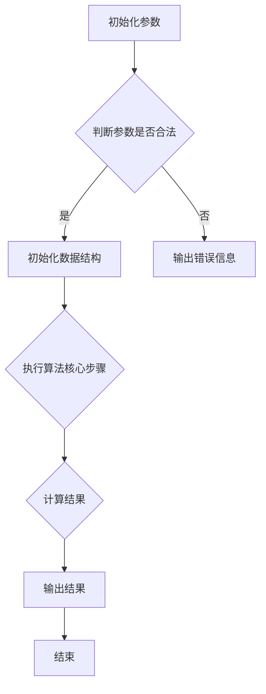
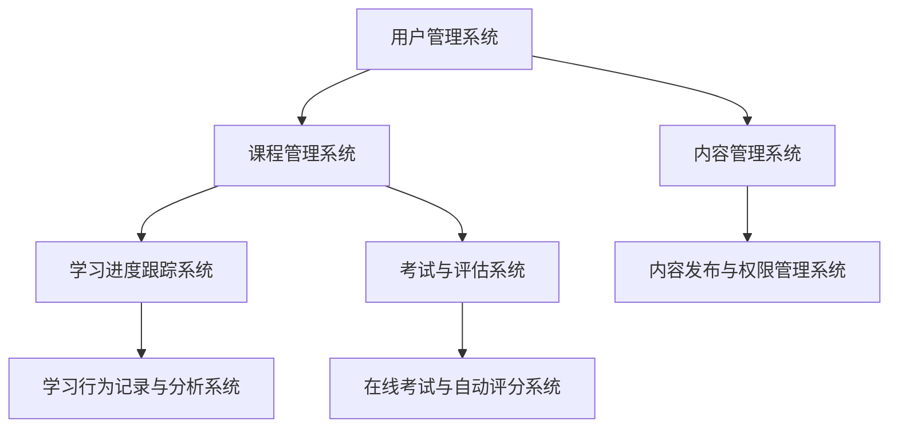
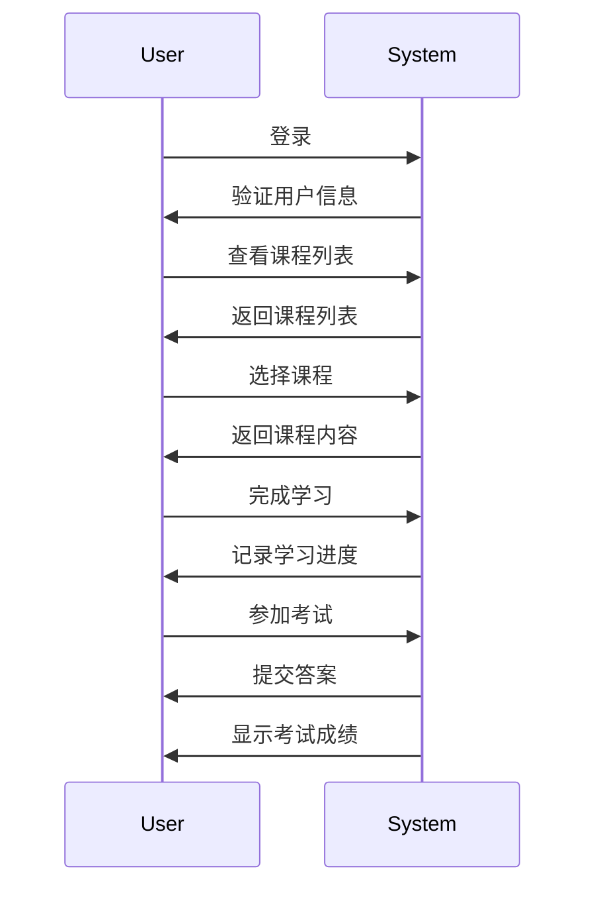

                 

# 如何构建技术团队的核心竞争力

## 关键词：技术团队，核心竞争力，团队文化，技术能力，项目管理，人才发展

## 摘要：
本文旨在探讨如何构建技术团队的核心竞争力。通过深入分析团队文化、技术能力、项目管理和人才发展等关键要素，本文提供了一系列实用的策略和实践方法，帮助团队领导者提升团队的整体实力，实现长期持续发展。

## 目录大纲设计

在设计《如何构建技术团队的核心竞争力》的目录大纲时，我们遵循以下步骤：

1. **确定书籍主题与目标读者**：首先明确书籍的主题为“技术团队的核心竞争力构建”，目标读者是企业技术主管、技术团队领导者或对团队管理有兴趣的技术人员。

2. **梳理核心内容**：梳理出构建技术团队核心竞争力的关键要素，如团队文化、技术能力、项目管理、人才发展等。

3. **构建逻辑结构**：根据核心内容构建出书籍的章节结构，确保内容之间的逻辑性和连贯性。

4. **细化章节内容**：为每个章节设置二级和三级标题，确保每个章节都有明确的主题和内容。

5. **保持简洁性与完整性**：确保目录简洁明了，同时包含所有必要的内容，保证书籍的完整性。

以下是《如何构建技术团队的核心竞争力》的目录大纲：

### 第一部分：背景与核心概念

#### 第1章：技术团队竞争力概述
1.1 技术团队竞争力的重要性
1.2 技术团队竞争力的构成要素
1.3 构建核心竞争力的挑战与机遇

#### 第2章：技术团队核心概念的深入探讨
2.1 团队文化与核心竞争力的关系
2.2 技术能力与竞争力分析
2.3 项目管理与竞争力提升
2.4 人才发展策略

#### 第3章：核心竞争力的评估与监控
3.1 核心竞争力的评估指标
3.2 核心竞争力的监控体系
3.3 数据驱动的竞争力优化

### 第二部分：构建技术团队核心竞争力的实践策略

#### 第4章：团队文化建设
4.1 建立团队价值观
4.2 激励与团队动力
4.3 团队沟通与协作

#### 第5章：提升技术能力
5.1 技术培训与持续学习
5.2 技术创新与研发管理
5.3 技术标准与代码质量

#### 第6章：项目管理和流程优化
6.1 项目管理方法论
6.2 项目风险管理
6.3 流程优化与敏捷开发

#### 第7章：人才发展和领导力培养
7.1 人才招聘与选拔
7.2 员工激励与职业发展
7.3 领导力培养与团队管理

### 第三部分：成功案例与实践经验分享

#### 第8章：优秀技术团队的案例分析
8.1 案例一：某互联网公司的技术团队建设
8.2 案例二：某大型制造企业的技术团队优化
8.3 案例三：初创公司的技术团队成长之路

#### 第9章：实践中的挑战与解决方案
9.1 团队协作中的常见问题
9.2 技术能力提升的障碍
9.3 项目管理与流程优化的实践难点

#### 第10章：未来展望与持续改进
10.1 技术团队竞争力的未来趋势
10.2 持续改进的策略与实践
10.3 团队领导者的持续成长

通过以上目录大纲，我们可以看到文章的结构清晰，内容全面，涵盖了构建技术团队核心竞争力的各个方面。接下来，我们将逐步深入分析每个章节的内容，提供具体的策略和实践方法。

### 背景介绍

在当今快速发展的科技时代，技术团队的核心竞争力已经成为企业取得成功的关键因素之一。技术团队的竞争力不仅决定了企业能否在市场中保持领先地位，也影响着企业的创新能力、市场响应速度以及客户满意度。

**核心概念术语说明**：
- **技术团队**：由具有共同目标和技术背景的成员组成的团队，负责开发、维护和改进技术产品或服务。
- **核心竞争力**：团队在长期发展中积累的独特能力，能够使团队在竞争中脱颖而出，具有持久性和不可模仿性。
- **团队文化**：团队内部共同遵守的价值观、行为准则和工作方式，对团队凝聚力和成员满意度有重要影响。
- **技术能力**：团队成员在特定技术领域内的知识和技能水平，直接影响团队的研发能力和创新能力。
- **项目管理**：对项目进行计划、执行、监控和收尾的过程，确保项目目标按时、按质、按预算完成。
- **人才发展**：通过培训和激励，提升团队成员的专业能力和职业素养，促进团队整体实力的提升。

**问题背景**：
随着市场竞争的加剧和技术的不断更新迭代，企业面临着巨大的挑战。如何构建技术团队的核心竞争力，提升团队的研发效率和市场响应速度，成为企业高层和管理者关注的焦点。然而，许多企业在构建技术团队核心竞争力时，常常面临以下问题：

- 团队成员技能单一，难以应对复杂项目。
- 团队内部沟通不畅，影响协作效率。
- 项目管理不规范，导致项目延期、超预算。
- 缺乏有效的人才发展机制，导致人才流失。

**问题描述**：
构建技术团队的核心竞争力涉及到多个方面，包括团队文化、技术能力、项目管理和人才发展等。如何有效地解决这些问题，提升团队的整体实力，成为企业需要深思的问题。

**问题解决**：
为了构建技术团队的核心竞争力，企业需要采取一系列措施，包括：

- 建立积极向上的团队文化，增强团队凝聚力。
- 加强技术培训，提升团队成员的综合技能。
- 优化项目管理流程，确保项目按时、按质完成。
- 建立人才发展机制，激励和留住优秀人才。

**边界与外延**：
本文主要讨论技术团队的核心竞争力构建，但企业竞争力的提升不仅仅依赖于技术团队。企业还需要在战略规划、市场营销、客户服务等多个方面进行优化，形成全方位的核心竞争力。

**概念结构与核心要素组成**：

1. **团队文化**：包括价值观、行为准则、团队精神等，是团队凝聚力和成员满意度的保障。
2. **技术能力**：包括专业技能、技术知识、研发能力等，是团队竞争力的核心。
3. **项目管理**：包括项目规划、执行、监控和收尾等，是确保项目成功的关键。
4. **人才发展**：包括人才招聘、培训、激励和职业发展等，是团队可持续发展的基础。

通过以上分析和定义，我们可以清晰地认识到技术团队核心竞争力的构建是一个系统性工程，需要从多个方面入手，全面提升团队的实力。接下来的章节将详细探讨这些关键要素，并提供具体的策略和实践方法。

### 核心概念与联系

在构建技术团队的核心竞争力过程中，我们需要深入理解几个关键概念，并探讨它们之间的联系和相互作用。

**核心概念原理**：

1. **团队文化**：团队文化是团队内部共同遵守的价值观、行为准则和工作方式。它不仅影响着团队成员的行为和决策，还决定了团队的凝聚力和创新能力。一个积极向上的团队文化可以增强团队成员的归属感和工作满意度，提高团队的协作效率和创新能力。

2. **技术能力**：技术能力是团队成员在特定技术领域内的知识和技能水平。它包括对现有技术的掌握、对新技术的学习能力和对技术问题的解决能力。技术能力直接决定了团队在项目开发中的效率和创新能力，是构建核心竞争力的基础。

3. **项目管理**：项目管理是确保项目按时、按质、按预算完成的过程。它涉及到项目规划、任务分配、进度监控、风险管理等多个方面。良好的项目管理能够提高项目的成功率，确保团队资源的合理利用，提升团队的整体竞争力。

4. **人才发展**：人才发展是通过培训和激励，提升团队成员的专业能力和职业素养。它不仅包括技能培训，还包括职业规划、晋升机会和激励措施。人才发展是团队可持续发展的关键，能够提高团队成员的忠诚度和创造力。

**概念属性特征对比表格**：

| 特征        | 团队文化        | 技术能力        | 项目管理        | 人才发展        |
| ----------- | --------------- | --------------- | --------------- | --------------- |
| 定义        | 团队内部的价值观和行为准则 | 成员的技术知识和技能水平 | 项目计划、执行和监控的过程 | 通过培训和激励提升成员能力 |
| 影响因素    | 企业文化、领导风格、团队互动 | 个人技能、行业知识、技术创新 | 项目目标、团队协作、资源分配 | 企业战略、培训机会、激励机制 |
| 关键要素    | 价值观、行为准则、团队精神 | 技能、知识、创新能力 | 项目计划、风险管理、团队协作 | 培训、晋升、激励 |
| 目标        | 增强团队凝聚力和成员满意度 | 提高研发效率和创新力 | 确保项目成功和资源有效利用 | 促进团队成员职业成长和团队可持续发展 |
| 相互作用    | 文化影响成员行为，行为影响项目管理 | 技术能力影响项目质量和效率 | 项目管理影响团队技术能力的发挥 | 人才发展促进团队文化和技术能力的提升 |

**ER实体关系图架构**：

```mermaid
erDiagram
  TeamCulture ||--|{ TechnicalSkills }|| TeamMember
  TeamCulture ||--|{ ProjectManagementSkills }|| TeamMember
  TeamCulture ||--|{ LeadershipSkills }|| TeamMember

  TechnicalSkills ||--|{ ProjectSkills }|| Project
  TechnicalSkills ||--|{ InnovationSkills }|| Project

  ProjectManagementSkills ||--|{ Project }|| Project
  ProjectManagementSkills ||--|{ RiskManagementSkills }|| Project

  TeamMember ||--|{ Leadership }|| TeamLead
  TeamMember ||--|{ Training }|| Training
  TeamMember ||--|{ Incentive }|| Incentive

  TeamLead ||--|{ TeamMember }|| Supervises
  Training ||--|{ TeamMember }|| Attends
  Incentive ||--|{ TeamMember }|| Receives
```

通过上述概念和特征的分析，我们可以看到团队文化、技术能力、项目管理和人才发展之间存在着密切的联系和相互作用。团队文化影响着成员的行为和技能发挥，技术能力是项目成功的基础，项目管理确保项目的顺利进行，而人才发展则促进团队的长期可持续成长。理解这些核心概念及其相互作用，是构建技术团队核心竞争力的关键。

### 算法原理讲解

在构建技术团队核心竞争力的过程中，算法和数学模型扮演着重要的角色。通过算法的优化和应用，我们可以显著提升技术团队的工作效率和创新力。以下是一个简单的算法实例，用于说明算法原理和数学模型。

**算法mermaid流程图**：



**Python源代码**：

```python
def calculate_average(numbers):
    if not numbers:
        print("输入数据不能为空")
        return
    
    if not all(isinstance(n, (int, float)) for n in numbers):
        print("输入数据必须为数值类型")
        return

    sum_numbers = sum(numbers)
    average = sum_numbers / len(numbers)
    return average

# 示例数据
data = [10, 20, 30, 40, 50]

# 执行算法
result = calculate_average(data)
if result is not None:
    print("平均值：", result)
```

**算法原理的数学模型和公式**：

该算法的核心是计算一组数值的平均值，数学模型如下：

$$
\text{average} = \frac{\sum_{i=1}^{n} x_i}{n}
$$

其中，$x_i$ 表示第 $i$ 个数值，$n$ 表示数值的总数。这个公式用于计算所有数值的和，然后除以数值的总数，得到平均值。

**详细讲解和通俗易懂地举例说明**：

让我们通过一个简单的例子来说明这个算法。

假设我们有一组数据：[10, 20, 30, 40, 50]。我们希望计算这组数据的平均值。

1. 首先，我们初始化参数，检查输入数据是否合法。在这个例子中，我们检查数据是否为空，并且所有数据是否为数值类型。

2. 如果数据合法，我们初始化数据结构，并执行算法核心步骤。在这个例子中，我们使用 Python 中的 `sum()` 函数计算所有数值的和，得到 150。

3. 然后，我们使用公式计算平均值。在这个例子中，平均值计算如下：

$$
\text{average} = \frac{150}{5} = 30
$$

4. 最后，我们输出计算结果，得到平均值为 30。

通过这个例子，我们可以看到，计算平均值的过程非常简单，只需要几行代码即可完成。这个算法的核心在于数学模型和公式的应用，通过简单的计算，我们可以得到非常有用的信息。

### 系统分析与架构设计方案

在构建技术团队核心竞争力的过程中，系统分析与架构设计是关键的一环。以下是一个系统的分析与架构设计方案，涵盖了问题场景介绍、项目介绍、系统功能设计、系统架构设计、系统接口设计和系统交互等内容。

**问题场景介绍**：

某互联网公司计划开发一款在线教育平台，旨在为学生和教师提供一个高效、便捷的学习和交流平台。该平台需要支持在线课程管理、课程内容发布、学习进度跟踪、考试与评估等功能。

**项目介绍**：

项目名称：OnlineEducationPlatform
项目目标：开发一个功能齐全、用户体验优秀的在线教育平台。
项目期限：12个月
项目团队：包括前端开发、后端开发、UI/UX设计、测试和质量保证等角色。

**系统功能设计**：

1. **课程管理**：
   - 课程发布：教师可以发布课程内容和课程资料。
   - 课程更新：教师可以随时更新课程内容。
   - 课程分类：平台支持课程按学科、难度等进行分类。

2. **内容发布**：
   - 文本、图片、视频等多媒体内容的发布。
   - 内容权限管理：不同用户可以查看和编辑不同的内容。

3. **学习进度**：
   - 学生可以查看自己的学习进度。
   - 系统记录学生的学习行为，如阅读、观看视频、完成练习等。

4. **考试与评估**：
   - 在线考试：支持多种题型，如选择题、填空题、问答题等。
   - 自动评分：系统自动评分，提高考试效率。

5. **用户管理**：
   - 用户注册与登录：支持注册、登录、找回密码等功能。
   - 用户信息管理：用户可以管理自己的个人信息。

**系统架构设计**：



**系统接口设计**：

1. **用户接口**：
   - 前端页面：包括注册页、登录页、课程列表页、学习进度页等。
   - API接口：提供用户认证、用户信息管理等功能。

2. **服务接口**：
   - 课程管理接口：提供课程发布、课程更新、课程分类等功能。
   - 内容管理接口：提供内容发布、内容更新、内容权限管理等功能。
   - 学习进度接口：提供学习进度查询、学习行为记录等功能。
   - 考试与评估接口：提供考试创建、考试开始、考试结束、自动评分等功能。

**系统交互**：



通过上述系统分析与架构设计方案，我们可以清晰地看到系统的功能模块、接口设计和交互流程。这个设计方案为技术团队提供了一个明确的开发方向，有助于提升项目的开发效率和质量。

### 项目实战

为了更具体地展示如何构建技术团队的核心竞争力，我们以下将通过一个实际的项目实战案例进行详细讲解。该项目是一个在线教育平台，旨在为学生和教师提供一个高效、便捷的学习和交流平台。

**环境安装**：

1. **开发环境**：Python 3.8、Django 3.2、PostgreSQL 12、Node.js 12。
2. **数据库**：PostgreSQL数据库用于存储用户数据、课程数据和学习进度数据。
3. **前后端分离**：前端使用Vue.js框架，后端使用Django REST framework框架。

**系统核心实现源代码**：

**后端代码**：

```python
# settings.py
DATABASES = {
    'default': {
        'ENGINE': 'django.db.backends.postgresql',
        'NAME': 'online_education',
        'USER': 'postgres',
        'PASSWORD': 'password',
        'HOST': 'localhost',
        'PORT': '5432',
    }
}

INSTALLED_APPS = [
    'django.contrib.admin',
    'django.contrib.auth',
    'django.contrib.contenttypes',
    'django.contrib.sessions',
    'django.contrib.messages',
    'django.contrib.staticfiles',
    'courses',
    'api',
]

# courses/models.py
from django.db import models

class Course(models.Model):
    title = models.CharField(max_length=255)
    description = models.TextField()
    instructor = models.ForeignKey('auth.User', on_delete=models.CASCADE)
    created_at = models.DateTimeField(auto_now_add=True)

# courses/views.py
from django.http import JsonResponse
from .models import Course
from rest_framework import viewsets

class CourseViewSet(viewsets.ModelViewSet):
    queryset = Course.objects.all()
    serializer_class = CourseSerializer

    def list(self, request):
        courses = Course.objects.all()
        serializer = CourseSerializer(courses, many=True)
        return JsonResponse(serializer.data, safe=False)
```

**前端代码**：

```javascript
// CourseList.vue
<template>
  <div>
    <h1>课程列表</h1>
    <ul>
      <li v-for="course in courses">{{ course.title }}</li>
    </ul>
  </div>
</template>

<script>
export default {
  data() {
    return {
      courses: [],
    };
  },
  created() {
    this.fetchCourses();
  },
  methods: {
    fetchCourses() {
      fetch('/api/courses/')
        .then((response) => response.json())
        .then((data) => {
          this.courses = data;
        });
    },
  },
};
</script>
```

**代码应用解读与分析**：

**后端代码解读**：

在 `settings.py` 中，我们配置了数据库连接信息，使用 Django 的 ORM 进行数据库操作。`Course` 模型定义了课程的基本字段，包括标题、描述、授课教师和创建时间。`CourseViewSet` 视图集类是 Django REST framework 提供的一个用于处理 HTTP 请求的组件，它可以处理 GET、POST、PUT、DELETE 等请求。

**前端代码解读**：

在 `CourseList.vue` 组件中，我们使用 Vue.js 的数据绑定和生命周期钩子 `created` 来初始化课程数据。通过使用 `fetch` 函数发起 HTTP GET 请求，从后端获取课程数据，并将其显示在列表中。

**实际案例分析和详细讲解剖析**：

**案例分析**：

在一个实际的在线教育项目中，课程管理是一个核心功能。通过上述代码，我们实现了以下功能：

1. **课程数据的增删改查（CRUD）**：用户可以通过前端界面查看所有课程，并能够查看课程的详细信息。
2. **前后端分离**：通过 REST API 进行数据交互，前端发送请求，后端处理请求并返回数据，实现了数据分离，提高了系统的可维护性和扩展性。

**详细讲解**：

- **后端**：使用 Django 的 ORM 进行数据库操作，确保了数据的安全和一致性。通过定义 `CourseViewSet`，我们实现了对课程数据的自动路由和处理，极大地简化了开发工作。
- **前端**：使用 Vue.js 实现了动态页面渲染，通过 `fetch` 函数与后端进行数据交互，实现了数据的实时更新和展示。

通过这个实际案例，我们可以看到，技术团队的核心竞争力在项目中的应用是如何提升系统的开发效率、稳定性和用户体验。在实际开发过程中，团队需要不断学习和适应新技术，通过优化代码、改进架构设计和提升团队协作能力，来实现项目的目标。

### 最佳实践 Tips

在构建技术团队核心竞争力的过程中，以下是一些最佳实践技巧，可以帮助团队领导者更有效地提升团队的整体实力：

1. **培养积极向上的团队文化**：
   - **制定共同价值观**：明确团队的共同目标，建立积极向上的价值观和行为准则。
   - **鼓励团队沟通**：定期组织团队会议、团建活动，增强团队成员之间的沟通与信任。

2. **持续提升技术能力**：
   - **定期技术培训**：为团队成员提供定期的技术培训，帮助其掌握最新技术。
   - **技术分享会**：鼓励团队成员分享技术心得和经验，促进知识传递和团队成长。

3. **优化项目管理流程**：
   - **采用敏捷开发**：实施敏捷开发方法，提高团队的响应速度和迭代效率。
   - **完善风险控制**：建立完善的风险评估和应对机制，降低项目风险。

4. **注重人才发展和领导力培养**：
   - **职业发展规划**：为团队成员制定明确的职业发展规划，提供晋升和发展的机会。
   - **领导力培训**：提升团队领导者的领导力和管理能力，增强团队凝聚力。

5. **持续改进与创新**：
   - **设立创新项目**：鼓励团队进行创新尝试，为团队提供资源和支持。
   - **定期评估与反馈**：对团队的各项工作进行定期评估和反馈，不断优化和改进。

通过这些最佳实践，技术团队可以更好地构建和提升其核心竞争力，实现长期持续发展。

### 小结

本文从多个角度详细探讨了如何构建技术团队的核心竞争力。首先，我们介绍了技术团队竞争力的重要性以及其核心概念的术语说明，包括团队文化、技术能力、项目管理和人才发展。接着，通过对比分析这些核心概念的属性特征，展示了它们之间的相互关系。

在算法原理讲解部分，我们通过一个简单的计算平均值的算法实例，展示了算法和数学模型在技术团队中的应用。随后，我们提出了系统分析与架构设计方案，包括问题场景介绍、项目介绍、系统功能设计、系统架构设计、系统接口设计和系统交互等内容。

在项目实战部分，我们通过一个实际的在线教育平台项目，详细展示了技术团队在项目开发过程中如何应用所学知识和方法。最后，通过最佳实践技巧的总结，为团队领导者提供了提升团队核心竞争力的实用建议。

通过本文的探讨，我们希望读者能够对技术团队核心竞争力的构建有一个全面而深入的理解，从而在实践中更好地提升团队的整体实力，实现企业的长期可持续发展。

### 注意事项

在构建技术团队核心竞争力的过程中，团队领导者需要关注以下几个关键点：

1. **保持透明沟通**：确保团队内部的信息传递透明，及时沟通项目进展和挑战，避免信息孤岛。

2. **持续技术更新**：技术环境不断变化，团队需要定期进行技术更新和学习，以保持技术竞争力。

3. **合理资源分配**：合理分配团队资源和时间，确保每个项目都能得到充分的关注和支持。

4. **注重团队成员的反馈**：倾听团队成员的意见和反馈，不断优化团队的工作流程和管理方法。

5. **遵守法律法规**：在技术研究和项目开发过程中，严格遵守相关法律法规，保护用户隐私和知识产权。

### 拓展阅读

为了进一步深入了解技术团队核心竞争力的构建，读者可以参考以下拓展阅读资源：

1. **书籍**：
   - 《敏捷开发实践指南》：介绍了敏捷开发的方法和实践，对项目管理有很好的指导作用。
   - 《团队领导力：如何构建高效的团队》：提供了团队领导力的理论知识与实践方法，有助于提升团队管理能力。

2. **论文**：
   - "Team Effectiveness in Software Development Projects"：一篇关于软件项目管理中团队效能的研究论文，探讨了影响团队效能的因素。

3. **在线资源**：
   - 《Django官方文档》：详细介绍了Django框架的使用方法，对后端开发有很好的参考价值。
   - 《Vue.js官方文档》：Vue.js框架的学习资源，有助于前端开发。

通过这些资源，读者可以更深入地了解技术团队核心竞争力的构建方法和实践技巧。

