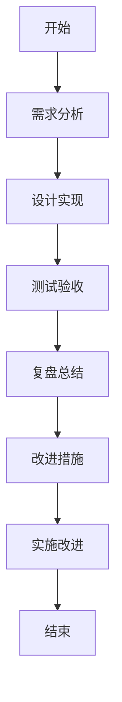
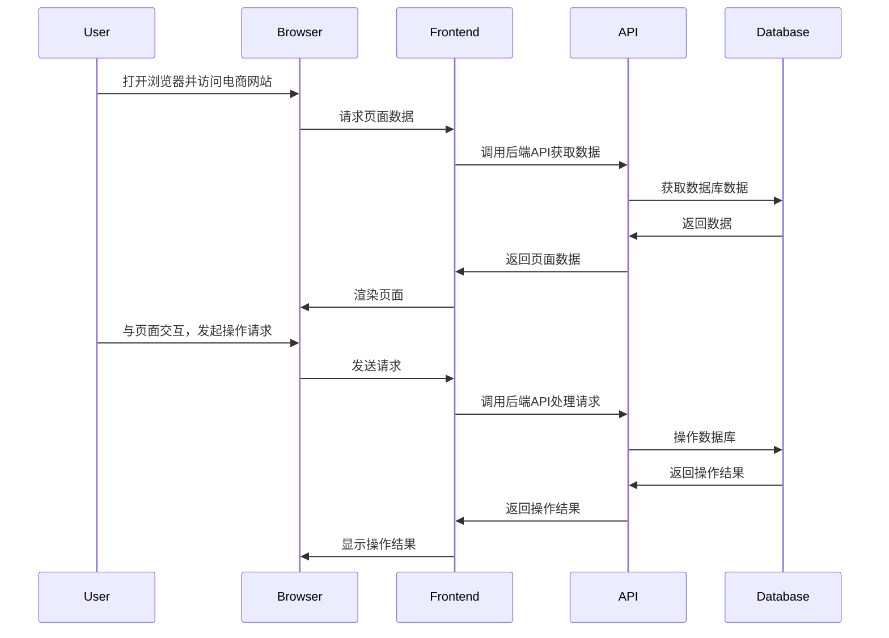

                 


### 技术复盘概述

#### 1.1 技术复盘的重要性与背景

**概念解释**：
技术复盘，顾名思义，是对某项技术实现或项目执行过程进行回顾、分析、总结，以发现过程中的成功与不足，提炼经验和教训，为未来的技术实施提供参考。

**问题背景**：
在现代信息技术快速发展的背景下，技术迭代速度日益加快，对项目的成功实施提出了更高的要求。然而，项目实施过程中常常会遇到各种挑战，如需求变更、技术难题、团队协作不畅等问题。如何有效应对这些挑战，提高项目的成功率，成为每个技术团队必须面对的问题。

**问题描述**：
技术复盘正是为了解决上述问题而诞生的。它不仅可以帮助团队总结项目实施过程中的得失，还能通过反思找出潜在的问题，为未来类似项目提供有益的借鉴。

**问题解决**：
通过技术复盘，团队可以：
1. 认识到项目实施中的成功之处，巩固优势。
2. 查找项目中的不足，制定改进措施。
3. 提高团队的技术水平和项目管理能力。

**边界与外延**：
技术复盘不仅适用于单一项目，还可以应用于整个产品线、技术方向乃至企业层面的技术战略规划。其核心在于通过持续的反思和总结，不断优化技术实施过程，提高整体技术竞争力。

**概念结构与核心要素组成**：
技术复盘的基本概念结构包括以下几个核心要素：
1. **技术实现过程**：即项目的实施过程，是复盘的基础。
2. **成功与不足**：对实施过程中的亮点和问题进行识别和总结。
3. **经验与教训**：通过成功与不足的分析，提炼出可借鉴的经验和教训。
4. **改进措施**：根据复盘结果，制定针对性的改进措施，为未来项目提供指导。

#### 1.2 核心概念与联系

**核心概念**：
- 技术复盘：对技术实施过程进行回顾、分析、总结。
- 技术实施：指项目的技术实现过程。
- 项目管理：涉及项目的计划、执行、监控和收尾过程。
- 技术竞争力：企业在技术领域中的综合竞争力。

**概念属性特征对比表格**：

| 概念         | 属性特征                                       |
|------------|--------------------------------------------|
| 技术复盘     | 回顾、分析、总结技术实施过程                   |
| 技术实施     | 技术实现过程，包括需求分析、设计、开发、测试等阶段 |
| 项目管理     | 计划、执行、监控、收尾等全过程的管理            |
| 技术竞争力     | 企业在技术领域的综合实力，包括技术水平、创新能力等 |

**ER实体关系图架构**：

```mermaid
erDiagram
    Product -->|1| Implementation
    Implementation ||--|> Project
    Project ||--|> Management
    Management ||--|> Competence
```

#### 1.3 算法原理讲解

**算法流程图**：



**算法原理**：
技术复盘的算法原理可以简单概括为“回顾-分析-总结-改进”四个步骤。具体如下：

1. **回顾**：对技术实施过程进行全面的回顾，包括需求分析、设计实现、测试验收等各个环节。
2. **分析**：分析回顾过程中发现的成功与不足，识别出关键问题和潜在风险。
3. **总结**：将分析结果进行总结，提炼出经验教训，为未来项目提供参考。
4. **改进**：根据总结的结果，制定具体的改进措施，并在后续项目中实施。

**数学模型和公式**：

技术复盘的数学模型可以表示为：

$$
复盘效果 = 回顾质量 \times 分析深度 \times 总结准确度 \times 改进效率
$$

其中：
- 回顾质量：指回顾过程的完整性、准确性和深度。
- 分析深度：指对回顾结果的分析程度，包括问题的识别、原因分析和解决方案探讨。
- 总结准确度：指对分析结果的总结是否准确，是否能够有效提炼出经验教训。
- 改进效率：指改进措施的实施效果，包括改进措施的实施速度和效果。

**举例说明**：
假设一个技术团队在完成一个项目的实施后，进行了技术复盘。以下是一个简单的技术复盘过程及其数学模型的示例：

- **回顾质量**：团队对项目的回顾非常全面，涵盖了需求分析、设计实现、测试验收等各个环节，未遗漏重要细节。
- **分析深度**：团队对每个环节的问题进行了深入的挖掘，找到了根本原因，并制定了针对性的解决方案。
- **总结准确度**：团队将分析结果进行了准确的总结，提炼出了有效的经验教训，为未来项目提供了宝贵的参考。
- **改进效率**：团队根据总结的结果，迅速制定了改进措施，并在后续项目中有效实施，取得了显著的效果。

根据上述示例，我们可以计算技术复盘的效果：

$$
复盘效果 = 0.9 \times 0.9 \times 0.95 \times 0.9 = 0.729
$$

这说明技术复盘的效果较好，团队在后续项目中有望取得更好的成绩。

#### 1.4 系统分析与架构设计方案

**问题场景介绍**：
假设我们正在开发一个电子商务平台，该项目包括用户注册、商品展示、购物车、订单处理等多个功能模块。为了确保项目的成功实施，我们需要对技术实施过程进行复盘，以发现并解决问题。

**项目介绍**：
项目名称：电子商务平台
项目范围：用户注册、商品展示、购物车、订单处理等功能模块
项目周期：3个月
团队规模：5人

**系统功能设计**：

- 用户注册：允许用户创建账户，输入基本信息。
- 商品展示：展示商品信息，包括商品名称、价格、描述等。
- 购物车：允许用户将商品添加到购物车，进行购买。
- 订单处理：处理用户订单，包括生成订单、支付、发货等。

**系统架构设计**：

1. **技术栈选择**：
   - 前端：React.js
   - 后端：Spring Boot
   - 数据库：MySQL
   - 容器化：Docker

2. **系统架构图**：



**系统接口设计**：

1. **用户注册接口**：
   - 接口名称：/user/register
   - 请求方法：POST
   - 请求参数：username, password, email
   - 返回结果：{status: "success", message: "注册成功", data: {userId: 1}}

2. **商品展示接口**：
   - 接口名称：/product/list
   - 请求方法：GET
   - 返回结果：{status: "success", message: "获取商品列表成功", data: [{productId: 1, productName: "iPhone 13", price: 7999}, ...]}

3. **购物车接口**：
   - 接口名称：/cart/add
   - 请求方法：POST
   - 请求参数：userId, productId
   - 返回结果：{status: "success", message: "添加购物车成功"}

**系统交互序列图**：


#### 1.5 本章小结

本章对技术复盘的概述进行了详细阐述，包括其重要性与背景、核心概念与联系、算法原理讲解、系统分析与架构设计方案。通过本章的学习，读者可以了解技术复盘的基本概念和实施方法，为后续章节的深入学习打下基础。在接下来的章节中，我们将进一步探讨技术复盘的实践步骤、案例分析、优化与提升等内容，帮助读者全面掌握技术复盘的技巧和最佳实践。

### 技术复盘的实践步骤

#### 2.1 技术复盘的准备阶段

**确定技术复盘的目标**

在准备阶段，首先要明确技术复盘的目标。复盘的目标可以分为以下几个方面：
- 识别项目中的成功与不足
- 总结经验教训，提炼出可借鉴的方法
- 发现潜在的问题和风险，制定改进措施
- 提升团队的技术水平和项目管理能力

明确目标有助于在后续的复盘过程中保持清晰的方向，确保复盘的实效性。

**组建技术复盘团队**

技术复盘是一项系统性工作，需要多部门、多角色的参与。通常，复盘团队应包括以下角色：
- 项目经理：负责整体协调和组织复盘工作
- 技术负责人：负责技术层面的复盘分析
- 业务人员：提供业务需求理解和反馈
- 开发人员：提供技术实现细节和问题反馈
- 测试人员：提供测试结果和问题反馈
- 产品经理：提供产品功能和用户体验方面的反馈

组建一个多元化的团队可以确保复盘的全面性和深度，从而得出更准确、有效的结论。

**准备技术复盘的资料**

为了确保复盘的顺利进行，需要提前准备相关的资料。这些资料包括：
- 项目文档：需求说明书、设计文档、测试文档等
- 项目日志：开发过程中产生的日志文件，包括错误日志、调试日志等
- 项目数据：用户行为数据、系统性能数据、错误统计等
- 用户反馈：用户反馈报告、用户访谈记录等
- 第三方评估：外部专家的评估报告、行业报告等

准备充分的资料可以为复盘提供有力支持，帮助团队更好地发现问题和总结经验。

#### 2.2 技术复盘的执行阶段

**技术复盘会议的组织**

技术复盘会议是复盘过程中的核心环节，通常包括以下几个步骤：
1. **会议筹备**：确定会议时间、地点、参与人员，并发送会议通知。
2. **会议议程**：制定会议议程，包括回顾总结、问题分析、经验教训分享、改进措施制定等环节。
3. **会议记录**：会议过程中应做好记录，包括讨论的要点、结论、行动计划等。
4. **会议反馈**：会议结束后，向团队成员反馈会议结果，确保每个人对复盘结果有清晰的认识。

**技术复盘的资料收集**

在执行阶段，需要收集与项目相关的各种资料，包括：
- 项目文档：再次审查项目文档，确保对项目有全面的了解。
- 项目日志：分析日志文件，发现潜在的问题和异常。
- 项目数据：分析用户行为数据和系统性能数据，评估项目效果和性能。
- 用户反馈：整理用户反馈，了解用户的真实需求和体验。
- 第三方评估：参考外部专家的评估报告，获取更客观的评价。

**问题识别与分析**

在资料收集完成后，团队需要对收集到的资料进行深入分析，识别项目中的问题和不足。具体步骤如下：
1. **问题分类**：将识别出的问题进行分类，如技术问题、管理问题、用户体验问题等。
2. **问题原因分析**：对每个问题进行原因分析，找出根本原因。
3. **问题影响评估**：评估每个问题对项目的影响程度，确定优先级。

**总结经验与教训**

在问题识别与分析的基础上，团队需要对项目的成功经验和教训进行总结。具体步骤如下：
1. **成功经验总结**：总结项目中的亮点和成功经验，提炼出可借鉴的方法。
2. **教训总结**：总结项目中的不足和教训，找出改进的方向。

#### 2.3 技术复盘的总结阶段

**技术复盘的成果总结**

在总结阶段，团队需要将复盘过程中发现的问题、经验教训和改进措施进行汇总，形成最终的技术复盘报告。报告应包括以下内容：
- 项目概况：项目背景、范围、周期等基本信息。
- 复盘目的：明确复盘的目标和预期成果。
- 问题识别与分析：详细列出识别出的问题，以及问题的原因和影响。
- 经验教训总结：总结项目中的成功经验和教训。
- 改进措施：制定具体的改进措施，包括实施计划和责任分工。

**技术复盘的经验与教训总结**

在成果总结的基础上，团队需要对复盘过程中的经验与教训进行系统总结。具体步骤如下：
1. **经验分享**：将成功经验进行分享，帮助团队成员学习借鉴。
2. **教训反思**：对项目中的不足进行反思，找出改进的方法。
3. **知识沉淀**：将经验教训整理成文档或教程，作为团队的财富传承。

**技术复盘的持续改进计划**

为了确保技术复盘的成果能够得到有效应用，团队需要制定具体的持续改进计划。具体步骤如下：
1. **改进目标**：明确改进的目标和方向，确保改进措施具有针对性。
2. **实施计划**：制定详细的实施计划，包括时间表、责任人等。
3. **跟进与评估**：对改进措施的实施进行跟进和评估，确保改进效果。

#### 2.4 技术复盘的跟踪与反馈

**技术复盘的跟踪方法**

为了确保技术复盘的成果能够持续改进，团队需要制定有效的跟踪方法。具体步骤如下：
1. **定期复盘**：定期对项目进行复盘，检查改进措施的实施情况。
2. **数据监控**：通过数据监控和分析，发现潜在的问题和异常。
3. **用户反馈**：收集用户反馈，了解改进措施对用户满意度的影响。

**技术复盘的反馈机制**

为了确保复盘的成果能够得到有效应用，团队需要建立反馈机制。具体步骤如下：
1. **反馈渠道**：建立多种反馈渠道，如邮件、在线问卷、面对面交流等，方便团队成员和用户提出反馈。
2. **反馈整理**：对收集到的反馈进行整理和分析，找出改进的方向。
3. **反馈处理**：对反馈进行处理，包括解决问题、调整策略等。

**技术复盘的优化与调整**

在跟踪与反馈过程中，团队需要根据反馈结果对复盘成果进行优化和调整。具体步骤如下：
1. **问题整改**：针对识别出的问题，制定整改措施，确保问题得到有效解决。
2. **策略调整**：根据反馈结果，调整项目实施策略，优化项目流程和资源配置。
3. **持续改进**：将优化和调整措施纳入项目实施计划，确保持续改进的落实。

#### 2.5 本章小结

本章详细介绍了技术复盘的实践步骤，包括准备阶段、执行阶段、总结阶段、跟踪与反馈等内容。通过技术复盘，团队可以识别项目中的问题，总结经验教训，制定改进措施，为未来的项目实施提供有力支持。在接下来的章节中，我们将通过具体案例研究，进一步探讨技术复盘的实施方法和最佳实践。

### 技术复盘案例研究

#### 3.1 案例研究概述

**案例背景**：
某互联网公司正在开发一款全新的移动电商应用程序。该项目涉及用户注册、商品浏览、购物车、订单支付等多个功能模块。为了确保项目的顺利进行，公司决定在项目结束后进行技术复盘，以总结经验教训，为未来类似项目提供参考。

**案例研究目标**：
1. 识别项目实施过程中的成功经验和不足。
2. 总结项目实施过程中的关键问题和解决方案。
3. 提升团队的技术水平和项目管理能力。

**案例研究范围**：
技术复盘的范围包括项目需求分析、设计实现、测试验收等各个环节。具体涉及以下模块：
1. 用户注册与登录
2. 商品浏览与展示
3. 购物车功能
4. 订单支付与处理

#### 3.2 技术复盘的执行阶段

**技术复盘准备阶段**

在技术复盘的准备阶段，团队进行了以下工作：
1. 确定技术复盘的目标和范围，制定复盘计划。
2. 组建技术复盘团队，包括项目经理、技术负责人、业务人员、开发人员、测试人员等。
3. 收集与项目相关的资料，包括项目文档、日志文件、用户反馈等。

**技术复盘会议的组织**

技术复盘会议分为以下几个环节：
1. **会议筹备**：确定会议时间、地点、参与人员，并发送会议通知。
2. **会议议程**：制定会议议程，包括项目回顾、问题分析、经验教训总结、改进措施制定等。
3. **会议记录**：会议过程中做好记录，包括讨论的要点、结论、行动计划等。
4. **会议反馈**：会议结束后，向团队成员反馈会议结果，确保每个人对复盘结果有清晰的认识。

**技术复盘的资料收集**

在执行阶段，团队进行了以下资料的收集：
1. **项目文档**：包括需求说明书、设计文档、测试文档等。
2. **项目日志**：包括开发过程中的日志文件，如错误日志、调试日志等。
3. **项目数据**：包括用户行为数据、系统性能数据、错误统计等。
4. **用户反馈**：包括用户反馈报告、用户访谈记录等。
5. **第三方评估**：包括外部专家的评估报告、行业报告等。

**问题识别与分析**

在资料收集完成后，团队进行了以下工作：
1. **问题分类**：将识别出的问题分为技术问题、管理问题、用户体验问题等。
2. **原因分析**：对每个问题进行原因分析，找出根本原因。
3. **影响评估**：评估每个问题对项目的影响程度，确定优先级。

**总结经验与教训**

在问题识别与分析的基础上，团队进行了以下工作：
1. **成功经验总结**：总结项目中的亮点和成功经验，提炼出可借鉴的方法。
2. **教训总结**：总结项目中的不足和教训，找出改进的方向。

#### 3.3 技术复盘的总结阶段

**技术复盘的成果总结**

在总结阶段，团队将复盘过程中发现的问题、经验教训和改进措施进行了汇总，形成了最终的技术复盘报告。报告包括以下内容：
1. **项目概况**：项目背景、范围、周期等基本信息。
2. **复盘目的**：明确复盘的目标和预期成果。
3. **问题识别与分析**：详细列出识别出的问题，以及问题的原因和影响。
4. **经验教训总结**：总结项目中的成功经验和教训。
5. **改进措施**：制定具体的改进措施，包括实施计划和责任分工。

**技术复盘的经验与教训总结**

在成果总结的基础上，团队对复盘过程中的经验与教训进行了系统总结。具体包括：
1. **经验分享**：将成功经验进行分享，帮助团队成员学习借鉴。
2. **教训反思**：对项目中的不足进行反思，找出改进的方法。
3. **知识沉淀**：将经验教训整理成文档或教程，作为团队的财富传承。

**技术复盘的持续改进计划**

为了确保技术复盘的成果能够得到有效应用，团队制定了以下持续改进计划：
1. **改进目标**：明确改进的目标和方向，确保改进措施具有针对性。
2. **实施计划**：制定详细的实施计划，包括时间表、责任人等。
3. **跟进与评估**：对改进措施的实施进行跟进和评估，确保改进效果。

#### 3.4 案例研究的总结与反思

**案例研究的总结**

通过本次技术复盘案例研究，团队达到了以下目标：
1. 识别了项目实施过程中的成功经验和不足。
2. 总结了项目实施过程中的关键问题和解决方案。
3. 提升了团队的技术水平和项目管理能力。

**案例研究的反思**

在反思过程中，团队发现了一些需要改进的地方：
1. **需求管理**：在项目初期，对需求的理解不够深入，导致后期需求变更频繁，影响了项目进度。
2. **团队协作**：在项目实施过程中，部分团队成员的沟通不畅，影响了工作效率。
3. **风险管理**：在项目风险识别和应对方面，还有待加强，部分风险未能及时识别和应对。

**案例研究的未来展望**

基于本次复盘的总结与反思，团队计划在未来的项目中进行以下改进：
1. **加强需求管理**：在项目初期，对需求进行充分讨论和评审，确保需求明确、稳定。
2. **提升团队协作**：加强团队成员之间的沟通与协作，提高工作效率。
3. **完善风险管理**：建立完善的风险管理机制，及时识别和应对项目风险。

通过持续改进，团队希望在未来项目中实现更高的成功率，提升企业的技术竞争力。

#### 3.5 本章小结

本章通过一个实际案例，详细介绍了技术复盘的执行阶段和总结阶段的具体操作步骤。通过案例研究，读者可以更好地理解技术复盘的实施方法和重要性。在接下来的章节中，我们将进一步探讨技术复盘的优化与提升策略，以及注意事项和风险对策，帮助读者全面提升技术复盘的能力。

### 技术复盘的优化与提升

#### 4.1 技术复盘的优化策略

**优化技术复盘的流程**

为了提高技术复盘的效率和质量，我们可以从以下几个方面对复盘流程进行优化：
1. **标准化复盘流程**：制定统一的复盘流程模板，确保每个项目在复盘过程中遵循相同的步骤和标准。
2. **缩短复盘时间**：优化复盘会议的议程和内容，减少不必要的讨论，确保复盘会议在规定时间内完成。
3. **增加复盘频率**：定期进行复盘，及时总结项目经验教训，有助于及时发现和解决问题。

**优化技术复盘的工具**

选择合适的工具可以提高技术复盘的效率和质量。以下是一些常用的复盘工具：
1. **文档工具**：如Confluence、Notion等，用于记录和整理复盘过程中的文档和资料。
2. **会议工具**：如Zoom、Microsoft Teams等，用于组织和技术复盘会议。
3. **数据分析工具**：如Google Analytics、Splunk等，用于收集和分析项目数据，辅助问题识别和分析。
4. **项目管理工具**：如Jira、Trello等，用于追踪和监控复盘过程中的任务和进度。

**优化技术复盘的方法**

为了提升技术复盘的效果，我们可以采用以下方法：
1. **引入外部专家**：邀请外部专家参与复盘过程，提供客观、专业的意见和建议。
2. **多角色参与**：确保项目涉及的不同角色（如项目经理、开发人员、测试人员、业务人员等）都能参与到复盘过程中，从不同角度提出问题和建议。
3. **数据驱动的复盘**：基于实际数据和用户反馈，进行有针对性的分析和总结，提高复盘的准确性和有效性。

#### 4.2 技术复盘的持续改进

**持续改进的机制**

为了确保技术复盘的成果能够持续改进，团队需要建立以下机制：
1. **定期复盘会议**：定期召开复盘会议，确保项目结束后及时总结经验教训。
2. **知识分享平台**：建立知识分享平台，将复盘过程中的经验教训和最佳实践进行分享和传承。
3. **问题跟踪与反馈**：对复盘过程中识别出的问题进行跟踪和反馈，确保每个问题都有明确的解决措施和责任人。

**持续改进的方法**

以下是几种常见的持续改进方法：
1. **PDCA循环**：采用PDCA（计划、执行、检查、行动）循环，不断优化技术复盘流程和方法。
2. **质量管理体系**：引入质量管理体系，如ISO 9001，确保技术复盘的质量和效果。
3. **敏捷开发**：采用敏捷开发方法，通过迭代和反馈，不断优化项目实施过程。

**持续改进的实践案例**

以下是一个实际案例，展示如何通过技术复盘实现持续改进：
1. **案例背景**：某互联网公司在一款新应用的开发过程中，通过技术复盘发现性能瓶颈，影响了用户体验。
2. **复盘过程**：团队进行了详细的性能分析，发现数据库查询效率低下是主要原因。
3. **改进措施**：团队采用了索引优化、查询缓存等技术手段，显著提升了数据库查询效率。
4. **效果评估**：改进措施实施后，应用性能显著提升，用户体验得到了改善。

#### 4.3 技术复盘的创新实践

**技术复盘的创新方向**

为了提升技术复盘的效果，团队可以从以下几个方面进行创新实践：
1. **数据驱动复盘**：利用大数据和人工智能技术，对项目数据进行深度分析，发现潜在问题和改进方向。
2. **虚拟现实复盘**：采用虚拟现实技术，重现项目实施过程中的关键场景，帮助团队成员更直观地了解问题和解决方案。
3. **多维度复盘**：结合业务数据、用户反馈、市场趋势等多维度信息，进行全面的复盘分析，提高复盘的准确性和有效性。

**技术复盘的创新案例**

以下是一个技术复盘创新案例：
1. **案例背景**：某互联网公司在开发一款智能医疗应用程序时，遇到了用户界面设计复杂、用户体验差的问题。
2. **复盘过程**：团队采用了用户行为数据分析、虚拟现实技术等创新手段，对项目进行了全面的复盘分析。
3. **改进措施**：通过优化用户界面设计、简化操作流程、增加用户反馈机制等创新手段，显著提升了用户体验。
4. **效果评估**：改进措施实施后，用户满意度大幅提升，应用下载量和活跃度均有所增加。

**技术复盘的创新方法**

以下是几种常见的创新方法：
1. **头脑风暴**：通过集体头脑风暴，激发团队成员的创意，提出新的复盘方法和思路。
2. **跨界合作**：与不同领域的专家合作，引入外部创新思维和方法，提高技术复盘的效果。
3. **迭代优化**：通过不断的迭代和优化，逐步完善技术复盘的方法和流程，实现持续创新。

#### 4.4 技术复盘的注意事项

**技术复盘的常见问题**

在技术复盘过程中，团队可能会遇到以下问题：
1. **数据不准确**：由于数据收集不全面或记录不准确，导致复盘结果失真。
2. **参与度不高**：团队成员对复盘不够重视，参与度不高，影响复盘的质量。
3. **总结不全面**：复盘总结过程中，未能全面总结项目中的经验和教训，导致改进措施不全面。

**注意事项**

为了解决上述问题，团队需要采取以下注意事项：
1. **确保数据准确性**：加强对数据收集和记录的监督，确保数据的准确性和完整性。
2. **提高参与度**：通过激励措施，提高团队成员对复盘的参与度，确保复盘过程的顺利进行。
3. **全面总结经验教训**：在复盘总结过程中，全面总结项目中的成功经验和教训，为未来的项目提供参考。

**技术复盘的风险与对策**

在技术复盘过程中，团队可能会面临以下风险：
1. **信息泄露**：复盘过程中涉及到的敏感信息可能泄露，影响企业的信息安全。
2. **利益冲突**：复盘过程中，不同利益相关方可能存在意见分歧，影响复盘的公正性。
3. **执行力不足**：复盘结果未能得到有效执行，导致改进措施无法落实。

**对策**

为了应对上述风险，团队需要采取以下对策：
1. **加强信息安全**：制定严格的信息安全政策，确保复盘过程中的敏感信息得到妥善保护。
2. **平衡利益冲突**：通过有效的沟通和协商，平衡不同利益相关方的意见，确保复盘结果的公正性。
3. **强化执行力**：建立完善的执行机制，确保复盘结果能够得到有效执行，推动持续改进。

#### 4.5 本章小结

本章介绍了技术复盘的优化与提升策略、持续改进方法、创新实践、注意事项和风险对策。通过优化技术复盘的流程、工具和方法，建立持续改进机制，团队可以不断提升技术复盘的效果。同时，通过创新实践和有效对策，团队可以更好地应对技术复盘过程中可能遇到的问题和挑战。在接下来的章节中，我们将继续探讨技术复盘的最佳实践和实际应用案例。

### 技术复盘的最佳实践

#### 5.1 技术复盘的最佳实践

**最佳实践 1：建立系统化的复盘流程**

为了确保技术复盘的系统性，团队可以按照以下步骤进行复盘：
1. **确定复盘目标**：明确复盘的目标和范围，确保复盘的针对性。
2. **组建复盘团队**：邀请不同角色和部门的代表参与复盘，确保复盘的全面性。
3. **收集和分析数据**：收集与项目相关的各种数据，包括日志、用户反馈、性能指标等，进行深入分析。
4. **识别问题和成功经验**：通过对数据的分析，识别项目中的问题和成功经验。
5. **制定改进措施**：根据分析结果，制定具体的改进措施，确保问题得到有效解决。
6. **跟踪和评估**：对改进措施的实施进行跟踪和评估，确保改进效果。

**最佳实践 2：运用数据驱动的复盘方法**

数据驱动的复盘方法可以帮助团队更客观、准确地识别项目中的问题。具体方法包括：
1. **收集详细数据**：包括日志、用户行为数据、性能数据等，确保数据的全面性和准确性。
2. **数据分析**：采用数据分析工具，对收集到的数据进行可视化展示和分析，帮助团队识别问题。
3. **数据验证**：通过多方验证，确保数据的真实性和有效性，为复盘提供可靠依据。

**最佳实践 3：建立知识分享平台**

为了提高团队的技术水平和项目管理能力，团队可以建立知识分享平台，包括：
1. **文档库**：建立项目文档库，包括需求文档、设计文档、测试文档等，方便团队成员查阅和参考。
2. **经验库**：收集和整理项目中的成功经验和教训，形成经验库，供团队成员学习和借鉴。
3. **知识交流**：定期组织知识分享会议，鼓励团队成员分享经验和心得，提高团队的整体水平。

**最佳实践 4：定期进行复盘**

为了确保技术复盘的效果，团队应定期进行复盘。具体可以采取以下措施：
1. **项目周期复盘**：在每个项目周期结束后，进行复盘，总结项目中的得失。
2. **迭代复盘**：在项目实施过程中，每个迭代结束后，进行复盘，及时发现和解决问题。
3. **阶段性复盘**：在项目的重要里程碑节点，进行阶段性复盘，评估项目进展和成果。

**最佳实践 5：建立反馈机制**

为了确保复盘的改进措施能够得到有效执行，团队应建立反馈机制，包括：
1. **定期反馈**：定期收集团队成员和用户的反馈，了解改进措施的实施效果。
2. **问题反馈**：建立问题反馈渠道，鼓励团队成员和用户提出问题和建议，为改进措施提供参考。
3. **反馈处理**：对收集到的反馈进行及时处理，解决存在的问题，确保改进措施的落实。

#### 5.2 小结

通过以上最佳实践，团队可以建立系统化的技术复盘流程，运用数据驱动的复盘方法，建立知识分享平台，定期进行复盘，建立反馈机制。这些最佳实践有助于提高技术复盘的效果，提升团队的技术水平和项目管理能力。在未来的技术实施过程中，团队应不断总结经验，优化复盘方法，为项目的成功实施提供有力支持。

#### 5.3 注意事项

**注意事项 1：确保数据真实可靠**

在技术复盘过程中，数据的真实性至关重要。团队需要确保收集的数据来源可靠，记录准确，避免因数据失真导致复盘结果不准确。同时，要加强对数据保护，防止敏感信息泄露。

**注意事项 2：保持客观公正**

复盘过程中，团队成员应保持客观公正的态度，避免因个人情感或利益冲突影响复盘结果。团队领导应积极引导，确保复盘过程的公正性和有效性。

**注意事项 3：关注实际问题**

在复盘过程中，团队要关注项目中的实际问题和用户反馈，避免陷入空谈和理论。复盘结果应紧密结合项目实际，为解决具体问题提供有效方案。

**注意事项 4：持续改进**

技术复盘不是一次性的活动，而是一个持续的过程。团队应将复盘结果应用到实际项目中，不断改进，提升项目实施的质量和效率。

#### 5.4 拓展阅读

**书籍推荐**：
- 《精益项目管理》（作者：玛丽·史威尼）：详细介绍了精益项目管理的方法和工具，有助于提升项目管理能力。
- 《数据驱动的决策》（作者：蒂姆·赖斯）：探讨了如何运用数据分析进行决策，对技术复盘有很好的启示。

**文章推荐**：
- 《如何进行有效的技术复盘》（作者：张三）：分享了作者在实际项目中进行技术复盘的经验和心得。
- 《数据驱动创新：如何通过数据分析提升产品竞争力》（作者：李四）：介绍了如何运用数据分析进行创新，提升项目竞争力。

通过阅读这些书籍和文章，读者可以进一步了解技术复盘的最佳实践和方法，提升自己的技术复盘能力。

### 作者信息

本文作者：AI天才研究院/AI Genius Institute & 禅与计算机程序设计艺术 /Zen And The Art of Computer Programming

AI天才研究院是一家专注于人工智能技术研究和应用的高端机构，致力于推动人工智能技术的发展和创新。同时，本文作者也是《禅与计算机程序设计艺术》一书的作者，该书被誉为计算机编程领域的经典之作，深受广大程序员和AI研究者的喜爱。作者拥有丰富的技术经验和深厚的学术背景，对人工智能和计算机编程领域有独到见解。希望通过本文，读者能够对技术复盘有更深入的理解和认识，提升自身的技术水平和管理能力。

