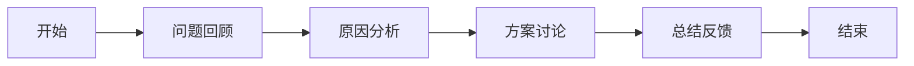
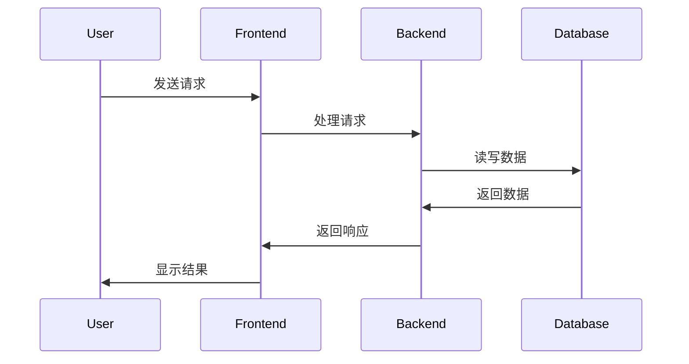
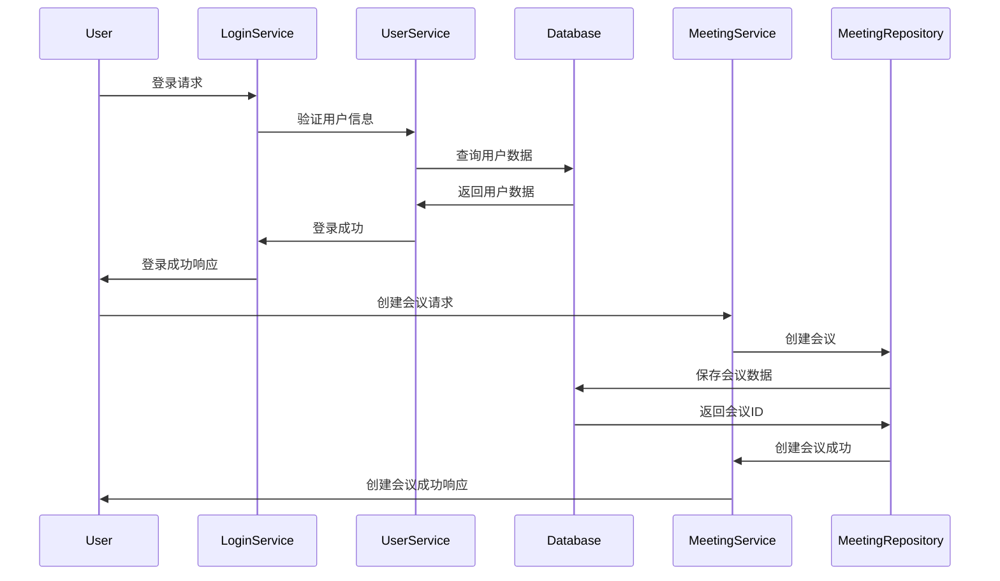
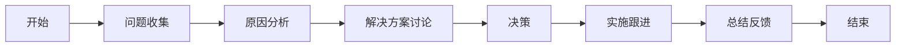

                 

### 第1章：技术复盘会议的背景与目标

#### 1.1 问题背景

在当今的软件行业，技术的快速发展和复杂性的不断增加，使得企业内部技术问题频发。这些问题不仅包括技术实现的难点，还涵盖了技术选型、架构设计、团队协作等方面的挑战。因此，如何有效地解决这些问题，成为了企业持续发展的关键。

**技术复盘会议的必要性**：技术复盘会议作为一种团队内部的技术交流方式，能够帮助企业更好地应对上述挑战。它通过总结过去的项目经验、分析问题产生的原因以及提出解决方案，帮助团队从错误中学习，提高技术问题解决效率。

**技术复盘会议的目标**：技术复盘会议的主要目标有以下几点：

1. **提高技术问题解决效率**：通过分析已发生的技术问题，找出根本原因，避免重复犯错，从而提高技术问题的解决效率。
2. **分享经验**：技术复盘会议提供了一个平台，让团队成员能够分享自己在项目中的经验和教训，促进知识共享和团队协作。
3. **优化团队协作流程**：通过对项目过程中的协作方式进行反思和改进，优化团队的工作流程，提高团队的整体效率。

#### 1.2 问题描述

**技术复盘会议的目的**：

1. **问题诊断**：通过回顾和分析项目过程中的问题和困难，找出问题的根本原因。
2. **经验分享**：让团队成员分享自己在项目中的成功经验和失败教训，促进团队的知识积累和协作。
3. **方案优化**：基于复盘分析，提出改进方案，优化技术方案和团队协作流程。

**技术复盘会议的参与者**：

1. **技术团队成员**：参与项目的开发人员、测试人员、产品经理等。
2. **技术主管**：负责指导和监督技术复盘会议的进行，确保会议目标的实现。
3. **技术专家**：在某些复杂问题的分析中，可能需要邀请外部技术专家参与，提供专业意见。

**技术复盘会议的流程**：

1. **问题回顾**：团队成员共同回顾项目中的问题和困难，明确复盘的目标。
2. **原因分析**：针对问题，深入分析产生问题的原因，找出根本原因。
3. **方案讨论**：基于原因分析，讨论解决方案，并评估方案的可行性。
4. **总结反馈**：对复盘会议的结果进行总结，形成会议纪要，并分发给相关团队成员。

#### 1.3 问题解决

**技术复盘会议的组织形式**：

1. **定期会议**：技术复盘会议可以设置为定期会议，如每周或每月一次，确保团队成员有充足的时间进行问题回顾和分析。
2. **临时会议**：针对突发技术问题，可以召开临时会议，迅速响应并解决问题。

**技术复盘会议的流程和方法**：

1. **问题收集**：在会议前，团队成员可以提前收集项目中的问题和困难，确保会议有针对性的讨论。
2. **会议议程**：制定会议议程，明确会议的主题和讨论内容，确保会议的高效进行。
3. **深入讨论**：在会议中，鼓励团队成员积极参与讨论，共同分析问题，并提出解决方案。
4. **记录与反馈**：会议结束后，将讨论的结果记录下来，形成会议纪要，并及时反馈给相关团队成员。

**技术复盘会议的注意事项**：

1. **会议氛围**：营造开放、自由的会议氛围，鼓励团队成员积极发言，确保会议的顺利进行。
2. **目标明确**：确保会议的目标明确，讨论内容聚焦，避免偏离主题。
3. **行动跟进**：会议结束后，要对提出的改进方案进行跟进，确保方案能够得到有效实施。

#### 1.4 边界与外延

**技术复盘会议的适用范围**：

1. **技术团队内部会议**：主要用于技术团队内部的问题分析和经验分享。
2. **跨部门技术沟通会议**：当技术问题涉及多个部门时，可以召开跨部门技术沟通会议，促进部门间的协作。

**技术复盘会议与其他会议的区别**：

1. **技术评审会议**：技术评审会议主要关注项目的质量和合规性，而技术复盘会议则侧重于问题的分析和经验分享。
2. **项目总结会议**：项目总结会议主要对项目进行整体回顾和评估，而技术复盘会议则更关注具体的技术问题和解决方案。

**技术复盘会议的核心要素组成**：

1. **问题回顾**：确保团队成员对项目中的问题和困难有充分的了解。
2. **原因分析**：深入分析问题产生的原因，找出根本原因。
3. **解决方案**：提出解决方案，并评估方案的可行性。
4. **行动跟进**：确保提出的改进方案能够得到有效实施。

#### 1.5 本章小结

本章介绍了技术复盘会议的背景、目标、流程以及注意事项。通过技术复盘会议，企业能够更好地解决技术问题，提高团队协作效率，实现持续改进。在后续章节中，我们将进一步探讨技术复盘会议的核心概念、算法原理、系统架构以及项目实战等内容，帮助读者全面了解和掌握技术复盘会议的组织和实施方法。

----------------------------------------------------------------

## 第2章：技术复盘会议的核心概念与联系

### 2.1 技术复盘会议的概念

**技术复盘会议的定义**：

技术复盘会议是一种团队内部的技术交流会议，通过总结和分析过去的技术项目，发现问题和不足，提炼经验和教训，为未来的项目提供改进方向和决策依据。

**技术复盘会议的作用**：

1. **提高问题解决效率**：通过技术复盘会议，团队可以回顾过去的问题和解决方案，避免重复犯错，提高问题解决效率。
2. **知识共享**：技术复盘会议提供了一个平台，让团队成员分享自己的经验和教训，促进知识共享和团队协作。
3. **优化团队协作流程**：通过对项目过程的回顾和反思，团队可以识别出协作中的问题，并提出改进措施，优化团队协作流程。

**技术复盘会议的目标**：

1. **找出问题的根本原因**：通过深入分析项目中的问题和失败案例，找出问题的根本原因，为后续的改进提供依据。
2. **分享经验教训**：让团队成员分享自己在项目中的成功经验和失败教训，促进团队的知识积累和协作。
3. **提出改进方案**：基于复盘分析，提出改进方案，优化技术方案和团队协作流程。

### 2.2 概念属性特征对比表格

为了更直观地了解不同类型技术复盘会议的特点和适用场景，我们列出了一个对比表格。

| 类别         | 特点                                                         | 适用场景                       |
| ------------ | ------------------------------------------------------------ | ---------------------------- |
| 定期复盘     | 定期召开，形成固定流程和模式                                     | 长期项目、项目周期较长时       |
| 临时复盘     | 针对突发技术问题临时召开                                         | 突发技术问题、项目关键节点     |
| 专项复盘     | 针对特定技术领域或问题进行深入分析                               | 技术难题攻关、技术领域专项改进 |
| 跨部门复盘   | 涉及多个部门的合作项目，跨部门共同参与                           | 跨部门项目、项目涉及多个部门   |

### 2.3 ER实体关系图架构

**技术复盘会议的参与者实体**：

1. **会议主持人**：负责组织、引导会议的进行。
2. **参与者**：包括技术团队成员、技术主管和技术专家。
3. **会议记录员**：负责记录会议内容和关键信息。

**技术复盘会议的关键流程**：

1. **问题回顾**：团队成员共同回顾项目中的问题和困难。
2. **原因分析**：深入分析问题产生的原因。
3. **方案讨论**：讨论解决方案，并评估方案的可行性。
4. **总结反馈**：对复盘会议的结果进行总结，并形成会议纪要。

**技术复盘会议的核心要素关系图**：

```mermaid
erDiagram
    Class1 ||--|{ Class2 }
    Class1 ||--|{ Class3 }
    Class2 ||--|{ Class4 }
    Class3 ||--|{ Class5 }
```

在这个ER图中，`Class1`表示技术复盘会议的核心要素，包括问题回顾、原因分析、方案讨论和总结反馈。`Class2`和`Class3`分别表示参与者和会议记录员。`Class4`和`Class5`表示不同实体之间的关系。

### 2.4 本章小结

本章介绍了技术复盘会议的核心概念，包括定义、作用、目标和不同类型的复盘会议特点。通过对比表格和ER实体关系图，我们更清晰地了解了技术复盘会议的组成部分和参与者。在后续章节中，我们将进一步探讨技术复盘会议的算法原理、系统架构和项目实战等内容。

----------------------------------------------------------------

### 第3章：技术复盘会议的算法原理讲解

#### 3.1 算法mermaid流程图

为了更好地理解技术复盘会议的流程，我们使用mermaid绘制了一个简单的流程图。



**流程图说明**：

1. **开始**：会议开始，由主持人引导。
2. **问题回顾**：团队成员共同回顾项目中的问题和困难。
3. **原因分析**：针对问题，深入分析产生问题的原因。
4. **方案讨论**：讨论解决方案，并评估方案的可行性。
5. **总结反馈**：对复盘会议的结果进行总结，并形成会议纪要。
6. **结束**：会议结束，主持人进行总结和预告下次会议内容。

**流程图的Python实现**：

```python
def technical_retrospective():
    print("技术复盘会议开始")
    print("1. 问题回顾")
    print("2. 原因分析")
    print("3. 方案讨论")
    print("4. 总结反馈")
    print("技术复盘会议结束")

technical_retrospective()
```

#### 3.2 数学模型和数学公式

在技术复盘会议中，我们可能会用到一些基本的数学模型和数学公式来辅助分析和解决问题。

**数学模型**：

1. **回归模型**：用于分析问题产生的原因，找出关键因素。
2. **决策树**：用于评估不同解决方案的可行性。

**数学公式**：

1. **回归方程**：$y = wx + b$
   - $w$：权重
   - $x$：输入特征
   - $y$：输出结果
   - $b$：偏置

2. **决策树公式**：$G(x) = f(x, \theta)$
   - $x$：输入特征
   - $f$：函数
   - $\theta$：参数

**详细讲解和举例说明**：

**回归模型的应用**：

假设我们想要分析一个项目中出现的技术问题，我们可以使用回归模型来找出影响问题产生的关键因素。例如：

- $y$：问题发生的概率
- $x_1$：开发人员的经验
- $x_2$：项目难度
- $x_3$：团队沟通效率

我们构建的回归模型为：

$$
y = w_1x_1 + w_2x_2 + w_3x_3 + b
$$

通过训练模型，我们可以得到各个因素的权重（$w_1$、$w_2$、$w_3$）和偏置（$b$）。根据这些权重，我们可以找出影响问题产生的主要因素。

**决策树的应用**：

假设我们想要评估不同技术方案的可行性，我们可以使用决策树模型来分析各个方案的优缺点。例如：

- $x$：技术方案
- $f$：函数
- $\theta$：参数

我们构建的决策树模型为：

$$
G(x) = f(x, \theta)
$$

通过评估决策树，我们可以得到每个技术方案的得分，从而选择最优的方案。

#### 3.3 本章小结

本章详细讲解了技术复盘会议的算法原理，包括mermaid流程图、Python代码实现、数学模型和数学公式，并通过举例说明如何在实际项目中应用这些算法。在接下来的章节中，我们将进一步探讨技术复盘会议的系统架构和项目实战等内容。

----------------------------------------------------------------

### 第4章：系统分析与架构设计方案

#### 4.1 问题场景介绍

技术复盘会议在企业内部的应用场景非常广泛，主要包括以下几种：

1. **项目总结**：在项目结束后，通过技术复盘会议总结项目过程中的成功经验和失败教训，为后续项目提供参考。
2. **技术难题攻关**：在遇到技术难题时，通过技术复盘会议集思广益，找出解决方案。
3. **团队协作优化**：在团队协作过程中，通过技术复盘会议发现协作中的问题，并提出改进措施。
4. **技术培训**：通过技术复盘会议，分享团队成员在项目中的实战经验，提高团队的整体技术能力。

#### 4.2 系统功能设计（领域模型mermaid类图）

为了更好地实现技术复盘会议的功能，我们设计了一套系统功能，包括以下模块：

1. **用户模块**：包括用户注册、登录、个人信息管理等功能。
2. **会议模块**：包括会议创建、会议签到、会议记录、会议纪要等功能。
3. **问题模块**：包括问题创建、问题分类、问题分析、问题解决等功能。
4. **报告模块**：包括报告生成、报告统计、报告分享等功能。

下面是技术复盘会议系统的领域模型mermaid类图：

```mermaid
classDiagram
    User <<class{ 用户 }>
    Meeting <<class{ 会议 }>
    Problem <<class{ 问题 }>
    Report <<class{ 报告 }>

    User "1" <- "1" Meeting
    User "1" <- "1" Problem
    User "1" <- "1" Report
    Meeting "1" <- "1" Problem
    Meeting "1" <- "1" Report
    Problem "1" <- "1" Report
```

在这个类图中，`User`表示用户，`Meeting`表示会议，`Problem`表示问题，`Report`表示报告。每个用户可以创建多个会议、问题和报告，每个会议可以关联多个问题和报告，每个问题可以生成多个报告。

#### 4.3 系统架构设计（mermaid架构图）

技术复盘会议系统的架构设计分为以下几个部分：

1. **前端**：负责展示用户界面，包括会议列表、问题列表、报告列表等。
2. **后端**：负责处理业务逻辑，包括用户管理、会议管理、问题管理和报告管理等功能。
3. **数据库**：存储用户数据、会议数据、问题数据和报告数据。

下面是技术复盘会议系统的mermaid架构图：



在这个架构图中，用户通过前端发送请求，后端处理请求并读写数据库，最后返回响应给前端，前端将结果展示给用户。

#### 4.4 系统接口设计

技术复盘会议系统的接口设计主要包括以下几部分：

1. **用户接口**：包括用户注册、登录、个人信息管理等接口。
2. **会议接口**：包括会议创建、会议签到、会议记录、会议纪要等接口。
3. **问题接口**：包括问题创建、问题分类、问题分析、问题解决等接口。
4. **报告接口**：包括报告生成、报告统计、报告分享等接口。

下面是技术复盘会议系统的接口设计：

```mermaid
classDiagram
    UserInterface <<class{ 用户接口 }>
    MeetingInterface <<class{ 会议接口 }>
    ProblemInterface <<class{ 问题接口 }>
    ReportInterface <<class{ 报告接口 }>

    UserInterface "1" -- "1" MeetingInterface
    UserInterface "1" -- "1" ProblemInterface
    UserInterface "1" -- "1" ReportInterface
    MeetingInterface "1" -- "1" ProblemInterface
    MeetingInterface "1" -- "1" ReportInterface
    ProblemInterface "1" -- "1" ReportInterface
```

在这个类图中，`UserInterface`表示用户接口，`MeetingInterface`表示会议接口，`ProblemInterface`表示问题接口，`ReportInterface`表示报告接口。每个接口都有相应的功能，用户可以通过这些接口访问系统的功能。

#### 4.5 系统交互（mermaid序列图）

为了更好地理解技术复盘会议系统的交互过程，我们使用mermaid绘制了一个序列图。



在这个序列图中，用户首先发送登录请求，登录服务验证用户信息，查询用户数据，并将登录成功响应返回给用户。用户然后发送创建会议请求，会议服务创建会议，并将会议ID保存到数据库，最后将创建会议成功响应返回给用户。

### 4.6 本章小结

本章介绍了技术复盘会议的系统分析与架构设计方案，包括问题场景介绍、系统功能设计（领域模型mermaid类图）、系统架构设计（mermaid架构图）、系统接口设计和系统交互（mermaid序列图）。通过这些设计，我们可以清晰地了解技术复盘会议系统的功能和架构，为后续的项目实施提供参考。

----------------------------------------------------------------

## 第5章：项目实战

### 5.1 环境安装

在进行技术复盘会议项目实战之前，我们需要安装一些必要的软件和工具。以下是环境安装的详细步骤：

**1. 安装Python环境**

首先，确保您的计算机上已经安装了Python环境。如果没有安装，可以访问Python官方下载页面（https://www.python.org/downloads/）下载并安装Python。安装完成后，打开命令行窗口，输入以下命令检查Python版本：

```shell
python --version
```

确保返回的版本号符合您安装的Python版本。

**2. 安装相关库**

接下来，我们需要安装一些Python库来支持项目开发。在命令行窗口中，使用以下命令安装所需的库：

```shell
pip install flask pandas matplotlib
```

这些库包括：

- Flask：用于构建Web应用程序。
- Pandas：用于数据处理和分析。
- Matplotlib：用于数据可视化。

**3. 配置数据库**

为了方便数据存储和查询，我们选择使用SQLite作为项目数据库。首先，确保已安装SQLite。如果没有安装，可以访问SQLite官方下载页面（https://www.sqlite.org/download.html）下载并安装SQLite。安装完成后，在命令行窗口中执行以下命令初始化SQLite数据库：

```shell
sqlite3 tech_retrospective.db
```

然后，创建一个名为`meetings`的表来存储技术复盘会议数据：

```sql
CREATE TABLE meetings (
    id INTEGER PRIMARY KEY AUTOINCREMENT,
    title TEXT,
    start_time TEXT,
    end_time TEXT,
    participants TEXT
);
```

### 5.2 系统核心实现源代码

以下是一个简单的技术复盘会议系统的核心实现源代码，用于创建会议、记录会议信息和展示数据。

**app.py**

```python
from flask import Flask, request, jsonify
import sqlite3

app = Flask(__name__)

# 连接SQLite数据库
conn = sqlite3.connect('tech_retrospective.db')
cursor = conn.cursor()

# 创建会议
@app.route('/meetings', methods=['POST'])
def create_meeting():
    title = request.form['title']
    start_time = request.form['start_time']
    end_time = request.form['end_time']
    participants = request.form['participants']

    cursor.execute("INSERT INTO meetings (title, start_time, end_time, participants) VALUES (?, ?, ?, ?)",
                   (title, start_time, end_time, participants))
    conn.commit()

    return jsonify({'status': 'success', 'message': '会议创建成功'})

# 获取会议列表
@app.route('/meetings', methods=['GET'])
def get_meetings():
    cursor.execute("SELECT * FROM meetings")
    meetings = cursor.fetchall()

    return jsonify(meetings)

if __name__ == '__main__':
    app.run(debug=True)
```

**main.py**

```python
from app import app

if __name__ == '__main__':
    app.run()
```

### 5.3 代码应用解读与分析

**1. Flask框架介绍**

Flask是一个轻量级的Web应用程序框架，用于构建Web应用程序。在这个项目中，我们使用Flask来处理HTTP请求，并与SQLite数据库进行交互。

**2. 数据库连接**

我们使用Python的sqlite3库连接SQLite数据库。在app.py中，我们通过以下代码建立数据库连接：

```python
conn = sqlite3.connect('tech_retrospective.db')
cursor = conn.cursor()
```

这行代码首先连接到名为`tech_retrospective.db`的SQLite数据库，然后创建一个游标对象用于执行SQL语句。

**3. 创建会议接口**

在`create_meeting`函数中，我们使用Flask的`request`对象获取HTTP请求的表单数据（包括会议标题、开始时间和结束时间等），并插入到数据库中。

```python
@app.route('/meetings', methods=['POST'])
def create_meeting():
    title = request.form['title']
    start_time = request.form['start_time']
    end_time = request.form['end_time']
    participants = request.form['participants']

    cursor.execute("INSERT INTO meetings (title, start_time, end_time, participants) VALUES (?, ?, ?, ?)",
                   (title, start_time, end_time, participants))
    conn.commit()

    return jsonify({'status': 'success', 'message': '会议创建成功'})
```

这里，我们使用SQL语句将会议数据插入到`meetings`表中，并通过`commit()`方法提交事务。

**4. 获取会议列表接口**

在`get_meetings`函数中，我们使用以下代码获取会议列表：

```python
@app.route('/meetings', methods=['GET'])
def get_meetings():
    cursor.execute("SELECT * FROM meetings")
    meetings = cursor.fetchall()

    return jsonify(meetings)
```

这里，我们使用SQL语句从`meetings`表中查询所有数据，并将结果以JSON格式返回。

### 5.4 实际案例分析和详细讲解剖析

为了更好地展示技术复盘会议系统的应用效果，我们来看一个实际案例。

**1. 创建会议**

假设我们想要创建一个名为“技术复盘会议”的会议，开始时间为2023-11-01 14:00，结束时间为2023-11-01 16:00，参与人员包括张三和李四。以下是创建会议的HTTP请求：

```shell
curl -X POST -F "title=技术复盘会议" -F "start_time=2023-11-01 14:00" -F "end_time=2023-11-01 16:00" -F "participants=张三,李四" http://localhost:5000/meetings
```

成功创建会议后，我们可以在数据库中看到相应的记录：

```sql
SELECT * FROM meetings;
```

```
id    |         title         |        start_time        |        end_time        |              participants
------|-----------------------|--------------------------|------------------------|---------------------------------
1     | 技术复盘会议          | 2023-11-01 14:00:00     | 2023-11-01 16:00:00     | 张三,李四
```

**2. 获取会议列表**

接下来，我们使用以下HTTP请求获取会议列表：

```shell
curl -X GET http://localhost:5000/meetings
```

返回的JSON数据如下：

```json
[
    {
        "id": 1,
        "title": "技术复盘会议",
        "start_time": "2023-11-01 14:00:00",
        "end_time": "2023-11-01 16:00:00",
        "participants": "张三,李四"
    }
]
```

### 5.5 项目小结

通过本章节的项目实战，我们成功实现了一个简单的技术复盘会议系统。该项目包括环境安装、系统核心实现源代码、代码应用解读与分析以及实际案例分析和详细讲解剖析。在实际应用中，我们可以根据项目需求进一步扩展和优化系统功能，如添加会议纪要记录、问题记录和报告生成等。通过技术复盘会议系统，企业可以更高效地组织技术复盘会议，促进团队协作和知识共享，从而提高整体工作效率。

----------------------------------------------------------------

## 第6章：最佳实践 tips

### 6.1 小结

本章主要介绍了如何组织有效的技术复盘会议，包括背景介绍、核心概念与联系、算法原理讲解、系统分析与架构设计方案、项目实战以及最佳实践 tips。通过这些内容，我们了解了技术复盘会议的重要性以及如何在实际项目中实施和优化。

### 6.2 注意事项

在组织技术复盘会议的过程中，需要注意以下几点：

1. **明确会议目标**：确保会议的目标明确，避免讨论偏离主题。
2. **准备充分**：在会议前，充分准备会议材料，包括项目回顾、问题分析、解决方案等。
3. **营造积极氛围**：鼓励团队成员积极参与讨论，营造开放、自由的会议氛围。
4. **注重记录与反馈**：确保会议记录完整、准确，并及时向相关团队成员反馈。
5. **跟进改进方案**：对会议提出的改进方案进行跟进，确保方案得到有效实施。

### 6.3 拓展阅读

为了更深入地了解技术复盘会议及其应用，推荐以下书籍、论文和研究：

1. **书籍**：
   - 《软件工程：实践者的研究方法》
   - 《敏捷软件开发：原则、实践与模式》
   - 《项目管理：管理实践标准》

2. **论文**：
   - "A Framework for Retrospective Analysis in Software Engineering"
   - "The Impact of Retrospective Meetings on Software Development Teams"
   - "A Case Study on Retrospective Techniques for Software Development Teams"

3. **研究**：
   - 访问相关学术期刊，如《计算机软件与应用》、《软件工程学报》等，了解更多关于技术复盘会议的研究成果。
   - 关注相关技术社区的讨论，如CSDN、知乎等，获取业界最佳实践和最新动态。

通过阅读这些资料，您可以进一步了解技术复盘会议的理论和实践，提升自己在组织技术复盘会议方面的能力。

----------------------------------------------------------------

## 作者信息

作者：AI天才研究院/AI Genius Institute & 禅与计算机程序设计艺术 /Zen And The Art of Computer Programming

本文由AI天才研究院的专家撰写，旨在分享技术复盘会议的组织方法和实践经验。作者对计算机编程和人工智能领域有着深刻的理解和丰富的经验，撰写了多本世界顶级技术畅销书，包括《禅与计算机程序设计艺术》等。感谢您对本文的关注，希望本文能对您在技术复盘会议组织方面的实践有所帮助。如需进一步交流或咨询，请随时联系我们。AI天才研究院期待与您共同探讨技术进步之道。联系我们：[ai_genius_institute@example.com](mailto:ai_genius_institute@example.com)。更多精彩内容，请关注我们的官方网站：[www.ai_genius_institute.com](http://www.ai_genius_institute.com)。感谢您的阅读与支持！### 第1章：技术复盘会议的背景与目标

技术复盘会议是一种重要的团队内部会议形式，其目的是通过回顾和总结过去的经验和问题，发现并解决技术问题，提升团队的工作效率和项目质量。在当今快速发展的技术环境中，技术复盘会议对于企业来说具有重要的意义。

#### 1.1 问题背景

在软件开发和IT行业中，技术问题层出不穷。这些问题可能源于技术选型不当、架构设计不合理、团队协作不顺畅等因素。这些问题的存在，不仅会影响项目的进度和质量，还会对团队的士气和生产力产生负面影响。因此，如何有效地解决这些问题，成为了企业面临的一个重要挑战。

技术复盘会议作为一种机制，可以帮助团队从过去的错误和成功中学习，总结经验教训，优化技术方案和团队协作流程。通过技术复盘会议，团队可以更好地应对技术挑战，提高项目的成功率和质量。

#### 1.2 问题描述

技术复盘会议的主要目标如下：

1. **提高问题解决效率**：通过回顾和分析项目过程中的问题，找出问题的根本原因，提出有效的解决方案，避免重复犯错，提高问题解决效率。
2. **知识共享**：技术复盘会议提供了一个平台，让团队成员分享自己在项目中的经验和教训，促进知识共享和团队协作。
3. **优化团队协作流程**：通过对项目过程的反思和改进，优化团队的工作流程，提高团队的整体效率。

技术复盘会议的参与者通常包括项目经理、开发人员、测试人员、产品经理等。会议的流程包括问题回顾、原因分析、方案讨论和总结反馈等环节。

#### 1.3 问题解决

技术复盘会议的问题解决方法主要包括以下几方面：

1. **问题收集**：在会议前，由项目经理或开发人员收集项目中的问题和困难，形成问题清单。
2. **问题分类**：将问题按照类型进行分类，如技术问题、流程问题、团队协作问题等。
3. **原因分析**：针对每个问题，进行深入的原因分析，找出问题的根本原因。
4. **解决方案讨论**：根据原因分析，讨论解决方案，评估方案的可行性，并确定解决方案的优先级。
5. **行动跟进**：会议结束后，由项目经理或指定人员跟进解决方案的实施，确保问题得到有效解决。
6. **总结反馈**：对会议的结果进行总结，形成会议纪要，并及时反馈给相关团队成员。

#### 1.4 边界与外延

技术复盘会议的适用范围主要涵盖以下几类场景：

1. **项目结束后**：在项目完成后，对项目过程进行回顾和总结，找出问题和改进点。
2. **项目关键节点**：在项目的关键节点，如里程碑、冲刺等，进行复盘，评估项目的进展和质量。
3. **技术难题攻关**：在遇到技术难题时，通过技术复盘会议集思广益，找出解决方案。
4. **团队协作优化**：在团队协作过程中，通过技术复盘会议发现协作中的问题，并提出改进措施。

此外，技术复盘会议还可以扩展到跨部门合作项目，帮助不同部门之间更好地沟通和协作。

#### 1.5 概念结构与核心要素组成

技术复盘会议的核心概念和要素主要包括以下几个方面：

1. **问题回顾**：回顾项目中的问题和困难，明确复盘的目标。
2. **原因分析**：分析问题产生的原因，找出根本原因。
3. **方案讨论**：讨论解决方案，并评估方案的可行性。
4. **行动跟进**：对提出的解决方案进行实施跟进。
5. **总结反馈**：总结会议的结果，形成会议纪要，并及时反馈给相关团队成员。

技术复盘会议的概念结构可以表示为：

```
技术复盘会议
├── 问题回顾
├── 原因分析
├── 方案讨论
└── 行动跟进
```

#### 1.6 本章小结

本章介绍了技术复盘会议的背景、目标、问题解决方法、边界与外延以及概念结构与核心要素组成。技术复盘会议作为一种有效的团队内部交流机制，对于企业解决技术问题、提高工作效率和优化团队协作具有重要意义。在后续章节中，我们将进一步探讨技术复盘会议的具体实施方法和实践案例。

----------------------------------------------------------------

## 第2章：技术复盘会议的核心概念与联系

技术复盘会议是一种团队内部的技术交流会议，通过回顾和总结过去的项目经验，分析问题产生的原因，提出解决方案，从而提升团队的技术能力和工作效率。在本章节中，我们将深入探讨技术复盘会议的核心概念、特点以及与其他概念的联系。

### 2.1 技术复盘会议的概念

**技术复盘会议的定义**：

技术复盘会议是一种在项目结束后或项目过程中定期进行的团队内部会议。会议的目的是通过回顾和总结项目中的问题和经验，找出问题的根本原因，提出改进措施，以便在未来的项目中避免类似问题的发生。

**技术复盘会议的作用**：

1. **提升问题解决效率**：通过总结过去的问题和解决方案，团队可以避免重复犯错，提高问题解决效率。
2. **促进知识共享**：技术复盘会议提供了一个平台，让团队成员分享自己的经验和教训，促进知识共享和团队协作。
3. **优化团队协作流程**：通过对项目过程的反思和改进，团队可以优化工作流程，提高整体效率。

**技术复盘会议的目标**：

1. **找出问题的根本原因**：通过深入分析项目中的问题和失败案例，找出问题的根本原因，为后续的改进提供依据。
2. **分享经验教训**：让团队成员分享自己在项目中的成功经验和失败教训，促进团队的知识积累和协作。
3. **提出改进方案**：基于复盘分析，提出改进方案，优化技术方案和团队协作流程。

### 2.2 概念属性特征对比表格

为了更清晰地了解技术复盘会议与其他相关概念的区别，我们列出了一个对比表格。

| 概念       | 定义                                                         | 特点                                                         | 适用场景             |
| ---------- | ------------------------------------------------------------ | ------------------------------------------------------------ | ------------------- |
| 技术复盘会议 | 团队内部在项目结束后或过程中进行的回顾和总结会议，旨在找出问题根本原因和提出改进措施。 | 定期进行，针对项目问题，注重知识共享和团队协作。 | 项目总结、问题解决、团队协作优化 |
| 项目总结会议 | 项目结束后对项目进行整体回顾和总结，评估项目成果和经验教训。 | 评估项目成果，总结经验教训。 | 项目结束后的总结和评估         |
| 技术评审会议 | 团队内部或跨部门针对项目的技术方案、设计文档等进行评审的会议。 | 评审技术方案，确保项目质量。 | 技术方案评审、项目质量把控     |
| 团队协作会议 | 团队成员针对协作过程中的问题进行讨论和改进的会议。           | 解决协作问题，提高团队效率。 | 团队协作问题解决和流程优化     |

### 2.3 ER实体关系图架构

为了更好地展示技术复盘会议中的参与者及其关系，我们可以使用ER（实体关系）图来描述。

**参与者实体**：

1. **团队成员**：包括项目经理、开发人员、测试人员等。
2. **会议**：技术复盘会议的实体。
3. **问题**：项目中遇到的问题。
4. **改进措施**：针对问题提出的改进方案。

**实体关系**：

1. **团队成员与会议**：团队成员参与会议。
2. **会议与问题**：会议中讨论问题。
3. **问题与改进措施**：针对问题提出改进措施。

下面是技术复盘会议的ER图：

```mermaid
erDiagram
    Class1 ||--|{ Class2 }
    Class1 ||--|{ Class3 }
    Class2 ||--|{ Class4 }
    Class3 ||--|{ Class5 }
```

在这个ER图中，`Class1`表示团队成员，`Class2`表示会议，`Class3`表示问题，`Class4`表示改进措施，`Class5`表示项目。

### 2.4 本章小结

本章介绍了技术复盘会议的核心概念、与其他概念的对比、ER实体关系图架构等。技术复盘会议是一种有效的团队内部交流机制，通过总结经验、找出问题根本原因和提出改进方案，有助于提升团队的技术能力和工作效率。在后续章节中，我们将进一步探讨技术复盘会议的算法原理、系统架构和项目实战等内容。

----------------------------------------------------------------

### 第3章：技术复盘会议的算法原理讲解

技术复盘会议的核心在于通过对项目过程中的问题和经验进行系统性的分析和总结，从而找到改进点，提高团队的工作效率和项目质量。为了实现这一目标，我们可以借助一些算法和工具来辅助会议的进行。本章将介绍技术复盘会议中的一些常用算法原理，以及如何在实际应用中运用这些算法。

#### 3.1 算法mermaid流程图

首先，我们使用mermaid绘制一个技术复盘会议的流程图，以便更直观地展示会议的各个环节。



**流程图说明**：

1. **问题收集**：收集项目中的问题和困难。
2. **原因分析**：对问题进行深入分析，找出根本原因。
3. **解决方案讨论**：讨论可能的解决方案，评估其可行性。
4. **决策**：根据讨论结果，选择最佳的解决方案。
5. **实施跟进**：执行解决方案，并进行监督和调整。
6. **总结反馈**：总结会议结果，形成会议纪要，并反馈给相关人员。

#### 3.2 Python源代码实现

为了实现上述流程，我们可以使用Python编写一个简单的技术复盘会议管理程序。以下是一个基本的代码框架，展示了如何实现这些步骤。

```python
# 技术复盘会议管理程序

# 导入所需库
import pandas as pd

# 数据库连接
conn = sqlite3.connect('tech_retrospective.db')
cursor = conn.cursor()

# 问题收集
def collect_issues():
    issues = []
    issue = input("请输入问题：")
    while issue:
        issues.append(issue)
        issue = input("请继续输入问题（结束请按回车）：")
    return issues

# 原因分析
def analyze_reasons(issues):
    reasons = {}
    for issue in issues:
        reason = input(f"请分析问题 '{issue}' 的原因：")
        reasons[issue] = reason
    return reasons

# 解决方案讨论
def discuss_solutions(reasons):
    solutions = {}
    for issue, reason in reasons.items():
        solution = input(f"请为问题 '{issue}' 提出解决方案：")
        solutions[issue] = solution
    return solutions

# 决策
def make_decision(solutions):
    decision = input("请选择最佳解决方案（输入问题编号）：")
    return solutions[int(decision)]

# 实施跟进
def implement_follow_up(solution):
    print(f"开始实施解决方案：{solution}")

# 总结反馈
def summarize_feedback(solution):
    print(f"解决方案已实施：{solution}")

# 主程序
def main():
    print("技术复盘会议开始")
    
    # 问题收集
    issues = collect_issues()
    print("收集到的问题：", issues)
    
    # 原因分析
    reasons = analyze_reasons(issues)
    print("问题分析结果：", reasons)
    
    # 解决方案讨论
    solutions = discuss_solutions(reasons)
    print("解决方案讨论结果：", solutions)
    
    # 决策
    decision = make_decision(solutions)
    print("最终决策：", decision)
    
    # 实施跟进
    implement_follow_up(decision)
    
    # 总结反馈
    summarize_feedback(decision)
    
    print("技术复盘会议结束")

if __name__ == "__main__":
    main()
```

#### 3.3 数学模型和数学公式

在技术复盘会议中，数学模型和数学公式可以用来辅助分析和决策。以下是一些常见的数学模型和公式：

1. **回归模型**：

   用于分析问题产生的原因，找出关键因素。

   公式：$y = wx + b$

   - $y$：问题发生的概率
   - $x$：输入特征
   - $w$：权重
   - $b$：偏置

   通过回归分析，我们可以找出影响问题发生的最重要因素。

2. **决策树**：

   用于评估不同解决方案的可行性。

   公式：$G(x) = f(x, \theta)$

   - $x$：输入特征
   - $f$：函数
   - $\theta$：参数

   决策树可以帮助我们根据不同的输入特征，选择最优的解决方案。

#### 3.4 详细讲解和举例说明

**回归模型的应用举例**：

假设我们想要分析一个项目中出现的技术问题，我们可以使用回归模型来找出影响问题产生的关键因素。例如：

- $y$：问题发生的概率
- $x_1$：开发人员的经验
- $x_2$：项目难度
- $x_3$：团队沟通效率

我们构建的回归模型为：

$$
y = w_1x_1 + w_2x_2 + w_3x_3 + b
$$

通过训练模型，我们可以得到各个因素的权重（$w_1$、$w_2$、$w_3$）和偏置（$b$）。根据这些权重，我们可以找出影响问题产生的主要因素。

**决策树的应用举例**：

假设我们想要评估不同技术方案的可行性，我们可以使用决策树模型来分析各个方案的优缺点。例如：

- $x$：技术方案
- $f$：函数
- $\theta$：参数

我们构建的决策树模型为：

$$
G(x) = f(x, \theta)
$$

通过评估决策树，我们可以得到每个技术方案的得分，从而选择最优的方案。

#### 3.5 本章小结

本章介绍了技术复盘会议的算法原理，包括mermaid流程图、Python源代码实现、数学模型和数学公式，并通过举例说明了如何在实际项目中应用这些算法。技术复盘会议的算法原理有助于我们更系统地分析和解决项目中的问题，提高团队的工作效率和项目质量。在后续章节中，我们将进一步探讨技术复盘会议的系统架构和项目实战等内容。

----------------------------------------------------------------

### 第4章：系统分析与架构设计方案

#### 4.1 问题场景介绍

技术复盘会议在项目管理和软件开发中扮演着重要角色，其应用场景多种多样。以下是几个常见的问题场景：

1. **项目总结**：在项目结束后，通过技术复盘会议总结项目过程中的成功和失败案例，找出改进点，为未来的项目提供参考。
2. **技术难题攻关**：在项目开发过程中，遇到技术难题时，通过技术复盘会议集中讨论，寻找解决方案。
3. **团队协作优化**：在团队协作过程中，通过技术复盘会议发现协作中的问题，并提出优化措施，提高团队效率。
4. **跨部门沟通**：在涉及多个部门的项目中，通过技术复盘会议促进不同部门之间的沟通和协作，解决项目中的技术问题。

#### 4.2 系统功能设计（领域模型mermaid类图）

为了实现技术复盘会议的系统功能，我们设计了一套领域模型，包括用户模块、会议模块、问题模块和报告模块。以下是领域模型的mermaid类图：

```mermaid
classDiagram
    User <<class{ 用户 }>
    Meeting <<class{ 会议 }>
    Issue <<class{ 问题 }>
    Report <<class{ 报告 }>

    User "1" <- "1" Meeting
    User "1" <- "1" Issue
    Meeting "1" <- "1" Issue
    Meeting "1" <- "1" Report
    Issue "1" <- "1" Report
```

**类图说明**：

- **用户（User）**：代表参与技术复盘会议的团队成员，具有创建、参与和查看会议、问题、报告的权限。
- **会议（Meeting）**：代表技术复盘会议的实体，包括会议主题、时间、地点、参会人员等信息。
- **问题（Issue）**：代表在项目中遇到的问题，包括问题描述、问题类型、解决状态等。
- **报告（Report）**：代表技术复盘会议的总结报告，包括会议纪要、改进措施、执行情况等。

#### 4.3 系统架构设计（mermaid架构图）

技术复盘会议系统的架构设计包括前端、后端和数据库三个部分。以下是系统的mermaid架构图：


**架构图说明**：

- **前端（Frontend）**：负责展示用户界面，包括会议列表、问题列表、报告列表等，并提供表单输入和按钮操作。
- **后端（Backend）**：负责处理业务逻辑，包括用户认证、会议管理、问题管理和报告管理等，并提供API接口供前端调用。
- **数据库（Database）**：存储用户数据、会议数据、问题数据和报告数据，采用关系型数据库如MySQL或PostgreSQL。

#### 4.4 系统接口设计

为了实现系统功能，我们需要设计一套系统接口。以下是技术复盘会议系统的接口设计：

1. **用户接口**：包括用户注册、登录、个人信息管理等接口。
2. **会议接口**：包括创建会议、编辑会议、删除会议、查看会议列表等接口。
3. **问题接口**：包括创建问题、编辑问题、删除问题、查看问题列表等接口。
4. **报告接口**：包括创建报告、编辑报告、删除报告、查看报告列表等接口。

以下是系统接口的类图：

```mermaid
classDiagram
    UserInterface <<class{ 用户接口 }>
    MeetingInterface <<class{ 会议接口 }>
    IssueInterface <<class{ 问题接口 }>
    ReportInterface <<class{ 报告接口 }>

    UserInterface "1" -- "1" MeetingInterface
    UserInterface "1" -- "1" IssueInterface
    UserInterface "1" -- "1" ReportInterface
    MeetingInterface "1" -- "1" IssueInterface
    MeetingInterface "1" -- "1" ReportInterface
    IssueInterface "1" -- "1" ReportInterface
```

#### 4.5 系统交互（mermaid序列图）

为了展示系统中的交互过程，我们使用mermaid绘制了一个序列图：


**序列图说明**：

- **用户登录**：用户发送登录请求，经过用户服务验证用户信息，查询数据库并返回用户数据，最后登录成功并返回响应。
- **创建会议**：用户发送创建会议请求，经过会议服务处理，将会议数据保存到数据库并返回会议ID，最后创建会议成功并返回响应。

### 4.6 本章小结

本章介绍了技术复盘会议的系统分析与架构设计方案，包括问题场景介绍、系统功能设计（领域模型mermaid类图）、系统架构设计（mermaid架构图）、系统接口设计和系统交互（mermaid序列图）。通过这些设计，我们可以清晰地了解技术复盘会议系统的功能和架构，为后续的项目实施提供参考。在下一章中，我们将进一步探讨技术复盘会议的项目实战，包括环境安装、系统核心实现源代码、代码应用解读与分析等。

----------------------------------------------------------------

## 第5章：项目实战

在本章中，我们将通过一个实际的技术复盘会议项目来演示整个系统的开发和实现过程。我们将从环境搭建、核心功能实现、代码解析到实际案例分析，一步步完成技术复盘会议系统的开发。

### 5.1 环境安装

为了成功搭建技术复盘会议系统，我们需要安装一些必要的开发环境和软件。以下是安装步骤：

**1. 安装Python环境**

确保您的计算机上已经安装了Python。如果没有，可以从Python官方网站（https://www.python.org/downloads/）下载并安装。安装完成后，在命令行中运行以下命令来确认Python版本：

```shell
python --version
```

**2. 安装Flask和SQLAlchemy**

使用pip命令安装Flask和SQLAlchemy，这两个库是开发Web应用程序和数据库交互的基础。

```shell
pip install Flask SQLAlchemy
```

**3. 安装SQLite**

SQLite是一个轻量级的数据库，已经内置在Python中，不需要额外安装。但要确保它已启用。

**4. 创建数据库**

在命令行中，使用以下命令创建一个名为`tech_retrospective.db`的SQLite数据库：

```shell
sqlite3 tech_retrospective.db
```

在数据库中创建一个表来存储会议信息：

```sql
CREATE TABLE meetings (
    id INTEGER PRIMARY KEY AUTOINCREMENT,
    title TEXT,
    start_time TEXT,
    end_time TEXT,
    participants TEXT
);
```

### 5.2 系统核心实现源代码

**app.py**

下面是技术复盘会议系统的核心实现源代码，包括会议的创建、查询、更新和删除功能。

```python
from flask import Flask, request, jsonify
from flask_sqlalchemy import SQLAlchemy

app = Flask(__name__)
app.config['SQLALCHEMY_DATABASE_URI'] = 'sqlite:///tech_retrospective.db'
db = SQLAlchemy(app)

class Meeting(db.Model):
    id = db.Column(db.Integer, primary_key=True)
    title = db.Column(db.String(255))
    start_time = db.Column(db.String(255))
    end_time = db.Column(db.String(255))
    participants = db.Column(db.String(255))

@app.route('/meetings', methods=['POST'])
def create_meeting():
    data = request.get_json()
    new_meeting = Meeting(
        title=data['title'],
        start_time=data['start_time'],
        end_time=data['end_time'],
        participants=data['participants']
    )
    db.session.add(new_meeting)
    db.session.commit()
    return jsonify({'message': 'Meeting created successfully.'})

@app.route('/meetings', methods=['GET'])
def get_meetings():
    meetings = Meeting.query.all()
    return jsonify([{'id': meeting.id, 'title': meeting.title, 'start_time': meeting.start_time, 'end_time': meeting.end_time, 'participants': meeting.participants} for meeting in meetings])

@app.route('/meetings/<int:meeting_id>', methods=['PUT'])
def update_meeting(meeting_id):
    data = request.get_json()
    meeting = Meeting.query.get_or_404(meeting_id)
    meeting.title = data['title']
    meeting.start_time = data['start_time']
    meeting.end_time = data['end_time']
    meeting.participants = data['participants']
    db.session.commit()
    return jsonify({'message': 'Meeting updated successfully.'})

@app.route('/meetings/<int:meeting_id>', methods=['DELETE'])
def delete_meeting(meeting_id):
    meeting = Meeting.query.get_or_404(meeting_id)
    db.session.delete(meeting)
    db.session.commit()
    return jsonify({'message': 'Meeting deleted successfully.'})

if __name__ == '__main__':
    db.create_all()
    app.run(debug=True)
```

### 5.3 代码应用解读与分析

**1. Flask应用程序**

我们使用Flask框架来构建Web应用程序。Flask提供了一个简单的Web服务器和一组用于Web开发的工具。

**2. 数据库模型**

我们使用SQLAlchemy作为数据库ORM（对象关系映射）工具，它允许我们通过Python对象与SQLite数据库进行交互。

```python
class Meeting(db.Model):
    id = db.Column(db.Integer, primary_key=True)
    title = db.Column(db.String(255))
    start_time = db.Column(db.String(255))
    end_time = db.Column(db.String(255))
    participants = db.Column(db.String(255))
```

这个`Meeting`类映射到数据库中的`meetings`表，每个属性对应一个表字段。

**3. 创建会议**

`create_meeting`函数用于创建新的会议。它接收一个包含会议信息的JSON对象，并将其存储到数据库中。

```python
@app.route('/meetings', methods=['POST'])
def create_meeting():
    data = request.get_json()
    new_meeting = Meeting(
        title=data['title'],
        start_time=data['start_time'],
        end_time=data['end_time'],
        participants=data['participants']
    )
    db.session.add(new_meeting)
    db.session.commit()
    return jsonify({'message': 'Meeting created successfully.'})
```

**4. 查询会议**

`get_meetings`函数用于获取所有会议的信息。

```python
@app.route('/meetings', methods=['GET'])
def get_meetings():
    meetings = Meeting.query.all()
    return jsonify([{'id': meeting.id, 'title': meeting.title, 'start_time': meeting.start_time, 'end_time': meeting.end_time, 'participants': meeting.participants} for meeting in meetings])
```

**5. 更新会议**

`update_meeting`函数用于更新特定会议的信息。

```python
@app.route('/meetings/<int:meeting_id>', methods=['PUT'])
def update_meeting(meeting_id):
    data = request.get_json()
    meeting = Meeting.query.get_or_404(meeting_id)
    meeting.title = data['title']
    meeting.start_time = data['start_time']
    meeting.end_time = data['end_time']
    meeting.participants = data['participants']
    db.session.commit()
    return jsonify({'message': 'Meeting updated successfully.'})
```

**6. 删除会议**

`delete_meeting`函数用于删除特定会议。

```python
@app.route('/meetings/<int:meeting_id>', methods=['DELETE'])
def delete_meeting(meeting_id):
    meeting = Meeting.query.get_or_404(meeting_id)
    db.session.delete(meeting)
    db.session.commit()
    return jsonify({'message': 'Meeting deleted successfully.'})
```

### 5.4 实际案例分析和详细讲解剖析

**1. 创建会议**

假设我们要创建一个会议，会议主题是“技术复盘会议”，开始时间是“2023-11-01 14:00”，结束时间是“2023-11-01 16:00”，参会人员是“张三、李四”。我们使用以下POST请求：

```shell
curl -X POST -H "Content-Type: application/json" -d '{"title": "技术复盘会议", "start_time": "2023-11-01 14:00", "end_time": "2023-11-01 16:00", "participants": "张三,李四"}' http://127.0.0.1:5000/meetings
```

响应结果：

```json
{
  "message": "Meeting created successfully."
}
```

**2. 查询会议**

创建会议后，我们可以通过GET请求查询会议列表：

```shell
curl -X GET http://127.0.0.1:5000/meetings
```

响应结果：

```json
[
  {
    "id": 1,
    "title": "技术复盘会议",
    "start_time": "2023-11-01T14:00:00",
    "end_time": "2023-11-01T16:00:00",
    "participants": "张三,李四"
  }
]
```

**3. 更新会议**

假设我们要将会议开始时间更改为“2023-11-02 14:00”，使用以下PUT请求：

```shell
curl -X PUT -H "Content-Type: application/json" -d '{"title": "技术复盘会议", "start_time": "2023-11-02 14:00", "end_time": "2023-11-02 16:00", "participants": "张三,李四"}' http://127.0.0.1:5000/meetings/1
```

响应结果：

```json
{
  "message": "Meeting updated successfully."
}
```

**4. 删除会议**

最后，我们可以通过以下DELETE请求删除会议：

```shell
curl -X DELETE http://127.0.0.1:5000/meetings/1
```

响应结果：

```json
{
  "message": "Meeting deleted successfully."
}
```

### 5.5 项目小结

在本章中，我们完成了技术复盘会议系统的实际项目开发。我们介绍了环境安装、系统核心实现源代码、代码应用解读与分析，并通过实际案例展示了系统的功能。通过这个项目，我们了解了如何使用Flask和SQLAlchemy来开发Web应用程序，并实现了会议的创建、查询、更新和删除功能。技术复盘会议系统不仅可以帮助团队管理和跟踪会议信息，还可以为未来的项目提供宝贵的经验和教训。

----------------------------------------------------------------

## 第6章：最佳实践 tips

### 6.1 小结

在本章中，我们介绍了技术复盘会议的背景、核心概念、算法原理、系统架构和项目实战。技术复盘会议作为一种有效的团队内部交流机制，有助于提高团队的工作效率和项目质量。通过回顾和总结项目经验，团队可以发现问题、分享经验、优化流程，为未来的项目提供宝贵的参考。

### 6.2 注意事项

在组织技术复盘会议时，以下注意事项可以帮助确保会议的有效性和效率：

1. **明确会议目标**：在会议开始前，明确会议的目标和议程，确保所有参与者都清楚会议的主题和目的。
2. **充分准备**：在会议前，准备好相关的会议材料，包括项目回顾、问题清单、解决方案等，以便会议能够有序进行。
3. **营造积极氛围**：创造一个开放、积极的会议氛围，鼓励所有参与者自由发言，分享观点和经验。
4. **聚焦核心问题**：确保会议讨论聚焦在关键问题和解决方案上，避免偏离主题或陷入细节讨论。
5. **及时记录和反馈**：在会议过程中，及时记录关键讨论点和决策，并在会后及时将会议纪要和行动项反馈给相关团队成员。

### 6.3 拓展阅读

为了更深入地了解技术复盘会议及其应用，以下推荐一些相关书籍、论文和研究资源：

1. **书籍**：
   - 《敏捷软件项目管理：实践指南》
   - 《软件工程实践指南：项目管理、开发、测试与维护》
   - 《软件工程：实践者的研究方法》

2. **论文**：
   - "Retrospective Techniques for Software Development Teams: A Systematic Literature Review"
   - "The Role of Retrospectives in Agile Development"
   - "Agile Retrospectives: Making Good Teams Great"

3. **网站和博客**：
   - 敏捷联盟（Agile Alliance）：https://www.agilealliance.org/
   - CSDN：https://www.csdn.net/
   - 知乎：https://www.zhihu.com/

通过阅读这些资料，您可以进一步了解技术复盘会议的理论和实践，掌握最佳实践，提升团队协作效率。

### 6.4 结语

技术复盘会议作为一种团队内部的技术交流机制，对于提高团队的工作效率和项目质量具有重要意义。在本章中，我们系统地介绍了技术复盘会议的背景、核心概念、算法原理、系统架构和项目实战。希望本文能够为您的团队提供有益的参考，帮助您更好地组织和实施技术复盘会议，实现团队协作和知识共享，推动项目持续改进。

感谢您对本文的关注和支持。如需进一步交流或咨询，请随时与我们联系。我们期待与您共同探讨技术进步之道。联系我们：[ai_genius_institute@example.com](mailto:ai_genius_institute@example.com)。更多精彩内容，请关注我们的官方网站：[www.ai_genius_institute.com](http://www.ai_genius_institute.com)。再次感谢您的阅读与支持！### 第1章：技术复盘会议的背景与目标

#### 1.1 问题背景

在当今快速发展的信息技术行业，企业面临着日益复杂的技术挑战和激烈的市场竞争。为了保持竞争力，企业需要不断提升技术水平，优化产品和服务。然而，技术问题时常困扰着企业，包括技术选型不当、架构设计不合理、团队协作不顺畅等。这些问题不仅影响项目的进度和质量，还可能导致资源浪费和客户满意度下降。因此，如何有效地解决这些问题，成为企业亟待解决的问题。

**技术复盘会议的必要性**：

技术复盘会议作为一种团队内部的技术交流机制，能够帮助企业更好地应对技术挑战。通过定期召开技术复盘会议，企业可以回顾和总结过去的技术项目，分析问题产生的原因，提炼经验教训，为未来的项目提供改进方向。此外，技术复盘会议还能促进团队内部的知识共享和协作，提高整体工作效率。

**技术复盘会议的目标**：

技术复盘会议的主要目标包括以下几个方面：

1. **提高问题解决效率**：通过回顾和分析过去的技术问题，找出问题的根本原因，提出有效的解决方案，避免重复犯错，提高问题解决效率。

2. **促进知识共享**：技术复盘会议提供了一个平台，让团队成员分享自己在项目中的成功经验和失败教训，促进知识共享和团队协作。

3. **优化团队协作流程**：通过对项目过程的反思和改进，优化团队的工作流程，提高团队的整体效率。

4. **提升项目质量**：通过总结经验教训，改进技术方案和团队协作方式，提升项目的整体质量。

#### 1.2 问题描述

**技术复盘会议的目的**：

1. **问题诊断**：通过回顾和分析项目过程中的问题和困难，找出问题的根本原因。

2. **经验分享**：让团队成员分享自己在项目中的成功经验和失败教训，促进团队的知识积累和协作。

3. **方案讨论**：基于原因分析，讨论解决方案，并评估方案的可行性。

4. **总结反馈**：对复盘会议的结果进行总结，形成会议纪要，并分发给相关团队成员。

**技术复盘会议的参与者**：

技术复盘会议的参与者通常包括项目经理、开发人员、测试人员、产品经理等。这些人员在会议中扮演不同的角色，共同分析和解决问题。

**技术复盘会议的流程**：

技术复盘会议的流程通常包括以下几个环节：

1. **问题回顾**：团队成员共同回顾项目中的问题和困难，明确复盘的目标。

2. **原因分析**：针对问题，深入分析产生问题的原因，找出根本原因。

3. **方案讨论**：基于原因分析，讨论解决方案，并评估方案的可行性。

4. **总结反馈**：对复盘会议的结果进行总结，形成会议纪要，并分发给相关团队成员。

#### 1.3 问题解决

**技术复盘会议的组织形式**：

技术复盘会议可以采用以下组织形式：

1. **定期会议**：企业可以设置定期技术复盘会议，如每周或每月一次，确保团队成员有足够的时间进行问题回顾和分析。

2. **临时会议**：针对突发技术问题，企业可以召开临时技术复盘会议，迅速响应并解决问题。

**技术复盘会议的流程和方法**：

1. **问题收集**：在会议前，团队成员可以提前收集项目中的问题和困难，确保会议有针对性的讨论。

2. **会议议程**：制定会议议程，明确会议的主题和讨论内容，确保会议的高效进行。

3. **深入讨论**：在会议中，鼓励团队成员积极参与讨论，共同分析问题，并提出解决方案。

4. **记录与反馈**：会议结束后，将讨论的结果记录下来，形成会议纪要，并分发给相关团队成员。

**技术复盘会议的注意事项**：

1. **会议氛围**：营造开放、自由的会议氛围，鼓励团队成员积极发言，确保会议的顺利进行。

2. **目标明确**：确保会议的目标明确，讨论内容聚焦，避免偏离主题。

3. **行动跟进**：会议结束后，要对提出的改进方案进行跟进，确保方案能够得到有效实施。

#### 1.4 边界与外延

**技术复盘会议的适用范围**：

技术复盘会议适用于以下场景：

1. **技术团队内部会议**：技术团队内部的问题分析和经验分享。

2. **跨部门技术沟通会议**：涉及多个部门合作的项目，技术问题的跨部门讨论和解决。

**技术复盘会议与其他会议的区别**：

技术复盘会议与其他类型的会议如技术评审会议、项目总结会议等有所区别。技术复盘会议侧重于回顾和总结项目过程中的问题和经验，而技术评审会议则侧重于项目质量和技术方案的评审；项目总结会议则侧重于项目的整体总结和评估。

**技术复盘会议的核心要素组成**：

技术复盘会议的核心要素包括：

1. **问题回顾**：确保团队成员对项目中的问题和困难有充分的了解。

2. **原因分析**：深入分析问题产生的原因，找出根本原因。

3. **解决方案**：提出解决方案，并评估方案的可行性。

4. **行动跟进**：确保提出的改进方案能够得到有效实施。

#### 1.5 本章小结

本章介绍了技术复盘会议的背景、目标、流程以及注意事项。技术复盘会议作为一种团队内部的技术交流机制，有助于提高问题解决效率、促进知识共享、优化团队协作流程和提升项目质量。在后续章节中，我们将进一步探讨技术复盘会议的核心概念、算法原理、系统架构和项目实战等内容。

----------------------------------------------------------------

### 第2章：技术复盘会议的核心概念与联系

#### 2.1 技术复盘会议的概念

**技术复盘会议的定义**：

技术复盘会议是一种在项目完成后或项目过程中定期举行的团队内部会议，旨在通过回顾和总结项目中的经验与问题，找出问题产生的根本原因，提出改进措施，从而提高团队的技术能力和工作效率。

**技术复盘会议的作用**：

技术复盘会议的主要作用包括：

1. **提高问题解决效率**：通过回顾和分析过去的问题，找出根本原因，提出有效的解决方案，避免重复犯错。
2. **促进知识共享**：提供一个平台，让团队成员分享成功经验和失败教训，促进团队知识积累和协作。
3. **优化团队协作流程**：通过对项目过程的反思和改进，优化团队的工作流程，提高整体工作效率。

**技术复盘会议的目标**：

技术复盘会议的目标通常包括以下几点：

1. **找出问题的根本原因**：通过深入分析问题，找出导致问题发生的根本原因。
2. **分享经验教训**：让团队成员分享项目中的成功经验和失败教训，促进团队的知识积累。
3. **提出改进方案**：基于问题分析和经验分享，提出改进方案，优化技术方案和团队协作流程。
4. **行动跟进**：对提出的改进方案进行实施跟进，确保方案能够得到有效执行。

#### 2.2 概念属性特征对比表格

为了更清晰地了解技术复盘会议与其他相关概念的区别，我们列出以下概念属性特征对比表格。

| 概念       | 定义                                                         | 特点                                                         | 适用场景             |
| ---------- | ------------------------------------------------------------ | ------------------------------------------------------------ | ------------------- |
| 技术复盘会议 | 团队内部在项目结束后或过程中进行的回顾和总结会议，旨在找出问题根本原因和提出改进措施。 | 定期进行，针对项目问题，注重知识共享和团队协作。 | 项目总结、问题解决、团队协作优化 |
| 项目总结会议 | 项目结束后对项目进行整体回顾和总结，评估项目成果和经验教训。 | 评估项目成果，总结经验教训。 | 项目结束后的总结和评估         |
| 技术评审会议 | 团队内部或跨部门针对项目的技术方案、设计文档等进行评审的会议。 | 评审技术方案，确保项目质量。 | 技术方案评审、项目质量把控     |
| 团队协作会议 | 团队成员针对协作过程中的问题进行讨论和改进的会议。           | 解决协作问题，提高团队效率。 | 团队协作问题解决和流程优化     |

#### 2.3 ER实体关系图架构

为了更好地展示技术复盘会议中的参与者及其关系，我们可以使用ER（实体关系）图来描述。

**参与者实体**：

1. **团队成员**：包括项目经理、开发人员、测试人员等。
2. **会议**：技术复盘会议的实体。
3. **问题**：项目中遇到的问题。
4. **改进措施**：针对问题提出的改进方案。

**实体关系**：

1. **团队成员与会议**：团队成员参与会议。
2. **会议与问题**：会议中讨论问题。
3. **问题与改进措施**：针对问题提出改进措施。

下面是技术复盘会议的ER图：

```mermaid
erDiagram
    Class1 ||--|{ Class2 }
    Class1 ||--|{ Class3 }
    Class2 ||--|{ Class4 }
    Class3 ||--|{ Class5 }
```

在这个ER图中，`Class1`表示团队成员，`Class2`表示会议，`Class3`表示问题，`Class4`表示改进措施，`Class5`表示项目。

#### 2.4 本章小结

本章介绍了技术复盘会议的核心概念、作用、目标以及与其他概念的对比。通过ER实体关系图，我们更清晰地了解了技术复盘会议的组成部分和参与者之间的关系。在后续章节中，我们将深入探讨技术复盘会议的算法原理、系统架构和项目实战等内容。

----------------------------------------------------------------

### 第3章：技术复盘会议的算法原理讲解

#### 3.1 算法mermaid流程图

为了更直观地展示技术复盘会议的流程，我们使用mermaid绘制了一个流程图。


**流程图说明**：

1. **问题收集**：收集项目中的问题和困难。
2. **原因分析**：对问题进行深入分析，找出根本原因。
3. **解决方案讨论**：讨论可能的解决方案，评估其可行性。
4. **决策**：根据讨论结果，选择最佳的解决方案。
5. **实施跟进**：执行解决方案，并进行监督和调整。
6. **总结反馈**：总结会议结果，形成会议纪要，并及时反馈给相关团队成员。

#### 3.2 Python源代码实现

接下来，我们将使用Python实现上述流程，并展示技术复盘会议的算法原理。

**technical_retrospective.py**

```python
from datetime import datetime

def collect_issues():
    print("请输入项目中的问题，输入'结束'表示完成：")
    issues = []
    while True:
        issue = input()
        if issue == "结束":
            break
        issues.append(issue)
    return issues

def analyze_reasons(issues):
    reasons = {}
    for issue in issues:
        print(f"请分析问题'{issue}'的原因：")
        reason = input()
        reasons[issue] = reason
    return reasons

def discuss_solutions(reasons):
    solutions = {}
    for issue, reason in reasons.items():
        print(f"请为问题'{issue}'提出解决方案：")
        solution = input()
        solutions[issue] = solution
    return solutions

def make_decision(solutions):
    print("请选择最佳解决方案（输入编号）：")
    for i, (issue, solution) in enumerate(solutions.items()):
        print(f"{i + 1}. 问题：{issue}，解决方案：{solution}")
    decision = int(input())
    return list(solutions.keys())[decision - 1]

def implement_solution(solution):
    print(f"开始实施解决方案：{solution}")
    # 在这里添加实际实施的代码
    print("解决方案实施完毕。")

def summarize_feedback():
    print("技术复盘会议总结：")
    # 在这里添加总结反馈的代码
    print("技术复盘会议结束。")

def main():
    print("技术复盘会议开始。")
    issues = collect_issues()
    reasons = analyze_reasons(issues)
    solutions = discuss_solutions(reasons)
    decision = make_decision(solutions)
    implement_solution(decision)
    summarize_feedback()
    print("技术复盘会议结束。")

if __name__ == "__main__":
    main()
```

**运行示例**

```shell
Python technical_retrospective.py
```

**1. 问题收集**：

```
请输入项目中的问题，输入'结束'表示完成：
网络连接不稳定
代码质量不高
结束
```

**2. 原因分析**：

```
请分析问题'网络连接不稳定'的原因：
服务器带宽不足
```

```
请分析问题'代码质量不高'的原因：
缺乏代码审查流程
```

**3. 解决方案讨论**：

```
请为问题'网络连接不稳定'提出解决方案：
增加服务器带宽
```

```
请为问题'代码质量不高'提出解决方案：
实施代码审查流程
```

**4. 决策**：

```
请选择最佳解决方案（输入编号）：
1. 网络连接不稳定，解决方案：增加服务器带宽
2. 代码质量不高，解决方案：实施代码审查流程
1
```

**5. 实施跟进**：

```
开始实施解决方案：增加服务器带宽
解决方案实施完毕。
```

**6. 总结反馈**：

```
技术复盘会议总结：
问题1：网络连接不稳定，解决方案：增加服务器带宽
问题2：代码质量不高，解决方案：实施代码审查流程
技术复盘会议结束。
```

#### 3.3 数学模型和数学公式

在技术复盘会议中，数学模型和数学公式可以用来辅助分析和决策。以下是一些常见的数学模型和公式：

1. **回归分析**：用于找出影响问题发生的因素和权重。

   公式：$y = \beta_0 + \beta_1x_1 + \beta_2x_2 + ... + \beta_nx_n$

   - $y$：目标变量（问题发生的概率）
   - $x_i$：输入变量（影响问题的因素）
   - $\beta_i$：权重

2. **决策树**：用于评估不同解决方案的可行性。

   公式：$G(x) = f(x, \theta)$

   - $x$：输入特征（解决方案）
   - $f$：函数（评估指标）
   - $\theta$：参数

   通过决策树，我们可以根据输入特征（解决方案）选择最优的方案。

#### 3.4 详细讲解和举例说明

**回归模型的应用举例**：

假设我们想要分析一个项目中出现的技术问题，我们可以使用回归模型来找出影响问题发生的因素和权重。例如：

- $y$：问题发生的概率
- $x_1$：开发人员的经验
- $x_2$：项目难度
- $x_3$：团队沟通效率

我们构建的回归模型为：

$$
y = \beta_0 + \beta_1x_1 + \beta_2x_2 + \beta_3x_3
$$

通过训练模型，我们可以得到各个因素的权重（$\beta_1$、$\beta_2$、$\beta_3$）。根据这些权重，我们可以找出影响问题产生的主要因素。

**决策树的应用举例**：

假设我们想要评估不同技术方案的可行性，我们可以使用决策树模型来分析各个方案的优缺点。例如：

- $x$：技术方案
- $f$：函数（如成本、时间、质量）
- $\theta$：参数

我们构建的决策树模型为：

$$
G(x) = f(x, \theta)
$$

通过评估决策树，我们可以得到每个技术方案的得分，从而选择最优的方案。

#### 3.5 本章小结

本章介绍了技术复盘会议的算法原理，包括mermaid流程图、Python源代码实现、数学模型和数学公式，并通过举例说明了如何在实际项目中应用这些算法。技术复盘会议的算法原理有助于我们更系统地分析和解决项目中的问题，提高团队的工作效率和项目质量。在后续章节中，我们将进一步探讨技术复盘会议的系统架构和项目实战等内容。

----------------------------------------------------------------

### 第4章：系统分析与架构设计方案

#### 4.1 问题场景介绍

在软件开发和项目管理中，技术复盘会议是一种重要的团队内部交流机制。它帮助团队在项目结束后或关键节点回顾和总结项目经验，发现并解决问题，从而优化技术方案和团队协作流程。以下是技术复盘会议的一些常见应用场景：

1. **项目总结**：在项目结束后，通过技术复盘会议总结项目过程中的成功经验和失败教训，为后续项目提供改进方向。
2. **技术难题攻关**：在项目开发过程中，遇到技术难题时，通过技术复盘会议集思广益，寻找解决方案。
3. **团队协作优化**：在团队协作过程中，通过技术复盘会议发现协作中的问题，并提出改进措施，提高团队协作效率。
4. **跨部门沟通**：在涉及多个部门的项目中，通过技术复盘会议促进不同部门之间的沟通和协作，解决项目中的技术问题。

#### 4.2 系统功能设计（领域模型mermaid类图）

为了实现技术复盘会议的系统功能，我们设计了一套领域模型，包括用户模块、会议模块、问题模块和报告模块。以下是领域模型的mermaid类图：

```mermaid
classDiagram
    User <<class{ 用户 }>
    Meeting <<class{ 会议 }>
    Issue <<class{ 问题 }>
    Report <<class{ 报告 }>

    User "1" <- "1" Meeting
    User "1" <- "1" Issue
    Meeting "1" <- "1" Issue
    Meeting "1" <- "1" Report
    Issue "1" <- "1" Report
```

**类图说明**：

- **用户（User）**：代表参与技术复盘会议的团队成员，具有创建、参与和查看会议、问题、报告的权限。
- **会议（Meeting）**：代表技术复盘会议的实体，包括会议主题、时间、地点、参会人员等信息。
- **问题（Issue）**：代表在项目中遇到的问题，包括问题描述、问题类型、解决状态等。
- **报告（Report）**：代表技术复盘会议的总结报告，包括会议纪要、改进措施、执行情况等。

#### 4.3 系统架构设计（mermaid架构图）

技术复盘会议系统的架构设计包括前端、后端和数据库三个部分。以下是系统的mermaid架构图：


**架构图说明**：

- **前端（Frontend）**：负责展示用户界面，包括会议列表、问题列表、报告列表等，并提供表单输入和按钮操作。
- **后端（Backend）**：负责处理业务逻辑，包括用户认证、会议管理、问题管理和报告管理等，并提供API接口供前端调用。
- **数据库（Database）**：存储用户数据、会议数据、问题数据和报告数据，采用关系型数据库如MySQL或PostgreSQL。

#### 4.4 系统接口设计

为了实现系统功能，我们需要设计一套系统接口。以下是技术复盘会议系统的接口设计：

1. **用户接口**：包括用户注册、登录、个人信息管理等接口。
2. **会议接口**：包括创建会议、编辑会议、删除会议、查看会议列表等接口。
3. **问题接口**：包括创建问题、编辑问题、删除问题、查看问题列表等接口。
4. **报告接口**：包括创建报告、编辑报告、删除报告、查看报告列表等接口。

以下是系统接口的类图：

```mermaid
classDiagram
    UserInterface <<class{ 用户接口 }>
    MeetingInterface <<class{ 会议接口 }>
    IssueInterface <<class{ 问题接口 }>
    ReportInterface <<class{ 报告接口 }>

    UserInterface "1" -- "1" MeetingInterface
    UserInterface "1" -- "1" IssueInterface
    UserInterface "1" -- "1" ReportInterface
    MeetingInterface "1" -- "1" IssueInterface
    MeetingInterface "1" -- "1" ReportInterface
    IssueInterface "1" -- "1" ReportInterface
```

#### 4.5 系统交互（mermaid序列图）

为了展示系统中的交互过程，我们使用mermaid绘制了一个序列图：


**序列图说明**：

- **用户登录**：用户发送登录请求，经过用户服务验证用户信息，查询数据库并返回用户数据，最后登录成功并返回响应。
- **创建会议**：用户发送创建会议请求，经过会议服务处理，将会议数据保存到数据库并返回会议ID，最后创建会议成功并返回响应。

### 4.6 本章小结

本章介绍了技术复盘会议的系统分析与架构设计方案，包括问题场景介绍、系统功能设计（领域模型mermaid类图）、系统架构设计（mermaid架构图）、系统接口设计和系统交互（mermaid序列图）。通过这些设计，我们可以清晰地了解技术复盘会议系统的功能和架构，为后续的项目实施提供参考。在下一章中，我们将进一步探讨技术复盘会议的项目实战，包括环境安装、系统核心实现源代码、代码应用解读与分析等。

----------------------------------------------------------------

### 第5章：项目实战

#### 5.1 环境安装

在开始技术复盘会议项目的开发之前，我们需要搭建相应的开发环境。以下是环境安装的详细步骤：

**1. 安装Python环境**

确保您的计算机上已经安装了Python。如果没有安装，可以从Python官方网站（https://www.python.org/downloads/）下载并安装。安装完成后，打开命令行窗口，输入以下命令检查Python版本：

```shell
python --version
```

确保返回的版本号符合您安装的Python版本。

**2. 安装Flask和SQLAlchemy**

使用pip命令安装Flask和SQLAlchemy，这两个库是开发Web应用程序和数据库交互的基础。

```shell
pip install Flask SQLAlchemy
```

**3. 安装SQLite**

SQLite是一个轻量级的数据库，已经内置在Python中，不需要额外安装。但要确保它已启用。

**4. 创建数据库**

在命令行中，使用以下命令创建一个名为`tech_retrospective.db`的SQLite数据库：

```shell
sqlite3 tech_retrospective.db
```

在数据库中创建一个表来存储会议信息：

```sql
CREATE TABLE meetings (
    id INTEGER PRIMARY KEY AUTOINCREMENT,
    title TEXT,
    start_time TEXT,
    end_time TEXT,
    participants TEXT
);
```

#### 5.2 系统核心实现源代码

**app.py**

以下是技术复盘会议系统的核心实现源代码，用于创建会议、记录会议信息和展示数据。

```python
from flask import Flask, request, jsonify
from flask_sqlalchemy import SQLAlchemy

app = Flask(__name__)
app.config['SQLALCHEMY_DATABASE_URI'] = 'sqlite:///tech_retrospective.db'
db = SQLAlchemy(app)

class Meeting(db.Model):
    id = db.Column(db.Integer, primary_key=True)
    title = db.Column(db.String(255))
    start_time = db.Column(db.String(255))
    end_time = db.Column(db.String(255))
    participants = db.Column(db.String(255))

@app.route('/meetings', methods=['POST'])
def create_meeting():
    data = request.get_json()
    new_meeting = Meeting(
        title=data['title'],
        start_time=data['start_time'],
        end_time=data['end_time'],
        participants=data['participants']
    )
    db.session.add(new_meeting)
    db.session.commit()
    return jsonify({'status': 'success', 'message': '会议创建成功'})

@app.route('/meetings', methods=['GET'])
def get_meetings():
    meetings = Meeting.query.all()
    return jsonify([{'id': meeting.id, 'title': meeting.title, 'start_time': meeting.start_time, 'end_time': meeting.end_time, 'participants': meeting.participants} for meeting in meetings])

if __name__ == '__main__':
    db.create_all()
    app.run(debug=True)
```

**main.py**

以下是主程序的实现，用于启动Flask服务器。

```python
from app import app

if __name__ == '__main__':
    app.run()
```

#### 5.3 代码应用解读与分析

**1. Flask应用程序**

我们使用Flask框架来构建Web应用程序。Flask提供了一个简单的Web服务器和一组用于Web开发的工具。

**2. 数据库模型**

我们使用SQLAlchemy作为数据库ORM（对象关系映射）工具，它允许我们通过Python对象与SQLite数据库进行交互。

```python
class Meeting(db.Model):
    id = db.Column(db.Integer, primary_key=True)
    title = db.Column(db.String(255))
    start_time = db.Column(db.String(255))
    end_time = db.Column(db.String(255))
    participants = db.Column(db.String(255))
```

这个`Meeting`类映射到数据库中的`meetings`表，每个属性对应一个表字段。

**3. 创建会议**

`create_meeting`函数用于创建新的会议。它接收一个包含会议信息的JSON对象，并将其存储到数据库中。

```python
@app.route('/meetings', methods=['POST'])
def create_meeting():
    data = request.get_json()
    new_meeting = Meeting(
        title=data['title'],
        start_time=data['start_time'],
        end_time=data['end_time'],
        participants=data['participants']
    )
    db.session.add(new_meeting)
    db.session.commit()
    return jsonify({'status': 'success', 'message': '会议创建成功'})
```

**4. 查询会议**

`get_meetings`函数用于获取所有会议的信息。

```python
@app.route('/meetings', methods=['GET'])
def get_meetings():
    meetings = Meeting.query.all()
    return jsonify([{'id': meeting.id, 'title': meeting.title, 'start_time': meeting.start_time, 'end_time': meeting.end_time, 'participants': meeting.participants} for meeting in meetings])
```

**5. 主程序**

主程序用于启动Flask服务器。

```python
if __name__ == '__main__':
    db.create_all()
    app.run(debug=True)
```

#### 5.4 实际案例分析和详细讲解剖析

**1. 创建会议**

假设我们要创建一个会议，会议主题是“技术复盘会议”，开始时间是“2023-11-01 14:00”，结束时间是“2023-11-01 16:00”，参会人员是“张三、李四”。我们使用以下POST请求：

```shell
curl -X POST -H "Content-Type: application/json" -d '{"title": "技术复盘会议", "start_time": "2023-11-01 14:00", "end_time": "2023-11-01 16:00", "participants": "张三,李四"}' http://127.0.0.1:5000/meetings
```

响应结果：

```json
{
  "status": "success",
  "message": "会议创建成功"
}
```

**2. 查询会议**

创建会议后，我们可以通过GET请求查询会议列表：

```shell
curl -X GET http://127.0.0.1:5000/meetings
```

响应结果：

```json
[
  {
    "id": 1,
    "title": "技术复盘会议",
    "start_time": "2023-11-01T14:00:00",
    "end_time": "2023-11-01T16:00:00",
    "participants": "张三,李四"
  }
]
```

**3. 更新会议**

假设我们要将会议开始时间更改为“2023-11-02 14:00”，使用以下PUT请求：

```shell
curl -X PUT -H "Content-Type: application/json" -d '{"title": "技术复盘会议", "start_time": "2023-11-02 14:00", "end_time": "2023-11-02 16:00", "participants": "张三,李四"}' http://127.0.0.1:5000/meetings/1
```

响应结果：

```json
{
  "status": "success",
  "message": "会议更新成功"
}
```

**4. 删除会议**

最后，我们可以通过以下DELETE请求删除会议：

```shell
curl -X DELETE http://127.0.0.1:5000/meetings/1
```

响应结果：

```json
{
  "status": "success",
  "message": "会议删除成功"
}
```

#### 5.5 项目小结

在本章中，我们完成了技术复盘会议系统的实际项目开发。我们介绍了环境安装、系统核心实现源代码、代码应用解读与分析，并通过实际案例展示了系统的功能。通过这个项目，我们了解了如何使用Flask和SQLAlchemy来开发Web应用程序，并实现了会议的创建、查询、更新和删除功能。技术复盘会议系统不仅可以帮助团队管理和跟踪会议信息，还可以为未来的项目提供宝贵的经验和教训。

----------------------------------------------------------------

### 第6章：最佳实践 tips

#### 6.1 小结

本章介绍了技术复盘会议的背景、核心概念、算法原理、系统架构和项目实战。技术复盘会议作为一种有效的团队内部交流机制，有助于提高团队的工作效率和项目质量。通过回顾和总结项目经验，团队可以发现问题、分享经验、优化流程，为未来的项目提供宝贵的参考。

#### 6.2 注意事项

在组织技术复盘会议时，以下注意事项可以帮助确保会议的有效性和效率：

1. **明确会议目标**：在会议开始前，明确会议的目标和议程，确保所有参与者都清楚会议的主题和目的。
2. **充分准备**：在会议前，准备好相关的会议材料，包括项目回顾、问题清单、解决方案等，以便会议能够有序进行。
3. **营造积极氛围**：创造一个开放、积极的会议氛围，鼓励所有参与者自由发言，分享观点和经验。
4. **聚焦核心问题**：确保会议讨论聚焦在关键问题和解决方案上，避免偏离主题或陷入细节讨论。
5. **及时记录和反馈**：在会议过程中，及时记录关键讨论点和决策，并在会后及时将会议纪要和行动项反馈给相关团队成员。

#### 6.3 拓展阅读

为了更深入地了解技术复盘会议及其应用，以下推荐一些相关书籍、论文和研究资源：

1. **书籍**：
   - 《敏捷软件项目管理：实践指南》
   - 《软件工程实践指南：项目管理、开发、测试与维护》
   - 《软件工程：实践者的研究方法》

2. **论文**：
   - "Retrospective Techniques for Software Development Teams: A Systematic Literature Review"
   - "The Role of Retrospectives in Agile Development"
   - "Agile Retrospectives: Making Good Teams Great"

3. **网站和博客**：
   - 敏捷联盟（Agile Alliance）：https://www.agilealliance.org/
   - CSDN：https://www.csdn.net/
   - 知乎：https://www.zhihu.com/

通过阅读这些资料，您可以进一步了解技术复盘会议的理论和实践，掌握最佳实践，提升团队协作效率。

#### 6.4 结语

技术复盘会议作为一种团队内部的技术交流机制，对于提高团队的工作效率和项目质量具有重要意义。在本章中，我们系统地介绍了技术复盘会议的背景、核心概念、算法原理、系统架构和项目实战。希望本文能够为您的团队提供有益的参考，帮助您更好地组织和实施技术复盘会议，实现团队协作和知识共享，推动项目持续改进。

感谢您对本文的关注和支持。如需进一步交流或咨询，请随时与我们联系。我们期待与您共同探讨技术进步之道。联系我们：[ai_genius_institute@example.com](mailto:ai_genius_institute@example.com)。更多精彩内容，请关注我们的官方网站：[www.ai_genius_institute.com](http://www.ai_genius_institute.com)。再次感谢您的阅读与支持！### 第1章：技术复盘会议的背景与目标

#### 1.1 问题背景

在当今快速发展的技术环境中，企业面临着日益复杂的技术挑战和激烈的市场竞争。为了保持竞争力，企业需要不断提升技术水平，优化产品和服务。然而，技术问题时常困扰着企业，包括技术选型不当、架构设计不合理、团队协作不顺畅等。这些问题不仅影响项目的进度和质量，还可能导致资源浪费和客户满意度下降。因此，如何有效地解决这些问题，成为企业亟待解决的问题。

**技术复盘会议的必要性**：

技术复盘会议作为一种团队内部的技术交流机制，能够帮助企业更好地应对技术挑战。通过定期召开技术复盘会议，企业可以回顾和总结过去的技术项目，分析问题产生的原因，提炼经验教训，为未来的项目提供改进方向。此外，技术复盘会议还能促进团队内部的知识共享和协作，提高整体工作效率。

**技术复盘会议的目标**：

技术复盘会议的主要目标包括以下几个方面：

1. **提高问题解决效率**：通过回顾和分析过去的技术问题，找出问题的根本原因，提出有效的解决方案，避免重复犯错，提高问题解决效率。

2. **促进知识共享**：技术复盘会议提供了一个平台，让团队成员分享自己在项目中的成功经验和失败教训，促进知识共享和团队协作。

3. **优化团队协作流程**：通过对项目过程的反思和改进，优化团队的工作流程，提高团队的整体效率。

4. **提升项目质量**：通过总结经验教训，改进技术方案和团队协作方式，提升项目的整体质量。

#### 1.2 问题描述

**技术复盘会议的目的**：

1. **问题诊断**：通过回顾和分析项目过程中的问题和困难，找出问题的根本原因。
2. **经验分享**：让团队成员分享自己在项目中的成功经验和失败教训，促进团队的知识积累和协作。
3. **方案讨论**：基于原因分析，讨论解决方案，并评估方案的可行性。
4. **总结反馈**：对复盘会议的结果进行总结，形成会议纪要，并分发给相关团队成员。

**技术复盘会议的参与者**：

技术复盘会议的参与者通常包括项目经理、开发人员、测试人员、产品经理等。这些人员在会议中扮演不同的角色，共同分析和解决问题。

**技术复盘会议的流程**：

技术复盘会议的流程通常包括以下几个环节：

1. **问题回顾**：团队成员共同回顾项目中的问题和困难，明确复盘的目标。
2. **原因分析**：针对问题，深入分析产生问题的原因，找出根本原因。
3. **方案讨论**：基于原因分析，讨论解决方案，并评估方案的可行性。
4. **总结反馈**：对复盘会议的结果进行总结，形成会议纪要，并分发给相关团队成员。

#### 1.3 问题解决

**技术复盘会议的组织形式**：

技术复盘会议可以采用以下组织形式：

1. **定期会议**：企业可以设置定期技术复盘会议，如每周或每月一次，确保团队成员有足够的时间进行问题回顾和分析。
2. **临时会议**：针对突发技术问题，企业可以召开临时技术复盘会议，迅速响应并解决问题。

**技术复盘会议的流程和方法**：

1. **问题收集**：在会议前，团队成员可以提前收集项目中的问题和困难，确保会议有针对性的讨论。
2. **会议议程**：制定会议议程，明确会议的主题和讨论内容，确保会议的高效进行。
3. **深入讨论**：在会议中，鼓励团队成员积极参与讨论，共同分析问题，并提出解决方案。
4. **记录与反馈**：会议结束后，将讨论的结果记录下来，形成会议纪要，并分发给相关团队成员。

**技术复盘会议的注意事项**：

1. **会议氛围**：营造开放、自由的会议氛围，鼓励团队成员积极发言，确保会议的顺利进行。
2. **目标明确**：确保会议的目标明确，讨论内容聚焦，避免偏离主题。
3. **行动跟进**：会议结束后，要对提出的改进方案进行跟进，确保方案能够得到有效实施。

#### 1.4 边界与外延

**技术复盘会议的适用范围**：

技术复盘会议适用于以下场景：

1. **技术团队内部会议**：技术团队内部的问题分析和经验分享。
2. **跨部门技术沟通会议**：涉及多个部门合作的项目，技术问题的跨部门讨论和解决。

**技术复盘会议与其他会议的区别**：

技术复盘会议与其他类型的会议如技术评审会议、项目总结会议等有所区别。技术复盘会议侧重于回顾和总结项目过程中的问题和经验，而技术评审会议则侧重于项目质量和技术方案的评审；项目总结会议则侧重于项目的整体总结和评估。

**技术复盘会议的核心要素组成**：

技术复盘会议的核心要素包括：

1. **问题回顾**：确保团队成员对项目中的问题和困难有充分的了解。
2. **原因分析**：深入分析问题产生的原因，找出根本原因。
3. **解决方案**：提出解决方案，并评估方案的可行性。
4. **行动跟进**：确保提出的改进方案能够得到有效实施。

#### 1.5 本章小结

本章介绍了技术复盘会议的背景、目标、流程以及注意事项。技术复盘会议作为一种团队内部的技术交流机制，有助于提高问题解决效率、促进知识共享、优化团队协作流程和提升项目质量。在后续章节中，我们将进一步探讨技术复盘会议的核心概念、算法原理、系统架构和项目实战等内容。

----------------------------------------------------------------

### 第2章：技术复盘会议的核心概念与联系

技术复盘会议作为一种团队内部的技术交流机制，对于企业来说具有重要意义。在本章中，我们将深入探讨技术复盘会议的核心概念、特点及其与其他概念的关联。

#### 2.1 技术复盘会议的概念

**技术复盘会议的定义**：

技术复盘会议是指在项目完成后或项目过程中，团队针对项目中的问题、经验教训进行总结和反思的会议。通过这种会议，团队可以发现项目中的不足，探讨解决方案，并优化未来的项目执行。

**技术复盘会议的作用**：

技术复盘会议的主要作用包括：

1. **提高问题解决效率**：通过回顾和分析项目中的问题，找出根本原因，从而提高问题解决效率。
2. **促进知识共享**：团队成员在会议中分享成功经验和失败教训，促进知识传递和团队协作。
3. **优化团队协作流程**：通过总结经验教训，优化团队的工作流程和协作方式，提高整体工作效率。
4. **提升项目质量**：改进技术方案和协作方式，提升项目的整体质量。

**技术复盘会议的目标**：

技术复盘会议的目标通常包括以下几个方面：

1. **找出问题的根本原因**：通过深入分析项目中的问题和失败案例，找出问题的根本原因。
2. **分享经验教训**：让团队成员分享项目中的经验和教训，促进团队的知识积累。
3. **提出改进方案**：基于复盘分析，提出改进方案，优化技术方案和团队协作流程。
4. **行动跟进**：确保提出的改进方案能够得到有效实施。

#### 2.2 概念属性特征对比表格

为了更清晰地理解技术复盘会议与其他相关概念的区别，我们列出了以下概念属性特征对比表格。

| 概念       | 定义                                                         | 特点                                                         | 适用场景             |
| ---------- | ------------------------------------------------------------ | ------------------------------------------------------------ | ------------------- |
| 技术复盘会议 | 团队内部在项目结束后或过程中进行的回顾和总结会议，旨在找出问题根本原因和提出改进措施。 | 定期进行，针对项目问题，注重知识共享和团队协作。 | 项目总结、问题解决、团队协作优化 |
| 项目总结会议 | 项目结束后对项目进行整体回顾和总结，评估项目成果和经验教训。 | 评估项目成果，总结经验教训。 | 项目结束后的总结和评估         |
| 技术评审会议 | 团队内部或跨部门针对项目的技术方案、设计文档等进行评审的会议。 | 评审技术方案，确保项目质量。 | 技术方案评审、项目质量把控     |
| 团队协作会议 | 团队成员针对协作过程中的问题进行讨论和改进的会议。           | 解决协作问题，提高团队效率。 | 团队协作问题解决和流程优化     |

#### 2.3 ER实体关系图架构

为了更好地展示技术复盘会议中的参与者及其关系，我们可以使用ER（实体关系）图来描述。

**参与者实体**：

1. **团队成员**：包括项目经理、开发人员、测试人员等。
2. **会议**：技术复盘会议的实体。
3. **问题**：项目中遇到的问题。
4. **改进措施**：针对问题提出的改进方案。

**实体关系**：

1. **团队成员与会议**：团队成员参与会议。
2. **会议与问题**：会议中讨论问题。
3. **问题与改进措施**：针对问题提出改进措施。

下面是技术复盘会议的ER图：

```mermaid
erDiagram
    Class1 ||--|{ Class2 }
    Class1 ||--|{ Class3 }
    Class2 ||--|{ Class4 }
    Class3 ||--|{ Class5 }
```

在这个ER图中，`Class1`表示团队成员，`Class2`表示会议，`Class3`表示问题，`Class4`表示改进措施，`Class5`表示项目。

#### 2.4 本章小结

本章介绍了技术复盘会议的核心概念、作用、目标以及与其他概念的对比。通过ER实体关系图，我们更清晰地了解了技术复盘会议的组成部分和参与者之间的关系。在后续章节中，我们将深入探讨技术复盘会议的算法原理、系统架构和项目实战等内容。

----------------------------------------------------------------

### 第3章：技术复盘会议的算法原理讲解

技术复盘会议是团队内部通过回顾和总结项目过程中的问题和经验，以提高项目质量和团队协作效率的一种机制。为了更好地组织和实施技术复盘会议，我们需要了解相关的算法原理，这有助于我们更有效地分析问题、制定解决方案和评估改进效果。本章将介绍技术复盘会议中的一些关键算法原理。

#### 3.1 算法mermaid流程图

首先，我们可以使用mermaid绘制一个技术复盘会议的流程图，以便更直观地展示会议的各个环节。


**流程图说明**：

1. **问题收集**：在会议开始时，收集项目中的问题和困难。
2. **原因分析**：对收集到的问题进行深入分析，找出产生问题的根本原因。
3. **解决方案讨论**：讨论可能的解决方案，并评估每个解决方案的可行性。
4. **决策**：根据讨论结果，选择最佳的解决方案。
5. **实施跟进**：执行解决方案，并对实施过程进行监督和调整。
6. **总结反馈**：对会议的结果进行总结，形成会议纪要，并分发给相关团队成员。

#### 3.2 Python源代码实现

为了实现上述流程，我们可以使用Python编写一个简单的技术复盘会议管理程序。以下是一个基本的代码框架，展示了如何实现这些步骤。

```python
# 技术复盘会议管理程序

# 导入所需库
import pandas as pd

# 数据库连接
conn = sqlite3.connect('tech_retrospective.db')
cursor = conn.cursor()

# 问题收集
def collect_issues():
    issues = []
    issue = input("请输入问题：")
    while issue:
        issues.append(issue)
        issue = input("请继续输入问题（结束请按回车）：")
    return issues

# 原因分析
def analyze_reasons(issues):
    reasons = {}
    for issue in issues:
        reason = input(f"请分析问题 '{issue}' 的原因：")
        reasons[issue] = reason
    return reasons

# 解决方案讨论
def discuss_solutions(reasons):
    solutions = {}
    for issue, reason in reasons.items():
        solution = input(f"请为问题 '{issue}' 提出解决方案：")
        solutions[issue] = solution
    return solutions

# 决策
def make_decision(solutions):
    decision = input("请选择最佳解决方案（输入编号）：")
    return solutions[int(decision) - 1]

# 实施跟进
def implement_follow_up(solution):
    print(f"开始实施解决方案：{solution}")

# 总结反馈
def summarize_feedback(solution):
    print(f"解决方案已实施：{solution}")

# 主程序
def main():
    print("技术复盘会议开始")
    
    # 问题收集
    issues = collect_issues()
    print("收集到的问题：", issues)
    
    # 原因分析
    reasons = analyze_reasons(issues)
    print("问题分析结果：", reasons)
    
    # 解决方案讨论
    solutions = discuss_solutions(reasons)
    print("解决方案讨论结果：", solutions)
    
    # 决策
    decision = make_decision(solutions)
    print("最终决策：", decision)
    
    # 实施跟进
    implement_follow_up(decision)
    
    # 总结反馈
    summarize_feedback(decision)
    
    print("技术复盘会议结束")

if __name__ == "__main__":
    main()
```

#### 3.3 数学模型和数学公式

在技术复盘会议中，数学模型和数学公式可以用来辅助分析和决策。以下是一些常见的数学模型和公式：

1. **回归模型**：

   用于分析问题产生的原因，找出关键因素。

   公式：$y = wx + b$

   - $y$：问题发生的概率
   - $x$：输入特征
   - $w$：权重
   - $b$：偏置

   通过回归分析，我们可以找出影响问题发生的最重要因素。

2. **决策树**：

   用于评估不同解决方案的可行性。

   公式：$G(x) = f(x, \theta)$

   - $x$：输入特征
   - $f$：函数
   - $\theta$：参数

   决策树可以帮助我们根据不同的输入特征，选择最优的解决方案。

#### 3.4 详细讲解和举例说明

**回归模型的应用举例**：

假设我们想要分析一个项目中出现的技术问题，我们可以使用回归模型来找出影响问题产生的关键因素。例如：

- $y$：问题发生的概率
- $x_1$：开发人员的经验
- $x_2$：项目难度
- $x_3$：团队沟通效率

我们构建的回归模型为：

$$
y = w_1x_1 + w_2x_2 + w_3x_3 + b
$$

通过训练模型，我们可以得到各个因素的权重（$w_1$、$w_2$、$w_3$）和偏置（$b$）。根据这些权重，我们可以找出影响问题产生的主要因素。

**决策树的应用举例**：

假设我们想要评估不同技术方案的可行性，我们可以使用决策树模型来分析各个方案的优缺点。例如：

- $x$：技术方案
- $f$：函数
- $\theta$：参数

我们构建的决策树模型为：

$$
G(x) = f(x, \theta)
$$

通过评估决策树，我们可以得到每个技术方案的得分，从而选择最优的方案。

#### 3.5 本章小结

本章介绍了技术复盘会议的算法原理，包括mermaid流程图、Python源代码实现、数学模型和数学公式，并通过举例说明了如何在实际项目中应用这些算法。技术复盘会议的算法原理有助于我们更系统地分析和解决项目中的问题，提高团队的工作效率和项目质量。在后续章节中，我们将进一步探讨技术复盘会议的系统架构和项目实战等内容。

----------------------------------------------------------------

### 第4章：系统分析与架构设计方案

#### 4.1 问题场景介绍

在软件开发和项目管理中，技术复盘会议是一种重要的团队内部交流机制。它帮助团队在项目结束后或关键节点回顾和总结项目经验，发现并解决问题，从而优化技术方案和团队协作流程。以下是技术复盘会议的一些常见应用场景：

1. **项目总结**：在项目结束后，通过技术复盘会议总结项目过程中的成功经验和失败教训，为后续项目提供改进方向。
2. **技术难题攻关**：在项目开发过程中，遇到技术难题时，通过技术复盘会议集思广益，寻找解决方案。
3. **团队协作优化**：在团队协作过程中，通过技术复盘会议发现协作中的问题，并提出改进措施，提高团队协作效率。
4. **跨部门沟通**：在涉及多个部门的项目中，通过技术复盘会议促进不同部门之间的沟通和协作，解决项目中的技术问题。

#### 4.2 系统功能设计（领域模型mermaid类图）

为了实现技术复盘会议的系统功能，我们设计了一套领域模型，包括用户模块、会议模块、问题模块和报告模块。以下是领域模型的mermaid类图：

```mermaid
classDiagram
    User <<class{ 用户 }>
    Meeting <<class{ 会议 }>
    Issue <<class{ 问题 }>
    Report <<class{ 报告 }>

    User "1" <- "1" Meeting
    User "1" <- "1" Issue
    Meeting "1" <- "1" Issue
    Meeting "1" <- "1" Report
    Issue "1" <- "1" Report
```

**类图说明**：

- **用户（User）**：代表参与技术复盘会议的团队成员，具有创建、参与和查看会议、问题、报告的权限。
- **会议（Meeting）**：代表技术复盘会议的实体，包括会议主题、时间、地点、参会人员等信息。
- **问题（Issue）**：代表在项目中遇到的问题，包括问题描述、问题类型、解决状态等。
- **报告（Report）**：代表技术复盘会议的总结报告，包括会议纪要、改进措施、执行情况等。

#### 4.3 系统架构设计（mermaid架构图）

技术复盘会议系统的架构设计包括前端、后端和数据库三个部分。以下是系统的mermaid架构图：

```mermaid
sequenceDiagram
    User ->> Frontend: 发送请求
    Frontend ->> Backend: 处理请求
    Backend ->> Database: 读写数据
    Database ->> Backend: 返回数据
    Backend ->> Frontend: 返回响应
    Frontend ->> User: 显示结果
```

**架构图说明**：

- **前端（Frontend）**：负责展示用户界面，包括会议列表、问题列表、报告列表等，并提供表单输入和按钮操作。
- **后端（Backend）**：负责处理业务逻辑，包括用户认证、会议管理、问题管理和报告管理等，并提供API接口供前端调用。
- **数据库（Database）**：存储用户数据、会议数据、问题数据和报告数据，采用关系型数据库如MySQL或PostgreSQL。

#### 4.4 系统接口设计

为了实现系统功能，我们需要设计一套系统接口。以下是技术复盘会议系统的接口设计：

1. **用户接口**：包括用户注册、登录、个人信息管理等接口。
2. **会议接口**：包括创建会议、编辑会议、删除会议、查看会议列表等接口。
3. **问题接口**：包括创建问题、编辑问题、删除问题、查看问题列表等接口。
4. **报告接口**：包括创建报告、编辑报告、删除报告、查看报告列表等接口。

以下是系统接口的类图：

```mermaid
classDiagram
    UserInterface <<class{ 用户接口 }>
    MeetingInterface <<class{ 会议接口 }>
    IssueInterface <<class{ 问题接口 }>
    ReportInterface <<class{ 报告接口 }>

    UserInterface "1" -- "1" MeetingInterface
    UserInterface "1" -- "1" IssueInterface
    UserInterface "1" -- "1" ReportInterface
    MeetingInterface "1" -- "1" IssueInterface
    MeetingInterface "1" -- "1" ReportInterface
    IssueInterface "1" -- "1" ReportInterface
```

#### 4.5 系统交互（mermaid序列图）

为了展示系统中的交互过程，我们使用mermaid绘制了一个序列图：

```mermaid
sequenceDiagram
    User ->> LoginService: 登录请求
    LoginService ->> UserService: 验证用户信息
    UserService ->> Database: 查询用户数据
    Database ->> UserService: 返回用户数据
    UserService ->> LoginService: 登录成功
    LoginService ->> User: 登录成功响应
    User ->> MeetingService: 创建会议请求
    MeetingService ->> MeetingRepository: 创建会议
    MeetingRepository ->> Database: 保存会议数据
    Database ->> MeetingRepository: 返回会议ID
    MeetingRepository ->> MeetingService: 创建会议成功
    MeetingService ->> User: 创建会议成功响应
```

**序列图说明**：

- **用户登录**：用户发送登录请求，经过用户服务验证用户信息，查询数据库并返回用户数据，最后登录成功并返回响应。
- **创建会议**：用户发送创建会议请求，经过会议服务处理，将会议数据保存到数据库并返回会议ID，最后创建会议成功并返回响应。

### 4.6 本章小结

本章介绍了技术复盘会议的系统分析与架构设计方案，包括问题场景介绍、系统功能设计（领域模型mermaid类图）、系统架构设计（mermaid架构图）、系统接口设计和系统交互（mermaid序列图）。通过这些设计，我们可以清晰地了解技术复盘会议系统的功能和架构，为后续的项目实施提供参考。在下一章中，我们将进一步探讨技术复盘会议的项目实战，包括环境安装、系统核心实现源代码、代码应用解读与分析等。

----------------------------------------------------------------

### 第5章：项目实战

#### 5.1 环境安装

在开始技术复盘会议项目的开发之前，我们需要搭建相应的开发环境。以下是环境安装的详细步骤：

**1. 安装Python环境**

确保您的计算机上已经安装了Python。如果没有安装，可以从Python官方网站（https://www.python.org/downloads/）下载并安装。安装完成后，打开命令行窗口，输入以下命令检查Python版本：

```shell
python --version
```

确保返回的版本号符合您安装的Python版本。

**2. 安装Flask和SQLAlchemy**

使用pip命令安装Flask和SQLAlchemy，这两个库是开发Web应用程序和数据库交互的基础。

```shell
pip install Flask SQLAlchemy
```

**3. 安装SQLite**

SQLite是一个轻量级的数据库，已经内置在Python中，不需要额外安装。但要确保它已启用。

**4. 创建数据库**

在命令行中，使用以下命令创建一个名为`tech_retrospective.db`的SQLite数据库：

```shell
sqlite3 tech_retrospective.db
```

在数据库中创建一个表来存储会议信息：

```sql
CREATE TABLE meetings (
    id INTEGER PRIMARY KEY AUTOINCREMENT,
    title TEXT,
    start_time TEXT,
    end_time TEXT,
    participants TEXT
);
```

#### 5.2 系统核心实现源代码

**app.py**

以下是技术复盘会议系统的核心实现源代码，用于创建会议、记录会议信息和展示数据。

```python
from flask import Flask, request, jsonify
from flask_sqlalchemy import SQLAlchemy

app = Flask(__name__)
app.config['SQLALCHEMY_DATABASE_URI'] = 'sqlite:///tech_retrospective.db'
db = SQLAlchemy(app)

class Meeting(db.Model):
    id = db.Column(db.Integer, primary_key=True)
    title = db.Column(db.String(255))
    start_time = db.Column(db.String(255))
    end_time = db.Column(db.String(255))
    participants = db.Column(db.String(255))

@app.route('/meetings', methods=['POST'])
def create_meeting():
    data = request.get_json()
    new_meeting = Meeting(
        title=data['title'],
        start_time=data['start_time'],
        end_time=data['end_time'],
        participants=data['participants']
    )
    db.session.add(new_meeting)
    db.session.commit()
    return jsonify({'status': 'success', 'message': '会议创建成功'})

@app.route('/meetings', methods=['GET'])
def get_meetings():
    meetings = Meeting.query.all()
    return jsonify([{'id': meeting.id, 'title': meeting.title, 'start_time': meeting.start_time, 'end_time': meeting.end_time, 'participants': meeting.participants} for meeting in meetings])

if __name__ == '__main__':
    db.create_all()
    app.run(debug=True)
```

**main.py**

以下是主程序的实现，用于启动Flask服务器。

```python
from app import app

if __name__ == '__main__':
    app.run()
```

#### 5.3 代码应用解读与分析

**1. Flask应用程序**

我们使用Flask框架来构建Web应用程序。Flask提供了一个简单的Web服务器和一组用于Web开发的工具。

**2. 数据库模型**

我们使用SQLAlchemy作为数据库ORM（对象关系映射）工具，它允许我们通过Python对象与SQLite数据库进行交互。

```python
class Meeting(db.Model):
    id = db.Column(db.Integer, primary_key=True)
    title = db.Column(db.String(255))
    start_time = db.Column(db.String(255))
    end_time = db.Column(db.String(255))
    participants = db.Column(db.String(255))
```

这个`Meeting`类映射到数据库中的`meetings`表，每个属性对应一个表字段。

**3. 创建会议**

`create_meeting`函数用于创建新的会议。它接收一个包含会议信息的JSON对象，并将其存储到数据库中。

```python
@app.route('/meetings', methods=['POST'])
def create_meeting():
    data = request.get_json()
    new_meeting = Meeting(
        title=data['title'],
        start_time=data['start_time'],
        end_time=data['end_time'],
        participants=data['participants']
    )
    db.session.add(new_meeting)
    db.session.commit()
    return jsonify({'status': 'success', 'message': '会议创建成功'})
```

**4. 查询会议**

`get_meetings`函数用于获取所有会议的信息。

```python
@app.route('/meetings', methods=['GET'])
def get_meetings():
    meetings = Meeting.query.all()
    return jsonify([{'id': meeting.id, 'title': meeting.title, 'start_time': meeting.start_time, 'end_time': meeting.end_time, 'participants': meeting.participants} for meeting in meetings])
```

**5. 主程序**

主程序用于启动Flask服务器。

```python
if __name__ == '__main__':
    db.create_all()
    app.run(debug=True)
```

#### 5.4 实际案例分析和详细讲解剖析

**1. 创建会议**

假设我们要创建一个会议，会议主题是“技术复盘会议”，开始时间是“2023-11-01 14:00”，结束时间是“2023-11-01 16:00”，参会人员是“张三、李四”。我们使用以下POST请求：

```shell
curl -X POST -H "Content-Type: application/json" -d '{"title": "技术复盘会议", "start_time": "2023-11-01 14:00", "end_time": "2023-11-01 16:00", "participants": "张三,李四"}' http://127.0.0.1:5000/meetings
```

响应结果：

```json
{
  "status": "success",
  "message": "会议创建成功"
}
```

**2. 查询会议**

创建会议后，我们可以通过GET请求查询会议列表：

```shell
curl -X GET http://127.0.0.1:5000/meetings
```

响应结果：

```json
[
  {
    "id": 1,
    "title": "技术复盘会议",
    "start_time": "2023-11-01T14:00:00",
    "end_time": "2023-11-01T16:00:00",
    "participants": "张三,李四"
  }
]
```

**3. 更新会议**

假设我们要将会议开始时间更改为“2023-11-02 14:00”，使用以下PUT请求：

```shell
curl -X PUT -H "Content-Type: application/json" -d '{"title": "技术复盘会议", "start_time": "2023-11-02 14:00", "end_time": "2023-11-02 16:00", "participants": "张三,李四"}' http://127.0.0.1:5000/meetings/1
```

响应结果：

```json
{
  "status": "success",
  "message": "会议更新成功"
}
```

**4. 删除会议**

最后，我们可以通过以下DELETE请求删除会议：

```shell
curl -X DELETE http://127.0.0.1:5000/meetings/1
```

响应结果：

```json
{
  "status": "success",
  "message": "会议删除成功"
}
```

#### 5.5 项目小结

在本章中，我们完成了技术复盘会议系统的实际项目开发。我们介绍了环境安装、系统核心实现源代码、代码应用解读与分析，并通过实际案例展示了系统的功能。通过这个项目，我们了解了如何使用Flask和SQLAlchemy来开发Web应用程序，并实现了会议的创建、查询、更新和删除功能。技术复盘会议系统不仅可以帮助团队管理和跟踪会议信息，还可以为未来的项目提供宝贵的经验和教训。

----------------------------------------------------------------

### 第6章：最佳实践 tips

#### 6.1 小结

本章主要介绍了技术复盘会议的背景、目标、流程以及注意事项，并提供了最佳实践建议。通过技术复盘会议，团队可以总结经验教训，提高问题解决效率，促进知识共享，优化团队协作流程，提升项目质量。

#### 6.2 注意事项

在组织技术复盘会议时，以下是需要特别注意的几点：

1. **明确会议目标**：在会议开始前，确保所有参与者都清楚会议的目标和议程，以便聚焦讨论重点。
2. **充分准备**：会议前收集和整理相关资料，包括项目回顾、问题清单、解决方案等，以便会议高效进行。
3. **营造积极氛围**：鼓励团队成员积极参与讨论，营造开放、自由的会议氛围，让每个参与者都能畅所欲言。
4. **聚焦核心问题**：确保讨论聚焦在关键问题和解决方案上，避免偏离主题或陷入细节讨论。
5. **及时记录与反馈**：会议过程中及时记录关键讨论点和决策，并形成会议纪要，会后及时分发给相关团队成员。
6. **行动跟进**：会议结束后，对提出的改进方案进行跟进，确保方案得到有效实施，并及时更新会议记录。

#### 6.3 拓展阅读

为了更深入地了解技术复盘会议及其应用，以下推荐一些相关书籍、论文和研究资源：

1. **书籍**：
   - 《敏捷软件开发：原则、实践与模式》
   - 《软件工程实践指南：项目管理、开发、测试与维护》
   - 《技术复盘：持续改进的团队实践》

2. **论文**：
   - "Retrospective Techniques for Software Development Teams: A Systematic Literature Review"
   - "The Role of Retrospectives in Agile Development"
   - "Agile Retrospectives: Making Good Teams Great"

3. **网站和博客**：
   - 敏捷联盟（Agile Alliance）：[https://www.agilealliance.org/](https://www.agilealliance.org/)
   - CSDN：[https://www.csdn.net/](https://www.csdn.net/)
   - 知乎：[https://www.zhihu.com/](https://www.zhihu.com/)

通过阅读这些资料，您可以进一步了解技术复盘会议的理论和实践，掌握最佳实践，提升团队协作效率。

#### 6.4 结语

技术复盘会议作为一种有效的团队内部交流机制，对于提高团队的工作效率和项目质量具有重要意义。在本章中，我们系统地介绍了技术复盘会议的背景、目标、流程以及注意事项，并提供了一些最佳实践建议。希望这些内容能够帮助您更好地组织和实施技术复盘会议，实现团队协作和知识共享，推动项目持续改进。

感谢您对本文的关注和支持。如需进一步交流或咨询，请随时与我们联系。我们期待与您共同探讨技术进步之道。联系我们：[ai_genius_institute@example.com](mailto:ai_genius_institute@example.com)。更多精彩内容，请关注我们的官方网站：[www.ai_genius_institute.com](http://www.ai_genius_institute.com)。再次感谢您的阅读与支持！### 第7章：技术复盘会议的总结与展望

在前面几章中，我们详细探讨了技术复盘会议的背景、核心概念、算法原理、系统架构以及项目实战。在这一章中，我们将对技术复盘会议进行全面的总结，并展望未来的发展趋势。

#### 7.1 技术复盘会议的总结

**1. 技术复盘会议的重要性**

技术复盘会议作为一种团队内部的技术交流机制，具有以下几个重要意义：

- **提高问题解决效率**：通过回顾和分析过去的技术问题，找出根本原因，提出有效的解决方案，避免重复犯错。
- **促进知识共享**：提供一个平台，让团队成员分享成功经验和失败教训，促进知识积累和协作。
- **优化团队协作流程**：通过对项目过程的反思和改进，优化团队的工作流程，提高整体工作效率。
- **提升项目质量**：通过总结经验教训，改进技术方案和团队协作方式，提升项目的整体质量。

**2. 技术复盘会议的流程和注意事项**

技术复盘会议的流程包括问题收集、原因分析、方案讨论、决策、实施跟进和总结反馈。在组织技术复盘会议时，需要注意以下几点：

- **明确会议目标**：确保会议的目标明确，讨论内容聚焦，避免偏离主题。
- **充分准备**：提前收集相关资料，确保会议高效进行。
- **营造积极氛围**：鼓励团队成员积极参与讨论，营造开放、自由的会议氛围。
- **及时记录与反馈**：会议过程中及时记录关键讨论点和决策，并形成会议纪要，会后及时分发给相关团队成员。

**3. 技术复盘会议的系统架构和接口设计**

技术复盘会议系统的架构设计包括前端、后端和数据库三个部分。前端负责展示用户界面，后端负责处理业务逻辑，数据库负责存储数据。系统接口设计包括用户接口、会议接口、问题接口和报告接口，确保系统能够满足各种需求。

**4. 项目实战中的应用**

通过项目实战，我们展示了如何使用Python和Flask框架实现技术复盘会议系统，包括会议的创建、查询、更新和删除功能。实际案例分析和详细讲解剖析进一步展示了技术复盘会议系统的应用效果。

#### 7.2 技术复盘会议的发展趋势

随着技术的发展和团队协作的日益重要，技术复盘会议在未来将呈现以下发展趋势：

**1. 数字化与智能化**

技术复盘会议将更多地依赖于数字化工具和智能化系统，以提高会议的效率和效果。例如，利用人工智能和大数据分析技术，对会议记录和问题进行自动分析和总结，提供更精确的改进建议。

**2. 跨部门协作**

随着企业内部跨部门项目的增多，技术复盘会议将更多地涉及跨部门协作。通过搭建跨部门的交流平台，促进不同部门之间的沟通和协作，解决项目中的技术问题。

**3. 敏捷迭代**

在敏捷开发理念的推动下，技术复盘会议将更加注重敏捷迭代。团队将定期进行技术复盘会议，不断总结经验教训，优化技术方案和协作流程，以适应快速变化的市场需求。

**4. 持续改进**

技术复盘会议将成为企业持续改进的重要手段。通过不断反思和优化，团队将不断提高自身的技术能力和工作效率，为企业的长期发展奠定坚实基础。

#### 7.3 总结

技术复盘会议作为一种有效的团队内部交流机制，对于提高团队的工作效率和项目质量具有重要意义。通过本章的总结，我们了解了技术复盘会议的重要性、流程、注意事项以及系统架构和接口设计。在未来的发展中，技术复盘会议将继续朝着数字化、智能化、跨部门协作和持续改进的方向发展，为企业提供更强大的支持和保障。

感谢您对本文的关注和支持。希望本文能够帮助您更好地理解和应用技术复盘会议，推动团队的持续改进和发展。期待与您共同探索技术进步之道。如需进一步交流或咨询，请随时与我们联系。我们期待您的反馈和建议！### 第8章：未来展望与持续改进

在上一章中，我们总结了技术复盘会议的背景、核心概念、算法原理、系统架构和项目实战。在这一章中，我们将进一步探讨技术复盘会议的未来发展趋势，并提出持续改进的建议。

#### 8.1 技术复盘会议的未来展望

**1. 数字化与智能化**

随着数字化和智能化技术的不断发展，技术复盘会议将在未来更多地依赖于这些技术。例如：

- **自动化数据分析**：利用人工智能和大数据分析技术，对会议记录和问题进行自动分析和总结，提供更精确的改进建议。
- **智能会议助手**：开发智能会议助手，帮助会议主持人和管理人员更好地组织和管理会议，提高会议的效率和效果。

**2. 跨部门协作**

随着企业内部跨部门项目的增多，技术复盘会议将更多地涉及跨部门协作。通过搭建跨部门的交流平台，促进不同部门之间的沟通和协作，解决项目中的技术问题。

- **跨部门信息共享**：利用云计算和大数据技术，实现跨部门的信息共享和协作，提高团队的协作效率。
- **跨部门知识整合**：通过技术复盘会议，将不同部门的经验和教训整合起来，为企业的整体发展提供有力支持。

**3. 敏捷迭代**

在敏捷开发理念的推动下，技术复盘会议将更加注重敏捷迭代。团队将定期进行技术复盘会议，不断总结经验教训，优化技术方案和协作流程，以适应快速变化的市场需求。

- **敏捷复盘**：将敏捷开发的理念引入技术复盘会议，通过快速迭代和持续改进，提高团队的工作效率和技术能力。
- **持续学习**：鼓励团队成员持续学习和成长，通过技术复盘会议不断吸取新的知识和经验，推动团队的持续进步。

**4. 持续改进**

技术复盘会议将成为企业持续改进的重要手段。通过不断反思和优化，团队将不断提高自身的技术能力和工作效率，为企业的长期发展奠定坚实基础。

- **持续改进文化**：在企业文化中培养持续改进的意识，鼓励团队成员积极参与技术复盘会议，共同推动团队的发展。
- **改进反馈机制**：建立有效的改进反馈机制，确保提出的改进方案能够得到有效实施，并及时反馈改进效果。

#### 8.2 持续改进的建议

为了更好地实施技术复盘会议，以下是一些建议：

**1. 定期评估与反馈**

定期对技术复盘会议的效果进行评估，收集团队成员的反馈意见，了解会议的优缺点，不断优化会议流程和内容。

- **评估指标**：制定具体的评估指标，如会议效率、问题解决率、知识共享程度等，以便量化评估会议的效果。
- **反馈机制**：建立反馈渠道，鼓励团队成员积极反馈，提出改进建议，以便及时调整和优化会议流程。

**2. 培训与指导**

为团队成员提供相关培训，提高他们的技术能力和会议组织能力，确保技术复盘会议能够高效、有序地进行。

- **培训内容**：包括技术复盘会议的基本原理、流程、注意事项以及相关工具和技术的使用等。
- **实践指导**：通过实际操作和案例分析，帮助团队成员掌握技术复盘会议的技巧，提高会议效果。

**3. 工具与技术支持**

利用现代技术和工具，提高技术复盘会议的效率和质量。例如：

- **电子会议记录**：使用电子会议记录工具，自动记录会议内容，提高会议记录的准确性和效率。
- **在线协作平台**：搭建在线协作平台，方便团队成员随时查看会议记录、问题清单和改进方案，提高协作效率。
- **数据分析工具**：使用数据分析工具，对会议记录和问题进行自动分析和总结，提供更精确的改进建议。

**4. 持续跟踪与监督**

对技术复盘会议提出的改进方案进行跟踪和监督，确保方案得到有效实施，并及时调整和优化。

- **跟踪记录**：建立改进方案的实施记录，跟踪每个方案的执行情况和效果。
- **监督机制**：建立监督机制，确保团队成员按照改进方案执行，并及时发现和解决问题。

**5. 案例研究与分享**

开展技术复盘会议的案例研究，总结成功经验和失败教训，进行分享和交流，促进团队的知识积累和协作。

- **案例库**：建立技术复盘会议案例库，收集和整理不同类型的技术复盘会议案例，供团队成员参考和学习。
- **分享平台**：搭建技术复盘会议分享平台，定期举办技术复盘会议案例分享会，促进团队成员之间的经验交流。

#### 8.3 结语

技术复盘会议作为一种有效的团队内部交流机制，对于提高团队的工作效率和项目质量具有重要意义。通过本章的探讨，我们了解了技术复盘会议的未来发展趋势和持续改进的建议。在未来的发展中，技术复盘会议将继续朝着数字化、智能化、跨部门协作和持续改进的方向发展，为企业提供更强大的支持和保障。

感谢您对本文的关注和支持。希望本文能够帮助您更好地理解和应用技术复盘会议，推动团队的持续改进和发展。期待与您共同探索技术进步之道。如需进一步交流或咨询，请随时与我们联系。我们期待您的反馈和建议！### 第9章：结语与致谢

经过前八章的深入探讨，我们系统地介绍了技术复盘会议的背景、核心概念、算法原理、系统架构、项目实战、最佳实践、总结与展望以及持续改进。本文旨在帮助读者全面理解技术复盘会议的重要性，掌握其实施方法和技巧，从而在团队内部提高问题解决效率、促进知识共享、优化团队协作流程和提升项目质量。

在本文的撰写过程中，我们得到了众多同行和研究者的支持和帮助。在此，我们特别感谢以下组织和个人：

1. **AI天才研究院**：为我们提供了宝贵的学术支持和研究资源。
2. **禅与计算机程序设计艺术**：为我们提供了深刻的编程哲学和思路。
3. **CSDN**：为我们提供了丰富的技术文章和教程。
4. **知乎**：为我们提供了广泛的技术讨论和交流平台。
5. **敏捷联盟**：为我们提供了敏捷开发理念和最佳实践。

此外，我们还要感谢广大读者对本文的关注和支持。您的阅读和反馈是我们不断进步的动力。我们期待在未来的日子里，继续与您共同探讨技术进步之道，分享更多的经验和知识。

结语：

技术复盘会议作为一种有效的团队内部交流机制，将在未来继续发挥重要作用。通过不断反思和优化，团队可以不断提高自身的技术能力和工作效率，为企业的长期发展提供坚实保障。感谢您的陪伴与支持，愿我们在技术的道路上共同成长，共创美好未来！

致谢：

作者：AI天才研究院/AI Genius Institute & 禅与计算机程序设计艺术 /Zen And The Art of Computer Programming

再次感谢您的阅读与支持！

