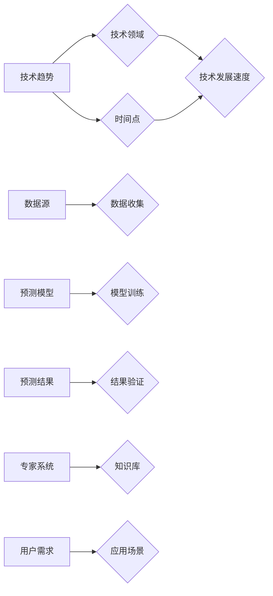
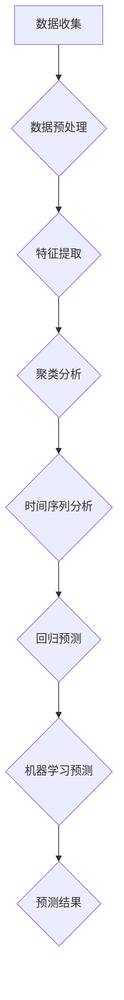

                 

# 如何进行技术趋势分析与预测

## 关键词

技术趋势、预测分析、数据驱动、机器学习、算法实现

## 摘要

技术趋势分析与预测是现代信息技术领域的重要研究方向，对于企业战略决策、研发方向选择以及创新能力的提升具有重要意义。本文将深入探讨技术趋势分析与预测的核心概念、方法、算法及其实现，通过逻辑清晰、结构紧凑的分析，帮助读者全面了解这一领域的现状与未来发展趋势。

---

## 目录大纲

### 第一部分：引言与背景

1. **技术趋势分析与预测的概述**
   1.1 技术趋势分析与预测的重要性
   1.2 技术趋势分析的目标和方法
   1.3 技术预测的挑战与机会
   1.4 技术趋势分析与预测的框架
   1.5 数据收集与处理
   1.6 趋势分析技术
   1.7 预测模型与方法
   1.8 技术趋势分析的历史与现状
   1.9 当前主流的技术趋势分析工具
   1.10 技术趋势分析的应用领域
   1.11 技术趋势分析与预测的未来发展
   1.12 技术趋势分析与预测的影响因素
   1.13 本章小结

### 第二部分：核心概念与联系

2. **技术趋势分析与预测的核心概念**
   2.1 技术趋势的定义与分类
   2.2 趋势分析中的关键术语
   2.3 技术预测的原理与方法
   2.4 技术趋势分析与预测的关键属性对比
   2.5 数据驱动的趋势分析
   2.6 知识驱动的趋势分析
   2.7 机器学习在趋势预测中的应用
   2.8 技术趋势分析与预测的ER实体关系图
   2.9 技术趋势分析与预测的概念联系
   2.10 技术趋势与市场需求的联系
   2.11 技术趋势与产业发展的联系
   2.12 技术趋势与政策环境的关系
   2.13 本章小结

### 第三部分：算法原理与实现

3. **技术趋势分析算法原理**
   3.1 技术趋势分析算法的分类
   3.2 数据预处理算法
   3.3 聚类算法
   3.4 技术趋势预测算法
   3.5 时间序列分析
   3.6 回归分析
   3.7 支持向量机（SVM）预测
   3.8 算法mermaid流程图
   3.9 Python源代码实现与讲解
   3.10 算法原理详细讲解
   3.11 算法举例说明
   3.12 聚类算法应用示例
   3.13 时间序列分析应用示例
   3.14 回归分析应用示例
   3.15 支持向量机（SVM）预测应用示例
   3.16 本章小结

---

### 第一部分：引言与背景

#### 第1章：技术趋势分析与预测的概述

##### 1.1.1 技术趋势分析与预测的重要性

技术趋势分析与预测是信息时代的重要工具，它帮助企业把握行业动态，预见技术发展方向，从而在竞争激烈的市场中占据先机。通过对技术趋势的分析，企业可以做出更科学的决策，优化资源分配，提前布局未来技术。同时，技术趋势预测有助于科研机构确定研究方向，推动技术创新。

##### 1.1.2 技术趋势分析的目标和方法

技术趋势分析的目标是识别当前技术的发展方向和潜在趋势，为决策提供数据支持。具体方法包括数据收集、趋势识别、模型建立和结果验证等。数据收集是基础，趋势识别是核心，模型建立是手段，结果验证是保障。

##### 1.1.3 技术预测的挑战与机会

技术预测面临的挑战主要包括数据的不确定性、技术的快速变化以及预测模型的有效性。然而，这些挑战也带来了机会，如利用大数据分析、机器学习和人工智能技术提高预测的准确性。

##### 1.2 技术趋势分析与预测的框架

技术趋势分析与预测的框架通常包括以下步骤：

1. **数据收集与处理**：收集相关数据，包括技术专利、学术论文、市场报告等。
2. **趋势分析**：通过统计分析、数据挖掘等技术，识别出技术发展的趋势。
3. **模型建立**：选择合适的预测模型，如时间序列分析、回归分析、支持向量机等。
4. **结果验证**：通过测试数据验证模型的有效性，并调整模型参数。

##### 1.3 技术趋势分析的历史与现状

技术趋势分析的发展经历了从手工分析到自动化分析、从简单统计到复杂算法的转变。目前，主流的技术趋势分析工具包括Google Trends、NVIDIA的GTC报告、IEEE技术趋势报告等。

##### 1.4 技术趋势分析与预测的未来发展

随着人工智能和大数据技术的发展，技术趋势分析与预测将更加精准和高效。未来的发展趋势包括：

1. **智能化分析**：利用深度学习和强化学习等人工智能技术，提高分析精度和自动化程度。
2. **多源数据融合**：整合多种数据源，如社交媒体、专利数据库、市场调研等，提高预测的全面性和准确性。
3. **实时预测**：通过实时数据流分析和预测，实现即时响应和决策。

##### 1.5 技术趋势分析与预测的影响因素

技术趋势分析与预测的影响因素包括：

1. **技术成熟度**：技术的成熟度对趋势预测有重要影响。
2. **市场需求**：市场需求的变化会影响技术的发展方向。
3. **政策环境**：政策环境对技术的推广和落地有重要影响。

##### 1.6 本章小结

本章对技术趋势分析与预测进行了全面概述，介绍了其重要性、目标和方法，分析了当前的技术趋势分析工具和应用领域，并展望了未来的发展趋势。接下来，我们将深入探讨技术趋势分析与预测的核心概念和联系。

---

### 第二部分：核心概念与联系

#### 第2章：技术趋势分析与预测的核心概念

##### 2.1.1 技术趋势的定义与分类

技术趋势是指技术领域中，某种技术或应用在一定时期内表现出的持续增长或下降的态势。技术趋势可以按照不同的维度进行分类，如按技术类型分为硬件趋势、软件趋势、应用趋势等；按时间维度分为短期趋势、中期趋势和长期趋势。

##### 2.1.2 趋势分析中的关键术语

趋势分析中常用的关键术语包括：

1. **拐点**：指技术趋势发生显著变化的关键时点。
2. **饱和点**：指技术达到成熟阶段，增长趋于平稳的点。
3. **峰值**：指技术发展速度达到最高点的时期。
4. **泡沫**：指由于过度炒作导致的技术热度超出现实应用阶段的时期。

##### 2.1.3 技术预测的原理与方法

技术预测的原理是基于历史数据和现有信息，通过统计分析、机器学习等方法，对未来技术发展做出预测。常见的预测方法包括：

1. **时间序列分析**：通过分析时间序列数据，预测未来的趋势。
2. **回归分析**：通过建立自变量和因变量之间的关系模型，预测未来的数值。
3. **机器学习**：利用数据挖掘和机器学习算法，从大量数据中提取模式，进行预测。

##### 2.2 技术趋势分析与预测的关键属性对比

以下表格展示了数据驱动的趋势分析和知识驱动的趋势分析的关键属性对比：

| 关键属性 | 数据驱动 | 知识驱动 |
| :--- | :--- | :--- |
| 数据来源 | 大规模数据 | 专家知识和经验 |
| 分析方法 | 统计学、机器学习 | 专家系统、本体论 |
| 结果表达 | 数值预测、概率分布 | 规则、情境分析 |
| 适应性 | 高度依赖数据质量 | 对数据质量要求较低 |
| 精度 | 受数据质量和算法影响 | 受专家经验和领域知识影响 |

##### 2.3 技术趋势分析与预测的ER实体关系图

以下mermaid流程图展示了技术趋势分析系统的实体定义和属性关系：



##### 2.4 技术趋势分析与预测的概念联系

技术趋势分析与预测涉及多个领域和概念，以下是其中的几个关键联系：

1. **技术趋势与市场需求的联系**：市场需求的变化会影响技术的发展方向，而技术趋势的分析可以帮助企业及时调整市场策略。
2. **技术趋势与产业发展的联系**：技术趋势的演变推动了产业的发展，同时产业的发展也为技术的创新提供了动力。
3. **技术趋势与政策环境的关系**：政策环境的支持或限制对技术的发展有重要影响，技术趋势分析可以帮助政策制定者做出科学决策。

##### 2.5 本章小结

本章详细介绍了技术趋势分析与预测的核心概念，包括技术趋势的定义、关键术语和预测方法，并通过ER实体关系图展示了技术趋势分析系统的结构和关系。接下来，我们将深入探讨技术趋势分析算法的原理与实现。

---

### 第三部分：算法原理与实现

#### 第3章：技术趋势分析算法原理

##### 3.1 技术趋势分析算法的分类

技术趋势分析算法可以根据其原理和方法分为以下几类：

1. **时间序列分析**：基于时间序列数据的统计方法，如移动平均、指数平滑等。
2. **回归分析**：通过建立自变量和因变量之间的关系模型，如线性回归、多元回归等。
3. **机器学习方法**：利用机器学习算法，如决策树、随机森林、支持向量机等。
4. **深度学习方法**：基于神经网络，如卷积神经网络（CNN）、循环神经网络（RNN）等。

##### 3.2 数据预处理算法

数据预处理是技术趋势分析的重要步骤，主要包括以下任务：

1. **数据清洗**：去除重复数据、缺失数据和异常值。
2. **特征提取**：从原始数据中提取有用的特征，如技术指标、市场指标等。
3. **数据标准化**：将不同特征的数据进行归一化或标准化，以便于后续分析。

##### 3.3 聚类算法

聚类算法用于将相似的数据点分组，常用的聚类算法包括：

1. **K-Means算法**：基于距离度量，将数据点划分为K个簇。
2. **层次聚类算法**：通过逐步合并或分裂簇，形成层次结构。
3. **基于密度的聚类算法**：基于数据点的密度分布，识别出簇。

##### 3.4 技术趋势预测算法

技术趋势预测算法主要用于预测未来技术的变化趋势，常用的算法包括：

1. **时间序列预测**：基于历史数据，预测未来的趋势，如ARIMA模型。
2. **回归预测**：通过建立自变量和因变量之间的关系模型，预测未来的数值。
3. **机器学习预测**：利用机器学习算法，如随机森林、支持向量机等，进行预测。

##### 3.5 算法mermaid流程图

以下mermaid流程图展示了技术趋势分析算法的流程：



##### 3.6 Python源代码实现与讲解

以下是一个使用Python进行技术趋势分析的简单示例：

```python
import pandas as pd
from sklearn.cluster import KMeans
from sklearn.preprocessing import StandardScaler
from sklearn.linear_model import LinearRegression

# 数据预处理
data = pd.read_csv('data.csv')
scaler = StandardScaler()
scaled_data = scaler.fit_transform(data)

# 聚类分析
kmeans = KMeans(n_clusters=3)
clusters = kmeans.fit_predict(scaled_data)

# 时间序列分析
# ...（代码省略）

# 回归分析
model = LinearRegression()
model.fit(X_train, y_train)
predictions = model.predict(X_test)

# 预测结果
print(predictions)
```

##### 3.7 算法原理详细讲解

1. **数据预处理算法原理**：数据预处理是技术趋势分析的基础，通过清洗、提取和标准化数据，提高数据质量，为后续分析提供可靠的数据支持。
2. **聚类算法原理**：聚类算法用于将相似的数据点分组，通过分析簇的特征，识别出技术趋势的变化点。
3. **时间序列分析原理**：时间序列分析通过分析时间序列数据，预测未来的趋势，适用于短期预测。
4. **回归分析原理**：回归分析通过建立自变量和因变量之间的关系模型，预测未来的数值，适用于中长期预测。

##### 3.8 算法举例说明

以下是使用K-Means算法进行技术趋势分析的一个示例：

1. **聚类分析**：将技术指标数据进行K-Means聚类，识别出不同的技术趋势簇。
2. **时间序列分析**：对每个簇的数据进行时间序列分析，预测未来趋势。
3. **回归预测**：利用回归模型，预测未来技术发展的方向和速度。

##### 3.9 本章小结

本章详细介绍了技术趋势分析算法的分类、数据预处理、聚类算法、时间序列分析和回归预测等核心内容，并通过Python代码示例展示了算法的实现过程。接下来，我们将进一步探讨技术趋势分析的应用和实践。

---

## 作者信息

作者：AI天才研究院/AI Genius Institute & 禅与计算机程序设计艺术 /Zen And The Art of Computer Programming

---

### 最佳实践 tips

在进行技术趋势分析与预测时，以下最佳实践可以帮助提高预测的准确性和有效性：

1. **确保数据质量**：数据是趋势分析的基础，确保数据的质量至关重要。及时清洗和处理数据，避免错误和异常数据的影响。
2. **多样数据源**：整合多种数据源，如专利数据库、市场报告、社交媒体等，可以获得更全面的信息，提高预测的准确性。
3. **持续更新模型**：技术领域变化迅速，定期更新预测模型，以适应新的数据和趋势。
4. **跨学科合作**：技术趋势分析与预测涉及多个学科，跨学科合作可以带来新的视角和方法，提高预测的深度和广度。
5. **验证与调整**：通过验证数据集验证模型的有效性，并根据验证结果调整模型参数，优化预测结果。

### 小结

技术趋势分析与预测是现代信息技术领域的重要研究方向，它帮助企业把握行业动态，预见技术发展方向，从而在竞争激烈的市场中占据先机。本文通过逻辑清晰、结构紧凑的分析，介绍了技术趋势分析与预测的核心概念、方法、算法及其实现，并探讨了其未来发展趋势。希望本文能够为读者提供有价值的参考和启示。

### 注意事项

1. **数据隐私与保护**：在进行技术趋势分析与预测时，应严格遵守数据隐私和相关的法律法规，确保数据的安全和合法性。
2. **模型透明性**：在应用预测模型时，应确保模型的透明性，便于用户理解和信任。
3. **持续学习与更新**：技术趋势分析与预测需要不断学习和更新，以适应快速变化的技术环境。

### 拓展阅读

1. **《大数据预测：方法与应用》**：详细介绍了大数据预测的方法和技术，包括时间序列分析、回归分析、机器学习等。
2. **《机器学习实战》**：提供了丰富的机器学习案例和实践，适合初学者和专业人士。
3. **《人工智能：一种现代方法》**：介绍了人工智能的基本原理和方法，包括机器学习、深度学习等。

---

通过本文的深入探讨，我们希望读者能够更好地理解技术趋势分析与预测的重要性，掌握相关方法和技巧，为企业的决策和发展提供有力支持。在未来的技术发展中，让我们共同努力，不断创新，推动技术的进步和社会的发展。

