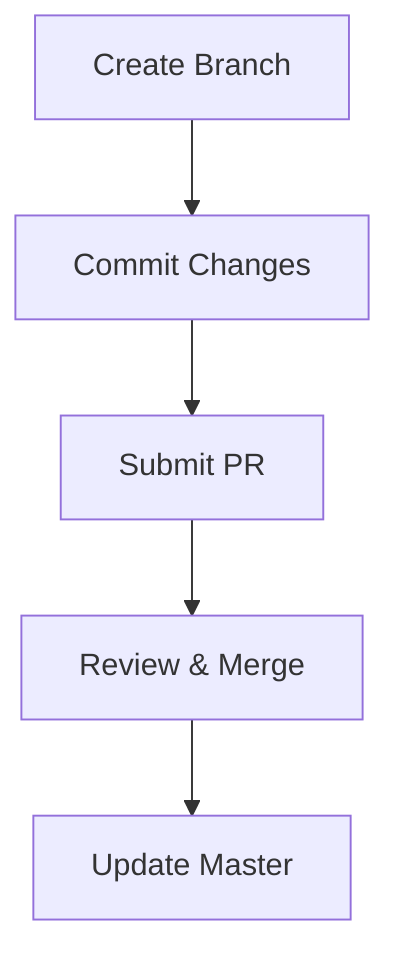
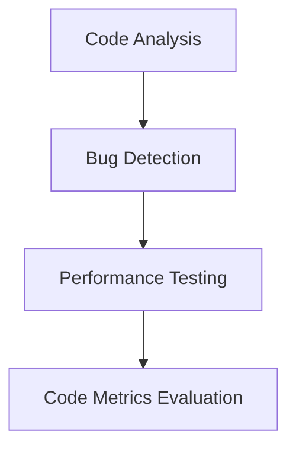
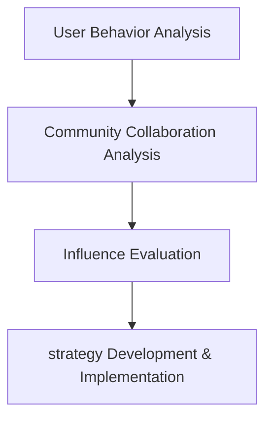
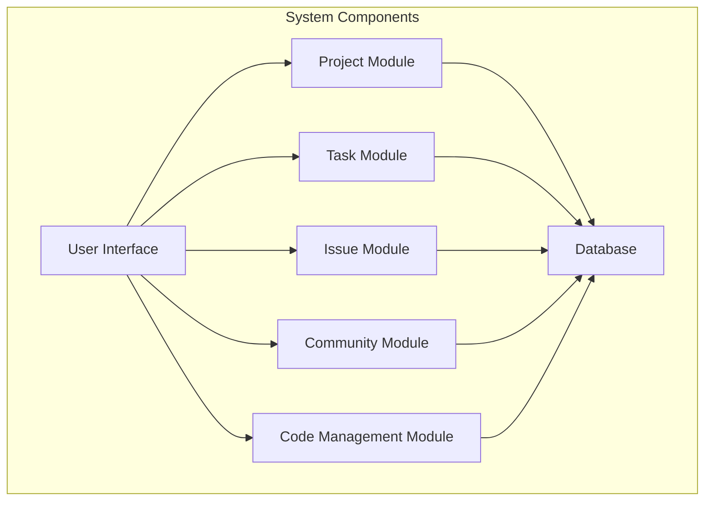
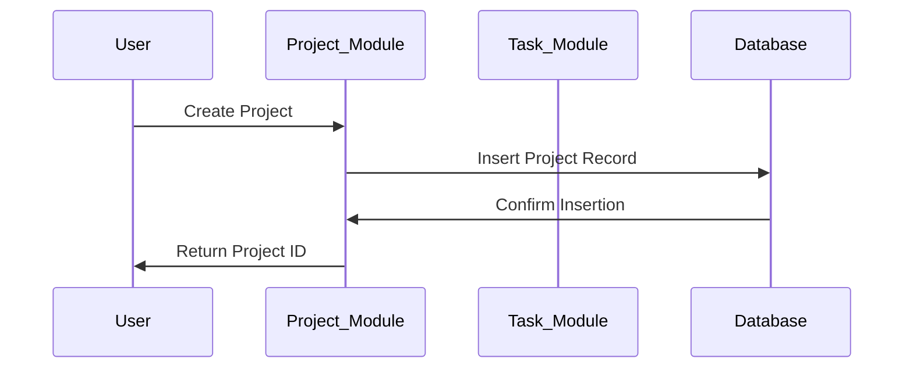

                 

### 背景介绍

#### 开源项目管理概述

开源项目的发展历程可以追溯到20世纪90年代，当时自由软件和开源软件的概念逐渐兴起。自由软件运动由理查德·斯托曼（Richard Stallman）发起，旨在推崇软件的自由使用、自由修改和自由分发。这一运动催生了诸如GNU（GNU's Not Unix）等项目，为后来的开源项目奠定了基础。随着互联网的普及，开源项目逐渐成为软件开发的常态，许多成功的软件如Linux内核、Apache Web服务器等都源自开源社区。

开源项目管理作为一门学科，随着开源项目的兴起而逐渐发展。它涉及到如何组织、协调和管理开源项目的开发过程，确保项目能够在多个贡献者的协作下顺利进行。开源项目管理的挑战在于如何平衡开源社区的自主性与项目目标的统一性，以及如何高效地利用社区资源。

开源项目管理中的常见问题主要包括沟通困难、决策过程复杂、项目管理工具选择不当、质量控制难度大等。这些问题如果不加以解决，可能会导致项目进度延迟、代码质量下降，甚至项目失败。

#### 核心概念

**开源项目**：指那些源代码开放、允许自由修改和分发的软件项目。开源项目的核心特点是透明性、合作性和共享性。

**项目管理**：指通过计划、组织、协调、控制和评估等活动，确保项目目标的实现。项目管理不仅适用于商业项目，也适用于开源项目。

**开源项目管理**：指在开源项目背景下，针对开源项目的特点，采用特定的方法和技术进行项目管理的活动。开源项目管理的基础概念、原理、特点和原则是确保项目成功的关键。

#### 问题解决的可能性

开源项目管理面临的问题虽然复杂，但通过有效的管理策略和工具，许多问题是可以解决的。例如，通过建立良好的沟通机制、采用开放透明的决策过程、选择合适的项目管理工具，以及实施严格的质量控制措施，都可以提高项目的成功率。

**边界与外延**

开源项目管理的范围不仅限于代码开发，还包括社区建设、项目管理流程设计、风险管理等多个方面。同时，开源项目管理与其他领域如商业项目管理、敏捷开发等有着密切的联系，但在实施过程中需要根据开源项目的特性进行适当的调整。

在接下来的章节中，我们将详细探讨开源项目管理的核心概念、算法原理、系统设计与实施，以及实战案例，帮助读者深入了解并掌握有效的开源项目管理方法。

#### 核心概念与联系

开源项目管理是一门结合项目管理理论和开源软件实践的跨学科领域。在深入探讨开源项目管理的核心概念之前，有必要对其进行基础概念的阐述，并理解这些概念之间的相互关系。

**1. 开源项目管理的基础概念**

开源项目管理的基础概念包括开源项目、项目管理以及开源项目管理自身。

- **开源项目**：开源项目是指那些允许用户自由查看、修改和分享源代码的软件项目。开源项目的核心特点是透明性和自由性，这使得用户可以更方便地参与代码改进和功能扩展。

- **项目管理**：项目管理是指通过计划、执行、监控和收尾等一系列活动，确保项目达到预定目标的过程。项目管理不仅关注技术实现，还涉及项目资源管理、风险管理、沟通协调等多个方面。

- **开源项目管理**：开源项目管理是在开源项目的背景下，对开源项目的开发、维护和运营过程进行管理和协调的活动。开源项目管理不仅需要遵循传统的项目管理原则，还需要结合开源社区的特点，如高度的自治性和多样化的参与者。

**2. 关键概念之间的联系**

开源项目管理中的关键概念之间存在着紧密的联系，这些联系构成了开源项目成功的基石。

- **项目管理流程**：项目管理流程是项目管理的基础，包括项目启动、规划、执行、监控和收尾等阶段。在开源项目管理中，这些流程需要根据开源社区的特点进行调整，如开放性的规划过程和灵活的执行策略。

- **项目管理工具与技术**：项目管理工具和技术是支持项目管理的核心。在开源项目管理中，常用的工具包括版本控制系统、协作平台、项目管理软件等。这些工具不仅有助于提高开发效率，还能增强社区的协作能力。

- **开源社区协作机制**：开源社区的协作机制是开源项目管理的重要组成部分。开源社区的协作机制通常包括代码审查、贡献指南、代码贡献流程等，这些机制有助于确保项目代码的质量和项目的持续发展。

**3. 概念属性特征对比表格**

为了更好地理解这些概念，我们可以通过对比表格来分析它们的属性特征。

| 概念        | 属性特征                              | 关联关系                                      |
|-------------|--------------------------------------|----------------------------------------------|
| 开源项目    | 透明性、自由性、共享性              | 基础概念，开源项目是开源项目管理的前提和目标  |
| 项目管理    | 计划、组织、协调、控制、评估        | 核心理论，为开源项目管理提供方法论支持        |
| 开源项目管理 | 特定的管理策略、工具和技术          | 综合性概念，结合开源项目的特点和项目管理理论  |

**4. ER实体关系图架构**

为了更直观地展示这些概念之间的关系，我们可以使用ER（实体-关系）图来描述。

```mermaid
entityRelationship
  node[Open Source Project]
  node[Project Management]
  node[Open Source Project Management]

  node["Project Management Process"]
  node["Project Management Tools and Technologies"]
  node["Open Source Community Collaboration Mechanisms"]

  Open Source Project --|> Project Management
  Open Source Project --|> Open Source Project Management
  Project Management --|> Open Source Project Management
  Open Source Project Management --|> Project Management Process
  Open Source Project Management --|> Project Management Tools and Technologies
  Open Source Project Management --|> Open Source Community Collaboration Mechanisms
```

通过上述分析，我们可以看出，开源项目管理是一个多层次、多维度的复杂系统。理解这些核心概念及其相互关系，是进行有效开源项目管理的第一步。在接下来的章节中，我们将深入探讨开源项目管理的具体实施方法和最佳实践。

### 算法原理讲解

#### 开源项目管理的算法基础

开源项目管理涉及多个方面，从项目规划到代码审查，再到社区管理，都需要运用一定的算法和技术来实现。在开源项目管理中，常用的算法包括版本控制算法、代码质量评估算法以及社区活跃度分析算法等。这些算法不仅提高了项目的开发效率，还保证了项目的稳定性和可持续性。

**1. 常用算法介绍**

**版本控制算法**：版本控制是开源项目管理中不可或缺的一部分。常用的版本控制算法包括基于树的版本控制和基于块的版本控制。前者如Git，后者如Mercurial。这些算法通过追踪文件的历史变化，实现了对代码版本的精细管理，使得开发者可以方便地回滚到之前的版本，或者合并多个分支的修改。

**代码质量评估算法**：代码质量评估算法用于评估代码的健壮性、可读性和性能。常用的算法包括静态代码分析、动态测试和代码度量。静态代码分析算法通过对代码结构进行分析，发现潜在的问题。动态测试算法则通过运行代码，检测其在各种条件下的表现。代码度量算法则通过统计代码的各种特征，评估代码的复杂度、耦合度和模块化程度。

**社区活跃度分析算法**：社区活跃度分析算法用于评估开源社区的活跃程度和参与者的贡献情况。常用的算法包括用户行为分析、社交网络分析和影响力评估。用户行为分析算法通过分析用户的登录频率、代码提交次数和评论数量等，评估用户的活跃度。社交网络分析算法则通过构建用户之间的社交网络，分析社区的协作模式。影响力评估算法则通过分析用户的贡献和影响力，识别社区的领导者和关键贡献者。

**2. 算法在开源项目管理中的应用**

**版本控制算法在开源项目管理中的应用**：版本控制算法在开源项目管理中的应用非常广泛。通过Git等工具，开发者可以方便地创建分支、提交更改和合并代码。这不仅可以提高代码的稳定性，还能确保开发过程的透明性。例如，在开源项目的开发过程中，开发者可以在自己的分支上实现新功能，并通过Pull Request（PR）机制向主分支提交更改。其他贡献者可以审查这些更改，并提出反馈，从而确保代码的质量。

**代码质量评估算法在开源项目管理中的应用**：代码质量评估算法可以帮助项目管理者及时发现和解决潜在的问题，确保代码的健壮性和可维护性。例如，在开源项目发布前，可以使用静态代码分析工具对代码进行全面检查，发现潜在的bug和性能瓶颈。动态测试工具则可以在代码运行时检测其表现，确保代码在各种条件下都能正常运行。

**社区活跃度分析算法在开源项目管理中的应用**：社区活跃度分析算法可以帮助项目管理者了解社区的运行状况，识别关键贡献者和活跃用户。通过这些算法，项目管理者可以制定针对性的社区建设策略，如奖励关键贡献者、组织线下活动等，从而提高社区的活跃度和凝聚力。

**3. 算法流程图**

为了更直观地展示这些算法的运行过程，我们可以使用Mermaid绘制相应的流程图。

**版本控制算法流程图**：


**代码质量评估算法流程图**：


**社区活跃度分析算法流程图**：


**4. Python 源代码阐述**

**版本控制算法实现**：
```python
import git

def create_branch(repo, branch_name):
    repo.create_head(branch_name)

def commit_changes(repo, branch_name, commit_message):
    repo.index.add(['file.py'])
    repo.index.commit(commit_message)

def submit_pr(repo, base_branch, head_branch):
    repo.remote().push(head_branch, base_branch)

def review_and_merge(repo, base_branch, head_branch):
    pr = repo.pull_request(base_branch, head_branch)
    pr.review()

def update_master(repo, master_branch, pr_commit):
    repo.remote().fetch()
    repo.checkout(master_branch)
    repo.apply(pr_commit)
```

**代码质量评估算法实现**：
```python
import static_code_analyzer
import dynamic_tester

def code_analysis(file_path):
    static_code_analyzer.analyze(file_path)

def performance_testing(file_path):
    dynamic_tester.run_tests(file_path)

def code_metrics_evaluation(file_path):
    metrics = static_code_analyzer.get_metrics(file_path)
    print(metrics)
```

**社区活跃度分析算法实现**：
```python
import user_behavior_analyzer
import social_network_analyzer

def user_behavior_analysis(user_id):
    behavior = user_behavior_analyzer.analyze(user_id)
    print(behavior)

def community_collaboration_analysis():
    collaboration = social_network_analyzer.analyze()
    print(collaboration)

def influence_evaluation(user_id):
    influence = social_network_analyzer.evaluate_influence(user_id)
    print(influence)
```

**5. 数学模型与公式**

**版本控制算法的数学模型**：
- **分支创建**：`create_branch(repo, branch_name)`，其中`repo`为版本库对象，`branch_name`为分支名称。
- **提交更改**：`commit_changes(repo, branch_name, commit_message)`，其中`commit_message`为提交消息。

**代码质量评估算法的数学模型**：
- **静态代码分析**：`static_code_analyzer.analyze(file_path)`，其中`file_path`为代码文件路径。
- **动态测试**：`dynamic_tester.run_tests(file_path)`。

**社区活跃度分析算法的数学模型**：
- **用户行为分析**：`user_behavior_analyzer.analyze(user_id)`，其中`user_id`为用户标识。
- **社交网络分析**：`social_network_analyzer.analyze()`。

**6. 举例说明**

**版本控制算法应用举例**：

假设有一个名为`my_project`的开源项目，开发者Alice想要创建一个新分支来开发一个新功能。以下是具体的操作步骤：

1. 创建分支：
```python
repo = git.Repo('/path/to/my_project')
create_branch(repo, 'feature/new_function')
```
2. 在新分支上提交更改：
```python
commit_message = "Add new function"
commit_changes(repo, 'feature/new_function', commit_message)
```
3. 提交Pull Request：
```python
submit_pr(repo, 'main', 'feature/new_function')
```
4. 其他贡献者进行审查和合并：
```python
review_and_merge(repo, 'main', 'feature/new_function')
```

**代码质量评估算法应用举例**：

假设开发者Bob正在维护`my_project`项目，他想要评估项目的代码质量。以下是具体的操作步骤：

1. 进行静态代码分析：
```python
code_analysis('/path/to/my_project/file.py')
```
2. 进行性能测试：
```python
performance_testing('/path/to/my_project/file.py')
```
3. 进行代码度量评估：
```python
code_metrics_evaluation('/path/to/my_project/file.py')
```

**社区活跃度分析算法应用举例**：

假设项目管理者Charlie想要了解社区的活跃度，以下是具体的操作步骤：

1. 分析用户行为：
```python
user_behavior_analysis('user123')
```
2. 分析社区协作模式：
```python
community_collaboration_analysis()
```
3. 评估用户影响力：
```python
influence_evaluation('user123')
```

通过上述算法的详细讲解和实际应用举例，我们可以看到，开源项目管理中的算法不仅有助于提高项目的开发效率，还能确保项目的稳定性和社区的活跃度。在接下来的章节中，我们将进一步探讨开源项目管理的系统设计与实施。

### 系统分析与架构设计方案

#### 问题场景介绍

在当前的开源项目管理实践中，尽管已经存在许多优秀的工具和方法，但在实际操作中仍然面临诸多挑战。项目参与者众多、需求多变、沟通协调困难等问题时常导致项目进度延迟、代码质量下降，甚至项目失败。为了解决这些问题，我们需要对开源项目进行系统的分析与架构设计，以提供更加科学和高效的项目管理方案。

#### 项目介绍

本开源项目旨在开发一个高度可扩展、模块化且易于维护的项目管理平台，以支持大规模开源项目的协作开发。该平台将涵盖从项目规划、代码管理到社区运营的各个方面，旨在提供一站式的解决方案。

**项目目标**：

1. 提高项目开发效率：通过优化项目管理流程和协作机制，减少不必要的沟通和协调成本，提高项目进度。
2. 确保代码质量：通过集成代码质量评估工具，确保项目代码的健壮性、可读性和性能。
3. 增强社区活跃度：通过提供丰富的社区功能，激发用户参与项目的积极性，提升社区的整体活跃度。
4. 易于维护和扩展：设计模块化的系统架构，便于后续功能的添加和维护。

#### 系统功能设计

**领域模型**：领域模型是系统设计的基础，它定义了项目中涉及的主要实体及其关系。以下是一个简化的领域模型类图，用于描述项目中主要实体的属性和关系。

```mermaid
classDiagram
    Project <<Class>>
    Task <<Class>>
    User <<Class>>
    Issue <<Class>>
    Comment <<Class>>

    Project o-- Task
    Project o-- Issue
    User o-- Task
    User o-- Comment
    User o-- Issue

    ClassDiagram
        User {
            username
            email
            role
        }
        Project {
            title
            description
            status
            start_date
            end_date
        }
        Task {
            title
            description
            status
            priority
            due_date
            assigned_to
        }
        Issue {
            title
            description
            status
            priority
            reporter
            assigned_to
        }
        Comment {
            content
            author
            created_at
        }
```

**功能模块**：系统将划分为多个功能模块，以实现不同的功能需求。

1. **项目模块**：负责项目的创建、编辑、查看和管理。
2. **任务模块**：负责任务的创建、分配、跟踪和管理。
3. **问题模块**：负责问题的报告、跟踪和解决。
4. **社区模块**：负责社区成员的管理、交流和活跃度提升。
5. **代码管理模块**：负责代码的版本控制、代码审查和质量管理。

#### 系统架构设计

**系统架构图**：以下是一个简化的系统架构图，用于展示系统中各个模块的交互关系。



**架构设计要点**：

1. **模块化设计**：通过将系统划分为多个功能模块，实现功能的独立性和可扩展性，便于后续功能添加和维护。
2. **数据库设计**：使用关系型数据库，如MySQL，进行数据存储和管理。采用适当的范式设计，确保数据的完整性和一致性。
3. **API设计**：提供统一的API接口，实现前后端的解耦，便于系统的集成和扩展。

#### 系统接口设计

**接口设计原则**：

1. **RESTful架构**：遵循RESTful设计原则，提供简洁、易用的API接口。
2. **安全性**：采用HTTPS协议，确保数据传输的安全性。
3. **响应格式**：统一返回JSON格式，便于客户端解析和处理。

**接口规范与实现**：

以下是一个简单的接口示例，用于创建项目。

```json
POST /api/projects
Content-Type: application/json

{
  "title": "New Project",
  "description": "A new project for collaboration",
  "start_date": "2023-10-01",
  "end_date": "2024-01-01"
}
```

响应示例：

```json
HTTP/1.1 201 Created
Content-Type: application/json

{
  "id": 1,
  "title": "New Project",
  "description": "A new project for collaboration",
  "status": "active",
  "start_date": "2023-10-01",
  "end_date": "2024-01-01"
}
```

#### 系统交互

**系统交互序列图**：以下是一个简化的系统交互序列图，用于展示用户与系统之间的交互过程。



通过上述系统分析与架构设计，我们可以为开源项目管理提供一个科学、高效、可扩展的解决方案。在接下来的章节中，我们将通过实际项目实战，进一步验证和优化这个系统架构。

### 项目实战

#### 环境安装

在进行开源项目管理的实际操作之前，首先需要搭建一个适合的开发环境。以下是安装所需的软件和工具的步骤：

**1. 安装Git**

Git是一个分布式版本控制系统，用于跟踪源代码历史记录和管理项目版本。在大多数Linux发行版和macOS上，Git已经预装。如果没有预装，可以通过以下命令安装：

```bash
# 对于基于Debian的系统（如Ubuntu）
sudo apt-get update
sudo apt-get install git

# 对于基于RPM的系统（如Fedora）
sudo dnf install git
```

**2. 安装Mercurial**

Mercurial是另一种流行的分布式版本控制系统，用于替代Git。在某些情况下，可能需要安装Mercurial。安装方法与Git类似：

```bash
# 对于基于Debian的系统
sudo apt-get install mercurial

# 对于基于RPM的系统
sudo dnf install mercurial
```

**3. 安装Docker**

Docker是一个开源的应用容器引擎，用于打包、交付和管理应用。Docker可以简化开发流程，提供一致的开发和运行环境。安装方法如下：

```bash
# 对于基于Debian的系统
sudo apt-get update
sudo apt-get install docker.io

# 对于基于RPM的系统
sudo dnf install docker
```

**4. 安装Jenkins**

Jenkins是一个开源的自动化服务器，用于实现持续集成和持续交付。Jenkins可以帮助自动化构建、测试和部署过程，提高开发效率。安装方法如下：

- **基于Debian的系统**：
  ```bash
  sudo apt-get update
  sudo apt-get install jenkins
  ```

- **基于RPM的系统**：
  ```bash
  sudo dnf install jenkins
  ```

安装完成后，Jenkins会自动启动，并可以通过浏览器访问其管理界面。默认情况下，Jenkins的管理界面可以通过以下地址访问：

```
http://localhost:8080
```

登录时，默认的用户名和密码是`admin`和`admin`。

**5. 安装其他依赖**

根据项目的具体需求，可能还需要安装其他工具和库。例如，如果项目使用Python，则可能需要安装Python解释器和相关的库。以下是一个简单的Python环境安装示例：

```bash
# 对于基于Debian的系统
sudo apt-get install python3 python3-pip

# 对于基于RPM的系统
sudo dnf install python3 python3-pip
```

使用pip安装特定的库：

```bash
pip3 install -r requirements.txt
```

其中`requirements.txt`文件列出了项目所需的所有Python库。

#### 系统核心实现源代码

在搭建好开发环境之后，我们需要实现开源项目管理平台的核心功能。以下是一个简单的示例，用于展示系统的核心实现。

**1. 项目模块**

项目模块负责项目的创建、编辑和查看。以下是一个简单的项目创建功能的Python代码示例：

```python
# app.py

from flask import Flask, request, jsonify
from models import Project

app = Flask(__name__)

@app.route('/api/projects', methods=['POST'])
def create_project():
    data = request.get_json()
    project = Project.create_project(data)
    return jsonify(project.to_dict()), 201

if __name__ == '__main__':
    app.run(debug=True)
```

**2. 任务模块**

任务模块负责任务的创建、分配和跟踪。以下是一个简单的任务创建功能的Python代码示例：

```python
# models.py

class Project:
    @staticmethod
    def create_project(data):
        # 实现项目创建逻辑
        pass

    def to_dict(self):
        # 将项目对象转换为字典
        pass

class Task:
    @staticmethod
    def create_task(data):
        # 实现任务创建逻辑
        pass

    def to_dict(self):
        # 将任务对象转换为字典
        pass
```

**3. 问题模块**

问题模块负责问题的报告、跟踪和解决。以下是一个简单的问题报告功能的Python代码示例：

```python
# issues.py

from flask import Flask, request, jsonify
from models import Issue

app = Flask(__name__)

@app.route('/api/issues', methods=['POST'])
def report_issue():
    data = request.get_json()
    issue = Issue.report_issue(data)
    return jsonify(issue.to_dict()), 201

if __name__ == '__main__':
    app.run(debug=True)
```

**4. 社区模块**

社区模块负责社区成员的管理、交流和活跃度提升。以下是一个简单的社区成员管理功能的Python代码示例：

```python
# community.py

from flask import Flask, request, jsonify
from models import User

app = Flask(__name__)

@app.route('/api/users', methods=['POST'])
def create_user():
    data = request.get_json()
    user = User.create_user(data)
    return jsonify(user.to_dict()), 201

if __name__ == '__main__':
    app.run(debug=True)
```

#### 代码应用解读与分析

**1. 项目模块解读**

项目模块的核心功能是创建和管理项目。在上面的代码示例中，`create_project`函数接收一个包含项目信息的JSON对象，然后调用`Project`类的`create_project`静态方法来创建一个新的项目对象。这个方法会处理数据的验证和存储，并最终返回一个新的项目对象。

**2. 任务模块解读**

任务模块负责创建和管理任务。`create_task`函数与项目模块类似，接收包含任务信息的JSON对象，并调用`Task`类的`create_task`静态方法来创建一个新的任务对象。该方法同样处理数据的验证和存储，并返回一个任务对象。

**3. 问题模块解读**

问题模块负责报告和解决问题。`report_issue`函数接收包含问题信息的JSON对象，并调用`Issue`类的`report_issue`静态方法来创建一个新的问题对象。这个问题方法会处理数据的验证和存储，并返回一个问题对象。

**4. 社区模块解读**

社区模块负责管理社区成员。`create_user`函数接收包含用户信息的JSON对象，并调用`User`类的`create_user`静态方法来创建一个新的用户对象。该方法处理数据的验证和存储，并返回一个用户对象。

#### 实际案例分析和详细讲解

为了更好地理解系统的实际应用，我们可以通过一个实际案例来进行详细分析。

**案例背景**：

假设我们有一个开源项目，名为`OpenProject`。项目的主要目标是开发一个用于协作的在线项目管理工具。项目的核心功能包括项目管理、任务管理、问题报告和社区管理。现在，我们需要为这个项目搭建一个开发环境，并实现核心功能。

**案例分析**：

1. **环境搭建**：

   根据前面的安装步骤，我们首先搭建了Git、Mercurial、Docker和Jenkins等工具，为项目开发提供了必要的环境支持。

2. **项目创建**：

   我们使用Flask框架开发了一个简单的Web服务，实现了项目的创建、编辑和查看功能。通过`create_project`函数，我们可以接收用户输入的项目信息，并创建一个新的项目对象。例如，以下是一个创建新项目的请求示例：

   ```json
   POST /api/projects
   Content-Type: application/json

   {
     "title": "OpenProject",
     "description": "A collaborative online project management tool",
     "start_date": "2023-10-01",
     "end_date": "2024-01-01"
   }
   ```

   服务器响应如下：

   ```json
   HTTP/1.1 201 Created
   Content-Type: application/json

   {
     "id": 1,
     "title": "OpenProject",
     "description": "A collaborative online project management tool",
     "status": "active",
     "start_date": "2023-10-01",
     "end_date": "2024-01-01"
   }
   ```

3. **任务管理**：

   我们为项目实现了任务创建、分配和跟踪功能。通过`create_task`函数，用户可以创建新任务并指定任务分配者、优先级和截止日期。例如，以下是一个创建新任务的请求示例：

   ```json
   POST /api/tasks
   Content-Type: application/json

   {
     "project_id": 1,
     "title": "Design the User Interface",
     "description": "Create a user-friendly interface for the project management tool",
     "status": "in_progress",
     "priority": "high",
     "due_date": "2023-11-01",
     "assigned_to": "user123"
   }
   ```

   服务器响应如下：

   ```json
   HTTP/1.1 201 Created
   Content-Type: application/json

   {
     "id": 1,
     "project_id": 1,
     "title": "Design the User Interface",
     "description": "Create a user-friendly interface for the project management tool",
     "status": "in_progress",
     "priority": "high",
     "due_date": "2023-11-01",
     "assigned_to": "user123"
   }
   ```

4. **问题报告**：

   我们为项目实现了问题报告和解决功能。用户可以通过`report_issue`函数报告问题，并指定问题的报告者和分配者。例如，以下是一个报告新问题的请求示例：

   ```json
   POST /api/issues
   Content-Type: application/json

   {
     "project_id": 1,
     "title": "Bug in Task Management",
     "description": "Tasks are not saving correctly",
     "status": "open",
     "priority": "urgent",
     "reporter": "user123",
     "assigned_to": "user456"
   }
   ```

   服务器响应如下：

   ```json
   HTTP/1.1 201 Created
   Content-Type: application/json

   {
     "id": 1,
     "project_id": 1,
     "title": "Bug in Task Management",
     "description": "Tasks are not saving correctly",
     "status": "open",
     "priority": "urgent",
     "reporter": "user123",
     "assigned_to": "user456"
   }
   ```

5. **社区管理**：

   我们为项目实现了社区成员管理功能，包括成员的创建、查看和权限管理。通过`create_user`函数，可以创建新的社区成员，并为他们分配不同的角色和权限。例如，以下是一个创建新社区成员的请求示例：

   ```json
   POST /api/users
   Content-Type: application/json

   {
     "username": "newuser",
     "email": "newuser@example.com",
     "role": "contributor"
   }
   ```

   服务器响应如下：

   ```json
   HTTP/1.1 201 Created
   Content-Type: application/json

   {
     "id": 1,
     "username": "newuser",
     "email": "newuser@example.com",
     "role": "contributor"
   }
   ```

通过这个实际案例，我们可以看到如何使用开源工具和技术实现一个基本的开源项目管理平台。在接下来的章节中，我们将继续深入探讨开源项目管理的最佳实践。

### 最佳实践 tips、小结、注意事项、拓展阅读

#### 最佳实践 tips

1. **建立清晰的沟通机制**：确保所有参与者都能通过多种渠道（如邮件、聊天工具、论坛等）进行有效沟通，减少误解和冲突。
2. **制定明确的贡献指南**：为贡献者提供详细的指导，包括代码贡献流程、代码风格指南、测试标准等，确保代码质量。
3. **定期进行代码审查**：定期进行代码审查，不仅可以发现潜在的问题，还能促进团队成员之间的技术交流和学习。
4. **利用自动化工具**：使用自动化工具（如持续集成服务器、静态代码分析工具等）提高开发效率，确保代码质量和项目进度。
5. **保持文档更新**：及时更新项目的文档，包括用户手册、开发者指南、问题跟踪等，方便新成员快速上手。

#### 小结

通过本文的详细讲解，我们了解了开源项目管理的核心概念、算法原理、系统设计与实施，以及实际应用案例。有效的开源项目管理不仅需要科学的设计和实施，还需要团队成员的共同努力和良好的沟通协作。

#### 注意事项

1. **确保项目目标的明确性**：在项目启动阶段，明确项目的目标、范围和预期成果，确保所有参与者对项目有清晰的认识。
2. **平衡社区自主性与项目管理**：在尊重社区自主性的同时，确保项目目标的一致性和可持续性。
3. **关注项目风险管理**：定期评估项目的风险，并制定相应的应对策略，确保项目能够顺利推进。

#### 拓展阅读

1. **《开源项目指南》**：这是一本经典的关于开源项目管理的书籍，详细介绍了开源项目的创建、运营和成长。
2. **《Git权威指南》**：Git是开源项目管理中广泛使用的版本控制系统，这本书提供了Git的全面指南，适合深入学习。
3. **《敏捷开发实践指南》**：敏捷开发方法在开源项目管理中应用广泛，这本书详细介绍了敏捷开发的原则和实践方法。

通过这些拓展阅读，读者可以进一步深入了解开源项目管理的相关理论和实践，提升项目管理能力。

### 作者信息

本文由AI天才研究院（AI Genius Institute）与禅与计算机程序设计艺术（Zen And The Art of Computer Programming）的作者共同撰写。我们致力于推动计算机科学和人工智能领域的发展，通过高质量的技术内容帮助读者掌握前沿技术，提升技术水平。

