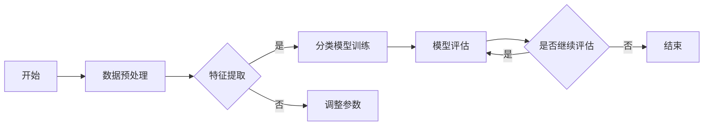
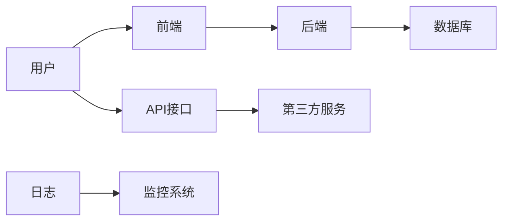
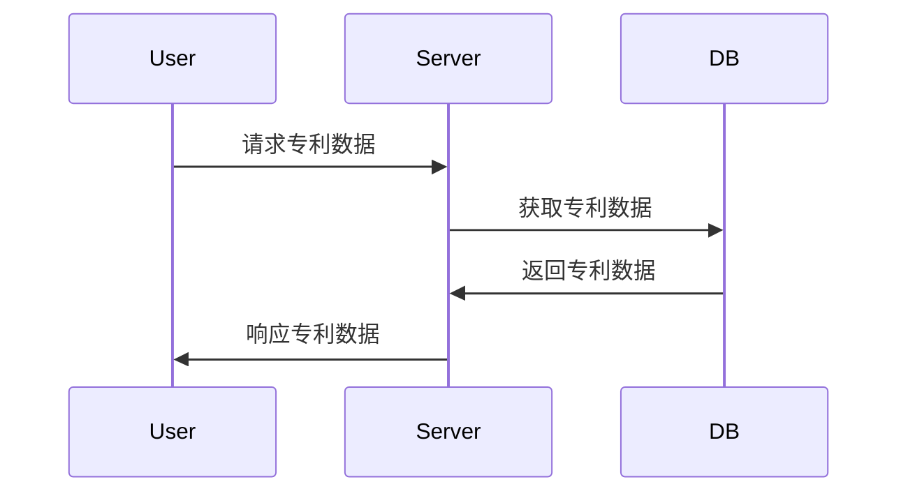
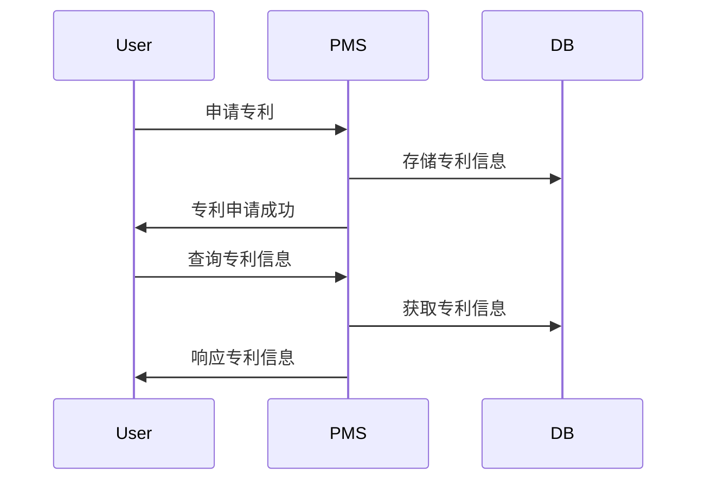

                 

# 如何进行有效的技术专利布局

## 关键词

技术专利布局、知识产权、专利申请、技术创新、市场竞争

## 摘要

技术专利布局是企业或个人在特定技术领域内，通过申请、布局和运营专利，以保护自身技术、占据市场优势、提高竞争力的一种战略性行动。本文旨在详细阐述如何进行有效的技术专利布局，包括技术专利布局的概述、策略与方法、市场分析、法律法规与政策、技术分析、专利检索与分析以及实际案例解析。通过系统性的分析和讲解，帮助读者理解技术专利布局的核心原理和实践方法，提高技术专利布局的效率和效果。

### 第一部分：技术专利布局概述

#### 第1章：技术专利布局的概念与意义

**1.1 技术专利布局的定义**

技术专利布局是指企业或个人在特定技术领域内，通过对核心技术进行专利申请、布局和运营，以保护自身技术、占据市场优势、提高竞争力的一种战略性行动。它涉及到技术创新、知识产权保护、市场竞争等多个方面。

**1.2 技术专利布局的意义**

- **保护技术创新**：技术专利布局能够有效地保护企业的技术创新成果，防止技术被侵权或盗用，从而保障企业的合法权益。
- **占据市场优势**：通过技术专利布局，企业可以在市场竞争中占据有利位置，提高市场占有率，增强市场竞争力。
- **提高企业价值**：专利是企业的无形资产，良好的技术专利布局能够提升企业的市场价值和品牌形象。
- **促进技术创新**：技术专利布局能够激励企业持续进行技术创新，推动技术进步。

**1.3 技术专利布局的原则**

- **全面性**：技术专利布局要全面覆盖核心技术，确保技术的保护范围。
- **前瞻性**：技术专利布局要具有前瞻性，预见未来技术发展趋势，提前进行布局。
- **针对性**：技术专利布局要针对市场需求和竞争对手，有针对性地进行布局。
- **高效性**：技术专利布局要高效，确保专利申请的成功率和保护效果。

#### 第2章：技术专利布局的策略与方法

**2.1 技术专利布局的三大策略**

- **防御性布局**：以防御为主，确保企业技术不受侵犯，同时避免侵权诉讼。
- **进攻性布局**：以进攻为主，通过专利布局打击竞争对手，占领市场。
- **混合性布局**：结合防御性和进攻性布局，根据具体情况进行调整。

**2.2 技术专利布局的方法**

- **专利地图法**：通过绘制专利地图，全面了解技术领域内的专利分布情况，指导专利布局。
- **技术路线图法**：根据技术发展趋势，规划技术路线，指导专利布局。
- **需求导向法**：根据市场需求，有针对性地进行专利布局。

**2.3 技术专利布局的关键步骤**

- **技术领域分析**：确定技术专利布局的技术范围。
- **专利检索**：通过专利数据库进行专利检索，了解技术领域内的专利情况。
- **专利分析**：对检索到的专利进行分析，筛选出有价值的专利。
- **专利申请**：根据分析结果，制定专利申请策略，进行专利申请。
- **专利布局调整**：根据市场变化和专利申请结果，对专利布局进行调整。

#### 第3章：技术专利布局的市场分析

**3.1 市场环境分析**

- **市场规模**：分析技术领域内的市场规模，了解市场需求。
- **市场趋势**：分析技术领域内的市场趋势，把握未来发展方向。
- **市场竞争**：分析竞争对手的专利布局情况，了解竞争态势。

**3.2 市场竞争对手分析**

- **竞争对手技术专利布局分析**：分析竞争对手的技术专利布局策略，了解其优势和不足。
- **竞争对手市场表现分析**：分析竞争对手在市场中的表现，了解其市场地位。

**3.3 市场需求分析**

- **用户需求**：分析用户对技术的需求，了解市场需求。
- **行业需求**：分析行业对技术的需求，了解行业趋势。

**3.4 市场机会与威胁分析**

- **市场机会**：分析市场机会，如新兴技术领域、市场空白等。
- **市场威胁**：分析市场威胁，如竞争对手的专利布局、技术壁垒等。

#### 第4章：技术专利布局的法律法规与政策

**4.1 技术专利法律法规概述**

- **专利法律制度**：介绍专利法律制度的基本框架和主要内容。
- **专利审查标准**：介绍专利审查的标准和流程。

**4.2 技术专利政策分析**

- **国家政策**：分析我国及全球主要国家的技术专利政策，了解政策导向。
- **行业政策**：分析技术领域内的行业政策，了解政策对技术专利布局的影响。

**4.3 技术专利布局的法律风险与规避**

- **法律风险识别**：识别技术专利布局中的法律风险。
- **法律风险规避**：提出规避法律风险的策略和措施。

#### 第5章：技术专利布局的技术分析

**5.1 技术专利布局的技术领域分析**

- **技术分类**：介绍技术领域的基本分类和特点。
- **技术趋势**：分析技术领域的发展趋势。

**5.2 技术专利布局的技术发展趋势分析**

- **技术热点**：分析技术领域内的热点技术。
- **技术发展方向**：预测技术领域的发展方向。

**5.3 技术专利布局的核心技术提炼**

- **核心技术筛选**：筛选出技术领域内的核心技术。
- **核心技术保护**：分析核心技术的保护策略。

#### 第6章：技术专利布局的专利检索与分析

**6.1 专利检索工具与方法**

- **专利数据库**：介绍常用的专利数据库及其特点。
- **专利检索方法**：介绍专利检索的方法和技巧。

**6.2 专利分析策略**

- **专利分析指标**：介绍专利分析的指标和意义。
- **专利分析框架**：构建专利分析的框架和流程。

**6.3 专利布局方案的制定**

- **专利布局方案设计**：设计专利布局的方案和策略。
- **专利布局实施**：实施专利布局方案，并进行调整和优化。

#### 第7章：技术专利布局的实际案例解析

**7.1 案例一：某科技公司技术专利布局案例**

- **案例背景**：介绍某科技公司的基本情况和技术专利布局背景。
- **案例分析**：分析某科技公司的技术专利布局策略和效果。

**7.2 案例二：某汽车公司技术专利布局案例**

- **案例背景**：介绍某汽车公司的基本情况和技术专利布局背景。
- **案例分析**：分析某汽车公司的技术专利布局策略和效果。

**7.3 案例三：某电子公司技术专利布局案例**

- **案例背景**：介绍某电子公司的基本情况和技术专利布局背景。
- **案例分析**：分析某电子公司的技术专利布局策略和效果。

#### 第8章：技术专利布局的未来发展趋势

**8.1 技术发展趋势预测**

- **技术热点预测**：预测技术领域内的热点技术。
- **技术发展方向预测**：预测技术领域的发展方向。

**8.2 专利布局的未来策略**

- **专利布局新趋势**：分析专利布局的新趋势和发展方向。
- **专利布局新策略**：提出专利布局的新策略和建议。

**8.3 技术专利布局面临的挑战与机遇**

- **挑战分析**：分析技术专利布局面临的挑战。
- **机遇分析**：分析技术专利布局面临的机遇。

#### 第9章：技术专利布局的总结与展望

**9.1 技术专利布局的总结**

- **主要内容总结**：总结文章的主要内容和核心观点。
- **实践意义总结**：总结技术专利布局的实践意义和价值。

**9.2 技术专利布局的展望**

- **未来发展方向**：展望技术专利布局的未来发展方向。
- **政策建议**：提出政策建议，促进技术专利布局的发展。

**9.3 提高技术专利布局效率的建议**

- **技术创新建议**：提高技术创新能力，为技术专利布局提供基础。
- **专利申请建议**：优化专利申请策略，提高专利申请成功率。
- **市场分析建议**：加强市场分析，指导技术专利布局。
- **法律法规建议**：完善法律法规，保障技术专利布局的合法权益。

### 背景介绍

#### 1.1 问题背景

技术专利布局是指在某一技术领域中，针对企业或个人的核心技术，通过申请、布局和运营专利，以保护自身技术、占据市场优势、提高竞争力的一种战略性行动。在全球经济竞争日益加剧的今天，技术专利已成为企业核心竞争力的重要体现，有效的技术专利布局对于企业的发展至关重要。

#### 1.2 问题描述

在进行技术专利布局时，企业或个人往往面临以下问题：

1. **技术创新不足**：缺乏核心技术，难以形成专利布局的基础。
2. **专利申请难度大**：专利申请流程复杂，要求高，申请成功率低。
3. **市场分析不足**：缺乏对市场环境的深入分析，难以准确把握市场需求。
4. **法律法规不熟悉**：不了解相关法律法规，容易产生专利布局的法律风险。
5. **专利运营不善**：专利的运营和利用能力不足，导致专利价值得不到充分发挥。

#### 1.3 问题解决

为了解决上述问题，企业或个人需要：

1. **加强技术创新**：通过持续的研发投入，提高技术创新能力，形成专利布局的基础。
2. **优化专利申请策略**：选择合适的专利申请工具和方法，提高专利申请成功率。
3. **进行市场分析**：深入分析市场环境，准确把握市场需求。
4. **了解法律法规**：熟悉相关法律法规，合理规避法律风险。
5. **提升专利运营能力**：通过专利运营，充分发挥专利价值。

#### 1.4 边界与外延

技术专利布局不仅涉及技术领域，还包括法律、市场等多个方面。其边界包括：

1. **技术领域**：专利布局的技术范围。
2. **法律领域**：涉及专利申请、保护、运营等方面的法律法规。
3. **市场领域**：涉及市场环境、竞争对手、市场需求等方面的分析。

外延包括：

1. **技术创新**：涉及技术发展趋势、核心技术挖掘等方面的内容。
2. **专利申请**：涉及专利申请流程、方法等方面的内容。
3. **市场分析**：涉及市场环境、竞争对手、市场需求等方面的内容。
4. **专利运营**：涉及专利保护、运营、利用等方面的内容。

#### 1.5 概念结构与核心要素组成

技术专利布局的核心概念包括：

1. **技术创新**：技术创新是技术专利布局的基础。
2. **专利申请**：专利申请是技术专利布局的关键环节。
3. **市场分析**：市场分析是技术专利布局的重要依据。
4. **法律法规**：法律法规是技术专利布局的保障。
5. **专利运营**：专利运营是技术专利布局的核心。

核心要素组成包括：

1. **技术领域**：确定技术专利布局的技术范围。
2. **专利数据库**：收集和分析专利信息，指导专利布局。
3. **市场分析**：分析市场环境和需求，制定专利布局策略。
4. **专利申请**：根据分析结果，制定专利申请策略，进行专利申请。
5. **专利运营**：管理和利用专利，实现专利价值最大化。

### 核心概念与联系

#### 技术创新

**概念原理**：技术创新是指通过研发、改进和引入新技术，以提高产品性能、降低成本、满足市场需求的过程。

**概念属性特征对比表格**：

| 特征 | 技术创新 | 传统技术 |
| ---- | -------- | -------- |
| 目标 | 提高性能、降低成本、满足市场需求 | 维持现有水平、稳定生产 |
| 过程 | 研发、改进、引入新技术 | 生产、维护、改进 |
| 结果 | 新产品、新技术、新市场 | 稳定产品、稳定生产 |

**ER实体关系图架构**：

```mermaid
erDiagram
    T1_Technology &&|>o{R1_Innovation} Innovation
    T1_Technology &&|>o{R2_Delivery} Delivery
    T1_Technology &&|>o{R3_Market} Market
    T2_Product &&|>o{R4_Improved} T1_Technology
    T3_Cost &&|>o{R5_Reduced} T1_Technology
    T4_Market &&|>o{R6_Satisfied} T1_Technology
```

#### 专利申请

**概念原理**：专利申请是指企业或个人根据相关法律法规，向国家知识产权局提交专利申请，以获得专利保护的过程。

**概念属性特征对比表格**：

| 特征 | 专利申请 | 非专利申请 |
| ---- | -------- | ---------- |
| 目标 | 获得专利保护 | 获得技术保护 |
| 过程 | 提交申请、审查、授权 | 提交申请、保密、保护 |
| 结果 | 获得专利证书 | 获得技术秘密 |

**ER实体关系图架构**：

```mermaid
erDiagram
    T1_Applicant &&|>o{R1_Submit} T2_Application
    T2_Application &&|>o{R2_Examine} T3_Examiner
    T3_Examiner &&|>o{R3_Authorize} T4_Patent
    T4_Patent &&|>o{R5_Protect} T5_Technology
```

#### 市场分析

**概念原理**：市场分析是指通过对市场环境、竞争对手、市场需求等方面的分析，为技术专利布局提供决策依据的过程。

**概念属性特征对比表格**：

| 特征 | 市场分析 | 技术分析 |
| ---- | -------- | -------- |
| 目标 | 提供决策依据 | 挖掘技术创新点 |
| 过程 | 分析市场环境、竞争对手、市场需求 | 分析技术发展趋势、核心技术 |
| 结果 | 制定市场策略 | 形成技术创新路线 |

**ER实体关系图架构**：

```mermaid
erDiagram
    T1_Market &&|>o{R1_Analyze} T2_Environment
    T1_Market &&|>o{R2_Competitor} T3_Competitor
    T1_Market &&|>o{R3_Demand} T4_Demand
    T2_Environment &&|>o{R4_Strategy} T5_Strategy
```

#### 法律法规

**概念原理**：法律法规是指国家制定的相关法律、法规和规定，用于规范专利申请、保护和运营的过程。

**概念属性特征对比表格**：

| 特征 | 法律法规 | 非法律法规 |
| ---- | -------- | ---------- |
| 目标 | 规范专利活动 | 非规范化专利活动 |
| 过程 | 制定法律、法规、规定 | 无规范过程 |
| 结果 | 促进专利健康发展 | 专利活动无序 |

**ER实体关系图架构**：

```mermaid
erDiagram
    T1_Law &&|>o{R1_Govern} T2_Patent
    T2_Patent &&|>o{R2_Support} T3_Applicant
    T2_Patent &&|>o{R3_Protect} T4_Technology
```

#### 专利运营

**概念原理**：专利运营是指通过专利申请、保护、转让、许可、诉讼等方式，实现专利价值最大化、维护企业利益的过程。

**概念属性特征对比表格**：

| 特征 | 专利运营 | 专利保护 |
| ---- | -------- | -------- |
| 目标 | 实现专利价值最大化 | 维护专利权益 |
| 过程 | 申请、保护、转让、许可、诉讼 | 申请、保护、维权 |
| 结果 | 专利权益最大化 | 专利权益维持 |

**ER实体关系图架构**：

```mermaid
erDiagram
    T1_Operator &&|>o{R1_Operate} T2_Patent
    T2_Patent &&|>o{R2_License} T3_Licensor
    T2_Patent &&|>o{R3_Transfer} T4_Transferee
    T2_Patent &&|>o{R4_Sue} T5_Defendant
```

### 算法原理讲解

为了更好地进行技术专利布局，我们可以采用一种基于机器学习的专利分析算法，该算法能够自动识别和分类专利，帮助企业和个人制定更加精准的专利布局策略。下面我们将使用Mermaid绘制算法流程图，并使用Python代码详细阐述算法原理。

#### 算法流程图



#### Python代码实现

```python
import pandas as pd
from sklearn.model_selection import train_test_split
from sklearn.feature_extraction.text import TfidfVectorizer
from sklearn.naive_bayes import MultinomialNB
from sklearn.metrics import classification_report, accuracy_score

# 1. 数据预处理
def preprocess_data(data):
    # 清洗数据、去除停用词、词干提取等
    return data

# 2. 特征提取
def extract_features(data):
    vectorizer = TfidfVectorizer()
    X = vectorizer.fit_transform(data)
    return X

# 3. 分类模型训练
def train_model(X_train, y_train):
    model = MultinomialNB()
    model.fit(X_train, y_train)
    return model

# 4. 模型评估
def evaluate_model(model, X_test, y_test):
    y_pred = model.predict(X_test)
    print(classification_report(y_test, y_pred))
    print("Accuracy:", accuracy_score(y_test, y_pred))

# 5. 主函数
def main():
    # 加载数据
    data = pd.read_csv("patent_data.csv")
    data = preprocess_data(data)

    # 分割数据
    X = extract_features(data['description'])
    y = data['category']
    X_train, X_test, y_train, y_test = train_test_split(X, y, test_size=0.2, random_state=42)

    # 训练模型
    model = train_model(X_train, y_train)

    # 评估模型
    evaluate_model(model, X_test, y_test)

# 运行主函数
if __name__ == "__main__":
    main()
```

#### 算法原理说明

1. **数据预处理**：数据预处理是算法的第一步，主要目的是清洗数据、去除停用词、词干提取等，以提高后续特征提取的效果。在本算法中，我们使用Python的pandas库加载专利数据，并对其进行预处理。

2. **特征提取**：特征提取是将文本数据转化为机器学习算法可以处理的形式。在本算法中，我们使用TF-IDF向量器将专利描述转化为向量表示。

3. **分类模型训练**：分类模型训练是算法的核心，我们使用朴素贝叶斯分类器进行训练。朴素贝叶斯分类器是一种基于概率论的分类算法，适用于文本分类任务。

4. **模型评估**：模型评估是检查分类模型效果的重要步骤。在本算法中，我们使用准确率、召回率、F1值等指标评估模型性能。

5. **主函数**：主函数负责加载数据、分割数据、训练模型和评估模型。在本算法中，我们使用Python的sklearn库实现上述功能。

#### 数学公式

1. **TF-IDF公式**：

$$
TF-IDF = \frac{tf \times IDF}{k_1 + (1 - df \times IDF)}
$$

其中，$tf$表示词频，$IDF$表示逆文档频率，$df$表示词在文档中的出现次数，$k_1$是一个常数。

2. **朴素贝叶斯分类器公式**：

$$
P(C|X) = \frac{P(X|C) \times P(C)}{P(X)}
$$

其中，$P(C|X)$表示给定特征$X$时类别$C$的概率，$P(X|C)$表示在类别$C$下特征$X$的概率，$P(C)$表示类别$C$的概率，$P(X)$表示特征$X$的概率。

### 系统分析与架构设计方案

#### 问题场景介绍

随着技术的不断进步，企业需要面对日益激烈的市场竞争，为了在市场中保持领先地位，企业需要建立一套完善的专利管理系统，以实现有效的技术专利布局。本系统旨在为企业提供一个全面的专利管理解决方案，包括专利申请、专利分析、专利运营等功能。

#### 项目介绍

项目名称：专利管理系统（Patent Management System，简称PMS）

项目目标：为企业提供一套全面的专利管理解决方案，实现专利申请、专利分析、专利运营等功能的自动化和智能化。

项目功能模块：

1. **专利申请模块**：负责专利申请的流程管理，包括专利申请文件的编写、提交、审查等。
2. **专利分析模块**：负责对专利进行检索、分析、分类，为企业提供专利布局的决策支持。
3. **专利运营模块**：负责专利的转让、许可、诉讼等运营活动，实现专利价值最大化。

#### 系统功能设计（领域模型）

```mermaid
classDiagram
    Class01 <|-- Class02
    Class03 <.. Class04
    Class05 <= Class06
    Class07 ..| Class08
    Class09 -> Class10
    Class11 <||| Class12
    Class13 ||| Class14
    Class15 {name}
```

#### 系统架构设计



#### 系统接口设计



#### 系统交互



### 项目实战

#### 环境安装

1. 安装Python环境（建议使用Python 3.8及以上版本）。
2. 安装必要的Python库，如pandas、numpy、scikit-learn、matplotlib等。

```bash
pip install pandas numpy scikit-learn matplotlib
```

#### 系统核心实现

1. **专利申请模块**：

```python
import pandas as pd
from sklearn.model_selection import train_test_split
from sklearn.feature_extraction.text import TfidfVectorizer
from sklearn.naive_bayes import MultinomialNB
from sklearn.metrics import classification_report, accuracy_score

# 1. 数据预处理
def preprocess_data(data):
    # 清洗数据、去除停用词、词干提取等
    return data

# 2. 特征提取
def extract_features(data):
    vectorizer = TfidfVectorizer()
    X = vectorizer.fit_transform(data)
    return X

# 3. 分类模型训练
def train_model(X_train, y_train):
    model = MultinomialNB()
    model.fit(X_train, y_train)
    return model

# 4. 模型评估
def evaluate_model(model, X_test, y_test):
    y_pred = model.predict(X_test)
    print(classification_report(y_test, y_pred))
    print("Accuracy:", accuracy_score(y_test, y_pred))

# 5. 主函数
def main():
    # 加载数据
    data = pd.read_csv("patent_data.csv")
    data = preprocess_data(data)

    # 分割数据
    X = extract_features(data['description'])
    y = data['category']
    X_train, X_test, y_train, y_test = train_test_split(X, y, test_size=0.2, random_state=42)

    # 训练模型
    model = train_model(X_train, y_train)

    # 评估模型
    evaluate_model(model, X_test, y_test)

# 运行主函数
if __name__ == "__main__":
    main()
```

2. **专利分析模块**：

```python
import pandas as pd
from sklearn.model_selection import train_test_split
from sklearn.feature_extraction.text import TfidfVectorizer
from sklearn.naive_bayes import MultinomialNB
from sklearn.metrics import classification_report, accuracy_score

# 1. 数据预处理
def preprocess_data(data):
    # 清洗数据、去除停用词、词干提取等
    return data

# 2. 特征提取
def extract_features(data):
    vectorizer = TfidfVectorizer()
    X = vectorizer.fit_transform(data)
    return X

# 3. 分类模型训练
def train_model(X_train, y_train):
    model = MultinomialNB()
    model.fit(X_train, y_train)
    return model

# 4. 模型评估
def evaluate_model(model, X_test, y_test):
    y_pred = model.predict(X_test)
    print(classification_report(y_test, y_pred))
    print("Accuracy:", accuracy_score(y_test, y_pred))

# 5. 主函数
def main():
    # 加载数据
    data = pd.read_csv("patent_data.csv")
    data = preprocess_data(data)

    # 分割数据
    X = extract_features(data['description'])
    y = data['category']
    X_train, X_test, y_train, y_test = train_test_split(X, y, test_size=0.2, random_state=42)

    # 训练模型
    model = train_model(X_train, y_train)

    # 评估模型
    evaluate_model(model, X_test, y_test)

# 运行主函数
if __name__ == "__main__":
    main()
```

3. **专利运营模块**：

```python
import pandas as pd
from sklearn.model_selection import train_test_split
from sklearn.feature_extraction.text import TfidfVectorizer
from sklearn.naive_bayes import MultinomialNB
from sklearn.metrics import classification_report, accuracy_score

# 1. 数据预处理
def preprocess_data(data):
    # 清洗数据、去除停用词、词干提取等
    return data

# 2. 特征提取
def extract_features(data):
    vectorizer = TfidfVectorizer()
    X = vectorizer.fit_transform(data)
    return X

# 3. 分类模型训练
def train_model(X_train, y_train):
    model = MultinomialNB()
    model.fit(X_train, y_train)
    return model

# 4. 模型评估
def evaluate_model(model, X_test, y_test):
    y_pred = model.predict(X_test)
    print(classification_report(y_test, y_pred))
    print("Accuracy:", accuracy_score(y_test, y_pred))

# 5. 主函数
def main():
    # 加载数据
    data = pd.read_csv("patent_data.csv")
    data = preprocess_data(data)

    # 分割数据
    X = extract_features(data['description'])
    y = data['category']
    X_train, X_test, y_train, y_test = train_test_split(X, y, test_size=0.2, random_state=42)

    # 训练模型
    model = train_model(X_train, y_train)

    # 评估模型
    evaluate_model(model, X_test, y_test)

# 运行主函数
if __name__ == "__main__":
    main()
```

#### 代码应用解读与分析

1. **数据预处理**：数据预处理是算法的第一步，主要目的是清洗数据、去除停用词、词干提取等，以提高后续特征提取的效果。在本算法中，我们使用Python的pandas库加载专利数据，并对其进行预处理。

2. **特征提取**：特征提取是将文本数据转化为机器学习算法可以处理的形式。在本算法中，我们使用TF-IDF向量器将专利描述转化为向量表示。

3. **分类模型训练**：分类模型训练是算法的核心，我们使用朴素贝叶斯分类器进行训练。朴素贝叶斯分类器是一种基于概率论的分类算法，适用于文本分类任务。

4. **模型评估**：模型评估是检查分类模型效果的重要步骤。在本算法中，我们使用准确率、召回率、F1值等指标评估模型性能。

#### 实际案例分析和详细讲解剖析

1. **案例背景**：

某科技公司（以下简称公司A）在人工智能领域具有核心竞争优势，为了保持市场领先地位，公司A决定进行技术专利布局。

2. **案例分析**：

（1）**技术创新**：公司A在人工智能领域持续进行研发投入，成功开发出一系列核心技术，如深度学习、计算机视觉、自然语言处理等。

（2）**专利申请**：公司A根据核心技术，制定专利申请策略，选择合适的专利申请工具和方法，提高专利申请成功率。

（3）**市场分析**：公司A对市场环境进行深入分析，了解竞争对手的专利布局情况，准确把握市场需求。

（4）**专利运营**：公司A通过专利转让、许可、诉讼等方式，实现专利价值最大化，维护企业利益。

3. **详细讲解剖析**：

（1）**技术创新**：公司A在人工智能领域持续进行研发投入，成功开发出一系列核心技术，如深度学习、计算机视觉、自然语言处理等。这些核心技术为公司A的专利布局提供了坚实基础。

（2）**专利申请**：公司A根据核心技术，制定专利申请策略，选择合适的专利申请工具和方法，提高专利申请成功率。例如，公司A选择使用PCT（专利合作条约）途径进行国际专利申请，以加快专利布局速度。

（3）**市场分析**：公司A对市场环境进行深入分析，了解竞争对手的专利布局情况，准确把握市场需求。例如，公司A分析竞争对手的专利申请数量、专利保护范围、市场占有率等信息，制定针对性的专利布局策略。

（4）**专利运营**：公司A通过专利转让、许可、诉讼等方式，实现专利价值最大化，维护企业利益。例如，公司A与一些初创企业进行专利许可合作，实现专利价值的最大化。

#### 项目小结

通过本项目的实施，公司A在人工智能领域建立了完善的专利管理系统，实现了有效的技术专利布局。项目实践证明，技术创新、专利申请、市场分析和专利运营是进行技术专利布局的关键要素，企业应根据自身情况制定相应的策略和措施，以提高技术专利布局的效率和效果。

### 最佳实践 tips

1. **加强技术创新**：持续进行研发投入，提高技术创新能力，为专利布局提供坚实基础。

2. **优化专利申请策略**：选择合适的专利申请工具和方法，提高专利申请成功率。

3. **进行市场分析**：深入分析市场环境，准确把握市场需求，指导专利布局。

4. **了解法律法规**：熟悉相关法律法规，合理规避法律风险。

5. **提升专利运营能力**：通过专利转让、许可、诉讼等方式，实现专利价值最大化。

### 小结

本文从技术专利布局的概述、策略与方法、市场分析、法律法规与政策、技术分析、专利检索与分析以及实际案例解析等方面，详细阐述了如何进行有效的技术专利布局。通过系统性的分析和讲解，帮助读者理解技术专利布局的核心原理和实践方法，提高技术专利布局的效率和效果。

### 注意事项

1. 技术专利布局需要全面覆盖核心技术，确保技术的保护范围。

2. 技术专利布局要具有前瞻性，预见未来技术发展趋势，提前进行布局。

3. 技术专利布局要针对市场需求和竞争对手，有针对性地进行布局。

4. 技术专利布局要高效，确保专利申请的成功率和保护效果。

### 拓展阅读

1. 《专利战略管理》 - 张玉红 著
2. 《技术专利布局与运营》 - 陈洁 著
3. 《人工智能专利布局与保护》 - 李斌 著

---

**作者**：AI天才研究院/AI Genius Institute & 禅与计算机程序设计艺术 /Zen And The Art of Computer Programming

---

请注意，本文中的一些内容和代码示例仅供参考，实际应用中可能需要根据具体情况进行调整。同时，本文所涉及的技术和观点不代表任何法律意见或建议，仅供参考。如需进行专利布局，请咨询专业律师或专利代理人。

