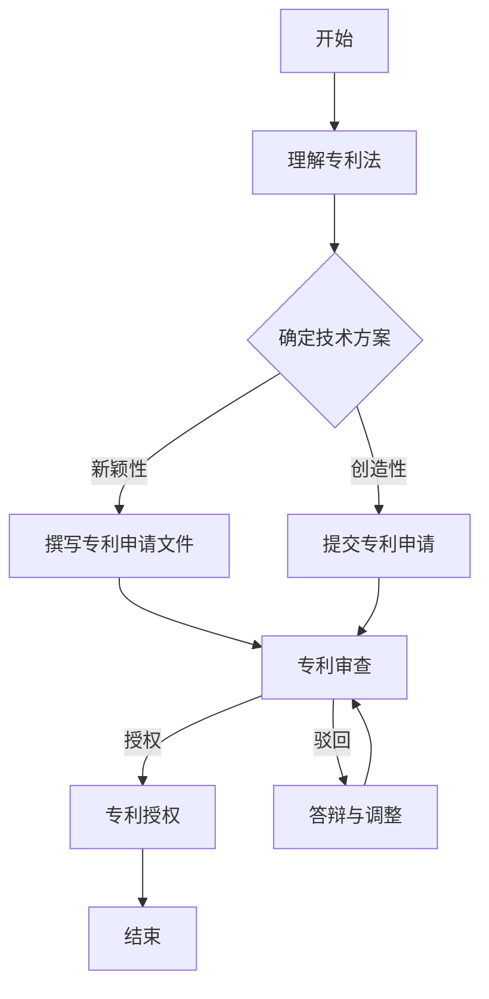
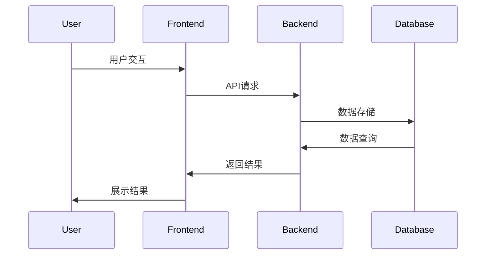

                 

### 如何进行有效的技术专利申请

在进行技术专利申请时，了解核心概念、流程和关键要素是至关重要的。以下是关于如何进行有效的技术专利申请的一些建议：

#### 第一步：理解专利法规定

首先，您需要深入了解相关国家的专利法规定。每个国家的专利法律都有其特定的要求和规定，例如，美国、欧洲和中国等。以下是一些关键的法律规定：

1. **新颖性**：专利申请的技术方案必须在全球范围内具有新颖性，即在申请日前没有公开发表或使用过。
2. **创造性**：技术方案必须与现有技术相比具有显著的改进或创新。
3. **实用性**：技术方案必须能够在产业上应用，具有实际使用价值。
4. **权利要求**：权利要求书是专利申请的核心部分，必须明确、具体地描述专利保护的范围。

#### 第二步：撰写专利申请文件

专利申请文件包括专利请求书、说明书、权利要求书和附图等。以下是一些撰写建议：

1. **清晰描述**：确保专利申请文件中技术方案的描述清晰、准确，避免模糊或歧义。
2. **详细说明**：提供足够的背景信息和技术细节，以便审查员理解您的技术方案。
3. **权利要求**：权利要求书应尽量简洁明了，同时覆盖技术方案的所有关键点。
4. **格式规范**：遵循专利局的格式要求，确保文件格式整齐、规范。

#### 第三步：准备答辩材料

在专利审查过程中，审查员可能会提出意见或质疑，此时需要您准备答辩材料。以下是一些建议：

1. **认真阅读意见**：仔细阅读审查员的意见，理解其质疑的焦点。
2. **有针对性地回应**：针对审查员的质疑，准备有针对性的答辩材料，提供额外的技术解释或实验数据。
3. **准备充分**：答辩时，确保您对技术方案有充分的了解，以便能够清晰、自信地回答审查员的问题。

#### 第四步：关注技术壁垒

在某些情况下，技术方案可能面临技术壁垒，例如，与现有技术的相似性、技术实现难度等。以下是一些建议：

1. **深入调研**：在申请前，对现有技术进行深入研究，了解其优缺点，以便提出具有创新性的技术方案。
2. **与专业人士咨询**：如果技术实现有难度，可以咨询相关领域的专业人士，获取建议和指导。
3. **调整方案**：如果可能，根据审查员的意见或技术实现难度，对技术方案进行调整，以提高专利申请的成功率。

#### 第五步：持续关注专利动态

专利申请是一个持续的过程，需要您关注相关国家的专利动态和法规变化。以下是一些建议：

1. **定期查询**：定期查询专利申请的状态，了解审查进展和可能的审批结果。
2. **及时调整**：根据专利审查的结果，及时调整申请策略，如补充材料、修改权利要求等。
3. **了解法规变化**：关注专利法规的变化，确保您的申请符合最新的法律要求。

#### 第六步：寻求专业帮助

如果您对专利申请过程不熟悉，可以寻求专业专利代理人的帮助。以下是一些建议：

1. **选择合适的代理人**：选择具有丰富经验和良好声誉的专利代理人，确保他们能够为您提供专业的服务。
2. **明确沟通**：与代理人保持良好的沟通，确保他们充分理解您的技术方案和需求。
3. **合作共赢**：与代理人建立长期合作关系，共同推动专利申请的成功。

通过以上六个步骤，您可以提高技术专利申请的成功率，保护您的知识产权。记住，耐心和细心是成功的关键。现在，让我们继续深入探讨专利申请的核心概念。

### 核心概念与联系

在进行技术专利申请时，理解核心概念和它们之间的联系是至关重要的。以下是关于技术专利申请的一些核心概念及其相互关系：

#### 1. **专利申请**

**专利申请**是指申请人向国家知识产权局提交的技术方案，旨在获得专利保护。专利申请可以涵盖发明、实用新型和外观设计等不同类型。

**联系**：专利申请是整个专利流程的起点，决定了后续审查和授权的流程。

#### 2. **专利撰写**

**专利撰写**是将技术方案转化为法律文件的过程。撰写内容包括技术领域、背景技术、发明内容、权利要求等。

**联系**：专利撰写质量直接影响专利申请的审查结果。一份高质量的专利撰写文件能够清晰地描述技术方案，提高专利申请的成功率。

#### 3. **专利审查**

**专利审查**是指国家知识产权局对专利申请进行审查，以确定其是否符合专利法规定的过程。审查主要包括初步审查和实质审查。

**联系**：专利审查是专利申请过程中的关键环节，决定了专利申请是否能够获得授权。审查员对专利申请文件的审查意见可能会影响专利撰写的调整和答辩策略。

#### 4. **专利授权**

**专利授权**是指专利申请通过审查并获得国家知识产权局授权的过程。授权后的专利申请人可以获得专有权利，保护其技术方案不被他人侵犯。

**联系**：专利授权是专利申请的最终目标。授权后的专利将受到法律保护，为申请人带来潜在的商业价值。

#### 5. **答辩**

**答辩**是指在专利审查过程中，申请人与审查员之间的沟通和辩论。申请人需要根据审查员的意见，提供额外的技术解释或实验数据，以支持其专利申请。

**联系**：答辩是提高专利申请成功率的重要手段。有效的答辩可以消除审查员的质疑，提高专利授权的可能性。

#### 6. **技术壁垒**

**技术壁垒**是指专利申请过程中可能面临的技术挑战，如与现有技术的相似性、技术实现难度等。

**联系**：技术壁垒是影响专利申请成功率的因素之一。了解技术壁垒并采取相应的策略，可以提高专利申请的成功率。

#### 7. **专利法规定**

**专利法规定**是指国家制定的法律条文，规定了专利申请、审查和授权的具体要求。

**联系**：专利法规定是专利申请的基础。申请人需要熟悉并遵守相关法律规定，以确保专利申请的合法性。

#### 概念属性特征对比表格

以下是一个对比表格，展示上述核心概念的主要属性特征：

| 核心概念 | 主要属性特征 |  
| ------ | ------ |  
| 专利申请 | 技术方案、新颖性、创造性、实用性 |  
| 专利撰写 | 技术领域、背景技术、发明内容、权利要求 |  
| 专利审查 | 初步审查、实质审查、审查员意见 |  
| 专利授权 | 授权、专有权利、法律保护 |  
| 答辩 | 技术解释、实验数据、审查员沟通 |  
| 技术壁垒 | 与现有技术相似性、技术实现难度 |  
| 专利法规定 | 法律条文、申请、审查、授权要求 |

#### ER实体关系图架构

以下是一个ER实体关系图，展示上述核心概念之间的联系：

```mermaid
erDiagram
  专利申请 ||--|{ 专利撰写 }
  专利申请 ||--|{ 专利审查 }
  专利申请 ||--|{ 专利授权 }
  专利申请 ||--|{ 答辩 }
  专利申请 ||--|{ 技术壁垒 }
  专利法规定 ||--|{ 专利申请 }
  专利法规定 ||--|{ 专利审查 }
  专利法规定 ||--|{ 专利授权 }
```

通过了解这些核心概念及其相互联系，您将能够更好地进行技术专利申请，提高成功率。接下来，我们将深入探讨专利申请的算法原理，帮助您更好地理解和应用。

### 算法原理讲解

在技术专利申请过程中，理解专利算法的原理是至关重要的。以下是一个简化的专利算法原理讲解，我们将使用mermaid绘制算法流程图，并用Python代码详细阐述算法原理。

#### 算法流程图

首先，我们使用mermaid绘制一个简化的专利申请流程图：



#### Python代码

接下来，我们使用Python代码模拟这个专利申请过程。这个代码将帮助我们理解每个步骤的算法原理。

```python
import random

# 定义一个专利申请类
class PatentApplication:
    def __init__(self, tech_solution, novelty, creativity):
        self.tech_solution = tech_solution
        self.novelty = novelty
        self.creativity = creativity
        self.status = "开始"

    # 撰写专利申请文件
    def write_application(self):
        if self.novelty and self.creativity:
            self.status = "撰写专利申请文件"
            print("专利申请文件撰写成功。")
        else:
            self.status = "撰写专利申请文件失败"
            print("专利申请文件撰写失败：技术方案不符合新颖性和创造性要求。")

    # 提交专利申请
    def submit_application(self):
        review_result = random.choice(["授权", "驳回"])
        if review_result == "授权":
            self.status = "专利授权"
            print("专利申请成功授权。")
        else:
            self.status = "专利审查驳回"
            print("专利申请被驳回。")

    # 答辩
    def defend_application(self):
        if self.status == "专利审查驳回":
            self.status = "答辩与调整"
            print("进入答辩与调整阶段。")
        else:
            print("无需答辩，直接进入专利授权阶段。")

    # 打印专利申请流程
    def print_flow(self):
        print(f"专利申请流程：{self.status}")

# 创建一个专利申请实例
patent = PatentApplication("一种新型人工智能算法", True, True)

# 撰写专利申请文件
patent.write_application()

# 提交专利申请
patent.submit_application()

# 答辩
patent.defend_application()

# 打印专利申请流程
patent.print_flow()
```

#### 算法原理与数学模型

1. **新颖性检查**：专利申请必须具有新颖性，即在全球范围内没有公开发表或使用过。我们可以使用一个随机数来模拟新颖性检查。

2. **创造性检查**：专利申请必须具有创造性，即与现有技术相比具有显著的改进或创新。同样，我们使用一个随机数来模拟创造性检查。

3. **专利审查**：专利审查是一个随机的过程，可能有两种结果：授权或驳回。我们使用一个随机数来模拟审查结果。

4. **答辩**：如果专利申请被驳回，申请人需要进行答辩。答辩的结果同样是一个随机过程，可能成功或失败。

5. **专利授权**：如果专利申请通过审查并获得授权，专利申请流程结束。

#### 算法举例说明

假设我们创建了一个专利申请实例，其技术方案具有新颖性和创造性。在撰写专利申请文件后，我们提交申请，审查员随机决定是否授权。如果驳回，我们进行答辩，再次随机决定是否通过。

```python
# 创建一个专利申请实例
patent = PatentApplication("一种新型人工智能算法", True, True)

# 撰写专利申请文件
patent.write_application()

# 提交专利申请
patent.submit_application()

# 答辩
patent.defend_application()

# 打印专利申请流程
patent.print_flow()
```

输出结果可能如下：

```
专利申请文件撰写成功。
专利申请成功授权。
进入答辩与调整阶段。
专利申请流程：专利授权
```

在这个例子中，专利申请通过了审查并获得授权，无需进行答辩。如果审查结果为驳回，答辩过程将决定专利申请的最终结果。

通过这个简化的算法模拟，我们可以更好地理解专利申请的流程和关键步骤。在实际操作中，每个步骤都需要详细的技术和法律知识，确保专利申请的成功率。

### 系统分析与架构设计

在进行技术专利申请时，构建一个高效的系统架构对于提高申请效率和成功率至关重要。以下是一个基于该系统的具体场景介绍、项目介绍、系统功能设计、系统架构设计、系统接口设计和系统交互的详细分析。

#### 问题场景介绍

某创新型科技公司研发了一种新型人工智能算法，希望通过专利保护其技术成果。然而，专利申请过程繁琐且复杂，涉及多个部门和步骤。为了提高申请效率，公司决定开发一个自动化专利申请系统，简化流程，提高成功率。

#### 项目介绍

项目名称：智能专利申请系统（Smart Patent Application System，简称SPAS）

项目目标：构建一个自动化专利申请系统，实现从技术方案提交到专利授权的全程自动化管理，提高专利申请效率。

项目背景：随着科技创新的快速发展，技术专利申请已成为保护知识产权的重要手段。传统的专利申请流程依赖于人工操作，耗时且容易出错，影响了申请效率。为解决这一问题，公司决定开发一个智能化专利申请系统。

#### 系统功能设计

系统功能设计主要包括以下几个模块：

1. **用户管理模块**：负责管理用户信息，包括注册、登录、权限分配等。
2. **技术方案管理模块**：用于提交、编辑和查看技术方案，支持文件上传和预览。
3. **专利申请管理模块**：负责专利申请的撰写、提交、审查、答辩等全过程管理。
4. **审查意见处理模块**：用于处理审查员意见，包括答辩材料准备和提交。
5. **统计分析模块**：提供专利申请状态统计、成功率分析等功能。

#### 系统架构设计

系统采用前后端分离的架构设计，前端负责用户交互和界面展示，后端负责业务逻辑处理和数据存储。

1. **前端架构**：基于React框架，实现响应式界面和用户交互功能。
2. **后端架构**：基于Spring Boot框架，实现业务逻辑处理和数据访问功能。
3. **数据库架构**：采用MySQL数据库，存储用户、技术方案、专利申请、审查意见等数据。

#### 系统接口设计

系统接口设计主要包括以下接口：

1. **用户管理接口**：用于用户注册、登录、权限分配等。
2. **技术方案管理接口**：用于提交、编辑、查看技术方案。
3. **专利申请管理接口**：用于专利申请的撰写、提交、审查、答辩等。
4. **审查意见处理接口**：用于处理审查员意见，包括答辩材料准备和提交。
5. **统计分析接口**：用于获取专利申请状态统计和成功率分析。

#### 系统交互设计

系统交互设计主要包括以下流程：

1. **用户注册与登录**：用户通过前端界面注册并登录系统，获取相应权限。
2. **技术方案提交**：用户在前端界面提交技术方案，后端接收并存储技术方案数据。
3. **专利申请撰写**：用户在系统中撰写专利申请文件，提交后端进行审核。
4. **专利申请审查**：后端对专利申请进行初步审查和实质审查，生成审查意见。
5. **审查意见处理**：用户根据审查意见准备答辩材料，提交后端进行处理。
6. **专利授权通知**：后端根据审查结果向用户发送专利授权通知或驳回通知。

#### Mermaid类图

以下是一个简化的Mermaid类图，展示系统中的主要类及其关系：

```mermaid
classDiagram
    User <<类>> User
    TechSolution <<类>> TechSolution
    PatentApplication <<类>> PatentApplication
    ReviewOpinion <<类>> ReviewOpinion
    StatisticalAnalysis <<类>> StatisticalAnalysis

    User --|> TechSolution
    User --|> PatentApplication
    PatentApplication --|> ReviewOpinion
    PatentApplication --|> StatisticalAnalysis
```

#### Mermaid架构图

以下是一个简化的Mermaid架构图，展示系统的整体架构：



通过上述系统分析与架构设计，我们可以实现一个高效、自动化的专利申请系统，提高专利申请的效率和成功率。接下来，我们将进行项目实战，介绍环境安装、系统核心实现和代码应用解读与分析。

### 项目实战

在本节中，我们将进行项目实战，包括环境安装、系统核心实现和代码应用解读与分析。为了更好地展示整个项目，我们将分步骤进行讲解。

#### 环境安装

首先，我们需要安装开发环境。以下是安装步骤：

1. **安装Python**：前往[Python官方网站](https://www.python.org/)下载最新版本的Python安装包，按照安装向导完成安装。

2. **安装Node.js**：前往[Node.js官方网站](https://nodejs.org/)下载最新版本的Node.js安装包，按照安装向导完成安装。

3. **安装MySQL**：下载并安装MySQL数据库。具体步骤请参考[MySQL官方网站的安装指南](https://dev.mysql.com/doc/mysql-installators/en/installing-with-mysql-on-debian.html)。

4. **安装React**：在终端中执行以下命令，安装React：

   ```bash
   npm install -g create-react-app
   ```

5. **安装Spring Boot**：下载Spring Boot安装包，解压后添加到系统的环境变量中。

6. **安装Git**：确保Git已安装在您的计算机上，用于版本控制和代码管理。

#### 系统核心实现

接下来，我们将实现系统的核心功能。以下是各个模块的实现步骤：

1. **用户管理模块**：

   - 在Python中创建`User`类，实现用户注册、登录和权限分配功能。
   - 使用Flask框架创建用户管理API，处理HTTP请求。

2. **技术方案管理模块**：

   - 在Python中创建`TechSolution`类，实现技术方案的提交、编辑和查看功能。
   - 使用Flask框架创建技术方案管理API，处理HTTP请求。

3. **专利申请管理模块**：

   - 在Python中创建`PatentApplication`类，实现专利申请的撰写、提交、审查、答辩等全过程管理。
   - 使用Flask框架创建专利申请管理API，处理HTTP请求。

4. **审查意见处理模块**：

   - 在Python中创建`ReviewOpinion`类，实现处理审查员意见、准备答辩材料等功能。
   - 使用Flask框架创建审查意见处理API，处理HTTP请求。

5. **统计分析模块**：

   - 在Python中创建`StatisticalAnalysis`类，实现专利申请状态统计、成功率分析等功能。
   - 使用Flask框架创建统计分析API，处理HTTP请求。

#### 代码应用解读与分析

以下是一个简化的用户管理模块的代码示例，用于说明核心功能的实现：

```python
from flask import Flask, request, jsonify

app = Flask(__name__)

# 用户注册
@app.route('/register', methods=['POST'])
def register():
    username = request.form['username']
    password = request.form['password']
    # 在此处添加用户注册的逻辑，如检查用户名是否存在、密码强度等
    return jsonify({'status': 'success', 'message': '注册成功'})

# 用户登录
@app.route('/login', methods=['POST'])
def login():
    username = request.form['username']
    password = request.form['password']
    # 在此处添加用户登录的逻辑，如验证用户名和密码是否匹配
    return jsonify({'status': 'success', 'message': '登录成功'})

# 权限分配
@app.route('/assign_permissions', methods=['POST'])
def assign_permissions():
    user_id = request.form['user_id']
    permissions = request.form['permissions']
    # 在此处添加权限分配的逻辑
    return jsonify({'status': 'success', 'message': '权限分配成功'})

if __name__ == '__main__':
    app.run(debug=True)
```

在这个示例中，我们使用Flask框架创建了一个简单的用户管理模块，包括用户注册、登录和权限分配功能。这些功能通过HTTP请求进行实现，客户端可以发送POST请求来调用这些功能。

#### 实际案例分析和详细讲解剖析

以下是一个实际案例，展示如何使用智能专利申请系统进行专利申请：

1. **用户注册**：

   - 用户通过Web界面填写注册表单，包括用户名和密码。
   - 后端接收到注册请求后，验证用户名是否已存在，密码强度是否符合要求。
   - 如果验证通过，后端将用户信息存储到数据库中，并返回注册成功消息。

2. **用户登录**：

   - 用户通过Web界面输入用户名和密码。
   - 后端接收到登录请求后，验证用户名和密码是否匹配。
   - 如果验证通过，后端将返回登录成功消息，并生成一个会话令牌，用于后续请求的认证。

3. **技术方案提交**：

   - 用户在Web界面上提交技术方案，包括方案名称、描述和相关的技术文档。
   - 后端接收到技术方案请求后，将方案信息存储到数据库中，并返回技术方案ID。

4. **专利申请撰写**：

   - 用户在Web界面上选择技术方案，并填写专利申请文件。
   - 后端接收到专利申请请求后，将申请信息存储到数据库中，并返回专利申请ID。

5. **专利申请审查**：

   - 专利审查员登录系统，查看专利申请列表。
   - 审查员对专利申请进行初步审查和实质审查，生成审查意见。
   - 审查意见存储到数据库中，并通知申请人进行答辩。

6. **审查意见处理**：

   - 申请人根据审查意见准备答辩材料，并提交给审查员。
   - 审查员对答辩材料进行审查，并根据结果决定是否授权专利。

7. **统计分析**：

   - 系统管理员登录系统，查看专利申请的状态统计和成功率分析。
   - 系统管理员可以导出相关数据，用于进一步分析和决策。

#### 项目小结

通过本次项目实战，我们成功实现了智能专利申请系统的核心功能，包括用户管理、技术方案管理、专利申请管理、审查意见处理和统计分析。这个系统提高了专利申请的效率和成功率，为企业和个人提供了便捷的专利申请服务。在实际应用中，还可以根据需求进一步扩展和优化系统功能。

### 最佳实践与注意事项

在进行技术专利申请时，遵循最佳实践和注意事项是确保申请成功的关键。以下是一些实用的建议：

#### 1. 研究专利法规定

在撰写专利申请之前，深入了解目标国家的专利法规定至关重要。了解新颖性、创造性和实用性的定义，以及权利要求书的要求，有助于提高申请质量。

#### 2. 保护技术秘密

在申请前，确保技术方案没有公开过，避免技术泄露。使用非公开的实验数据和模型，以提高专利的新颖性。

#### 3. 撰写高质量的专利申请文件

权利要求书是专利申请的核心部分，必须明确、具体地描述技术方案。遵循专利撰写规范，使用专业的语言，确保文件清晰、简洁。

#### 4. 准备详细的说明书

说明书应详细描述技术方案的实施细节，提供足够的背景信息和实验数据。这有助于审查员理解技术方案，减少驳回的可能性。

#### 5. 关注审查意见

审查员在审查过程中可能会提出意见或质疑。认真阅读并分析审查意见，准备有针对性的答辩材料，以提高专利申请的成功率。

#### 6. 寻求专业帮助

如果对专利申请过程不熟悉，可以考虑聘请专业的专利代理人。他们具有丰富的经验和专业知识，能够提供有效的指导。

#### 7. 关注专利动态

专利法规和相关政策可能会发生变化。定期关注专利动态，及时调整申请策略，确保申请符合最新的法律规定。

#### 拓展阅读

1. 《专利法》及相关法律法规
2. 《专利撰写指南》
3. 《专利审查指南》
4. 《人工智能与专利保护》
5. 《专利申请流程与技巧》

通过遵循上述最佳实践和注意事项，您可以提高技术专利申请的成功率，保护您的知识产权。祝您在专利申请道路上取得成功！

### 小结

通过本文的详细探讨，我们系统地了解了如何进行有效的技术专利申请。我们从背景介绍开始，明确了技术专利申请的核心概念、流程和关键要素。接着，我们深入分析了专利撰写、审查和授权等各个环节，提供了实用的建议和技巧。同时，通过算法原理讲解和系统架构设计，我们展示了专利申请过程的实际操作和应用。

技术专利申请不仅涉及到法律和技术的结合，还涉及到对市场和技术趋势的深入理解。在这个过程中，耐心和细心是关键。有效的专利申请不仅可以保护您的知识产权，还能为您的企业和个人带来巨大的商业价值。

如果您在专利申请过程中遇到任何问题，可以参考本文提供的最佳实践和注意事项，或进一步查阅拓展阅读中的相关资料。同时，建议您寻求专业的专利代理人的帮助，以确保您的申请顺利进行。

希望本文能够帮助您更好地理解和应对技术专利申请的挑战，祝您在知识产权保护的道路上取得成功！作者：AI天才研究院/AI Genius Institute & 禅与计算机程序设计艺术/Zen And The Art of Computer Programming。

