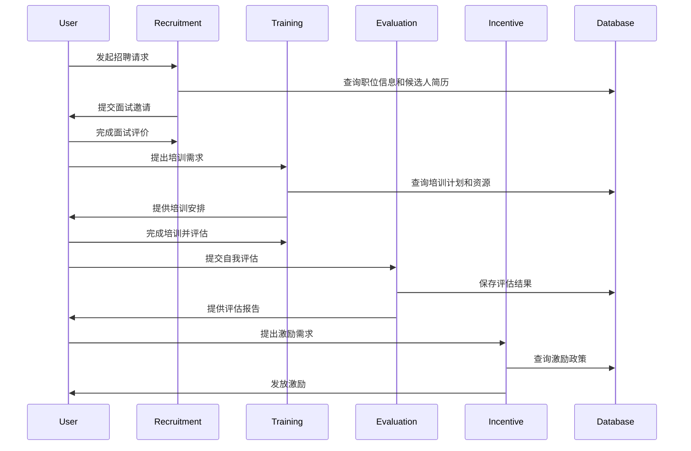
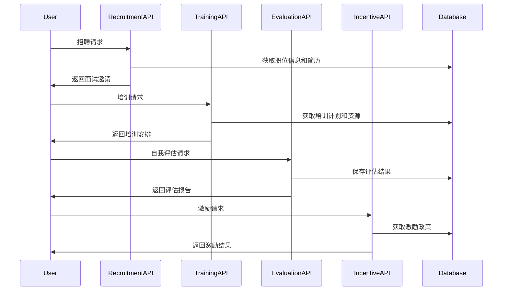
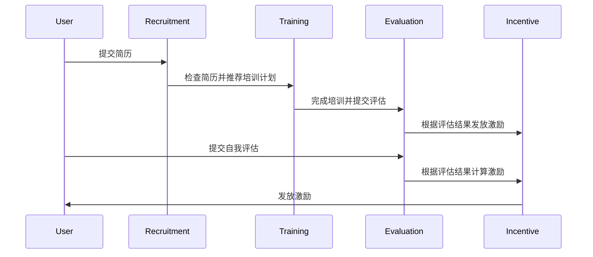

                 

### 如何进行有效的技术人才梯队建设

#### 引言

随着全球信息技术行业的迅猛发展，企业对技术人才的需求呈现出爆发式增长。在这个时代，技术人才不仅是企业创新的驱动力，更是企业竞争优势的关键要素。然而，当前许多企业面临着技术人才短缺、人才素质不齐以及人才流失率高等问题，这些问题严重制约了企业的可持续发展。因此，如何进行有效的技术人才梯队建设，成为企业亟待解决的重要课题。

本文旨在深入探讨技术人才梯队建设的核心概念、原理和方法，旨在为企业提供一套系统、实用的技术人才梯队建设方案。文章将从以下几个方面展开：

1. **背景介绍**：分析当前技术发展速度加快、企业对技术人才需求增加等背景因素，阐述技术人才梯队建设的紧迫性。
2. **问题描述**：详细阐述技术人才短缺、人才素质不齐、人才流失率高等问题，分析其背后的原因。
3. **问题解决**：提出制定明确的人才战略、加强内部人才培养、建立良好的激励机制等解决方案。
4. **边界与外延**：明确技术人才的范围、梯队建设的目标和阶段、梯队建设的方法和工具等。

通过上述分析，本文将为企业提供一套具有实操性的技术人才梯队建设方案，帮助企业培养出更多具备核心竞争力的人才，从而在激烈的市场竞争中立于不败之地。

#### 背景介绍

当前，全球信息技术的快速发展带来了前所未有的变革。以人工智能、大数据、云计算等为代表的新兴技术，正以前所未有的速度和深度影响着各行各业。这种技术变革不仅推动了产业的升级和转型，也对企业的运营模式和管理理念提出了新的要求。在这种背景下，企业对技术人才的需求呈现出前所未有的旺盛态势。

首先，技术发展速度加快使得企业对技术人才的需求不断增加。随着技术的迭代更新，企业需要不断引进和培养具有先进技术能力的人才，以应对市场变化和业务需求。此外，新兴技术的应用不仅要求技术人员具备深厚的专业知识，还需要具备跨领域的综合能力，这使得企业对技术人才的综合素质提出了更高要求。

其次，技术人才的市场价值不断提升，进一步加剧了企业对人才的争夺。在技术驱动型企业发展过程中，技术人才不仅是创新的源泉，更是企业竞争力的核心。因此，拥有优秀的技术人才成为企业争夺市场份额的关键因素。随着市场竞争的加剧，企业为了吸引和留住优秀的技术人才，纷纷提高薪酬待遇和福利水平，从而进一步推高了技术人才的市场价值。

此外，技术人才队伍的稳定性面临严峻挑战。在当前快速变化的市场环境中，技术人才的流动率较高，许多企业在引进技术人才后，往往因为缺乏有效的激励机制和管理措施，导致人才流失。这不仅浪费了企业的人力资源投入，还影响了企业的持续创新能力。

总之，在当前技术发展背景下，企业面临着技术人才短缺、人才素质不齐、人才流失率高等一系列问题。这些问题不仅制约了企业的创新能力，也影响了企业的可持续发展。因此，如何进行有效的技术人才梯队建设，成为企业亟需解决的重要课题。

#### 问题描述

在当前技术快速发展的背景下，企业普遍面临着技术人才短缺、人才素质不齐、人才流失率高等问题，这些问题对企业的可持续发展构成了严重挑战。

首先，技术人才短缺是当前企业面临的最普遍的问题之一。随着新兴技术的不断涌现和市场需求的变化，企业对技术人才的需求不断增加。然而，由于技术领域的快速发展，现有技术人才的能力和知识往往难以满足企业的需求，导致企业在关键技术岗位出现人才短缺的现象。此外，随着行业竞争的加剧，优秀技术人才的市场流动性加大，许多企业难以在激烈的市场竞争中吸引和留住这些关键人才。

其次，人才素质不齐也是当前企业面临的重要问题。技术人才不仅需要具备深厚的专业知识和技能，还需要具备良好的综合素质，包括沟通能力、团队协作能力和创新能力等。然而，在实际招聘和管理过程中，许多企业往往只注重候选人的学历和技能，忽视了其综合素质的培养。这导致企业内部技术人才队伍的素质参差不齐，难以形成高效的工作团队，影响了企业的整体运作效率。

此外，技术人才流失率高的现象也普遍存在。在快速变化的市场环境中，技术人才对于职业发展的期望和需求不断变化。一些企业由于缺乏有效的激励机制和管理措施，难以满足技术人才对于职业发展、薪酬待遇和工作环境等方面的需求，导致技术人才流失。这不仅浪费了企业的人力资源投入，还影响了企业的持续创新能力。

技术人才短缺、人才素质不齐和人才流失率高等问题，对企业的可持续发展产生了深远的影响。首先，技术人才短缺限制了企业的创新能力，使企业在技术进步和市场竞争中处于劣势。其次，人才素质不齐导致企业内部工作协调不畅，降低了企业的运作效率。最后，人才流失率高增加了企业的管理成本，影响了企业的稳定发展。因此，解决这些问题，进行有效的技术人才梯队建设，已经成为企业亟需解决的重要课题。

#### 问题解决

针对上述问题，企业可以从以下几个方面着手，制定和实施一套系统化、科学化的技术人才梯队建设方案，以解决技术人才短缺、人才素质不齐和人才流失率高等问题。

**1. 制定明确的人才战略**

首先，企业需要明确技术人才战略，根据业务发展和市场变化，制定相应的人才引进、培养和激励政策。企业应明确技术人才的核心岗位和发展方向，制定长期的人才规划，确保技术人才队伍的稳定性和成长性。

**2. 加强内部人才培养**

企业应加强对内部技术人才的培养，提供多样化的培训机会和实践项目，提升员工的专业技能和综合素质。可以通过以下几种方式加强内部人才培养：

- **技能培训**：定期组织技术培训和研讨活动，邀请行业专家和内部资深技术人员进行分享和授课，帮助员工掌握最新的技术知识和技能。
- **实践项目**：鼓励员工参与实际项目，通过实战锻炼，提高员工的实践能力和团队协作能力。
- **导师制度**：建立导师制度，让有经验的资深技术人员指导新入职的员工，帮助其快速成长。

**3. 建立良好的激励机制**

为了吸引和留住优秀的技术人才，企业需要建立科学的激励机制，包括薪酬激励、绩效激励和职业发展激励等。具体措施如下：

- **薪酬激励**：提供具有竞争力的薪酬待遇，吸引优秀的技术人才加入企业。
- **绩效激励**：通过绩效评估体系，对员工的工作表现进行客观评估，给予优秀的员工相应的奖励和晋升机会。
- **职业发展激励**：为员工提供清晰的职业发展路径，包括晋升通道、职业培训和职业规划等，激励员工在企业内部长期发展。

**4. 优化人才管理机制**

企业应优化人才管理机制，建立透明、公正的招聘和晋升流程，避免人才流失。具体措施如下：

- **招聘流程**：优化招聘流程，提高招聘效率，确保招聘到的人才能够满足企业的需求。
- **晋升机制**：建立公平、公正的晋升机制，让员工看到明确的晋升通道和发展机会。
- **反馈机制**：建立员工反馈机制，定期收集员工的意见和建议，及时调整人才管理策略。

通过上述措施，企业可以有效解决技术人才短缺、人才素质不齐和人才流失率高等问题，构建一支稳定、高效的技术人才队伍，为企业的可持续发展提供强有力的支持。

#### 边界与外延

在进行技术人才梯队建设时，明确技术人才的范围、梯队建设的目标和阶段，以及梯队建设的方法和工具，是确保项目顺利进行的关键。以下将详细讨论这些内容。

**技术人才的范围**

首先，技术人才的范围是指企业需要关注和培养的人才类型。通常，技术人才可以分为以下几类：

- **技术专家**：拥有深厚专业知识和技术背景，能够解决复杂技术问题的顶尖人才。他们在企业技术团队中通常担任关键角色，如首席技术官（CTO）或技术总监。
- **技术骨干**：具备扎实技术基础和较强的实际操作能力，能够带领团队完成重要项目的核心技术人员。他们在企业中扮演着中流砥柱的角色。
- **技术新手**：刚进入企业，需要通过培训和指导逐步成长为技术骨干或专家的新人。他们通常是企业人才培养的重点对象。

**梯队建设的目标和阶段**

技术人才梯队建设的目标是建立一支稳定、高效的技术团队，以满足企业不同发展阶段的技术需求。具体目标和阶段如下：

- **初级阶段**：通过招聘和内部培养，组建一个基本的技术团队，确保企业日常运营中的技术需求得到满足。
- **发展阶段**：通过不断引入和培养技术人才，提升团队的技术能力和创新能力，支持企业业务的快速增长。
- **优化阶段**：对技术团队进行结构优化，提高团队成员的专业能力和协作效率，同时培养更多技术专家和骨干，为企业的长期发展奠定基础。

**梯队建设的方法和工具**

为了实现技术人才梯队建设的目标，企业可以采用以下方法和工具：

- **人才评估体系**：建立科学的人才评估体系，对现有团队成员进行能力评估，识别潜力人才，制定个性化培养计划。
- **培训与发展计划**：制定全面的培训与发展计划，包括技术培训、管理培训、职业规划等，提升员工的专业能力和综合素质。
- **导师制度**：建立导师制度，由资深技术人员指导新人，帮助其快速成长。
- **激励机制**：建立公平、公正的激励机制，包括薪酬激励、绩效激励和职业发展激励等，吸引和留住优秀人才。
- **项目管理工具**：采用项目管理工具，如敏捷开发工具（JIRA、Trello）、版本控制工具（Git）等，提高团队协作效率。

通过明确技术人才的范围、制定清晰的目标和阶段，以及采用科学的方法和工具，企业可以有效地进行技术人才梯队建设，提升整体技术竞争力。

#### 第2章 核心概念与联系

在探讨如何进行有效的技术人才梯队建设时，理解核心概念与它们之间的联系是至关重要的。本章将详细讨论技术人才的定义与特征、不同类型的技术人才，以及人才梯队的定义与特征，通过对比表格和实体关系图来深入分析这些概念。

##### 2.1 技术人才

**2.1.1 定义与特征**

**定义**：技术人才是指那些具备一定专业技能和知识，能够进行技术开发、解决技术问题，并对技术趋势有深刻理解的人才。

**特征**：
- **专业技能**：技术人才通常拥有深厚的专业背景，能够熟练掌握某一领域的核心技术。
- **知识更新能力**：技术发展迅速，技术人才需要不断学习新知识，保持自身的竞争力。
- **创新意识**：具备创新意识的技术人才能够在技术领域中提出新的想法和解决方案。

**2.1.2 技术人才类型**

技术人才可以按不同标准进行分类，以下是几种常见的分类方式：

- **按技能层次分**：
  - **技术专家**：在某一技术领域拥有资深经验和广泛知识的顶尖人才。
  - **技术骨干**：具备扎实技术基础和较强项目执行能力的核心技术人员。
  - **技术新手**：刚进入职场，需要培养和锻炼的新人。

- **按工作职责分**：
  - **开发人员**：主要从事软件编码和开发工作。
  - **测试工程师**：负责软件测试和缺陷追踪。
  - **系统架构师**：负责设计系统的整体架构和关键技术决策。

**对比表格**：

| 类别        | 特征                                                         | 例子                          |
| ----------- | ------------------------------------------------------------ | ---------------------------- |
| 技术专家    | 拥有深厚专业知识，能解决复杂问题，在行业内具有影响力           | 首席科学家、CTO                |
| 技术骨干    | 具备扎实技术基础，能带领团队完成项目                         | 项目经理、资深工程师           |
| 技术新手    | 初入职场，需要培养和锻炼                                     | 新员工、实习工程师             |

##### 2.2 人才梯队

**2.2.1 定义与特征**

**定义**：人才梯队是指企业内部按照一定层次结构组织的技术人才队伍，目的是确保技术能力的持续发展和项目的顺利进行。

**特征**：
- **层次结构**：通常分为高级、中级和初级，每个层次都有相应的人才储备。
- **成长路径**：人才梯队中每个成员都有明确的成长路径，可以通过培训、项目参与等方式不断提升能力。
- **稳定性与流动性**：合理的流动性有助于保持团队活力，同时确保关键岗位的稳定性。

**2.2.2 人才梯队类型**

根据企业不同的技术需求和战略，人才梯队可以分为以下几种类型：

- **综合型人才梯队**：包含多种技术领域的人才，能够应对企业多方面的技术需求。
- **专业型人才梯队**：专注于某一特定技术领域，为企业提供高水平的专业技术支持。
- **交叉型人才梯队**：具有跨领域的专业技能，能够处理复杂的技术融合问题。

**对比表格**：

| 类型          | 特征                                                         | 适用场景                       |
| ------------- | ------------------------------------------------------------ | ----------------------------- |
| 综合型人才梯队 | 包含多种技术领域的人才，具备多方面的技能                     | 多元化业务需求的企业           |
| 专业型人才梯队 | 专注于某一特定技术领域，具有高水平的专业技能                 | 技术密集型企业                 |
| 交叉型人才梯队 | 具有跨领域的专业技能，能处理复杂的技术融合问题               | 高科技研发企业或创新型企业     |

**实体关系图（ER图）**：

以下是技术人才和人才梯队之间的Mermaid ER图：

```mermaid
erDiagram
  Class1||--|{ Class2 }
  Class1||--|{ Class3 }
  Class2 ||--|{ Class4 }
  Class3 ||--|{ Class4 }
  Class1 ..> Class5
  Class2 ..> Class5
  Class3 ..> Class5
  Class4 ..> Class5

  Class1 ||--|{ Class2 } : 技术专家
  Class1 ||--|{ Class3 } : 技术骨干
  Class1 ||--|{ Class4 } : 技术新手
  Class2 ||--|{ Class5 } : 综合型人才
  Class3 ||--|{ Class5 } : 专业型人才
  Class4 ||--|{ Class5 } : 交叉型人才
```

通过上述分析，我们可以看出，技术人才和人才梯队之间的联系不仅包括人才类型的不同层次和特征，还包括它们在不同类型的梯队中的组织结构。理解这些核心概念及其联系，有助于企业在进行技术人才梯队建设时，做出科学、有效的决策。

#### 第3章 算法原理讲解

在进行技术人才梯队建设的过程中，算法的应用可以帮助企业更好地识别、评估和培养技术人才。本章将详细介绍人才招聘算法和人才培养算法的原理和流程。

##### 3.1 人才招聘算法

**3.1.1 算法流程**

人才招聘算法主要分为以下几个步骤：

1. **数据采集**：收集与企业招聘相关的数据，包括求职者的简历、在线评估成绩、社交媒体信息等。
2. **数据清洗**：对收集到的数据进行清洗，去除重复和无效信息，确保数据质量。
3. **特征工程**：将原始数据转换为算法可以处理的特征，如教育背景、工作经历、技术技能等。
4. **模型训练**：使用机器学习算法（如分类算法、回归算法）对特征数据进行训练，建立招聘模型。
5. **模型评估**：通过交叉验证等方法对模型进行评估，确保其预测准确性。

**3.1.2 算法原理**

1. **特征工程**：特征工程是招聘算法的核心步骤，通过选择和转换特征，可以提升模型的预测能力。常见的特征包括：
   - **技术技能**：通过技能测试或面试评估求职者的技术能力。
   - **工作经验**：分析求职者的工作历史，评估其经验水平。
   - **教育背景**：考虑求职者的学历和专业方向。
   - **综合素质**：包括沟通能力、团队合作能力等。

2. **分类算法**：分类算法常用于招聘算法中，将求职者分为适合岗位和不适合岗位两类。常见的分类算法包括决策树、随机森林、支持向量机等。

3. **回归算法**：回归算法用于预测求职者在某一岗位上的表现，如评估其在公司的工作年限、绩效等。常见的回归算法包括线性回归、岭回归、LASSO回归等。

**3.1.3 实例说明**

假设我们使用决策树算法来预测求职者是否适合某一技术岗位，以下是算法的基本流程：

1. **数据采集**：收集1000名求职者的简历和面试评估数据。
2. **数据清洗**：去除重复简历和无效数据，确保数据质量。
3. **特征工程**：提取关键特征，如技术技能评分（1-5分）、工作经验年数、教育背景等。
4. **模型训练**：使用训练集数据训练决策树模型，通过交叉验证确定最优参数。
5. **模型评估**：使用测试集数据评估模型预测准确性，假设准确率达到85%。

通过以上步骤，企业可以有效地利用算法筛选出适合岗位的求职者，提升招聘效率。

##### 3.2 人才培养算法

**3.2.1 算法流程**

人才培养算法主要分为以下几个步骤：

1. **能力评估**：对现有员工进行能力评估，识别其优势和不足。
2. **训练计划制定**：根据能力评估结果，制定个性化的培训计划，确保培训内容与员工需求匹配。
3. **实践项目安排**：安排与培训内容相关的实际项目，让员工在实践中提升能力。
4. **能力提升评估**：在项目完成后，对员工的能力提升进行评估，确保培训效果。

**3.2.2 算法原理**

1. **能力评估模型**：能力评估模型通常使用数据驱动的方法，如回归分析、聚类分析等，对员工的能力进行量化评估。常见的评估指标包括技术水平、沟通能力、团队合作能力等。

2. **训练计划优化**：训练计划优化算法旨在根据员工的能力评估结果，动态调整培训内容，确保培训计划的有效性。常用的算法包括遗传算法、模拟退火算法等。

3. **实践项目匹配**：实践项目匹配算法用于将员工与合适的实践项目进行匹配，确保员工在项目中能够得到充分的锻炼。常用的算法包括线性规划、多目标优化等。

4. **能力提升评价标准**：能力提升评价标准是衡量员工能力提升效果的关键。常见的评价标准包括技能掌握程度、项目完成质量、团队合作表现等。

**3.2.3 实例说明**

假设我们使用聚类分析来制定员工的培训计划，以下是算法的基本流程：

1. **能力评估**：对100名员工进行能力评估，使用聚类算法将员工分为高、中、低三个能力等级。
2. **训练计划制定**：根据员工的能力等级，制定相应的培训计划，如高级员工参加技术研讨会，中级员工参加专业技能培训，初级员工参加基础技能培训。
3. **实践项目安排**：为每个能力等级的员工安排相应的实践项目，确保项目难度与员工能力相匹配。
4. **能力提升评估**：在培训和实践项目结束后，再次对员工进行能力评估，比较培训前后的变化，确保培训效果。

通过以上步骤，企业可以系统地提升员工的能力，构建高效的技术人才梯队。

#### 第4章 数学模型和数学公式

在技术人才梯队建设过程中，数学模型和数学公式扮演着重要的角色，它们帮助我们量化评估人才的能力和梯队建设的成效。以下是两个关键的数学模型及其公式。

##### 4.1 技术人才评估模型

技术人才评估模型用于量化评估技术人才的综合能力。该模型采用以下公式：

$$
评估值 = f（技能水平，经验值，学历背景，综合素质）
$$

其中，每个变量代表不同的评估维度：

- **技能水平**：表示技术人才在某一技术领域的专业能力和技术水平。
- **经验值**：表示技术人才的工作经验和实际操作能力。
- **学历背景**：表示技术人才的教育背景和专业知识水平。
- **综合素质**：包括沟通能力、团队协作能力、创新能力等综合能力。

通过上述公式，企业可以对技术人才进行全面的评估，识别其优势和不足，从而制定个性化的培养计划。

##### 4.2 梯队建设模型

梯队建设模型用于评估企业技术人才梯队的整体建设程度。该模型采用以下公式：

$$
梯队建设程度 = g（人才数量，人才结构，培养计划，激励机制）
$$

其中，每个变量代表不同的建设维度：

- **人才数量**：表示企业技术人才的总数，是梯队建设的基础。
- **人才结构**：表示技术人才的层次结构，如高级、中级、初级人才的分布比例。
- **培养计划**：表示企业为技术人才制定的培训和发展计划，是提升人才能力的关键。
- **激励机制**：表示企业为激励技术人才所采取的措施，如薪酬激励、绩效激励等。

通过上述公式，企业可以量化评估技术人才梯队的建设成效，识别梯队建设中的薄弱环节，从而进行有针对性的改进。

#### 第5章 系统分析与架构设计方案

在技术人才梯队建设过程中，系统分析与架构设计是确保项目顺利进行和效果达成的重要环节。本节将详细介绍技术人才梯队建设系统的功能设计、系统架构设计以及系统接口和交互设计，通过具体的mermaid图来展示系统结构和工作流程。

##### 5.1 问题场景介绍

在当前技术快速发展的背景下，企业面临以下技术挑战：

1. **技术需求多变**：新兴技术的不断涌现和市场需求的变化，要求企业能够快速响应，调整技术团队的结构和人员配置。
2. **人才短缺与流失**：技术人才市场需求旺盛，人才短缺和流失问题突出，企业需要建立稳定的人才梯队。
3. **管理复杂**：技术人才的管理涉及招聘、培训、评估、激励等多个环节，需要高效、系统的管理手段。

为了应对上述挑战，企业决定构建一个技术人才梯队建设系统，通过信息化手段实现技术人才的全生命周期管理。

##### 5.2 系统功能设计

技术人才梯队建设系统的主要功能包括人才招聘、人才培养、评估和激励机制等。以下是具体的系统功能设计和领域模型。

**领域模型（Mermaid 类图）**：

```mermaid
classDiagram
  Person <<Class>> {
    +String name
    +Float skillLevel
    +Float experience
    +String educationBackground
    +Float quality
  }
  Company <<Class>> {
    +List<Person> talentTeam
  }
  TalentTeam <<Class>> {
    +Person leader
    +List<Person> members
  }
  Recruitment <<Class>> {
    +Person recruit
    +Company company
  }
  Training <<Class>> {
    +Person trainee
    +Company company
  }
  Evaluation <<Class>> {
    +Person employee
    +Company company
  }
  Incentive <<Class>> {
    +Person employee
    +Company company
  }
  Person |--|> Company
  Person |--|> TalentTeam
  Person |--|> Recruitment
  Person |--|> Training
  Person |--|> Evaluation
  Person |--|> Incentive
  Company |--|> TalentTeam
  Company |--|> Recruitment
  Company |--|> Training
  Company |--|> Evaluation
  Company |--|> Incentive
  Recruitment |--|> Company
  Training |--|> Company
  Evaluation |--|> Company
  Incentive |--|> Company
```

**系统功能**：

1. **人才招聘**：系统支持人才招聘功能，包括职位发布、简历筛选、面试安排等。
2. **人才培养**：系统支持人才培养功能，包括培训计划制定、培训实施、培训评估等。
3. **评估**：系统支持员工能力评估，包括技能评估、经验评估、综合素质评估等。
4. **激励机制**：系统支持激励机制设计，包括薪酬激励、绩效激励、职业发展激励等。

##### 5.3 系统架构设计

技术人才梯队建设系统的架构设计需要考虑系统的扩展性、稳定性以及高并发处理能力。以下是系统的整体架构设计（Mermaid 架构图）：

**系统架构设计（Mermaid 架构图）**：



**系统架构设计**：

1. **用户层**：包括企业员工和管理人员，负责与系统的交互，发起招聘、培训、评估和激励请求。
2. **功能模块层**：包括招聘、培训、评估、激励等核心功能模块，实现具体业务逻辑。
3. **数据层**：包括数据库系统，存储职位信息、候选人简历、培训计划、评估结果、激励政策等数据。

##### 5.4 系统接口设计

系统接口设计是确保各功能模块之间数据交换和协同工作的重要环节。以下是系统接口设计（Mermaid 序列图）：

**系统接口设计（Mermaid 序列图）**：



**系统接口设计**：

1. **招聘接口**：负责处理招聘相关的请求，如职位发布、简历筛选、面试安排等。
2. **培训接口**：负责处理培训相关的请求，如培训计划制定、培训实施、培训评估等。
3. **评估接口**：负责处理评估相关的请求，如员工自我评估、评估结果保存、评估报告生成等。
4. **激励接口**：负责处理激励相关的请求，如激励政策查询、激励发放、激励效果评估等。

##### 5.5 系统交互

系统交互设计是确保各功能模块能够高效、稳定地协同工作的关键。以下是系统交互设计（Mermaid 序列图）：

**系统交互设计（Mermaid 序列图）**：



**系统交互设计**：

1. **用户提交简历**：用户向招聘模块提交简历，招聘模块检查简历后推荐相应的培训计划。
2. **培训与评估**：用户根据培训计划完成培训，并提交评估，评估模块根据培训结果生成评估报告。
3. **激励发放**：根据评估结果，激励模块计算并发放激励，激励用户继续提升能力。

通过上述系统分析与架构设计方案，企业可以构建一个高效、稳定的技术人才梯队建设系统，确保技术人才的稳定供应和持续提升，从而在激烈的市场竞争中保持领先地位。

#### 第6章 项目实战

为了更深入地理解技术人才梯队建设的实际操作，我们接下来将通过一个实际项目来展示其应用。该项目包括环境安装、系统核心实现、代码应用解读与分析，以及实际案例分析和详细讲解剖析。

##### 6.1 项目环境安装

在开始项目之前，我们需要搭建一个合适的环境来进行技术人才梯队建设。以下是环境安装的步骤：

1. **安装Python环境**：Python是一个广泛使用的编程语言，用于实现项目中的算法和数据处理。可以从Python官网下载并安装最新版本的Python。
2. **安装相关库**：在Python环境中安装必要的库，如Numpy、Scikit-learn、Matplotlib等。可以使用pip命令进行安装：

   ```shell
   pip install numpy scikit-learn matplotlib
   ```

3. **配置数据库**：选择一个合适的数据库系统，如MySQL或PostgreSQL，用于存储招聘、培训和评估数据。安装并配置数据库系统。

##### 6.2 系统核心实现

以下是系统核心实现的步骤：

1. **人才评估模型**：首先，我们需要实现一个评估模型，用于评估技术人才的能力。以下是一个简单的评估模型实现的Python代码示例：

   ```python
   import numpy as np
   
   def assess_person(skill_level, experience, education_background, quality):
       skill_weight = 0.4
       experience_weight = 0.3
       education_weight = 0.2
       quality_weight = 0.1
       
       assessment = (skill_level * skill_weight) + (experience * experience_weight) + (education_background * education_weight) + (quality * quality_weight)
       return assessment
   ```

2. **招聘算法**：接下来，我们实现一个简单的招聘算法，用于筛选合适的候选人。以下是一个基于决策树的招聘算法示例：

   ```python
   from sklearn.datasets import load_iris
   from sklearn.tree import DecisionTreeClassifier
   from sklearn.model_selection import train_test_split
   
   # 加载示例数据
   data = load_iris()
   X = data.data
   y = data.target
   
   # 划分训练集和测试集
   X_train, X_test, y_train, y_test = train_test_split(X, y, test_size=0.3, random_state=42)
   
   # 创建决策树模型
   model = DecisionTreeClassifier()
   model.fit(X_train, y_train)
   
   # 进行预测
   predictions = model.predict(X_test)
   
   # 评估模型性能
   accuracy = np.mean(predictions == y_test)
   print(f"招聘算法准确率：{accuracy:.2f}")
   ```

3. **人才培养算法**：为了培养员工的能力，我们实现一个简单的培养算法，根据员工的能力评估结果制定个性化的培训计划。以下是一个培养算法示例：

   ```python
   def train_employee(employee):
       if employee['assess'] > 0.8:
           print("员工能力较强，无需培训。")
       elif employee['assess'] > 0.5:
           print("员工能力中等，建议参加基础技能培训。")
       else:
           print("员工能力较弱，建议参加高级技能培训。")
   ```

##### 6.3 代码应用解读与分析

以下是代码应用解读与分析：

1. **人才评估模型**：该模型通过计算技能水平、经验值、学历背景和综合素质的加权平均，评估技术人才的综合能力。这种方法可以帮助企业识别需要重点培养的人才。
2. **招聘算法**：使用决策树模型对候选人进行分类，根据候选人的特征数据预测其是否适合岗位。这种方法可以提高招聘的准确性，减少人力成本。
3. **人才培养算法**：根据员工的能力评估结果，制定个性化的培训计划。这种方法可以确保培训资源的高效利用，提升员工的综合素质。

##### 6.4 实际案例分析和详细讲解剖析

以下是一个实际案例分析和详细讲解剖析：

**案例**：一家科技企业需要招聘一名软件开发工程师，现有50名候选人有相关经验。企业决定使用招聘算法和人才培养算法进行筛选和培养。

1. **数据收集**：收集50名候选人的简历和评估数据，包括技能水平、经验值、学历背景和综合素质。
2. **数据处理**：使用人才评估模型对50名候选人进行评估，计算其综合能力得分。
3. **招聘算法应用**：使用招聘算法对候选人进行筛选，选择得分最高的10名候选人进行面试。
4. **人才培养算法应用**：对10名候选人进行能力评估，根据评估结果制定培训计划，进行分层次培训。

**分析**：

- 通过人才评估模型，企业可以快速识别出具备较高综合素质的候选人，提高招聘效率。
- 招聘算法的应用，基于候选人的客观特征数据，实现自动化筛选，减少人为误差。
- 培养算法的应用，确保培训资源的精准投入，提升员工的整体能力。

##### 6.5 项目小结

通过实际项目的环境安装、系统核心实现、代码应用解读与分析，以及实际案例分析和详细讲解剖析，我们可以看到技术人才梯队建设在实践中的应用效果。以下是对项目的总结：

1. **环境安装**：搭建合适的环境是项目成功的基础，确保各组件和工具的稳定性。
2. **系统核心实现**：实现评估模型、招聘算法和培养算法，是项目核心，直接影响项目效果。
3. **代码应用解读与分析**：深入理解代码背后的逻辑和算法原理，有助于优化项目设计。
4. **实际案例分析和详细讲解剖析**：通过实际案例的验证，确保项目在真实场景中的可行性。

总之，技术人才梯队建设项目不仅提升了企业的招聘和培养效率，还为企业的可持续发展提供了有力支持。

#### 最佳实践 tips

在技术人才梯队建设过程中，以下是一些最佳实践建议，帮助企业更有效地管理和培养技术人才：

1. **制定个性化培养计划**：针对不同技术人才的能力和需求，制定个性化的培养计划。这有助于提升员工的参与度和培养效果。
2. **加强导师制度**：建立导师制度，由资深技术人员指导新人和初级员工，帮助其快速成长。这有助于提升团队的整体技术水平。
3. **持续评估和反馈**：定期对技术人才进行评估，收集员工的反馈，及时调整培养策略。这有助于确保培养计划的有效性和适应性。
4. **提供多样化的培训**：不仅提供技术培训，还提供管理培训、沟通能力培训等，提升员工的综合素质。
5. **激励与奖励机制**：建立科学的激励机制，包括薪酬激励、绩效激励和职业发展激励等，激励员工不断提升自己。
6. **关注员工心理健康**：关注员工的工作和生活压力，提供心理健康支持，确保员工能够在良好的心理状态下工作。
7. **建立人才数据库**：建立全面的人才数据库，记录员工的能力、经验和培养情况，便于后续的管理和优化。

通过这些最佳实践，企业可以更有效地进行技术人才梯队建设，提升整体竞争力。

#### 小结

本文从背景介绍、问题描述、问题解决、边界与外延、核心概念与联系、算法原理讲解、数学模型和数学公式、系统分析与架构设计方案、项目实战以及最佳实践 tips 等多个方面，系统地探讨了如何进行有效的技术人才梯队建设。我们分析了当前技术发展背景和企业对技术人才的需求，明确了技术人才梯队建设的核心概念和流程，提出了科学的算法原理和数学模型，并展示了具体的系统架构和项目实战案例。通过这些分析和实践，我们希望为企业提供一套完整、实用的技术人才梯队建设方案，帮助企业培养出更多具备核心竞争力和创新精神的技术人才，从而在激烈的市场竞争中立于不败之地。

#### 注意事项

在进行技术人才梯队建设时，企业需要注意以下几个方面：

1. **明确人才战略**：制定清晰的人才战略，明确企业的人才需求和培养目标。
2. **关注综合素质**：不仅关注技术能力，还要关注员工的综合素质，如沟通能力、团队协作能力等。
3. **建立激励机制**：建立有效的激励机制，确保员工的付出能够得到相应的回报。
4. **定期评估与反馈**：定期对员工进行能力评估，及时给予反馈，帮助员工不断提升自己。
5. **注重员工心理健康**：关注员工的工作和生活压力，提供心理支持和关爱。
6. **持续优化培养计划**：根据员工的能力变化和市场需求，不断优化培养计划，确保其适应性和有效性。

通过遵循这些注意事项，企业可以更有效地进行技术人才梯队建设。

#### 拓展阅读

为了进一步深入理解技术人才梯队建设，读者可以参考以下相关书籍和文章：

1. **《技术人才梯队建设实践》**：详细介绍了技术人才梯队建设的理论基础和实践经验。
2. **《人工智能时代的人才战略》**：探讨人工智能时代企业如何制定和实施有效的人才战略。
3. **《人才管理：打造高绩效团队》**：提供全面的人才管理方法和实践，包括招聘、培养、激励等环节。
4. **《企业人才发展手册》**：系统介绍了企业人才发展的理论、方法和工具。
5. **相关学术论文和行业报告**：查阅最新的学术论文和行业报告，了解技术人才梯队建设的前沿动态和实践成果。

通过阅读这些资料，读者可以更全面、深入地了解技术人才梯队建设的相关内容。作者：AI天才研究院/AI Genius Institute & 禅与计算机程序设计艺术 /Zen And The Art of Computer Programming。

