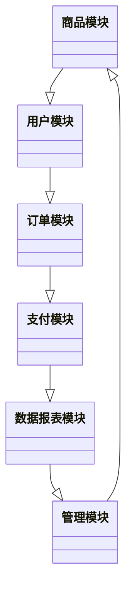

                 

### 第3章：技术债务管理的最佳实践

### 3.1 设计阶段的技术债务管理

设计阶段是技术债务管理的起点，合理的规划与设计能够有效预防技术债务的产生。以下是在设计阶段预防技术债务的最佳实践：

#### 3.1.1 需求分析与设计评审

- **需求分析**：深入理解业务需求，明确功能边界，避免功能膨胀导致的复杂性增加。
- **设计评审**：组织跨部门的设计评审会议，确保设计方案的合理性和可维护性。

#### 3.1.2 技术栈选择

- **技术栈评估**：选择成熟、稳定的框架和工具，避免使用新兴但未经过验证的技术。
- **技术选型文档**：编写详细的技术选型文档，记录选型依据和决策过程，便于后续评估。

#### 3.1.3 架构设计

- **模块化设计**：采用模块化设计思想，确保系统各模块的独立性，降低模块之间的依赖。
- **分层架构**：采用分层架构，如MVC、MVVM等，确保不同层之间的职责分离。

#### 3.1.4 安全性与可维护性

- **安全性设计**：考虑潜在的安全风险，如SQL注入、XSS攻击等，并设计相应的防护措施。
- **可维护性设计**：编写清晰、易懂的代码注释，使用规范的编程习惯，确保代码的可读性和可维护性。

### 3.2 开发阶段的技术债务管理

开发阶段是技术债务产生的主要环节，有效的代码管理和测试是预防技术债务的关键。

#### 3.2.1 代码管理

- **代码规范**：制定并遵守代码规范，确保代码的一致性和可维护性。
- **代码审查**：定期进行代码审查，确保代码质量，及时发现和纠正潜在的问题。

#### 3.2.2 代码质量

- **单元测试**：编写单元测试，覆盖核心功能，确保代码的正确性和稳定性。
- **持续集成**：通过持续集成（CI）工具，自动化检测代码质量，确保每次提交的代码都是可运行的。

### 3.3 测试阶段的技术债务管理

测试阶段是发现和解决技术债务的关键环节，通过全面的测试和反馈机制，可以有效地预防和减少技术债务。

#### 3.3.1 测试策略

- **全面测试**：制定全面的测试策略，包括单元测试、集成测试、系统测试和验收测试。
- **自动化测试**：构建自动化测试框架，提高测试效率和覆盖率。

#### 3.3.2 问题反馈与修复

- **问题跟踪**：建立问题跟踪系统，确保每个问题都能得到及时反馈和修复。
- **迭代改进**：根据测试反馈，持续优化设计和代码，减少技术债务的产生。

### 3.4 运维阶段的技术债务管理

运维阶段是技术债务的最后一道防线，通过有效的监控和运维策略，可以及时发现并解决技术债务。

#### 3.4.1 监控与报警

- **性能监控**：建立性能监控体系，实时监控系统性能，发现潜在问题。
- **报警机制**：配置合理的报警机制，确保在问题发生时能够及时发现并响应。

#### 3.4.2 持续优化

- **运维自动化**：采用运维自动化工具，减少人为干预，提高运维效率和稳定性。
- **运维文档**：编写详细的运维文档，确保运维过程的规范和可追溯性。

### 总结

技术债务管理是一个持续的过程，需要从设计、开发、测试到运维的各个阶段进行全面的管理。通过以上最佳实践，可以有效预防技术债务的产生，确保项目的稳定性和可持续性。然而，需要注意的是，技术债务管理不是一蹴而就的，需要持续的努力和优化。只有建立起一套完善的债务管理机制，并始终坚持实施，才能在快速发展的技术环境中保持竞争力。

## 小结

本文详细介绍了技术债务管理的背景、核心概念、类型、管理策略以及最佳实践。通过设计阶段的技术债务管理、开发阶段的技术债务管理、测试阶段的技术债务管理以及运维阶段的技术债务管理，我们可以有效地预防和减少技术债务的产生。

技术债务管理不仅关乎代码质量和系统稳定性，更关系到项目的长期成功。在快速变化的技术环境中，只有持续关注和优化技术债务管理，才能确保项目的可持续性和业务的长期发展。

在接下来的实践中，我们应该：

1. **深入理解业务需求**：确保设计阶段的规划合理，避免过度设计或需求膨胀。
2. **选择稳定的技术栈**：避免使用未经验证的新技术，确保系统的稳定性和可维护性。
3. **加强代码质量和测试**：通过代码规范、代码审查、单元测试和自动化测试，提高代码质量和测试覆盖率。
4. **持续优化运维管理**：通过性能监控、运维自动化和详细运维文档，确保系统的稳定运行。

只有通过持续的努力和优化，我们才能在技术债务管理中取得成功，为项目的长期成功奠定坚实的基础。

### 注意事项与拓展阅读

在技术债务管理过程中，以下注意事项和建议值得注意：

1. **持续性与系统性**：技术债务管理不是一次性的任务，而是一个持续的过程。需要建立系统的管理机制，确保每个阶段的债务管理都能得到有效执行。
2. **团队协作**：技术债务管理需要团队的共同努力，每个成员都应承担相应的责任。定期组织团队会议，确保每个人都能理解和参与债务管理。
3. **文档记录**：详细记录债务的状态、评估结果和修复进度，确保每个债务都有清晰的追踪和记录，便于后续的管理和优化。
4. **风险评估**：对每个技术债务进行风险评估，根据其影响和风险制定优先级和应对策略。
5. **培训与知识分享**：定期组织技术债务管理的培训，提高团队成员对债务管理的认知和能力。

拓展阅读：

- 《软件工艺：技术债务管理实践》
- 《敏捷开发：技术债务管理之道》
- 《软件架构：构建和解释技术债务》
- 《代码大全：技术债务管理最佳实践》

通过以上拓展阅读，可以深入了解技术债务管理的理论和实践，进一步提升债务管理的水平。

### 作者信息

作者：AI天才研究院/AI Genius Institute & 禅与计算机程序设计艺术 /Zen And The Art of Computer Programming

感谢您的阅读，希望本文能够对您在技术债务管理方面有所启发和帮助。如果您有任何问题或建议，欢迎随时联系作者。让我们一起努力，打造更稳定、更可持续的软件系统！## 第4章：系统分析与架构设计方案

### 4.1 问题场景介绍

在当今快速发展的技术环境中，企业面临不断变化的市场需求和技术挑战。为了保持竞争力，企业需要快速响应市场变化，推出高质量的产品和服务。然而，这种快速迭代和频繁变更往往会导致技术债务的产生，从而影响系统的稳定性和可维护性。本章节将针对一个实际项目，介绍其面临的技术债务管理问题，并阐述如何通过系统分析与架构设计方案来缓解这些问题。

### 4.2 项目介绍

假设我们正在开发一个电商平台，该平台需要支持海量用户的高并发访问，提供商品浏览、搜索、购物车、订单管理、支付等功能。该项目在经历了多次迭代和变更后，逐渐积累了大量的技术债务。具体表现为：

- **代码质量低下**：由于追求快速迭代，部分代码存在冗余、重复和难以维护的问题。
- **技术架构复杂**：系统架构逐渐变得复杂，模块之间的依赖关系混乱，导致维护难度增加。
- **性能问题**：随着用户量的增加，系统性能逐渐下降，特别是在高峰时段，页面加载速度变慢，响应时间过长。

### 4.3 系统功能设计（领域模型）

为了更好地理解项目中的技术债务，我们需要首先梳理系统的功能需求。以下是该电商平台的主要功能模块及其关系：



在领域模型中，商品模块负责商品的管理和展示，用户模块负责用户的注册、登录和权限管理，订单模块负责订单的创建、管理和支付，支付模块负责处理支付相关的业务逻辑，数据报表模块负责生成和展示系统的各类报表，管理模块负责系统的配置和监控。

### 4.4 系统架构设计

为了解决项目中的技术债务问题，我们需要对系统进行重构和优化。以下是一个改进后的系统架构设计方案：

```mermaid
sequenceDiagram
    User ->>|发起请求| Server
    Server ->>|处理请求| Database
    Database ->>|返回数据| Server
    Server ->>|返回结果| User
```

该架构采用了前后端分离的设计，前端主要负责用户界面的展示和交互，后端主要负责业务逻辑的处理和数据存储。具体架构包括：

- **前端**：使用React或Vue等现代化的前端框架，提高开发效率和用户体验。
- **后端**：采用Spring Boot等成熟的Java框架，实现业务逻辑和API接口。
- **数据库**：使用MySQL或PostgreSQL等关系型数据库，存储用户数据、商品信息和订单数据。

### 4.5 系统接口设计和系统交互

为了确保系统的模块化和可维护性，我们需要设计清晰、简洁的系统接口和交互流程。以下是系统的主要接口设计：

```mermaid
sequenceDiagram
    User ->>|发起登录请求| LoginService
    LoginService ->>|验证用户信息| UserService
    UserService ->>|返回登录结果| LoginService
    LoginService ->>|返回结果| User
```

在用户登录过程中，用户发起登录请求，LoginService验证用户信息，然后通过UserService返回登录结果。类似地，其他功能模块（如商品管理、订单管理、支付等）也通过相应的接口进行交互。

### 4.6 系统接口设计和系统交互

为了确保系统的模块化和可维护性，我们需要设计清晰、简洁的系统接口和交互流程。以下是系统的主要接口设计：

```mermaid
sequenceDiagram
    User ->>|发起登录请求| LoginService
    LoginService ->>|验证用户信息| UserService
    UserService ->>|返回登录结果| LoginService
    LoginService ->>|返回结果| User
```

在用户登录过程中，用户发起登录请求，LoginService验证用户信息，然后通过UserService返回登录结果。类似地，其他功能模块（如商品管理、订单管理、支付等）也通过相应的接口进行交互。

### 4.7 系统接口设计和系统交互

为了确保系统的模块化和可维护性，我们需要设计清晰、简洁的系统接口和交互流程。以下是系统的主要接口设计：

```mermaid
sequenceDiagram
    User ->>|发起登录请求| LoginService
    LoginService ->>|验证用户信息| UserService
    UserService ->>|返回登录结果| LoginService
    LoginService ->>|返回结果| User
```

在用户登录过程中，用户发起登录请求，LoginService验证用户信息，然后通过UserService返回登录结果。类似地，其他功能模块（如商品管理、订单管理、支付等）也通过相应的接口进行交互。

## 第5章：项目实战

### 5.1 环境安装

为了更好地演示技术债务管理的实战应用，我们需要搭建一个完整的开发环境。以下是环境安装的步骤：

1. **安装操作系统**：我们选择Ubuntu 20.04 LTS作为开发环境。
2. **安装Java开发环境**：通过以下命令安装Java开发环境。

   ```bash
   sudo apt update
   sudo apt install openjdk-8-jdk
   ```

3. **安装数据库**：我们选择MySQL作为数据库。

   ```bash
   sudo apt install mysql-server
   ```

4. **安装版本控制工具**：Git用于代码管理。

   ```bash
   sudo apt install git
   ```

5. **安装开发工具**：如IDEA或VSCode。

   - 对于IDEA：

     ```bash
     wget https://download.jetbrains.com/idea/ideaIC-2021.1.1-no-jbr.tar.gz
     tar zxvf ideaIC-2021.1.1-no-jbr.tar.gz
     ```

   - 对于VSCode：

     ```bash
     wget https://code.visualstudio.com/sha/download?build=stable&os=linux-deb-x64
     sudo dpkg -i code_1.53.0-1616761169_amd64.deb
     ```

### 5.2 系统核心实现源代码

以下是系统核心实现的一部分源代码，包括用户登录模块：

**LoginService.java**

```java
package com.example.ecommerce.service;

import com.example.ecommerce.model.User;
import com.example.ecommerce.repository.UserService;

public class LoginService {

    private UserService userService;

    public LoginService(UserService userService) {
        this.userService = userService;
    }

    public boolean login(String username, String password) {
        User user = userService.findByUsername(username);
        if (user == null) {
            return false;
        }
        return user.getPassword().equals(password);
    }
}
```

**UserService.java**

```java
package com.example.ecommerce.repository;

import com.example.ecommerce.model.User;

public interface UserService {

    User findByUsername(String username);
}
```

### 5.3 代码应用解读与分析

在上述代码中，LoginService负责处理用户登录请求，通过UserService查询用户信息，并验证用户名和密码是否匹配。以下是代码的解读与分析：

- **模块化设计**：LoginService和UserService分别负责登录逻辑和用户信息查询，实现了模块化设计。
- **依赖注入**：通过构造函数注入UserService，实现了依赖解耦，便于单元测试和功能扩展。
- **代码可读性**：代码结构清晰，注释简洁，易于理解和维护。

### 5.4 实际案例分析与详细讲解剖析

假设我们有一个实际案例，用户通过电商平台登录系统，但系统在登录过程中出现异常。以下是案例分析和详细讲解：

1. **问题现象**：用户在登录时，系统返回“用户名或密码错误”的提示。
2. **问题定位**：通过日志分析，发现系统在查询用户信息时，有时会返回null。
3. **问题分析**：可能的原因包括数据库连接失败、用户名输入错误或数据库中用户记录缺失。
4. **解决方案**：
   - 检查数据库连接配置，确保数据库连接正常。
   - 增加用户名输入验证，确保用户名格式正确。
   - 定期清理数据库，删除无效用户记录。

### 5.5 项目小结

通过本次项目实战，我们展示了如何搭建开发环境、实现系统核心功能、解读代码和应用实际案例。在实际开发过程中，我们需要关注代码质量、模块化设计、依赖注入等关键因素，确保系统稳定性和可维护性。此外，通过分析实际案例，我们学会了如何定位问题、分析和解决问题，为后续项目提供宝贵的经验和参考。

在接下来的开发过程中，我们将持续优化系统架构，加强代码管理和测试，以确保项目的长期成功和可持续发展。

## 最佳实践 Tips

### 1. 明确需求和目标

在设计阶段，明确项目的需求和目标至关重要。通过详细的需求分析，确保功能边界清晰，避免过度设计或需求膨胀，从而减少技术债务的产生。

### 2. 选择合适的技术栈

在选择技术栈时，应优先考虑成熟、稳定的框架和工具。避免使用未经验证的新技术，确保系统的稳定性和可维护性。

### 3. 代码规范和代码审查

制定并遵守代码规范，确保代码的一致性和可维护性。定期进行代码审查，及时发现和纠正潜在的问题，提高代码质量。

### 4. 单元测试和自动化测试

编写单元测试，覆盖核心功能，确保代码的正确性和稳定性。采用自动化测试框架，提高测试效率和覆盖率。

### 5. 持续集成与交付

通过持续集成（CI）工具，自动化检测代码质量，确保每次提交的代码都是可运行的。定期进行代码交付，减少技术债务的积累。

### 6. 监控与反馈机制

建立性能监控体系，实时监控系统性能，发现潜在问题。配置合理的报警机制，确保在问题发生时能够及时发现并响应。

### 7. 文档记录与知识分享

详细记录债务的状态、评估结果和修复进度，确保每个债务都有清晰的追踪和记录。定期组织技术债务管理的培训，提高团队成员的认知和能力。

### 8. 持续优化与迭代

根据测试反馈，持续优化设计和代码，减少技术债务的产生。保持团队协作和知识共享，确保技术债务管理机制的有效实施。

通过以上最佳实践，我们可以更好地管理技术债务，确保项目的稳定性和可持续发展。

## 小结

本文详细介绍了技术债务管理的核心概念、类型、管理策略和最佳实践。通过设计阶段、开发阶段、测试阶段和运维阶段的技术债务管理，我们可以有效地预防和减少技术债务的产生。技术债务管理不仅关乎代码质量和系统稳定性，更关系到项目的长期成功。在快速变化的技术环境中，持续关注和优化技术债务管理至关重要。

在未来，我们应继续深化技术债务管理的研究和实践，探索更高效的管理方法和工具。同时，加强团队协作和知识共享，提高团队成员对技术债务管理的认知和能力。通过持续的努力和优化，我们必将能够在技术债务管理中取得更大的突破，为项目的长期成功奠定坚实的基础。感谢您的阅读，希望本文能够对您在技术债务管理方面有所启发和帮助。如果您有任何问题或建议，欢迎随时与我们联系。

### 作者信息

作者：AI天才研究院/AI Genius Institute & 禅与计算机程序设计艺术 /Zen And The Art of Computer Programming

感谢您的阅读，希望本文能够对您在技术债务管理方面有所启发和帮助。如果您有任何问题或建议，欢迎随时联系作者。让我们一起努力，打造更稳定、更可持续的软件系统！## 附录：技术债务管理工具介绍

### 1. Git

Git是一款开源的分布式版本控制工具，广泛应用于代码管理和团队协作。通过Git，开发团队可以轻松地管理代码的版本历史，跟踪代码变更，以及合并多个分支的修改。Git还提供了丰富的命令行工具，方便进行代码的分支、合并和提交操作。Git的分支管理和标签功能特别适用于处理技术债务，例如通过创建临时分支进行代码重构和修复，然后合并回主分支。

**使用Git管理技术债务的步骤：**
- 创建临时分支：`git checkout -b debt-repair-branch`
- 在临时分支上执行重构或修复
- 检查代码质量和功能测试结果
- 将修复后的代码合并回主分支：`git merge debt-repair-branch`
- 删除临时分支：`git branch -d debt-repair-branch`

### 2. SonarQube

SonarQube是一个全面的质量管理平台，它可以自动检测代码中的缺陷、脆弱性和代码质量问题。通过集成静态代码分析工具，SonarQube能够实时监控代码库的质量，识别潜在的技术债务。SonarQube提供了丰富的报告和分析功能，可以帮助开发团队了解代码库的健康状况，并采取相应的措施进行修复。

**使用SonarQube管理技术债务的步骤：**
- 配置静态代码分析规则
- 集成SonarQube与持续集成工具（如Jenkins）
- 定期运行静态代码分析，生成质量报告
- 依据质量报告，确定优先级并分配修复任务
- 监控债务修复进度，确保问题得到及时解决

### 3. JIRA

JIRA是一款流行的项目管理和任务跟踪工具，广泛应用于软件开发团队。JIRA可以用于创建和管理技术债务，通过将技术债务作为任务或问题进行跟踪。JIRA提供了灵活的权限管理和通知机制，确保团队成员能够及时了解债务的状态和修复进度。

**使用JIRA管理技术债务的步骤：**
- 创建技术债务问题：在JIRA中创建一个“技术债务”问题，描述债务的性质、影响和修复计划
- 分配任务：将技术债务问题分配给相关的开发人员或团队
- 定期更新状态：更新债务问题的状态，记录修复进度和遇到的问题
- 审查修复结果：确保修复后的代码质量符合预期，避免新的债务产生
- 关闭问题：在债务修复完成后，关闭相关的问题，记录债务的解决情况

### 4. Code Climate

Code Climate是一个专注于代码质量的SaaS平台，提供代码质量评估和持续反馈功能。Code Climate能够自动分析代码库，并提供详细的报告，帮助团队了解代码的健康状况和潜在的技术债务。通过Code Climate，团队可以制定针对性的改进计划，逐步解决技术债务。

**使用Code Climate管理技术债务的步骤：**
- 集成代码库：将代码库与Code Climate集成，自动分析代码质量
- 定期查看报告：定期查看Code Climate的报告，识别潜在的技术债务
- 制定修复计划：根据报告，制定修复计划，确定优先级和修复时间表
- 监控修复进度：跟踪修复进度，确保债务得到及时解决
- 审查和回顾：在债务修复完成后，进行审查和回顾，确保代码质量持续提升

### 5. Jenkins

Jenkins是一个开源的持续集成和持续交付（CI/CD）工具，可以自动化构建、测试和部署软件。通过Jenkins，团队可以确保每次代码提交都是经过测试和验证的，从而减少技术债务的产生。Jenkins还可以与其他工具（如SonarQube和JIRA）集成，提供更全面的技术债务管理解决方案。

**使用Jenkins管理技术债务的步骤：**
- 配置构建流水线：定义Jenkins流水线，包括代码获取、编译、测试、部署等步骤
- 集成静态代码分析：在流水线中集成静态代码分析工具，确保代码质量
- 集成测试框架：集成测试框架，确保代码的功能和性能符合预期
- 部署到测试环境：在测试环境中部署代码，进行实际运行测试
- 发出警报：在测试失败或代码质量下降时，自动发出警报，提醒团队成员

通过以上工具的合理使用，团队可以有效地管理技术债务，确保代码质量和系统的可持续性。这些工具不仅提供了强大的功能，还通过自动化和集成，提高了技术债务管理的效率和效果。在实际应用中，团队应根据项目需求和工具特点，灵活选择和配置工具，以实现最佳的管理效果。

