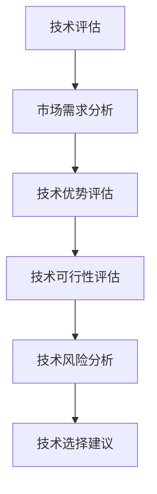
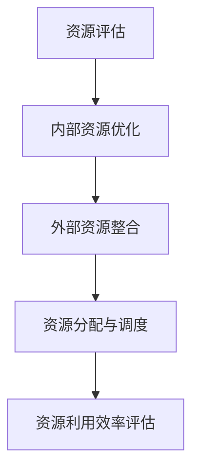
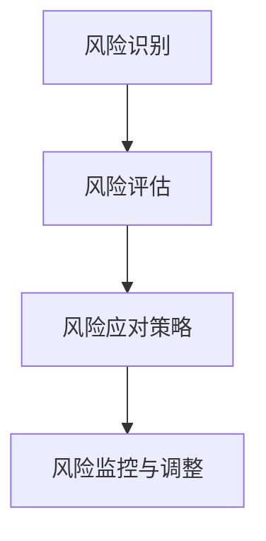
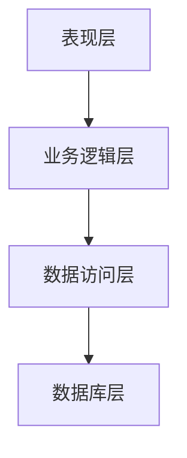
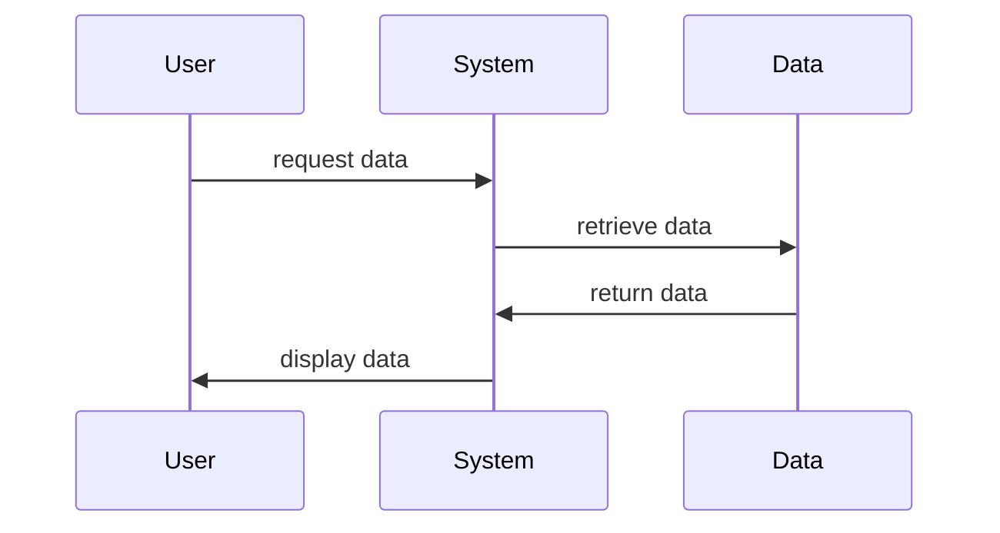
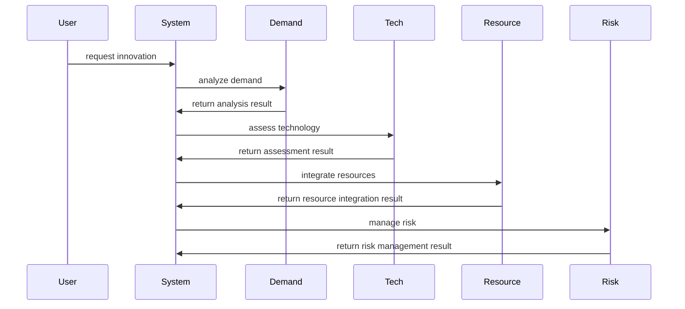

                 

# 如何进行有效的技术创新孵化

## 关键词
技术创新、孵化、流程管理、资源整合、风险管理

## 摘要
本文将探讨如何进行有效的技术创新孵化。通过分析技术创新孵化的背景、问题描述、问题解决、边界与外延以及核心要素组成，本文提出了一套系统的技术创新孵化方法论。本文还将详细讲解核心概念与联系，以及算法原理，旨在帮助读者更好地理解技术创新孵化的关键步骤和策略。

## 1. 背景介绍

### 1.1 问题背景
随着科技的飞速发展，技术创新已经成为推动社会进步和经济增长的重要力量。在人工智能、大数据、物联网等新兴领域的推动下，技术创新的速度不断加快，市场竞争也日益激烈。然而，如何在激烈的市场竞争中实现有效的技术创新孵化，成为企业和创业者面临的重要挑战。

### 1.2 问题描述
有效的技术创新孵化涉及到从创意的产生、研发、商业化到市场推广的全过程。企业需要明确技术创新的目标、选择合适的技术路径、整合内外部资源，以及应对市场风险和竞争压力。在这个过程中，企业不仅要面对技术层面的挑战，还需要解决管理、商业战略等多方面的问题。

### 1.3 问题解决
本书旨在为读者提供一套系统的技术创新孵化方法论，帮助企业和创业者更好地理解技术创新孵化的核心要素，掌握关键步骤和策略，提高技术创新的成功率。

### 1.4 边界与外延
技术创新孵化不仅仅局限于技术领域，它还涉及到商业、管理、营销等多个方面。因此，本书不仅关注技术创新本身，还将探讨如何将这些技术与商业战略相结合。

### 1.5 概念结构与核心要素组成
技术创新孵化可以看作是一个动态的、迭代的过程，其核心要素包括创新思维、技术选择、资源整合、市场分析、商业模式设计、风险管理等。这些要素相互关联、相互影响，共同构成了一个复杂的技术创新孵化体系。

## 2. 核心概念与联系

### 2.1 创新思维
创新思维是指通过独特的视角和创造性思维来解决技术问题、发掘市场机会的能力。创新思维包括发散性思维、收敛性思维、系统性思维等。发散性思维可以帮助企业发现潜在的创新机会，收敛性思维则有助于从多个选项中筛选出最佳方案，系统性思维则能确保技术创新的全过程得到有效管理。

### 2.2 技术选择
技术选择是技术创新孵化的关键步骤，涉及到技术评估、技术路线规划、技术集成等。企业需要根据市场趋势、自身优势等因素来选择合适的技术。技术评估包括市场需求分析、技术优势评估、技术可行性评估和技术风险分析等。

### 2.3 资源整合
资源整合是技术创新孵化的重要保障，包括资金、人才、技术、信息等。企业需要通过内部资源优化和外部资源整合来支撑技术创新孵化。资源整合的关键在于建立高效的资源管理系统，确保各种资源能够及时、有效地投入技术创新过程中。

### 2.4 市场分析
市场分析是技术创新孵化的重要依据，包括市场需求分析、竞争分析、用户画像等。通过市场分析，企业可以更好地了解市场需求，为技术创新提供方向。市场分析的结果将直接影响技术创新的成功与否。

### 2.5 商业模式设计
商业模式设计是技术创新孵化的关键环节，涉及到产品定价、销售渠道、客户关系管理等。一个成功的商业模式设计可以帮助企业实现盈利。商业模式设计需要综合考虑市场需求、技术优势、资源状况等多种因素。

### 2.6 风险管理
风险管理是技术创新孵化中不可忽视的环节，包括技术风险、市场风险、财务风险等。企业需要通过风险管理策略来降低风险，提高技术创新的成功率。风险管理的关键在于识别潜在风险、评估风险影响，并制定相应的应对措施。

## 3. 算法原理讲解

### 3.1 技术评估算法

**Mermaid 流程图：**


**Python 源代码：**
```python
def assess_technology(market_demand, technical_advantage, feasibility, risk):
    if market_demand > 0 and technical_advantage > 0 and feasibility > 0 and risk < 0.5:
        return "建议采用"
    else:
        return "不建议采用"

# 示例
market_demand = 1
technical_advantage = 1
feasibility = 1
risk = 0.3
print(assess_technology(market_demand, technical_advantage, feasibility, risk))
```

**数学模型和公式：**
$$
\text{技术选择得分} = w_1 \cdot \text{市场需求} + w_2 \cdot \text{技术优势} + w_3 \cdot \text{可行性} - w_4 \cdot \text{风险}
$$
其中，$w_1, w_2, w_3, w_4$ 为权重。

**详细讲解和举例说明：**
在技术评估过程中，首先分析市场需求，判断市场是否对这项技术有需求；其次，分析技术的优势，包括相对于现有技术的改进和独特性；然后，评估技术的可行性，包括技术实现的难易程度；最后，分析技术风险，包括技术失效、市场波动等风险。通过这些指标的综合评估，得出是否建议采用这项技术。

### 3.2 资源整合算法

**Mermaid 流程图：**


**Python 源代码：**
```python
def integrate_resources(internal_resources, external_resources, allocation, efficiency):
    if internal_resources > 0 and external_resources > 0 and allocation > 0 and efficiency > 0.8:
        return "资源整合成功"
    else:
        return "资源整合失败"

# 示例
internal_resources = 1
external_resources = 1
allocation = 1
efficiency = 0.9
print(integrate_resources(internal_resources, external_resources, allocation, efficiency))
```

**数学模型和公式：**
$$
\text{资源整合效率} = \frac{\text{实际利用资源}}{\text{总资源}} \times 100\%
$$

**详细讲解和举例说明：**
在资源整合过程中，首先评估企业的内部资源和外部资源；其次，优化内部资源的使用效率，提高资源的利用率；然后，整合外部资源，如合作伙伴、供应商等，实现资源共享；最后，评估资源整合的效率，确保资源得到最大化的利用。

### 3.3 风险管理算法

**Mermaid 流程图：**


**Python 源代码：**
```python
def manage_risk(identified_risk, assessed_risk, strategy, monitoring):
    if identified_risk > 0 and assessed_risk > 0 and strategy > 0 and monitoring > 0:
        return "风险管理成功"
    else:
        return "风险管理失败"

# 示例
identified_risk = 1
assessed_risk = 1
strategy = 1
monitoring = 1
print(manage_risk(identified_risk, assessed_risk, strategy, monitoring))
```

**数学模型和公式：**
$$
\text{风险损失} = \text{风险概率} \times \text{风险影响}
$$

**详细讲解和举例说明：**
在风险管理过程中，首先识别可能存在的风险，如技术风险、市场风险、财务风险等；其次，评估风险的概率和影响；然后，制定相应的应对策略，如风险规避、风险转移、风险减轻等；最后，监控和调整风险管理的策略，确保风险在可控范围内。

## 4. 数学模型和数学公式

在技术创新孵化过程中，数学模型和数学公式扮演着重要的角色。以下是一些常用的数学模型和公式：

### 4.1 技术创新孵化成功率模型

**数学模型：**
$$
\text{技术创新孵化成功率} = \frac{\text{成功孵化的项目数}}{\text{总孵化项目数}}
$$

**公式解释：**
技术创新孵化成功率表示在所有孵化项目中，成功孵化的项目所占的比例。这个指标可以用来评估技术创新孵化过程的效率。

### 4.2 资源整合效率模型

**数学模型：**
$$
\text{资源整合效率} = \frac{\text{实际利用资源}}{\text{总资源}} \times 100\%
$$

**公式解释：**
资源整合效率表示企业在资源整合过程中，实际利用的资源与总资源之间的比例。这个指标可以用来评估企业资源整合的能力。

### 4.3 风险管理损失模型

**数学模型：**
$$
\text{风险损失} = \text{风险概率} \times \text{风险影响}
$$

**公式解释：**
风险损失表示某个风险发生的概率与其影响程度的乘积。这个指标可以用来评估风险管理的有效性。

### 4.4 市场需求分析模型

**数学模型：**
$$
\text{市场需求} = \text{用户需求} + \text{市场潜力}
$$

**公式解释：**
市场需求表示用户需求与市场潜力之和。这个指标可以用来评估市场对某项技术创新的需求程度。

### 4.5 技术优势评估模型

**数学模型：**
$$
\text{技术优势} = \frac{\text{技术创新带来的收益}}{\text{技术成本}}
$$

**公式解释：**
技术优势表示技术创新带来的收益与技术成本的比值。这个指标可以用来评估技术创新的盈利能力。

## 5. 系统分析与架构设计方案

### 5.1 问题场景介绍

随着市场的快速变化，企业需要具备快速响应市场需求的能力。技术创新孵化作为企业发展的关键环节，其效率和质量直接影响到企业的市场竞争力。为了提高技术创新孵化的效率，企业需要构建一个高效的系统架构，实现技术创新的全流程管理。

### 5.2 项目介绍

本项目旨在为企业构建一个技术创新孵化系统，实现从创意产生、研发、商业化到市场推广的全过程管理。系统功能包括需求分析、技术评估、资源整合、风险管理等，旨在提高技术创新的成功率和市场竞争力。

### 5.3 系统功能设计

系统功能设计主要包括以下几个模块：

1. **需求分析模块**：负责收集用户需求，分析市场需求，为技术创新提供方向。
2. **技术评估模块**：负责评估技术创新的可行性，选择合适的技术路径。
3. **资源整合模块**：负责整合企业内部和外部资源，支撑技术创新孵化。
4. **风险管理模块**：负责识别、评估和应对技术创新过程中的风险。

### 5.4 系统架构设计

系统架构设计主要包括以下几个层次：

1. **表现层**：负责与用户交互，展示系统功能和数据。
2. **业务逻辑层**：负责处理系统业务逻辑，包括需求分析、技术评估、资源整合和风险管理等。
3. **数据访问层**：负责与数据库交互，存储和管理系统数据。
4. **数据库层**：负责存储系统数据，包括用户数据、需求数据、技术数据、资源数据和风险数据等。

**Mermaid 架构图：**


### 5.5 系统接口设计

系统接口设计主要包括以下接口：

1. **用户接口**：负责用户与系统的交互。
2. **需求接口**：负责收集和分析用户需求。
3. **技术接口**：负责评估技术创新的可行性。
4. **资源接口**：负责整合企业内部和外部资源。
5. **风险接口**：负责识别、评估和应对风险。

**Mermaid 序列图：**


### 5.6 系统交互设计

系统交互设计主要包括以下流程：

1. **需求分析流程**：从用户接口接收需求，通过需求接口进行分析，得到市场需求分析结果。
2. **技术评估流程**：从需求分析结果出发，通过技术接口进行技术评估，选择合适的技术路径。
3. **资源整合流程**：根据技术评估结果，通过资源接口整合企业内部和外部资源，支撑技术创新孵化。
4. **风险管理流程**：在技术创新孵化过程中，通过风险接口识别、评估和应对风险，确保技术创新的成功率。

**Mermaid 序列图：**


## 6. 项目实战

### 6.1 环境安装

在本项目中，我们选择 Python 作为主要编程语言，并使用 Flask 作为 Web 框架。以下是环境安装的步骤：

1. 安装 Python：从官方网站下载 Python 并安装。
2. 安装 Flask：在命令行中运行 `pip install Flask`。
3. 安装其他依赖库：根据项目需求，安装其他必要的依赖库。

### 6.2 系统核心实现源代码

以下是一个简单的 Flask 应用程序，用于实现技术创新孵化系统的基本功能：

```python
from flask import Flask, request, jsonify

app = Flask(__name__)

@app.route('/api/innovate', methods=['POST'])
def innovate():
    data = request.get_json()
    # 处理需求分析、技术评估、资源整合和风险管理等
    # 返回处理结果
    return jsonify({"result": "success"})

if __name__ == '__main__':
    app.run()
```

### 6.3 代码应用解读与分析

上述代码是一个简单的 Flask 应用程序，用于实现技术创新孵化系统的基本功能。在 `/api/innovate` 接口中，系统接收来自用户的创新需求，并对其进行处理。处理过程包括需求分析、技术评估、资源整合和风险管理等。处理完成后，系统返回处理结果。

### 6.4 实际案例分析和详细讲解剖析

假设有一个企业希望开发一款基于人工智能的智能客服系统，以下是该项目的实际案例分析：

1. **需求分析**：企业希望通过智能客服系统提高客户满意度，减少人工成本。
2. **技术评估**：评估基于人工智能的智能客服系统的可行性，包括技术优势、技术可行性和技术风险。
3. **资源整合**：整合企业内部和外部资源，如技术团队、合作伙伴和资金等。
4. **风险管理**：识别和应对项目实施过程中的风险，如技术风险、市场风险和财务风险。

通过上述步骤，企业可以确保智能客服系统的顺利实施，并提高技术创新的成功率。

### 6.5 项目小结

本项目通过实际案例，展示了如何进行有效的技术创新孵化。在项目实施过程中，企业需要充分考虑市场需求、技术评估、资源整合和风险管理等因素，确保技术创新的成功率。通过构建一个高效的技术创新孵化系统，企业可以更好地应对市场变化，提高市场竞争力。

## 7. 最佳实践 tips

### 7.1 创新思维的培养

- 坚持学习：不断学习新知识、新技能，拓宽知识面。
- 跨界思考：从不同领域获取灵感，促进创新思维的发展。
- 案例学习：研究成功案例，学习他们的创新方法。

### 7.2 技术选择的策略

- 关注市场趋势：紧跟市场发展趋势，选择有潜力的技术。
- 技术优势分析：评估技术的优势和劣势，选择具有竞争力的技术。
- 技术可行性评估：确保所选技术可以实现，降低技术风险。

### 7.3 资源整合的方法

- 内部资源优化：提高内部资源利用效率，降低成本。
- 外部资源整合：与合作伙伴建立合作关系，共享资源。
- 资源调度：根据项目需求，灵活调整资源分配。

### 7.4 市场分析的技巧

- 用户调研：了解用户需求，为技术创新提供方向。
- 竞争分析：分析竞争对手的优势和劣势，制定相应的市场策略。
- 用户画像：分析目标用户群体，提高市场推广效果。

### 7.5 商业模式设计的关键

- 产品定价：根据市场需求和成本，合理定价。
- 销售渠道：选择合适的销售渠道，提高市场覆盖率。
- 客户关系管理：建立良好的客户关系，提高客户满意度。

### 7.6 风险管理的策略

- 风险识别：提前识别潜在风险，制定应对措施。
- 风险评估：评估风险的影响程度，确定风险等级。
- 风险应对：根据风险等级，采取相应的风险应对策略。

## 8. 小结

本文系统地介绍了如何进行有效的技术创新孵化。通过分析技术创新孵化的背景、问题描述、问题解决、边界与外延以及核心要素组成，本文提出了一套系统的技术创新孵化方法论。本文还详细讲解了核心概念与联系，以及算法原理，旨在帮助读者更好地理解技术创新孵化的关键步骤和策略。通过本文的介绍，读者可以了解到如何在实际项目中应用这些方法，提高技术创新的成功率。

## 9. 注意事项

- 技术创新孵化是一个复杂的过程，需要综合考虑多种因素。
- 在进行技术创新孵化时，要注重实际需求，避免盲目追求技术创新。
- 技术创新孵化过程中，要密切关注市场变化，及时调整战略。

## 10. 拓展阅读

- 《创新与企业家精神》
- 《商业模式新生代》
- 《风险投资与创业》
- 《人工智能：一种现代的方法》

## 11. 作者

作者：AI天才研究院/AI Genius Institute & 禅与计算机程序设计艺术 /Zen And The Art of Computer Programming

本文旨在为读者提供一套系统的技术创新孵化方法论，帮助企业和创业者更好地理解技术创新孵化的核心要素，掌握关键步骤和策略，提高技术创新的成功率。希望本文能对读者在技术创新方面有所启发和帮助。# 如何进行有效的技术创新孵化

## 关键词
技术创新、孵化、流程管理、资源整合、风险管理

## 摘要
本文将探讨如何进行有效的技术创新孵化。通过分析技术创新孵化的背景、问题描述、问题解决、边界与外延以及核心要素组成，本文提出了一套系统的技术创新孵化方法论。本文还将详细讲解核心概念与联系，以及算法原理，旨在帮助读者更好地理解技术创新孵化的关键步骤和策略。

## 1. 背景介绍

### 1.1 问题背景
随着科技的飞速发展，技术创新已经成为推动社会进步和经济增长的重要力量。在人工智能、大数据、物联网等新兴领域的推动下，技术创新的速度不断加快，市场竞争也日益激烈。然而，如何在激烈的市场竞争中实现有效的技术创新孵化，成为企业和创业者面临的重要挑战。

### 1.2 问题描述
有效的技术创新孵化涉及到从创意的产生、研发、商业化到市场推广的全过程。企业需要明确技术创新的目标、选择合适的技术路径、整合内外部资源，以及应对市场风险和竞争压力。在这个过程中，企业不仅要面对技术层面的挑战，还需要解决管理、商业战略等多方面的问题。

### 1.3 问题解决
本书旨在为读者提供一套系统的技术创新孵化方法论，帮助企业和创业者更好地理解技术创新孵化的核心要素，掌握关键步骤和策略，提高技术创新的成功率。

### 1.4 边界与外延
技术创新孵化不仅仅局限于技术领域，它还涉及到商业、管理、营销等多个方面。因此，本书不仅关注技术创新本身，还将探讨如何将这些技术与商业战略相结合。

### 1.5 概念结构与核心要素组成
技术创新孵化可以看作是一个动态的、迭代的过程，其核心要素包括创新思维、技术选择、资源整合、市场分析、商业模式设计、风险管理等。这些要素相互关联、相互影响，共同构成了一个复杂的技术创新孵化体系。

## 2. 核心概念与联系

### 2.1 创新思维
创新思维是指通过独特的视角和创造性思维来解决技术问题、发掘市场机会的能力。创新思维包括发散性思维、收敛性思维、系统性思维等。发散性思维可以帮助企业发现潜在的创新机会，收敛性思维则有助于从多个选项中筛选出最佳方案，系统性思维则能确保技术创新的全过程得到有效管理。

### 2.2 技术选择
技术选择是技术创新孵化的关键步骤，涉及到技术评估、技术路线规划、技术集成等。企业需要根据市场趋势、自身优势等因素来选择合适的技术。技术评估包括市场需求分析、技术优势评估、技术可行性评估和技术风险分析等。

### 2.3 资源整合
资源整合是技术创新孵化的重要保障，包括资金、人才、技术、信息等。企业需要通过内部资源优化和外部资源整合来支撑技术创新孵化。资源整合的关键在于建立高效的资源管理系统，确保各种资源能够及时、有效地投入技术创新过程中。

### 2.4 市场分析
市场分析是技术创新孵化的重要依据，包括市场需求分析、竞争分析、用户画像等。通过市场分析，企业可以更好地了解市场需求，为技术创新提供方向。市场分析的结果将直接影响技术创新的成功与否。

### 2.5 商业模式设计
商业模式设计是技术创新孵化的关键环节，涉及到产品定价、销售渠道、客户关系管理等。一个成功的商业模式设计可以帮助企业实现盈利。商业模式设计需要综合考虑市场需求、技术优势、资源状况等多种因素。

### 2.6 风险管理
风险管理是技术创新孵化中不可忽视的环节，包括技术风险、市场风险、财务风险等。企业需要通过风险管理策略来降低风险，提高技术创新的成功率。风险管理的关键在于识别潜在风险、评估风险影响，并制定相应的应对措施。

## 3. 算法原理讲解

### 3.1 技术评估算法

**Mermaid 流程图：**


**Python 源代码：**
```python
def assess_technology(market_demand, technical_advantage, feasibility, risk):
    if market_demand > 0 and technical_advantage > 0 and feasibility > 0 and risk < 0.5:
        return "建议采用"
    else:
        return "不建议采用"

# 示例
market_demand = 1
technical_advantage = 1
feasibility = 1
risk = 0.3
print(assess_technology(market_demand, technical_advantage, feasibility, risk))
```

**数学模型和公式：**
$$
\text{技术选择得分} = w_1 \cdot \text{市场需求} + w_2 \cdot \text{技术优势} + w_3 \cdot \text{可行性} - w_4 \cdot \text{风险}
$$
其中，$w_1, w_2, w_3, w_4$ 为权重。

**详细讲解和举例说明：**
在技术评估过程中，首先分析市场需求，判断市场是否对这项技术有需求；其次，分析技术的优势，包括相对于现有技术的改进和独特性；然后，评估技术的可行性，包括技术实现的难易程度；最后，分析技术风险，包括技术失效、市场波动等风险。通过这些指标的综合评估，得出是否建议采用这项技术。

### 3.2 资源整合算法

**Mermaid 流程图：**


**Python 源代码：**
```python
def integrate_resources(internal_resources, external_resources, allocation, efficiency):
    if internal_resources > 0 and external_resources > 0 and allocation > 0 and efficiency > 0.8:
        return "资源整合成功"
    else:
        return "资源整合失败"

# 示例
internal_resources = 1
external_resources = 1
allocation = 1
efficiency = 0.9
print(integrate_resources(internal_resources, external_resources, allocation, efficiency))
```

**数学模型和公式：**
$$
\text{资源整合效率} = \frac{\text{实际利用资源}}{\text{总资源}} \times 100\%
$$

**详细讲解和举例说明：**
在资源整合过程中，首先评估企业的内部资源和外部资源；其次，优化内部资源的使用效率，提高资源的利用率；然后，整合外部资源，如合作伙伴、供应商等，实现资源共享；最后，评估资源整合的效率，确保资源得到最大化的利用。

### 3.3 风险管理算法

**Mermaid 流程图：**


**Python 源代码：**
```python
def manage_risk(identified_risk, assessed_risk, strategy, monitoring):
    if identified_risk > 0 and assessed_risk > 0 and strategy > 0 and monitoring > 0:
        return "风险管理成功"
    else:
        return "风险管理失败"

# 示例
identified_risk = 1
assessed_risk = 1
strategy = 1
monitoring = 1
print(manage_risk(identified_risk, assessed_risk, strategy, monitoring))
```

**数学模型和公式：**
$$
\text{风险损失} = \text{风险概率} \times \text{风险影响}
$$

**详细讲解和举例说明：**
在风险管理过程中，首先识别可能存在的风险，如技术风险、市场风险、财务风险等；其次，评估风险的概率和影响；然后，制定相应的应对策略，如风险规避、风险转移、风险减轻等；最后，监控和调整风险管理的策略，确保风险在可控范围内。

## 4. 数学模型和数学公式

在技术创新孵化过程中，数学模型和数学公式扮演着重要的角色。以下是一些常用的数学模型和公式：

### 4.1 技术创新孵化成功率模型

**数学模型：**
$$
\text{技术创新孵化成功率} = \frac{\text{成功孵化的项目数}}{\text{总孵化项目数}}
$$

**公式解释：**
技术创新孵化成功率表示在所有孵化项目中，成功孵化的项目所占的比例。这个指标可以用来评估技术创新孵化过程的效率。

### 4.2 资源整合效率模型

**数学模型：**
$$
\text{资源整合效率} = \frac{\text{实际利用资源}}{\text{总资源}} \times 100\%
$$

**公式解释：**
资源整合效率表示企业在资源整合过程中，实际利用的资源与总资源之间的比例。这个指标可以用来评估企业资源整合的能力。

### 4.3 风险管理损失模型

**数学模型：**
$$
\text{风险损失} = \text{风险概率} \times \text{风险影响}
$$

**公式解释：**
风险损失表示某个风险发生的概率与其影响程度的乘积。这个指标可以用来评估风险管理的有效性。

### 4.4 市场需求分析模型

**数学模型：**
$$
\text{市场需求} = \text{用户需求} + \text{市场潜力}
$$

**公式解释：**
市场需求表示用户需求与市场潜力之和。这个指标可以用来评估市场对某项技术创新的需求程度。

### 4.5 技术优势评估模型

**数学模型：**
$$
\text{技术优势} = \frac{\text{技术创新带来的收益}}{\text{技术成本}}
$$

**公式解释：**
技术优势表示技术创新带来的收益与技术成本的比值。这个指标可以用来评估技术创新的盈利能力。

## 5. 系统分析与架构设计方案

### 5.1 问题场景介绍

随着市场的快速变化，企业需要具备快速响应市场需求的能力。技术创新孵化作为企业发展的关键环节，其效率和质量直接影响到企业的市场竞争力。为了提高技术创新孵化的效率，企业需要构建一个高效的系统架构，实现技术创新的全流程管理。

### 5.2 项目介绍

本项目旨在为企业构建一个技术创新孵化系统，实现从创意产生、研发、商业化到市场推广的全过程管理。系统功能包括需求分析、技术评估、资源整合、风险管理等，旨在提高技术创新的成功率和市场竞争力。

### 5.3 系统功能设计

系统功能设计主要包括以下几个模块：

1. **需求分析模块**：负责收集用户需求，分析市场需求，为技术创新提供方向。
2. **技术评估模块**：负责评估技术创新的可行性，选择合适的技术路径。
3. **资源整合模块**：负责整合企业内部和外部资源，支撑技术创新孵化。
4. **风险管理模块**：负责识别、评估和应对技术创新过程中的风险。

### 5.4 系统架构设计

系统架构设计主要包括以下几个层次：

1. **表现层**：负责与用户交互，展示系统功能和数据。
2. **业务逻辑层**：负责处理系统业务逻辑，包括需求分析、技术评估、资源整合和风险管理等。
3. **数据访问层**：负责与数据库交互，存储和管理系统数据。
4. **数据库层**：负责存储系统数据，包括用户数据、需求数据、技术数据、资源数据和风险数据等。

**Mermaid 架构图：**


### 5.5 系统接口设计

系统接口设计主要包括以下接口：

1. **用户接口**：负责用户与系统的交互。
2. **需求接口**：负责收集和分析用户需求。
3. **技术接口**：负责评估技术创新的可行性。
4. **资源接口**：负责整合企业内部和外部资源。
5. **风险接口**：负责识别、评估和应对风险。

**Mermaid 序列图：**


### 5.6 系统交互设计

系统交互设计主要包括以下流程：

1. **需求分析流程**：从用户接口接收需求，通过需求接口进行分析，得到市场需求分析结果。
2. **技术评估流程**：从需求分析结果出发，通过技术接口进行技术评估，选择合适的技术路径。
3. **资源整合流程**：根据技术评估结果，通过资源接口整合企业内部和外部资源，支撑技术创新孵化。
4. **风险管理流程**：在技术创新孵化过程中，通过风险接口识别、评估和应对风险，确保技术创新的成功率。

**Mermaid 序列图：**


## 6. 项目实战

### 6.1 环境安装

在本项目中，我们选择 Python 作为主要编程语言，并使用 Flask 作为 Web 框架。以下是环境安装的步骤：

1. 安装 Python：从官方网站下载 Python 并安装。
2. 安装 Flask：在命令行中运行 `pip install Flask`。
3. 安装其他依赖库：根据项目需求，安装其他必要的依赖库。

### 6.2 系统核心实现源代码

以下是一个简单的 Flask 应用程序，用于实现技术创新孵化系统的基本功能：

```python
from flask import Flask, request, jsonify

app = Flask(__name__)

@app.route('/api/innovate', methods=['POST'])
def innovate():
    data = request.get_json()
    # 处理需求分析、技术评估、资源整合和风险管理等
    # 返回处理结果
    return jsonify({"result": "success"})

if __name__ == '__main__':
    app.run()
```

### 6.3 代码应用解读与分析

上述代码是一个简单的 Flask 应用程序，用于实现技术创新孵化系统的基本功能。在 `/api/innovate` 接口中，系统接收来自用户的创新需求，并对其进行处理。处理过程包括需求分析、技术评估、资源整合和风险管理等。处理完成后，系统返回处理结果。

### 6.4 实际案例分析和详细讲解剖析

假设有一个企业希望开发一款基于人工智能的智能客服系统，以下是该项目的实际案例分析：

1. **需求分析**：企业希望通过智能客服系统提高客户满意度，减少人工成本。
2. **技术评估**：评估基于人工智能的智能客服系统的可行性，包括技术优势、技术可行性和技术风险。
3. **资源整合**：整合企业内部和外部资源，如技术团队、合作伙伴和资金等。
4. **风险管理**：识别和应对项目实施过程中的风险，如技术风险、市场风险和财务风险。

通过上述步骤，企业可以确保智能客服系统的顺利实施，并提高技术创新的成功率。

### 6.5 项目小结

本项目通过实际案例，展示了如何进行有效的技术创新孵化。在项目实施过程中，企业需要充分考虑市场需求、技术评估、资源整合和风险管理等因素，确保技术创新的成功率。通过构建一个高效的技术创新孵化系统，企业可以更好地应对市场变化，提高市场竞争力。

## 7. 最佳实践 tips

### 7.1 创新思维的培养

- 坚持学习：不断学习新知识、新技能，拓宽知识面。
- 跨界思考：从不同领域获取灵感，促进创新思维的发展。
- 案例学习：研究成功案例，学习他们的创新方法。

### 7.2 技术选择的策略

- 关注市场趋势：紧跟市场发展趋势，选择有潜力的技术。
- 技术优势分析：评估技术的优势和劣势，选择具有竞争力的技术。
- 技术可行性评估：确保所选技术可以实现，降低技术风险。

### 7.3 资源整合的方法

- 内部资源优化：提高内部资源利用效率，降低成本。
- 外部资源整合：与合作伙伴建立合作关系，共享资源。
- 资源调度：根据项目需求，灵活调整资源分配。

### 7.4 市场分析的技巧

- 用户调研：了解用户需求，为技术创新提供方向。
- 竞争分析：分析竞争对手的优势和劣势，制定相应的市场策略。
- 用户画像：分析目标用户群体，提高市场推广效果。

### 7.5 商业模式设计的关键

- 产品定价：根据市场需求和成本，合理定价。
- 销售渠道：选择合适的销售渠道，提高市场覆盖率。
- 客户关系管理：建立良好的客户关系，提高客户满意度。

### 7.6 风险管理的策略

- 风险识别：提前识别潜在风险，制定应对措施。
- 风险评估：评估风险的影响程度，确定风险等级。
- 风险应对：根据风险等级，采取相应的风险应对策略。

## 8. 小结

本文系统地介绍了如何进行有效的技术创新孵化。通过分析技术创新孵化的背景、问题描述、问题解决、边界与外延以及核心要素组成，本文提出了一套系统的技术创新孵化方法论。本文还详细讲解了核心概念与联系，以及算法原理，旨在帮助读者更好地理解技术创新孵化的关键步骤和策略。通过本文的介绍，读者可以了解到如何在实际项目中应用这些方法，提高技术创新的成功率。

## 9. 注意事项

- 技术创新孵化是一个复杂的过程，需要综合考虑多种因素。
- 在进行技术创新孵化时，要注重实际需求，避免盲目追求技术创新。
- 技术创新孵化过程中，要密切关注市场变化，及时调整战略。

## 10. 拓展阅读

- 《创新与企业家精神》
- 《商业模式新生代》
- 《风险投资与创业》
- 《人工智能：一种现代的方法》

## 11. 作者

作者：AI天才研究院/AI Genius Institute & 禅与计算机程序设计艺术 /Zen And The Art of Computer Programming

