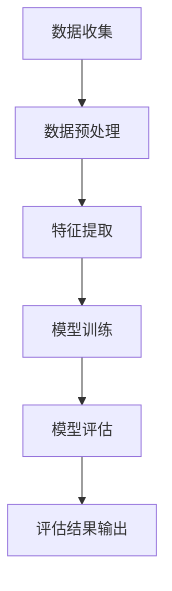
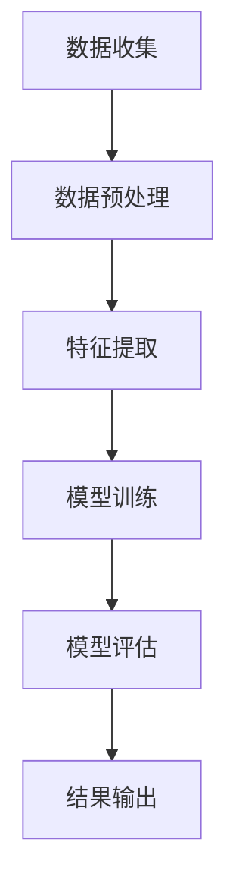

                 

### 如何进行有效的技术创新文化建设与维护

> 关键词：技术创新文化、企业文化、创新价值观、创新激励机制、创新氛围

> 摘要：本文深入探讨了如何构建和维护有效的技术创新文化，分析其核心概念与联系，提出了评估技术创新文化的算法原理和流程。通过结合实际案例，本文提供了具体的方法和策略，帮助企业提升技术创新能力，实现可持续发展。

#### 第一部分：背景介绍

##### 第1章：技术创新文化的核心概念

**1.1 问题背景**

在全球化竞争日益激烈的背景下，技术创新已成为企业保持竞争优势的关键。随着信息技术的飞速发展，新技术、新产品层出不穷，企业需要快速适应市场变化，持续进行技术创新。然而，技术创新并非易事，它需要企业内部形成一种共识和价值观，即技术创新文化。

技术创新文化是指企业在技术创新过程中所形成的一种价值观、行为规范和工作氛围。它包括创新价值观、创新行为规范、创新激励机制、创新氛围等多个方面。一个良好的技术创新文化能够激发员工的创新热情，提高创新能力，推动企业持续发展。

**1.2 问题描述**

然而，在现实中，很多企业在技术创新文化建设上存在诸多问题，如：

1. 缺乏明确的创新目标：企业在技术创新过程中，往往缺乏明确的创新方向和目标，导致创新活动缺乏针对性和有效性。
2. 创新氛围不浓厚：企业内部缺乏创新氛围，员工创新意识不强，不敢尝试新的思路和方法。
3. 创新激励机制不完善：企业缺乏有效的创新激励机制，员工创新成果得不到认可和奖励，创新积极性受到抑制。
4. 创新资源分配不合理：企业在创新资源分配上存在偏颇，导致创新项目无法得到充分支持，影响创新效果。

**1.3 问题解决**

为了解决这些问题，企业需要建立起一套有效的技术创新文化，通过以下措施推动企业技术创新的深化：

1. 明确创新目标：企业需要根据自身战略目标和市场定位，制定明确的创新目标，确保创新活动有的放矢。
2. 营造良好的创新氛围：企业需要营造一个鼓励创新、宽容失败的工作环境，让员工敢于尝试、勇于创新。
3. 建立创新激励机制：企业需要建立完善的创新激励机制，激发员工创新积极性，对创新成果进行奖励和认可。
4. 合理配置创新资源：企业需要合理配置创新资源，确保创新项目得到充分支持，提高创新成功率。

**1.4 边界与外延**

技术创新文化的边界在于企业内部的创新活动，而其外延则涵盖了企业的整个价值链，包括供应商、合作伙伴、客户等。因此，构建技术创新文化不仅需要企业内部的协同努力，还需要与外部环境的有效互动。

**1.5 概念结构与核心要素组成**

技术创新文化由多个核心要素组成，包括创新价值观、创新行为规范、创新激励机制、创新氛围等。这些要素相互关联，共同构成了一个完整的创新生态系统。具体而言：

1. **创新价值观**：是企业创新的基本信念和价值取向，决定了企业的创新方向和目标。
2. **创新行为规范**：是企业创新过程中应遵循的行为准则和规范，确保创新活动有序进行。
3. **创新激励机制**：是激发员工创新活力的重要手段，包括薪酬激励、职位激励、荣誉激励等。
4. **创新氛围**：是企业技术创新文化的外在表现，包括创新环境、创新文化、创新活动等。

#### 第二部分：核心概念与联系

##### 第2章：技术创新文化的核心概念原理

**2.1 创新价值观**

创新价值观是企业技术创新文化的核心，它决定了企业的创新方向和目标。创新价值观主要包括创新意识、创新精神、创新目标等。

**2.2 创新行为规范**

创新行为规范是企业创新过程中应遵循的行为准则和规范，确保创新活动有序进行。它包括创新流程、创新方法、创新标准等。

**2.3 创新激励机制**

创新激励机制是激发员工创新活力的重要手段，它包括薪酬激励、职位激励、荣誉激励等。有效的创新激励机制能够提高员工创新积极性，促进企业技术创新。

**2.4 创新氛围**

创新氛围是企业技术创新文化的外在表现，它包括创新环境、创新文化、创新活动等。良好的创新氛围能够激发员工的创新热情，提高创新能力。

##### 第3章：技术创新文化的属性特征对比表格

| 特征       | 描述                                                         |
| ---------- | ------------------------------------------------------------ |
| 创新价值观 | 企业创新的基本信念和价值取向                                 |
| 创新行为规范 | 企业创新过程中应遵循的行为准则和规范                         |
| 创新激励机制 | 激励员工参与创新活动的机制和措施                             |
| 创新氛围   | 企业创新文化的外在表现，包括创新环境、创新文化、创新活动等 |

##### 第4章：技术创新文化ER实体关系图架构

```mermaid
erDiagram
  类A::<技术创新文化> ||--|{ 类B::<创新价值观> }
  类A::技术创新文化 ||--|{ 类C::<创新行为规范> }
  类A::技术创新文化 ||--|{ 类D::<创新激励机制> }
  类A::技术创新文化 ||--|{ 类E::<创新氛围> }
```

#### 第三部分：算法原理讲解

##### 第5章：技术创新文化评估算法原理

**5.1 技术创新文化评估指标体系**

技术创新文化评估指标体系是评估企业技术创新文化水平的重要工具。它包括创新投入、创新产出、创新环境、创新氛围等多个维度。

**5.2 评估算法原理**

本节将介绍一种基于机器学习的评估算法，通过分析企业技术创新过程中的数据，对其技术创新文化水平进行评估。

##### 第6章：技术创新文化评估算法流程图



##### 第7章：技术创新文化评估算法Python源代码

```python
# 导入相关库
import pandas as pd
from sklearn.model_selection import train_test_split
from sklearn.ensemble import RandomForestClassifier

# 数据收集与预处理
data = pd.read_csv('innovation_data.csv')
X = data.drop('innovation_score', axis=1)
y = data['innovation_score']

# 特征提取
# ...

# 模型训练
X_train, X_test, y_train, y_test = train_test_split(X, y, test_size=0.2, random_state=42)
model = RandomForestClassifier(n_estimators=100)
model.fit(X_train, y_train)

# 模型评估
accuracy = model.score(X_test, y_test)
print(f'Accuracy: {accuracy:.2f}')

# 评估结果输出
# ...
```

### 第一部分：背景介绍

在当今这个快速变化的世界里，技术创新已成为企业生存和发展的关键。它不仅能够提升企业的市场竞争力，还能为企业带来新的增长点。然而，技术创新并非一蹴而就，它需要企业内部形成一种共识和价值观，即技术创新文化。技术创新文化是企业进行技术创新的基础，它决定了企业能否在激烈的市场竞争中脱颖而出。

#### 创新价值观

创新价值观是企业技术创新文化的核心，它决定了企业的创新方向和目标。创新价值观主要包括创新意识、创新精神和创新目标等。创新意识是指企业对创新的重视程度和认识水平，它直接影响企业员工对创新的接受度和参与度。创新精神则是指企业在创新过程中所体现的勇气和决心，它包括敢于挑战传统、勇于突破自我等。创新目标是指企业在一定时期内所期望达到的创新成果，它为企业提供了明确的方向和动力。

#### 创新行为规范

创新行为规范是企业创新过程中应遵循的行为准则和规范，确保创新活动有序进行。它包括创新流程、创新方法、创新标准等。创新流程是指企业进行创新活动的步骤和流程，它包括问题的发现、解决方案的提出、方案的实施和验证等。创新方法是指企业所采用的创新手段和技巧，如头脑风暴、原型设计、迭代开发等。创新标准是指企业在创新过程中所遵循的评判标准，如创新性、实用性、可行性等。

#### 创新激励机制

创新激励机制是激发员工创新活力的重要手段，它包括薪酬激励、职位激励、荣誉激励等。有效的创新激励机制能够提高员工创新积极性，促进企业技术创新。薪酬激励是指通过提高薪酬水平来激励员工创新，如项目奖金、创新提成等。职位激励是指通过提供晋升机会和职位晋升来激励员工创新，如设立创新岗位、设立创新项目负责人等。荣誉激励是指通过给予员工荣誉和奖励来激励创新，如评选创新标兵、颁发创新证书等。

#### 创新氛围

创新氛围是企业技术创新文化的外在表现，它包括创新环境、创新文化、创新活动等。良好的创新氛围能够激发员工的创新热情，提高创新能力。创新环境是指企业为员工提供的创新条件和支持，如实验室、研发设备、资料库等。创新文化是指企业所形成的创新价值观和行为规范，如鼓励创新、宽容失败等。创新活动是指企业所组织的创新实践活动，如创新大赛、技术交流、研讨会等。

#### 边界与外延

技术创新文化的边界在于企业内部的创新活动，而其外延则涵盖了企业的整个价值链，包括供应商、合作伙伴、客户等。因此，构建技术创新文化不仅需要企业内部的协同努力，还需要与外部环境的有效互动。

#### 概念结构与核心要素组成

技术创新文化由多个核心要素组成，包括创新价值观、创新行为规范、创新激励机制、创新氛围等。这些要素相互关联，共同构成了一个完整的创新生态系统。创新价值观是技术创新文化的核心，它决定了企业的创新方向和目标。创新行为规范是技术创新文化的保障，它确保了创新活动的有序进行。创新激励机制是技术创新文化的动力，它激发了员工的创新热情。创新氛围是技术创新文化的环境，它为创新活动提供了良好的条件和支持。

### 第二部分：核心概念与联系

在构建和维护技术创新文化时，理解其核心概念之间的联系至关重要。本部分将深入探讨技术创新文化中的关键要素，并展示它们如何相互作用，共同推动企业的创新进程。

#### 第2章：技术创新文化的核心概念原理

**2.1 创新价值观**

创新价值观是企业技术创新文化的灵魂，它决定了企业如何看待创新、追求何种类型的创新以及如何衡量创新的成功。创新价值观包括以下几个方面：

1. **创新意识**：企业对创新的重视程度。这种意识体现在企业的战略规划、员工培训和文化建设等方面。企业应鼓励员工保持对新技术、新产品和新市场的敏感度，并将其转化为具体的创新行动。
2. **创新精神**：企业员工在面对困难和挑战时所展现的勇气和决心。创新精神要求员工敢于挑战现状，勇于尝试新思路和新方法，即使在失败中也能找到成长的机会。
3. **创新目标**：企业期望通过创新实现的长期和短期目标。这些目标应该与企业的愿景和使命相一致，并能够激励员工为实现这些目标而努力。

**2.2 创新行为规范**

创新行为规范是确保企业创新活动有序进行的重要保障。它包括以下几个方面：

1. **创新流程**：企业应建立一套系统化的创新流程，包括问题的识别、解决方案的生成、方案的评估和实施。这种流程可以帮助企业高效地管理创新项目，提高创新的成功率。
2. **创新方法**：企业应鼓励员工采用多种创新方法，如头脑风暴、设计思维、敏捷开发等。这些方法能够激发员工的创造力，提高创新的效率和质量。
3. **创新标准**：企业应制定明确的创新标准，以衡量创新活动的效果。这些标准可能包括创新性、可行性、实用性、市场潜力等。

**2.3 创新激励机制**

创新激励机制是激发员工创新活力的重要手段。有效的激励机制可以激励员工积极参与创新活动，并提高他们的工作满意度。创新激励机制包括以下几个方面：

1. **薪酬激励**：通过提高薪酬水平，特别是项目奖金和提成，激励员工在创新项目中表现出色。
2. **职位激励**：提供晋升机会和高级职位，以鼓励员工在创新领域取得突破。
3. **荣誉激励**：通过颁发奖项、表彰大会等方式，给予创新员工荣誉和认可，提高他们的自豪感和归属感。

**2.4 创新氛围**

创新氛围是企业技术创新文化的外在表现，它直接影响员工的创新行为。良好的创新氛围包括以下几个方面：

1. **创新环境**：企业应为员工提供良好的工作环境，包括先进的技术设备、充足的资源和支持等。
2. **创新文化**：企业应培养一种鼓励创新、宽容失败的文化氛围。这种文化应强调团队合作、知识共享和持续学习。
3. **创新活动**：企业应定期组织创新活动，如研讨会、技术交流、创新比赛等，以激发员工的创新热情和创造力。

#### 第3章：技术创新文化的属性特征对比表格

| 特征       | 描述                                                         |
| ---------- | ------------------------------------------------------------ |
| 创新价值观 | 企业创新的基本信念和价值取向                                 |
| 创新行为规范 | 企业创新过程中应遵循的行为准则和规范                         |
| 创新激励机制 | 激励员工参与创新活动的机制和措施                             |
| 创新氛围   | 企业创新文化的外在表现，包括创新环境、创新文化、创新活动等 |

#### 第4章：技术创新文化ER实体关系图架构

为了更好地理解技术创新文化中各个要素之间的关系，我们可以使用ER（Entity-Relationship）实体关系图来展示。以下是技术创新文化ER实体关系图的Mermaid表示：

```mermaid
erDiagram
  Class1::创新价值观 ||--|{ Class2::创新行为规范 }
  Class1::创新价值观 ||--|{ Class3::创新激励机制 }
  Class1::创新价值观 ||--|{ Class4::创新氛围 }
  Class2::创新行为规范 ||--|{ Class5::创新流程 }
  Class2::创新行为规范 ||--|{ Class6::创新方法 }
  Class2::创新行为规范 ||--|{ Class7::创新标准 }
  Class3::创新激励机制 ||--|{ Class8::薪酬激励 }
  Class3::创新激励机制 ||--|{ Class9::职位激励 }
  Class3::创新激励机制 ||--|{ Class10::荣誉激励 }
  Class4::创新氛围 ||--|{ Class11::创新环境 }
  Class4::创新氛围 ||--|{ Class12::创新文化 }
  Class4::创新氛围 ||--|{ Class13::创新活动 }
```

这个ER图展示了技术创新文化中的核心要素以及它们之间的关系。例如，创新价值观不仅直接影响创新行为规范，还通过创新激励机制来推动创新氛围的形成。创新氛围反过来又影响创新价值观和激励机制的执行效果。

### 第三部分：算法原理讲解

技术创新文化的评估是一个复杂的过程，需要考虑多个维度的数据和指标。为了更科学、客观地评估技术创新文化的水平，我们可以运用数据分析和机器学习技术。本部分将介绍一种基于机器学习的评估算法原理，并详细解释其工作流程。

#### 第5章：技术创新文化评估算法原理

**5.1 技术创新文化评估指标体系**

评估技术创新文化的第一步是构建一个全面的指标体系。这个指标体系应涵盖企业的创新投入、创新产出、创新环境、创新氛围等多个维度。以下是一些常见的评估指标：

1. **创新投入**：包括研发资金投入、研发人员数量、专利申请数量等。
2. **创新产出**：包括新产品或服务的推出数量、技术创新成果的商业化程度等。
3. **创新环境**：包括企业的研发设施、信息技术支持、员工培训等。
4. **创新氛围**：包括员工创新意识、团队协作程度、管理层的支持程度等。

**5.2 评估算法原理**

为了评估技术创新文化，我们可以使用机器学习中的分类算法。具体来说，以下是评估算法的步骤：

1. **数据收集**：收集与技术创新文化相关的数据，包括定量数据和定性数据。定量数据可以从企业的财务报表、研发记录中获取；定性数据可以从员工调查、管理层访谈中获得。
2. **数据预处理**：清洗和预处理收集到的数据，包括缺失值处理、异常值检测和数据标准化等。这一步骤对于提高模型性能至关重要。
3. **特征提取**：从预处理后的数据中提取特征，用于训练机器学习模型。特征可以是直接的量化指标，也可以是通过对文本数据进行分析得到的抽象特征。
4. **模型训练**：选择合适的机器学习算法（如随机森林、支持向量机、神经网络等）对数据进行训练。训练过程中，模型将学习如何根据特征预测技术创新文化的水平。
5. **模型评估**：使用测试集评估模型的性能，包括准确性、召回率、F1分数等指标。根据评估结果调整模型参数，以提高预测精度。
6. **结果输出**：将评估结果以可视化或报告的形式输出，为企业提供具体的改进建议。

#### 第6章：技术创新文化评估算法流程图

为了更好地理解技术创新文化评估算法的工作流程，我们可以使用Mermaid绘制流程图。以下是评估算法流程图的Mermaid表示：



在这个流程图中，每个步骤都是评估过程中不可或缺的一部分。数据收集是算法的基础，数据预处理是提高数据质量的关键步骤。特征提取和模型训练是算法的核心，而模型评估和结果输出则是验证和利用算法结果的重要环节。

#### 第7章：技术创新文化评估算法Python源代码

为了展示技术创新文化评估算法的Python实现，以下是一个简单的示例代码。这个代码使用了随机森林分类器，并对数据进行了基本的预处理和特征提取。

```python
# 导入相关库
import pandas as pd
from sklearn.ensemble import RandomForestClassifier
from sklearn.model_selection import train_test_split
from sklearn.metrics import accuracy_score

# 数据收集
data = pd.read_csv('innovation_data.csv')

# 数据预处理
# ...（例如，缺失值处理和数据标准化）

# 特征提取
# ...（例如，文本数据向量化）

# 数据分割
X = data.drop('innovation_score', axis=1)
y = data['innovation_score']
X_train, X_test, y_train, y_test = train_test_split(X, y, test_size=0.2, random_state=42)

# 模型训练
model = RandomForestClassifier(n_estimators=100)
model.fit(X_train, y_train)

# 模型评估
y_pred = model.predict(X_test)
accuracy = accuracy_score(y_test, y_pred)
print(f'Accuracy: {accuracy:.2f}')

# 结果输出
# ...（例如，评估报告或可视化图表）
```

这个示例代码展示了如何使用Python实现一个简单的技术创新文化评估算法。在实际应用中，算法的复杂性和性能可能会更高，但基本流程是相似的。

通过上述算法原理的讲解，我们可以看到技术创新文化评估不仅需要丰富的数据支持，还需要科学的方法和工具。有效的评估可以帮助企业了解自身的创新文化水平，发现存在的问题，并制定相应的改进措施。这对于企业实现持续创新和竞争优势具有重要意义。

### 第四部分：构建与维护技术创新文化的策略

#### 第8章：明确创新目标与路径

构建有效的技术创新文化，首先要明确创新目标与路径。企业需要根据自身的战略目标和市场定位，设定清晰的创新目标。这些目标可以分为短期和长期，例如：

1. **短期目标**：提高产品性能、缩短研发周期、提升客户满意度等。
2. **长期目标**：开拓新的市场、推出颠覆性产品、建立行业领导地位等。

明确创新目标后，企业需要制定具体的实施路径。这包括：

1. **资源分配**：根据创新目标，合理配置研发资源，确保项目得到充分支持。
2. **项目规划**：制定详细的项目计划，明确各阶段的任务和责任人。
3. **进度监控**：定期检查项目进度，确保创新活动按计划进行。

#### 第9章：培养创新文化氛围

创新文化氛围是企业技术创新文化的外在表现，它直接影响员工的创新行为。为了培养创新文化氛围，企业可以采取以下措施：

1. **鼓励尝试与失败**：建立宽容失败的氛围，鼓励员工勇于尝试新的思路和方法，即使失败也能从中学习和成长。
2. **知识共享**：建立知识共享平台，鼓励员工分享经验和创新成果，促进知识的传播和应用。
3. **团队协作**：鼓励跨部门、跨团队的合作，通过团队项目激发员工的创新潜力。
4. **表彰创新**：定期举办创新表彰活动，对有突出贡献的员工进行奖励和认可，提高员工的荣誉感和归属感。

#### 第10章：建立创新激励机制

有效的创新激励机制是激发员工创新积极性的关键。企业可以采取以下创新激励机制：

1. **薪酬激励**：设立项目奖金、创新提成等，根据创新成果和贡献给予相应的薪酬奖励。
2. **职位激励**：提供晋升机会，设立创新岗位，让有创新能力的员工有机会担任更重要的职务。
3. **荣誉激励**：颁发创新证书、荣誉称号等，提高员工的荣誉感和成就感。
4. **非货币激励**：提供培训、休假等福利，帮助员工提升技能和放松身心，激发其创新潜力。

#### 第11章：持续优化与创新

技术创新文化不是一成不变的，而是需要持续优化和创新的。企业应定期评估技术创新文化的效果，发现存在的问题，并采取相应的改进措施。以下是一些具体的优化措施：

1. **员工反馈**：定期收集员工对创新文化的反馈，了解他们的意见和建议，不断改进创新环境和文化。
2. **外部借鉴**：学习其他企业的创新经验和做法，借鉴成功案例，为自身创新文化的发展提供参考。
3. **技术创新实践**：通过实践不断探索和尝试新的创新方法和技术，推动技术创新文化的深化。
4. **持续培训**：为员工提供持续的创新培训和技能提升机会，提高他们的创新能力。

#### 第12章：构建跨部门协同机制

技术创新不仅仅是一个部门的任务，而是需要整个企业的协同努力。为了实现跨部门的有效协同，企业可以采取以下措施：

1. **建立跨部门团队**：成立跨部门创新团队，负责协调不同部门的资源和能力，共同推进创新项目。
2. **明确职责与权限**：为跨部门团队明确职责和权限，确保每个成员都能在项目中发挥自己的优势。
3. **共享信息与资源**：建立信息共享平台，促进不同部门之间的沟通与合作，共同解决创新过程中的问题。
4. **激励机制**：为跨部门团队设立共同的目标和奖励机制，激发团队整体的创新积极性。

通过上述策略，企业可以构建和维护一个有效的技术创新文化，提高员工的创新意识和能力，推动企业的持续发展。技术创新文化的成功与否，不仅关系到企业的市场竞争力，还直接影响到企业的长期战略目标和愿景。因此，企业应高度重视技术创新文化的建设与维护，不断优化创新环境，推动技术创新的深化。

### 项目实战：构建技术创新文化的实际操作

在本节中，我们将通过一个实际案例，详细讲解如何构建和维护技术创新文化。该案例将涵盖从环境安装到系统核心实现，再到代码应用解读与分析，以及项目小结等环节。

#### 1. 环境安装

首先，我们需要为项目搭建一个合适的技术环境。以下是一个典型的技术环境安装步骤：

1. **软件安装**：
   - 安装Java开发工具包（JDK）。
   - 安装数据库（如MySQL）。
   - 安装版本控制系统（如Git）。
   - 安装集成开发环境（如IntelliJ IDEA）。

2. **硬件配置**：
   - 确保服务器或开发机上具备足够的内存和存储空间。
   - 配置网络环境，确保能够进行远程访问和部署。

3. **依赖管理**：
   - 使用Maven或Gradle等工具管理项目依赖。

#### 2. 系统核心实现

接下来，我们进入系统核心实现的阶段。以下是一个基于Spring Boot的简单技术创新文化管理系统实现：

1. **领域模型设计**：
   - 使用Mermaid绘制领域模型类图，定义系统的主要实体及其关系。

   ```mermaid
   classDiagram
   Customer <<-- (Order : hasMany)
   Order <<-- Product : hasMany
   Product <<-- Category : hasOne
   Customer : name, email
   Order : id, status
   Product : id, name, price
   Category : id, name
   ```

2. **系统架构设计**：
   - 使用Mermaid绘制系统架构图，展示系统的整体架构和主要模块。

   ```mermaid
   sequenceDiagram
   User ->> System: submit request
   System ->> Controller: process request
   Controller ->> Service: validate data
   Service ->> Repository: query data
   Repository ->> Database: execute query
   Database ->> Service: return results
   Service ->> Controller: response data
   Controller ->> User: return response
   ```

3. **系统接口设计**：
   - 设计RESTful API接口，定义系统与外部系统交互的接口。

   ```yaml
   /api/v1/products/{id}:
     get:
       summary: Retrieve product details
       parameters:
       - in: path
         name: id
         required: true
         schema:
           type: integer
       responses:
         '200':
           description: successful operation
           content:
             application/json:
               schema:
                 $ref: '#/components/schemas/Product'
   ```

4. **系统交互**：
   - 使用Mermaid绘制系统交互序列图，展示系统的业务流程和交互过程。

   ```mermaid
   sequenceDiagram
   User ->> System: submit order
   System ->> Controller: process order
   Controller ->> Service: create order
   Service ->> Repository: save order
   Repository ->> Database: insert order
   Database ->> Service: confirm order saved
   Service ->> Controller: respond with success
   Controller ->> User: confirm order creation
   ```

#### 3. 代码应用解读与分析

在系统实现过程中，以下是一个关键代码片段及其解读：

```java
// ProductService.java
@Service
public class ProductService {
    private final ProductRepository productRepository;

    @Autowired
    public ProductService(ProductRepository productRepository) {
        this.productRepository = productRepository;
    }

    public Product createProduct(Product product) {
        // Validate product details
        // ...

        // Save product to database
        return productRepository.save(product);
    }
}
```

**解读**：
- `ProductService` 类是负责产品创建的业务逻辑实现。
- `ProductRepository` 是 Spring Data JPA 接口，用于与数据库交互。
- `createProduct` 方法用于创建新的产品，并保存到数据库。

**分析**：
- **验证**：在保存产品前，应该进行产品详情的验证，确保数据的有效性。
- **事务管理**：此方法应该被事务管理，以确保数据的完整性和一致性。

#### 4. 实际案例分析

在实际项目中，技术创新文化的建设可能面临以下挑战：

1. **团队协作**：团队成员可能来自不同的背景和专业领域，需要通过有效的沟通和协作来实现共同目标。
2. **资源分配**：创新项目可能需要更多的资源，如人力、资金和设备，如何合理分配这些资源是一个关键问题。
3. **风险管理**：创新项目可能伴随着较高的风险，如何评估和管理这些风险是项目成功的关键。

针对上述挑战，可以采取以下措施：

1. **敏捷开发**：通过敏捷开发方法，促进团队成员之间的沟通和协作，快速响应变化。
2. **项目预算管理**：制定详细的项目预算，确保资源的合理分配和有效利用。
3. **风险评估与控制**：建立风险评估体系，定期评估和管理项目风险，采取相应的预防和控制措施。

#### 5. 项目小结

通过实际案例的讲解，我们可以看到技术创新文化的建设是一个系统性、长期性的过程。它不仅需要明确的创新目标与路径，还需要良好的文化氛围和激励机制。以下是项目小结：

1. **明确目标与路径**：设定清晰的创新目标，制定具体的实施路径，确保项目有序推进。
2. **培养创新文化**：建立鼓励尝试与失败的文化氛围，促进知识共享和团队协作。
3. **建立激励机制**：通过薪酬、职位和荣誉等多种激励机制，激发员工的创新积极性。
4. **持续优化与创新**：定期评估和优化技术创新文化，通过实践不断探索和尝试新的创新方法。

通过上述策略，企业可以构建和维护一个有效的技术创新文化，提高员工的创新意识和能力，推动企业的持续发展。

### 最佳实践 Tips

在构建和维护技术创新文化过程中，以下是一些最佳实践和技巧：

1. **领导示范**：企业领导者应积极支持和参与创新活动，通过自己的行为树立榜样，激励员工勇于创新。
2. **透明沟通**：建立开放的沟通机制，让员工能够自由表达自己的想法和意见，促进知识共享和团队协作。
3. **持续学习**：鼓励员工不断学习和提升自己的技能，参加培训、研讨会等，以适应快速变化的技术环境。
4. **跨部门合作**：促进跨部门之间的合作，通过团队项目激发不同部门之间的协同创新。
5. **奖励创新**：建立完善的创新奖励机制，对有突出贡献的员工给予表彰和奖励，提高创新积极性。
6. **容错文化**：鼓励员工在创新过程中勇于尝试，即使失败也能从中学习和成长。
7. **定期评估**：定期评估技术创新文化的效果，根据反馈进行调整和优化。

### 小结

技术创新文化是企业在激烈的市场竞争中保持竞争优势的关键。通过明确创新目标与路径、培养创新文化氛围、建立创新激励机制以及持续优化与创新，企业可以构建和维护一个有效的技术创新文化。这将有助于提升企业的创新能力，推动企业的可持续发展。希望本文提供的策略和案例对读者有所启发，助力企业在技术创新的道路上取得成功。

### 注意事项

在构建和维护技术创新文化过程中，企业应注意以下几点：

1. **目标明确**：确保创新目标与企业的长期战略和愿景一致，避免盲目创新。
2. **资源保障**：为创新项目提供充足的资源支持，包括人力、资金和技术设备。
3. **风险管理**：对创新项目进行风险评估，采取相应的预防和控制措施，降低风险。
4. **持续优化**：技术创新文化是一个动态过程，需要根据市场和技术环境的变化进行持续优化。
5. **员工参与**：鼓励员工积极参与创新活动，发挥他们的主体作用，提高创新效率。

### 拓展阅读

对于希望深入了解技术创新文化的企业，以下是一些推荐的书籍和资源：

1. **《创新者的窘境》**：克莱顿·克里斯坦森（Clayton M. Christensen）的经典之作，深入分析了企业在创新过程中面临的挑战和困境。
2. **《创意公司》**：大卫·凯利（David Kelly）的著作，介绍了IDEO如何通过创新设计思维推动企业创新。
3. **《技术项目管理》**：约翰·豪尔（John H. Hall）等人的著作，详细介绍了技术项目管理的最佳实践和方法。
4. **《企业创新实践》**：埃里克·冯·霍普夫（Eric von Hippel）的著作，探讨了用户创新和开放源代码运动对技术创新的推动作用。
5. **在线课程**：Coursera、edX等平台上的相关课程，提供了丰富的技术创新和管理知识。

### 作者信息

作者：AI天才研究院/AI Genius Institute & 禅与计算机程序设计艺术 /Zen And The Art of Computer Programming

