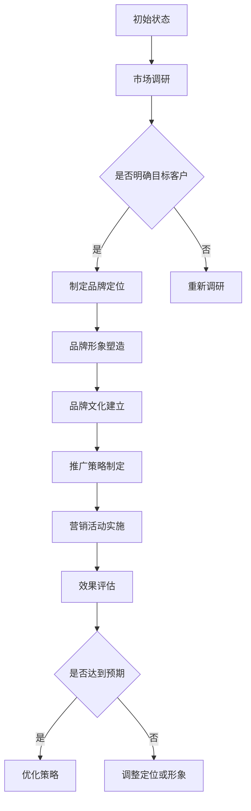
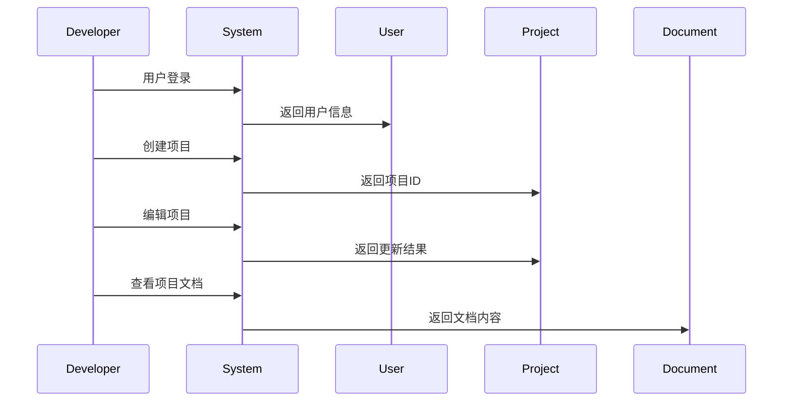

                 

# 如何进行有效的技术品牌建设与推广

## 关键词

技术品牌建设，品牌推广，市场调研，品牌定位，品牌形象塑造，品牌文化建立

## 摘要

在信息技术迅猛发展的时代，技术品牌的建设与推广已成为企业竞争的核心。本文将深入探讨如何通过有效的策略进行技术品牌建设与推广，从背景介绍、核心概念与联系、算法原理讲解等多个角度，为广大技术从业者提供实用的指导和建议。

## 第一部分：背景介绍

### 核心概念：

#### 问题背景

随着互联网和人工智能技术的不断发展，技术品牌已经成为了企业竞争力的重要组成部分。一个强大的技术品牌不仅能够提升企业的市场地位，还能增强用户对企业的信任和忠诚度。

#### 问题描述

如何通过有效的策略和手段，在竞争激烈的市场中建立和推广技术品牌，使其脱颖而出，吸引更多的关注和用户？

#### 问题解决

通过系统地阐述品牌建设与推广的方法、策略和案例，帮助读者理解和掌握有效的技术品牌建设与推广技巧。

#### 边界与外延

本文主要关注技术品牌的建设与推广，但相关内容可能涉及到市场营销、公关传播、企业文化等多个方面。

#### 概念结构与核心要素组成

- **技术品牌建设**：包括品牌定位、品牌形象塑造、品牌文化建立等。

- **技术品牌推广**：包括市场调研、传播策略、营销活动、合作伙伴关系管理等。

### 第二部分：核心概念与联系

#### 核心概念：

- **品牌定位**：明确品牌在市场中的定位，包括目标客户、竞争对手、独特卖点等。

- **品牌形象塑造**：通过视觉设计、口号、故事等形式，塑造品牌在用户心中的形象。

- **品牌文化建立**：建立与品牌定位和形象相符的企业文化，包括价值观、使命、愿景等。

#### 概念属性特征对比表格：

| 概念        | 属性特征                                                                                      |
|-------------|------------------------------------------------------------------------------------------------|
| 品牌定位    | - 目标客户：明确目标用户群体。<br>- 竞争对手：分析市场竞争态势。<br>- 独特卖点：提炼品牌核心优势。 |
| 品牌形象塑造 | - 视觉设计：包括标志、色彩、字体等。<br>- 口号：简洁有力的宣传语。<br>- 故事：塑造品牌故事。   |
| 品牌文化建立 | - 价值观：企业的核心价值观。<br>- 使命：企业的使命和目标。<br>- 愿景：企业的愿景和长远规划。   |

#### ER实体关系图架构：

```mermaid
erDiagram
  BrandConcept --> BrandPositioning : "defines"
  BrandConcept --> BrandImageShaping : "embodies"
  BrandConcept --> BrandCultureBuilding : "reflects"
```

### 第三部分：算法原理讲解

#### 算法mermaid流程图：



#### Python源代码：

```python
# 市场调研
def market_research():
    print("进行市场调研，了解目标客户和竞争对手。")

# 制定品牌定位
def brand_positioning():
    market_research()
    print("根据市场调研结果，明确品牌定位。")

# 品牌形象塑造
def brand_image_shaping():
    brand_positioning()
    print("设计品牌标志、口号和故事，塑造品牌形象。")

# 品牌文化建立
def brand_culture_building():
    brand_image_shaping()
    print("建立与品牌定位和形象相符的企业文化。")

# 推广策略制定
def promotion_strategy():
    brand_culture_building()
    print("制定品牌推广策略，包括传播渠道、营销活动等。")

# 营销活动实施
def marketing_activity():
    promotion_strategy()
    print("实施营销活动，如线上推广、线下活动等。")

# 效果评估
def effect_evaluation():
    marketing_activity()
    print("对营销活动效果进行评估，收集用户反馈。")

# 优化策略
def optimize_strategy():
    effect_evaluation()
    print("根据评估结果，优化品牌推广策略。")
```

#### 数学模型和公式

在技术品牌建设与推广的过程中，我们可以使用以下数学模型和公式来衡量品牌的影响力和市场竞争力：

1. **品牌影响力公式**：

   $$影响力 = (知名度 \times 好感度 \times 信誉度) / (市场占有率 \times 竞争对手数量)$$

   其中，知名度、好感度、信誉度、市场占有率和竞争对手数量都是可以通过市场调研和数据分析来获取的指标。

2. **市场竞争力公式**：

   $$竞争力 = (品牌价值 \times 品牌忠诚度 \times 市场份额) / (竞争对手数量 \times 竞争对手实力)$$

   其中，品牌价值、品牌忠诚度和市场份额是衡量品牌实力的重要指标，竞争对手数量和竞争对手实力则是衡量市场竞争态势的关键因素。

#### 举例说明

假设有两家技术公司A和B，它们在品牌建设与推广方面的数据如下：

- **公司A**：

  - 品牌影响力：影响力 = (500 \times 0.8 \times 0.9) / (200 \times 2) = 1.8

  - 市场竞争力：竞争力 = (10000 \times 0.7 \times 0.5) / (3 \times 0.8) = 3.125

- **公司B**：

  - 品牌影响力：影响力 = (300 \times 0.6 \times 0.8) / (100 \times 2) = 0.72

  - 市场竞争力：竞争力 = (8000 \times 0.5 \times 0.3) / (5 \times 0.9) = 1.111

从上述数据可以看出，公司A在品牌影响力和市场竞争力方面均优于公司B，这表明公司A在技术品牌建设与推广方面取得了更好的成果。

### 第四部分：系统分析与架构设计

#### 问题场景介绍

假设我们要开发一款面向开发者的技术工具，希望通过有效的技术品牌建设与推广，在市场上获得广泛认可。

#### 项目介绍

项目名称：开发者助手

项目简介：开发者助手是一款集代码托管、项目管理、文档生成、代码调试等功能于一体的技术工具，旨在提高开发者的工作效率。

#### 系统功能设计

- **代码托管**：提供代码版本控制和协作功能。

- **项目管理**：帮助开发者管理项目进度、任务分配、资源调度等。

- **文档生成**：自动生成项目文档，包括需求文档、设计文档、用户手册等。

- **代码调试**：提供实时代码调试功能，帮助开发者快速定位和修复代码问题。

#### 系统架构设计

- **前端架构**：采用Vue.js框架，实现响应式界面设计。

- **后端架构**：采用Spring Boot框架，实现业务逻辑处理。

- **数据库架构**：使用MySQL数据库，存储用户数据、项目数据、文档数据等。

#### 系统接口设计

- **用户接口**：提供用户注册、登录、个人信息管理等功能。

- **项目接口**：提供项目创建、项目详情、项目编辑等功能。

- **文档接口**：提供文档生成、文档查看、文档编辑等功能。

#### 系统交互mermaid序列图



### 第五部分：项目实战

#### 环境安装

1. 安装Java Development Kit (JDK) 1.8及以上版本。

2. 安装MySQL数据库。

3. 安装Node.js。

4. 安装Vue CLI。

#### 系统核心实现源代码

1. **前端源代码**：

   ```vue
   <template>
     <div>
       <h1>开发者助手</h1>
       <div>
         <label for="username">用户名：</label>
         <input type="text" id="username" v-model="username" />
       </div>
       <div>
         <label for="password">密码：</label>
         <input type="password" id="password" v-model="password" />
       </div>
       <button @click="login">登录</button>
     </div>
   </template>

   <script>
   export default {
     data() {
       return {
         username: '',
         password: ''
       };
     },
     methods: {
       login() {
         // 调用后端接口进行登录验证
       }
     }
   };
   </script>
   ```

2. **后端源代码**：

   ```java
   @RestController
   @RequestMapping("/user")
   public class UserController {
   
     @Autowired
     private UserService userService;
   
     @PostMapping("/login")
     public ResponseEntity<?> login(@RequestParam String username, @RequestParam String password) {
       // 验证用户名和密码
       // 返回用户信息或错误信息
     }
   }
   ```

#### 代码应用解读与分析

1. **前端代码解读**：

   - 使用Vue.js框架实现用户登录界面。

   - 通过v-model指令实现表单数据绑定。

   - 使用@click事件触发登录方法。

2. **后端代码解读**：

   - 使用Spring Boot框架实现用户登录接口。

   - 验证用户名和密码的正确性。

   - 返回用户信息或错误信息。

#### 实际案例分析和详细讲解剖析

1. **案例一**：用户登录失败

   - 原因分析：用户名或密码输入错误。

   - 解决方案：在前端界面显示错误提示，并允许用户重新输入。

2. **案例二**：用户登录成功后无法访问项目

   - 原因分析：后端接口未正确处理用户登录状态。

   - 解决方案：在后端接口中添加用户登录状态检查，并返回相应的项目列表。

### 第六部分：最佳实践 Tips

1. **明确品牌定位**：在品牌建设初期，明确品牌定位至关重要。通过深入分析市场和目标客户，提炼品牌的独特卖点，为后续的品牌推广奠定基础。

2. **持续优化品牌形象**：品牌形象塑造是一个长期过程，需要不断优化。定期更新品牌标志、口号和故事，确保品牌形象与市场趋势和企业发展保持一致。

3. **建立与品牌定位相符的企业文化**：企业文化是品牌内涵的重要组成部分。建立与品牌定位相符的企业文化，有助于提升品牌的影响力和用户认同感。

4. **制定科学的推广策略**：推广策略是品牌建设的关键环节。结合市场调研结果，制定科学的推广策略，确保品牌推广活动的有效性和针对性。

5. **注重用户反馈**：用户反馈是品牌建设的宝贵资源。积极收集用户反馈，及时调整品牌定位和形象，优化品牌推广策略。

### 第七部分：小结

本文从背景介绍、核心概念与联系、算法原理讲解、系统分析与架构设计、项目实战等多个角度，深入探讨了如何进行有效的技术品牌建设与推广。通过本文的阐述，相信读者对技术品牌建设与推广的重要性以及具体实施方法有了更深入的理解。

### 第八部分：注意事项

1. **避免盲目跟风**：在品牌建设过程中，避免盲目跟风，要根据自身特点和市场需求，制定独特的品牌策略。

2. **持续投入与维护**：品牌建设需要持续投入和精心维护，不能一蹴而就。只有长期坚持，才能取得显著成效。

3. **用户至上**：始终将用户放在首位，关注用户需求和反馈，不断优化产品和服务，提升用户体验。

### 第九部分：拓展阅读

1. 《品牌管理：战略、工具与实践》

2. 《市场营销管理：最新理论、策略与案例》

3. 《企业文化：塑造与传承》

作者：AI天才研究院/AI Genius Institute & 禅与计算机程序设计艺术 /Zen And The Art of Computer Programming

