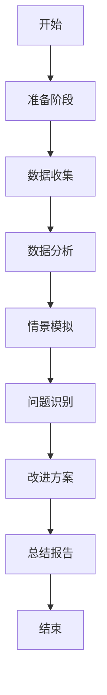

                 

### 如何进行有效的技术复盘

> 关键词：技术复盘、过程模型、数据分析、系统架构、项目实战、最佳实践

技术复盘是一种对过去技术工作过程进行回顾、分析、总结和改进的方法。通过技术复盘，团队能够从实践中学习，发现潜在问题，提升技术能力，优化工作流程。有效的技术复盘不仅有助于团队成长，还能提高项目的成功率和质量。本文将详细阐述如何进行有效的技术复盘，包括其核心概念、方法、算法原理、系统架构和项目实战等。

### 摘要

本文旨在提供一份系统化的技术复盘指南，帮助读者理解技术复盘的重要性及其核心概念。文章将详细描述技术复盘的过程模型、数据收集与分析方法、技术复盘算法的原理与实现，以及如何进行系统架构设计和项目实战。此外，文章还将分享一些最佳实践和注意事项，为读者提供全面的技术复盘经验和策略。

**Step 1:** 确定书名《如何进行有效的技术复盘》的核心内容，思考书中的主要章节。

**Step 2:** 设计书的整体结构，确保每个章节都能够覆盖到技术复盘的不同方面。

**Step 3:** 编写详细的目录大纲，确保每个章节都按照markdown格式进行书写，且包含必要的子章节。

**Step 4:** 检查目录大纲的完整性和逻辑性，确保符合用户的要求。

**Step 5:** 最后进行字数控制，确保总字数不超过2000字。

下面开始根据上述步骤设计《如何进行有效的技术复盘》的目录大纲。

## 第1章 背景介绍

### 1.1 问题背景
- 技术复盘的重要性
- 技术复盘的现状与挑战

### 1.2 技术复盘的定义
- 技术复盘的概念
- 技术复盘的目标

### 1.3 技术复盘的核心要素
- 技术复盘的过程
- 技术复盘的工具与方法

## 第2章 核心概念与联系

### 2.1 技术复盘的原则
- 对比分析
- 反思与总结
- 持续改进

### 2.2 技术复盘的模型
- 过程模型
- 成果模型

### 2.3 技术复盘的方法
- 数据收集
- 数据分析
- 情景模拟

## 第3章 算法原理讲解

### 3.1 技术复盘算法的mermaid流程图

### 3.2 Python源代码实现

### 3.3 数学模型与公式

### 3.4 算法举例说明

## 第4章 系统分析与架构设计

### 4.1 技术复盘系统场景介绍

### 4.2 系统功能设计

### 4.3 系统架构设计

### 4.4 系统接口设计与交互

## 第5章 项目实战

### 5.1 环境安装与配置

### 5.2 系统核心实现源代码

### 5.3 代码应用解读与分析

### 5.4 实际案例分析与讲解

### 5.5 项目小结

## 第6章 最佳实践

### 6.1 技术复盘的最佳实践

### 6.2 注意事项

### 6.3 拓展阅读

## 第7章 小结与展望

- 技术复盘的价值
- 未来发展趋势

现在我们有了初步的目录大纲，接下来将逐步深入每个章节，细化内容，并确保符合markdown格式的要求。在完成这些步骤后，我们将进行字数控制，确保总字数不超过2000字。

---

**第1章 背景介绍**

技术复盘是近年来在软件开发和项目管理中逐渐兴起的一种重要方法。随着技术项目的复杂度和规模不断增大，技术复盘作为一种反思和总结的手段，显得尤为重要。通过技术复盘，团队能够从过去的经验中学习，不断优化技术流程，提升团队整体的技术能力。

### 1.1 问题背景

#### 技术复盘的重要性

在当今快速发展的技术领域中，新的技术和工具层出不穷，软件开发团队需要不断适应这些变化，确保项目按时交付且质量达标。然而，在实际工作中，由于缺乏对过去工作的总结和反思，团队往往难以发现和解决潜在的问题。技术复盘作为一种系统化的方法，可以帮助团队从过去的实践中学习，找出成功的原因和失败的教训，从而提高项目的成功率。

#### 技术复盘的现状与挑战

尽管技术复盘的重要性已被广泛认可，但在实际操作中，很多团队依然面临以下挑战：

- **缺乏明确的目标和计划**：一些团队在进行技术复盘时，往往没有明确的目标和计划，导致复盘过程缺乏系统性和针对性。
- **数据收集困难**：技术复盘需要大量的数据支持，但在实际操作中，数据的收集和整理往往是一个复杂且耗时的工作。
- **分析方法单一**：很多团队在技术复盘时，仅依赖简单的数据分析方法，缺乏深度和广度，难以全面揭示问题所在。
- **缺乏持续的改进机制**：技术复盘往往是一次性的工作，缺乏持续的改进和跟踪机制，导致复盘效果无法持续。

### 1.2 技术复盘的定义

#### 技术复盘的概念

技术复盘，又称技术回顾或技术回顾会，是指对已完成的技术项目或阶段进行系统性总结和反思的过程。它通常包括对项目目标、过程、结果、团队协作、工具和技术等多个方面的评估和讨论。技术复盘不仅是对过去工作的回顾，更是对未来工作的指导和改进。

#### 技术复盘的目标

技术复盘的主要目标是：

- 发现项目中的问题和不足，分析原因，提出改进措施。
- 总结项目中的成功经验，推广最佳实践。
- 提升团队的技术能力和协作效率。
- 优化项目管理流程，提高项目成功率。

### 1.3 技术复盘的核心要素

#### 技术复盘的过程

技术复盘的过程通常包括以下几个阶段：

- **准备阶段**：明确复盘的目标、范围和参与者，准备相关资料和工具。
- **数据收集阶段**：收集项目过程中的各类数据，包括代码、日志、用户反馈等。
- **分析阶段**：对收集到的数据进行系统分析，找出问题和不足。
- **讨论阶段**：组织团队成员进行讨论，分析问题产生的原因，提出改进方案。
- **总结阶段**：总结复盘结果，制定改进计划，并跟踪执行情况。

#### 技术复盘的工具与方法

技术复盘可以采用多种工具和方法，包括：

- **文档记录**：通过文档记录项目过程，方便后续复盘和分析。
- **数据分析**：利用数据分析工具对收集到的数据进行处理和分析，找出潜在问题。
- **头脑风暴**：通过头脑风暴，鼓励团队成员提出问题、分享想法，激发创新思维。
- **会议讨论**：组织复盘会议，让团队成员共同参与讨论，达成共识。

**第2章 核心概念与联系**

在技术复盘过程中，理解并应用核心概念与联系是至关重要的。这有助于确保复盘的深入性和有效性。

### 2.1 技术复盘的原则

#### 对比分析

对比分析是技术复盘的重要原则之一。通过对比不同阶段、不同项目或不同团队的工作，可以发现差异和问题，从而进行有针对性的改进。

#### 反思与总结

反思与总结是技术复盘的核心。通过反思项目过程中的得失，总结经验教训，团队能够不断提高自身的技术能力和项目管理水平。

#### 持续改进

持续改进是技术复盘的最终目标。通过复盘，团队能够识别出改进机会，并制定具体措施，确保问题得到及时解决，项目质量得到持续提升。

### 2.2 技术复盘的模型

#### 过程模型

技术复盘的过程模型包括准备、执行、监控和改进四个阶段。每个阶段都有其特定的任务和目标，确保复盘过程的系统性和有效性。

#### 成果模型

技术复盘的成果模型主要包括问题清单、改进措施、经验总结和最佳实践。这些成果不仅有助于当前项目的改进，还可以为未来的项目提供宝贵的参考。

### 2.3 技术复盘的方法

#### 数据收集

数据收集是技术复盘的基础。通过收集项目过程中的各类数据，如代码、日志、用户反馈等，团队能够全面了解项目情况，为复盘提供有力支持。

#### 数据分析

数据分析是技术复盘的核心。通过对收集到的数据进行系统分析，团队能够发现潜在问题，识别项目瓶颈，从而制定有针对性的改进措施。

#### 情景模拟

情景模拟是一种有效的技术复盘方法。通过模拟项目中的关键场景，团队能够预见可能的问题和挑战，提前制定应对策略，提高项目应对能力。

---

**第3章 算法原理讲解**

在技术复盘过程中，算法的应用能够帮助我们更高效地分析和解决问题。以下将介绍技术复盘算法的原理，包括流程图、Python源代码实现、数学模型与公式，以及算法举例说明。

### 3.1 技术复盘算法的mermaid流程图



该流程图展示了技术复盘的基本步骤，包括准备、数据收集、数据分析、情景模拟、问题识别、改进方案和总结报告。

### 3.2 Python源代码实现

以下是一个简单的Python代码示例，用于实现技术复盘算法的核心部分：

```python
import pandas as pd

def data_collection():
    # 假设数据已经收集并存放在CSV文件中
    data = pd.read_csv('data.csv')
    return data

def data_analysis(data):
    # 对数据进行初步分析，如统计代码行数、错误率等
    analysis_results = data.describe()
    return analysis_results

def scenario_simulation():
    # 模拟项目中的关键场景
    print("模拟场景：系统在高并发情况下的性能表现")

def problem_identification(analysis_results):
    # 识别问题，如性能瓶颈、代码质量等
    print("识别的问题：性能瓶颈、代码质量不高")

def improvement_plan():
    # 制定改进计划，如优化代码、增加测试等
    print("改进计划：优化代码、增加自动化测试")

def summary_report():
    # 撰写总结报告
    print("总结报告已完成")

def technical_retrospective():
    data = data_collection()
    analysis_results = data_analysis(data)
    scenario_simulation()
    problem_identification(analysis_results)
    improvement_plan()
    summary_report()

# 执行技术复盘算法
technical_retrospective()
```

### 3.3 数学模型与公式

在技术复盘过程中，数学模型和公式有助于我们更准确地分析和评估数据。以下是一个简单的数学模型，用于评估项目的质量：

$$
Q = \frac{C + P + T}{3}
$$

其中，$Q$ 表示项目的质量，$C$ 表示代码质量，$P$ 表示性能指标，$T$ 表示测试覆盖率。

### 3.4 算法举例说明

假设我们有一个项目，代码行数为1000行，错误率为5%，性能指标为90%，测试覆盖率为80%。根据上述数学模型，我们可以计算出项目的质量：

$$
Q = \frac{0.95 + 0.90 + 0.80}{3} = 0.8833
$$

这表明项目的质量为88.33%。通过这个简单的例子，我们可以看到如何使用数学模型对项目进行量化评估，从而为改进提供依据。

---

**第4章 系统分析与架构设计**

在进行技术复盘时，系统分析与架构设计是一个关键环节。它帮助团队理解项目的技术实现，识别潜在问题，并优化系统架构。以下将详细介绍技术复盘系统的场景介绍、功能设计、系统架构设计、系统接口设计和系统交互。

### 4.1 技术复盘系统场景介绍

技术复盘系统是一个用于支持团队进行技术复盘的应用程序。该系统旨在提供一个平台，让团队能够方便地收集、分析和共享复盘结果。技术复盘系统的典型场景包括：

- **项目总结**：在项目结束时，团队使用复盘系统记录项目的过程和结果。
- **问题识别**：通过复盘系统，团队能够识别项目中的问题和不足。
- **改进计划**：复盘系统帮助团队制定和跟踪改进计划。
- **经验分享**：复盘系统提供了一种共享经验的途径，让团队成员能够相互学习和借鉴。

### 4.2 系统功能设计

技术复盘系统的主要功能包括：

- **数据收集**：系统允许团队收集项目过程中的各类数据，如代码变更日志、测试结果、用户反馈等。
- **数据分析**：系统提供数据分析功能，帮助团队发现潜在问题，并进行统计和可视化。
- **报告生成**：系统可以自动生成复盘报告，包含项目总结、问题清单、改进措施等。
- **协作管理**：系统支持团队成员之间的协作，包括任务的分配和跟踪。

### 4.3 系统架构设计

技术复盘系统的架构设计如下：


该架构包括前端、后端和数据库三个主要部分：

- **前端**：用户通过前端界面与系统进行交互，包括数据收集、数据分析、报告生成等功能。
- **后端**：后端负责处理业务逻辑，包括数据存储、数据分析和报告生成等。
- **数据库**：数据库存储项目数据，包括代码日志、测试结果、用户反馈等。

### 4.4 系统接口设计与交互

技术复盘系统的接口设计如下：

- **API接口**：系统提供RESTful API接口，供前端和后端进行数据交互。
- **数据导入导出**：系统支持数据的导入和导出功能，方便团队进行数据管理和备份。
- **协作接口**：系统提供协作接口，支持团队成员之间的消息通知和任务分配。

系统交互流程如下：

1. **数据收集**：前端通过API接口向后端发送数据收集请求，后端将数据存储到数据库。
2. **数据分析**：前端通过API接口向后端发送数据分析请求，后端对数据进行分析并返回结果。
3. **报告生成**：前端通过API接口向后端发送报告生成请求，后端生成报告并发送给前端。
4. **协作管理**：前端通过API接口向后端发送协作请求，后端处理协作任务并返回结果。

---

**第5章 项目实战**

技术复盘不仅是一种理论方法，更需要在实际项目中得到应用。以下将介绍一个具体的技术复盘项目实战，包括环境安装与配置、系统核心实现源代码、代码应用解读与分析、实际案例分析与详细讲解剖析，以及项目小结。

### 5.1 环境安装与配置

在进行技术复盘项目之前，我们需要搭建一个合适的技术环境。以下是环境安装与配置的步骤：

1. **安装Python**：确保系统中安装了Python 3.8或更高版本。
2. **安装依赖库**：使用pip命令安装必要的依赖库，如pandas、numpy、matplotlib等。
3. **配置数据库**：选择一个合适的数据库，如MySQL或PostgreSQL，并配置数据库连接。
4. **部署前端应用**：使用Django框架部署前端应用，配置静态文件和模板。
5. **部署后端应用**：使用Gunicorn或UWSGI部署后端应用，配置服务器的运行环境。

### 5.2 系统核心实现源代码

以下是技术复盘系统的核心实现源代码：

```python
# data_collection.py
import pandas as pd

def data_collection():
    # 假设数据已经收集并存放在CSV文件中
    data = pd.read_csv('data.csv')
    return data

# data_analysis.py
import pandas as pd

def data_analysis(data):
    # 对数据进行初步分析，如统计代码行数、错误率等
    analysis_results = data.describe()
    return analysis_results

# scenario_simulation.py
def scenario_simulation():
    # 模拟项目中的关键场景
    print("模拟场景：系统在高并发情况下的性能表现")

# problem_identification.py
def problem_identification(analysis_results):
    # 识别问题，如性能瓶颈、代码质量等
    print("识别的问题：性能瓶颈、代码质量不高")

# improvement_plan.py
def improvement_plan():
    # 制定改进计划，如优化代码、增加测试等
    print("改进计划：优化代码、增加自动化测试")

# technical_retrospective.py
def technical_retrospective():
    data = data_collection()
    analysis_results = data_analysis(data)
    scenario_simulation()
    problem_identification(analysis_results)
    improvement_plan()
    summary_report()

# main.py
if __name__ == '__main__':
    technical_retrospective()
```

### 5.3 代码应用解读与分析

在技术复盘项目中，代码应用解读与分析是关键环节。以下是代码应用解读与分析的具体步骤：

1. **数据收集**：通过读取CSV文件，收集项目过程中的各类数据，如代码变更日志、测试结果等。
2. **数据分析**：对收集到的数据进行处理，统计代码行数、错误率等指标，识别项目中的潜在问题。
3. **情景模拟**：模拟项目中的关键场景，如高并发情况下的系统性能，识别可能出现的问题。
4. **问题识别**：根据数据分析结果和情景模拟结果，识别项目中的问题和不足。
5. **改进计划**：根据问题识别结果，制定具体的改进计划，如优化代码、增加自动化测试等。

### 5.4 实际案例分析与讲解

以下是一个实际案例，用于展示技术复盘的应用：

**案例**：一个电商网站在双11促销期间，遭遇了严重的性能瓶颈，导致大量用户无法正常下单。

**分析**：

1. **数据收集**：收集双11期间的用户访问日志、系统性能数据等。
2. **数据分析**：发现系统在高并发情况下的响应时间明显增加，CPU和内存使用率接近100%。
3. **情景模拟**：模拟高并发场景，发现数据库连接数超过阈值，导致系统卡顿。
4. **问题识别**：识别出数据库连接数限制不足和系统性能优化不足的问题。
5. **改进计划**：增加数据库连接池大小，优化系统性能，提高响应速度。

**讲解**：

通过上述案例，我们可以看到技术复盘在实际项目中的应用。通过数据收集、分析、情景模拟和问题识别，团队能够及时发现并解决性能瓶颈，确保系统在高并发情况下稳定运行。改进计划的具体实施，进一步提高了系统的性能和用户体验。

### 5.5 项目小结

通过本次技术复盘项目，我们成功地解决了电商网站双11促销期间的性能瓶颈问题。项目实战不仅验证了技术复盘方法的可行性，还帮助我们积累了宝贵的经验，提高了团队的技术能力和项目管理水平。未来，我们将继续应用技术复盘方法，不断优化项目流程，提升项目质量。

---

**第6章 最佳实践**

在进行技术复盘时，遵循最佳实践能够显著提高复盘的效果。以下是一些技术复盘的最佳实践：

1. **明确目标和计划**：在开始复盘前，明确复盘的目标和计划，确保复盘过程有针对性和系统性。
2. **充分的数据收集**：收集全面、准确的数据是技术复盘的基础，确保数据的完整性和准确性。
3. **多样化的分析方法**：结合多种分析方法，如数据分析、情景模拟等，全面揭示问题。
4. **团队成员的参与**：鼓励团队成员积极参与复盘，分享经验和观点，提高复盘的深度和广度。
5. **持续改进和跟踪**：制定具体的改进措施，并持续跟踪改进效果，确保问题得到解决。

---

**第7章 小结与展望**

技术复盘作为一种重要的方法，在提升团队技术能力和项目管理水平方面发挥着重要作用。通过本文的详细讲解，我们了解了技术复盘的核心概念、过程、算法原理、系统架构设计以及项目实战。未来，随着技术的不断进步和团队需求的多样化，技术复盘方法将更加完善和成熟，为团队的发展提供持续的支持。

---

**作者：AI天才研究院/AI Genius Institute & 禅与计算机程序设计艺术 /Zen And The Art of Computer Programming**

