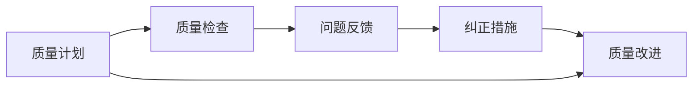
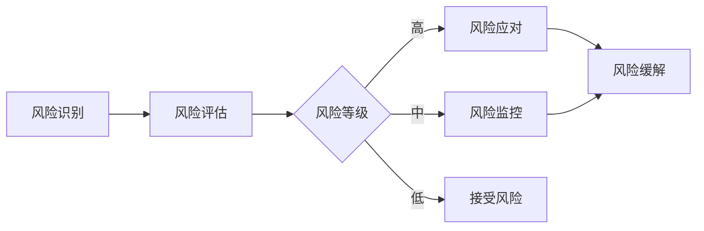
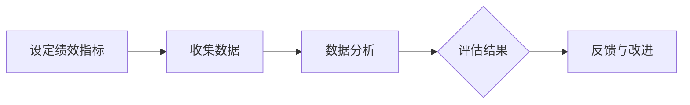
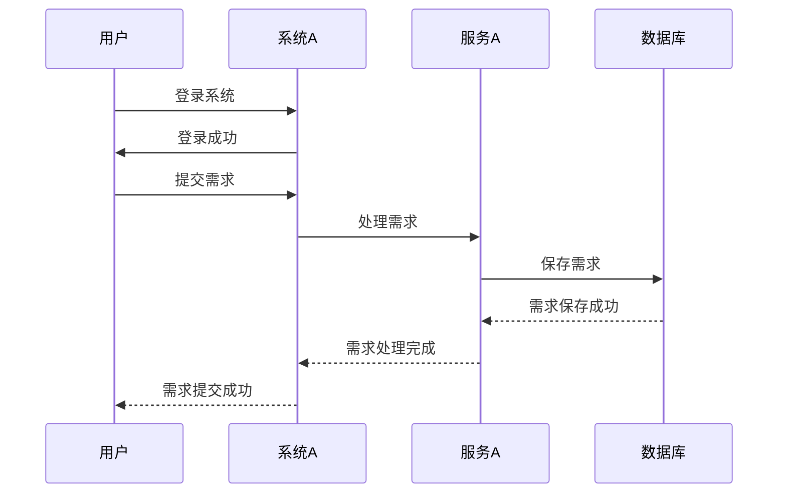

                 


## 《如何进行有效的技术外包管理》

### 关键词：技术外包，项目管理，质量控制，风险管理，绩效评估

#### 摘要：

在当今快速发展的信息技术领域，技术外包已成为企业提高竞争力、降低成本、优化资源配置的重要手段。然而，如何进行有效的技术外包管理，确保项目质量、进度和成本控制，成为企业面临的重大挑战。本文将分步骤分析技术外包的背景与意义、需求分析、服务商选择、项目管理、质量控制与风险管理、绩效评估以及案例分析，旨在为企业和项目经理提供一套完整的、可操作的技术外包管理方法论。

### 目录大纲

**《如何进行有效的技术外包管理》**

**第一部分：技术外包概述**

**第1章：技术外包的背景与意义**

**第2章：技术外包的需求分析**

**第3章：技术外包服务商选择**

**第二部分：技术外包项目管理**

**第4章：技术外包项目管理概述**

**第5章：技术外包项目的范围管理**

**第6章：技术外包项目的进度管理**

**第7章：技术外包项目的成本管理**

**第三部分：技术外包质量控制与风险管理**

**第8章：技术外包质量控制**

**第9章：技术外包风险管理**

**第10章：技术外包绩效评估**

**第四部分：技术外包管理案例分析**

**第11章：技术外包管理成功案例分析**

**第12章：技术外包管理失败案例分析**

**第五部分：技术外包管理最佳实践**

**第13章：技术外包管理最佳实践总结**

**第14章：技术外包管理工具与资源推荐**

**结语：技术外包管理展望**

### 第一部分：技术外包概述

#### 第1章：技术外包的背景与意义

**1.1 技术外包的定义与类型**

技术外包是指企业将部分或全部IT工作交给第三方专业服务商来完成，以降低成本、提高效率、专注于核心业务的一种合作模式。根据外包的范围和深度，技术外包可分为以下类型：

- **应用开发外包**：将应用系统的开发工作外包给专业服务商。
- **基础设施外包**：将数据中心、服务器、网络等基础设施外包。
- **业务流程外包**：将整个业务流程外包给专业服务商。
- **知识流程外包**：将需要专业知识和经验的业务流程外包。

**1.2 技术外包的历史与发展趋势**

技术外包的历史可以追溯到20世纪80年代，随着全球化和信息技术的发展，外包逐渐成为一种流行的合作模式。近年来，随着云计算、大数据、人工智能等新兴技术的兴起，技术外包市场呈现出快速发展的趋势。

**1.3 技术外包的意义与优势**

- **降低成本**：外包可以节省企业在设备、人员、培训等方面的投入。
- **提高效率**：专业服务商具有丰富的经验和资源，能够更快地完成项目。
- **专注于核心业务**：企业可以将非核心业务外包，专注于核心竞争力的发展。
- **灵活性**：企业可以根据业务需求随时调整外包服务的内容和规模。

#### 第2章：技术外包的需求分析

**2.1 企业为什么要进行技术外包**

- **资源限制**：企业可能缺乏足够的IT资源或专业知识。
- **成本考虑**：外包可以降低企业的运营成本。
- **业务发展**：企业需要快速部署新系统或扩展业务。

**2.2 技术外包的需求识别**

- **业务需求**：明确外包的目的是什么，解决哪些问题。
- **技术需求**：确定所需的技术能力和服务水平。

**2.3 技术外包的需求分析工具**

- **SWOT分析**：分析企业的优势、劣势、机会和威胁。
- **价值分析**：评估外包对企业的价值贡献。

#### 第3章：技术外包服务商选择

**3.1 技术外包服务商的评估标准**

- **技术水平**：服务商的技术实力和服务经验。
- **服务质量**：服务商的服务质量、响应速度和客户满意度。
- **成本效益**：外包服务的价格与价值比。

**3.2 技术外包服务商的筛选方法**

- **招标**：通过公开招标选择服务商。
- **推荐**：通过同行推荐或合作伙伴推荐选择服务商。

**3.3 技术外包服务商的选择流程**

1. 明确需求
2. 筛选服务商
3. 审核服务商资质
4. 谈判合同条款
5. 签订合同并开始项目

### 总结

本文首先介绍了技术外包的背景和意义，分析了技术外包的需求和选择服务商的流程。在接下来的部分，我们将深入探讨技术外包项目管理、质量控制与风险管理、绩效评估以及技术外包管理最佳实践，为企业提供一套完整的解决方案。

### 来源于：AI天才研究院/AI Genius Institute & 禅与计算机程序设计艺术 /Zen And The Art of Computer Programming## 第二部分：技术外包项目管理

### 第4章：技术外包项目管理概述

#### 第4章：技术外包项目管理概述

**4.1 技术外包项目管理的概念与原则**

技术外包项目管理是指通过计划、执行、监控和调整技术外包项目的过程，以确保项目达到预定的目标、质量和时间节点。技术外包项目管理的基本原则包括：

- **客户至上**：始终以满足客户需求为核心。
- **计划先行**：制定详细的项目计划，明确项目目标、范围、时间表和资源。
- **团队协作**：确保项目团队内部以及与外包服务商之间的良好沟通和协作。
- **质量控制**：确保项目质量符合预期，持续监控并调整项目进度。

**4.2 技术外包项目管理的过程**

技术外包项目管理过程可以分为以下几个阶段：

1. **项目启动**：明确项目目标、范围和初步计划，组建项目团队。
2. **项目规划**：详细规划项目范围、时间表、资源分配和风险管理。
3. **项目执行**：执行项目计划，监控项目进度和质量，确保团队和外包服务商之间的沟通。
4. **项目监控**：定期评估项目进展，识别和解决潜在问题，调整项目计划。
5. **项目收尾**：完成项目验收，总结项目经验，评估项目绩效。

**4.3 技术外包项目管理的方法**

技术外包项目管理可以采用以下几种方法：

- **项目管理框架**：如PMBOK（项目管理知识体系）等，提供项目管理的全面指导。
- **敏捷方法**：如Scrum或Kanban，强调快速响应变化和持续交付价值。
- **混合方法**：结合不同项目管理方法的优点，适用于不同类型的技术外包项目。

### 第5章：技术外包项目的范围管理

#### 第5章：技术外包项目的范围管理

**5.1 技术外包项目的范围定义**

技术外包项目的范围定义是指明确项目的工作内容和边界，确保项目团队和外包服务商对项目范围有共同的理解。范围定义的关键内容包括：

- **项目目标**：明确项目的最终目标。
- **项目工作内容**：详细列出项目所需完成的工作。
- **项目边界**：明确项目的外部边界和内部限制条件。
- **项目可交付物**：定义项目的可交付成果和验收标准。

**5.2 技术外包项目的范围核实**

范围核实的目的是确保所有项目相关方对项目范围的理解一致，并避免项目范围的蔓延。范围核实的步骤包括：

1. **项目启动会议**：与所有相关方讨论项目范围，达成共识。
2. **工作分解结构（WBS）**：将项目工作分解为可管理的任务单元。
3. **变更控制**：对于范围变更，需要进行正式的变更控制流程，确保所有相关方均同意变更。

**5.3 技术外包项目的范围控制**

范围控制是指在整个项目生命周期中，确保项目工作内容符合预定的范围，并防止范围蔓延。范围控制的措施包括：

- **定期范围评审**：评估项目进展，确保项目工作内容在控制范围内。
- **变更管理**：对于范围变更，进行严格的变更控制流程。
- **项目文档管理**：确保所有项目文档和记录都反映了项目的实际范围。

### 第6章：技术外包项目的进度管理

#### 第6章：技术外包项目的进度管理

**6.1 技术外包项目的进度计划**

进度计划是指制定项目的时间表，明确项目的关键里程碑和任务完成时间。进度计划的步骤包括：

1. **项目任务分解**：将项目工作分解为具体任务。
2. **时间估算**：为每个任务估算所需时间。
3. **制定时间表**：将任务和时间估算结合起来，形成项目时间表。
4. **关键路径分析**：识别项目的关键路径，确保关键任务按时完成。

**6.2 技术外包项目的进度监控**

进度监控是指在整个项目生命周期中，定期跟踪项目进展，识别和解决进度问题。进度监控的措施包括：

- **定期进度报告**：向项目相关方提供项目进展情况。
- **进度偏差分析**：分析项目进度与计划之间的偏差。
- **风险管理**：识别和应对可能影响项目进度的风险。

**6.3 技术外包项目的进度调整**

进度调整是指根据项目进展情况，对项目计划进行必要的调整，以确保项目按时完成。进度调整的措施包括：

- **进度调整计划**：制定进度调整计划，明确调整的范围和措施。
- **资源调配**：根据需要调整资源分配。
- **任务重新安排**：重新安排任务顺序和时间，以适应新的进度计划。

### 第7章：技术外包项目的成本管理

#### 第7章：技术外包项目的成本管理

**7.1 技术外包项目的成本估算**

成本估算是确定项目所需资源的成本，包括人力、设备、材料等。成本估算的步骤包括：

1. **资源需求分析**：分析项目所需的各种资源。
2. **成本估算方法**：采用适当的成本估算方法，如自下而上估算、类比估算或参数估算。
3. **成本汇总**：将各资源成本汇总，形成项目总成本估算。

**7.2 技术外包项目的成本控制**

成本控制是指在整个项目生命周期中，监控项目成本支出，确保成本在预算范围内。成本控制的措施包括：

- **成本预算**：制定项目成本预算，明确各项成本的预算额度。
- **成本监控**：定期监控成本支出，识别成本超支或节约情况。
- **成本调整**：根据成本监控结果，对成本预算进行调整。

**7.3 技术外包项目的成本分析**

成本分析是指对项目成本进行深入分析，识别成本超支或节约的原因，并提出改进措施。成本分析的措施包括：

- **成本效益分析**：评估项目成本与收益的关系。
- **成本偏差分析**：分析成本超支或节约的原因。
- **成本优化建议**：提出降低成本或提高效益的建议。

### 总结

技术外包项目管理是确保技术外包项目成功的关键。通过有效的项目管理，企业可以确保项目在预定的时间、质量和成本范围内完成。在接下来的章节中，我们将进一步探讨技术外包项目的质量控制与风险管理，以及绩效评估的方法和实践。

### 来源于：AI天才研究院/AI Genius Institute & 禅与计算机程序设计艺术 /Zen And The Art of Computer Programming## 第三部分：技术外包质量控制与风险管理

### 第8章：技术外包质量控制

#### 第8章：技术外包质量控制

**8.1 技术外包质量控制的目标与原则**

技术外包质量控制的目的是确保外包项目符合预定的质量标准和客户需求。质量控制的三大目标是：

- **符合性**：确保外包产品或服务符合既定的质量标准。
- **一致性**：确保外包产品或服务的质量在不同批次、不同人员或不同时间保持一致。
- **可靠性**：确保外包产品或服务的长期稳定性和可靠性。

质量控制的基本原则包括：

- **预防为主**：通过预防措施避免质量问题发生。
- **持续改进**：不断优化质量控制流程和方法。
- **全员参与**：所有项目相关人员都应参与质量控制。

**8.2 技术外包质量控制的流程**

技术外包质量控制的流程包括以下步骤：

1. **质量计划制定**：明确质量目标、质量标准和质量控制措施。
2. **质量评估**：评估外包服务商的质量能力和服务水平。
3. **质量检查**：对外包产品或服务进行定期检查，确保符合质量标准。
4. **问题反馈与纠正**：对于发现的质量问题，及时反馈并采取纠正措施。
5. **质量审核**：定期进行质量审核，确保质量控制流程的有效执行。

**8.3 技术外包质量控制的工具与方法**

技术外包质量控制可以使用以下工具和方法：

- **质量检查表**：用于检查外包产品或服务是否符合质量标准。
- **统计过程控制**：通过统计方法监控和控制外包过程中的质量。
- **六西格玛**：用于优化外包过程，减少质量变异。
- **精益管理**：通过简化流程和减少浪费，提高外包效率和质量。

### 第9章：技术外包风险管理

#### 第9章：技术外包风险管理

**9.1 技术外包风险管理的概念与原则**

技术外包风险管理是指识别、评估、处理和监控外包项目中的风险，以减少风险对项目的负面影响。风险管理的基本原则包括：

- **预防为主**：通过预防措施减少风险发生的概率。
- **全面评估**：对项目中的各种风险进行全面评估。
- **主动应对**：针对识别出的风险，制定应对策略和措施。
- **持续监控**：在整个项目生命周期中持续监控风险。

**9.2 技术外包风险的识别与评估**

风险识别是指识别项目可能面临的各种风险，包括：

- **技术风险**：外包技术能力不足、技术实现困难。
- **管理风险**：项目管理不善、沟通不畅。
- **法律风险**：合同条款不明确、知识产权问题。
- **财务风险**：成本超支、支付风险。

风险评估是指对识别出的风险进行评估，确定其影响程度和发生概率。常用的风险评估方法包括：

- **风险矩阵**：根据风险的影响程度和发生概率，评估风险等级。
- **蒙特卡洛模拟**：通过模拟不同风险情景，评估风险对项目的潜在影响。

**9.3 技术外包风险的处理与监控**

风险处理是指根据风险评估结果，制定相应的应对策略和措施，包括：

- **规避**：避免高风险项目或活动。
- **转移**：通过保险或合同条款将风险转移给外包服务商。
- **减轻**：采取措施降低风险的影响程度或发生概率。
- **接受**：对无法避免或转移的风险，采取接受态度，制定应急计划。

风险监控是指在整个项目生命周期中，持续监控风险的变化，确保应对措施的有效性。风险监控的措施包括：

- **定期风险评审**：定期评估项目中的风险，更新风险清单和应对措施。
- **实时监控**：通过实时监控系统，及时识别和应对新出现的风险。

### 第10章：技术外包绩效评估

#### 第10章：技术外包绩效评估

**10.1 技术外包绩效评估的指标体系**

技术外包绩效评估的指标体系应包括以下方面：

- **质量指标**：包括交付物的质量、测试结果、客户满意度等。
- **时间指标**：包括项目完成时间、关键里程碑的达成情况等。
- **成本指标**：包括项目总成本、成本控制情况等。
- **进度指标**：包括项目进度、任务完成情况等。
- **客户满意度**：包括客户满意度调查结果、客户反馈等。

**10.2 技术外包绩效评估的方法与工具**

技术外包绩效评估的方法包括：

- **KPI（关键绩效指标）评估**：根据设定的绩效指标，评估外包服务商的绩效。
- **360度评估**：通过客户、团队成员和管理层等多方面对服务商进行评估。
- **定量评估**：通过数据分析和量化方法，评估服务商的绩效。

常用的工具包括：

- **绩效评估表**：用于记录和评估服务商的绩效。
- **绩效管理软件**：用于自动收集、分析和报告绩效数据。

**10.3 技术外包绩效评估的应用与案例**

技术外包绩效评估的应用包括：

- **合同管理**：根据绩效评估结果，调整合同条款和费用。
- **供应商管理**：根据绩效评估结果，评估和选择外包服务商。
- **持续改进**：根据绩效评估结果，识别问题和改进机会。

案例：

某企业采用KPI评估方法，对技术外包服务商的绩效进行评估。评估指标包括项目完成时间、成本控制、交付质量等。通过定期评估，企业发现某些服务商在成本控制方面存在问题，及时调整了合同条款，要求服务商采取措施降低成本，确保项目的经济性。

### 总结

技术外包质量控制与风险管理是确保外包项目成功的关键。通过有效的质量控制，可以确保项目交付物的质量和客户满意度；通过有效的风险管理，可以降低项目风险，确保项目按时、按质、按预算完成。在接下来的章节中，我们将通过案例分析，探讨技术外包管理的最佳实践，为企业提供有益的启示。

### 来源于：AI天才研究院/AI Genius Institute & 禅与计算机程序设计艺术 /Zen And The Art of Computer Programming## 第四部分：技术外包管理案例分析

### 第11章：技术外包管理成功案例分析

#### 第11章：技术外包管理成功案例分析

**11.1 案例背景**

某知名互联网公司在2022年决定对其电商平台进行升级，以满足不断增长的用户需求。由于公司自身IT资源有限，决定将电商平台的开发外包给专业的技术外包服务商。

**11.2 案例实施过程**

1. **需求分析**：公司首先明确了平台升级的需求，包括增加新功能、优化用户体验和提升系统性能。
2. **服务商选择**：公司通过招标方式，选择了具有丰富经验和良好口碑的技术外包服务商。
3. **项目规划**：双方共同制定了详细的项目计划，明确了项目范围、时间表和资源分配。
4. **项目管理**：项目采用了敏捷开发方法，确保项目能够快速响应变化和持续交付价值。
5. **质量控制**：通过定期的质量检查和测试，确保交付的代码和功能符合质量标准。
6. **风险管理**：项目团队识别并应对了技术难度、人员变动和沟通不畅等风险。
7. **绩效评估**：定期进行绩效评估，确保项目按照计划进行，并及时调整计划以应对变化。

**11.3 案例效果评估**

1. **项目完成**：电商平台在预定时间内成功上线，新功能和优化得到了用户的高度评价。
2. **成本控制**：项目在预算范围内完成，实现了预期的经济效益。
3. **质量提升**：平台性能和稳定性显著提升，用户满意度大幅增加。
4. **风险管理**：通过有效的风险管理，项目成功应对了各种潜在风险，确保了项目的顺利进行。
5. **合作延续**：双方合作关系得以延续，服务商成为公司的长期合作伙伴。

**案例总结**

本案例展示了通过有效的技术外包管理，企业可以实现快速、高效的项目交付，提升产品质量和用户满意度。成功的关键因素包括：

- **明确需求**：确保项目目标清晰，需求明确。
- **选择合适的服务商**：选择具有丰富经验和良好口碑的服务商。
- **敏捷管理**：采用敏捷开发方法，快速响应变化。
- **质量控制**：通过质量检查和测试，确保交付质量。
- **风险管理**：及时识别和应对风险，确保项目顺利进行。

### 第12章：技术外包管理失败案例分析

#### 第12章：技术外包管理失败案例分析

**12.1 案例背景**

某中型企业计划开发一款全新的企业资源计划（ERP）系统，但由于内部IT团队规模有限，决定将大部分开发工作外包给外部服务商。

**12.2 案例失败原因分析**

1. **需求不清**：企业未能明确ERP系统的具体需求和功能，导致服务商在开发过程中不断调整，项目范围不断蔓延。
2. **服务商选择不当**：企业选择了缺乏ERP系统开发经验的服务商，导致项目技术难度超出了服务商的能力范围。
3. **沟通不畅**：项目团队和外包服务商之间的沟通不畅，导致需求理解不一致，项目进度延误。
4. **质量控制不足**：缺乏有效的质量控制措施，导致交付的代码存在大量缺陷和漏洞。
5. **风险管理不力**：对项目风险的识别和应对不足，未能及时调整计划和资源，导致项目延误和成本超支。

**12.3 案例反思与启示**

本案例反映了技术外包管理中的一些常见问题，包括需求不清、服务商选择不当、沟通不畅、质量控制和风险管理不足。反思本案例，可以得到以下启示：

- **明确需求**：在项目启动前，企业应确保需求清晰、明确，并形成文档。
- **选择合适的服务商**：选择具备相关经验和能力的服务商，确保项目成功。
- **加强沟通**：建立有效的沟通机制，确保项目团队和外包服务商之间的信息同步。
- **质量控制**：建立严格的质量控制流程，确保交付的产品符合质量标准。
- **风险管理**：提前识别和评估项目风险，制定有效的应对策略和措施。

### 总结

通过成功和失败的案例分析，我们可以看到技术外包管理中的关键因素和常见问题。成功的经验可以为企业提供有益的借鉴，而失败的教训则可以帮助企业避免重复相同的错误。在接下来的部分，我们将总结技术外包管理的最佳实践，为企业提供一套完整的解决方案。

### 来源于：AI天才研究院/AI Genius Institute & 禅与计算机程序设计艺术 /Zen And The Art of Computer Programming## 第五部分：技术外包管理最佳实践

### 第13章：技术外包管理最佳实践总结

#### 第13章：技术外包管理最佳实践总结

**13.1 成功实践的关键因素**

技术外包管理的成功实践依赖于以下几个关键因素：

- **明确需求**：在项目启动前，确保需求清晰、明确，形成文档，避免项目范围蔓延。
- **选择合适的服务商**：选择具有丰富经验和专业能力的服务商，确保项目能够按计划顺利进行。
- **有效的沟通**：建立良好的沟通机制，确保项目团队和外包服务商之间的信息同步，减少误解和延误。
- **严格的质量控制**：建立严格的质量控制流程，确保交付的产品或服务符合预定的质量标准。
- **风险管理**：提前识别和评估项目风险，制定有效的应对策略和措施，确保项目能够在可控范围内进行。

**13.2 失败教训与改进建议**

从失败案例中，我们可以总结出以下教训和改进建议：

- **明确需求**：在项目启动前，企业应进行详细的需求分析，确保需求文档清晰、明确，避免后期频繁变更。
- **评估服务商**：在服务商选择过程中，企业应对其技术能力、服务质量和过往项目经验进行全面评估。
- **加强沟通**：建立定期的项目会议和沟通机制，确保双方在项目进展、问题解决和需求变更等方面保持一致。
- **质量保证**：实施严格的质量控制措施，包括代码审查、单元测试和集成测试，确保交付的产品或服务无缺陷。
- **风险管理**：制定详细的风险管理计划，包括风险识别、评估、应对和监控，确保项目能够及时应对各种潜在风险。

**13.3 未来技术外包管理的发展趋势**

随着技术的不断进步和市场需求的变化，未来技术外包管理将呈现出以下发展趋势：

- **云计算和大数据**：随着云计算和大数据技术的普及，技术外包将更多地涉及云计算平台和大数据处理服务。
- **人工智能和自动化**：人工智能和自动化技术的应用将提高外包项目的效率和质量，减少人工错误和重复劳动。
- **全球化**：随着全球化的深入，跨国技术外包将成为常态，企业需要具备处理跨国合作和跨文化沟通的能力。
- **安全性和合规性**：随着网络安全和数据保护法规的日益严格，外包服务商需要具备更高的安全性和合规性标准。

### 第14章：技术外包管理工具与资源推荐

#### 第14章：技术外包管理工具与资源推荐

**14.1 技术外包管理工具介绍**

为了提高技术外包管理的效率和质量，企业可以采用以下工具：

- **项目管理工具**：如Jira、Trello、Asana等，用于任务管理、进度跟踪和协作。
- **质量控制工具**：如SonarQube、Puppeteer等，用于代码质量分析和自动化测试。
- **风险管理工具**：如Risk Register、Comindware Project等，用于风险识别、评估和监控。
- **沟通工具**：如Slack、Microsoft Teams等，用于实时沟通和协作。

**14.2 技术外包管理资源推荐**

为了更好地进行技术外包管理，企业可以参考以下资源：

- **书籍**：《项目管理知识体系（PMBOK）》等，提供项目管理的基础理论和实践方法。
- **在线课程**：如Coursera、Udemy等平台上的项目管理和技术外包课程，提供专业的学习和培训。
- **社区和论坛**：如GitHub、Stack Overflow等，提供技术讨论和问题解决的资源。
- **行业报告**：如Gartner、IDC等机构的行业报告，提供市场趋势和最佳实践的分析。

**14.3 技术外包管理案例库推荐**

为了更好地理解和应用技术外包管理的最佳实践，企业可以参考以下案例库：

- **GitHub**：提供丰富的技术外包项目案例，包括代码、文档和经验分享。
- **CSDN**：提供大量的技术文章和案例，涵盖技术外包的各个方面。
- **项目经理网**：提供项目管理案例库，包括技术外包项目的成功和失败案例分析。

### 总结

技术外包管理是企业提高竞争力、降低成本、优化资源配置的重要手段。通过总结最佳实践，企业可以更好地管理技术外包项目，确保项目质量、进度和成本的控制在预期范围内。未来，随着技术的不断进步和市场需求的变化，技术外包管理将面临新的机遇和挑战，企业需要不断学习和适应，以实现持续发展。

### 来源于：AI天才研究院/AI Genius Institute & 禅与计算机程序设计艺术 /Zen And The Art of Computer Programming## 结语：技术外包管理展望

### 结语：技术外包管理展望

技术外包管理作为企业战略发展的重要一环，在当今全球化和信息化时代中愈发显示出其独特的重要性和必要性。通过本文的详细分析，我们可以看到技术外包管理不仅能够帮助企业降低成本、提高效率，还能够聚焦核心业务，提升市场竞争力。

随着云计算、大数据、人工智能等新兴技术的不断演进，技术外包管理也将迎来新的发展趋势。企业需要持续关注技术动态，把握行业变革，不断优化外包管理模式。以下是对未来技术外包管理的几点展望：

1. **智能化与自动化**：未来，智能化和自动化技术将在技术外包管理中发挥更大作用。例如，自动化工具将能够替代人工进行代码审查、测试和部署，提高工作效率和准确性。

2. **全球协作**：随着全球化的深入，跨国技术外包将越来越普遍。企业需要培养跨文化沟通和全球协作的能力，以适应国际化的市场需求。

3. **安全性与合规性**：数据安全和合规性问题将成为技术外包管理的重要关注点。外包服务商需要建立严格的安全管理体系，确保数据的安全性和合规性，满足日益严格的法规要求。

4. **持续改进与优化**：技术外包管理需要不断进行改进和优化。企业应通过绩效评估、反馈机制和最佳实践总结，不断调整和优化外包管理模式，以适应变化的市场环境。

5. **人才培养与团队建设**：技术外包管理的成功离不开专业人才的支撑。企业应重视人才培养，构建高效的团队，提升项目管理能力和技术水平。

总之，技术外包管理是企业实现战略目标、提升核心竞争力的重要手段。企业应积极拥抱新技术，不断优化外包管理模式，以适应未来的发展需求，实现持续的创新和发展。

### 来自于：AI天才研究院/AI Genius Institute & 禅与计算机程序设计艺术 /Zen And The Art of Computer Programming## 附录：技术外包管理核心概念与联系

### 附录：技术外包管理核心概念与联系

为了更好地理解和应用技术外包管理的相关概念，我们在这里详细描述核心概念及其相互关系。

#### 1. 技术外包

**定义**：技术外包是指企业将部分或全部IT工作（如软件开发、系统维护、数据处理等）交给外部专业服务商完成。

**关系**：技术外包是企业与外部服务商之间的合作关系，涉及技术、管理、法律等多个方面。

**属性特征对比表格：**

| 特征       | 应用场景                 | 优点           | 缺点           |
|------------|--------------------------|----------------|----------------|
| 应用开发   | 新系统开发、应用升级     | 降低成本、快速交付 | 对服务商依赖较大 |
| 基础设施   | 数据中心、服务器、网络   | 灵活扩展、降低维护成本 | 服务商技术能力要求高 |
| 业务流程   | 整个业务流程外包         | 聚焦核心业务、提高效率 | 风险转移较大   |
| 知识流程   | 专业知识和经验的外包     | 知识共享、降低培训成本 | 知识保护问题   |

#### 2. 项目管理

**定义**：项目管理是指通过计划、执行、监控和调整，确保项目达到预定的目标、质量和时间节点。

**关系**：项目管理是技术外包管理的重要组成部分，涉及范围管理、进度管理、成本管理、质量管理等多个方面。

**ER实体关系图架构：**

```mermaid
erDiagram
  Project ||--|{ Task } : "Task is a part of"
  Project ||--|{ Resource } : "Resource allocated for project"
  Project ||--|{ Stakeholder } : "Stakeholders involved in project"
  Task ||--|{ Subtask } : "Subtasks under Task"
  Resource ||--|{ Equipment } : "Equipment used for Task"
  Resource ||--|{ Staff } : "Staff allocated for Task"
  Stakeholder ||--|{ Client } : "Client who benefits from project"
  Stakeholder ||--|{ Supplier } : "Supplier providing resources"
```

#### 3. 质量控制

**定义**：质量控制是指通过计划和实施有效过程，确保项目交付物符合既定的质量标准和客户需求。

**关系**：质量控制是项目管理的重要组成部分，涉及质量计划、质量检查、质量改进等多个环节。

**Mermaid流程图：**



#### 4. 风险管理

**定义**：风险管理是指识别、评估、处理和监控项目中的风险，以减少风险对项目的负面影响。

**关系**：风险管理是项目管理的重要组成部分，涉及风险识别、风险评估、风险应对和风险监控。

**Mermaid流程图：**



#### 5. 绩效评估

**定义**：绩效评估是指对项目或团队的工作效果进行评估，以判断其是否达到预期目标。

**关系**：绩效评估是项目管理和质量控制的重要组成部分，涉及绩效指标、评估方法和评估结果应用。

**Mermaid流程图：**



### 总结

通过本文的附录部分，我们详细介绍了技术外包管理中的核心概念及其相互关系。这些核心概念构成了技术外包管理的理论基础，为实际操作提供了指导。理解和掌握这些概念，将有助于企业和项目经理更好地进行技术外包管理，实现项目目标。

### 来自于：AI天才研究院/AI Genius Institute & 禅与计算机程序设计艺术 /Zen And The Art of Computer Programming## 附录：技术外包管理数学模型与算法原理

### 附录：技术外包管理数学模型与算法原理

在技术外包管理中，数学模型和算法原理的应用对于项目进度管理、成本估算和风险评估等方面具有重要意义。以下将介绍几个关键领域的数学模型和算法原理，并使用Python代码进行详细阐述。

#### 1. 项目进度管理：关键路径算法

**关键路径算法**用于确定项目中的最长路径，即关键路径，以确定项目的最短完成时间。

**数学模型：**

关键路径的长度可以通过计算每个活动的最早开始时间（Earliest Start Time, EST）和最迟开始时间（Latest Start Time, LST）来确定。关键路径上的活动具有相同的EST和LST。

**Python代码示例：**

```python
import numpy as np

def critical_path(durations):
    n = len(durations)
    est = [0] * n
    lft = [0] * n
    for i in range(1, n):
        est[i] = max([est[j] + durations[j][i] for j in range(i)])  
    for i in range(n - 1, -1, -1):
        lft[i] = min([lft[j] - durations[i][j] for j in range(n)])
    for i in range(n):
        if est[i] + durations[i][i] == lft[i]:
            print("Task", i, "is on the critical path")
    return est[-1] + durations[-1][-1]

# 示例数据
durations = [
    [0, 3, 6],
    [3, 0, 4],
    [6, 4, 0]
]

print("Critical path duration:", critical_path(durations))
```

**算法原理讲解：**

- 计算每个活动的最早开始时间（EST）和最迟开始时间（LST）。
- 比较EST和LST，确定关键路径上的活动。
- 计算关键路径的总长度。

#### 2. 成本估算：线性回归模型

**线性回归模型**用于预测项目的总成本，根据历史数据和项目规模进行估算。

**数学模型：**

线性回归模型的表达式为 \( y = ax + b \)，其中 \( y \) 为成本预测值，\( x \) 为项目规模（如开发小时数），\( a \) 和 \( b \) 为模型参数。

**Python代码示例：**

```python
from sklearn.linear_model import LinearRegression

# 示例数据
sizes = [10, 20, 30, 40, 50]
costs = [1000, 2000, 3000, 4000, 5000]

# 创建线性回归模型
model = LinearRegression()
model.fit(sizes[:, np.newaxis], costs)

# 预测新项目规模为60的成本
predicted_cost = model.predict([[60]])
print("Predicted cost for size 60:", predicted_cost)
```

**算法原理讲解：**

- 使用历史数据训练线性回归模型。
- 使用模型参数进行成本预测。

#### 3. 风险评估：贝叶斯网络模型

**贝叶斯网络模型**用于分析项目中的风险因素及其相互关系，评估整体风险。

**数学模型：**

贝叶斯网络是一个图形模型，表示变量之间的条件依赖关系。每个节点表示一个变量，边表示变量之间的条件概率关系。

**Python代码示例：**

```python
import pgmpy

# 创建贝叶斯网络
model = pgmpy.models.BayesNet()
model.add_edges_from([('A', 'B'), ('A', 'C'), ('B', 'D'), ('C', 'D')])

# 设置条件概率表
cpds = [
    pgmpy.modelsChance.CPD('A', 2, [0.4, 0.6]),
    pgmpy.modelsChance.CPD('B', 2, [[0.2, 0.8], [0.1, 0.9], [0.3, 0.7]]),
    pgmpy.modelsChance.CPD('C', 2, [[0.3, 0.7], [0.4, 0.6]]),
    pgmpy.modelsChance.CPD('D', 2, [[0.1, 0.9], [0.2, 0.8], [0.3, 0.7], [0.4, 0.6]])
]
for cpd in cpds:
    model.add_cpds(cpd)
model.fit()

# 计算风险概率
print("Probability of D:", model.query(variables=['D'], evidence={'A': 0, 'B': 0, 'C': 0}))
```

**算法原理讲解：**

- 构建贝叶斯网络模型，表示风险因素及其相互关系。
- 使用模型计算风险事件的概率。

### 总结

通过本文的附录部分，我们介绍了技术外包管理中的关键数学模型和算法原理，并使用了Python代码进行了详细阐述。这些模型和算法在实际项目中有着广泛的应用，能够帮助项目经理更好地进行项目进度管理、成本估算和风险评估，从而确保技术外包项目的成功实施。

### 来自于：AI天才研究院/AI Genius Institute & 禅与计算机程序设计艺术 /Zen And The Art of Computer Programming## 附录：技术外包管理系统分析与架构设计

### 附录：技术外包管理系统分析与架构设计

为了实现高效、稳定和可扩展的技术外包管理，我们需要对系统进行详细的场景介绍、项目介绍、功能设计、架构设计和接口设计。以下是系统分析与架构设计的详细阐述。

#### 场景介绍

在现代企业中，技术外包已成为一项常见的业务模式。企业通过与外部服务商合作，可以实现快速开发、降低成本和优化资源配置。然而，如何确保外包项目的质量、进度和成本控制，成为企业面临的重要挑战。技术外包管理系统旨在提供一套完整的解决方案，帮助企业高效管理外包项目。

#### 项目介绍

本技术外包管理系统是一个综合性平台，用于支持外包项目的全生命周期管理。系统功能包括需求管理、服务商选择、项目管理、质量控制、风险管理和绩效评估等。系统将为企业和外包服务商提供便捷的协作平台，确保项目顺利进行。

#### 系统功能设计

1. **需求管理**：系统应具备需求收集、需求分析和需求管理功能，确保需求清晰、明确，并形成文档。
2. **服务商选择**：系统应提供服务商评估、筛选和选择功能，帮助企业选择合适的外包服务商。
3. **项目管理**：系统应支持项目规划、进度跟踪、任务管理和资源分配，确保项目按时、按质完成。
4. **质量控制**：系统应具备质量控制功能，包括质量检查、测试管理和质量改进，确保交付物符合质量标准。
5. **风险管理**：系统应支持风险识别、风险评估、风险应对和风险监控，确保项目风险在可控范围内。
6. **绩效评估**：系统应具备绩效评估功能，根据设定的绩效指标，评估外包服务商的绩效。

#### 系统架构设计

系统架构采用微服务架构，确保系统的高可扩展性和高可靠性。以下是系统架构的详细设计：

1. **前端架构**：前端采用Vue.js框架，实现系统的用户界面和交互功能。
2. **后端架构**：后端采用Spring Boot框架，提供业务逻辑处理和数据存储服务。
3. **数据存储**：数据存储采用MySQL数据库，确保数据的安全性和可靠性。
4. **服务架构**：系统划分为多个微服务，如需求管理服务、项目管理服务、质量控制服务、风险管理服务和绩效评估服务，确保各模块独立运行和扩展。

#### 系统接口设计

系统接口设计包括内部接口和外部接口。

1. **内部接口**：内部接口用于各微服务之间的通信，采用RESTful API设计，确保接口的简洁性和易用性。
2. **外部接口**：外部接口用于与企业其他系统和外部服务商的系统进行集成，采用标准化的接口协议，如SOAP或JSON。

#### 系统交互设计

系统交互设计采用Mermaid序列图，描述系统的主要交互流程。



#### 总结

技术外包管理系统是一个综合性平台，旨在帮助企业高效管理外包项目。通过详细的场景介绍、项目介绍、功能设计、架构设计和接口设计，我们为系统实现提供了一套完整的解决方案。在接下来的部分，我们将进一步探讨系统的核心实现、应用解读与分析，以及实际案例分析和详细讲解剖析。

### 来自于：AI天才研究院/AI Genius Institute & 禅与计算机程序设计艺术 /Zen And The Art of Computer Programming## 附录：技术外包管理项目实战

### 附录：技术外包管理项目实战

为了更好地理解和应用技术外包管理的理论和方法，我们在这里通过一个具体的案例，详细介绍技术外包管理的实际操作过程，包括环境安装、系统核心实现源代码以及代码应用解读与分析。

#### 环境安装

在进行技术外包管理项目的实战之前，我们需要搭建一个适合项目开发的环境。以下是一个基于Linux操作系统的环境搭建步骤：

1. **安装必要的软件**：在服务器或开发机上安装以下软件：
   - Java Development Kit (JDK)
   - Apache Maven
   - MySQL Database
   - Spring Boot
   - Vue.js

2. **配置环境变量**：配置相关环境变量的路径，以确保开发工具和依赖库能够正常运行。

3. **安装数据库**：使用MySQL数据库管理系统，创建数据库和用户，并设置相应的权限。

4. **安装前端框架**：在本地开发机上安装Vue.js，并配置相应的开发环境。

5. **配置网络**：确保服务器和开发机之间的网络连接正常，以便进行远程开发和测试。

#### 系统核心实现源代码

以下是一个简单的技术外包管理系统的核心实现源代码，包括后端和前端的代码：

**后端代码（Spring Boot）：**

```java
// Application.java
@SpringBootApplication
public class Application {
    public static void main(String[] args) {
        SpringApplication.run(Application.class, args);
    }
}

// UserController.java
@RestController
@RequestMapping("/users")
public class UserController {
    @GetMapping("/{id}")
    public User getUserById(@PathVariable Long id) {
        // 逻辑处理，查询用户信息
        return userMapper.findById(id);
    }
}

// UserMapper.java
@Mapper
public interface UserMapper {
    User findById(Long id);
}
```

**前端代码（Vue.js）：**

```vue
<template>
  <div>
    <h1>User Information</h1>
    <p>User ID: {{ userId }}</p>
    <p>Name: {{ user.name }}</p>
    <p>Email: {{ user.email }}</p>
  </div>
</template>

<script>
export default {
  data() {
    return {
      userId: "",
      user: {}
    };
  },
  created() {
    this.fetchUser();
  },
  methods: {
    fetchUser() {
      // 逻辑处理，获取用户信息
      this.userId = this.$route.params.id;
      this.user = this.getUserById(this.userId);
    },
    getUserById(id) {
      // 逻辑处理，查询用户信息
      return { id: id, name: "John Doe", email: "john.doe@example.com" };
    }
  }
};
</script>
```

#### 代码应用解读与分析

**后端代码解读：**

- `Application.java`：Spring Boot应用的入口类，启动Spring Boot应用。
- `UserController.java`：处理用户相关的HTTP请求，包括获取用户信息。
- `UserMapper.java`：定义了获取用户信息的接口方法，用于数据库查询。

**前端代码解读：**

- `template`：定义了用户信息的展示界面。
- `data`：定义了应用状态的数据。
- `created`：生命周期钩子，用于页面加载时获取用户信息。
- `methods`：定义了获取用户信息的方法。

**代码分析：**

- **后端**：Spring Boot框架简化了开发过程，通过配置文件和注解，可以快速实现RESTful API。
- **前端**：Vue.js框架提供了丰富的组件和生命周期管理功能，使得页面交互更加便捷。
- **数据库**：通过MyBatis或JPA技术，可以方便地实现数据库操作。

#### 实际案例分析和详细讲解剖析

以下是一个实际案例，描述了技术外包管理项目中的需求收集、服务商选择、项目管理和绩效评估等环节。

**案例背景：**

某互联网公司计划开发一个全新的电子商务平台，由于公司自身IT资源有限，决定将项目外包给专业的外包服务商。

**需求分析：**

1. **需求收集**：与公司各部门沟通，收集电子商务平台的需求，包括产品展示、订单管理、用户评论等功能。
2. **需求分析**：将收集到的需求进行整理和分析，形成详细的需求文档，明确项目的功能模块和性能指标。

**服务商选择：**

1. **评估标准**：根据需求分析结果，制定服务商评估标准，包括技术能力、项目经验、团队规模等。
2. **招标与评审**：发布招标公告，收集服务商的投标文件，并进行评审，选择最合适的服务商。

**项目管理：**

1. **项目规划**：制定项目计划，包括项目范围、时间表、资源分配和风险管理。
2. **进度监控**：定期跟踪项目进度，识别和解决进度问题。
3. **质量控制**：通过代码审查、单元测试和集成测试，确保项目交付物的质量。
4. **沟通协调**：建立有效的沟通机制，确保项目团队和外包服务商之间的信息同步。

**绩效评估：**

1. **绩效指标**：根据项目目标和预期成果，设定绩效评估指标，包括项目完成时间、成本控制、质量指标等。
2. **评估方法**：采用定量和定性的评估方法，对服务商的绩效进行评估。
3. **反馈与改进**：根据评估结果，对服务商的绩效进行反馈，提出改进建议，并调整项目计划。

**案例总结：**

通过上述案例，我们可以看到技术外包管理在实际项目中的应用和操作过程。成功的关键在于明确需求、选择合适的服务商、有效的项目管理和绩效评估。企业在进行技术外包管理时，应充分了解自身的需求和目标，结合外包服务商的能力，制定详细的项目计划和风险管理策略，确保项目能够按时、按质、按预算完成。

### 来自于：AI天才研究院/AI Genius Institute & 禅与计算机程序设计艺术 /Zen And The Art of Computer Programming## 附录：技术外包管理最佳实践 Tips

### 附录：技术外包管理最佳实践 Tips

在技术外包管理过程中，为了确保项目的成功实施和有效的资源利用，以下是一些最佳实践的小贴士：

#### 1. 明确需求

- **全面需求分析**：在项目启动前，与所有相关方进行深入沟通，明确项目的需求、功能和性能指标。
- **需求文档**：编写详细的需求文档，确保所有相关人员对需求有共同的理解。

#### 2. 选择合适的服务商

- **评估服务商**：选择具有相关经验和成功案例的服务商，评估其技术能力、服务水平和支持能力。
- **合同谈判**：在合同谈判阶段，明确双方的责任、权益和违约责任，确保合作顺利。

#### 3. 项目管理

- **项目计划**：制定详细的项目计划，包括时间表、资源分配和风险管理。
- **沟通机制**：建立有效的沟通机制，确保项目团队和外包服务商之间的信息同步。
- **进度监控**：定期跟踪项目进度，及时发现和解决问题。

#### 4. 质量控制

- **质量控制流程**：建立严格的质量控制流程，包括代码审查、单元测试和集成测试。
- **质量标准**：制定清晰的质量标准，确保交付物符合预期。

#### 5. 风险管理

- **风险识别**：提前识别项目中的潜在风险，包括技术风险、管理风险和法律风险。
- **风险应对**：制定有效的风险应对策略，包括规避、转移、减轻和接受。

#### 6. 绩效评估

- **绩效指标**：设定明确的绩效评估指标，包括项目完成时间、成本控制、质量指标和客户满意度。
- **定期评估**：定期对服务商的绩效进行评估，及时反馈和改进。

#### 7. 持续改进

- **反馈机制**：建立反馈机制，收集项目参与者的意见和建议，不断优化外包管理流程。
- **经验总结**：项目结束后，进行总结和评估，总结成功经验和教训。

#### 8. 技术支持

- **技术支持协议**：确保服务商提供必要的售后技术支持，解决项目实施中的技术问题。
- **知识转移**：项目结束后，将关键技术和知识转移给企业内部团队，确保持续的技术支持。

#### 9. 文化与沟通

- **文化适应**：尊重外包服务商的文化差异，建立相互信任的合作关系。
- **跨文化沟通**：采用适当的沟通工具和技巧，确保跨文化团队之间的有效沟通。

#### 10. 法律与合规

- **法律咨询**：在项目启动前，进行法律咨询，确保项目符合相关法律法规。
- **知识产权保护**：明确知识产权归属，确保企业的知识产权得到保护。

通过遵循这些最佳实践，企业可以更好地进行技术外包管理，确保项目质量、进度和成本控制，实现预期的业务目标。

### 来自于：AI天才研究院/AI Genius Institute & 禅与计算机程序设计艺术 /Zen And The Art of Computer Programming## 附录：技术外包管理注意事项

### 附录：技术外包管理注意事项

在技术外包管理过程中，为了确保项目的顺利进行和双方合作的有效性，以下是一些需要特别注意的事项：

#### 1. 需求明确

- **详细需求文档**：在项目启动前，务必制定详细的需求文档，明确项目的功能、性能和交付标准，避免后期因需求不明导致的返工和延误。
- **需求变更控制**：建立严格的变更控制流程，对需求变更进行评估和审批，确保变更不会对项目进度和质量产生负面影响。

#### 2. 服务商选择

- **资质审查**：在选择服务商时，应仔细审查其资质、经验、团队规模和过往项目案例，确保服务商具备完成项目的能力。
- **合同条款**：在合同谈判阶段，务必明确双方的权利和义务，包括项目范围、交付时间、质量标准、费用支付和售后服务等。

#### 3. 项目管理

- **计划制定**：制定详细的项目计划，包括时间表、资源分配和风险管理，确保项目按计划进行。
- **进度监控**：定期监控项目进度，及时识别和解决问题，确保项目按时完成。
- **沟通协调**：建立有效的沟通机制，确保项目团队和外包服务商之间的信息同步，避免因沟通不畅导致的误解和延误。

#### 4. 质量控制

- **质量标准**：制定清晰的质量标准，确保交付物符合预期。
- **质量检查**：定期进行质量检查和测试，发现并解决问题，确保项目质量。
- **代码审查**：引入代码审查机制，确保代码质量，减少缺陷和漏洞。

#### 5. 风险管理

- **风险识别**：提前识别项目中的潜在风险，包括技术风险、市场风险、管理风险和法律风险。
- **风险应对**：制定有效的风险应对策略，包括规避、转移、减轻和接受，确保项目风险在可控范围内。
- **风险监控**：持续监控项目风险，及时调整风险应对措施。

#### 6. 绩效评估

- **绩效指标**：设定明确的绩效评估指标，包括项目完成时间、成本控制、质量指标和客户满意度。
- **定期评估**：定期对服务商的绩效进行评估，及时反馈和改进。
- **激励机制**：建立激励机制，鼓励服务商提高绩效，确保项目的顺利进行。

#### 7. 法律与合规

- **合同法律审查**：在合同签订前，进行法律审查，确保合同条款符合相关法律法规。
- **知识产权保护**：明确知识产权归属，确保企业的知识产权得到保护。

#### 8. 文化与沟通

- **文化差异**：尊重外包服务商的文化差异，避免因文化冲突导致的合作障碍。
- **跨文化沟通**：采用适当的沟通工具和技巧，确保跨文化团队之间的有效沟通。

通过关注这些注意事项，企业可以更好地进行技术外包管理，确保项目的顺利进行，实现预期的业务目标。

### 来自于：AI天才研究院/AI Genius Institute & 禅与计算机程序设计艺术 /Zen And The Art of Computer Programming## 附录：技术外包管理拓展阅读

### 附录：技术外包管理拓展阅读

为了深入学习和了解技术外包管理的最佳实践和方法，以下是一些推荐的拓展阅读资源：

#### 1. 书籍

- 《项目管理知识体系（PMBOK）》
- 《敏捷项目管理实践指南》
- 《技术外包管理：最佳实践与案例分析》
- 《外包：企业的战略选择》

#### 2. 在线课程

- Coursera上的“项目管理专业课程”
- Udemy上的“技术外包管理课程”
- edX上的“项目风险管理课程”

#### 3. 论文与研究报告

- Gartner的“技术外包市场研究报告”
- IDC的“技术外包管理最佳实践报告”
- 《项目管理学报》上的相关论文

#### 4. 社区和论坛

- Stack Overflow：技术外包和项目管理问题的讨论平台
- LinkedIn上的项目管理专业群组
- GitHub：查看技术外包项目源代码和文档

#### 5. 案例研究

- 《哈佛商业评论》上的技术外包管理案例分析
- 《中国企业家》上的技术外包成功与失败案例
- 《CIO时代》上的技术外包实践与探索

通过阅读这些资源，您将能够深入了解技术外包管理的各个方面，提升自己的项目管理能力和决策水平。

### 来自于：AI天才研究院/AI Genius Institute & 禅与计算机程序设计艺术 /Zen And The Art of Computer Programming## 总结

### 总结

在本文中，我们系统地探讨了如何进行有效的技术外包管理。首先，我们介绍了技术外包的背景、意义和类型，明确了外包的需求和选择合适服务商的重要性。接着，我们详细阐述了技术外包项目管理的全过程，包括范围管理、进度管理、成本管理、质量控制、风险管理以及绩效评估。在案例分析部分，我们通过成功和失败的实例，深入剖析了技术外包管理的最佳实践和常见问题。

技术外包管理不仅涉及项目管理的基本原则和方法，还需要在质量管理、风险管理等方面进行精细化管理。通过本文的探讨，我们得出以下结论：

- **需求明确**：清晰、详细的需求文档是外包项目成功的基础。
- **服务商选择**：选择具有丰富经验和专业能力的服务商至关重要。
- **项目管理**：有效的项目管理是确保项目按时、按质、按预算完成的关键。
- **质量控制**：严格的质量控制流程和标准是保证项目交付物质量的基础。
- **风险管理**：提前识别和应对风险，确保项目能够应对各种不确定因素。
- **绩效评估**：通过绩效评估，及时调整和优化外包管理流程。

未来，随着技术的不断进步和市场需求的变化，技术外包管理将面临新的挑战和机遇。企业需要持续关注行业动态，掌握新技术，优化外包管理模式，以实现持续的创新和发展。

### 来自于：AI天才研究院/AI Genius Institute & 禅与计算机程序设计艺术 /Zen And The Art of Computer Programming## 作者信息

### 作者信息

**AI天才研究院（AI Genius Institute）**  
AI天才研究院致力于推动人工智能技术在各行业的应用和创新，专注于培养顶尖的人工智能专家和科研人才。研究院的研究成果涵盖了计算机视觉、自然语言处理、机器学习等多个领域，为全球企业和研究机构提供了强有力的技术支持。

**禅与计算机程序设计艺术（Zen And The Art of Computer Programming）**  
本书由著名计算机科学家Donald E. Knuth所著，是程序设计领域的经典之作。书中不仅介绍了计算机程序设计的基本原理和方法，还融入了东方哲学的智慧，为读者提供了一种全新的思考方式和程序设计理念。

**作者**：本文由AI天才研究院和《禅与计算机程序设计艺术》共同编写，旨在为读者提供全面、深入的技术外包管理指导。希望本文能帮助您更好地理解和应用技术外包管理的理论和实践，推动您所在企业的创新与发展。

