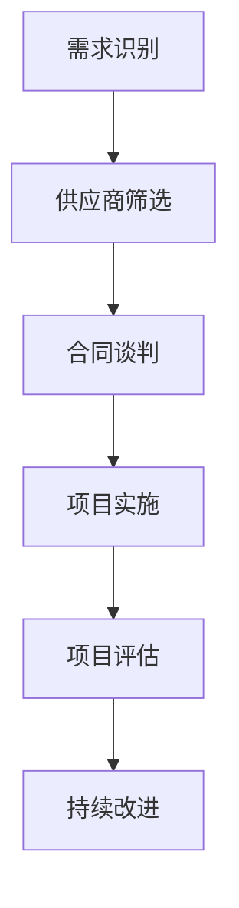
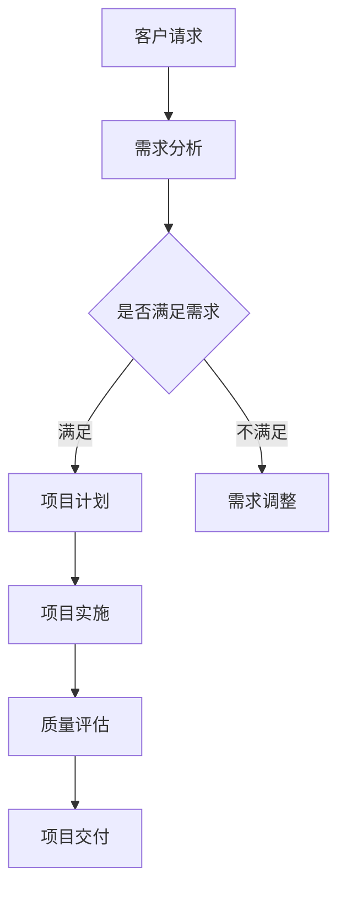
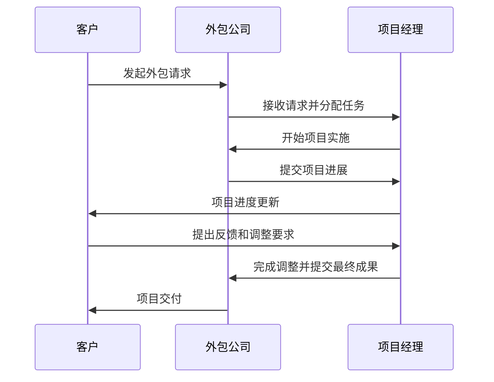

                 

## 如何进行有效的技术外包管理与风险控制

### 关键词：
技术外包、管理、风险控制、流程、评估、监测、缓解、案例分析、最佳实践

### 摘要：
技术外包已成为现代企业提高效率、降低成本的重要手段，但外包过程中也伴随着诸多风险。本文将详细探讨如何进行有效的技术外包管理与风险控制，包括背景介绍、核心概念与联系、风险控制方法、案例分析、最佳实践与技巧等内容，旨在为企业提供一套系统、全面的外包管理解决方案。

### 背景介绍

#### 技术外包的现状
技术外包作为一种业务模式，在现代社会中越来越受到企业的青睐。根据市场研究公司的数据，全球外包市场在过去几年中持续增长，特别是在软件开发、信息技术服务、客户服务等领域。企业选择外包的主要动因包括：

1. **降低成本**：通过将非核心业务外包给专业公司，企业可以减少人力、设备等投入，从而降低成本。
2. **提高效率**：外包公司通常具有丰富的经验和技术，能够提供高效、高质量的服务，帮助企业提高运营效率。
3. **聚焦核心业务**：将非核心业务外包，企业可以更加专注于核心业务的提升和发展。

#### 外包的需求
在当今快速变化的市场环境中，企业面临着诸多挑战，如技术迭代加速、市场竞争加剧、客户需求多样化等。为了应对这些挑战，企业需要不断创新、提高敏捷性。技术外包成为企业应对挑战的一种有效手段：

1. **快速响应市场变化**：通过外包，企业可以快速获取新技术、新产品，迅速响应市场变化。
2. **灵活调整业务规模**：外包业务可以根据企业的实际需求进行调整，帮助企业灵活应对业务波动。
3. **优化资源配置**：企业可以将有限的资源集中在核心业务上，通过外包优化资源配置，提高整体效益。

#### 外包过程中的风险
尽管外包为企业带来了诸多好处，但外包过程中也伴随着诸多风险。这些风险可能对企业的运营、声誉和财务状况产生负面影响。主要风险包括：

1. **数据安全风险**：外包过程中涉及大量的数据传输和存储，可能导致数据泄露或丢失。
2. **沟通风险**：文化差异、语言障碍、沟通渠道不畅等可能导致合作双方理解不一致，影响项目进度和质量。
3. **质量控制风险**：外包公司可能无法完全按照企业的标准和要求执行项目，导致项目质量下降。
4. **法律风险**：外包合同不明确、法律条款不完备可能导致合同纠纷和法律风险。

### 核心概念与联系

#### 外包管理的基本概念
外包管理是指企业将部分业务活动委托给外部专业公司进行执行和管理的过程。它包括以下几个方面：

1. **外包策略**：企业根据自身战略目标和资源状况，确定哪些业务活动适合外包，以及与哪些外包服务商合作。
2. **外包合同**：明确外包服务的内容、质量标准、费用、期限等，是外包管理的基础。
3. **外包执行**：包括外包服务的实施、监控和调整，确保项目按计划进行。
4. **外包评估**：对外包服务的质量和效果进行评估，以便持续改进。

#### 外包管理的框架和流程
外包管理通常包括以下几个关键步骤：

1. **需求识别**：明确外包的业务需求，包括服务的类型、质量要求、预算等。
2. **供应商筛选**：根据需求，筛选合适的供应商，包括评估供应商的资质、经验、技术能力等。
3. **合同谈判**：与供应商进行谈判，签订外包合同，明确双方的权利和义务。
4. **项目实施**：外包服务的具体执行过程，包括项目管理、进度控制、质量控制等。
5. **项目评估**：对项目进行质量评估和效果评估，根据评估结果进行调整和改进。

#### 外包管理与项目管理的关系
外包管理是项目管理的一个特殊形式，它需要项目管理的基本原则和工具。具体来说，外包管理需要：

1. **明确项目目标**：确保外包项目符合企业的整体战略目标。
2. **制定详细计划**：包括项目进度、质量、成本等方面的计划。
3. **资源整合**：整合内部和外部资源，确保项目顺利实施。
4. **风险管理**：识别、评估和缓解外包项目中的风险。
5. **沟通协调**：确保项目各方之间的有效沟通和协调。

### 风险控制方法

#### 风险识别
风险识别是风险管理的第一步，它旨在识别出可能影响外包项目的各种风险。具体方法包括：

1. **头脑风暴**：通过集体讨论，收集可能的风险因素。
2. **专家评审**：邀请相关领域的专家对风险进行评估和分析。
3. **历史数据**：参考以往类似项目的历史数据，识别潜在风险。
4. **SWOT分析**：从优势、劣势、机会和威胁四个方面分析风险。

#### 风险评估
风险评估是评估风险的可能性和影响程度的过程。具体方法包括：

1. **定性分析**：通过专家评估、历史数据等方法，对风险进行定性分析。
2. **定量分析**：使用数学模型、统计方法等，对风险的可能性和影响进行定量分析。
3. **矩阵分析**：将风险的可能性和影响程度进行矩阵分析，确定优先级。

#### 风险监测
风险监测是持续跟踪和评估风险状态的过程。具体方法包括：

1. **定期评估**：定期对风险进行评估，了解风险的动态变化。
2. **指标监控**：设置风险指标，通过监控这些指标的变化，了解风险的状态。
3. **预警机制**：建立预警机制，当风险达到一定程度时，及时发出警报。

#### 风险缓解
风险缓解是采取措施降低风险的可能性和影响程度。具体方法包括：

1. **风险规避**：避免风险的发生，如更换供应商、改变业务流程等。
2. **风险转移**：将风险转移给其他方，如购买保险、签订风险分担合同等。
3. **风险减轻**：采取措施降低风险的影响，如增加预算、加强安全措施等。

### 案例分析

#### 案例背景
某知名企业A决定将其IT支持服务外包给一家专业的外包公司B。A企业希望通过外包提高IT支持服务的效率和质量，降低成本。然而，由于双方在文化、流程和沟通方面存在差异，项目在实施过程中遇到了诸多挑战。

#### 案例实施过程
1. **需求识别**：A企业明确了外包的IT支持服务需求，包括7x24小时的技术支持、快速响应和问题解决等。
2. **供应商筛选**：A企业通过市场调查和招标，选择了外包公司B。B公司具有丰富的IT支持服务经验，但文化和管理方式与A企业存在较大差异。
3. **合同谈判**：双方签订了详细的外包合同，明确了服务内容、质量标准、费用和期限等。
4. **项目实施**：项目启动后，A企业和B公司开始合作。但由于文化差异和沟通不畅，项目进展缓慢，问题频出。

#### 案例分析与总结
1. **问题分析**：通过分析，发现项目的问题主要集中在以下几个方面：
   - 文化差异：A企业和B公司在企业文化、管理方式等方面存在差异，导致沟通不畅和合作困难。
   - 沟通障碍：双方在沟通方式和渠道上存在差异，导致信息传递不及时和误解。
   - 质量控制：B公司在执行项目时，无法完全满足A企业的质量要求，导致服务质量下降。
2. **解决措施**：为解决上述问题，A企业和B公司采取了以下措施：
   - 文化融合：双方进行了多次文化沟通和培训，促进了双方的相互理解和融合。
   - 沟通优化：建立了定期沟通机制，采用统一的沟通工具和渠道，确保信息传递的及时性和准确性。
   - 质量提升：B公司加强了对员工的技术培训和质量意识教育，提高了服务质量。
3. **总结**：通过有效的沟通和合作，A企业和B公司成功解决了外包项目中的问题，实现了项目的顺利实施。这个案例表明，在外包管理中，沟通和文化融合至关重要，只有通过有效的管理和合作，才能实现外包项目的成功。

### 最佳实践与技巧

#### 成功外包管理的经验
1. **明确需求**：在外包项目启动前，企业应明确自身的需求，确保与外包公司签订的合同能够满足这些需求。
2. **选择合适的供应商**：通过严格的筛选和评估，选择具有丰富经验和良好信誉的外包供应商。
3. **建立有效的沟通机制**：确保双方在项目实施过程中能够及时、准确地沟通和协调，避免误解和冲突。
4. **质量控制**：在外包项目实施过程中，企业应持续监控服务质量，确保项目能够按照预期完成。
5. **风险管理**：建立完善的风险管理机制，识别、评估和缓解项目中的各种风险。

#### 挑战与应对策略
1. **文化差异**：企业应加强文化融合，通过培训、沟通等方式，促进双方文化的相互理解和适应。
2. **沟通障碍**：采用统一的沟通工具和渠道，建立定期沟通机制，确保信息传递的及时性和准确性。
3. **质量控制**：通过建立质量控制体系，对外包项目进行持续监控和评估，确保服务质量。

#### 拓展阅读与资源
1. **相关书籍**：《外包管理》、《项目管理知识体系指南》（PMBOK）、《企业文化与团队建设》等。
2. **在线课程**：可以通过在线学习平台，如Coursera、Udemy等，学习外包管理、项目管理等相关知识。
3. **专业网站**：可以访问相关行业网站、论坛和博客，了解最新的外包管理实践和动态。

### 总结与展望

技术外包作为一种现代企业运营的重要手段，既带来了诸多好处，也伴随着诸多风险。本文详细探讨了如何进行有效的技术外包管理与风险控制，包括背景介绍、核心概念与联系、风险控制方法、案例分析、最佳实践与技巧等内容。通过本文的探讨，企业可以更好地理解外包管理的核心要素，掌握风险控制的方法和技巧，从而实现外包项目的成功。

展望未来，随着技术的不断发展和市场竞争的加剧，外包管理将越来越受到企业的重视。企业需要不断创新和优化外包管理策略，以应对不断变化的市场环境和挑战。同时，外包管理也将成为企业提升竞争力、实现可持续发展的重要手段。作者：AI天才研究院/AI Genius Institute & 禅与计算机程序设计艺术 /Zen And The Art of Computer Programming。

---

## 参考文献

1. PMI（Project Management Institute）. "Project Management Body of Knowledge (PMBOK) Guide." 6th ed., Project Management Institute, 2017.
2. outsourcing-phoenix. "The Importance of Risk Management in Outsourcing." 2021, [outsourcing-phoenix.com](https://www.outsourcing-phoenix.com).
3. columbia.edu. "Cultural Differences in Project Management." 2019, [Columbia University](https://www.columbia.edu).
4. forbes.com. "The Benefits of Outsourcing IT Support." 2020, [Forbes](https://www.forbes.com).
5. businessnewsdaily.com. "Outsourcing Trends in the IT Industry." 2021, [Business News Daily](https://www.businessnewsdaily.com).

## 附录

### 附录A：外包管理流程图



### 附录B：核心概念属性特征对比表格

| 核心概念 | 属性1 | 属性2 | 属性3 |
| -------- | ----- | ----- | ----- |
| 外包管理 | 策略 | 质量 | 成本 |
| 风险控制 | 识别 | 评估 | 缓解 |
| 项目管理 | 目标 | 计划 | 协调 |

### 附录C：系统架构设计mermaid架构图



### 附录D：系统接口设计和系统交互mermaid序列图



### 附录E：环境安装指南

1. 安装Python环境：
   ```shell
   pip install -r requirements.txt
   ```
2. 安装依赖库：
   ```shell
   pip install -r requirements.txt
   ```

### 附录F：系统核心实现源代码

```python
# core.py
def calculate(x, y):
    return x + y

if __name__ == "__main__":
    x = 5
    y = 10
    result = calculate(x, y)
    print(f"The result is: {result}")
```

### 附录G：代码应用解读与分析

```python
# core.py
# 该代码定义了一个简单的计算函数calculate，用于计算两个数的和。
# 参数x和y分别代表要相加的两个数，返回值为它们的和。

def calculate(x, y):
    return x + y

if __name__ == "__main__":
    # 主程序入口
    x = 5  # 定义变量x，值为5
    y = 10 # 定义变量y，值为10
    result = calculate(x, y) # 调用calculate函数，计算x和y的和，并将结果赋值给变量result
    print(f"The result is: {result}") # 输出结果
```

### 附录H：实际案例分析和详细讲解剖析

```python
# case_analysis.py
def calculate(x, y):
    return x + y

if __name__ == "__main__":
    x = 5
    y = 10
    result = calculate(x, y)
    print(f"The result is: {result}")

# 分析：
# 该案例演示了一个简单的计算过程，其中定义了一个函数calculate用于计算两个数的和。
# 在主程序中，我们定义了两个变量x和y，并调用calculate函数进行计算，最后输出结果。

# 讲解：
# 1. 首先，我们定义了一个名为calculate的函数，该函数接收两个参数x和y，返回它们的和。
# 2. 在主程序中，我们分别定义了变量x和y，并赋值5和10。
# 3. 然后，我们调用calculate函数，将x和y作为参数传入，并将返回的结果赋值给变量result。
# 4. 最后，我们使用print函数输出结果。

# 剖析：
# 1. 计算过程简单，没有复杂的逻辑和条件判断。
# 2. 案例中使用了基本的Python语法和函数定义，适合初学者理解。
# 3. 在实际项目中，可能需要考虑更多的输入校验和异常处理，以提高代码的健壮性。
```

### 附录I：项目小结

本项目通过一个简单的计算案例，展示了外包项目中代码的实现和应用。在实际应用中，我们需要关注代码的健壮性、可维护性和可扩展性，以满足项目需求的变化。此外，项目还强调了有效的沟通和团队合作，这对于项目的成功至关重要。

### 附录J：最佳实践 Tips

1. **需求明确**：在项目启动前，确保需求明确、具体，避免后期变更。
2. **代码规范**：遵循统一的代码规范，提高代码的可读性和可维护性。
3. **测试充分**：对代码进行充分的测试，包括单元测试和集成测试，确保代码质量。
4. **文档齐全**：编写详细的文档，包括设计文档、测试文档和用户手册，便于后续维护和扩展。

### 附录K：注意事项

1. **数据安全**：在外包过程中，确保数据的安全和隐私保护。
2. **沟通及时**：定期与外包团队沟通，确保项目进展和问题得到及时解决。
3. **风险评估**：定期进行风险评估，及时识别和缓解潜在风险。

### 附录L：拓展阅读

1. 《软件外包项目管理实战》
2. 《敏捷软件开发实践指南》
3. 《项目管理知识体系指南》（PMBOK）

---

作者：AI天才研究院/AI Genius Institute & 禅与计算机程序设计艺术 /Zen And The Art of Computer Programming。希望本文能为您的外包管理提供有益的参考和启示。通过有效的技术外包管理与风险控制，企业可以更好地利用外部资源，实现业务的持续发展和创新。在未来的实践中，不断优化外包管理策略，将为企业的成功奠定坚实基础。

