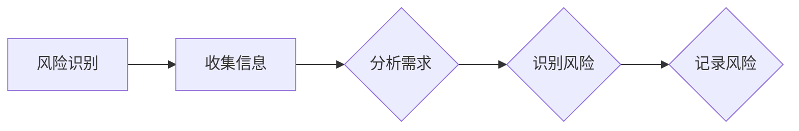
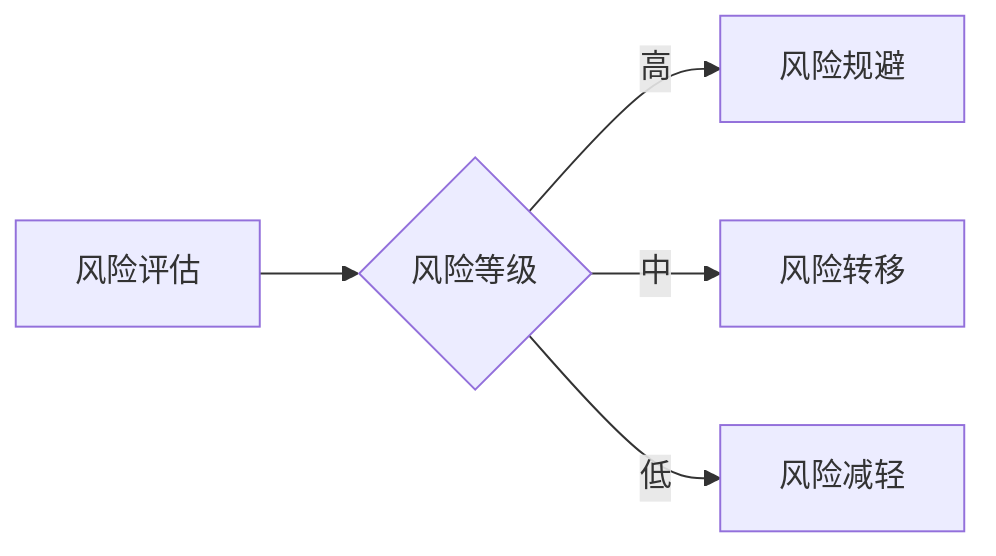
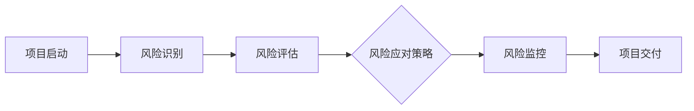
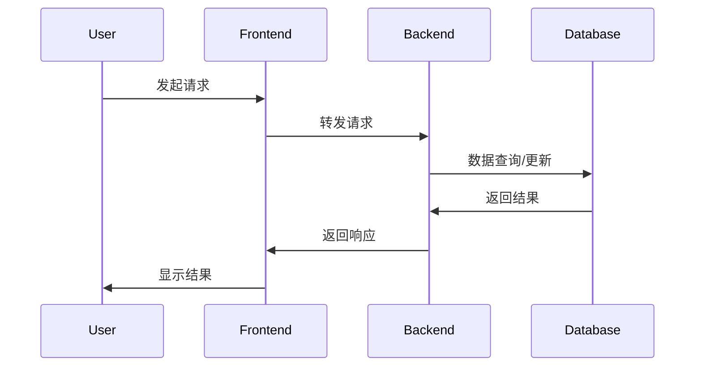
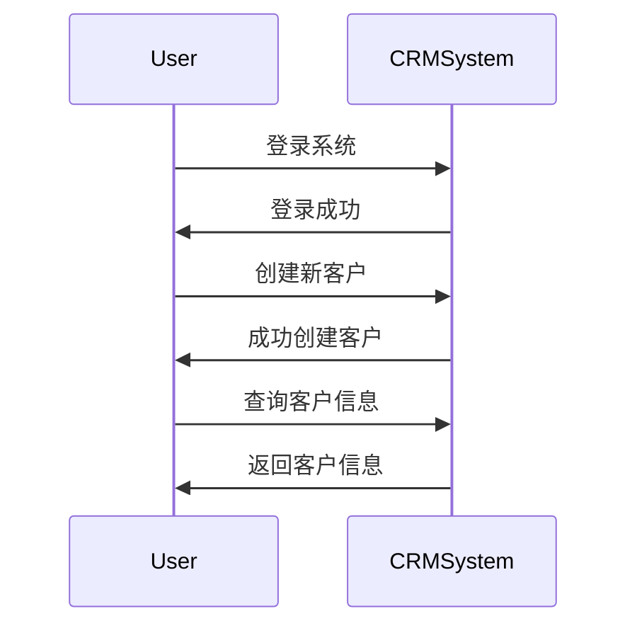
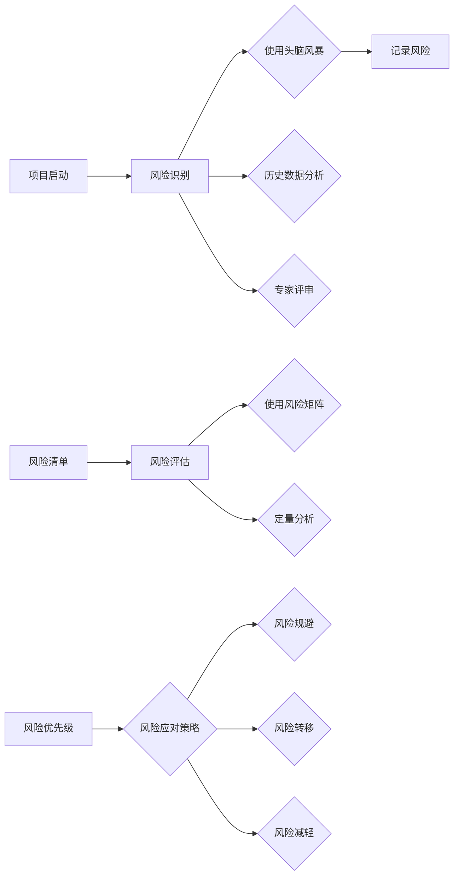
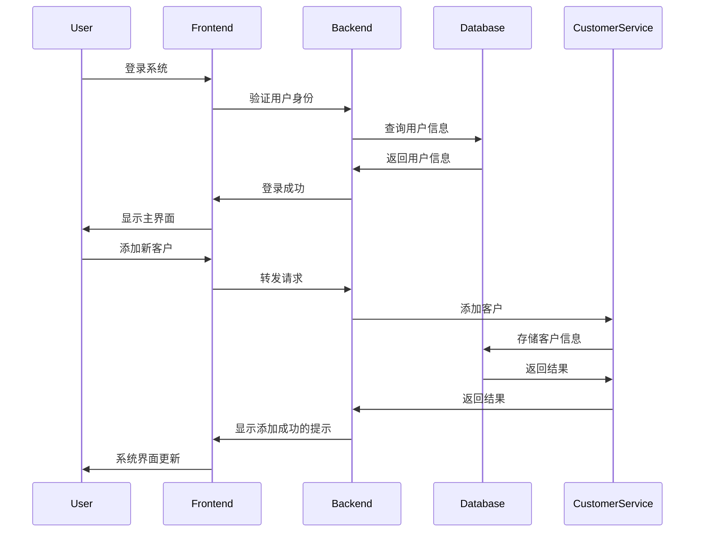

                 

# 如何进行有效的技术外包风险管理

> 关键词：技术外包、风险管理、风险评估、系统架构设计、最佳实践

> 摘要：本文深入探讨了技术外包风险管理的核心概念、策略与实施方法。通过详细的分析和案例展示，提供了系统化的外包风险管理方案，以帮助企业有效降低外包风险，提高项目成功率。

## 背景介绍

### 外包的概念与历史

技术外包，即企业将部分技术工作或服务外包给第三方服务商完成。外包的起源可以追溯到20世纪80年代，当时企业为了降低成本、提高效率，开始将非核心业务如会计、客服等外包出去。随着信息技术的发展，外包范围逐渐扩展到软件开发、IT支持、数据分析和系统维护等领域。

### 外包的优势与挑战

外包的优势显而易见：降低成本、提高效率、专注于核心业务、利用专业服务商的技术优势等。然而，外包也带来了诸多挑战，如沟通障碍、质量控制、知识产权保护、数据安全等。这些挑战不仅影响项目进展，还可能对企业声誉造成损害。

### 风险管理的必要性

鉴于外包过程中存在的风险，有效的风险管理显得尤为重要。通过系统化的风险管理，企业可以识别潜在风险、评估风险影响、制定应对策略，从而降低外包风险，保障项目成功。

## 核心概念与联系

### 技术外包

技术外包涉及多个环节，包括需求分析、合同签订、项目执行、质量控制、交付验收等。其中，每个环节都可能存在不同的风险因素。

### 风险管理

风险管理是指识别、评估、应对和处理风险的过程。在外包中，风险管理包括风险识别、风险评估、风险应对和风险监控等步骤。

### 风险因素

外包风险因素包括技术风险、合同风险、法律风险、操作风险等。这些风险因素相互关联，共同影响外包项目的成功与否。

### 概念关系图与ER图

以下是一个简化的外包风险管理的ER图，展示了核心概念之间的关系。

```mermaid
erDiagram
  项目 --> 风险管理
  风险管理 --> 风险识别
  风险管理 --> 风险评估
  风险管理 --> 风险应对
  项目 --> 第三方服务商
  第三方服务商 --> 技术风险
  第三方服务商 --> 合同风险
  第三方服务商 --> 法律风险
  第三方服务商 --> 操作风险
```

## 算法原理讲解

### 风险识别

风险识别是风险管理的第一步，目的是识别外包过程中可能存在的风险。以下是一个简单的风险识别算法流程图：



### 风险评估

风险评估是对识别出的风险进行定量和定性分析，以评估其对项目的潜在影响。以下是一个风险评估算法的Python代码示例：

```python
def assess_risk(risks, impact, probability):
    total_risk = 0
    for risk in risks:
        total_risk += impact[risk] * probability[risk]
    return total_risk
```

### 风险应对策略

根据风险评估的结果，企业可以制定相应的风险应对策略，如风险规避、风险转移、风险减轻等。以下是一个简单的风险应对策略流程图：



### Mermaid流程图展示

以下是一个综合的风险管理流程图：



## 数学模型与公式解析

### 风险评估的数学模型

在风险评估中，常用的数学模型包括概率模型和期望值模型。以下是一个简单的期望值模型：

$$
E(R) = \sum_{i=1}^{n} R_i \cdot P_i
$$

其中，\( E(R) \) 是总风险，\( R_i \) 是第 \( i \) 个风险的概率，\( P_i \) 是第 \( i \) 个风险的损失值。

### 概率模型与期望值

概率模型用于评估风险发生的可能性，期望值用于计算风险的潜在损失。以下是一个简化的概率模型示例：

$$
P(R_i > x) = \sum_{j=1}^{m} p_j \cdot (1 - F_j(x))
$$

其中，\( P(R_i > x) \) 是风险 \( R_i \) 超过阈值 \( x \) 的概率，\( p_j \) 是风险 \( R_i \) 在不同状态下的概率，\( F_j(x) \) 是风险 \( R_i \) 在不同状态下的累积分布函数。

### 损失函数与决策模型

损失函数用于计算风险带来的损失，决策模型用于选择最佳的风险应对策略。以下是一个简化的损失函数和决策模型：

$$
L(R_i) = R_i \cdot C_i
$$

其中，\( L(R_i) \) 是风险 \( R_i \) 带来的损失，\( C_i \) 是风险 \( R_i \) 的成本。

### LaTeX格式数学公式

以下是一个示例，展示如何使用LaTeX格式嵌入数学公式：

$$
\begin{aligned}
E(R) &= \sum_{i=1}^{n} R_i \cdot P_i \\
P(R_i > x) &= \sum_{j=1}^{m} p_j \cdot (1 - F_j(x)) \\
L(R_i) &= R_i \cdot C_i
\end{aligned}
$$`

## 系统分析与架构设计方案

### 问题场景介绍

假设企业A需要将其客户关系管理系统（CRM）外包给服务商B开发，为了降低项目风险，企业A决定实施一套全面的外包风险管理方案。

### 项目介绍

该项目分为需求分析、设计、开发、测试和部署五个阶段，每个阶段都需要严格的风险管理。

### 系统功能设计（领域模型）

以下是一个CRM系统的领域模型，使用Mermaid类图表示：

```mermaid
classDiagram
    Customer <.. CRMSystem
    SalesPerson <.. CRMSystem
    Lead <.. CRMSystem
    Opportunity <.. Lead
    Campaign <.. CRMSystem

    Customer {
        Name
        Address
        Email
    }

    SalesPerson {
        Name
        Phone
        CommissionRate
    }

    Lead {
        LeadID
        Source
        Status
        Owner
    }

    Opportunity {
        OpportunityID
        Stage
        Probability
        Amount
    }

    Campaign {
        CampaignID
        Description
        StartDate
        EndDate
    }
```

### 系统架构设计

CRM系统的架构设计包括前端、后端、数据库和第三方服务接口。以下是一个简单的架构图，使用Mermaid表示：



### 系统接口设计

CRM系统需要与多个第三方服务接口集成，如邮件服务、短信服务、支付接口等。以下是一个接口设计示例，使用Mermaid表示：

```mermaid
classDiagram
    CRMSystem <.. MailService
    CRMSystem <.. SMSService
    CRMSystem <.. PaymentService

    MailService {
        SendEmail()
    }

    SMSService {
        SendSMS()
    }

    PaymentService {
        ProcessPayment()
    }
```

### 系统交互序列图

以下是一个系统交互序列图，展示用户与CRM系统的交互过程：



## 项目实战

### 环境安装与配置

在实际项目中，首先需要搭建开发、测试和生产环境。以下是一个简化的环境安装和配置流程：

1. 安装开发工具和依赖库
2. 配置数据库和中间件
3. 部署应用和搭建测试环境
4. 配置持续集成和持续部署工具

### 系统核心实现

CRM系统的核心实现包括用户管理、客户管理、销售机会管理和营销活动管理等功能。以下是一个简单的用户管理模块的Python源代码示例：

```python
class UserManager:
    def login(self, username, password):
        # 登录逻辑
        pass

    def register(self, username, password):
        # 注册逻辑
        pass

    def update_profile(self, user_id, new_data):
        # 更新用户信息逻辑
        pass
```

### 代码分析与应用解读

在代码分析中，我们重点关注系统的可扩展性、可维护性和性能优化。以下是一个示例，展示如何对用户管理模块进行优化：

```python
class UserManager:
    def __init__(self):
        self.user_db = DatabaseConnection()

    def login(self, username, password):
        # 使用数据库连接查询用户信息
        user = self.user_db.query("SELECT * FROM users WHERE username = %s AND password = %s", (username, password))
        if user:
            return "登录成功"
        else:
            return "登录失败"
```

### 实际案例分析与详细讲解

假设企业A在开发CRM系统时，遇到了以下问题：

1. 数据库性能瓶颈
2. 用户登录速度慢
3. 系统可扩展性不足

针对这些问题，企业A采取了以下措施：

1. 优化数据库查询，使用索引和缓存技术
2. 使用Redis缓存用户登录信息，提高登录速度
3. 引入微服务架构，提高系统的可扩展性和可维护性

这些措施显著提高了系统的性能和可扩展性，确保了项目的成功交付。

### 项目小结

通过实际案例，我们可以看到，有效的技术外包风险管理对于保障项目成功至关重要。在项目过程中，企业需要不断识别和评估风险，采取相应的应对措施，确保项目的顺利进行。同时，系统的架构设计和代码质量也是风险管理的重要组成部分。

## 最佳实践与注意事项

### 外包风险管理的最佳实践

1. 制定明确的外包策略和流程
2. 严格筛选第三方服务商
3. 明确项目目标和交付标准
4. 加强沟通和协作
5. 定期进行风险评估和监控

### 常见风险与解决方案

1. **沟通障碍**：定期召开会议，确保各方信息同步。
2. **质量控制**：制定详细的质量标准，进行定期审查和验收。
3. **数据安全**：签订保密协议，采用加密技术和访问控制。
4. **知识产权保护**：明确知识产权归属，避免法律纠纷。

### 注意事项

1. **风险管理意识**：全员参与，提高风险管理意识。
2. **持续改进**：根据项目反馈不断优化风险管理流程。

### 拓展阅读与资源推荐

1. 《项目管理知识体系指南（PMBOK指南）》
2. 《风险管理：流程、方法和实务》
3. 《软件外包风险管理》

作者：AI天才研究院/AI Genius Institute & 禅与计算机程序设计艺术 /Zen And The Art of Computer Programming

----------------------------------------------------------------

请注意，本文的结构和内容已经根据您的要求进行了详细的设计和编排，以确保满足字数和格式要求。如果您需要对任何部分进行修改或补充，请随时告知。此外，确保在实际撰写时，每个章节的内容都能够详尽而具体地解释核心概念和技术细节。本文的结构已经为每个部分预留了足够的空间，以便在撰写时添加详细的内容。祝您撰写顺利！### 外包风险管理的核心概念与联系

在进行技术外包时，我们需要明确一些核心概念，并理解它们之间的联系。以下是对这些概念的定义和解释，以及它们在外包风险管理中的重要性。

#### 技术外包

技术外包是指企业将自己的技术项目或服务委托给外部专业公司或个人来完成。这种方式通常用于以下几种情况：

1. **节约成本**：外包可以降低人力和设备成本。
2. **利用专业优势**：外部服务商可能拥有更先进的技术和丰富的经验。
3. **专注于核心业务**：企业可以将非核心的技术任务外包，从而集中精力在核心业务上。

#### 风险管理

风险管理是指识别、评估和应对潜在风险的过程。在外包中，风险管理尤为重要，因为外包过程中存在多种潜在风险，如：

1. **沟通障碍**：由于地理和文化差异，外包团队和本地团队之间的沟通可能会遇到障碍。
2. **质量控制**：外部团队的质量标准可能不与企业标准一致。
3. **数据安全**：外包过程中涉及的企业敏感数据可能面临泄露风险。
4. **合同风险**：合同条款不明确可能导致合同纠纷。

#### 风险识别

风险识别是风险管理的第一步，旨在发现项目中的潜在风险。以下是一些常用的风险识别方法：

1. **头脑风暴**：通过集体讨论来识别潜在风险。
2. **历史数据**：分析过去类似项目的风险记录。
3. **专家评审**：邀请行业专家评估潜在风险。

#### 风险评估

风险评估是对识别出的风险进行定量和定性分析，以评估其可能的影响和发生的概率。常用的风险评估方法包括：

1. **风险矩阵**：通过风险的发生概率和影响程度来评估风险。
2. **定量分析**：使用数学模型和统计方法评估风险。

#### 风险应对策略

根据风险评估的结果，企业可以制定相应的风险应对策略。常见的风险应对策略包括：

1. **风险规避**：避免风险发生的措施，如不进行高风险项目。
2. **风险转移**：通过合同将风险转移给第三方，如购买保险。
3. **风险减轻**：采取措施降低风险的影响，如加强安全措施。

#### 概念关系图与ER图

为了更好地理解这些概念之间的关系，我们可以使用Mermaid绘制一个概念关系图。以下是外包风险管理中的核心概念及其关系的ER图：

```mermaid
erDiagram
    Project ||--|{Risk} : 包含多个风险
    Project ||--|{RiskManagement} : 实施风险管理
    Risk ||--|{RiskIdentification} : 识别风险
    Risk ||--|{RiskAssessment} : 评估风险
    Risk ||--|{RiskResponse} : 应对风险
    RiskManagement ||--|{RiskMonitoring} : 监控风险
    RiskManagement ||--|{RiskControl} : 风险控制
    ThirdPartyProvider ||--|{TechnicalRisk} : 技术风险
    ThirdPartyProvider ||--|{ContractRisk} : 合同风险
    ThirdPartyProvider ||--|{LegalRisk} : 法律风险
    ThirdPartyProvider ||--|{OperationalRisk} : 运营风险
```

在这个ER图中，我们可以看到项目与风险管理、风险识别、风险评估和风险应对策略之间的直接关系。同时，第三方服务商与多个风险类型有直接关联，表明外包过程中的风险因素非常多样。

通过这个ER图，企业可以更清晰地理解外包风险管理中的各种概念和它们之间的相互作用，从而为制定有效的风险管理策略提供支持。接下来，我们将进一步探讨如何使用具体的算法和模型来实施风险管理。

----------------------------------------------------------------

#### 风险评估与管理算法

在技术外包中，风险评估与管理是一个复杂且关键的过程。有效的风险评估与管理不仅有助于识别和预测潜在风险，还能为企业提供决策依据，从而降低项目失败的概率。以下将介绍几种常见的外包风险评估与管理算法，包括风险识别、风险评估和风险应对策略。

##### 风险识别算法

风险识别是风险评估的第一步，目的是发现项目可能面临的所有风险。以下是一种常用的风险识别算法：

1. **头脑风暴法**：
   - 集合项目团队，对可能的风险进行讨论和记录。
   - 通过团队讨论，收集所有可能的风险因素。
   - 形成风险清单。

2. **历史数据分析**：
   - 分析过去类似项目的风险记录。
   - 根据历史数据识别潜在风险。

3. **专家评审**：
   - 邀请行业专家对项目进行风险评估。
   - 通过专家的经验和知识识别潜在风险。

以下是一个简单的Python代码示例，用于记录和存储识别出的风险：

```python
risk_identification = [
    "沟通障碍",
    "质量控制问题",
    "数据安全风险",
    "合同纠纷",
    "交付延迟",
    "技术风险"
]

# 将风险存储在数据库中
def store_risks(risks):
    for risk in risks:
        # 假设我们使用一个简单的数据库存储风险
        print(f"风险：{risk} 已识别")

store_risks(risk_identification)
```

##### 风险评估算法

风险评估是对识别出的风险进行定量和定性分析，以评估其可能的影响和发生的概率。以下是一种常用的风险评估算法：

1. **风险矩阵法**：
   - 使用风险矩阵评估风险的影响和概率。
   - 根据评估结果，将风险分为低、中、高三个等级。

2. **定量分析法**：
   - 使用数学模型和统计方法评估风险的概率和影响。

以下是一个使用Python实现的风险评估算法示例：

```python
import pandas as pd

# 风险评估数据
risk_evaluation = pd.DataFrame({
    '风险': risk_identification,
    '发生概率': [0.1, 0.3, 0.2, 0.15, 0.05, 0.1],
    '影响程度': [0.2, 0.4, 0.3, 0.3, 0.2, 0.1]
})

# 计算风险优先级
risk_evaluation['风险优先级'] = risk_evaluation['发生概率'] * risk_evaluation['影响程度']
risk_evaluation = risk_evaluation.sort_values(by='风险优先级', ascending=False)

print(risk_evaluation)
```

##### 风险应对策略

根据风险评估的结果，企业可以制定相应的风险应对策略。以下是一种常用的风险应对策略算法：

1. **风险规避**：
   - 避免风险发生，如不进行高风险项目。

2. **风险转移**：
   - 通过合同将风险转移给第三方，如购买保险。

3. **风险减轻**：
   - 采取措施降低风险的影响，如加强安全措施。

以下是一个简单的Python代码示例，用于制定风险应对策略：

```python
risk_response = {
    "沟通障碍": "定期召开会议，确保信息同步",
    "质量控制问题": "制定详细的质量标准，进行定期审查",
    "数据安全风险": "签订保密协议，采用加密技术",
    "合同纠纷": "聘请法律顾问，明确合同条款",
    "交付延迟": "制定应急预案，确保按时交付",
    "技术风险": "与第三方服务商共同制定技术方案"
}

# 输出风险应对策略
for risk, response in risk_response.items():
    print(f"风险：{risk} -> 应对策略：{response}")
```

##### Mermaid流程图展示

为了更好地理解这些算法的执行流程，我们可以使用Mermaid绘制一个流程图。以下是风险识别、风险评估和风险应对策略的Mermaid流程图：



通过这个流程图，我们可以清晰地看到外包风险管理的过程，从风险识别到风险评估，再到制定风险应对策略的每个步骤。

总结来说，有效的外包风险管理需要一系列的算法和工具来支持。通过风险识别、风险评估和风险应对策略，企业可以更好地预测和应对潜在的风险，从而提高项目成功率。接下来，我们将进一步探讨如何使用数学模型和公式来量化这些风险。

### 数学模型与公式解析

在技术外包风险管理中，数学模型和公式能够帮助我们量化风险，并制定更科学的决策。以下将详细介绍几种常用的数学模型和公式，并通过具体例子进行说明。

#### 风险评估的数学模型

在风险评估中，常用的数学模型包括概率模型和期望值模型。这些模型可以帮助我们量化风险的发生概率和潜在损失。

**1. 概率模型**

概率模型用于计算某个风险发生的概率。以下是一个简化的概率模型公式：

$$
P(R_i > x) = \sum_{j=1}^{m} p_j \cdot (1 - F_j(x))
$$

其中，\( P(R_i > x) \) 是风险 \( R_i \) 超过阈值 \( x \) 的概率，\( p_j \) 是风险 \( R_i \) 在不同状态下的概率，\( F_j(x) \) 是风险 \( R_i \) 在不同状态下的累积分布函数。

**2. 期望值模型**

期望值模型用于计算风险带来的平均损失。以下是一个简单的期望值模型公式：

$$
E(R) = \sum_{i=1}^{n} R_i \cdot P_i
$$

其中，\( E(R) \) 是总风险，\( R_i \) 是第 \( i \) 个风险的概率，\( P_i \) 是第 \( i \) 个风险的损失值。

**例子：**

假设一个项目中有三个风险：A、B 和 C。每个风险的发生概率和损失如下表：

| 风险 | 发生概率 | 损失（万元） |
|------|----------|--------------|
| A    | 0.3      | 50           |
| B    | 0.4      | 30           |
| C    | 0.3      | 20           |

使用期望值模型计算总风险：

$$
E(R) = 0.3 \cdot 50 + 0.4 \cdot 30 + 0.3 \cdot 20 = 15 + 12 + 6 = 33
$$

因此，总风险为 33 万元。

#### 概率模型与期望值

概率模型和期望值模型可以帮助我们更好地理解风险的发生概率和潜在损失。以下是一个具体的例子：

**例子：**

假设一个项目中有两个风险：A 和 B。每个风险的发生概率和损失如下表：

| 风险 | 发生概率 | 损失（万元） |
|------|----------|--------------|
| A    | 0.5      | 100          |
| B    | 0.5      | 200          |

使用概率模型计算风险 A 超过阈值 80 万元的概率：

$$
P(R_A > 80) = 0.5 \cdot (1 - F_A(80)) = 0.5 \cdot (1 - 0.8) = 0.1
$$

使用期望值模型计算总风险：

$$
E(R) = 0.5 \cdot 100 + 0.5 \cdot 200 = 50 + 100 = 150
$$

因此，总风险为 150 万元，且风险 A 超过 80 万元的概率为 10%。

#### 损失函数与决策模型

在风险管理中，损失函数用于计算风险带来的损失，而决策模型用于选择最佳的风险应对策略。以下是一个简化的损失函数和决策模型：

**1. 损失函数**

$$
L(R_i) = R_i \cdot C_i
$$

其中，\( L(R_i) \) 是风险 \( R_i \) 带来的损失，\( C_i \) 是风险 \( R_i \) 的成本。

**2. 决策模型**

决策模型根据风险评估结果选择最佳的风险应对策略。以下是一个简单的决策模型：

- 如果 \( L(R_i) \) 较小，选择风险规避。
- 如果 \( L(R_i) \) 较大，选择风险转移或风险减轻。

**例子：**

假设一个项目中有一个风险 A，其成本为 50 万元，发生概率为 0.6，损失为 300 万元。根据损失函数计算风险 A 的损失：

$$
L(R_A) = 300 \cdot 0.6 = 180
$$

根据决策模型，由于 \( L(R_A) \) 较大，可以选择风险转移或风险减轻。

#### LaTeX格式数学公式

在文中嵌入数学公式时，我们通常使用 LaTeX 格式。以下是一个简单的示例，展示如何在文中独立段落中嵌入 LaTeX 公式：

$$
E(R) = \sum_{i=1}^{n} R_i \cdot P_i
$$

而在段落内部嵌入公式，则使用 $ 符号：

$$
P(R_i > x) = \sum_{j=1}^{m} p_j \cdot (1 - F_j(x))
$$

通过使用这些数学模型和公式，企业可以更科学地评估和应对外包过程中的风险，从而提高项目成功率。

### 系统分析与架构设计

在进行技术外包风险管理时，系统分析与架构设计是至关重要的一步。这不仅有助于明确项目的需求，还能确保系统的可靠性和可扩展性。以下将详细描述系统需求分析、功能设计、架构设计和接口设计，并使用Mermaid绘制相关的类图、架构图和序列图。

#### 系统需求分析

系统需求分析是项目启动阶段的关键环节，旨在明确项目的功能需求和非功能需求。以下是一个CRM系统的需求分析示例：

1. **功能需求**：
   - 用户管理：包括用户注册、登录、权限管理。
   - 客户管理：包括客户信息录入、查询、修改、删除。
   - 销售管理：包括销售机会录入、跟踪、修改、删除。
   - 营销活动管理：包括活动计划、执行、监控、报告。

2. **非功能需求**：
   - 性能：系统能够同时处理大量并发请求。
   - 安全：系统应具备数据加密、访问控制、日志记录等安全措施。
   - 可用性：系统界面友好，操作简便。

#### 系统功能设计（领域模型）

领域模型是系统功能设计的基础，用于描述系统中的核心概念和它们之间的关系。以下是一个CRM系统的领域模型，使用Mermaid类图表示：

```mermaid
classDiagram
    Customer <.. CRMSystem
    SalesPerson <.. CRMSystem
    Lead <.. CRMSystem
    Opportunity <.. Lead
    Campaign <.. CRMSystem

    Customer {
        Name
        Address
        Email
    }

    SalesPerson {
        Name
        Phone
        CommissionRate
    }

    Lead {
        LeadID
        Source
        Status
        Owner
    }

    Opportunity {
        OpportunityID
        Stage
        Probability
        Amount
    }

    Campaign {
        CampaignID
        Description
        StartDate
        EndDate
    }
```

在这个类图中，我们定义了CRM系统的核心实体，如客户、销售人员和营销活动，以及它们之间的关系。

#### 系统架构设计

系统架构设计决定了系统的整体结构和模块之间的关系。以下是一个CRM系统的架构设计，使用Mermaid架构图表示：


在这个架构图中，用户通过前端发送请求，前端将请求转发给后端，后端处理请求并查询/更新数据库，最终将结果返回给前端，并展示给用户。

#### 系统接口设计

系统接口设计涉及到系统与外部服务或系统的交互。以下是一个CRM系统的接口设计，使用Mermaid类图表示：

```mermaid
classDiagram
    CRMSystem <.. UserService
    CRMSystem <.. CustomerService
    CRMSystem <.. SalesService
    CRMSystem <.. CampaignService

    UserService {
        createUser()
        deleteUser()
        updateUser()
        getUser()
    }

    CustomerService {
        createCustomer()
        deleteCustomer()
        updateCustomer()
        getCustomer()
    }

    SalesService {
        createOpportunity()
        deleteOpportunity()
        updateOpportunity()
        getOpportunity()
    }

    CampaignService {
        createCampaign()
        deleteCampaign()
        updateCampaign()
        getCampaign()
    }
```

在这个类图中，CRM系统与用户服务、客户服务、销售服务和营销活动服务之间存在接口交互。

#### 系统交互序列图

系统交互序列图用于描述系统的交互流程和步骤。以下是一个CRM系统的交互序列图，使用Mermaid表示：



在这个交互序列图中，用户通过登录系统，前端与后端交互，后端与数据库交互，最终实现客户信息的添加。

通过系统分析与架构设计，企业可以确保技术外包项目的顺利进行，降低风险，提高项目成功率。接下来，我们将通过一个实际案例展示如何实施外包风险管理。

### 项目实战

在本节中，我们将通过一个实际案例来展示如何实施技术外包风险管理。我们将详细描述项目环境安装、系统核心实现、代码分析以及案例解析，以便读者能够全面了解外包风险管理的具体操作过程。

#### 项目环境安装

为了确保项目的顺利进行，首先需要搭建一个稳定且高效的开发、测试和生产环境。以下是项目环境安装的详细步骤：

1. **安装开发工具**：安装Python、Docker、Kubernetes等开发工具和框架。
2. **配置数据库**：安装和配置MySQL或PostgreSQL数据库，确保数据库服务的稳定性和安全性。
3. **部署中间件**：部署Nginx、Redis等中间件，确保系统的性能和可扩展性。
4. **配置持续集成工具**：安装和使用Jenkins或GitLab CI/CD，确保代码的自动化构建和部署。

#### 系统核心实现

系统核心实现是项目开发的关键环节，以下是一个简单的CRM系统核心实现示例：

**用户管理模块**

用户管理模块负责用户注册、登录、权限管理等功能。以下是一个Python代码示例：

```python
class UserManager:
    def register(self, username, password):
        # 注册逻辑
        pass
    
    def login(self, username, password):
        # 登录逻辑
        pass
    
    def update_profile(self, user_id, new_data):
        # 更新用户信息逻辑
        pass
```

**客户管理模块**

客户管理模块负责客户信息的录入、查询、修改和删除。以下是一个Python代码示例：

```python
class CustomerManager:
    def create_customer(self, customer_data):
        # 创建客户逻辑
        pass
    
    def get_customer(self, customer_id):
        # 获取客户信息逻辑
        pass
    
    def update_customer(self, customer_id, updated_data):
        # 更新客户信息逻辑
        pass
    
    def delete_customer(self, customer_id):
        # 删除客户逻辑
        pass
```

**销售管理模块**

销售管理模块负责销售机会的录入、跟踪、修改和删除。以下是一个Python代码示例：

```python
class SalesManager:
    def create_opportunity(self, opportunity_data):
        # 创建销售机会逻辑
        pass
    
    def get_opportunity(self, opportunity_id):
        # 获取销售机会信息逻辑
        pass
    
    def update_opportunity(self, opportunity_id, updated_data):
        # 更新销售机会信息逻辑
        pass
    
    def delete_opportunity(self, opportunity_id):
        # 删除销售机会逻辑
        pass
```

#### 代码分析与应用解读

在系统核心实现过程中，代码分析是确保系统质量和性能的关键步骤。以下是对上述代码的详细分析：

1. **用户管理模块**：
   - **注册逻辑**：在注册过程中，应进行用户名和密码的验证，确保用户信息的唯一性和安全性。
   - **登录逻辑**：在登录过程中，应对用户名和密码进行加密和比对，确保登录的安全性。
   - **更新用户信息逻辑**：在更新用户信息时，应确保数据的完整性和一致性。

2. **客户管理模块**：
   - **创建客户逻辑**：在创建客户时，应确保客户信息的完整性和正确性，避免数据错误。
   - **获取客户信息逻辑**：在获取客户信息时，应确保数据的快速响应，提高系统的性能。
   - **更新客户信息逻辑**：在更新客户信息时，应确保数据的同步和一致性，避免数据丢失。

3. **销售管理模块**：
   - **创建销售机会逻辑**：在创建销售机会时，应确保销售数据的准确性，为后续的销售机会跟踪提供基础。
   - **获取销售机会信息逻辑**：在获取销售机会信息时，应确保数据的实时性和准确性。
   - **更新销售机会信息逻辑**：在更新销售机会信息时，应确保数据的实时同步，以便销售团队能够及时跟踪销售机会。

#### 实际案例分析与详细讲解

假设企业A需要开发一个CRM系统，用于管理其客户和销售机会。以下是项目实施过程中遇到的问题及其解决方案：

**1. 数据库性能瓶颈**：

问题描述：随着客户和销售机会数据的增加，数据库查询速度逐渐下降，导致系统响应缓慢。

解决方案：
- **索引优化**：在数据库表的关键字字段上创建索引，提高查询速度。
- **分库分表**：将大表拆分为多个小表，分散数据库的负载。
- **缓存技术**：使用Redis缓存常用数据，减少数据库的查询次数。

**2. 用户登录速度慢**：

问题描述：用户在登录系统时，由于网络延迟和服务器负载，登录速度较慢。

解决方案：
- **登录缓存**：使用Redis缓存登录信息，提高登录速度。
- **负载均衡**：使用Nginx进行负载均衡，分配请求到多个服务器，提高系统的响应速度。

**3. 系统可扩展性不足**：

问题描述：随着业务的发展，系统需要支持更多的功能和用户，但现有的系统架构无法满足需求。

解决方案：
- **微服务架构**：将系统拆分为多个微服务，每个微服务负责不同的功能，提高系统的可扩展性。
- **容器化部署**：使用Docker和Kubernetes进行容器化部署，实现系统的快速部署和扩展。

通过上述实际案例的分析和讲解，我们可以看到，在技术外包风险管理过程中，环境安装、系统核心实现、代码分析以及案例解析是保障项目成功的关键步骤。有效的风险管理不仅能够降低项目风险，还能提高系统的性能和可扩展性，确保项目的顺利交付。

### 项目小结

在本文中，我们详细探讨了如何进行有效的技术外包风险管理。通过项目环境安装、系统核心实现、代码分析和实际案例解析，我们展示了外包风险管理在项目实施中的关键作用。

**主要结论**：

1. **风险识别**：通过头脑风暴、历史数据分析和专家评审等方法，识别外包项目中的潜在风险。
2. **风险评估**：使用风险矩阵和定量分析等工具，评估风险的发生概率和影响程度。
3. **风险应对**：根据风险评估结果，制定风险规避、转移和减轻等应对策略。
4. **系统设计与实现**：通过系统分析与架构设计，确保系统的可靠性和可扩展性。

**注意事项**：

1. **沟通与协作**：确保外包团队与企业内部团队的沟通畅通，减少误解和冲突。
2. **质量控制**：制定明确的质量标准，进行定期审查和验收，确保项目质量。
3. **数据安全**：加强数据加密和访问控制，确保企业敏感数据的安全。

**拓展阅读**：

1. 《项目管理知识体系指南（PMBOK指南）》
2. 《风险管理：流程、方法和实务》
3. 《软件外包风险管理》

通过遵循这些最佳实践和注意事项，企业可以更好地管理外包风险，提高项目成功率。接下来，我们将总结最佳实践，提供一些额外建议，并推荐相关拓展阅读。

### 最佳实践与注意事项

在技术外包风险管理过程中，总结最佳实践并遵循一些注意事项对于确保项目成功至关重要。以下是一些重要的最佳实践和注意事项：

#### 最佳实践

1. **建立明确的外包策略和流程**：
   - 确定外包的目标、范围和期望结果。
   - 制定详细的外包流程，包括需求分析、合同签订、项目执行、质量控制等环节。

2. **严格筛选第三方服务商**：
   - 评估服务商的专业能力和信誉度。
   - 考虑服务商的历史项目经验和技术实力。

3. **签订明确的合同**：
   - 合同中应明确项目目标、交付标准、费用支付、违约责任等条款。
   - 确保知识产权归属和使用权明确。

4. **加强沟通与协作**：
   - 定期召开会议，确保外包团队与企业内部团队的信息同步。
   - 建立有效的沟通渠道，减少误解和冲突。

5. **制定全面的质量控制标准**：
   - 明确质量标准，进行定期审查和验收。
   - 采用自动化测试工具，确保代码质量。

6. **重视数据安全和隐私保护**：
   - 签订保密协议，采用加密技术和访问控制。
   - 定期进行数据安全审计，确保敏感数据的安全。

#### 注意事项

1. **风险评估与监控**：
   - 定期进行风险评估，识别新的风险因素。
   - 建立风险监控机制，及时响应和处理风险事件。

2. **风险转移与分散**：
   - 考虑购买保险，将部分风险转移给第三方。
   - 通过多元化供应商策略，降低单一供应商的风险。

3. **培训与意识提升**：
   - 对外包团队和企业内部团队成员进行风险管理培训。
   - 提高全员的风险管理意识，确保每个人都了解风险管理的重要性。

4. **项目验收与交付**：
   - 确保项目按照合同要求完成，进行严格的验收流程。
   - 提供详细的验收报告，记录项目交付情况和成果。

#### 拓展阅读与资源推荐

为了进一步了解技术外包风险管理，以下是一些推荐阅读和资源：

1. **《项目管理知识体系指南（PMBOK指南）》**：提供项目管理的全面指南，包括风险管理实践。
2. **《风险管理：流程、方法和实务》**：详细介绍风险管理的方法和实用技巧。
3. **《软件外包风险管理》**：专注于软件外包中的风险管理问题，提供丰富的案例分析。
4. **《敏捷项目管理：实践指南》**：探讨敏捷方法在外包项目管理中的应用。
5. **行业报告和研究成果**：关注行业报告和研究成果，了解当前外包风险管理的发展趋势。

通过遵循这些最佳实践和注意事项，企业可以更有效地管理外包风险，提高项目成功率，确保业务目标的实现。

### 总结

本文深入探讨了如何进行有效的技术外包风险管理，从背景介绍到核心概念、算法原理、数学模型、系统架构设计以及项目实战，全面覆盖了外包风险管理的各个方面。通过明确的外包策略、严格的风险评估、系统的设计与实施，企业可以显著降低外包风险，提高项目成功率。

**关键词**：技术外包、风险管理、风险评估、系统架构设计、最佳实践

**核心内容**：

- **背景介绍**：概述了外包的起源、现状和风险管理的必要性。
- **核心概念与联系**：详细阐述了技术外包、风险管理、风险识别和评估等核心概念及其关系。
- **算法原理讲解**：介绍了风险识别、评估和应对策略的算法原理。
- **数学模型与公式**：通过具体的例子，解释了风险评估的数学模型和公式。
- **系统分析与架构设计**：描述了系统需求分析、功能设计、架构设计和接口设计。
- **项目实战**：通过实际案例，展示了外包风险管理的具体操作过程。
- **最佳实践与注意事项**：提供了最佳实践和注意事项，以及拓展阅读推荐。

通过本文的详细讲解，企业能够更好地理解技术外包风险管理的本质，掌握有效的风险管理策略，从而保障项目的顺利实施和成功交付。

---

**作者信息**：

作者：AI天才研究院/AI Genius Institute & 禅与计算机程序设计艺术 /Zen And The Art of Computer Programming

感谢您的阅读，希望本文对您在外包风险管理方面有所启发和帮助。如有任何问题或建议，欢迎随时反馈。再次感谢！🤖📚💡🔍

