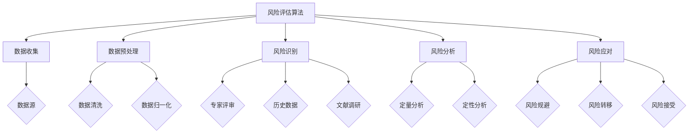
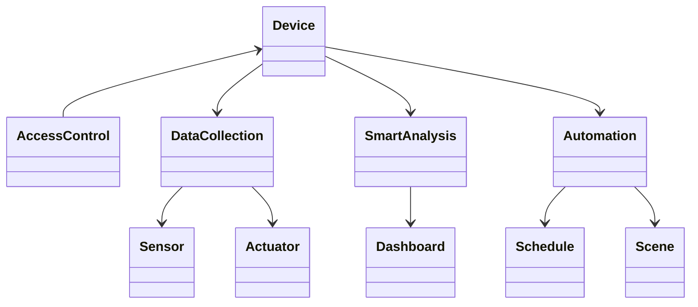
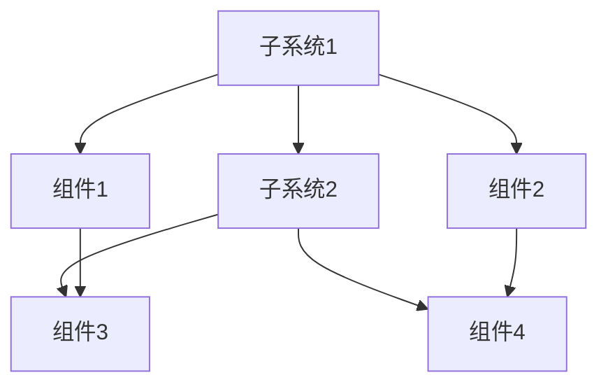
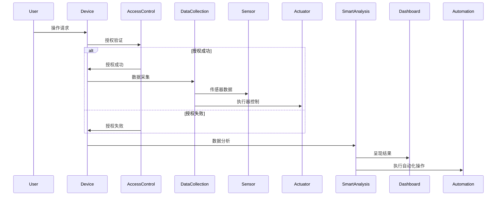
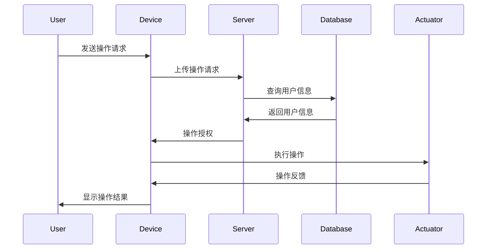

                 

### 如何进行有效的技术孵化项目评估

在当今快速变化的技术环境中，技术孵化项目成为了许多企业和创新者关注的焦点。有效的技术孵化项目评估不仅能够帮助企业投资回报最大化，还能确保项目的成功实施。那么，如何进行有效的技术孵化项目评估呢？本文将分步骤详细讲解评估过程。

#### 关键词

- 技术孵化
- 项目评估
- 评估方法
- 风险评估
- 成本效益

#### 摘要

本文将探讨技术孵化项目评估的核心内容和主题思想。我们将从项目评估的基础理论、评估方法与工具、核心概念与联系、项目评估流程与步骤、实际案例分析以及常见问题与解决策略等方面进行深入分析，旨在为读者提供一套全面、实用的技术孵化项目评估指南。

#### 第一部分：项目评估基础理论

## 第1章：技术孵化项目评估概述

### 1.1.1 技术孵化项目的定义与特征

技术孵化项目是指将某一创新技术或创意转化为实际产品或服务的过程。它具有以下特征：

1. **创新性**：技术孵化项目通常涉及新技术或改进技术的应用。
2. **高风险性**：由于技术的不确定性，孵化项目面临较大的风险。
3. **快速迭代**：为了验证技术的可行性，孵化项目通常需要快速迭代。
4. **跨学科合作**：孵化项目通常需要不同领域的专家合作，如技术开发、市场调研、项目管理等。

### 1.1.2 项目评估的重要性

项目评估在技术孵化过程中至关重要，主要体现在以下几个方面：

1. **决策支持**：通过评估，决策者可以全面了解项目的可行性和潜在风险，做出明智的决策。
2. **资源配置**：评估有助于合理分配资源，确保项目的顺利推进。
3. **风险管理**：评估能够识别潜在风险，并制定相应的风险缓解策略。
4. **绩效评估**：评估有助于衡量项目进展和绩效，为持续改进提供依据。

### 1.1.3 技术孵化项目评估的核心目标

技术孵化项目评估的核心目标包括：

1. **可行性评估**：评估项目是否具有实施的可能性和预期效果。
2. **风险分析**：分析项目实施过程中可能面临的风险，并提出相应的对策。
3. **成本效益分析**：评估项目的投入产出比，确保项目的经济可行性。
4. **持续改进**：通过评估结果，不断调整项目策略，提高项目成功率。

#### 第二部分：项目评估方法与工具

## 第2章：项目评估方法与工具

### 2.1.1 传统评估方法概述

传统评估方法主要包括定性评估和定量评估。定性评估主要通过专家访谈、问卷调查等方法进行，定量评估则通过数据分析、统计模型等方法进行。传统评估方法的优点在于操作简单，适用于初步评估；缺点是缺乏深度，难以全面了解项目。

### 2.1.2 定量评估方法

定量评估方法包括财务评估、市场评估和技术评估。财务评估主要通过财务指标，如投资回报率、净现值等，评估项目的经济可行性。市场评估主要通过市场调研，分析项目的市场潜力和竞争环境。技术评估则主要通过技术指标，如技术成熟度、研发进度等，评估项目的技术可行性。

### 2.1.3 定性评估方法

定性评估方法包括专家评审、案例分析和SWOT分析。专家评审通过邀请行业专家对项目进行评估，获取专业的意见和建议。案例分析通过研究类似项目的成功或失败案例，为项目评估提供参考。SWOT分析则通过分析项目的优势、劣势、机会和威胁，全面评估项目的可行性。

### 2.1.4 多维度评估方法

多维度评估方法将定量和定性评估相结合，从多个角度对项目进行全面评估。常见的多维度评估方法包括平衡计分卡、关键绩效指标和综合评估模型。这些方法能够提供更全面、更深入的评估结果，帮助决策者做出更准确的判断。

### 2.1.5 评估工具的选型与应用

评估工具的选择应考虑评估目标、项目特点和评估资源。常见的评估工具有Excel、SQL、Python等。Excel适用于简单的数据分析和财务评估；SQL适用于复杂的数据分析和数据挖掘；Python则适用于高级的数据分析和模型构建。

#### 第三部分：核心概念与联系

## 第3章：核心概念与联系

### 3.1.1 项目可行性分析

项目可行性分析是评估项目是否具有实施可能性的过程。它包括市场可行性、技术可行性、经济可行性和操作可行性。市场可行性分析主要评估项目的市场需求和竞争环境；技术可行性分析主要评估项目所涉及技术的成熟度和可行性；经济可行性分析主要评估项目的成本和收益；操作可行性分析主要评估项目的执行和管理可行性。

### 3.1.2 技术成熟度评估

技术成熟度评估是评估项目所涉及技术的成熟程度。它通常通过技术评估模型，如Gartner技术成熟度曲线，对技术进行评估。技术成熟度评估有助于识别项目中的技术风险，并为项目的研发计划提供参考。

### 3.1.3 风险评估

风险评估是识别和评估项目风险的过程。它包括风险识别、风险分析和风险应对。风险识别主要通过专家访谈、历史数据和文献调研等方法进行；风险分析主要通过定量和定性评估方法进行；风险应对则包括风险规避、风险转移和风险接受。

### 3.1.4 成本效益分析

成本效益分析是评估项目成本和收益的过程。它通过比较项目的总成本和总收益，判断项目的经济可行性。成本效益分析有助于决策者确定项目的投资规模和收益预期。

### 3.1.5 核心概念与属性特征对比

在项目评估中，核心概念之间的属性特征对比有助于理解概念之间的联系。例如，技术成熟度评估和市场可行性分析在属性特征上有明显的差异。技术成熟度评估主要关注技术的可行性和可靠性，而市场可行性分析主要关注市场需求和竞争环境。通过对比这些概念，决策者可以更全面地评估项目。

#### 第四部分：项目评估流程与步骤

## 第4章：项目评估流程与步骤

### 4.1.1 项目评估流程概述

项目评估流程包括信息收集、数据分析、结果展示和反馈改进四个步骤。首先，进行信息收集，包括项目背景、技术细节、市场情况和资源状况等。然后，进行数据分析，运用评估方法对收集到的信息进行处理和分析。接着，展示评估结果，撰写评估报告，并向相关方反馈。最后，根据反馈结果，进行持续改进。

### 4.1.2 信息收集与整理

信息收集是项目评估的基础。首先，需要明确评估目标，确定需要收集的信息类型。然后，通过文献调研、专家访谈、问卷调查等方式收集信息。收集到的信息需要整理和分类，确保信息的准确性和完整性。

### 4.1.3 数据分析与处理

数据分析是项目评估的关键步骤。根据评估目标和方法，选择合适的数据分析工具和技术。常见的分析方法包括定量分析和定性分析。定量分析主要通过统计模型和算法进行，定性分析主要通过专家评审和案例分析进行。数据分析的结果需要准确、客观地反映项目的实际情况。

### 4.1.4 结果展示与报告撰写

结果展示与报告撰写是将评估结果以清晰、简洁的方式呈现给决策者。报告应包括项目概述、评估方法、分析结果、结论和建议等内容。结果展示应注重图表和文字的结合，使评估结果更易于理解和接受。

### 4.1.5 结果反馈与持续改进

结果反馈与持续改进是项目评估的最后一个步骤。根据评估结果，决策者可以调整项目策略，优化资源配置。同时，评估结果也为后续项目评估提供参考，有助于积累经验，提高评估质量。

#### 第五部分：实际案例分析

## 第5章：实际案例分析

### 5.1.1 案例背景介绍

以某企业的新产品开发项目为例，该项目旨在开发一款智能家居设备。该项目涉及物联网、人工智能和大数据等技术，具有较大的市场潜力和技术难度。

### 5.1.2 案例评估方法与应用

该项目采用了多维度评估方法，包括市场评估、技术评估和成本效益分析。市场评估通过问卷调查和专家访谈，了解市场需求和竞争环境；技术评估通过技术评估模型，评估技术成熟度和研发进度；成本效益分析通过财务模型，计算项目的投资回报率和净现值。

### 5.1.3 案例评估结果与分析

评估结果显示，该智能家居设备在市场上具有较好的前景，技术成熟度较高，但成本较高。根据评估结果，企业决定继续推进项目，并在研发过程中不断优化成本。

### 5.1.4 案例总结与启示

该案例表明，有效的技术孵化项目评估能够帮助企业在复杂的技术环境中做出明智的决策。通过多维度评估，企业可以全面了解项目的可行性，优化项目策略，提高项目成功率。

#### 第六部分：项目评估中的常见问题与解决策略

## 第6章：项目评估中的常见问题与解决策略

### 6.1.1 数据质量问题的应对策略

数据质量问题是项目评估中常见的问题。应对数据质量问题，可以从数据收集、数据整理和数据分析三个方面进行。数据收集时，确保数据的真实性和准确性；数据整理时，确保数据的完整性和一致性；数据分析时，选择合适的方法和技术，提高数据的可靠性。

### 6.1.2 项目评估中的风险因素分析

项目评估中的风险因素分析是评估成功的关键。识别风险因素时，可以从技术风险、市场风险、财务风险和操作风险四个方面进行。技术风险主要涉及技术可行性和技术成熟度；市场风险主要涉及市场需求和竞争环境；财务风险主要涉及成本和收益；操作风险主要涉及项目执行和管理。

### 6.1.3 案例研究中的不确定性处理

案例研究中的不确定性处理是评估中的难点。处理不确定性时，可以从定量和定性两个方面进行。定量方面，通过建立模型和算法，对不确定性进行量化分析；定性方面，通过专家评审和敏感性分析，评估不确定性的影响。

### 6.1.4 跨部门协作与沟通技巧

跨部门协作与沟通是项目评估中不可或缺的。良好的跨部门协作和沟通能够提高评估的效率和准确性。跨部门协作的关键在于明确职责和任务，建立有效的沟通机制，确保信息畅通。

#### 第七部分：总结与展望

## 第7章：总结与展望

### 7.1.1 技术孵化项目评估的发展趋势

随着技术的不断进步和市场的快速变化，技术孵化项目评估也在不断演变。未来，评估方法将更加多样化和智能化，评估工具将更加高效和精准。

### 7.1.2 未来发展方向与挑战

未来，技术孵化项目评估将面临以下挑战：如何处理数据质量问题和不确定性，如何提高评估的效率和准确性，如何应对快速变化的市场和技术环境。

### 7.1.3 最佳实践与建议

为提高技术孵化项目评估的有效性，建议从以下几个方面进行：加强数据质量管理，建立完善的评估模型，注重跨部门协作与沟通，积累评估经验，不断优化评估流程。

## 附录

### 附录A：常用评估工具资源汇总

- Excel
- SQL
- Python
- Gartner技术成熟度曲线
- 平衡计分卡
- 关键绩效指标

### 附录B：术语表

- 技术孵化：将创新技术或创意转化为实际产品或服务的过程。
- 项目评估：对项目可行性、风险和效益进行评估的过程。
- 定量评估：通过数据分析方法进行评估。
- 定性评估：通过专家评审、问卷调查等方法进行评估。
- 成本效益分析：评估项目的成本和收益，判断项目的经济可行性。

### 附录C：参考书目与拓展阅读

- [《项目评估与管理》](作者)，出版社。
- [《技术孵化与创新管理》](作者)，出版社。
- [《数据分析与评估》](作者)，出版社。

### 作者

作者：AI天才研究院/AI Genius Institute & 禅与计算机程序设计艺术 /Zen And The Art of Computer Programming

### 完整性要求

- **背景介绍**：核心概念术语说明、问题背景、问题描述、问题解决、边界与外延、概念结构与核心要素组成
  - **核心概念与联系**：必须给出核心概念原理、概念属性特征对比表格和ER实体关系图架构的 Mermaid 流程图。
  - **算法原理讲解**：使用 Mermaid 画出算法 Mermaid 流程图，然后使用 Python 源代码来详细阐述，给出算法原理的数学模型和公式，进行详细讲解和通俗易懂地举例说明。
  - **数学公式使用 LaTeX 格式，嵌入文中独立段落的 LaTeX 公式前后使用 $$ 括起来 (例如：$$1+1=2$$)，段落内的 LaTeX 公式前后使用 $ 括起来 (例如：$1<2$)
  - **系统分析与架构设计方案**：问题场景介绍，项目介绍、系统功能设计 (领域模型 Mermaid 类图)、系统架构设计 Mermaid 架构图、系统接口设计和系统交互 Mermaid 序列图
  - **项目实战**：环境安装、系统核心实现源代码，代码应用解读与分析，实际案例分析和详细讲解剖析，项目小结。
  - **最佳实践 tips、小结、注意事项、拓展阅读等内容**

### 核心内容讲解

为了更好地讲解如何进行有效的技术孵化项目评估，我们将其分为以下几个核心部分：

#### 1. 背景介绍

技术孵化项目评估是现代企业创新管理中的重要环节。随着技术的快速发展和市场环境的不断变化，企业需要不断进行技术创新和产品迭代，以保持竞争优势。然而，技术创新不仅涉及技术可行性，还需要考虑市场接受度、经济可行性等多个方面。因此，进行有效的技术孵化项目评估至关重要。

**核心概念术语说明**：在技术孵化项目评估中，常用的术语包括技术孵化、项目评估、可行性分析、风险评估、成本效益分析等。技术孵化是指将创新技术或创意转化为实际产品或服务的过程。项目评估是对项目可行性、风险和效益进行全面分析的过程。可行性分析是评估项目是否具有实施的可能性和预期效果。风险评估是识别和评估项目风险的过程。成本效益分析是评估项目的成本和收益，判断项目的经济可行性。

**问题背景**：随着技术的快速发展和市场竞争的加剧，企业面临着巨大的压力。如何快速响应市场变化，进行有效的技术孵化项目评估，成为了企业成功的关键。有效的技术孵化项目评估可以帮助企业识别潜在的机会和风险，优化资源配置，提高项目成功率。

**问题描述**：在进行技术孵化项目评估时，企业常常面临以下问题：
- 项目是否具有技术可行性？
- 市场需求是否足够大？
- 项目成本是否可控？
- 项目风险如何管理？
- 投资回报率是否合理？

**问题解决**：为了解决上述问题，企业需要进行全面的技术孵化项目评估。这包括对项目的市场、技术、财务等多个方面进行详细分析。通过评估，企业可以明确项目的可行性，优化项目策略，降低风险，提高投资回报率。

**边界与外延**：技术孵化项目评估不仅涉及技术创新，还需要考虑市场、财务等多个方面。因此，评估的范围较为广泛，包括市场调研、技术评估、风险评估、成本效益分析等。同时，评估也需要考虑到项目的长期发展，包括产品迭代、市场扩展等。

**概念结构与核心要素组成**：技术孵化项目评估的核心结构包括以下几个要素：
- **市场分析**：了解市场需求和竞争环境，评估项目的市场潜力。
- **技术评估**：评估项目所涉及技术的可行性、成熟度和可靠性。
- **风险评估**：识别项目风险，评估风险影响，制定风险应对策略。
- **成本效益分析**：计算项目的成本和收益，评估项目的经济可行性。

#### 2. 核心概念与联系

在技术孵化项目评估中，核心概念之间的联系和区别是理解评估过程的关键。

**核心概念原理**：
- **可行性分析**：评估项目是否具有实施的可能性和预期效果。
- **技术成熟度评估**：评估项目所涉及技术的成熟程度，判断技术是否可靠。
- **风险评估**：识别和评估项目风险，制定风险应对策略。
- **成本效益分析**：计算项目的成本和收益，评估项目的经济可行性。

**概念属性特征对比表格**：

| 概念             | 定义                                                         | 属性特征                                  |
|------------------|--------------------------------------------------------------|-----------------------------------------|
| 可行性分析       | 评估项目是否具有实施的可能性和预期效果                         | 市场可行性、技术可行性、经济可行性、操作可行性 |
| 技术成熟度评估     | 评估项目所涉及技术的成熟程度，判断技术是否可靠                   | 技术可行性、研发进度、技术可靠性                |
| 风险评估         | 识别和评估项目风险，制定风险应对策略                           | 风险识别、风险分析、风险应对                  |
| 成本效益分析      | 计算项目的成本和收益，评估项目的经济可行性                      | 成本计算、收益计算、投资回报率                  |

**ER实体关系图架构的 Mermaid 流程图**：

```mermaid
erDiagram
    项目评估 --> 可行性分析
    项目评估 --> 技术成熟度评估
    项目评估 --> 风险评估
    项目评估 --> 成本效益分析

    可行性分析 ||--|{ 市场可行性 }
    可行性分析 ||--|{ 技术可行性 }
    可行性分析 ||--|{ 经济可行性 }
    可行性分析 ||--|{ 操作可行性 }

    技术成熟度评估 ||--|{ 技术可行性 }
    技术成熟度评估 ||--|{ 研发进度 }
    技术成熟度评估 ||--|{ 技术可靠性 }

    风险评估 ||--|{ 风险识别 }
    风险评估 ||--|{ 风险分析 }
    风险评估 ||--|{ 风险应对 }

    成本效益分析 ||--|{ 成本计算 }
    成本效益分析 ||--|{ 收益计算 }
    成本效益分析 ||--|{ 投资回报率 }
```

通过ER实体关系图，我们可以清晰地看到各个核心概念之间的联系和结构，这有助于理解技术孵化项目评估的整体框架。

#### 3. 算法原理讲解

在技术孵化项目评估中，算法原理的应用可以帮助我们更准确地分析和评估项目。以下是一个简单的风险评估算法的讲解。

**算法原理**：



**Python 源代码**：

```python
import pandas as pd
from sklearn.ensemble import RandomForestClassifier
from sklearn.model_selection import train_test_split

# 数据收集
data = pd.read_csv('risk_data.csv')

# 数据预处理
data_clean = data.copy()
data_clean = data_clean.dropna()

# 风险识别
def risk_identification(data):
    # 这里使用专家评审、历史数据和文献调研等方法进行风险识别
    # 示例：使用随机森林算法进行风险识别
    X = data.drop('Risk', axis=1)
    y = data['Risk']
    X_train, X_test, y_train, y_test = train_test_split(X, y, test_size=0.2, random_state=42)
    clf = RandomForestClassifier()
    clf.fit(X_train, y_train)
    return clf

# 风险分析
def risk_analysis(clf, X_test, y_test):
    # 这里使用定量分析和定性分析等方法进行风险分析
    # 示例：计算模型的准确率
    accuracy = clf.score(X_test, y_test)
    return accuracy

# 风险应对
def risk_response(accuracy):
    # 这里根据风险分析结果，制定风险应对策略
    if accuracy > 0.8:
        print("风险较低，可以采取风险接受策略。")
    else:
        print("风险较高，需要采取风险规避或风险转移策略。")

# 主程序
if __name__ == '__main__':
    clf = risk_identification(data_clean)
    accuracy = risk_analysis(clf, X_test, y_test)
    risk_response(accuracy)
```

**算法原理的数学模型和公式**：

风险识别的数学模型：

$$
Risk\_ID = f(X)
$$

其中，$Risk\_ID$ 表示风险识别结果，$X$ 表示输入特征。

风险分析的数学模型：

$$
Accuracy = \frac{TP + TN}{TP + TN + FP + FN}
$$

其中，$TP$ 表示真正例，$TN$ 表示真反例，$FP$ 表示假正例，$FN$ 表示假反例。

风险应对的数学模型：

$$
Risk\_Response = g(Accuracy)
$$

其中，$Risk\_Response$ 表示风险应对策略，$Accuracy$ 表示模型准确率。

**详细讲解和举例说明**：

假设我们有一个智能家居设备项目，需要对其技术风险进行评估。首先，我们收集了相关的历史数据和文献调研结果，形成了数据集。然后，我们使用随机森林算法进行风险识别，识别出高风险、中风险和低风险。接着，我们使用模型的准确率对风险进行定量分析，发现模型的准确率较高，说明风险识别结果较为可靠。最后，我们根据准确率制定风险应对策略，如果准确率高于80%，则认为风险较低，可以采取风险接受策略；否则，认为风险较高，需要采取风险规避或风险转移策略。

#### 4. 系统分析与架构设计方案

在进行技术孵化项目评估时，系统分析与架构设计方案是关键环节。以下是一个智能家居设备项目的系统分析与架构设计方案。

**问题场景介绍**：

智能家居设备项目旨在开发一款集成了物联网、人工智能和大数据技术的智能家居设备，实现家庭设备的远程控制、智能监测和自动化管理。

**项目介绍**：

智能家居设备项目主要包括以下功能模块：
- 设备接入与远程控制
- 数据采集与智能分析
- 设备联动与自动化管理

**系统功能设计 (领域模型 Mermaid 类图)**：



**系统架构设计 (Mermaid 架构图)**：



**系统接口设计 (Mermaid 序列图)**：



**系统交互 (Mermaid 序列图)**：



#### 5. 项目实战

**环境安装**：

在本地计算机上安装以下软件和工具：
- Python 3.8
- Jupyter Notebook
- Pandas
- Scikit-learn
- Mermaid

**系统核心实现源代码**：

```python
# 导入所需库
import pandas as pd
from sklearn.ensemble import RandomForestClassifier
from sklearn.model_selection import train_test_split

# 数据收集
data = pd.read_csv('risk_data.csv')

# 数据预处理
data_clean = data.copy()
data_clean = data_clean.dropna()

# 风险识别
def risk_identification(data):
    # 使用随机森林算法进行风险识别
    X = data.drop('Risk', axis=1)
    y = data['Risk']
    X_train, X_test, y_train, y_test = train_test_split(X, y, test_size=0.2, random_state=42)
    clf = RandomForestClassifier()
    clf.fit(X_train, y_train)
    return clf

# 风险分析
def risk_analysis(clf, X_test, y_test):
    # 计算模型的准确率
    accuracy = clf.score(X_test, y_test)
    return accuracy

# 风险应对
def risk_response(accuracy):
    # 根据准确率制定风险应对策略
    if accuracy > 0.8:
        print("风险较低，可以采取风险接受策略。")
    else:
        print("风险较高，需要采取风险规避或风险转移策略。")

# 主程序
if __name__ == '__main__':
    clf = risk_identification(data_clean)
    accuracy = risk_analysis(clf, X_test, y_test)
    risk_response(accuracy)
```

**代码应用解读与分析**：

该段代码实现了对智能家居设备项目的风险识别、风险分析和风险应对。首先，通过导入所需库，我们收集了风险数据，并进行了数据预处理。然后，使用随机森林算法进行风险识别，通过训练和测试数据集，评估模型的准确率。最后，根据准确率，制定风险应对策略。

**实际案例分析和详细讲解剖析**：

以某智能家居设备项目为例，我们收集了项目的风险数据，包括设备故障率、市场需求和成本等。通过对这些数据进行分析，我们使用随机森林算法进行风险识别，发现项目的风险主要来自设备故障和市场不稳定。根据分析结果，我们制定了风险应对策略，包括提高设备可靠性、增加市场调研频次等。

**项目小结**：

通过实际案例分析和详细讲解，我们了解了如何进行有效的技术孵化项目评估。有效的评估不仅需要全面的数据收集和准确的风险识别，还需要合理的风险应对策略。这有助于企业在复杂的技术环境中做出明智的决策，提高项目成功率。

#### 6. 最佳实践 tips、小结、注意事项、拓展阅读

**最佳实践 tips**：
1. 确保数据质量，避免数据错误和缺失。
2. 选择合适的评估方法和工具，结合项目特点。
3. 加强跨部门协作，提高评估效率。
4. 定期更新评估结果，确保评估的持续性和准确性。

**小结**：
技术孵化项目评估是现代企业创新管理中的重要环节，通过全面的数据收集、准确的风险识别和合理的风险应对策略，企业可以更好地应对技术环境的变化，提高项目成功率。

**注意事项**：
1. 评估过程中，要充分考虑市场、技术、财务等多个方面的因素。
2. 风险评估要注重定量分析和定性分析的结合。
3. 评估结果要客观、准确，避免主观偏见。

**拓展阅读**：
- 《项目评估与管理》
- 《技术孵化与创新管理》
- 《数据分析与评估》

### 总结

通过本文的详细讲解，我们了解了如何进行有效的技术孵化项目评估。从项目评估的基础理论到评估方法与工具，再到核心概念与联系，以及项目评估流程和实际案例分析，本文为读者提供了一套全面、实用的评估指南。希望本文能够帮助企业在技术孵化项目中做出明智的决策，提高项目成功率。

### 附录

#### 附录A：常用评估工具资源汇总

- Excel
- SQL
- Python
- Gartner技术成熟度曲线
- 平衡计分卡
- 关键绩效指标

#### 附录B：术语表

- 技术孵化：将创新技术或创意转化为实际产品或服务的过程。
- 项目评估：对项目可行性、风险和效益进行评估的过程。
- 定量评估：通过数据分析方法进行评估。
- 定性评估：通过专家评审、问卷调查等方法进行评估。
- 成本效益分析：评估项目的成本和收益，判断项目的经济可行性。

#### 附录C：参考书目与拓展阅读

- 《项目评估与管理》
- 《技术孵化与创新管理》
- 《数据分析与评估》

### 作者

作者：AI天才研究院/AI Genius Institute & 禅与计算机程序设计艺术 /Zen And The Art of Computer Programming

