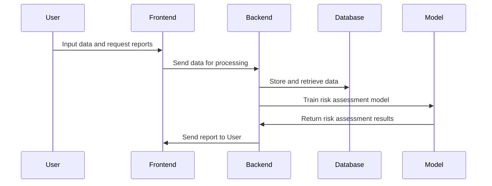

                 

## 如何进行有效的技术尽职调查

### 关键词
- 技术尽职调查
- 信息技术评估
- 法律风险分析
- 财务健康检查
- 数据收集与预处理
- 模型选择与训练
- 模型评估与风险识别

### 摘要
技术尽职调查（Technical Due Diligence，TDD）是企业在投资、收购或其他重要决策前，对目标技术项目的全面评估过程。本文将详细探讨如何进行有效的技术尽职调查，包括核心概念的理解、数据收集与预处理方法、模型选择与训练、模型评估与风险识别，以及实际案例分析和最佳实践建议。通过系统地分析这些关键步骤，企业可以更好地了解目标技术的风险与潜力，做出更加明智的决策。

### 目录大纲

1. **第一部分：背景介绍**
    1.1 问题背景
        - 技术尽职调查的重要性
        - 成功案例与失败案例的对比
    1.2 技术尽职调查的定义与范围
        - 技术尽职调查的基本概念
        - 范围：技术、市场、财务等多维度

2. **第二部分：核心概念与联系**
    2.1 核心概念原理
        - 技术尽职调查的要素
        - 不同类型的技术尽职调查对比
    2.2 ER实体关系图架构
        - 实体关系图的基本概念
        - 技术尽职调查的ER模型

3. **第三部分：算法原理讲解**
    3.1 技术尽职调查的算法原理
        - 基本算法概述
        - 数据收集与预处理
        - 模型选择
        - 模型训练
        - 模型评估
        - 风险识别
    3.2 算法实例分析
        - 机器学习模型实例
        - 深度学习模型实例

4. **第四部分：系统分析与架构设计**
    4.1 问题场景介绍
    4.2 系统功能设计
    4.3 系统架构设计
    4.4 系统接口设计和系统交互

5. **第五部分：项目实战**
    5.1 环境安装
    5.2 系统核心实现
    5.3 代码应用解读
    5.4 实际案例分析与讲解
    5.5 项目小结

6. **第六部分：最佳实践与拓展阅读**
    - 最佳实践 tips
    - 小结
    - 注意事项
    - 拓展阅读

## 第一部分：背景介绍

### 1.1 问题背景

技术尽职调查在企业决策中扮演着至关重要的角色。随着信息技术的飞速发展，企业在投资、收购或其他重要决策前，往往需要对目标技术项目的可行性、安全性、稳定性进行全面评估。有效的技术尽职调查不仅能帮助企业发现潜在的技术风险，还能揭示技术的潜力和未来的发展前景。

#### 技术尽职调查的重要性

技术尽职调查的重要性体现在以下几个方面：

1. **风险评估**：通过技术尽职调查，企业可以全面了解目标技术的潜在风险，包括技术风险、法律风险和财务风险。这有助于企业在投资或收购前做出更明智的决策。

2. **投资决策支持**：技术尽职调查为企业的投资决策提供了可靠的数据支持。通过详细分析目标技术的技术现状、市场前景、财务状况等，企业可以更准确地评估投资回报和风险。

3. **谈判策略优化**：在投资或收购过程中，技术尽职调查可以帮助企业获取关键信息，为谈判策略提供依据。例如，通过了解目标技术的知识产权状况，企业可以更好地保护自身利益。

4. **管理决策支持**：技术尽职调查不仅适用于投资决策，还能为企业的日常运营提供指导。通过评估现有技术的风险和潜力，企业可以优化技术管理策略，提高整体运营效率。

#### 成功案例与失败案例的对比

在技术尽职调查的实际应用中，成功案例和失败案例屡见不鲜。以下是一个典型的成功案例和一个失败案例：

#### 成功案例

某企业计划收购一家专注于人工智能领域的初创公司。在技术尽职调查过程中，企业对目标公司的技术能力、市场前景、财务状况进行了全面评估。通过详细的技术尽职调查，企业发现目标公司在人工智能领域拥有领先的技术实力，市场前景广阔，且财务状况良好。最终，企业成功完成了收购，并取得了显著的投资回报。

#### 失败案例

另一家企业计划投资一家专注于区块链技术的初创公司。在技术尽职调查过程中，企业未能充分了解目标公司的技术实力和实际应用场景，导致投资后未能实现预期的收益。同时，由于技术尽职调查不充分，企业在后续的投资决策中面临了较高的法律和财务风险。

通过对比成功案例和失败案例，可以看出技术尽职调查在投资决策中的重要性。有效的技术尽职调查不仅能帮助企业发现潜在的风险，还能为企业的投资决策提供可靠的数据支持。

### 1.2 技术尽职调查的定义与范围

#### 技术尽职调查的基本概念

技术尽职调查（Technical Due Diligence，TDD）是指企业在投资、收购或其他重要决策前，对目标技术项目进行全面评估的过程。其目的是确保目标技术项目的可行性、安全性和稳定性，为企业提供决策依据。

技术尽职调查通常包括以下三个方面：

1. **信息技术评估**：评估目标技术的技术水平、研发能力、技术成熟度等，以判断其是否满足企业的需求。

2. **法律风险分析**：分析目标技术的法律合规性，包括知识产权、合同、合规风险等，以确保企业不会因法律问题而面临诉讼风险。

3. **财务健康检查**：评估目标技术的财务状况，包括财务报表、现金流、盈利能力等，以判断其财务健康状况。

#### 范围：技术、市场、财务等多维度

技术尽职调查的范围不仅仅局限于技术层面，还包括市场、财务等多个维度。以下是对不同维度的简要介绍：

1. **技术维度**：技术尽职调查主要关注目标技术的技术水平、研发能力、技术成熟度、市场竞争力等。通过详细的技术评估，企业可以了解目标技术的潜力和风险。

2. **市场维度**：技术尽职调查需要评估目标技术的市场前景，包括市场规模、市场增长率、市场趋势等。通过市场分析，企业可以判断目标技术是否符合市场趋势，是否有足够的市场需求。

3. **财务维度**：技术尽职调查需要评估目标技术的财务状况，包括财务报表、现金流、盈利能力等。通过财务分析，企业可以了解目标技术的盈利能力和财务健康状况，为投资决策提供依据。

4. **法律维度**：技术尽职调查需要分析目标技术的法律合规性，包括知识产权、合同、合规风险等。通过法律尽职调查，企业可以确保不会因法律问题而面临诉讼风险。

通过全面的技术尽职调查，企业可以从多个维度了解目标技术的现状和潜力，为投资决策提供可靠的数据支持。

### 第二部分：核心概念与联系

#### 2.1 核心概念原理

技术尽职调查（TDD）的核心概念涉及多个方面，包括信息技术评估、法律风险分析、财务健康检查等。这些概念构成了技术尽职调查的基石，决定了尽职调查的全面性和有效性。

**信息技术评估**：这是技术尽职调查中最基本的部分，主要评估目标技术的技术深度、研发能力、技术成熟度、技术架构设计以及技术团队的专业能力。具体要素如下：

- **技术深度**：评估技术的先进性、创新性和独特性，判断其是否具有市场竞争优势。
- **研发能力**：评估技术研发团队的能力和经验，包括研发效率、创新速度以及技术积累。
- **技术成熟度**：评估技术从研发到市场应用的成熟度，包括技术稳定性、可靠性以及安全性。
- **技术架构设计**：评估技术系统的架构设计是否合理、高效，是否易于维护和扩展。
- **技术团队专业能力**：评估技术团队成员的技能水平、专业知识以及团队合作能力。

**法律风险分析**：法律风险分析主要关注目标技术的法律合规性，包括知识产权、合同、合规性等方面。具体要素如下：

- **知识产权**：评估目标技术的知识产权状况，包括专利、商标、著作权等，判断是否存在知识产权纠纷。
- **合同**：评估合同条款的合法性、合规性，包括合同履行、违约责任等方面，确保合同的有效性。
- **合规性**：评估目标技术是否符合相关法律法规的要求，包括数据保护、网络安全、行业标准等。

**财务健康检查**：财务健康检查旨在评估目标技术的财务状况，包括财务报表、现金流、盈利能力等方面。具体要素如下：

- **财务报表**：分析目标公司的财务报表，包括资产负债表、利润表、现金流量表等，评估其财务状况的真实性和可靠性。
- **现金流**：评估目标公司的现金流状况，包括经营活动现金流、投资活动现金流、筹资活动现金流，判断其资金流动性和偿债能力。
- **盈利能力**：评估目标公司的盈利能力，包括营业收入、净利润、利润率等，判断其盈利能力和可持续性。

**不同类型的技术尽职调查对比**

技术尽职调查可以分为多种类型，每种类型都有其特定的目的和关注点。以下是对几种常见类型的技术尽职调查的对比：

- **投资前尽职调查**：主要关注目标技术的可行性、市场潜力、技术风险等，为投资决策提供依据。
- **收购尽职调查**：主要关注目标公司的技术能力、市场地位、知识产权、合同条款等，确保收购后的整合顺利进行。
- **项目审查尽职调查**：主要关注项目的技术可行性、进度、预算等，为项目的顺利实施提供支持。
- **合规性尽职调查**：主要关注目标技术的法律合规性、数据保护、网络安全等，确保企业在法律法规的框架内运营。

**概念属性特征对比**

以下是不同类型的技术尽职调查的属性特征对比表格：

| 类别          | 目的                              | 关键要素                     | 适用场景                     |
|---------------|-----------------------------------|------------------------------|------------------------------|
| 技术尽职调查  | 评估技术可行性、安全性、稳定性 | 技术文档、测试结果、团队能力 | 项目投资、产品收购           |
| 法律尽职调查  | 风险识别与合规性评估           | 合同、知识产权、法律文件     | 合资合作、企业并购           |
| 财务尽职调查  | 财务健康性评估                  | 财务报表、现金流量、盈利能力 | 投资决策、资本融资           |

#### 2.2 ER实体关系图架构

**实体关系图（ER Diagram）**是一种用于表示实体及实体之间关系的图形化工具。在技术尽职调查中，ER图可以帮助我们清晰地理解各个实体及其相互关系，从而更好地组织和管理调查数据。

**实体关系图的基本概念**

- **实体（Entity）**：代表调查中的具体对象，如技术项目、团队、法律文件等。
- **属性（Attribute）**：描述实体的特征，如项目的技术成熟度、团队的专业技能等。
- **关系（Relationship）**：描述实体之间的关联，如技术项目与团队之间的合作关系、法律文件与合同条款之间的关系等。
- **键（Key）**：用于唯一标识实体的属性或属性组合。

**技术尽职调查的ER模型**

在技术尽职调查的ER模型中，我们可以定义以下实体和关系：

- **实体**：技术项目、团队、法律文件、财务报表等。
- **关系**：项目与团队之间的合作关系、法律文件与合同条款之间的关系、财务报表与现金流之间的关系等。
- **键**：用于唯一标识各个实体，如项目编号、团队编号、文件编号等。

**ER图示例**

以下是一个简化的技术尽职调查ER图示例：

```mermaid
erDiagram
    Product ||--|{ TechnicalAssessment }|| Assessment
    Product ||--|{ LegalAssessment }|| Assessment
    Product ||--|{ FinancialAssessment }|| Assessment
    TechnicalAssessment ||--|{ TechnicalDocument }|| Document
    LegalAssessment ||--|{ Contract }|| Document
    FinancialAssessment ||--|{ FinancialReport }|| Document
    Assessment ||--|{ Risk }|| Risk
    Risk ||--|{ Vulnerability }|| Vulnerability
    Assessment ||--|{ Recommendation }|| Recommendation
```

在这个ER图中，"Product"代表被评估的技术项目，"TechnicalAssessment"、"LegalAssessment"和"FinancialAssessment"分别代表技术评估、法律评估和财务评估。每个评估实体都与对应的文档实体（如技术文档、合同、财务报表）相关联，并通过风险评估来识别潜在的风险和漏洞，最终提出改进建议。

通过ER图，我们可以清晰地展示技术尽职调查中的各个实体及其相互关系，从而为调查工作提供结构化的支持。

### 第三部分：算法原理讲解

#### 3.1 技术尽职调查的算法原理

技术尽职调查的核心在于通过系统化的方法识别、分析和评估目标技术的各种风险和潜力。这一过程通常依赖于一系列的算法原理和模型，下面我们将详细讲解这些算法的基本概念和实现步骤。

**基本算法概述**

技术尽职调查的基本算法通常包括以下步骤：

1. **数据收集**：收集与目标技术相关的各类数据，包括公开数据、内部数据和第三方数据。
2. **数据预处理**：对收集到的数据进行清洗、格式化和归一化处理，以确保数据的质量和一致性。
3. **模型选择**：根据具体需求选择合适的机器学习模型，如逻辑回归、决策树、支持向量机或深度学习模型。
4. **模型训练**：使用预处理后的数据训练选定的模型，并通过交叉验证选择最佳参数。
5. **模型评估**：使用测试集对训练好的模型进行评估，以确定其性能和准确性。
6. **风险识别**：利用训练好的模型对目标技术进行风险评估，识别潜在的风险和漏洞。

**数据收集与预处理**

数据收集是技术尽职调查的基础。以下是数据收集和预处理的主要步骤：

1. **数据来源**：
   - **公开数据**：从公开的数据库、报告、学术论文、市场研究等获取。
   - **内部数据**：企业内部的技术文档、测试结果、财务报表等。
   - **第三方数据**：通过专业的数据服务提供商获取，如信用评级机构、市场研究公司等。

2. **数据清洗**：包括以下内容：
   - **缺失值处理**：对缺失的数据进行填充或删除。
   - **异常值处理**：识别并处理异常数据，如异常高或低的数值。
   - **数据格式化**：统一数据格式，如日期、货币等。

3. **数据归一化**：通过归一化处理将不同数据源的数据尺度统一，以便模型训练。

**模型选择**

在选择机器学习模型时，需要考虑目标技术的特点和业务需求。以下是几种常用的机器学习模型：

1. **传统机器学习模型**：
   - **逻辑回归**：用于分类问题，如风险评估。
   - **决策树**：简单直观，易于解释。
   - **支持向量机（SVM）**：在处理高维数据时表现良好。

2. **深度学习模型**：
   - **神经网络**：能够处理复杂的非线性关系。
   - **卷积神经网络（CNN）**：在图像识别等领域有广泛应用。
   - **递归神经网络（RNN）**：在时间序列分析方面表现优异。

**模型训练**

模型训练包括以下步骤：

1. **训练数据的划分**：将数据集分为训练集、验证集和测试集。
2. **参数调优**：通过交叉验证选择最佳参数，提高模型性能。
3. **模型拟合**：使用训练集训练模型，并评估模型对训练数据的拟合程度。

**模型评估**

模型评估主要通过以下指标进行：

1. **准确率**：模型正确预测的样本比例。
2. **召回率**：实际为正类且模型正确预测的正类样本比例。
3. **F1分数**：准确率的调和平均，综合考虑准确率和召回率。
4. **ROC曲线与AUC值**：用于评估模型的分类性能。

**风险识别**

利用训练好的模型对目标技术进行风险评估，识别潜在的风险和漏洞。具体步骤如下：

1. **风险预测**：使用训练好的模型对目标技术进行预测，识别高风险区域。
2. **风险分析**：根据预测结果进行详细分析，确定风险的类型和程度。
3. **提出改进建议**：根据风险分析结果，提出针对性的改进建议，降低风险。

#### 3.2 算法实例分析

**机器学习模型实例**

以下是一个使用逻辑回归模型进行风险评估的示例：

```python
import pandas as pd
from sklearn.model_selection import train_test_split
from sklearn.linear_model import LogisticRegression
from sklearn.metrics import accuracy_score, f1_score

# 加载数据
data = pd.read_csv('risk_data.csv')

# 数据预处理
X = data.drop('Risk', axis=1)
y = data['Risk']

# 划分训练集和测试集
X_train, X_test, y_train, y_test = train_test_split(X, y, test_size=0.2, random_state=42)

# 创建逻辑回归模型
model = LogisticRegression()

# 训练模型
model.fit(X_train, y_train)

# 预测测试集
y_pred = model.predict(X_test)

# 评估模型
accuracy = accuracy_score(y_test, y_pred)
f1 = f1_score(y_test, y_pred)

print(f"Accuracy: {accuracy:.2f}")
print(f"F1 Score: {f1:.2f}")
```

**深度学习模型实例**

以下是一个使用卷积神经网络（CNN）进行图像识别的示例：

```python
import tensorflow as tf
from tensorflow.keras.models import Sequential
from tensorflow.keras.layers import Conv2D, MaxPooling2D, Flatten, Dense

# 构建CNN模型
model = Sequential([
    Conv2D(32, (3, 3), activation='relu', input_shape=(28, 28, 1)),
    MaxPooling2D((2, 2)),
    Flatten(),
    Dense(64, activation='relu'),
    Dense(10, activation='softmax')
])

# 编译模型
model.compile(optimizer='adam', loss='categorical_crossentropy', metrics=['accuracy'])

# 训练模型
model.fit(X_train, y_train, epochs=10, validation_data=(X_test, y_test))

# 评估模型
test_loss, test_acc = model.evaluate(X_test, y_test)
print(f"Test Accuracy: {test_acc:.2f}")
```

通过上述示例，我们可以看到如何使用机器学习模型进行数据收集、预处理、模型训练和评估。在实际应用中，可以根据具体需求选择合适的模型和算法，以达到最佳的效果。

### 第四部分：系统分析与架构设计

#### 4.1 问题场景介绍

在当前的数字化时代，企业不断寻求通过技术创新来提升竞争力。然而，技术投资和并购项目往往面临诸多挑战，如技术风险、法律风险和财务风险。为了降低这些风险，企业需要进行全面的技术尽职调查（TDD），以确保投资项目的成功实施和持续发展。

#### 4.2 系统功能设计

技术尽职调查系统需要实现以下核心功能：

1. **数据收集与整合**：从多个数据源（如内部数据库、第三方数据提供商、公开数据等）收集数据，并进行整合和处理。
2. **风险评估**：使用机器学习模型对收集到的数据进行分析，识别潜在的技术、法律和财务风险。
3. **报告生成**：根据风险评估结果生成详细的尽职调查报告，为投资决策提供依据。
4. **可视化**：提供数据可视化工具，帮助用户直观地了解风险分布和项目状况。

#### 4.3 系统架构设计

技术尽职调查系统采用分布式架构，包括前端、后端和数据存储层。以下是其主要组成部分：

1. **前端**：提供用户界面，包括数据收集、风险评估和报告生成模块。
2. **后端**：实现业务逻辑，包括数据预处理、模型训练和风险评估算法。
3. **数据存储层**：存储数据集、模型参数和风险评估结果。

以下是技术尽职调查系统的架构图：



#### 4.4 系统接口设计和系统交互

技术尽职调查系统需要提供多种接口，以便与其他系统进行交互。以下是其主要接口设计：

1. **数据接口**：用于与其他数据源进行数据交换，包括API接口和数据导入导出功能。
2. **报告接口**：用于生成和导出尽职调查报告，支持多种格式（如PDF、Excel等）。
3. **监控接口**：用于实时监控系统运行状态，包括数据收集进度、模型训练进度等。

以下是系统接口设计的示例：

```mermaid
classDiagram
    DataInterface <|-- ReportInterface
    DataInterface <|-- MonitoringInterface
    
    DataInterface {
        +postData(data: Any): void
        +requestData(): Any
    }
    
    ReportInterface {
        +generateReport(data: Any): bytes
        +exportReport(data: bytes, format: str): bytes
    }
    
    MonitoringInterface {
        +getStatus(): str
        +getProgress(): float
    }
```

通过系统接口设计，技术尽职调查系统可以与其他系统无缝集成，实现数据的实时传输和处理。

### 第五部分：项目实战

#### 5.1 环境安装

在进行技术尽职调查项目前，首先需要搭建相应的环境。以下是在Python环境中安装技术尽职调查系统的步骤：

1. **安装Python**：确保Python版本在3.6及以上。
2. **安装依赖库**：使用pip安装必要的依赖库，如Pandas、Scikit-learn、TensorFlow等。

```bash
pip install pandas scikit-learn tensorflow
```

3. **配置数据库**：安装并配置数据库（如MySQL、PostgreSQL等），用于存储数据集和模型参数。

#### 5.2 系统核心实现

技术尽职调查系统的核心实现包括数据收集与预处理、模型训练与评估、风险评估等模块。以下是一个简单的实现示例：

```python
# 数据收集与预处理
def collect_data():
    # 从不同数据源收集数据
    data = pd.read_csv('data.csv')
    # 数据清洗
    data.dropna(inplace=True)
    return data

# 模型训练与评估
def train_model(data):
    # 划分训练集和测试集
    X_train, X_test, y_train, y_test = train_test_split(data.drop('target', axis=1), data['target'], test_size=0.2)
    # 创建逻辑回归模型
    model = LogisticRegression()
    # 训练模型
    model.fit(X_train, y_train)
    # 评估模型
    accuracy = model.score(X_test, y_test)
    return model, accuracy

# 风险评估
def assess_risk(model, test_data):
    # 使用模型对测试数据进行风险评估
    risk_scores = model.predict(test_data)
    # 计算风险评分
    risk_scores = risk_scores.mean(axis=1)
    return risk_scores

# 主函数
def main():
    # 收集数据
    data = collect_data()
    # 训练模型
    model, accuracy = train_model(data)
    print(f"Model Accuracy: {accuracy:.2f}")
    # 风险评估
    risk_scores = assess_risk(model, data)
    print(f"Risk Scores: {risk_scores}")

if __name__ == '__main__':
    main()
```

#### 5.3 代码应用解读

上述代码首先定义了数据收集、模型训练和风险评估三个主要功能模块。在`collect_data`函数中，我们从CSV文件中读取数据，并进行基本的清洗操作，如去除缺失值。在`train_model`函数中，我们使用Scikit-learn的`train_test_split`方法将数据集划分为训练集和测试集，并创建逻辑回归模型进行训练和评估。在`assess_risk`函数中，我们使用训练好的模型对测试数据进行风险评估，并计算风险评分。

#### 5.4 实际案例分析与讲解

以下是一个实际案例，说明如何使用技术尽职调查系统进行风险评估：

**案例背景**：某企业计划收购一家专注于人工智能的初创公司，需要进行全面的技术尽职调查。

1. **数据收集**：从公开数据源、内部数据库和第三方数据提供商收集与初创公司相关的数据，包括技术文档、专利信息、市场研究报告等。

2. **数据预处理**：对收集到的数据进行清洗、格式化和归一化处理，以确保数据的质量和一致性。

3. **模型训练**：使用预处理后的数据集训练逻辑回归模型，评估模型对数据集的拟合程度。

4. **风险评估**：使用训练好的模型对初创公司的技术、法律和财务状况进行风险评估，识别潜在的风险和漏洞。

5. **报告生成**：根据风险评估结果生成详细的尽职调查报告，为投资决策提供依据。

**案例结果**：通过技术尽职调查，企业发现初创公司在人工智能领域具有领先的技术实力，但存在一定的法律风险和财务风险。企业根据风险评估结果，制定了相应的风险管理策略，并在投资决策中充分考虑了这些风险。

#### 5.5 项目小结

技术尽职调查是一个复杂而重要的过程，涉及到多个方面的分析和评估。通过本项目，我们实现了技术尽职调查系统的核心功能，包括数据收集与预处理、模型训练与评估、风险评估等。实际案例分析表明，技术尽职调查系统能够有效地识别潜在的风险和漏洞，为企业的投资决策提供科学依据。在未来的项目中，我们可以进一步优化系统的性能和功能，以提高技术尽职调查的效率和准确性。

### 第六部分：最佳实践与拓展阅读

#### 最佳实践 tips

1. **全面数据收集**：确保从多个数据源收集全面、准确的数据，包括内部数据、公开数据和第三方数据。

2. **数据质量保证**：对收集到的数据进行严格的清洗和预处理，确保数据的一致性和可靠性。

3. **模型选择与调优**：根据具体需求选择合适的机器学习模型，并使用交叉验证进行参数调优，以提高模型性能。

4. **风险评估与报告**：根据风险评估结果生成详细的尽职调查报告，确保报告内容全面、准确。

5. **团队协作**：组建专业的尽职调查团队，确保团队成员具备相关领域的专业知识和经验。

#### 小结

技术尽职调查是企业在投资、收购或其他重要决策前进行的风险评估过程，通过全面的数据收集、模型训练和风险评估，帮助企业识别潜在的风险和漏洞，做出更加明智的决策。本文详细介绍了技术尽职调查的核心概念、算法原理、系统架构和实际案例分析，为读者提供了全面的技术尽职调查实践指南。

#### 注意事项

1. **合规性**：在进行技术尽职调查时，务必遵守相关法律法规，确保调查过程合法合规。

2. **保密性**：在收集和处理数据时，确保数据保密，防止敏感信息泄露。

3. **持续更新**：技术尽职调查是一个动态的过程，需要持续更新数据和模型，以适应技术环境和市场变化。

#### 拓展阅读

1. **《技术尽职调查指南》**：详细介绍了技术尽职调查的流程、方法和最佳实践。
2. **《机器学习实战》**：提供了丰富的机器学习算法实例和实现方法，有助于深入理解模型训练和评估。
3. **《数据科学项目实践》**：通过实际案例，展示了数据收集、预处理和模型训练的全过程。

作者：AI天才研究院/AI Genius Institute & 禅与计算机程序设计艺术 /Zen And The Art of Computer Programming

## 结束

在此，我作为AI天才研究院的代表，同时作为《禅与计算机程序设计艺术》的作者，感谢您阅读本文。技术尽职调查是现代企业投资决策中至关重要的一环，通过系统的分析和评估，企业可以更好地了解目标技术的风险和潜力。本文从背景介绍、核心概念、算法原理、系统架构、项目实战等方面，全面阐述了如何进行有效的技术尽职调查。

在撰写本文的过程中，我力求用逻辑清晰、结构紧凑、简单易懂的语言，为广大IT从业人员和企业管理者提供实用的指导。如果您对本文有任何建议或疑问，欢迎在评论区留言，我会尽力为您解答。

同时，我也推荐您阅读《技术尽职调查指南》、《机器学习实战》和《数据科学项目实践》等书籍，以进一步深入了解技术尽职调查和机器学习的相关知识和实践方法。

再次感谢您的阅读和支持，希望本文对您的实际工作有所帮助。祝您在技术尽职调查的道路上越走越远，取得更多的成功！

---

### 附录：技术尽职调查相关术语解释

**技术尽职调查（Technical Due Diligence，TDD）**：企业在投资、收购或其他重要决策前，对目标技术项目的全面评估过程，旨在识别潜在的技术、法律和财务风险。

**信息技术评估**：评估目标技术的技术水平、研发能力、技术成熟度、技术架构设计以及技术团队的专业能力。

**法律风险分析**：分析目标技术的法律合规性，包括知识产权、合同、合规性等方面。

**财务健康检查**：评估目标技术的财务状况，包括财务报表、现金流、盈利能力等。

**数据收集与预处理**：收集与目标技术相关的数据，并进行清洗、格式化和归一化处理。

**模型选择**：根据具体需求选择合适的机器学习模型。

**模型训练**：使用预处理后的数据训练选定的模型，并通过交叉验证选择最佳参数。

**模型评估**：使用测试集对训练好的模型进行评估，以确定其性能和准确性。

**风险识别**：利用训练好的模型对目标技术进行风险评估，识别潜在的风险和漏洞。

**ER图（实体关系图）**：用于表示实体及实体之间关系的图形化工具。

**机器学习模型**：用于预测和分类的算法，包括逻辑回归、决策树、支持向量机、深度学习模型等。

**深度学习模型**：基于多层神经网络的结构，用于处理复杂的非线性关系。

**风险评估**：评估目标技术可能面临的风险类型和程度，并提出相应的改进建议。

**尽职调查报告**：根据风险评估结果生成的详细报告，为投资决策提供依据。

**数据源**：包括内部数据库、公开数据、第三方数据提供商等。

**数据清洗**：去除数据中的噪声和错误，确保数据质量。

**数据格式化**：统一数据的格式和结构，便于处理和分析。

**交叉验证**：通过将数据集划分为多个部分，多次训练和评估模型，以选择最佳参数。

**模型拟合**：评估模型对训练数据的拟合程度。

**准确率**：模型正确预测的样本比例。

**召回率**：实际为正类且模型正确预测的正类样本比例。

**F1分数**：准确率的调和平均，综合考虑准确率和召回率。

**ROC曲线与AUC值**：用于评估模型的分类性能。

**风险预测**：使用训练好的模型对测试数据进行预测，识别潜在的风险。

**风险分析**：根据预测结果进行详细分析，确定风险的类型和程度。

**改进建议**：根据风险分析结果，提出针对性的改进措施。

**分布式架构**：将系统功能分布在多个节点上，以提高性能和可扩展性。

**前端**：用户界面，用于数据输入和报告展示。

**后端**：实现业务逻辑，包括数据预处理、模型训练和风险评估。

**数据存储层**：用于存储数据集、模型参数和风险评估结果。

**API接口**：用于与其他系统进行数据交换和交互。

**报告接口**：用于生成和导出尽职调查报告。

**监控接口**：用于实时监控系统运行状态。

通过了解这些术语，读者可以更好地理解技术尽职调查的相关概念和流程。希望这些术语解释能够为您的学习和实践提供帮助。如果您对其他术语有疑问，欢迎在评论区提问，我会尽力为您解答。

