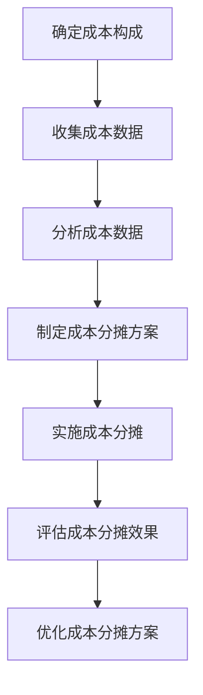
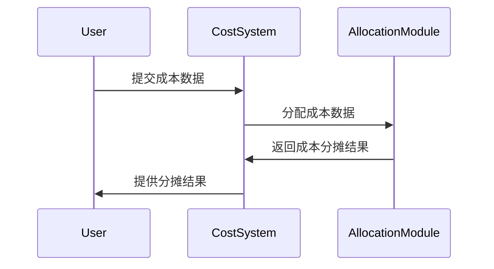

                 

### 如何进行有效的技术成本分摊

> 关键词：技术成本、成本分摊、效益分析、资源配置、IT项目管理

> 摘要：本文旨在探讨如何在技术领域中实施有效的成本分摊策略。通过详细分析技术成本的构成、关键因素和分摊方法，并结合实际案例分析，提供一套系统性、操作性强的成本分摊框架，以指导IT项目管理实践，提升企业竞争力。

----------------------------------------------------------------

### 目录大纲：

----------------------------------------------------------------

# 如何进行有效的技术成本分摊

## 引言

### 问题提出

### 成本分摊的意义

## 第一部分：背景与核心概念

### 第1章：技术成本分摊的背景与意义

#### 1.1.1 问题背景与现状

#### 1.1.2 技术成本分摊的重要性

#### 1.1.3 成本分摊的方法概述

### 第2章：技术成本的核心概念

#### 2.1.1 成本定义与分类

#### 2.1.2 成本计算方法

#### 2.1.3 成本分摊原则

### 第3章：技术成本分摊的关键因素

#### 3.1.1 技术特性分析

#### 3.1.2 产品生命周期考量

#### 3.1.3 市场竞争与战略目标

### 第4章：成本分摊的核心概念联系

#### 4.1.1 成本分摊流程与逻辑

#### 4.1.2 成本分摊与收益分配的关系

#### 4.1.3 成本分摊与财务管理的衔接

### 第5章：成本分摊方法与工具

#### 5.1.1 传统成本分摊方法

#### 5.1.2 现代成本分摊技术

#### 5.1.3 成本分摊工具的应用

### 第6章：案例分析

#### 6.1.1 案例一：软件开发成本分摊

#### 6.1.2 案例二：系统集成项目成本分摊

#### 6.1.3 案例三：IT服务成本分摊

### 第7章：最佳实践与策略

#### 7.1.1 成本分摊的策略制定

#### 7.1.2 最佳实践分享

#### 7.1.3 注意事项与风险防范

### 第8章：未来趋势与展望

#### 8.1.1 技术成本分摊的未来趋势

#### 8.1.2 新兴技术的应用前景

#### 8.1.3 成本分摊的可持续性发展

## 结束语

### 总结

### 展望

----------------------------------------------------------------

## 引言

### 问题提出

在信息技术飞速发展的今天，企业对技术投入的需求不断增大。然而，如何合理地进行技术成本分摊，使得资源得到最优化配置，从而提高企业的竞争力，成为了一个亟待解决的问题。技术成本分摊不仅关乎企业的财务健康，更直接影响项目管理和运营效率。

技术成本分摊的难点主要体现在以下几个方面：

1. **复杂性**：技术项目的多样性使得成本构成复杂，涉及硬件、软件、人力资源等多个方面。
2. **变动性**：技术成本受市场需求、技术迭代等多种因素影响，具有较大的变动性。
3. **效益评估**：如何准确衡量技术投入的效益，是成本分摊的重要一环。

### 成本分摊的意义

有效的技术成本分摊具有以下意义：

1. **优化资源配置**：通过合理分摊成本，企业可以更清晰地了解各项目的资源需求，从而优化资源配置。
2. **提升项目管理效率**：明确成本分配有助于项目团队更好地进行任务分配和进度管理。
3. **支持决策制定**：准确的技术成本数据有助于企业在项目投资和预算制定中做出更科学的决策。
4. **提高竞争力**：通过有效的成本控制，企业可以降低成本，提高产品或服务的性价比，从而在市场竞争中占据有利地位。

### 本文结构

本文将围绕技术成本分摊这一主题，首先介绍相关背景和核心概念，然后分析影响成本分摊的关键因素，接着探讨成本分摊的流程和方法，并结合实际案例进行分析，最后提出最佳实践和未来展望。希望通过本文，能够为读者提供一套系统、有效的技术成本分摊策略。

----------------------------------------------------------------

## 第一部分：背景与核心概念

### 第1章：技术成本分摊的背景与意义

#### 1.1.1 问题背景与现状

在当今快速发展的信息技术时代，企业对技术投入的需求日益增加。无论是软件开发、系统集成还是IT服务，技术成本已成为企业运营的重要组成部分。然而，如何对技术成本进行有效的分摊，使得资源得以优化配置，从而提高企业的竞争力，成为了一个亟待解决的问题。

当前，技术成本分摊面临着以下几个方面的挑战：

1. **成本构成的复杂性**：技术项目的多样性使得成本构成复杂，不仅包括硬件成本、软件成本，还包括人力资源成本、维护成本等。不同项目的成本构成差异较大，增加了成本分摊的难度。

2. **成本变动的不可预测性**：技术成本受市场需求、技术迭代、供应链变化等多种因素影响，具有较大的变动性。这使得成本分摊结果难以准确预测，增加了财务风险。

3. **效益评估的复杂性**：技术投入的效益评估是一个复杂的过程，不仅涉及直接的财务收益，还包括技术改进带来的间接效益。如何准确衡量技术成本与效益之间的关系，是成本分摊的关键一环。

#### 1.1.2 技术成本分摊的重要性

技术成本分摊在企业的运营和项目管理中具有重要意义：

1. **优化资源配置**：通过合理分摊成本，企业可以更清晰地了解各项目的资源需求，从而优化资源配置。例如，通过分析不同项目的成本构成，企业可以确定哪些项目需要优先投资，哪些项目需要调整预算，从而提高资源利用效率。

2. **提升项目管理效率**：明确成本分配有助于项目团队更好地进行任务分配和进度管理。例如，在软件开发项目中，通过分摊技术成本，可以更清楚地了解每个模块的开发成本，从而合理分配开发资源，提高开发效率。

3. **支持决策制定**：准确的技术成本数据有助于企业在项目投资和预算制定中做出更科学的决策。例如，通过分析不同项目的成本效益，企业可以确定哪些项目值得投资，哪些项目需要砍掉，从而优化投资结构。

4. **提高竞争力**：通过有效的成本控制，企业可以降低成本，提高产品或服务的性价比，从而在市场竞争中占据有利地位。例如，通过分摊IT服务成本，企业可以为客户提供更有竞争力的价格，从而吸引更多客户。

#### 1.1.3 成本分摊的方法概述

为了实现有效的技术成本分摊，企业可以采用以下几种方法：

1. **直接分配法**：将直接与特定项目相关的成本直接分配到该项目中。这种方法适用于成本构成简单、项目目标明确的情况。

2. **间接分配法**：将无法直接归属于特定项目的成本，通过一定的分配规则分配到各项目中。这种方法适用于成本构成复杂、项目目标多样化的情况。

3. **活动基础成本分配法**：根据项目活动中消耗的资源数量和成本，将成本分配到各项目中。这种方法适用于成本与项目活动密切相关的情况。

4. **成本效益分析法**：通过分析各项目的成本效益，将成本分摊到效益最高的项目中。这种方法适用于需要优化资源分配的情况。

5. **零基预算法**：从零开始，重新评估每个项目的成本需求，进行成本分摊。这种方法适用于企业需要对现有成本结构进行重大调整的情况。

通过结合以上方法，企业可以根据实际情况选择合适的成本分摊策略，从而实现资源的最优化配置，提高企业的运营效率和竞争力。

---

### 第2章：技术成本的核心概念

#### 2.1.1 成本定义与分类

在讨论技术成本分摊之前，我们需要明确什么是成本，以及成本可以分为哪些类别。

**成本定义：**
成本是指企业在生产或提供产品和服务过程中所消耗的经济资源。这些资源包括资金、人力、物资、时间等。成本是企业管理中一个重要的财务指标，直接影响企业的利润和财务健康。

**成本分类：**
1. **固定成本**：固定成本是指在短期内不随生产量或服务量变化的成本。例如，租金、折旧、高级管理人员的工资等。固定成本通常在企业的运营预算中固定，不随业务量的增减而变化。
   
2. **变动成本**：变动成本是指随着生产量或服务量的变化而变化的成本。例如，原材料成本、直接劳动成本、运输费用等。变动成本与业务量的变化呈正比关系。

3. **直接成本**：直接成本是指可以直接归属于特定产品或项目的成本。例如，直接材料和直接人工成本。这些成本可以直接追溯到特定的生产或服务活动中。

4. **间接成本**：间接成本是指无法直接归属于特定产品或项目的成本，通常需要通过一定的分配规则进行分摊。例如，行政费用、营销费用、设备维护费用等。这些成本通常涉及到多个产品或项目。

5. **可避免成本**：可避免成本是指在特定情况下可以选择避免发生的成本。例如，当企业面临市场需求下降时，可以选择减少生产量以避免不必要的成本支出。

6. **不可避免成本**：不可避免成本是指在某些情况下必须发生的成本，无论企业的生产量或服务量如何变化。例如，设备的折旧和维护费用。

了解成本的分类有助于我们更好地进行成本分摊和成本控制，从而优化企业的资源配置和财务状况。

#### 2.1.2 成本计算方法

**成本计算方法是企业进行成本分析和预算制定的基础。以下是一些常见的成本计算方法：**

1. **完全成本法**：完全成本法将所有成本（包括固定成本和变动成本）计入产品成本中。这种方法适用于制造业和产品导向型企业。通过完全成本法，企业可以全面了解产品的成本结构，为定价和利润分析提供依据。

2. **变动成本法**：变动成本法仅将变动成本计入产品成本中，而将固定成本视为期间成本。这种方法适用于成本敏感型的企业和市场环境。通过变动成本法，企业可以更灵活地调整生产量和定价策略。

3. **边际成本法**：边际成本法是指将新增加的每一单位产品或服务的成本计算出来。这种方法有助于企业确定最优生产量和定价策略。例如，当边际成本低于市场价格时，企业可以增加生产量以获取更多利润。

4. **作业成本法**：作业成本法通过将成本分配到具体的作业活动中，从而更准确地计算每个产品的成本。这种方法适用于成本结构复杂、产品多样化的企业。通过作业成本法，企业可以更清晰地了解各个作业活动的成本效益，从而优化资源分配。

5. **目标成本法**：目标成本法是指根据市场需求和预期利润，确定产品的目标成本，然后通过成本控制和优化，实现目标成本。这种方法有助于企业实现成本领先战略，提高市场竞争力。

选择合适的成本计算方法需要考虑企业的业务特点、市场环境和成本结构。通过科学合理的成本计算方法，企业可以更准确地评估成本效益，制定有效的成本分摊策略。

#### 2.1.3 成本分摊原则

**成本分摊原则是企业进行成本分配的基本准则，以下是一些常见的成本分摊原则：**

1. **受益原则**：受益原则是指按照各项目或部门的受益程度进行成本分摊。受益越多的项目或部门应承担更多的成本。这种方法有助于激励各项目或部门提高效益，优化资源配置。

2. **公平原则**：公平原则是指按照各项目或部门的贡献程度进行成本分摊。公平原则要求成本分摊结果应合理反映各项目或部门的成本贡献，避免不公平现象的发生。

3. **历史成本原则**：历史成本原则是指按照各项目或部门的历史成本数据进行成本分摊。这种方法适用于成本结构稳定、变化不大的企业。通过历史成本原则，企业可以保持成本分摊的连续性和稳定性。

4. **实际成本原则**：实际成本原则是指按照各项目或部门的实际成本数据（如变动成本或边际成本）进行成本分摊。这种方法适用于成本结构变化较大、需要灵活调整的企业。通过实际成本原则，企业可以更准确地反映当前的成本状况。

5. **效益原则**：效益原则是指按照各项目或部门的效益进行成本分摊。效益原则要求成本分摊结果应能够促进企业的整体效益提升。例如，将成本分摊到效益较高的项目或部门，以实现资源的最优配置。

不同的成本分摊原则适用于不同的企业和业务场景。企业应根据自身实际情况，选择合适的成本分摊原则，以确保成本分摊结果的合理性和有效性。

---

通过对技术成本的核心概念、成本计算方法和成本分摊原则的探讨，我们为后续章节的技术成本分摊实践奠定了理论基础。接下来，我们将进一步分析影响技术成本分摊的关键因素，为制定有效的成本分摊策略提供指导。

----------------------------------------------------------------

### 第3章：技术成本分摊的关键因素

#### 3.1.1 技术特性分析

在技术成本分摊过程中，技术特性是影响成本分摊的重要因素之一。不同类型的技术项目具有不同的技术特性，这些特性直接影响到成本的构成和分配方式。

**1. 技术复杂性：**
技术复杂性是衡量技术项目难度和复杂度的一个重要指标。高复杂性技术项目通常需要更先进的技术和更多的人力资源投入，从而导致更高的成本。例如，软件开发项目中，复杂系统开发所需的研发周期更长，需要更多的高级工程师参与，成本自然会更高。因此，在成本分摊时，需要充分考虑技术复杂性对成本的影响。

**2. 技术创新程度：**
技术创新程度反映了技术项目的创新性。高技术创新项目往往伴随着高风险和高投入，例如新兴技术的研发和应用。这些项目的成本构成复杂，不仅包括研发成本，还可能包括实验成本、验证成本等。因此，在成本分摊时，需要根据技术创新程度来调整成本分配，以确保各项目能够得到合理的资源支持。

**3. 技术标准化程度：**
技术标准化程度影响技术项目的可复用性和维护成本。高度标准化的技术可以更容易地实现模块化和复用，从而降低维护成本。相反，非标准化技术可能需要更多的定制化开发和维护工作，导致成本上升。因此，在成本分摊时，需要根据技术标准化程度来评估维护成本，并进行合理的成本分配。

**4. 技术更新速度：**
技术更新速度是技术项目的一个重要特性。快速更新技术的项目往往需要更高的维护成本和研发投入，以确保技术始终保持竞争力。在成本分摊时，需要考虑技术更新速度对成本的影响，为高更新速度的技术项目提供足够的资源支持。

**5. 技术协同性：**
技术协同性是指技术项目之间在技术实现上的相互依赖程度。高协同性的项目往往需要更多的协调和沟通，从而导致更高的沟通成本和管理成本。在成本分摊时，需要考虑技术协同性对成本的影响，合理安排资源分配，以提高项目的整体效率。

通过对技术特性的分析，企业可以更好地理解技术项目的成本构成，从而制定更合理的成本分摊策略。

#### 3.1.2 产品生命周期考量

产品生命周期是指产品从研发、上市、销售到退市的全过程。不同阶段的产品生命周期对技术成本分摊具有显著影响。

**1. 研发阶段：**
在研发阶段，技术项目的成本主要集中在研发投入上，包括研发人员工资、实验设备费用、软件开发费用等。此时，成本分摊应重点考虑研发资源的合理配置，确保研发项目能够得到充分的资源支持，从而降低研发风险和缩短研发周期。

**2. 上市阶段：**
在产品上市阶段，技术成本主要涉及生产成本、营销成本和售后服务成本等。此时，成本分摊需要根据产品的销售情况和市场反馈来调整资源分配，以确保产品能够快速占领市场，提高市场占有率。

**3. 销售阶段：**
在销售阶段，技术成本主要集中在维护和升级成本上。此时，成本分摊应考虑产品的生命周期价值和维护成本，合理安排资源投入，以延长产品的生命周期，提高企业的经济效益。

**4. 退市阶段：**
在产品退市阶段，技术成本主要集中在报废处理和资产清算上。此时，成本分摊需要考虑产品的报废成本和清算价值，确保资源得到最大化利用。

产品生命周期的不同阶段对技术成本分摊的影响是动态变化的。企业需要根据产品生命周期各阶段的特点，制定相应的成本分摊策略，以确保技术成本的合理分摊和资源的最优化配置。

#### 3.1.3 市场竞争与战略目标

市场竞争和战略目标也是影响技术成本分摊的重要因素。企业根据市场竞争和战略目标来调整成本分摊策略，以实现市场竞争优势和企业目标。

**1. 市场竞争态势：**
在激烈的市场竞争中，企业需要通过降低成本来提高产品的性价比，从而赢得市场份额。此时，成本分摊策略应注重降低生产成本和服务成本，提高生产效率和服务质量。

**2. 竞争对手分析：**
企业需要分析竞争对手的成本结构和策略，以制定相应的成本分摊策略。例如，如果竞争对手采用低成本战略，企业则需要通过技术创新和提高生产效率来降低成本。

**3. 战略目标：**
企业的战略目标直接影响成本分摊策略的制定。例如，如果企业的战略目标是实现成本领先，则成本分摊策略应重点降低生产成本；如果企业的战略目标是技术领先，则成本分摊策略应重点投入研发成本，提高技术创新能力。

通过考虑市场竞争和战略目标，企业可以制定更合理的成本分摊策略，以实现市场竞争优势和企业目标。

---

通过分析技术特性、产品生命周期和市场竞争与战略目标，企业可以更好地理解影响技术成本分摊的关键因素。这些因素不仅影响成本构成的合理性，还影响资源分配的优化程度。在下一章节中，我们将进一步探讨成本分摊的核心概念联系，为制定全面、有效的成本分摊策略提供指导。

----------------------------------------------------------------

### 第4章：成本分摊的核心概念联系

#### 4.1.1 成本分摊流程与逻辑

成本分摊是一个系统性的过程，涉及多个步骤和环节，以确保成本分配的合理性和准确性。以下是成本分摊的主要流程与逻辑：

**1. 确定成本构成：**
首先，企业需要明确技术项目的成本构成，包括直接成本和间接成本。直接成本通常与特定项目直接相关，如研发费用、硬件采购费用等；间接成本则涉及多个项目的共享成本，如办公场所租金、管理费用等。

**2. 收集成本数据：**
在明确成本构成后，企业需要收集相关成本数据，包括直接成本和间接成本的数据。这些数据可以通过财务系统、项目管理系统等工具进行收集和整理。

**3. 分析成本数据：**
收集到成本数据后，企业需要对成本数据进行分析，识别成本驱动因素，并确定各项目或部门对成本的实际贡献。分析过程可以采用统计分析、成本效益分析等方法，以提高成本数据的准确性和可靠性。

**4. 制定成本分摊方案：**
根据成本分析结果，企业需要制定具体的成本分摊方案。成本分摊方案应明确成本分摊的原则、方法和分配标准，以确保成本分摊结果的合理性和公平性。

**5. 实施成本分摊：**
在制定成本分摊方案后，企业需要按照方案进行成本分摊，将各项成本分配到各项目或部门。实施过程中，需要确保成本分配的准确性和及时性，以避免资源浪费和效率低下。

**6. 评估成本分摊效果：**
成本分摊实施后，企业需要定期评估成本分摊效果，分析成本分摊方案是否达到预期目标。评估过程可以采用成本效益分析、绩效评估等方法，以便及时发现问题和优化成本分摊策略。

**7. 优化成本分摊方案：**
根据评估结果，企业需要不断优化成本分摊方案，调整成本分配比例和方法，以提高成本分摊的合理性和有效性。优化过程可以采用试错法、仿真模拟等方法，以找到最优的成本分摊方案。

通过以上流程和逻辑，企业可以建立一套系统化、规范化的成本分摊体系，确保成本分配的合理性和准确性，从而提高资源利用效率和企业的整体竞争力。

#### 4.1.2 成本分摊与收益分配的关系

成本分摊和收益分配是企业管理中紧密相关的一对概念。成本分摊是将技术项目的成本分配到各个相关项目或部门，而收益分配则是将项目的收益按照一定的原则分配给相关项目或部门。

**1. 成本分摊与收益分配的关联性：**
成本分摊和收益分配之间存在紧密的关联性。合理有效的成本分摊可以为收益分配提供准确的基础数据，确保收益分配的公正性和合理性。反之，不合理的成本分摊可能导致收益分配不公，影响企业内部合作和整体效益。

**2. 成本分摊对收益分配的影响：**
成本分摊结果直接影响收益分配的合理性和准确性。例如，如果成本分摊过程中存在偏差，导致某些项目承担了不合理的成本，则这些项目在收益分配过程中可能会得到不公正的收益，从而影响企业的整体效益。

**3. 收益分配对成本分摊的反馈作用：**
收益分配结果也可以为成本分摊提供反馈，帮助企业优化成本分摊策略。例如，通过分析收益分配结果，企业可以发现成本分摊过程中存在的问题，如某些项目成本分摊不足或过度分摊，从而调整成本分摊方案，提高成本分摊的合理性和有效性。

**4. 平衡成本分摊与收益分配：**
在成本分摊与收益分配的过程中，企业需要平衡两者之间的关系，确保成本分摊合理、收益分配公正。具体措施包括：
- 采用科学的成本分摊方法，确保成本数据的准确性和可靠性；
- 定期进行成本效益分析和绩效评估，及时发现和解决成本分摊中的问题；
- 建立有效的沟通和协调机制，确保各项目或部门之间的成本和收益数据一致；
- 根据企业战略目标，合理调整成本分摊与收益分配的比例和方法。

通过平衡成本分摊与收益分配，企业可以优化资源配置，提高整体效益，实现可持续发展。

#### 4.1.3 成本分摊与财务管理的衔接

成本分摊与财务管理是企业管理中两个重要的方面，它们之间存在密切的衔接关系。有效的成本分摊是财务管理的基础，而财务管理则为成本分摊提供了重要的指导和支持。

**1. 成本分摊对财务管理的支持：**
成本分摊结果直接影响企业的财务状况和财务报表。例如，准确的成本分摊可以帮助企业更准确地计算产品成本和利润，为财务决策提供可靠的数据支持。此外，成本分摊还可以帮助企业识别和管理成本风险，优化资源配置，提高运营效率。

**2. 财务管理对成本分摊的指导：**
财务管理为成本分摊提供了重要的指导和支持。例如，企业可以通过预算管理、财务分析等方法，制定合理的成本分摊方案，确保成本分摊的合理性和有效性。财务管理还可以通过资金管理、成本控制等方法，监督和指导成本分摊的实施过程，确保成本分摊目标的实现。

**3. 成本分摊与财务管理的协同效应：**
成本分摊与财务管理相互协同，可以产生良好的效益。例如，通过成本分摊，企业可以更准确地了解各项目的成本构成和资源消耗，从而优化资源配置，降低运营成本。财务管理则可以通过资金管理、成本控制等方法，确保成本分摊方案的顺利实施，提高企业的财务健康水平。

**4. 建立成本分摊与财务管理的协同机制：**
为了实现成本分摊与财务管理的协同效应，企业需要建立一套完善的协同机制。具体措施包括：
- 建立统一的数据平台，实现成本分摊和财务管理数据的共享和互通；
- 制定统一的成本分摊和财务管理流程，确保各环节的协同性和一致性；
- 定期进行成本效益分析和绩效评估，及时发现和解决问题；
- 建立有效的沟通和协调机制，确保成本分摊和财务管理的顺利实施。

通过建立成本分摊与财务管理的协同机制，企业可以优化资源配置，提高运营效率，实现可持续发展。

---

通过探讨成本分摊的流程与逻辑、成本分摊与收益分配的关系以及成本分摊与财务管理的衔接，我们为技术成本分摊提供了全面的指导。在下一章节中，我们将介绍具体的技术成本分摊方法与工具，帮助企业实现有效的成本分摊。

----------------------------------------------------------------

### 第5章：成本分摊方法与工具

#### 5.1.1 传统成本分摊方法

**1. 直接分配法**

直接分配法是一种简单且常见的成本分摊方法，适用于直接成本容易划分的项目。其核心思想是将直接与特定项目相关的成本直接分配到该项目中，而不进行进一步的分摊。

**特点与应用：**
- **特点：** 直接、简单，成本分配明确。
- **适用场景：** 成本项目构成简单，各项目之间相互独立。

**计算公式：**
$$
成本分配 = 成本总额 / 项目数量
$$

**2. 间接分配法**

间接分配法适用于无法直接归属于特定项目的成本，通过一定的分配规则进行分摊。常见的间接分配法包括按工作量、按使用量、按收益等比例分摊。

**特点与应用：**
- **特点：** 灵活、多样化，适用于复杂项目。
- **适用场景：** 项目之间存在资源共享和相互依赖。

**计算公式：**
$$
成本分配 = (总成本 - 直接成本) / 分配基础（如工作量、使用量、收益等）
$$

**3. 活动基础成本分配法**

活动基础成本分配法（Activity-Based Costing, ABC）根据成本驱动因素将间接成本分摊到各个活动，再根据活动消耗量分摊到相关项目。

**特点与应用：**
- **特点：** 精细化，提高成本分配的准确性。
- **适用场景：** 成本项目复杂，涉及多个活动。

**计算公式：**
$$
成本分配 = 成本池总额 / 活动消耗量
$$

#### 5.1.2 现代成本分摊技术

**1. 数据挖掘与机器学习**

数据挖掘与机器学习技术可以用于成本分摊的预测和优化。通过分析大量历史成本数据，机器学习模型可以识别成本驱动因素，预测未来成本趋势，并优化成本分摊方案。

**特点与应用：**
- **特点：** 自动化、智能化，提高成本预测准确性。
- **适用场景：** 成本数据量大，需要实时优化成本分摊。

**计算方法：**
- **模型训练：** 采用回归分析、聚类分析等方法，训练成本预测模型。
- **模型应用：** 根据预测结果，调整成本分摊比例，实现成本优化。

**2. 云计算与大数据分析**

云计算和大数据分析技术可以提供强大的数据处理和分析能力，支持复杂成本分摊的计算和优化。

**特点与应用：**
- **特点：** 高性能、可扩展，适用于大规模数据处理。
- **适用场景：** 成本项目多样化，需要高效处理大量数据。

**计算方法：**
- **数据处理：** 使用Hadoop、Spark等大数据处理框架，进行数据处理和分析。
- **成本分析：** 通过数据挖掘技术，识别成本驱动因素，优化成本分摊方案。

#### 5.1.3 成本分摊工具的应用

**1. 成本管理软件**

成本管理软件如SAP ERP、Oracle E-Business Suite等，提供了强大的成本分摊功能，支持多维度、多层次的成本分摊计算和分析。

**特点与应用：**
- **特点：** 功能丰富、集成度高，提供全面的成本管理解决方案。
- **适用场景：** 企业规模较大，需要全面、精细的成本管理。

**功能模块：**
- **成本收集：** 收集各类成本数据，提供数据输入接口。
- **成本分析：** 提供多维度成本分析，支持自定义报表。
- **成本分摊：** 根据分配规则，计算和分配各项成本。

**2. 项目管理软件**

项目管理软件如Microsoft Project、JIRA等，提供了项目成本管理功能，支持项目成本的监控和分摊。

**特点与应用：**
- **特点：** 专注于项目管理和成本控制，提供灵活的定制化功能。
- **适用场景：** 项目团队规模较小，需要高效的项目成本管理。

**功能模块：**
- **项目计划：** 制定项目计划，分配任务和资源。
- **成本预算：** 设置项目成本预算，监控实际成本。
- **成本跟踪：** 记录项目实际成本，与预算进行比较。

通过结合传统成本分摊方法和现代成本分摊技术，企业可以建立一套高效、精确的成本分摊体系，优化资源配置，提高运营效率，实现可持续发展。

----------------------------------------------------------------

### 第6章：案例分析

#### 6.1.1 案例一：软件开发成本分摊

**案例背景：**
某大型软件公司正在开发一款全新的企业资源规划（ERP）系统，项目涉及多个模块，包括财务管理、人力资源管理和生产管理。公司需要在有限资源下，确保各模块的顺利开发和按时交付。

**成本构成：**
- **研发成本**：包括高级开发人员工资、测试工程师费用、软件开发工具费用等。
- **硬件成本**：服务器租赁费用、网络设备费用等。
- **间接成本**：包括办公场所租金、行政管理费用、水电费等。

**成本分摊方案：**
1. **直接成本分摊**：
   - 研发成本直接分摊到各模块项目，根据各模块的开发人员数量和工作时长进行分配。
   - 硬件成本根据各模块所需的计算资源进行分配。

2. **间接成本分摊**：
   - 办公场所租金、行政管理费用等根据各模块项目的工作量和使用情况进行分摊。

**成本分摊实施：**
1. 收集各模块的研发和工作量数据，计算各模块的直接成本。
2. 根据各模块的工作量和资源使用，计算间接成本。
3. 将直接成本和间接成本汇总，生成各模块的总成本。
4. 将总成本分配到各模块项目，形成详细的成本报表。

**效果评估：**
1. 成本分摊后，各模块项目成本清晰明确，有助于项目管理团队进行预算控制和进度管理。
2. 通过成本分摊，公司能够更有效地优化资源配置，确保各模块的顺利开发和按时交付。

#### 6.1.2 案例二：系统集成项目成本分摊

**案例背景：**
某系统集成公司承接了一个大型数据中心建设项目，项目包括服务器采购、网络设备部署、存储系统安装等。公司需要在确保项目质量的前提下，实现成本的合理分摊和有效控制。

**成本构成：**
- **硬件成本**：包括服务器、存储设备、网络设备等。
- **人力成本**：包括工程师的工资、现场施工费用等。
- **间接成本**：包括项目管理费用、行政办公费用等。

**成本分摊方案：**
1. **直接成本分摊**：
   - 硬件成本根据各设备和服务的使用量进行分配。
   - 人力成本根据工程师的工作时长和任务完成情况进行分配。

2. **间接成本分摊**：
   - 项目管理费用根据项目进度和项目管理工作量进行分配。
   - 行政办公费用根据公司整体运营情况分摊到各个项目。

**成本分摊实施：**
1. 收集各设备和服务的使用数据和工程师的工作记录，计算各项目的直接成本。
2. 根据项目进度和项目管理工作量，计算间接成本。
3. 将直接成本和间接成本汇总，形成各项目的总成本。
4. 将总成本分摊到各项目，生成详细的成本报表。

**效果评估：**
1. 成本分摊后，公司能够更清晰地了解各项目的成本构成，有助于进行成本分析和优化。
2. 通过成本分摊，公司能够更好地控制项目成本，提高项目效益，确保项目质量。

#### 6.1.3 案例三：IT服务成本分摊

**案例背景：**
某IT服务公司提供企业信息安全管理服务，服务内容包括网络安全监控、数据备份和恢复等。公司需要根据客户需求，合理分摊服务成本，确保服务的可持续性和盈利性。

**成本构成：**
- **服务成本**：包括技术人员工资、软件许可证费用、服务支持费用等。
- **硬件成本**：包括服务器租赁费用、网络设备费用等。
- **间接成本**：包括公司行政管理费用、营销费用等。

**成本分摊方案：**
1. **直接成本分摊**：
   - 服务成本根据客户的服务需求和合同金额进行分配。
   - 硬件成本根据客户使用硬件资源的数量和时长进行分配。

2. **间接成本分摊**：
   - 行政管理费用根据公司整体运营情况分摊到各个服务项目。
   - 营销费用根据服务项目的销售业绩进行分配。

**成本分摊实施：**
1. 收集各项目的服务记录和硬件使用数据，计算各项目的直接成本。
2. 根据公司整体运营情况和销售业绩，计算间接成本。
3. 将直接成本和间接成本汇总，形成各项目的总成本。
4. 将总成本分摊到各项目，生成详细的成本报表。

**效果评估：**
1. 成本分摊后，公司能够更准确地了解各项目的成本构成，有助于进行成本控制和绩效评估。
2. 通过成本分摊，公司能够优化服务资源的配置，提高服务质量和客户满意度，实现持续盈利。

---

通过以上案例分析，我们可以看到，有效的技术成本分摊在软件开发、系统集成和IT服务项目中都发挥了重要作用。合理分摊成本不仅有助于企业优化资源配置，提高项目管理效率，还能提升企业的市场竞争力和盈利能力。在下一章节中，我们将探讨最佳实践与策略，为企业提供技术成本分摊的实用指南。

----------------------------------------------------------------

### 第7章：最佳实践与策略

#### 7.1.1 成本分摊的策略制定

制定有效的成本分摊策略是企业实现成本优化和资源高效配置的关键。以下是一些关键步骤和策略：

**1. 明确目标和标准：**
   - 设定明确的成本分摊目标，如提高资源利用率、降低运营成本等。
   - 制定统一的成本分摊标准，包括成本分类、分配原则和计算方法。

**2. 数据收集与整理：**
   - 建立完善的数据收集系统，确保成本数据的准确性和完整性。
   - 定期整理和更新成本数据，为成本分摊提供可靠的基础。

**3. 成本分摊方法选择：**
   - 根据业务特点和项目需求，选择合适的成本分摊方法，如直接分配法、间接分配法、活动基础成本分配法等。
   - 结合现代技术手段，如数据挖掘、机器学习等，提高成本分摊的准确性和效率。

**4. 实施与监控：**
   - 制定详细的成本分摊实施计划，明确责任人和时间节点。
   - 建立成本分摊监控机制，定期评估成本分摊效果，及时调整分摊方案。

**5. 沟通与协作：**
   - 加强部门间的沟通与协作，确保成本分摊方案得到全员认同和支持。
   - 定期组织成本分摊培训，提高员工对成本分摊方法和策略的理解和执行力。

#### 7.1.2 最佳实践分享

**1. 软件开发成本分摊：**
   - 采用敏捷开发模式，根据项目进展和需求变化动态调整成本分摊方案。
   - 引入自动化测试和持续集成工具，提高开发效率，降低测试和维护成本。

**2. 系统集成项目成本分摊：**
   - 建立项目协同平台，实现设备和资源的统一管理和调度。
   - 引入供应链管理软件，优化采购和库存管理，降低硬件成本。

**3. IT服务成本分摊：**
   - 采用服务级别协议（SLA），明确服务标准和成本分摊规则。
   - 引入客户关系管理系统（CRM），优化客户服务和销售管理，提高服务质量。

#### 7.1.3 注意事项与风险防范

**1. 成本数据准确性：**
   - 加强成本数据管理，确保数据的准确性和及时性。
   - 定期进行数据审计和核对，防止数据错误和遗漏。

**2. 成本分摊公平性：**
   - 制定合理的成本分摊原则和方法，确保成本分摊结果的公平性和合理性。
   - 加强内部监督和审计，防止不公平现象的发生。

**3. 成本控制与优化：**
   - 实施成本控制措施，如预算管理、成本削减等，确保成本分摊目标的实现。
   - 定期进行成本效益分析，优化成本结构和分摊方案。

**4. 风险管理：**
   - 建立风险管理机制，识别和评估成本分摊过程中的潜在风险。
   - 制定风险应对策略，如应急预案、风险转移等，降低风险对企业的影响。

通过制定有效的成本分摊策略、分享最佳实践和防范风险，企业可以更好地实现成本优化，提高资源利用效率，增强市场竞争力和可持续发展能力。

----------------------------------------------------------------

### 第8章：未来趋势与展望

#### 8.1.1 技术成本分摊的未来趋势

随着技术的不断进步和企业管理理念的更新，技术成本分摊领域也在不断演变。以下是技术成本分摊的一些未来趋势：

**1. 数据驱动的成本分摊：**
随着大数据和人工智能技术的发展，越来越多的企业开始利用数据驱动的方式进行成本分摊。通过分析大量的历史数据，企业可以更精准地识别成本驱动因素，优化成本分配策略，提高成本分摊的准确性和效率。

**2. 智能化成本分摊工具：**
未来，智能化成本分摊工具将成为企业成本管理的重要工具。这些工具将基于机器学习、数据挖掘等技术，自动收集、分析和分配成本，帮助企业实现更高效的成本管理。

**3. 跨领域协作的成本分摊：**
随着企业业务范围的不断扩大和跨界合作的需求增加，跨领域协作的成本分摊将成为一个重要趋势。企业需要建立跨领域的成本分摊机制，确保在不同领域间的成本分配公平合理。

**4. 环境和可持续成本分摊：**
随着可持续发展理念的普及，企业在进行成本分摊时将更加关注环境成本和社会成本。未来，企业可能会引入更多与环境和社会责任相关的成本指标，以实现更全面、更可持续的成本分摊。

#### 8.1.2 新兴技术的应用前景

新兴技术为技术成本分摊带来了新的机遇和挑战。以下是一些新兴技术的应用前景：

**1. 区块链技术：**
区块链技术具有去中心化、不可篡改的特点，可以用于提高成本分摊的透明度和安全性。未来，区块链技术有望在成本分摊数据管理和审计方面发挥重要作用。

**2. 物联网（IoT）技术：**
物联网技术可以通过实时数据收集和监控，提供更准确、更实时的成本数据，帮助企业实现更精细化的成本分摊。

**3. 虚拟现实（VR）和增强现实（AR）技术：**
虚拟现实和增强现实技术可以用于成本分摊的模拟和可视化，帮助企业管理者更直观地了解成本分配情况，优化成本分摊策略。

**4. 自动化与机器人流程自动化（RPA）：**
自动化和RPA技术可以用于成本分摊数据的收集、分析和处理，提高成本分摊的效率和准确性。

#### 8.1.3 成本分摊的可持续性发展

在可持续性发展的大背景下，成本分摊也需要遵循可持续性原则。以下是一些关键点：

**1. 成本分摊与可持续发展：**
企业应将可持续发展目标纳入成本分摊策略中，考虑环境成本和社会成本，确保成本分摊的可持续性。

**2. 成本效益分析：**
在进行成本分摊时，企业应进行全面的成本效益分析，确保成本分摊策略能够带来长期的效益，而不仅仅是短期的成本节约。

**3. 持续改进：**
企业应建立持续改进机制，不断优化成本分摊策略，以适应不断变化的市场环境和业务需求。

通过关注未来趋势、新兴技术的应用前景以及可持续性发展，企业可以更有效地进行技术成本分摊，提高资源利用效率，实现可持续发展目标。

----------------------------------------------------------------

## 结束语

通过本文的探讨，我们系统地阐述了技术成本分摊的重要性、核心概念、关键因素以及实际应用。有效的技术成本分摊不仅有助于企业优化资源配置，提高项目管理效率，还能支持企业做出更科学的决策，提高市场竞争力和盈利能力。

在未来的技术成本分摊实践中，企业应关注以下方面：

1. **数据驱动**：利用大数据和人工智能技术，提高成本分摊的准确性和效率。
2. **智能化工具**：引入智能化成本分摊工具，实现自动化和智能化管理。
3. **跨领域协作**：建立跨领域的成本分摊机制，确保公平合理的成本分配。
4. **可持续发展**：将可持续发展目标纳入成本分摊策略，实现经济效益和社会效益的双赢。

让我们共同努力，通过不断优化和改进技术成本分摊策略，为企业的发展注入新的活力。

## 作者信息

作者：AI天才研究院/AI Genius Institute & 禅与计算机程序设计艺术 /Zen And The Art of Computer Programming

AI天才研究院致力于推动人工智能技术的发展和应用，研究覆盖人工智能、机器学习、深度学习等多个领域。同时，我们致力于将禅的哲学思想融入计算机编程，探索高效编程的奥秘。

禅与计算机程序设计艺术是AI天才研究院的经典之作，融合了东方哲学与计算机科学的精髓，为程序员提供了独特的思维方式和编程理念。通过阅读本书，读者可以领略到编程的艺术之美，提升编程技能和创造力。

----------------------------------------------------------------

### Mermaid 流程图 - 成本分摊流程



### Mermaid 类图 - 成本分摊核心类

```mermaid
classDiagram
    ClassCost <<class>>
    ClassCost : +costItems[]
    ClassCost : +calculateTotalCost()
    ClassCost : +allocateCost()

    ClassCostCostItem <|-- ClassCostItem
    ClassCostItem : +itemDescription
    ClassCostItem : +quantity
    ClassCostItem : +unitCost
```

### Mermaid 序列图 - 系统架构交互



### 数学模型和公式

**成本计算公式：**

$$
总成本 = 变动成本 + 固定成本
$$

**成本分摊公式：**

$$
分摊成本 = \frac{总成本}{参与分摊的项目数量}
$$

### Python 源代码示例

```python
def calculate_total_cost(variable_cost, fixed_cost):
    total_cost = variable_cost + fixed_cost
    return total_cost

def allocate_cost(total_cost, project_count):
    allocated_cost = total_cost / project_count
    return allocated_cost

# 示例使用
variable_cost = 10000
fixed_cost = 5000
project_count = 5

total_cost = calculate_total_cost(variable_cost, fixed_cost)
allocated_cost = allocate_cost(total_cost, project_count)

print(f"Total Cost: {total_cost}")
print(f"Allocated Cost per Project: {allocated_cost}")
```

通过上述示例，我们可以清晰地看到如何计算总成本和进行成本分摊，这为实际操作提供了直观的指导。

