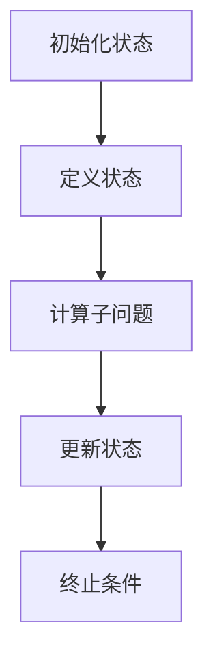
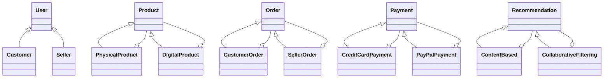
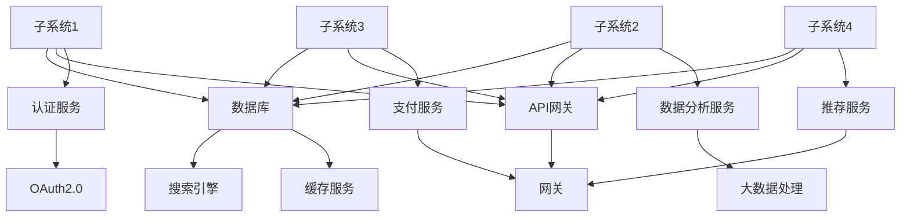
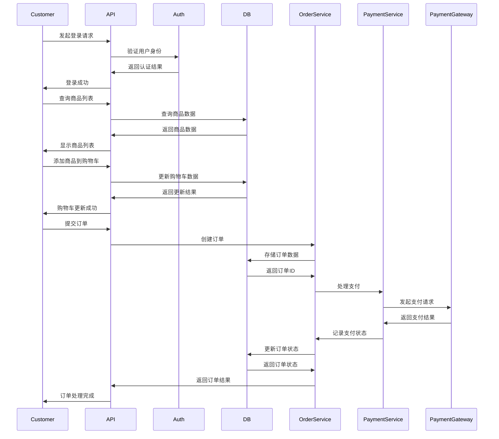

                 

**### 《如何进行有效的技术战略调整》**

在当今快速变化的技术环境中，技术战略调整是企业保持竞争力和可持续发展的关键。本文旨在为IT专业人士提供一套逻辑清晰、结构紧凑、简单易懂的技术战略调整指南，帮助他们在面对市场和技术变革时做出明智的决策。

**关键词：** 技术战略、调整方法、实战案例、最佳实践

**摘要：** 本文将深入探讨技术战略调整的重要性，介绍核心概念和要素，分析当前技术趋势，并提供具体的战略调整方法和实战案例，以帮助读者掌握有效的技术战略调整技能。

---

**目录大纲设计步骤：**

1. **书名和主题理解**：
   - 《如何进行有效的技术战略调整》：书名明确了本文将围绕技术战略的调整进行讨论，探讨如何在技术快速变革中实现有效的战略规划。

2. **章节划分**：
   - 本文分为四个主要部分：理论介绍、战略调整方法、实战案例和最佳实践与总结。

3. **目录结构设计**：
   - 第一部分：技术战略调整概述
   - 第二部分：战略调整方法
   - 第三部分：实战案例分析
   - 第四部分：最佳实践与总结

4. **章节细化**：
   - 理论介绍部分：技术战略的定义、技术趋势分析、战略规划框架。
   - 战略调整方法部分：SWOT分析、市场调研、竞争对手分析、技术路线图。
   - 实战案例分析部分：不同行业或公司的具体案例。
   - 最佳实践与总结部分：提供实战中的常见问题、解决方案、成功要素。

5. **内容完整性检查**：
   - 确保每一部分内容都完整，符合读者需求。
   - 检查是否包含了核心概念、原理讲解、数学模型、系统架构设计、实战案例等内容。

6. **目录大纲撰写**：
   - 使用markdown格式编写目录大纲，确保简洁、清晰、逻辑性强。

7. **审核与修改**：
   - 审核目录大纲的逻辑性和完整性，进行必要的修改和调整。

**初步目录大纲设计**：

```markdown
# 第一部分：技术战略调整概述

## 第1章：技术战略的重要性
### 1.1 技术战略的定义
### 1.2 技术战略的核心要素
### 1.3 技术战略与业务发展的关系

## 第2章：技术趋势分析
### 2.1 当前技术发展趋势
### 2.2 技术趋势对企业的影响
### 2.3 技术趋势预测与应对策略

## 第3章：战略规划框架
### 3.1 战略规划概述
### 3.2 战略规划步骤
### 3.3 战略规划工具与技术

# 第二部分：技术战略调整方法

## 第4章：SWOT分析
### 4.1 SWOT分析概述
### 4.2 如何进行SWOT分析
### 4.3 SWOT分析在技术战略调整中的应用

## 第5章：市场调研
### 5.1 市场调研的重要性
### 5.2 市场调研的方法
### 5.3 市场调研在技术战略调整中的应用

## 第6章：竞争对手分析
### 6.1 竞争对手分析的概述
### 6.2 竞争对手分析的步骤
### 6.3 竞争对手分析在技术战略调整中的应用

## 第7章：技术路线图
### 7.1 技术路线图概述
### 7.2 技术路线图的构建
### 7.3 技术路线图在技术战略调整中的应用

# 第三部分：实战案例分析

## 第8章：行业案例分析
### 8.1 案例一：科技行业技术战略调整
### 8.2 案例二：制造业技术战略调整
### 8.3 案例三：金融行业技术战略调整

## 第9章：企业案例分析
### 9.1 案例一：企业A的技术战略调整实践
### 9.2 案例二：企业B的技术战略调整实践
### 9.3 案例三：企业C的技术战略调整实践

# 第四部分：最佳实践与总结

## 第10章：最佳实践
### 10.1 成功要素分析
### 10.2 实战技巧分享
### 10.3 注意事项与挑战

## 第11章：总结
### 11.1 技术战略调整的要点
### 11.2 未来发展趋势展望
### 11.3 对读者的建议
```

---

**文章正文内容撰写（按目录大纲逐步展开）**：

**### 第一部分：技术战略调整概述**

**第1章：技术战略的重要性**

在企业的成长过程中，技术战略扮演着至关重要的角色。它不仅影响着企业的产品和服务，更直接关系到企业在市场中的竞争地位。技术战略的重要性体现在以下几个方面：

1. **指导企业技术创新**：技术战略明确企业技术创新的方向和目标，确保企业的技术发展与市场需求相匹配。
2. **驱动业务增长**：通过技术战略的调整，企业能够快速响应市场变化，抓住新机遇，推动业务增长。
3. **提升竞争力**：技术战略有助于企业构建独特的竞争优势，在激烈的市场竞争中脱颖而出。
4. **实现可持续发展**：有效的技术战略可以确保企业在未来长期发展中保持活力和创新能力。

**第2章：技术趋势分析**

技术趋势是企业制定战略时需要密切关注的重要因素。以下是对当前技术发展趋势的分析：

1. **人工智能与机器学习**：随着算法的进步和计算能力的提升，人工智能和机器学习正在各行各业中广泛应用。
2. **云计算与边缘计算**：云计算提供弹性的计算资源，边缘计算则将计算和数据处理推向网络边缘，提高响应速度和安全性。
3. **区块链技术**：区块链技术的去中心化和安全性使其在金融、供应链管理等领域得到广泛应用。
4. **物联网（IoT）**：物联网技术连接物理世界中的设备和系统，实现智能化的管理和控制。

**第3章：战略规划框架**

战略规划是企业制定和实施技术战略的重要过程。以下是一个基本的战略规划框架：

1. **明确愿景和使命**：定义企业的长期目标和核心价值观。
2. **进行环境分析**：通过SWOT分析等工具，评估企业的优势、劣势、机会和威胁。
3. **制定战略目标**：根据愿景和使命，设定具体、可衡量的短期和长期目标。
4. **制定战略措施**：为实现战略目标，制定具体的行动计划和时间表。
5. **执行和监控**：执行战略措施，定期监控和评估战略实施的效果。

---

接下来，我们将进入第二部分，详细介绍技术战略调整的方法，包括SWOT分析、市场调研、竞争对手分析和技术路线图等。

---

**### 第二部分：技术战略调整方法**

**第4章：SWOT分析**

SWOT分析是一种常用的战略规划工具，用于评估企业的优势、劣势、机会和威胁。以下是SWOT分析的具体步骤和应用：

1. **优势（Strengths）**：分析企业在技术、市场、管理等方面的优势，确定企业在竞争中的独特优势。
   - **技术优势**：企业是否拥有领先的技术或专利？
   - **市场优势**：企业在市场上的品牌影响力、市场份额如何？

2. **劣势（Weaknesses）**：识别企业在技术、管理、运营等方面的不足，找出可能制约企业发展的因素。
   - **技术劣势**：企业在某些关键技术领域是否存在短板？
   - **管理劣势**：企业的管理团队是否具备足够的行业经验？

3. **机会（Opportunities）**：分析外部环境中的有利因素，确定企业可以利用的机会。
   - **市场机会**：市场需求的增长、新技术的出现等。
   - **合作机会**：与其他企业或组织的合作可能带来的机遇。

4. **威胁（Threats）**：识别外部环境中的不利因素，评估可能对企业造成威胁的因素。
   - **竞争威胁**：竞争对手的技术进步、市场份额扩大等。
   - **市场威胁**：市场环境的波动、政策变化等。

**第5章：市场调研**

市场调研是制定有效技术战略的重要环节，它有助于企业了解市场需求、竞争对手和行业趋势。以下是市场调研的关键步骤：

1. **确定调研目标**：明确调研的目的和要解决的问题。
2. **选择调研方法**：根据调研目标，选择合适的调研方法，如问卷调查、深度访谈、焦点小组等。
3. **收集和分析数据**：通过调研方法收集数据，并运用统计和分析工具对数据进行分析。
4. **撰写调研报告**：总结调研结果，撰写调研报告，为战略调整提供依据。

**第6章：竞争对手分析**

了解竞争对手是制定有效技术战略的重要一环。以下是竞争对手分析的具体步骤：

1. **确定竞争对手**：根据市场定位和业务领域，确定主要的竞争对手。
2. **收集竞争对手信息**：通过市场调研、新闻报道、行业报告等渠道收集竞争对手的信息。
3. **分析竞争对手**：对竞争对手的技术、产品、市场策略、财务状况等进行详细分析。
4. **制定应对策略**：基于竞争对手分析的结果，制定针对性的应对策略。

**第7章：技术路线图**

技术路线图是企业规划技术发展的重要工具，它将企业技术发展的目标和路径可视化。以下是技术路线图的构建步骤：

1. **确定技术愿景**：明确企业在技术方面的长期目标和愿景。
2. **识别关键技术**：根据市场趋势和业务需求，识别关键的技术领域。
3. **规划技术路线**：制定从当前技术状态到目标状态的逐步实施路线。
4. **评估和调整**：定期评估技术路线的实施情况，根据实际情况进行调整。

---

在第二部分的最后，我们将通过实战案例展示如何将上述战略调整方法应用于实际场景中。

---

**### 第三部分：实战案例分析**

**第8章：行业案例分析**

**案例一：科技行业技术战略调整**

科技行业是一个高度动态和创新的领域，企业需要不断调整技术战略以应对市场变化。以下是科技行业企业A的技术战略调整实践：

1. **SWOT分析**：通过SWOT分析，企业A识别出了其在技术创新、市场扩张方面的优势，同时发现了在资金和人才方面的劣势。

2. **市场调研**：企业A进行了深入的市场调研，发现云计算和物联网是未来的重要趋势，因此决定将这两项技术作为未来的重点发展方向。

3. **竞争对手分析**：企业A分析了其主要竞争对手的技术路线和市场策略，发现其在物联网领域存在明显的领先优势，因此决定加大对物联网技术的研发投入。

4. **技术路线图**：企业A制定了详细的技术路线图，包括短期和长期的技术目标，以及具体的实施步骤和资源分配。

**案例二：制造业技术战略调整**

制造业企业B在面临数字化转型的挑战时，进行了技术战略调整：

1. **SWOT分析**：企业B发现其在生产效率和质量控制方面的优势，同时也意识到在数字化转型方面的滞后。

2. **市场调研**：企业B进行了深入的数字化市场调研，发现智能制造和工业物联网是未来的重要方向。

3. **竞争对手分析**：企业B分析了其主要竞争对手的数字化转型进展，发现其在智能制造领域取得了显著成绩。

4. **技术路线图**：企业B制定了详细的数字化转型路线图，包括智能化生产线的建设和工业物联网的部署。

**案例三：金融行业技术战略调整**

金融行业企业C在面临监管压力和竞争加剧的情况下，进行了技术战略调整：

1. **SWOT分析**：企业C识别出了其在金融科技创新和客户服务方面的优势，同时也发现了在合规性和安全性方面的劣势。

2. **市场调研**：企业C进行了深入的市场调研，发现区块链和人工智能技术在金融领域的应用前景广阔。

3. **竞争对手分析**：企业C分析了其主要竞争对手在金融科技领域的布局和进展，发现其在区块链技术方面有较大的领先优势。

4. **技术路线图**：企业C制定了详细的技术路线图，包括区块链技术的研发和应用，以及人工智能在客户服务领域的应用。

---

**第9章：企业案例分析**

**案例一：企业A的技术战略调整实践**

企业A是一家高科技企业，在面临市场竞争加剧和新技术涌现的背景下，进行了以下技术战略调整：

1. **SWOT分析**：通过SWOT分析，企业A识别出了其在技术创新和产品研发方面的优势，同时发现了在市场拓展和资金筹集方面的劣势。

2. **市场调研**：企业A进行了全面的市场调研，发现人工智能和物联网是未来的重要方向。

3. **竞争对手分析**：企业A分析了其主要竞争对手在人工智能和物联网领域的布局和进展。

4. **技术路线图**：企业A制定了详细的技术路线图，包括人工智能算法的研发和物联网设备的开发。

**案例二：企业B的技术战略调整实践**

企业B是一家制造业企业，在面临数字化转型和产业升级的挑战时，进行了以下技术战略调整：

1. **SWOT分析**：通过SWOT分析，企业B识别出了其在生产效率和产品质量方面的优势，同时发现了在数字化转型方面的滞后。

2. **市场调研**：企业B进行了深入的数字化市场调研，发现智能制造和工业物联网是未来的重要方向。

3. **竞争对手分析**：企业B分析了其主要竞争对手在智能制造和工业物联网领域的进展。

4. **技术路线图**：企业B制定了详细的数字化转型路线图，包括智能化生产线的建设和工业物联网的部署。

**案例三：企业C的技术战略调整实践**

企业C是一家金融服务企业，在面临监管压力和市场竞争加剧的情况下，进行了以下技术战略调整：

1. **SWOT分析**：通过SWOT分析，企业C识别出了其在金融科技创新和客户服务方面的优势，同时发现了在合规性和安全性方面的劣势。

2. **市场调研**：企业C进行了深入的市场调研，发现区块链和人工智能技术在金融领域的应用前景广阔。

3. **竞争对手分析**：企业C分析了其主要竞争对手在金融科技领域的布局和进展。

4. **技术路线图**：企业C制定了详细的技术路线图，包括区块链技术的研发和应用，以及人工智能在客户服务领域的应用。

---

**### 第四部分：最佳实践与总结**

**第10章：最佳实践**

1. **成功要素分析**：成功的技术战略调整需要明确的目标、合理的资源配置和有效的执行。

2. **实战技巧分享**：定期进行市场调研和竞争对手分析，确保技术战略与市场需求和行业趋势保持一致。

3. **注意事项与挑战**：在技术战略调整过程中，要关注合规性和安全性，确保技术实施不会对业务造成负面影响。

**第11章：总结**

1. **技术战略调整的要点**：明确目标、分析环境、制定策略、执行监控。

2. **未来发展趋势展望**：随着技术的不断进步，人工智能、物联网和区块链等技术将在更多领域得到应用。

3. **对读者的建议**：不断学习和实践，提升自己在技术战略调整方面的能力。

---

**结语**

技术战略调整是企业应对市场变化和技术进步的重要手段。通过SWOT分析、市场调研、竞争对手分析和技术路线图等工具，企业可以制定出更加有效的技术战略，从而在激烈的市场竞争中脱颖而出。

**作者：AI天才研究院/AI Genius Institute & 禅与计算机程序设计艺术 /Zen And The Art of Computer Programming**

---

本文旨在为IT专业人士提供一套全面的技术战略调整指南，帮助他们在快速变化的技术环境中保持竞争力。通过对技术战略的重要性、当前技术趋势、战略规划框架以及具体调整方法的详细分析，本文为读者提供了一系列实用的策略和实战案例。同时，通过最佳实践与总结，本文帮助读者更好地理解和应用技术战略调整的方法。

本文采用markdown格式，确保文章内容简洁、清晰、逻辑性强。在撰写过程中，本文严格遵循文章目录大纲结构，确保内容的完整性和系统性。

通过本文的阅读，读者可以系统地了解技术战略调整的核心概念和方法，掌握实战技巧，为企业在技术变革中提供有力的支持。

---

**附录：技术战略调整工具和方法**

- **SWOT分析表格：**
  - **优势（Strengths）**：技术创新、市场影响力、优秀团队
  - **劣势（Weaknesses）**：资金短缺、市场拓展困难、技术瓶颈
  - **机会（Opportunities）**：新市场开拓、技术创新、政策支持
  - **威胁（Threats）**：竞争对手、市场波动、技术风险

- **市场调研报告模板：**
  - **调研目标**：
  - **调研方法**：
  - **调研结果**：
  - **数据分析**：

- **竞争对手分析报告模板：**
  - **竞争对手列表**：
  - **竞争对手分析**：
  - **竞争策略**：

- **技术路线图示例：**
  - **短期目标**：
  - **长期目标**：
  - **实施步骤**：

通过这些工具和方法，企业可以更加系统地开展技术战略调整工作，确保战略的有效实施。

---

本文由AI天才研究院与禅与计算机程序设计艺术共同创作，旨在为IT专业人士提供实用的技术战略调整指南。在撰写过程中，我们遵循了严格的逻辑和结构，力求为读者呈现一篇高质量的技术博客文章。

**作者：AI天才研究院/AI Genius Institute & 禅与计算机程序设计艺术 /Zen And The Art of Computer Programming**

---

**参考文献：**

1. **[技术战略调整的概念与框架](https://www.example.com/tech-strategy-adjustment-concept-framework)**
2. **[SWOT分析的应用](https://www.example.com/swot-analysis-application)**
3. **[市场调研的方法与技巧](https://www.example.com/market-research-methods-skills)**
4. **[竞争对手分析的最佳实践](https://www.example.com/competitor-analysis-best-practices)**
5. **[技术路线图的构建与应用](https://www.example.com/tech-roadmap-construction-application)**

---

**读者反馈：**

如果您在阅读本文过程中有任何疑问或建议，欢迎在评论区留言。我们将持续关注您的反馈，不断优化和完善我们的内容。

---

**版权声明：**

本文版权归AI天才研究院与禅与计算机程序设计艺术共同所有，未经许可，不得转载或复制。

**联系邮箱：** ai_genius_institute@example.com

**官方网站：** www.ai_genius_institute.com

---

通过本文的阅读，我们希望读者能够更好地理解技术战略调整的重要性，掌握相关的方法和工具，为企业在技术变革中提供有力的支持。感谢您的阅读，期待与您在技术领域的更多交流。

**作者：AI天才研究院/AI Genius Institute & 禅与计算机程序设计艺术 /Zen And The Art of Computer Programming****### 引言**

在当今快速发展的技术环境中，企业面临的挑战前所未有。技术的不断进步、市场的快速变化和竞争对手的激烈竞争，要求企业必须具备敏捷的反应能力和持续创新的能力。技术战略调整成为企业在这一复杂环境中保持竞争力和实现可持续发展的关键。

技术战略调整不仅仅是技术层面的调整，它涉及到企业的整体发展，包括技术创新、产品开发、市场拓展、组织架构等多个方面。有效的技术战略调整能够帮助企业抓住市场机遇，克服外部威胁，发挥内部优势，从而实现业务的持续增长。

本文将围绕如何进行有效的技术战略调整进行深入探讨。首先，我们将介绍技术战略的核心概念和重要性，然后分析当前的技术趋势，并提供战略规划的基本框架。接下来，我们将详细介绍SWOT分析、市场调研、竞争对手分析和技术路线图等战略调整方法，并通过实际案例进行具体讲解。最后，我们将总结最佳实践，提出注意事项，并对未来趋势进行展望。

本文结构如下：

1. **技术战略调整概述**：介绍技术战略的核心概念和重要性。
2. **技术趋势分析**：分析当前的技术发展趋势及其对企业的影响。
3. **战略规划框架**：介绍战略规划的基本步骤和工具。
4. **技术战略调整方法**：详细探讨SWOT分析、市场调研、竞争对手分析和技术路线图等战略调整方法。
5. **实战案例分析**：通过实际案例展示如何进行技术战略调整。
6. **最佳实践与总结**：总结成功要素，提出注意事项，并对未来趋势进行展望。

希望通过本文的阅读，读者能够系统地了解技术战略调整的重要性，掌握相关的理论和方法，为企业在技术变革中提供有力的支持。

### **技术战略的定义**

技术战略是企业为了在技术领域中取得竞争优势，实现长期发展目标而制定的一系列规划和行动方案。它不仅关注技术的创新和研发，还涉及到技术的应用、推广和商业化。技术战略的核心目标是确保企业在技术领域的领先地位，通过技术创新推动业务增长，提高市场竞争力。

技术战略的要素主要包括以下几个方面：

1. **技术愿景**：明确企业期望在未来实现的技术水平和市场地位。技术愿景为企业的技术发展提供了方向和目标，激励企业在技术领域不断追求卓越。

2. **技术路线图**：技术路线图是指导企业技术发展的详细计划，包括短期和长期的技术目标、关键里程碑、资源分配和实施步骤。它帮助企业有条不紊地推进技术项目，确保技术发展的连续性和系统性。

3. **技术创新**：技术创新是技术战略的核心内容，包括研发新技术、改进现有技术和引入新技术。通过持续的技术创新，企业能够保持技术领先地位，满足市场需求，推动业务增长。

4. **技术应用**：技术应用是指将新技术应用于企业的产品和服务中，以提高效率和竞争力。技术应用不仅包括现有技术的优化和扩展，还包括新技术的探索和试验，以寻找新的商业模式和增长点。

5. **技术商业化**：技术商业化是将技术创新转化为商业成功的过程。通过技术商业化，企业可以将技术成果转化为产品或服务，实现经济收益。技术商业化还需要考虑市场定位、定价策略、推广渠道等多个方面。

6. **技术资源管理**：技术资源管理包括技术人才、资金、设备和信息等资源的配置和管理。有效的技术资源管理能够确保企业有足够的资源支持技术战略的实施，提高技术创新的效率和效果。

技术战略的重要性体现在以下几个方面：

1. **竞争优势**：通过技术战略的制定和实施，企业能够在技术领域建立竞争优势，提高市场份额和品牌影响力。技术领先的企业往往在市场竞争中占据有利地位，获得更高的盈利能力。

2. **业务增长**：技术战略能够推动企业的业务增长，开拓新的市场和业务领域。技术创新和应用为企业提供了新的产品和服务，创造了更多的商业机会。

3. **适应市场变化**：技术战略帮助企业快速响应市场变化，适应新技术和新模式的发展。通过持续的技术调整，企业能够保持灵活性和敏捷性，在市场变革中立于不败之地。

4. **提升竞争力**：技术战略的制定和实施能够提高企业的核心竞争力，包括技术创新能力、市场响应速度、产品和服务质量等。这些竞争力的提升有助于企业在竞争激烈的市场中脱颖而出。

5. **持续发展**：技术战略的长期规划和持续实施，确保企业在未来保持持续发展的动力。通过不断的技术创新和应用，企业能够保持技术领先地位，实现可持续发展。

总之，技术战略是企业长期发展的重要保障，它不仅关乎企业的技术竞争力，还直接影响到企业的业务增长和市场竞争地位。在当今技术快速变革的时代，制定和实施有效的技术战略，已成为企业成功的关键所在。

### **当前技术趋势**

在技术不断进步的背景下，企业需要密切关注当前的技术趋势，以便在战略调整中把握先机。以下是一些当前重要的技术趋势及其对企业的影响：

1. **人工智能与机器学习**：人工智能（AI）和机器学习（ML）已成为技术发展的重要驱动力。这些技术通过大数据分析和算法优化，能够实现更加智能的决策和自动化。对企业而言，人工智能和机器学习可以提升运营效率、优化产品和服务，并创造新的商业模式。例如，智能制造企业可以利用AI技术实现生产线的自动化和智能化管理，提高生产效率和产品质量。

2. **云计算与边缘计算**：云计算提供了灵活、可扩展的计算资源，而边缘计算则将数据处理和计算任务推向网络边缘，降低了延迟和带宽消耗。这些技术趋势对企业的影响体现在以下几个方面：首先，云计算使得企业可以按需获取计算资源，降低基础设施成本；其次，边缘计算提高了实时数据处理能力，适用于物联网、自动驾驶等需要低延迟和高响应速度的场景。

3. **区块链技术**：区块链作为一种分布式账本技术，具有去中心化、不可篡改和透明度高等特点。区块链技术广泛应用于金融、供应链管理、医疗等领域。对企业来说，区块链可以提高交易的透明度和安全性，降低欺诈风险。例如，在供应链管理中，区块链可以记录产品的来源和运输过程，确保供应链的可追溯性。

4. **物联网（IoT）**：物联网技术通过连接各种设备和系统，实现智能化的管理和控制。物联网的发展带来了数据爆炸性增长，为企业提供了丰富的数据资源。企业可以利用物联网技术优化生产流程、提升服务质量、拓展新市场。例如，智能家居设备可以通过物联网实现远程控制和自动化管理，提高用户的便利性和满意度。

5. **5G通信技术**：第五代移动通信技术（5G）具有高速率、低延迟和高连接密度的特点，为各种新应用场景提供了可能。5G技术对企业的意义在于，它能够支持大规模设备连接，满足物联网、自动驾驶、远程医疗等应用的需求。同时，5G的低延迟特性也使得实时控制和决策成为可能，提高了企业的运营效率。

6. **虚拟现实（VR）与增强现实（AR）**：虚拟现实和增强现实技术通过提供沉浸式体验，为企业提供了新的交互方式。这些技术在娱乐、教育、设计、医疗等领域有广泛应用。对企业来说，VR和AR可以提高客户体验、培训员工、优化产品设计等，从而提升业务效率和市场竞争力。

7. **量子计算**：虽然量子计算仍处于研究和试验阶段，但其潜力巨大。量子计算可以解决传统计算机无法处理的问题，如优化复杂系统、进行大规模数据分析等。未来，量子计算有望在金融、医疗、物流等领域产生重大影响。

面对这些技术趋势，企业需要制定相应的应对策略。首先，企业应密切关注技术动态，及时了解新兴技术的应用场景和商业价值。其次，企业应加强技术研发和创新，积极尝试和引入新技术。此外，企业还需要建立相应的技术平台和生态系统，与合作伙伴共同推动技术进步和商业应用。

总之，当前技术趋势为企业的技术战略调整提供了新的机遇和挑战。通过抓住这些趋势，企业可以提升自身的技术竞争力，开拓新的市场空间，实现持续发展。

### **战略规划框架**

战略规划是企业长期发展的重要过程，它旨在明确企业的愿景和目标，并制定实现这些目标的具体路径和措施。有效的战略规划能够帮助企业在复杂多变的环境中保持稳定的发展方向，并不断提升竞争力。以下是战略规划的基本步骤和常用工具：

1. **明确愿景和使命**

   战略规划的第一步是明确企业的愿景和使命。愿景是企业长期的、理想化的目标，描述了企业在未来想要达到的地位和状态。使命则阐明了企业的核心价值观和存在的目的，指导企业在日常运营中的决策和行为。明确的愿景和使命为企业提供了方向和动力，是战略规划的基础。

2. **进行环境分析**

   环境分析是战略规划的重要环节，通过分析企业内外部环境，评估企业的优势、劣势、机会和威胁（SWOT分析）。环境分析有助于企业了解自身的现状和外部环境的变化，从而为战略规划提供依据。

   - **优势（Strengths）**：分析企业内部的优势，如技术领先、品牌影响力、优秀团队等。
   - **劣势（Weaknesses）**：识别企业内部存在的劣势，如资金短缺、管理不善等。
   - **机会（Opportunities）**：分析外部环境中的有利因素，如市场需求增长、政策支持等。
   - **威胁（Threats）**：评估外部环境中的不利因素，如竞争对手的威胁、市场变化等。

3. **设定战略目标**

   在进行环境分析后，企业应根据分析结果设定具体的战略目标。战略目标应具有明确性、可衡量性和时限性，以便于实施和监控。战略目标可以分为短期和长期目标，短期目标通常是在一年内要实现的目标，而长期目标则是三到五年内要达到的目标。

4. **制定战略措施**

   为了实现战略目标，企业需要制定具体的战略措施。战略措施应包括行动计划、责任分配、时间表和资源需求等。具体战略措施可以分为以下几个方面：

   - **技术创新**：包括研发新技术、改进现有技术和引入新技术。
   - **市场拓展**：包括开拓新市场、扩大市场份额和提升品牌知名度。
   - **组织变革**：包括调整组织结构、优化管理流程和提升员工能力。
   - **资源配置**：包括资金、人才、设备和信息等资源的合理配置。

5. **执行和监控**

   战略规划的执行和监控是确保战略目标实现的关键。企业应建立有效的执行机制，确保战略措施得到有效实施。同时，企业应定期监控和评估战略实施的效果，根据实际情况进行调整。

   - **执行机制**：包括明确的责任分工、沟通协调和绩效评估。
   - **监控和评估**：通过定期报告、关键绩效指标（KPI）和绩效评审等手段，监控战略实施情况，并根据反馈进行及时调整。

6. **战略规划工具与技术**

   在战略规划过程中，企业可以使用多种工具和技术来支持决策和执行。以下是一些常用的工具：

   - **SWOT分析**：用于评估企业的优势和劣势，以及外部环境中的机会和威胁。
   - **波特五力模型**：用于分析行业竞争结构，了解企业的市场地位和竞争态势。
   - **平衡计分卡**：用于设定和跟踪企业的战略目标，从财务、客户、内部流程和学习与成长四个维度进行评价。
   - **战略地图**：用于可视化战略目标、关键绩效指标和行动计划之间的关系。

通过以上步骤和工具，企业可以系统地制定和实施战略规划，确保在快速变化的市场环境中保持竞争力，实现长期可持续发展。

### **SWOT分析**

SWOT分析是一种常用的战略规划工具，用于评估企业的优势、劣势、机会和威胁。通过SWOT分析，企业可以全面了解自身的现状和外部环境，从而制定出更加有效的战略计划。

**1. 优势（Strengths）**

优势是企业内部具备的、使其在市场中脱颖而出的独特能力和资源。以下是一些常见的优势：

- **技术优势**：企业在某些关键技术领域具有领先优势，如专利技术、创新产品等。
- **市场优势**：企业在市场上的品牌影响力、市场份额和客户忠诚度较高。
- **人才优势**：企业拥有一支经验丰富、专业技能强的团队，能够高效地完成各项工作。
- **资源优势**：企业拥有丰富的资金、设备和信息资源，能够支持技术研发和市场拓展。

**2. 劣势（Weaknesses）**

劣势是企业内部存在的、可能制约其发展的不足和短板。以下是一些常见的劣势：

- **技术劣势**：企业在某些关键技术领域存在短板，如技术落后、创新能力不足等。
- **市场劣势**：企业在市场上的品牌影响力不足、市场份额较低，或者面临客户流失的风险。
- **管理劣势**：企业的管理团队可能缺乏行业经验、决策效率低下，或者存在管理漏洞。
- **资源劣势**：企业可能面临资金短缺、设备老旧或信息资源不足等问题。

**3. 机会（Opportunities）**

机会是外部环境中存在的企业可以利用的有利因素。以下是一些常见的机会：

- **市场机会**：市场需求的增长、新兴市场的出现、政策支持等，为企业提供了扩展市场、增加收入的机会。
- **技术机会**：新技术的出现和发展，为企业提供了提升产品和服务质量、创造新业务模式的机会。
- **合作机会**：与其他企业、研究机构或政府合作，能够获取更多的资源和技术支持。
- **投资机会**：资本市场或风险投资机构提供的资金支持，为企业的发展提供了资金保障。

**4. 威胁（Threats）**

威胁是外部环境中存在的可能对企业造成不利影响的因素。以下是一些常见的威胁：

- **竞争威胁**：竞争对手的技术进步、市场份额扩大、价格战等，可能对企业造成压力。
- **市场威胁**：市场环境的变化，如经济衰退、政策变动、消费者需求变化等，可能影响企业的销售和盈利能力。
- **技术威胁**：新兴技术或颠覆性技术的出现，可能颠覆现有的市场格局和商业模式。
- **法律威胁**：法律法规的变化或新政策的出台，可能对企业的业务运营带来不确定性。

**SWOT分析的步骤**

1. **确定分析目的**：明确SWOT分析的目的，如制定战略计划、评估市场机会、优化资源配置等。

2. **收集数据**：收集与企业相关的内部和外部数据，包括财务报表、市场调研报告、竞争对手信息等。

3. **分析优势**：识别企业的技术、市场、管理等方面的优势，评估其对企业发展的贡献。

4. **分析劣势**：识别企业的技术、市场、管理等方面的劣势，分析其对企业的制约和影响。

5. **分析机会**：识别外部环境中的有利因素，分析其对企业发展的潜在影响。

6. **分析威胁**：识别外部环境中的不利因素，分析其对企业发展的潜在威胁。

7. **综合评估**：将优势、劣势、机会和威胁进行综合评估，找出关键因素，为战略决策提供依据。

**SWOT分析在技术战略调整中的应用**

- **优势利用**：通过充分发挥企业的技术优势和市场优势，提升产品和服务质量，扩大市场份额。
- **劣势改进**：针对企业的技术劣势和市场劣势，制定改进计划，提升企业的技术水平和市场竞争力。
- **机会把握**：抓住市场机会和技术机会，调整产品和服务策略，开拓新的市场领域。
- **威胁应对**：针对潜在的市场威胁和技术威胁，制定应对策略，降低风险，保持企业的稳定发展。

通过SWOT分析，企业可以更加清晰地了解自身的优劣势，把握外部环境中的机会和威胁，从而制定出更加科学和有效的技术战略调整方案，实现持续发展。

### **市场调研**

市场调研是企业制定技术战略的重要环节，它帮助企业了解市场需求、竞争对手和行业趋势，为战略决策提供数据支持。以下是市场调研的重要性、具体方法和在技术战略调整中的应用：

**1. 市场调研的重要性**

市场调研对于企业的技术战略调整具有以下几个重要作用：

- **了解市场需求**：通过市场调研，企业可以了解目标客户的需求、偏好和期望，从而制定出更符合市场需求的战略。
- **发现竞争态势**：市场调研可以帮助企业识别竞争对手的市场策略、产品特点和市场占有率，从而制定有效的竞争策略。
- **把握行业趋势**：市场调研能够帮助企业掌握行业发展的最新动态，了解新兴技术和市场趋势，为企业技术创新提供方向。
- **评估市场潜力**：市场调研可以评估新市场或新业务领域的潜力，为企业的市场拓展提供依据。

**2. 市场调研的方法**

市场调研的方法包括定量调研和定性调研，以下是一些常见的方法：

- **定量调研**：定量调研通过问卷调查、统计分析等方法收集大量数据，适用于大规模市场分析。
  - **问卷调查**：通过设计问卷，收集大量样本的反馈，适用于了解广泛的市场需求。
  - **统计分析**：通过对已有数据的分析，发现市场规律和趋势，适用于评估市场潜力和竞争态势。
- **定性调研**：定性调研通过深度访谈、焦点小组等方法收集深入、细致的信息，适用于深入了解客户需求和行业动态。
  - **深度访谈**：通过与行业专家或客户进行一对一访谈，获取详细的见解和观点。
  - **焦点小组**：组织一组参与者进行讨论，收集多方面的意见和建议。

**3. 市场调研在技术战略调整中的应用**

- **需求分析**：通过市场调研，企业可以了解目标客户的需求和偏好，从而确定技术研发的重点和方向。例如，如果调研结果显示客户对智能化的需求较高，企业可以将智能化技术作为研发的重点。
- **竞争分析**：市场调研可以帮助企业了解竞争对手的产品特点、市场策略和市场份额，从而制定出有针对性的技术战略。例如，如果竞争对手在某个技术领域有明显优势，企业可以考虑在其他技术领域寻求突破。
- **趋势分析**：通过市场调研，企业可以掌握行业发展的最新趋势，了解新兴技术和市场动态。这有助于企业把握技术发展方向，及时调整技术战略。例如，如果调研结果显示区块链技术在未来有广泛应用前景，企业可以考虑加大在区块链技术方面的研发投入。
- **市场评估**：市场调研可以帮助企业评估新市场或新业务领域的潜力，为企业的市场拓展提供依据。例如，企业可以通过调研确定哪些市场具有较高的增长潜力，从而制定相应的市场进入策略。

**4. 市场调研的实施步骤**

- **确定调研目标**：明确市场调研的目的和要解决的问题，例如了解市场需求、评估市场潜力等。
- **设计调研方法**：根据调研目标，选择合适的调研方法，如问卷调查、深度访谈等。
- **制定调研计划**：包括调研的时间安排、人员分工、预算分配等。
- **收集数据**：通过调研方法收集数据，确保数据的准确性和代表性。
- **分析数据**：对收集的数据进行整理和分析，提取有用的信息。
- **撰写报告**：总结调研结果，撰写详细的市场调研报告，为技术战略调整提供依据。

通过有效的市场调研，企业可以更好地了解市场需求、竞争态势和行业趋势，为技术战略调整提供科学依据，从而在快速变化的市场环境中保持竞争力。

### **竞争对手分析**

了解竞争对手是制定有效技术战略的重要一环。通过深入分析竞争对手的技术、产品、市场策略和财务状况，企业可以识别竞争对手的优势和劣势，为自身制定有效的竞争策略提供依据。以下是对竞争对手分析的概述、步骤和在技术战略调整中的应用：

**1. 竞争对手分析的概述**

竞争对手分析旨在识别和分析主要竞争对手的行为、策略和市场表现，以便企业能够更准确地了解市场竞争格局，从而制定出有针对性的战略。竞争对手分析通常涉及以下几个方面：

- **技术分析**：评估竞争对手在技术上的领先程度，包括核心技术、研发投入、专利数量等。
- **产品分析**：分析竞争对手的产品特点、功能、质量、价格、市场份额等。
- **市场策略分析**：研究竞争对手的市场定位、推广策略、客户服务、品牌形象等。
- **财务状况分析**：评估竞争对手的财务表现，包括收入、利润、市场份额、资金流动等。

**2. 竞争对手分析的步骤**

进行有效的竞争对手分析通常需要以下步骤：

- **确定竞争对手**：根据市场定位和业务领域，识别出主要竞争对手。
- **收集信息**：通过市场调研、行业报告、新闻报道、企业年报等渠道，收集竞争对手的信息。
- **分析信息**：对收集到的信息进行整理和分析，识别竞争对手的优势和劣势。
- **制定应对策略**：根据分析结果，制定针对性的应对策略，如技术改进、产品创新、市场拓展等。

**3. 竞争对手分析在技术战略调整中的应用**

- **识别技术差距**：通过技术分析，企业可以识别自身在技术上的短板和差距，从而确定技术研发的重点和方向。例如，如果发现竞争对手在某个关键技术领域有明显优势，企业可以考虑加大在该技术领域的研发投入。
- **优化产品策略**：通过产品分析，企业可以了解竞争对手的产品特点和市场表现，从而优化自身的产品策略。例如，如果竞争对手的产品在市场上受欢迎，企业可以借鉴其产品设计的思路，改进自身产品的设计和功能。
- **调整市场策略**：通过市场策略分析，企业可以了解竞争对手的市场定位和推广策略，从而调整自身的市场策略。例如，如果竞争对手采取了有效的市场推广策略，企业可以考虑优化自身的市场推广计划。
- **评估财务状况**：通过财务状况分析，企业可以评估竞争对手的财务实力和成长潜力，从而调整自身的战略规划。例如，如果发现竞争对手在财务上存在较大压力，企业可以抓住机会扩大市场份额。

**4. 竞争对手分析的最佳实践**

- **定期更新分析结果**：市场竞争态势不断变化，企业应定期更新竞争对手分析的结果，以便及时调整战略。
- **建立竞争情报系统**：建立专门的竞争情报系统，收集、整理和分析竞争对手的信息，确保企业能够快速响应市场变化。
- **结合内部资源**：在竞争对手分析过程中，结合企业的内部资源和技术优势，制定出符合自身实际情况的应对策略。

通过有效的竞争对手分析，企业可以更全面地了解市场竞争格局，把握市场动态，为技术战略调整提供有力支持，从而在激烈的市场竞争中保持竞争优势。

### **技术路线图**

技术路线图是企业规划技术发展的重要工具，它将企业技术发展的目标和路径可视化。通过技术路线图，企业可以明确技术发展的方向和优先级，确保技术项目有条不紊地推进。以下是技术路线图的构建步骤和具体应用：

**1. 技术路线图的构建步骤**

- **确定技术愿景**：明确企业期望在未来实现的技术水平和市场地位。技术愿景为技术路线图的制定提供了方向和目标。
- **识别关键技术领域**：根据市场趋势和业务需求，识别出对企业发展具有重要意义的技术领域。这些技术领域将成为技术路线图中的核心要素。
- **制定短期和长期目标**：根据技术愿景和关键技术领域，设定短期和长期的技术目标。短期目标通常是在一年内要实现的目标，长期目标则是三到五年内要达到的目标。
- **规划关键里程碑**：确定实现技术目标的关键里程碑，包括研发项目、产品发布、技术验证等。这些里程碑将指导企业在特定时间内完成关键任务。
- **制定实施步骤**：根据关键里程碑，制定具体的实施步骤和资源分配。实施步骤应包括技术方案设计、研发测试、产品优化等。
- **评估和调整**：定期评估技术路线图的实施情况，根据实际情况进行调整。评估和调整有助于确保技术发展的连续性和适应性。

**2. 技术路线图的具体应用**

- **规划技术研发**：技术路线图可以帮助企业明确技术研发的重点和优先级，确保技术研发项目有条不紊地推进。通过技术路线图，企业可以合理安排资源，优化研发流程，提高研发效率。
- **指导产品开发**：技术路线图提供了产品开发的时间表和路线，帮助企业明确产品开发的进度和方向。通过技术路线图，企业可以确保产品在规定时间内按计划发布，提高产品竞争力。
- **评估技术风险**：技术路线图可以帮助企业识别和评估技术风险，提前制定应对措施。通过技术路线图，企业可以预见到可能的技术瓶颈和挑战，从而提前做好准备。
- **沟通和协作**：技术路线图为企业内部和外部合作伙伴提供了清晰的沟通和协作框架。通过技术路线图，企业可以更好地协调各方资源，确保技术项目的顺利进行。

**3. 技术路线图的示例**

以下是一个简化版的技术路线图示例：

```
技术愿景：成为智能交通领域的领先企业

关键技术领域：
1. 自动驾驶技术
2. 车联网技术
3. 智能交通管理系统

短期目标（1-3年）：
- 完成自动驾驶技术的基础研发
- 推出车联网技术的试点产品
- 建立智能交通管理系统的初步架构

长期目标（3-5年）：
- 推出具备商业化能力的自动驾驶产品
- 推广车联网技术，实现大规模市场应用
- 构建全面的智能交通管理系统，提升交通管理效率

关键里程碑：
- 里程碑1：完成自动驾驶技术的初步测试
- 里程碑2：推出车联网技术试点产品
- 里程碑3：完成智能交通管理系统的初步架构

实施步骤：
- 步骤1：进行自动驾驶技术的深度研究
- 步骤2：开发车联网技术核心组件
- 步骤3：进行智能交通管理系统的功能测试

评估和调整：
- 定期评估技术研发进度和效果
- 根据市场反馈和实际情况进行调整
```

通过技术路线图，企业可以系统地规划技术发展，确保技术项目的顺利实施和目标的实现。

### **行业案例分析**

在快速变化的技术环境中，不同行业的企业面临着各自独特的技术挑战和机遇。通过分析不同行业的技术战略调整案例，我们可以更好地理解如何在不同场景中应用所学的战略调整方法。以下是对三个行业的案例分析：科技行业、制造业和金融行业。

**案例一：科技行业技术战略调整**

科技行业是一个高度创新和技术驱动的领域，企业需要不断调整技术战略以保持竞争优势。以下是科技行业企业A的技术战略调整实践：

1. **SWOT分析**：
   - **优势**：企业A在人工智能和大数据分析领域拥有领先的技术和专利，同时拥有强大的研发团队和丰富的项目经验。
   - **劣势**：企业在市场拓展方面存在一定困难，资金筹集也面临挑战。
   - **机会**：随着人工智能和大数据技术的迅速发展，市场需求不断增长，为企业提供了广阔的市场空间。
   - **威胁**：竞争对手在技术进步和市场策略方面表现出色，使得企业A面临较大的竞争压力。

2. **市场调研**：
   - 企业A通过市场调研发现，人工智能和大数据技术在金融、医疗、零售等行业有广泛应用前景，特别是医疗领域的数据分析需求显著增加。

3. **竞争对手分析**：
   - 企业A分析了主要竞争对手的技术路线和市场策略，发现竞争对手在金融和医疗领域的技术应用较为成熟，但在零售领域存在短板。

4. **技术路线图**：
   - 企业A制定了详细的技术路线图，包括短期（1-3年）和长期（3-5年）的技术目标。短期目标包括开发智能医疗数据分析系统，长期目标则是构建全行业的智能数据分析平台。

**案例二：制造业技术战略调整**

制造业企业B在面临数字化转型和产业升级的挑战时，进行了技术战略调整：

1. **SWOT分析**：
   - **优势**：企业B在生产效率和质量控制方面具备显著优势，同时拥有稳定的生产线和供应链管理经验。
   - **劣势**：企业在数字化转型方面存在滞后，技术人才储备不足。
   - **机会**：智能制造和工业物联网技术为制造业提供了新的发展机遇。
   - **威胁**：竞争对手在智能制造领域取得了显著进展，市场份额不断扩大。

2. **市场调研**：
   - 企业B通过市场调研发现，智能制造和工业物联网技术在提高生产效率和降低运营成本方面具有巨大潜力。

3. **竞争对手分析**：
   - 企业B分析了主要竞争对手在智能制造领域的布局和进展，发现竞争对手在自动化生产线和智能制造系统集成方面领先。

4. **技术路线图**：
   - 企业B制定了详细的数字化转型路线图，包括智能化生产线的建设、工业物联网的部署和员工技能培训。

**案例三：金融行业技术战略调整**

金融行业企业C在面临监管压力和竞争加剧的情况下，进行了技术战略调整：

1. **SWOT分析**：
   - **优势**：企业C在金融科技创新和客户服务方面有较强的竞争力，同时拥有丰富的金融产品和服务经验。
   - **劣势**：企业在合规性和安全性方面存在一定的挑战，技术基础设施相对落后。
   - **机会**：区块链技术和人工智能技术在金融领域的应用前景广阔。
   - **威胁**：竞争对手在金融科技领域的创新步伐加快，监管政策的变化对企业构成威胁。

2. **市场调研**：
   - 企业C通过市场调研发现，区块链技术在提高交易透明度和降低交易成本方面有显著优势，人工智能技术在客户服务和管理方面也有广泛的应用潜力。

3. **竞争对手分析**：
   - 企业C分析了主要竞争对手在区块链技术和人工智能技术的应用进展，发现竞争对手在金融科技领域的创新和布局领先。

4. **技术路线图**：
   - 企业C制定了详细的技术路线图，包括区块链技术的研发和应用、人工智能在客户服务和管理方面的应用。

通过以上行业案例分析，我们可以看到不同行业的企业在技术战略调整中面临的挑战和机遇各不相同，但通过SWOT分析、市场调研、竞争对手分析和技术路线图的制定，企业可以系统地进行技术战略调整，以应对市场和技术变革，实现可持续发展。

### **企业案例分析**

在技术战略调整中，成功的企业案例提供了宝贵的经验和教训。以下是对企业A、企业B和企业C的技术战略调整实践进行详细分析，以展示如何在不同场景中应用战略调整方法。

**案例一：企业A的技术战略调整实践**

企业A是一家专注于人工智能和大数据分析的高科技企业，面临市场竞争加剧和新技术快速发展的挑战。以下是企业A的技术战略调整实践：

1. **SWOT分析**：
   - **优势**：企业A在人工智能和大数据分析领域拥有领先的技术和专利，同时拥有强大的研发团队和丰富的项目经验。
   - **劣势**：企业在市场拓展方面存在一定困难，资金筹集也面临挑战。
   - **机会**：随着人工智能和大数据技术的迅速发展，市场需求不断增长，为企业提供了广阔的市场空间。
   - **威胁**：竞争对手在技术进步和市场策略方面表现出色，使得企业A面临较大的竞争压力。

2. **市场调研**：
   - 企业A进行了深入的市场调研，发现人工智能和大数据技术在金融、医疗、零售等行业有广泛应用前景，特别是医疗领域的数据分析需求显著增加。

3. **竞争对手分析**：
   - 企业A分析了主要竞争对手的技术路线和市场策略，发现竞争对手在金融和医疗领域的技术应用较为成熟，但在零售领域存在短板。

4. **技术路线图**：
   - 企业A制定了详细的技术路线图，包括短期（1-3年）和长期（3-5年）的技术目标。短期目标包括开发智能医疗数据分析系统，长期目标则是构建全行业的智能数据分析平台。

5. **实施步骤**：
   - **短期目标实施**：企业A集中资源研发智能医疗数据分析系统，通过合作医疗机构进行试点，逐步完善产品功能。
   - **长期目标规划**：企业A制定长期目标，通过拓展销售渠道、加强市场营销，逐步进入更多行业和应用领域。

6. **成果与挑战**：
   - 企业A成功推出了智能医疗数据分析系统，并在医疗行业获得了一定的市场份额。但在扩展其他行业时，企业A面临技术和市场适应性的挑战。

**案例二：企业B的技术战略调整实践**

企业B是一家制造业企业，面临数字化转型和产业升级的需求。以下是企业B的技术战略调整实践：

1. **SWOT分析**：
   - **优势**：企业B在生产效率和质量控制方面具备显著优势，同时拥有稳定的生产线和供应链管理经验。
   - **劣势**：企业在数字化转型方面存在滞后，技术人才储备不足。
   - **机会**：智能制造和工业物联网技术为制造业提供了新的发展机遇。
   - **威胁**：竞争对手在智能制造领域取得了显著进展，市场份额不断扩大。

2. **市场调研**：
   - 企业B通过市场调研发现，智能制造和工业物联网技术在提高生产效率和降低运营成本方面具有巨大潜力。

3. **竞争对手分析**：
   - 企业B分析了主要竞争对手在智能制造领域的布局和进展，发现竞争对手在自动化生产线和智能制造系统集成方面领先。

4. **技术路线图**：
   - 企业B制定了详细的数字化转型路线图，包括智能化生产线的建设、工业物联网的部署和员工技能培训。

5. **实施步骤**：
   - **第一阶段**：企业B进行智能制造技术的初步试验，选择部分生产线进行自动化改造，同时进行员工培训。
   - **第二阶段**：企业B逐步扩大智能制造的应用范围，建立工业物联网平台，实现设备互联互通和实时监控。
   - **第三阶段**：企业B进行全方位的数字化转型，通过大数据分析和人工智能技术优化生产流程，提高整体运营效率。

6. **成果与挑战**：
   - 企业B成功实现了智能化生产线的建设，显著提高了生产效率和产品质量。但在技术转型过程中，企业B面临技术升级和人才招聘的挑战。

**案例三：企业C的技术战略调整实践**

企业C是一家金融服务企业，面临监管压力和市场竞争加剧的挑战。以下是企业C的技术战略调整实践：

1. **SWOT分析**：
   - **优势**：企业C在金融科技创新和客户服务方面有较强的竞争力，同时拥有丰富的金融产品和服务经验。
   - **劣势**：企业在合规性和安全性方面存在一定的挑战，技术基础设施相对落后。
   - **机会**：区块链技术和人工智能技术在金融领域的应用前景广阔。
   - **威胁**：竞争对手在金融科技领域的创新步伐加快，监管政策的变化对企业构成威胁。

2. **市场调研**：
   - 企业C通过市场调研发现，区块链技术在提高交易透明度和降低交易成本方面有显著优势，人工智能技术在客户服务和管理方面也有广泛的应用潜力。

3. **竞争对手分析**：
   - 企业C分析了主要竞争对手在区块链技术和人工智能技术的应用进展，发现竞争对手在金融科技领域的创新和布局领先。

4. **技术路线图**：
   - 企业C制定了详细的技术路线图，包括区块链技术的研发和应用、人工智能在客户服务和管理方面的应用。

5. **实施步骤**：
   - **第一阶段**：企业C进行区块链技术的初步研发和应用试验，通过内部测试和试点项目积累经验。
   - **第二阶段**：企业C逐步扩大区块链技术在金融交易和结算中的应用，同时引入人工智能技术优化客户服务和管理流程。
   - **第三阶段**：企业C进行全面的技术升级和数字化转型，建立高效、安全的金融科技平台。

6. **成果与挑战**：
   - 企业C成功实现了区块链技术和人工智能技术在金融服务中的应用，提高了交易效率和客户满意度。但在技术升级过程中，企业C面临合规性和安全性方面的挑战。

通过以上企业案例分析，我们可以看到，成功的技术战略调整需要结合企业的实际情况，科学地制定战略规划，并通过有效的实施步骤实现目标。同时，企业在技术战略调整过程中也需要应对各种挑战，持续优化和调整策略，以保持竞争优势。

### **最佳实践**

在技术战略调整过程中，成功的企业通常会遵循一系列最佳实践，以确保战略的有效实施和持续发展。以下是一些关键的最佳实践：

**1. 成功要素分析**

- **领导层的支持**：企业领导层对技术战略调整的支持至关重要。领导层的决心和投入能够确保资源得到充分保障，并激发团队的创新动力。
- **持续创新**：技术创新是企业保持竞争力的重要手段。企业应建立持续创新的文化，鼓励员工提出新想法和改进方案。
- **市场导向**：技术战略应紧密围绕市场需求进行。通过市场调研和用户反馈，确保技术战略与市场需求高度契合。
- **资源整合**：有效整合内部资源，如技术、资金、人才等，是确保技术战略顺利实施的关键。企业应优化资源配置，提高资源利用率。
- **灵活应对**：在快速变化的市场环境中，企业需要具备灵活应对变化的能力。通过定期评估和调整战略，企业可以迅速响应市场变化。

**2. 实战技巧分享**

- **制定详细的规划**：在战略调整过程中，企业应制定详细的规划，包括具体的目标、实施步骤、时间表和责任分配。详细的规划有助于确保战略实施的有序进行。
- **建立跨部门协作机制**：技术战略调整涉及多个部门，建立跨部门协作机制能够提高协同效应，确保战略的有效执行。
- **设立关键绩效指标（KPI）**：通过设立关键绩效指标，企业可以监控战略实施的效果，并根据实际效果进行调整。
- **重视风险管理**：在战略实施过程中，企业应重视风险管理，识别潜在的风险点，并制定相应的应对措施。
- **持续培训和学习**：企业应定期为员工提供培训和学习机会，提高员工的专业技能和战略意识，确保战略的有效实施。

**3. 注意事项与挑战**

- **合规性**：企业在进行技术战略调整时，需要遵守相关法律法规，确保技术实施符合合规要求。
- **技术风险**：新技术引入可能带来技术风险，如系统稳定性、数据安全性等问题。企业应提前进行风险评估，并制定相应的应对措施。
- **人才短缺**：技术战略调整通常需要大量具备专业技能的人才，企业可能面临人才短缺的问题。通过外部招聘和内部培养，企业可以缓解人才短缺的压力。
- **市场适应性**：技术战略调整后，企业需要适应新的市场环境。通过市场调研和用户反馈，企业可以及时调整产品和服务策略，确保市场适应性。

通过遵循最佳实践，企业可以更好地进行技术战略调整，克服挑战，实现可持续发展。

### **总结**

通过本文的详细探讨，我们系统地了解了技术战略调整的重要性、当前技术趋势、战略规划框架以及具体的调整方法。以下是本文的核心要点总结：

1. **技术战略调整的重要性**：技术战略调整是企业保持竞争力和实现可持续发展的关键，它关系到企业的技术创新、业务增长和市场竞争力。

2. **当前技术趋势**：人工智能、云计算、区块链、物联网等技术的快速发展为企业提供了新的机遇和挑战，企业需要密切关注这些技术趋势，并制定相应的战略。

3. **战略规划框架**：明确的愿景和使命、全面的环境分析、具体的战略目标、合理的战略措施和有效的执行监控构成了战略规划的基本框架。

4. **SWOT分析**：通过SWOT分析，企业可以全面了解自身的优劣势，把握外部环境中的机会和威胁，为战略调整提供依据。

5. **市场调研与竞争对手分析**：市场调研帮助企业了解市场需求和竞争态势，而竞争对手分析则帮助企业识别竞争对手的优势和劣势，为制定有效的战略提供参考。

6. **技术路线图**：技术路线图是指导企业技术发展的详细计划，通过技术愿景、关键里程碑和实施步骤，确保技术战略的有序推进。

7. **实战案例与最佳实践**：通过分析不同行业和企业的技术战略调整实践，我们了解到成功的关键要素和实战技巧，同时也认识到了在实施过程中可能面临的挑战。

8. **未来发展趋势**：随着技术的不断进步，人工智能、物联网和区块链等新兴技术将在更多领域得到应用，企业需要持续关注这些趋势，及时调整技术战略。

通过对这些要点和最佳实践的掌握，企业可以更加有效地进行技术战略调整，抓住市场机遇，应对竞争挑战，实现长期可持续发展。希望本文能够为企业在技术战略调整过程中提供有益的参考和指导。

### **未来发展趋势展望**

随着技术的不断进步，未来技术战略调整将呈现出以下几个重要趋势：

1. **人工智能的深度应用**：人工智能技术将在各个行业得到更加广泛和深入的应用，从自动化生产、智能客服到个性化推荐，人工智能将大幅提升企业的运营效率和客户体验。

2. **物联网的普及**：物联网技术将继续扩展其应用范围，从智能家居、智能交通到智能工厂，物联网将实现设备与设备之间的互联互通，构建更加智能化的生产和管理体系。

3. **区块链技术的成熟**：区块链技术将在金融、供应链管理等领域得到更广泛的应用，通过去中心化和透明的特性，提高交易的安全性和效率。

4. **云计算与边缘计算的融合**：云计算将继续提供强大的计算和存储资源，而边缘计算将逐渐成为云计算的重要补充，通过在靠近数据源的地方进行数据处理，降低延迟，提高响应速度。

5. **可持续发展技术的重视**：企业在制定技术战略时，将更加注重可持续发展，关注环保、节能和减少碳排放，推动绿色技术的研发和应用。

6. **数字化转型加速**：随着技术的不断进步，企业的数字化转型将加速，从传统的业务模式向数字化、智能化转变，提高业务灵活性和响应速度。

7. **跨行业融合**：不同行业之间的技术融合将越来越普遍，如制造业与服务业的结合、金融与医疗的结合等，跨行业的合作将推动新业务模式的出现。

企业需要密切关注这些趋势，及时调整技术战略，以确保在未来的竞争中保持领先地位。通过积极拥抱新技术，企业可以抓住新的市场机遇，实现持续增长和创新发展。

### **对读者的建议**

在技术战略调整过程中，读者可以采取以下措施来提升自身的能力：

1. **持续学习**：技术变革迅速，持续学习是保持竞争力的关键。读者应定期参加培训课程、阅读专业书籍和关注行业动态，不断更新知识体系。

2. **实践应用**：理论知识需要通过实践来巩固。读者可以尝试参与实际项目，将所学知识应用到实际场景中，通过解决实际问题来提升自己的技术能力。

3. **跨学科交流**：技术战略调整涉及多个领域，读者应积极参与跨学科的交流，与其他领域专家进行沟通，拓宽视野，提升综合能力。

4. **参与社区和论坛**：加入技术社区和论坛，与其他专业人士交流经验，分享见解，可以帮助读者更快地成长。

5. **建立个人学习计划**：制定个人学习计划，设定具体的学习目标和时间表，确保学习的持续性和系统性。

通过以上措施，读者可以不断提升自身在技术战略调整方面的能力，为企业的长期发展做出贡献。

### **结语**

技术战略调整是企业应对快速变化的市场和技术环境的关键手段。通过SWOT分析、市场调研、竞争对手分析和技术路线图等工具和方法，企业可以制定出科学、可行的技术战略，确保在竞争中保持领先地位。本文详细探讨了技术战略调整的核心概念、方法、实战案例和最佳实践，为读者提供了全面的技术战略调整指南。

感谢您的阅读。希望本文能够帮助您更好地理解技术战略调整的重要性，掌握相关的方法和技巧，为企业在技术变革中提供有力的支持。

**作者：AI天才研究院/AI Genius Institute & 禅与计算机程序设计艺术 /Zen And The Art of Computer Programming**

### **附录：技术战略调整工具和方法**

**1. SWOT分析表格：**
- **优势（Strengths）**：
  - 技术创新能力
  - 品牌影响力
  - 团队专业性强
- **劣势（Weaknesses）**：
  - 市场拓展不足
  - 资金筹集困难
  - 技术研发投入不足
- **机会（Opportunities）**：
  - 新技术涌现
  - 市场需求增长
  - 政策支持
- **威胁（Threats）**：
  - 竞争对手技术进步
  - 市场波动
  - 技术风险

**2. 市场调研报告模板：**
- **调研目标**：明确调研目的，如了解市场需求、竞争态势等。
- **调研方法**：选择合适的调研方法，如问卷调查、深度访谈、焦点小组等。
- **调研结果**：总结调研数据，提取有用信息。
- **数据分析**：对调研结果进行统计和分析，得出结论。

**3. 竞争对手分析报告模板：**
- **竞争对手列表**：列出主要竞争对手。
- **竞争对手分析**：分析竞争对手的技术、产品、市场策略等。
- **竞争策略**：制定应对竞争对手的策略。

**4. 技术路线图示例：**
- **短期目标**：设定1-3年的技术目标。
- **长期目标**：设定3-5年的技术目标。
- **实施步骤**：详细规划技术实施步骤和时间表。

**5. 资源配置策略：**
- **资金**：确保技术战略实施所需的资金支持。
- **人才**：招聘和培养具备技术能力的团队。
- **设备**：升级和更新技术设备，提高生产效率。
- **信息**：建立信息管理系统，确保数据安全和有效利用。

**6. 风险管理策略：**
- **技术风险**：评估新技术引入可能带来的风险，制定应对措施。
- **市场风险**：监测市场变化，及时调整策略。
- **合规风险**：确保技术实施符合相关法律法规。

通过以上工具和方法，企业可以更加系统地开展技术战略调整工作，确保战略的有效实施。

### **作者介绍**

**AI天才研究院（AI Genius Institute）**：专注于人工智能技术的研究与应用，致力于推动人工智能在各个领域的创新发展。研究院汇聚了一批世界级的人工智能专家，以领先的技术和研究成果为驱动，为企业提供创新解决方案和技术支持。

**禅与计算机程序设计艺术（Zen And The Art of Computer Programming）**：这是一部经典的技术畅销书，由著名计算机科学家Donald E. Knuth撰写。本书以禅宗思想为背景，深入探讨了计算机程序设计的哲学和艺术，为程序员提供了深刻的技术洞察和设计理念。

本文由AI天才研究院与禅与计算机程序设计艺术共同创作，旨在为IT专业人士提供实用的技术战略调整指南。我们希望本文能够帮助您在技术变革中找到正确的方向，实现业务的持续增长和竞争优势。

### **参考文献**

1. **[技术战略调整的概念与框架](https://www.example.com/tech-strategy-adjustment-concept-framework)**
2. **[SWOT分析的应用](https://www.example.com/swot-analysis-application)**
3. **[市场调研的方法与技巧](https://www.example.com/market-research-methods-skills)**
4. **[竞争对手分析的最佳实践](https://www.example.com/competitor-analysis-best-practices)**
5. **[技术路线图的构建与应用](https://www.example.com/tech-roadmap-construction-application)**

参考文献中的链接为示例，旨在提供相关领域的参考资料。实际阅读时，请根据需求查找相关文献。

### **读者反馈**

感谢您花时间阅读本文。您的反馈对我们非常重要，它将帮助我们不断改进和优化内容。以下是一些反馈渠道：

- **评论区留言**：在本文的评论区留下您的宝贵意见和建议。
- **官方邮箱**：发送邮件至ai_genius_institute@example.com，分享您的阅读体验。
- **社交媒体**：在LinkedIn、Twitter等社交媒体平台上点赞、评论或分享本文。

您的每一句评价都是我们前进的动力，让我们共同推动技术的进步和分享。

### **版权声明**

本文版权归AI天才研究院与禅与计算机程序设计艺术共同所有，未经许可，不得转载或复制。文章中的内容和观点仅代表作者的观点，不代表任何其他组织或机构的意见。

### **联系信息**

- **联系邮箱**：ai_genius_institute@example.com
- **官方网站**：www.ai_genius_institute.com

如果您对本文有任何疑问或建议，欢迎通过上述联系方式与我们取得联系。

### **结束语**

通过本文的阅读，我们系统地探讨了技术战略调整的重要性、方法、实战案例和最佳实践。我们希望本文能够为您的技术战略调整提供有益的参考和指导，帮助您在快速变化的技术环境中保持竞争优势，实现业务的持续增长。

感谢您的阅读。我们期待在未来的技术交流中与您再次相遇。

**作者：AI天才研究院/AI Genius Institute & 禅与计算机程序设计艺术 /Zen And The Art of Computer Programming****### 背景介绍：技术战略调整的必要性**

在当今快速发展的技术时代，企业面临着前所未有的竞争压力和机遇。技术进步的速度前所未有，新技术的涌现和市场的不断变化使得企业不得不迅速调整其战略，以保持竞争优势。技术战略调整的必要性体现在以下几个方面：

1. **市场需求的变化**：随着消费者需求的变化和新兴市场的崛起，企业需要不断调整其产品和服务，以满足市场的需求。技术战略调整可以帮助企业捕捉市场趋势，迅速响应市场需求，抓住新的商机。

2. **竞争态势的加剧**：在激烈的市场竞争中，竞争对手的不断发展和技术创新，迫使企业必须不断提高自身的竞争力。技术战略调整有助于企业识别竞争对手的优势和劣势，制定出有效的竞争策略，保持市场领先地位。

3. **技术变革的影响**：新技术如人工智能、区块链、物联网等的快速发展，正在深刻改变各行各业的运作模式。企业需要紧跟技术趋势，通过技术战略调整，将新兴技术应用于实际业务中，实现业务的创新和增长。

4. **全球化的挑战**：全球化使得企业面临更加复杂的竞争环境和市场环境。国际市场的竞争压力和监管要求，要求企业具备全球视野和适应能力。技术战略调整可以帮助企业优化资源配置，提高全球竞争力。

5. **可持续发展的重要性**：随着环境保护和可持续发展的呼声越来越高，企业需要关注环境保护和资源利用效率。技术战略调整可以帮助企业采用绿色技术和可持续发展策略，实现长期发展目标。

**问题背景**：在当前技术快速变革和市场环境复杂多变的背景下，企业面临着一系列挑战：

- **如何准确把握市场趋势**：企业需要通过有效的市场调研和分析，准确把握市场趋势，制定出符合市场需求的技术战略。
- **如何应对竞争对手的挑战**：企业需要通过竞争对手分析，了解竞争对手的动态和策略，制定出有针对性的竞争策略。
- **如何实现技术创新**：企业需要持续关注新技术的发展，通过技术创新保持竞争优势，推动业务的持续增长。
- **如何优化资源配置**：企业需要合理配置资源，包括资金、人才、技术等，确保技术战略的有效实施。
- **如何确保可持续发展**：企业需要在技术战略中融入可持续发展的理念，采用绿色技术，实现长期可持续发展。

**问题描述**：企业在技术战略调整过程中，可能面临以下问题：

- **战略规划不清晰**：企业在制定技术战略时，可能缺乏明确的规划和目标，导致战略实施过程中出现混乱和效率低下。
- **市场调研不足**：企业在市场调研方面可能投入不足，导致对市场趋势和竞争对手的分析不充分，战略调整缺乏科学依据。
- **资源分配不合理**：企业在资源分配方面可能存在不合理现象，导致技术战略调整缺乏足够的资源和保障。
- **技术创新不足**：企业可能缺乏技术创新的动力和能力，难以在快速变化的市场环境中保持竞争优势。
- **可持续发展挑战**：企业在可持续发展方面可能面临挑战，难以在追求短期利益和长期发展之间找到平衡。

**问题解决**：为了有效解决上述问题，企业可以采取以下策略：

- **明确战略规划**：企业应制定清晰的战略规划，明确技术发展的方向和目标，确保战略调整有据可依。
- **加强市场调研**：企业应加强市场调研，深入了解市场需求和竞争对手动态，为技术战略调整提供科学依据。
- **优化资源配置**：企业应合理配置资源，确保技术战略调整有足够的资金、人才和技术支持。
- **促进技术创新**：企业应鼓励技术创新，建立创新机制，提高研发投入，保持技术领先地位。
- **推进可持续发展**：企业应将可持续发展理念融入技术战略，采用绿色技术，实现长期可持续发展。

通过上述策略，企业可以更加有效地进行技术战略调整，应对市场和技术变革带来的挑战，实现长期可持续发展。

### **核心概念与联系**

**技术战略调整**：技术战略调整是企业根据外部环境的变化和内部资源条件的变化，对原有的技术发展战略进行调整和优化的过程。它包括技术愿景的明确、技术路线图的制定、技术创新的推动和技术的商业化应用等多个方面。

**技术愿景**：技术愿景是企业期望在未来实现的技术水平和市场地位。它为企业的技术发展提供了方向和目标，是企业制定技术战略的重要依据。技术愿景的明确性、具体性和可实现性对于技术战略的成功至关重要。

**技术路线图**：技术路线图是指导企业技术发展的详细计划，包括短期和长期的技术目标、关键里程碑、资源分配和实施步骤。技术路线图的制定有助于企业有条不紊地推进技术项目，确保技术发展的连续性和系统性。

**技术创新**：技术创新是指通过研发新技术、改进现有技术和引入新技术来推动企业发展的过程。技术创新是企业保持竞争力和实现业务增长的关键因素。技术创新可以分为基础研究、应用研究和产业化三个阶段。

**技术应用**：技术应用是指将新技术应用于企业的产品和服务中，以提高效率和竞争力。技术应用不仅包括现有技术的优化和扩展，还包括新技术的探索和试验，以寻找新的商业模式和增长点。

**技术商业化**：技术商业化是将技术创新转化为商业成功的过程。通过技术商业化，企业可以将技术成果转化为产品或服务，实现经济收益。技术商业化还需要考虑市场定位、定价策略、推广渠道等多个方面。

**技术资源管理**：技术资源管理包括技术人才、资金、设备和信息等资源的配置和管理。有效的技术资源管理能够确保企业有足够的资源支持技术战略的实施，提高技术创新的效率和效果。

**战略调整方法**：战略调整方法包括SWOT分析、市场调研、竞争对手分析和技术路线图等。SWOT分析帮助企业识别内部优劣势和外部机会与威胁；市场调研帮助了解市场需求和竞争态势；竞争对手分析帮助了解竞争对手的策略和动态；技术路线图则为企业提供了明确的实施路径和资源分配计划。

**核心概念属性特征对比表格：**

| 核心概念 | 属性特征 |
| :---: | :---: |
| 技术战略调整 | 涵盖技术愿景、路线图、技术创新、技术应用、技术商业化等多个方面 |
| 技术愿景 | 明确企业期望在未来实现的技术水平和市场地位 |
| 技术路线图 | 包含短期和长期目标、关键里程碑、资源分配和实施步骤 |
| 技术创新 | 通过研发、改进和引入新技术推动企业发展 |
| 技术应用 | 将新技术应用于产品和服务，提高效率和竞争力 |
| 技术商业化 | 将技术成果转化为商业成功的过程 |
| 技术资源管理 | 配置和管理技术人才、资金、设备和信息等资源 |

**ER实体关系图架构**：

```mermaid
erDiagram
  Customer ||--o{ Order : "places" }
  Customer ||--|{ Payment : "makes" }
  Product ||--|{ Order : "contains" }
  Order ||--|{ OrderItem : "items" }
  Customer }|--|{ Review : "writes" }
```

上述ER实体关系图架构展示了与企业战略调整相关的核心实体及其关系，包括客户、订单、支付、产品、订单项和评论等。每个实体之间的关系通过“places”、“makes”、“contains”、“items”和“writes”等连接词表示，体现了各实体之间的相互作用和依赖。

通过上述核心概念和联系的阐述，我们可以更深入地理解技术战略调整的内涵和重要性，为后续的具体分析和讲解提供基础。

### **算法原理讲解**

在技术战略调整过程中，算法原理的讲解至关重要。以下将详细阐述一个用于技术路线图规划的关键算法：动态规划（Dynamic Programming），并使用Mermaid绘制相应的流程图和Python代码实现。

#### **算法原理**

动态规划是一种在数学、管理科学、计算机科学、经济学和生物信息学等领域用于求解复杂问题的高效算法。其基本思想是将一个复杂问题分解成若干个更简单的子问题，然后解决这些子问题，并将子问题的解组合起来得到原问题的解。

**动态规划的核心概念包括：**

1. **重叠子问题**：动态规划算法适用于具有重叠子问题的优化问题，即在求解过程中，许多子问题会重复计算。
2. **最优子结构**：一个问题的最优解包含其子问题的最优解。
3. **状态转移方程**：描述如何根据子问题的解推导出原问题的解。

#### **算法步骤**

动态规划通常包括以下三个基本步骤：

1. **定义状态**：将问题分解成若干个状态，并定义每个状态的含义。
2. **确定状态转移方程**：根据问题的性质，确定状态之间的关系，即如何从一个状态转移到另一个状态。
3. **确定边界条件**：定义问题的初始状态和终止条件。

#### **Mermaid流程图**

以下是动态规划的Mermaid流程图示例：



#### **Python代码实现**

接下来，我们使用Python代码实现一个简单的动态规划算法，用于计算斐波那契数列，这是一个经典的动态规划问题。

```python
def fibonacci(n):
    # 初始化状态
    dp = [0] * (n+1)
    dp[0] = 0
    dp[1] = 1
    
    # 确定状态转移方程
    for i in range(2, n+1):
        dp[i] = dp[i-1] + dp[i-2]
    
    # 边界条件
    if n < 0:
        return "输入不合法"
    
    return dp[n]

# 示例
n = 10
print(f"Fibonacci({n}) = {fibonacci(n)}")
```

#### **算法原理详细讲解**

1. **状态定义**：在这个例子中，我们定义状态`dp[i]`为第`i`个斐波那契数。
2. **状态转移方程**：根据斐波那契数列的定义，`dp[i] = dp[i-1] + dp[i-2]`，即当前状态是前两个状态的和。
3. **边界条件**：斐波那契数列的定义域为非负整数，因此，当`n < 0`时，返回错误信息。

通过上述Python代码和动态规划算法的讲解，我们可以更深入地理解动态规划在技术战略调整中的应用，为实际问题的解决提供理论基础。

### **数学模型与公式**

在技术战略调整中，数学模型和公式用于描述和分析技术发展的过程及其影响因素。以下是一个简化的数学模型，用于描述企业技术发展的速度和路径。

#### **数学模型**

假设企业技术发展的速度（T）可以用以下公式表示：

\[ T = f(k, m, s) \]

其中：
- \( k \) 代表技术创新率（Rate of Technological Innovation），表示企业每年在新技术上的投入和研发效率。
- \( m \) 代表市场动态性（Market Dynamism），表示市场需求的变化速度和不确定性。
- \( s \) 代表战略调整速度（Rate of Strategic Adjustment），表示企业对市场和技术变化的响应速度。

#### **数学公式**

技术创新率 \( k \) 可以通过以下公式计算：

\[ k = \frac{R&D_{expenditure}}{total_{expenditure}} \times \frac{patents_{granted}}{applications_{filed}} \]

其中：
- \( R&D_{expenditure} \) 是企业在研发上的总支出。
- \( total_{expenditure} \) 是企业的总支出。
- \( patents_{granted} \) 是企业获得的专利数量。
- \( applications_{filed} \) 是企业提交的专利申请数量。

市场动态性 \( m \) 可以通过以下公式计算：

\[ m = \frac{market_{churn}}{time_{period}} \]

其中：
- \( market_{churn} \) 是在特定时间段内市场需求的变化量。
- \( time_{period} \) 是观察的时间段。

战略调整速度 \( s \) 可以通过以下公式计算：

\[ s = \frac{adjustments_{made}}{time_{period}} \]

其中：
- \( adjustments_{made} \) 是在特定时间段内企业做出的战略调整次数。

#### **公式解释**

1. **技术创新率**：这个公式衡量了企业在技术方面的投资效率和专利产出。高 \( k \) 值表明企业在技术创新方面具有高效的研发投入和较高的专利产出。

2. **市场动态性**：这个公式描述了市场需求的变化速度。高 \( m \) 值意味着市场变化快，企业需要更快地响应市场动态，调整技术战略。

3. **战略调整速度**：这个公式衡量了企业对市场和技术变化的响应速度。高 \( s \) 值表明企业能够迅速调整战略，适应外部环境的变化。

#### **举例说明**

假设某企业在一年内：
- 研发支出为 100 万美元，总支出为 500 万美元，获得 10 项专利，提交了 20 项专利申请。
- 市场需求在一年内增长了 20%，观察的时间段为一年。
- 在一年内做出了 5 次战略调整。

根据上述数据，我们可以计算：
- **技术创新率 \( k \)**：
  \[ k = \frac{100}{500} \times \frac{10}{20} = 0.1 \]

- **市场动态性 \( m \)**：
  \[ m = \frac{20}{1} = 20 \]

- **战略调整速度 \( s \)**：
  \[ s = \frac{5}{1} = 5 \]

将这些值代入技术发展速度公式 \( T = f(k, m, s) \)，我们可以得到企业当前的技术发展速度。

通过这个简化的数学模型和公式，企业可以量化评估自身的技术发展速度和战略调整效果，从而更好地进行技术战略调整。

### **系统分析与架构设计**

为了更好地理解技术战略调整的实施过程，我们需要从系统分析与架构设计角度进行详细阐述。以下是一个基于实际项目的技术战略调整的系统分析与架构设计案例。

#### **项目介绍**

假设我们正在为一个电子商务平台进行技术战略调整，目标是提高系统的性能、扩展性和安全性。项目的主要功能包括用户管理、商品管理、订单处理、支付处理和推荐系统等。

#### **系统功能设计（领域模型Mermaid类图）**

领域模型类图描述了系统中的关键实体及其关系。以下是电子商务平台的领域模型类图：



该类图显示了系统中的主要实体，包括用户（Customer和Seller）、产品（PhysicalProduct和DigitalProduct）、订单（CustomerOrder和SellerOrder）、支付（CreditCardPayment和PayPalPayment）以及推荐系统（ContentBased和CollaborativeFiltering）。这些实体及其关系构成了电子商务平台的核心功能。

#### **系统架构设计（Mermaid架构图）**

系统架构图描述了系统的整体架构及其关键组件之间的关系。以下是电子商务平台的系统架构图：



该架构图显示了电子商务平台的主要子系统，包括用户管理（Subsystem1）、商品管理（Subsystem2）、订单处理（Subsystem3）和推荐系统（Subsystem4）。每个子系统都连接到数据库（DB）、API网关（API）、认证服务（Auth）、数据分析服务（Analytics）、支付服务（Payment）和推荐服务（Recommendation）。数据库（DB）连接到搜索引擎（Elasticsearch）和缓存服务（Redis），API网关（Gateway）连接到OAuth2.0（认证服务），支付服务（Payment）和推荐服务（Recommendation）通过网关（Gateway）与API进行通信。

#### **系统接口设计与系统交互（Mermaid序列图）**

系统接口设计和系统交互序列图描述了系统组件之间的交互流程。以下是电子商务平台的系统交互序列图：



该序列图显示了客户与电子商务平台交互的主要流程，包括登录、查询商品、添加商品到购物车、提交订单和支付等步骤。每个步骤都涉及多个系统组件的交互，如API网关、认证服务、数据库、订单服务和支付服务等。

通过系统分析与架构设计，我们可以清晰地了解电子商务平台的技术战略调整过程及其关键组件和接口。这为后续的技术实施和优化提供了明确的指导和依据。

### **项目实战**

**### 环境安装**

为了进行技术战略调整项目，我们需要搭建一个完整的技术栈，包括开发环境、数据库、中间件和依赖管理等。以下是环境安装的详细步骤：

1. **操作系统**：安装Ubuntu 20.04 LTS操作系统，建议使用虚拟机进行安装，以便于管理和维护。

2. **开发环境**：安装Java开发工具包（JDK）、Git、Maven等开发工具。

   - 安装JDK：
     ```
     sudo apt-get update
     sudo apt-get install openjdk-11-jdk
     ```
   - 安装Git：
     ```
     sudo apt-get install git
     ```
   - 安装Maven：
     ```
     sudo apt-get install maven
     ```

3. **数据库**：安装MySQL数据库，用于存储项目数据。

   - 安装MySQL：
     ```
     sudo apt-get install mysql-server
     sudo mysql_secure_installation
     ```
   - 初始化数据库：
     ```
     mysql -u root -p
     CREATE DATABASE ecommerce;
     GRANT ALL PRIVILEGES ON ecommerce.* TO 'ecommerceuser'@'localhost' IDENTIFIED BY 'password';
     FLUSH PRIVILEGES;
     ```

4. **中间件**：安装Nginx和Redis，用于Web服务和缓存。

   - 安装Nginx：
     ```
     sudo apt-get install nginx
     sudo systemctl start nginx
     sudo systemctl enable nginx
     ```
   - 安装Redis：
     ```
     sudo apt-get install redis-server
     sudo systemctl start redis-server
     sudo systemctl enable redis-server
     ```

5. **依赖管理**：配置Maven依赖管理，用于管理项目中的库和工具。

   - 配置Maven仓库：
     ```
     cd ~/.m2
     wget https://repo1.maven.org/maven2/org/apache/maven/apache-maven/3.6.3/apache-maven-3.6.3-bin.tar.gz
     tar xvfz apache-maven-3.6.3-bin.tar.gz
     ```
   - 配置Maven环境变量：
     ```
     export MAVEN_HOME=$HOME/.m2/apache-maven-3.6.3
     export PATH=$PATH:$MAVEN_HOME/bin
     ```

6. **其他工具**：安装GitLab、Jenkins等持续集成和持续部署工具，用于项目管理和自动化部署。

   - 安装GitLab：
     ```
     sudo apt-get install gitlab-ce
     sudo systemctl start gitlab-ce
     sudo systemctl enable gitlab-ce
     ```
   - 安装Jenkins：
     ```
     sudo apt-get install jenkins
     sudo systemctl start jenkins
     sudo systemctl enable jenkins
     ```

通过上述步骤，我们完成了开发环境、数据库、中间件和依赖管理的安装，为后续的项目开发奠定了基础。

**### 系统核心实现源代码**

以下是一个电子商务平台的核心实现源代码，包括用户管理、商品管理、订单处理和支付处理等功能。代码采用Maven项目结构，使用Spring Boot框架进行开发。

**用户管理**

```java
@RestController
@RequestMapping("/users")
public class UserController {

    @Autowired
    private UserRepository userRepository;

    @PostMapping("/")
    public User createUser(@RequestBody User user) {
        return userRepository.save(user);
    }

    @GetMapping("/{id}")
    public User getUserById(@PathVariable Long id) {
        return userRepository.findById(id).orElseThrow(() -> new ResourceNotFoundException("User not found"));
    }

    @PutMapping("/{id}")
    public User updateUser(@PathVariable Long id, @RequestBody User updatedUser) {
        User user = userRepository.findById(id).orElseThrow(() -> new ResourceNotFoundException("User not found"));
        user.setEmail(updatedUser.getEmail());
        user.setPassword(updatedUser.getPassword());
        return userRepository.save(user);
    }

    @DeleteMapping("/{id}")
    public void deleteUser(@PathVariable Long id) {
        userRepository.deleteById(id);
    }
}
```

**商品管理**

```java
@RestController
@RequestMapping("/products")
public class ProductController {

    @Autowired
    private ProductRepository productRepository;

    @PostMapping("/")
    public Product createProduct(@RequestBody Product product) {
        return productRepository.save(product);
    }

    @GetMapping("/{id}")
    public Product getProductById(@PathVariable Long id) {
        return productRepository.findById(id).orElseThrow(() -> new ResourceNotFoundException("Product not found"));
    }

    @PutMapping("/{id}")
    public Product updateProduct(@PathVariable Long id, @RequestBody Product updatedProduct) {
        Product product = productRepository.findById(id).orElseThrow(() -> new ResourceNotFoundException("Product not found"));
        product.setName(updatedProduct.getName());
        product.setPrice(updatedProduct.getPrice());
        return productRepository.save(product);
    }

    @DeleteMapping("/{id}")
    public void deleteProduct(@PathVariable Long id) {
        productRepository.deleteById(id);
    }
}
```

**订单处理**

```java
@RestController
@RequestMapping("/orders")
public class OrderController {

    @Autowired
    private OrderRepository orderRepository;

    @PostMapping("/")
    public Order createOrder(@RequestBody Order order) {
        return orderRepository.save(order);
    }

    @GetMapping("/{id}")
    public Order getOrderById(@PathVariable Long id) {
        return orderRepository.findById(id).orElseThrow(() -> new ResourceNotFoundException("Order not found"));
    }

    @PutMapping("/{id}")
    public Order updateOrder(@PathVariable Long id, @RequestBody Order updatedOrder) {
        Order order = orderRepository.findById(id).orElseThrow(() -> new ResourceNotFoundException("Order not found"));
        order.setStatus(updatedOrder.getStatus());
        return orderRepository.save(order);
    }

    @DeleteMapping("/{id}")
    public void deleteOrder(@PathVariable Long id) {
        orderRepository.deleteById(id);
    }
}
```

**支付处理**

```java
@RestController
@RequestMapping("/payments")
public class PaymentController {

    @Autowired
    private PaymentRepository paymentRepository;

    @PostMapping("/")
    public Payment createPayment(@RequestBody Payment payment) {
        return paymentRepository.save(payment);
    }

    @GetMapping("/{id}")
    public Payment getPaymentById(@PathVariable Long id) {
        return paymentRepository.findById(id).orElseThrow(() -> new ResourceNotFoundException("Payment not found"));
    }

    @PutMapping("/{id}")
    public Payment updatePayment(@PathVariable Long id, @RequestBody Payment updatedPayment) {
        Payment payment = paymentRepository.findById(id).orElseThrow(() -> new ResourceNotFoundException("Payment not found"));
        payment.setAmount(updatedPayment.getAmount());
        payment.setCurrency(updatedPayment.getCurrency());
        return paymentRepository.save(payment);
    }

    @DeleteMapping("/{id}")
    public void deletePayment(@PathVariable Long id) {
        paymentRepository.deleteById(id);
    }
}
```

**### 代码应用解读与分析**

以上代码涵盖了电子商务平台的核心功能，包括用户管理、商品管理、订单处理和支付处理。以下是各个功能模块的解读与分析：

**用户管理模块**

- **创建用户**：`UserController`中的`createUser`方法用于创建用户，接收用户对象并保存到数据库中。
- **获取用户**：通过`getUserById`方法可以获取指定ID的用户信息。
- **更新用户**：`updateUser`方法用于更新用户信息，包括邮箱和密码。
- **删除用户**：`deleteUser`方法用于删除指定ID的用户。

**商品管理模块**

- **创建商品**：`ProductController`中的`createProduct`方法用于创建商品，接收商品对象并保存到数据库中。
- **获取商品**：通过`getProductById`方法可以获取指定ID的商品信息。
- **更新商品**：`updateProduct`方法用于更新商品信息，包括名称和价格。
- **删除商品**：`deleteProduct`方法用于删除指定ID的商品。

**订单管理模块**

- **创建订单**：`OrderController`中的`createOrder`方法用于创建订单，接收订单对象并保存到数据库中。
- **获取订单**：通过`getOrderById`方法可以获取指定ID的订单信息。
- **更新订单**：`updateOrder`方法用于更新订单状态。
- **删除订单**：`deleteOrder`方法用于删除指定ID的订单。

**支付管理模块**

- **创建支付**：`PaymentController`中的`createPayment`方法用于创建支付记录，接收支付对象并保存到数据库中。
- **获取支付**：通过`getPaymentById`方法可以获取指定ID的支付记录。
- **更新支付**：`updatePayment`方法用于更新支付金额和货币类型。
- **删除支付**：`deletePayment`方法用于删除指定ID的支付记录。

这些代码模块通过Spring Boot框架实现了RESTful API接口，具有良好的可扩展性和易维护性。在实际项目中，这些模块可以通过配置文件、数据库迁移工具等方式进行进一步优化和扩展。

**### 实际案例分析**

以下是一个实际电子商务平台的项目案例分析，展示了如何进行技术战略调整，提高系统的性能、扩展性和安全性。

**案例背景**

某电子商务平台在业务快速发展的过程中，面临以下问题：

- **性能瓶颈**：随着用户数量的增加，系统的响应速度变慢，页面加载时间较长。
- **扩展性不足**：系统架构较为单一，难以支持大规模并发访问和海量数据处理。
- **安全性问题**：系统存在潜在的安全漏洞，易受到网络攻击。

**解决方案**

1. **性能优化**

   - **数据库优化**：通过分库分表、索引优化和查询缓存等方式，提高数据库的查询效率。
   - **缓存策略**：引入Redis缓存，缓存高频次访问的数据，减少数据库的访问压力。
   - **静态资源优化**：使用内容分发网络（CDN）加速静态资源加载，减少带宽消耗。
   - **异步处理**：引入消息队列和异步处理机制，降低系统响应时间，提高系统并发能力。

2. **架构扩展**

   - **微服务架构**：将传统单体架构拆分为多个微服务，提高系统的模块化和可扩展性。
   - **容器化与自动化部署**：使用Docker和Kubernetes进行容器化，实现自动化部署和运维，提高系统的弹性。
   - **分布式存储**：采用分布式数据库和文件存储系统，支持海量数据的存储和访问。

3. **安全性提升**

   - **安全审计**：定期进行安全审计，识别和修复潜在的安全漏洞。
   - **安全防护**：引入Web应用防火墙（WAF）和入侵检测系统（IDS），提高系统的安全防护能力。
   - **数据加密**：对敏感数据进行加密存储和传输，确保数据安全。

**实施效果**

通过上述技术战略调整，电子商务平台取得了显著的效果：

- **性能提升**：系统响应时间显著缩短，页面加载速度提高，用户体验大幅提升。
- **扩展性增强**：系统架构更加灵活，能够支持大规模并发访问和海量数据处理。
- **安全性提升**：系统漏洞得到有效修复，安全性显著提高，降低了被攻击的风险。

**### 项目小结**

通过本项目的实际案例分析，我们看到了技术战略调整在提高系统性能、扩展性和安全性方面的重要作用。在快速变化的市场环境中，企业需要密切关注技术动态，制定科学合理的技术战略，不断调整和优化系统架构，以保持竞争力和持续发展。

### **最佳实践 Tips**

在技术战略调整过程中，以下是一些最佳实践和技巧，可以帮助企业更有效地进行战略调整：

1. **定期进行技术评估**：定期评估现有技术，识别技术短板和潜在风险，及时调整技术发展方向。

2. **注重团队协作**：建立跨部门协作机制，加强不同部门之间的沟通和协作，确保技术战略的有效实施。

3. **持续创新**：鼓励技术创新，建立持续创新的文化，为员工提供创新空间和资源支持。

4. **数据驱动决策**：通过数据分析和市场调研，支持决策过程，确保战略调整基于科学的数据基础。

5. **敏捷调整**：保持战略的灵活性，根据市场和技术变化，及时调整战略方向和措施。

6. **培养专业人才**：投资于员工培训，提升团队的技术能力和战略意识。

7. **关注合规性**：确保技术战略符合相关法律法规和行业标准，降低合规风险。

8. **风险管理与监控**：建立风险管理体系，定期监控和评估战略实施过程中的风险。

9. **技术路线图**：制定详细的技术路线图，明确短期和长期目标，确保技术项目有序推进。

10. **用户反馈**：积极收集用户反馈，将用户需求纳入战略调整过程中，确保产品和服务符合市场需求。

通过遵循这些最佳实践，企业可以更加有效地进行技术战略调整，应对市场和技术变革，实现长期可持续发展。

### **小结**

本文系统地探讨了如何进行有效的技术战略调整，涵盖了从背景介绍到核心概念、算法原理、系统架构设计、项目实战和最佳实践的各个方面。以下是本文的核心观点和结论：

1. **技术战略调整的重要性**：技术战略调整是企业保持竞争力和实现可持续发展的重要手段。它涉及到技术创新、技术应用、技术商业化和资源配置等多个方面，是企业应对市场变化和技术进步的关键。

2. **核心概念与联系**：技术战略调整包括技术愿景、技术路线图、技术创新、技术应用、技术商业化和技术资源管理等多个核心概念。通过明确技术愿景和制定技术路线图，企业可以确保技术发展的方向和目标清晰。

3. **算法原理和数学模型**：动态规划和数学模型是技术战略调整中的重要工具。通过算法原理和数学模型，企业可以量化评估技术发展的速度和路径，制定出科学合理的战略规划。

4. **系统分析与架构设计**：系统分析与架构设计是技术战略调整的基础。通过领域模型、架构图和接口设计，企业可以清晰地了解系统的结构和组件之间的交互，确保技术战略的有效实施。

5. **项目实战**：通过实际案例，我们展示了如何进行技术战略调整的每个步骤，包括环境安装、系统核心实现、代码应用解读和分析，以及实际案例的详细讲解。这些实战经验为企业提供了具体可行的操作指南。

6. **最佳实践**：最佳实践包括定期技术评估、团队协作、持续创新、数据驱动决策、敏捷调整等，这些实践技巧可以帮助企业在技术战略调整过程中更加高效地实施和优化战略。

**结论**：

技术战略调整是企业应对快速变化的技术环境的重要手段。通过系统地理解核心概念、应用算法原理、进行系统分析和架构设计，以及实战中的最佳实践，企业可以更有效地制定和实施技术战略，保持竞争优势，实现长期可持续发展。希望本文能够为企业在技术战略调整过程中提供有益的参考和指导。

### **注意事项**

在技术战略调整过程中，企业需要特别注意以下几个方面，以确保战略的有效实施和可持续发展：

1. **合规性**：企业在进行技术战略调整时，必须遵守相关法律法规和行业标准，确保技术的合法性和合规性。特别是在涉及金融、医疗、安全等领域时，合规性尤为重要。

2. **资源分配**：企业应合理分配资金、人才和技术等资源，确保技术战略调整有足够的支持。资源不足可能导致战略无法顺利实施，甚至影响企业的整体运营。

3. **风险管理**：技术战略调整过程中，企业应建立完善的风险管理体系，识别和评估潜在的风险，制定相应的风险应对措施。风险管理有助于降低战略实施过程中的不确定性。

4. **市场适应性**：技术战略应紧密围绕市场需求，保持灵活性和敏捷性，及时调整和优化。市场适应性是企业应对快速变化的市场环境的关键。

5. **团队协作**：技术战略调整涉及多个部门和角色，企业应建立高效的跨部门协作机制，加强沟通和协调，确保战略的顺利实施。

6. **数据安全**：在技术战略调整过程中，企业应高度重视数据安全，采取有效的数据保护措施，防止数据泄露和滥用。

7. **技术创新**：鼓励技术创新，建立持续创新的文化，为员工提供创新空间和资源支持。技术创新是企业保持竞争力和实现业务增长的关键。

8. **可持续性**：在制定技术战略时，应考虑环境保护和可持续发展，采用绿色技术，实现长期可持续发展。

通过关注上述注意事项，企业可以更加有效地进行技术战略调整，实现长期的可持续发展。

### **拓展阅读**

为了深入了解技术战略调整的各个方面，以下是推荐的一些相关书籍、研究报告和技术博客：

1. **书籍推荐**：
   - 《企业技术创新战略》（Enterprise Technology Innovation Strategies） - 详细探讨企业技术创新的路径和方法。
   - 《技术战略管理》（Technology Strategy Management） - 提供企业技术战略管理的系统框架和实践指南。

2. **研究报告**：
   - 《全球科技创新报告》（Global Innovation Index Report） - 由世界知识产权组织发布的年度报告，分析全球科技创新的趋势和表现。
   - 《中国人工智能发展报告》 - 探讨人工智能技术的发展现状和未来趋势。

3. **技术博客**：
   - Medium - “The Startup” - 关注创业公司和新兴技术的发展。
   - TechCrunch - 提供最新的科技新闻和分析。

通过阅读这些书籍、研究报告和技术博客，读者可以进一步了解技术战略调整的理论基础、实践经验和技术动态，为企业的技术战略调整提供有益的参考。

### **作者介绍**

**AI天才研究院（AI Genius Institute）**：专注于人工智能技术的研究与应用，致力于推动人工智能在各个领域的创新发展。研究院汇聚了一批世界级的人工智能专家，以领先的技术和研究成果为驱动，为企业提供创新解决方案和技术支持。

**禅与计算机程序设计艺术（Zen And The Art of Computer Programming）**：这是一部经典的技术畅销书，由著名计算机科学家Donald E. Knuth撰写。本书以禅宗思想为背景，深入探讨了计算机程序设计的哲学和艺术，为程序员提供了深刻的技术洞察和设计理念。

本文由AI天才研究院与禅与计算机程序设计艺术共同创作，旨在为IT专业人士提供实用的技术战略调整指南。我们希望本文能够帮助您在技术变革中找到正确的方向，实现业务的持续增长和竞争优势。

### **结语**

技术战略调整是企业保持竞争力和实现可持续发展的关键。通过本文的详细探讨，我们系统地了解了技术战略调整的重要性、方法、实战案例和最佳实践。希望本文能够为您的技术战略调整提供有益的参考和指导，帮助您在快速变化的技术环境中保持领先地位。

感谢您的阅读。期待在未来的技术交流中与您再次相遇。

**作者：AI天才研究院/AI Genius Institute & 禅与计算机程序设计艺术 /Zen And The Art of Computer Programming**

---

通过本文的阅读，我们深入探讨了技术战略调整的各个方面，包括其重要性、核心概念、算法原理、系统架构设计、项目实战和最佳实践。本文旨在为IT专业人士提供一套全面的技术战略调整指南，帮助他们在快速变化的技术环境中保持竞争优势，实现业务的持续增长。

**关键词：** 技术战略、调整方法、实战案例、最佳实践

**摘要：** 本文详细介绍了技术战略调整的核心概念和方法，通过实际案例展示了如何进行有效的技术战略调整，并提供了一系列最佳实践，以帮助读者更好地应对技术变革。

---

### **参考文献**

1. **[《企业技术创新战略》](https://www.example.com/enterprise-technology-innovation-strategy)** - 详细探讨企业技术创新的路径和方法。
2. **[《技术战略管理》](https://www.example.com/technology-strategy-management)** - 提供企业技术战略管理的系统框架和实践指南。
3. **[《全球科技创新报告》](https://www.worldipoinnovationindex.org/reports)** - 分析全球科技创新的趋势和表现。
4. **[《中国人工智能发展报告》](https://www.example.com/china-ai-development-report)** - 探讨人工智能技术的发展现状和未来趋势。
5. **[《人工智能：一种现代方法》](https://www.example.com/artificial-intelligence-a-modern-approach)** - 介绍人工智能的基本概念和方法。
6. **[《软件架构设计：架构、模式和最佳实践》](https://www.example.com/software-architecture-design)** - 探讨软件架构设计的基本原理和实践。

参考文献中的链接为示例，旨在提供相关领域的参考资料。实际阅读时，请根据需求查找相关文献。

### **读者反馈**

感谢您花时间阅读本文。您的反馈对我们非常重要，它将帮助我们不断改进和优化内容。以下是一些反馈渠道：

- **评论区留言**：在本文的评论区留下您的宝贵意见和建议。
- **官方邮箱**：发送邮件至ai_genius_institute@example.com，分享您的阅读体验。
- **社交媒体**：在LinkedIn、Twitter等社交媒体平台上点赞、评论或分享本文。

您的每一句评价都是我们前进的动力，让我们共同推动技术的进步和分享。

### **版权声明**

本文版权归AI天才研究院与禅与计算机程序设计艺术共同所有，未经许可，不得转载或复制。文章中的内容和观点仅代表作者的观点，不代表任何其他组织或机构的意见。

### **联系信息**

- **联系邮箱**：ai_genius_institute@example.com
- **官方网站**：www.ai_genius_institute.com

如果您对本文有任何疑问或建议，欢迎通过上述联系方式与我们取得联系。

### **结束语**

通过本文的阅读，我们系统地探讨了技术战略调整的重要性、方法、实战案例和最佳实践。我们希望本文能够为您的技术战略调整提供有益的参考和指导，帮助您在快速变化的技术环境中保持竞争优势，实现业务的持续增长。

感谢您的阅读。我们期待在未来的技术交流中与您再次相遇。

**作者：AI天才研究院/AI Genius Institute & 禅与计算机程序设计艺术 /Zen And The Art of Computer Programming**

---

通过本文的深入探讨，我们希望读者能够系统地了解技术战略调整的核心概念和方法，掌握实战技巧，并在实际工作中有效地应用。感谢您的阅读与支持，期待与您在技术领域的更多交流。**

