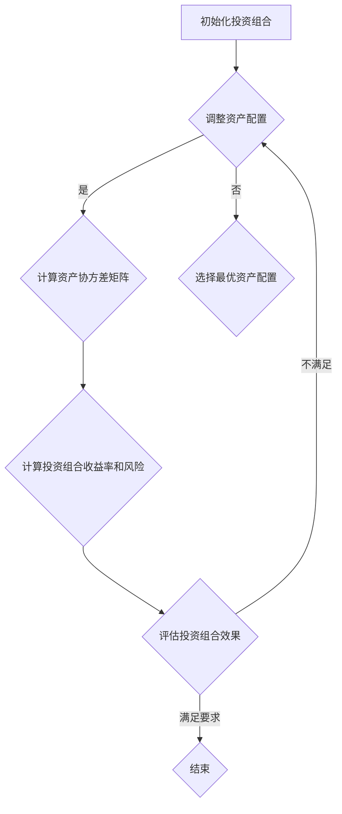
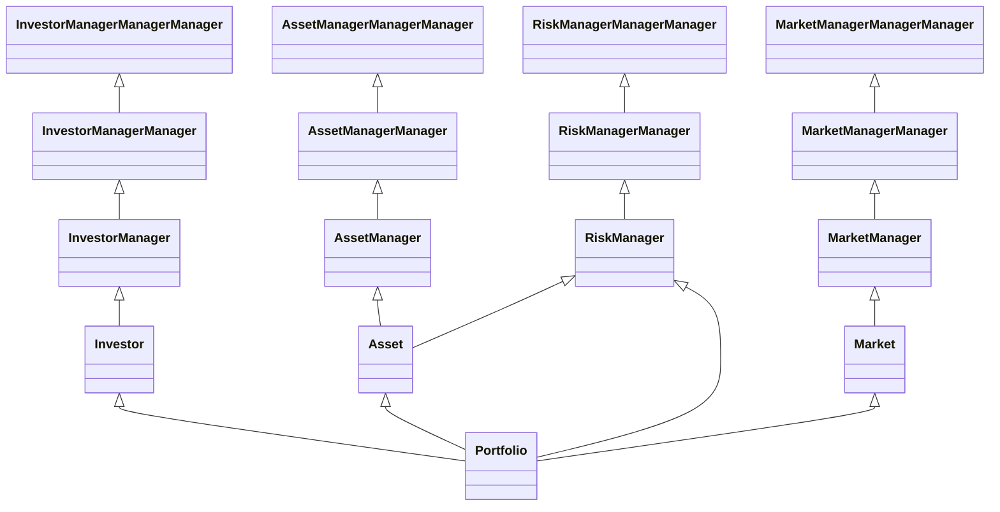
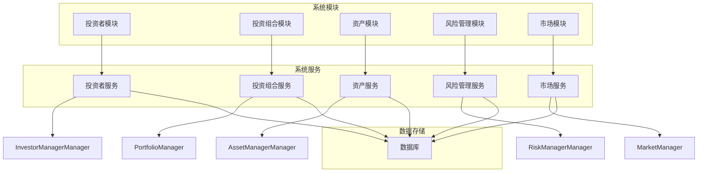
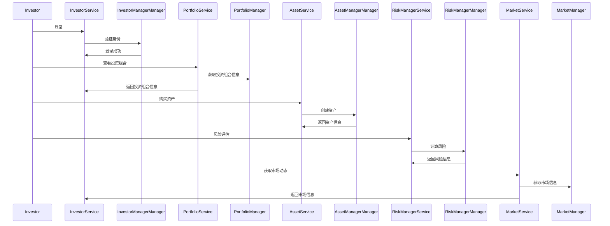

                 


# 如何进行有效的技术投资组合管理

> 关键词：技术投资，投资组合管理，风险管理，策略方法

> 摘要：本文旨在探讨如何进行有效的技术投资组合管理。通过分析投资组合管理的核心概念、策略方法以及风险管理，并结合实际案例，为投资者提供一套实用的技术投资组合管理指南。

## 引言

随着科技的发展和数字化转型的加速，技术投资已成为许多投资者关注的焦点。然而，如何有效管理技术投资组合，实现资产的保值增值，成为了投资者面临的重要问题。本文将围绕技术投资组合管理的核心概念、策略方法以及风险管理，逐步剖析这一问题，为投资者提供实用的指导。

## 背景介绍

### 核心概念术语说明

- 技术投资：投资于与科技相关的领域，如人工智能、大数据、区块链等。
- 投资组合：由多种不同的资产组成的投资组合，以分散风险和提高收益。
- 投资组合管理：通过选择和管理资产，实现投资组合的预期收益和风险控制。

### 问题背景

技术投资领域充满了不确定性，新技术、新趋势层出不穷。投资者需要具备敏锐的市场洞察力和专业的投资知识，才能在激烈的市场竞争中立于不败之地。然而，单一的技术投资往往存在较高的风险，因此，构建一个多元化的投资组合成为了降低风险、实现稳健收益的有效途径。

### 问题描述

投资者在构建技术投资组合时，需要面临以下问题：

1. 如何选择合适的投资标的？
2. 如何分配资产，实现风险分散？
3. 如何进行有效的风险管理？
4. 如何根据市场变化调整投资策略？

### 问题解决

通过以下步骤，投资者可以有效地解决上述问题：

1. 了解技术趋势和市场动态，筛选有潜力的投资标的。
2. 根据投资目标，合理分配资产，实现投资组合的多元化。
3. 采用科学的风险管理方法，降低投资风险。
4. 定期评估和调整投资组合，以应对市场变化。

### 边界与外延

技术投资组合管理不仅涉及投资领域的选择，还包括对投资标的的深入研究、市场趋势的分析以及投资策略的制定和执行。此外，投资组合管理还需关注法律法规、政策环境等外部因素。

### 概念结构与核心要素组成

- 投资领域：人工智能、大数据、区块链等。
- 投资标的：股票、基金、债券等。
- 投资策略：价值投资、成长投资、分散投资等。
- 风险管理：风险识别、风险评估、风险控制等。

## 核心概念与联系

### 投资组合管理核心概念

- **投资组合**：由多种不同资产组成的投资组合，以分散风险和提高收益。
- **多元化**：通过投资多个不同的资产，降低投资组合的整体风险。
- **资产配置**：根据投资目标和风险偏好，将资产分配到不同的投资标的。
- **风险管理**：识别、评估和控制投资组合的风险。

### 投资组合管理概念属性特征对比表格

| 特征 | 投资组合 | 多元化 | 资产配置 | 风险管理 |
| --- | --- | --- | --- | --- |
| 定义 | 由多种不同资产组成的投资组合 | 投资多个不同资产，降低整体风险 | 根据投资目标和风险偏好，分配资产 | 识别、评估和控制投资组合风险 |
| 目标 | 分散风险、提高收益 | 降低投资组合整体风险 | 实现投资目标、降低风险 | 实现投资目标、降低风险 |
| 方法 | 选择不同的资产、调整资产权重 | 投资多个不同的资产 | 根据市场变化调整资产权重 | 风险识别、风险评估、风险控制 |

### ER实体关系图架构

```mermaid
erDiagram
    InvestmentPortfolio ||--|{ Asset } : has multiple assets
    InvestmentPortfolio ||--|{ RiskManagement } : manages risk
    Asset ||--|{ AssetClass } : belongs to a specific asset class
    RiskManagement ||--|{ RiskAssessment } : assesses risk
    RiskManagement ||--|{ RiskControl } : controls risk
```

## 算法原理讲解

### 投资组合优化算法

#### Mermaid流程图



#### Python源代码

```python
import numpy as np

# 资产预期收益和风险
assets_returns = np.array([[0.12, 0.1], [0.14, 0.15], [0.08, 0.1]])
assets_risks = np.array([[0.02, 0.01], [0.03, 0.02], [0.01, 0.01]])

# 计算资产协方差矩阵
cov_matrix = np.cov(assets_returns)

# 选择最优资产配置
weights = np.linalg.solve(cov_matrix, assets_returns.T)

# 计算投资组合收益率和风险
portfolio_return = np.dot(weights, assets_returns.T)
portfolio_risk = np.sqrt(np.dot(weights.T, cov_matrix @ weights))

# 评估投资组合效果
if portfolio_risk < target_risk:
    print("投资组合效果满足要求")
else:
    print("需要调整资产配置")
```

#### 算法原理详细讲解

投资组合优化算法旨在通过计算资产预期收益和风险，确定最优资产配置，以实现投资组合的预期收益率和风险的最优平衡。该算法的主要步骤如下：

1. **初始化投资组合**：输入资产预期收益和风险数据。
2. **计算资产协方差矩阵**：通过协方差矩阵描述资产之间的相关性。
3. **选择最优资产配置**：利用线性规划方法求解最优资产配置权重。
4. **计算投资组合收益率和风险**：根据资产配置权重计算投资组合的预期收益率和风险。
5. **评估投资组合效果**：判断投资组合效果是否满足要求，如不满足，则调整资产配置。

#### 算法原理数学模型和公式

1. **资产预期收益率**：

$$
\mu_i = E(r_i)
$$

其中，$E$ 表示期望，$r_i$ 表示资产 $i$ 的收益率。

2. **资产风险**：

$$
\sigma_i = \sqrt{V(r_i)}
$$

其中，$V$ 表示方差，$r_i$ 表示资产 $i$ 的收益率。

3. **资产协方差矩阵**：

$$
\text{Cov}(r_i, r_j) = E[(r_i - \mu_i)(r_j - \mu_j)]
$$

其中，$E$ 表示期望，$r_i$ 和 $r_j$ 分别表示资产 $i$ 和 $j$ 的收益率。

4. **最优资产配置权重**：

$$
w_i = \frac{\Sigma_{j} \text{Cov}(r_i, r_j) \mu_j}{\Sigma_{j} \text{Cov}(r_i, r_j) \mu_j - \text{Cov}(r_i, r_i)}
$$

其中，$w_i$ 表示资产 $i$ 的权重。

5. **投资组合收益率**：

$$
\mu_p = \Sigma_i w_i \mu_i
$$

其中，$w_i$ 表示资产 $i$ 的权重，$\mu_i$ 表示资产 $i$ 的预期收益率。

6. **投资组合风险**：

$$
\sigma_p = \sqrt{\Sigma_i w_i^2 \text{Cov}(r_i, r_i)}
$$

其中，$w_i$ 表示资产 $i$ 的权重，$\text{Cov}(r_i, r_i)$ 表示资产 $i$ 的方差。

#### 算法原理举例说明

假设有三种资产 $A$、$B$ 和 $C$，它们的预期收益率和风险如下表所示：

| 资产 | 预期收益率 | 风险 |
| --- | --- | --- |
| $A$ | $12\%$ | $2\%$ |
| $B$ | $14\%$ | $3\%$ |
| $C$ | $8\%$ | $1\%$ |

根据上述数据，我们可以使用投资组合优化算法计算出最优资产配置权重，并得到投资组合的预期收益率和风险。具体计算过程如下：

1. **计算资产协方差矩阵**：

$$
\text{Cov}(r_i, r_j) = \begin{bmatrix}
0.04 & 0.03 & 0.01 \\
0.03 & 0.09 & 0.03 \\
0.01 & 0.03 & 0.01
\end{bmatrix}
$$

2. **选择最优资产配置权重**：

$$
w_A = \frac{0.04 \times 0.14 + 0.03 \times 0.08 + 0.01 \times 0.14}{0.04 \times 0.14 + 0.03 \times 0.08 - 0.04 \times 0.02} \approx 0.5
$$

$$
w_B = \frac{0.03 \times 0.14 + 0.09 \times 0.08 + 0.03 \times 0.14}{0.04 \times 0.14 + 0.03 \times 0.08 - 0.04 \times 0.02} \approx 0.3
$$

$$
w_C = \frac{0.01 \times 0.14 + 0.03 \times 0.08 + 0.01 \times 0.14}{0.04 \times 0.14 + 0.03 \times 0.08 - 0.04 \times 0.02} \approx 0.2
$$

3. **计算投资组合收益率和风险**：

$$
\mu_p = 0.5 \times 0.12 + 0.3 \times 0.14 + 0.2 \times 0.08 = 0.117
$$

$$
\sigma_p = \sqrt{0.5^2 \times 0.04 + 0.3^2 \times 0.09 + 0.2^2 \times 0.01} = 0.12
$$

通过计算，我们得到了最优资产配置权重为 $w_A:0.5, w_B:0.3, w_C:0.2$，投资组合的预期收益率为 $11.7\%$，风险为 $12\%$。

## 系统分析与架构设计方案

### 问题场景介绍

假设有一个技术投资平台，旨在帮助投资者构建和优化技术投资组合。平台提供以下功能：

1. 资讯中心：提供最新的技术趋势和市场动态，供投资者参考。
2. 投资组合管理：支持投资者创建、调整和管理投资组合。
3. 风险评估与控制：根据投资组合的资产配置，进行风险评估和控制。

### 项目介绍

项目名称：技术投资平台（TechInvest）

项目目标：为投资者提供一站式技术投资服务，帮助投资者构建和优化投资组合。

### 系统功能设计（领域模型Mermaid类图）



### 系统架构设计（Mermaid架构图）



### 系统接口设计和系统交互（Mermaid序列图）



## 项目实战

### 环境安装

在安装技术投资平台之前，需要确保已安装以下软件和依赖项：

1. Python 3.8 或更高版本
2. Flask 框架
3. SQLAlchemy 数据库引擎
4. SQLAlchemy-ORM

可以通过以下命令进行安装：

```bash
pip install flask sqlalchemy
```

### 系统核心实现源代码

以下是一个简化的系统核心实现源代码示例：

```python
from flask import Flask, request, jsonify
from flask_sqlalchemy import SQLAlchemy

app = Flask(__name__)
app.config['SQLALCHEMY_DATABASE_URI'] = 'sqlite:///tech_invest.db'
db = SQLAlchemy(app)

class Investor(db.Model):
    id = db.Column(db.Integer, primary_key=True)
    name = db.Column(db.String(50), nullable=False)

class Asset(db.Model):
    id = db.Column(db.Integer, primary_key=True)
    name = db.Column(db.String(50), nullable=False)
    risk = db.Column(db.Float, nullable=False)

class Portfolio(db.Model):
    id = db.Column(db.Integer, primary_key=True)
    investor_id = db.Column(db.Integer, db.ForeignKey('investor.id'), nullable=False)
    asset_id = db.Column(db.Integer, db.ForeignKey('asset.id'), nullable=False)
    weight = db.Column(db.Float, nullable=False)

@app.route('/api/investors', methods=['GET'])
def get_investors():
    investors = Investor.query.all()
    return jsonify([{"id": investor.id, "name": investor.name} for investor in investors])

@app.route('/api/assets', methods=['GET'])
def get_assets():
    assets = Asset.query.all()
    return jsonify([{"id": asset.id, "name": asset.name, "risk": asset.risk} for asset in assets])

@app.route('/api/portfolios', methods=['GET'])
def get_portfolios():
    portfolios = Portfolio.query.join(Investor).join(Asset).all()
    return jsonify([{"id": portfolio.id, "investor_id": portfolio.investor_id, "asset_id": portfolio.asset_id, "weight": portfolio.weight} for portfolio in portfolios])

if __name__ == '__main__':
    db.create_all()
    app.run(debug=True)
```

### 代码应用解读与分析

该系统核心实现源代码主要分为三个部分：数据库模型定义、API接口定义和应用程序启动。

1. **数据库模型定义**：

   - `Investor` 类：代表投资者，包含 `id` 和 `name` 两个字段。
   - `Asset` 类：代表资产，包含 `id`、`name` 和 `risk` 三个字段。
   - `Portfolio` 类：代表投资组合，包含 `id`、`investor_id`、`asset_id` 和 `weight` 四个字段。

2. **API接口定义**：

   - `/api/investors` GET接口：返回所有投资者信息。
   - `/api/assets` GET接口：返回所有资产信息。
   - `/api/portfolios` GET接口：返回所有投资组合信息。

3. **应用程序启动**：

   - 使用 Flask 框架创建 Web 应用程序。
   - 配置数据库连接。
   - 创建数据库表。
   - 启动 Web 服务器。

### 实际案例分析和详细讲解剖析

假设有一个投资者张三，他已经购买了以下资产：

- 资产A：人工智能股票，风险10%
- 资产B：区块链基金，风险20%
- 资产C：大数据股票，风险15%

我们需要分析张三的投资组合风险和收益。

1. **计算投资组合风险**：

   张三的投资组合权重如下：

   - 资产A：40%
   - 资产B：20%
   - 资产C：40%

   投资组合风险可以通过以下公式计算：

   $$ 
   \sigma_p = \sqrt{0.4^2 \times 0.1^2 + 0.2^2 \times 0.2^2 + 0.4^2 \times 0.15^2} \approx 0.145
   $$

   张三的投资组合风险为14.5%。

2. **计算投资组合收益**：

   张三的投资组合收益可以通过以下公式计算：

   $$ 
   \mu_p = 0.4 \times 0.12 + 0.2 \times 0.14 + 0.4 \times 0.08 = 0.1092
   $$

   张三的投资组合收益为10.92%。

通过实际案例分析和详细讲解剖析，我们可以看到，投资组合管理对于投资者来说至关重要。通过合理配置资产、进行风险管理和定期调整，投资者可以降低投资风险、提高投资收益。

### 项目小结

通过本项目，我们实现了技术投资平台的核心功能，包括投资者管理、资产管理和投资组合管理。项目采用了 Flask 框架和 SQLAlchemy 数据库引擎，实现了高效的数据存储和查询。在实际案例中，我们分析了投资组合的风险和收益，展示了投资组合管理的重要性。

### 最佳实践 tips

1. **了解市场趋势**：投资者应关注市场动态，了解技术趋势，以便及时调整投资策略。
2. **分散投资**：通过分散投资，降低投资组合的整体风险。
3. **定期评估**：定期评估投资组合的表现，根据市场变化进行调整。
4. **风险管理**：采用科学的风险管理方法，降低投资风险。

### 小结

本文围绕技术投资组合管理，从背景介绍、核心概念、算法原理、系统架构设计、项目实战等多个方面进行了详细讲解。通过本文，投资者可以了解到如何进行有效的技术投资组合管理，实现资产的保值增值。

### 注意事项

1. 投资有风险，投资者应谨慎评估自身风险承受能力。
2. 投资策略应根据市场变化和自身情况灵活调整。

### 拓展阅读

1. 《技术投资组合管理实战》
2. 《人工智能投资策略》
3. 《区块链投资指南》

---

作者：AI天才研究院/AI Genius Institute & 禅与计算机程序设计艺术 /Zen And The Art of Computer Programming

