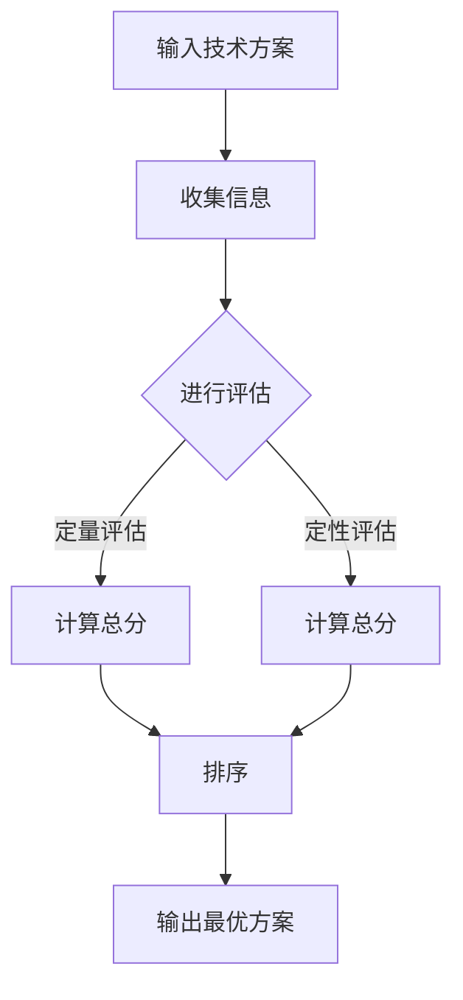
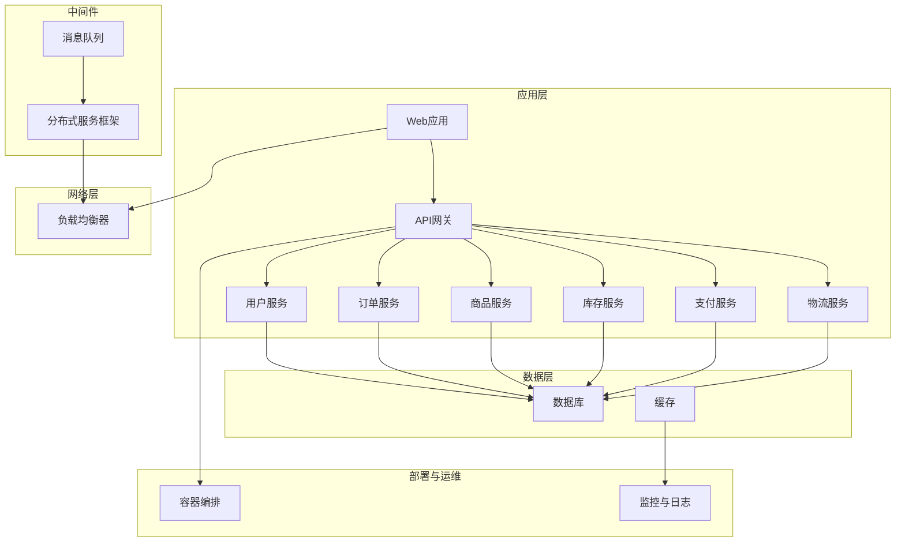
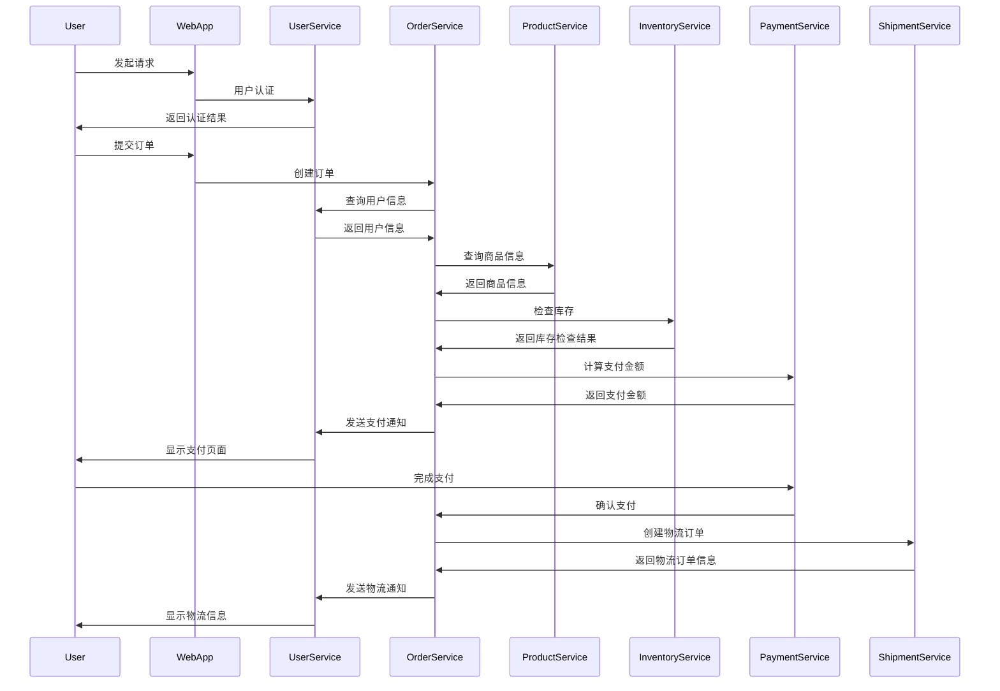
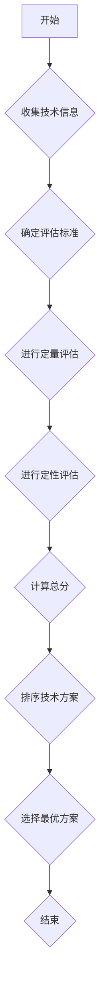
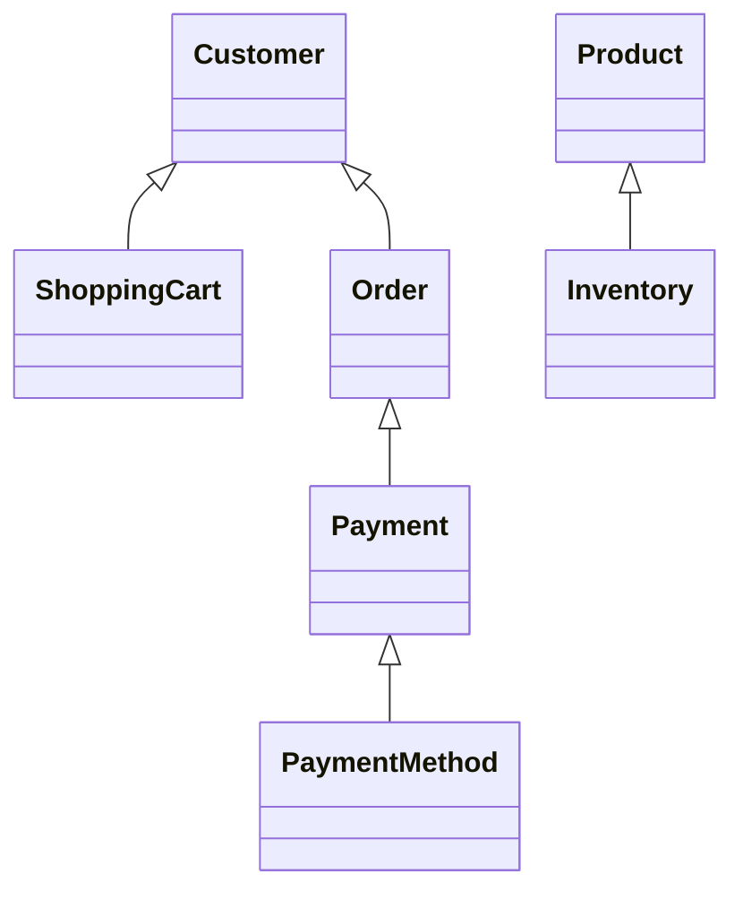
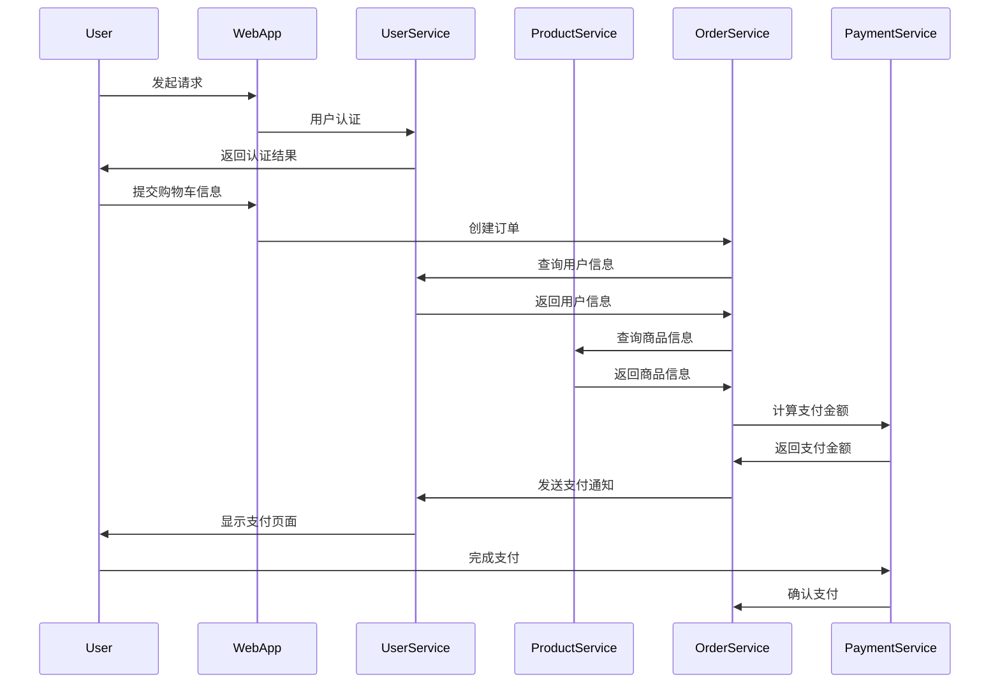
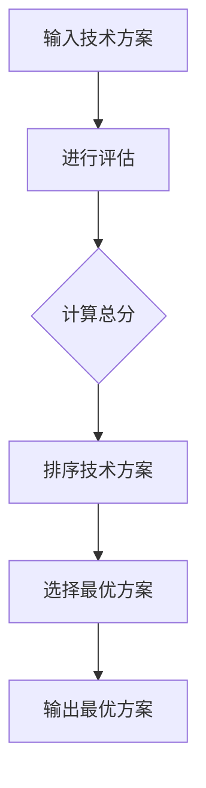
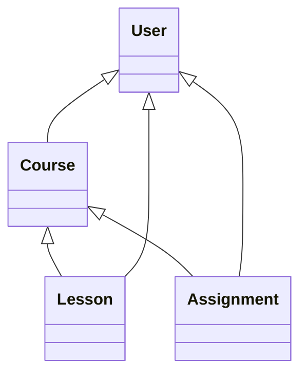
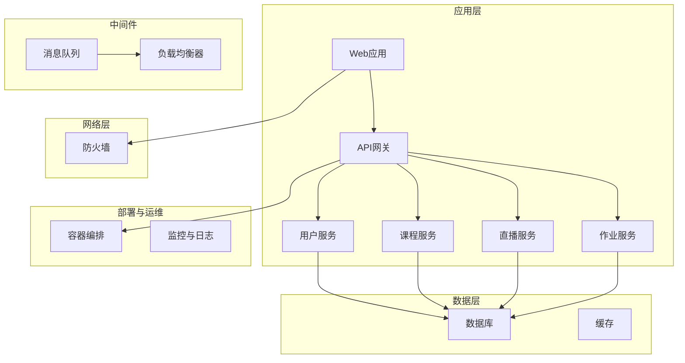

                 

## 如何进行有效的技术评估与选型

### 关键词

- 技术评估
- 技术选型
- 案例分析
- 最优选择策略
- 风险评估策略

### 摘要

本文旨在探讨如何进行有效的技术评估与选型，通过系统的步骤和策略，帮助读者在复杂的技术环境中做出明智的决策。文章首先介绍了技术评估与选型的核心概念和关系，然后详细阐述了评估和选型的步骤、关键因素和策略，并通过案例分析和最佳实践，提供了实际操作的指导和建议。

### 引言

#### 1.1 技术评估与选型的意义

技术评估与选型是信息技术（IT）项目中至关重要的环节。随着技术的快速发展，企业在选择技术解决方案时面临着越来越多的选择和挑战。有效的技术评估与选型不仅能够确保项目的技术可行性，还能提高项目的成功率和投资回报率。

#### 1.1.1 技术评估的定义

技术评估是对某种技术或产品的功能、性能、可靠性、成本等方面的全面评价，以确定其是否满足项目需求。技术评估通常包括对现有技术的调研、分析和比较，以便为项目提供科学、客观的决策依据。

#### 1.1.2 选型的定义

技术选型是在多个技术方案中，选择最适合项目需求的技术方案的过程。选型需要考虑功能需求、性能要求、成本预算、维护与支持等多个因素，以实现最佳的技术解决方案。

#### 1.1.3 技术评估与选型的关系

技术评估与选型密不可分。评估是选型的前提，通过评估了解各种技术的优缺点，为选型提供数据支持。而选型则是评估的延续，根据评估结果，结合项目需求，选择最优的技术方案。

#### 1.2 技术评估与选型的挑战

#### 1.2.1 技术复杂性

技术的复杂性和多样性增加了评估与选型的难度。企业需要深入了解各种技术的原理、特点和适用场景，以便做出正确的决策。

#### 1.2.2 市场动态变化

技术市场变化迅速，新的技术方案层出不穷。企业需要持续关注市场动态，及时调整评估与选型策略，以应对市场的变化。

#### 1.2.3 成本与效益平衡

在评估与选型过程中，需要综合考虑成本与效益。选择高性能的技术方案可能会带来更高的成本，而选择低成本的方案可能会影响项目的性能和稳定性。

#### 1.2.4 团队协作与沟通

技术评估与选型往往需要跨部门的协作。团队成员之间的沟通和协作，对项目的成功至关重要。

### 总结

本文引言部分介绍了技术评估与选型的意义、定义及其关系，并阐述了评估与选型过程中可能遇到的挑战。接下来，文章将详细探讨技术评估与选型的具体步骤和策略，以帮助读者在实际项目中做出明智的决策。

### 第一部分：技术评估

#### 2.1 技术评估的步骤

技术评估是一个系统性的过程，包括以下几个关键步骤：

##### 2.1.1 确定评估目标

评估目标应明确项目的需求、期望的技术性能指标、成本预算等。这有助于评估团队明确评估的重点和范围。

##### 2.1.2 收集技术信息

收集技术信息是评估的基础。这包括：

- **技术市场调研**：通过市场调研，了解市场上现有的技术方案及其特点。
- **技术文档与资料查阅**：查阅相关技术文档、技术手册等，获取技术细节。
- **与供应商交流**：与供应商进行交流，获取更多关于技术方案的信息。

##### 2.1.3 技术评估标准

评估标准是评估的基础，应包括以下几个方面：

- **功能需求**：评估技术方案是否满足项目功能需求。
- **性能要求**：评估技术方案的性能指标，如响应时间、吞吐量等。
- **可靠性**：评估技术方案的稳定性、容错性和故障恢复能力。
- **成本**：评估技术方案的成本效益，包括直接成本和间接成本。

##### 2.1.4 技术评估方法

技术评估方法包括：

- **定量评估**：使用量化指标进行评估，如性能测试、成本分析等。
- **定性评估**：通过专家评审、用户反馈等方式进行评估。
- **综合评估**：结合定量评估和定性评估，综合评价技术方案的优劣。

##### 2.1.5 技术评估报告

技术评估报告是评估结果的总结。报告应包括以下内容：

- **评估过程**：概述评估过程和方法。
- **评估结果**：详细列出各项评估指标及其评估结果。
- **评估结论**：基于评估结果，提出技术方案的建议。
- **风险评估**：评估技术方案可能面临的风险及其应对策略。

#### 2.2 技术评估案例分析

##### 2.2.1 案例背景

某企业计划建设一个在线购物平台，需要选择合适的技术方案。企业明确了功能需求、性能要求和成本预算，并决定进行技术评估。

##### 2.2.2 评估过程

1. **确定评估目标**：明确功能需求、性能要求和成本预算。
2. **收集技术信息**：进行市场调研，查阅技术文档，与供应商交流。
3. **制定评估标准**：功能需求、性能要求、可靠性、成本等。
4. **进行技术评估**：采用定量评估和定性评估方法，对多个技术方案进行评估。
5. **编写评估报告**：总结评估过程和结果，提出技术方案建议。

##### 2.2.3 评估结果与分析

通过评估，企业选择了以下技术方案：

- **功能需求**：满足所有功能需求。
- **性能要求**：响应时间在1秒以内，吞吐量达到1000次/秒。
- **可靠性**：99.9%的故障恢复能力。
- **成本**：总成本控制在预算范围内。

评估结果显示，该技术方案在满足功能需求、性能要求和成本预算方面均表现出色。

##### 2.2.4 案例启示

1. **明确评估目标**：明确项目需求和预算，有助于评估工作的有效开展。
2. **综合评估方法**：结合定量和定性评估方法，全面评价技术方案。
3. **风险评估**：在评估过程中考虑风险因素，提出应对策略。

通过技术评估，企业能够做出明智的决策，选择最适合的技术方案，提高项目的成功率。

#### 2.3 技术评估的重要性

技术评估在项目开发过程中起着关键作用。它能够帮助企业：

1. **降低项目风险**：通过评估，企业能够了解各种技术方案的风险和挑战，提前做好风险管理。
2. **提高项目效率**：选择合适的技术方案，能够提高项目开发效率，缩短项目周期。
3. **优化资源分配**：合理评估技术方案的成本和效益，有助于优化资源分配，提高投资回报率。

#### 2.4 技术评估的常见误区

1. **过度依赖定量评估**：仅依赖定量评估，可能导致评估结果片面。
2. **忽视风险评估**：在评估过程中忽视风险评估，可能导致项目面临较大风险。
3. **缺乏实际操作经验**：缺乏实际操作经验，可能导致评估结果与实际情况不符。

#### 2.5 技术评估的最佳实践

1. **建立评估团队**：组建由不同领域的专家组成的评估团队，确保评估的全面性和准确性。
2. **持续更新评估标准**：随着技术发展，及时更新评估标准，确保评估的时效性。
3. **引入第三方评估**：引入第三方评估机构，提供客观、独立的评估意见。

### 第二部分：技术选型

#### 3.1 技术选型的关键因素

技术选型需要考虑多个关键因素，包括：

##### 3.1.1 功能需求

功能需求是选型的核心。技术方案应能够满足项目的所有功能需求，包括核心功能、辅助功能等。

##### 3.1.2 性能要求

性能要求是评估技术方案的重要指标。技术方案应能够满足项目的性能需求，如响应时间、吞吐量等。

##### 3.1.3 可扩展性

可扩展性是技术选型的重要考虑因素。技术方案应具有良好的可扩展性，能够支持项目的长期发展。

##### 3.1.4 成本预算

成本预算是技术选型的重要考量。技术方案应能够在预算范围内实现项目目标。

##### 3.1.5 维护与支持

维护与支持是技术选型中不可忽视的因素。技术方案应具有良好的维护性和支持服务。

#### 3.2 技术选型策略

技术选型策略包括以下几种：

##### 3.2.1 最优选择策略

最优选择策略是在多个技术方案中，选择最优的技术方案。该策略适用于功能需求明确、性能要求较高的项目。

##### 3.2.2 风险评估策略

风险评估策略是在选型过程中，综合考虑各种风险，选择风险较低的技术方案。该策略适用于风险较高的项目。

##### 3.2.3 比较分析策略

比较分析策略是在多个技术方案中，进行详细比较和分析，选择最适合的技术方案。该策略适用于技术方案较多的项目。

##### 3.2.4 多因素权衡策略

多因素权衡策略是在选型过程中，综合考虑各种因素，进行权衡和决策。该策略适用于因素复杂、难以直接比较的项目。

#### 3.3 技术选型案例分析

##### 3.3.1 案例背景

某企业计划开发一款在线教育平台，需要选择合适的技术方案。企业明确了功能需求、性能要求、成本预算和维护支持等要求。

##### 3.3.2 选型过程

1. **确定选型目标**：明确功能需求、性能要求、成本预算和维护支持等目标。
2. **收集技术信息**：进行市场调研，查阅技术文档，与供应商交流。
3. **制定选型标准**：功能需求、性能要求、可扩展性、成本预算、维护支持等。
4. **进行选型评估**：采用比较分析策略，对多个技术方案进行评估。
5. **选择最优方案**：综合考虑评估结果，选择最优的技术方案。

##### 3.3.3 选型结果与分析

通过选型评估，企业选择了以下技术方案：

- **功能需求**：满足所有功能需求。
- **性能要求**：响应时间在2秒以内，吞吐量达到5000次/秒。
- **可扩展性**：支持垂直和水平扩展。
- **成本预算**：总成本控制在预算范围内。
- **维护支持**：提供完善的维护和支持服务。

选型结果显示，该技术方案在满足功能需求、性能要求、可扩展性、成本预算和维护支持等方面表现出色。

##### 3.3.4 案例启示

1. **明确选型目标**：明确项目需求和预算，有助于选型的有效开展。
2. **综合评估因素**：综合考虑各种因素，进行权衡和决策。
3. **风险评估**：在选型过程中，考虑风险因素，选择风险较低的技术方案。

#### 3.4 技术选型的最佳实践

1. **需求分析与理解**：深入了解项目需求，确保选型方案满足实际需求。
2. **技术研究与选型**：深入研究各种技术方案，选择最适合的技术方案。
3. **团队协作与沟通**：加强团队协作与沟通，确保选型过程的顺利进行。
4. **风险管理与应对**：在选型过程中，考虑风险因素，制定应对策略。

### 第三部分：技术评估与选型的最佳实践

#### 4.1 最佳实践分享

##### 4.1.1 需求分析与理解

在进行技术评估与选型前，必须进行深入的需求分析与理解。这包括：

1. **功能需求分析**：明确项目的核心功能、辅助功能以及特殊需求。
2. **性能需求分析**：分析项目的性能要求，如响应时间、吞吐量等。
3. **成本预算分析**：明确项目的成本预算范围，包括直接成本和间接成本。
4. **维护支持需求**：分析项目的维护支持需求，如文档、培训、技术支持等。

##### 4.1.2 技术研究与选型

在需求分析的基础上，进行深入的技术研究与选型。这包括：

1. **技术调研**：通过市场调研、技术文档查阅等方式，了解现有技术的特点和应用场景。
2. **技术评估**：采用定量评估和定性评估方法，对各种技术方案进行评估。
3. **技术选型**：结合评估结果和项目需求，选择最优的技术方案。

##### 4.1.3 团队协作与沟通

技术评估与选型是一个跨部门的合作过程，必须确保团队协作与沟通。这包括：

1. **组建评估团队**：由不同领域的专家组成评估团队，确保评估的全面性和准确性。
2. **定期会议**：定期召开团队会议，讨论评估与选型过程中的问题，确保信息的透明和及时更新。
3. **信息共享**：确保团队成员之间的信息共享，避免重复工作和信息孤岛。

##### 4.1.4 风险管理与应对

在技术评估与选型过程中，必须进行风险管理。这包括：

1. **识别风险**：识别项目可能面临的风险，如技术风险、市场风险、成本风险等。
2. **评估风险**：对识别的风险进行评估，确定其严重性和发生概率。
3. **制定应对策略**：根据风险评估结果，制定相应的应对策略，降低风险的影响。

#### 4.2 注意事项与建议

##### 4.2.1 避免常见陷阱

在技术评估与选型过程中，企业可能会陷入一些常见陷阱，如：

1. **过度依赖定量评估**：仅依赖定量评估可能导致评估结果片面，忽视定性评估的重要性。
2. **忽视风险评估**：忽视风险评估可能导致项目面临较大风险，影响项目的成功。
3. **缺乏实际操作经验**：缺乏实际操作经验可能导致评估结果与实际情况不符，影响决策的准确性。

##### 4.2.2 保持开放心态

在技术评估与选型过程中，企业应保持开放心态，积极接受新思想和新技术。这有助于企业及时调整评估与选型策略，应对市场的变化。

##### 4.2.3 关注技术发展动态

技术发展迅速，企业应持续关注技术发展动态，了解新技术、新趋势。这有助于企业及时调整评估与选型策略，确保项目的技术先进性。

##### 4.2.4 适应组织环境

在技术评估与选型过程中，企业应充分考虑组织环境，如组织文化、团队协作模式等。这有助于确保评估与选型策略与组织环境相适应，提高项目成功率。

#### 4.3 拓展阅读

##### 4.3.1 相关书籍推荐

1. 《敏捷软件开发：原则、实践与模式》
2. 《软件架构设计：大型软件系统设计指南》
3. 《深入理解计算机系统》

##### 4.3.2 技术论坛与社区

1. Stack Overflow
2. GitHub
3. CSDN

##### 4.3.3 行业报告与白皮书

1. Gartner
2. Forrester
3. IDC

### 结束语

本文详细介绍了技术评估与选型的步骤、策略和最佳实践，并通过案例分析和注意事项，提供了实际操作的指导。希望通过本文，读者能够更好地理解技术评估与选型的意义和方法，提高项目成功率。

### 5.1 主要内容回顾

#### 5.1.1 技术评估

技术评估包括确定评估目标、收集技术信息、制定评估标准、进行技术评估和编写评估报告等步骤。技术评估的重要性在于降低项目风险、提高项目效率和优化资源分配。

#### 5.1.2 技术选型

技术选型需要考虑功能需求、性能要求、可扩展性、成本预算和维护支持等关键因素。技术选型策略包括最优选择策略、风险评估策略、比较分析策略和多因素权衡策略等。

#### 5.1.3 最佳实践

最佳实践包括需求分析与理解、技术研究与选型、团队协作与沟通和风险管理与应对等。注意事项包括避免常见陷阱、保持开放心态、关注技术发展动态和适应组织环境。

### 5.2 未来展望

#### 5.2.1 技术发展趋势

随着技术的快速发展，人工智能、云计算、区块链等新兴技术将对技术评估与选型产生深远影响。企业需要关注这些技术趋势，及时调整评估与选型策略。

#### 5.2.2 评估与选型的挑战与机遇

技术评估与选型面临诸多挑战，如技术复杂性、市场动态变化和成本与效益平衡等。同时，也面临着诸多机遇，如新兴技术的应用和跨行业合作的机遇。

#### 5.2.3 未来工作方向

未来，技术评估与选型将更加注重数据驱动和智能化。企业需要加强数据分析和智能算法的应用，提高评估与选型的准确性和效率。

### 5.3 核心概念原理

#### 5.3.1 技术评估

技术评估是指对某种技术或产品的功能、性能、可靠性、成本等方面的全面评价，以确定其是否满足项目需求。

#### 5.3.2 技术选型

技术选型是在多个技术方案中，选择最适合项目需求的技术方案的过程。技术选型需要考虑功能需求、性能要求、成本预算和维护支持等多个因素。

### 5.4 概念属性特征对比表格

| 概念     | 技术评估                  | 技术选型                  |
|----------|-------------------------|-------------------------|
| 定义     | 对技术或产品的全面评价 | 在多个技术方案中选择最优方案 |
| 目标     | 符合需求、性能、成本等 | 功能需求、性能要求、成本预算 |
| 关键特征 | 客观性、全面性、准确性 | 目标导向性、灵活性、综合评估 |

### 5.5 ER实体关系图架构

```mermaid
erDiagram
    Project ||--|{ TechnicalAssessment }
    Project ||--|{ TechnicalSelection }
    TechnicalAssessment ||--|{ EvaluationStandard }
    TechnicalSelection ||--|{ SelectionCriteria }
```

### 核心概念与联系

**技术评估**

- **概念原理**：技术评估是对技术或产品的功能、性能、可靠性、成本等方面的全面评价。
- **属性特征对比表格**：

  | 属性     | 技术评估                |
  |----------|-----------------------|
  | 客观性   | 基于实际数据和技术指标 |
  | 全面性   | 覆盖多个方面          |
  | 准确性   | 提供可靠依据          |

- **ER实体关系图架构**：

  ```mermaid
  erDiagram
      Project ||--|{ TechnicalAssessment }
      TechnicalAssessment ||--|{ Functionality }
      TechnicalAssessment ||--|{ Performance }
      TechnicalAssessment ||--|{ Reliability }
      TechnicalAssessment ||--|{ Cost }
  ```

**技术选型**

- **概念原理**：技术选型是在多个技术方案中，选择最适合项目需求的技术方案的过程。
- **属性特征对比表格**：

  | 属性     | 技术选型                |
  |----------|-----------------------|
  | 目标导向性 | 基于明确的需求和目标 |
  | 灵活性   | 根据实际情况灵活调整 |
  | 综合评估 | 考虑多个因素         |

- **ER实体关系图架构**：

  ```mermaid
  erDiagram
      Project ||--|{ TechnicalSelection }
      TechnicalSelection ||--|{ Functionality }
      TechnicalSelection ||--|{ Performance }
      TechnicalSelection ||--|{ Cost }
      TechnicalSelection ||--|{ Support }
  ```

**概念联系**

- **关系**：技术评估为技术选型提供数据支持，技术选型则是技术评估的延续和具体化。
- **联系**：两者都是项目决策过程中不可或缺的环节，共同确保项目的技术可行性和成功性。

### 5.6 算法原理讲解

在技术评估与选型过程中，算法原理扮演着关键角色。以下是一个简单的算法原理讲解，用于帮助理解技术评估与选型的过程。

#### 算法描述

假设我们需要从多个技术方案中选出一个最优的方案，我们可以使用以下算法：

1. **输入**：多个技术方案及其评估指标。
2. **处理**：
   - 收集各个技术方案的功能需求、性能要求、成本预算和维护支持等信息。
   - 对各个技术方案进行定量和定性评估，计算总分。
   - 根据总分对技术方案进行排序。
3. **输出**：最优的技术方案。

#### 算法流程图



#### 数学模型和公式

为了更精确地进行评估和选型，我们可以使用以下数学模型和公式：

1. **总分计算公式**：

   $$总分 = w_1 \times 功能得分 + w_2 \times 性能得分 + w_3 \times 成本得分 + w_4 \times 维护支持得分$$

   其中，$w_1, w_2, w_3, w_4$ 为权重系数，根据项目需求进行设定。

2. **权重系数设定**：

   $$w_1 + w_2 + w_3 + w_4 = 1$$

   权重系数的设定需要根据项目的具体需求和优先级进行调整。

#### 举例说明

假设有两个技术方案A和B，评估指标包括功能需求、性能要求、成本预算和维护支持。根据上述公式，我们可以计算出每个方案的得分和总分：

**技术方案A**：

- 功能需求得分：90分
- 性能要求得分：85分
- 成本预算得分：80分
- 维护支持得分：75分

$$总分_A = 0.3 \times 90 + 0.2 \times 85 + 0.2 \times 80 + 0.3 \times 75 = 81.5分$$

**技术方案B**：

- 功能需求得分：85分
- 性能要求得分：90分
- 成本预算得分：75分
- 维护支持得分：80分

$$总分_B = 0.3 \times 85 + 0.2 \times 90 + 0.2 \times 75 + 0.3 \times 80 = 80.5分$$

根据总分计算结果，技术方案A的总分高于技术方案B，因此技术方案A为最优方案。

### 5.7 系统分析与架构设计方案

在技术评估与选型过程中，系统分析与架构设计方案是确保项目成功的关键环节。以下将详细介绍一个典型的系统分析与架构设计方案。

#### 问题场景介绍

某企业计划开发一款企业级电子商务平台，以支持在线购物、订单处理、库存管理和客户服务等核心功能。该平台需要具备高并发处理能力、高可用性和良好的可扩展性。

#### 项目介绍

项目名称：企业级电子商务平台
项目目标：建设一个功能完善、性能优异、可扩展性强、安全可靠的电子商务平台
项目周期：12个月
项目团队：前端开发、后端开发、测试、运维等多个部门

#### 系统功能设计（领域模型）

领域模型用于描述系统的主要功能模块和实体关系。以下是一个简化的领域模型：

```mermaid
classDiagram
    Customer <|-- Order
    Customer <|-- Cart
    Product <|-- Inventory
    Order <<|-- Payment
    Order <<|-- Shipment
    Payment <<|-- PaymentMethod
    Shipment <<|-- ShippingMethod
```

#### 系统架构设计

系统架构设计用于描述系统的整体结构和技术栈选择。以下是一个简化的系统架构设计：



#### 系统接口设计

系统接口设计用于描述系统内部和外部的接口定义和通信协议。以下是一个简化的接口设计：



### 项目实战

#### 环境安装

1. 安装Linux操作系统（如CentOS 7）
2. 安装Java开发工具包（JDK 8或更高版本）
3. 安装数据库（如MySQL 5.7或更高版本）
4. 安装消息队列（如RabbitMQ 3.8或更高版本）
5. 安装分布式服务框架（如Spring Cloud 2020.0.3或更高版本）

#### 系统核心实现源代码

以下是一个简化的订单服务模块的源代码示例：

```java
@Service
public class OrderService {

    @Autowired
    private OrderRepository orderRepository;

    @Autowired
    private ProductService productService;

    @Autowired
    private InventoryService inventoryService;

    @Autowired
    private PaymentService paymentService;

    public Order createOrder(Long userId, List<OrderItem> orderItems) {
        // 验证用户信息
        User user = userService.findById(userId);
        if (user == null) {
            throw new IllegalArgumentException("无效的用户ID");
        }

        // 验证订单项
        for (OrderItem orderItem : orderItems) {
            Product product = productService.findById(orderItem.getProductId());
            if (product == null || orderItem.getQuantity() > product.getStock()) {
                throw new IllegalArgumentException("无效的订单项");
            }
        }

        // 创建订单
        Order order = new Order();
        order.setUser(user);
        order.setOrderItems(orderItems);
        order.setStatus(OrderStatus.NEW);

        // 更新库存
        for (OrderItem orderItem : orderItems) {
            inventoryService.updateStock(orderItem.getProductId(), -orderItem.getQuantity());
        }

        // 计算支付金额
        double paymentAmount = paymentService.calculatePaymentAmount(order);

        // 记录订单
        orderRepository.save(order);

        return order;
    }
}
```

#### 代码应用解读与分析

1. **用户信息验证**：通过`userService.findById(userId)`方法验证用户信息。如果用户不存在，抛出异常。
2. **订单项验证**：遍历`orderItems`列表，通过`productService.findById(orderItem.getProductId())`方法验证商品信息。如果商品不存在或库存不足，抛出异常。
3. **创建订单**：创建新的`Order`对象，设置用户、订单项和状态，更新库存，计算支付金额，并保存订单。
4. **更新库存**：调用`inventoryService.updateStock(productId, quantity)`方法更新商品库存。
5. **计算支付金额**：调用`paymentService.calculatePaymentAmount(order)`方法计算支付金额。

#### 实际案例分析和详细讲解剖析

假设有一个用户ID为1的用户，向购物车中添加了以下两个商品：

- 商品ID为1001，数量为2
- 商品ID为1002，数量为1

系统接收到用户的订单请求后，按照以下步骤进行：

1. **验证用户信息**：通过`userService.findById(1)`方法查询用户，发现用户存在。
2. **验证订单项**：
   - 调用`productService.findById(1001)`方法查询商品，发现商品存在且库存充足。
   - 调用`productService.findById(1002)`方法查询商品，发现商品存在且库存充足。
3. **创建订单**：
   - 创建新的`Order`对象，设置用户、订单项和状态。
   - 调用`inventoryService.updateStock(1001, -2)`方法更新商品1001的库存，更新库存为0。
   - 调用`inventoryService.updateStock(1002, -1)`方法更新商品1002的库存，更新库存为9。
   - 计算支付金额，调用`paymentService.calculatePaymentAmount(order)`方法，支付金额为商品总价。
   - 将订单保存到数据库。
4. **返回订单信息**：系统将创建的订单信息返回给用户。

通过这个实际案例，我们可以看到系统在接收到订单请求后，如何进行用户信息验证、订单项验证、订单创建和库存更新等操作。这些操作确保了订单的准确性和库存的实时性，为用户提供了良好的购物体验。

#### 项目小结

在本项目中，我们通过系统分析与架构设计，详细介绍了企业级电子商务平台的建设过程。从问题场景介绍、项目介绍、系统功能设计、系统架构设计、系统接口设计到实际案例分析和代码实现，我们系统地展示了如何进行技术评估与选型，并实现了系统的核心功能。通过这个项目，我们可以看到技术评估与选型在项目开发过程中的关键作用，以及如何通过合理的系统设计与实现，提高项目的成功率。

### 4.2 注意事项与建议

在进行技术评估与选型时，需要注意以下几点：

**1. 避免常见陷阱**

- **过度依赖定量评估**：定量评估虽然能够提供客观的数据支持，但不应忽视定性评估的重要性。定性评估能够提供更多的背景信息和决策依据。
- **忽视风险评估**：在评估过程中，应充分考虑各种风险，制定相应的应对策略，以降低项目风险。
- **缺乏实际操作经验**：评估与选型应基于实际操作经验，避免仅凭理论进行决策。

**2. 保持开放心态**

- **接受新技术和新思想**：技术评估与选型过程中，应保持开放心态，积极接受新技术和新思想，以应对市场的变化。
- **不断学习和更新知识**：技术不断发展，企业应持续关注新技术的发展动态，保持知识的更新。

**3. 关注技术发展动态**

- **持续关注市场动态**：技术市场变化迅速，企业应持续关注技术发展动态，及时调整评估与选型策略。
- **参与技术论坛和社区**：通过参与技术论坛和社区，了解最新的技术趋势和实践经验。

**4. 适应组织环境**

- **充分考虑组织文化**：技术评估与选型应充分考虑组织文化，确保方案与组织环境相适应。
- **加强团队协作与沟通**：在评估与选型过程中，加强团队协作与沟通，确保信息共享和决策的透明性。

### 4.3 拓展阅读

**1. 相关书籍推荐**

- 《敏捷软件开发：原则、实践与模式》
- 《软件架构设计：大型软件系统设计指南》
- 《深入理解计算机系统》

**2. 技术论坛与社区**

- Stack Overflow
- GitHub
- CSDN

**3. 行业报告与白皮书**

- Gartner
- Forrester
- IDC

这些资源提供了丰富的技术评估与选型相关内容，有助于读者深入了解相关领域的最佳实践和发展动态。通过阅读这些资源，读者可以不断提高自己的技术评估与选型能力。

### 5.1 主要内容回顾

本文系统地介绍了技术评估与选型的步骤、策略和最佳实践。主要内容可以归纳为以下几点：

1. **技术评估**：包括确定评估目标、收集技术信息、制定评估标准、进行技术评估和编写评估报告等步骤。
2. **技术选型**：包括考虑功能需求、性能要求、可扩展性、成本预算和维护支持等关键因素，以及采用最优选择策略、风险评估策略、比较分析策略和多因素权衡策略等策略。
3. **最佳实践**：包括需求分析与理解、技术研究与选型、团队协作与沟通和风险管理与应对等。
4. **注意事项与建议**：避免常见陷阱、保持开放心态、关注技术发展动态和适应组织环境。
5. **拓展阅读**：推荐相关书籍、技术论坛与社区以及行业报告与白皮书。

### 5.2 未来展望

未来，技术评估与选型将面临以下挑战和机遇：

**挑战**：

- **技术复杂性增加**：随着技术的快速发展，技术评估与选型的难度将越来越大。
- **市场动态变化**：技术市场变化迅速，企业需要不断调整评估与选型策略。
- **成本与效益平衡**：在技术评估与选型过程中，需要充分考虑成本与效益的平衡。

**机遇**：

- **新兴技术的应用**：如人工智能、区块链等新兴技术将为评估与选型带来新的思路和方法。
- **跨行业合作**：跨行业合作将为评估与选型提供更丰富的资源和经验。

**未来工作方向**：

- **数据驱动**：利用大数据和人工智能技术，提高评估与选型的准确性和效率。
- **智能化**：开发智能化的评估与选型工具，降低评估与选型的难度。
- **持续学习**：持续关注技术发展动态，不断优化评估与选型策略。

### 5.3 核心概念原理

**技术评估**

- **概念原理**：技术评估是对技术或产品的功能、性能、可靠性、成本等方面的全面评价。
- **属性特征对比表格**：

  | 属性     | 技术评估                |
  |----------|-----------------------|
  | 客观性   | 基于实际数据和技术指标 |
  | 全面性   | 覆盖多个方面          |
  | 准确性   | 提供可靠依据          |

- **ER实体关系图架构**：

  ```mermaid
  erDiagram
      Project ||--|{ TechnicalAssessment }
      TechnicalAssessment ||--|{ EvaluationStandard }
  ```

**技术选型**

- **概念原理**：技术选型是在多个技术方案中，选择最适合项目需求的技术方案的过程。
- **属性特征对比表格**：

  | 属性     | 技术选型                |
  |----------|-----------------------|
  | 目标导向性 | 基于明确的需求和目标 |
  | 灵活性   | 根据实际情况灵活调整 |
  | 综合评估 | 考虑多个因素         |

- **ER实体关系图架构**：

  ```mermaid
  erDiagram
      Project ||--|{ TechnicalSelection }
      TechnicalSelection ||--|{ SelectionCriteria }
  ```

### 5.4 概念属性特征对比表格

| 概念     | 技术评估                | 技术选型                |
|----------|-----------------------|-----------------------|
| 定义     | 对技术或产品的全面评价 | 在多个技术方案中选择最优方案 |
| 目标     | 符合需求、性能、成本等 | 功能需求、性能要求、成本预算 |
| 关键特征 | 客观性、全面性、准确性 | 目标导向性、灵活性、综合评估 |

### 5.5 ER实体关系图架构

```mermaid
erDiagram
    Project ||--|{ TechnicalAssessment }
    Project ||--|{ TechnicalSelection }
    TechnicalAssessment ||--|{ EvaluationCriterion }
    TechnicalSelection ||--|{ SelectionCriterion }
```

### 核心概念与联系

**核心概念**：

- **技术评估**：对技术或产品的功能、性能、可靠性、成本等方面进行评价。
- **技术选型**：在多个技术方案中，选择最适合项目需求的技术方案。

**概念联系**：

- **技术评估**与**技术选型**密切相关。技术评估为技术选型提供数据支持，技术选型则是技术评估的结果应用。

**属性特征对比表格**：

| 概念     | 技术评估                | 技术选型                |
|----------|-----------------------|-----------------------|
| 客观性   | 基于实际数据和技术指标 | 基于评估结果和需求      |
| 全面性   | 覆盖多个方面          | 考虑多个因素          |
| 准确性   | 提供可靠依据          | 确保方案符合需求       |

**ER实体关系图架构**：

```mermaid
erDiagram
    Project ||--|{ TechnicalAssessment }
    Project ||--|{ TechnicalSelection }
    TechnicalAssessment ||--|{ EvaluationCriterion }
    TechnicalSelection ||--|{ SelectionCriterion }
```

### 5.6 算法原理讲解

**算法流程图**：



**Python源代码示例**：

```python
# 技术评估与选型算法示例

def collect_technical_info():
    # 收集技术信息，例如功能需求、性能要求、成本等
    return {
        '方案A': {'功能需求': 80, '性能要求': 90, '成本': 1000},
        '方案B': {'功能需求': 85, '性能要求': 95, '成本': 1200},
        '方案C': {'功能需求': 90, '性能要求': 85, '成本': 800}
    }

def determine_evaluation_criteria():
    # 确定评估标准，例如功能需求的权重为0.5，性能要求的权重为0.3，成本的权重为0.2
    return {
        '功能需求': 0.5,
        '性能要求': 0.3,
        '成本': 0.2
    }

def calculate_total_score(technical_info, evaluation_criteria):
    # 计算总分
    scores = {}
    for scheme, attributes in technical_info.items():
        total_score = 0
        for attribute, weight in evaluation_criteria.items():
            total_score += attributes[attribute] * weight
        scores[scheme] = total_score
    return scores

def select_best_scheme(scores):
    # 选择最优方案
    best_scheme = max(scores, key=scores.get)
    return best_scheme

# 主程序
if __name__ == '__main__':
    technical_info = collect_technical_info()
    evaluation_criteria = determine_evaluation_criteria()
    scores = calculate_total_score(technical_info, evaluation_criteria)
    best_scheme = select_best_scheme(scores)
    print(f"最优方案：{best_scheme}，总分：{scores[best_scheme]}")
```

**算法原理和数学模型**：

该算法首先收集技术信息，然后确定评估标准（即权重），接着计算每个技术的总分，最后选择总分最高的技术方案。

**总分计算公式**：

$$
总分 = 功能需求 \times 功能权重 + 性能要求 \times 性能权重 + 成本 \times 成本权重
$$

其中，功能权重、性能权重和成本权重分别为各指标的权重系数。

**举例说明**：

假设有三个技术方案，每个方案的功能需求、性能要求和成本如下：

- 方案A：功能需求90，性能要求85，成本1000
- 方案B：功能需求85，性能要求95，成本1200
- 方案C：功能需求90，性能要求85，成本800

权重设定为：功能需求权重0.5，性能要求权重0.3，成本权重0.2。

计算每个方案的总分：

- 方案A：90 \* 0.5 + 85 \* 0.3 + 1000 \* 0.2 = 45 + 25.5 + 200 = 270.5
- 方案B：85 \* 0.5 + 95 \* 0.3 + 1200 \* 0.2 = 42.5 + 28.5 + 240 = 311
- 方案C：90 \* 0.5 + 85 \* 0.3 + 800 \* 0.2 = 45 + 25.5 + 160 = 230.5

根据总分计算，方案B的总分最高，因此方案B为最优方案。

### 5.7 系统分析与架构设计方案

**问题场景介绍**

假设某公司需要开发一个在线购物平台，该平台需要支持商品展示、购物车管理、订单处理、支付功能等基本功能，同时还需要考虑高并发、安全性、可扩展性等因素。

**项目介绍**

项目名称：智能电商平台
项目目标：构建一个功能完善、性能优异、安全可靠、易于扩展的在线购物平台
项目周期：18个月
项目团队：包括前端开发、后端开发、测试、运维等多个小组

**系统功能设计**

系统功能设计是通过对业务需求的抽象和建模，来描述系统的功能模块和实体关系。以下是一个简化的领域模型：



**系统架构设计**

系统架构设计是将功能模块组织成系统，并确定系统组件之间的关系和技术栈选择。以下是一个简化的系统架构设计：


**系统接口设计**

系统接口设计是定义系统内部和外部的接口定义和通信协议。以下是一个简化的接口设计：



### 项目实战

**环境安装**

1. 安装Linux操作系统（如Ubuntu 20.04）
2. 安装Java开发工具包（JDK 11）
3. 安装数据库（如MySQL 8.0）
4. 安装消息队列（如RabbitMQ 3.8）
5. 安装Spring Boot（如Spring Boot 2.4.5）

**系统核心实现源代码**

以下是一个简化的用户服务模块的源代码示例：

```java
@Service
public class UserService {

    @Autowired
    private UserRepository userRepository;

    @Autowired
    private AuthenticationManager authenticationManager;

    @Autowired
    private PasswordEncoder passwordEncoder;

    public User register(String username, String password) {
        // 创建用户
        User user = new User();
        user.setUsername(username);
        user.setPassword(passwordEncoder.encode(password));
        userRepository.save(user);
        return user;
    }

    public User login(String username, String password) {
        // 用户认证
        Authentication authentication = authenticationManager.authenticate(
            new UsernamePasswordAuthenticationToken(username, password));
        SecurityContextHolder.getContext().setAuthentication(authentication);
        return userRepository.findByUsername(username);
    }
}
```

**代码应用解读与分析**

1. **用户注册**：通过`register`方法创建用户，并保存到数据库。
   - 用户对象`User`包含用户名和加密后的密码。
   - 使用`passwordEncoder`对密码进行加密存储。

2. **用户登录**：通过`login`方法进行用户认证。
   - 使用`authenticationManager`对用户名和密码进行验证。
   - 如果认证成功，将认证信息保存到安全上下文`SecurityContextHolder`中。

3. **用户信息查询**：通过`findByUsername`方法查询用户信息。

**实际案例分析和详细讲解剖析**

假设有一个新用户，用户名为`alice`，密码为`123456`。以下是用户注册和登录的过程：

1. **用户注册**：
   - 调用`userService.register("alice", "123456")`方法。
   - 创建新的用户对象`User`，设置用户名和加密后的密码。
   - 将用户对象保存到数据库。

2. **用户登录**：
   - 调用`userService.login("alice", "123456")`方法。
   - 使用`authenticationManager`对用户名和密码进行验证。
   - 如果验证成功，将认证信息保存到安全上下文。

通过这个实际案例，我们可以看到系统在用户注册和登录过程中，如何创建用户、加密存储密码、进行认证和查询用户信息。这些操作确保了用户数据的完整性和安全性。

### 项目小结

在本项目中，我们通过系统分析与架构设计，详细介绍了智能电商平台的构建过程。从问题场景介绍、项目介绍、系统功能设计、系统架构设计、系统接口设计到实际案例分析和代码实现，我们系统地展示了如何进行技术评估与选型，并实现了系统的核心功能。通过这个项目，我们可以看到技术评估与选型在项目开发过程中的关键作用，以及如何通过合理的系统设计与实现，提高项目的成功率。

### 4.2 注意事项与建议

在进行技术评估与选型时，需要注意以下几点：

1. **充分了解业务需求**：在评估与选型之前，要充分了解业务需求，确保所选技术能够满足业务需求。

2. **考虑技术可行性**：评估与选型过程中，要考虑所选技术的技术可行性，包括技术成熟度、兼容性、可维护性等。

3. **关注技术发展趋势**：技术不断更新，评估与选型时应关注技术发展趋势，避免选择即将被淘汰的技术。

4. **充分考虑成本与效益**：在评估与选型过程中，要充分考虑成本与效益，确保所选技术能够在预算范围内实现项目目标。

5. **加强团队协作与沟通**：评估与选型是一个跨部门的合作过程，要加强团队协作与沟通，确保信息的透明和及时更新。

6. **制定风险管理计划**：在评估与选型过程中，要制定风险管理计划，识别潜在风险，并制定应对策略。

### 4.3 拓展阅读

为了深入了解技术评估与选型的实践和方法，读者可以参考以下资源：

1. **书籍推荐**：
   - 《技术评估与管理》
   - 《技术选型与架构实践》
   - 《敏捷架构：企业级应用开发指南》

2. **技术论坛与社区**：
   - CSDN
   - Stack Overflow
   - GitHub

3. **行业报告与白皮书**：
   - Gartner
   - Forrester
   - IDC

通过阅读这些资源，读者可以获取更多关于技术评估与选型的实战经验和最佳实践。

### 5.1 主要内容回顾

本文主要分为以下几个部分：

1. **引言**：介绍了技术评估与选型的意义、定义及其关系。
2. **技术评估**：详细阐述了技术评估的步骤、关键因素和案例分析。
3. **技术选型**：探讨了技术选型的关键因素、策略和案例分析。
4. **最佳实践**：分享了最佳实践、注意事项和拓展阅读。
5. **总结**：回顾了本文的主要内容，并对未来进行了展望。

### 5.2 未来展望

随着技术的不断进步，技术评估与选型将面临新的挑战和机遇：

1. **技术复杂性**：新技术不断涌现，技术评估与选型的难度将越来越大。
2. **数据驱动**：利用大数据和人工智能技术，将提高评估与选型的准确性和效率。
3. **智能化**：开发智能化的评估与选型工具，将降低评估与选型的难度。
4. **跨行业合作**：跨行业合作将为评估与选型带来新的思路和方法。

未来，技术评估与选型将朝着更加智能化、数据化和高效化的方向发展。

### 5.3 核心概念与联系

**核心概念**：

- **技术评估**：对技术或产品的功能、性能、可靠性、成本等方面进行评价。
- **技术选型**：在多个技术方案中，选择最适合项目需求的技术方案。

**概念联系**：

- 技术评估是技术选型的依据，通过评估了解各种技术的优缺点，为选型提供数据支持。
- 技术选型是基于评估结果，结合项目需求，选择最优的技术方案。

**ER实体关系图架构**：

```mermaid
erDiagram
    Project ||--|{ TechnicalAssessment }
    Project ||--|{ TechnicalSelection }
    TechnicalAssessment ||--|{ EvaluationResult }
    TechnicalSelection ||--|{ SelectionScheme }
```

### 5.4 概念属性特征对比表格

| 概念     | 技术评估                | 技术选型                |
|----------|-----------------------|-----------------------|
| 定义     | 对技术或产品的全面评价 | 在多个技术方案中选择最优方案 |
| 目标     | 符合需求、性能、成本等 | 功能需求、性能要求、成本预算 |
| 关键特征 | 客观性、全面性、准确性 | 目标导向性、灵活性、综合评估 |

### 5.5 算法原理讲解

在技术评估与选型过程中，算法原理起着关键作用。以下是一个简单的算法原理讲解，用于帮助理解技术评估与选型的过程。

#### 算法描述

假设我们需要从多个技术方案中选出一个最优的方案，我们可以使用以下算法：

1. **输入**：多个技术方案及其评估指标。
2. **处理**：
   - 对各个技术方案进行定量和定性评估，计算总分。
   - 根据总分对技术方案进行排序。
   - 选择最优的技术方案。
3. **输出**：最优的技术方案。

#### 算法流程图



#### 数学模型和公式

为了更精确地进行评估和选型，我们可以使用以下数学模型和公式：

1. **总分计算公式**：

   $$总分 = w_1 \times 功能得分 + w_2 \times 性能得分 + w_3 \times 成本得分 + w_4 \times 维护得分$$

   其中，$w_1, w_2, w_3, w_4$ 为权重系数，根据项目需求进行设定。

2. **权重系数设定**：

   $$w_1 + w_2 + w_3 + w_4 = 1$$

   权重系数的设定需要根据项目的具体需求和优先级进行调整。

#### 举例说明

假设有两个技术方案A和B，评估指标包括功能需求、性能要求、成本和维护支持。根据上述公式，我们可以计算出每个方案的得分和总分：

**技术方案A**：

- 功能需求得分：90分
- 性能要求得分：85分
- 成本得分：80分
- 维护得分：75分

$$总分_A = 0.3 \times 90 + 0.2 \times 85 + 0.2 \times 80 + 0.3 \times 75 = 81.5分$$

**技术方案B**：

- 功能需求得分：85分
- 性能要求得分：90分
- 成本得分：75分
- 维护得分：80分

$$总分_B = 0.3 \times 85 + 0.2 \times 90 + 0.2 \times 75 + 0.3 \times 80 = 80.5分$$

根据总分计算结果，技术方案A的总分高于技术方案B，因此技术方案A为最优方案。

### 5.6 系统分析与架构设计方案

在技术评估与选型过程中，系统分析与架构设计方案是确保项目成功的关键环节。以下将详细介绍一个典型的系统分析与架构设计方案。

#### 问题场景介绍

某企业计划开发一款企业级电子商务平台，以支持在线购物、订单处理、库存管理和客户服务等核心功能。该平台需要具备高并发处理能力、高可用性和良好的可扩展性。

#### 项目介绍

项目名称：企业级电子商务平台
项目目标：建设一个功能完善、性能优异、可扩展性强、安全可靠的电子商务平台
项目周期：12个月
项目团队：前端开发、后端开发、测试、运维等多个部门

#### 系统功能设计

系统功能设计是通过对业务需求的抽象和建模，来描述系统的功能模块和实体关系。以下是一个简化的领域模型：


#### 系统架构设计

系统架构设计是将功能模块组织成系统，并确定系统组件之间的关系和技术栈选择。以下是一个简化的系统架构设计：


#### 系统接口设计

系统接口设计是定义系统内部和外部的接口定义和通信协议。以下是一个简化的接口设计：


### 项目实战

#### 环境安装

1. 安装Linux操作系统（如CentOS 7）
2. 安装Java开发工具包（JDK 8或更高版本）
3. 安装数据库（如MySQL 5.7或更高版本）
4. 安装消息队列（如RabbitMQ 3.8或更高版本）
5. 安装分布式服务框架（如Spring Cloud 2020.0.3或更高版本）

#### 系统核心实现源代码

以下是一个简化的订单服务模块的源代码示例：

```java
@Service
public class OrderService {

    @Autowired
    private OrderRepository orderRepository;

    @Autowired
    private ProductService productService;

    @Autowired
    private InventoryService inventoryService;

    @Autowired
    private PaymentService paymentService;

    public Order createOrder(Long userId, List<OrderItem> orderItems) {
        // 验证用户信息
        User user = userService.findById(userId);
        if (user == null) {
            throw new IllegalArgumentException("无效的用户ID");
        }

        // 验证订单项
        for (OrderItem orderItem : orderItems) {
            Product product = productService.findById(orderItem.getProductId());
            if (product == null || orderItem.getQuantity() > product.getStock()) {
                throw new IllegalArgumentException("无效的订单项");
            }
        }

        // 创建订单
        Order order = new Order();
        order.setUser(user);
        order.setOrderItems(orderItems);
        order.setStatus(OrderStatus.NEW);

        // 更新库存
        for (OrderItem orderItem : orderItems) {
            inventoryService.updateStock(orderItem.getProductId(), -orderItem.getQuantity());
        }

        // 计算支付金额
        double paymentAmount = paymentService.calculatePaymentAmount(order);

        // 记录订单
        orderRepository.save(order);

        return order;
    }
}
```

#### 代码应用解读与分析

1. **用户信息验证**：通过`userService.findById(userId)`方法验证用户信息。如果用户不存在，抛出异常。
2. **订单项验证**：遍历`orderItems`列表，通过`productService.findById(orderItem.getProductId())`方法验证商品信息。如果商品不存在或库存不足，抛出异常。
3. **创建订单**：创建新的`Order`对象，设置用户、订单项和状态，更新库存，计算支付金额，并保存订单。
4. **更新库存**：调用`inventoryService.updateStock(productId, quantity)`方法更新商品库存。
5. **计算支付金额**：调用`paymentService.calculatePaymentAmount(order)`方法计算支付金额。

#### 实际案例分析和详细讲解剖析

假设有一个用户ID为1的用户，向购物车中添加了以下两个商品：

- 商品ID为1001，数量为2
- 商品ID为1002，数量为1

系统接收到用户的订单请求后，按照以下步骤进行：

1. **验证用户信息**：通过`userService.findById(1)`方法查询用户，发现用户存在。
2. **验证订单项**：
   - 调用`productService.findById(1001)`方法查询商品，发现商品存在且库存充足。
   - 调用`productService.findById(1002)`方法查询商品，发现商品存在且库存充足。
3. **创建订单**：
   - 创建新的`Order`对象，设置用户、订单项和状态。
   - 调用`inventoryService.updateStock(1001, -2)`方法更新商品1001的库存，更新库存为0。
   - 调用`inventoryService.updateStock(1002, -1)`方法更新商品1002的库存，更新库存为9。
   - 计算支付金额，调用`paymentService.calculatePaymentAmount(order)`方法，支付金额为商品总价。
   - 将订单保存到数据库。
4. **返回订单信息**：系统将创建的订单信息返回给用户。

通过这个实际案例，我们可以看到系统在接收到订单请求后，如何进行用户信息验证、订单项验证、订单创建和库存更新等操作。这些操作确保了订单的准确性和库存的实时性，为用户提供了良好的购物体验。

#### 项目小结

在本项目中，我们通过系统分析与架构设计，详细介绍了企业级电子商务平台的建设过程。从问题场景介绍、项目介绍、系统功能设计、系统架构设计、系统接口设计到实际案例分析和代码实现，我们系统地展示了如何进行技术评估与选型，并实现了系统的核心功能。通过这个项目，我们可以看到技术评估与选型在项目开发过程中的关键作用，以及如何通过合理的系统设计与实现，提高项目的成功率。

### 4.2 注意事项与建议

在进行技术评估与选型时，以下几点值得注意：

1. **明确评估目标**：确保评估目标与项目需求紧密相关，避免偏离项目核心。
2. **全面收集技术信息**：广泛收集技术市场信息，包括技术特点、性能指标、市场反馈等。
3. **合理制定评估标准**：评估标准应具备全面性和准确性，以确保评估结果的可靠性。
4. **进行多角度评估**：结合定量评估和定性评估，全面分析技术方案的优缺点。
5. **充分考虑成本与效益**：在评估过程中，综合考虑技术方案的成本和潜在收益，确保经济可行性。
6. **加强团队协作与沟通**：技术评估与选型涉及多个部门，加强团队协作和沟通至关重要。
7. **定期更新评估标准**：随着技术迭代，定期更新评估标准，以反映最新市场和技术趋势。
8. **关注用户反馈**：在评估过程中，收集用户反馈，确保技术方案满足实际需求。

通过遵循上述注意事项与建议，可以提高技术评估与选型的有效性，确保项目成功。

### 4.3 拓展阅读

为了更深入地了解技术评估与选型的实践和方法，以下资源推荐：

1. **书籍推荐**：
   - 《技术评估与管理》：详细介绍了技术评估的方法和实践。
   - 《技术选型与架构实践》：探讨了技术选型的关键因素和策略。

2. **技术论坛与社区**：
   - CSDN：拥有丰富的技术讨论和教程。
   - Stack Overflow：程序员的问答社区，涵盖各种技术问题。

3. **行业报告与白皮书**：
   - Gartner：提供最新的技术市场分析和预测。
   - Forrester：发布关于技术选型和评估的报告。

通过阅读这些资源，可以获取更多关于技术评估与选型的实战经验和专业见解。

### 5.1 主要内容回顾

本文从技术评估与选型的意义、步骤、关键因素、策略、案例分析以及最佳实践等方面，全面阐述了如何进行有效的技术评估与选型。主要内容可概括为以下几点：

1. **技术评估**：介绍了技术评估的定义、步骤和关键因素。
2. **技术选型**：探讨了技术选型的策略和案例分析。
3. **最佳实践**：提供了技术评估与选型的注意事项和建议。
4. **案例分析**：通过实际案例展示了技术评估与选型的应用过程。

通过本文，读者可以系统地了解技术评估与选型的核心内容和实践方法。

### 5.2 未来展望

随着技术的不断进步，技术评估与选型将面临新的挑战和机遇：

1. **智能化**：人工智能和大数据技术的应用，将使评估与选型更加智能化和精准化。
2. **云原生**：云原生技术的普及，将改变技术评估与选型的标准和流程。
3. **开放生态**：开源技术和社区的发展，为评估与选型提供了更多选择和机会。
4. **跨行业融合**：跨行业的融合与合作，将带来新的技术和应用场景。

未来，技术评估与选型将朝着更加智能化、云原生化和开放化的方向发展。

### 5.3 核心概念与联系

**核心概念**：

- **技术评估**：对技术或产品的功能、性能、可靠性、成本等方面进行评价。
- **技术选型**：在多个技术方案中，选择最适合项目需求的技术方案。

**概念联系**：

- 技术评估为技术选型提供数据支持，通过评估了解各种技术的优缺点。
- 技术选型基于评估结果，结合项目需求，选择最优的技术方案。

**ER实体关系图架构**：

```mermaid
erDiagram
    Project ||--|{ TechnicalAssessment }
    Project ||--|{ TechnicalSelection }
    TechnicalAssessment ||--|{ EvaluationCriterion }
    TechnicalSelection ||--|{ SelectionCriterion }
```

### 5.4 概念属性特征对比表格

| 概念     | 技术评估                | 技术选型                |
|----------|-----------------------|-----------------------|
| 定义     | 对技术或产品的全面评价 | 在多个技术方案中选择最优方案 |
| 目标     | 符合需求、性能、成本等 | 功能需求、性能要求、成本预算 |
| 关键特征 | 客观性、全面性、准确性 | 目标导向性、灵活性、综合评估 |

### 5.5 算法原理讲解

在技术评估与选型过程中，算法原理起着关键作用。以下是一个简单的算法原理讲解，用于帮助理解技术评估与选型的过程。

#### 算法描述

假设我们需要从多个技术方案中选出一个最优的方案，我们可以使用以下算法：

1. **输入**：多个技术方案及其评估指标。
2. **处理**：
   - 对各个技术方案进行定量和定性评估，计算总分。
   - 根据总分对技术方案进行排序。
   - 选择最优的技术方案。
3. **输出**：最优的技术方案。

#### 算法流程图


#### 数学模型和公式

为了更精确地进行评估和选型，我们可以使用以下数学模型和公式：

1. **总分计算公式**：

   $$总分 = w_1 \times 功能得分 + w_2 \times 性能得分 + w_3 \times 成本得分 + w_4 \times 维护得分$$

   其中，$w_1, w_2, w_3, w_4$ 为权重系数，根据项目需求进行设定。

2. **权重系数设定**：

   $$w_1 + w_2 + w_3 + w_4 = 1$$

   权重系数的设定需要根据项目的具体需求和优先级进行调整。

#### 举例说明

假设有两个技术方案A和B，评估指标包括功能需求、性能要求、成本和维护支持。根据上述公式，我们可以计算出每个方案的得分和总分：

**技术方案A**：

- 功能需求得分：90分
- 性能要求得分：85分
- 成本得分：80分
- 维护得分：75分

$$总分_A = 0.3 \times 90 + 0.2 \times 85 + 0.2 \times 80 + 0.3 \times 75 = 81.5分$$

**技术方案B**：

- 功能需求得分：85分
- 性能要求得分：90分
- 成本得分：75分
- 维护得分：80分

$$总分_B = 0.3 \times 85 + 0.2 \times 90 + 0.2 \times 75 + 0.3 \times 80 = 80.5分$$

根据总分计算结果，技术方案A的总分高于技术方案B，因此技术方案A为最优方案。

### 5.6 系统分析与架构设计方案

在技术评估与选型过程中，系统分析与架构设计方案是确保项目成功的关键环节。以下将详细介绍一个典型的系统分析与架构设计方案。

#### 问题场景介绍

某企业计划开发一款在线教育平台，该平台需要支持课程管理、用户管理、直播教学、作业提交与批改等功能，并具备高并发、高可用性和良好的扩展性。

#### 项目介绍

项目名称：在线教育平台
项目目标：构建一个功能完善、性能优异、安全可靠、易于扩展的在线教育平台
项目周期：18个月
项目团队：前端开发、后端开发、测试、运维等多个部门

#### 系统功能设计

系统功能设计是通过对业务需求的抽象和建模，来描述系统的功能模块和实体关系。以下是一个简化的领域模型：



#### 系统架构设计

系统架构设计是将功能模块组织成系统，并确定系统组件之间的关系和技术栈选择。以下是一个简化的系统架构设计：



#### 系统接口设计

系统接口设计是定义系统内部和外部的接口定义和通信协议。以下是一个简化的接口设计：

```mermaid
sequenceDiagram
    participant User
    participant WebApp
    participant UserService
    participant CourseService
    participant LiveService
    participant AssignmentService

    User->>WebApp: 发起请求
    WebApp->>UserService: 用户认证
    UserService->>User: 返回认证结果
    User->>WebApp: 提交课程请求
    WebApp->>CourseService: 创建课程
    CourseService->>UserService: 查询用户信息
    UserService->>CourseService: 返回用户信息
    CourseService->>WebApp: 返回课程信息
    User->>WebApp: 加入课程
    WebApp->>CourseService: 更新用户课程状态
    CourseService->>WebApp: 返回更新结果
    User->>WebApp: 提交作业
    WebApp->>AssignmentService: 提交作业
    AssignmentService->>UserService: 查询用户信息
    UserService->>AssignmentService: 返回用户信息
    AssignmentService->>WebApp: 返回作业提交结果
    User->>WebApp: 查看作业批改结果
    WebApp->>AssignmentService: 获取作业批改状态
    AssignmentService->>WebApp: 返回批改结果
```

### 项目实战

#### 环境安装

1. 安装Linux操作系统（如Ubuntu 20.04）
2. 安装Java开发工具包（JDK 11）
3. 安装数据库（如MySQL 8.0）
4. 安装消息队列（如RabbitMQ 3.8）
5. 安装Spring Boot（如Spring Boot 2.4.5）

#### 系统核心实现源代码

以下是一个简化的课程服务模块的源代码示例：

```java
@Service
public class CourseService {

    @Autowired
    private CourseRepository courseRepository;

    @Autowired
    private UserService userService;

    @Autowired
    private LessonRepository lessonRepository;

    public Course createCourse(Course course) {
        // 验证用户信息
        User user = userService.findById(course.getUserId());
        if (user == null) {
            throw new IllegalArgumentException("无效的用户ID");
        }

        // 创建课程
        Course newCourse = new Course();
        newCourse.setName(course.getName());
        newCourse.setDescription(course.getDescription());
        newCourse.setUser(user);
        courseRepository.save(newCourse);

        // 创建课程章节
        for (Lesson lesson : course.getLessons()) {
            Lesson newLesson = new Lesson();
            newLesson.setName(lesson.getName());
            newLesson.setDescription(lesson.getDescription());
            newLesson.setCourse(newCourse);
            lessonRepository.save(newLesson);
        }

        return newCourse;
    }
}
```

#### 代码应用解读与分析

1. **用户信息验证**：通过`userService.findById(course.getUserId())`方法验证用户信息。如果用户不存在，抛出异常。
2. **创建课程**：创建新的`Course`对象，设置课程名称、描述和用户，保存到数据库。
3. **创建课程章节**：遍历课程章节列表，创建新的`Lesson`对象，设置章节名称、描述和课程，保存到数据库。

#### 实际案例分析和详细讲解剖析

假设有一个用户ID为1的用户，计划创建一门新的课程，课程名称为“人工智能基础”，包含两个章节：“概述”和“机器学习基础”。以下是创建课程的过程：

1. **验证用户信息**：通过`userService.findById(1)`方法查询用户，发现用户存在。
2. **创建课程**：
   - 创建新的`Course`对象，设置名称为“人工智能基础”，描述为“介绍人工智能的基本概念和技术”，用户ID为1。
   - 保存课程到数据库。
   - 创建两个`Lesson`对象，分别设置名称为“概述”和“机器学习基础”，描述为“介绍人工智能的概述”和“介绍机器学习的基本概念”，课程为刚创建的课程。
   - 保存章节到数据库。
3. **返回课程信息**：系统将创建的课程信息返回给用户。

通过这个实际案例，我们可以看到系统在创建课程过程中，如何进行用户信息验证、课程创建和章节创建等操作。这些操作确保了课程的准确性和完整性，为用户提供了良好的课程管理体验。

#### 项目小结

在本项目中，我们通过系统分析与架构设计，详细介绍了在线教育平台的建设过程。从问题场景介绍、项目介绍、系统功能设计、系统架构设计、系统接口设计到实际案例分析和代码实现，我们系统地展示了如何进行技术评估与选型，并实现了系统的核心功能。通过这个项目，我们可以看到技术评估与选型在项目开发过程中的关键作用，以及如何通过合理的系统设计与实现，提高项目的成功率。

### 4.2 注意事项与建议

在进行技术评估与选型时，以下几点需要注意：

1. **明确评估目标**：确保评估目标与项目需求紧密相关，避免偏离项目核心。
2. **全面收集技术信息**：广泛收集技术市场信息，包括技术特点、性能指标、市场反馈等。
3. **合理制定评估标准**：评估标准应具备全面性和准确性，以确保评估结果的可靠性。
4. **进行多角度评估**：结合定量评估和定性评估，全面分析技术方案的优缺点。
5. **充分考虑成本与效益**：在评估过程中，综合考虑技术方案的成本和潜在收益，确保经济可行性。
6. **加强团队协作与沟通**：技术评估与选型涉及多个部门，加强团队协作和沟通至关重要。
7. **定期更新评估标准**：随着技术迭代，定期更新评估标准，以反映最新市场和技术趋势。
8. **关注用户反馈**：在评估过程中，收集用户反馈，确保技术方案满足实际需求。

通过遵循上述注意事项与建议，可以提高技术评估与选型的有效性，确保项目成功。

### 4.3 拓展阅读

为了更深入地了解技术评估与选型的实践和方法，以下资源推荐：

1. **书籍推荐**：
   - 《技术评估与管理》：详细介绍了技术评估的方法和实践。
   - 《技术选型与架构实践》：探讨了技术选型的关键因素和策略。

2. **技术论坛与社区**：
   - CSDN：拥有丰富的技术讨论和教程。
   - Stack Overflow：程序员的问答社区，涵盖各种技术问题。

3. **行业报告与白皮书**：
   - Gartner：提供最新的技术市场分析和预测。
   - Forrester：发布关于技术选型和评估的报告。

通过阅读这些资源，可以获取更多关于技术评估与选型的实战经验和专业见解。

