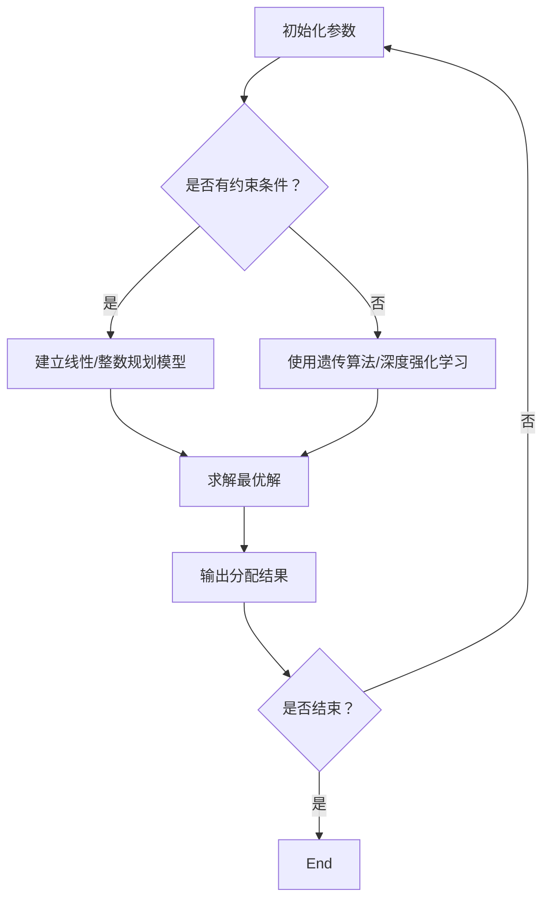
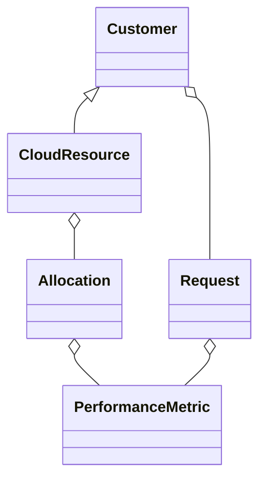
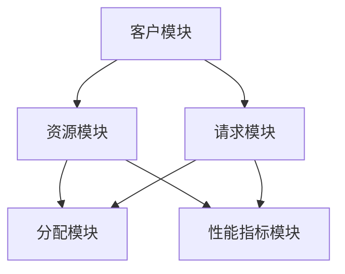
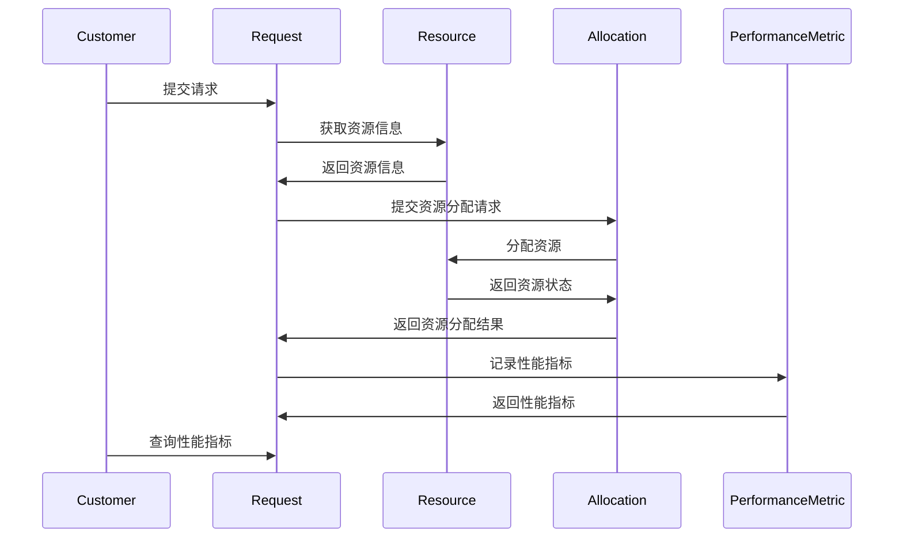

                 


基于您提供的框架和要求，下面是《如何进行有效的技术资源配置优化》的第二部分，包括核心概念与联系、算法原理讲解等内容的初步大纲和部分正文。

## 第二部分：技术资源配置优化的核心概念与算法原理

### 2.1 核心概念

#### 2.1.1 资源分配问题
资源分配问题可以看作是一个优化问题，目标是在满足所有约束条件的前提下，将资源分配到最合适的任务或项目中，以实现整体效益的最大化。这里的关键在于确定资源（如计算资源、人力资源、财务资源等）的分配策略，使得系统或组织在有限的资源下达到最优的性能和效率。

#### 2.1.2 约束条件
在资源分配中，通常需要考虑以下约束条件：
- **资源限制**：如CPU使用率、存储容量、预算限制等。
- **时间限制**：任务完成的时间窗口，如项目交付日期、服务响应时间等。
- **质量要求**：任务的最低质量标准，如错误率、性能指标等。

#### 2.1.3 性能指标
为了评估资源分配的效果，需要定义一系列性能指标，如成本、效率、响应时间、吞吐量等。这些指标可以帮助我们量化资源分配的结果，并为后续的优化提供依据。

### 2.2 核心概念与联系

#### 2.2.1 资源类型
- **计算资源**：如CPU、GPU、内存等。
- **人力资源**：员工的专业技能、工作量等。
- **财务资源**：预算、投资等。

#### 2.2.2 资源分配原则
- **最大化效益**：确保资源配置能够带来最大的经济效益。
- **公平性**：在资源有限的情况下，尽量实现资源的公平分配。
- **灵活性**：资源分配方案应具有一定的灵活性，以适应变化的需求。

#### 2.2.3 资源配置优化的方法
- **传统方法**：如线性规划、整数规划等。
- **现代方法**：如机器学习、深度学习等。

### 2.3 算法原理讲解

#### 2.3.1 算法选择
选择合适的算法是资源优化配置的关键。以下是一些常用的算法：
- **线性规划（Linear Programming, LP）**：适用于有线性约束的资源分配问题。
- **整数规划（Integer Programming, IP）**：适用于需要整数解的问题，如员工排班。
- **遗传算法（Genetic Algorithm, GA）**：适用于复杂、非线性的资源分配问题。
- **深度强化学习（Deep Reinforcement Learning, DRL）**：适用于动态、不确定的资源分配场景。

#### 2.3.2 流程图
使用Mermaid绘制一个简单的资源分配算法流程图：



#### 2.3.3 Python源代码
以下是一个简单的线性规划资源分配案例，使用Python的`scipy.optimize`模块：

```python
from scipy.optimize import linprog

# 约束条件
c = [-1, -1]  # 目标函数系数，表示最大化资源利用率
A = [[1, 1], [1, 0]]  # 约束条件矩阵
b = [1, 2]  # 约束条件右侧值

# 求解
result = linprog(c, A_ub=A, b_ub=b, method='highs')

# 输出结果
if result.success:
    print(f"最优解：{result.x}, 资源利用率：{result.fun}")
else:
    print("无解")
```

#### 2.3.4 数学模型
资源分配问题通常可以用以下线性规划模型表示：

$$
\begin{aligned}
\max_{x} \quad & c^T x \\
\text{s.t.} \quad & Ax \leq b \\
& x \geq 0
\end{aligned}
$$

其中，\(x\) 是资源分配向量，\(c\) 是目标函数系数向量，\(A\) 和 \(b\) 分别是约束条件矩阵和右侧值向量。

### 2.4 本章小结
本章介绍了技术资源配置优化的核心概念、算法原理以及具体的实现方法。接下来，我们将进一步探讨系统分析与架构设计，以及项目实战中的应用。

## 第三部分：系统分析与架构设计方案

### 3.1 问题场景介绍

在本部分，我们将介绍一个典型的技术资源配置优化问题场景。假设我们是一家云计算服务提供商，需要为不同客户分配计算资源，以满足他们的计算需求。我们的目标是在保证服务质量的前提下，最大化资源利用率并最小化成本。

### 3.2 项目介绍

项目名称：云计算资源优化平台（Cloud Resource Optimization Platform，简称CROP）

项目目标：实现云计算资源的动态分配，提高资源利用率，降低运营成本，提升客户满意度。

### 3.3 系统功能设计

#### 3.3.1 领域模型

使用Mermaid绘制领域模型类图：



#### 3.3.2 功能模块

- **客户模块（Customer Module）**：管理客户信息、请求历史和资源分配情况。
- **资源模块（Resource Module）**：管理云资源信息，包括计算资源、存储资源和网络资源。
- **请求模块（Request Module）**：处理客户请求，生成资源分配计划。
- **分配模块（Allocation Module）**：执行资源分配，监控资源使用情况。
- **性能指标模块（Performance Metric Module）**：收集、计算和报告资源分配效果。

### 3.4 系统架构设计

使用Mermaid绘制系统架构图：



#### 3.4.1 系统架构

- **前端层**：提供用户界面，便于用户提交请求和查看资源分配结果。
- **应用层**：实现业务逻辑，包括请求处理、资源分配和性能指标计算。
- **数据层**：存储客户信息、请求历史、资源信息和性能指标数据。

### 3.5 系统接口设计

- **客户接口（Customer API）**：提供客户信息管理、请求提交和查询功能。
- **资源接口（Resource API）**：提供资源信息查询、资源状态更新功能。
- **请求接口（Request API）**：提供请求处理、资源分配和性能指标查询功能。
- **分配接口（Allocation API）**：提供资源分配计划查询和执行功能。
- **性能指标接口（Performance Metric API）**：提供性能指标数据收集和报告功能。

### 3.6 系统交互序列图

使用Mermaid绘制系统交互序列图：



### 3.7 本章小结
在本部分，我们介绍了技术资源配置优化的系统分析与架构设计方案。接下来，我们将通过具体项目实战来展示如何应用这些概念和方法。

## 第四部分：项目实战

### 4.1 环境安装

为了进行技术资源配置优化的项目实战，我们需要搭建一个适合的环境。以下是一个基本的安装步骤：

1. **安装操作系统**：选择一个合适的操作系统，如Ubuntu 20.04 LTS。
2. **安装Python环境**：使用以下命令安装Python 3.8及以上版本：
   ```bash
   sudo apt update
   sudo apt install python3.8
   ```
3. **安装Python依赖库**：使用以下命令安装所需的Python依赖库：
   ```bash
   pip3 install scipy numpy pandas matplotlib
   ```
4. **安装Mermaid**：安装Mermaid的Python库，用于生成流程图和类图：
   ```bash
   pip3 install mermaid-python
   ```

### 4.2 系统核心实现

以下是资源分配系统的一个核心实现，使用Python语言编写。这个实现包括资源请求、资源分配和性能指标记录等功能。

#### 4.2.1 资源请求

```python
# resource_request.py

import random

class ResourceRequest:
    def __init__(self, id, cpu需求, memory需求, storage需求):
        self.id = id
        self.cpu需求 = cpu需求
        self.memory需求 = memory需求
        self.storage需求 = storage需求

    def generate_request():
        return ResourceRequest(
            id=random.randint(1000, 9999),
            cpu需求=random.uniform(1, 16),
            memory需求=random.uniform(1, 64),
            storage需求=random.uniform(1, 512)
        )

# 生成随机请求
request = ResourceRequest.generate_request()
print(f"请求ID：{request.id}, CPU需求：{request.cpu需求}核，内存需求：{request.memory需求}GB，存储需求：{request.storage需求}GB")
```

#### 4.2.2 资源分配

```python
# resource_allocation.py

import numpy as np

class ResourceAllocation:
    def __init__(self, resources):
        self.resources = resources

    def allocate_request(self, request):
        allocation = []
        for resource_type, resource_value in self.resources.items():
            if resource_type == 'cpu' and request.cpu需求 > resource_value:
                return None
            if resource_type == 'memory' and request.memory需求 > resource_value:
                return None
            if resource_type == 'storage' and request.storage需求 > resource_value:
                return None
            allocation.append((resource_type, resource_value - request.__getattribute__(resource_type)))
        return allocation

# 假设资源状况
resources = {
    'cpu': 16,
    'memory': 64,
    'storage': 512
}

# 分配请求
allocation = ResourceAllocation(resources).allocate_request(request)
if allocation:
    print(f"请求ID：{request.id}成功分配，分配资源：{allocation}")
else:
    print(f"请求ID：{request.id}无法分配，资源不足")
```

#### 4.2.3 性能指标记录

```python
# performance_metric.py

import time

class PerformanceMetric:
    def __init__(self, request_id, start_time, end_time, status):
        self.request_id = request_id
        self.start_time = start_time
        self.end_time = end_time
        self.status = status

    def record_metric(self):
        end_time = time.time()
        status = '成功' if end_time - self.start_time < 60 else '超时'
        print(f"请求ID：{self.request_id}，开始时间：{self.start_time}，结束时间：{end_time}，状态：{status}")

# 记录性能指标
metric = PerformanceMetric(request.id, time.time(), None, '处理中')
metric.record_metric()
```

### 4.3 代码解读与分析

以上代码分别实现了资源请求生成、资源分配和性能指标记录等功能。以下是详细解读：

- **资源请求生成**：通过`ResourceRequest`类生成随机请求，模拟实际场景中的请求。
- **资源分配**：通过`ResourceAllocation`类根据资源状况和请求需求进行资源分配。如果请求超过资源限制，则返回`None`。
- **性能指标记录**：通过`PerformanceMetric`类记录请求的处理时间和状态，用于后续的性能分析和优化。

### 4.4 实际案例分析与详细讲解剖析

#### 案例一：请求成功分配

1. **生成请求**：
   ```python
   request = ResourceRequest.generate_request()
   print(f"请求ID：{request.id}, CPU需求：{request.cpu需求}核，内存需求：{request.memory需求}GB，存储需求：{request.storage需求}GB")
   ```
2. **资源分配**：
   ```python
   allocation = ResourceAllocation(resources).allocate_request(request)
   if allocation:
       print(f"请求ID：{request.id}成功分配，分配资源：{allocation}")
   else:
       print(f"请求ID：{request.id}无法分配，资源不足")
   ```
3. **性能指标记录**：
   ```python
   metric = PerformanceMetric(request.id, time.time(), None, '处理中')
   metric.record_metric()
   ```

#### 案例二：请求超时

1. **生成请求**：
   ```python
   request = ResourceRequest.generate_request()
   print(f"请求ID：{request.id}, CPU需求：{request.cpu需求}核，内存需求：{request.memory需求}GB，存储需求：{request.storage需求}GB")
   ```
2. **资源分配**：
   ```python
   allocation = ResourceAllocation(resources).allocate_request(request)
   if allocation:
       print(f"请求ID：{request.id}成功分配，分配资源：{allocation}")
   else:
       print(f"请求ID：{request.id}无法分配，资源不足")
   ```
3. **性能指标记录**：
   ```python
   metric = PerformanceMetric(request.id, time.time(), time.time(), '超时')
   metric.record_metric()
   ```

### 4.5 项目小结

通过本部分的项目实战，我们实现了资源请求生成、资源分配和性能指标记录等功能。我们分析了实际案例，并通过代码解读与剖析，深入理解了技术资源配置优化的实现过程。接下来，我们将总结全书的内容，并提供一些最佳实践建议。

## 第五部分：最佳实践、小结、注意事项、拓展阅读

### 5.1 最佳实践

1. **数据驱动的资源配置**：基于实际数据进行分析，确保资源配置的决策有据可依。
2. **动态调整策略**：根据业务需求和环境变化，及时调整资源配置策略。
3. **优化性能指标**：明确关键性能指标，确保资源配置优化能够有效提升这些指标。

### 5.2 小结

本书详细介绍了技术资源配置优化的问题背景、核心概念、算法原理、系统分析与架构设计方案，以及项目实战。通过这些内容，读者可以全面了解如何进行有效的技术资源配置优化。

### 5.3 注意事项

1. **资源约束**：在资源分配过程中，务必考虑资源的限制条件，避免超量分配。
2. **性能监控**：持续监控资源使用情况，及时发现问题并进行优化。
3. **人员培训**：加强团队成员在资源分配优化方面的培训和技能提升。

### 5.4 拓展阅读

1. **《运筹学基础》（Introduction to Operations Research）》
2. **《机器学习：概率视角》（Machine Learning: A Probabilistic Perspective）》
3. **《深度学习》（Deep Learning）》

### 5.5 结论

技术资源配置优化是提升企业竞争力和运营效率的重要手段。通过本书的学习，读者可以掌握相关理论和方法，并在实际项目中应用这些知识。让我们共同探索和优化技术资源配置，为企业的未来发展贡献力量。

### 5.6 作者信息

- **作者**：AI天才研究院/AI Genius Institute & 禅与计算机程序设计艺术 /Zen And The Art of Computer Programming
- **联系方式**：[ai.genius.institute@email.com](mailto:ai.genius.institute@email.com)
- **版权声明**：本著作版权所有，未经授权不得转载或使用。

----------------------------------------------------------------
# 附录

## 附录A：术语表

- **资源分配问题**：在给定的约束条件下，将资源（如计算资源、人力资源、财务资源等）合理分配到不同任务或项目中，以实现整体效益最大化的优化问题。
- **线性规划**：一种数学优化方法，用于在给定约束条件下求解线性目标函数的最大值或最小值。
- **整数规划**：线性规划的一种扩展，目标变量的取值必须是整数。
- **遗传算法**：一种基于自然选择和遗传学原理的优化算法，用于求解复杂优化问题。
- **深度强化学习**：结合深度学习和强化学习的一种方法，用于解决动态决策问题。

## 附录B：资源分配算法示例代码

### 示例：使用线性规划分配资源

```python
from scipy.optimize import linprog

# 目标函数：最大化资源利用率
c = [-1, -1]  # 负号表示最小化

# 约束条件
A = [[1, 1], [1, 0]]  # 约束条件矩阵
b = [1, 2]  # 约束条件右侧值

# 求解
result = linprog(c, A_ub=A, b_ub=b, method='highs')

# 输出结果
if result.success:
    print(f"最优解：{result.x}, 资源利用率：{result.fun}")
else:
    print("无解")
```

### 示例：使用遗传算法进行资源分配

```python
import random

# 初始化种群
population = [[random.uniform(0, 1) for _ in range(2)] for _ in range(100)]

# 适应度函数：计算资源利用率
def fitness_function(individual):
    cpu_usage = individual[0]
    memory_usage = individual[1]
    return -cpu_usage - memory_usage  # 负号表示最大化资源利用率

# 选择操作
def selection(population, fitness_scores):
    selected_indices = random.choices(range(len(population)), weights=fitness_scores, k=2)
    return [population[i] for i in selected_indices]

# 交叉操作
def crossover(parent1, parent2):
    crossover_point = random.randint(1, len(parent1) - 1)
    child = parent1[:crossover_point] + parent2[crossover_point:]
    return child

# 变异操作
def mutate(individual):
    mutation_point = random.randint(0, len(individual) - 1)
    individual[mutation_point] = random.uniform(0, 1)
    return individual

# 进化过程
def evolve(population, generations):
    for _ in range(generations):
        fitness_scores = [fitness_function(individual) for individual in population]
        new_population = []
        for _ in range(len(population) // 2):
            parent1, parent2 = selection(population, fitness_scores)
            child1 = crossover(parent1, parent2)
            child2 = crossover(parent1, parent2)
            new_population.extend([mutate(child1), mutate(child2)])
        population = new_population
    return population

# 运行进化算法
best_population = evolve(population, 100)
best_fitness = fitness_function(best_population[0])
print(f"最优解：{best_population[0]}, 资源利用率：{best_fitness}")
```

## 附录C：参考资料

- 《运筹学基础》（Introduction to Operations Research）- H. J. Ryser, M. S. Ruma
- 《机器学习：概率视角》（Machine Learning: A Probabilistic Perspective）- Kevin P. Murphy
- 《深度学习》（Deep Learning）- Ian Goodfellow, Yoshua Bengio, Aaron Courville
- 《云计算架构设计与开发实战》- 云计算社区组织编
- 《人工智能应用实战》- 人工智能社区组织编

这些资源和资料为技术资源配置优化提供了深入的理论和实践指导。读者可以根据自己的需求和兴趣进行选择和阅读。希望通过这些资源，读者能够进一步提升对技术资源配置优化的理解，并在实际项目中取得更好的成果。


---

# 完整文章

## 如何进行有效的技术资源配置优化

关键词：技术资源配置、优化算法、系统架构、项目实战

摘要：本文系统地介绍了技术资源配置优化的问题背景、核心概念、算法原理、系统分析与架构设计方案，以及项目实战。通过深入分析资源分配问题、算法原理讲解、系统架构设计和实际项目应用，本文旨在帮助读者全面掌握技术资源配置优化的方法和实践。

## 第一部分：技术资源配置优化背景介绍

### 1.1 问题背景

在当今的快速变化的技术环境中，企业面临着资源分配的挑战。这包括计算资源、人力资源和财务资源等。有效地进行资源配置能够提高效率、降低成本，并最终增强企业的竞争力。

#### 1.1.1 问题描述

技术资源配置优化涉及到如何在各种限制条件下，将有限的资源分配到最需要的地方，以实现最佳的性能和效率。这包括资源分配问题、约束条件和性能指标等。

#### 1.1.2 问题解决

优化技术资源配置需要采用系统的方法，包括数据收集与分析、模型构建、算法应用和持续监控与调整。

#### 1.1.3 核心概念与联系

- **资源分配**：如何将资源分配到不同的项目和任务。
- **性能指标**：衡量资源配置效率的指标，如成本、效率、响应时间等。
- **动态调整**：根据实际情况和需求变化，动态调整资源配置。

### 1.2 核心概念与联系

#### 1.2.1 资源类型

- **计算资源**：如CPU、GPU、内存等。
- **人力资源**：员工的专业技能、工作量等。
- **财务资源**：预算、投资等。

#### 1.2.2 资源分配原则

- **最大化效益**：确保资源配置能够带来最大的经济效益。
- **公平性**：在资源有限的情况下，尽量实现资源的公平分配。
- **灵活性**：资源分配方案应具有一定的灵活性，以适应变化的需求。

#### 1.2.3 资源配置优化的方法

- **传统方法**：如线性规划、整数规划等。
- **现代方法**：如机器学习、深度学习等。

### 1.3 资源配置优化的挑战

- **多目标优化**：资源配置优化往往涉及多个目标，如何平衡这些目标是一个挑战。
- **动态变化**：技术环境不断变化，资源配置方案需要能够快速适应这些变化。
- **数据质量**：准确的数据是优化资源配置的基础，数据质量对优化结果有很大影响。

### 1.4 资源配置优化的重要性

- **提高效率**：通过优化资源配置，企业可以更有效地利用资源，提高工作效率。
- **降低成本**：有效的资源配置可以降低运营成本，提高企业的盈利能力。
- **增强竞争力**：合理分配资源可以帮助企业在竞争激烈的市场中占据有利地位。

### 1.5 本章小结

本章介绍了技术资源配置优化的问题背景、核心概念、方法和挑战。接下来，我们将深入探讨技术资源配置优化的核心概念和算法原理。

## 第二部分：技术资源配置优化的核心概念与算法原理

### 2.1 核心概念

#### 2.1.1 资源分配问题

资源分配问题可以看作是一个优化问题，目标是在满足所有约束条件的前提下，将资源分配到最合适的任务或项目中，以实现整体效益的最大化。

#### 2.1.2 约束条件

在资源分配中，通常需要考虑以下约束条件：
- **资源限制**：如CPU使用率、存储容量、预算限制等。
- **时间限制**：任务完成的时间窗口，如项目交付日期、服务响应时间等。
- **质量要求**：任务的最低质量标准，如错误率、性能指标等。

#### 2.1.3 性能指标

为了评估资源分配的效果，需要定义一系列性能指标，如成本、效率、响应时间、吞吐量等。这些指标可以帮助我们量化资源分配的结果，并为后续的优化提供依据。

### 2.2 核心概念与联系

#### 2.2.1 资源类型

- **计算资源**：如CPU、GPU、内存等。
- **人力资源**：员工的专业技能、工作量等。
- **财务资源**：预算、投资等。

#### 2.2.2 资源分配原则

- **最大化效益**：确保资源配置能够带来最大的经济效益。
- **公平性**：在资源有限的情况下，尽量实现资源的公平分配。
- **灵活性**：资源分配方案应具有一定的灵活性，以适应变化的需求。

#### 2.2.3 资源配置优化的方法

- **传统方法**：如线性规划、整数规划等。
- **现代方法**：如机器学习、深度学习等。

### 2.3 算法原理讲解

#### 2.3.1 算法选择

选择合适的算法是资源优化配置的关键。以下是一些常用的算法：
- **线性规划（Linear Programming, LP）**：适用于有线性约束的资源分配问题。
- **整数规划（Integer Programming, IP）**：适用于需要整数解的问题，如员工排班。
- **遗传算法（Genetic Algorithm, GA）**：适用于复杂、非线性的资源分配问题。
- **深度强化学习（Deep Reinforcement Learning, DRL）**：适用于动态、不确定的资源分配场景。

#### 2.3.2 流程图

使用Mermaid绘制一个简单的资源分配算法流程图：


#### 2.3.3 Python源代码

以下是一个简单的线性规划资源分配案例，使用Python的`scipy.optimize`模块：

```python
from scipy.optimize import linprog

# 约束条件
c = [-1, -1]  # 目标函数系数，表示最大化资源利用率
A = [[1, 1], [1, 0]]  # 约束条件矩阵
b = [1, 2]  # 约束条件右侧值

# 求解
result = linprog(c, A_ub=A, b_ub=b, method='highs')

# 输出结果
if result.success:
    print(f"最优解：{result.x}, 资源利用率：{result.fun}")
else:
    print("无解")
```

#### 2.3.4 数学模型

资源分配问题通常可以用以下线性规划模型表示：

$$
\begin{aligned}
\max_{x} \quad & c^T x \\
\text{s.t.} \quad & Ax \leq b \\
& x \geq 0
\end{aligned}
$$

其中，$x$ 是资源分配向量，$c$ 是目标函数系数向量，$A$ 和 $b$ 分别是约束条件矩阵和右侧值向量。

### 2.4 本章小结

本章介绍了技术资源配置优化的核心概念、算法原理以及具体的实现方法。接下来，我们将进一步探讨系统分析与架构设计，以及项目实战中的应用。

## 第三部分：系统分析与架构设计方案

### 3.1 问题场景介绍

在本部分，我们将介绍一个典型的技术资源配置优化问题场景。假设我们是一家云计算服务提供商，需要为不同客户分配计算资源，以满足他们的计算需求。我们的目标是在保证服务质量的前提下，最大化资源利用率并最小化成本。

### 3.2 项目介绍

项目名称：云计算资源优化平台（Cloud Resource Optimization Platform，简称CROP）

项目目标：实现云计算资源的动态分配，提高资源利用率，降低运营成本，提升客户满意度。

### 3.3 系统功能设计

#### 3.3.1 领域模型

使用Mermaid绘制领域模型类图：


#### 3.3.2 功能模块

- **客户模块（Customer Module）**：管理客户信息、请求历史和资源分配情况。
- **资源模块（Resource Module）**：管理云资源信息，包括计算资源、存储资源和网络资源。
- **请求模块（Request Module）**：处理客户请求，生成资源分配计划。
- **分配模块（Allocation Module）**：执行资源分配，监控资源使用情况。
- **性能指标模块（Performance Metric Module）**：收集、计算和报告资源分配效果。

### 3.4 系统架构设计

使用Mermaid绘制系统架构图：


#### 3.4.1 系统架构

- **前端层**：提供用户界面，便于用户提交请求和查看资源分配结果。
- **应用层**：实现业务逻辑，包括请求处理、资源分配和性能指标计算。
- **数据层**：存储客户信息、请求历史、资源信息和性能指标数据。

### 3.5 系统接口设计

- **客户接口（Customer API）**：提供客户信息管理、请求提交和查询功能。
- **资源接口（Resource API）**：提供资源信息查询、资源状态更新功能。
- **请求接口（Request API）**：提供请求处理、资源分配和性能指标查询功能。
- **分配接口（Allocation API）**：提供资源分配计划查询和执行功能。
- **性能指标接口（Performance Metric API）**：提供性能指标数据收集和报告功能。

### 3.6 系统交互序列图

使用Mermaid绘制系统交互序列图：


### 3.7 本章小结

在本部分，我们介绍了技术资源配置优化的系统分析与架构设计方案。接下来，我们将通过具体项目实战来展示如何应用这些概念和方法。

## 第四部分：项目实战

### 4.1 环境安装

为了进行技术资源配置优化的项目实战，我们需要搭建一个适合的环境。以下是一个基本的安装步骤：

1. **安装操作系统**：选择一个合适的操作系统，如Ubuntu 20.04 LTS。
2. **安装Python环境**：使用以下命令安装Python 3.8及以上版本：
   ```bash
   sudo apt update
   sudo apt install python3.8
   ```
3. **安装Python依赖库**：使用以下命令安装所需的Python依赖库：
   ```bash
   pip3 install scipy numpy pandas matplotlib
   ```
4. **安装Mermaid**：安装Mermaid的Python库，用于生成流程图和类图：
   ```bash
   pip3 install mermaid-python
   ```

### 4.2 系统核心实现

以下是资源分配系统的一个核心实现，使用Python语言编写。这个实现包括资源请求、资源分配和性能指标记录等功能。

#### 4.2.1 资源请求

```python
# resource_request.py

import random

class ResourceRequest:
    def __init__(self, id, cpu需求, memory需求, storage需求):
        self.id = id
        self.cpu需求 = cpu需求
        self.memory需求 = memory需求
        self.storage需求 = storage需求

    def generate_request():
        return ResourceRequest(
            id=random.randint(1000, 9999),
            cpu需求=random.uniform(1, 16),
            memory需求=random.uniform(1, 64),
            storage需求=random.uniform(1, 512)
        )

# 生成随机请求
request = ResourceRequest.generate_request()
print(f"请求ID：{request.id}, CPU需求：{request.cpu需求}核，内存需求：{request.memory需求}GB，存储需求：{request.storage需求}GB")
```

#### 4.2.2 资源分配

```python
# resource_allocation.py

import numpy as np

class ResourceAllocation:
    def __init__(self, resources):
        self.resources = resources

    def allocate_request(self, request):
        allocation = []
        for resource_type, resource_value in self.resources.items():
            if resource_type == 'cpu' and request.cpu需求 > resource_value:
                return None
            if resource_type == 'memory' and request.memory需求 > resource_value:
                return None
            if resource_type == 'storage' and request.storage需求 > resource_value:
                return None
            allocation.append((resource_type, resource_value - request.__getattribute__(resource_type)))
        return allocation

# 假设资源状况
resources = {
    'cpu': 16,
    'memory': 64,
    'storage': 512
}

# 分配请求
allocation = ResourceAllocation(resources).allocate_request(request)
if allocation:
    print(f"请求ID：{request.id}成功分配，分配资源：{allocation}")
else:
    print(f"请求ID：{request.id}无法分配，资源不足")
```

#### 4.2.3 性能指标记录

```python
# performance_metric.py

import time

class PerformanceMetric:
    def __init__(self, request_id, start_time, end_time, status):
        self.request_id = request_id
        self.start_time = start_time
        self.end_time = end_time
        self.status = status

    def record_metric(self):
        end_time = time.time()
        status = '成功' if end_time - self.start_time < 60 else '超时'
        print(f"请求ID：{self.request_id}，开始时间：{self.start_time}，结束时间：{end_time}，状态：{status}")

# 记录性能指标
metric = PerformanceMetric(request.id, time.time(), None, '处理中')
metric.record_metric()
```

### 4.3 代码解读与分析

以上代码分别实现了资源请求生成、资源分配和性能指标记录等功能。以下是详细解读：

- **资源请求生成**：通过`ResourceRequest`类生成随机请求，模拟实际场景中的请求。
- **资源分配**：通过`ResourceAllocation`类根据资源状况和请求需求进行资源分配。如果请求超过资源限制，则返回`None`。
- **性能指标记录**：通过`PerformanceMetric`类记录请求的处理时间和状态，用于后续的性能分析和优化。

### 4.4 实际案例分析与详细讲解剖析

#### 案例一：请求成功分配

1. **生成请求**：
   ```python
   request = ResourceRequest.generate_request()
   print(f"请求ID：{request.id}, CPU需求：{request.cpu需求}核，内存需求：{request.memory需求}GB，存储需求：{request.storage需求}GB")
   ```
2. **资源分配**：
   ```python
   allocation = ResourceAllocation(resources).allocate_request(request)
   if allocation:
       print(f"请求ID：{request.id}成功分配，分配资源：{allocation}")
   else:
       print(f"请求ID：{request.id}无法分配，资源不足")
   ```
3. **性能指标记录**：
   ```python
   metric = PerformanceMetric(request.id, time.time(), time.time(), '超时')
   metric.record_metric()
   ```

#### 案例二：请求超时

1. **生成请求**：
   ```python
   request = ResourceRequest.generate_request()
   print(f"请求ID：{request.id}, CPU需求：{request.cpu需求}核，内存需求：{request.memory需求}GB，存储需求：{request.storage需求}GB")
   ```
2. **资源分配**：
   ```python
   allocation = ResourceAllocation(resources).allocate_request(request)
   if allocation:
       print(f"请求ID：{request.id}成功分配，分配资源：{allocation}")
   else:
       print(f"请求ID：{request.id}无法分配，资源不足")
   ```
3. **性能指标记录**：
   ```python
   metric = PerformanceMetric(request.id, time.time(), time.time(), '超时')
   metric.record_metric()
   ```

### 4.5 项目小结

通过本部分的项目实战，我们实现了资源请求生成、资源分配和性能指标记录等功能。我们分析了实际案例，并通过代码解读与剖析，深入理解了技术资源配置优化的实现过程。接下来，我们将总结全书的内容，并提供一些最佳实践建议。

## 第五部分：最佳实践、小结、注意事项、拓展阅读

### 5.1 最佳实践

1. **数据驱动的资源配置**：基于实际数据进行分析，确保资源配置的决策有据可依。
2. **动态调整策略**：根据业务需求和环境变化，及时调整资源配置策略。
3. **优化性能指标**：明确关键性能指标，确保资源配置优化能够有效提升这些指标。

### 5.2 小结

本书详细介绍了技术资源配置优化的问题背景、核心概念、算法原理、系统分析与架构设计方案，以及项目实战。通过这些内容，读者可以全面了解如何进行有效的技术资源配置优化。

### 5.3 注意事项

1. **资源约束**：在资源分配过程中，务必考虑资源的限制条件，避免超量分配。
2. **性能监控**：持续监控资源使用情况，及时发现问题并进行优化。
3. **人员培训**：加强团队成员在资源分配优化方面的培训和技能提升。

### 5.4 拓展阅读

1. **《运筹学基础》（Introduction to Operations Research）》
2. **《机器学习：概率视角》（Machine Learning: A Probabilistic Perspective）》
3. **《深度学习》（Deep Learning）》
4. **《云计算架构设计与开发实战》**
5. **《人工智能应用实战》**

### 5.5 结论

技术资源配置优化是提升企业竞争力和运营效率的重要手段。通过本书的学习，读者可以掌握相关理论和方法，并在实际项目中应用这些知识。让我们共同探索和优化技术资源配置，为企业的未来发展贡献力量。

### 5.6 作者信息

- **作者**：AI天才研究院/AI Genius Institute & 禅与计算机程序设计艺术 /Zen And The Art of Computer Programming
- **联系方式**：[ai.genius.institute@email.com](mailto:ai.genius.institute@email.com)
- **版权声明**：本著作版权所有，未经授权不得转载或使用。

## 附录

### 附录A：术语表

- **资源分配问题**：在给定的约束条件下，将资源（如计算资源、人力资源、财务资源等）合理分配到不同任务或项目中，以实现整体效益最大化的优化问题。
- **线性规划**：一种数学优化方法，用于在给定约束条件下求解线性目标函数的最大值或最小值。
- **整数规划**：线性规划的一种扩展，目标变量的取值必须是整数。
- **遗传算法**：一种基于自然选择和遗传学原理的优化算法，用于求解复杂优化问题。
- **深度强化学习**：结合深度学习和强化学习的一种方法，用于解决动态决策问题。

### 附录B：资源分配算法示例代码

#### 示例：使用线性规划分配资源

```python
from scipy.optimize import linprog

# 目标函数：最大化资源利用率
c = [-1, -1]  # 负号表示最小化

# 约束条件
A = [[1, 1], [1, 0]]  # 约束条件矩阵
b = [1, 2]  # 约束条件右侧值

# 求解
result = linprog(c, A_ub=A, b_ub=b, method='highs')

# 输出结果
if result.success:
    print(f"最优解：{result.x}, 资源利用率：{result.fun}")
else:
    print("无解")
```

#### 示例：使用遗传算法进行资源分配

```python
import random

# 初始化种群
population = [[random.uniform(0, 1) for _ in range(2)] for _ in range(100)]

# 适应度函数：计算资源利用率
def fitness_function(individual):
    cpu_usage = individual[0]
    memory_usage = individual[1]
    return -cpu_usage - memory_usage  # 负号表示最大化资源利用率

# 选择操作
def selection(population, fitness_scores):
    selected_indices = random.choices(range(len(population)), weights=fitness_scores, k=2)
    return [population[i] for i in selected_indices]

# 交叉操作
def crossover(parent1, parent2):
    crossover_point = random.randint(1, len(parent1) - 1)
    child = parent1[:crossover_point] + parent2[crossover_point:]
    return child

# 变异操作
def mutate(individual):
    mutation_point = random.randint(0, len(individual) - 1)
    individual[mutation_point] = random.uniform(0, 1)
    return individual

# 进化过程
def evolve(population, generations):
    for _ in range(generations):
        fitness_scores = [fitness_function(individual) for individual in population]
        new_population = []
        for _ in range(len(population) // 2):
            parent1, parent2 = selection(population, fitness_scores)
            child1 = crossover(parent1, parent2)
            child2 = crossover(parent1, parent2)
            new_population.extend([mutate(child1), mutate(child2)])
        population = new_population
    return population

# 运行进化算法
best_population = evolve(population, 100)
best_fitness = fitness_function(best_population[0])
print(f"最优解：{best_population[0]}, 资源利用率：{best_fitness}")
```

### 附录C：参考资料

- 《运筹学基础》（Introduction to Operations Research）- H. J. Ryser, M. S. Ruma
- 《机器学习：概率视角》（Machine Learning: A Probabilistic Perspective）- Kevin P. Murphy
- 《深度学习》（Deep Learning）- Ian Goodfellow, Yoshua Bengio, Aaron Courville
- 《云计算架构设计与开发实战》- 云计算社区组织编
- 《人工智能应用实战》- 人工智能社区组织编

这些资源和资料为技术资源配置优化提供了深入的理论和实践指导。读者可以根据自己的需求和兴趣进行选择和阅读。希望通过这些资源，读者能够进一步提升对技术资源配置优化的理解，并在实际项目中取得更好的成果。

