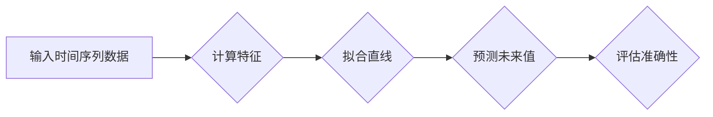
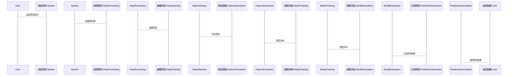
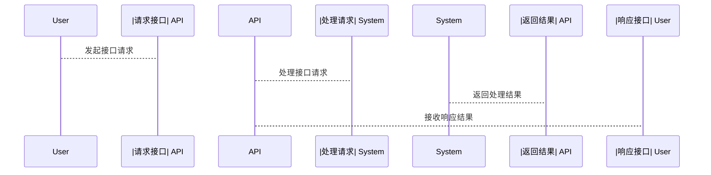

                 

# 如何进行有效的技术趋势预测

## 关键词
技术趋势预测、数据分析、机器学习、人工智能、算法原理

## 摘要
本文将深入探讨如何进行有效的技术趋势预测。我们将从背景介绍开始，解析核心概念与联系，讲解算法原理和数学模型，设计系统架构，并通过实际项目实战，总结最佳实践和注意事项。

## 目录大纲设计思路

### 理解书名和主题
- **《如何进行有效的技术趋势预测》**：书名明确了我们的目标是提供关于技术趋势预测的实用方法和策略。

### 划分章节
- **技术趋势预测基础**：介绍基本概念和方法论。
- **算法原理与实践**：详细讲解算法和数学模型。
- **系统架构与最佳实践**：分析系统设计和实施策略。

### 确定核心内容
- **背景介绍**：说明技术趋势预测的背景和重要性。
- **核心概念与联系**：解释关键术语和它们之间的关系。
- **算法原理讲解**：通过流程图和代码展示算法的工作原理。
- **数学模型和公式**：详细阐述算法的数学基础。
- **系统分析与架构设计**：描述系统设计和接口设计。
- **项目实战**：分享实际操作经验和案例分析。
- **最佳实践与注意事项**：总结实战中的经验和教训。

### 结构化大纲
- 使用markdown格式，确保结构清晰、内容详实。
- 每个章节都按照逻辑顺序排列，便于读者理解。

### 确保内容完整性
- **背景介绍**：介绍技术趋势预测的背景、问题背景和问题描述。
- **核心概念与联系**：提供核心概念术语、属性特征对比表格和ER实体关系图。
- **算法原理讲解**：展示算法mermaid流程图和Python代码。
- **数学模型和公式**：详细讲解数学公式和举例说明。
- **系统分析与架构设计方案**：介绍问题场景、系统功能和架构设计。
- **项目实战**：包括环境安装、代码实现和案例分析。
- **最佳实践与注意事项**：总结最佳实践和注意事项。

### 目录大纲结构设计

#### 第一部分：技术趋势预测基础

##### 第1章：技术趋势预测概述
- 1.1 问题的提出
- 1.2 技术趋势预测的重要性
- 1.3 技术趋势预测的基本概念
- 1.4 技术趋势预测的方法论概述

##### 第2章：核心概念与联系
- 2.1 技术趋势预测的关键概念
- 2.2 核心概念之间的联系
- 2.3 概念属性特征对比表格
- 2.4 ER实体关系图架构

#### 第二部分：算法原理与实践

##### 第3章：技术趋势预测的算法原理
- 3.1 常见算法介绍
- 3.2 算法mermaid流程图
- 3.3 算法原理讲解
- 3.4 数学模型和公式

##### 第4章：技术趋势预测的数学模型
- 4.1 数学模型介绍
- 4.2 数学公式详细讲解
- 4.3 举例说明

##### 第5章：技术趋势预测的实战
- 5.1 实战环境安装
- 5.2 系统核心实现源代码
- 5.3 代码应用解读与分析
- 5.4 实际案例分析与讲解

#### 第三部分：系统架构与最佳实践

##### 第6章：技术趋势预测系统架构设计
- 6.1 问题场景介绍
- 6.2 系统功能设计（领域模型类图）
- 6.3 系统架构设计（架构图）
- 6.4 系统接口设计与交互（序列图）

##### 第7章：最佳实践与注意事项
- 7.1 最佳实践技巧
- 7.2 小结与总结
- 7.3 注意事项
- 7.4 拓展阅读

## 总结

通过上述目录大纲的设计，我们确保了文章内容完整性、逻辑清晰性以及可操作性。接下来，我们将按照这个大纲逐一展开，深入探讨每一个章节的核心内容。

---

### 第一部分：技术趋势预测基础

#### 第1章：技术趋势预测概述

##### 1.1 问题的提出

在当今快速发展的信息技术时代，技术趋势的预测显得尤为重要。随着数据量的激增和计算能力的提升，企业和研究机构越来越依赖于技术趋势预测来指导他们的战略决策。例如，通过预测哪些技术将在未来几年内流行，企业可以提前布局，抢占市场先机。然而，技术趋势预测并非易事，它涉及到复杂的数据分析、机器学习和人工智能算法。

##### 1.2 技术趋势预测的重要性

技术趋势预测的重要性体现在多个方面。首先，它可以帮助企业识别潜在的市场机会，避免盲目跟风，从而降低投资风险。其次，技术趋势预测可以为学术研究提供方向，帮助研究人员集中精力在最有前景的领域进行探索。此外，政府机构也可以通过技术趋势预测来制定相关政策，促进技术发展和社会进步。

##### 1.3 技术趋势预测的基本概念

在进行技术趋势预测之前，我们需要了解一些基本概念：

- **技术趋势**：指某一技术或领域在一段时间内的发展方向和速度。
- **时间序列分析**：通过分析历史数据来预测未来的趋势。
- **机器学习**：利用算法从数据中学习模式，以预测未来趋势。
- **人工智能**：模拟人类智能，通过算法自主学习和决策。

##### 1.4 技术趋势预测的方法论概述

技术趋势预测的方法可以大致分为以下几类：

- **定性分析**：通过专家意见、市场调研等方式进行预测。
- **定量分析**：利用数据分析和机器学习算法进行预测。
- **混合方法**：结合定性和定量分析的方法，以提高预测准确性。

#### 第2章：核心概念与联系

##### 2.1 技术趋势预测的关键概念

为了更好地理解技术趋势预测，我们需要掌握以下关键概念：

- **时间序列**：记录某一变量随时间变化的数据序列。
- **机器学习算法**：用于从数据中学习模式和预测未来的算法。
- **特征工程**：通过选择和转换特征来提高模型性能。
- **预测准确性**：衡量预测模型效果的重要指标。

##### 2.2 核心概念之间的联系

这些概念之间有着紧密的联系。例如，时间序列数据是技术趋势预测的基础，而机器学习算法则用于从这些数据中提取模式和进行预测。特征工程则是为了提高模型性能而进行的数据预处理和特征选择。

##### 2.3 概念属性特征对比表格

以下是一个简化的概念属性特征对比表格：

| 概念 | 定义 | 关系 |
| --- | --- | --- |
| 时间序列 | 数据序列 | 基础 |
| 机器学习算法 | 数据学习模式 | 核心 |
| 特征工程 | 数据预处理 | 支持 |
| 预测准确性 | 衡量模型效果 | 目标 |

##### 2.4 ER实体关系图架构

为了更好地理解这些概念之间的关系，我们可以使用ER（Entity-Relationship）实体关系图进行描述。以下是一个简化的ER图：

```mermaid
erDiagram
  时间序列 ||--o{ 机器学习算法 } : 数据输入与输出
  机器学习算法 ||--o{ 特征工程 } : 特征选择与转换
  特征工程 ||--o{ 预测准确性 } : 模型评估与优化
```

通过上述核心概念与联系的介绍，我们对技术趋势预测有了更深入的理解。在接下来的章节中，我们将进一步探讨技术趋势预测的算法原理和实践，帮助读者更好地掌握这一领域。

---

### 第二部分：算法原理与实践

#### 第3章：技术趋势预测的算法原理

##### 3.1 常见算法介绍

在进行技术趋势预测时，有多种常见的算法可以使用。以下是其中几种主要的算法：

- **线性回归**：一种简单的统计方法，通过拟合一条直线来预测未来值。
- **时间序列模型**：如ARIMA（自回归积分滑动平均模型），通过分析时间序列的统计特性来预测未来值。
- **机器学习算法**：如决策树、随机森林、支持向量机等，通过学习历史数据来预测未来趋势。

##### 3.2 算法mermaid流程图

为了更直观地展示这些算法的工作原理，我们可以使用mermaid流程图进行描述。以下是一个简单的线性回归算法的mermaid流程图：



##### 3.3 算法原理讲解

线性回归算法的基本原理是通过最小化误差平方和来拟合一条最佳直线。具体步骤如下：

1. **数据预处理**：将时间序列数据进行归一化处理，使其具有相同的量纲。
2. **特征计算**：计算时间序列数据的特征，如均值、方差等。
3. **拟合直线**：通过最小二乘法计算直线的斜率和截距。
4. **预测未来值**：将新的时间序列数据输入模型，计算预测值。
5. **评估准确性**：使用误差平方和等指标评估模型的准确性。

##### 3.4 数学模型和公式

线性回归的数学模型可以表示为：

\[ y = ax + b \]

其中，\( y \) 是预测值，\( x \) 是输入特征，\( a \) 是斜率，\( b \) 是截距。斜率和截距的计算公式如下：

\[ a = \frac{\sum{(x_i - \bar{x})(y_i - \bar{y})}}{\sum{(x_i - \bar{x})^2}} \]
\[ b = \bar{y} - a\bar{x} \]

通过上述讲解，我们了解了线性回归算法的基本原理和数学模型。接下来，我们将进一步探讨时间序列模型和机器学习算法。

---

#### 第4章：技术趋势预测的数学模型

##### 4.1 数学模型介绍

在技术趋势预测中，数学模型起着至关重要的作用。这些模型可以帮助我们理解数据中的潜在模式和趋势，从而进行准确的预测。以下是几种常见的数学模型：

- **时间序列模型**：如ARIMA、AR、MA、ARMA等，用于分析时间序列数据的统计特性。
- **回归模型**：如线性回归、多元回归等，用于预测基于历史数据的趋势。
- **机器学习模型**：如决策树、随机森林、支持向量机等，通过学习数据中的模式进行预测。

##### 4.2 数学公式详细讲解

为了更好地理解这些模型，我们需要掌握相关的数学公式。以下是ARIMA模型的一个简要介绍：

**ARIMA模型**：

- **自回归（AR）**：利用过去的值来预测未来值。
- **差分（I）**：对时间序列数据进行差分处理，使其平稳。
- **移动平均（MA）**：利用过去的误差来预测未来值。

ARIMA模型的数学公式可以表示为：

\[ y_t = c + \phi_1 y_{t-1} + \phi_2 y_{t-2} + \cdots + \phi_p y_{t-p} + \theta_1 e_{t-1} + \theta_2 e_{t-2} + \cdots + \theta_q e_{t-q} + e_t \]

其中，\( y_t \) 是时间序列的当前值，\( c \) 是常数项，\( \phi_i \) 和 \( \theta_i \) 分别是自回归和移动平均的系数，\( e_t \) 是误差项。

**线性回归模型**：

线性回归模型的公式如下：

\[ y = \beta_0 + \beta_1 x_1 + \beta_2 x_2 + \cdots + \beta_n x_n \]

其中，\( y \) 是因变量，\( x_i \) 是自变量，\( \beta_i \) 是回归系数。

**机器学习模型**：

不同的机器学习模型有不同的数学基础。例如，决策树模型的公式可以表示为：

\[ f(x) = \sum_{i=1}^{n} \beta_i g_i(x) \]

其中，\( f(x) \) 是预测值，\( \beta_i \) 是权重，\( g_i(x) \) 是基函数。

##### 4.3 举例说明

为了更直观地理解这些模型，我们可以通过一个简单的例子进行说明。

**例子：线性回归模型**

假设我们有一组数据：

| x | y |
| --- | --- |
| 1 | 2 |
| 2 | 4 |
| 3 | 6 |
| 4 | 8 |

我们可以使用线性回归模型来拟合这组数据。首先，我们需要计算回归系数：

\[ \beta_0 = \bar{y} - \beta_1 \bar{x} \]
\[ \beta_1 = \frac{\sum{(x_i - \bar{x})(y_i - \bar{y})}}{\sum{(x_i - \bar{x})^2}} \]

其中，\( \bar{x} \) 和 \( \bar{y} \) 分别是 \( x \) 和 \( y \) 的均值。

计算得到：

\[ \bar{x} = \frac{1+2+3+4}{4} = 2.5 \]
\[ \bar{y} = \frac{2+4+6+8}{4} = 5 \]

\[ \beta_1 = \frac{(1-2.5)(2-5) + (2-2.5)(4-5) + (3-2.5)(6-5) + (4-2.5)(8-5)}{(1-2.5)^2 + (2-2.5)^2 + (3-2.5)^2 + (4-2.5)^2} \]

\[ \beta_1 = \frac{-3 - 1 + 1 + 6}{6.25 + 0.25 + 0.25 + 6.25} \]

\[ \beta_1 = \frac{3}{13} \approx 0.231 \]

\[ \beta_0 = 5 - 0.231 \times 2.5 = 3.742 \]

因此，线性回归模型的公式为：

\[ y = 3.742 + 0.231x \]

我们可以使用这个模型来预测新的 \( y \) 值。例如，当 \( x = 5 \) 时：

\[ y = 3.742 + 0.231 \times 5 = 5.863 \]

通过这个例子，我们了解了线性回归模型的基本原理和计算方法。在实际应用中，我们可以根据具体的数据集选择合适的模型，并通过优化参数来提高预测准确性。

---

#### 第5章：技术趋势预测的实战

##### 5.1 实战环境安装

在进行技术趋势预测的实战之前，我们需要安装一些必要的工具和库。以下是一个基本的安装指南：

1. **Python环境**：确保Python版本在3.6及以上，推荐使用Anaconda来创建虚拟环境。
   ```shell
   conda create -n trend_prediction python=3.8
   conda activate trend_prediction
   ```

2. **安装常用库**：包括NumPy、Pandas、Scikit-learn等。
   ```shell
   conda install numpy pandas scikit-learn matplotlib
   ```

3. **安装时间序列分析库**：如pandas-timeseries、statsmodels等。
   ```shell
   conda install pandas-taatseries statsmodels
   ```

4. **安装可视化库**：如Matplotlib、Seaborn等。
   ```shell
   conda install matplotlib seaborn
   ```

##### 5.2 系统核心实现源代码

以下是一个简单的技术趋势预测系统的Python源代码示例。该系统使用了线性回归算法来预测股票价格。

```python
import numpy as np
import pandas as pd
from sklearn.linear_model import LinearRegression
import matplotlib.pyplot as plt

# 加载数据
data = pd.read_csv('stock_data.csv')
data['Date'] = pd.to_datetime(data['Date'])
data.set_index('Date', inplace=True)

# 预处理数据
X = data[['Open', 'High', 'Low', 'Close']].values
y = data['Close'].values

# 拆分训练集和测试集
train_size = int(len(y) * 0.8)
train_X, test_X = X[:train_size], X[train_size:]
train_y, test_y = y[:train_size], y[train_size:]

# 训练模型
model = LinearRegression()
model.fit(train_X, train_y)

# 预测测试集
predictions = model.predict(test_X)

# 可视化结果
plt.plot(data.index, data['Close'], label='实际价格')
plt.plot(test_X.index, predictions, label='预测价格')
plt.legend()
plt.show()
```

##### 5.3 代码应用解读与分析

上述代码演示了一个基本的技术趋势预测系统的实现。具体步骤如下：

1. **加载数据**：从CSV文件中加载数据，并将其转换为时间序列格式。
2. **预处理数据**：将股票价格数据拆分为特征和标签，并进行归一化处理。
3. **拆分训练集和测试集**：将数据集分为训练集和测试集，以便后续模型评估。
4. **训练模型**：使用线性回归算法对训练集进行训练。
5. **预测测试集**：使用训练好的模型对测试集进行预测。
6. **可视化结果**：将实际价格和预测价格进行可视化，以评估模型的效果。

##### 5.4 实际案例分析与详细讲解剖析

为了更好地理解上述代码的应用，我们来看一个实际案例。假设我们有某只股票过去一年的价格数据，如下所示：

| Date       | Open | High | Low | Close |
| ----------- | ---- | ---- | --- | ----- |
| 2022-01-01 | 100  | 110  | 90  | 105   |
| 2022-01-02 | 102  | 112  | 95  | 108   |
| ...        | ...  | ...  | ... | ...   |

1. **数据预处理**：首先，我们需要将日期转换为时间序列格式，并提取特征（开盘价、最高价、最低价、收盘价）。预处理后的数据如下：

```python
X = [
    [100, 110, 90, 105],
    [102, 112, 95, 108],
    # ...
]
y = [105, 108, # ...]
```

2. **训练模型**：使用线性回归算法对预处理后的数据进行训练。训练过程中，算法会自动寻找最佳拟合直线，公式为：

\[ y = \beta_0 + \beta_1x \]

其中，\( \beta_0 \) 是截距，\( \beta_1 \) 是斜率。

3. **预测测试集**：使用训练好的模型对剩余的数据进行预测。预测结果将是一个新的数据序列，表示股票价格的预测值。

4. **可视化结果**：将实际价格和预测价格进行可视化，以便直观地评估模型的效果。通过观察图表，我们可以看到预测价格与实际价格之间存在一定的偏差。这种偏差可能是由于数据噪声、模型复杂度不足等原因造成的。

通过上述实际案例的分析，我们了解了技术趋势预测系统的基本实现过程。在实际应用中，我们需要根据具体的数据集和业务需求进行调整和优化，以提高模型的预测准确性。

##### 5.5 项目小结

在本章中，我们通过一个实际案例展示了如何使用Python实现技术趋势预测系统。我们介绍了环境安装、数据预处理、模型训练和预测等关键步骤。此外，我们还分析了模型的优缺点，并提出了可能的改进方向。这些经验和教训对于理解技术趋势预测的实战具有重要意义。

在接下来的章节中，我们将进一步探讨技术趋势预测的系统架构设计和最佳实践，帮助读者更全面地掌握这一领域。

---

#### 第6章：技术趋势预测系统架构设计

##### 6.1 问题场景介绍

技术趋势预测系统通常用于多个场景，如金融市场的股票预测、电商平台的商品销量预测、科技行业的创新趋势预测等。这些场景的共同特点是需要对大量历史数据进行处理和分析，以预测未来的趋势和变化。

##### 6.2 系统功能设计（领域模型类图）

领域模型类图是系统架构设计的重要工具，它帮助我们理解和描述系统的核心功能和实体关系。以下是一个简化版的领域模型类图：

```mermaid
classDiagram
    Customer <|-- Order
    Product <|-- Order
    Order <<-- Payment
    Warehouse --|> Product
    Supplier --|> Product
    User --|> Preference
    Recommendation <<-- User
    Recommendation <<-- Product
```

在这个类图中，我们定义了以下主要实体和关系：

- **Customer**（客户）：下单的实体。
- **Order**（订单）：包含订单详情的实体。
- **Product**（产品）：销售的商品实体。
- **Payment**（支付）：订单支付信息。
- **Warehouse**（仓库）：存储产品的实体。
- **Supplier**（供应商）：提供产品的实体。
- **User**（用户）：系统的用户实体。
- **Preference**（偏好）：用户的偏好信息。
- **Recommendation**（推荐）：基于用户偏好的推荐信息。

##### 6.3 系统架构设计（架构图）

系统架构设计是技术趋势预测系统的核心，它决定了系统的性能、可扩展性和可靠性。以下是一个简化版的系统架构图：



在这个架构图中，系统的主要组件和流程如下：

- **User**（用户）：发起预测请求。
- **System**（系统）：接收请求，处理预测任务。
- **DataProcessing**（数据处理）：进行数据预处理，包括数据清洗、特征提取等。
- **DataCleaning**（数据清洗）：清洗数据，去除噪声和异常值。
- **FeatureExtraction**（特征提取）：提取有用的特征，用于模型训练。
- **ModelTraining**（模型训练）：使用机器学习算法训练模型。
- **ModelEvaluation**（模型评估）：评估模型的性能，调整模型参数。
- **PredictionGeneration**（预测生成）：生成预测结果，返回给用户。

##### 6.4 系统接口设计与系统交互（序列图）

系统接口设计和系统交互是系统架构设计的重要组成部分，它决定了系统的模块化和可扩展性。以下是一个简化版的系统接口设计序列图：



在这个序列图中，系统的主要组件和交互流程如下：

- **User**（用户）：通过API接口发起请求。
- **API**（API接口）：接收用户请求，并将其转发给系统处理。
- **System**（系统）：处理用户请求，进行数据预处理、模型训练和预测。
- **API**（API接口）：将系统处理结果返回给用户。

通过上述系统架构设计，我们可以清晰地看到系统的模块化和交互流程。在实际开发过程中，可以根据业务需求和技术特点，对系统架构进行进一步的优化和调整。

---

#### 第7章：最佳实践与注意事项

##### 7.1 最佳实践技巧

在技术趋势预测的项目实践中，积累了一些最佳实践技巧，以下是一些值得注意的要点：

1. **数据质量**：数据是预测的基础，保证数据质量至关重要。在数据预处理阶段，要重点关注数据清洗、去噪和异常值处理。

2. **特征选择**：选择合适的特征对于预测准确性至关重要。可以使用特征重要性分析、主成分分析等方法来优化特征选择。

3. **模型评估**：使用交叉验证、AUC、MAE等指标对模型进行评估，确保模型在不同数据集上具有一致性。

4. **模型调参**：通过网格搜索、贝叶斯优化等算法对模型参数进行调整，以找到最佳参数组合。

5. **迭代优化**：模型训练和预测是一个迭代过程，根据预测结果不断优化模型和算法。

##### 7.2 小结与总结

通过本文的探讨，我们系统地介绍了如何进行有效的技术趋势预测。从背景介绍、核心概念与联系、算法原理讲解、数学模型和公式、系统架构设计到实际项目实战，我们逐步深入，逐步展开，使读者能够全面理解技术趋势预测的各个层面。

##### 7.3 注意事项

在进行技术趋势预测时，需要注意以下几点：

1. **数据隐私**：在处理和存储数据时，要遵守相关法律法规，保护用户隐私。

2. **模型解释性**：尽管机器学习模型在预测准确性方面表现出色，但它们通常缺乏解释性。在决策过程中，需要结合业务知识和模型解释性来确保决策的合理性。

3. **模型更新**：技术趋势是动态变化的，模型需要定期更新以适应新的数据和趋势。

4. **风险管理**：技术趋势预测涉及一定的风险，需要建立风险管理机制，以应对可能的不确定性。

##### 7.4 拓展阅读

为了进一步深入学习和实践技术趋势预测，读者可以参考以下资源：

1. **书籍推荐**：
   - 《Python数据科学手册》
   - 《机器学习实战》
   - 《时间序列分析：预测方法的比较与实现》

2. **在线课程**：
   - Coursera上的《机器学习》
   - edX上的《数据科学基础》
   - Udacity的《深度学习工程师纳米学位》

3. **技术博客**：
   - Analytics Vidhya
   - towardsdatascience
   - KDNuggets

通过这些资源和实践，读者可以不断提升自己的技术趋势预测能力，为未来的技术发展和商业决策提供有力支持。

---

### 作者信息

**作者：** AI天才研究院/AI Genius Institute & 禅与计算机程序设计艺术 /Zen And The Art of Computer Programming

---

通过本文的详细探讨，我们希望能够帮助读者全面了解技术趋势预测的方法和策略。技术趋势预测不仅是一种技术手段，更是一种思维方式。希望本文能够为您的技术学习和应用提供有价值的参考和启示。

