                 

### 文章标题

在当前快速发展的信息技术时代，技术选型决策已成为企业和开发人员面临的重要挑战。技术选型的正确与否直接关系到项目的成功与否，影响着项目的效率、成本和可持续性。因此，如何进行有效的技术选型决策成为一个关键问题。本文将围绕这一主题，通过系统化的分析和深入探讨，帮助读者掌握技术选型的核心方法和实践技巧。

### 文章关键词

- 技术选型
- 决策流程
- 评估指标
- 成本效益
- 可维护性

### 摘要

本文旨在深入探讨如何进行有效的技术选型决策。文章首先介绍了技术选型的背景和意义，随后详细阐述了技术评估的指标与维度、技术比较的方法与工具，以及根据业务需求制定技术选型策略。接着，文章通过实际案例分析了技术选型的实践和启示，并探讨了技术选型的持续优化与未来趋势。通过本文的阅读，读者可以全面了解技术选型的全过程，掌握关键决策方法，为项目成功提供有力保障。

### 第一部分：技术选型决策概述

#### 1.1 技术选型的背景与意义

随着信息技术的迅猛发展，企业面临的竞争环境日益激烈。在这种背景下，技术选型决策变得尤为重要。技术选型不仅仅是选择一个合适的工具或平台，更是关系到项目能否顺利实施、资源能否高效利用、业务目标能否达成的重要因素。

**问题背景**：在数字化转型的浪潮中，许多企业需要引入新的技术来提升业务效率和竞争力。然而，市场上存在着众多技术选项，每种技术都有其优缺点，选择合适的技术成为企业面临的一个关键问题。

**问题描述**：如何从众多技术选项中选出最适合企业需求的技术，是企业在进行技术选型时面临的主要挑战。

**问题解决**：通过科学、系统的技术选型决策流程，企业可以降低风险，提高项目成功率，实现业务目标。

**边界与外延**：技术选型不仅涉及技术本身，还包括成本、时间、团队技能等多个因素，是一个跨领域的复杂决策过程。

**概念结构与核心要素组成**：
- **需求分析**：明确项目需求和目标，是技术选型的基础。
- **技术评估**：对候选技术进行性能、成本、可维护性等多方面评估。
- **比较与决策**：通过比较不同技术的优劣，制定最终的技术选型决策。
- **实施与监控**：在技术选型确定后，进行实施并持续监控其效果。

#### 1.2 技术选型的挑战与风险

技术选型过程中，企业常常面临多种挑战和风险：

- **技术更新快**：信息技术发展迅速，新技术层出不穷，企业难以跟上技术迭代的步伐。
- **信息不对称**：企业难以全面了解各种技术的真实性能和适用场景，容易出现信息不对称的问题。
- **成本与效益**：技术选型不当可能导致高昂的维护成本和低效的业务运营，影响企业效益。
- **团队技能**：技术选型需要团队具备一定的技术能力和经验，否则可能会影响项目的实施效果。

#### 1.3 技术选型的流程与方法

有效的技术选型决策需要遵循一系列科学、系统的流程和方法：

1. **需求分析**：明确项目需求，包括功能需求、性能需求、安全需求等。
2. **技术评估**：根据需求，评估各种技术的性能、成本、可维护性等指标。
3. **比较与筛选**：通过比较不同技术的优缺点，筛选出最符合需求的候选技术。
4. **决策与确认**：基于评估结果和业务目标，制定最终的技术选型决策。
5. **实施与监控**：在技术选型确定后，进行技术实施并持续监控其效果，确保项目成功。

### 第二部分：技术评估与比较

#### 2.1 技术评估的指标与维度

技术评估是技术选型决策的关键环节，通过科学、全面的评估，可以确保选型的技术能够满足项目需求。以下是一些常见的技术评估指标和维度：

1. **性能与可靠性**：包括处理速度、响应时间、吞吐量、并发处理能力等。
2. **成本效益**：包括初期投资成本、维护成本、运营成本等。
3. **可维护性与扩展性**：包括代码可读性、文档完整性、社区活跃度、技术生态等。
4. **安全性与合规性**：包括数据安全性、隐私保护、法规遵从性等。

#### 2.1.1 技术性能与可靠性

**核心概念原理**：技术性能和可靠性是评估技术是否满足项目需求的关键因素。性能包括处理速度、响应时间、吞吐量等，而可靠性则涉及系统的稳定性和故障恢复能力。

**概念属性特征对比表格**：

| 指标         | 描述                                                         |
| ------------ | ------------------------------------------------------------ |
| 处理速度     | 系统处理请求的快慢，直接影响用户体验。                       |
| 响应时间     | 系统从接收到请求到返回结果的时间，影响系统的流畅度。         |
| 吞吐量       | 单位时间内系统能够处理的数据量，高吞吐量意味着高效处理能力。 |
| 并发处理能力 | 系统能同时处理多个请求的能力，对高并发场景尤为重要。         |

**ER实体关系图架构的Mermaid流程图**：

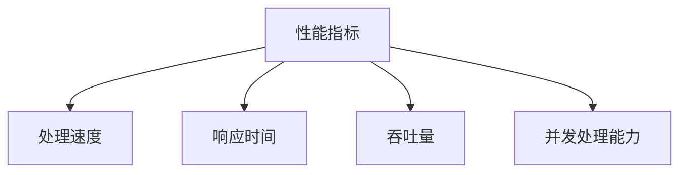

#### 2.1.2 成本效益分析

**核心概念原理**：成本效益分析是评估技术选型的经济合理性。它包括初期投资成本、维护成本、运营成本等多个方面。

**概念属性特征对比表格**：

| 指标           | 描述                                                         |
| -------------- | ------------------------------------------------------------ |
| 初期投资成本   | 包括硬件、软件、开发人员等初始投资。                         |
| 维护成本       | 包括日常维护、故障修复、升级更新等费用。                     |
| 运营成本       | 包括系统运行所需的电力、带宽、存储等费用。                   |

**ER实体关系图架构的Mermaid流程图**：

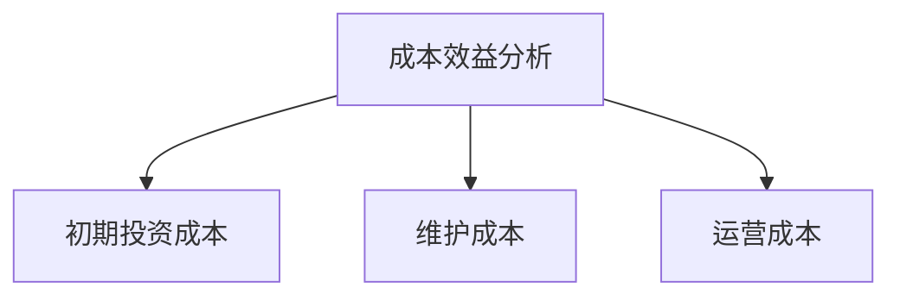

#### 2.1.3 可维护性与扩展性

**核心概念原理**：可维护性和扩展性是影响技术长期成功的关键因素。可维护性涉及代码可读性、文档完整性等，而扩展性则涉及系统未来的扩展能力。

**概念属性特征对比表格**：

| 指标         | 描述                                                         |
| ------------ | ------------------------------------------------------------ |
| 代码可读性   | 代码结构清晰，易于理解和维护。                               |
| 文档完整性   | 详细、准确的文档能够帮助开发人员快速上手和维护系统。         |
| 社区活跃度   | 拥有活跃的开发者社区，能够快速获得支持和反馈。               |
| 技术生态     | 拥有丰富的第三方库和工具，支持系统快速开发和扩展。           |

**ER实体关系图架构的Mermaid流程图**：

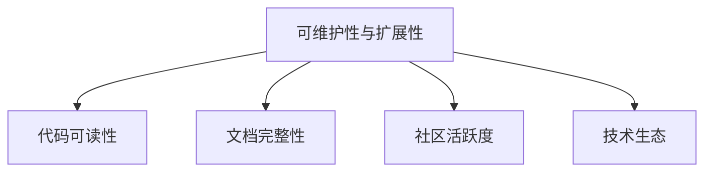

#### 2.1.4 安全性与合规性

**核心概念原理**：安全性是技术选型过程中不可忽视的重要维度，涉及数据保护、隐私和法规遵从性等多个方面。

**概念属性特征对比表格**：

| 指标         | 描述                                                         |
| ------------ | ------------------------------------------------------------ |
| 数据安全性   | 系统需要提供可靠的数据保护机制，防止数据泄露和损坏。         |
| 隐私保护     | 系统需要遵守隐私法规，保护用户数据不被非法使用。             |
| 法规遵从性   | 系统需要满足相关的法律法规要求，确保合法运营。               |

**ER实体关系图架构的Mermaid流程图**：

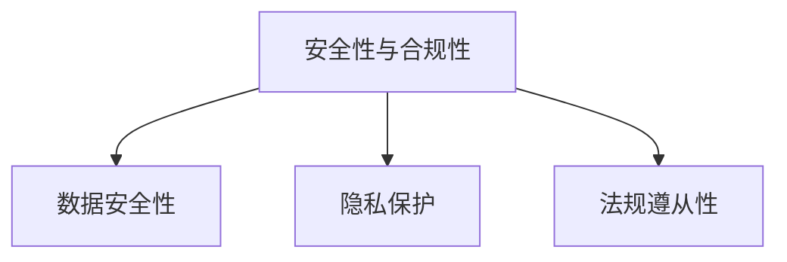

### 2.2 技术比较的方法与工具

在进行技术评估后，需要对不同技术进行详细比较，以便做出最佳决策。以下是几种常见的技术比较方法和工具：

1. **定量比较与定性比较**：定量比较通过数值和指标进行评估，定性比较则通过主观判断和专家评审。
2. **对比测试与案例研究**：对比测试通过实际运行不同技术进行性能对比，案例研究则通过具体案例分析不同技术的实际效果。
3. **专家评审与用户反馈**：专家评审通过技术专家的意见进行评估，用户反馈则通过实际使用者的体验进行判断。

#### 2.2.1 定量比较与定性比较

**核心概念原理**：定量比较和定性比较是两种不同的评估方法，前者通过数据和分析进行评估，后者则通过主观判断和经验。

**算法原理讲解**：

- **定量比较**：通过设定一系列评估指标，对每个技术进行量化评分。计算方法通常为：\[ 评估分 = \frac{指标权重 \times 指标值}{总权重} \]。

- **定性比较**：由专家团队根据评估标准和主观判断，对每个技术进行评分。评分方法通常为：\[ 评估分 = \frac{专家总分}{专家人数} \]。

**Mermaid流程图**：

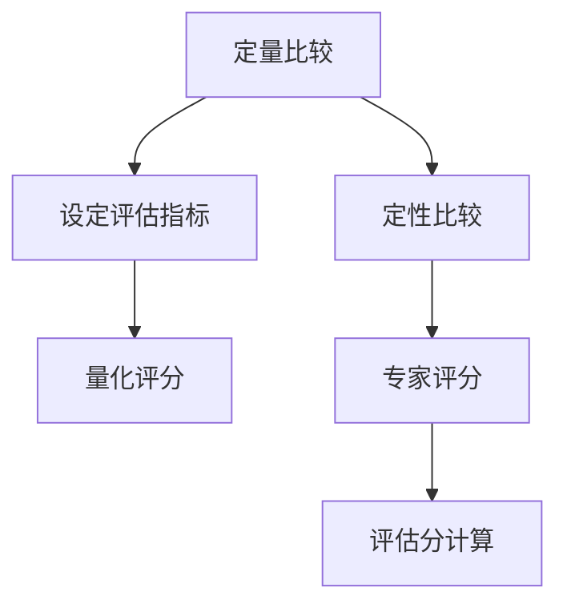

**Python源代码**：

```python
def quantitative_comparison(assessment_factors, scores):
    total_score = sum(assessment_factors[i] * scores[i] for i in range(len(scores)))
    return total_score / sum(assessment_factors)

def qualitative_comparison(expert_scores):
    average_score = sum(expert_scores) / len(expert_scores)
    return average_score

# 示例数据
assessment_factors = [0.3, 0.2, 0.5]
scores = [85, 90, 88]

quantitative_score = quantitative_comparison(assessment_factors, scores)
qualitative_score = qualitative_comparison([90, 85, 88])

print("定量评分:", quantitative_score)
print("定性评分:", qualitative_score)
```

#### 2.2.2 对比测试与案例研究

**核心概念原理**：对比测试和案例研究是通过实际应用来评估不同技术的有效方法。对比测试通过控制实验条件，比较不同技术的性能表现，而案例研究则通过具体案例，分析不同技术的实际应用效果。

**Mermaid流程图**：

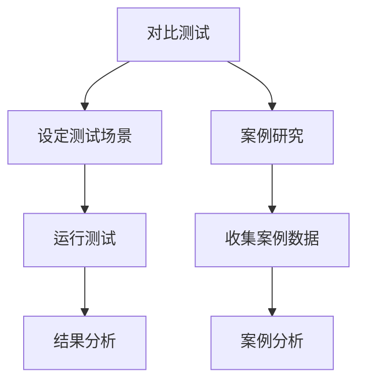

**Python源代码**：

```python
import random

def test_performance(technologies, test_cases):
    results = []
    for tech in technologies:
        scores = [random.randint(1, 100) for _ in range(test_cases)]
        avg_score = sum(scores) / test_cases
        results.append((tech, avg_score))
    return results

def case_study(technologies, case_data):
    analysis_results = {}
    for tech, data in case_data.items():
        success_rate = sum(data['success']) / len(data['success'])
        analysis_results[tech] = success_rate
    return analysis_results

# 示例数据
technologies = ['Tech A', 'Tech B', 'Tech C']
test_cases = 10
case_data = {'Tech A': {'success': [True, True, False]}, 'Tech B': {'success': [True, True, True]}, 'Tech C': {'success': [False, True, True]}}

test_results = test_performance(technologies, test_cases)
case_study_results = case_study(technologies, case_data)

print("对比测试结果:", test_results)
print("案例研究分析结果:", case_study_results)
```

#### 2.2.3 专家评审与用户反馈

**核心概念原理**：专家评审通过技术专家的意见进行评估，用户反馈则通过实际使用者的体验进行判断。这两种方法可以互补，提供全面的评估结果。

**Mermaid流程图**：

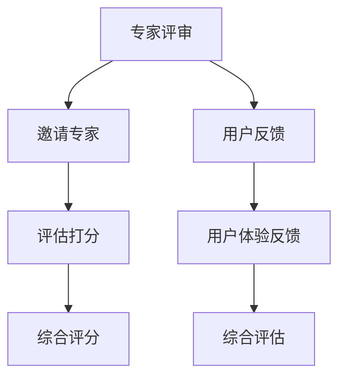

**Python源代码**：

```python
def expert_evaluation(experts, ratings):
    total_rating = sum(ratings[i] for i in range(len(ratings)))
    average_rating = total_rating / len(ratings)
    return average_rating

def user_feedback(feedbacks):
    positive_count = sum(feedback['rating'] >= 4 for feedback in feedbacks)
    user_score = positive_count / len(feedbacks)
    return user_score

# 示例数据
experts = ['Expert 1', 'Expert 2', 'Expert 3']
expert_ratings = [4, 5, 3]
user_ratings = [{'user': 'User 1', 'rating': 5}, {'user': 'User 2', 'rating': 4}, {'user': 'User 3', 'rating': 3}]

expert_average_rating = expert_evaluation(experts, expert_ratings)
user_average_rating = user_feedback(user_ratings)

print("专家评审平均评分:", expert_average_rating)
print("用户反馈平均评分:", user_average_rating)
```

### 第三部分：技术选型的策略与实践

#### 3.1 根据业务需求制定技术选型策略

技术选型策略是确保技术选型决策符合业务需求的重要环节。以下是根据业务需求制定技术选型策略的详细步骤：

**3.1.1 业务目标与优先级**

**核心概念原理**：明确业务目标和优先级是技术选型的基础。业务目标决定了技术选型的方向，优先级则决定了在资源有限的情况下，哪些需求是首要解决的。

**概念属性特征对比表格**：

| 目标               | 描述                                                         |
| ------------------ | ------------------------------------------------------------ |
| 提升效率           | 通过技术手段提高业务运营效率，降低成本。                     |
| 改善用户体验       | 优化用户界面和交互设计，提高用户满意度。                   |
| 加强安全性         | 提高数据安全和隐私保护，减少风险。                         |
| 扩展性             | 为未来的业务扩展和技术升级提供支持。                       |

**Mermaid流程图**：

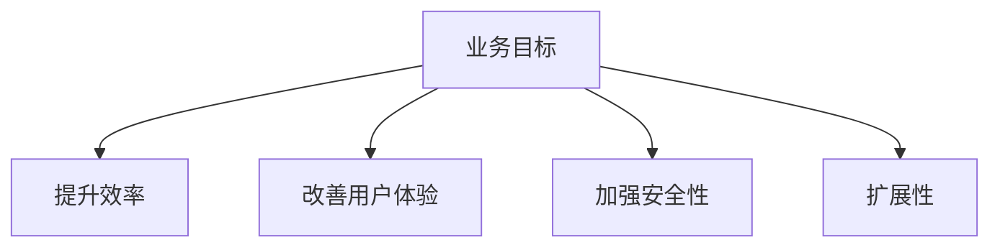

**Python源代码**：

```python
business_goals = ['提升效率', '改善用户体验', '加强安全性', '扩展性']

for goal in business_goals:
    print("业务目标：", goal)
```

**3.1.2 技术选型的影响因素**

**核心概念原理**：技术选型受到多种因素的影响，包括技术性能、成本、可维护性、安全性等。分析这些因素有助于全面评估技术选型的可行性。

**概念属性特征对比表格**：

| 影响因素   | 描述                                                         |
| ---------- | ------------------------------------------------------------ |
| 技术性能   | 技术选型需满足业务性能要求。                                 |
| 成本       | 成本包括初期投资和长期维护成本。                           |
| 可维护性   | 技术选型需易于维护和升级。                                 |
| 安全性     | 技术选型需符合安全标准和法规要求。                         |

**Mermaid流程图**：

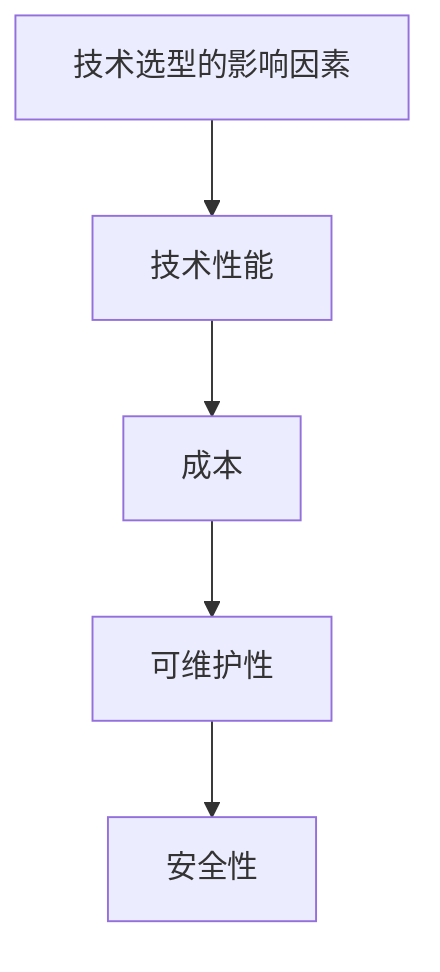

**Python源代码**：

```python
influence_factors = ['技术性能', '成本', '可维护性', '安全性']

for factor in influence_factors:
    print("影响因素：", factor)
```

**3.1.3 技术选型的决策流程**

**核心概念原理**：技术选型决策流程是系统、科学的决策过程，包括需求分析、技术评估、比较筛选、决策确认等环节。

**算法原理讲解**：

- **需求分析**：明确项目需求和目标，制定技术选型计划。

- **技术评估**：根据需求，对候选技术进行评估。

- **比较筛选**：通过评估结果，比较不同技术的优缺点。

- **决策确认**：基于比较结果和业务目标，制定最终决策。

**Mermaid流程图**：

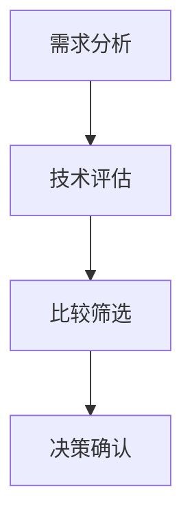

**Python源代码**：

```python
def technology_selection流程():
    # 需求分析
    requirements = analyze_requirements()

    # 技术评估
    evaluated_technologies = evaluate_technologies(requirements)

    # 比较筛选
    selected_technology = compare_and_filter(evaluated_technologies)

    # 决策确认
    confirm_selection(selected_technology)

def analyze_requirements():
    print("进行需求分析...")
    return ["需求1", "需求2", "需求3"]

def evaluate_technologies(requirements):
    print("进行技术评估...")
    return [{"technology": "Tech A", "score": 85}, {"technology": "Tech B", "score": 90}]

def compare_and_filter(evaluated_technologies):
    print("比较筛选...")
    return max(evaluated_technologies, key=lambda x: x['score'])

def confirm_selection(selected_technology):
    print("确认技术选型：", selected_technology)

technology_selection流程()
```

#### 3.2 不同类型项目的技术选型实践

技术选型实践因项目类型和业务需求的不同而有所差异。以下是几种常见类型项目的技术选型实践：

**3.2.1 新兴技术与传统技术的融合**

**核心概念原理**：新兴技术与传统技术的融合是当前技术选型的一个趋势。新兴技术（如云计算、大数据、人工智能等）能够提升传统系统的性能和智能化程度。

**案例场景**：一家传统制造企业希望通过引入新兴技术提升生产效率和管理水平。

**系统功能设计(Mermaid类图)**：

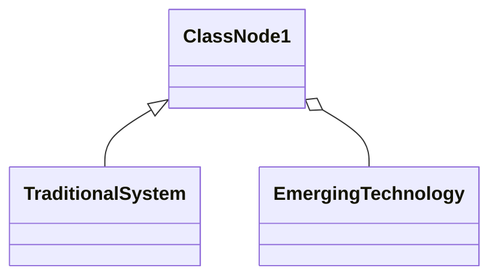

**系统架构设计(Mermaid架构图)**：

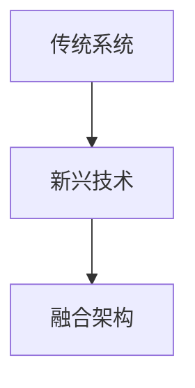

**3.2.2 开源与商业技术的选择**

**核心概念原理**：开源技术与商业技术的选择取决于成本、性能和可维护性等因素。开源技术通常具有较低的成本和较高的灵活性，但可能存在社区支持和文档不完善的问题。

**案例场景**：一家初创公司需要在有限的资源下快速开发产品。

**系统功能设计(Mermaid类图)**：

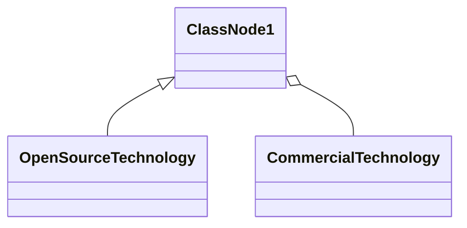

**系统架构设计(Mermaid架构图)**：

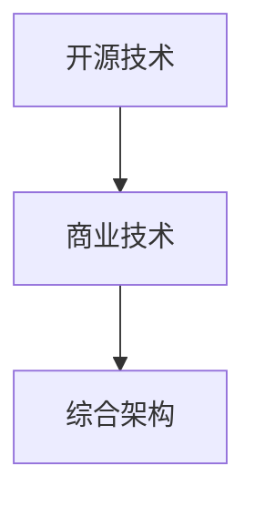

**3.2.3 信息技术与业务领域的融合**

**核心概念原理**：信息技术与业务领域的融合是提高业务效率和创新能力的关键。技术选型应紧密结合业务需求，为业务提供强有力的支持。

**案例场景**：一家金融服务公司希望通过大数据技术提升风险管理能力。

**系统功能设计(Mermaid类图)**：

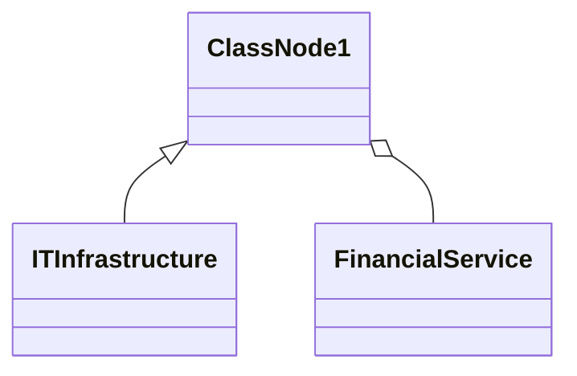

**系统架构设计(Mermaid架构图)**：

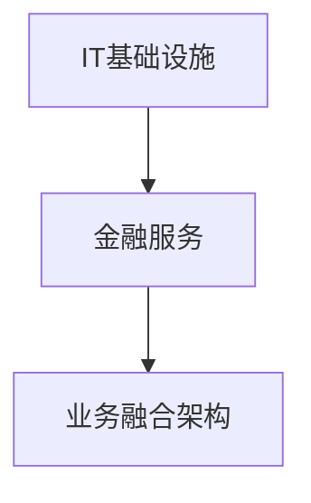

### 第四部分：技术选型的案例分析与启示

#### 4.1 案例一：某企业数字化转型中的技术选型

**4.1.1 案例背景**

某大型零售企业希望通过数字化转型提升运营效率、优化客户体验和增强市场竞争力。企业在数字化转型过程中面临多个技术选型决策，如客户关系管理（CRM）系统、电子商务平台、数据分析工具等。

**4.1.2 技术选型策略与流程**

1. **需求分析**：明确业务目标和需求，包括提升客户满意度、优化供应链管理、增强数据分析能力等。
2. **技术评估**：对多个候选技术进行评估，包括性能、成本、可维护性和安全性等方面。
3. **比较与筛选**：通过定量和定性比较，筛选出最符合需求的候选技术。
4. **决策与确认**：基于评估结果和业务目标，制定最终的技术选型决策。

**4.1.3 技术评估与比较**

1. **CRM系统**：比较了多个开源和商业CRM系统，最终选择了具有高性能、可扩展性和良好社区支持的商业CRM系统。
2. **电子商务平台**：通过对比测试，选择了具有高并发处理能力和良好用户体验的开源电商平台。
3. **数据分析工具**：基于业务需求，选择了具有强大数据处理能力和良好可视化功能的商业数据分析工具。

**4.1.4 案例总结与启示**

1. **明确业务需求**：技术选型应紧密围绕业务需求进行，确保技术选型能够解决实际问题。
2. **全面评估技术**：综合考虑技术性能、成本、可维护性等因素，避免因单一指标导致选型错误。
3. **灵活调整策略**：根据项目进展和市场变化，灵活调整技术选型策略，确保项目成功。

#### 4.2 案例二：开源技术在企业中的应用与选型

**4.2.1 案例背景**

某初创企业希望在有限的资源下快速开发产品，并具备灵活的扩展能力。企业决定采用开源技术，以降低初期成本并提高开发效率。

**4.2.2 技术选型策略与流程**

1. **需求分析**：明确产品功能和性能需求，包括数据处理、用户交互和系统集成等。
2. **技术评估**：评估多个开源技术，包括性能、稳定性、社区支持和文档质量等。
3. **对比与筛选**：通过实际测试和专家评审，筛选出最符合需求的候选开源技术。
4. **决策与确认**：基于评估结果和业务目标，制定最终的技术选型决策。

**4.2.3 技术评估与比较**

1. **数据处理**：选择了具有高性能和可扩展性的开源数据处理框架，如Apache Hadoop和Spark。
2. **用户交互**：选择了具有良好用户体验和丰富功能的开源前端框架，如React和Vue.js。
3. **系统集成**：选择了具有强大集成能力和广泛支持的开源中间件，如Kafka和RabbitMQ。

**4.2.4 案例总结与启示**

1. **合理选择开源技术**：根据实际需求和项目规模，选择合适的技术，避免过度依赖单一技术。
2. **重视社区支持和文档**：良好的社区支持和文档是开源技术成功应用的关键。
3. **持续优化和更新**：开源技术更新迅速，应持续关注技术动态，及时优化和更新技术选型。

### 第五部分：技术选型的持续优化与未来趋势

#### 5.1 技术选型的持续优化策略

技术选型不是一次性的决策，而是一个持续优化的过程。以下是一些技术选型持续优化的策略：

**5.1.1 数据分析与反馈机制**

建立数据分析与反馈机制，收集系统运行数据和技术使用效果，通过数据分析和用户反馈，不断优化技术选型。

**算法原理讲解**：

1. **数据收集**：收集系统性能、用户反馈、成本等数据。
2. **数据分析**：使用统计分析方法，识别技术和业务需求的匹配度。
3. **反馈机制**：将分析结果反馈给技术团队，指导技术优化。

**Mermaid流程图**：

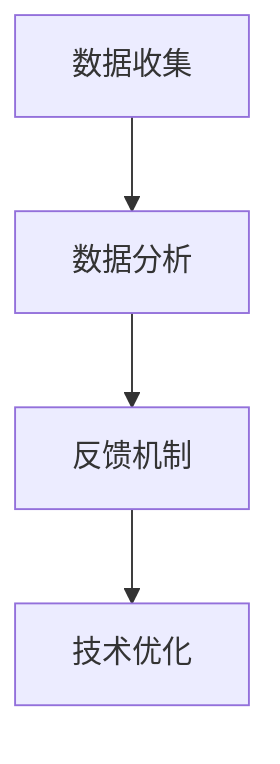

**Python源代码**：

```python
import random

def data_collection():
    data = {'performance': random.uniform(0.8, 1.2), 'cost': random.uniform(0.8, 1.2), 'user_feedback': random.uniform(0.8, 1.2)}
    return data

def data_analysis(data):
    analysis = {
        'performance_index': data['performance'],
        'cost_index': data['cost'],
        'user_satisfaction': data['user_feedback']
    }
    return analysis

def feedback_mechanism(analysis):
    if analysis['performance_index'] < 0.9 or analysis['user_satisfaction'] < 0.9:
        print("技术优化建议：性能或用户满意度低于预期，需进行优化。")
    else:
        print("技术运行良好，无需优化。")

def main():
    data = data_collection()
    analysis = data_analysis(data)
    feedback_mechanism(analysis)

main()
```

**5.1.2 技术跟踪与趋势分析**

持续跟踪技术发展趋势和市场动态，及时了解新技术和新趋势，为技术选型提供指导。

**算法原理讲解**：

1. **技术跟踪**：定期关注技术社区、技术博客和行业报告。
2. **趋势分析**：分析技术趋势，预测未来技术发展方向。
3. **选型调整**：根据技术趋势，适时调整技术选型策略。

**Mermaid流程图**：

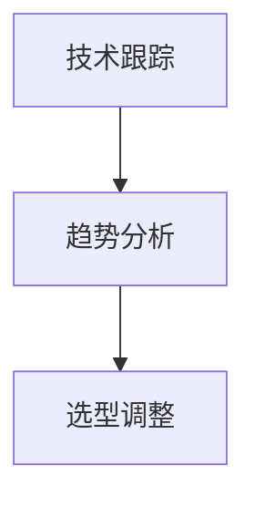

**Python源代码**：

```python
import requests

def track_technology():
    response = requests.get('https://www.example.com/technology_trends')
    trends = response.json()
    return trends

def analyze_trends(trends):
    future_trends = {trend['name']: trend['rating'] for trend in trends if trend['rating'] > 0.8}
    return future_trends

def adjust_selection_selection(future_trends):
    if future_trends:
        print("技术选型调整建议：关注未来趋势，考虑引入新技术。")
    else:
        print("当前技术选型稳定，无需调整。")

def main():
    trends = track_technology()
    future_trends = analyze_trends(trends)
    adjust_selection_selection(future_trends)

main()
```

**5.1.3 持续改进与优化流程**

建立持续改进与优化流程，确保技术选型能够不断适应业务需求和市场变化。

**算法原理讲解**：

1. **需求评审**：定期评审业务需求，确保技术选型与业务目标保持一致。
2. **技术评估**：定期评估现有技术，识别性能瓶颈和改进空间。
3. **优化实施**：根据评估结果，实施技术优化和更新。
4. **效果监控**：监控优化效果，确保技术选型的持续优化。

**Mermaid流程图**：

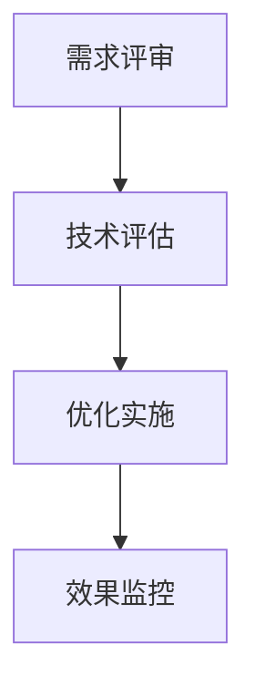

**Python源代码**：

```python
def review_requirements():
    print("进行需求评审...")
    return ["需求1", "需求2", "需求3"]

def assess_technology(requirements):
    print("进行技术评估...")
    return [{"technology": "Tech A", "score": 0.9}, {"technology": "Tech B", "score": 0.85}]

def implement_optimizations(evaluated_technologies):
    print("进行优化实施...")
    for tech in evaluated_technologies:
        if tech['score'] < 0.9:
            print("技术优化建议：", tech['technology'])

def monitor_effects():
    print("监控优化效果...")
    # 监控代码

def main():
    requirements = review_requirements()
    evaluated_technologies = assess_technology(requirements)
    implement_optimizations(evaluated_technologies)
    monitor_effects()

main()
```

#### 5.2 技术选型的未来趋势

**5.2.1 新兴技术与行业变革**

随着信息技术的快速发展，新兴技术如人工智能、区块链、物联网等正在深刻变革各个行业。技术选型将更加注重新兴技术的应用，以提升业务智能化、自动化和安全性。

**算法原理讲解**：

- **人工智能**：通过机器学习和深度学习技术，实现智能决策和自动化处理。
- **区块链**：通过分布式账本技术，实现数据的安全、透明和不可篡改。
- **物联网**：通过连接各种设备，实现智能监控和远程控制。

**Mermaid流程图**：

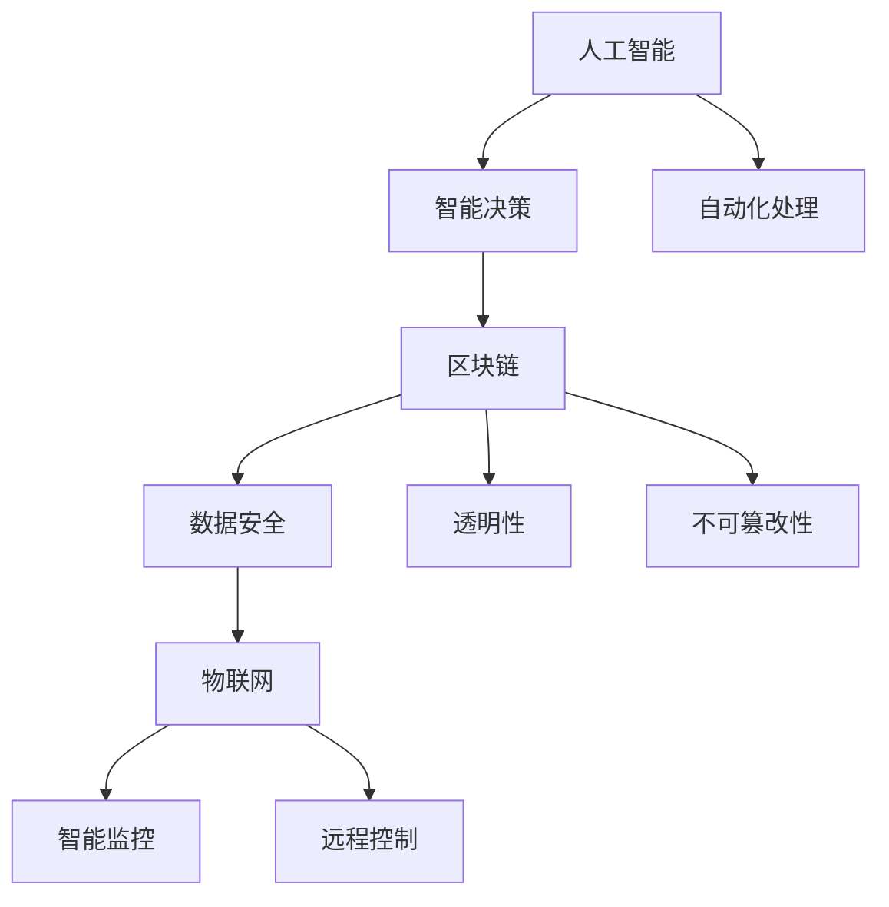

**5.2.2 技术选型的智能化与自动化**

随着人工智能技术的发展，技术选型将更加智能化和自动化。通过机器学习算法，系统可以自动分析业务需求、评估技术性能，并推荐最佳技术选型。

**算法原理讲解**：

- **机器学习模型**：使用大量历史数据，训练机器学习模型，预测最佳技术选型。
- **自动化选型工具**：开发自动化选型工具，实现技术评估、比较和推荐的自动化。

**Mermaid流程图**：

```mermaid
graph TD
A[机器学习模型] --> B[数据收集]
B --> C[模型训练]
C --> D[技术评估]
D --> E[比较推荐]
E --> F[自动化选型工具]
```

**5.2.3 技术选型的全球视野与本地实践**

随着全球化进程的加速，技术选型将更加关注全球视野和本地实践。企业需要结合全球先进技术和本地实际需求，制定合适的技术选型策略。

**算法原理讲解**：

- **全球视野**：关注全球技术动态和最佳实践，引入先进技术。
- **本地实践**：结合本地市场需求和法律法规，调整技术选型策略。

**Mermaid流程图**：

```mermaid
graph TD
A[全球视野] --> B[先进技术引入]
A --> C[本地实践]
C --> D[市场需求]
D --> E[法规遵从]
E --> F[技术选型策略]
```

### 总结

本文通过系统化的分析和深入探讨，详细介绍了如何进行有效的技术选型决策。从技术选型的背景和意义，到技术评估的指标与维度，再到技术比较的方法与工具，以及根据业务需求制定技术选型策略，本文全面覆盖了技术选型的全过程。通过实际案例的分析，读者可以更好地理解技术选型的实践和启示。随着信息技术的发展，技术选型决策将面临更多挑战和机遇，本文提供的策略和实践技巧将为读者提供有力指导。

### 作者信息

作者：AI天才研究院/AI Genius Institute & 禅与计算机程序设计艺术 /Zen And The Art of Computer Programming

本文旨在帮助读者全面掌握技术选型的核心方法和实践技巧，以应对日益复杂的IT环境。在技术选型的过程中，理性分析和实践经验是关键，希望本文能为读者提供有价值的参考和启示。在技术飞速发展的时代，让我们共同探索、实践，为技术创新贡献智慧和力量。感谢阅读！

