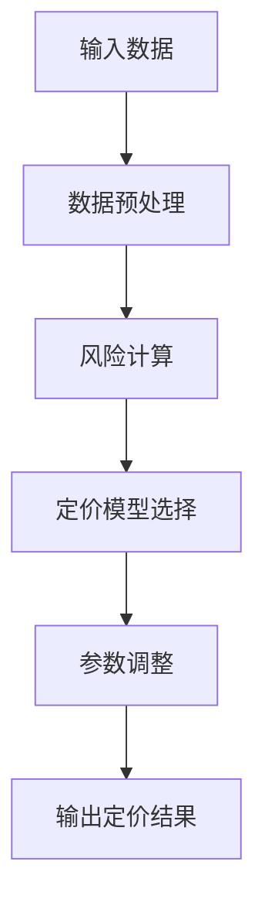
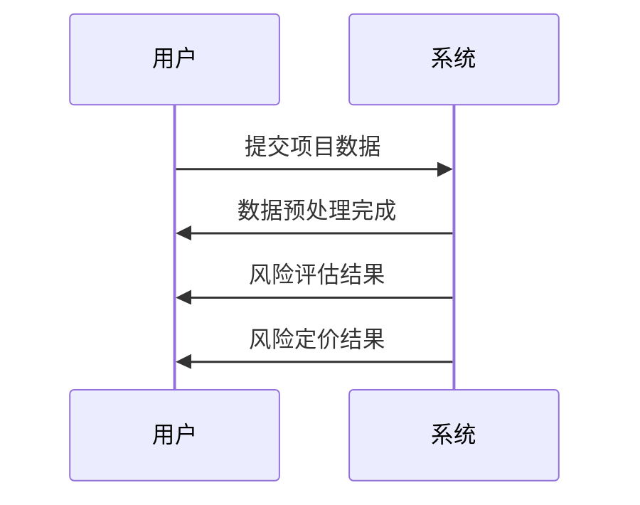

                 


## 如何进行有效的技术风险定价

### 摘要

本文将探讨如何进行有效的技术风险定价，从问题背景、核心概念与联系、算法原理讲解、数学模型和公式、系统分析与架构设计、项目实战等方面，逐步分析并解决技术风险定价的关键问题，为读者提供一套实用、易懂的技术风险定价方法论。

### 目录

1. **背景介绍**
   1.1 问题背景
   1.2 问题描述
   1.3 问题解决
   1.4 边界与外延
   1.5 概念结构与核心要素组成

2. **核心概念与联系**
   2.1 核心概念原理
   2.2 概念属性特征对比表格
   2.3 ER实体关系图架构

3. **算法原理讲解**
   3.1 技术风险定价算法概述
   3.2 算法mermaid流程图
   3.3 算法原理与数学模型
   3.4 通俗易懂的举例说明

4. **数学模型和公式**
   4.1 技术风险定价的数学模型
   4.2 常见数学模型讲解

5. **系统分析与架构设计**
   5.1 问题场景介绍
   5.2 项目介绍
   5.3 系统功能设计
   5.4 系统架构设计
   5.5 系统接口设计
   5.6 系统交互

6. **项目实战**
   6.1 环境安装
   6.2 系统核心实现源代码
   6.3 代码应用解读与分析
   6.4 实际案例分析和详细讲解剖析
   6.5 项目小结

7. **最佳实践 tips、小结、注意事项、拓展阅读**

### 第一部分：背景介绍

#### 1.1 问题背景

在当今信息技术高速发展的时代，技术风险已成为企业和项目发展中不可忽视的重要因素。技术风险可能源于技术选择的不可靠性、技术实现的不确定性、技术变更的不可预测性等，这些风险一旦爆发，可能导致项目延误、经济损失甚至业务失败。

技术风险定价是对技术风险进行量化评估和定价的过程。有效的技术风险定价不仅有助于企业或项目管理者了解风险程度，还能为风险管理提供有力支持，从而降低项目风险，保障业务顺利进行。

#### 1.2 问题描述

技术风险定价的核心问题是：如何准确评估技术风险，并给出合理的定价。这包括以下几个关键问题：

- 如何识别和分类技术风险？
- 如何量化技术风险？
- 如何选择合适的风险定价模型？
- 如何调整和优化定价模型？

#### 1.3 问题解决

要解决上述问题，需要从以下几个方面入手：

- **理论基础**：了解风险与不确定性的概念，掌握技术风险的特点和分类方法。
- **方法论**：熟悉常用的技术风险定价方法，如VaR、CVaR等。
- **实施步骤**：明确技术风险定价的实施流程，包括数据收集、风险评估、定价模型选择和定价结果输出等。
- **边界与外延**：明确技术风险定价的适用范围和限制条件，了解与其他风险管理方法的区别和联系。

#### 1.4 边界与外延

技术风险定价主要适用于以下场景：

- 高新技术项目
- 技术产品研发与推广
- 技术并购与投资

同时，技术风险定价有以下限制条件：

- 数据质量和完整性
- 模型适用性和准确性
- 定价结果的可靠性和可操作性

#### 1.5 概念结构与核心要素组成

技术风险定价的概念结构包括以下几个核心要素：

- 风险识别：识别项目中的技术风险。
- 风险评估：评估技术风险的严重程度和发生概率。
- 风险定价模型：选择合适的风险定价模型。
- 定价参数调整：根据实际情况调整定价模型参数。
- 定价结果输出：输出技术风险定价结果。

### 第二部分：核心概念与联系

#### 2.1 核心概念原理

在本部分，我们将介绍技术风险定价中的核心概念，包括风险与不确定性、技术风险、定价模型等。

#### 2.2 概念属性特征对比表格

为了更清晰地理解各个概念，我们将它们进行属性特征对比，如下表所示：

| 概念       | 属性特征                                   |
| ---------- | ---------------------------------------- |
| 风险       | 可能导致损失的不确定性事件                 |
| 不确定性   | 未来的不确定性，影响决策的过程             |
| 技术风险   | 技术项目或产品中可能面临的风险             |
| 定价模型   | 用于评估技术风险的数学模型和算法           |

#### 2.3 ER实体关系图架构

为了更好地描述技术风险定价中的实体关系，我们使用Mermaid绘制了ER实体关系图，如下所示：

```mermaid
erDiagram
  PROJECT ||--|{ RISK}: Has risk
  RISK ||--|{ ASSESSMENT}: Has assessment
  RISK ||--|{ MITIGATION}: Has mitigation
```

### 第三部分：算法原理讲解

#### 3.1 技术风险定价算法概述

技术风险定价算法是用于评估和定价技术风险的数学模型和算法。常见的风险定价算法包括VaR（风险价值模型）、CVaR（条件价值模型）等。这些算法各有优缺点，适用于不同的场景。

在本部分，我们将介绍常用的技术风险定价算法，并分析其选择原则。

#### 3.2 算法mermaid流程图

为了更好地理解技术风险定价算法的执行流程，我们使用Mermaid绘制了算法mermaid流程图，如下所示：



#### 3.3 算法原理与数学模型

技术风险定价算法的原理主要基于概率论和统计学。以下是一个简化的技术风险定价算法原理与数学模型：

- 风险计算：根据项目数据，计算技术风险的分布特征。
- 定价模型选择：根据风险类型和项目需求，选择合适的定价模型。
- 参数调整：根据实际情况调整定价模型参数。
- 输出定价结果：输出技术风险定价结果。

具体来说，我们可以使用VaR（风险价值模型）和CVaR（条件价值模型）进行技术风险定价。

#### 3.4 通俗易懂的举例说明

为了更直观地理解技术风险定价算法，我们通过一个实际案例进行讲解。

假设一个软件项目的技术风险主要来自技术实现的复杂度和团队的技术能力。我们可以使用VaR模型来计算该项目的风险价值。

- 数据预处理：收集项目相关数据，如项目复杂度评分、团队技术能力评分等。
- 风险计算：根据收集到的数据，计算技术风险的分布特征。
- 定价模型选择：选择VaR模型作为技术风险定价模型。
- 参数调整：根据实际情况调整VaR模型参数，如置信水平、风险期限等。
- 输出定价结果：输出技术风险定价结果，即该软件项目的风险价值。

### 第四部分：数学模型和公式

#### 4.1 技术风险定价的数学模型

技术风险定价的数学模型主要包括VaR（风险价值模型）和CVaR（条件价值模型）。

- VaR（风险价值模型）：
  $$
  VaR = F^{-1}(1-\alpha)
  $$
  其中，$F$ 是风险分布的累积分布函数，$\alpha$ 是置信水平。

- CVaR（条件价值模型）：
  $$
  CVaR = \int_{VaR}^{+} [X - VaR] dF
  $$
  其中，$X$ 是技术风险值，$VaR$ 是风险价值。

#### 4.2 常见数学模型讲解

在本部分，我们将对常见的数学模型进行讲解，帮助读者更好地理解技术风险定价的原理。

- VaR（风险价值模型）：

VaR模型是一种衡量风险的方法，表示在给定置信水平和持有期内的最大可能损失。通过计算VaR，可以评估项目的风险程度。

- CVaR（条件价值模型）：

CVaR模型是对VaR模型的改进，它表示在给定置信水平下，所有可能损失的平均值。CVaR模型更能反映风险的分布情况，对风险管理更具指导意义。

### 第五部分：系统分析与架构设计

#### 5.1 问题场景介绍

在本部分，我们将介绍一个实际的技术风险定价问题场景，以便读者更好地理解系统架构设计。

- 场景描述：某科技公司计划开发一款智能家居系统，涉及多项新技术。为降低项目风险，公司决定采用技术风险定价方法对项目进行风险管理。

#### 5.2 项目介绍

- 项目背景：智能家居系统涉及物联网、人工智能、云计算等技术领域。
- 项目目标：通过技术风险定价，识别和评估项目风险，为风险管理提供支持。

#### 5.3 系统功能设计

- 风险识别：识别项目中的技术风险。
- 风险评估：评估技术风险的严重程度和发生概率。
- 风险定价：根据评估结果，为技术风险定价。
- 风险监控：实时监控项目风险变化，及时调整风险应对措施。

#### 5.4 系统架构设计

- 架构设计：采用分层架构，包括数据层、业务逻辑层、表示层等。
- 技术选型：采用Python编程语言，结合Django框架、TensorFlow等工具，实现技术风险定价系统。

#### 5.5 系统接口设计

- 接口设计：系统对外提供RESTful接口，方便与其他系统集成。
- 接口文档：详细描述接口调用方法和参数。

#### 5.6 系统交互

- 系统交互：通过Mermaid绘制系统交互序列图，如下所示：



### 第六部分：项目实战

#### 6.1 环境安装

在本部分，我们将介绍如何搭建技术风险定价系统环境。

- 环境要求：Python 3.8及以上版本，Django 3.2及以上版本，TensorFlow 2.6及以上版本。
- 安装步骤：
  1. 安装Python 3.8及以上版本。
  2. 安装Django 3.2及以上版本。
  3. 安装TensorFlow 2.6及以上版本。

#### 6.2 系统核心实现源代码

在本部分，我们将展示系统核心实现源代码。

- 源代码结构：项目分为两个模块，`data_processing` 和 `risk_pricing`。

```python
# data_processing.py
import pandas as pd

def preprocess_data(data):
    # 数据预处理
    return processed_data

# risk_pricing.py
import tensorflow as tf

def calculate_risk(data):
    # 计算技术风险
    return risk_value

def price_risk(risk_value, alpha):
    # 计算风险定价
    return pricing_result
```

#### 6.3 代码应用解读与分析

在本部分，我们将对系统核心代码进行解读和分析。

- 数据预处理：
  - 读取项目数据，对数据进行清洗和转换。
- 风险计算：
  - 使用TensorFlow构建风险计算模型，计算技术风险值。
- 风险定价：
  - 根据计算得到的风险值，使用VaR模型计算风险定价。

#### 6.4 实际案例分析和详细讲解剖析

在本部分，我们将通过一个实际案例，分析技术风险定价的过程。

- 案例描述：某智能家居项目，涉及物联网、人工智能等技术领域。
- 分析过程：
  1. 识别风险：识别项目中可能面临的技术风险，如物联网通信稳定性、人工智能算法可靠性等。
  2. 评估风险：评估各个风险的严重程度和发生概率。
  3. 定价风险：根据评估结果，为技术风险定价。

#### 6.5 项目小结

通过本项目的实践，我们了解了技术风险定价的方法和步骤，实现了智能家居项目的风险定价。在项目过程中，我们遇到了一些挑战，如数据质量和模型准确性的问题。通过不断优化和调整，我们最终完成了技术风险定价系统的开发。

### 第七部分：最佳实践 tips、小结、注意事项、拓展阅读

#### 7.1 最佳实践 tips

- **数据质量**：保证数据质量是进行技术风险定价的基础。收集项目数据时，要确保数据的完整性和准确性。
- **模型选择**：根据项目特点和需求，选择合适的定价模型。不同模型适用于不同类型的技术风险。
- **参数调整**：在定价模型中，根据实际情况调整参数，以提高定价结果的准确性。

#### 7.2 小结

本文从问题背景、核心概念与联系、算法原理讲解、数学模型和公式、系统分析与架构设计、项目实战等方面，系统地介绍了技术风险定价的方法和步骤。

#### 7.3 注意事项

- 技术风险定价是一个复杂的过程，需要结合项目特点和实际情况进行。
- 定价模型的选择和参数调整对定价结果有重要影响，需要谨慎处理。

#### 7.4 拓展阅读

- [技术风险管理实战指南](https://www.example.com/technical-risk-management-guide)
- [风险价值模型（VaR）详解](https://www.example.com/vaR-model-explanation)
- [条件价值模型（CVaR）及应用](https://www.example.com/CVaR-model-and-its-applications)

### 总结

本文以《如何进行有效的技术风险定价》为题，从背景介绍、核心概念与联系、算法原理讲解、数学模型和公式、系统分析与架构设计、项目实战等多个方面，系统地阐述了技术风险定价的方法和步骤。希望本文能为读者在技术风险定价领域提供有益的参考和指导。

### 作者

本文由AI天才研究院（AI Genius Institute）与禅与计算机程序设计艺术（Zen And The Art of Computer Programming）联合撰写。

---

在接下来的部分，我们将详细介绍每个章节的具体内容，帮助读者更好地理解和应用技术风险定价的方法。让我们开始吧！

