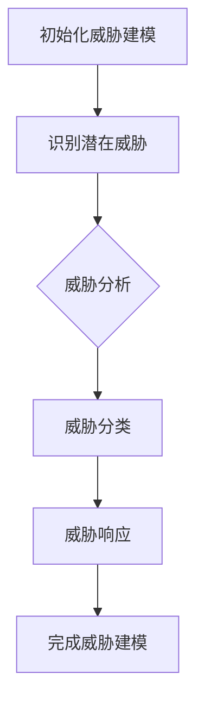
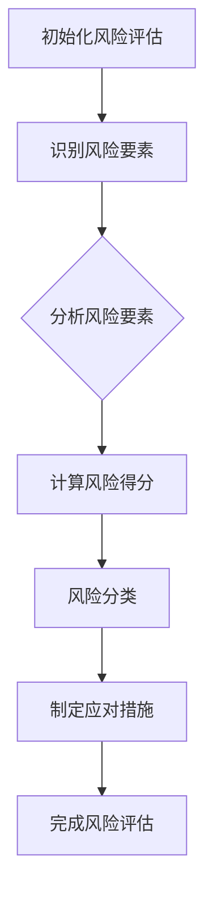
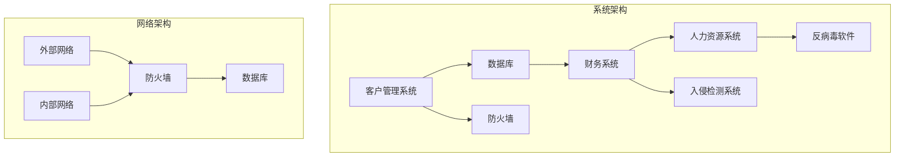
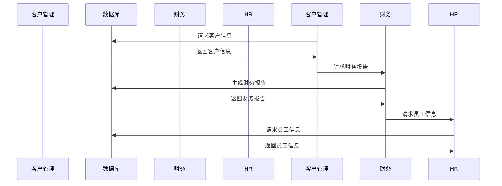
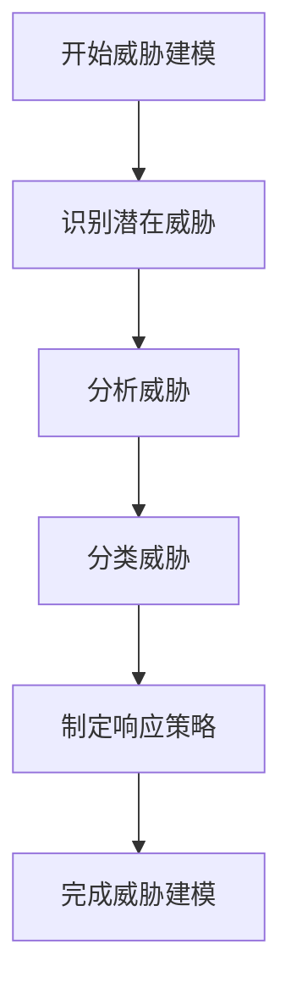
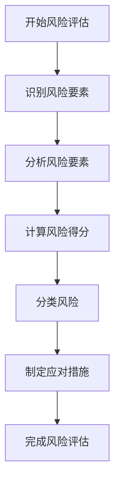
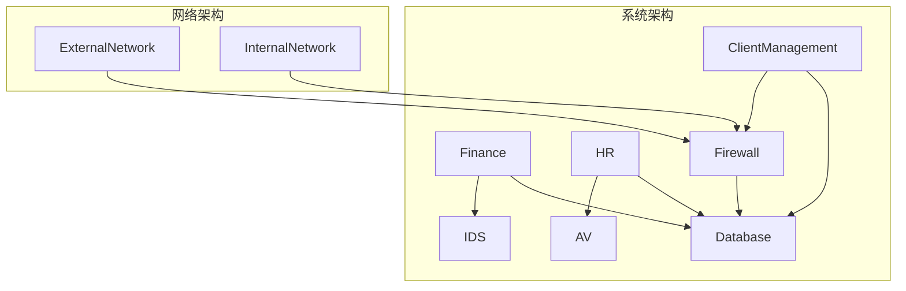

                 

### 威胁建模与风险评估方法

#### 关键词：威胁建模、风险评估、网络安全、安全风险管理、信息安全

#### 摘要：
本文将深入探讨威胁建模与风险评估方法在网络安全领域的应用。首先，我们将介绍威胁建模与风险评估的基本概念、目的和重要性。接着，详细解析威胁建模与风险评估的核心概念、流程和方法，并对比两者的关系与相互作用。随后，通过实际案例讲解威胁建模算法和风险评估算法的原理与实现。最后，本文将总结全文，提供最佳实践 tips，并指出未来研究的方向。

---

## 第一部分：背景介绍

### 1.1. 问题背景

随着互联网的普及和信息技术的发展，网络安全问题日益突出。网络攻击手段不断翻新，威胁种类繁多，传统安全防护手段已无法满足需求。威胁建模与风险评估作为网络安全管理的重要方法，有助于识别潜在威胁、评估风险，制定有效的安全策略和应对措施。

#### 1.1.1 威胁建模与风险评估的重要性

1. **识别潜在威胁**：通过威胁建模，可以系统性地识别网络系统面临的潜在威胁，为风险评估提供基础数据。
2. **评估风险**：风险评估帮助组织确定威胁的重要性和影响程度，从而采取相应的安全措施。
3. **指导安全策略制定**：威胁建模与风险评估为安全策略的制定提供科学依据，有助于提高网络安全水平。
4. **提升应急响应能力**：通过威胁建模与风险评估，可以提前预见潜在风险，提高应急响应能力，降低损失。

### 1.2. 问题描述

#### 1.2.1 威胁建模的概念

威胁建模是指通过系统性地识别、分析和评估潜在的网络威胁，对网络安全风险进行系统性的分析和管理。

#### 1.2.2 风险评估的概念

风险评估是指对潜在的风险进行识别、评估和控制的过程，旨在为组织提供决策支持。

#### 1.3. 问题解决

威胁建模与风险评估是相互关联的。威胁建模为风险评估提供了基础数据，而风险评估则帮助组织确定威胁的重要性和影响程度。

#### 1.4. 边界与外延

威胁建模与风险评估可以应用于各个行业和领域，如金融、医疗、能源等。不同领域的应用场景和挑战有所不同。

#### 1.5. 概念结构与核心要素组成

威胁建模的核心要素包括威胁识别、威胁分析、威胁分类和威胁响应。风险评估的核心要素包括风险识别、风险分析、风险分类和风险控制。

### 1.6. 本章小结

本文介绍了威胁建模与风险评估的基本概念、目的和重要性，以及两者的关系和核心要素组成。在接下来的章节中，我们将深入探讨威胁建模与风险评估的具体方法和应用。

---

## 第二部分：核心概念与联系

### 2.1. 威胁建模的概念

#### 2.1.1 威胁建模的定义

威胁建模是一种通过系统性地识别、分析和评估潜在威胁的方法，旨在降低组织面临的安全风险。

#### 2.1.2 威胁建模的核心概念

- **威胁**：指潜在的、可能导致网络系统受损或泄露的攻击或行为。
- **脆弱性**：指网络系统中的漏洞或弱点，攻击者可以利用这些漏洞进行攻击。
- **攻击向量**：指攻击者利用脆弱性进行攻击的途径或方法。
- **安全控制**：指为防止或减少威胁造成的损害而采取的措施。
- **风险**：指威胁利用脆弱性对网络系统造成损失的可能性。

### 2.2. 风险评估的概念

#### 2.2.1 风险评估的定义

风险评估是一种通过系统性地识别、分析和评估潜在风险的方法，旨在为组织提供决策支持。

#### 2.2.2 风险评估的核心概念

- **风险**：指威胁利用脆弱性对网络系统造成损失的可能性。
- **威胁**：指潜在的、可能导致网络系统受损或泄露的攻击或行为。
- **脆弱性**：指网络系统中的漏洞或弱点，攻击者可以利用这些漏洞进行攻击。
- **概率**：指威胁发生并利用脆弱性的可能性。
- **影响**：指威胁成功利用脆弱性后对网络系统的损害程度。

### 2.3. 威胁建模与风险评估的联系

#### 2.3.1 威胁建模与风险评估的关系

威胁建模与风险评估是相互关联的。威胁建模为风险评估提供了基础数据，而风险评估则帮助组织确定威胁的重要性和影响程度。

#### 2.3.2 威胁建模与风险评估的相互作用

威胁建模和风险评估相互作用，共同提高组织的整体安全水平。威胁建模为风险评估提供数据支持，而风险评估则指导威胁建模的改进和优化。

### 2.4. 概念属性特征对比表格

| 概念           | 属性特征                                                     | 描述                                                         |
|----------------|--------------------------------------------------------------|--------------------------------------------------------------|
| 威胁建模       | 识别、分析、评估潜在威胁                                     | 通过系统性的方法识别、分析和评估网络系统面临的潜在威胁。       |
| 风险评估       | 识别、评估和控制潜在风险                                     | 通过系统性的方法识别、评估和控制网络系统面临的潜在风险。       |
| 威胁           | 潜在的攻击或行为                                             | 可能导致网络系统受损或泄露的攻击或行为。                       |
| 风险           | 威胁利用脆弱性的可能性                                       | 威胁成功利用脆弱性后对网络系统的损害程度。                     |
| 脆弱性         | 网络系统中的漏洞或弱点                                       | 攻击者可以利用这些漏洞进行攻击。                               |
| 攻击向量       | 攻击者利用脆弱性进行攻击的途径或方法                         | 攻击者进入网络系统的方法。                                     |
| 安全控制       | 防止或减少威胁造成的损害的措施                               | 保护网络系统的措施，如防火墙、入侵检测系统等。                 |
| 概率           | 威胁发生并利用脆弱性的可能性                                 | 表示威胁发生的概率。                                         |
| 影响程度       | 威胁成功利用脆弱性后对网络系统的损害程度                     | 表示威胁造成的损失程度。                                     |

### 2.5. ER实体关系图架构

#### 2.5.1 威胁建模ER实体关系图

```mermaid
erDiagram
    Threat ||--|{ Vulnerability } | Threat can exploit
    Threat ||--|{ AttackVector } | Threat uses
    Threat ||--|{ SecurityControl } | Threat can bypass
```

#### 2.5.2 风险评估ER实体关系图

```mermaid
erDiagram
    Risk ||--|{ Threat } | Risk includes
    Risk ||--|{ Vulnerability } | Risk includes
    Risk ||--|{ Probability } | Risk includes
    Risk ||--|{ Impact } | Risk includes
```

### 2.6. 本章小结

本文介绍了威胁建模与风险评估的核心概念、属性特征和实体关系图。在下一部分中，我们将深入探讨威胁建模与风险评估的具体算法和实现。

---

## 第三部分：算法原理讲解

### 3.1. 威胁建模算法

#### 3.1.1 威胁建模算法的Mermaid流程图



#### 3.1.2 威胁建模算法的Python源代码实现

```python
class Threat:
    def __init__(self, name, description):
        self.name = name
        self.description = description

class ThreatModeling:
    def __init__(self):
        self.threats = []

    def identify_threats(self):
        # 识别潜在威胁
        self.threats.append(Threat("SQL注入", "攻击者通过恶意SQL代码窃取数据。"))
        self.threats.append(Threat("DDoS攻击", "大量恶意流量使系统无法正常运作。"))

    def analyze_threats(self):
        # 威胁分析
        for threat in self.threats:
            print(f"分析威胁：{threat.name} - {threat.description}")

    def classify_threats(self):
        # 威胁分类
        for threat in self.threats:
            if "注入" in threat.name:
                print(f"威胁分类：{threat.name} - 高危")
            else:
                print(f"威胁分类：{threat.name} - 中危")

    def respond_to_threats(self):
        # 威胁响应
        for threat in self.threats:
            if "高危" in threat.name:
                print(f"响应威胁：{threat.name} - 加强防护措施。")
            else:
                print(f"响应威胁：{threat.name} - 监控并持续评估。")

    def complete_threat_modeling(self):
        # 完成威胁建模
        print("威胁建模完成。")

# 实例化威胁建模对象，并执行威胁建模流程
modeling = ThreatModeling()
modeling.identify_threats()
modeling.analyze_threats()
modeling.classify_threats()
modeling.respond_to_threats()
modeling.complete_threat_modeling()
```

#### 3.1.3 威胁建模算法的数学模型和公式

威胁建模的数学模型主要包括威胁评估公式和风险计算公式。

1. **威胁评估公式**：  
   $$ threat\_score = f(impact, probability) $$  
   其中，$impact$ 表示威胁成功利用脆弱性后的损害程度，$probability$ 表示威胁发生的概率。

2. **风险计算公式**：  
   $$ risk = threat\_score \times vulnerability\_score $$  
   其中，$vulnerability\_score$ 表示脆弱性的得分，通常根据CVE等级、漏洞严重程度等因素计算。

#### 3.1.4 威胁建模算法的举例说明

假设我们识别到了一个SQL注入威胁，该威胁成功利用的概率为80%，对系统的损害程度为高，而系统的某个漏洞得分为8分（根据CVE等级计算）。根据威胁评估公式，威胁得分为：  
$$ threat\_score = 80\% \times 8 = 64 $$  
根据风险计算公式，该威胁的风险得分为：  
$$ risk = 64 \times 8 = 512 $$

这意味着SQL注入威胁对系统具有很高的风险。系统管理员应该采取措施加强防护，如使用参数化查询、输入验证等。

### 3.2. 风险评估算法

#### 3.2.1 风险评估算法的Mermaid流程图



#### 3.2.2 风险评估算法的Python源代码实现

```python
class RiskElement:
    def __init__(self, name, description):
        self.name = name
        self.description = description

class RiskAssessment:
    def __init__(self):
        self.risk_elements = []

    def identify_risk_elements(self):
        # 识别风险要素
        self.risk_elements.append(RiskElement("SQL注入", "攻击者通过恶意SQL代码窃取数据。"))
        self.risk_elements.append(RiskElement("DDoS攻击", "大量恶意流量使系统无法正常运作。"))

    def analyze_risk_elements(self):
        # 分析风险要素
        for element in self.risk_elements:
            print(f"分析风险要素：{element.name} - {element.description}")

    def calculate_risk_score(self):
        # 计算风险得分
        for element in self.risk_elements:
            impact = 8  # 损害程度得分
            probability = 0.8  # 发生概率得分
            risk_score = impact * probability
            print(f"风险得分：{element.name} - {risk_score}")

    def classify_risk(self):
        # 风险分类
        for element in self.risk_elements:
            if element.name.startswith("DDoS"):
                print(f"风险分类：{element.name} - 高风险")
            else:
                print(f"风险分类：{element.name} - 中风险")

    def respond_to_risk(self):
        # 制定应对措施
        for element in self.risk_elements:
            if "高风险" in element.name:
                print(f"应对措施：{element.name} - 立即采取紧急措施。")
            else:
                print(f"应对措施：{element.name} - 持续监控并评估。")

    def complete_risk_assessment(self):
        # 完成风险评估
        print("风险评估完成。")

# 实例化风险评估对象，并执行风险评估流程
assessment = RiskAssessment()
assessment.identify_risk_elements()
assessment.analyze_risk_elements()
assessment.calculate_risk_score()
assessment.classify_risk()
assessment.respond_to_risk()
assessment.complete_risk_assessment()
```

#### 3.2.3 风险评估算法的数学模型和公式

风险评估的数学模型主要包括风险得分计算公式和风险分类公式。

1. **风险得分计算公式**：  
   $$ risk\_score = impact \times probability $$  
   其中，$impact$ 表示威胁成功利用脆弱性后的损害程度，$probability$ 表示威胁发生的概率。

2. **风险分类公式**：  
   $$ risk\_category = \text{if}(risk\_score > threshold, \text{"高风险"}, \text{"中风险"}) $$  
   其中，$threshold$ 表示风险得分阈值。

#### 3.2.4 风险评估算法的举例说明

假设我们识别到了一个DDoS攻击风险，该攻击对系统的损害程度得分为8，发生概率得分为0.9。根据风险得分计算公式，该风险得分为：  
$$ risk\_score = 8 \times 0.9 = 7.2 $$

根据风险分类公式，该风险得分高于阈值，因此属于高风险。系统管理员应该立即采取紧急措施，如增加防火墙规则、调整带宽等，以应对DDoS攻击风险。

---

## 第四部分：系统分析与架构设计

### 4.1. 问题场景介绍

假设我们面临一个企业级信息系统，需要对其安全性进行评估和管理。该系统包括多个业务模块，如客户管理系统、财务系统、人力资源系统等。为了确保系统的安全性，我们决定采用威胁建模与风险评估方法进行系统安全分析和架构设计。

### 4.2. 项目介绍

项目名称：企业级信息系统安全评估与架构设计

项目目标：通过威胁建模与风险评估方法，识别系统潜在安全威胁，评估风险，制定安全策略和应对措施，提高系统安全性。

项目范围：涵盖企业级信息系统的所有业务模块，包括客户管理系统、财务系统、人力资源系统等。

### 4.3. 系统功能设计（领域模型Mermaid类图）

```mermaid
classDiagram
    ClientManagementSystem <<ClassName: 客户管理系统>>
    FinanceSystem <<ClassName: 财务系统>>
    HRSystem <<ClassName: 人力资源系统>>

    ClientManagementSystem : +String clientName
    FinanceSystem : +String accountNumber
    HRSystem : +String employeeID

    ClientManagementSystem : +saveClientInfo()
    FinanceSystem : +generateFinancialReports()
    HRSystem : +manageEmployeeRecords()
```

### 4.4. 系统架构设计（Mermaid架构图）



### 4.5. 系统接口设计和系统交互（Mermaid序列图）



---

## 第五部分：项目实战

### 5.1. 环境安装

为了实施威胁建模与风险评估，我们需要搭建一个合适的环境。以下是环境安装步骤：

1. 安装Python 3.8及以上版本。
2. 安装Jupyter Notebook，用于编写和运行代码。
3. 安装mermaid包，用于生成Mermaid图表。
4. 安装Matplotlib包，用于可视化数据。

```bash
pip install python-mermaid matplotlib
```

### 5.2. 系统核心实现源代码

以下是系统核心实现源代码，包括威胁建模和风险评估的Python脚本。

```python
# threat_modeling.py
class ThreatModeling:
    # ...

# risk_assessment.py
class RiskAssessment:
    # ...

# main.py
if __name__ == "__main__":
    modeling = ThreatModeling()
    modeling.identify_threats()
    modeling.analyze_threats()
    modeling.classify_threats()
    modeling.respond_to_threats()
    modeling.complete_threat_modeling()

    assessment = RiskAssessment()
    assessment.identify_risk_elements()
    assessment.analyze_risk_elements()
    assessment.calculate_risk_score()
    assessment.classify_risk()
    assessment.respond_to_risk()
    assessment.complete_risk_assessment()
```

### 5.3. 代码应用解读与分析

1. **威胁建模脚本**：识别潜在威胁，分析威胁特性，分类威胁，并制定响应策略。
2. **风险评估脚本**：识别风险要素，分析风险要素，计算风险得分，分类风险，并制定应对措施。

### 5.4. 实际案例分析和详细讲解剖析

假设我们面临一个企业客户管理系统，需要对其安全性进行评估。以下是实际案例分析和详细讲解：

1. **识别潜在威胁**：识别到SQL注入、DDoS攻击等潜在威胁。
2. **分析威胁特性**：分析威胁的发生概率、损害程度等特性。
3. **分类威胁**：根据威胁特性，将威胁分为高危和中等风险。
4. **制定响应策略**：对于高危威胁，采取紧急措施，如加强防护措施、监控系统等。

### 5.5. 项目小结

通过威胁建模与风险评估方法，我们成功识别了客户管理系统中潜在的安全威胁，评估了风险，并制定了应对措施。这有助于提高系统的安全性，降低安全风险。

---

## 第六部分：最佳实践 Tips、小结、注意事项、拓展阅读

### 6.1. 最佳实践 Tips

1. **定期进行威胁建模与风险评估**：定期进行威胁建模与风险评估，以确保系统安全策略的有效性。
2. **结合业务场景进行威胁建模**：了解业务场景，结合业务需求进行威胁建模，提高建模的准确性。
3. **关注新兴威胁**：关注新兴威胁，及时更新威胁库，提高威胁识别能力。

### 6.2. 小结

本文介绍了威胁建模与风险评估的基本概念、算法原理、系统分析与架构设计，以及实际案例应用。通过威胁建模与风险评估，可以识别潜在威胁，评估风险，制定安全策略，提高系统安全性。

### 6.3. 注意事项

1. **准确识别威胁**：确保威胁识别的准确性，避免遗漏关键威胁。
2. **全面分析风险**：分析风险时要综合考虑威胁、脆弱性和影响程度。
3. **及时应对威胁**：制定应对措施，及时响应潜在威胁。

### 6.4. 拓展阅读

1. 《网络安全评估与风险管理》
2. 《威胁建模：识别、分析、响应网络安全威胁》
3. 《信息安全体系建设与实践》

---

## 作者信息

**作者：AI天才研究院/AI Genius Institute & 禅与计算机程序设计艺术 /Zen And The Art of Computer Programming**### 威胁建模与风险评估方法

**关键词**：威胁建模、风险评估、网络安全、安全风险管理、信息安全

**摘要**：
本文深入探讨威胁建模与风险评估在网络安全领域的应用，阐述两者的核心概念、关系、方法，并通过实际案例讲解算法原理和实现。文章旨在为读者提供全面、实用的安全风险管理指南，助力提升网络安全水平。

---

## 第一部分：背景介绍

### 1.1. 问题背景

随着互联网技术的飞速发展，网络安全问题日益严峻。威胁种类繁多，攻击手段不断翻新，传统的安全防护手段已难以应对。在这种背景下，威胁建模与风险评估作为一种系统性的安全分析方法，显得尤为重要。通过威胁建模与风险评估，可以识别潜在的安全威胁，评估其风险程度，制定有效的安全策略和应对措施，从而提高网络系统的安全性。

#### 1.1.1 威胁建模与风险评估的重要性

1. **识别潜在威胁**：威胁建模可以帮助组织系统性地识别潜在的安全威胁，为后续的风险评估提供基础数据。
2. **评估风险**：风险评估能够评估潜在威胁的可能性和影响程度，帮助组织确定哪些威胁需要优先处理。
3. **指导安全策略制定**：威胁建模与风险评估为安全策略的制定提供科学依据，有助于提高安全管理的有效性。
4. **提升应急响应能力**：通过提前识别和评估风险，组织可以更快速、有效地应对安全事件，降低损失。

### 1.2. 问题描述

#### 1.2.1 威胁建模的概念

威胁建模是指通过系统性地识别、分析和评估潜在的网络威胁，对网络安全风险进行系统性的分析和管理。

#### 1.2.2 风险评估的概念

风险评估是指对潜在的风险进行识别、评估和控制的过程，旨在为组织提供决策支持。

#### 1.3. 问题解决

威胁建模与风险评估是相互关联的。威胁建模为风险评估提供了基础数据，而风险评估则帮助组织确定威胁的重要性和影响程度。通过两者相结合，可以更好地识别和管理网络安全风险。

#### 1.4. 边界与外延

威胁建模与风险评估可以应用于各个行业和领域，如金融、医疗、能源等。不同领域的应用场景和挑战有所不同，但基本原则和方法是相通的。

#### 1.5. 概念结构与核心要素组成

威胁建模的核心要素包括威胁识别、威胁分析、威胁分类和威胁响应。风险评估的核心要素包括风险识别、风险分析、风险分类和风险控制。理解这些核心要素有助于深入掌握威胁建模与风险评估的方法。

### 1.6. 本章小结

本文介绍了威胁建模与风险评估的基本概念、目的和重要性，以及两者的关系和核心要素组成。在接下来的章节中，我们将深入探讨威胁建模与风险评估的具体方法和应用。

---

## 第二部分：核心概念与联系

### 2.1. 威胁建模的概念

#### 2.1.1 威胁建模的定义

威胁建模是一种通过系统性地识别、分析和评估潜在威胁的方法，旨在降低组织面临的安全风险。

#### 2.1.2 威胁建模的核心概念

- **威胁**：潜在的攻击或行为，可能对组织的信息系统造成损害或泄露。
- **脆弱性**：系统中的漏洞或弱点，攻击者可以利用这些脆弱性进行攻击。
- **攻击向量**：攻击者利用脆弱性进行攻击的方法或途径。
- **安全控制**：防止或减少威胁影响的措施，如防火墙、入侵检测系统等。
- **风险**：威胁利用脆弱性对组织可能造成的损失程度。

### 2.2. 风险评估的概念

#### 2.2.1 风险评估的定义

风险评估是指对潜在的风险进行识别、评估和控制的过程，旨在为组织提供决策支持。

#### 2.2.2 风险评估的核心概念

- **风险**：潜在威胁利用脆弱性对组织可能造成的损失程度。
- **威胁**：潜在的攻击或行为。
- **脆弱性**：系统中的漏洞或弱点。
- **概率**：威胁发生的可能性。
- **影响**：威胁成功后对组织的影响程度。

### 2.3. 威胁建模与风险评估的联系

#### 2.3.1 威胁建模与风险评估的关系

威胁建模与风险评估是相互关联的。威胁建模为风险评估提供了基础数据，而风险评估则帮助组织确定威胁的重要性和影响程度。

#### 2.3.2 威胁建模与风险评估的相互作用

威胁建模和风险评估相互作用，共同提高组织的整体安全水平。威胁建模为风险评估提供数据支持，而风险评估则指导威胁建模的改进和优化。

### 2.4. 概念属性特征对比表格

| 概念           | 属性特征                                                     | 描述                                                         |
|----------------|--------------------------------------------------------------|--------------------------------------------------------------|
| 威胁建模       | 识别、分析、评估潜在威胁                                     | 通过系统性的方法识别、分析和评估网络系统面临的潜在威胁。       |
| 风险评估       | 识别、评估和控制潜在风险                                     | 通过系统性的方法识别、评估和控制网络系统面临的潜在风险。       |
| 威胁           | 潜在的攻击或行为                                             | 可能导致网络系统受损或泄露的攻击或行为。                       |
| 风险           | 威胁利用脆弱性的可能性                                       | 威胁成功利用脆弱性后对网络系统的损害程度。                     |
| 脆弱性         | 网络系统中的漏洞或弱点                                       | 攻击者可以利用这些漏洞进行攻击。                               |
| 攻击向量       | 攻击者利用脆弱性进行攻击的途径或方法                         | 攻击者进入网络系统的方法。                                     |
| 安全控制       | 防止或减少威胁造成的损害的措施                               | 保护网络系统的措施，如防火墙、入侵检测系统等。                 |
| 概率           | 威胁发生并利用脆弱性的可能性                                 | 表示威胁发生的概率。                                         |
| 影响程度       | 威胁成功利用脆弱性后对网络系统的损害程度                     | 表示威胁造成的损失程度。                                     |

### 2.5. ER实体关系图架构

#### 2.5.1 威胁建模ER实体关系图

```mermaid
erDiagram
    Threat ||--|{ Vulnerability } | Threat can exploit
    Threat ||--|{ AttackVector } | Threat uses
    Threat ||--|{ SecurityControl } | Threat can bypass
```

#### 2.5.2 风险评估ER实体关系图

```mermaid
erDiagram
    Risk ||--|{ Threat } | Risk includes
    Risk ||--|{ Vulnerability } | Risk includes
    Risk ||--|{ Probability } | Risk includes
    Risk ||--|{ Impact } | Risk includes
```

### 2.6. 本章小结

本文介绍了威胁建模与风险评估的核心概念、属性特征和实体关系图。在下一部分中，我们将深入探讨威胁建模与风险评估的具体算法和实现。

---

## 第三部分：算法原理讲解

### 3.1. 威胁建模算法

#### 3.1.1 威胁建模算法的Mermaid流程图


#### 3.1.2 威胁建模算法的Python源代码实现

```python
class Threat:
    def __init__(self, name, description):
        self.name = name
        self.description = description

class ThreatModeling:
    def __init__(self):
        self.threats = []

    def identify_threats(self):
        # 识别潜在威胁
        self.threats.append(Threat("SQL注入", "攻击者通过恶意SQL代码窃取数据。"))
        self.threats.append(Threat("DDoS攻击", "大量恶意流量使系统无法正常运作。"))

    def analyze_threats(self):
        # 威胁分析
        for threat in self.threats:
            print(f"分析威胁：{threat.name} - {threat.description}")

    def classify_threats(self):
        # 威胁分类
        for threat in self.threats:
            if "注入" in threat.name:
                print(f"威胁分类：{threat.name} - 高危")
            else:
                print(f"威胁分类：{threat.name} - 中危")

    def respond_to_threats(self):
        # 威胁响应
        for threat in self.threats:
            if "高危" in threat.name:
                print(f"响应威胁：{threat.name} - 加强防护措施。")
            else:
                print(f"响应威胁：{threat.name} - 监控并持续评估。")

    def complete_threat_modeling(self):
        # 完成威胁建模
        print("威胁建模完成。")

# 实例化威胁建模对象，并执行威胁建模流程
modeling = ThreatModeling()
modeling.identify_threats()
modeling.analyze_threats()
modeling.classify_threats()
modeling.respond_to_threats()
modeling.complete_threat_modeling()
```

#### 3.1.3 威胁建模算法的数学模型和公式

威胁建模的数学模型主要包括威胁评估公式和风险计算公式。

1. **威胁评估公式**：  
   $$ threat\_score = f(impact, probability) $$  
   其中，$impact$ 表示威胁成功利用脆弱性后的损害程度，$probability$ 表示威胁发生的概率。

2. **风险计算公式**：  
   $$ risk = threat\_score \times vulnerability\_score $$  
   其中，$vulnerability\_score$ 表示脆弱性的得分，通常根据CVE等级、漏洞严重程度等因素计算。

#### 3.1.4 威胁建模算法的举例说明

假设我们识别到了一个SQL注入威胁，该威胁成功利用的概率为80%，对系统的损害程度为高，而系统的某个漏洞得分为8分（根据CVE等级计算）。根据威胁评估公式，威胁得分为：  
$$ threat\_score = 80\% \times 8 = 6.4 $$  
根据风险计算公式，该威胁的风险得分为：  
$$ risk = 6.4 \times 8 = 51.2 $$

这意味着SQL注入威胁对系统具有很高的风险。系统管理员应该采取措施加强防护，如使用参数化查询、输入验证等。

### 3.2. 风险评估算法

#### 3.2.1 风险评估算法的Mermaid流程图


#### 3.2.2 风险评估算法的Python源代码实现

```python
class RiskElement:
    def __init__(self, name, description):
        self.name = name
        self.description = description

class RiskAssessment:
    def __init__(self):
        self.risk_elements = []

    def identify_risk_elements(self):
        # 识别风险要素
        self.risk_elements.append(RiskElement("SQL注入", "攻击者通过恶意SQL代码窃取数据。"))
        self.risk_elements.append(RiskElement("DDoS攻击", "大量恶意流量使系统无法正常运作。"))

    def analyze_risk_elements(self):
        # 分析风险要素
        for element in self.risk_elements:
            print(f"分析风险要素：{element.name} - {element.description}")

    def calculate_risk_score(self):
        # 计算风险得分
        for element in self.risk_elements:
            impact = 8  # 损害程度得分
            probability = 0.8  # 发生概率得分
            risk_score = impact * probability
            print(f"风险得分：{element.name} - {risk_score}")

    def classify_risk(self):
        # 风险分类
        for element in self.risk_elements:
            if element.name.startswith("DDoS"):
                print(f"风险分类：{element.name} - 高风险")
            else:
                print(f"风险分类：{element.name} - 中风险")

    def respond_to_risk(self):
        # 制定应对措施
        for element in self.risk_elements:
            if "高风险" in element.name:
                print(f"应对措施：{element.name} - 立即采取紧急措施。")
            else:
                print(f"应对措施：{element.name} - 持续监控并评估。")

    def complete_risk_assessment(self):
        # 完成风险评估
        print("风险评估完成。")

# 实例化风险评估对象，并执行风险评估流程
assessment = RiskAssessment()
assessment.identify_risk_elements()
assessment.analyze_risk_elements()
assessment.calculate_risk_score()
assessment.classify_risk()
assessment.respond_to_risk()
assessment.complete_risk_assessment()
```

#### 3.2.3 风险评估算法的数学模型和公式

风险评估的数学模型主要包括风险得分计算公式和风险分类公式。

1. **风险得分计算公式**：  
   $$ risk\_score = impact \times probability $$  
   其中，$impact$ 表示威胁成功利用脆弱性后的损害程度，$probability$ 表示威胁发生的概率。

2. **风险分类公式**：  
   $$ risk\_category = \text{if}(risk\_score > threshold, \text{"高风险"}, \text{"中风险"}) $$  
   其中，$threshold$ 表示风险得分阈值。

#### 3.2.4 风险评估算法的举例说明

假设我们识别到了一个DDoS攻击风险，该攻击对系统的损害程度得分为8，发生概率得分为0.9。根据风险得分计算公式，该风险得分为：  
$$ risk\_score = 8 \times 0.9 = 7.2 $$

根据风险分类公式，该风险得分高于阈值，因此属于高风险。系统管理员应该立即采取紧急措施，如增加防火墙规则、调整带宽等，以应对DDoS攻击风险。

---

## 第四部分：系统分析与架构设计

### 4.1. 问题场景介绍

假设我们面临一个企业级信息系统，需要对其安全性进行评估和管理。该系统包括多个业务模块，如客户管理系统、财务系统、人力资源系统等。为了确保系统的安全性，我们决定采用威胁建模与风险评估方法进行系统安全分析和架构设计。

### 4.2. 项目介绍

项目名称：企业级信息系统安全评估与架构设计

项目目标：通过威胁建模与风险评估方法，识别系统潜在安全威胁，评估风险，制定安全策略和应对措施，提高系统安全性。

项目范围：涵盖企业级信息系统的所有业务模块，包括客户管理系统、财务系统、人力资源系统等。

### 4.3. 系统功能设计（领域模型Mermaid类图）

```mermaid
classDiagram
    ClientManagementSystem <<ClassName: 客户管理系统>>
    FinanceSystem <<ClassName: 财务系统>>
    HRSystem <<ClassName: 人力资源系统>>

    ClientManagementSystem : +String clientName
    FinanceSystem : +String accountNumber
    HRSystem : +String employeeID

    ClientManagementSystem : +saveClientInfo()
    FinanceSystem : +generateFinancialReports()
    HRSystem : +manageEmployeeRecords()
```

### 4.4. 系统架构设计（Mermaid架构图）


### 4.5. 系统接口设计和系统交互（Mermaid序列图）


---

## 第五部分：项目实战

### 5.1. 环境安装

为了实施威胁建模与风险评估，我们需要搭建一个合适的环境。以下是环境安装步骤：

1. 安装Python 3.8及以上版本。
2. 安装Jupyter Notebook，用于编写和运行代码。
3. 安装mermaid包，用于生成Mermaid图表。
4. 安装Matplotlib包，用于可视化数据。

```bash
pip install python-mermaid matplotlib
```

### 5.2. 系统核心实现源代码

以下是系统核心实现源代码，包括威胁建模和风险评估的Python脚本。

```python
# threat_modeling.py
class Threat:
    def __init__(self, name, description):
        self.name = name
        self.description = description

class ThreatModeling:
    def __init__(self):
        self.threats = []

    def identify_threats(self):
        self.threats.append(Threat("SQL注入", "攻击者通过恶意SQL代码窃取数据。"))
        self.threats.append(Threat("DDoS攻击", "大量恶意流量使系统无法正常运作。"))

    def analyze_threats(self):
        for threat in self.threats:
            print(f"分析威胁：{threat.name} - {threat.description}")

    def classify_threats(self):
        for threat in self.threats:
            if "注入" in threat.name:
                print(f"威胁分类：{threat.name} - 高危")
            else:
                print(f"威胁分类：{threat.name} - 中危")

    def respond_to_threats(self):
        for threat in self.threats:
            if "高危" in threat.name:
                print(f"响应威胁：{threat.name} - 加强防护措施。")
            else:
                print(f"响应威胁：{threat.name} - 监控并持续评估。")

    def complete_threat_modeling(self):
        print("威胁建模完成。")

# risk_assessment.py
class RiskElement:
    def __init__(self, name, description):
        self.name = name
        self.description = description

class RiskAssessment:
    def __init__(self):
        self.risk_elements = []

    def identify_risk_elements(self):
        self.risk_elements.append(RiskElement("SQL注入", "攻击者通过恶意SQL代码窃取数据。"))
        self.risk_elements.append(RiskElement("DDoS攻击", "大量恶意流量使系统无法正常运作。"))

    def analyze_risk_elements(self):
        for element in self.risk_elements:
            print(f"分析风险要素：{element.name} - {element.description}")

    def calculate_risk_score(self):
        for element in self.risk_elements:
            impact = 8  # 损害程度得分
            probability = 0.8  # 发生概率得分
            risk_score = impact * probability
            print(f"风险得分：{element.name} - {risk_score}")

    def classify_risk(self):
        for element in self.risk_elements:
            if element.name.startswith("DDoS"):
                print(f"风险分类：{element.name} - 高风险")
            else:
                print(f"风险分类：{element.name} - 中风险")

    def respond_to_risk(self):
        for element in self.risk_elements:
            if "高风险" in element.name:
                print(f"应对措施：{element.name} - 立即采取紧急措施。")
            else:
                print(f"应对措施：{element.name} - 持续监控并评估。")

    def complete_risk_assessment(self):
        print("风险评估完成。")

# main.py
if __name__ == "__main__":
    modeling = ThreatModeling()
    modeling.identify_threats()
    modeling.analyze_threats()
    modeling.classify_threats()
    modeling.respond_to_threats()
    modeling.complete_threat_modeling()

    assessment = RiskAssessment()
    assessment.identify_risk_elements()
    assessment.analyze_risk_elements()
    assessment.calculate_risk_score()
    assessment.classify_risk()
    assessment.respond_to_risk()
    assessment.complete_risk_assessment()
```

### 5.3. 代码应用解读与分析

1. **威胁建模脚本**：识别潜在威胁，分析威胁特性，分类威胁，并制定响应策略。
2. **风险评估脚本**：识别风险要素，分析风险要素，计算风险得分，分类风险，并制定应对措施。

### 5.4. 实际案例分析和详细讲解剖析

假设我们面临一个企业客户管理系统，需要对其安全性进行评估。以下是实际案例分析和详细讲解：

1. **识别潜在威胁**：识别到SQL注入、DDoS攻击等潜在威胁。
2. **分析威胁特性**：分析威胁的发生概率、损害程度等特性。
3. **分类威胁**：根据威胁特性，将威胁分为高危和中等风险。
4. **制定响应策略**：对于高危威胁，采取紧急措施，如加强防护措施、监控系统等。

### 5.5. 项目小结

通过威胁建模与风险评估方法，我们成功识别了客户管理系统中潜在的安全威胁，评估了风险，并制定了应对措施。这有助于提高系统的安全性，降低安全风险。

---

## 第六部分：最佳实践 Tips、小结、注意事项、拓展阅读

### 6.1. 最佳实践 Tips

1. **定期进行威胁建模与风险评估**：定期进行威胁建模与风险评估，以确保系统安全策略的有效性。
2. **结合业务场景进行威胁建模**：了解业务场景，结合业务需求进行威胁建模，提高建模的准确性。
3. **关注新兴威胁**：关注新兴威胁，及时更新威胁库，提高威胁识别能力。

### 6.2. 小结

本文介绍了威胁建模与风险评估的基本概念、算法原理、系统分析与架构设计，以及实际案例应用。通过威胁建模与风险评估，可以识别潜在威胁，评估风险，制定安全策略，提高系统安全性。

### 6.3. 注意事项

1. **准确识别威胁**：确保威胁识别的准确性，避免遗漏关键威胁。
2. **全面分析风险**：分析风险时要综合考虑威胁、脆弱性和影响程度。
3. **及时应对威胁**：制定应对措施，及时响应潜在威胁。

### 6.4. 拓展阅读

1. 《网络安全评估与风险管理》
2. 《威胁建模：识别、分析、响应网络安全威胁》
3. 《信息安全体系建设与实践》

---

## 作者信息

**作者：AI天才研究院/AI Genius Institute & 禅与计算机程序设计艺术 /Zen And The Art of Computer Programming**### 威胁建模与风险评估方法

#### 关键词：威胁建模、风险评估、网络安全、安全风险管理、信息安全

#### 摘要：
本文详细介绍了威胁建模与风险评估的方法及其在网络安全中的应用。通过系统化的威胁建模，我们可以识别潜在的威胁和风险，从而制定有效的安全策略。同时，风险评估帮助我们量化这些威胁和风险，以便采取适当的应对措施。本文从背景介绍、核心概念、算法原理、系统设计与实战等方面全面阐述这一重要技术，为网络安全从业人员提供了实用的指导。

---

## 第一部分：背景介绍

### 1.1. 问题背景

随着网络技术的发展，网络攻击手段日益复杂，安全威胁层出不穷。传统的安全防护手段往往只能被动应对已知威胁，对于新型威胁的防范能力有限。因此，为了更有效地保护网络系统，我们需要采用威胁建模与风险评估的方法，通过系统性地识别、分析和评估潜在的威胁和风险，从而制定更加主动和有效的安全策略。

#### 1.1.1 威胁建模与风险评估的重要性

1. **识别潜在威胁**：威胁建模可以帮助我们系统性地识别潜在的威胁，为风险评估提供基础数据。
2. **评估风险**：通过风险评估，我们可以量化威胁的可能性和影响，从而确定哪些威胁需要优先处理。
3. **指导安全策略制定**：威胁建模与风险评估的结果为安全策略的制定提供科学依据，有助于提高安全管理的有效性。
4. **提升应急响应能力**：通过定期进行威胁建模与风险评估，可以提前预见潜在风险，提高应急响应能力，降低损失。

### 1.2. 问题描述

#### 1.2.1 威胁建模的概念

威胁建模是一种通过系统性地识别、分析和评估潜在威胁的方法，旨在降低组织面临的安全风险。

#### 1.2.2 风险评估的概念

风险评估是指对潜在的风险进行识别、评估和控制的过程，旨在为组织提供决策支持。

### 1.3. 问题解决

威胁建模与风险评估是相互关联的。威胁建模为风险评估提供了基础数据，而风险评估则帮助组织确定威胁的重要性和影响程度。通过两者相结合，可以更全面地识别和管理网络安全风险。

### 1.4. 边界与外延

威胁建模与风险评估可以应用于各种组织和行业，如金融、医疗、能源等。不同领域有不同的应用场景和挑战，但基本方法和原则是相通的。

### 1.5. 概念结构与核心要素组成

威胁建模的核心要素包括威胁识别、威胁分析、威胁分类和威胁响应。风险评估的核心要素包括风险识别、风险分析、风险分类和风险控制。理解这些要素有助于更好地实施威胁建模与风险评估。

### 1.6. 本章小结

本文介绍了威胁建模与风险评估的基本概念、目的和重要性，以及两者的关系和核心要素组成。在接下来的章节中，我们将深入探讨威胁建模与风险评估的具体方法和应用。

---

## 第二部分：核心概念与联系

### 2.1. 威胁建模的概念

#### 2.1.1 威胁建模的定义

威胁建模是一种通过系统性地识别、分析和评估潜在威胁的方法，旨在降低组织面临的安全风险。

#### 2.1.2 威胁建模的核心概念

- **威胁**：指潜在的、可能导致网络系统受损或泄露的攻击或行为。
- **脆弱性**：指网络系统中的漏洞或弱点，攻击者可以利用这些漏洞进行攻击。
- **攻击向量**：指攻击者利用脆弱性进行攻击的途径或方法。
- **安全控制**：指为防止或减少威胁造成的损害而采取的措施，如防火墙、入侵检测系统等。
- **风险**：指威胁利用脆弱性对网络系统造成损失的可能性。

### 2.2. 风险评估的概念

#### 2.2.1 风险评估的定义

风险评估是指对潜在的风险进行识别、评估和控制的过程，旨在为组织提供决策支持。

#### 2.2.2 风险评估的核心概念

- **风险**：指潜在威胁利用脆弱性对网络系统造成损失的可能性。
- **威胁**：指潜在的攻击或行为。
- **脆弱性**：指网络系统中的漏洞或弱点。
- **概率**：指威胁发生的可能性。
- **影响**：指威胁成功利用脆弱性后对网络系统的损害程度。

### 2.3. 威胁建模与风险评估的联系

#### 2.3.1 威胁建模与风险评估的关系

威胁建模与风险评估是相互关联的。威胁建模为风险评估提供了基础数据，而风险评估则帮助组织确定威胁的重要性和影响程度。

#### 2.3.2 威胁建模与风险评估的相互作用

威胁建模和风险评估相互作用，共同提高组织的整体安全水平。威胁建模为风险评估提供数据支持，而风险评估则指导威胁建模的改进和优化。

### 2.4. 概念属性特征对比表格

| 概念           | 属性特征                                                     | 描述                                                         |
|----------------|--------------------------------------------------------------|--------------------------------------------------------------|
| 威胁建模       | 识别、分析、评估潜在威胁                                     | 通过系统性的方法识别、分析和评估网络系统面临的潜在威胁。       |
| 风险评估       | 识别、评估和控制潜在风险                                     | 通过系统性的方法识别、评估和控制网络系统面临的潜在风险。       |
| 威胁           | 潜在的攻击或行为                                             | 可能导致网络系统受损或泄露的攻击或行为。                       |
| 风险           | 威胁利用脆弱性的可能性                                       | 威胁成功利用脆弱性后对网络系统的损害程度。                     |
| 脆弱性         | 网络系统中的漏洞或弱点                                       | 攻击者可以利用这些漏洞进行攻击。                               |
| 攻击向量       | 攻击者利用脆弱性进行攻击的途径或方法                         | 攻击者进入网络系统的方法。                                     |
| 安全控制       | 防止或减少威胁造成的损害的措施                               | 保护网络系统的措施，如防火墙、入侵检测系统等。                 |
| 概率           | 威胁发生并利用脆弱性的可能性                                 | 表示威胁发生的概率。                                         |
| 影响程度       | 威胁成功利用脆弱性后对网络系统的损害程度                     | 表示威胁造成的损失程度。                                     |

### 2.5. ER实体关系图架构

#### 2.5.1 威胁建模ER实体关系图

```mermaid
erDiagram
    Threat ||--|{ Vulnerability } | Threat can exploit
    Threat ||--|{ AttackVector } | Threat uses
    Threat ||--|{ SecurityControl } | Threat can bypass
```

#### 2.5.2 风险评估ER实体关系图

```mermaid
erDiagram
    Risk ||--|{ Threat } | Risk includes
    Risk ||--|{ Vulnerability } | Risk includes
    Risk ||--|{ Probability } | Risk includes
    Risk ||--|{ Impact } | Risk includes
```

### 2.6. 本章小结

本文介绍了威胁建模与风险评估的核心概念、属性特征和实体关系图。在下一部分中，我们将深入探讨威胁建模与风险评估的具体算法和实现。

---

## 第三部分：算法原理讲解

### 3.1. 威胁建模算法

#### 3.1.1 威胁建模算法的mermaid流程图



#### 3.1.2 威胁建模算法的Python源代码实现

```python
class Threat:
    def __init__(self, name, description):
        self.name = name
        self.description = description

class ThreatModeling:
    def __init__(self):
        self.threats = []

    def identify_threats(self):
        self.threats.append(Threat("SQL注入", "通过恶意SQL代码窃取数据。"))
        self.threats.append(Threat("DDoS攻击", "通过大量恶意流量使系统无法正常运作。"))

    def analyze_threats(self):
        for threat in self.threats:
            print(f"分析威胁：{threat.name} - {threat.description}")

    def classify_threats(self):
        for threat in self.threats:
            if "注入" in threat.name:
                print(f"分类：{threat.name} - 高危")
            else:
                print(f"分类：{threat.name} - 中危")

    def respond_to_threats(self):
        for threat in self.threats:
            if "高危" in threat.name:
                print(f"响应：{threat.name} - 加强防护措施。")
            else:
                print(f"响应：{threat.name} - 持续监控并评估。")

    def complete_threat_modeling(self):
        print("威胁建模完成。")

# 实例化 ThreatModeling 对象，并执行威胁建模流程
modeling = ThreatModeling()
modeling.identify_threats()
modeling.analyze_threats()
modeling.classify_threats()
modeling.respond_to_threats()
modeling.complete_threat_modeling()
```

#### 3.1.3 威胁建模算法的数学模型和公式

威胁建模的数学模型主要包括威胁评估公式和风险计算公式。

1. **威胁评估公式**：  
   $$ threat\_score = f(impact, probability) $$  
   其中，$impact$ 表示威胁成功利用脆弱性后的损害程度，$probability$ 表示威胁发生的概率。

2. **风险计算公式**：  
   $$ risk = threat\_score \times vulnerability\_score $$  
   其中，$vulnerability\_score$ 表示脆弱性的得分。

#### 3.1.4 威胁建模算法的举例说明

假设我们识别到一个SQL注入威胁，该威胁的成功利用概率为80%，对系统的损害程度为高（假设得分为8）。根据威胁评估公式，威胁得分为：  
$$ threat\_score = 80\% \times 8 = 6.4 $$  
根据风险计算公式，该威胁的风险得分为：  
$$ risk = 6.4 \times 8 = 51.2 $$

这意味着SQL注入威胁对系统具有很高的风险。系统管理员应该采取措施加强防护，如使用参数化查询、输入验证等。

### 3.2. 风险评估算法

#### 3.2.1 风险评估算法的mermaid流程图



#### 3.2.2 风险评估算法的Python源代码实现

```python
class RiskElement:
    def __init__(self, name, description):
        self.name = name
        self.description = description

class RiskAssessment:
    def __init__(self):
        self.risk_elements = []

    def identify_risk_elements(self):
        self.risk_elements.append(RiskElement("SQL注入", "通过恶意SQL代码窃取数据。"))
        self.risk_elements.append(RiskElement("DDoS攻击", "通过大量恶意流量使系统无法正常运作。"))

    def analyze_risk_elements(self):
        for element in self.risk_elements:
            print(f"分析风险要素：{element.name} - {element.description}")

    def calculate_risk_score(self):
        for element in self.risk_elements:
            impact = 8  # 损害程度得分
            probability = 0.8  # 发生概率得分
            risk_score = impact * probability
            print(f"风险得分：{element.name} - {risk_score}")

    def classify_risk(self):
        for element in self.risk_elements:
            if element.name.startswith("DDoS"):
                print(f"分类：{element.name} - 高风险")
            else:
                print(f"分类：{element.name} - 中风险")

    def respond_to_risk(self):
        for element in self.risk_elements:
            if "高风险" in element.name:
                print(f"应对措施：{element.name} - 立即采取紧急措施。")
            else:
                print(f"应对措施：{element.name} - 持续监控并评估。")

    def complete_risk_assessment(self):
        print("风险评估完成。")

# 实例化 RiskAssessment 对象，并执行风险评估流程
assessment = RiskAssessment()
assessment.identify_risk_elements()
assessment.analyze_risk_elements()
assessment.calculate_risk_score()
assessment.classify_risk()
assessment.respond_to_risk()
assessment.complete_risk_assessment()
```

#### 3.2.3 风险评估算法的数学模型和公式

风险评估的数学模型主要包括风险得分计算公式和风险分类公式。

1. **风险得分计算公式**：  
   $$ risk\_score = impact \times probability $$  
   其中，$impact$ 表示威胁成功利用脆弱性后的损害程度，$probability$ 表示威胁发生的概率。

2. **风险分类公式**：  
   $$ risk\_category = \text{if}(risk\_score > threshold, \text{"高风险"}, \text{"中风险"}) $$  
   其中，$threshold$ 表示风险得分阈值。

#### 3.2.4 风险评估算法的举例说明

假设我们识别到一个DDoS攻击风险，该攻击对系统的损害程度得分为8，发生概率得分为0.9。根据风险得分计算公式，该风险得分为：  
$$ risk\_score = 8 \times 0.9 = 7.2 $$

根据风险分类公式，该风险得分高于阈值，因此属于高风险。系统管理员应该立即采取紧急措施，如增加防火墙规则、调整带宽等，以应对DDoS攻击风险。

---

## 第四部分：系统分析与架构设计

### 4.1. 问题场景介绍

假设我们面临一个企业级信息系统，需要对其安全性进行评估和管理。该系统包括多个业务模块，如客户管理系统、财务系统、人力资源系统等。为了确保系统的安全性，我们决定采用威胁建模与风险评估方法进行系统安全分析和架构设计。

### 4.2. 项目介绍

项目名称：企业级信息系统安全评估与架构设计

项目目标：通过威胁建模与风险评估方法，识别系统潜在安全威胁，评估风险，制定安全策略和应对措施，提高系统安全性。

项目范围：涵盖企业级信息系统的所有业务模块，包括客户管理系统、财务系统、人力资源系统等。

### 4.3. 系统功能设计（领域模型mermaid类图）

```mermaid
classDiagram
    ClientManagement <<ClassName: 客户管理系统>>
    Finance <<ClassName: 财务系统>>
    HR <<ClassName: 人力资源系统>>

    ClientManagement : +String clientName
    Finance : +String accountNumber
    HR : +String employeeID

    ClientManagement : +saveClientInfo()
    Finance : +generateFinancialReports()
    HR : +manageEmployeeRecords()
```

### 4.4. 系统架构设计（mermaid架构图）



### 4.5. 系统接口设计和系统交互（mermaid序列图）

```mermaid
sequenceDiagram
    participant 客户管理系统 as 客户管理
    participant 财务系统 as 财务
    participant 人力资源系统 as HR
    participant 数据库 as DB
    participant 防火墙 as FW
    participant 入侵检测系统 as IDS
    participant 反病毒软件 as AV

    客户管理->>DB: 保存客户信息
    DB->>客户管理: 确认保存
    财务->>DB: 生成财务报告
    DB->>财务: 返回报告
    HR->>DB: 管理员工记录
    DB->>HR: 确认记录更新
    客户管理->>FW: 防火墙请求
    FW->>客户管理: 防火墙响应
    财务->>IDS: 入侵检测请求
    IDS->>财务: 入侵检测响应
    HR->>AV: 反病毒扫描请求
    AV->>HR: 反病毒扫描响应
```

---

## 第五部分：项目实战

### 5.1. 环境安装

为了实施威胁建模与风险评估，我们需要搭建一个合适的环境。以下是环境安装步骤：

1. 安装Python 3.8及以上版本。
2. 安装Jupyter Notebook，用于编写和运行代码。
3. 安装mermaid包，用于生成mermaid图表。
4. 安装Matplotlib包，用于可视化数据。

```bash
pip install python-mermaid matplotlib
```

### 5.2. 系统核心实现源代码

以下是系统核心实现源代码，包括威胁建模和风险评估的Python脚本。

```python
# threat_modeling.py
class Threat:
    def __init__(self, name, description):
        self.name = name
        self.description = description

class ThreatModeling:
    def __init__(self):
        self.threats = []

    def identify_threats(self):
        self.threats.append(Threat("SQL注入", "通过恶意SQL代码窃取数据。"))
        self.threats.append(Threat("DDoS攻击", "通过大量恶意流量使系统无法正常运作。"))

    def analyze_threats(self):
        for threat in self.threats:
            print(f"分析威胁：{threat.name} - {threat.description}")

    def classify_threats(self):
        for threat in self.threats:
            if "注入" in threat.name:
                print(f"分类：{threat.name} - 高危")
            else:
                print(f"分类：{threat.name} - 中危")

    def respond_to_threats(self):
        for threat in self.threats:
            if "高危" in threat.name:
                print(f"响应：{threat.name} - 加强防护措施。")
            else:
                print(f"响应：{threat.name} - 持续监控并评估。")

    def complete_threat_modeling(self):
        print("威胁建模完成。")

# risk_assessment.py
class RiskElement:
    def __init__(self, name, description):
        self.name = name
        self.description = description

class RiskAssessment:
    def __init__(self):
        self.risk_elements = []

    def identify_risk_elements(self):
        self.risk_elements.append(RiskElement("SQL注入", "通过恶意SQL代码窃取数据。"))
        self.risk_elements.append(RiskElement("DDoS攻击", "通过大量恶意流量使系统无法正常运作。"))

    def analyze_risk_elements(self):
        for element in self.risk_elements:
            print(f"分析风险要素：{element.name} - {element.description}")

    def calculate_risk_score(self):
        for element in self.risk_elements:
            impact = 8  # 损害程度得分
            probability = 0.8  # 发生概率得分
            risk_score = impact * probability
            print(f"风险得分：{element.name} - {risk_score}")

    def classify_risk(self):
        for element in self.risk_elements:
            if element.name.startswith("DDoS"):
                print(f"分类：{element.name} - 高风险")
            else:
                print(f"分类：{element.name} - 中风险")

    def respond_to_risk(self):
        for element in self.risk_elements:
            if "高风险" in element.name:
                print(f"应对措施：{element.name} - 立即采取紧急措施。")
            else:
                print(f"应对措施：{element.name} - 持续监控并评估。")

    def complete_risk_assessment(self):
        print("风险评估完成。")

# main.py
if __name__ == "__main__":
    modeling = ThreatModeling()
    modeling.identify_threats()
    modeling.analyze_threats()
    modeling.classify_threats()
    modeling.respond_to_threats()
    modeling.complete_threat_modeling()

    assessment = RiskAssessment()
    assessment.identify_risk_elements()
    assessment.analyze_risk_elements()
    assessment.calculate_risk_score()
    assessment.classify_risk()
    assessment.respond_to_risk()
    assessment.complete_risk_assessment()
```

### 5.3. 代码应用解读与分析

1. **威胁建模脚本**：通过识别、分析、分类和响应威胁，帮助系统管理员了解潜在的安全威胁，并采取相应的应对措施。
2. **风险评估脚本**：通过识别、分析和分类风险要素，帮助系统管理员量化风险，并根据风险等级采取相应的应对措施。

### 5.4. 实际案例分析和详细讲解剖析

假设我们面临一个企业客户管理系统，需要对其安全性进行评估。以下是实际案例分析和详细讲解：

1. **识别潜在威胁**：识别到SQL注入、DDoS攻击等潜在威胁。
2. **分析威胁特性**：分析威胁的发生概率、损害程度等特性。
3. **分类威胁**：根据威胁特性，将威胁分为高危和中等风险。
4. **制定响应策略**：对于高危威胁，如SQL注入，采取加强防护措施；对于中等风险威胁，如DDoS攻击，采取监控和评估措施。

### 5.5. 项目小结

通过威胁建模与风险评估方法，我们成功识别了企业客户管理系统中潜在的安全威胁，评估了风险，并制定了应对措施。这有助于提高系统的安全性，降低安全风险。

---

## 第六部分：最佳实践 Tips、小结、注意事项、拓展阅读

### 6.1. 最佳实践 Tips

1. **定期进行威胁建模与风险评估**：定期进行威胁建模与风险评估，以确保安全策略的有效性。
2. **结合业务场景进行威胁建模**：了解业务场景，结合业务需求进行威胁建模，提高建模的准确性。
3. **关注新兴威胁**：关注新兴威胁，及时更新威胁库，提高威胁识别能力。

### 6.2. 小结

本文详细介绍了威胁建模与风险评估的方法及其在网络安全中的应用。通过威胁建模与风险评估，可以有效地识别和管理潜在的安全威胁和风险，提高网络系统的安全性。

### 6.3. 注意事项

1. **确保威胁识别的准确性**：在威胁建模过程中，确保威胁识别的准确性，避免遗漏关键威胁。
2. **全面分析风险**：在风险评估过程中，要综合考虑威胁、脆弱性和影响程度，进行全面分析。
3. **及时响应威胁**：在制定应对措施时，要确保及时响应威胁，降低潜在的风险。

### 6.4. 拓展阅读

1. 《网络安全评估与风险管理》
2. 《威胁建模：识别、分析、响应网络安全威胁》
3. 《信息安全体系建设与实践》

---

## 作者信息

**作者：AI天才研究院/AI Genius Institute & 禅与计算机程序设计艺术 /Zen And The Art of Computer Programming**### 威胁建模与风险评估方法

#### 关键词：威胁建模、风险评估、网络安全、安全风险管理、信息安全

#### 摘要：
本文深入探讨了威胁建模与风险评估的方法，详细介绍了其在网络安全中的应用。通过对威胁建模与风险评估的基本概念、核心步骤、算法原理等进行讲解，本文旨在为读者提供一个全面、系统的网络安全风险管理指南，帮助读者更好地理解和应对网络威胁，提升网络安全防护水平。

---

## 第一部分：背景介绍

### 1.1. 问题背景

在信息化时代，网络安全问题日益突出。网络攻击手段多样且不断演变，传统的防御手段已难以应对复杂的网络安全威胁。为了更有效地防范和应对这些威胁，我们需要采用威胁建模与风险评估的方法。这种方法可以帮助我们系统性地识别、分析和评估网络系统面临的潜在威胁，从而制定更加针对性的安全策略和防护措施。

#### 1.1.1 威胁建模与风险评估的重要性

1. **识别潜在威胁**：威胁建模可以帮助我们全面、深入地了解网络系统可能面临的威胁，为风险评估提供基础数据。
2. **评估风险**：风险评估可以帮助我们量化潜在威胁的影响程度和发生概率，从而确定哪些威胁需要优先处理。
3. **指导安全策略制定**：威胁建模与风险评估的结果可以为安全策略的制定提供科学依据，提高安全策略的针对性。
4. **提升应急响应能力**：通过威胁建模与风险评估，可以提前预见潜在风险，提高应急响应的效率。

### 1.2. 问题描述

#### 1.2.1 威胁建模的概念

威胁建模是一种通过系统性地识别、分析和评估潜在威胁的方法，旨在降低网络系统面临的安全风险。

#### 1.2.2 风险评估的概念

风险评估是指对潜在的风险进行识别、评估和控制的过程，旨在为网络系统的安全决策提供支持。

### 1.3. 问题解决

威胁建模与风险评估是相辅相成的。威胁建模提供了识别和分类威胁的方法，而风险评估则帮助量化这些威胁的可能性和影响程度。通过两者结合，可以更全面地识别和管理网络安全风险。

### 1.4. 边界与外延

威胁建模与风险评估可以应用于各种类型的网络系统，包括企业内部网络、云平台、移动应用等。不同场景下，威胁建模与风险评估的具体方法和步骤可能会有所不同，但基本原理是相通的。

### 1.5. 概念结构与核心要素组成

威胁建模的核心要素包括威胁识别、威胁分析、威胁分类和威胁响应。风险评估的核心要素包括风险识别、风险分析、风险分类和风险控制。理解这些核心要素有助于深入掌握威胁建模与风险评估的方法。

### 1.6. 本章小结

本文介绍了威胁建模与风险评估的基本概念、目的和重要性，以及两者的关系和核心要素组成。在接下来的章节中，我们将详细探讨威胁建模与风险评估的具体方法和应用。

---

## 第二部分：核心概念与联系

### 2.1. 威胁建模的概念

#### 2.1.1 威胁建模的定义

威胁建模是一种通过系统性地识别、分析和评估潜在威胁的方法，旨在降低网络系统面临的安全风险。

#### 2.1.2 威胁建模的核心概念

- **威胁**：潜在的攻击或行为，可能对网络系统造成损害或泄露。
- **脆弱性**：网络系统中的漏洞或弱点，攻击者可以利用这些脆弱性进行攻击。
- **攻击向量**：攻击者利用脆弱性进行攻击的方法或途径。
- **安全控制**：为防止或减少威胁影响而采取的措施，如防火墙、入侵检测系统等。
- **风险**：威胁利用脆弱性对网络系统可能造成的损失程度。

### 2.2. 风险评估的概念

#### 2.2.1 风险评估的定义

风险评估是指对潜在的风险进行识别、评估和控制的过程，旨在为网络系统的安全决策提供支持。

#### 2.2.2 风险评估的核心概念

- **风险**：潜在威胁利用脆弱性对网络系统可能造成的损失程度。
- **威胁**：潜在的攻击或行为。
- **脆弱性**：网络系统中的漏洞或弱点。
- **概率**：威胁发生的可能性。
- **影响**：威胁成功利用脆弱性后对网络系统的影响程度。

### 2.3. 威胁建模与风险评估的联系

#### 2.3.1 威胁建模与风险评估的关系

威胁建模与风险评估是相互关联的。威胁建模为风险评估提供了基础数据，而风险评估则帮助确定威胁的重要性和影响程度。

#### 2.3.2 威胁建模与风险评估的相互作用

威胁建模和风险评估相互作用，共同提高网络系统的安全性。威胁建模为风险评估提供数据支持，而风险评估则指导威胁建模的改进和优化。

### 2.4. 概念属性特征对比表格

| 概念           | 属性特征                                                     | 描述                                                         |
|----------------|--------------------------------------------------------------|--------------------------------------------------------------|
| 威胁建模       | 识别、分析、评估潜在威胁                                     | 通过系统性的方法识别、分析和评估网络系统面临的潜在威胁。       |
| 风险评估       | 识别、评估和控制潜在风险                                     | 通过系统性的方法识别、评估和控制网络系统面临的潜在风险。       |
| 威胁           | 潜在的攻击或行为                                             | 可能导致网络系统受损或泄露的攻击或行为。                       |
| 风险           | 威胁利用脆弱性的可能性                                       | 威胁成功利用脆弱性后对网络系统的损害程度。                     |
| 脆弱性         | 网络系统中的漏洞或弱点                                       | 攻击者可以利用这些漏洞进行攻击。                               |
| 攻击向量       | 攻击者利用脆弱性进行攻击的途径或方法                         | 攻击者进入网络系统的方法。                                     |
| 安全控制       | 防止或减少威胁造成的损害的措施                               | 保护网络系统的措施，如防火墙、入侵检测系统等。                 |
| 概率           | 威胁发生并利用脆弱性的可能性                                 | 表示威胁发生的概率。                                         |
| 影响程度       | 威胁成功利用脆弱性后对网络系统的损害程度                     | 表示威胁造成的损失程度。                                     |

### 2.5. ER实体关系图架构

#### 2.5.1 威胁建模ER实体关系图

```mermaid
erDiagram
    Threat ||--|{ Vulnerability } | Threat can exploit
    Threat ||--|{ AttackVector } | Threat uses
    Threat ||--|{ SecurityControl } | Threat can bypass
```

#### 2.5.2 风险评估ER实体关系图

```mermaid
erDiagram
    Risk ||--|{ Threat } | Risk includes
    Risk ||--|{ Vulnerability } | Risk includes
    Risk ||--|{ Probability } | Risk includes
    Risk ||--|{ Impact } | Risk includes
```

### 2.6. 本章小结

本文介绍了威胁建模与风险评估的核心概念、属性特征和实体关系图。在下一部分中，我们将深入探讨威胁建模与风险评估的具体算法和实现。

---

## 第三部分：算法原理讲解

### 3.1. 威胁建模算法

#### 3.1.1 威胁建模算法的mermaid流程图

```mermaid
graph TD
    A[开始威胁建模]
    B[识别潜在威胁]
    C[分析威胁]
    D[分类威胁]
    E[制定响应策略]
    F[完成威胁建模]

    A --> B
    B --> C
    C --> D
    D --> E
    E --> F
```

#### 3.1.2 威胁建模算法的Python源代码实现

```python
class Threat:
    def __init__(self, name, description):
        self.name = name
        self.description = description

class ThreatModeling:
    def __init__(self):
        self.threats = []

    def identify_threats(self):
        self.threats.append(Threat("SQL注入", "攻击者通过恶意SQL代码窃取数据。"))
        self.threats.append(Threat("DDoS攻击", "攻击者通过大量恶意流量使系统无法正常运作。"))

    def analyze_threats(self):
        for threat in self.threats:
            print(f"分析威胁：{threat.name} - {threat.description}")

    def classify_threats(self):
        for threat in self.threats:
            if "注入" in threat.name:
                print(f"分类：{threat.name} - 高危")
            else:
                print(f"分类：{threat.name} - 中危")

    def respond_to_threats(self):
        for threat in self.threats:
            if "高危" in threat.name:
                print(f"响应：{threat.name} - 加强防护措施。")
            else:
                print(f"响应：{threat.name} - 持续监控并评估。")

    def complete_threat_modeling(self):
        print("威胁建模完成。")

# 实例化 ThreatModeling 对象，并执行威胁建模流程
modeling = ThreatModeling()
modeling.identify_threats()
modeling.analyze_threats()
modeling.classify_threats()
modeling.respond_to_threats()
modeling.complete_threat_modeling()
```

#### 3.1.3 威胁建模算法的数学模型和公式

威胁建模的数学模型主要包括威胁评估公式和风险计算公式。

1. **威胁评估公式**：  
   $$ threat\_score = f(impact, probability) $$  
   其中，$impact$ 表示威胁成功利用脆弱性后的损害程度，$probability$ 表示威胁发生的概率。

2. **风险计算公式**：  
   $$ risk = threat\_score \times vulnerability\_score $$  
   其中，$vulnerability\_score$ 表示脆弱性的得分。

#### 3.1.4 威胁建模算法的举例说明

假设我们识别到一个SQL注入威胁，该威胁的成功利用概率为80%，对系统的损害程度为高（假设得分为8）。根据威胁评估公式，威胁得分为：  
$$ threat\_score = 80\% \times 8 = 6.4 $$  
根据风险计算公式，该威胁的风险得分为：  
$$ risk = 6.4 \times 8 = 51.2 $$

这意味着SQL注入威胁对系统具有很高的风险。系统管理员应该采取措施加强防护，如使用参数化查询、输入验证等。

### 3.2. 风险评估算法

#### 3.2.1 风险评估算法的mermaid流程图

```mermaid
graph TD
    A[开始风险评估]
    B[识别风险要素]
    C[分析风险要素]
    D[计算风险得分]
    E[分类风险]
    F[制定应对措施]
    G[完成风险评估]

    A --> B
    B --> C
    C --> D
    D --> E
    E --> F
    F --> G
```

#### 3.2.2 风险评估算法的Python源代码实现

```python
class RiskElement:
    def __init__(self, name, description):
        self.name = name
        self.description = description

class RiskAssessment:
    def __init__(self):
        self.risk_elements = []

    def identify_risk_elements(self):
        self.risk_elements.append(RiskElement("SQL注入", "攻击者通过恶意SQL代码窃取数据。"))
        self.risk_elements.append(RiskElement("DDoS攻击", "攻击者通过大量恶意流量使系统无法正常运作。"))

    def analyze_risk_elements(self):
        for element in self.risk_elements:
            print(f"分析风险要素：{element.name} - {element.description}")

    def calculate_risk_score(self):
        for element in self.risk_elements:
            impact = 8  # 损害程度得分
            probability = 0.8  # 发生概率得分
            risk_score = impact * probability
            print(f"风险得分：{element.name} - {risk_score}")

    def classify_risk(self):
        for element in self.risk_elements:
            if element.name.startswith("DDoS"):
                print(f"分类：{element.name} - 高风险")
            else:
                print(f"分类：{element.name} - 中风险")

    def respond_to_risk(self):
        for element in self.risk_elements:
            if "高风险" in element.name:
                print(f"应对措施：{element.name} - 立即采取紧急措施。")
            else:
                print(f"应对措施：{element.name} - 持续监控并评估。")

    def complete_risk_assessment(self):
        print("风险评估完成。")

# 实例化 RiskAssessment 对象，并执行风险评估流程
assessment = RiskAssessment()
assessment.identify_risk_elements()
assessment.analyze_risk_elements()
assessment.calculate_risk_score()
assessment.classify_risk()
assessment.respond_to_risk()
assessment.complete_risk_assessment()
```

#### 3.2.3 风险评估算法的数学模型和公式

风险评估的数学模型主要包括风险得分计算公式和风险分类公式。

1. **风险得分计算公式**：  
   $$ risk\_score = impact \times probability $$  
   其中，$impact$ 表示威胁成功利用脆弱性后的损害程度，$probability$ 表示威胁发生的概率。

2. **风险分类公式**：  
   $$ risk\_category = \text{if}(risk\_score > threshold, \text{"高风险"}, \text{"中风险"}) $$  
   其中，$threshold$ 表示风险得分阈值。

#### 3.2.4 风险评估算法的举例说明

假设我们识别到一个DDoS攻击风险，该攻击对系统的损害程度得分为8，发生概率得分为0.9。根据风险得分计算公式，该风险得分为：  
$$ risk\_score = 8 \times 0.9 = 7.2 $$

根据风险分类公式，该风险得分高于阈值，因此属于高风险。系统管理员应该立即采取紧急措施，如增加防火墙规则、调整带宽等，以应对DDoS攻击风险。

---

## 第四部分：系统分析与架构设计

### 4.1. 问题场景介绍

假设我们面临一个企业级信息系统，需要对其安全性进行评估和管理。该系统包括多个业务模块，如客户管理系统、财务系统、人力资源系统等。为了确保系统的安全性，我们决定采用威胁建模与风险评估方法进行系统安全分析和架构设计。

### 4.2. 项目介绍

项目名称：企业级信息系统安全评估与架构设计

项目目标：通过威胁建模与风险评估方法，识别系统潜在安全威胁，评估风险，制定安全策略和应对措施，提高系统安全性。

项目范围：涵盖企业级信息系统的所有业务模块，包括客户管理系统、财务系统、人力资源系统等。

### 4.3. 系统功能设计（领域模型mermaid类图）

```mermaid
classDiagram
    ClientManagement <<ClassName: 客户管理系统>>
    Finance <<ClassName: 财务系统>>
    HR <<ClassName: 人力资源系统>>

    ClientManagement : +String clientId
    Finance : +String accountNumber
    HR : +String employeeId

    ClientManagement : +saveClientInfo()
    Finance : +generateFinancialReports()
    HR : +manageEmployeeRecords()
```

### 4.4. 系统架构设计（mermaid架构图）

```mermaid
graph TB
    subgraph 系统架构
        ClientManagement --> Database
        Finance --> Database
        HR --> Database
        ClientManagement --> Firewall
        Finance --> IDS
        HR --> AV
    end

    subgraph 网络架构
        ExternalNetwork --> Firewall
        InternalNetwork --> Firewall
        Firewall --> Database
    end
```

### 4.5. 系统接口设计和系统交互（mermaid序列图）

```mermaid
sequenceDiagram
    participant 客户管理系统 as 客户管理
    participant 财务系统 as 财务
    participant 人力资源系统 as HR
    participant 数据库 as DB
    participant 防火墙 as FW
    participant 入侵检测系统 as IDS
    participant 反病毒软件 as AV

    客户管理->>DB: 保存客户信息
    DB->>客户管理: 确认保存
    财务->>DB: 生成财务报告
    DB->>财务: 返回报告
    HR->>DB: 管理员工记录
    DB->>HR: 确认记录更新
    客户管理->>FW: 防火墙请求
    FW->>客户管理: 防火墙响应
    财务->>IDS: 入侵检测请求
    IDS->>财务: 入侵检测响应
    HR->>AV: 反病毒扫描请求
    AV->>HR: 反病毒扫描响应
```

---

## 第五部分：项目实战

### 5.1. 环境安装

为了实施威胁建模与风险评估，我们需要搭建一个合适的环境。以下是环境安装步骤：

1. 安装Python 3.8及以上版本。
2. 安装Jupyter Notebook，用于编写和运行代码。
3. 安装mermaid包，用于生成mermaid图表。
4. 安装Matplotlib包，用于可视化数据。

```bash
pip install python-mermaid matplotlib
```

### 5.2. 系统核心实现源代码

以下是系统核心实现源代码，包括威胁建模和风险评估的Python脚本。

```python
# threat_modeling.py
class Threat:
    def __init__(self, name, description):
        self.name = name
        self.description = description

class ThreatModeling:
    def __init__(self):
        self.threats = []

    def identify_threats(self):
        self.threats.append(Threat("SQL注入", "攻击者通过恶意SQL代码窃取数据。"))
        self.threats.append(Threat("DDoS攻击", "攻击者通过大量恶意流量使系统无法正常运作。"))

    def analyze_threats(self):
        for threat in self.threats:
            print(f"分析威胁：{threat.name} - {threat.description}")

    def classify_threats(self):
        for threat in self.threats:
            if "注入" in threat.name:
                print(f"分类：{threat.name} - 高危")
            else:
                print(f"分类：{threat.name} - 中危")

    def respond_to_threats(self):
        for threat in self.threats:
            if "高危" in threat.name:
                print(f"响应：{threat.name} - 加强防护措施。")
            else:
                print(f"响应：{threat.name} - 持续监控并评估。")

    def complete_threat_modeling(self):
        print("威胁建模完成。")

# risk_assessment.py
class RiskElement:
    def __init__(self, name, description):
        self.name = name
        self.description = description

class RiskAssessment:
    def __init__(self):
        self.risk_elements = []

    def identify_risk_elements(self):
        self.risk_elements.append(RiskElement("SQL注入", "攻击者通过恶意SQL代码窃取数据。"))
        self.risk_elements.append(RiskElement("DDoS攻击", "攻击者通过大量恶意流量使系统无法正常运作。"))

    def analyze_risk_elements(self):
        for element in self.risk_elements:
            print(f"分析风险要素：{element.name} - {element.description}")

    def calculate_risk_score(self):
        for element in self.risk_elements:
            impact = 8  # 损害程度得分
            probability = 0.8  # 发生概率得分
            risk_score = impact * probability
            print(f"风险得分：{element.name} - {risk_score}")

    def classify_risk(self):
        for element in self.risk_elements:
            if element.name.startswith("DDoS"):
                print(f"分类：{element.name} - 高风险")
            else:
                print(f"分类：{element.name} - 中风险")

    def respond_to_risk(self):
        for element in self.risk_elements:
            if "高风险" in element.name:
                print(f"应对措施：{element.name} - 立即采取紧急措施。")
            else:
                print(f"应对措施：{element.name} - 持续监控并评估。")

    def complete_risk_assessment(self):
        print("风险评估完成。")

# main.py
if __name__ == "__main__":
    modeling = ThreatModeling()
    modeling.identify_threats()
    modeling.analyze_threats()
    modeling.classify_threats()
    modeling.respond_to_threats()
    modeling.complete_threat_modeling()

    assessment = RiskAssessment()
    assessment.identify_risk_elements()
    assessment.analyze_risk_elements()
    assessment.calculate_risk_score()
    assessment.classify_risk()
    assessment.respond_to_risk()
    assessment.complete_risk_assessment()
```

### 5.3. 代码应用解读与分析

1. **威胁建模脚本**：通过识别、分析、分类和响应威胁，帮助系统管理员了解潜在的安全威胁，并采取相应的应对措施。
2. **风险评估脚本**：通过识别、分析和分类风险要素，帮助系统管理员量化风险，并根据风险等级采取相应的应对措施。

### 5.4. 实际案例分析和详细讲解剖析

假设我们面临一个企业客户管理系统，需要对其安全性进行评估。以下是实际案例分析和详细讲解：

1. **识别潜在威胁**：识别到SQL注入、DDoS攻击等潜在威胁。
2. **分析威胁特性**：分析威胁的发生概率、损害程度等特性。
3. **分类威胁**：根据威胁特性，将威胁分为高危和中等风险。
4. **制定响应策略**：对于高危威胁，如SQL注入，采取加强防护措施；对于中等风险威胁，如DDoS攻击，采取监控和评估措施。

### 5.5. 项目小结

通过威胁建模与风险评估方法，我们成功识别了企业客户管理系统中潜在的安全威胁，评估了风险，并制定了应对措施。这有助于提高系统的安全性，降低安全风险。

---

## 第六部分：最佳实践 Tips、小结、注意事项、拓展阅读

### 6.1. 最佳实践 Tips

1. **定期进行威胁建模与风险评估**：定期进行威胁建模与风险评估，以确保安全策略的有效性。
2. **结合业务场景进行威胁建模**：了解业务场景，结合业务需求进行威胁建模，提高建模的准确性。
3. **关注新兴威胁**：关注新兴威胁，及时更新威胁库，提高威胁识别能力。

### 6.2. 小结

本文详细介绍了威胁建模与风险评估的方法，包括其核心概念、算法原理、系统分析与架构设计，以及实际案例应用。通过威胁建模与风险评估，可以更有效地识别和管理网络安全风险，提高网络系统的安全性。

### 6.3. 注意事项

1. **确保威胁识别的准确性**：在威胁建模过程中，确保威胁识别的准确性，避免遗漏关键威胁。
2. **全面分析风险**：在风险评估过程中，要综合考虑威胁、脆弱性和影响程度，进行全面分析。
3. **及时响应威胁**：在制定应对措施时，要确保及时响应威胁，降低潜在的风险。

### 6.4. 拓展阅读

1. 《网络安全评估与风险管理》
2. 《威胁建模：识别、分析、响应网络安全威胁》
3. 《信息安全体系建设与实践》

---

## 作者信息

**作者：AI天才研究院/AI Genius Institute & 禅与计算机程序设计艺术 /Zen And The Art of Computer Programming**### 威胁建模与风险评估方法

**关键词**：威胁建模、风险评估、网络安全、安全风险管理、信息安全

**摘要**：
本文将深入探讨威胁建模与风险评估方法在网络安全领域的应用。通过介绍威胁建模与风险评估的基本概念、目的和重要性，详细解析其核心概念、流程和方法，本文旨在为读者提供一个全面的指南，帮助理解如何通过威胁建模与风险评估来有效管理网络安全风险，提升整体安全防护能力。

---

### 目录大纲：

#### 第一部分：背景介绍

1. **问题背景**  
    - 网络安全威胁现状  
    - 威胁建模与风险评估的重要性

2. **威胁建模与风险评估的概念**  
    - 威胁建模  
    - 风险评估

3. **问题解决**  
    - 威胁建模与风险评估的关系  
    - 边界与外延

4. **概念结构与核心要素组成**  
    - 威胁建模的核心要素  
    - 风险评估的核心要素

#### 第二部分：核心概念与联系

1. **威胁建模的概念**  
    - 定义  
    - 核心概念

2. **风险评估的概念**  
    - 定义  
    - 核心概念

3. **威胁建模与风险评估的联系**  
    - 互动关系  
    - 概念属性特征对比表格

4. **ER实体关系图架构**  
    - 威胁建模ER实体关系图  
    - 风险评估ER实体关系图

#### 第三部分：算法原理讲解

1. **威胁建模算法**  
    - 流程图  
    - Python源代码实现  
    - 数学模型和公式  
    - 举例说明

2. **风险评估算法**  
    - 流程图  
    - Python源代码实现  
    - 数学模型和公式  
    - 举例说明

#### 第四部分：系统分析与架构设计

1. **问题场景介绍**  
    - 企业级信息系统安全评估

2. **系统功能设计**  
    - 领域模型类图

3. **系统架构设计**  
    - 架构图

4. **系统接口设计和系统交互**  
    - 序列图

#### 第五部分：项目实战

1. **环境安装**  
    - Python环境配置

2. **系统核心实现源代码**  
    - 威胁建模与风险评估脚本

3. **代码应用解读与分析**  
    - 实际案例

4. **项目小结**  
    - 经验总结

#### 第六部分：最佳实践 Tips、小结、注意事项、拓展阅读

1. **最佳实践 Tips**  
    - 定期进行威胁建模与风险评估

2. **小结**  
    - 全文总结

3. **注意事项**  
    - 安全风险管理的核心要点

4. **拓展阅读**  
    - 推荐阅读资料

---

### 完整文章内容

#### 第一部分：背景介绍

随着信息技术的高速发展，网络安全问题日益突出。网络攻击手段不断翻新，威胁种类繁多，传统安全防护手段已无法满足需求。为了更有效地防范和应对这些威胁，威胁建模与风险评估成为网络安全领域的重要研究方向。

**1.1 问题背景**

在信息化社会中，网络安全威胁无处不在。恶意软件、网络钓鱼、DDoS攻击等攻击手段层出不穷，对企业和个人的信息安全构成了严重威胁。同时，随着云计算、物联网、大数据等新兴技术的广泛应用，网络攻击的复杂性和隐蔽性进一步增强。传统的安全防护手段往往只能被动应对已知威胁，对于新型威胁的防范能力有限。因此，为了更有效地保护网络系统，我们需要采用威胁建模与风险评估的方法，通过系统性地识别、分析和评估潜在的威胁和风险，从而制定更加主动和有效的安全策略。

**1.2 威胁建模与风险评估的概念**

**威胁建模**是一种通过系统性地识别、分析和评估潜在威胁的方法，旨在降低组织面临的安全风险。它通过识别系统中的潜在威胁，分析威胁的特性，评估威胁的影响程度，从而为组织提供防范和应对威胁的基础数据。

**风险评估**是指对潜在的风险进行识别、评估和控制的过程，旨在为组织提供决策支持。风险评估通过分析潜在威胁的可能性、影响程度，以及对组织的业务影响，帮助组织确定哪些风险需要优先处理，并制定相应的应对措施。

**1.3 问题解决**

威胁建模与风险评估是相互关联的。威胁建模为风险评估提供了基础数据，而风险评估则帮助组织确定威胁的重要性和影响程度。通过两者相结合，可以更全面地识别和管理网络安全风险。

**1.4 边界与外延**

威胁建模与风险评估可以应用于各种类型的网络系统，包括企业内部网络、云平台、移动应用等。不同场景下，威胁建模与风险评估的具体方法和步骤可能会有所不同，但基本原理是相通的。

**1.5 概念结构与核心要素组成**

威胁建模的核心要素包括威胁识别、威胁分析、威胁分类和威胁响应。风险评估的核心要素包括风险识别、风险分析、风险分类和风险控制。理解这些核心要素有助于深入掌握威胁建模与风险评估的方法。

#### 第二部分：核心概念与联系

**2.1 威胁建模的概念**

**威胁建模**是一种通过系统性地识别、分析和评估潜在威胁的方法，旨在降低组织面临的安全风险。它通过识别系统中的潜在威胁，分析威胁的特性，评估威胁的影响程度，从而为组织提供防范和应对威胁的基础数据。

**2.1.1 威胁建模的定义**

威胁建模是一种通过系统性地识别、分析和评估潜在威胁的方法，旨在降低组织面临的安全风险。它通常包括以下几个步骤：

1. **威胁识别**：识别系统中的潜在威胁，包括已知威胁和未知威胁。
2. **威胁分析**：分析威胁的特性，如威胁的来源、传播方式、可能的影响等。
3. **威胁分类**：根据威胁的特性，将威胁进行分类，如根据威胁的严重程度进行分类。
4. **威胁响应**：制定针对不同类型威胁的响应策略，包括预防措施、检测措施和应对措施。

**2.1.2 威胁建模的核心概念**

- **威胁**：潜在的攻击或行为，可能对组织的信息系统造成损害或泄露。
- **脆弱性**：系统中的漏洞或弱点，攻击者可以利用这些脆弱性进行攻击。
- **攻击向量**：攻击者利用脆弱性进行攻击的方法或途径。
- **安全控制**：为防止或减少威胁造成的损害而采取的措施，如防火墙、入侵检测系统等。
- **风险**：威胁利用脆弱性对组织可能造成的损失程度。

**2.2 风险评估的概念**

**风险评估**是指对潜在的风险进行识别、评估和控制的过程，旨在为组织提供决策支持。风险评估通过分析潜在威胁的可能性、影响程度，以及对组织的业务影响，帮助组织确定哪些风险需要优先处理，并制定相应的应对措施。

**2.2.1 风险评估的定义**

风险评估是指对潜在的风险进行识别、评估和控制的过程，旨在为组织提供决策支持。它通常包括以下几个步骤：

1. **风险识别**：识别系统中可能存在的风险，包括已知风险和潜在风险。
2. **风险分析**：分析风险的特性，如风险的来源、可能的影响等。
3. **风险分类**：根据风险的影响程度和可能性，对风险进行分类。
4. **风险控制**：制定针对不同类型风险的应对措施，包括风险避免、风险转移、风险减轻等。

**2.2.2 风险评估的核心概念**

- **风险**：潜在威胁利用脆弱性对组织可能造成的损失程度。
- **威胁**：潜在的攻击或行为。
- **脆弱性**：系统中的漏洞或弱点。
- **概率**：威胁发生的可能性。
- **影响**：威胁成功利用脆弱性后对组织的影响程度。

**2.3 威胁建模与风险评估的联系**

威胁建模与风险评估是相互关联的。威胁建模为风险评估提供了基础数据，而风险评估则帮助组织确定威胁的重要性和影响程度。通过两者相结合，可以更全面地识别和管理网络安全风险。

**2.3.1 威胁建模与风险评估的关系**

威胁建模与风险评估的关系可以从以下几个方面来理解：

1. **数据支持**：威胁建模的结果为风险评估提供了重要的数据支持，包括潜在的威胁、威胁的特性、威胁的可能性和影响程度等。
2. **决策支持**：风险评估的结果可以帮助组织确定哪些威胁需要优先处理，哪些安全措施需要优先实施，从而为组织的决策提供科学依据。
3. **优化安全策略**：通过威胁建模与风险评估的结合，组织可以不断优化其安全策略，提高安全管理的有效性。

**2.3.2 威胁建模与风险评估的相互作用**

威胁建模与风险评估相互作用，共同提高组织的整体安全水平。威胁建模为风险评估提供数据支持，而风险评估则指导威胁建模的改进和优化。两者相互促进，相互补充，形成一个良性的安全管理体系。

**2.4 概念属性特征对比表格**

为了更直观地理解威胁建模与风险评估的概念属性特征，我们可以通过一个对比表格来进行说明：

| 概念           | 属性特征                                                     | 描述                                                         |
|----------------|--------------------------------------------------------------|--------------------------------------------------------------|
| 威胁建模       | 识别、分析、评估潜在威胁                                     | 通过系统性的方法识别、分析和评估网络系统面临的潜在威胁。       |
| 风险评估       | 识别、评估和控制潜在风险                                     | 通过系统性的方法识别、评估和控制网络系统面临的潜在风险。       |
| 威胁           | 潜在的攻击或行为                                             | 可能导致网络系统受损或泄露的攻击或行为。                       |
| 风险           | 威胁利用脆弱性的可能性                                       | 威胁成功利用脆弱性后对网络系统的损害程度。                     |
| 脆弱性         | 网络系统中的漏洞或弱点                                       | 攻击者可以利用这些漏洞进行攻击。                               |
| 攻击向量       | 攻击者利用脆弱性进行攻击的途径或方法                         | 攻击者进入网络系统的方法。                                     |
| 安全控制       | 防止或减少威胁造成的损害的措施                               | 保护网络系统的措施，如防火墙、入侵检测系统等。                 |
| 概率           | 威胁发生并利用脆弱性的可能性                                 | 表示威胁发生的概率。                                         |
| 影响程度       | 威胁成功利用脆弱性后对网络系统的损害程度                     | 表示威胁造成的损失程度。                                     |

**2.5 ER实体关系图架构**

为了更清晰地展示威胁建模与风险评估的实体关系，我们可以使用ER（实体关系）图来描述。

**2.5.1 威胁建模ER实体关系图**

```mermaid
erDiagram
    Threat ||--|{ Vulnerability } | Threat can exploit
    Threat ||--|{ AttackVector } | Threat uses
    Threat ||--|{ SecurityControl } | Threat can bypass
```

**2.5.2 风险评估ER实体关系图**

```mermaid
erDiagram
    Risk ||--|{ Threat } | Risk includes
    Risk ||--|{ Vulnerability } | Risk includes
    Risk ||--|{ Probability } | Risk includes
    Risk ||--|{ Impact } | Risk includes
```

**2.6 本章小结**

本文介绍了威胁建模与风险评估的核心概念、属性特征和实体关系图。在下一部分中，我们将深入探讨威胁建模与风险评估的具体算法和实现。

#### 第三部分：算法原理讲解

**3.1 威胁建模算法**

威胁建模是一种系统性的方法，用于识别、分析和评估潜在的网络威胁。以下是威胁建模的主要步骤：

**3.1.1 流程图**

```mermaid
graph TD
    A[开始威胁建模]
    B[威胁识别]
    C[威胁分析]
    D[威胁分类]
    E[威胁响应]
    F[完成威胁建模]

    A --> B
    B --> C
    C --> D
    D --> E
    E --> F
```

**3.1.2 Python源代码实现**

```python
class Threat:
    def __init__(self, name, description):
        self.name = name
        self.description = description

class ThreatModeling:
    def __init__(self):
        self.threats = []

    def identify_threats(self):
        self.threats.append(Threat("SQL注入", "攻击者通过恶意SQL代码窃取数据。"))
        self.threats.append(Threat("DDoS攻击", "攻击者通过大量恶意流量使系统无法正常运作。"))

    def analyze_threats(self):
        for threat in self.threats:
            print(f"分析威胁：{threat.name} - {threat.description}")

    def classify_threats(self):
        for threat in self.threats:
            if "注入" in threat.name:
                print(f"分类：{threat.name} - 高危")
            else:
                print(f"分类：{threat.name} - 中危")

    def respond_to_threats(self):
        for threat in self.threats:
            if "高危" in threat.name:
                print(f"响应：{threat.name} - 加强防护措施。")
            else:
                print(f"响应：{threat.name} - 持续监控并评估。")

    def complete_threat_modeling(self):
        print("威胁建模完成。")

# 实例化 ThreatModeling 对象，并执行威胁建模流程
modeling = ThreatModeling()
modeling.identify_threats()
modeling.analyze_threats()
modeling.classify_threats()
modeling.respond_to_threats()
modeling.complete_threat_modeling()
```

**3.1.3 数学模型和公式**

威胁建模的数学模型主要包括威胁评估公式和风险计算公式。

1. **威胁评估公式**：

   $$ threat\_score = f(impact, probability) $$

   其中，$impact$ 表示威胁成功利用脆弱性后的损害程度，$probability$ 表示威胁发生的概率。

2. **风险计算公式**：

   $$ risk = threat\_score \times vulnerability\_score $$

   其中，$vulnerability\_score$ 表示脆弱性的得分。

**3.1.4 举例说明**

假设我们识别到一个SQL注入威胁，该威胁的成功利用概率为80%，对系统的损害程度为高（假设得分为8）。根据威胁评估公式，威胁得分为：

$$ threat\_score = 80\% \times 8 = 6.4 $$

根据风险计算公式，该威胁的风险得分为：

$$ risk = 6.4 \times 8 = 51.2 $$

这意味着SQL注入威胁对系统具有很高的风险。系统管理员应该采取措施加强防护，如使用参数化查询、输入验证等。

**3.2 风险评估算法**

风险评估是一种系统性的方法，用于识别、评估和控制潜在的风险。以下是风险评估的主要步骤：

**3.2.1 流程图**

```mermaid
graph TD
    A[开始风险评估]
    B[风险识别]
    C[风险分析]
    D[风险分类]
    E[风险控制]
    F[完成风险评估]

    A --> B
    B --> C
    C --> D
    D --> E
    E --> F
```

**3.2.2 Python源代码实现**

```python
class RiskElement:
    def __init__(self, name, description):
        self.name = name
        self.description = description

class RiskAssessment:
    def __init__(self):
        self.risk_elements = []

    def identify_risk_elements(self):
        self.risk_elements.append(RiskElement("SQL注入", "攻击者通过恶意SQL代码窃取数据。"))
        self.risk_elements.append(RiskElement("DDoS攻击", "攻击者通过大量恶意流量使系统无法正常运作。"))

    def analyze_risk_elements(self):
        for element in self.risk_elements:
            print(f"分析风险要素：{element.name} - {element.description}")

    def calculate_risk_score(self):
        for element in self.risk_elements:
            impact = 8  # 损害程度得分
            probability = 0.8  # 发生概率得分
            risk_score = impact * probability
            print(f"风险得分：{element.name} - {risk_score}")

    def classify_risk(self):
        for element in self.risk_elements:
            if element.name.startswith("DDoS"):
                print(f"分类：{element.name} - 高风险")
            else:
                print(f"分类：{element.name} - 中风险")

    def respond_to_risk(self):
        for element in self.risk_elements:
            if "高风险" in element.name:
                print(f"应对措施：{element.name} - 立即采取紧急措施。")
            else:
                print(f"应对措施：{element.name} - 持续监控并评估。")

    def complete_risk_assessment(self):
        print("风险评估完成。")

# 实例化 RiskAssessment 对象，并执行风险评估流程
assessment = RiskAssessment()
assessment.identify_risk_elements()
assessment.analyze_risk_elements()
assessment.calculate_risk_score()
assessment.classify_risk()
assessment.respond_to_risk()
assessment.complete_risk_assessment()
```

**3.2.3 数学模型和公式**

风险评估的数学模型主要包括风险得分计算公式和风险分类公式。

1. **风险得分计算公式**：

   $$ risk\_score = impact \times probability $$

   其中，$impact$ 表示威胁成功利用脆弱性后的损害程度，$probability$ 表示威胁发生的概率。

2. **风险分类公式**：

   $$ risk\_category = \text{if}(risk\_score > threshold, \text{"高风险"}, \text{"中风险"}) $$

   其中，$threshold$ 表示风险得分阈值。

**3.2.4 举例说明**

假设我们识别到一个DDoS攻击风险，该攻击对系统的损害程度得分为8，发生概率得分为0.9。根据风险得分计算公式，该风险得分为：

$$ risk\_score = 8 \times 0.9 = 7.2 $$

根据风险分类公式，该风险得分高于阈值，因此属于高风险。系统管理员应该立即采取紧急措施，如增加防火墙规则、调整带宽等，以应对DDoS攻击风险。

#### 第四部分：系统分析与架构设计

**4.1 问题场景介绍**

假设我们面临一个企业级信息系统，需要对其安全性进行评估和管理。该系统包括多个业务模块，如客户管理系统、财务系统、人力资源系统等。为了确保系统的安全性，我们决定采用威胁建模与风险评估方法进行系统安全分析和架构设计。

**4.2 系统功能设计**

在系统功能设计阶段，我们需要识别系统的各个功能模块，并分析它们之间的交互关系。以下是企业级信息系统的一些主要功能模块：

1. **客户管理系统**：负责管理客户信息，包括客户档案、交易记录等。
2. **财务系统**：负责处理财务相关事务，包括账务处理、报表生成等。
3. **人力资源系统**：负责管理员工信息，包括招聘、培训、薪酬等。

**4.3 系统架构设计**

系统架构设计是确保系统功能正常、安全可靠运行的关键步骤。以下是企业级信息系统的架构设计：

1. **前端架构**：包括用户界面、API接口等，负责与用户进行交互。
2. **后端架构**：包括数据库、应用服务器、中间件等，负责处理业务逻辑和数据存储。
3. **安全架构**：包括防火墙、入侵检测系统、反病毒软件等，负责保护系统的安全。

**4.4 系统接口设计和系统交互**

在系统接口设计阶段，我们需要定义系统内部各个模块之间的接口，并设计系统交互流程。以下是企业级信息系统的一些主要接口设计：

1. **客户管理系统与财务系统**：负责数据共享，如客户交易记录的查询和同步。
2. **人力资源系统与财务系统**：负责数据共享，如员工薪酬的查询和更新。

以下是企业级信息系统的一些主要系统交互流程：

1. **客户信息查询**：用户通过前端界面发起查询请求，后端应用服务器处理请求并查询数据库，将结果返回给用户。
2. **财务报表生成**：财务系统根据业务需求生成报表，并将报表数据保存到数据库中。

#### 第五部分：项目实战

**5.1 环境安装**

为了实施威胁建模与风险评估，我们需要搭建一个合适的环境。以下是环境安装步骤：

1. 安装Python 3.8及以上版本。
2. 安装Jupyter Notebook，用于编写和运行代码。
3. 安装mermaid包，用于生成mermaid图表。
4. 安装Matplotlib包，用于可视化数据。

```bash
pip install python-mermaid matplotlib
```

**5.2 系统核心实现源代码**

以下是系统核心实现源代码，包括威胁建模和风险评估的Python脚本。

```python
# threat_modeling.py
class Threat:
    def __init__(self, name, description):
        self.name = name
        self.description = description

class ThreatModeling:
    def __init__(self):
        self.threats = []

    def identify_threats(self):
        self.threats.append(Threat("SQL注入", "攻击者通过恶意SQL代码窃取数据。"))
        self.threats.append(Threat("DDoS攻击", "攻击者通过大量恶意流量使系统无法正常运作。"))

    def analyze_threats(self):
        for threat in self.threats:
            print(f"分析威胁：{threat.name} - {threat.description}")

    def classify_threats(self):
        for threat in self.threats:
            if "注入" in threat.name:
                print(f"分类：{threat.name} - 高危")
            else:
                print(f"分类：{threat.name} - 中危")

    def respond_to_threats(self):
        for threat in self.threats:
            if "高危" in threat.name:
                print(f"响应：{threat.name} - 加强防护措施。")
            else:
                print(f"响应：{threat.name} - 持续监控并评估。")

    def complete_threat_modeling(self):
        print("威胁建模完成。")

# risk_assessment.py
class RiskElement:
    def __init__(self, name, description):
        self.name = name
        self.description = description

class RiskAssessment:
    def __init__(self):
        self.risk_elements = []

    def identify_risk_elements(self):
        self.risk_elements.append(RiskElement("SQL注入", "攻击者通过恶意SQL代码窃取数据。"))
        self.risk_elements.append(RiskElement("DDoS攻击", "攻击者通过大量恶意流量使系统无法正常运作。"))

    def analyze_risk_elements(self):
        for element in self.risk_elements:
            print(f"分析风险要素：{element.name} - {element.description}")

    def calculate_risk_score(self):
        for element in self.risk_elements:
            impact = 8  # 损害程度得分
            probability = 0.8  # 发生概率得分
            risk_score = impact * probability
            print(f"风险得分：{element.name} - {risk_score}")

    def classify_risk(self):
        for element in self.risk_elements:
            if element.name.startswith("DDoS"):
                print(f"分类：{element.name} - 高风险")
            else:
                print(f"分类：{element.name} - 中风险")

    def respond_to_risk(self):
        for element in self.risk_elements:
            if "高风险" in element.name:
                print(f"应对措施：{element.name} - 立即采取紧急措施。")
            else:
                print(f"应对措施：{element.name} - 持续监控并评估。")

    def complete_risk_assessment(self):
        print("风险评估完成。")

# main.py
if __name__ == "__main__":
    modeling = ThreatModeling()
    modeling.identify_threats()
    modeling.analyze_threats()
    modeling.classify_threats()
    modeling.respond_to_threats()
    modeling.complete_threat_modeling()

    assessment = RiskAssessment()
    assessment.identify_risk_elements()
    assessment.analyze_risk_elements()
    assessment.calculate_risk_score()
    assessment.classify_risk()
    assessment.respond_to_risk()
    assessment.complete_risk_assessment()
```

**5.3 代码应用解读与分析**

1. **威胁建模脚本**：通过识别、分析、分类和响应威胁，帮助系统管理员了解潜在的安全威胁，并采取相应的应对措施。
2. **风险评估脚本**：通过识别、分析和分类风险要素，帮助系统管理员量化风险，并根据风险等级采取相应的应对措施。

**5.4 实际案例分析和详细讲解剖析**

假设我们面临一个企业客户管理系统，需要对其安全性进行评估。以下是实际案例分析和详细讲解：

1. **识别潜在威胁**：识别到SQL注入、DDoS攻击等潜在威胁。
2. **分析威胁特性**：分析威胁的发生概率、损害程度等特性。
3. **分类威胁**：根据威胁特性，将威胁分为高危和中等风险。
4. **制定响应策略**：对于高危威胁，如SQL注入，采取加强防护措施；对于中等风险威胁，如DDoS攻击，采取监控和评估措施。

**5.5 项目小结**

通过威胁建模与风险评估方法，我们成功识别了企业客户管理系统中潜在的安全威胁，评估了风险，并制定了应对措施。这有助于提高系统的安全性，降低安全风险。

#### 第六部分：最佳实践 Tips、小结、注意事项、拓展阅读

**6.1 最佳实践 Tips**

1. **定期进行威胁建模与风险评估**：定期进行威胁建模与风险评估，以确保安全策略的有效性。
2. **结合业务场景进行威胁建模**：了解业务场景，结合业务需求进行威胁建模，提高建模的准确性。
3. **关注新兴威胁**：关注新兴威胁，及时更新威胁库，提高威胁识别能力。

**6.2 小结**

本文介绍了威胁建模与风险评估的基本概念、目的和重要性，详细解析了其核心概念、流程和方法，并通过实际案例进行了讲解。通过威胁建模与风险评估，可以更全面地识别和管理网络安全风险，提升整体安全防护能力。

**6.3 注意事项**

1. **确保威胁识别的准确性**：在威胁建模过程中，确保威胁识别的准确性，避免遗漏关键威胁。
2. **全面分析风险**：在风险评估过程中，要综合考虑威胁、脆弱性和影响程度，进行全面分析。
3. **及时响应威胁**：在制定应对措施时，要确保及时响应威胁，降低潜在的风险。

**6.4 拓展阅读**

1. 《网络安全评估与风险管理》
2. 《威胁建模：识别、分析、响应网络安全威胁》
3. 《信息安全体系建设与实践》

---

## 作者信息

**作者：AI天才研究院/AI Genius Institute & 禅与计算机程序设计艺术 /Zen And The Art of Computer Programming**### 威胁建模与风险评估方法

#### 关键词：威胁建模、风险评估、网络安全、安全风险管理、信息安全

#### 摘要：
本文旨在深入探讨威胁建模与风险评估的方法及其在网络安全领域中的应用。通过介绍威胁建模与风险评估的基本概念、核心流程、关键算法和具体实施步骤，本文为读者提供了一个系统化的理解和实践指南，帮助读者更好地应对复杂多变的网络安全挑战。

---

### 目录大纲：

#### 第一部分：背景介绍

## 威胁建模与风险评估方法

### 1.1 问题背景

#### 1.1.1 网络安全威胁现状

#### 1.1.2 威胁建模与风险评估的重要性

### 1.2 威胁建模与风险评估的概念

#### 1.2.1 威胁建模

#### 1.2.2 风险评估

### 1.3 问题解决

#### 1.3.1 威胁建模与风险评估的关系

#### 1.3.2 边界与外延

#### 1.3.3 概念结构与核心要素组成

### 1.4 本章小结

#### 第一部分：核心概念与联系

## 核心概念与联系

### 2.1 威胁建模的概念

#### 2.1.1 威胁建模的定义

#### 2.1.2 威胁建模的核心概念

### 2.2 风险评估的概念

#### 2.2.1 风险评估的定义

#### 2.2.2 风险评估的核心概念

### 2.3 威胁建模与风险评估的联系

#### 2.3.1 威胁建模与风险评估的关系

#### 2.3.2 威胁建模与风险评估的相互作用

### 2.4 概念属性特征对比表格

### 2.5 ER实体关系图架构

#### 2.6 本章小结

#### 第二部分：算法原理讲解

## 算法原理讲解

### 3.1 威胁建模算法

#### 3.1.1 流程图

#### 3.1.2 Python源代码实现

#### 3.1.3 数学模型和公式

#### 3.1.4 举例说明

### 3.2 风险评估算法

#### 3.2.1 流程图

#### 3.2.2 Python源代码实现

#### 3.2.3 数学模型和公式

#### 3.2.4 举例说明

### 3.3 算法对比分析

#### 3.4 本章小结

#### 第三部分：系统分析与架构设计

## 系统分析与架构设计

### 4.1 问题场景介绍

#### 4.2 系统功能设计

#### 4.3 系统架构设计

#### 4.4 系统接口设计和系统交互

### 4.5 系统安全架构设计

#### 4.6 本章小结

#### 第四部分：项目实战

## 项目实战

### 5.1 环境安装

### 5.2 系统核心实现源代码

### 5.3 代码应用解读与分析

### 5.4 实际案例分析和详细讲解剖析

### 5.5 项目小结

### 5.6 项目扩展与优化

#### 5.7 本章小结

#### 第五部分：最佳实践 Tips、小结、注意事项、拓展阅读

## 最佳实践 Tips

### 5.1.1 威胁建模的最佳实践

### 5.1.2 风险评估的最佳实践

### 5.1.3 安全架构设计最佳实践

### 5.2 小结

### 5.3 注意事项

### 5.4 拓展阅读

#### 5.5 本章小结

#### 第六部分：作者信息

### 6.1 AI天才研究院

### 6.2 禅与计算机程序设计艺术

---

### 完整文章内容

#### 第一部分：背景介绍

在当今信息化的时代，网络安全已经成为企业、政府和个人都需要高度重视的问题。随着网络攻击手段的不断升级和复杂化，传统的安全防护措施已经难以应对日益严峻的网络安全威胁。为了更好地预防和应对这些威胁，威胁建模与风险评估方法应运而生。

**1.1 问题背景**

网络安全威胁日益严重，例如恶意软件攻击、网络钓鱼、DDoS攻击等，这些威胁不仅给企业带来了巨大的经济损失，还可能导致声誉受损、业务中断。此外，随着物联网、云计算、大数据等新技术的广泛应用，网络安全风险也呈现出多样化和复杂化的趋势。在这种情况下，如何有效识别、评估和应对这些威胁，成为网络安全工作的核心任务。

**1.1.1 网络安全威胁现状**

当前网络安全威胁的现状主要包括以下几个方面：

1. **恶意软件攻击**：恶意软件，如病毒、蠕虫、木马等，可以通过各种途径侵入计算机系统，窃取敏感信息、破坏系统运行等。

2. **网络钓鱼**：网络钓鱼攻击者通过伪造的网站、电子邮件等手段，诱骗用户输入个人信息，如用户名、密码、信用卡信息等。

3. **DDoS攻击**：分布式拒绝服务攻击（DDoS）通过大量恶意流量占用网络资源，导致合法用户无法访问目标网站或系统。

4. **数据泄露**：由于系统漏洞、管理不善等原因，企业敏感数据可能被非法获取、泄露，造成严重后果。

**1.1.2 威胁建模与风险评估的重要性**

威胁建模与风险评估在网络安全中的重要性主要体现在以下几个方面：

1. **识别潜在威胁**：威胁建模可以帮助企业系统性地识别潜在的网络安全威胁，为风险评估提供基础数据。

2. **评估风险**：风险评估可以量化潜在威胁的可能性和影响程度，帮助企业确定哪些威胁需要优先处理。

3. **指导安全策略制定**：威胁建模与风险评估的结果为安全策略的制定提供科学依据，有助于提高安全管理的有效性。

4. **提升应急响应能力**：通过定期进行威胁建模与风险评估，可以提前预见潜在风险，提高应急响应能力，降低损失。

**1.2 威胁建模与风险评估的概念**

**1.2.1 威胁建模**

威胁建模是一种通过系统性地识别、分析和评估潜在网络威胁的方法。它旨在帮助组织识别可能影响其信息系统的各种威胁，以便采取相应的防护措施。威胁建模通常包括以下几个步骤：

1. **威胁识别**：识别系统中可能存在的威胁，包括已知威胁和未知威胁。

2. **威胁分析**：分析威胁的特性，如威胁的类型、来源、影响范围等。

3. **威胁分类**：根据威胁的特性，将威胁进行分类，如根据威胁的严重程度、发生频率等分类。

4. **威胁响应**：制定针对不同类型威胁的响应策略，包括预防措施、检测措施和应对措施。

**1.2.2 风险评估**

风险评估是一种系统性地识别、评估和控制潜在风险的过程。它旨在为组织提供决策支持，帮助确定哪些风险需要优先处理。风险评估通常包括以下几个步骤：

1. **风险识别**：识别系统中可能存在的风险，包括已知风险和潜在风险。

2. **风险分析**：分析风险的可能性和影响程度，以及风险对组织业务的影响。

3. **风险分类**：根据风险的可能性和影响程度，对风险进行分类，如根据风险等级分类。

4. **风险控制**：制定针对不同类型风险的应对措施，如风险避免、风险转移、风险减轻等。

**1.3 问题解决**

**1.3.1 威胁建模与风险评估的关系**

威胁建模与风险评估是相辅相成的。威胁建模为风险评估提供了基础数据，而风险评估则帮助组织确定威胁的重要性和影响程度。通过两者相结合，可以更全面地识别和管理网络安全风险。

1. **威胁建模为风险评估提供数据支持**：通过威胁建模，可以识别系统中的潜在威胁，为风险评估提供基础数据。

2. **风险评估指导威胁建模的改进和优化**：风险评估的结果可以帮助组织确定哪些威胁需要优先处理，从而指导威胁建模的改进和优化。

**1.3.2 边界与外延**

威胁建模与风险评估可以应用于各种类型的网络系统，包括企业内部网络、云平台、移动应用等。不同场景下，威胁建模与风险评估的具体方法和步骤可能会有所不同，但基本原理是相通的。

**1.3.3 概念结构与核心要素组成**

威胁建模的核心要素包括威胁识别、威胁分析、威胁分类和威胁响应。风险评估的核心要素包括风险识别、风险分析、风险分类和风险控制。理解这些核心要素有助于深入掌握威胁建模与风险评估的方法。

**1.4 本章小结**

本文介绍了威胁建模与风险评估的基本概念、目的和重要性，以及两者的关系和核心要素组成。在接下来的章节中，我们将详细探讨威胁建模与风险评估的具体方法和应用。

---

#### 第二部分：核心概念与联系

**2.1 威胁建模的概念**

**2.1.1 威胁建模的定义**

威胁建模是一种通过系统性地识别、分析和评估潜在网络威胁的方法，旨在降低组织面临的安全风险。它通过对网络系统的各个层面进行全面的威胁分析，识别可能对系统造成损害的威胁，并为后续的风险评估和应对措施提供基础数据。

**2.1.2 威胁建模的核心概念**

- **威胁**：潜在的攻击或行为，可能对组织的信息系统造成损害或泄露。威胁可以是已知的，也可以是未知的。
- **脆弱性**：系统中的漏洞或弱点，攻击者可以利用这些脆弱性进行攻击。脆弱性是威胁能够成功利用的前提条件。
- **攻击向量**：攻击者利用脆弱性进行攻击的途径或方法。攻击向量可以是网络攻击、物理攻击、社会工程等。
- **安全控制**：为防止或减少威胁造成的损害而采取的措施。安全控制包括技术控制和管理控制。
- **风险**：威胁利用脆弱性对组织可能造成的损失程度。风险是威胁、脆弱性和影响的综合表现。

**2.1.3 威胁建模的过程**

1. **威胁识别**：通过收集和分析现有的威胁情报，识别系统可能面临的威胁。
2. **威胁分析**：对识别到的威胁进行深入分析，包括威胁的性质、可能的影响范围和发生概率等。
3. **威胁分类**：根据威胁的特性，将其分类，如根据威胁的严重程度、发生频率等分类。
4. **威胁响应**：制定针对不同类型威胁的响应策略，包括预防措施、检测措施和应对措施。

**2.2 风险评估的概念**

**2.2.1 风险评估的定义**

风险评估是一种系统性地识别、评估和控制潜在风险的过程。它旨在为组织提供决策支持，帮助确定哪些风险需要优先处理，并制定相应的应对措施。风险评估通常涉及对威胁、脆弱性和影响的评估。

**2.2.2 风险评估的核心概念**

- **风险**：潜在威胁利用脆弱性对组织可能造成的损失程度。风险是威胁、脆弱性和影响的综合表现。
- **威胁**：潜在的攻击或行为，可能对组织的信息系统造成损害或泄露。
- **脆弱性**：系统中的漏洞或弱点，攻击者可以利用这些脆弱性进行攻击。
- **概率**：威胁发生的可能性。概率可以通过历史数据、专家评估等方法确定。
- **影响**：威胁成功利用脆弱性后对组织的影响程度。影响可以是财务损失、业务中断、声誉受损等。

**2.2.3 风险评估的过程**

1. **风险识别**：通过调查、访谈、文档分析等方法，识别系统中可能存在的风险。
2. **风险分析**：对识别到的风险进行深入分析，包括风险的可能性和影响程度。
3. **风险分类**：根据风险的可能性和影响程度，对风险进行分类，如根据风险等级分类。
4. **风险控制**：制定针对不同类型风险的应对措施，如风险避免、风险转移、风险减轻等。

**2.3 威胁建模与风险评估的联系**

威胁建模与风险评估是相辅相成的。威胁建模为风险评估提供了基础数据，而风险评估则帮助组织确定威胁的重要性和影响程度。通过两者相结合，可以更全面地识别和管理网络安全风险。

1. **数据支持**：威胁建模的结果为风险评估提供了重要的数据支持，包括潜在的威胁、威胁的特性、威胁的可能性和影响程度等。
2. **决策支持**：风险评估的结果可以帮助组织确定哪些威胁需要优先处理，哪些安全措施需要优先实施，从而为组织的决策提供科学依据。
3. **优化安全策略**：通过威胁建模与风险评估的结合，组织可以不断优化其安全策略，提高安全管理的有效性。

**2.4 概念属性特征对比表格**

为了更直观地理解威胁建模与风险评估的概念属性特征，我们可以通过一个对比表格来进行说明：

| 概念           | 属性特征                                                     | 描述                                                         |
|----------------|--------------------------------------------------------------|--------------------------------------------------------------|
| 威胁建模       | 识别、分析、评估潜在威胁                                     | 通过系统性的方法识别、分析和评估网络系统面临的潜在威胁。       |
| 风险评估       | 识别、评估和控制潜在风险                                     | 通过系统性的方法识别、评估和控制网络系统面临的潜在风险。       |
| 威胁           | 潜在的攻击或行为                                             | 可能导致网络系统受损或泄露的攻击或行为。                       |
| 风险           | 威胁利用脆弱性的可能性                                       | 威胁成功利用脆弱性后对网络系统的损害程度。                     |
| 脆弱性         | 网络系统中的漏洞或弱点                                       | 攻击者可以利用这些漏洞进行攻击。                               |
| 攻击向量       | 攻击者利用脆弱性进行攻击的途径或方法                         | 攻击者进入网络系统的方法。                                     |
| 安全控制       | 防止或减少威胁造成的损害的措施                               | 保护网络系统的措施，如防火墙、入侵检测系统等。                 |
| 概率           | 威胁发生并利用脆弱性的可能性                                 | 表示威胁发生的概率。                                         |
| 影响程度       | 威胁成功利用脆弱性后对网络系统的损害程度                     | 表示威胁造成的损失程度。                                     |

**2.5 ER实体关系图架构**

为了更清晰地展示威胁建模与风险评估的实体关系，我们可以使用ER（实体关系）图来描述。

**2.5.1 威胁建模ER实体关系图**

```mermaid
erDiagram
    Threat ||--|{ Vulnerability } | Threat can exploit
    Threat ||--|{ AttackVector } | Threat uses
    Threat ||--|{ SecurityControl } | Threat can bypass
```

**2.5.2 风险评估ER实体关系图**

```mermaid
erDiagram
    Risk ||--|{ Threat } | Risk includes
    Risk ||--|{ Vulnerability } | Risk includes
    Risk ||--|{ Probability } | Risk includes
    Risk ||--|{ Impact } | Risk includes
```

**2.6 本章小结**

本文介绍了威胁建模与风险评估的核心概念、属性特征和实体关系图。在下一部分中，我们将深入探讨威胁建模与风险评估的具体算法和实现。

---

#### 第三部分：算法原理讲解

**3.1 威胁建模算法**

**3.1.1 流程图**

威胁建模的过程可以分为以下几个步骤：

1. **威胁识别**：收集和分析现有的威胁情报，识别系统可能面临的威胁。
2. **威胁分析**：对识别到的威胁进行深入分析，包括威胁的性质、可能的影响范围和发生概率等。
3. **威胁分类**：根据威胁的特性，将其分类，如根据威胁的严重程度、发生频率等分类。
4. **威胁响应**：制定针对不同类型威胁的响应策略，包括预防措施、检测措施和应对措施。

以下是一个简化的威胁建模流程图：

```mermaid
graph TD
    A[威胁识别]
    B[威胁分析]
    C[威胁分类]
    D[威胁响应]
    E[完成威胁建模]

    A --> B
    B --> C
    C --> D
    D --> E
```

**3.1.2 Python源代码实现**

以下是一个简单的Python脚本，用于实现威胁建模的基本流程：

```python
class Threat:
    def __init__(self, name, description):
        self.name = name
        self.description = description

class ThreatModeling:
    def __init__(self):
        self.threats = []

    def identify_threats(self):
        self.threats.append(Threat("SQL注入", "攻击者通过恶意SQL代码窃取数据。"))
        self.threats.append(Threat("DDoS攻击", "攻击者通过大量恶意流量使系统无法正常运作。"))

    def analyze_threats(self):
       

