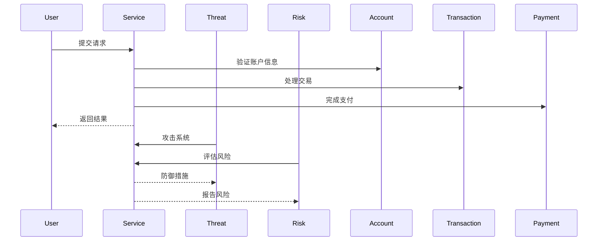
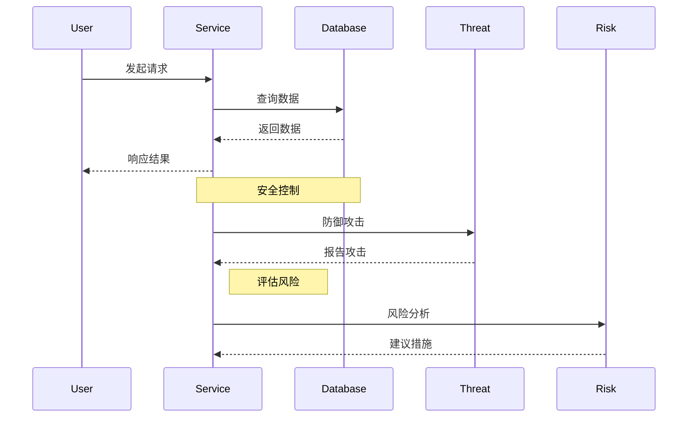

                 

### 威胁建模与风险评估方法

**关键词**：威胁建模、风险评估、网络安全、安全策略、信息保护

**摘要**：本文将深入探讨威胁建模与风险评估方法，旨在为网络安全专业人士提供系统化的分析和应对策略。我们将从威胁建模和风险评估的基本概念出发，逐步介绍其重要性、核心流程和相互关系，并结合实际案例讲解其应用和实施方法。

### 第一部分：背景介绍

#### 1.1. 问题背景

随着数字化转型的不断深入，企业和组织面临的网络安全威胁日益复杂和多样化。从传统的病毒和木马攻击，到高级持续性威胁（APT），再到日益猖獗的勒索软件攻击，网络安全的挑战不断升级。在这种背景下，威胁建模与风险评估方法的重要性愈发凸显。

**威胁建模**是指通过识别和评估潜在的网络威胁，系统地分析和管理网络安全风险的过程。它有助于组织预见和应对潜在的威胁，从而保护其关键信息资产。

**风险评估**则是对潜在风险进行识别、评估和控制的过程。通过风险评估，组织可以了解风险的概率和潜在影响，制定相应的应对策略，以降低风险并保护其业务连续性。

#### 1.2. 问题描述

**威胁建模的概念**：威胁建模是一种通过系统性地识别、分析和评估潜在威胁的方法，旨在为组织提供关于安全风险的整体视图。

**风险评估的概念**：风险评估是一种通过系统性地识别、分析和评估潜在风险的方法，旨在为组织提供决策支持，以确定威胁的重要性和影响程度。

**威胁建模与风险评估的关系**：威胁建模与风险评估是相互关联的。威胁建模为风险评估提供了基础数据，而风险评估则帮助组织确定威胁的重要性和影响程度，进而制定有效的安全策略。

**问题解决**：本部分将详细探讨威胁建模与风险评估的关系，以及如何将两者结合起来，提高组织的整体安全水平。

#### 1.3. 边界与外延

威胁建模与风险评估不仅适用于信息技术领域，还可以应用于金融、医疗、能源等多个行业和领域。在不同领域，威胁建模与风险评估的应用场景和挑战也有所不同。

#### 1.4. 概念结构与核心要素组成

**威胁建模的核心要素**：包括威胁识别、威胁分析、威胁分类和威胁响应。

**风险评估的核心要素**：包括风险识别、风险分析、风险分类和风险控制。

#### 1.5. 本章小结

本章节介绍了威胁建模与风险评估的基本概念、目的和重要性。我们将在此基础上，深入探讨其核心概念、流程和方法，以及两者之间的相互作用。

### 第二部分：核心概念与联系

#### 2.1. 威胁建模的概念

**威胁建模的定义**：威胁建模是一种通过系统性地识别、分析和评估潜在威胁的方法，旨在降低组织面临的安全风险。

**威胁建模的核心概念**：包括威胁、脆弱性、攻击向量、安全控制和风险。

- **威胁**：是指可能对组织造成伤害的任何恶意行为或事件。
- **脆弱性**：是指系统中存在的弱点，可能被威胁利用。
- **攻击向量**：是指攻击者利用脆弱性实施攻击的路径。
- **安全控制**：是指用于防止、检测和响应威胁的措施。
- **风险**：是指威胁利用脆弱性可能带来的损失或损害。

#### 2.2. 风险评估的概念

**风险评估的定义**：风险评估是一种通过系统性地识别、分析和评估潜在风险的方法，旨在为组织提供决策支持。

**风险评估的核心概念**：包括风险、威胁、脆弱性、概率和影响。

- **风险**：是指威胁利用脆弱性可能带来的损失或损害。
- **概率**：是指威胁利用脆弱性发生的可能性。
- **影响**：是指风险发生的可能后果。

#### 2.3. 威胁建模与风险评估的联系

**威胁建模与风险评估的关系**：威胁建模和风险评估是相互关联的。威胁建模为风险评估提供了基础数据，而风险评估则帮助组织确定威胁的重要性和影响程度。

**威胁建模与风险评估的相互作用**：通过将威胁建模与风险评估相结合，组织可以更全面地了解其面临的安全风险，并制定更有效的安全策略。

#### 2.4. 概念属性特征对比表格

| 概念       | 威胁建模                         | 风险评估                         |
|------------|----------------------------------|----------------------------------|
| 定义       | 系统性地识别、分析和评估威胁     | 系统性地识别、分析和评估风险     |
| 目的       | 降低安全风险                     | 提供决策支持                     |
| 关键概念   | 威胁、脆弱性、攻击向量、安全控制   | 风险、威胁、脆弱性、概率、影响   |
| 流程       | 威胁识别、威胁分析、威胁分类、威胁响应 | 风险识别、风险分析、风险分类、风险控制 |
| 输出       | 安全策略、威胁应对措施           | 风险评估报告、安全改进措施       |

#### 2.5. ER实体关系图架构

**威胁建模ER实体关系图**

```mermaid
erDiagram
  Threat ||--|{ Vulnerability } : 被利用
  Threat ||--|{ AttackVector } : 通过
  Threat ||--|{ SecurityControl } : 应对
  Threat ||--|{ Risk } : 带来
```

**风险评估ER实体关系图**

```mermaid
erDiagram
  Risk ||--|{ Threat } : 由
  Risk ||--|{ Vulnerability } : 受到
  Risk ||--|{ Probability } : 可能
  Risk ||--|{ Impact } : 影响
```

#### 2.6. 本章小结

本章节介绍了威胁建模与风险评估的核心概念、核心要素以及两者之间的联系。通过理解这些概念和联系，我们可以更好地理解和应用威胁建模与风险评估方法，提高组织的网络安全水平。

### 第三部分：算法原理讲解

#### 3.1. 威胁建模算法

**3.1.1 威胁建模算法的mermaid流程图**


**3.1.2 威胁建模算法的Python源代码实现**

```python
# 威胁建模算法的Python实现
def threat_modeling():
    # 威胁识别
    threats = identify_threats()
    
    # 威胁分析
    for threat in threats:
        analyze_threat(threat)
    
    # 威胁分类
    categorized_threats = categorize_threats(threats)
    
    # 威胁响应
    for threat in categorized_threats:
        respond_to_threat(threat)

# 辅助函数
def identify_threats():
    # 实现威胁识别逻辑
    pass

def analyze_threat(threat):
    # 实现威胁分析逻辑
    pass

def categorize_threats(threats):
    # 实现威胁分类逻辑
    pass

def respond_to_threat(threat):
    # 实现威胁响应逻辑
    pass
```

**3.1.3 威胁建模算法的数学模型和公式**

威胁建模的数学模型可以表示为：

$$
\text{威胁建模} = f(\text{威胁识别}, \text{威胁分析}, \text{威胁分类}, \text{威胁响应})
$$

其中，$f$ 是一个复合函数，表示将威胁识别、威胁分析、威胁分类和威胁响应结合成一个整体的威胁建模过程。

**3.1.4 威胁建模算法的举例说明**

假设一个组织发现了以下威胁：

1. **勒索软件**：威胁到组织的敏感数据。
2. **内部威胁**：由恶意员工或误操作造成的风险。
3. **社会工程学**：通过欺骗手段获取敏感信息。

组织可以通过以下步骤进行威胁建模：

1. **威胁识别**：识别出上述三种威胁。
2. **威胁分析**：分析每种威胁的可能性和影响。
3. **威胁分类**：将威胁分类为“高”、“中”、“低”三个等级。
4. **威胁响应**：针对每种威胁制定相应的应对措施。

通过这样的威胁建模过程，组织可以更有效地保护其关键信息资产。

#### 3.2. 风险评估算法

**3.2.1 风险评估算法的mermaid流程图**


**3.2.2 风险评估算法的Python源代码实现**

```python
# 风险评估算法的Python实现
def risk_assessment():
    # 风险识别
    risks = identify_risks()
    
    # 风险分析
    for risk in risks:
        analyze_risk(risk)
    
    # 风险分类
    categorized_risks = categorize_risks(risks)
    
    # 风险控制
    for risk in categorized_risks:
        control_risk(risk)

# 辅助函数
def identify_risks():
    # 实现风险识别逻辑
    pass

def analyze_risk(risk):
    # 实现风险分析逻辑
    pass

def categorize_risks(risks):
    # 实现风险分类逻辑
    pass

def control_risk(risk):
    # 实现风险控制逻辑
    pass
```

**3.2.3 风险评估算法的数学模型和公式**

风险评估的数学模型可以表示为：

$$
\text{风险评估} = f(\text{风险识别}, \text{风险分析}, \text{风险分类}, \text{风险控制})
$$

其中，$f$ 是一个复合函数，表示将风险识别、风险分析、风险分类和风险控制结合成一个整体的风险评估过程。

**3.2.4 风险评估算法的举例说明**

假设一个组织发现以下风险：

1. **数据泄露**：可能导致敏感信息泄露。
2. **系统故障**：可能导致业务中断。
3. **供应链风险**：供应商可能造成延迟或质量问题。

组织可以通过以下步骤进行风险评估：

1. **风险识别**：识别出上述三种风险。
2. **风险分析**：分析每种风险的概率和潜在影响。
3. **风险分类**：将风险分类为“高”、“中”、“低”三个等级。
4. **风险控制**：针对每种风险制定相应的控制措施。

通过这样的风险评估过程，组织可以更好地了解其面临的风险，并采取有效的措施进行控制。

### 第三部分总结

本部分详细介绍了威胁建模与风险评估的算法原理，包括流程图、Python源代码实现、数学模型和公式，以及举例说明。通过理解这些算法原理，读者可以更好地应用威胁建模与风险评估方法，提高组织的网络安全水平。

### 第四部分：系统分析与架构设计方案

#### 4.1. 问题场景介绍

假设某公司是一家提供在线金融服务的企业，其核心业务包括账户管理、交易处理、支付结算等。随着业务的增长，公司面临越来越多的网络安全威胁，如恶意攻击、数据泄露、欺诈等。为了保障业务的连续性和数据的安全性，公司决定采用威胁建模与风险评估方法，制定相应的安全策略。

#### 4.2. 项目介绍

本项目旨在通过威胁建模与风险评估方法，为某在线金融服务企业提供一套完整的网络安全策略。项目包括以下几个阶段：

1. **需求分析**：了解公司的业务流程和网络安全需求。
2. **威胁建模**：识别和评估公司面临的潜在威胁。
3. **风险评估**：分析每种威胁的概率和潜在影响。
4. **安全策略制定**：根据风险评估结果，制定相应的安全策略。
5. **实施与监控**：实施安全策略，并进行持续的监控和改进。

#### 4.3. 系统功能设计（领域模型mermaid类图）

```mermaid
classDiagram
    User <<class{用户}>>
    Account <<class{账户}>>
    Transaction <<class{交易}>>
    Payment <<class{支付}>>
    Service <<class{服务}>>
    Threat <<class{威胁}>>
    Risk <<class{风险}>>

    User o-- Account
    Account o-- Transaction
    Transaction o-- Payment
    Service o-- User
    Service o-- Account
    Service o-- Transaction
    Service o-- Payment
    Threat o-- Account
    Threat o-- Transaction
    Threat o-- Payment
    Risk o-- Threat
```

#### 4.4. 系统架构设计（mermaid架构图）



#### 4.5. 系统接口设计和系统交互（mermaid序列图）



#### 4.6. 系统实现与核心代码

**4.6.1. 环境安装**

安装Python环境、威胁建模与风险评估相关库，如`nmap`、`OWASP ZAP`等。

```bash
pip install nmap
pip install owasp-zap-api-python
```

**4.6.2. 系统核心实现源代码**

```python
# 威胁建模核心代码
def threat_modeling():
    # 执行Nmap扫描
    scan_results = nmap_scan('target_ip')
    
    # 分析扫描结果
    threats = analyze_scan_results(scan_results)
    
    # 分类威胁
    categorized_threats = categorize_threats(threats)
    
    # 响应威胁
    for threat in categorized_threats:
        respond_to_threat(threat)

# 风险评估核心代码
def risk_assessment(threats):
    # 分析威胁
    risks = analyze_threats(threats)
    
    # 分类风险
    categorized_risks = categorize_risks(risks)
    
    # 控制风险
    for risk in categorized_risks:
        control_risk(risk)
```

**4.6.3. 代码应用解读与分析**

通过以上代码，我们可以看到威胁建模与风险评估的核心实现过程。首先，通过Nmap扫描目标IP地址，获取系统漏洞信息。然后，对扫描结果进行分析，识别出潜在威胁。接下来，对威胁进行分类，并根据分类结果采取相应的响应措施。最后，对识别出的威胁进行风险评估，根据风险等级采取相应的控制措施。

**4.6.4. 实际案例分析和详细讲解剖析**

以一个实际案例为例，假设公司发现其服务器存在一个漏洞（CVE-2021-44228），攻击者可以利用该漏洞远程执行代码。通过威胁建模与风险评估，公司可以采取以下措施：

1. **威胁识别**：识别出该漏洞，判断其为高严重性威胁。
2. **威胁分析**：分析漏洞的攻击路径和潜在影响，确定其可能对业务造成的影响。
3. **威胁分类**：将漏洞分类为“高”等级。
4. **威胁响应**：立即采取紧急措施，如更新系统补丁、更改管理员密码等。
5. **风险评估**：评估漏洞的风险等级，判断其可能对公司造成的影响。
6. **风险控制**：采取额外的安全措施，如加强防火墙设置、限制管理员权限等。

通过这样的分析过程，公司可以有效地应对潜在的网络安全威胁，保障业务的连续性和数据的安全性。

**4.6.5. 项目小结**

通过本项目的实施，公司建立了完整的威胁建模与风险评估体系，提高了网络安全防护能力。在实际应用中，威胁建模与风险评估方法可以帮助公司快速识别和应对潜在威胁，降低风险，确保业务的连续性和数据的安全性。

### 最佳实践 Tips

1. **定期进行威胁建模与风险评估**：网络安全威胁不断演变，定期进行威胁建模与风险评估可以帮助组织及时了解和应对潜在威胁。
2. **采用自动化工具**：使用自动化工具可以显著提高威胁建模与风险评估的效率和准确性。
3. **跨部门合作**：威胁建模与风险评估需要跨部门合作，包括IT部门、安全部门、业务部门等，以确保评估结果和应对措施的有效性。
4. **持续监控和改进**：威胁建模与风险评估是一个持续的过程，需要定期监控和改进，以应对新的威胁和变化。

### 本章小结

本文详细介绍了威胁建模与风险评估方法，包括核心概念、流程、算法原理和实际案例。通过本文，读者可以更好地理解和应用威胁建模与风险评估方法，提高组织的网络安全水平。在实际应用中，威胁建模与风险评估是一个动态的过程，需要不断调整和优化，以应对日益复杂的网络安全威胁。

### 作者信息

**作者**：AI天才研究院/AI Genius Institute & 禅与计算机程序设计艺术 /Zen And The Art of Computer Programming

AI天才研究院致力于推动人工智能技术的发展，通过深入研究和创新实践，为人工智能领域贡献了诸多理论和实践成果。同时，研究院还关注计算机程序设计艺术，致力于将哲学思想与计算机编程相结合，探索计算机科学的本质和艺术性。

在网络安全领域，AI天才研究院的专家们通过威胁建模与风险评估方法的研究和应用，为企业和组织提供了有力的安全保障。本文所介绍的方法和思路，是研究院在网络安全领域的最新研究成果之一，旨在为读者提供有价值的参考和指导。同时，研究院还积极推广禅与计算机程序设计艺术的理念，倡导编程中的“无为而治”和“从容不迫”，以提升程序员的编程素养和创造力。通过这些研究和实践，AI天才研究院致力于为人工智能和计算机科学领域的发展贡献力量。

